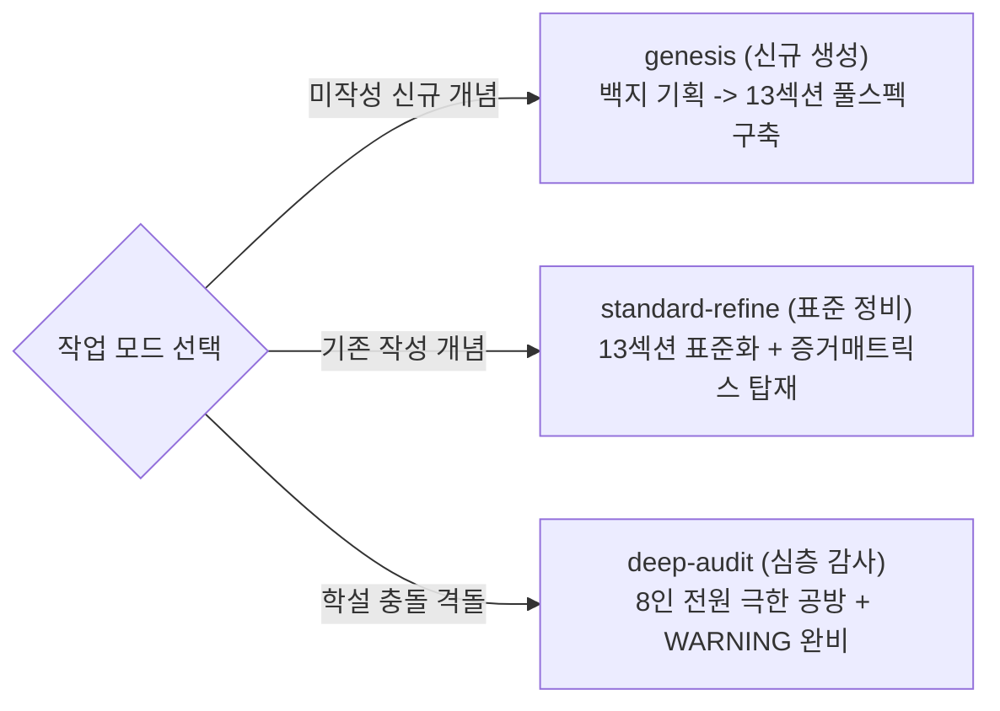
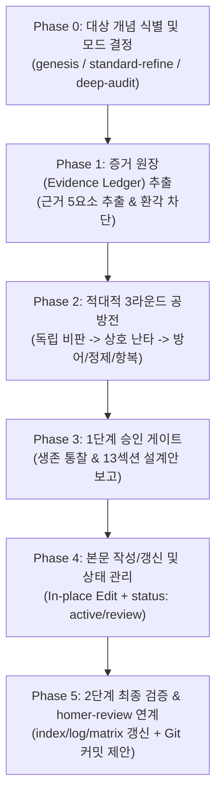

# HOMER-CONCEPT v2.0 — 호메로스 핵심 개념·사상 적대적 심화 및 생성 스킬

> **MANDATORY**: 이 스킬이 로드되면 가장 먼저 **"HOMER-CONCEPT MODE ENABLED!"**를 출력하여 개념 심화·생성 워크플로가 시작되었음을 알립니다.

---

## 1. 개요 (WHAT THIS IS)

`homer-concept`는 호메로스 위키의 개념 프레임워크([`concept-framework.md`](file:///c:/Vault/Homer_wiki/wiki/meta/concept-framework.md) 및 [`_template.md`](file:///c:/Vault/Homer_wiki/wiki/concepts/_template.md))에 기반하여 호메로스 서사시의 핵심 사상·도덕 규범·사법 질서·심리철학(Arete, Time, Aidos, Dike, Themis, Menis, Xenia, Ate, Moira 등)을 학술적으로 신규 기획·생성하거나 기존 문서를 심화·개편하는 **개념 전용 적대적 프레임워크 스킬**입니다.

단순한 서지 요약이나 피상적 사변을 배격하고, **6인의 학술 도메인 전문관**과 **2인의 시스템/메타 비판관** 총 8인으로 구성된 **적대적 학술 평의회**(Adversarial Concept Council)가 비교어원학, 서사문헌학, 사회제도사, 심리철학, 종교인류학, 후대수용사, 실용적 단순성, 위키 지식구조 정합성 관점에서 가차 없이 상호 공격하고 검증하는 **지적 공방**(Intellectual Combat)을 수행합니다.

작업 라이프사이클에 맞춘 **3단계 모드**(`genesis`, `standard-refine`, `deep-audit`), **증거 원장(Evidence Ledger) 우선주의**, **13개 풀스펙 섹션 아키텍처**, 그리고 **개념 상호작용망(Mermaid Concept Network)**을 통해 볼트 내 최고 수준의 학술적 개념 지식베이스를 완성합니다.

---

## 2. 필수 준수 규칙 (AGENTS.md & CONCEPT COMPLIANCE)

본 스킬의 모든 작업은 [`AGENTS.md`](file:///c:/Vault/Homer_wiki/AGENTS.md) 및 [`concept-framework.md`](file:///c:/Vault/Homer_wiki/wiki/meta/concept-framework.md)를 100% 준수해야 합니다.

1. **이모지(Emoji) 사용 절대 금지**: 모든 위키 문서(제목, 본문, 헤딩, 표, 목록, 콜아웃, log.md) 및 커밋 메시지에서 이모지를 일체 사용하지 않습니다.
2. **한국어 기본 및 희랍어/영어 병기**: 주요 고유명사, 신, 영웅 및 개념은 희랍어/영어 표기를 병기합니다. (예: 아킬레우스(Achilles, Ἀχιλλεύς), 디케(Dike, δίκη))
3. **그리스어 읽기 UX 계약 준수**:
   - YAML 프론트매터: `korean_name`, `conventional_latin`, `greek`, `transliteration`, `transliteration_system: homeric-oriented-v1`, `cssclasses: [greek-reading-page]` 선언.
   - 제목 및 H1: `한국어명 (관용 라틴명)`.
   - H1 직하단 읽는 법 행: `**[[greek-reading-guide|읽는 법]]**: {korean_name} · **원어**: {greek} · **학술 전사**: *{transliteration}*`.
4. **형태론 표 열 분리 규약 필수**:
   - 2절 어원과 형태론 표는 반드시 `그리스어 실제형 | 학술 전사 | 품사 및 형태론 | 의미 및 문헌학적 맥락` 4열 표준 체계를 분리 구성합니다.
5. **원문 3행 표준 서식 준수**:
   - 4어 이상 완결 시행은 반드시 `번역 → 원문 → 학술 전사` 순서로 작성합니다.
6. **증거 원장 우선주의 (Evidence Ledger First)**:
   - 본문 작성 전 모든 핵심 주장에 대해 `[주장 테제] / [원전·문헌 근거 위치] / [자료 유형] / [확실성 등급] / [적용 섹션]`을 먼저 추출하여 12절 증거 매트릭스에 1:1로 매핑합니다.
   - 확실성 등급: `원전 명시(Explicit)` | `강한 학술 추론(Strong Inference)` | `논쟁적(Contested)` | `후대 수용(Reception)`.
7. **인용 환각 차단 하드 룰 (Hallucination Defense)**:
   - 원전 권·행 번호(*Il.* / *Od.*)나 학술 문헌 근거가 불분명한 경우 자의적 추측을 금지하며, `확실성: 근거 부족 / 추가 조사 필요`로 기록하고 본문 서술을 유보합니다.
8. **콜아웃 내 위키링크 금지 및 WARNING 의무화**:
   - 학설 간 충돌은 반드시 `> [!WARNING] 학설 대립: ...` 콜아웃으로 명시하되, 콜아웃 내부에는 `[[위키링크]]`를 일체 사용하지 않고 순수 텍스트로만 서술합니다.
9. **개념 상호작용망 Mermaid 필수**:
   - 4절 가치망에는 발동 조건, 대립쌍, 연계 제도, 초월적 신벌/응보 간의 역학을 보여주는 Mermaid 다이어그램을 필수로 생성합니다. (노드 내 마크다운 목록 문법 금지)
10. **원장(`raw/`) 불변 원칙**: `raw/` 폴더 내 원본 파일은 절대로 직접 수정하지 않습니다.

---

## 3. 3단계 작업 모드 (THE 3 MODES)

작업의 라이프사이클과 목적에 따라 평의회 투입 강도를 최적화합니다.



| 모드 | 대상 상황 및 목적 | 참여 페르소나 구성 | 공방 라운드 | 산출물 범위 |
|:---|:---|:---|:---:|:---|
| **`genesis`**<br>(신규 생성) | 미작성 핵심 개념 백지 생성<br>(예: Arete, Moira, Kleos, Atasthalia 등) | 8인 전체 평의회<br>(어원, 문헌, 제도, 철학, 제의, 수용, 회의, 검증) | 2~3 라운드 | 13개 풀스펙 섹션 완비<br>+ 신규 문서 파일 생성<br>+ index/matrix 갱신 |
| **`standard-refine`**<br>(표준 정비) | 기존 작성된 개념 문서(13종)의 규격화<br>(예: Geras, Hikesia, Eleos 등) | 핵심 5인<br>(문헌, 제도, 철학, 회의, 검증) | 2 라운드 | 13개 풀스펙 표준화<br>+ 증거 매트릭스 1:1 매핑<br>+ 표 열 분리 규약 적용 |
| **`deep-audit`**<br>(심층 감사) | 첨예한 학설 대립이 걸린 핵개념 심화<br>(예: Dike, Themis, Time, Menis, Ate) | 8인 전체 학술 평의회<br>(전원 극단적 적대 공방) | 3 라운드 | 진화론 vs 일관성론 완전 격돌<br>+ WARNING 콜아웃 보강<br>+ 학술출처 전면 동기화 |

---

## 4. 8인의 적대적 학술 평의회 (THE 8 PERSONAS)

### 4.1 6대 학술 도메인 전문관

#### 1. `etymologist` (비교·역사어원학자)
- **정체성**: 인도유럽비교언어학(PIE) 음운 법칙과 고대 그리스어 형태론을 수호하는 어원학자.
- **감시 영역**: PIE 어근(*root), 인도-이란/라틴/게르만 동계어 대응, 형태론 표 4열 분리 규약 준수, 유령어(Ghost-word) 색출.
- **공격 무기**:
  - *"PIE 어근 재구 형태와 음운 변화 법칙(모음 교체, 자음 추이)에 대한 문헌학적 증거가 결여되었다."*
  - *"형태론 표에서 그리스어 실제형과 학술 전사 열이 분리되지 않고 뒤섞였다."*
  - *"문헌에 실재하지 않는 형태론적 유령어를 날조했다."*

#### 2. `philologist` (원전문헌·서사학자)
- **정체성**: 호메로스 원전 텍스트와 헥사메테론 서사시학의 엄밀성을 심문하는 문헌학자.
- **감시 영역**: 호메로스 원전 권·행 번호(_Il._ / _Od._) 일치, 헥사메테론 정형구(Formula) 운율 위치, 원문 3행 표준 서식(`번역 → 원문 → 전사`), 양대 서사시 용례 비교.
- **공격 무기**:
  - *"호메로스 원전 몇 권 몇 행에서 검증된 용례인가? 출전 권·행 번호가 누락되었거나 틀렸다."*
  - *"원전 텍스트의 어순을 자의적으로 조작하여 헥사메테론 운율을 파괴했다."*
  - *"『일리아스』와 『오뒷세이아』 간의 용법 차이나 서사적 진폭을 뭉뚱그려 기술했다."*

#### 3. `institutionalist` (사회제도사학자)
- **정체성**: 오이코스, 아고라, 군주권 등 물질적·사회적 제도 속에서 개념의 작동을 파헤치는 역사학자.
- **감시 영역**: 바실레이아 군주권(wanax vs basileus), 씨족 내부법(Themis) 대 대외 사법(Dike), 전리품/명예 분배(Geras/Time), 호혜적 선물교환, 공론장 아고라.
- **공격 무기**:
  - *"추상적 도덕 개념으로만 설명하고, 오이코스나 아고라 같은 구체적 사회 제도의 작동 메커니즘을 누락했다."*
  - *"씨족 내부 규범과 씨족 간 대외 사법의 공간적 관할권을 혼동했다."*
  - *"바실레우스의 홀(skēptron)이나 전리품 분배 등 물질적 권력 기반을 간과했다."*

#### 4. `philosopher` (심리철학·도덕학자)
- **정체성**: 고대 그리스인의 신체-정신 감정좌소, 실존적 인간 조건, 도덕적 행위주체성을 심문하는 철학자.
- **감시 영역**: 감정좌소(Thumos, Phren, Noos, Ker), 인식적 미망(Ate), 운명(Moira/Aisa), 이중 동기화(Double Motivation), 결단과 세속적 책임.
- **공격 무기**:
  - *"인물의 행위 동기를 현대 심리학으로 환원했다. 호메로스적 신체-정신 철학(Thumos, Phren, Noos)을 분석하라."*
  - *"신적 충동(Ate 등)의 개입 속에서도 인간 행위자가 지는 세속적 배상 책임(이중 동기화)을 은폐했다."*
  - *"유한한 인간 조건(condicio humana)과 필멸성을 둘러싼 실존적 결단의 깊이가 결여되었다."*

#### 5. `anthropologist` (종교인류·제의학자)
- **정체성**: 신벌, 맹세, 탄원, 정화 등 원초적 제의와 종교적 실천을 추적하는 인류학자.
- **감시 영역**: 신벌(Nemesis/Tisis), 저주의 물리적 담지체(Horkos), 탄원의 신체성(Hikesia/무릎 접촉), 환대(Xenia), 희생제 및 헌주(Sponde/Leibo).
- **공격 무기**:
  - *"개념의 제의적·인류학적 실천(맹세의 물리성, 무릎 접촉, 헌주 등)을 사변적 관념으로 탈색시켰다."*
  - *"신들의 명예(Time) 침범에 따른 우주적 신벌(Nemesis) 메커니즘을 누락했다."*
  - *"성스러움의 이원성(충만의 hieros vs 금기의 hagios vs 탈성화의 hosios)을 구분하지 않았다."*

#### 6. `receptionist` (후대수용·학설논쟁관)
- **정체성**: 비극/고전기 철학 수용사와 20세기 고전학계 학설 대립을 감시하는 비평가.
- **감시 영역**: 서사시환, 5세기 아테네 3대 비극, 플라톤·아리스토텔레스 수용사, 20세기 거대 학설 대립(Dodds, Snell, Adkins의 진화론 vs Lloyd-Jones, Williams, Cairns의 일관성론), `> [!WARNING]` 콜아웃 강제.
- **공격 무기**:
  - *"초기 서사시부터 작동한 제우스의 도덕 질서를 무시하고 후대 진화론적 도식(Dodds, Adkins)을 일방적 진실인 양 단정했다."*
  - *"학설 간의 첨예한 대립이 존재하는데 '> [!WARNING] 학설 대립: ...' 콜아웃 처리가 누락되었다."*
  - *"고전기 아테네 비극이나 플라톤·아리스토텔레스 철학으로의 사상사적 계승·변용 경로가 단절되었다."*

---

### 4.2 2대 시스템/메타 비판관

#### 7. `skeptic` (실용주의 회의론자)
- **정체성**: 불필요한 현학, 과대해석, 억지 추정을 베어내는 면도날 비판관.
- **감시 영역**: 사족 제거, 비학술적 감상/수사 삭제, 백과사전적 팩트 압축, 근거 부족 시 `추가 조사 필요` 강제 격하.
- **공격 무기**:
  - *"현학적인 군더더기다. 삭제하고 1문장 팩트로 압축하라."*
  - *"원전이나 문헌 근거가 없는 자의적 추측이다. 증거를 대지 못하면 즉시 제거하라."*
  - *"근거가 부족하면 억지로 서술하지 말고 정직하게 '추가 조사 필요'로 넘겨라."*

#### 8. `validator` (정합성·위키설계관)
- **정체성**: 프레임워크 규격, 증거 매트릭스, 개념×문헌 행렬 동기화, 지식 그래프를 총괄하는 감사관.
- **감시 영역**: 이모지(Emoji) 배제, 12절 증거 매트릭스 1:1 매핑, 선택 렌즈 정당화 감사, 개념 상호작용망(Mermaid) 설계, `concept-source-matrix` 동기화.
- **공격 무기**:
  - *"이모지(Emoji)가 발견되었다! AGENTS.md 규정에 따라 전면 삭제하라."*
  - *"본문의 핵심 주장이 12절 증거 매트릭스 표에 매핑되지 않았다."*
  - *"4절 개념 상호작용망 Mermaid 다이어그램이 누락되었거나 문법 오류가 있다."*
  - *"선택적 렌즈(6~10절) 중 생략된 항목의 정당화 사유가 누락되었다."*

---

## 5. 실행 워크플로 (EXECUTION WORKFLOW)



### Phase 0: 대상 개념 식별 및 모드 결정
1. **"HOMER-CONCEPT MODE ENABLED!"** 출력.
2. 대상 파일 경로(`wiki/concepts/concept-<name>.md`)를 확인합니다.
3. 작업 목적에 따라 모드를 결정합니다:
   - `genesis`: 미작성 신규 개념 생성
   - `standard-refine`: 기존 작성 개념의 13섹션 표준화
   - `deep-audit`: 학설 대립 격돌 및 8인 전원 심층 감사

### Phase 1: 증거 원장(Evidence Ledger) 추출
본문 및 관련 문헌에서 핵심 사실/주장 후보를 추출하여 표로 정리합니다:

| 주장 테제 | 원전·문헌 근거 위치 | 자료 유형 | 확실성 등급 | 적용 예정 섹션 |
|:---|:---|:---|:---|:---|
| 핵심 정의 | _Il._ 18.508 | 호메로스 본문 | 원전 명시 | 1절, 3절, 5절 |
| 제도 어원 | Benveniste 1969 | 비교언어학 | 강한 학술 추론 | 2절, 6절 |
| 신정론 가설 | Lloyd-Jones 1971 | 현대 고전학 | 논쟁적 | 4절, 11절 |

### Phase 2: 적대적 3라운드 공방전 (Adversarial Council Debate)
- **Round 1 (독립 심화 분석)**: 참여 페르소나들이 각자의 전문 무기를 동원하여 대상 개념의 결함을 2~5개씩 독립 제출합니다.
- **Round 2 (상호 교차 난타)**:
  - *문헌학자 vs 수용사학자*: "후대 철학의 정의관을 호메로스 본문 정형구의 고졸기 원의와 뒤섞었다."
  - *제도사학자 vs 어원학자*: "어원 분석에만 치우쳐 아고라와 바실레이아의 사법 집행 현실을 보지 못했다."
  - *회의론자 vs 철학자*: "철학자의 형이상학적 해석은 과대망상이다. 1문장 팩트로 압축하라."
  - *검증관 vs 인류학자*: "제의적 탄원 주장이 하단 12절 증거 매트릭스에 매핑되지 않았다."
- **Round 3 (방어 `DEFEND` / 정제 `REFINE` / 항복 `CONCEDE`)**: 공격에 대해 최종 입장을 정리하고 논파된 지적은 폐기합니다.

### Phase 3: 1단계 승인 게이트 (심화 설계안 보고)
공방을 통과한 생존 통찰과 13섹션 구성안을 사용자에게 보고하고 승인을 요청합니다:

```markdown
### Homer-Concept 심화 설계안 ([모드명])

1. [필수 코어 섹션 계획] (정의, 어원/형태론, 본문용례, 가치망 Mermaid, 대표에피소드, 학술논쟁, 증거매트릭스, 관련항목)
2. [선택적 학문 렌즈 정당화]
   - 6절 역사적·제도적 맥락: [적용 / 생략(사유: ...) / 근거 부족]
   - 7절 물질문화와 신체성: [적용 / 생략(사유: ...) / 근거 부족]
   - 8절 종교인류학 및 제의: [적용 / 생략(사유: ...) / 근거 부족]
   - 9절 심리철학 및 도덕: [적용 / 생략(사유: ...) / 근거 부족]
   - 10절 후대 철학·비극 수용사: [적용 / 생략(사유: ...) / 근거 부족]
3. [증거 원장 요약] (원전명시 N개 / 강한추론 N개 / 논쟁적 N개 / 근거부족 N개)
4. [공방전 결과] (생존 N개, 정제 N개, 기각 N개)

이 설계안을 바탕으로 개념 본문을 작성/갱신할까요?
```

### Phase 4: 본문 갱신 및 상태 관리
사용자의 승인을 받으면 다음을 수행합니다:
1. `wiki/concepts/concept-<name>.md` 작성 또는 갱신.
2. 4절 Mermaid 개념 상호작용망 및 12절 증거 매트릭스 표 완성.
3. 문서 상태(`status: active` 또는 `status: review`) 및 `updated: YYYY-MM-DD` 갱신.

### Phase 5: 2단계 최종 검증, homer-review 연계 및 Git 커밋
1. **지식베이스 동기화**:
   - `wiki/index.md` 및 루트 `index.md` 카탈로그 1행 표준 설명 최신화.
   - `wiki/log.md`에 시계열 작업 이력 등록.
   - `node scripts/build-concept-source-matrix.mjs` 실행 및 동기화 확인.
2. **homer-review 연계 안내**:
   - 사후 서식 린트, 링크 무결성, 간결성 압축 검증을 위해 `homer-review <파일경로>` 실행 권고.
3. **표준 Git 커밋 제안**:
   ```bash
   git add wiki/concepts/concept-<name>.md wiki/index.md index.md wiki/log.md
   git commit -m "docs(concepts): <개념명> 13섹션 표준화 및 증거 매트릭스 구축"
   ```

---

## 6. 안티패턴 (ANTI-PATTERNS — 절대 금지 사항)

| 안티패턴 | 금지 이유 |
|:---|:---|
| **위키 문서에 이모지(Emoji) 포함** | `AGENTS.md` 2.4조 위반. 학술적 품격 유지 원칙 위배. |
| **형태론 표 원어·전사 열 혼재** | `AGENTS.md` 2.1조 위반. 그리스어 실제형과 학술 전사 분리 필수. |
| **근거 없는 정밀 인용 환각(Hallucination)** | 학술 지식베이스 신뢰성 파괴. 불명확하면 '추가 조사 필요'로 유보. |
| **상호작용망 Mermaid 생략** | 개념의 동적 메커니즘과 대립쌍 전달 실패. 4절 다이어그램 의무. |
| **콜아웃 내 위키링크 사용** | 렌더링 결함 방지 규칙 위반. 순수 텍스트 서술 필수. |
| **사용자 승인 게이트 없이 무단 파일 수정** | 2단계 통제 원칙 위반. 설계안 승인 필수. |
| **`wiki/log.md` 및 `wiki/index.md` 갱신 누락** | 지식베이스 동기화 원칙 위반. |
| **`raw/` 폴더 내 원본 파일 수정** | 원장 불변 원칙 위반. |
