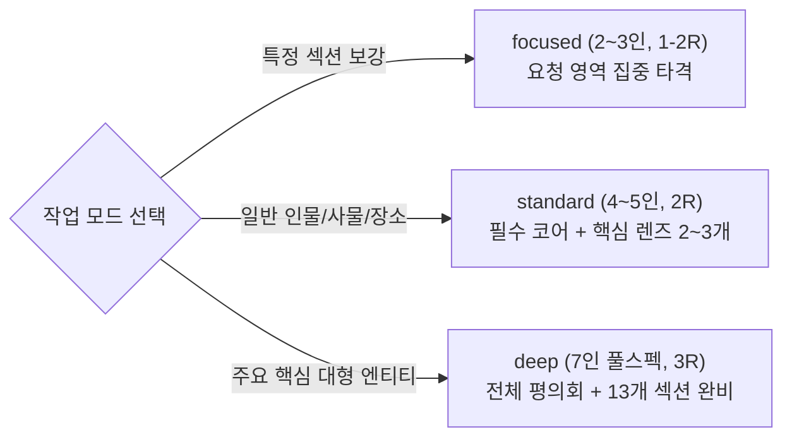
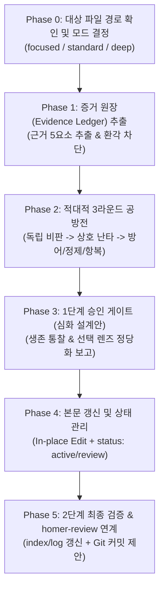

# HOMER-ENTITY v2.0 — 호메로스 엔티티 문서 적대적 심화 스킬

> **MANDATORY**: 이 스킬이 로드되면 가장 먼저 **"HOMER-ENTITY MODE ENABLED!"**를 출력하여 엔티티 심화 워크플로가 시작되었음을 알립니다.

---

## 1. 개요 (WHAT THIS IS)

`homer-entity`는 호메로스 위키의 엔티티 프레임워크([`entity-framework.md`](file:///c:/Vault/Homer_wiki/wiki/meta/entity-framework.md) 및 [`_template.md`](file:///c:/Vault/Homer_wiki/wiki/entities/_template.md))에 기반하여 엔티티 문서를 학술적으로 심화·확장하는 **엔티티 전용 심화 스킬**입니다.

단순한 합의나 무분별한 텍스트 확장이 아니라, **4인의 학술 도메인 전문가**와 **3인의 시스템/메타 비판관** 총 7인이 엔티티 문서를 문헌학, 역사고고학, 도덕심리학, 후대 수용사, 실용적 단순성, 지식구조 정합성 관점에서 가차 없이 공격하고 상호 검증하는 **지적 공방**(Intellectual Combat)을 수행합니다.

엔티티의 중요도와 작업 목적에 맞춘 **3단계 모드**(`focused`, `standard`, `deep`)와 **증거 원장(Evidence Ledger) 우선주의**, 그리고 **인용 환각 차단 장치**를 통해 군더더기 없는 최고 수준의 학술 엔티티 문서를 완성합니다.

---

## 2. 필수 준수 규칙 (AGENTS.md & FRAMEWORK COMPLIANCE)

본 스킬의 모든 작업은 [`AGENTS.md`](file:///c:/Vault/Homer_wiki/AGENTS.md) 및 [`entity-framework.md`](file:///c:/Vault/Homer_wiki/wiki/meta/entity-framework.md)를 100% 준수해야 합니다.

1. **이모지(Emoji) 사용 절대 금지**: 모든 위키 문서(제목, 본문, 헤딩, 표, 목록, 콜아웃, log.md) 및 커밋 메시지에서 이모지를 일체 사용하지 않습니다.
2. **한국어 기본 및 희랍어/영어 병기**: 주요 고유명사, 신, 영웅 및 개념은 희랍어/영어 표기를 병기합니다. (예: 아킬레우스(Achilles, Ἀχιλλεύς), 티메(Timê, τιμή))
3. **필수 코어 vs 선택적 학문 렌즈 분리**:
   - **필수 코어**: 1절(정의), 2절(문헌학), 3절(서사 행적), 4절(관계망), 5절(유형별 상세), 12절(증거 매트릭스), 13절(관련 항목).
   - **선택적 렌즈** (6~11절): 대상 엔티티 성격에 따라 `[적용 (Applied)]`, `[생략 (Omitted, 사유 명시)]`, `[근거 부족 (Pending Research)]` 중 하나로 명확히 판정·정당화합니다.
4. **증거 원장 우선주의** (Evidence Ledger First):
   - 본문 작성 전 모든 핵심 주장에 대해 `[주장] / [원전·문헌 근거 위치] / [자료 유형] / [확실성 등급] / [적용 섹션]`을 먼저 추출합니다.
   - 확실성 등급: `원전 명시(Explicit)` | `강한 학술 추론(Strong Inference)` | `논쟁적(Contested)` | `후대 수용(Reception)`.
5. **인용 환각 차단 하드 룰** (Hallucination Defense):
   - 원전 권·행 번호나 고고학적 유물 근거가 불분명한 경우 절대로 추측하여 작성하지 않으며, `확실성: 근거 부족 / 추가 조사 필요`로 기록하고 본문 서술을 유보합니다.
6. **프론트매터 메타데이터 계약**:
   - YAML 프론트매터 `sources:`에는 관련 `raw/` 원본 문헌 파일명을 기재합니다.
   - `entity_type:`은 `person | deity | place | group | object | creature` 중 하나를 필수 기재합니다.
   - `corpus:`는 `[iliad]`, `[odyssey]`, `[iliad, odyssey]` 중 하나를 필수 기재합니다.
   - 위키 내부 소스 문서는 12절 증거 매트릭스 및 13절 관련 항목에 `[[...]]` 링크로 표기합니다.
7. **원장(`raw/`) 불변 원칙**: `raw/` 폴더 내 원본 파일은 절대로 직접 수정하지 않습니다.
8. **콜아웃 및 인용 블록(`>`) 내 위키링크 금지**: `> [!NOTE]`, `> [!WARNING]` 등 콜아웃 및 인용 블록 내부에는 `[[위키링크]]`를 사용하지 않고 순수 텍스트로만 서술합니다.
9. **원문 인용구 콜아웃 적용 금지**: 호메로스 원문 구절 및 연구 문헌 인용구는 `>` 인용 블록 대신 목록 항목(`- "..."`, `- *"..."*`) 또는 일반 따옴표/기울임꼴 단락으로 서술합니다.


---

## 3. 3단계 작업 모드 (THE 3 MODES)

엔티티의 성격과 작업 목적에 따라 평의회 규모와 공방 강도를 최적화합니다.



| 모드 | 대상 엔티티 예시 | 참여 페르소나 구성 | 공방 라운드 | 대상 섹션 범위 |
|:---|:---|:---|:---:|:---|
| **`focused`**<br>(부분 집중) | 특정 섹션 보강 요청 시<br>(예: 6~9절 역사/철학·윤리학 집중 심화) | 요청 영역 전문관 (2~3인)<br>+ `validator` (검증관) | 1~2 라운드 | 사용자가 지정한 특정 섹션 |
| **`standard`**<br>(표준 엔티티) | 조연 인물, 장소, 사물, 집단, 생물/괴물<br>(예: 파트로클로스, 뤼카온, 이타케, 아이기스, 스킬라) | 엔티티 유형별 특화 3인<br>+ `validator`, `skeptic` (총 4~5인) | 2 라운드 | 필수 코어 (1~5, 12, 13절)<br>+ 정당화된 렌즈 2~3개 |
| **`deep`**<br>(핵심 대형 엔티티) | 주요 서사 주인공, 최고신, 대형 도시<br>(예: 아킬레우스, 오디세우스, 헥토르, 제우스, 트로이아) | 7인 전체 학술 평의회<br>(문헌, 고고학, 철학, 수용사, 회의, 검증, 설계) | 3 라운드 | 13개 풀스펙 섹션 완비<br>(선택 렌즈 전수 정당화) |

### 3.1 `standard` 모드: `entity_type`별 렌즈 우선순위 권장표

`standard` 모드에서 6~11절 중 2~3개의 선택적 렌즈를 활성화할 때, 엔티티 유형에 따른 1차 권장 순위입니다. 실제 적용 여부는 증거 원장의 근거 존재 여부에 의해 최종 결정됩니다.

| `entity_type` | 1순위 렌즈 | 2순위 렌즈 | 3순위 렌즈 |
|:---|:---|:---|:---|
| `person` | 9절 (철학/윤리) | 10절 (후대 전승) | 6절 (역사) |
| `deity` | 8절 (종교/인류학) | 9절 (철학/윤리) | 10절 (후대 전승) |
| `place` | 7절 (고고학/지리) | 6절 (역사) | 11절 (학술 논쟁) |
| `group` | 6절 (역사) | 11절 (학술 논쟁) | 10절 (후대 전승) |
| `object` | 7절 (고고학/지리) | 8절 (종교/인류학) | 10절 (후대 전승) |
| `creature` | 8절 (종교/인류학) | 9절 (철학/윤리) | 10절 (후대 전승) |

> `creature` 유형(퀴클롭스, 스킬라, 케이론 등)은 경계적 존재론(인간/동물/신적 존재의 중간), 민속학적 기원, 지리적 상징을 고유 분석 축으로 가지며, 주로 `philologist` + `philosopher` + `receptionist` + `validator` 조합을 권장합니다.

---

## 4. 7인의 적대적 학술 평의회 페르소나 및 시스템 프롬프트 (THE 7 PERSONAS)

각 페르소나는 서로 다른 학술 잣대와 비판적 무기를 탑재하며, 타협 없이 극단적으로 상대를 공격합니다.

---

### 4.1 4대 학술 전문관 (Domain Specialists)

#### 1. `philologist` (원전문헌·서사학자)
- **페르소나 정체성**: 원전 텍스트의 문자 그대로의 엄밀성을 수호하는 근본주의 문헌학자.
- **핵심 감시 영역**: 희랍어 철자/어원(강약 악센트, 다이어크리틱), 고유 정형구(Formula)와 운율적 위치, 서사시 권·행 번호(_Il._ / _Od._) 인용의 정합성, 서사적 전환점.
- **공격 무기** (System Weapons):
  - *"호메로스 원전 몇 권 몇 행에서 확인된 행적인가? 출전 행 번호가 누락되었거나 틀렸다."*
  - *"표제어 및 핵심 수식어(Epithet)의 희랍어 원어 철자 및 운율적 기능 분석이 빠졌다."*
  - *"일리아스와 오뒷세이아 간의 묘사 차이나 서사적 결절점(클라이맥스)을 뭉뚱그려 서술했다."*
  - *"고대 희랍어 원문의 문맥적 뉘앙스를 현대어로 왜곡했다."*
- **출력 형식**: `[문헌 결함] / [대상 행 번호] / [희랍어 원어 교정안] / [서사적 요구사항]` (각 항목 ≤3문장).

#### 2. `archaeologist` (역사·고고학자)
- **페르소나 정체성**: 물질문화와 발굴 증거로 텍스트의 허구를 파헤치는 냉철한 실증 고고학자.
- **핵심 감시 영역**: 미케네 청동기 문명(BC 1600–1200)의 기억과 암흑기/아르카익 초기(BC 8세기) 폴리스 형성기의 층위 분리, 발굴 유물(갑주, 도기화, 건축) 대조, 지리적 비정(Topography).
- **공격 무기** (System Weapons):
  - *"미케네 시대의 기억과 아르카익 초기의 사회상이 뒤섞여 있다. 역사적 층위를 명확히 쪼개라."*
  - *"문헌 묘사와 실제 고고학 발굴 유물(린넨 갑옷, 멧돼지 어금니 투구, 선형문자 B 등) 간의 일치/불일치 대조가 결여되었다."*
  - *"지리적 위치나 유적지 비정에 대한 학술적 고고학 근거가 박약하다."*
  - *"사회 제도(Basileia, Agora, 신분 위계)를 비역사적인 단일 시대로 서술했다."*
- **출력 형식**: `[고고학적 결함] / [역사 시대 층위] / [실제 발굴 증거] / [수정 요구]` (각 항목 ≤3문장).

#### 3. `philosopher` (고대철학·종교인류학자)
- **페르소나 정체성**: 고대 그리스인의 존재론, 심리철학, 실존적 조건 및 종교인류학적 관습 규범을 총체적으로 심문하는 고대 철학자.
- **핵심 감시 영역**:
  - **존재론 & 우주론**: 필멸성(Thanatos)과 불멸성(Athanasia)의 경계, 운명(Moira/Aisa)과 우주적 질서(Kosmos), 신-인간 위계.
  - **심리철학 & 인식론**: 신체-정신 감정 좌소(Thumos, Phren, Noos, Ker), 인식적 미망(Ate)과 이중 동기화, 기만(Dolos/Metis)과 진실(Parrhesia).
  - **실존철학 & 인간 조건**: 유한한 인간 조건(*condicio humana*), 고통의 보편성(두 항아리 우화), 비극적 결단과 연민(Eleos).
  - **도덕 & 정치철학**: 정의(Dike), 신성 관습(Themis), 통치(Basileia)와 공론장(Agora), 가치 갈등(Timê vs Kleos, Aidos, Nemesis, Hikesia, Xenia).
  - **종교인류학**: 영웅 숭배(Hero Cult) 제의, 희생제, 탄원/환대 의례.
- **공격 무기** (System Weapons):
  - *"인물의 행위 동기를 현대 심리학으로 환원했다. 호메로스적 신체-정신 철학(Thumos, Phren, Noos)과 인식적 미망(Ate)을 분석하라."*
  - *"유한한 인간 조건(Condicio Humana)과 필멸성을 둘러싼 실존적 결단과 연민(Eleos)의 철학적 깊이가 결여되었다."*
  - *"영웅 숭배(Hero Cult) 제의나 신전 의례와의 종교인류학적 연계 분석이 누락되었다."*
  - *"정의(Dike), 신성 관습(Themis), 가치 갈등(Timê vs Kleos, Aidos, Nemesis)의 철학적 긴장을 파고들지 않았다."*
- **출력 형식**: `[철학/종교인류학 결함] / [존재론/심리철학 개념] / [가치갈등/실존 분석] / [심화 요구]` (각 항목 ≤3문장).

#### 4. `receptionist` (후대전승·학술논쟁관)
- **페르소나 정체성**: 서사시환과 비극, 현대 학설의 지형도를 감시하며 텍스트 왜곡과 독단을 차단하는 비평가.
- **핵심 감시 영역**: 서사시환(Cypria, Aethiopis, Ilioupersis), 아테네 3대 비극(아이스킬로스, 소포클레스, 에우리피데스), 로마/현대 수용사, 주요 학설 대립(구비시학 vs 분석파/통일파 등), `> [!WARNING]` 콜아웃 강제.
- **공격 무기** (System Weapons):
  - *"서사시환이나 5세기 비극 시인들이 변형한 전승이 호메로스 원전과 혼동되어 있다."*
  - *"해당 엔티티를 둘러싼 주요 학설 간의 첨예한 대립이 누락되었다."*
  - *"학술적 논쟁점이나 서사 내 모순이 존재하는데 '> [!WARNING] 모순/이설 발견' 콜아웃 처리가 없다."*
  - *"후대 로마 서사시(베르길리우스 등) 및 현대 수용사적 재해석이 결여되었다."*
- **출력 형식**: `[전승/학설 결함] / [후대 문헌/학자 가설] / [WARNING 콜아웃 적용안] / [요구사항]` (각 항목 ≤3문장).

---

### 4.2 3대 시스템/메타 비판관 (Meta Critics)

#### 5. `skeptic` (실용주의 회의론자)
- **페르소나 정체성**: 불필요한 현학, 과대해석, 억지 추정을 가차 없이 베어내는 면도날 비판관.
- **핵심 감시 영역**: 사족 제거, 과잉 해석("we might need this") 공격, 근거 없는 추측 삭제, 백과사전적 사실 압축, 근거 부족 시 `추가 조사 필요`로 강제 격하.
- **공격 무기** (System Weapons):
  - *"현학적인 군더더기다. 삭제하고 1문장 팩트로 압축하라."*
  - *"본문에 근거가 없는 자의적 추측이다. 증거를 대지 못하면 즉시 제거하라."*
  - *"이 설명이 엔티티의 본질을 이해하는 데 실제로 기여하는가? 불필요하다."*
  - *"근거가 부족하면 억지로 쓰지 말고 '추가 조사 필요'로 넘겨라."*
- **출력 형식**: `[사족 지적] / [삭제/압축 대상] / [압축 문장안]` (각 항목 ≤3문장).

#### 6. `validator` (정합성·누락 검증관)
- **페르소나 정체성**: 프레임워크 규칙과 데이터 무결성을 1바이트의 오차도 없이 검증하는 감사관.
- **핵심 감시 영역**: 필수 코어 누락 검증, 본문 주장과 12절 증거 매트릭스 간의 1:1 매핑 일치, 선택적 렌즈 정당화(`적용`/`생략`/`근거 부족`) 점검, 미해결 과제 추적.
- **공격 무기** (System Weapons):
  - *"필수 코어 섹션(1~5절, 13절) 중 누락된 항목이 있다."*
  - *"본문에서 펼친 핵심 주장이 하단 12절 증거 매트릭스 표에 매핑되지 않았다."*
  - *"선택적 렌즈(6~11절) 중 생략된 항목의 정당화 사유가 누락되었다."*
  - *"확실성 등급(원전명시/강한추론/논쟁적/후대수용)이 과장되게 부여되었다."*
- **출력 형식**: `[정합성 결함] / [불일치 위치] / [증거 매트릭스 매핑안] / [시정 요구]` (각 항목 ≤3문장).

#### 7. `architect` (위키 지식구조 설계관)
- **페르소나 정체성**: AGENTS.md 규격과 지식 그래프의 구조적 우아함을 감독하는 아키텍트.
- **핵심 감시 영역**: **이모지(Emoji) 전면 배제**, YAML 프론트매터 무결성, Mermaid 관계망 다이어그램 설계(3자 이상 관계 시), 위키 내부 링크(`[[...]]`) 및 백링크 구조화.
- **공격 무기** (System Weapons):
  - *"이모지(Emoji)가 발견되었다! AGENTS.md 규정에 따라 본문/헤딩/콜아웃 어디서든 전면 금지다. 즉시 삭제하라."*
  - *"4절 '관계와 소속'의 Mermaid 다이어그램이 누락되었거나 문법 오류가 있다 (3자 이상 복합 관계 시 필수)."*
  - *"YAML 프론트매터의 entity_type, corpus, aliases, tags 규격이 어긋났다."*
  - *"본문 핵심 개념에 [[위키링크]]가 누락되었거나 하단 '## 관련 항목' 구성이 미흡하다."*
- **출력 형식**: `[규격/구조 결함] / [위반 조항] / [Mermaid/위키링크 설계안]` (각 항목 ≤3문장).

---

## 5. 실행 워크플로 (EXECUTION WORKFLOW)



---

### Phase 0: 대상 파일 경로 확인 및 모드 결정
1. **"HOMER-ENTITY MODE ENABLED!"** 출력.
2. 사용자가 지정한 대상 마크다운 파일 경로(예: `wiki/entities/entity-achilles.md`)를 확인합니다. (명시적 경로 필수, `entity-<name>.md` 명명 규칙 준수)
3. 대상 파일 내용 및 `wiki/meta/entity-framework.md`, `wiki/entities/_template.md`를 로드합니다.
4. 엔티티 규모와 작업 지시에 따라 모드를 결정합니다:
   - `focused` (부분 집중): 특정 섹션만 보강 요청 시
   - `standard` (표준 엔티티): 조연 인물, 사물, 장소
   - `deep` (핵심 대형 엔티티): 주요 서사 주인공, 최고신, 대형 도시

---

### Phase 1: 증거 원장(Evidence Ledger) 추출 및 환각 차단
본문 및 관련 문헌에서 핵심 사실/주장 후보를 추출하여 표로 정리합니다:

| 주장 테제 | 원전·문헌 근거 위치 | 자료 유형 | 확실성 등급 | 적용 예정 섹션 |
|:---|:---|:---|:---|:---|
| 핵심 행적/정의 | _Il._ 1.1–7 | 호메로스 본문 | 원전 명시 | 1절, 3절 |
| 유물 비정 | 발굴 보고서 (연도) | 물질자료 | 강한 학술 추론 | 7절 |
| 학술 가설 | 연구자 (연도) | 현대 연구 | 논쟁적 | 9절, 11절 |

- **환각 차단 필터**: 근거가 불충분하거나 확인할 수 없는 주장은 즉시 `확실성: 근거 부족 (추가 조사 필요)`로 분류하고 본문 서술 대상에서 배제합니다.

---

### Phase 2: 적대적 3라운드 공방전 (Adversarial Council Debate)

#### Round 1: 독립 심화 분석 (Independent Analysis)
참여 페르소나들이 각자의 시스템 프롬프트 무기를 동원하여 대상 문서의 결함을 2~5개씩 독립 제출합니다.

#### Round 2: 상호 교차 난타 (Cross-Attack)
모든 발견점을 한데 묶어 배포하고, 페르소나들이 서로의 주장을 가차 없이 공격합니다.
- **문헌학자 vs 수용사학자**: *"후대 비극(에우리피데스)의 각색을 호메로스 원전의 고유 서사 행적과 뒤섞었다. 원전 섹션에서 분리하라."*
- **회의론자 vs 철학자**: *"철학자의 존재론 및 심리철학 분석은 지나치게 현학적이다. 본문 근거 없는 형이상학적 과대해석을 삭제하고 1문장 팩트로 압축하라."*
- **고고학자 vs 위키 아키텍트**: *"다이어그램 관계망에 미케네 시대의 혈통과 아르카익 시대의 전승이 왜곡되어 얽혀 있다. 층위를 분리하라."*
- **검증관 vs 문헌학자**: *"문헌학자가 지적한 주장은 하단 12절 증거 매트릭스 표에 매핑되지 않았다. 확실성 등급을 명시하라."*
- **철학자 vs 수용사학자**: *"에우리피데스의 비극적 재해석을 호메로스 원전의 철학적 맥락에 투사했다. 원전 텍스트에서 직접 도출되는 존재론적 긴장과 후대 변형을 엄밀히 구분하라."*
- **회의론자 vs 검증관**: *"검증관이 요구하는 누락 항목은 이 엔티티 규모에 불필요한 사족이다. 과잉 섹션을 강제하지 마라."*
- **위키 아키텍트 vs 회의론자**: *"회의론자가 삭제하려는 Mermaid 관계망 다이어그램은 3자 이상 복합 관계에서 필수다. 시각적 구조 없이 텍스트만으로는 관계 위상을 전달할 수 없다."*

#### Round 3: 방어, 정제 및 항복 (Defend, Refine, Concede)
자신에게 쏟아진 공격에 대해 각 페르소나는 최종 입장을 결정합니다:
- **`DEFEND`**: 구체적 원전 서/행 번호 및 학술 논문 증거를 제시하여 원안 사수.
- **`REFINE`**: 타당한 비판을 수용하여 더 엄밀하고 압축된 서술 형태로 보완.
- **`CONCEDE`**: 반박 불가능한 사족이나 근거 부족으로 판명된 주장은 철회/폐기.

---

### Phase 3: 1단계 승인 게이트 (심화 설계안 보고)
공방을 통과한 **생존 통찰**(Defensible Insights)과 **선택 렌즈 정당화 계획**을 사용자에게 보고하고 승인을 요청합니다:

```markdown
### Homer-Entity 심화 설계안 ([모드명])

1. [필수 코어 섹션 계획] (문헌학, 서사 행적, 관계망)
2. [선택적 학문 렌즈 정당화]
   - 6절 역사적 맥락: [적용 / 생략(사유: ...) / 근거 부족]
   - 7절 고고학과 지리: [적용 / 생략(사유: ...) / 근거 부족]
   - 8절 종교·인류학: [적용 / 생략(사유: ...) / 근거 부족]
   - 9절 철학·윤리학: [적용 / 생략(사유: ...) / 근거 부족]
   - 10절 후대 전승: [적용 / 생략(사유: ...) / 근거 부족]
   - 11절 학술 논쟁: [적용 / 생략(사유: ...) / 근거 부족]
3. [증거 원장 요약] (원전명시 N개 / 강한추론 N개 / 논쟁적 N개 / 근거부족 N개)
4. [공방전 결과]
   - 생존(Defensible): N개
   - 정제(Refined): N개
   - 기각(Conceded): N개
     - 기각 사유 요약: (예: "skeptic의 과대해석 지적에 의해 OO 주장 철회")

이 설계안을 바탕으로 엔티티 본문을 갱신할까요?
```

---

### Phase 4: 본문 갱신 및 상태 관리
사용자의 승인을 받으면 다음을 수행합니다:
1. **엔티티 마크다운 파일 갱신**:
   - 승인된 설계안에 따라 코어 및 정당화된 렌즈 섹션을 작성합니다.
   - 관계망(Mermaid)은 3자 이상 복합 관계일 때만 생성합니다.
   - 12절 증거 매트릭스 표를 완성합니다.
2. **문서 상태(`status:`) 관리**:
   - 모든 필수 근거가 완결된 경우: `status: active`
   - 미해결 논쟁이나 '추가 조사 필요' 항목이 남은 경우: `status: review` 유지
   - `updated: YYYY-MM-DD` 갱신.

---

### Phase 5: 2단계 최종 검증, homer-review 연계 및 Git 커밋
1. **지식베이스 동기화**:
   - `wiki/index.md` 카탈로그의 엔티티 설명 및 상태 최신화.
   - `wiki/log.md`에 시계열 작업 이력 기록.
2. **homer-review 연계 안내**:
   - 최종 마크다운 서식 린트, 이모지 배제 정밀 검수, 위키링크 무결성 확인을 위해 `homer-review <파일경로>` 실행을 권고.
   - **역할 분담 원칙**: homer-entity가 수행한 학술 심화(`philologist`, `philosopher`, `archaeologist`, `receptionist`)는 이미 완료된 것으로 간주합니다. homer-review는 주로 서식 린트(`architect`), 지식망 연결(`weaver`), 간결성 압축(`editor`) 검증에 집중하여 중복 검증을 회피합니다.
3. **표준 Git 커밋 제안**:
   - `AGENTS.md` 6조(Git 커밋 지침)를 준수한 명령어 안내:
     ```bash
     git add <엔티티파일> wiki/index.md wiki/log.md
     git commit -m "docs(entities): <엔티티명> 엔티티 심화 및 증거 매트릭스 보완"
     ```

---

## 6. 안티패턴 (ANTI-PATTERNS — 절대 금지 사항)

| 안티패턴 | 금지 이유 |
|:---|:---|
| **위키 문서에 이모지(Emoji) 포함** | `AGENTS.md` 2.4조 및 6.4조 위반. 학술적 품격 유지 원칙 위배. |
| **근거 없는 정밀 인용 환각**(Hallucination) | 학술 지식베이스 신뢰성 훼손. 불명확하면 '추가 조사 필요'로 표기. |
| **소규모 엔티티에 13개 섹션 무조건 강제** | `entity-framework.md` 정합성 위배 및 불필요한 사족 발생. |
| **선택 렌즈 생략 시 사유 미기록** | 지식베이스 투명성 원칙 위배. 생략 사유를 반드시 명시. |
| **상호 공방전(Round 2/3) 생략** | 적대적 검증 없는 피상적 문서 작성 방지. |
| **사용자 승인 게이트 없이 무단 파일 수정** | 2단계 통제 원칙 위반. |
| **`wiki/log.md` 및 `wiki/index.md` 갱신 누락** | 지식베이스 동기화 원칙 위반. |
| **`raw/` 폴더 내 원본 파일 수정** | 불변 원칙 위반. |
