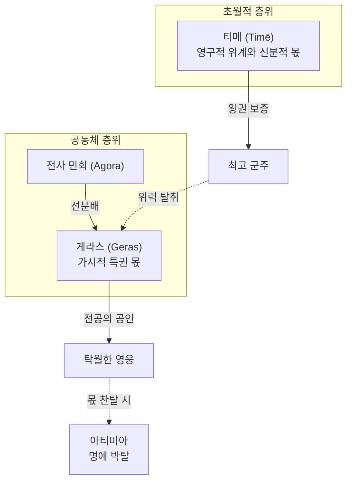

# 호메로스 위키 (Homer Wiki) — LLM 지식베이스 스키마 및 운영 지침

이 문서는 호메로스의 서사시(_일리아스_, _오뒷세이아_) 및 고대 그리스 신화·문화·철학 지식을 지식 베이스(Wiki)로 유지·관리할 때 LLM이 준수해야 할 구조, 규칙, 워크플로를 정의합니다.

---

## 1.디렉토리 구조

```
c:/Vault/Homer_wiki/
├── AGENTS.md              # 이 파일 (운영 지침 및 지식베이스 스키마)
├── raw/                   # 원본 소스 (불변, 원문, 번역본, 논문 등)
│   ├── assets/            # 지도, 계보도, 이미지 등 첨부파일
│   └── README.md          # 소스 문서 추가 안내
├── wiki/                  # LLM이 생성·관리하는 마크다운 위키 페이지
│   ├── index.md           # 전체 페이지 카탈로그 및 인덱스
│   ├── log.md             # 작업 시간순 기록 타임라인
│   ├── overview.md        # 위키 대시보드 / 호메로스 서사시 개요
│   ├── sources/           # 텍스트 및 서적 요약 문서 (<author>-<year>-<title>.md)
│   ├── entities/          # 영웅, 신, 국가, 장소 등 개체 문서 (entity-<name>.md)
│   ├── concepts/          # Kleos, Xenia, Nostos 등 핵심 개념 문서 (concept-<name>.md)
│   ├── analyses/          # 서사 구조, 에피소드 비교, 비평 문서 (analysis-<title>.md)
│   └── meta/              # 용어집, 구조 안내 등 메타 문서
└── words/                 # 호메로스 어원·영단어 수용사 사전 (독립 지식베이스)
    ├── _template.md       # 표준 단어 어원 분석 문서 템플릿
    ├── index.md           # 단어 사전 카탈로그 및 색인
    └── word-<name>.md     # 개별 단어 어원·수용사 분석 문서 (word-<name>.md)
```

---

## 2.페이지 규칙

### 2.1 YAML 프론트매터

모든 위키 페이지는 상단에 다음과 같은 표준 YAML 프론트매터를 포함합니다:

```yaml
---
title: 페이지 제목
aliases: [원어/희랍어 이름, 대안 표기, 약어]
tags: [type/entity, domain/iliad, status/active]
created: YYYY-MM-DD
updated: YYYY-MM-DD
sources: [관련 소스]
status: draft | active | review | archived
---
```

- `updated`는 문서의 내용이나 구조가 마지막으로 의미 있게 변경된 날짜입니다.
- `sources`는 문서 유형에 따라 다음처럼 기록합니다.
  - `wiki/concepts/`, `wiki/entities/`, `wiki/analyses/`: `wiki/sources/`의 파일명
  - `wiki/sources/`: `raw/`의 원본 파일명 또는 외부 URL. 쉼표가 있거나 URL인 값은 따옴표로 감쌉니다.
  - `words/`: 사전·문헌의 서지 표제. 아직 출처가 없으면 `[]`를 사용합니다.

#### 그리스어 읽기 UX 운영 규칙

- 정식 개념·엔티티·단어 페이지는 `korean_name`, `conventional_latin`, `greek`, `transliteration`, `transliteration_system`, `cssclasses`를 단일 원천으로 둔다. `transliteration_system`은 `homeric-oriented-v1`, `cssclasses`에는 `greek-reading-page`를 포함한다.
- 개념·엔티티 제목과 H1은 `한국어명 (관용 라틴명)`, 단어 제목과 H1은 `영어 표제어 (한국어명)`으로 일치시킨다. 그리스어와 학술 전사는 제목에 넣지 않는다.
- H1 바로 아래 첫 비어 있지 않은 본문 줄은 다음 읽는 법 행으로 둔다: `**[[greek-reading-guide|읽는 법]]**: {korean_name} · **원어**: {greek} · **학술 전사**: *{transliteration}*`.
- 일반 산문은 첫 완전 공개 뒤 한국어명을 기본으로 한다. 철자·방언·형태론 분석 또는 직접 인용에서만 원어와 학술 전사를 다시 제시한다.
- 4어 이상 또는 완결된 절·시행은 `번역 → 원문 → 실제형 학술 전사` 순서로 쓰며, 형태론·정형구 표는 그리스어 실제형과 학술 전사 열을 분리한다.
- 상세 전사·예외 판단은 `docs/editorial/homeric-oriented-transliteration-v1.md`, 독자용 안내는 `wiki/greek-reading-guide.md`를 따른다. IPA와 음성은 현재 범위에 넣지 않는다.
- 공개 그리스어 문서는 현재 `scripts/legacy-greek-reading-pages.json`의 `pages: []` 상태로 전환되었으므로, 새 문서도 유예 없이 위 계약을 따르고 `npm run check:greek`로 검증한다. 규약 변경이나 미확정 전사는 버전·예외 원장·감사 문서를 함께 갱신한다.

### 2.2 내부 링크 및 이중 대괄호

- 옵시디언 `[[위키링크]]` 형식을 필수 사용합니다.
- 문서 내 최초 언급 시 `[[개념명]]`으로 링크하며, 이후 동일 문서 내 반복 언급은 링크 없이 텍스트로 작성합니다.
- 아직 작성되지 않은 주요 영웅/신/개념도 미래 구축을 위해 `[[미래 페이지]]` 형태로 링크(빨간 링크)를 남겨둡니다.
- 특정 섹션 참조 시 `[[페이지명#섹션]]` 형식을 사용합니다.
- **콜아웃 및 인용 블록 내 링크 절대 금지**: `> [!NOTE]`, `> [!WARNING]`, `> **요약**:` 등 `>`로 시작하는 콜아웃(Callout) 및 인용 블록(Blockquote) 내부에는 `[[위키링크]]`를 일체 사용하지 않고 순수 텍스트(예: 아킬레우스, Menis, Xenia)로만 서술합니다.


### 2.3 태그 체계

| 접두사    | 용도              | 예시                                                                       |
| --------- | ----------------- | -------------------------------------------------------------------------- |
| `type/`   | 페이지 유형 분류  | `type/source`, `type/entity`, `type/concept`, `type/analysis`, `type/meta`, `type/word` |
| `domain/` | 주제 및 작품 분야 | `domain/iliad`, `domain/odyssey`, `domain/mythology`, `domain/culture`, `domain/etymology` |
| `status/` | 문서 완성도 상태  | `status/draft`, `status/active`, `status/review`, `status/archived`        |

### 2.4 작성 및 서술 원칙

- **한국어** 작성을 기본으로 하며, 주요 인물·신·고유명사 및 개념은 희랍어/영어 표기를 병기합니다. (예: 아킬레우스(Achilles, Ἀχιλλεύς), 클레오스(Kleos, κλέος))
- 객관적이고 백과사전적인 톤을 유지합니다.
- **이모지(Emoji) 사용 절대 금지**: 모든 위키 문서(문서 제목, 본문, 섹션 헤딩, 표, 목록, 콜아웃 등)에서 이모지를 일체 사용하지 않습니다. 순수 텍스트와 표준 마크다운 문법만을 사용하여 학술적 품격과 가독성을 유지합니다.
- 텍스트 분석 및 주장의 근거는 `[[소스 페이지]]` 또는 원문 서/행 번호(예: _일리아스_ 1권 1-9행)를 명시합니다.
- **원문 인용구(Quotes) 서식 규정**: 호메로스 서사시 원문 구절 및 학술 연구 문헌의 직접 인용구에는 콜아웃/블록인용(`>`)을 일체 적용하지 않습니다. 대신 일반 본문 단락 내 따옴표/기울임꼴(`"..."`, `*"..."*`) 또는 목록 항목(`- "..."`, `- *"..."*` 및 하위 주석 `  - **[주석]**: ...`) 형태로 서술합니다. `>` 기호는 오직 학술적 경고(`> [!WARNING]`), 총평(`> [!NOTE]`), 요약(`> **요약**:`) 등 메타 안내 블록에만 제한적으로 사용합니다.
- 학설이나 서사 해석 간 모순이 존재할 경우 경고 콜아웃을 명시적으로 남깁니다: `> [!WARNING] 모순/이설 발견`
- **굵은 글씨(볼드), 따옴표 및 괄호 서식 규정**: 마크다운 파서(CommonMark/Obsidian)의 구두점-조사 인접 파싱 오류(`**표제어(원어)**는` 또는 `**'강조'**처럼` 형태가 리터럴 `**`로 노출되는 결함)를 방지하고 가독성을 확보하기 위해, 다음 표기 원칙을 준수합니다:
  - **문장부호 외곽 분리 원칙**: 따옴표(`'`, `"`, `‘`, `’`, `“`, `”`), 낫표(`『`, `』`, `「`, `」`) 등 문장부호는 볼드 마커 바깥으로 분리하여 `'**강조단어**'처럼`, `『**서명**』`, `"**인용구**"라는` 형식으로 작성합니다. (`**'강조단어'**처럼` 형태 절대 금지)
  - **괄호 및 원어 분리 원칙**: 원어 병기나 부가 설명 괄호는 볼드 마커 바깥으로 분리하여 `**한국어 표제어**(원어/외국어)조사` 또는 `**한국어 표제어** (원어/외국어)` 형식으로 작성합니다.
  - **경계 공백 및 단일 행 홀수 마커 금지**: `** 문구**`처럼 볼드 경계에 공백을 넣거나 닫히지 않은 볼드 마커를 남기지 않습니다. 볼트 전역 교정은 `npm run fix:bold`로 자동 수행합니다.
- **인덱스 및 카탈로그 1행 표준 서식 규정**: 루트 `index.md`, `wiki/index.md` 등 공개 카탈로그 및 대시보드 문서에서 각 섹션별 항목은 다음 1행 표준 서식을 준수합니다:
  - **인물**: `- [[entity-<name>|한국어명 (관용 라틴명)]] — [서사적 핵심 역할/위상]`
  - **개념**: `- [[concept-<name>|한국어명 (관용 라틴명)]] — [개념 정의 및 핵심 작동 원리]`
  - **어원**: `- [[word-<name>|영어 표제어 (한국어명)]] — [*대표 파생어 1*, *대표 파생어 2*, ...]` (현대 주요 파생어를 기울임꼴로 간결하게 나열)
  - **분석**: `- [[analysis-<name>|분석 문서 제목]] — [분석 주제 및 학술적 기여]`
  - **문헌**: `- [[<author>-<year>-<title>|저자 (연도), 도서/논문명]] — [핵심 연구 테제]`
- 모든 페이지 하단에는 `## 관련 항목` 섹션을 포함하여 관련 페이지 링크를 묶어 배치합니다. 단, 시계열을 계속 덧붙이는 `wiki/log.md`는 이 규칙에서 제외합니다.

#### 머메이드 다이어그램 표준 규격

호메로스 위키의 Mermaid 다이어그램은 **논증 구조를 한눈에 전달**하는 시각 장치다. 마크다운 블록에는 구조·라벨·시맨틱 클래스명만 두고, 색·테두리·다크모드 대응은 Obsidian/Quartz 전역 CSS에서만 제어한다. (인라인 스타일 복붙 금지)

##### 적용 범위와 예외
- `wiki/concepts/`, `wiki/entities/`, `wiki/analyses/` 등 본문 다이어그램에 적용한다.
- **어원 사전 목록 mermaid 금지**: `words/index.md`의 `## 작성된 수용 경로` 등 표제어 **목록**을 mermaid로 그리지 않는다. 작성된 항목은 현황 표와 알파벳 색인 1행 서식으로만 등재한다. (어원 **계통 트리**가 개별 `word-*.md` 본문에 필요할 때는 아래 유형 C를 따른다.)

##### 절대 금지 (Guardrails)
1. **인라인 색상 하드코딩 금지**: Mermaid 펜스 안에 `fill:#…`, `stroke:#…`, `color:#…` 등 hex/rgb 스타일을 쓰지 않는다.
2. **인라인 `classDef` 스타일 블록 금지**: 블록마다 `classDef core fill:…` 형태로 스타일을 복붙하지 않는다. 스타일은 전역 CSS 한곳(정확히는 Obsidian 스니펫 + Quartz `custom.scss`)에서만 정의한다.
3. **더미 배너 노드 금지**: 서브그래프 제목 관통을 피하려고 `subgraph S [" "]` + `Header["…"]:::banner` + `Header --- A` 같은 가짜 헤더 노드를 넣지 않는다. 레이아웃 랭크를 왜곡하고 시맨틱 그래프를 오염시킨다.
4. **목록 문법 충돌 금지**: 노드 문자열의 시작 또는 `<br/>` 바로 뒤에 `1. `, `- ` 같은 마크다운 목록 구문을 쓰지 않는다. Mermaid htmlLabels가 이를 목록으로 읽어 `Unsupported markdown: list`로 렌더링이 실패한다. 번호는 `(1)` 또는 `[제1편]`처럼 괄호·대괄호로 표기한다.

##### 시맨틱 클래스 (3+1 위계)
색은 “모든 존재론적 층위”를 칠하는 도구가 아니라 **시선 유도용 절제된 위계**다. 한 다이어그램에서 아래 클래스만 사용한다.

| 클래스 | 역할 | 적용 대상 | 화면당 권장 |
|:---|:---|:---|:---|
| *(기본, 클래스 없음)* | 배경·구조 노드 | 제도, 관습, 일반 인물·사건, 매개 절차 | 대다수 |
| `:::focus` | 문서의 표제 | 해당 페이지의 주인공 개념·인물 | **1~2개** |
| `:::crisis` | 위반·파국·위기 | 아테, 휘브리스, 메니스 폭주, 아티미아, 시신 모독, 살육 등 | 소수 |
| `:::resolve` | 회복·연대·수습 | 엘레오스, 히케시아, 화해, 장례, 올곧은 디케의 회복 등 | 소수 |

- **신적 층위 vs 인간 제도**는 색깔로 나누지 않는다. 서브그래프의 **공간 위계**(상단=초월·운명, 하단=공동체·행위)로 표현한다.
- `:::focus`가 3개를 넘으면 위계가 붕괴한 것이다. 다이어그램을 쪼개거나 표제를 재정의한다.

##### 전역 스타일 배치 (단일 진실 공급원)
- **Obsidian**: `.obsidian/snippets/`의 Mermaid 시맨틱 스니펫(기존 `mermaid-scroll.css`의 가로 스크롤 규칙과 병행). 색은 테마 변수·반투명 틴트를 우선해 라이트/다크 모두에서 눈부심 없이 읽히게 한다.
- **Quartz**: 루트 `custom.scss`에 **동일 토큰·동일 클래스 의미**를 동기화한다. Obsidian만 고치고 Quartz를 비워 두지 않는다.
- 신규·수정 다이어그램은 `A["표제"]:::focus`처럼 **클래스명만** 붙인다. CSS 셀렉터가 Obsidian·Quartz 미리보기에서 실제로 적용되는지, 규격 도입·변경 시 **파일 1개로 실증**한 뒤 전역에 확대한다. (`:::focus`가 DOM 클래스로 연결되지 않는 렌더러가 확인되면, 인라인 hex 복귀가 아니라 최소 우회책—예: 검증된 테마 훅—을 이 절에 명시해 갱신한다.)

##### 레이아웃 유형 (내용에 맞는 뼈대)
다이어그램을 그리기 전에 유형을 고른다. 단순 `TD`/`LR` 일변도를 피한다.

| 유형 | 본질 | 권장 뼈대 | 대표 문서군 |
|:---|:---|:---|:---|
| **A. 개념 대립·피드백망** | 개념의 상보·대립·순환 | 허브-스포크 또는 좌우 대립쌍. 상단 초월 전제 / 중단 제도·규범 / 하단 파국·회복 | `concept-time`, `concept-menis`, `concept-geras`, `concept-dike` 등 |
| **B. 서사 국면 파이프라인** | 시간의 국면 전환 | 바깥은 `flowchart TD`(국면 수직 적층), 국면 서브그래프 안은 `direction LR`. 국면 전환은 굵은 화살표(`==>`) | `entity-achilles`, `entity-hector`, `entity-odysseus` 등 |
| **C. 어원·수용 계통** | 시대별 계보 | 3티어 클러스터(상: PIE·미케네 / 중: 호메로스 희랍 / 하: 라틴·근현대 수용) | `words/word-*.md`, 개념 1절 어원도 |
| **D. 제도·인물 관계망** | 위계·지휘·계보 | 수직 계층 트리 또는 분기 매트릭스. 과밀하면 서브그래프로 구역만 나누고 노드를 줄인다 | 왕실 계보, 아고라 사법, 지휘망 |

- 가능하면 `graph`보다 `flowchart`를 쓴다.
- 필요 시 블록 상단에 `%%{init: {'flowchart': {'useMaxWidth': true, 'nodeSpacing': 20, 'rankSpacing': 28}}}%%`로 간격만 조정한다. (색상 init/themeVariables로 시맨틱 색을 우회 주입하지 않는다.)

##### 노드·엣지 텍스트 (1-2-3 규칙)
- **1행 (표제어)**: `한국어명 (원어/관용 전사)` 중심, 과한 수식 금지.
- **2행 (역할 한 줄)**: 본질·서사적 역할 **한 구절**. `<br/>`로만 연결한다.
- **3행 이상 금지**: 권·행 번호, 긴 인용, 논증 전개는 노드에 넣지 말고 **다이어그램 직하 본문**에 둔다.
- **엣지 라벨**: 대략 10자 안팎의 명사·동사 압축 (` -->|"선분배"|`, `-.->|"위력 탈취"|`). 문장형 장문은 금지.

##### 서브그래프
- 서브그래프 제목은 **네이티브 라벨**을 쓴다. 예: `subgraph Divine ["초월적 층위 (제우스와 모이라)"]`.
- 내부에 `direction TB` 또는 `direction LR`를 명시한다.
- 특정 Obsidian/Quartz 조합에서 제목 관통이 재현되면, 더미 배너 노드를 표준화하지 말고 **해당 환경의 예외와 최소 우회**를 `wiki/log.md`와 이 절에 기록한다.

- **서브그래프 제목 관통(Obsidian)**: 네이티브 서브그래프 라벨이 테두리 선에 가리면, 더미 `:::banner`+인라인 `classDef` 대신 `subgraph S [" "]`와 구역 첫 노드에 `[구역명]` 형태의 **평문 헤더 노드**를 둔다(헤더와 본문은 `---`로만 연결). Mermaid `subGraphTitleMargin`도 init에 함께 둔다. 이 우회는 관통이 재현되는 렌더러에 한정한다.

##### 최소 예시 (구조만 — 색은 CSS)


##### 작성·검수 체크리스트
- [ ] 유형 A~D 중 하나를 골랐는가
- [ ] 인라인 hex / `classDef` 스타일 / 더미 배너 노드가 없는가
- [ ] `:::focus`가 1~2개로 절제되는가
- [ ] 노드가 1-2-3 규칙을 지키는가
- [ ] Obsidian과 Quartz 미리보기에서 클래스 틴트가 의도대로 보이는가 (도입·변경 시)
- [ ] (자동화) `node scripts/validate-wiki.mjs`의 Mermaid 규칙이 통과하는가 — 인라인 색·목록 충돌·과밀 노드 등. 규칙이 아직 없으면 이 체크리스트와 수동 검수로 대체하고, 린트 추가 후 본 항을 강제한다.

##### 기존 다이어그램 이행
- 신규·손대는 다이어그램부터 본 규격을 적용한다.
- 일괄 치환보다 **파일럿(핵심 개념·주요 엔티티) → 린트 강화 → 잔여 배치** 순을 따른다. 무채색·과밀 박스만 있는 레거시는 수정 시점에 슬림화·클래스 부여·유형 재배치를 함께 한다.

### 2.5 파일 명명 규칙 (File Naming Conventions)

볼트 전역 고유성(Global Uniqueness)을 확보하고 동명 표제어(예: Achilles 인물 vs 단어) 간 링크 충돌 및 상대 경로 오작동을 방지하기 위해 **유형별 전치 접두사**(Kebab-case Prefix)를 의무 적용합니다:

| 디렉토리 | 유형 (Type) | 파일명 명명 규칙 | 작성 예시 | 위키링크 호출 형식 |
|:---|:---|:---|:---|:---|
| `wiki/entities/` | 인물, 신, 장소, 사물 | `entity-<name>.md` | `entity-achilles.md`, `entity-hector.md` | `[[entity-achilles\|아킬레우스]]` |
| `wiki/concepts/` | 호메로스 핵심 개념·사상 | `concept-<name>.md` | `concept-menis.md`, `concept-aidos.md` | `[[concept-menis\|메니스]]` |
| `words/` | 어원·영단어 수용사 | `word-<name>.md` | `word-achilles.md`, `word-mentor.md` | `[[word-achilles\|Achilles]]` |
| `wiki/sources/` | 원전 및 학술 소스 | `<author>-<year>-<title>.md` | `lee-junseok-2024-iliad-jeongam.md` | `[[lee-junseok-2024-iliad-jeongam]]` |
| `wiki/analyses/` | 종합 비평 및 서사 분석 | `analysis-<title>.md` | `analysis-homeric-ethics-literature-review.md` | `[[analysis-homeric-ethics-literature-review]]` |
| `wiki/meta/` | 메타 가이드라인 | `<name>.md` | `entity-framework.md` | `[[entity-framework]]` |

- **위키링크 작성 원칙**: 고유한 파일명은 상대경로나 폴더 경로 없이 `[[entity-achilles|아킬레우스]]`, `[[concept-menis|메니스]]`, `[[word-achilles|Achilles]]`처럼 표기합니다.
- **중복 관리 파일 예외**: `index.md`와 `_template.md`처럼 볼트 안에 동명이 있는 파일은 `[[wiki/index|위키 색인]]`, `[[words/index|어원 사전]]`, `[[wiki/entities/_template|엔티티 템플릿]]`, `[[wiki/concepts/_template|개념 템플릿]]`처럼 저장소 루트 기준 경로를 사용합니다.


---

## 3.핵심 워크플로

### 3.1 소스 수집 (Ingest Workflow)

1. **소스 읽기**: `raw/`에 새로 추가된 원문/번역본/논문을 정독합니다.
2. **핵심 요약 공유**: 사용자에게 핵심 인사이트 3-5개를 공유하고 논의합니다.
3. **소스 문서 생성**: `wiki/sources/` 하위에 서지 정보, 핵심 요약, 인용 구절, 관련 위키 링크를 포함한 소스 문서를 작성합니다.
4. **연관 위키 갱신**: 해당 소스와 관련된 `entities/`, `concepts/`, `analyses/`, `words/` 페이지를 업데이트하고 교차 참조를 형성합니다.
5. **인덱스 및 로그 업데이트**: `wiki/index.md` 카탈로그, `words/index.md` 및 `wiki/log.md` 타임라인을 최신화합니다.

### 3.2 질의 및 합성 (Query Workflow)

1. **인덱스 탐색**: `wiki/index.md`, `words/index.md` 및 관련 페이지를 탐색하여 지식을 합성합니다.
2. **답변 제공**: 출처와 `[[페이지링크]]`를 포함하여 응답합니다.
3. **지식 보존**: 가치 있는 분석적 답변은 `wiki/analyses/` 또는 `words/` 하위에 독립된 문서로 저장합니다.

### 3.3 검수 및 정제 (Lint Workflow)

- 최초 실행이나 `package-lock.json` 변경 후 `npm ci`로 고정된 검증 의존성을 설치합니다.
- 변경 후 `node scripts/validate-wiki.mjs`로 프론트매터, 파일명, 링크, 인덱스, 관련 항목 규칙을 검사합니다.
- Mermaid 다이어그램은 `AGENTS.md` 2.4절 「머메이드 다이어그램 표준 규격」을 따른다. 인라인 색상·`classDef` 스타일·목록 문법 충돌·과밀 노드 검사는 `validate-wiki.mjs`에 규칙이 추가되면 그것으로 강제하고, 그 전에는 해당 절의 체크리스트로 수동 검수한다.
- 개념×문헌 매트릭스는 `node scripts/build-concept-source-matrix.mjs --check`로 동기화 상태를 검사합니다.
- 의도한 미래 페이지 링크와 템플릿 자리표시는 `scripts/allowed-red-links.json`에 등록합니다. 등록되지 않았거나 더 이상 사용하지 않는 빨간 링크는 검증 실패로 처리합니다.
- 검수 결과와 수정 내역을 `wiki/log.md`에 기록합니다.

---

## 4.핵심 관리 파일

- `wiki/overview.md`: 위키 대시보드. 서사시 전체 구조 및 메인 주제 지도.
- `wiki/index.md`: 카테고리별 전체 위키 문서 목록 및 요약.
- `words/index.md`: 어원·영단어 사전 전체 카탈로그 및 색인.
- `wiki/log.md`: 시계열 작업 이력 (`## [YYYY-MM-DD] 작업유형 | 제목`).

---

## 5. LLM 행동 수칙

1. `raw/` 폴더 내 원본 파일은 **절대로 직접 수정하지 않는다**.
2. `wiki/` 및 `words/` 폴더 내 위키/단어 파일은 지식 축적을 위해 자유롭게 생성·수정·보완한다.
3. 작업 수행 내역은 항상 `wiki/log.md`에 기록하고 `wiki/index.md` 및 `words/index.md` 상태를 최신으로 유지한다.

---

## 6. Git 커밋 및 버전 관리 지침

### 6.1 커밋 메시지 기본 구조

```text
<타입>(<스코프>): <커밋 제목>

[선택적 본문: 변경 이유 및 주요 변경 사항 (필요시)]
```

### 6.2 허용 타입 (Types)

| 타입       | 용도 및 적용 대상                                        |
| :--------- | :------------------------------------------------------- |
| `feat`     | 새로운 위키 문서(소스, 개념, 분석, 인물, 단어 등) 생성   |
| `docs`     | 기존 문서 내용 보완, 상세화, 주석 추가, 분석 심화        |
| `fix`      | 오타, 잘못된 인용 행 번호, 깨진 위키링크, 표기 오류 정정 |
| `refactor` | 지식베이스 템플릿 개편, 구조 재배치, 서식 정리           |
| `chore`    | `.gitignore`, `AGENTS.md`, 메타 설정, 환경 설정 변경     |

### 6.3 허용 스코프 (Scopes)

- `sources` : `wiki/sources/` 문헌 및 강의 소스 문서
- `entities` : `wiki/entities/` 영웅, 신, 인물, 장소 문서
- `concepts` : `wiki/concepts/` Arete, Aidos, Dike 등 핵심 개념 문서
- `analyses` : `wiki/analyses/` 서사 비교, 윤리학 종합 분석 문서
- `words` : `words/` 단어 어원 및 영단어 수용사 분석 문서
- `meta` : `wiki/index.md`, `words/index.md`, `wiki/overview.md`, `wiki/log.md`, `AGENTS.md`
- `all` : 전체 문서 대상 일괄 작업 시

### 6.4 4대 작성 원칙

1. **이모지(Emoji) 절대 금지**: 커밋 메시지 제목 및 본문에 이모지를 일체 포함하지 않는다.
2. **50자 이내 간결한 제목**: 핵심 변경 대상을 명확히 서술한다.
3. **명사형/개조식 종결**: `~추가`, `~수정`, `~개편`, `~정정` 등으로 명료하게 종결한다.
4. **`wiki/log.md` 연동**: 커밋 전 반드시 `wiki/log.md`에 동일한 작업 내역을 시계열로 기록한다.
