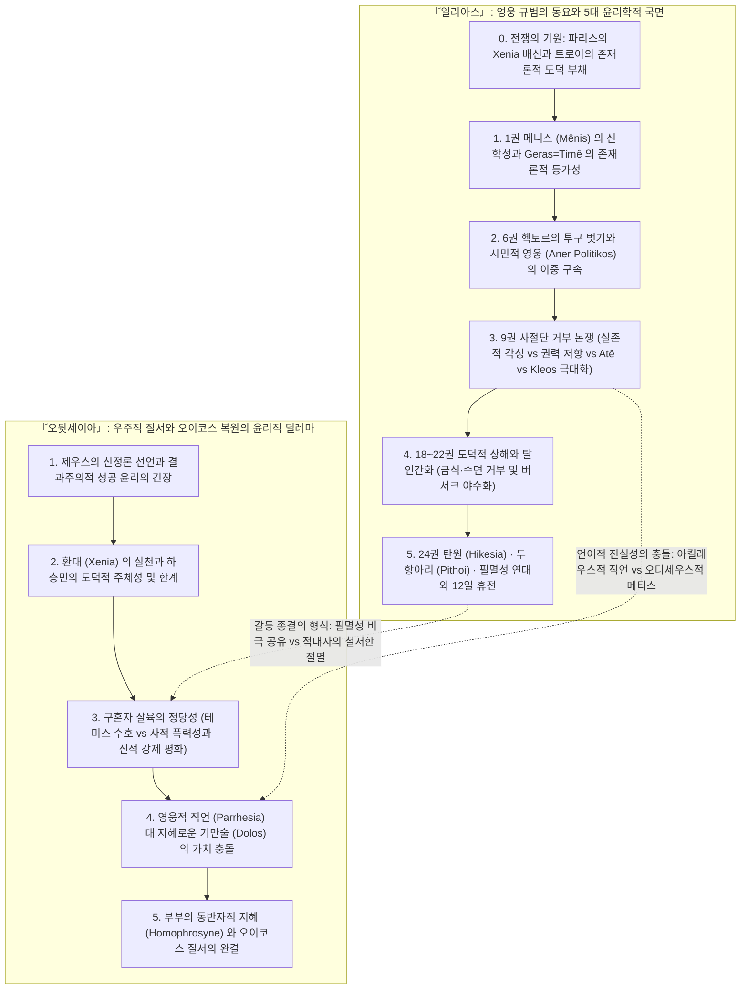
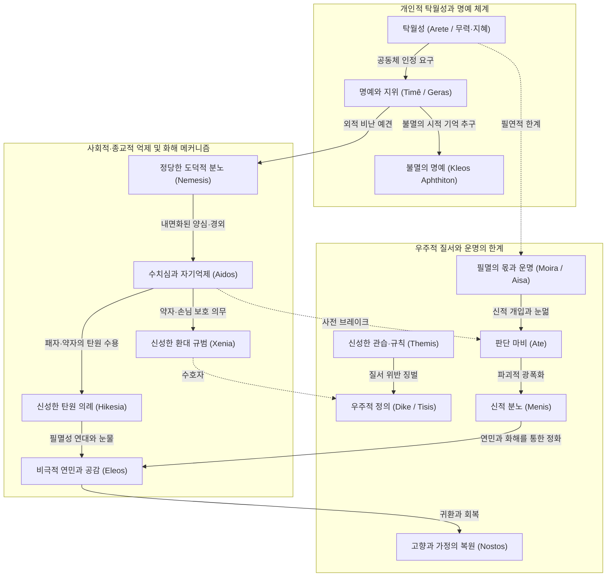
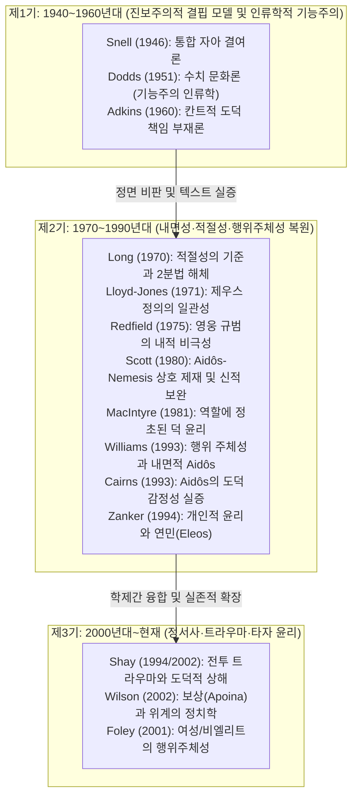
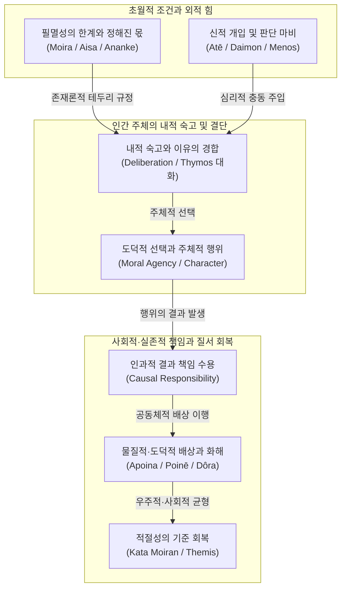

# 호메로스 서사시의 윤리학적 특징 및 관련 분야 연구 문헌 종합

> [!NOTE] 지식베이스 총괄 개요
> 호메로스(Homer, Ὅμηρος)의 양대 서사시 **일리아스**(Iliad)와 **오뒷세이아**(Odyssey)는 고대 지중해 문명의 세계관을 집대성한 원천이자, 서구 도덕철학과 인간학의 지평을 정초한 원형 텍스트입니다. 20세기 중반 이후 고전문헌학·도덕철학·역사심리학·정신의학의 교차로에서 전개된 호메로스 윤리학 연구는 단순한 문학적 해석을 넘어, **'인간의 행위 주체성(Moral Agency), 도덕적 책임의 발생 근거, 내면 정서의 구조, 그리고 필멸적 실존의 비극적 한계'**를 해명하는 현대 사상계의 중대한 지적 각축장이었습니다.
>
> 본 종합 분석 문서는 `wiki/sources/`에 구축된 16종의 핵심 연구 도시에와 전 세계 학술 정전을 유기적으로 결집하여, 호메로스 윤리 체계의 심층 다이얼렉틱과 지난 80년간 축적된 패러다임 전환사를 체계적으로 해제합니다.

---

## 1. 호메로스 윤리학 연구 문헌 TOP 20

전 세계 학술 데이터베이스(Google Scholar, OpenAlex, PhilPapers, JSTOR, KCI)의 정량적 피인용 지수와 질적 학술 기여도를 종합한 호메로스 윤리학 분야 핵심 문헌 순위입니다.

|   순위   | 저자                      | 저작 / 논문명 (연도)                                     |            피인용수             | 핵심 연구 내용 및 윤리학적 기여                                                                                                 |               위키 심층 도시에 링크               |
| :----: | :---------------------- | :------------------------------------------------ | :-------------------------: | :----------------------------------------------------------------------------------------------------------------- | :--------------------------------------: |
| **1**  | **Bernard Williams**    | **_Shame and Necessity_** (1993)                  |         **2,850+**          | **고대 도덕심리학의 복원.** 스넬-애드킨스식 진보주의 발전론을 비판하고, 호메로스 영웅의 자율적 행위 주체성(Agency), 존재론적 필연성, '내면화된 타자' 중심의 [[concept-aidos|Aidos]] 윤리학 정립.  |  [[williams-1993-shame-and-necessity]]   |
| **2**  | **Alasdair MacIntyre**  | **_After Virtue_** (1981, 제10장)                   | **25,400+** _(호메로스 2,400+)_ | **현대 덕 윤리학의 정초.** 호메로스 사회에서 덕([[concept-arete|Arete]])은 추상적 규범이 아니라 사회적 역할(Role) 및 삶의 서사적 통일성에 내재함을 증명 (사실-당위의 일치).              |   [[macintyre-1981-after-virtue-ch10]]   |
| **3**  | **E. R. Dodds**         | **_The Greeks and the Irrational_** (1951)        | **5,600+** _(호메로스 2,100+)_  | **수치 문화(Shame Culture) 테제 제창.** 호메로스 사회의 도덕 감정을 문화인류학적으로 분석하고, 아테([[concept-ate|Ate]], 정신적 눈멂)와 신적 개입의 심리적 외주화 메커니즘 규명.        |   [[dodds-1951-greeks-and-irrational]]   |
| **4**  | **Jean-Pierre Vernant** | **_L'individu, la mort, l'amour_** (1989)         | **4,150+** _(호메로스 1,850+)_  | **프랑스 역사심리학적 구조주의.** 영웅의 **'아름다운 죽음(la belle mort, kalos thanatos)'**과 불멸의 명성([[concept-kleos|Kleos]]), 시신 훼손 금기 및 필멸성의 형이상학 분석. |       [[vernant-1989-belle-mort]]        |
| **5**  | **Walter Burkert**      | **_Griechische Religion_** (1977)                 | **3,680+** _(호메로스 1,500+)_  | **종교-제의적 도덕 질서.** 제우스 크세니오스, 신성한 맹세(Horkos), 희생제의를 통한 [[concept-xenia|Xenia]] 규범 및 우주적 도덕률의 종교적 기초 해명.                           |     [[burkert-1977-greek-religion]]      |
| **6**  | **Bruno Snell**         | **_Die Entdeckung des Geistes_** (1946)           | **3,280+** _(호메로스 1,950+)_  | **독일 문헌학적 정신사 연구.** Soma/Psyche 어휘 분석을 통해 호메로스 인간에게 근대적 통합 자아가 결여되어 있었다는 '결핍 및 외적 동기화 테제' 제기.                      |     [[snell-1946-discovery-of-mind]]     |
| **7**  | **M. I. Finley**        | **_The World of Odysseus_** (1954)                | **3,120+** _(호메로스 1,700+)_  | **역사사회학적 가치 분석.** 호혜적 선물 교환(Gift-exchange), [[concept-xenia|Xenia]], 오이코스(Oikos) 질서에 정초된 귀족 전사 계급 윤리의 물질적·사회적 토대 규명.             |    [[finley-1954-world-of-odysseus]]     |
| **8**  | **Jonathan Shay**       | **_Achilles in Vietnam_** (1994)                  |         **2,500+**          | **정신의학-고전윤리학 융합.** 테미스([[concept-themis|Themis]])의 배신, **도덕적 상해(Moral Injury)**, 버서크(광폭화) 상태와 애도·환대를 통한 인간성 회복의 치유 서사 실증.         |    [[shay-1994-achilles-in-vietnam]]     |
| **9**  | **Arthur W. H. Adkins** | **_Merit and Responsibility_** (1960)             |         **1,820+**          | **호메로스 가치어 분석의 출발점.** '경쟁적 덕([[concept-arete|Arete]])' 대 '협력적 덕([[concept-dike|Dike]])'의 2분법을 설정하고, 전사 사회 특유의 칸트적 도덕 책임 부재론 주장.               | [[adkins-1960-merit-and-responsibility]] |
| **10** | **James M. Redfield**   | **_Nature and Culture in the Iliad_** (1975)      |         **1,650+**          | **영웅 규범의 문화인류학적 비극성.** 헥토르의 시민적 영웅성(aner politikos) 분석을 통해, 문명을 수호하려는 영웅 윤리가 역설적으로 문명을 파괴하는 내적 모순 해부.              |   [[redfield-1975-nature-and-culture]]   |
| **11** | **Richard Seaford**     | **_Reciprocity and Ritual_** (1994)               |         **1,250+**          | **상호성(Reciprocity) 윤리의 붕괴와 재건.** 교환 체계의 파탄 및 [[concept-xenia|Xenia]] 유린을 통하여 서사시와 초기 폴리스 공동체 윤리의 형성 과정 추적.                       | [[seaford-1994-reciprocity-and-ritual]]  |
| **12** | **Douglas L. Cairns**   | **_Aidos_** (1993)                                |         **1,150+**          | **[[concept-aidos|Aidos]] 연구의 독보적 정전.** 서사시 텍스트 전수 조사를 통해 사전 억제적(Prospective) 양심, 타인에 대한 도덕적 공감, [[concept-nemesis|Nemesis]]와의 상호 억제 회로 실증.      |          [[cairns-1993-aidos]]           |
| **13** | **Hugh Lloyd-Jones**    | **_The Justice of Zeus_** (1971)                  |          **980+**           | **도덕적 연속성 테제.** 『일리아스』와 『오뒷세이아』 전반을 관통하는 제우스의 정의([[concept-dike|Dike]])와 종교적 도덕 질서의 확고한 연속성 입증.                                 |   [[lloyd-jones-1971-justice-of-zeus]]   |
| **14** | **Christopher Gill**    | **_Personality in Greek Epic_** (1996)            |          **920+**           | **참여자적 자아 모델 정립.** 데카르트적 고립 주체가 아닌 타자와의 관계 및 공동체적 대화 속에서 결단하는 '객관적-참여자적 자아(Objective-participant self)' 개념화.       | [[gill-1996-personality-in-greek-epic]]  |
| **15** | **Marcel Detienne**     | **_Les Maîtres de vérité_** (1967)                |          **890+**           | **고대 진리관과 정의의 기원.** 아르카익기 진리(Aletheia)와 [[concept-dike|Dike]]의 결합을 분석하고, 시인·왕·예언자가 공유한 종교-윤리적 권위의 신화적 기초 규명.                    |   [[detienne-1967-maitres-de-verite]]    |
| **16** | **Gregory Nagy**        | **_The Best of the Achaeans_** (1979)             |  **2,100+** _(호메로스 850+)_   | **최고 영웅의 신화시학.** 무력(Bie)과 지혜(Metis)의 긴장, 필멸의 영웅이 서사시 전통을 통해 획득하는 불멸의 명성([[concept-kleos|Kleos Aphthiton]]) 체계 해명.          |    [[nagy-1979-best-of-the-achaeans]]    |
| **17** | **Hans van Wees**       | **_Status Warriors_** (1992)                      |          **750+**           | **지위 경쟁의 전사 윤리.** 호메로스 사회의 지위(Status) 투쟁, 모욕(Hybris)과 분노의 역학, 귀족 전사 계급 특유의 아고니스틱(Agonistic) 윤리 구조 실증.              |    [[van-wees-1992-status-warriors]]     |
| **18** | **Albin Lesky**         | **_Göttliche und menschliche Motivation_** (1961) |          **420+**           | **이중 동기화(Doppelte Motivation) 이론.** 한 사건이 신적 섭리와 인간의 자율적 심리 결단이라는 두 독립된 층위에서 완벽히 양립함을 논증.                          |   [[lesky-1961-gottliche-motivation]]    |
| **19** | **A. A. Long**          | **_Morals and Values in Homer_** (1970, _JHS_)    |          **320+**           | **애드킨스 2분법 해체 및 '적절성의 기준' 확립.** 과도와 결핍을 통제하는 공식구 체계와 상호적 [[concept-time|Timê]] 규범을 분석하여 아리스토텔레스 중용 윤리의 기원 규명.                   |     [[long-1970-morals-and-values]]      |
| **20** | **Graham Zanker**       | **_The Heart of Achilles_** (1994)                |          **260+**           | **개인적 윤리(Personal Ethics)의 발전.** 집단적 전사 규범을 초월하여 대도량(Megalopsychia)과 비극적 연민([[concept-eleos|Eleos]])에 도달하는 아킬레우스의 내적 성숙 추적.      |    [[zanker-1994-heart-of-achilles]]     |

---

## 2. 『일리아스』와 『오뒷세이아』의 윤리학적 지형과 다원적 논쟁 구조

호메로스의 두 서사시를 단순한 '비극적 파탄 대 정의의 회복'이라는 이분법적 도식으로 환원하는 것은 텍스트가 지닌 치열한 내적 모순과 학계의 입체적 쟁점을 은폐할 위험이 있습니다. 두 작품은 각각 고유한 서사적 시공간 속에서 **영웅주의의 내적 한계, 정의(Dike)의 양면성과 폭력성, 그리고 인간 행위 주체성의 실존적 딜레마**를 다성적(Polyphonic)으로 탐색하는 장엄한 도덕철학적 담론의 장입니다.

### 2.1 『일리아스』: 영웅 규범의 동요와 5대 국면별 학술 쟁점

#### 0. 도덕적 범죄와 전쟁의 기원: 파리스의 크세니아([[concept-xenia|Xenia]]) 배신 ([[lee-junseok-2024-iliad-jeongam|이준석 2024]])

- 트로이 전쟁은 단순한 영토 쟁탈전이 아닙니다. 손님으로 환대받았던 파리스가 메넬라오스의 안주인 헬레네와 보물을 훔쳐 달아남으로써, 신들이 보증하는 고대 문명의 신성한 국제 도덕률인 환대 규범([[concept-xenia|Xenia]])을 유린한 도덕적 범죄가 전쟁의 근본 발단입니다.
- 트로이 진영은 개전 초기부터 **제우스 크세니오스(Zeus Xenios, 환대의 수호신 제우스)**에 대한 회복 불가능한 '도덕적 부채(Moral Deficit)'를 짊어졌으며, 이는 트로이의 궁극적 멸망이 피할 수 없는 도덕적·인과적 필연성임을 명시합니다.

#### 1. 1권 메니스([[concept-menis|Menis]])의 신학적 차원과 게라스([[concept-geras|Geras]])의 존재론적 등가성

- **신적 분노 메니스(Mênis, μῆνις)의 선언**:
  - 서사시의 첫 단어인 *Mênis*는 인간의 사적 노여움(Cholos, χόλος / Kotos, κότος)과 질적으로 구별되는, 오직 신들에게만 귀속되는 우주적 파괴력의 절대적 분노입니다. 아킬레우스의 분노가 메니스로 명명된 것은 그가 필멸의 인간과 불멸의 신의 경계에 서 있는 초월적 영웅임을 선언하는 문헌학적 장치입니다.
- **게라스(Geras, γέρας)와 티메([[concept-time|Timê]])의 존재론적 등가성**:
  - 전사 사회에서 전리품(Geras)은 물질적 탐욕의 대상이 아니라, 목숨을 걸고 싸운 무용에 대해 공동체가 공인한 '**사회적 존재 증명(존재론적 명예)**'입니다. 총사령관 아가멤논이 권력으로 브리세이스를 강탈한 폭거는 아킬레우스의 전사로서의 실존적 존재 이유 자체를 말살한 행위였습니다.
- **제우스의 계획(Dios Boulê, Διὸς βουλή)**:
  - 아킬레우스의 전선 이탈은 단순한 항명이 아닙니다. 아카이아 군단 전체가 그의 부재를 통해 아킬레우스라는 영웅의 대체 불가능성을 뼈저리게 절감하도록 만드는 거시적 신적 섭리의 전개입니다.

#### 2. 6권 헥토르의 '투구 벗기'와 시민적 영웅(Aner Politikos)의 이중 구속 ([[redfield-1975-nature-and-culture|Redfield 1975]], [[lee-junseok-2024-iliad-jeongam|이준석 2024]])

- **투구 벗기의 현상학적 상징성**:
  - 헥토르가 아내 안드로마케와 젖먹이 아스티아낙스를 마주할 때, 아이가 공포에 질려 울음을 터뜨리자 **말총 투구를 벗어 땅에 내려놓는 장면**(_Il._ 6.466–474)은 전사의 살기 어린 사회적 가면을 벗고 한 인간이자 아버지로 복귀하는 숭고한 순간입니다.
- **시민적 영웅의 비극적 딜레마**:
  - 헥토르는 가족과 도시를 수호하는 '시민적 영웅'이지만, 트로이의 필연적 멸망을 예감하면서도 동료 시민들의 비난에 대한 수치심([[concept-aidos|Aidos]]) 때문에 성벽 안으로 물러서지 못하고 사지로 향합니다.
  - 이는 영웅적 명예 규범이 역설적으로 공동체(트로이) 전체를 공멸로 몰고 가는 영웅주의의 내적 모순을 선명하게 체현합니다.

#### 3. 9권 아킬레우스의 거부: '실존적 각성'인가, '권력 투쟁과 비극적 과오(Atê)'인가?

아킬레우스가 아가멤논의 물질적 배상을 단호히 거절하며 쏟아낸 절규(_Il._ 9.318–409: _"머무는 자나 용맹하게 싸운 자나 몫은 같으며, 비겁한 자나 고결한 자나 똑같은 명예를 받고, 아무 일도 하지 않은 자나 혁혁한 공을 세운 자나 죽기는 매한가지다"_)는 호메로스 해석사의 가장 첨예한 격전장입니다.

- **실존주의적·인본주의적 관점 ([[zanker-1994-heart-of-achilles|Zanker 1994]], Whitman 1958)**:
  세속적 전리품(Geras) 체계가 인간의 유한한 생명과 고유한 탁월함([[concept-arete|Arete]])을 결코 보상할 수 없다는 실존적 각성이자, 기성 전사 규범을 초월한 독자적 내면 윤리의 정립으로 해석합니다.
- **사회역학적·권력론적 비판 ([[adkins-1960-merit-and-responsibility|Adkins 1960]], Griffin 1980, Postlethwaite 1998)**:
  아킬레우스가 거부한 것은 보상 자체가 아니라 아가멤논이 배상을 빌미로 강요한 **'위계적 굴종(Submission)'**입니다. 아가멤논은 "그는 나에게 복종해야 한다. 내가 더 왕답기 때문이다"(_Il._ 9.160–161)라고 천명했습니다. 따라서 거부는 물질의 허무가 아니라, 자신의 존엄을 짓밟으려는 지휘관의 오만에 맞선 결연한 저항입니다.
- **비극적 과오론과 아테(Atê, ἄτη) ([[dodds-1951-greeks-and-irrational|Dodds 1951]], Knox 1983)**:
  텍스트 내부에서 사절단(포이닉스, 아이아스)은 아킬레우스의 완고함을 실존적 각성이 아닌 **파멸적 미망이자 공동체에 대한 배신**으로 정면 질타합니다. 아이아스는 살인 배상금(Poinê, ποινή)을 받고 화해하는 사회적 관습법([[concept-themis|Themis]])조차 묵살한 냉혹함을 비판하며, 포이닉스는 신들의 화해 규범을 어긴 맹목적 광기(**아테, Atê**)의 파멸을 경고합니다. 이 고집은 결국 가장 사랑하는 전우 파트로클로스의 죽음이라는 파국(Hamartia, ἁμαρτία)을 초래합니다.
- **신화시학적 불멸명성론 ([[nagy-1979-best-of-the-achaeans|Nagy 1979]], Slatkin 1991)**:
  아킬레우스의 목표는 보상 체계의 탈출이 아닙니다. 유한한 세속적 전리품을 포기하는 대가로, 영원히 노래될 서사시 전통 속에서 **'불멸의 명성([[concept-kleos|Kleos Aphthiton]])'**을 획득하려는 명예 체계의 궁극적 극대화입니다.

#### 4. 18~22권: 도덕적 상해(Moral Injury)와 탈인간화(Dehumanization) ([[shay-1994-achilles-in-vietnam|Shay 1994]], [[lee-junseok-2024-iliad-jeongam|이준석 2024]])

- **테미스 배신과 분노의 파괴적 전이**: 총사령관 아가멤논의 테미스 배신으로 도덕적 상해를 입은 아킬레우스는, 파트로클로스의 전사 이후 아가멤논을 향하던 사적 분노(Cholos)를 헥토르를 향한 절대적 복수심으로 전이시킵니다.
- **생물학적 필멸 조건의 거부와 야수화**:
  - 아킬레우스는 오디세우스의 식사 권유 논쟁(_Il._ 19.155–237)에서 음식과 수면을 전면 거부하며 신체적 고통에 무감각해집니다.
  - 12명의 트로이 청년을 산 제물로 도살하고 스카만드로스 강을 시체로 메우며 헥토르의 시신을 전차 뒤에 매달아 끌고 다니는 만행은, 문명의 규범을 이탈하여 **'신(God) 혹은 야수(Beast)'의 영역으로 퇴행한 탈인간화(Dehumanization)** 상태를 적나라하게 드러냅니다.

#### 5. 24권: 탄원([[concept-hikesia|Hikesia]]), 필멸성 연대, 그리고 12일의 한시적 휴전

- **탄원(Hikesia, ἱκεσία) 의례와 손키스의 현상학**:
  - 늙은 왕 프리아모스가 적진으로 잠입하여 아들을 도륙한 원수 아킬레우스의 무릎을 잡고 손에 입을 맞추는 극한의 탄원(_Il._ 24.477–479)을 행합니다.
  - 아킬레우스가 노인의 손을 부드럽게 밀어내는 동작(ἀπώσα토 ἦκα, _Il._ 24.508)은 탄원의 배척이 아니라, 상대를 자신과 대등한 고통을 짊어진 필멸자로 인식하며 발생한 **거룩한 경외([[concept-aidos|Aidos]])의 발현**입니다.
- **제우스의 두 항아리(Pithoi, πίθοι) 우화와 고통의 보편화**:
  - 아킬레우스가 설파하는 두 항아리 우화(_Il._ 24.527–533)는 운명([[concept-moira|Moira]])의 불가피한 비극성을 성찰하게 합니다. 펠레우스도 프리아모스도 최고의 영화 뒤에 비참한 불행을 겪었음을 통찰함으로써, 아킬레우스는 자신의 사적 원한을 **'모든 필멸자가 공유하는 보편적 실존의 비극'**으로 승화하여 숭고한 연민([[concept-eleos|Eleos]])에 도달합니다.
- **니오베 신화와 인간적 조건의 복원**:
  - 자식 열둘을 잃은 니오베도 결국 음식을 먹었다는 신화를 나누며 함께 식사하고 수면을 취하는 행위는, 탈인간화되었던 영웅이 다시 **'필멸의 인간적 조건(Condition Humaine)'**으로 복귀함을 알리는 핵심적인 서사적 정화 의례입니다.
- **12일간의 한시적 휴전(Spondai)과 비극적 실존주의**:
  - 24권의 화해는 트로이 전쟁의 영구적 종결이 아닙니다. 헥토르의 장례를 온전히 치르기 위해 합의된 **'12일간의 한시적 휴전'**(_Il._ 24.656–672)이며, 장례가 끝나면 전쟁은 재개되고 트로이는 파멸할 것입니다.
  - 이는 운명의 가혹성을 부인하는 감상적 유토피아가 아니라, **피할 수 없는 죽음과 전쟁의 수레바퀴 속에서 인간이 지켜낼 수 있는 최선의 존엄과 연민의 순간**을 웅변합니다 ([[lloyd-jones-1971-justice-of-zeus|Lloyd-Jones 1971]], [[williams-1993-shame-and-necessity|Williams 1993]]).

#### 6. 피아를 초월하는 3단계 상호 동일화(Identification) 시학 ([[lee-junseok-2018-wrath-and-pity|이준석 2018]])

- **분노([[concept-menis|Menis]])에서 연민([[concept-eleos|Eleos]])으로의 필연적 구조화**: 19세기 분석론(Wolf, Lachmann, Wilamowitz)은 24권의 화해를 후대 편집자의 가필로 폄하했으나, 텍스트는 3단계의 치밀한 상호 동일화 장치를 통해 분노가 연민으로 전환되는 필연적 시학을 구축했습니다.
  1. **아킬레우스 & 헥토르**: 아킬레우스의 무구를 입은 헥토르(_Il._ 17.201–208)와 방패의 부고를 품은 아킬레우스(_Il._ 18.478–608), '발 빠른' 두 영웅의 성벽 질주, 헥토르 발꿈치 관통(_Il._ 22.396–403)과 아킬레스건 급소의 일치, 흙먼지에 얼굴을 묻는 동일한 몸동작(_Il._ 22.24–25, 24.10)을 통해 '자신이 또 다른 자신을 추격하여 도륙하는' 거울상 구조를 형성합니다.
  2. **헥토르 & 파트로클로스**: 다정한 성품과 전사적 '남자다움(_androtês_, ἀνδροτής)' 어휘 독점(_Il._ 16.857, 22.363), 임박한 운명에 대한 무지(_unwissend todbefangene_), 신적 개입에 의한 치명타와 숨 거두기 직전 상대의 죽음 예언, 서사시 유일의 개인 장례 및 12일 휴전 보장(_Il._ 24.656–672)을 통해 두 죽음의 존재론적 등가성을 확립합니다.
  3. **아킬레우스 & 프리아모스**: 상징적 죽음(금식, 흙먼지 뒹굴기, 산 자의 저승 여행인 카타바시스), 직유를 통한 부자·살인자 교차(_Il._ 23.222–225, 24.480–484 ↔ 23.85–90), 파트로클로스급 대우와 확약(_Il._ 23.95–96 ↔ 24.669–670), 9권 정상적 수면의 완벽한 복원(_Il._ 24.673–678)으로 피아를 초월한 인간적 화해를 완성합니다.

---

### 2.2 『오뒷세이아』: 정의([[concept-dike|Dike]]), 회복([[concept-nostos|Nostos]]), 그리고 윤리적 딜레마

#### 1. 제우스의 정의([[concept-dike|Dike]]) 선언과 신정론(Theodicy)의 긴장

- **도덕적 인과응보 테제 ([[lloyd-jones-1971-justice-of-zeus|Lloyd-Jones 1971]])**: 서두 제우스의 선언(_Od._ 1.32–34)을 통해 인간의 방자함(Atasthalia, ἀτασθαλία)이 파멸을 자초한다는 도덕적 책임주의와 인과응보 질서가 천명됩니다.
- **결과주의적 성공 윤리 비판 ([[adkins-1960-merit-and-responsibility|Adkins 1960]])**: 『오뒷세이아』의 정의는 순수한 칸트적 도덕이 아니라, '자기 가문(Oikos)을 수호하고 번영시키는 자가 곧 선한 자(Agathos)'가 되는 귀족 가문 중심의 결과주의적·경쟁적 윤리의 성격을 강하게 띱니다.
- **신정론의 불완전성 ([[dodds-1951-greeks-and-irrational|Dodds 1951]])**: 포세이돈의 맹목적 복수와 무고한 선원들의 궤멸 등은 여전히 신들의 비합리적 폭력성을 내포하고 있어, 서사시의 도덕 질서가 완전무결한 합리성에 도달하지 못했음을 보여줍니다.

> [!WARNING] 모순/이설 발견: 『오뒷세이아』 신정론(Theodicy)의 성격을 둘러싼 학설 대립
>
> - **도덕적 연속성 학설 (Lloyd-Jones)**: 『일리아스』와 『오뒷세이아』 모두에 제우스의 공평무사한 정의가 일관되게 관철된다고 봅니다.
> - **결과주의 및 불완전성 학설 (Adkins, Dodds)**: 『오뒷세이아』의 Dike는 보편적 도덕률이라기보다 오이코스 보전과 승리라는 결과주의적 정당화에 불과하며, 신들의 자의적 복수심과 모순을 온전히 해결하지 못한다고 비판합니다.

#### 2. 환대([[concept-xenia|Xenia]]) 규범과 하층민의 도덕적 주체성

- **도덕적 계층 역전 ([[finley-1954-world-of-odysseus|Finley 1954]])**: 돼지치기 에우마이오스와 유모 에우리클레이아는 타락한 귀족 구혼자들보다 충실하게 크세니아와 신의를 실천함으로써, 탁월성([[concept-arete|Arete]])이 신분적 혈통에 종속되지 않음을 증명합니다.
- **가부장적 질서의 한계**: 그러나 이들의 덕목은 근대적 평등주의가 아니라, 가부장적 오이코스 질서에 철저히 복속되어 군주의 권력을 회복시키는 종속적 충성의 범주 안에 머뭅니다.

#### 3. 22~24권 구혼자 학살의 도덕적 본질: 테미스([[concept-themis|Themis]]) 파괴와 인간 조건의 수호 ([[lee-junseok-2016-odyssey-humanity|이준석 2016]])

- **수정주의 비평 비판**: 현대 일부 비평가(Whitman, Buchan, Zingg 등)는 구혼자들의 죄를 단순한 재산 침해로 격하시키며 오디세우스의 살육을 과도한 광기(Orgy of violence)로 폄하했습니다.
- **무법(_athemistos_, ἀθέμιστος)의 서사시적 대칭 구조**: 서사시 전편에서 _athemistos_(테미스가 없는)는 오직 **폴뤼페모스(3회)**와 **구혼자들(3회)**에게만 대칭적으로 적용됩니다. 구혼자들은 이타카 궁전을 퀴클롭스의 동굴과 같은 문명 붕괴의 상태로 전락시켰습니다.
  1. **민회 파괴와 사회 질서 파편화**: 20년간 민회를 소집하지 않고(_Od._ 2.26–27) 2권의 민회를 폭력으로 강제 해산(_Od._ 2.242–252)하여 폴리스의 공적 숙의 체계를 마비시킴.
  2. **크세니아([[concept-xenia|Xenia]])의 전복과 인격 박탈**: 나그네를 '대지의 짐'으로 모욕하며 가구와 음식물을 무기로 투척하고(_Od._ 17.458–463, 20.287–302), 빈민 이로스와의 유혈 결투를 오락거리로 삼음(_Od._ 18.34–41).
  3. **황금시대 모방과 신적 면책특권 추구**: 타인의 노동을 착취하여 불로무노동의 영구적 잔치(_rheidia zôontes_, _Od._ 6.46, 1.159–160)를 향유하면서도 제사를 일체 바치지 않는 불경을 범함.
- **에우뤼마코스 배상안 거절의 필연성**: 에우뤼마코스가 제안한 소 20마리와 황금 배상안(_Od._ 22.55–64)은 아레스-아프로디테 간통 신화(_Od._ 8.344–358)의 간통 배상금(_moichagria_, μοιχάγρια, _Od._ 8.348)과 같은 올륌포스 신들의 면책 방식을 모방한 위선입니다. 물질로 환원될 수 없는 인간 가치와 테미스의 파괴는 오직 살육의 심판을 통해서만 청산될 수 있습니다.
- **칼륍소의 불사(Athanasia) 거절과 호메로스의 휴머니티**: 5권에서 칼륍소의 불사 제안을 거절하고 고통과 죽음이 지배하는 인간 세계를 선택한 오디세우스(_Od._ 5.202–224)의 결단은, 인간 조건(_condicio humana_)을 영웅적으로 수락하고 파괴된 공동체의 테미스를 회복하려는 참된 휴머니티의 발현입니다.

#### 4. 지혜(Metis / μῆτις) 대 기만(Dolos / δόλος)의 윤리적 균열

- 『일리아스』의 아킬레우스가 _"마음속에 품은 것과 다르게 말하는 자는 하데스의 문만큼 밉다"_(_Il._ 9.312–313)며 직언([[concept-parrhesia|Parrhesia]], παρρησία)을 영웅의 절대적 덕목으로 삼은 반면, 『오뒷세이아』는 불굴의 인내([[Tlemosyne]], τλημοσύνη)와 더불어 능란한 변장, 거짓말, 함정(Dolos, δόλος)을 영웅적 탁월성으로 찬양합니다 (Detienne & Vernant 1974). 두 서사시 간의 가치관 균열은 아르카익기 그리스 사회의 생존 윤리 변천사를 증언합니다.

#### 5. 페넬로페의 주체적 지혜와 호모프로시네(Homophrosyne / ὁμοφροσύνη)

- 『오뒷세이아』의 도덕적 승리는 남성 영웅의 물리적 무력뿐 아니라, 페넬로페와의 지적·도덕적 동등성(**호모프로시네, [[concept-homophrosyne|Homophrosyne]], Homophrosynê, ὁμοφροσύνη, 부부의 일치된 지혜**)을 통해 오이코스를 복원하는 상호협력적 연대 속에서 완성됩니다.

---

### 2.3 『일리아스』와 『오뒷세이아』의 윤리학적 쟁점 대조 매트릭스

| 비교 축                   | 『일리아스』 (Iliad)                      | 『오뒷세이아』 (Odyssey)                            | 학술적 쟁점 및 긴장                                 |
| :------------------------ | :---------------------------------------- | :-------------------------------------------------- | :-------------------------------------------------- |
| **핵심 윤리 영역**        | 전장(Polemos)과 전사 공동체               | 가정(Oikos)과 폴리스 질서 회복                      | 무력 중심의 집단 윤리 vs 가문 수호 중심의 생존 윤리 |
| **최고의 탁월성**         | 무용(Bie)과 불멸의 명성([[concept-kleos|Kleos]])        | 지혜([[concept-metis|Metis]]), 인내([[Tlemosyne]]), 기만술(Dolos) | 아킬레우스적 정직성 vs 오디세우스적 실용주의        |
| **보상과 명예 체계**      | 전리품([[concept-geras|Geras]])과 티메([[concept-time|Timê]])의 충돌 | 오이코스 자산 탈환 및 사회적 지위 복원              | 외적 보상의 실존적 파탄 vs 사적 소유권의 재확립     |
| **정의([[concept-dike|Dike]])의 성격** | 운명([[concept-moira|Moira]])과 힘의 지배, 신들의 편향  | 방자함(Atasthalia)에 대한 인과응보적 심판           | 비극적 실존주의 vs 신정론(Theodicy)과 결과주의      |
| **사회적 억제 기제**      | 수치심([[concept-aidos|Aidos]])과 도덕적 분노(Nemesis)  | 신성한 환대 규범([[concept-xenia|Xenia]])과 제우스의 징벌         | 내면화된 타자 시선 vs 종교적·법적 환대 의무         |
| **갈등 해결 방식**        | 24권: 필멸성 연대와 눈물의 애도(Eleos)    | 22~24권: 구혼자 절멸과 신적 강제 평화               | 비극적 한계 수용 vs 폭력적 응징과 제도적 봉합       |

---

## 3. 호메로스 14대 핵심 윤리 개념 다이얼렉틱 매트릭스

호메로스 윤리학은 개별 개념들의 단순 나열이 아니라, 상호 긴장과 제어 회로를 통해 우주와 인간 사회의 균형을 유지하는 **고도로 정교한 유기적 도덕망**입니다.

| 희랍어 개념                | 고대 그리스어 원어 | 핵심 윤리학적 의미 및 사회적 기능                          | 긴장 관계 및 상호작용 개념                                                          |
| :------------------------- | :----------------- | :--------------------------------------------------------- | :---------------------------------------------------------------------------------- |
| **아레테 ([[concept-arete|Arete]])**     | ἀρετή              | 전사의 무용(Bie), 지혜(Metis), 신분적 역할의 탁월성        | 티메([[concept-time|Timê]])와 결합하지 못하면 1권 아킬레우스처럼 실존적 위기에 봉착함            |
| **티메 ([[concept-time|Timê]])**        | τιμή               | 사회적 명예, 존경, 전리품(Geras)을 통해 공인받는 존재 가치 | 지휘관의 탐욕에 의해 훼손될 때 심각한 도덕적 상해를 유발함                          |
| **클레오스 ([[concept-kleos|Kleos]])**   | κλέος              | 시인의 찬미를 통해 사후에 영원히 기억되는 불멸의 명예      | 아름다운 죽음([[vernant-1989-belle-mort|Kalos Thanatos]])을 통해서만 완성됨        |
| **아이도스 ([[concept-aidos|Aidos]])**   | αἰδώς              | 사전 억제적 양심, 자기존중, 약자·탄원자에 대한 경외감      | 네메시스(Nemesis)를 내면화하여 비도덕적 일탈을 사전에 차단함                        |
| **네메시스 ([[concept-nemesis|Nemesis]])** | νέμεσις            | 마땅한 몫의 배분(Nemein)과 질서를 수호하는 공적 의분       | 아이도스(Aidos)와 짝을 이루어 공동체의 규범을 강제함                                |
| **디케 ([[concept-dike|Dike]])**        | δίκη               | 각자의 정당한 몫을 유지하게 하는 제우스의 우주적 정의      | 오만(Hybris)과 방자함(Atasthalia)에 대해 반드시 보복(Tisis)을 내림                  |
| **테미스 ([[concept-themis|Themis]])**    | θέμις              | 신성한 관습법, 지도자가 솔선하여 지켜야 할 도덕 규칙       | 지휘관이 이를 위반할 때 공동체 붕괴와 도덕적 상해가 발생함                          |
| **크세니아 ([[concept-xenia|Xenia]])**   | ξενία              | 이방인과 손님을 환대하고 보호하는 신성한 국제 도덕률       | 파리스의 크세니아 배신은 트로이 멸망의 도덕적 필연성이 됨                           |
| **히케시아 ([[concept-hikesia|Hikesia]])** | ἱκεσία             | 약자·패자가 신의 가호 아래 자비를 구하는 신성한 탄원 의례  | 아이도스(Aidos)를 촉발하여 적대적 폭력을 멈추고 연민을 이끌어냄                     |
| **엘레오스 ([[concept-eleos|Eleos]])**   | ἔλεος              | 인간 유한성과 필멸성(Mortality)을 공유하는 비극적 연민     | 메니스(Menis)의 광기를 종식시키고 화해를 가능케 하는 궁극의 정서                    |
| **모이라 ([[concept-moira|Moira]])**     | μοῖρα              | 필멸의 한계, 정해진 몫과 운명                              | 인간의 자유로운 도덕적 선택([[williams-1993-shame-and-necessity|Agency]])과 양립함 |
| **아테 ([[concept-ate|Ate]])**         | ἄτη                | 신들이 내린 일시적 판단 마비, 정신적 눈멂                  | 파멸을 초래하지만 행위자는 물질적 배상(Apoina) 책임을 짐                            |
| **메니스 ([[concept-menis|Menis]])**     | μῆνις              | 우주적 파괴력을 지닌 신적 분노                             | 24권 탄원(Hikesia)과 연민(Eleos)을 통해서만 최종 정화됨                             |
| **노스토스 ([[concept-nostos|Nostos]])**  | νόστος             | 고난을 극복하고 가정과 사회 질서로 돌아가는 귀환           | 오이코스(Oikos)의 도덕적 정의 복원과 직결됨                                         |

---

## 4. 20~21세기 호메로스 윤리학 패러다임 3단계 변천사

호메로스 윤리학 연구사는 근대 계몽주의적 우월감에서 출발하여 고대 텍스트 고유의 심오함을 복원하고, 현대 정신의학과 사회적 타자성으로 확장되어 온 지성사적 궤적을 보여줍니다.

### [3대 학술 패러다임 비교 대조표]

| 패러다임 구분                     | 시기 및 대표 학자                                                                | 핵심 전제 및 호메로스 윤리관                                                                                                                                 | 비판 및 학술적 평가                                                                            |
| :-------------------------------- | :------------------------------------------------------------------------------- | :----------------------------------------------------------------------------------------------------------------------------------------------------------- | :--------------------------------------------------------------------------------------------- |
| **1. 결핍 및 발전론 모델**        | 1940~1960년대 (Snell, Dodds, Adkins)                                          | 호메로스 인간은 칸트적 자유의지, 통합 영혼, 내면적 죄책감이 결여된 미성숙한 상태 (루스 베네딕트의 수치/죄책 문화 모델 적용).                                 | 근대 서구 및 기독교 중심적 편견(Progressivist Fallacy)으로 고대 문화를 왜곡했다는 비판을 받음. |
| **2. 주체성 및 적절성 복원 모델** | 1970~1990년대 (Long, Lloyd-Jones, Scott, Williams, Cairns, MacIntyre, Zanker) | 호메로스 영웅은 의도-동기-노력을 평가받는 도덕적 주체이며, 행위는 **'적절성의 기준(Appropriateness)'**과 [[concept-aidos|Aidos]]-[[concept-nemesis|Nemesis]] 상호 억제 회로에 따라 규율됨. | 고대 그리스 윤리의 독자적 완성도를 회복하고 현대 덕 윤리학과 도덕심리학을 혁신함.              |
| **3. 트라우마 및 타자 윤리**      | 2000년대~현재 (Shay, Wilson, Foley)                                           | 서사시는 전쟁 트라우마, 도덕적 상해, 비엘리트와 여성의 연대, 필멸성의 비극적 화해를 다룸.                                                                    | 서사시를 현대 임상의학, 평화철학, 비교인류학과 결합하여 실존적 현재성을 확보함.                |

---

## 5. 운명(Moira), 신적 개입(Ate), 그리고 인간의 자율적 결단

호메로스 서사시의 윤리학을 이해할 때 가장 흔히 오해되는 부분은 고대 그리스의 세계관을 근대적 의미의 '기계론적 운명론(Fatalism)'이나 '신들의 꼭두각시극'으로 환원하는 오류입니다. 20세기 후반 이후의 고전인문학 및 도덕철학 연구([[lesky-1961-gottliche-motivation|Lesky 1961]], [[long-1970-morals-and-values|Long 1970]], [[williams-1993-shame-and-necessity|Williams 1993]], [[gill-1996-personality-in-greek-epic|Gill 1996]])는 호메로스 서사시가 **'불가피한 운명적 한계(Moira/Ananke)'와 '초자연적 심리 개입(Ate/Daimon)', 그리고 '인간의 자율적 내적 숙고(Deliberation)와 인과적 책임(Causal Responsibility)'**이라는 세 축 사이의 심오한 다이얼렉틱을 통해 고유하고 성숙한 도덕심리학을 구축했음을 논증했습니다.

---

### 5.1 문제의 설정: 기계론적 운명론(Fatalism)의 오류와 행위 주체성(Moral Agency)

- **근대적 진보주의 오류의 해체**:
  - 브루노 스넬([[snell-1946-discovery-of-mind|Snell 1946]])과 아서 애드킨스([[adkins-1960-merit-and-responsibility|Adkins 1960]]) 등 20세기 중반의 고전학자들은 근대 칸트주의적 '순수 자유의지(Pure Free Will)'의 부재를 근거로, 호메로스 영웅들이 운명과 신의 조종을 받는 수동적 존재에 불과했다고 보았습니다.
  - 그러나 버나드 윌리엄스([[williams-1993-shame-and-necessity|Williams 1993]])가 논증하듯, 호메로스 영웅들은 **'욕망(Desire)', '신념(Belief)', '이유(Reason)', '의도(Intention)'**의 연쇄를 완벽히 이해하고 행동하는 완전한 행위 주체(Moral Agent)였습니다.
- **필연성(Ananke)의 존재론적 테두리**:
  - 운명([[concept-moira|Moira]])과 필연성(Anankê, ἀνάγκη)은 인간의 모든 일거수일투족을 조종하는 미시적 결정론이 아닙니다. 그것은 인간이 '필멸자(Thnêtos, θνητός)'라는 존재론적 한계, 언젠가 죽음을 맞이한다는 사실, 혹은 '트로이는 결국 함락된다'는 거시적 역사적 테두리를 뜻합니다.
  - 그 거대한 제약 속에서 영웅이 어떤 가치관과 성품(Character)으로 죽음을 맞이할 것인가(아킬레우스의 불멸의 명성 선택), 위기의 순간에 동료와 공동체에 어떻게 응답할 것인가(헥토르의 출정 결단)는 전적으로 **인간 자신의 자율적 도덕 결단**에 맡겨져 있습니다.

---

### 5.2 운명(Moira / Aisa)의 존재론적 성격과 '적절성의 기준(Kata Moiran)'

- **어원적 본질과 배분 질서**:
  - 모이라(Moira, μοῖρα)와 아이사(Aisa, αἶσα)는 어원적으로 '나누다, 분배하다(Meiromai, μείρομαι / Daiomai, δαίομαι)'에서 유래한 개념으로, 우주와 사회 질서 속에서 각 존재에게 배정된 **'마땅한 몫(Allotted portion)'**을 의미합니다.
  - 따라서 운명을 거스르는 행위는 단순히 초자연적 법칙의 위반이 아니라, 자신의 분수를 넘어 타인의 몫을 침해하는 불의(Injustice)이자 오만(Hybris)으로 규정됩니다.
- **A. A. 롱([[long-1970-morals-and-values|A. A. Long 1970]])의 '적절성의 기준(Standard of Appropriateness)'**:
  - 서사시의 도덕적 행위 평가는 운명과 질서의 어휘로 구성된 정교한 공식구(Formulaic expressions) 체계를 통해 작동합니다:
    1. **카타 모이란(*kata moiran*, κατὰ μοῖραν)**: '운명의 몫에 맞게, 순리에 합당하게' (↔ *ou kata moiran*, 분수에 넘치게, 부당하게)
    2. **카타 코스몬(*kata kosmon*, κατὰ κόσμον)**: '올바른 질서와 예법에 맞게'
    3. **테미스(*themis*, θέμις)**: '신성한 관습과 도리에 부합하게' (↔ *ou themis*, 불합당하게)
    4. **에오이케(*eoike*, ἔοικε)**: '마땅하고 어울리게' (↔ *oude eoike*, 어울리지 않게)
    5. **아에이케스(*aeikês*, ἀεικής)**: '신분과 상황에 어울리지 않는 부당한 만행' (예: 아킬레우스의 시신 훼손)
- **과도(Excess)와 결핍(Deficiency)의 규범적 통제**:
  - 이러한 적절성의 공식구들은 전사의 무모한 만용이나 오만(*hybris*)이라는 **'과도'**를 억제하는 동시에, 전장에서 비겁하게 도망치는 **'결핍'**을 동시에 징계하는 양방향 도덕 통제 기제로 작동합니다. 이는 훗날 아리스토텔레스가 정초한 **중용(Mesotes, 중간을 취함)**과 **대도량(Megalopsychia)** 윤리의 직접적인 모태가 되었습니다.

---

### 5.3 신적 개입(Atē / Daimon)의 심리학과 고대 그리스의 인과적 책임론

- **E. R. 도즈([[dodds-1951-greeks-and-irrational|E. R. Dodds 1951]])의 '심리적 외주화(Psychic Intervention)'**:
  - 고대 그리스인들은 평소 탁월한 지혜와 용기를 지닌 인물이 도저히 상식적으로 납득할 수 없는 치명적인 오판을 내렸을 때, 이를 일상적 자아의 결정이 아니라 신이나 다이몬(Daimon)이 마음속에 불어넣은 **'정신적 눈멂, 판단 마비(아테, [[concept-ate|Ate]], ἄτη)'**의 결과로 이해했습니다.
- **『일리아스』 19권 「아가멤논의 변명」(*Il.* 19.86–138)의 윤리학적 본질**:
  - 총사령관 아가멤논은 아킬레우스와의 공식 화해 석상에서 *"내 탓이 아니다! 원인은 제우스와 모이라, 그리고 어둠 속을 걷는 에리뉘스이다. 그들이 민회에서 내 마음에 사나운 아테를 던졌다!"*(*Il.* 19.86–89)라고 선언합니다.
  - **진솔한 실존적 고백**: 근대 독자들은 이를 비겁한 책임 회피로 오독하기 쉬우나, 도즈와 윌리엄스가 밝혀냈듯 이는 고대인의 진실한 심리적 경험에 대한 고백입니다.
  - **사후적 배상(Apoina)과의 결합**: 아가멤논은 원인을 신적 개입으로 돌리는 데서 멈추지 않고, 즉각 막대한 보물과 전리품 배상(Apoina, ἄποινα)을 아킬레우스에게 건넵니다. 즉, 행위의 심리적 동기는 신적 눈멂(Atē)에 기인했을지라도, 그 행위가 초래한 사회적 파국에 대해서는 **행위자가 실질적 책임을 온전히 감당하는 고대 특유의 성숙한 책임관**을 보여줍니다.
- **포이닉스의 리타이(Litai) 우화(*Il.* 9.502–514)**:
  - 아테는 발이 빠르고 강하여 인간을 먼저 덮쳐 파멸을 초래하지만, '기도와 탄원의 여신들(Litai, Λι타ί)'은 절름발이에 주름진 눈으로 아테의 뒤를 따라가며 상처를 치유합니다.
  - 포이닉스는 아킬레우스에게 사절단의 탄원([[concept-hikesia|Hikesia]])을 거절하는 자는 또 다른 아테의 징벌을 받아 파멸할 것임을 경고하며, 용서와 유연한 마음(*streptai phrenes*)을 갖는 것이 영웅의 마땅한 도덕적 의무임을 역설합니다.

---

### 5.4 이중 동기화(Doppelte Motivation)와 내적 숙고(Deliberation)의 시학

- **알빈 레스키([[lesky-1961-gottliche-motivation|Albin Lesky 1961]])의 이중 동기화 이론**:
  - 서사시의 중대한 사건들은 '신적 섭리(Divine Plane)'와 '인간의 심리적 결단(Human Plane)'이라는 두 독립된 층위에서 동시에, 그리고 완벽하게 양립 가능한 방식으로 전개됩니다.
  - **대표 사례 (*Il.* 1.188–222)**:
    - 아가멤논의 모욕에 분노한 아킬레우스가 칼을 뽑아 그를 베려 할 때, 아테나 여신이 하늘에서 내려와 그의 금발 머리채를 잡아당기며 자제를 명합니다.
    - 이는 신이 인간을 꼭두각시처럼 조종한 것이 아닙니다. 신화적 이미지(아테나의 강림)는 아킬레우스 자신의 내면에서 일어난 **'맹목적 분노(Cholos)에 대한 이성적 판단력과 자기통제력의 극적인 승리'**라는 심리적 현실과 정확히 1:1로 중첩되어 있습니다.
- **스넬의 '자아 결여론'에 대한 결정적 반박 ([[williams-1993-shame-and-necessity|Williams 1993]], [[gill-1996-personality-in-greek-epic|Gill 1996]])**:
  - 브루노 스넬은 영웅들이 자신의 심장이나 가슴(Thymos, Phren)에게 말을 거는 장면(*Il.* 11.403–410 오디세우스의 독백 등)을 두고 자아가 파편화되어 있었다고 보았습니다.
  - 그러나 윌리엄스와 길은 이것이 자아의 결핍이 아니라, 생존에 대한 본능적 공포와 명예를 지켜야 하는 도덕적 의무 사이에서 치열하게 벌어지는 **'내적 숙고(Deliberation)'의 문학적 표현**임을 규명했습니다.
  - 영웅은 타자와의 관계 속에서 숙고하고 결단하는 **'객관적-참여자적 자아(Objective-participant self)'**로서 자신의 행동을 명확히 통제합니다.

---

### 5.5 호메로스적 책임론: 결과 책임(Causal Responsibility)과 실존적 수용

- **칸트적 책임관과의 근본적 대비**:
  - 칸트적 근대 윤리학은 오직 "순수한 자유의지로 사전에 통제할 수 있었던 행위"에만 도덕적 책임을 한정합니다.
  - 반면 고대 호메로스 세계는 행위자가 세계 속에서 일으킨 **'인과적 결과(Cause and Effect)'**에 주목합니다. 불가항력적인 운명이나 일시적 착오(Atē)로 발생한 비극이라 할지라도, 자신이 그 사건의 원인이 되었다면 그로 인한 오염과 피해를 자신의 몫으로 짊어지는 것이 영웅의 품격입니다.
- **영웅들의 비극적 실존 수용**:
  - **헥토르의 성문 앞 고뇌 (*Il.* 22.99–130)**: 폴뤼다마스의 퇴각 권고를 무시하여 군대를 전멸시킨 헥토르는, 성벽 안으로 도망치라는 부모의 간청을 뿌리치고 홀로 아킬레우스를 맞이합니다. 그는 자신의 전략적 오판에 대한 동료 시민들의 수치심([[concept-aidos|Aidos]])을 감당하며, 임박한 죽음을 온몸으로 수용하는 최고의 책임성을 보여줍니다.
  - **아킬레우스의 두 항아리 성찰 (*Il.* 24.525–551)**: 제우스의 두 항아리(Pithoi) 우화를 통해 세계의 불가피한 고통과 필연성(Ananke)을 보편적 인간 조건으로 통찰한 아킬레우스는, 사적 원한을 초월하여 원수 프리아모스를 눈물로 위로하고 헥토르의 시신을 인도합니다.

---

### 5.6 학파별 해석 대조 매트릭스 및 서사시 정밀 에피소드 매핑

#### [학파별 '운명-신-인간 의지' 해석 대조 매트릭스]

| 분석 범주 | 결핍 및 발전론 모델 (Snell, Dodds, Adkins) | 이중 동기화 및 주체성 복원 모델 (Lesky, Long, Williams, Gill) |
| :--- | :--- | :--- |
| **자아와 의지** | 통합된 자아와 자유의지 결여 (신체 기관 충동의 지배) | 의도-동기-이유를 온전히 통찰하는 '참여자적 자아'와 고차원적 내적 숙고 |
| **운명 (Moira)** | 인간의 도덕적 자유를 원천 박탈하는 기계론적 결정론 | 필멸성의 실존적 한계이자 마땅한 몫을 규정하는 존재론적 테두리 |
| **신적 개입 (Atē)** | 행위자가 비난을 모면하기 위해 신을 탓하는 비합리적 핑계 | 통제 불능의 파국적 착오에 대한 설명이자, 사후 배상(Apoina)이 수반되는 계기 |
| **도덕적 책임** | 결과만을 따지는 원시적 책임관 (의도 및 노력 참작 결여) | 인과적 사건의 결과를 정직하게 감당하는 고도의 실존적·상황적 책임 |
| **행위 평가 기준** | 승패와 무용만을 따지는 경쟁적 결과주의 | *kata moiran*, *themis*, *eoike* 등 과도와 결핍을 통제하는 '적절성의 기준' |

#### [서사시 정밀 에피소드 매핑 테이블]

| 서사시 권·행 | 다루는 사건 | 신적·운명적 층위 (Divine/Fate) | 인간적 자율성 층위 (Human Agency) | 윤리학적 함의 및 연구 문헌 |
| :--- | :--- | :--- | :--- | :--- |
| ***Il.* 1.188–222** | 아킬레우스의 칼 뽑기와 멈춤 | 아테나의 강림 및 머리채 잡기 | 아킬레우스의 내적 자제 및 이성적 판단 | Lesky (이중 동기화), Williams (숙고의 시학) |
| ***Il.* 9.502–514** | 포이닉스의 리타이(Litai) 우화 | 아테(Atē)의 맹렬한 질주와 리타이의 기도 | 완고함을 버리고 설득에 응해야 할 도덕적 의무 | Dodds (Atē의 파괴성), Long (유연한 마음) |
| ***Il.* 11.403–410** | 오디세우스의 고립과 독백 | 신들의 외적 개입 부재 | 가슴(*Thymos*)과의 대화를 통한 전사적 의무 선택 | Williams (자아의 중심), Snell 비판 |
| ***Il.* 19.86–138** | 아가멤논의 공식 사과 | 제우스·모이라·에리뉘스가 던진 아테 | 막대한 배상(Apoina) 자발적 제공 및 화해 | Dodds (아가멤논의 변명), Williams (인과적 책임) |
| ***Il.* 22.99–130** | 성문 앞 헥토르의 고뇌 | 헥토르에게 임박한 죽음의 운명 | 성내 피신을 거부하고 전사로 맞서는 주체적 결단 | Redfield (시민적 영웅), Cairns (Aidos) |
| ***Il.* 24.525–551** | 제우스의 두 항아리 우화 | 신들이 인간에게 배분한 불행의 운명 | 사적 원한을 초월하여 프리아모스를 위로·포용 | Zanker (대도량과 연민), Williams (필연성 수용) |

---

## 관련 항목

### 호메로스 텍스트

- [[일리아스]]
- [[오뒷세이아]]
- [[entity-achilles|아킬레우스]]
- [[entity-hector|헥토르]]
- [[entity-odysseus|오디세우스]]
- [[entity-penelope|페넬로페]]
- [[entity-priam|프리아모스]]

### 호메로스 핵심 윤리 개념

- [[concept-arete|Arete]] (탁월성 / 무용 / 덕)
- [[concept-time|Timê]] (명예 / 사회적 인정 / 지위)
- [[concept-kleos|Kleos]] (불멸의 명예 / 시적 기억)
- [[concept-aidos|Aidos]] (수치심 / 양심 / 타인 경외)
- [[concept-nemesis|Nemesis]] (마땅한 몫의 배분 / 공적 의분)
- [[concept-dike|Dike]] (정의 / 응보 / 제우스의 질서)
- [[concept-themis|Themis]] (신성한 관습 / 공정한 규칙)
- [[concept-xenia|Xenia]] (손님 환대 / 국제 도덕률)
- [[concept-hikesia|Hikesia]] (탄원의 의례 / 신성한 보호)
- [[concept-eleos|Eleos]] (연민 / 필멸성의 비극적 공감)
- [[concept-moira|Moira]] (운명 / 정해진 몫)
- [[concept-ate|Ate]] (정신적 눈멂 / 신적 미망)
- [[concept-menis|Menis]] (신적 분노 / 우주적 파괴력)
- [[concept-nostos|Nostos]] (귀환 / 오이코스의 회복)
- [[concept-parrhesia|Parrhesia]] (직언 / 영웅적 진실성)
- [[Tlemosyne]] (인내 / 고난의 극복)
- [[concept-homophrosyne|Homophrosyne]] (동반자적 지혜 / 부부의 일치)

### 심층 소스 연구 도시에

- [[williams-1993-shame-and-necessity]] — 버나드 윌리엄스: 수치심과 필연성 (행위 주체성 및 Aidos 복원)
- [[adkins-1960-merit-and-responsibility]] — A. W. H. 애드킨스: 공적과 책임 (경쟁적 가치 vs 협력적 가치)
- [[long-1970-morals-and-values]] — A. A. 롱: 호메로스의 도덕과 가치 (적절성의 기준과 과도/결핍 통제 모델)
- [[scott-1980-aidos-and-nemesis]] — 메리 스콧: 호메로스 저작에서의 아이도스와 네메시스 (감정적 위축과 공적 의분의 상호 제재)
- [[cairns-1993-aidos]] — 더글러스 케언스: 아이도스 (도덕 정서로서의 Aidos 텍스트 전수 분석)
- [[dodds-1951-greeks-and-irrational]] — E. R. 도즈: 그리스인들과 비합리적인 것 (수치 문화와 Atē 분석)
- [[snell-1946-discovery-of-mind]] — 브루노 스넬: 정신의 발견 (호메로스 인체관 및 영혼 개념사)
- [[redfield-1975-nature-and-culture]] — 제임스 레드필드: 일리아스의 자연과 문화 (헥토르의 비극과 문화의 파탄)
- [[shay-1994-achilles-in-vietnam]] — 조너선 셰이: 베트남의 아킬레우스 (테미스 배신, 도덕적 상해, 치유)
- [[lloyd-jones-1971-justice-of-zeus]] — 휴 로이드-존스: 제우스의 정의 (호메로스 서사시의 우주적 정의 Dike)
- [[macintyre-1981-after-virtue-ch10]] — 알래스데어 매킨타이어: 덕의 상실 10장 (역할에 정초된 덕과 서사적 통일성)
- [[vernant-1989-belle-mort]] — 장-피에르 베르낭: 아름다운 죽음과 호메로스 영웅 윤리
- [[zanker-1994-heart-of-achilles]] — 그레이엄 잰커: 아킬레우스의 마음 (개인적 윤리와 대도량, 연민)
- [[lee-junseok-2024-iliad-jeongam]] — 이준석 교수: 정암학당 2024 호메로스 『일리아스』 4강 연속 집중강좌 전편 해제
- [[lee-junseok-2018-wrath-and-pity]] — 이준석 교수: 분노의 서사시, 연민의 서사시 『일리아스』 (피아를 초월하는 3단계 동일화와 일관된 시학)
- [[lee-junseok-2016-odyssey-humanity]] — 이준석 교수: 호메로스의 휴머니티 (구혼자 살육과 폴뤼페모스 대비, 인간조건과 테미스의 수호)

### 메타 및 대시보드

- [[index]] — 호메로스 위키 전체 카탈로그
- [[overview]] — 호메로스 서사시 위키 대시보드
