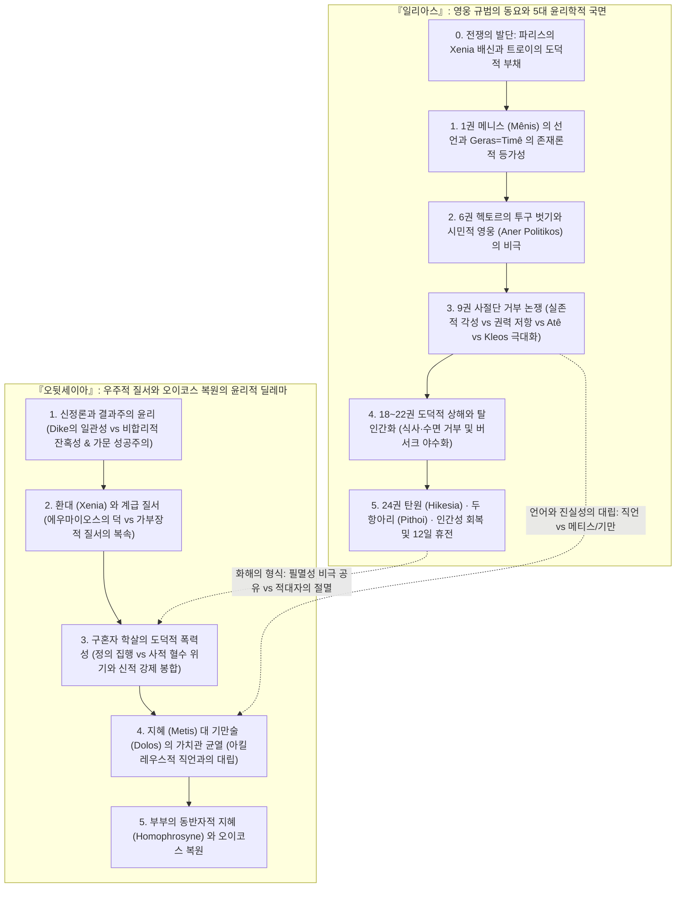
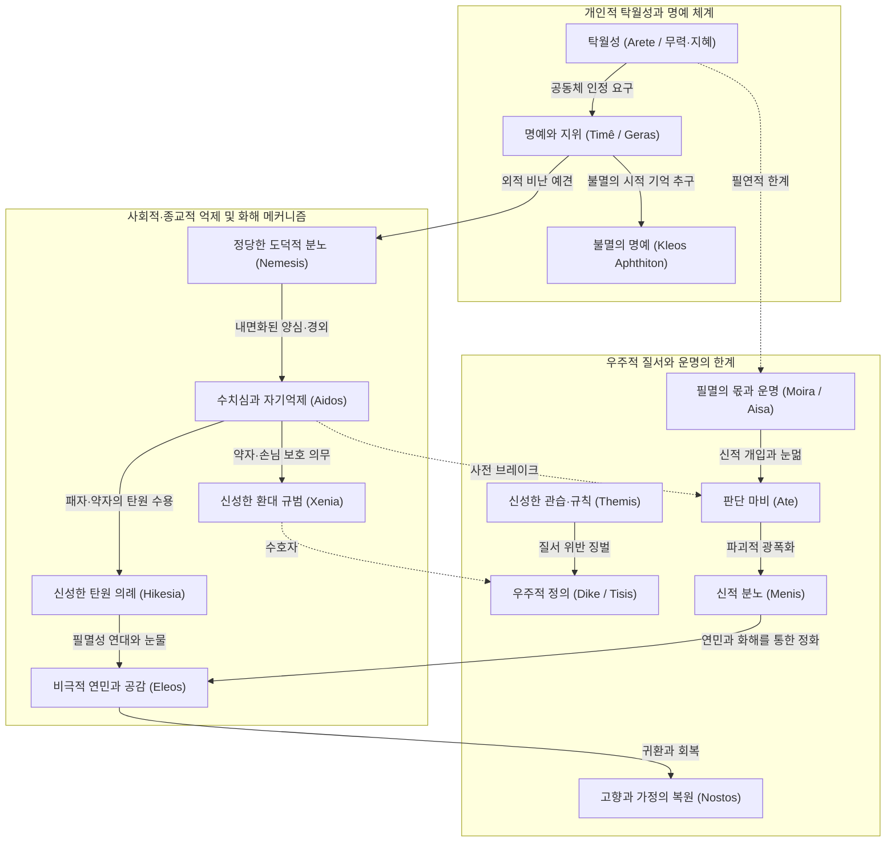
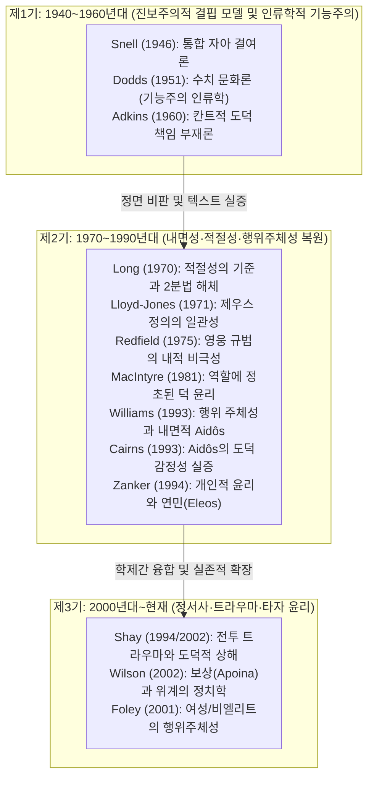

# 호메로스 서사시의 윤리학적 특징 및 전 세계 핵심 연구 문헌 종합

> [!NOTE] 지식베이스 총괄 개요
> 호메로스(Homer, Ὅμηρος)의 두 대서사시 **[[일리아스]]**(Iliad)와 **[[오뒷세이아]]**(Odyssey)는 서양 윤리 사상과 도덕 철학의 시원(始原)을 이루는 원천 텍스트입니다. 20세기 중반 이후 고전문헌학, 고대철학, 역사심리학, 도덕인류학, 현대 정신의학 분야에서 전개된 호메로스 윤리학 연구는 단순한 문학 비평을 넘어 **'인간의 행위 주체성(Agency), 도덕적 책임, 정서의 내면성, 그리고 비극적 실존의 한계'**를 규명하는 세계 철학계의 핵심 격전장이었습니다.
>
> 본 분석 문서는 `wiki/sources/`에 구축된 13종의 심층 연구 도시에와 전 세계 학술 정전을 총결집하여, 호메로스 윤리 체계의 거시적 다이얼렉틱과 80년에 걸친 학술 패러다임 변천사를 종합 해제합니다.

---

## 1. 호메로스 윤리학 연구 문헌 TOP 20

전 세계 학술 데이터베이스(Google Scholar, OpenAlex, PhilPapers, JSTOR, KCI)를 종합한 호메로스 윤리학 분야 핵심 문헌 순위입니다.

|  순위  | 저자                       | 저작 / 논문명 (연도)                              |            피인용수             | 핵심 연구 내용 및 윤리학적 기여                                                                                                           |          위키 심층 도시에 링크           |
| :----: | :------------------------- | :------------------------------------------------ | :-----------------------------: | :---------------------------------------------------------------------------------------------------------------------------------------- | :--------------------------------------: |
| **1**  | **Bernard Williams**       | **_Shame and Necessity_** (1993)                  |           **2,850+**            | **고대 도덕심리학 복원.** 스넬-애드킨스식 발전론 비판, 호메로스 영웅의 행위 주체성(Agency), 필연성, '내면화된 타자' 중심의 [[Aidos]] 복원 |  [[williams-1993-shame-and-necessity]]   |
| **2**  | **Alasdair MacIntyre**     | **_After Virtue_** (1981, 제10장)                 | **25,400+** _(호메로스 2,400+)_ | **현대 덕 윤리학의 정초.** 호메로스 사회에서 덕([[Arete]])은 사회적 역할(Role) 및 삶의 서사적 통일성에 내재함을 규명 (Is-Ought 일치)      |   [[macintyre-1981-after-virtue-ch10]]   |
| **3**  | **E. R. Dodds**            | **_The Greeks and the Irrational_** (1951)        | **5,600+** _(호메로스 2,100+)_  | 호메로스 사회를 **'수치 문화(Shame Culture)'**로 규정. 아테([[Ate]], 정신적 눈멂)와 신적 개입의 심리적 외주화 메커니즘 분석               |   [[dodds-1951-greeks-and-irrational]]   |
| **4**  | **Jean-Pierre Vernant**    | **_L'individu, la mort, l'amour_** (1989)         | **4,150+** _(호메로스 1,850+)_  | **프랑스 구조주의 역사심리학.** 영웅의 **'아름다운 죽음(la belle mort, kalos thanatos)'**과 [[Kleos]], 시신 훼손 금기와 형이상학 분석     |       [[vernant-1989-belle-mort]]        |
| **5**  | **Walter Burkert**         | **_Griechische Religion_** (1977)                 | **3,680+** _(호메로스 1,500+)_  | **종교-제의적 윤리 규범.** 제우스 크세니오스, 맹세(Horkos), 희생제의를 통한 [[Xenia]] 및 우주적 도덕률 통합 분석                          |     [[burkert-1977-greek-religion]]      |
| **6**  | **Bruno Snell**            | **_Die Entdeckung des Geistes_** (1946)           | **3,280+** _(호메로스 1,950+)_  | **독일 문헌학적 정신사.** Soma/Psyche 어휘 분석을 통한 호메로스 인간의 통합 자아 결여 및 외적 동기화 테제 제창                            |     [[snell-1946-discovery-of-mind]]     |
| **7**  | **M. I. Finley**           | **_The World of Odysseus_** (1954)                | **3,120+** _(호메로스 1,700+)_  | **역사사회학적 접근.** 선물 교환(Gift-exchange), [[Xenia]], 오이코스(Oikos) 질서와 계층적 영웅 윤리의 물질적 토대 규명                    |    [[finley-1954-world-of-odysseus]]     |
| **8**  | **Jonathan Shay**          | **_Achilles in Vietnam_** (1994)                  |           **2,500+**            | **정신의학-윤리학 융합.** 테미스([[Themis]])의 배신, **도덕적 상해(Moral Injury)**, 버서크(광폭화) 상태와 애도·환대를 통한 치유 규명      |    [[shay-1994-achilles-in-vietnam]]     |
| **9**  | **Arthur W. H. Adkins**    | **_Merit and Responsibility_** (1960)             |           **1,820+**            | **호메로스 가치어 분석의 출발점.** '경쟁적 덕([[Arete]])' 대 '협력적 덕([[Dike]])' 2분법 및 근대적 도덕 책임 부재론 제창                  | [[adkins-1960-merit-and-responsibility]] |
| **10** | **James M. Redfield**      | **_Nature and Culture in the Iliad_** (1975)      |           **1,650+**            | **영웅 규범의 문화인류학적 비극.** 헥토르의 시민적 영웅성(aner politikos), 영웅 윤리가 문명을 파괴하는 내적 모순 분석                     |   [[redfield-1975-nature-and-culture]]   |
| **11** | **Richard Seaford**        | **_Reciprocity and Ritual_** (1994)               |           **1,250+**            | **상호성(Reciprocity) 윤리의 위기와 회복.** 교환 파탄 및 [[Xenia]] 유린을 통한 서사시와 초기 폴리스 윤리 분석                             | [[seaford-1994-reciprocity-and-ritual]]  |
| **12** | **Douglas L. Cairns**      | **_Aidos_** (1993)                                |           **1,150+**            | **[[Aidos]] 연구의 정전.** 텍스트 전수 조사로 사전 억제적(Prospective) 양심, 타인 공감, Nemesis와의 상호작용 실증                         |          [[cairns-1993-aidos]]           |
| **13** | **Hugh Lloyd-Jones**       | **_The Justice of Zeus_** (1971)                  |            **980+**             | 『일리아스』와 『오뒷세이아』 전반에 일관되게 작동하는 제우스의 정의([[Dike]])와 종교적 도덕 질서의 연속성 증명                           |   [[lloyd-jones-1971-justice-of-zeus]]   |
| **14** | **Christopher Gill**       | **_Personality in Greek Epic_** (1996)            |            **920+**             | 도덕심리학적 접근. 데카르트적 고립 자아가 아닌 '객관적-참여자적 자아(Objective-participant self)' 모델 정립                               | [[gill-1996-personality-in-greek-epic]]  |
| **15** | **Marcel Detienne**        | **_Les Maîtres de vérité_** (1967)                |            **890+**             | 아르카익기 진리(Aletheia)와 [[Dike]]. 시인·왕·예언자의 종교-윤리적 권위와 정의의 신화적 기초 해명                                         |   [[detienne-1967-maitres-de-verite]]    |
| **16** | **Gregory Nagy**           | **_The Best of the Achaeans_** (1979)             |  **2,100+** _(호메로스 850+)_   | '최고의 영웅(Aristos Achaion)' 개념. 무력(Bie) 대 지혜(Metis)의 윤리적 긴장과 불멸의 명예([[Kleos]]) 분석                                 |    [[nagy-1979-best-of-the-achaeans]]    |
| **17** | **Hans van Wees**          | **_Status Warriors_** (1992)                      |            **750+**             | 호메로스 사회의 지위(Status) 경쟁, 모욕(Hybris)과 분노, 귀족 전사 계급의 아고니스틱(Agonistic) 윤리 구조 분석                             |    [[van-wees-1992-status-warriors]]     |
| **18** | **Albin Lesky**            | **_Göttliche und menschliche Motivation_** (1961) |            **420+**             | **'이중 동기화(Doppelte Motivation)' 이론.** 신적 섭리와 인간의 자율적 도덕적 결단의 완벽한 양립성 논증                                   |   [[lesky-1961-gottliche-motivation]]    |
| **19** | **A. A. Long**             | **_Morals and Values in Homer_** (1970, _JHS_)    |            **320+**             | **애드킨스 2분법 해체 및 '적절성의 기준(Appropriateness)' 확립.** 과도/결핍 통제와 상호적 [[Timê]], 아리스토텔레스 중용의 선구            |     [[long-1970-morals-and-values]]      |
| **20** | **Graham Zanker**          | **_The Heart of Achilles_** (1994)                |            **260+**             | **개인적 윤리(Personal Ethics)의 발전.** 대도량(Megalopsychia)과 연민(Eleos)을 통한 아킬레우스의 내적 성숙 분석                           |    [[zanker-1994-heart-of-achilles]]     |

---

## 2. 『일리아스』와 『오뒷세이아』의 윤리학적 지형과 다원적 논쟁 구조

호메로스의 두 서사시를 단순한 '비극/해체 대 정의/회복'이라는 도식적 대칭으로 환원하는 것은, 각 작품이 품고 있는 치열한 윤리학적 모순과 학계의 다원적 쟁점을 은폐할 위험이 있습니다. 두 서사시는 각각 독자적인 역사적·사회적 맥락 속에서 **영웅주의의 내적 한계, 정의(Dike)의 양면성과 폭력성, 그리고 인간 행위 주체성의 딜레마**를 다각도로 탐색하는 '복합적 다성(Polyphonic) 담론의 장'으로 이해되어야 합니다.

### 2.1 『일리아스』: 영웅 규범의 동요와 5대 국면별 학술 쟁점

#### 0. 도덕적 범죄와 전쟁의 기원: 파리스의 크세니아([[Xenia]]) 배신 ([[lee-junseok-2024-iliad-jeongam|이준석 2024]])
* 트로이 전쟁은 단순한 영토 쟁탈전이 아닙니다. 손님으로 환대받았던 파리스가 메넬라오스의 안주인 헬레네와 보물을 훔쳐 달아남으로써 고대 문명의 신성한 국제 도덕률인 환대 규범을 유린한 도덕적 범죄가 전쟁의 근본 원인입니다.
* 트로이 진영은 개전 초기부터 **제우스 크세니오스(Zeus Xenios, 환대의 수호신 제우스)**에 대한 '도덕적 부채(Moral Deficit)'를 짊어지고 있었으며, 이는 트로이의 궁극적 멸망이 피할 수 없는 도덕적 필연성을 띱니다.

#### 1. 1권 메니스([[Menis]])의 신학적 차원과 게라스([[Geras]])의 존재론적 등가성
* **신적 분노 메니스(Mênis)의 선언**:
  * 서사시의 첫 단어인 *Mênis*(μῆνις)는 인간의 사적 노여움(Cholos, Kotos)과 구별되는, 오직 신들에게만 귀속되는 '우주적 파괴력'을 지닌 절대적 분노입니다. 아킬레우스의 분노가 메니스로 명명된 것은 그가 인간과 신의 경계선상에 서 있는 초월적 영웅임을 선언하는 문헌학적 장치입니다.
* **게라스(Geras)와 티메([[Timê]])의 존재론적 등가성**:
  * 영웅 사회에서 전리품(Geras)은 물질적 탐욕의 대상이 아니라, 전사가 목숨을 걸고 싸운 대가로 공동체로부터 공인받은 **'사회적 존재 증명(존재론적 명예)'**입니다. 아가멤논이 최고 지휘관의 권력으로 브리세이스를 강탈한 것은 아킬레우스의 전사로서의 존재 이유 자체를 말살한 폭거였습니다.
* **제우스의 계획(Dios Boulê)**:
  * 아킬레우스의 전선 이탈은 단순한 항명이 아니라, 아카이아 군단 전체가 그의 부재를 통해 아킬레우스라는 영웅의 대체 불가능성을 뼈저리게 절감하도록 만드는 윤리적 복수극의 전개입니다.

#### 2. 6권 헥토르의 '투구 벗기'와 시민적 영웅(Aner Politikos)의 이중 구속 ([[redfield-1975-nature-and-culture|Redfield 1975]], [[lee-junseok-2024-iliad-jeongam|이준석 2024]])
* **투구 벗기의 상징성**:
  * 헥토르가 아내 안드로마케와 아들 아스티아낙스를 만날 때, 울음을 터뜨리는 아이를 위해 **말총 투구를 벗어 땅에 내려놓는 장면**(_Il._ 6.466–474)은 전사의 무서운 사회적 가면을 벗고 한 인간이자 아버지로 돌아오는 상징적 순간입니다.
* **시민적 영웅의 비극적 딜레마**:
  * 헥토르는 가족과 조국을 수호하는 '시민적 영웅'이지만, 트로이의 필연적 멸망을 직감하면서도 동료와 백성들에 대한 수치심([[Aidos]]) 때문에 성벽 안으로 피신하지 못하고 전장으로 향합니다.
  * 이는 영웅적 명예 추구 규범이 역설적으로 공동체(트로이) 전체를 공멸로 몰고 가는 영웅주의의 내적 모순을 체현합니다.

#### 3. 9권 아킬레우스의 거부: '실존적 각성'인가, '권력 투쟁과 비극적 과오(Atê)'인가?
아킬레우스가 아가멤논의 물질적 배상을 거부하며 발언한 장면(_Il._ 9.318–409: *"겁쟁이나 용사나 똑같은 보상을 받고, 아무 일도 하지 않은 자나 혁혁한 공을 세운 자나 똑같이 죽는다"*)은 호메로스 해석사의 핵심 논쟁 지점입니다.
* **실존주의적/인본주의적 관점 ([[zanker-1994-heart-of-achilles|Zanker 1994]], Whitman 1958)**:
  물질적 전리품(Geras) 체계가 전사의 유한한 생명과 고유한 탁월함([[Arete]])을 결코 보상할 수 없다는 실존적 각성이자, 기성 가치체계를 초월한 독자적 내적 윤리의 정립으로 해석합니다.
* **사회역학적/권력론적 비판 ([[adkins-1960-merit-and-responsibility|Adkins 1960]], Griffin 1980, Postlethwaite 1998)**:
  아킬레우스가 거부한 것은 보상 체계 자체가 아니라, 아가멤논이 배상을 빌미로 요구한 **'위계적 복종(Submission)'**입니다. 아가멤논은 "그는 나에게 굴복해야 한다. 내가 더 왕답기 때문이다"(_Il._ 9.160–161)라고 선언했습니다. 따라서 거부는 물질의 무의미성 때문이 아니라, 자신의 존엄을 짓밟으려는 권력자의 오만에 맞선 저항입니다.
* **비극적 과오론과 아테(Atê) ([[dodds-1951-greeks-and-irrational|Dodds 1951]], Knox 1983)**:
  텍스트 내부에서 사절단(포이닉스, 아이아스)은 아킬레우스의 태도를 실존적 승화가 아니라 **파멸적인 고집과 공동체 배신**으로 정면 질타합니다. 아이아스는 살인 배상금(Poinê)을 받고 화해하는 영웅 사회의 관습법([[Themis]])조차 거부한 냉혹함을 비판하며, 포이닉스는 신들의 화해 규범을 어긴 맹목적 광기(**아테, Atê**)의 파멸을 경고합니다. 이 고집은 결국 파트로클로스의 전사라는 파국(Hamartia)으로 귀결됩니다.
* **신화시학적 불멸명성론 ([[nagy-1979-best-of-the-achaeans|Nagy 1979]], Slatkin 1991)**:
  아킬레우스의 목적은 보상 체계의 폐기가 아닙니다. 그는 유한한 세속적 전리품(Geras)을 포기하는 대신, 서사시 전통을 통해 영원히 기억되는 **'불멸의 명성([[Kleos|Kleos Aphthiton]])'**을 쟁취하고자 합니다. 즉, 영웅적 명예 체계의 이탈이 아니라 '궁극적 극대화'입니다.

#### 4. 18~22권: 도덕적 상해(Moral Injury)와 탈인간화(Dehumanization) ([[shay-1994-achilles-in-vietnam|Shay 1994]], [[lee-junseok-2024-iliad-jeongam|이준석 2024]])
* **테미스 배신과 분노의 전이**: 지휘관 아가멤논의 테미스 배신으로 도덕적 상해를 입은 아킬레우스는, 가장 사랑하는 전우 파트로클로스의 전사 이후 아가멤논을 향하던 사적 분노(Cholos)를 헥토르를 향한 절대적 복수심으로 전환합니다.
* **생물학적 필멸 조건의 거부 (식사와 수면의 단절)**:
  * 아킬레우스는 오디세우스의 식사 권유 논쟁(_Il._ 19.155–237)에서 음식을 거부하고 잠을 자지 않으며 신체적 고통에 무감각해집니다.
  * 12명의 트로이 청년을 산 제물로 바치고 스카만드로스 강물을 시체로 메우며 헥토르의 시신을 마차에 묶어 끌고 다니는 행위는, 문명을 이탈하여 **'신(God) 혹은 야수(Beast)'의 영역으로 퇴행한 탈인간화(Dehumanization)** 상태를 드러냅니다.

#### 5. 24권: 탄원([[Hikesia]]), 필멸성 연대, 그리고 12일의 한시적 휴전
* **탄원(Hikesia) 의례와 손키스의 현상학**:
  * 늙은 왕 프리아모스가 적진으로 잠입하여 아들을 죽인 원수 아킬레우스의 무릎을 잡고 손에 입을 맞추는 행위(_Il._ 24.477–479)는 왕으로서의 모든 사회적 티메(Timê)를 내려놓은 극한의 탄원입니다.
  * 아킬레우스가 노인의 손을 부드럽게 밀어내는 동작(ἀπώσα토 ἦκα)은 탄원의 거부가 아니라, 상대를 자신과 대등한 고통을 겪는 필멸자로 인식하며 생겨난 **경외([[Aidos]])와 거룩한 충격의 발현**입니다.
* **제우스의 두 항아리(Pithoi) 우화와 고통의 보편성**:
  * 아킬레우스가 설파하는 제우스 문간의 두 항아리(불행의 항아리와 축복의 항아리) 우화는 신들이 인간에게 내린 운명([[Moira]])의 불가피한 비극성을 드러냅니다.
  * 펠레우스도 프리아모스도 최고의 번영 뒤에 비참한 불행을 겪었음을 자각함으로써, 아킬레우스는 자신의 사적 원한을 **'모든 필멸자가 공유하는 보편적 비극의 일부'**로 객관화하고 숭고한 연민([[Eleos]])으로 승화합니다.
* **니오베 신화와 인간적 조건(식사·수면)의 복원**:
  * 자식 열둘을 잃은 니오베도 결국 음식을 먹었다는 신화를 들려주며 프리아모스와 함께 식사를 나누고 잠자리를 마련해 주는 것은, 탈인간화되었던 영웅이 다시 **'필멸의 인간적 조건(Condition Humaine)'**으로 복귀하는 핵심적인 서사적 의례입니다.
* **12일간의 한시적 휴전(Spondai)과 비극적 실존주의**:
  * 24권의 화해는 트로이 전쟁의 영구적 종결이 아닙니다. 헥토르의 장례를 온전히 치르기 위해 약속된 **'12일간의 휴전'**이며, 장례가 끝나면 전쟁은 재개되고 트로이는 파멸할 것입니다.
  * 이는 운명의 비극적 필연성을 제거하는 공상적 유토피아가 아니라, **피할 수 없는 죽음과 전쟁의 수레바퀴 속에서 인간이 도모할 수 있는 최선의 존엄과 연민의 순간**을 보여줍니다 ([[lloyd-jones-1971-justice-of-zeus|Lloyd-Jones 1971]], [[williams-1993-shame-and-necessity|Williams 1993]]).

---

### 2.2 『오뒷세이아』: 정의([[Dike]]), 회복([[Nostos]]), 그리고 윤리적 딜레마

#### 1. 제우스의 정의([[Dike]]) 선언과 신정론(Theodicy)의 긴장
* **정의의 보편성 테제 ([[lloyd-jones-1971-justice-of-zeus|Lloyd-Jones 1971]])**: 서두 제우스의 선언(_Od._ 1.32–34)을 통해 인간의 방자함(Atasthalia)이 파멸을 자초한다는 도덕적 인과응보 질서가 천명됩니다.
* **결과주의적 성공 윤리 비판 ([[adkins-1960-merit-and-responsibility|Adkins 1960]])**: 『오뒷세이아』의 정의는 순수한 칸트적 도덕이 아니라, '자기 가문(Oikos)을 수호하고 번영시키는 자가 곧 선한 자(Agathos)'가 되는 결과주의적·경쟁적 윤리입니다.
* **신정론의 불완전성 ([[dodds-1951-greeks-and-irrational|Dodds 1951]])**: 포세이돈의 맹목적 복수와 무고한 선원들의 죽음 등은 여전히 비합리적 신적 폭력성을 띠고 있어, 서사시의 도덕적 질서가 완벽한 합리성을 갖추지 못했음을 보여줍니다.

> [!WARNING] 모순/이설 발견: 『오뒷세이아』 신정론(Theodicy)의 성격을 둘러싼 학설 대립
> - **도덕적 연속성 학설 (Lloyd-Jones)**: 『일리아스』와 『오뒷세이아』 모두에 제우스의 공평무사한 정의가 일관되게 관철된다고 봅니다.
> - **결과주의 및 불완전성 학설 (Adkins, Dodds)**: 『오뒷세이아』의 Dike는 보편적 도덕률이라기보다 오이코스 보전과 승리라는 결과주의적 정당화에 불과하며, 신들의 자의적 복수심과 모순을 온전히 해결하지 못한다고 비판합니다.

#### 2. 환대([[Xenia]]) 규범과 하층민의 도덕적 주체성
* **도덕적 계층 역전 ([[finley-1954-world-of-odysseus|Finley 1954]])**: 돼지치기 에우마이오스와 유모 에우리클레이아는 귀족 구혼자들보다 철저하게 크세니아와 신의를 실천하여 아레테([[Arete]])가 신분과 무관함을 증명합니다.
* **가부장적 질서의 한계**: 그러나 이들의 충성은 근대적 평등주의가 아니라, 가부장적 오이코스 질서에 완벽히 복속되어 주인의 권력을 회복시키는 데 기여하는 종속적 덕목의 성격을 유지합니다.

#### 3. 22~24권 구혼자 학살의 도덕적 폭력성과 피의 복수(Blood-feud) 위기
* 구혼자 108명의 전멸과 하녀 12명의 잔혹한 교수형은 정의의 집행인 동시에 극단적 폭력의 표출입니다.
* 이 학살은 이타케 공동체 내부의 끝없는 사적 보복전(Blood-feud)을 촉발하여 사회 전체를 붕괴시킬 뻔했으나, 오직 아테나 여신의 초자연적 개입(Deus ex machina)을 통한 강제 평화 조약으로만 간신히 봉합됩니다 ([[seaford-1994-reciprocity-and-ritual|Seaford 1994]]).

#### 4. 지혜(Metis / μῆτις) 대 기만(Dolos / δόλος)의 윤리적 균열
* 『일리아스』의 아킬레우스가 *"마음속에 품은 것과 다르게 말하는 자는 하데스의 문만큼 밉다"*(_Il._ 9.312–313)며 직언(Parrhesia)을 영웅의 덕목으로 삼은 반면, 『오뒷세이아』는 인내(Tlêmosynê, τλημοσύνη)와 더불어 거짓말, 변장, 함정(Dolos, δόλος)을 영웅적 탁월성으로 찬양합니다 (Detienne & Vernant 1974). 두 서사시 간의 이러한 도덕관 충돌은 아르카익기 그리스 사회의 생존 윤리 변천을 반영합니다.

#### 5. 페넬로페의 주체적 지혜와 호모프로시네(Homophrosynê / ὁμοφροσύνη)
* 『오뒷세이아』의 도덕적 승리는 남성 영웅의 무력뿐 아니라, 페넬로페와의 지적·도덕적 동등성(**호모프로시네, Homophrosynê, ὁμοφροσύνη, 부부의 일치된 지혜**)을 통해 오이코스를 복원하는 상호협력적 성격을 지닙니다.

---

### 2.3 『일리아스』와 『오뒷세이아』의 윤리학적 쟁점 대조 매트릭스

| 비교 축 | 『일리아스』 (Iliad) | 『오뒷세이아』 (Odyssey) | 학술적 쟁점 및 긴장 |
| :--- | :--- | :--- | :--- |
| **핵심 윤리 영역** | 전장(Polemos)과 영웅 전사 공동체 | 가정(Oikos)과 폴리스 질서의 회복 | 무력 중심의 집단 윤리 vs 가문 수호 중심의 생존 윤리 |
| **최고의 탁월성** | 무용(Bie)과 불멸의 명성([[Kleos]]) | 지혜([[Metis]]), 인내(Tlemosyne), 기만술(Dolos) | 아킬레우스적 정직성 vs 오디세우스적 실용주의 |
| **보상과 명예 체계** | 전리품([[Geras]])과 티메([[Timê]])의 충돌 | 오이코스 자산의 탈환과 사회적 지위 복원 | 외적 보상의 실존적 파탄 vs 사적 소유권의 재확립 |
| **정의([[Dike]])의 성격** | 운명([[Moira]])과 힘의 지배, 신들의 편향 | 방자함(Atasthalia)에 대한 인과응보적 심판 | 비극적 실존주의 vs 신정론(Theodicy)과 결과주의 |
| **사회적 억제 기제** | 수치심([[Aidos]])과 도덕적 분노(Nemesis) | 신성한 환대 규범([[Xenia]])과 제우스의 징벌 | 내면화된 타자 시선 vs 종교적·법적 환대 의무 |
| **갈등 해결 방식** | 24권: 필멸성 연대와 눈물의 애도(Eleos) | 22~24권: 구혼자 절멸과 신적 강제 평화 | 비극적 한계 수용 vs 폭력적 응징과 제도적 봉합 |

---

## 3. 호메로스 14대 핵심 윤리 개념 다이얼렉틱 매트릭스

호메로스 윤리학은 개별 개념들의 단순한 나열이 아니라, 상호 긴장과 제어를 통해 우주와 인간 사회의 균형을 유지하는 **고도로 정교한 유기적 도덕망**입니다.

| 희랍어 개념 | 고대 그리스어 원어 | 핵심 윤리학적 의미 및 사회적 기능 | 긴장 관계 및 상호작용 개념 |
| :--- | :--- | :--- | :--- |
| **아레테 ([[Arete]])** | ἀρετή | 전사의 무용(Bie), 지혜(Metis), 역할의 탁월성 | 티메([[Timê]])와 결합하지 못하면 1권 아킬레우스처럼 고립됨 |
| **티메 ([[Timê]])** | τιμή | 사회적 명예, 존경, 전리품(Geras)을 통한 가치 공인 | 아가멤논의 탐욕에 의해 훼손될 때 도덕적 상해 발생 |
| **클레오스 ([[Kleos]])** | κλέος | 시인의 찬미를 통해 사후에 영원히 남는 불멸의 명예 | 아름다운 죽음([[vernant-1989-belle-mort\|Kalos Thanatos]])을 통해서만 완성됨 |
| **아이도스 ([[Aidos]])** | αἰδώς | 사전 억제적 양심, 자기존중, 약자·탄원자에 대한 경외 | 네메시스(Nemesis)를 내면화하여 비도덕적 행위를 차단함 |
| **네메시스 (Nemesis)** | νέμεσις | 부당한 행동에 대한 공동체와 신들의 정당한 도덕적 분노 | 아이도스(Aidos)와 짝을 이루어 사회 규범을 강제함 |
| **디케 ([[Dike]])** | δίκη | 각자의 정당한 몫을 유지하게 하는 제우스의 우주적 정의 | 오만(Hybris)과 방자함(Atasthalia)에 대해 반드시 보복(Tisis)을 내림 |
| **테미스 ([[Themis]])** | θέμις | 공동체의 확립된 관습, 리더가 지켜야 할 신성한 도덕 규칙 | 지휘관이 이를 배신할 때 전사에게 '도덕적 상해'가 발생함 |
| **크세니아 ([[Xenia]])** | ξενία | 이방인과 손님을 환대하고 보호하는 신성한 종교 규범 | 파리스의 크세니아 배신은 트로이 멸망의 도덕적 원인이 됨 |
| **히케시아 ([[Hikesia]])** | ἱκεσία | 약자·패자가 신의 가호 아래 자비를 구하는 신성한 탄원 의례 | 아이도스(Aidos)를 촉발하여 적대적 폭력을 멈추고 연민을 이끌어냄 |
| **엘레오스 ([[Eleos]])** | ἔλεος | 인간 유한성과 필멸성(Mortality)을 공유하는 비극적 연민 | 메니스(Menis)의 광기를 종식시키고 화해를 가능케 하는 궁극의 정서 |
| **모이라 ([[Moira]])** | μοῖρα | 필멸의 한계, 정해진 몫과 운명 | 인간의 자유로운 도덕적 선택([[williams-1993-shame-and-necessity\|Agency]])과 양립함 |
| **아테 ([[Ate]])** | ἄτη | 신들이 내린 일시적 판단 마비, 정신적 눈멂 | 파멸을 초래하지만 행위자는 물질적 배상(Apoina) 책임을 짐 |
| **메니스 ([[Menis]])** | μῆνις | 우주적 파괴력을 지닌 신적 분노 | 24권 탄원(Hikesia)과 연민(Eleos)을 통해서만 최종 정화됨 |
| **노스토스 ([[Nostos]])** | νόστος | 고난을 극복하고 가정과 사회 질서로 돌아가는 귀환 | 오이코스(Oikos)의 도덕적 정의 복원과 직결됨 |

---

## 4. 20~21세기 호메로스 윤리학 패러다임 3단계 변천사

호메로스 윤리학 연구사는 근대 계몽주의적 우월감에서 출발하여 고대 텍스트의 독자적 심오함을 복원하고, 현대 정신의학과 사회적 타자성으로 확장되어 온 지성사적 궤적을 보여줍니다.

### [3대 학술 패러다임 비교 대조표]

| 패러다임 구분 | 시기 및 대표 학자 | 핵심 전제 및 호메로스 윤리관 | 비판 및 학술적 평가 |
| :--- | :--- | :--- | :--- |
| **1. 결핍 및 발전론 모델** | 1940~1960년대 (Snell, Dodds, Adkins) | 호메로스 인간은 칸트적 자유의지, 통합 영혼, 죄책감이 결여된 미성숙한 상태 (Dodds는 Ruth Benedict의 수치/죄책 문화 인류학 모델 적용) | 근대 서구/기독교 중심적 편견(Progressivist Fallacy)으로 고대를 왜곡했다는 비판을 받음 |
| **2. 주체성 및 적절성 복원 모델** | 1970~1990년대 (Long, Lloyd-Jones, Williams, Cairns, MacIntyre, Zanker) | 호메로스 영웅은 의도-동기-노력을 평가받는 도덕 주체이며, 행위는 **'적절성의 기준(Appropriateness)'**에 따라 과도와 결핍이 규제됨 | 고대 그리스 윤리의 독자적 완성도를 회복하고 현대 도덕철학을 혁신함 |
| **3. 트라우마 및 타자 윤리** | 2000년대~현재 (Shay, Wilson) | 서사시는 전쟁 트라우마, 도덕적 상해, 비엘리트와 여성의 연대, 필멸성의 화해를 다룸 | 서사시를 현대 임상의학, 평화철학, 비교인류학과 결합하여 실존적 현재화 달성 |

---

## 5. 운명(Moira), 신적 개입(Ate), 그리고 인간의 자율적 결단

호메로스 서사시의 윤리학을 이해할 때 가장 흔히 오해되는 부분은 '운명론(Fatalism)'과의 관계입니다.

- **A. A. 롱([[long-1970-morals-and-values|A. A. Long, 1970]])의 '적절성의 기준'과 도덕적 균형**:
  - 서사시의 행위 평가는 *kata moiran*, *themis*, *kata kosmon*, *eoike* 등 '적절함(Appropriateness)'의 공식구를 통해 규율되며, 과도한 오만(*hybris*)과 비겁한 결핍을 동시에 억제함.
- **알빈 레스키([[lesky-1961-gottliche-motivation|Albin Lesky, 1961]])의 이중 동기화(Doppelte Motivation) 이론**:
  - 서사시에서 한 사건은 동시에 '신적 차원의 섭리'와 '인간 차원의 자율적 심리 동기'라는 두 가지 층위에서 완전히 설명됩니다.
  - 예: 아킬레우스가 칼을 뽑으려다 멈추는 행위(_Il._ 1.188–222)는 아테나의 개입인 동시에, 아킬레우스 자신의 내적 판단력과 자제력의 발현입니다.
- **버나드 윌리엄스([[williams-1993-shame-and-necessity|Bernard Williams, 1993]])의 필연성(Ananke)과 행위 주체성**:
  - 모이라는 인간이 언젠가 죽는다는 한계, 혹은 트로이가 함락된다는 거대한 역사적 '테두리'를 규정할 뿐입니다.
  - 그 제약 속에서 영웅이 어떤 도덕적 태도로 죽음을 마주하고(아킬레우스의 결단), 어떤 방법으로 타인의 고통에 응답할지(24권의 눈물)는 전적으로 **인간의 자유로운 도덕적 선택(Moral Agency)**에 맡겨져 있습니다.

---

## 관련 항목

### 호메로스 텍스트

- [[일리아스]]
- [[오뒷세이아]]
- [[아킬레우스]]
- [[헥토르]]
- [[오디세우스]]
- [[페넬로페]]
- [[프리아모스]]

### 호메로스 핵심 윤리 개념

- [[Arete]] (탁월성 / 무용 / 덕)
- [[Timê]] (명예 / 사회적 인정 / 지위)
- [[Kleos]] (불멸의 명예 / 시적 기억)
- [[Aidos]] (수치심 / 양심 / 타인 경외)
- [[Dike]] (정의 / 응보 / 제우스의 질서)
- [[Themis]] (신성한 관습 / 공정한 규칙)
- [[Xenia]] (손님 환대 / 국제 도덕률)
- [[Hikesia]] (탄원의 의례 / 신성한 보호)
- [[Eleos]] (연민 / 필멸성의 비극적 공감)
- [[Moira]] (운명 / 정해진 몫)
- [[Ate]] (정신적 눈멂 / 신적 미망)
- [[Menis]] (신적 분노 / 우주적 파괴력)
- [[Nostos]] (귀환 / 오이코스의 회복)

### 심층 소스 연구 도시에

- [[williams-1993-shame-and-necessity]] — 버나드 윌리엄스: 수치심과 필연성 (행위 주체성 및 Aidos 복원)
- [[adkins-1960-merit-and-responsibility]] — A. W. H. 애드킨스: 공적과 책임 (경쟁적 가치 vs 협력적 가치)
- [[long-1970-morals-and-values]] — A. A. 롱: 호메로스의 도덕과 가치 (적절성의 기준과 과도/결핍 통제 모델)
- [[cairns-1993-aidos]] — 더글러스 케언스: 아이도스 (도덕 정서로서의 Aidos 텍스트 전수 분석)
- [[dodds-1951-greeks-and-irrational]] — E. R. 도즈: 그리스인들과 비합리적인 것 (수치 문화와 Atē 분석)
- [[snell-1946-discovery-of-mind]] — 브루노 스넬: 정신의 발견 (호메로스 인체관 및 영혼 개념사)
- [[redfield-1975-nature-and-culture]] — 제임스 레드필드: 일리아스의 자연과 문화 (헥토르의 비극과 문화의 파탄)
- [[shay-1994-achilles-in-vietnam]] — 조너선 셰이: 베트남의 아킬레우스 (테미스 배신, 도덕적 상해, 치유)
- [[lloyd-jones-1971-justice-of-zeus]] — 휴 로이드-존스: 제우스의 정의 (호메로스 서사시의 우주적 정의 Dike)
- [[macintyre-1981-after-virtue-ch10]] — 알래스데어 매킨타이어: 덕의 상실 10장 (역할에 정초된 덕과 서사적 통일성)
- [[vernant-1989-belle-mort]] — 장-피에르 베르낭: 아름다운 죽음과 호메로스 영웅 윤리
- [[zanker-1994-heart-of-achilles]] — 그레이엄 잰커: 아킬레우스의 마음 (개인적 윤리와 대도량, 연민)
- [[lee-junseok-2024-iliad-jeongam]] — 이준석 교수: 정암학당 2024 호메로스 『일리아스』 4강 연속 집중강좌 전편 해제

### 메타 및 대시보드

- [[index]] — 호메로스 위키 전체 카탈로그
- [[overview]] — 호메로스 서사시 위키 대시보드
