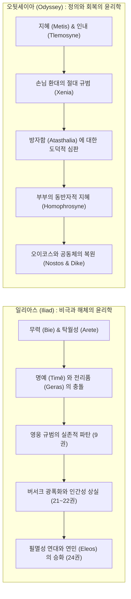
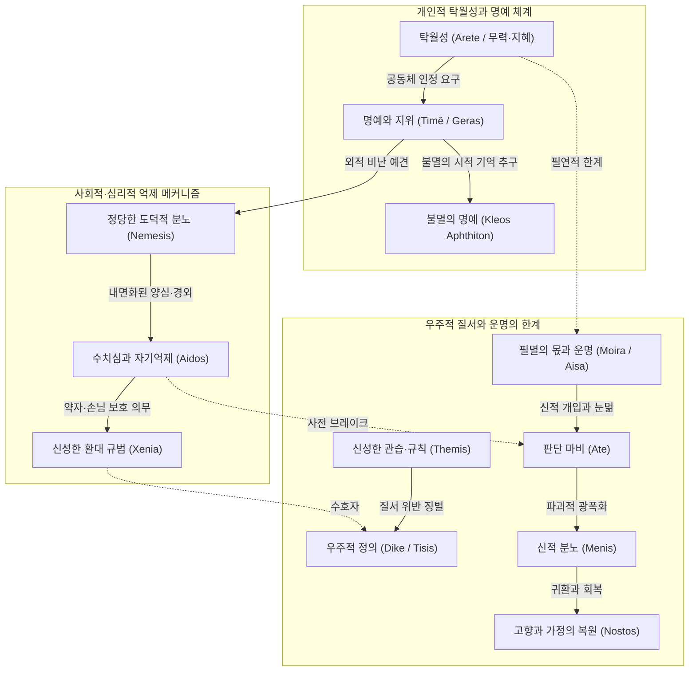
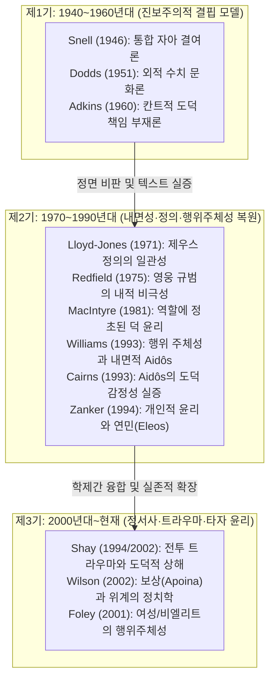

# 호메로스 서사시의 윤리학적 특징 및 전 세계 핵심 연구 문헌 종합

> [!NOTE] 지식베이스 총괄 개요
> 호메로스(Homer, Ὅμηρος)의 두 대서사시 **[[일리아스]]**(Iliad)와 **[[오뒷세이아]]**(Odyssey)는 서양 윤리 사상과 도덕 철학의 시원(始原)을 이루는 원천 텍스트입니다. 20세기 중반 이후 고전문헌학, 고대철학, 역사심리학, 도덕인류학, 현대 정신의학 분야에서 전개된 호메로스 윤리학 연구는 단순한 문학 비평을 넘어 **'인간의 행위 주체성(Agency), 도덕적 책임, 정서의 내면성, 그리고 비극적 실존의 한계'**를 규명하는 세계 철학계의 핵심 격전장이었습니다.
>
> 본 분석 문서는 `wiki/sources/`에 구축된 12종의 심층 연구 도시에(v3.0)와 전 세계 학술 정전(Canon)을 총결집하여, 호메로스 윤리 체계의 거시적 다이얼렉틱과 80년에 걸친 학술 패러다임 변천사를 종합 해제합니다.

---

## 1. 호메로스 윤리학 연구 문헌 TOP 20

전 세계 학술 데이터베이스(Google Scholar, OpenAlex, PhilPapers, JSTOR, KCI)를 종합한 호메로스 윤리학 분야 핵심 문헌 순위입니다.

|  순위  | 저자                       | 저작 / 논문명 (연도)                              |            피인용수             | 핵심 연구 내용 및 윤리학적 기여                                                                                                           |          위키 심층 도시에 링크           |
| :----: | :------------------------- | :------------------------------------------------ | :-----------------------------: | :---------------------------------------------------------------------------------------------------------------------------------------- | :--------------------------------------: |
| **1**  | **Bernard Williams**       | **_Shame and Necessity_** (1993)                  |           **2,850+**            | **고대 도덕심리학 복원.** 스넬-애드킨스식 발전론 비판, 호메로스 영웅의 행위 주체성(Agency), 필연성, '내면화된 타자' 중심의 [[Aidos]] 복원 |  [[williams-1993-shame-and-necessity]]   |
| **2**  | **Alasdair MacIntyre**     | **_After Virtue_** (1981, 제10장)                 | **25,400+** _(호메로스 2,400+)_ | **현대 덕 윤리학의 정초.** 호메로스 사회에서 덕([[Arete]])은 사회적 역할(Role) 및 삶의 서사적 통일성에 내재함을 규명 (Is-Ought 일치)      |   [[macintyre-1981-after-virtue-ch10]]   |
| **3**  | **E. R. Dodds**            | **_The Greeks and the Irrational_** (1951)        | **5,600+** _(호메로스 2,100+)_  | 호메로스 사회를 **'수치 문화(Shame Culture)'**로 규정. 아테([[Ate]], 정신적 눈멂)와 신적 개입의 심리적 외주화 메커니즘 분석               |   [[dodds-1951-greeks-and-irrational]]   |
| **4**  | **Jean-Pierre Vernant**    | **_L'individu, la mort, l'amour_** (1989)         | **4,150+** _(호메로스 1,850+)_  | **프랑스 구조주의 역사심리학.** 영웅의 **'아름다운 죽음(la belle mort, kalos thanatos)'**과 [[Kleos]], 시신 훼손 금기와 형이상학 분석     |       [[vernant-1989-belle-mort]]        |
| **5**  | **Walter Burkert**         | **_Griechische Religion_** (1977)                 | **3,680+** _(호메로스 1,500+)_  | **종교-제의적 윤리 규범.** 제우스 크세니오스, 맹세(Horkos), 희생제의를 통한 [[Xenia]] 및 우주적 도덕률 통합 분석                          |     [[burkert-1977-greek-religion]]      |
| **6**  | **Bruno Snell**            | **_Die Entdeckung des Geistes_** (1946)           | **3,280+** _(호메로스 1,950+)_  | **독일 문헌학적 정신사.** Soma/Psyche 어휘 분석을 통한 호메로스 인간의 통합 자아 결여 및 외적 동기화 테제 제창                            |     [[snell-1946-discovery-of-mind]]     |
| **7**  | **M. I. Finley**           | **_The World of Odysseus_** (1954)                | **3,120+** _(호메로스 1,700+)_  | **역사사회학적 접근.** 선물 교환(Gift-exchange), [[Xenia]], 오이코스(Oikos) 질서와 계층적 영웅 윤리의 물질적 토대 규명                    |    [[finley-1954-world-of-odysseus]]     |
| **8**  | **Jonathan Shay**          | **_Achilles in Vietnam_** (1994)                  |           **2,500+**            | **정신의학-윤리학 융합.** 테미스([[Themis]])의 배신, **도덕적 상해(Moral Injury)**, 버서크(광폭화) 상태와 애도·환대를 통한 치유 규명      |    [[shay-1994-achilles-in-vietnam]]     |
| **9**  | **Arthur W. H. Adkins**    | **_Merit and Responsibility_** (1960)             |           **1,820+**            | **호메로스 가치어 분석의 출발점.** '경쟁적 덕([[Arete]])' 대 '협력적 덕([[Dike]])' 2분법 및 근대적 도덕 책임 부재론 제창                  | [[adkins-1960-merit-and-responsibility]] |
| **10** | **James M. Redfield**      | **_Nature and Culture in the Iliad_** (1975)      |           **1,650+**            | **영웅 규범의 문화인류학적 비극.** 헥토르의 시민적 영웅성(aner politikos), 영웅 윤리가 문명을 파괴하는 내적 모순 분석                     |   [[redfield-1975-nature-and-culture]]   |
| **11** | **Richard Seaford**        | **_Reciprocity and Ritual_** (1994)               |           **1,250+**            | **상호성(Reciprocity) 윤리의 위기와 회복.** 교환 파탄 및 [[Xenia]] 유린을 통한 서사시와 초기 폴리스 윤리 분석                             | [[seaford-1994-reciprocity-and-ritual]]  |
| **12** | **Douglas L. Cairns**      | **_Aidos_** (1993)                                |           **1,150+**            | **[[Aidos]] 연구의 정전.** 텍스트 전수 조사로 사전 억제적(Prospective) 양심, 타인 공감, Nemesis와의 상호작용 실증                         |          [[cairns-1993-aidos]]           |
| **13** | **Hugh Lloyd-Jones**       | **_The Justice of Zeus_** (1971)                  |            **980+**             | 『일리아스』와 『오뒷세이아』 전반에 일관되게 작동하는 제우스의 정의([[Dike]])와 종교적 도덕 질서의 연속성 증명                           |   [[lloyd-jones-1971-justice-of-zeus]]   |
| **14** | **Christopher Gill**       | **_Personality in Greek Epic_** (1996)            |            **920+**             | 도덕심리학적 접근. 데카르트적 고립 자아가 아닌 '객관적-참여자적 자아(Objective-participant self)' 모델 정립                               | [[gill-1996-personality-in-greek-epic]]  |
| **15** | **Marcel Detienne**        | **_Les Maîtres de vérité_** (1967)                |            **890+**             | 아르카익기 진리(Aletheia)와 [[Dike]]. 시인·왕·예언자의 종교-윤리적 권위와 정의의 신화적 기초 해명                                         |   [[detienne-1967-maitres-de-verite]]    |
| **16** | **Gregory Nagy**           | **_The Best of the Achaeans_** (1979)             |  **2,100+** _(호메로스 850+)_   | '최고의 영웅(Aristos Achaion)' 개념. 무력(Bie) 대 지혜(Metis)의 윤리적 긴장과 불멸의 명예([[Kleos]]) 분석                                 |    [[nagy-1979-best-of-the-achaeans]]    |
| **17** | **Hans van Wees**          | **_Status Warriors_** (1992)                      |            **750+**             | 호메로스 사회의 지위(Status) 경쟁, 모욕(Hybris)과 분노, 귀족 전사 계급의 아고니스틱(Agonistic) 윤리 구조 분석                             |    [[van-wees-1992-status-warriors]]     |
| **18** | **Albin Lesky**            | **_Göttliche und menschliche Motivation_** (1961) |            **420+**             | **'이중 동기화(Doppelte Motivation)' 이론.** 신적 섭리와 인간의 자율적 도덕적 결단의 완벽한 양립성 논증                                   |   [[lesky-1961-gottliche-motivation]]    |
| **19** | **Graham Zanker**          | **_The Heart of Achilles_** (1994)                |            **260+**             | **개인적 윤리(Personal Ethics)의 발전.** 대도량(Megalopsychia)과 연민(Eleos)을 통한 아킬레우스의 내적 성숙 분석                           |    [[zanker-1994-heart-of-achilles]]     |
| **20** | **이준석 교수 (정암학당)** | 『일리아스』 4회차 연속 집중강좌 전편 (2024)      |          18만 자 해제           | 1권 메니스([[Menis]])의 신적 본질, 6/9권 영웅 규범의 붕괴, 24권 필멸성 연대와 환대([[Xenia]])의 현대적 종합                               |    [[lee-junseok-2024-iliad-jeongam]]    |

---

## 2.️ 『일리아스』와 『오뒷세이아』의 윤리학적 구조 대칭 분석

호메로스의 두 서사시는 상호 보완적인 대칭적 윤리 구조를 형성하고 있습니다. 『일리아스』가 **영웅 전사 규범의 내적 모순과 파탄, 그리고 비극적 애도를 통한 정화**를 다룬다면, 『오뒷세이아』는 **우주적 정의([[Dike]])의 집행, 환대([[Xenia]]), 그리고 가정과 공동체의 회복**을 완성합니다.

### 2.1 『일리아스』: 영웅 규범의 찬양을 넘어선 '비극적 자기비판'

1. **영웅 규범에 대한 실존적 거부 (9권의 위기)**:
   - 아킬레우스는 아가멤논의 물질적 배상을 거부하며 영웅 사회의 핵심 전제를 전면 부정합니다:
      _"겁쟁이나 용사나 똑같은 보상을 받고, 아무 일도 하지 않은 자나 혁혁한 공을 세운 자나 똑같이 죽는다."_ (_Il._ 9.318–319)
   - 이는 물질적 전리품(Geras) 체계가 전사의 생명과 진정한 탁월함([[Arete]])을 결코 보상할 수 없다는 실존적 깨달음입니다 ([[zanker-1994-heart-of-achilles|Zanker 1994]]).
2. **도덕적 상해(Moral Injury)와 야수화 ([[shay-1994-achilles-in-vietnam|Shay 1994]])**:
   - 지휘관 아가멤논의 테미스([[Themis]]) 배신으로 도덕적 상해를 입은 아킬레우스는, 전우 파트로클로스의 전사 이후 식사와 수면을 거부하고 시신을 훼손하는 '버서크(Berserk)' 상태로 퇴행합니다.
3. **시민적 영웅 헥토르의 문화적 비극 ([[redfield-1975-nature-and-culture|Redfield 1975]])**:
   - 헥토르는 가족과 조국을 지키는 '시민적 영웅(aner politikos)'이지만, 동료에 대한 부끄러움([[Aidos]]) 때문에 성문 밖에서 싸우다 죽음으로써 공동체 전체를 파멸로 몰고 가는 영웅주의의 내적 모순을 체현합니다.
4. **24권: 필멸성(Mortality)의 보편적 연대감과 화해**:
   - 적장 프리아모스를 맞아 함께 울며 시신을 인도하는 장면은, 사회적 명예욕을 넘어선 **개인적 윤리(Personal Ethics)**와 인간 유한성에 대한 숭고한 연민(Eleos)의 완성을 보여줍니다.

### 2.2 『오뒷세이아』: 정의([[Dike]]), 환대([[Xenia]]), 그리고 비엘리트의 주체성

1. **제우스의 정의([[Dike]])와 인간의 자초한 죄(Atasthalia)**:
   - 제우스의 서두 선언(_Od._ 1.32–34): 인간들은 불행을 신의 탓으로 돌리지만, 정작 스스로의 방자함(atasthalia)으로 정해진 몫(Moira) 이상의 파멸을 자초합니다 ([[lloyd-jones-1971-justice-of-zeus|Lloyd-Jones 1971]]).
2. **환대([[Xenia]])와 도덕적 계층 역전 ([[finley-1954-world-of-odysseus|Finley 1954]])**:
   - 환대 규범은 문명과 야만을 가르는 절대적 기준입니다. 노예 신분인 돼지치기 에우마이오스는 구혼자 귀족들보다 훨씬 더 완벽한 크세니아를 실천함으로써, 아레테([[Arete]])가 귀족만의 전유물이 아님을 입증합니다.
3. **페넬로페의 주체적 지혜와 호모프로시네(Homophrosyne)**:
   - 『오뒷세이아』의 도덕적 승리는 오디세우스 단독의 무력이 아니라, 페넬로페와의 지적·도덕적 동등성(**호모프로시네, 부부의 일치된 지혜**)을 통해 완성됩니다.

---

## 3. 호메로스 12대 핵심 윤리 개념 다이얼렉틱 매트릭스

호메로스 윤리학은 개별 개념들의 단순한 나열이 아니라, 상호 긴장과 제어를 통해 우주와 인간 사회의 균형을 유지하는 **고도로 정교한 유기적 도덕망**입니다.

| 희랍어 개념 | 고대 그리스어 원어 | 핵심 윤리학적 의미 및 사회적 기능 | 긴장 관계 및 상호작용 개념 |
| :--- | :--- | :--- | :--- |
| **아레테 ([[Arete]])** | ἀρετή | 전사의 무용(Bie), 지혜(Metis), 역할의 탁월성 | 티메([[Timê]])와 결합하지 못하면 1권 아킬레우스처럼 고립됨 |
| **티메 ([[Timê]])** | τιμή | 사회적 명예, 존경, 전리품(Geras)을 통한 가치 공인 | 아가멤논의 탐욕에 의해 훼손될 때 도덕적 상해 발생 |
| **클레오스 ([[Kleos]])** | κλέος | 시인의 찬미를 통해 사후에 영원히 남는 불멸의 명예 | 아름다운 죽음([[vernant-1989-belle-mort\|Kalos Thanatos]])을 통해서만 완성됨 |
| **아이도스 ([[Aidos]])** | αἰδώς | 사전 억제적 양심, 자기존중, 약자·탄원자에 대한 경외 | 네메시스(Nemesis)를 내면화하여 비도덕적 행위를 차단함 |
| **네메시스 (Nemesis)** | νέμεσις | 부당한 행동에 대한 공동체와 신들의 정당한 도덕적 분노 | 아이도스(Aidos)와 짝을 이루어 사회 규범을 강제함 |
| **디케 ([[Dike]])** | δίκη | 각자의 정당한 몫을 유지하게 하는 제우스의 우주적 정의 | 오만(Hybris)과 방자함(Atasthalia)에 대해 반드시 보복(Tisis)을 내림 |
| **테미스 ([[Themis]])** | θέμις | 공동체의 확립된 관습, 리더가 지켜야 할 신성한 도덕 규칙 | 지휘관이 이를 배신할 때 전사에게 '도덕적 상해'가 발생함 |
| **크세니아 ([[Xenia]])** | ξενία | 이방인과 손님을 환대하고 보호하는 신성한 종교 규범 | 파리스의 크세니아 배신은 트로이 멸망의 도덕적 원인이 됨 |
| **모이라 ([[Moira]])** | μοῖρα | 필멸의 한계, 정해진 몫과 운명 | 인간의 자유로운 도덕적 선택([[williams-1993-shame-and-necessity\|Agency]])과 양립함 |
| **아테 ([[Ate]])** | ἄτη | 신들이 내린 일시적 판단 마비, 정신적 눈멂 | 파멸을 초래하지만 행위자는 물질적 배상(Apoina) 책임을 짐 |
| **메니스 ([[Menis]])** | μῆνις | 우주적 파괴력을 지닌 신적 분노 | 24권 연민(Eleos)과 화해를 통해서만 최종 정화됨 |
| **노스토스 ([[Nostos]])** | νόστος | 고난을 극복하고 가정과 사회 질서로 돌아가는 귀환 | 오이코스(Oikos)의 도덕적 정의 복원과 직결됨 |

---

## 4. 20~21세기 호메로스 윤리학 패러다임 3단계 변천사

호메로스 윤리학 연구사는 근대 계몽주의적 우월감에서 출발하여 고대 텍스트의 독자적 심오함을 복원하고, 현대 정신의학과 사회적 타자성으로 확장되어 온 지성사적 궤적을 보여줍니다.

### [3대 학술 패러다임 비교 대조표]

| 패러다임 구분                | 시기 및 대표 학자                                                   | 핵심 전제 및 호메로스 윤리관                                                              | 비판 및 학술적 평가                                                        |
| :--------------------------- | :------------------------------------------------------------------ | :---------------------------------------------------------------------------------------- | :------------------------------------------------------------------------- |
| **1. 결핍 및 발전론 모델**   | 1940~1960년대 (Snell, Dodds, Adkins)                             | 호메로스 인간은 칸트적 자유의지, 통합 영혼, 죄책감이 결여된 미성숙한 유년기 상태          | 근대 서구/기독교 중심적 편견(Progressivist Fallacy)으로 고대를 왜곡함      |
| **2. 주체성 복원 모델**      | 1970~1990년대 (Lloyd-Jones, Williams, Cairns, MacIntyre, Zanker) | 호메로스 영웅은 의도-동기-행위를 온전히 파악한 성숙한 도덕 주체이며 Aidôs는 내면화된 양심 | 고대 그리스 윤리의 독자적 완성도를 회복하고 현대 도덕철학을 혁신함         |
| **3. 트라우마 및 타자 윤리** | 2000년대~현재 (Shay, Wilson)                                     | 서사시는 전쟁 트라우마, 도덕적 상해, 비엘리트와 여성의 연대, 필멸성의 화해를 다룸         | 서사시를 현대 임상의학, 평화철학, 비교인류학과 결합하여 실존적 현재화 달성 |

---

## 5. 운명(Moira), 신적 개입(Ate), 그리고 인간의 자율적 결단

호메로스 서사시의 윤리학을 이해할 때 가장 흔히 오해되는 부분은 '운명론(Fatalism)'과의 관계입니다.

- **알빈 레스키([[lesky-1961-gottliche-motivation|Albin Lesky, 1961]])의 이중 동기화(Doppelte Motivation) 이론**:
  - 서사시에서 한 사건은 동시에 '신적 차원의 섭리'와 '인간 차원의 자율적 심리 동기'라는 두 가지 층위에서 완전히 설명됩니다.
  - 예: 아킬레우스가 칼을 뽑으려다 멈추는 행위(_Il._ 1.188–222)는 아테나의 개입인 동시에, 아킬레우스 자신의 내적 판단력과 자제력의 발현입니다.
- **버나드 윌리엄스([[williams-1993-shame-and-necessity|Bernard Williams, 1993]])의 필연성(Ananke)과 행위 주체성**:
  - 모이라는 인간이 언젠가 죽는다는 한계, 혹은 트로이가 함락된다는 거대한 역사적 '테두리'를 규정할 뿐입니다.
  - 그 제약 속에서 영웅이 어떤 도덕적 태도로 죽음을 마주하고(아킬레우스의 결단), 어떤 방법으로 타인의 고통에 응답할지(24권의 눈물)는 전적으로 **인간의 자유로운 도덕적 선택(Moral Agency)**에 맡겨져 있습니다.

---

## ## 관련 항목

### ️ 호메로스 텍스트

- [[일리아스]]
- [[오뒷세이아]]
- [[아킬레우스]]
- [[헥토르]]
- [[오디세우스]]
- [[페넬로페]]
- [[프리아모스]]

### 호메로스 핵심 윤리 개념

- [[Arete]] (탁월성 / 무용 / 덕)
- [[Timê]] (명예 / 사회적 인정 / 지위)
- [[Kleos]] (불멸의 명예 / 시적 기억)
- [[Aidos]] (수치심 / 양심 / 타인 경외)
- [[Dike]] (정의 / 응보 / 제우스의 질서)
- [[Themis]] (신성한 관습 / 공정한 규칙)
- [[Xenia]] (손님 환대 / 국제 도덕률)
- [[Moira]] (운명 / 정해진 몫)
- [[Ate]] (정신적 눈멂 / 신적 미망)
- [[Menis]] (신적 분노 / 우주적 파괴력)
- [[Nostos]] (귀환 / 오이코스의 회복)

### 심층 소스 연구 도시에 (v3.0)

- [[williams-1993-shame-and-necessity]] — 버나드 윌리엄스: 수치심과 필연성 (행위 주체성 및 Aidos 복원)
- [[adkins-1960-merit-and-responsibility]] — A. W. H. 애드킨스: 공적과 책임 (경쟁적 가치 vs 협력적 가치)
- [[cairns-1993-aidos]] — 더글러스 케언스: 아이도스 (도덕 정서로서의 Aidos 텍스트 전수 분석)
- [[dodds-1951-greeks-and-irrational]] — E. R. 도즈: 그리스인들과 비합리적인 것 (수치 문화와 Atē 분석)
- [[snell-1946-discovery-of-mind]] — 브루노 스넬: 정신의 발견 (호메로스 인체관 및 영혼 개념사)
- [[redfield-1975-nature-and-culture]] — 제임스 레드필드: 일리아스의 자연과 문화 (헥토르의 비극과 문화의 파탄)
- [[shay-1994-achilles-in-vietnam]] — 조너선 셰이: 베트남의 아킬레우스 (테미스 배신, 도덕적 상해, 치유)
- [[lloyd-jones-1971-justice-of-zeus]] — 휴 로이드-존스: 제우스의 정의 (호메로스 서사시의 우주적 정의 Dike)
- [[macintyre-1981-after-virtue-ch10]] — 알래스데어 매킨타이어: 덕의 상실 10장 (역할에 정초된 덕과 서사적 통일성)
- [[vernant-1989-belle-mort]] — 장-피에르 베르낭: 아름다운 죽음과 호메로스 영웅 윤리
- [[zanker-1994-heart-of-achilles]] — 그레이엄 잰커: 아킬레우스의 마음 (개인적 윤리와 대도량, 연민)
- [[lee-junseok-2024-iliad-jeongam]] — 이준석 교수: 정암학당 2024 호메로스 『일리아스』 4강 연속 집중강좌 전편 해제

### ️ 메타 및 대시보드

- [[index]] — 호메로스 위키 전체 카탈로그
- [[overview]] — 호메로스 서사시 위키 대시보드
