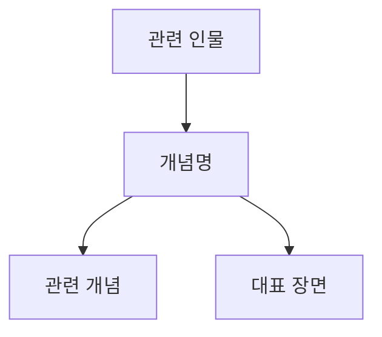

# 개념명 (관용 라틴명)

**[[greek-reading-guide|읽는 법]]**: 개념명 · **원어**: 희랍어 표제형 · **학술 전사**: *학술 전사*

<!-- 일반 산문에서는 위 읽는 법 행 뒤 한국어명을 기본으로 쓰고, 철자·방언·형태론 분석 또는 직접 인용에서만 원어와 학술 전사를 다시 제시합니다. -->

## 1. 개념 정의 및 어원학적 기원

- **핵심 정의**: 호메로스 서사시와 고대 그리스 문화에서의 의미 범위를 1~2문장으로 정의합니다.
- **어원과 어휘군**: 관련 동사·형용사·명사 및 의미소를 문헌 근거와 함께 설명합니다.
- **해석 범위**: 원전 명시, 강한 학술 추론, 논쟁적 해석, 후대 수용을 구분합니다.

| 그리스어 실제형 | 학술 전사 | 표제형·형태론 | 한국어 풀이 | 근거 |
|:---|:---|:---|:---|:---|
| 실제형 | 같은 실제형의 전사 | 표제형, 격·수·성 또는 시제·태·법 | 문맥상 뜻 | _Il._/_Od._ 권·행 또는 사전 |

---

## 2. 호메로스 본문에서의 용례와 작동 영역

### 2.1 『일리아스』의 용례

- 주요 장면, 화자, 결합 정형구와 서·행 번호를 제시합니다.

### 2.2 『오뒷세이아』의 용례

- 주요 장면, 화자, 결합 정형구와 서·행 번호를 제시합니다.

### 2.3 긴 원문과 실제형 대조

- 긴 원문은 실제 인용형을 다음 순서로 제시합니다.
  - **번역**: 한국어 번역문
  - **원문**: *그리스어 실제 인용문*
  - **학술 전사**: *위 원문과 행 단위로 대응하는 실제형 전사*

---

## 3. 의미 범위와 정형적 결합

- **핵심 의미 영역**: 전투, 위계, 종교, 환대, 장례, 공동체 규범 등 문맥별 의미를 구분합니다.
- **정형구와 결합어**: 반복되는 어휘 결합의 서사적·운율적 기능을 설명합니다.

| 희랍어 정형구 실제형 | 학술 전사 | 한국어 풀이 | 문맥 및 출전 |
|:---|:---|:---|:---|
| 실제 정형구 | 같은 실제형의 전사 | 문맥상 의미 | 장면, _Il._/_Od._ 권·행 |

---

## 4. 관련 개념과 서사적 관계

- **상호 보완·긴장 관계**: 관련 가치, 감정, 제도와의 관계를 원전 근거로 설명합니다.
- **인물과 장면**: 개념이 구체적으로 드러나는 인물·사건을 연결합니다.

---

## 5. 학술적 쟁점 및 수용

> [!WARNING] 모순/이설 발견
> 주요 학설의 대립, 원전의 긴장, 후대 수용과 호메로스 본문의 차이를 근거별로 기술합니다.

- **쟁점 1**:
- **쟁점 2**:
- **후대 수용**: 고전기·헬레니즘·로마 및 현대 수용을 호메로스 본문과 구분하여 정리합니다.

---

## 6. 증거 매트릭스

| 주장 및 테제 | 자료 유형 | 근거 및 출전 | 확실성 | 관련 위키 문서 |
|:---|:---|:---|:---|:---|
| 본문 핵심 용례 | 호메로스 본문 | _Il._/_Od._ 0.000–000 | 원전 명시 | [[]] |
| 의미론적 분석 | 사전·문헌학 | 연구자 (연도) | 강한 학술 추론 | [[]] |
| 학술적 해석 가설 | 현대 연구 | 연구자 (연도) | 논쟁적 | [[]] |

---

## 관련 항목

- [[overview]]
- [[wiki/index|위키 색인]]
- [[]]
