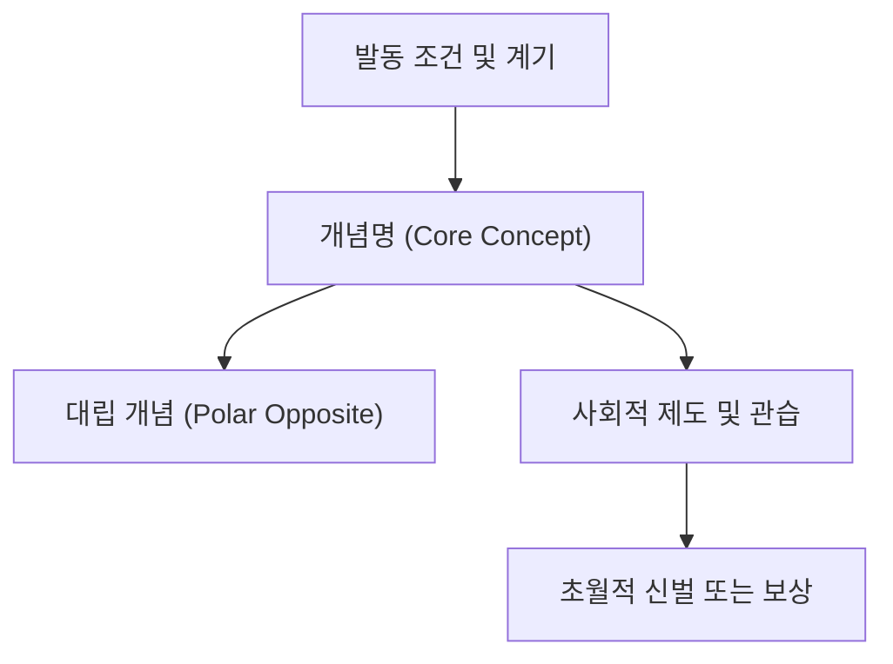

# 개념명 (관용 라틴명)

**[[greek-reading-guide|읽는 법]]**: 개념명 · **원어**: 희랍어 표제형 · **학술 전사**: *학술 전사*

## 1. 정의와 핵심 테제 (Definition & Core Thesis)

- **핵심 정의**: 개념의 제도적·윤리적·우주론적 본질을 명료한 단문으로 서술합니다.
- **연구사적 핵심 테제**: 호메로스 서사시와 고대 그리스 사유 체계에서 이 개념이 담당하는 고유한 기능과 테제를 요약합니다.

---

## 2. 어원과 형태론 (Etymology & Morphology)

- **인도유럽 조어 기원**: 인도유럽 조어(PIE) 어근 및 음운 변천 계통.
- **동계어 대조**: 산스크리트어, 라틴어, 게르만어 등 주요 인도유럽어파 동계어 대응.

| 그리스어 실제형 | 학술 전사 | 품사 및 형태론 | 의미 및 문헌학적 맥락 |
|:---|:---|:---|:---|
| 희랍어 실제형 | *학술 전사* | 명사 (단수 주격) | 개념의 기본 의미 및 문맥적 뉘앙스 |
| 희랍어 복수형 | *학술 전사* | 명사 (복수 주격) | 제도화된 관습 또는 복수 용례 |
| 파생 형용사 | *학술 전사* | 형용사 (남성 주격) | 규범을 체현하거나 준수하는 성향 |

---

## 3. 호메로스 서사시 본문 용례와 맥락 (Homeric Attestation & Contexts)

### 3.1 『일리아스』에서의 출현과 용례
- 『일리아스』 본문에서의 출현 양상 및 중심 갈등 맥락 (서/행 번호 명시: 예: _Il._ 1.1–7).

### 3.2 『오뒷세이아』에서의 출현과 용례
- 『오뒷세이아』 본문에서의 서사적 기능 및 일리아스와의 차이점 (서/행 번호 명시: 예: _Od._ 1.32–34).

---

## 4. 개념 상호작용과 가치망 (Conceptual Network & Polarity)

개념의 대립쌍(Polarity)과 상호작용 메커니즘을 규명합니다.

- **대립쌍 역학**: 대립하는 가치 규범 간의 긴장 관계.
- **연계 규범군**: 함께 결합하여 작동하는 주변 가치 체계.

---

## 5. 대표 서사 에피소드 정밀 해제 (Signature Epic Episodes)

- **선정 장면**: 개념이 가장 극적으로 분출하거나 시험받는 1~2개 결정적 장면.
- **본문 강독 및 해제**:
  - **번역**: "핵심 대사 또는 서사 인용구"
  - **원문**: 호메로스 희랍어 원문 구절
  - **학술 전사**: *학술 전사 텍스트*
- **서사적 함의**: 장면이 증명하는 고대 그리스 사회의 윤리적·제도적 역학.

---

## 6. 역사적·제도적 맥락 (Historical & Institutional Context)

<!-- 선택적 렌즈: 적용 / 생략(사유 명시) / 근거 부족 중 택1 -->
- **오이코스와 아고라**: 가문 내부 질서와 공적 공동체 의회 간의 제도적 위상.
- **사회적 실천**: 바실레우스 군주권, 선물교환, 전리품 배분 등 구체적 역사적 제도와의 맞물림.

---

## 7. 물질문화와 신체성 (Material Culture & Embodiment)

<!-- 선택적 렌즈: 적용 / 생략(사유 명시) / 근거 부족 중 택1 -->
- **신체적 좌소 및 동작**: 무릎, 턱 접촉, 손 뻗기, 눈물 등 구체적 신체 행동.
- **물질적 담지체**: 홀(skēptron), 배상금, 성유, 제물 등 가치를 물질화하는 도구.

---

## 8. 종교인류학 및 제의적 실천 (Religious Anthropology & Ritual)

<!-- 선택적 렌즈: 적용 / 생략(사유 명시) / 근거 부족 중 택1 -->
- **신들의 개입 방식**: 올림포스 신들의 수호 및 위반자에 대한 신벌(Tisis/Nemesis).
- **제의적 형식**: 맹세 의례, 정화, 탄원, 헌주 등 종교적 절차.

---

## 9. 심리철학 및 도덕적 행위주체성 (Moral Psychology & Agency)

<!-- 선택적 렌즈: 적용 / 생략(사유 명시) / 근거 부족 중 택1 -->
- **신체-정신 기관**: 튀모스(Thumos), 프렌(Phren), 노오스(Noos)와의 상호작용.
- **이중 동기화와 책임**: 신적 충동(Ate 등)의 개입 속에서 인간 행위자가 지는 도덕적·세속적 책임.

---

## 10. 후대 철학 및 비극 수용사 (Post-Homeric Reception)

<!-- 선택적 렌즈: 적용 / 생략(사유 명시) / 근거 부족 중 택1 -->
- **에픽 사이클 및 비극**: 5세기 아테네 비극 시인들의 재해석 및 갈등 심화.
- **고전기 철학**: 플라톤 및 아리스토텔레스 철학으로의 개념적 계승과 변용.

---

## 11. 학술 논쟁과 이설 (Scholarly Debates & Theoretical Conflicts)

> [!WARNING] 학설 대립: 학설명 대 학설명
> 20세기 고전학계의 핵심 논쟁(예: 도즈·애드킨스의 진화론적 비도덕론 대 로이드-존스의 확립된 도덕 질서론)을 대립 구도로 서술합니다. 콜아웃 내부에는 위키링크를 쓰지 않고 순수 텍스트로만 기술합니다.

- **학파별 시각 차이**: 텍스트 분석파 대 통일파, 진화론 대 내재론의 대립 쟁점 해명.

---

## 12. 증거 매트릭스 (Evidence Matrix)

본문에서 주장된 핵심 명제들의 문헌적 근거와 확실성 등급을 매핑합니다.

| 주장 테제 | 원전·문헌 근거 위치 | 자료 유형 | 확실성 등급 | 적용 섹션 |
|:---|:---|:---|:---|:---|
| 핵심 개념 정의 | _Il._ 권·행 또는 문헌 | 호메로스 본문 | 원전 명시 | 1절, 3절 |
| 비교어원학적 어근 | 어원 사전 (저자 연도) | 비교언어학 | 강한 학술 추론 | 2절 |
| 학술사적 대립 가설 | 연구 저작 (저자 연도) | 현대 고전학 | 논쟁적 | 4절, 11절 |

---

## 관련 항목

- [[concept-themis|테미스 (Themis)]]
- [[concept-time|티메 (Timē)]]
- [[entity-achilles|아킬레우스 (Achilles)]]
- [[entity-zeus|제우스 (Zeus)]]
- [[analysis-homeric-ethics-literature-review|호메로스 윤리학 문헌 고찰]]
- [[analysis-concept-source-matrix|개념과 문헌 행렬]]
