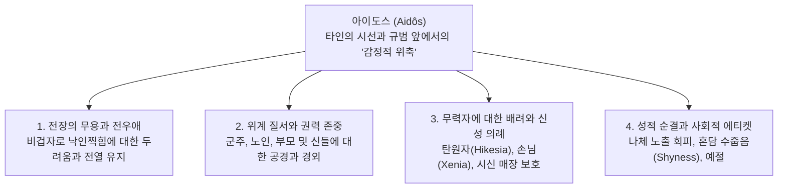

# 아이도스 (Aidôs, αἰδώς) — 수치심, 경외 및 자기억제의 도덕 감정

## 1. 개념 정의 및 어원학적 기원

**아이도스(Aidôs, αἰδώς)**는 고대 그리스 서사시와 문화 전반을 관통하는 가장 핵심적인 도덕 감정으로, **타인의 시선, 공적 비판, 사회적 규범 또는 신적 권위 앞에서 느끼는 경외(Reverence), 존경(Respect), 수치심(Shame), 자기억제(Inhibition)**를 포괄합니다.

- **어원학(Etymology)**: 동사 *aideomai*(αἰδέομαι, 부끄러워하다, 공경하다) 및 형용사 *aidoios*(αἰδοῖος, 존경할 만한, 경외심을 일으키는)와 직결되며, 근본적으로 **'신비롭거나 우월한 힘, 혹은 사회적 시선에 직면하여 내면에서 일어나는 본능적 위축과 주춤거림(Shrinking back / Pulling back)'**을 의미합니다 ([[scott-1980-aidos-and-nemesis|Scott 1980]]).
- **신체성과 심리학적 좌소**: 아이도스는 순수한 추상적 사유가 아니라 가슴속 충동의 중심인 **튀모스(*thumos*, θυμός)**에서 감각적으로 경험되며, 얼굴을 가리거나 고개를 숙이고 시선을 피하는 구체적인 신체 반응으로 발현됩니다 (_Il._ 15.561, _Od._ 8.86).

---

## 2. 아이도스의 4대 작동 영역

호메로스 서사시에서 아이도스는 단일한 내적 억제 메커니즘을 바탕으로 다음과 같은 4가지 구체적 영역에서 작동합니다 ([[cairns-1993-aidos|Cairns 1993]], [[scott-1980-aidos-and-nemesis|Scott 1980]]):

### 2.1 전장에서의 무용과 상호 감시 (Heroic Battle-Aidos)
- **전열의 유지**: 전투 상황에서 지휘관들은 병사들에게 "가슴속에 아이도스를 품고 서로를 보며 아이도스를 느끼라(*allēlous t' aideisthe*)"고 호소합니다 (_Il._ 15.561–564).
- **공적 비판 회피**: 전우들 앞에서 등을 돌리고 도망쳐 명예([[Timê]])를 잃고 비난을 받는 것에 대한 두려움이 전사를 최전선에 서게 만드는 내적 동력입니다.

### 2.2 위계와 권력에 대한 경외 (Respect for Hierarchy)
- **상급자에 대한 복종**: 디오메데스가 아가멤논의 부당한 질책에 침묵하는 것(_Il._ 4.401–402), 전령들이 아킬레우스의 위엄에 눌려 말을 잇지 못하는 것(_Il._ 1.331–332)은 권력과 지위가 자아내는 아이도스입니다.
- **노인과 가족 관계**: 텔레마코스가 연장자 네스토르에게 말을 건네기를 어려워하거나(_Od._ 3.22–24), 헤카베가 헥토르에게 어머니의 젖가슴에 대해 아이도스를 품으라고 호소하는 것(_Il._ 22.82) 역시 관계의 신성함에서 기인합니다.

### 2.3 무력자에 대한 보호와 신적 제재 (Hikesia & Xenia)
- **세속적 무력함의 보완**: 탄원자([[Hikesia]])와 나그네([[Xenia]])는 전사 사회에서 스스로를 지킬 물리적 힘이 없습니다. 따라서 사회는 이들을 **제우스(Zeus Hikesios, Zeus Xenios)**의 보호 아래 두어, 이들을 박대하는 자가 신들에 대한 아이도스(*aideisthai theous*)를 어겨 천벌을 받도록 규정했습니다 (_Od._ 7.165, 9.269, _Il._ 24.503).
- **아폴론의 의분**: 아킬레우스가 헥토르의 시신을 모독할 때 아폴론은 그에게 "아이도스가 없다"고 규탄하며, 그 행위가 신들의 분노([[Nemesis]])를 사고 대지를 욕보이는 죄악임을 선언합니다 (_Il._ 24.44–54).

### 2.4 성적 순결, 에티켓 및 수줍음 (Decency & Shyness)
- **신체 노출과 혼담**: 오디세우스가 나우시카아의 시녀들 앞에서 나체로 씻기를 꺼리는 것(_Od._ 6.220–222), 나우시카아가 부친에게 결혼 이야기를 꺼내기 부끄러워하는 것(_Od._ 6.66–67), 아레스와 아프로디테의 간통 현장을 보지 않고 집에 머문 여신들(_Od._ 8.324) 등은 아르카익 사회의 예절과 수치심을 구성합니다.

---

## 3. 학술적 쟁점 및 패러다임 대립

### 3.1 수치 문화(Shame Culture) 대 내면화된 도덕심리학
- **도즈(Dodds 1951)의 수치 문화론**: 아이도스를 외적 평판과 비난에만 반응하는 '타율적이고 미성숙한 외적 제재(Shame)'로 규정했습니다.
- **윌리엄스(Williams 1993)와 케언스(Cairns 1993)의 비판 및 복원**: 아이도스는 단순한 눈치보기가 아니라, **'내면화된 타자(Internalized Other)'**의 시선을 바탕으로 자신의 행위가 고결한 인간으로서의 품위와 이상적 자아상에 부합하는지를 성찰하는 고도의 도덕심리학적 감정임을 증명했습니다.

### 3.2 비도덕적 억제론 대 긍정적 존중 규범
- **스콧(Scott 1980)의 비도덕적 위축론**: 아이도스가 상황과 실리에 따라 궁핍자에게는 해로운 것(*ouk agathē*, _Od._ 17.347)으로 취급되는 점을 지적하며, 선험적 칸트적 도덕 법칙이 아닌 '외부 비판에 직면한 비도덕적 감정 억제'로 파악했습니다.
- **롱(Long 1970)의 적절성의 기준 모델**: 아이도스는 결핍(비겁)과 과도(오만)를 양방향으로 억제하며 인간 행동의 마땅한 척도(**카타 모이란, *kata moiran*** / **테미스, *themis***)를 유지시키는 핵심 고리라고 규명했습니다.

---

## 4. 네메시스(Nemesis)와의 상호 연동

아이도스는 관찰자 공동체의 공적 의분인 **네메시스([[Nemesis]])**와 불가분의 짝을 이룹니다 ([[scott-1980-aidos-and-nemesis|Scott 1980]]):

$$\text{행위자의 아이도스(Aidôs)} \iff \text{관찰자의 네메시스(Nemesis)}$$

1. **상호 억제 고리**: 행위자가 타인의 잠재적 *Nemesis*를 미리 예견하고 두려워할 때 *Aidôs*가 발동하여 탈선이 억제됩니다.
2. **뻔뻔함(*anaideia*)의 응징**: 행위자가 아이도스를 잃고 뻔뻔해질 때(*anaidês*), 사회와 신들은 즉각 *Nemesis*를 터뜨려 질서를 회복합니다 (_Il._ 24.53–54, _Od._ 22.40).

---

## 5. 관련 항목

### 핵심 인물 및 텍스트
- [[일리아스]] / [[오뒷세이아]]
- [[아킬레우스]] — 시신 훼손으로 아이도스를 잃었다가 24권에서 신들에 대한 경외로 회복한 영웅
- [[헥토르]] — 트로이아인들의 시선과 수치심(Aidos) 때문에 출전을 피할 수 없었던 시민적 영웅
- [[프리아모스]] — 신에 대한 아이도스를 매개로 헥토르의 시신을 되찾은 탄원자
- [[텔레마코스]] — 구혼자들의 만행 앞에서 이웃들의 아이도스와 네메시스를 호소한 아들

### 관련 윤리 개념
- [[Nemesis]] — 마땅한 몫의 침해에 대한 공적 의분과 질서 수호
- [[Hikesia]] — 신체 접촉과 경외(Aidos)에 기초한 신성 탄원 의례
- [[Xenia]] — 손님 환대의 의무와 신적 가호
- [[Timê]] — 사회적 인정과 명예
- [[Arete]] — 영웅적 탁월성
- [[Themis]] — 신성한 관습 규범
- [[Dike]] — 정의와 우주적 질서

### 주요 연구 문헌
- [[scott-1980-aidos-and-nemesis]] — 호메로스 저작에서의 아이도스와 네메시스 (감정적 위축론 및 신적 제재 분석)
- [[cairns-1993-aidos]] — 아이도스: 고대 그리스 문학의 도덕심리학과 명예 체계
- [[williams-1993-shame-and-necessity]] — 수치심과 필연성 (내면화된 타자 시선 복원)
- [[long-1970-morals-and-values]] — 호메로스의 도덕과 가치 (적절성의 기준 모델)
- [[dodds-1951-greeks-and-irrational]] — 그리스인들과 비합리적인 것 (수치 문화 분석)
