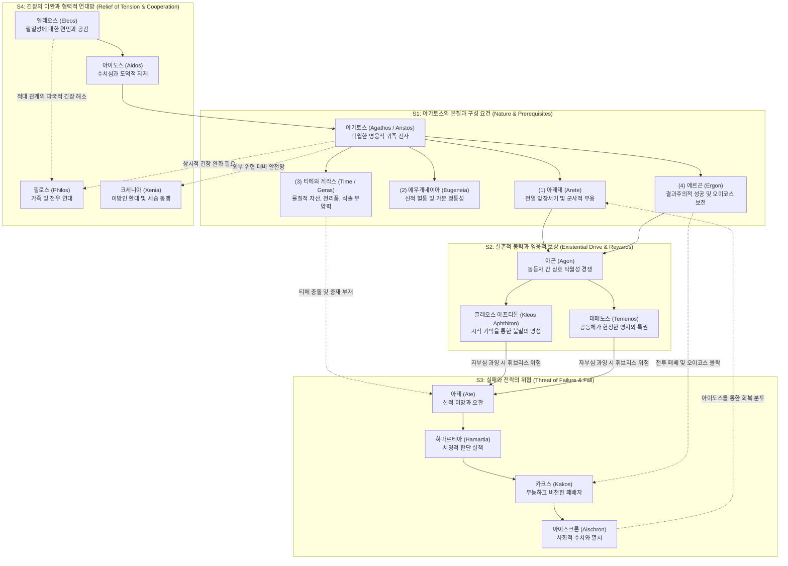

# 아가토스 (Agathos)

**[[greek-reading-guide|읽는 법]]**: 아가토스 · **원어**: ἀγαθός · **학술 전사**: *agathós*

## 1. 정의와 핵심 테제 (Definition & Core Thesis)

### 1.1 핵심 정의
호메로스 서사시와 아르카익 고대 그리스 사회에서 **아가토스**(ἀγαθός, *agathós*; 복수형 아가토이, ἀγαθοί, *agathoí*)는 근대적 의미의 내면적 '도덕적 착함(morally good)'을 뜻하지 않습니다. 아가토스는 **군사적 무용**([[concept-arete|Arete]]), **고귀한 신적 혈통**(Eugeneia), **물질적 부와 명예‘**([[concept-time|Time]]/[[concept-geras|Geras]])를 결합하여, 가문([[concept-oikos|Oikos]])과 공동체를 외적 절멸의 위협으로부터 지켜내는 데 성공한 **’탁월한 영웅적 귀족 전사(Noble warrior-chieftain)**'를 지칭하는 최고 등급의 가치 평가어이자 사회적 찬사어였습니다 ([[adkins-1960-merit-and-responsibility|Adkins 1960]]).

### 1.2 연구사적 4대 핵심 명제
1. **무국가 사회 하에서의 결과주의적 성공의 필연성** ([[adkins-1960-merit-and-responsibility|Adkins 1960]]):
   중앙 집중적 법원이나 치안 공권력이 부재했던 무국가 분쟁 사회에서 가문(Oikos)의 생존은 오직 수장의 물리적 완력(**비에**, *bíē*)에 의해서만 보장되었습니다. 전선이 뚫리면 남성은 도륙당하고 부녀자는 노예로 전락했으므로, 호메로스 사회는 행위자의 주관적 의도나 동기가 아니라 '공동체를 지켜낸 실제적 승리'라는 **결과주의적 성공**(Ergon)만을 최고 가치로 승인했습니다.
2. **신분적 적절성의 기준과 한계 준수** ([[long-1970-morals-and-values|Long 1970]]):
   아가토스는 모든 규범을 초월하는 무법적 강자가 아닙니다. 아가토스는 자신의 신분과 맥락에 상응하는 '**적절성의 기준(Standard of Appropriateness)‘**을 지켜야 하며, 운명의 몫(**’카타 모이란**, *katà moîran*)과 공동체 질서(**카타 코스몬**, *katà kósmon*)를 넘어서는 오만([[concept-hybris|Hybris]])을 범할 경우 신들과 동료들의 분노([[concept-nemesis|Nemesis]])에 직면했습니다.
3. **상호 탁월성 추구로서의 아곤(Agon)과 실천적 행위** ([[finkelberg-1998-time-and-arete|Finkelberg 1998]]):
   영웅들의 경쟁은 상대를 짓밟는 배타적 승자독식이 아니라, 동등한 전사들 사이에서 서로의 기량을 자극하고 고양하는 '**동등자 간의 상호 탁월성 추구(Mutual emulation of equals)‘**였습니다. 선험적으로 주어지는 명예([[concept-time|Timê]])와 달리, 탁월성([[concept-arete|Arete]])은 전열 맨 앞줄(**’프로마코이**, *promachoi*)에 서서 위험을 감수하는 **실천적 행위**(Enérgeia)를 통해서만 입증되었습니다.
4. **사회적 역할에 정초된 기능적 덕과 도덕적 주체성** ([[macintyre-1981-after-virtue-ch10|MacIntyre 1981]], [[williams-1993-shame-and-necessity|Williams 1993]]):
   호메로스 세계에서 인간은 사회적 역할 밖의 독립된 자아를 갖지 않습니다. 아가토스는 왕, 장수, 전사라는 구체적 사회적 기능을 완벽히 수행하는 **기능적 탁월성**이며, 영웅의 수치심([[concept-aidos|Aidos]])은 단순한 타율적 눈치보기가 아니라 '내면화된 이상적 관찰자'의 시선 앞에서 자기존중(Self-respect)을 지키려는 자율적 도덕 행위주체성의 발현이었습니다.

---

## 2. 어원과 형태론 (Etymology & Morphology)

### 2.1 비교언어학적 기원: 선희랍 기층어설
- **선희랍 기층어(Pre-Greek substrate) 기원**:
  - 로베르트 베이케스(R. Beekes 2010, *EDG*, pp. 7–8)와 피에르 샹트렌(P. Chantraine 1968, *DELG*, pp. 4–5)에 따르면, **ἀγαθός**는 확립된 인도유럽조어(PIE) 어근으로 소급되지 않습니다.
  - 어말 접미적 요소 *-αθος*(*-athos*)는 그리스어 고유의 접미사가 아니며, 에게해 지중해 토착 언어군에서 발견되는 전형적인 선희랍어 기층 접미사(cf. κάλαθος 바구니, ψάμαθος 해변 모래)와 형태적 구조를 공유합니다.
  - 과거 제기된 브루크만(Brugmann)의 μέγας(*mégas*) 연관설(*m̥g- > *ag-)이나 게르만어 *gōda-(영어 *good*) 연관설은 엄밀한 음운 대응 법칙을 통과하지 못하는 가짜 동계어(false cognate)로 판정되었습니다.
  - 따라서 ἀγαθός는 미케네 그리스인들이 남하 정착하는 과정에서 에게해 토착 선주민 사회의 전사 귀족 및 지배 계급의 기능적 탁월성을 가리키던 칭호를 차용한 것으로 파악됩니다.
- **동의어 ἐσθλός(esthlós)의 어원과 상보성**:
  - **ἐσθλός**는 PIE 어근 **\*h₁es-**('존재하다, 참되다', 그리스어 εἰμί)의 제로 등급 어근에 접미사가 결합한**\*h₁s-dʰ-ló-s**에서 유래했습니다 (Chantraine DELG 374–375). "실제로 존재하는 것, 참되고 변함없는 것(genuine, true)"을 뜻하며, 혈통의 고귀함과 신실한 품격을 나타냅니다.
  - 헥사메테론 운율에서 ἀγαθός는 아나페스트(˘ ˘ ¯), ἐσθλός는 스폰데이우스(¯ ¯)를 형성하여, 구송 시인의 운율적 필요에 따라 상호보완적 변이형으로 교체 사용되었습니다.

### 2.2 핵심 어휘 4열 형태론 분리 표

호메로스 그리스어에서 ἀγαθός는 규칙적 비교급(*ἀγαθώτερος)을 형성하지 않고, 서로 다른 어근에서 유래한 다수의 보충 어간(Suppletion)을 결합하여 비교급과 최상급을 구성합니다.

| 그리스어 실제형 | 학술 전사 | 품사 및 형태론 | 의미 및 문헌학적 맥락 |
|:---|:---|:---|:---|
| **ἀγαθός** | *agathós* | 형용사 남성 단수 주격 | 유능하고 용맹한 귀족 전사. 호메로스 영웅 윤리의 기본 가치 칭찬어이자 표제형. |
| **ἀγαθοῖο** | *agathoîo* | 형용사 남성 단수 속격 (서사시 고형) | '탁월한 자의'. 헥사메터 행말 닥틸 운율(˘ ˘)을 형성하는 고대 서사시 속격 어미 -οιο. |
| **ἀγαθοί** | *agathoí* | 형용사 남성 복수 주격 | '탁월한 자들, 귀족 계층'. 호메로스 및 아르카익기 지배 전사 귀족 집단을 총칭하는 복수형. |
| **ἐσθλός** | *esthlós* | 형용사 남성 단수 주격 | '고귀한, 참된, 충직한'. ἀγαθός의 스폰데이우스(¯ ¯) 운율 변이형이자 본질적 고결함을 뜻하는 동의어. |
| **ἐσθλά** | *esthlá* | 형용사 중성 복수 주격/대격 | '좋은 것들, 번영, 복락, 재산'. 신들이 내리는 은총이나 가문(Oikos)의 물질적 자산을 뜻하는 명사적 용법. |
| **ἀμείνων** | *ameínōn* | 비교급 형용사 남성/여성 단수 주격 | '더 뛰어난, 더 유능한'. 전투 기량과 실천적 유효성의 우위를 나타내는 기능적 비교급. |
| **κρείσσων** | *kreíssōn* | 비교급 형용사 남성/여성 단수 주격 (서사시형) | '더 강력한, 힘/권력에서 우위에 선'. κράτος 파생, 군사적 통솔력과 정치적 지배 위계의 우월성. |
| **φέρτερος** | *phérteros* | 비교급 형용사 남성 단수 주격 (서사시 고유형) | '더 우월한, 더 유력한'. φέρω 파생, 군왕들의 통솔권과 군사적 위계 서열을 다툴 때 빈출. |
| **ἄριστος** | *áristos* | 최상급 형용사 남성 단수 주격 | '최고의 영웅, 가장 탁월한 자'. *h₂er-(아레테) 파생, 영웅 칭송의 정점이자 귀족정(aristocracy)의 어원. |
| **ἀρίστους** | *arístous* | 최상급 형용사 남성 복수 대격 | '최고의 용사들을'. 군대의 선봉 최정예 장수 집단을 직접목적어로 가리키는 대격형. |
| **κράτιστος** | *krátistos* | 최상급 형용사 남성 단수 주격 | '가장 강대한, 최고의 완력을 지닌'. 물리적 파괴력과 절대적 무력의 극치를 나타내는 최상급. |
| **βέλτερος** | *bélteros* | 비교급 형용사 남성 단수 주격 (호메로스형) | '더 나은, 더 마땅한'. 후대 고전기 βελτίων에 선행하는 서사시적 비교급으로 현실적 적절성 표현. |
| **λωΐων** | *lōḯōn* | 비교급 형용사 남성/여성 단수 주격 (분음형) | '더 바람직한, 더 유리한'. 영웅들의 숙고와 조언(boulē)에서 선택의 합리성을 판단하는 비교급. |
| **φέριστος** | *phéristos* | 최상급 형용사 남성 단수 주격 (서사시 고유형) | '가장 훌륭한, 최강의'. 서사시에서 신들이나 최상위 영웅을 향해 경의를 표하는 의례적 호칭. |

---

## 3. 호메로스 서사시 본문 용례와 맥락 (Homeric Attestation & Contexts)

### 3.1 양대 서사시 출현 빈도 및 서사적 장르 진폭
- 『**일리아스**』 **(약 195회 출현)**:
  - 아가토스는 전장 최전선(promachoi)에서의 무용, 창술, 전열 통솔 역량에 압도적으로 집중됩니다.
  - 특히 최상급인 **아리스토스**(ἄριστος, 약 115회)의 70% 이상이 『일리아스』에 편중되어 나타나는데, 이는 서사시 전체의 갈등 핵이 "누가 아카이아 군대 최고의 전사인가(**아리스토스 아카이온**, *áristos Akhaiō̂n*)"를 둘러싼 아킬레우스, 아가멤논, 디오메데스, 아이아스 간의 경쟁(agōn)이기 때문입니다 ([[nagy-1979-best-of-achaeans|Nagy 1979]]).
- 『**오뒷세이아**』 **(약 165회 출현)**:
  - 군사적 완력 외에도 파탄 난 가내 경제(Oikos)의 복원, 손님 환대([[concept-xenia|Xenia]]), 충직한 하인(돼지치기 에우마이오스) 및 현숙한 페넬로페의 내적 판단 등 가정적·사회적 적절성으로 외연이 확장됩니다.

### 3.2 핵심 정형구(Formulaic Diction) 체계
1. **전투 함성과 기량 결합**:
   - `βοὴν ἀγαθὸς Μενέλαος` (*boḕn agathòs Menélaos*, 함성에 능한 메넬라오스 / 디오메데스): 백병전에서 지휘관의 포효와 함성(boē)은 전열의 사기를 고양하고 적에게 공포를 불어넣는 아가토스의 신체적 표상이었습니다.
2. **완력과 탁월성의 결합**:
   - `κρατερὸς καὶ ἀγαθός` (*krateròs kaì agathós*, 강력하고도 훌륭한): 물리적 완력(kratos)과 귀족적 기량이 불가분으로 결합되어 있음을 명시합니다.
3. **혈통 계승의 선언**:
   - `πατρὸς δ᾽ εἴμ᾽ ἀγαθοῖο` (*patròs d’ eím’ agathoîo*, 나는 훌륭한 아버지의 아들이다, _Il._ 21.109): 아킬레우스가 뤼카온에게 죽음의 필연성을 선언하며 지상의 아가토스인 부친 펠레우스의 혈통을 입증하여 우월한 전사적 권위를 확립합니다.
4. **존재 전제와 양보의 분사**:
   - `ἀγαθός περ ἐών` (*agathós per eṓn*, 비록 훌륭한 자일지라도): 상대가 최고의 아가토스라 할지라도 공동체의 규범([[concept-themis|Themis]])이나 동료의 명예([[concept-time|Time]])를 능멸할 수 없음을 경고할 때 사용됩니다 (_Il._ 1.275, 24.53).

---

## 4. 개념 상호작용과 가치망 (Value Network & Interactions)

아가토스는 고립된 덕목이 아니며, 명예, 신적 혈통, 가문의 존속, 파멸의 위협, 그리고 긴장 완화망이 교차하는 복합적 가치망의 중심축입니다.

### 4.1 핵심 역학 해제
1. **S1 → S2 (실존적 도약)**: 무용(Arete)과 혈통, 물질적 명예(Time)를 갖춘 아가토스는 동등자 간의 경쟁(Agon)에 뛰어들어 불멸의 명성(**클레오스 아프티톤**, *kleos aphthiton*)과 공동체의 공적 영지(**테메노스**, *temenos*)를 쟁취합니다.
2. **S1 → S3 (파멸의 인과율)**: 신들의 미망([[concept-ate|Ate]])이나 전장에서의 물리적 패배는 가장을 즉각 무능한 패배자인 **카코스**([[concept-kakos|Kakos]])로 전락시키며, 오이코스 멸절과 최고의 사회적 수치(**아이스크론**, *aischron*)를 부릅니다.
3. **S1 → S4 (긴장의 이완과 안전망)**: 상시적 긴장과 생존 위협 속에서 아가토스는 무장을 해제하고 안도할 수 있는 내 편(**필로스**, *philos*)과 이방인 환대 동맹(**크세니아**, *xenia*)을 결성하며, 수치심([[concept-aidos|Aidos]])과 연민([[concept-eleos|Eleos]])을 통해 파괴적 자멸을 억제합니다.

---

## 5. 주요 서사 에피소드 정밀 주해 (Signature Epic Episodes)

### 5.1 헥토르의 출전 다짐과 내면화된 전사 책무 (_Il._ 6.444–446)

- **선정 장면**: 스카이아 문 앞에서 안드로마케가 성벽 안에 머물러 처자식을 지키라고 눈물로 애원했을 때 헥토르가 남긴 응답. 트로이아인들에 대한 수치심(aidos)과 자신이 평생 체화해 온 아가토스의 책무 때문에 결코 후방에 안주할 수 없음을 선언하는 장면.
- **본문 강독 및 해제**:
  - **번역**: "내 가슴(튀모스) 또한 물러서기를 허락지 않으니, 나는 언제나 트로이아인들의 맨 앞줄에서 싸우며, 부친의 위대한 명성(클레오스)과 내 자신의 명예를 지키는 훌륭한 자(에스틀로스)가 되는 법을 배웠기 때문이오."
  - **원문**: οὐδέ με θυμὸς ἄνωγεν, ἐπεὶ μάθον ἔμμεναι ἐσθλὸς / αἰεὶ καὶ πρώτοισι μετὰ Τρώεσσι μάχεσθαι, / ἀρνύμενος πατρός τε μέγα κλέος ἠδ᾽ ἐμὸν αὐτοῦ.
  - **학술 전사**: *oudé me thumòs ánōgen, epeì máthon émmenai esthlòs / aieì kaì prṓtoisi metà Trṓessi mákhesthai, / arnúmenos patrós te méga kléos ēd’ emòn autoû.*
- **문헌학적·서사학적 함의**:
  - **체화된 습속으로서의 에스틀로스**: 훌륭한 전사가 되는 것은 선천적 본능이 아니라 배움과 훈련을 통해 획득한 실천적 결과(*máthon émmenai esthlòs*)입니다. 아가토스는 지속적인 전선 실천을 통해 내면화되는 윤리적 습속입니다.
  - **프로마코스(Promachos)의 물리적 입증**: 훌륭한 자의 자격은 안전한 후방이 아니라 적의 창날과 직접 맞닥뜨리는 맨 앞줄(*prṓtoisi metà Trṓessi*)에 신체를 노출함으로써만 유지됩니다.
  - **부계 명예와 자기 명성의 이중 보전**: 행위의 최종 목표는 부친 프리아모스의 큰 명예(*patròs méga kléos*)와 자신의 명예(*emòn autoû*)를 획득하는(*arnúmenos*) 데 있습니다.

---

### 5.2 고립된 오디세우스의 실존적 독백과 탁월성 결단 (_Il._ 11.408–410)

- **선정 장면**: 주요 장수들이 부상으로 이탈한 뒤, 트로이아 군세 한가운데 홀로 고립된 오디세우스가 도망칠 것인가 맞서 싸울 것인가를 두고 자신의 가슴(튀모스)과 대화하는 독백 대목.
- **본문 강독 및 해제**:
  - **번역**: "실로 나는 비천한 자들(카코이)은 싸움터에서 물러나 달아나지만, 전장에서 탁월함을 떨치고자 하는 자는 자신이 부상을 입든 다른 이를 쳐서 쓰러뜨리든 굳건히 버텨 서야만 한다는 것을 잘 알고 있기 때문이다."
  - **원문**: οἶδα γὰρ ὅττι κακοὶ μὲν ἀποίχονται πολέμοιο, / ὃς δέ κ᾽ ἀριστεύῃσι μάχῃ ἔνι, τὸν δὲ μάλα χρεὼ / ἑστάμεναι κρατερῶς, ἤ τ᾽ ἔβλητ᾽ ἤ τ᾽ ἔβαλ᾽ ἄλλον.
  - **학술 전사**: *oîda gàr ótti kakoì mèn apoíkhontai polémoio, / hòs dé k’ aristeúēisi mákhēi éni, tòn dè mála khreṑ / hestámenai kraterō̂s, ḗ t’ éblēt’ ḗ t’ ébal’ állon.*
- **문헌학적·서사학적 함의**:
  - **카코스와 아리스토스의 이분법적 대립**: 비천하고 무능한 자들(*kakoí*)의 본질은 도주(*apoíkhontai*)이며, 아가토스/아리스토스의 본질은 확고부동한 버팀(*hestámenai kraterō̂s*)입니다.
  - **결과를 초월한 실천적 행위(Enérgeia)**: '맞든 맞추든(*ἤ τ᾽ ἔβλητ᾽ ἤ τ᾽ ἔβαλ᾽ ἄλλον*)'이라는 구절은 애드킨스의 단순 성공 결과주의를 논파합니다 ([[finkelberg-1998-time-and-arete|Finkelberg 1998]]). 영웅의 위대성은 승패의 결과가 불확실한 순간에도 후퇴하지 않고 위험을 감수하는 결단 그 자체에 정초됩니다.

---

### 5.3 사르페돈의 노블레스 오블리주와 계약적 전사 책무 (_Il._ 12.310–316)

- **선정 장면**: 뤼키아의 국왕 사르페돈이 그리스 군 성벽을 공격하기 직전 글라우코스에게 전하는 연설. 군주의 물질적 특권과 최전선에서의 물리적 책무가 맺는 상호 교환 관계의 선언.
- **본문 강독 및 해제**:
  - **번역**: "글라우코스여, 어찌하여 우리는 뤼키아에서 상석과 고기와 가득 찬 술잔으로 가장 큰 존중(티메)을 받으며, 모든 이들이 우리를 신처럼 바라보는가? 어찌하여 우리는 크산토스 강가에 과수원과 밀을 기르는 비옥한 밭으로 이루어진 크고 아름다운 영지(테메노스)를 차지하고 있는가? 그러므로 우리는 지금 마땅히 뤼키아인들의 맨 앞줄에 서서 뜨겁게 타오르는 전투에 맞서야만 하리라."
  - **원문**: Γλαῦκε, τίη δὴ νῶϊ τετιμήμεσθα μάλιστα / ἕδρῃ τε κρέασίν τε ἰδὲ πλείοις δεπάεσσιν / ἐν Λυκίῃ, πάντες δὲ θεοὺς ὣς εἰσορόωσι, / καὶ τέμενος νεμόμεσθα μέγα Ξάνθοιο παρ᾽ ὄχθας, / καλὸν φυταλιῆς καὶ ἀρούρης πυροφόροιο; / τὼ χρὴ νῦν Λυκίοισι μέτα πρώτοισιν ἐόντας / ἑστάμεν ἠδὲ μάχης καυστείρης ἀντιβολῆσαι,
  - **학술 전사**: *Glaûke, tíē dḕ nō̂ï tetimḗmestha málista / hédrēi te kréasín te idè pleíois depáessin / en Lukíēi, pántes dè theoùs hṑs eisoróōsi, / kaì témenos nemómestha méga Ksánthoio par’ ókhthas, / kalòn phutaliē̂s kaì aroúrēs purophóroio? / tṑ khrḕ nûn Lukíoisi méta prṓtoisin eóntas / hestámen ēdè mákhēs kausteírēs antibolē̂sai,*
- **문헌학적·서사학적 함의**:
  - **티메(Timê)와 책무의 등가 교환 구조**: 물질적 보상(*tetimḗmestha málista*, *témenos nemómestha*)에 대응하여, 당위 조동사 *tṑ khrḕ*(그러므로 마땅히 ~해야 한다)를 통해 최전선에 서야 하는 군사적 의무를 도출합니다.
  - **정당화 논리로서의 백성들의 평판**: 사르페돈은 백성들이 "우리 왕들은 살진 양과 달콤한 포도주를 마시지만 그들에게는 또한 훌륭한 힘(ἲς ἐσθλή)이 있으니, 맨 앞줄에서 싸우기 때문이라"고 칭송하게 만들어야 한다고 역설합니다.

---

### 5.4 테르시테스 사건과 카코스에 대한 아가토스의 체벌 (_Il._ 2.246–250)

- **선정 장면**: 평민 테르시테스가 아고라에서 군주 아가멤논의 탐욕을 비판하자, 지휘봉(스켑트론)을 쥔 오디세우스가 나서서 그의 신분적 월권을 규탄하고 물리적 체벌을 가한 장면.
- **본문 강독 및 해제**:
  - **번역**: "테르시테스여, 분별없이 지껄이는 자여, 그대가 비록 청산유수의 연설가일지라도 입을 다물고 홀로 왕들과 맞서 다투려 하지 말라. 나는 아트레우스의 아들들과 함께 일리오스로 온 모든 자들 가운데 그대보다 더 비천한(헤레이오테론) 필멸자는 없다고 단언하노라. 그러므로 그대는 왕들을 입에 올리며 연설해서는 안 되며..."
  - **원문**: Θερσῖτ᾽ ἀκριτόμυθε, λιγύς περ ἐὼν ἀγορητής, / ἴσχεο, μηδ᾽ ἔθελ᾽ οἶος ἐριζέμεναι βασιλεῦσιν· / οὐ γὰρ ἐγὼ σέο φημὶ χερειότερον βροτὸν ἄλλον / ἔμμεναι, ὅσσοι ἅμ᾽ Ἀτρεΐδῃς ὑπὸ Ἴλιον ἦλθον. / τὼ οὐκ ἂν βασιλῆας ἀνὰ στόμ᾽ ἔχων ἀγορεύοις,
  - **학술 전사**: *Thersît’ akritómuthe, ligús per eṑn agorētḗs, / ískheo, mēd’ éthel’ oîos erizémenai basileûsin; / ou gàr egṑ séo phēmì khereióteron brotòn állon / émmenai, hóssoi hám’ Atreḯdēis hupò Ílion ē̂lthon. / tṑ ouk àn basilē̂as anà stóm’ ékhōn agoreúois,*
- **문헌학적·서사학적 함의**:
  - **카코스의 본질인 헤레이온(Chereion) 규정**: 오디세우스는 테르시테스를 군대 전체에서 가장 열등하고 비천한 자(*khereióteron brotòn állon*)로 선언합니다. 아가토스 중심 사회에서 발언권은 논리적 진위가 아니라 화자의 신분적·군사적 탁월성에 종속됩니다.
  - **스켑트론 타격과 웃음의 사회적 통제**: 오디세우스가 황금 스켑트론으로 등을 후려쳐 피멍이 맺히게 하자 병사들은 웃음을 터뜨리며 환호합니다. 폭력과 조롱은 카코스의 월권을 제압하고 귀족적 질서를 재확인하는 계급적 억압 도구로 작동합니다.

---

### 5.5 에우멜로스 vs 안틸로코스의 전차경주 포상 충돌 (_Il._ 23.536–538, 543–547)

- **선정 장면**: 전차경주에서 불운으로 꼴찌를 한 최고의 기수 에우멜로스에게 아킬레우스가 2등상을 주려 하자, 실제 2등으로 들어온 안틸로코스가 강력히 반발하는 장면.
- **본문 강독 및 해제**:
  - **번역**: "[아킬레우스가 말했다] '가장 뛰어난 사내가 꼴찌로 말을 몰고 왔구나! 그러니 자, 당연하고 합당하게 그에게 2등상을 주도록 하자. 그러나 1등상은 튀데우스의 아들이 가져가게 하라.' [안틸로코스가 반발했다] '오 아킬레우스여, 만약 당신이 이 말을 실행에 옮긴다면 나는 당신에게 몹시 분노할 것이오. 그가 훌륭한 자(에스틀로스)이면서도 전차와 날랜 말들이 부서졌다는 사실만을 생각하여 내 상을 빼앗으려 하기 때문이오. 그러나 그는 불멸의 신들에게 기도했어야 마땅했소. 그랬다면 결코 꼴찌로 들어오지 않았을 것이오!'"
  - **원문**: λοῖσθος ἀνὴρ ὤριστος ἐلاύνει μώνυχας ἵππους· / ἀλλ᾽ ἄγε δή οἱ δῶμεν ἀέθλιον, ὡς ἐπιεικές, / δεύτερ᾽· ἀτὰρ τὰ πρῶτα φερέσθω Τυδέος υἱός. / ὦ Ἀχιλεῦ, μάλα τοι κεχολώσομαι, αἴ κε τελέσσῃς / τοῦτο ἔπος· μέλλεις γὰρ ἀφαιρήσεσθαι ἄεθλον, / τὰ φρονέων ὅτι οἱ βλάβεν ἅρματα καὶ ταχέ᾽ ἵππω / αὐτός τ᾽ ἐσθλὸς ἐών· ἀλλ᾽ ὤφελε ἀθανάτοισιν / εὔχεσθαι· τῷ κ᾽ οὔ τι πανύστατος ἦλθε διώκων.
  - **학술 전사**: *loîsthos anḕr ṓristos elaúnei mṓnukhas híppous; / all’ áge dḗ hoi dō̂men aéthlion, hṑs epieikés, / deúter’; atàr tà prō̂ta pherésthō Tudéos huiós. / ō̂ Akhileû, mála toi kekholṓsomai, aí ke teléssēis / toûto épos; mélleis gàr aphairḗsesthai áethlon, / tà phronéōn hóti hoi bláben hármata kaì takhé’ híppō / autòs t’ esthlòs eṓn; all’ ṓphele athanátoisin / eúkhesthai; tō̂i k’ oú ti panústatos ē̂lthe diṓkōn.*
- **문헌학적·서사학적 함의**:
  - **선험적 아리스토스 vs 결과주의적 에르곤의 정면충돌**: 아킬레우스는 에우멜로스의 공인된 신분적 탁월성(*anḕr ṓristos*)을 실제 결과(*loîsthos*)보다 우선시하여 보상하려 했습니다([[adkins-1960-merit-and-responsibility|Adkins 1960]]). 반면 안틸로코스는 신분상 *autòs t’ esthlòs eṓn*(그 자신이 훌륭한 자일지라도) 결승선을 먼저 통과하지 못한 자에게 상을 주는 것은 용납될 수 없다는 엄격한 결과주의를 대치시킵니다.
  - **신적 불운의 개인 책임 귀속**: 안틸로코스는 신의 개입으로 인한 불운조차 기도하지 않은 전사 자신의 불찰로 귀속시킵니다. 실패에 대해 어떠한 외적 변명도 허용하지 않는 호메로스적 결과주의의 단면입니다.

---

## 6. 역사적·제도적 맥락 (Historical & Institutional Context)

<!-- 선택적 렌즈: 적용 -->

### 6.1 미케네 붕괴 이후 무국가 분쟁 사회와 오이코스(Oikos)의 자력구제
호메로스 서사시가 반영하는 세계는 미케네 청동기 문명의 관료제적 중앙집권 군주(**와낙스**, *wánax*) 체제가 붕괴한 이후 도래한 아르카익 암흑기(c. 1100–750 BCE)와 초기 고졸기 그리스의 사회상을 투영합니다.

- **사법 공권력 부재**: 이 세계에는 상비 경찰, 국가 법원, 성문화된 법전이 전무했습니다. 사회는 자급자족적 농경·목축 경제 단위인 **오이코스**(Oikos)들이 파편화되어 병존하는 무국가 추장 사회(Stateless chieftain society)였습니다.
- **자력구제(Self-help)와 아레테의 결합**:
  - 도적 떼의 습격, 인접 씨족의 가축 약탈(**보아시아**, *boasía*), 처자식의 납치 위협 속에서 오이코스의 안전을 지켜주는 유일한 보루는 오이코스 수장인 **아가토스**(Agathos)의 물리적 완력(**비에**, *bíē*)과 군사적 탁월성(**아레테**, *aretḗ*)뿐이었습니다.
  - 가장이 완력을 잃는 순간 오이코스는 무방비로 해체되었습니다. 『오뒷세이아』에서 오디세우스의 부재와 라에르테스의 노쇠로 인해 구혼자들이 궁정에 난입하여 가축을 도살하고 재산을 탕진하는 사태는, 아가토스의 억지력이 결여된 오이코스가 직면하는 전형적인 파멸을 실증합니다.

### 6.2 바실레우스(Basileus) 다두정과 아가토이(Agathoi)의 지배 정당성
호메로스 정치 질서는 단일 군주정이 아니라 유력한 수장들이 병존하는 과두정적 다두정(**폴리코이라니에**, *polykoiraníē*) 형태를 띱니다:

1. **신성한 혈통(Eugeneia)**: 귀족 전사 엘리트인 **아가토이**(Agathoi)는 제우스 등 올림포스 신들의 직계 후손이라는 계보(**게네에**, *geneḗ*)를 통해 평민과 구별되는 신적 카리스마를 독점했습니다.
2. **무력 수단의 독점**: 청동 갑주, 방패, 전차, 군마를 소유·유지할 수 있는 경제력을 바탕으로 전장의 주도권을 장악했습니다.
3. **테미스(Themis)와 홀(Skeptron)의 담론 독점**: 집회장(**아고라**, *agorā́*)에서 발언권을 상징하는 신성한 홀(**스켑트론**, *skē̂ptron*)을 쥐고 판결을 내리는 사법적 권한은 오직 바실레우스 계층에게만 세습되었습니다. 평민 전사 [[entity-thersites|테르시테스]](_Il._ 2.211–277)가 군주의 탐욕을 비판했음에도 오디세우스에게 구타당한 사건은, 귀족적 혈통과 아레테가 없는 자의 공적 발언을 원천 봉쇄하던 지배 이데올로기를 폭로합니다.

### 6.3 결과주의(Results-culture)의 제도적 필연성과 에우마이오스 테제
아서 애드킨스([[adkins-1960-merit-and-responsibility|Adkins 1960]])가 논증하듯, 호메로스 사회가 내면적 의도가 아닌 외적 결과만을 절대적 평가 척도로 삼은 것은 가혹한 역사적 환경의 산물이었습니다:

- **패배의 파멸적 대가**: 성벽이 무너지면 남성은 도륙당하고 부녀자와 아이들은 즉각 적국의 노예로 끌려갔습니다. "최선을 다했으나 운이 나빴다"는 변명은 가문의 절멸을 막아주지 못했습니다.
- **에우마이오스 테제**: 노예가 된 자는 아무리 무고하더라도 신체적 자유뿐 아니라 인간적 탁월성 자체를 상실한 것으로 간주되었습니다:
  - ἥμισυ γάρ τ' ἀρετῆς ἀποαίνυται εὐρύοπα Ζεύς / 인간에게 노예의 날이 닥치는 순간, 멀리 보시는 제우스께서는 그의 아레테 절반을 앗아가 버리신다. (_Od._ 17.322–323)
- 사회는 가문의 생존을 담보하는 '실제적 승리와 성공'만을 최고 찬사어인 아가토스로 칭송할 수밖에 없었으며, 실패자는 동정의 여지 없이 비난어인 **[[concept-kakos|카코스]]**(Kakos)로 강등되었습니다.

### 6.4 영웅 정치경제학과 호혜적 지배 계약: 사르페돈 연설
뤼키아의 국왕 사르페돈이 글라우코스에게 건네는 연설(_Il._ 12.310–328)은 지배층과 공동체 사이의 '호혜적 계약(Reciprocal contract)'을 보여주는 정치경제학의 핵심 텍스트입니다:

- **특권의 분배**: 공동체는 귀족 왕들에게 향연의 상석(**헤드레**), 살진 고기 조각(**크레아**), 가득 찬 술잔(**데파아**), 크산토스 강가의 광대한 과수원과 농경지(**[[concept-time|테메노스]]**, *témenos*)를 헌납합니다.
- **선두 전사(Promachos)의 책무**:
  - 특권은 무상 수탈이 아닙니다. 사르페돈은 왕들이 반드시 전열 맨 앞줄(**프로마코이**, *prómachoi*)에 서서 목숨을 걸고 불타는 전투를 감당해야 한다고 선언합니다:
  - "그러므로 우리는 마땅히 뤼키아인들의 맨 앞줄에 서서 불타는 전투 속으로 뛰어들어야 하노라! 그리하여 흉갑을 입은 뤼키아인들 중 누구라도 이렇게 말하게 해야 하리라. '참으로 우리를 다스리는 왕들은 비천한 자들이 아니며, 살진 양고기를 먹고 감미로운 최상의 술을 마실 만하구나. 그들에게는 뛰어난 완력(Arete) 또한 있으니, 그들이 뤼키아인들의 맨 앞에서 싸우기 때문이라.'" (_Il._ 12.315–321)
  - 귀족의 경제적 몫은 '생명을 담보로 공동체의 안전을 보증하는 대가'이며, 전선 이탈은 곧바로 공적 의분(**[[concept-nemesis|네메시스]]**)을 촉발합니다.

### 6.5 전리품 분배 갈등과 공적 중재 기구 부재의 비극 (아가멤논 vs 아킬레우스)
『일리아스』 1권(1.121–187)의 갈등은 호메로스 귀족 연합체의 취약한 제도적 한계를 드러냅니다:

- **두 위계 원리의 충돌**:
  - [[entity-agamemnon|아가멤논]]은 신들로부터 홀을 전수받은 최고 사령관으로서 "내가 더 왕답기 때문(βασιλεύτερός εἰμι)"에 최고의 몫을 가져야 한다는 '군주권적 위계(Basileia)'를 내세웁니다.
  - 반면 [[entity-achilles|아킬레우스]]는 실제로 피를 흘리고 도시를 함락시킨 전사적 탁월성(Arete/Ergon)에 비례하여 명예의 표식인 **[[concept-time|게라스]]**(Geras)가 분배되어야 한다고 맞섭니다.
- **사법적 중재 기구의 결여와 사적 파업**:
  - 연합군 내에는 최고 군주와 최고 전사 사이의 권리 다툼을 판결할 상위의 객관적 사법 법원이 없었습니다.
  - 아가멤논이 완력으로 브리세이스를 강탈하자, 아킬레우스는 자신의 사적 군대(뮈르미돈)를 이끌고 전투에서 이탈하는 사적 파업(**[[concept-menis|메니스]]**, *mê̂nis*)을 단행합니다.
  - 아가토스는 국가의 신민이 아니라 독자적 주권을 가진 무장 수장이었으므로, 티메의 상호 인정이 깨어지는 순간 정치 질서는 통제 불가능한 파국으로 치달을 수밖에 없었습니다.

---

## 7. 물질문화와 신체성 (Material Culture & Embodiment)

<!-- 선택적 렌즈: 적용 -->

아가토스의 정체성은 추상적 평판에 머물지 않고, 전사 귀족의 신체를 둘러싼 청동 무구, 신체적 크기와 미적 광휘, 전열의 공간적 위치성, 그리고 생체 에너지를 지탱하는 고급 음식의 배타적 소비를 통해 물리적으로 구현되었습니다.

### 7.1 청동 무구 일체(Panoply)의 물질성과 신체적 확장
호메로스 서사시의 전형적인 무장 장면 정형구(_Il._ 3.328–338, 11.16–46, 16.130–144, 19.364–391)는 하체에서 상체로, 방어구에서 공격 무기로 이어지는 6단계의 엄격한 의례적 순서를 통해 아가토스의 신체 변용을 묘사합니다:

1. **정강이받이(knēmîdes)**: 은 발목걸이가 달린 청동 판으로 전차 승하차와 돌격 시 다리 힘줄을 보호하는 기동성의 기반.
2. **흉갑(thṓrēx)**: 황금, 은, 주석, 에나멜로 상감 세공되어 가문의 부와 가문적 위계를 과시하는 청동 흉갑.
3. **청동 검(xíphos)**: 은못(arguróēlon)이 박힌 손잡이와 청동 칼날을 갖춘 백병전 살상 무기.
4. **거대한 방패(sákos / aspís)**: 일곱 겹 황소 가죽에 청동 판을 덧댄 아이아스의 탑형 방패나 헤파이토스가 주조한 아킬레우스의 신적 방패처럼 아가토스를 지키는 움직이는 성벽.
5. **말총 투구(kórus)**: 높은 말총 깃털(híppouris)을 드리워 전사의 신장을 시각적으로 확장하고 적에게 원초적 공포(phobos)를 주입하는 투구.
6. **물푸레나무 청동 창(énkhos / dóru)**: 단단한 산 물푸레나무 자루에 청동 촉을 결합한 원거리 타격 무기. 특히 아킬레우스의 펠리온산 물푸레나무 창은 오직 그만이 휘두를 수 있는 신체적 완력의 물질적 한계 표지였습니다.

- **청동의 시각적 광휘(stílbōn khalkós)**:
  - 태양빛을 반사하여 불꽃처럼 이글거리는 청동 무구의 광휘(sélas)는 아가토스의 아레테를 원거리에서도 적과 아군 모두에게 각인시키는 물질적 아우라였습니다.

### 7.2 신체적 이상미: 칼로스 카이 메가스, 금발, 기동력
- **칼로스 카이 메가스(kalós te mégas te, 아름답고도 거대함)**:
  - 『일리아스』 21권에서 아킬레우스는 탄원하는 뤼카온을 내려다보며 자신의 신체적 위용을 선언합니다:
  - "그대는 보지 못하는가, 나 역시 얼마나 아름답고 거대한지? 나는 훌륭한(agathos) 아버지의 아들이요, 여신인 어머니가 나를 낳았노라. 하지만 내 위에도 죽음과 강력한 운명이 드리워져 있나니." (_Il._ 21.108–110)
  - 거대한 신체는 신적 혈통의 생물학적 증명이자 적을 완력으로 제압하는 물리적 힘의 원천이었습니다.
- **카코스의 신체적 추함과 대조**:
  - 반면 평민 테르시테스(_Il._ 2.216–219)는 안짱다리에 절름발이, 굽은 어깨, 뾰족한 대머리로 묘사됩니다. 신체적 불완전성은 군사적 무력함과 비천한 혈통의 외적 낙인이었습니다.
- **빛나는 금발**(xanthós)과 **신속한 기동력(podárkēs)**:
  - 아킬레우스, 메넬라오스 등의 황금빛 모발은 신들의 광휘와 청춘을 상징했으며, 20~30kg의 청동 무구를 짊어지고도 전장을 질주하는 발 빠른 기동력(podas okys)은 생존과 승리를 보장하는 물리적 조건이었습니다.

### 7.3 전열 맨 앞자리(Promachos)의 신체적 위치성
아가토스의 권위는 안전한 후방에서 명령만 내리는 것으로는 유지되지 않습니다. 사르페돈의 연설(_Il._ 12.310–328)이 입증하듯, 아가토스의 신체는 반드시 양군 대열 사이의 죽음의 지대인 '전열 맨 앞자리(**프로마코이**, *prómachoi*)'에 노출되어야 합니다. 만약 위험을 피해 후방 대열로 숨는다면, 그는 즉각 조롱을 받으며 아가토스의 자격을 박탈당했습니다.

### 7.4 음식의 물질성: 살코기(geras)와 독한 포도주의 독점적 소비
- **등심 살코기(nō̂ta)의 명예 분배**:
  - 공동 식사에서 가장 기름진 등심 통고기는 최고의 공적을 세운 아가토스에게 주어지는 가시적 선물(**게라스**, [[concept-geras|Geras]])이었습니다. 아이아스가 헥토르와의 결투 후 아가멤논에게 등심 통고기(νώτοισιν)를 대접받았듯이(_Il._ 7.321), 고기의 특정 부위를 물리적으로 점유하는 것은 군사적 서열을 확인하는 물질적 의례였습니다.
- **불빛 같은 포도주**(aîthops oînos)와 **키케이온(kykeṓn)**:
  - 아가토스들은 물을 타지 않은 진한 포도주를 전용 잔에 가득 채워 마셨으며(_Il._ 4.257–263), 부상 시 프람니온산 포도주에 치즈와 보리가루를 섞은 자양강장 음료인 키케이온(_Il._ 11.628–642)을 섭취하여 신체성을 즉각 회복했습니다.

---

## 8. 종교인류학 및 제의적 실천 (Religious Anthropology & Ritual)

<!-- 선택적 렌즈: 적용 -->

호메로스의 종교인류학적 지평에서 아가토스는 신들과의 존재론적 연속선 위에 놓여 있는 반신(Hemitheos)적 존재였습니다.

### 8.1 신적 편애(Charis)와 신인동형론적 혈통 후원
- **디오게네스(diogenḗs)와 디오트레페스(diotrephḗs)**:
  - 아가토스들은 "제우스에게서 태어난 자", "제우스가 양육한 자"라는 칭호를 독점했습니다. 아킬레우스(테티스의 아들), 사르페돈(제우스의 아들), 아이네이아스(아프로디테의 아들)처럼 그들의 혈관 속에는 신들의 피와 거룩한 체액인 이코르(ikhṓr)의 잠재력이 흘렀습니다.
- **카리스(Kharis)와 당파적 후원**:
  - 신들은 보편적 인류애가 아니라 자신과 혈연으로 묶이거나 제물을 바치는 특정한 아가토스에게 배타적 편애(**카리스**)를 베풀었습니다. 아테나는 아킬레우스의 금발을 잡아당겨 분노를 진정시키고(_Il._ 1.194–200), 디오메데스의 눈에서 안개를 걷어내어 신을 식별하는 투시력을 주었습니다(_Il._ 5.127–132).

### 8.2 아리스테이아(Aristeia)의 신들림과 메노스(Menos)의 제의적 무아지경
전쟁의 절정에서 아가토스가 단독으로 적진을 궤멸시키는 독무대인 **아리스테이아**(ἀριστεία, *aristeía*)는 신이 인간의 육체에 초자연적 에너지를 주입함으로써 일어나는 **제의적 빙의(Possession)** 현상입니다:

- **메노스(Menos)의 주입**:
  - 『일리아스』 5권에서 아테나는 디오메데스의 가슴에 꺾이지 않는 메노스를 집어넣고 투구와 방패에서 지칠 줄 모르는 불꽃이 타오르게 하셨습니다:
  - **번역**: "그때 팔라스 아테나는 튀데우스의 아들 디오메데스에게 용기와 메노스(menos)를 주어, 그가 모든 아르고스인들 사이에서 두드러지고 빛나는 명성을 얻게 하셨도다. 여신은 그의 투구와 방패로부터 지칠 줄 모르는 불꽃을 타오르게 하셨으니, 마치 늦여름 바다에서 솟아올라 가장 밝게 번뜩이는 가을의 별과도 같았도다."
  - **원문**: Ἔνθ’ αὖ Τυδεΐδῃ Διομήδεϊ Παλλὰς Ἀθήνη / δῶκε μένος καὶ θάρσος, ἵν’ ἔκδηλος μετὰ πᾶσιν / Ἀργείοισι γένοιτο ἰδὲ κλέος ἐσθλὸν ἄροιτο· / δαῖέ οἱ ἐκ κόρυθός τε καὶ ἀσπίδος ἀκάματον πῦρ / ἀστέρ’ ὀπωρινῷ ἐναλίγκιον, ὅς τε μάλιστα / λαμπρὸν παμφαίνῃσι λελουμένος Ὠκεανοῖο·
  - **학술 전사**: *Énth’ aû Tudeḯdēi Diomḗdeï Pallàs Athḗnē / dō̂ke ménos kaì thársos, hín’ ékdēlos metà pâsin / Argeíoisi génoito idè kléos esthlòn ároito; / daîé hoi ek kóruthós te kaì aspídos akámaton pûr / astér’ opōrinō̂i enalíngkion, hós te málista / lampròn pamphaínēisi lelouménos Ōkeanoîo;* (_Il._ 5.1–6)
- **신들과의 전쟁(Theomakhia)과 비극적 한계**:
  - 메노스가 주입된 디오메데스는 아프로디테와 아레스 신에게 상처를 입히는 초월적 무용을 떨칩니다. 그러나 파트로클로스처럼 한계를 넘어 신의 영역을 침범할 때 영웅은 아폴론의 일격에 무구가 벗겨지며 비극적 죽음을 맞이합니다(_Il._ 16.698–790).

### 8.3 영웅 숭배(Hero Cult)로의 발전: 튐보스와 세마
필멸의 영웅이 도달하는 최종적 종교적 정점은 사후 도시의 수호령으로 추앙받는 **영웅 숭배**(Hero Cult)입니다 ([[nagy-1979-best-of-achaeans|Nagy 1979]]):

- **튐보스(túmbos)와 세마(sê̂ma)**:
  - 전사한 영웅의 시신은 화장된 후 해안 언덕 위에 거대한 흙무덤(튐보스)과 기념비(세마)로 구축되어 영원한 명성(kleos)의 물리적 표지가 되었습니다 (_Il._ 7.86–91).
- **파트로클로스 장례식의 인신공희와 제의**:
  - 아킬레우스는 파트로클로스의 장작더미 위에 트로이아 귀족 청년 포로 12명을 산 채로 도살하여 바치는 인신공희를 거행했으며(_Il._ 23.166–177), 장례 경기를 통해 영웅의 아레테를 의례적으로 재생했습니다.
- **역사적 영웅 숭배**:
  - 레프칸디(Lefkandi)의 영웅묘 발굴이 증명하듯, 아가토스는 사후 하데스의 무력한 그림자로 흩어지지 않고 지하의 강력한 영적 실체인 **헤로스**(ἥρως, *hḗrōs*)로 격상되어 무덤 바닥 구멍(bothros)으로 피를 쏟아붓는 에나기스모스(enagismos) 제의를 통해 폴리스를 지키는 초자연적 수호령으로 숭배되었습니다.

---

## 9. 윤리철학과 도덕적 행위주체성 (Moral Psychology & Agency)

<!-- 선택적 렌즈: 적용 -->

### 9.1 신체화된 정신과 내면 감정좌소: 튀모스, 메노스, 프렌, 케르의 생리적 역동
호메로스 서사시에서 인간의 내면은 구체적 해부학적 기관들의 작용으로 체감되는 **신체화된 정신**(Embodied Mind)입니다:

- **튀모스(Thumos)**: 가슴속에서 끓어오르는 생명 에너지이자 정서적 격정의 좌소로, 영웅이 위험에 맞서 행동하도록 추동합니다.
- **메노스(Menos)**: 혈관과 사지에 폭발적으로 주입되는 공격 에너지로, 공포를 무화하고 돌진하게 만드는 물리적 추진력입니다.
- **프렌(Phren)**: 횡격막 부위로, 튀모스와 메노스의 격정을 수용하여 상황의 적합성을 숙고하고 조율하는 인지-정서 조율소입니다. 참된 아가토스는 타인의 정당한 설득에 귀를 기울이는 ‘**유연한 마음**(streptai phrenes)’을 유지해야 합니다.
- **케르(Ker)**: 심장 부위로, 필멸자로서의 근원적 공포나 대담함이 생리적 박동으로 진동하는 기관입니다.

### 9.2 전열에서의 추동과 억제: 메노스(Menos)와 아이도스(Aidos)의 제어 역학
전열 맨 앞줄(promachoi)에 서는 아가토스는 적을 짓밟으려는 메노스의 폭력성과 창칼 앞에서 솟구치는 공포라는 양극단의 충동에 직면합니다. 이때 **아이도스**([[concept-aidos|Aidos]], 수치심과 경외심)는 양극단의 파멸을 통제하는 절대적인 **도덕적 제동 장치**(Inhibitory Brake)로 개입합니다:

1. **도주 본능의 억제**: 전열을 이탈하려는 비겁한 충동이 일어날 때, 아이도스는 동료들의 시선과 가문의 불명예를 일깨워 전선을 사수하게 만듭니다 (_Il._ 15.561: "가슴속 튀모스에 아이도스를 품으라!").
2. **무절제한 폭력의 제어**: 메노스가 폭주하여 탄원자([[concept-hikesia|Hikesia]])나 무방비 손님을 유린하려 할 때, 아이도스는 신적 징벌에 대한 두려움과 품위 상실을 일깨워 순간적으로 물러서게(shrinking back) 만듭니다.
3. **심리적 균형**: 아가토스의 무용은 단순한 살육 능력이 아니라, 메노스의 공격 충동과 아이도스의 규범적 억제력이 프렌 안에서 팽팽한 균형을 이루는 심리철학적 자기통제의 결실입니다.

### 9.3 학술 논쟁의 지형: 결과주의적 강자론에서 적절성과 상호 탁월성으로
- **A. W. H. Adkins (1960)의 결과주의적 경쟁 가치론**: 가문의 생존이 위태로운 무정부 상태에서 승리하는 '경쟁적 가치'(*agathos, arete*)가 '협력적 가치'(*dikaios, sophron*)를 압도하며, 평가는 의도가 아니라 오직 외부적 결과(Results)에 의해서만 결정된다고 보았습니다.
- **A. A. Long (1970)의 적절성의 기준(Standard of Appropriateness)**: 애드킨스가 칸트적 편견을 투사했다고 비판하며, 아가토스의 본질은 신분과 맥락에 상응하는 '적절성의 기준'을 지키는 데 있다고 보았습니다. 아가토스가 선을 넘으면 네메시스([[concept-nemesis|Nemesis]])와 아에이케스(aeikes, 불합당한)의 지탄을 받았습니다 (_Il._ 24.52–54).
- **Margalit Finkelberg (1998)의 상호 탁월성 추구(Mutual Emulation)**: 영웅들의 경쟁은 약육강식이 아니라 '동등자 간의 상호 탁월성 추구'였으며, 아레테는 위험을 감수하는 '실천적 행위(Enérgeia)'를 통해서만 존립함을 밝혔습니다 (_Il._ 11.408–410).

### 9.4 행위주체성과 역할 윤리: Williams와 MacIntyre
- **Bernard Williams (1993)의 내면화된 타자와 자기존중**: 호메로스 영웅은 완전한 **도덕적 행위주체**(Moral Agent)이며, 아가토스의 수치심은 고독한 순간에도 자신의 '내면화된 이상적 관찰자' 앞에서 자아 이상(Ego-ideal)과 자기존중(Self-respect)을 지키려는 자율적 도덕 감정이었습니다.
- **Alasdair MacIntyre (1981)의 기능적 덕**: 영웅 사회에서 인간은 구체적 '사회적 역할(Role)'에 체현되어 있으며, 존재(Is)와 당위(Ought)의 분리가 없습니다. "그는 왕/전사이다"라는 사실은 곧 "그는 마땅히 앞장서서 가문을 지켜야 한다"는 도덕적 책무를 직접 규정하므로, 아가토스는 주어진 사회적 역할을 탁월하게 수행하는 **기능적 탁월성**입니다.

### 9.5 영구적 긴장 상태와 비경쟁적 이완의 갈망: Scott 테제
메리 스콧(Mary Scott 1981, 1982)은 아가토스의 영웅적 삶이 수반하는 실존적 피로를 규명했습니다:
1. **상시적 경계와 긴장(Constant Vigilance and Tension)**: 사법 제도가 없는 세계에서 아가토스는 잠시도 경계를 늦출 수 없는 영구적인 긴장 상태에 갇혀 살아갑니다.
2. **필로스(Philos)**: 스콧은 필로스를 ‘**그 앞에서는 긴장을 풀고 이완될 수 있는 대상(That in the presence of which one is relaxed)**’으로 정의했습니다. 신체(*philos thumos*), 가족, 충직한 하인, 전우는 무장을 해제할 수 있는 유일한 심리적 안전망이었습니다.
3. **크세니아(Xenia)와 엘레오스(Eleos)**: 고향 밖의 살해 위험을 이방인 환대 동맹(Xenia)으로 해소하며, 마침내 운명과 죽음 앞에 선 필멸자 간의 깊은 연민([[concept-eleos|Eleos]])을 통해 영구적 적대의 긴장을 해제합니다 (_Il._ 24.507–512 프리아모스와 아킬레우스의 통곡).

---

## 10. 후대 철학 및 비극 수용사 (Post-Homeric Reception)

<!-- 선택적 렌즈: 적용 -->

### 10.1 아르카익 후기 귀족주의의 변용과 테오그니스: 계급어로서의 실증
기원전 6세기 화폐 경제의 침투 속에서 메가라의 시인 테오그니스(Theognis)는 비가집(『테오그니디아』, *Theognidea*)을 통해, 신흥 부를 축적한 평민 계급이 몰락한 귀족 가문과의 통혼을 통해 사회적 상층부로 진입하는 현실을 가축 교배에 빗대어 비통하게 규탄했습니다:

- *"우리는 양이나 당나귀, 말을 고를 때는 순종을 찾으며, 좋은 종자(ἐσθλός)에서 좋은 종자가 나오기를 바라네. 그러나 훌륭한 귀족(ἐσθλὸς ἀνήρ)이라도 비천한 가문의 여인(κακὴ ἐκ κακοῦ)이 많은 재물(χρήματα)을 가져온다면 그녀와의 혼인을 마다하지 않으며, 여인 또한 부유한 천민(κακὸς ἀφνειός)에게 시집가기를 꺼리지 않으니, 그녀는 선한 자(agathos)보다 재물을 더 존중하기 때문이네. 부(Ploutos)가 혈통을 뒤섞어 버렸도다(πλοῦτος ἔμιξε γένος)."* (*Theognidea* 183–190)
- **[주석]**: 아서 애드킨스([[adkins-1960-merit-and-responsibility|Adkins 1960]])가 분석하듯, 테오그니스 텍스트에서 '아가토이(Agathoi)'와 대척점인 '카코이([[concept-kakos|Kakoi]])'는 근대적 도덕어가 아니라 철저한 사회계급어였습니다. 아가토이는 선천적 혈통(*eugenes*)과 토지를 소유한 귀족 엘리트를, 카코이는 성벽 밖의 비천한 농민과 신흥 상인을 지칭했습니다.

### 10.2 호플리테스 군사 혁명과 폴리스 윤리: 프로마코스에서 방진(Phalanx)으로
기원전 8~7세기 청동 중무장 보병(호플리테스, Hoplite)과 밀집 방진(팔랑크스, Phalanx)의 등장은 군사적 아가토스의 본질을 근본적으로 바꾸었습니다:

1. **단독 영웅주의(Promachos)의 전복**: 원형 방패(호플론)가 좌측 전우의 무방비 상태인 우측 옆구리를 가려주는 팔랑크스 방진에서, 한 전사가 영웅적 공명심이나 사적 격정([[concept-menos|Menos]])으로 전열을 이탈하는 행위는 전체 방패벽을 무너뜨리는 치명적인 범죄가 되었습니다.
2. **티르타이오스(Tyrtaeus)의 시민적 아레테 선언**: 기원전 7세기 스파르타의 시인 티르타이오스(Fr. 12 West)는 전통적 개인 무용을 전면 격하하고, "두 다리를 벌리고 굳건히 서서 전열 맨 앞줄을 지키며 수치스러운 도주를 잊고 전우를 격려하는 것"이야말로 "도시(Polis)와 백성 전체를 위한 최고의 선(xunon esthlon)"이라고 선언했습니다.
3. **절제(Sophrosyne)와 정의(Dikaiosyne)의 등극**: 사적 명예욕을 억제하고 전우의 보폭에 자신을 맞추는 절제(소프로시네)와, 공통의 사선을 균등하게 분담하는 정의(디카이오시네)가 아가토스의 제1 요건으로 확립되었으며, 아가토스는 '시민 보병(Polites-Hoplite)'으로 공공화되었습니다.

### 10.3 고전기 비극의 갈등: 단독 영웅 아가토스의 파산과 도덕적 해체
- **소포클레스 『아이아스』(*Ajax*)**: 최고의 전사 아이아스는 아킬레우스의 무구가 투표와 수사학적 다수결에 의해 오디세우스에게 넘어가자, 명예 박탈의 수치(*aischron*)를 견디지 못하고 자살합니다 (*"고귀한 자는 고결하게 살거나, 아니면 명예롭게 죽어야 하오"*, 479–480행). 타협과 설득을 원리로 하는 폴리스 문명 앞에서 타협할 줄 모르는 호메로스식 전사 아가토스의 실존적 불가능성을 드러냅니다.
- **소포클레스 『필록테테스』(*Philoctetes*)**: 아킬레우스의 아들 네오프톨레모스는 트로이아 함락이라는 결과적 성공을 위해 기만(*dolos*)을 명하는 오디세우스의 공리주의에 맞서, 거짓말은 아가토스의 본성(*physis*)에 어긋난다고 고뇌하며 결과주의와 내면적 진실성의 충돌을 표출합니다.
- **에우리피데스 『엘렉트라』(*Electra*)**: 가난한 농부(Autourgos)의 고결한 절제를 목도한 오레스테스는 "인간의 가치를 재는 척도는 부도 아니고 전장에서의 무기도 아니며, 오직 그의 성품(Ethos)뿐"이라고 선언합니다 (367–390행). 이로써 혈통적 귀족주의의 등식이 완전히 파괴됩니다.

### 10.4 고전기 철학의 도덕화와 내면화: 플라톤과 아리스토텔레스
- **소크라테스-플라톤**:
  - 칼리클레스(*Gorgias* 483b)의 강자 지배론을 논파하며, 절제와 정의 없는 군사력이나 부는 결코 선(Agathos)이 될 수 없음을 천명했습니다.
  - 『국가』에서 아가토스를 영혼 내적인 조화(이성, 기개, 욕망의 정의)로 전복시켰으며, 선의 이데아(**이데아 투 아가투**, *Idea tou Agathou*)를 모든 존재와 진리의 초월적 궁극 원리(*epekeina tes ousias*, 509b)로 정립했습니다.
- **칼로카가티아(Kalokagathia)**:
  - 신체적 아름다움과 공적 명예(*kalos*)와 내적 탁월성(*agathos*)을 결합하여 교양 있는 자유인 시민이자 철학적 성인의 전인적 이상을 완성했습니다.
- 『**아리스토텔레스 『니코마코스 윤리학**』:
  - 분리된 선의 이데아를 비판하고(EN I.6), 모든 행위의 궁극 목적인 최고선(**토 아리스톤**, *To Ariston*)을 **에우다이모니아**(εὐδαιμονία, 행복/번영)로 규정했습니다.
  - 최고선은 “**완전한 탁월성에 따르는 영혼의 활동(energeia psyches kat' areten teleian)**” (EN I.7, 1098a16)이며, 중용을 포착하는 **실천적 지혜**(프로네시스, *Phronesis*)를 갖춘 성숙한 인격자인 **스포우다이오스**(σπουδαῖος)가 윤리적 척도이자 기준(*kanon kai metron*)이 됩니다.

---

## 11. 학술 논쟁과 이설 (Scholarly Debates & Theoretical Conflicts)

> [!WARNING] 학설 대립: 아가토스의 도덕성과 결과주의에 관한 4대 패러다임 논쟁
> 아가토스의 본질을 둘러싼 고전학계의 논쟁은 크게 네 갈래로 첨예하게 대립합니다.
> 
> 첫째, A. W. H. Adkins(1960)는 호메로스 사회가 중앙 사법 기구의 부재로 인해 오직 가문의 생존과 승리라는 결과만을 긍정하는 철저한 결과주의(Results-culture)였으며, 군사적 경쟁 가치(Agathos, Arete)가 협력적 정의(Dike)를 완전히 압도했다고 주장합니다.
> 
> 둘째, 이에 반대하여 A. A. Long(1970)은 Adkins가 칸트주의적 의무론의 편견을 고대에 투사했다고 비판하며, 호메로스 윤리의 핵심은 경쟁과 협력의 이분법이 아니라 각자의 운명적 몫에 부합하는 행동을 요구하는 적절성의 기준(Kata moiran)과 과도함의 통제였다고 반박합니다.
> 
> 셋째, Margalit Finkelberg(1998)는 Adkins식의 승자 독식 경쟁관을 근본적으로 해체하여, 호메로스의 경쟁(Agon)은 승패의 결과주의가 아니라 동등한 자들 사이의 상호 탁월성 추구(Mutual emulation)였으며, 명예(Time)라는 선험적 배당 위계와 실천적 탁월성(Arete) 사이에 피할 수 없는 구조적 충돌이 내재해 있었다고 규명합니다.
> 
> 넷째, Bernard Williams(1993)와 D. L. Cairns(1993)는 진보주의적 결핍 모델(Snell, Dodds, Adkins)을 전면 반박하며, 호메로스 영웅들이 내면화된 타자의 시선을 통해 수치심(Aidos)을 자율적으로 통제하는 완전한 도덕적 행위주체성(Agency)을 지니고 있었음을 입증했습니다.
> 
> 따라서 아가토스를 단순한 성공 지향적 무뢰한으로 환원하거나, 반대로 탈역사적인 현대적 선인으로 이상화하는 양극단의 해석을 모두 경계해야 합니다.

### 11.1 4대 학설 패러다임 비교 매트릭스

| 학자 및 저작 (연도) | 핵심 이론 모델 | 아가토스(Agathos)의 성격 규정 | 평가 기준 및 책임 모델 | 협력적 가치(Dike/Aidos)의 위상 | 회의론적 쟁점 및 한계 |
|:---|:---|:---|:---|:---|:---|
| **A. W. H. Adkins** (1960) 『공적과 책임』 | **엄격한 결과주의 및 경쟁적 가치 우위론** | 오이코스를 수호하는 전사적 완력과 성공을 거둔 자. 실패 시 즉각 카코스로 전락. | **순수 결과주의**: 의도나 노력은 면책 사유가 되지 않음. 오직 물리적 성공만 평가. | **2차적·종속적 가치**: 경쟁적 가치(Agathos/Time)와 충돌 시 언제나 무력하게 배제됨. | 헥토르의 패배 후 영웅화, 네피오이(Nepioi) 용례, 칼로스 타나토스의 가치를 설명하지 못하는 도식적 환원주의 오류. |
| **A. A. Long** (1970) 「호메로스의 도덕과 가치」 | **적절성의 기준 및 상황 윤리론** | 신분적 경칭이자 역할 수행자. 과도함과 결핍을 피해 분수를 지키는 자. | **과도와 결핍의 통제**: 모이라의 몫(Kata moiran)에 부합하는지 여부와 최선의 노력 참작. | **통합적 행위 규범**: 아가토스라도 타인의 티메를 짓밟는 오만(Aeikes/Hybris)을 범하면 비난 직면. | '적절성'이라는 기준이 지나치게 유연하고 모호하여, 서사시 내 첨예한 명예 충돌을 실질적으로 통제하기 어려움. |
| **Margalit Finkelberg** (1998) 「호메로스에게서의 티메와 아레테」 | **상호 탁월성 추구 및 아곤의 내재적 가치론** | 공동체를 위한 실천적 행위(**에네르게이아**)를 통해 아레테의 정점에 도달하는 동등자. | **실천적 탁월성**: 결과적 승패 이전, 동등한 전사들 사이에서 위험을 감수하는 행위 자체. | **구조적 갈등 관계**: 선험적으로 배당된 위계(Timē)와 현장 실천(Aretē) 사이의 양립 불가능한 충돌. | 아곤의 '참여 자체'를 강조한 나머지, 실제 서사시 전장에서 승패가 가문과 군대에 미치는 냉혹한 군사적 현실을 과소평가할 위험. |
| **Bernard Williams** (1993) / **D. L. Cairns** (1993) 『수치심과 필연성』 등 | **도덕적 행위주체성 및 내면화된 수치심 모델** | 내면화된 이상적 타자의 시선을 내재화하여 전인격적 자기존중을 지키는 도덕적 주체. | **전인격적 책임관**: 통제 불가능한 운명(Moira/Ananke) 속에서도 행위의 결과를 짊어지는 책임. | **자율적 도덕 감정**: 아이도스는 단순한 외적 체면이 아니라 주체적 자아를 규율하는 합리적 양심. | 영웅의 동기를 현대적 의미의 반성적 자율성으로 지나치게 고도화하여, 고졸기 서사시의 원초적 명예 집착을 미화할 가능성. |

---

## 12. 증거 매트릭스 (Evidence Matrix)

| 번호 | 주장 명제 | 원전 및 2차 문헌 근거 | 자료 유형 | 확실성 등급 | 본문 반영 절 |
|:---:|:---|:---|:---:|:---:|:---:|
| 1 | 아가토스는 내면적 도덕이 아닌 군사적 무용과 가문 수호에 성공한 귀족 전사를 뜻함 | Adkins 1960, pp. 30–35; Long 1970, pp. 121–125; _Il._ 1.131 | 고전문헌학 / 현대학술 | 원전 명시 | 제1절, 제3절 |
| 2 | 중앙 공권력 부재 하에서 오이코스 보전의 결과주의적 필연성으로 작동함 | Adkins 1960, pp. 46–52; _Il._ 6.441–446 (헥토르의 고백) | 사회제도사 / 호메로스 본문 | 강한 학술 추론 | 제1절, 제6절 |
| 3 | 전장에서의 실패는 변명 없이 즉각 비난어인 카코스(Kakos)와 수치(Aischron)로 전락함 | _Il._ 11.408–410 (오디세우스 독백); Adkins 1960, pp. 37–40 | 호메로스 본문 / 서사문헌학 | 원전 명시 | 제1절, 제3절 |
| 4 | 비교급·최상급 보충어간 체계는 신분적·물리적 완력과 계급 지배 이데올로기를 반영함 | Chantraine 1968, pp. 6–7; Beekes 2010, pp. 8–9; Benveniste 1969 | 비교역사의원학 | 강한 학술 추론 | 제2절 |
| 5 | 아가토스는 단순 성공이 아닌 신분과 맥락에 부합하는 '적절성의 기준(Kata moiran)'을 내포함 | Long 1970, pp. 121–139; _Il._ 24.40–45 (아킬레우스 비판) | 현대 고전학 비평 | 논쟁적 | 제1절, 제11절 |
| 6 | 영웅들의 아곤(Agon)은 승패 결과주의가 아닌 동등자 간 '상호 탁월성 추구'의 장임 | Finkelberg 1998, pp. 15–28; _Il._ 11.408–410 | 서사시학 / 고전학 | 논쟁적 | 제1절, 제4절 |
| 7 | 아가토스는 독립된 개인이 아니라 군주·장수·전사라는 사회적 역할에 정초된 기능적 덕임 | MacIntyre 1981, ch. 10; Williams 1993 | 도덕철학 | 강한 학술 추론 | 제1절, 제9절 |
| 8 | 전열 선두(Promachoi)에 서서 위험을 감수하는 대가로 공유 영지(Temenos)와 특권을 정당화함 | _Il._ 12.310–328 (사르페돈의 연설); _Il._ 6.444–446 | 호메로스 본문 | 원전 명시 | 제5절, 제6절 |
| 9 | 상시적 긴장 상태의 아가토스는 자기보존을 위해 필로스(Philos)와 크세니아(Xenia) 망을 구축함 | Scott 1982, pp. 1–18; Scott 1981, pp. 1–15 | 사회인류학 / 고전학 | 강한 학술 추론 | 제4절, 제6절 |
| 10 | 아가토스 간의 티메 충돌 시 상위 공적 중재 기구 부재로 극단적 메니스(Menis)가 폭발함 | _Il._ 1.149–171 (아킬레우스-아가멤논 분쟁); Nagy 1979, ch. 2 | 호메로스 본문 / 서사문헌학 | 원전 명시 | 제3절, 제5절 |
| 11 | 신체적 완력(Bie), 청동 갑주, 가시적 전면 상흔이 아가토스의 물질적·신체적 징표로 기능함 | Vernant 1989; _Il._ 23.560–562 (아스테로파이오스의 흉갑) | 물질문화 / 역사인류학 | 강한 학술 추론 | 제7절 |
| 12 | 제우스 등 신들의 혈통(Eugeneia)과 제물 명예 부위(Geras) 독점이 종교적 정당성을 부여함 | _Il._ 12.311; _Od._ 1.32–34; Kearns 2006, pp. 311–325 | 종교인류학 / 제의학 | 원전 명시 | 제8절 |
| 13 | 신적 충동(Ate)과 운명에도 불구하고 행위자는 물질적 배상과 세속적 책임을 면책받지 못함 | Williams 1993, pp. 50–74; _Il._ 19.86–138 (아가멤논의 사죄와 배상) | 고대철학 / 문헌비평 | 강한 학술 추론 | 제9절 |
| 14 | 폴리스 중장보병(Hoplite) 등장 및 고전기 철학을 거치며 내면적 칼로카가티아로 승화·수용됨 | 플라톤 『국가』 427e; 아리스토텔레스 『니코마코스 윤리학』 1098a | 고전기 철학 수용사 | 후대 수용 | 제10절 |

---

## 관련 항목

### 호메로스 서사시 및 주요 인물
- [[일리아스]]
- [[오뒷세이아]]
- [[entity-achilles|아킬레우스 (Achilles)]] — 압도적 무력(Bie)과 불멸의 명성을 추구하는 아카이아 최고의 아가토스
- [[entity-agamemnon|아가멤논 (Agamemnon)]] — 가장 많은 군대와 지휘봉(Skeptron)을 지닌 최고 권력의 바실레우스
- [[entity-hector|헥토르 (Hector)]] — 가족과 트로이아 성벽을 지키기 위해 전열 맨 앞줄에서 목숨을 바치는 시민적 아가토스
- [[entity-odysseus|오디세우스 (Odysseus)]] — 물리적 힘과 지략(Metis), 인내(Tlemosyne)를 결합하여 오이코스를 복원하는 아가토스
- [[entity-sarpedon|사르페돈 (Sarpedon)]] — 노블레스 오블리주와 전열 선두의 책무를 실천하는 뤼키아의 군주
- [[entity-thersites|테르시테스 (Thersites)]] — 아가토스의 대척점인 카코스의 전형이자 군주들에게 체벌당하는 평민

### 연계 핵심 윤리·사회·철학 개념
- [[concept-arete|아레테 (Arete)]] — 전사의 군사적·신체적 탁월성이자 아가토스의 제1 구성 요건
- [[concept-time|티메 (Time)]] — 공동체가 공인하는 명예이자 전리품으로 계량화되는 물질적 가치
- [[concept-geras|게라스 (Geras)]] — 공동체가 영웅에게 헌정하는 물질적 특권 몫이자 최상급 등심 고기
- [[concept-kakos|카코스 (Kakos)]] — 아가토스의 대척점으로서 무능과 비천함, 패배의 수치
- [[concept-kalokagathia|칼로카가티아 (Kalokagathia)]] — 고전기 아테네 아름다움과 선의 합일 이상
- [[concept-oikos|오이코스 (Oikos)]] — 중앙 공권력 부재 하에서 아가토스의 완력으로 수호해야 하는 가문 공동체
- [[concept-aidos|아이도스 (Aidos)]] — 전열 이탈과 과도한 폭력을 억제하는 수치심과 경외심의 제동기
- [[concept-nemesis|네메시스 (Nemesis)]] — 마땅한 몫(Moira)을 침범하는 자에게 쏟아지는 신적·공적 의분
- [[concept-xenia|크세니아 (Xenia)]] — 상시적 긴장을 완화하고 안전을 보장하는 이방인 환대 동맹
- [[concept-eleos|엘레오스 (Eleos)]] — 필멸자의 유한성을 자각하고 긴장을 해제하는 적극적 연민
- [[concept-oiktos|오익토스 (Oiktos)]] — 아가토스의 불운한 꼴찌 전락 시 승자의 조롱을 멈추고 체면을 지키는 감정적 억제
- [[concept-themis|테미스 (Themis)]] — 신들이 군주에게 위탁한 신성한 관습법과 판례 질서
- [[concept-dike|디케 (Dike)]] — 올곧은 경계선을 긋는 정형구적 사법이자 제우스의 정의

### 주요 학술 연구 문헌
- [[adkins-1960-merit-and-responsibility|애드킨스 (1960), 공적과 책임]] — 결과 중심 문화(Results-culture)와 경쟁적 가치로서의 Agathos 분석
- [[long-1970-morals-and-values|롱 (1970), 호메로스의 도덕과 가치]] — 적절성의 기준(Kata moiran)과 애드킨스 결과주의 비판
- [[finkelberg-1998-time-and-arete|핀켈버그 (1998), 호메로스에게서의 티메와 아레테]] — 상호 탁월성 추구로서의 아곤과 실천적 행위(Enérgeia) 규명
- [[macintyre-1981-after-virtue-ch10|매킨타이어 (1981), 덕의 상실 제10장]] — 영웅 사회에서의 사회적 역할과 기능적 덕 분석
- [[williams-1993-shame-and-necessity|윌리엄스 (1993), 수치심과 필연성]] — 호메로스 영웅의 도덕적 행위주체성과 내면화된 타자 복원
- [[scott-1979-pity-and-pathos|스콧 (1979), 연민과 파토스]] — 아가토스의 몰락과 결과주의적 파토스
- [[scott-1981-some-greek-terms|스콧 (1981), 비경쟁적 어휘 연구]] — 아가토스의 긴장 완화와 비경쟁적 어휘군 분석
- [[scott-1982-philos-philotes-xenia|스콧 (1982), 필로스, 필로테스, 크세니아]] — 아가토스의 상시적 긴장과 자기보존 연대망
- [[nagy-1979-best-of-achaeans|나기 (1979), 아카이아인 최고의 영웅]] — 아리스토스 칭호를 둘러싼 서사시적 경쟁과 시적 불멸성
- [[lee-junseok-2024-iliad-jeongam|이준석 (2024), 일리아스 정암학당 집중강좌]] — 영웅적 아가토스와 명예 체계의 문헌학적 정밀 해제
- [[analysis-concept-source-matrix|개념과 문헌 행렬]] — 호메로스 13개 핵심 개념과 36개 연구 문헌의 교차 검증 매트릭스