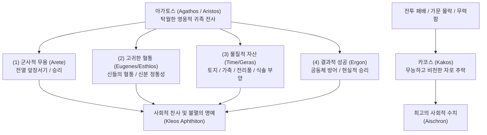

# 아가토스 (Agathos)

**[[greek-reading-guide|읽는 법]]**: 아가토스 · **원어**: ἀγαθός · **학술 전사**: *agathós*

## 1. 개념 정의 및 문헌학적·사회적 위상

**아가토스**(ἀγαθός, *agathós*; 관용 라틴명 Agathos / 복수형 아가토이, Agathoi, ἀγαθοί)는 호메로스 서사시와 아르카익 그리스 사회에서 현대적 의미의 '도덕적으로 착한 사람(morally good)'을 뜻하지 않습니다.

고대 영웅 사회에서 아가토스는 ‘**군사적 무용([[concept-arete|Arete]]), 고귀한 혈통, 막대한 부와 명예([[concept-time|Timê]])를 갖추고 공동체와 가문([[concept-oikos|Oikos]])을 수호하는 데 성공한 탁월한 귀족 전사(Noble warrior-chieftain)**’를 가리키는 최고의 가치 칭찬어였습니다 ([[adkins-1960-merit-and-responsibility|Adkins 1960]]).

중앙집권적 사법 기관이나 치안 조직이 부재했던 시대에 공동체의 존망은 오직 전사들의 물리적 전투력에 달려 있었으므로, 아가토스 규범은 엄격한 **결과주의**(Results-culture)에 기반했습니다. 아무리 선한 의도를 품었더라도 전장에서 패배하거나 가문을 지키지 못하면 즉각 비난어인 **카코스**([[concept-kakos|Kakos]], κακός / 무능하고 비천한 자)로 전락했습니다.

그러나 마르갈리트 핀켈버그([[finkelberg-1998-time-and-arete|Finkelberg 1998]])는 애드킨스의 단순 성공 결과주의를 근본적으로 비판했습니다. 그리스인들에게 경쟁(*agōn*)은 단순한 승패가 아니라 **동등자 간의 상호 탁월성 추구** (Mutual emulation of equals)를 통해 필멸자가 도달할 수 있는 '탁월성의 정점'(*ákron aretês*)에 이르는 장이었습니다. 따라서 오디세우스가 『일리아스』 11.408–410에서 독백하듯, 오직 비천한 자(*kakoi*)만이 싸움을 피하며, 진정한 아가토스는 승패의 위험을 무릅쓰고 전열에 서서 싸우는 **행위 자체** (Participation as such)를 통해 규정됩니다.

> [!WARNING] 모순/이설 발견: 아가토스의 도덕성과 결과주의에 관한 학설 대립
> A. W. H. Adkins(1960)는 아가토스가 순수하게 군사적·물질적 성공에 종속된 '경쟁적 가치'이며 도덕적 의무와 무관하다고 보았습니다. 반면 A. A. Long(1970)과 Alasdair MacIntyre(1981), 그리고 Margalit Finkelberg(1998)는 아가토스가 단순히 힘만 센 무뢰한이나 결과적 승리자가 아니라, 공동체 내부의 역할에 상응하는 '적절성의 기준(Kata moiran)'과 전열에 당당히 서는 실천적 행위(Enérgeia)를 결합한 전인적 탁월성이었음을 입증했습니다.

---

### [문헌학적 어원 계통 및 비교급·최상급 체계]

호메로스 그리스어에서 *agathos*는 보충 어간을 통해 다채로운 비교급과 최상급을 형성하며, 이는 고대 귀족 지배층의 계급적·이데올로기적 정체성과 직결됩니다:

| 등급 | 관용 라틴명 | 희랍어 어휘 | 학술 전사 | 어원 및 문헌학적 의미 | 현대적 파생 개념 |
|:---|:---|:---|:---|:---|:---|
| **원급** | **Agathos / Esthlos** | **ἀγαθός / ἐσθλός** | *agathós / esthlós* | 훌륭한, 유능한, 고귀한, 용맹한 귀족 전사. | — |
| **비교급** (1) | **Ameinōn** | **ἀμείνων** | *ameínōn* | 더 유익하고 탁월한, 더 뛰어난 전투 능력을 지닌. | — |
| **비교급** (2) | **Kreissōn** | **κρείσσων** | *kreíssōn* | 더 강력한, 힘과 지위에서 우위에 선 (*kratos* 파생). | 민주정(Democracy)의 *-cracy* |
| **최상급** (1) | **Aristos** | **ἄριστος** | *áristos* | **가장 탁월한 자, 최고의 영웅** (*aristeia* / *arete* 동계). | **귀족정**(Aristocracy), 영웅적 무용담(*Aristeia*) |
| **최상급** (2) | **Kratistos** | **κράτιστος** | *krátistos* | 가장 압도적인 물리적 완력과 지배력을 행사하는 자. | — |
| **최상급** (3) | **Beltistos** | **βέλτιστος** | *béltistos* | 가장 훌륭하고 유익한 자, 최선의 선택. | — |

---

## 2. 아가토스의 4대 구성 요건과 가치 평가 매트릭스

호메로스 텍스트에서 한 인물이 진정한 아가토스로 인정받기 위해서는 4가지 차원의 사회적·물리적 역량이 결합되어야 합니다:

| 핵심 요건 | 관용 라틴명 | 희랍어 개념 | 학술 전사 | 문헌학적 정의 및 서사시 내 기능 | 결핍 시 결과 |
|:---|:---|:---|:---|:---|:---|
| **1. 전투력과 무용** | **Arete** ([[concept-arete\|Arete]]) | **ἀρετή** | *aretḗ* | 적을 압도하고 전열의 맨 앞에 서서 승리를 이끄는 신체적·군사적 탁월성. | 전장에서의 패배, 무력함, 죽음. |
| **2. 고귀한 혈통** | **Eugeneia** | **εὐγενής** | *eugenḗs* | 신(Gods)이나 유력한 왕들의 혈통을 계승한 귀족적 신분 정당성. | 평민/하층민으로 취급, 발언권 상실. |
| **3. 물질적 부와 명예** | **Timē / Geras** ([[concept-time\|Timê]]) | **τιμή / γέρας** | *timḗ / géras* | 많은 토지, 가축, 황금, 전리품을 소유하고 식솔을 부양할 수 있는 경제력. | 타인의 무시와 모욕([[concept-time\|티메 박탈]]). |
| **4. 결과주의적 성공** | **Ergon** | **ἔργον** | *érgon* | 실패에 대해 "의도는 좋았다"는 변명이 통하지 않는 절대적 성공 지향. | 비겁자·패배자 낙인(**카코스, [[concept-kakos\|Kakos]]**). |

---

## 3. 아가토스의 실존적 조건과 도덕심리학적 역학

### 3.1 상시적 긴장과 자기보존 (Adkins & Scott)
- 아가토스는 자신의 아레테와 티메를 지켜줄 외부 공권력이 없기 때문에, 영구적인 경계와 긴장 상태(*permanent state of preparedness and tension*) 속에서 살아갑니다 ([[scott-1982-philos-philotes-xenia|Scott 1982]]).
- 사소한 모욕이나 전리품 강탈(예: 아가멤논의 브리세이스 강탈)에도 즉각 목숨을 걸고 맞서야만 자신의 아가토스 지위가 유지됩니다.

### 3.2 필로스(Philos)와 크세니아(Xenia)의 절대적 필요성
- 아무리 뛰어난 아가토스라도 고립된 개인으로서는 적대적 세계에서 생존할 수 없습니다.
- 따라서 아가토스는 경쟁의 긴장을 풀고 안도할 수 있는 ‘**내 편(필로이, *Philoi* — 가족, 동료, 충복)**’을 확보해야 합니다.
- 또한 고향 밖을 나섰을 때 목숨과 재산을 보호받기 위해 낯선 이방인과 세습적 상호부조 동맹인 **크세니아**([[concept-xenia|Xenia]])를 맺습니다.

### 3.3 아가토스 간의 경쟁과 공적 중재 기구의 부재
- 호메로스 영웅들의 충돌은 '선과 악의 대립'이 아니라 ‘**서로 양보할 수 없는 두 아가토스의 티메 충돌**’입니다.
- 아가멤논은 군단 전체의 통솔권과 권력의 아가토스이며, 아킬레우스는 전투력의 아가토스입니다.
- 두 영웅의 권리 주장을 중재하고 강제할 상위의 객관적 사법 제도가 부재했기 때문에, 두 아가토스의 충돌은 공동체 전체를 파멸로 몰고 가는 극단적인 분노([[concept-menis|Menis]])로 비화되었습니다.

---

## 4. 서사시 내 주요 문헌학적 용례 및 영웅 유형학

### 4.1 4대 영웅의 아가토스 체현 양상

1. **[[entity-achilles|아킬레우스]] — 압도적 무력의 아가토스**:
   - 신의 혈통과 필적할 자 없는 전사적 아레테(Bie)를 통해 불멸의 명예([[concept-kleos|Kleos]])를 쟁취하는 전형적 영웅.
2. **[[entity-agamemnon|아가멤논]] — 권력과 지위의 아가토스**:
   - 가장 많은 군대와 함대를 거느리고 신들로부터 지휘봉(Skeptron)을 부여받은 최상위 권력자. 아킬레우스에게 "내가 더 왕답기 때문(βασιλεύτερός εἰμι)"(_Il._ 9.160)에 복종하라고 요구함.
3. **[[entity-hector|헥토르]] — 시민적 수호자로서의 아가토스**:
   - 사적 명예뿐만 아니라 트로이 성벽과 백성, 노부모와 처자식을 지키기 위해 "언제나 맨 앞줄에서 싸우는 아가토스"의 책무를 다함:
   - *"내 마음 또한 출전하기를 명하오. 나는 언제나 트로이아인들의 맨 앞줄에서 싸우며, 부친의 큰 영광과 내 자신의 명예를 지키는 훌륭한 자(ἐσθλός)가 되는 법을 배웠기 때문이오."* (_Il._ 6.444–446)
   - **[주석]**: 헥토르는 개인의 영광뿐만 아니라 도시 공동체의 방어라는 아가토스의 사회적 역할을 자각하고 목숨을 바칩니다.
4. **[[entity-odysseus|오디세우스]] — 지략과 생존의 아가토스**:
   - 물리적 힘(Bie)뿐만 아니라 탁월한 지혜([[concept-metis|Metis]])와 인내([[concept-tlemosyne|Tlemosyne]])를 발휘하여 파탄 난 가문(Oikos)을 끝내 복원해 내는 아가토스.

### 4.2 카코스(Kakos)의 전형: 테르시테스 사건 (『일리아스』 2권)
- 평민 전사 [[entity-thersites|테르시테스]]가 군주 아가멤논의 탐욕을 비판했을 때, 오디세우스는 그를 지팡이로 구타하며 군대 전체의 웃음거리로 만듭니다 (_Il._ 2.211–277).
- 테르시테스의 말이 사실에 부합했음에도 징벌당한 이유는, 그가 귀족적 혈통과 무용이 결여된 ‘**카코스([[concept-kakos|Kakos]])**’의 신분으로서 아가토스의 권위에 도전했기 때문입니다 ([[adkins-1960-merit-and-responsibility|Adkins 1960]]).

### 4.3 아가토스의 위계와 결과의 충돌: 에우멜로스 전차 경주 (『일리아스』 23권)
- 파트로클로스 장례 경기 전차 경주에서 가장 뛰어난 전차병인 에우멜로스가 마차 파손으로 꼴찌로 들어오자, 아킬레우스는 그의 탁월한 신분을 인정하여 2등 상을 주려 합니다:
  - *"가장 훌륭한 자(ἄριστος ἀνήρ)가 말들을 꼴찌로 몰고 왔구나. 자, 그에게 마땅히 2등 상을 주도록 하자."* (_Il._ 23.536–538)
- 이에 2등으로 들어온 안틸로코스가 "그는 훌륭한 아가토스일지라도 경기 결과에 따라 상을 받아야 한다"고 강력히 반발합니다. 이 사건은 영웅의 본질적 신분 지위와 실제 경기 결과 사이의 긴장을 극적으로 노정합니다.

---

## 5. 학술사적 변천: 호메로스에서 플라톤까지

1. **호메로스 시대 (기원전 8세기) — 역할에 정초된 덕**:
   - 알래스데어 매킨타이어([[macintyre-1981-after-virtue-ch10|MacIntyre 1981]])가 규명하듯, 호메로스 세계에서 인간은 사회적 역할(Role) 밖의 독립된 자아를 갖지 않습니다. 아가토스는 왕, 장수, 전사라는 구체적인 사회적 기능을 완벽히 수행하는 기능적 탁월성이었습니다.
2. **폴리스 시민 사회의 성립 (기원전 6~5세기) — 협력적 가치의 포섭**:
   - 개인의 무용보다 중장보병(Hoplite) 밀집대형의 협동과 법 준수가 중요해지면서, 공정함(**디카이오시네, *Dikaiosyne***)과 절제(**소프로시네, *Sophrosyne***)가 아가토스의 핵심 요소로 포섭되었습니다.
3. **고전기 그리스 철학 (플라톤과 아리스토텔레스, 기원전 4세기) — 칼로카가티아**:
   - 세속적 성공을 넘어 영혼의 탁월성과 도덕적 지혜를 갖춘 전인적 이상인 **칼로카가티아**([[concept-kalokagathia|Kalokagathia]], 아름답고 선함)로 내면화·철학화되었습니다.

---

## 관련 항목
### 호메로스 텍스트 및 인물
- [[일리아스]]
- [[오뒷세이아]]
- [[entity-achilles|아킬레우스]]
- [[entity-agamemnon|아가멤논]]
- [[entity-hector|헥토르]]
- [[entity-odysseus|오디세우스]]
- [[entity-thersites|테르시테스]]

### 관련 윤리·사회·철학 개념
- [[concept-arete|Arete]] (탁월성과 전사의 덕)
- [[concept-time|Timê]] (명예와 물질적 가치)
- [[concept-kleos|Kleos]] (불멸의 명성과 시적 기억)
- [[concept-kakos|Kakos]] (무능과 비천함, 패배의 수치)
- [[concept-kalokagathia|Kalokagathia]] (고전기 아름다움과 선의 일치)
- [[concept-metis|Metis]] (오디세우스적 지략과 지혜)
- [[concept-tlemosyne|Tlemosyne]] (인내와 고난의 극복)
- [[concept-xenia|Xenia]] (손님 환대와 상호 안전 보장)
- [[concept-aidos|Aidos]] (수치심과 경외의 도덕 감정)
- [[concept-nemesis|Nemesis]] (공적 의분과 분배의 정의)
- [[concept-eleos|Eleos]] (연민과 성공의 붕괴에 대한 비애감)
- [[concept-themis|Themis]] (신성한 관습법과 규칙)
- [[concept-dike|Dike]] (우주적 정의와 질서)

### 주요 연구 소스 및 종합 분석
- [[scott-1979-pity-and-pathos]] (메리 스콧: 호메로스에서의 연민과 파토스 — 아가토스의 몰락과 결과주의적 파토스)
- [[adkins-1960-merit-and-responsibility]] (A. W. H. 애드킨스: 공적과 책임 — 경쟁적 가치로서의 Agathos 분석)
- [[scott-1981-some-greek-terms]] (메리 스콧: 비경쟁적 어휘 연구 — 아가토스의 긴장 완화와 Aganos, Meilichos, Kedos, Pistos)
- [[scott-1982-philos-philotes-xenia]] (메리 스콧: 필로스, 필로테스, 크세니아 — 아가토스의 긴장과 자기보존망)
- [[long-1970-morals-and-values]] (A. A. 롱: 호메로스의 도덕과 가치 — 적절성의 기준과 애드킨스 비판)
- [[macintyre-1981-after-virtue-ch10]] (알래스데어 매킨타이어: 덕의 상실 10장 — 영웅 사회에서의 역할과 덕)
- [[williams-1993-shame-and-necessity]] (버나드 윌리엄스: 수치심과 필연성 — 호메로스 행위주체성 복원)
- [[lee-junseok-2024-iliad-jeongam]] (이준석: 일리아스 집중강좌 — 영웅적 아가토스와 명예 체계 해제)
- [[finkelberg-1998-time-and-arete|마르갈리트 핀켈버그 (1998)]] (호메로스에게서의 티메와 아레테 — 애드킨스 결과주의 비판 및 상호 탁월성 추구로서의 아곤 규명)
- [[analysis-homeric-ethics-literature-review]] (호메로스 서사시 윤리학 연구사 종합 분석)
