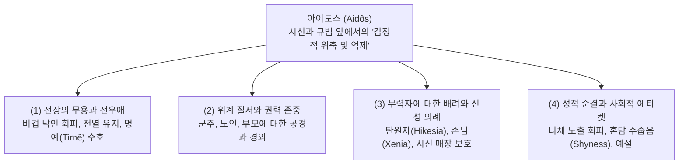

# 아이도스 (Aidôs, αἰδώς) — 수치심, 경외 및 자기억제의 도덕 감정

## 1. 개념 정의 및 어원학적 기원

<strong>아이도스(Aidôs, αἰδώς)</strong>는 호메로스 서사시와 고대 그리스 문화 전반을 관통하는 가장 핵심적인 도덕 감정으로, 타인의 시선, 공적 평판, 사회적 규범 또는 신적 권위 앞에서 느끼는 경외(Reverence), 존경(Respect), 수치심(Shame), 자기억제(Inhibition)를 포괄하는 종합적 심리 기제입니다.

- **어원학(Etymology) 및 의미소**:
  - 동사 아이데오마이(*aideomai*, αἰδέομαι, 부끄러워하다, 공경하다) 및 형용사 아이도이오스(*aidoios*, αἰδοῖος, 존경할 만한, 경외심을 자아내는)와 직결됩니다.
  - 어원적으로 아이도스는 '신비롭거나 우월한 힘, 혹은 사회적 시선에 직면하여 내면에서 일어나는 본능적 위축과 주춤거림(Shrinking back / Pulling back / Non-moral emotional inhibition)'을 본질로 합니다 ([[scott-1980-aidos-and-nemesis|Scott 1980]], [[cairns-1993-aidos|Cairns 1993]]).
- **결핍 악덕(Deficiency)과 파생어**:
  - 아이도스가 결여된 상태는 아나이데이아(*anaideia*, ἀναίδεια, 뻔뻔함/파렴치)라 부르며, 이를 체화한 자는 아나이데스(*anaidês*, ἀναιδής, 뻔뻔스러운 자)로 규탄받습니다. 아킬레우스는 아가멤논을 "파렴치함으로 옷 입은 자(*ô moi anaideiên epieimene* / ὦ μοι ἀναιδείην ἐπιειμένε)"(_Il._ 1.149)라 비난하며, 오디세우스는 신과 인간을 두려워하지 않는 구혼자들의 파렴치함을 징벌합니다 (_Od._ 22.39–40).
- **신체성과 심리학적 좌소**:
  - 아이도스는 추상적 지적 판단이 아니라 감정과 충동의 중심인 튀모스(*thumos*, θυμός)와 횡격막/가슴인 프렌(*phrên*, φρήν)에서 생리적으로 경험됩니다.
  - 얼굴 붉힘(Blushing), 고개 숙이기, 시선 회피, 외투로 얼굴 가리기 등 구체적인 신체 반응으로 발현됩니다 (_Il._ 15.561, _Od._ 8.86).

---

## 2. 아이도스의 4대 작동 영역

호메로스 서사시에서 아이도스는 통일된 내적 억제 메커니즘을 바탕으로 4대 핵심 사회·종교적 영역에서 발현됩니다 ([[cairns-1993-aidos|Cairns 1993]], [[scott-1980-aidos-and-nemesis|Scott 1980]]):

### 2.1 전장에서의 무용과 상호 감시 (Heroic Battle-Aidos)
- **공식구와 전열 유지**: 전투 지휘관들은 병사들에게 "가슴속에 아이도스를 품으라(*aidô thesth' eni thumôi* / αἰδῶ θέσθ' ἐνὶ θυμῷ)"고 외치며, 서로의 시선을 의식하여 부끄러움을 느끼는 "상호 아이도스(*allēlous t' aideisthe* / ἀλλήλους τ' αἰδεῖσθε)"를 촉구합니다 (_Il._ 5.530, 15.561–564).
- **명예 손상 회피**: 전우들 앞에서 등을 돌리고 도망쳐 명예([[concept-time|Timê]])를 상실하고 세간의 비난 평판(*phatis dêmou*)을 듣는 것에 대한 두려움이 영웅을 전선에 묶어두는 핵심 동력입니다.

### 2.2 위계와 권력에 대한 경외 (Respect for Hierarchy)
- **군주와 상급자 앞의 절제**: [[entity-diomedes|디오메데스]]가 [[entity-agamemnon|아가멤논]]의 부당한 질책에 침묵하는 것(_Il._ 4.401–402: *hazomenos basiliêos enipên aidoioio*), 전령 [[entity-talthybios|탈튀비오스]]와 에우리바테스가 [[entity-achilles|아킬레우스]]의 위엄에 눌려 말을 잇지 못하는 것(_Il._ 1.331–332: *tarbêsante kai aidomenô basilêa*)은 권력과 지위가 자아내는 아이도스입니다.
- **노인과 가족 관계의 경외**: [[entity-telemachos|텔레마코스]]가 연장자 [[entity-nestor|네스토르]]에게 말을 건네기 어려워하거나(_Od._ 3.22–24: *aidôs d' au neon andra geraiteron exeréesthai*), [[entity-hecabe|헤카베]]가 헥토르에게 어머니의 젖가슴을 드러내며 아이도스를 호소하는 것(_Il._ 22.82–83: *tade t' aideo kai m' eleêson*)은 혈연과 세대 질서의 신성함에서 기인합니다.
- **시민적 영웅의 딜레마**: [[entity-hector|헥토르]]는 아내 안드로마케의 간곡한 만류에도 불구하고 "트로이아의 남녀들이 나를 비겁자로 볼까 극도로 부끄럽다(*aideoi mai Trôas kai Trôadas*)"며 출전을 결단합니다 (_Il._ 6.441–446, 22.105, [[redfield-1975-nature-and-culture|Redfield 1975]], [[lee-junseok-2024-iliad-jeongam|이준석 2024]]).

### 2.3 무력자에 대한 보호와 신적 제재 (Hikesia & Xenia)
- **세속적 무력함의 보완**: 물리적 자구 능력이 없는 탄원자([[concept-hikesia|Hikesia]])와 나그네([[concept-xenia|Xenia]])는 **[[entity-zeus-hikesios|Zeus Hikesios]]**와 **[[entity-zeus-xenios|Zeus Xenios]]**의 보호 아래 놓입니다. 이들을 박대하는 자는 "신들을 공경하라(*aideio theous* / αἰδεῖο θεούς)"는 계율을 위반하여 신적 재앙을 초래합니다 (_Od._ 9.269–271, _Il._ 24.503).
- **아폴론의 규탄과 아이도스의 양면성**: [[entity-achilles|아킬레우스]]가 헥토르의 시신을 훼손할 때, [[entity-apollo|아폴론]]은 그가 연민([[concept-eleos|Eleos]])과 아이도스를 상실했다고 꾸짖으며 아이도스의 양면성을 갈파합니다:
  - *"아킬레우스는 연민을 버렸고, 인간에게 큰 해가 되기도 하고 큰 득이 되기도 하는 아이도스조차 그에게는 없도다."* (_Il._ 24.44–45; *hê t' andras mega sinetai êd' oninêsi*)
  - 이는 헤시오도스(*Works and Days* 318)와 공유되는 고대 그리스 격언으로, 부적절한 수치심은 사람을 위축시켜 해를 끼치지만, 적절한 아이도스는 오만([[concept-hybris|Hybris]])을 막아 인간을 보호한다는 뜻입니다.

### 2.4 성적 순결, 에티켓 및 수줍음 (Decency & Shyness)
- **신체 노출 기피**: [[entity-odysseus|오디세우스]]가 나우시카아의 시녀들 앞에서 나체로 씻기를 꺼리는 것(_Od._ 6.220–222: *aideo mai gar gymnasthai*), [[entity-nausicaa|나우시카아]]가 부친 알키노오스에게 혼담을 입에 올리기 부끄러워하는 것(_Od._ 6.66–67: *aideto gar thaleron gamon*)은 사적 영역의 예절과 수치심을 구성합니다.
- **여신들의 품위 유지**: 아레스와 아프로디테의 간통 현장을 구경하기 위해 남신들이 몰려든 반면, 여신들은 수치심 때문에 각자의 집에 머뭅니다 (_Od._ 8.324: *thêlyterai de theai menon aidoi oikoi hekastê*).

---

## 3. 학술적 쟁점 및 패러다임 대립

### 3.1 수치 문화(Shame Culture) 대 내면화된 도덕심리학

> [!WARNING] 모순/이설 발견: 수치 문화(Dodds) 대 내면화된 자아 이상(Williams/Cairns)
> - **도즈(Dodds 1951)의 외적 수치 문화론**: 호메로스 사회를 '수치 문화(Shame-culture)'로 규정하고, 아이도스를 타인의 가시적 비난과 평판에만 수동적으로 반응하는 타율적이고 미성숙한 외적 제재로 평가 절하했습니다.
> - **윌리엄스(Williams 1993)와 케언스(Cairns 1993)의 반박 및 복원**: 아이도스는 단순한 눈치보기가 아닙니다. 그것은 타인의 실제 반응 이전에 행위자의 가슴속에 구축된 **'내면화된 타자(Internalized Other)'**의 시선을 바탕으로, 자신의 고결한 품위와 자아 이상(Ego-ideal)에 부합하는지를 성찰하는 고도의 도덕심리학적 자기규어(Self-respect)임을 입증했습니다.

### 3.2 다의적 분절론 대 단일 감정 위축론

> [!WARNING] 모순/이설 발견: 다의적 분절론(Von Erpha) 대 단일 감정 위축론(Scott/Cairns)
> - **폰 에르파(Von Erpha 1937)의 분절 모델**: 아이도스를 종교적 경외, 사회적 수치심, 성적 수줍음 등으로 완전히 분리된 다의적 어휘로 파편화하여 파악했습니다.
> - **스콧(Scott 1980)과 케언스(Cairns 1993)의 통일 모델**: 아이도스의 모든 용례는 **'타인의 잠재적 비판이나 신비한 힘 앞에서 일어나는 감정적 위축(Inhibition / Shrinking back)'**이라는 단일한 심리적 공통분모로 통합 설명될 수 있음을 문헌학적으로 논증했습니다.

- **거지의 아이도스(비도덕적 성격)**: 텔레마코스가 거지로 위장한 오디세우스에게 음식을 주며 "궁핍한 자에게 아이도스는 좋은 것이 아니다(*aidôs d' ouk agathê kechrêmenôi andri pareinai*)"(_Od._ 17.347)라고 말하듯, 아이도스는 절대적 선험 규범이 아니라 상황에 따라 결핍되거나 과도해질 수 있는 실질적 감정 기제입니다 ([[scott-1980-aidos-and-nemesis|Scott 1980]]).

### 3.3 적절성의 기준(Standard of Appropriateness)과 중용
- **롱(Long 1970)의 척도론**: 아이도스는 결핍(비겁, 파렴치)과 과도(오만, 무모)를 양방향으로 제어하며, 인간 행동의 마땅한 분수와 척도(**카타 모이란, *kata moiran*** / **테미스, *themis*** / **카타 코스몬, *kata kosmon***)를 준수하게 만드는 핵심 연결 고리입니다.

---

## 4. 네메시스(Nemesis) 및 연민(Eleos)과의 상호 연동

### 4.1 네메시스와의 상호 억제 고리
아이도스는 관찰자 공동체의 공적 의분인 **네메시스([[concept-nemesis|Nemesis]])**와 대칭적 짝을 이룹니다 ([[scott-1980-aidos-and-nemesis|Scott 1980]]):

$$\text{행위자의 아이도스(Aidôs)} \iff \text{관찰자의 네메시스(Nemesis)}$$

- **길버트 머레이(Gilbert Murray)의 정식**:
  - *"아이도스는 자신의 행동에 대해 스스로 느끼는 내적 억제 감정이며, 네메시스는 타인의 탈선에 대해 느끼는 공적 의분이자, 타인이 나에게 품을 것이라 예견하는 반응이다."*
- **역지사지와 황금률(Golden Rule)의 태동**:
  - 『일리아스』 23권 마차 경주 분쟁에서 아킬레우스는 다투는 아이아스와 이도메네우스에게 "남이 그런 짓을 하면 당신들도 네메시스를 느낄 터인데 어찌 그 짓을 하는가!"(_Il._ 23.492–494)라고 질책합니다.
  - 이는 타인의 네메시스를 자기 내면의 아이도스로 전환하는 **상호적 도덕 의식의 맹아**를 보여줍니다.

### 4.2 24권: 연민(Eleos)과 결합된 아이도스의 영적 도약
- 『일리아스』 24권에서 [[entity-priam|프리아모스]]는 적장 아킬레우스의 무릎을 잡고 손에 입맞추며 호소합니다:
  - *"신들을 두려워하고 공경하십시오(αἰδεῖο θεούς), 아킬레우스여! 그대의 아버지를 생각하여 나를 불쌍히 여기소서(ἐλέησον)."* (_Il._ 24.503)
- 아킬레우스는 단순한 사회적 체면을 넘어, **신들에 대한 경외(*aideio theous*)**와 인간 보편의 취약성에 대한 **연민([[concept-eleos|Eleos]])**을 매개로 헥토르의 시신을 인도하고 인간성을 회복합니다 ([[zanker-1994-heart-of-achilles|Zanker 1994]], [[lee-junseok-2024-iliad-jeongam|이준석 2024]]).

---

## 관련 항목
### 핵심 인물 및 서사
- [[일리아스]] / [[오뒷세이아]]
- [[entity-achilles|아킬레우스]] — 헥토르 시신 훼손으로 아이도스를 잃었다가 24권에서 신적 경외와 연민으로 회복한 비극적 영웅
- [[entity-hector|헥토르]] — 트로이아 시민들의 시선과 아이도스 때문에 도망치지 못하고 전사한 시민적 영웅
- [[entity-priam|프리아모스]] — 신에 대한 아이도스와 아비의 연민을 결합하여 아들의 시신을 되찾은 탄원자
- [[entity-telemachos|텔레마코스]] — 네스토르 앞에서의 조심성과 구혼자들의 파렴치함(Anaideia)에 대한 의분을 토로한 아들
- [[entity-diomedes|디오메데스]] — 아가멤논의 부당한 질책 속에서도 군주의 권위에 아이도스를 지킨 모범적 전사
- [[entity-helene|헬레네]] — 자신의 행위에 대해 끊임없이 자책과 수치심을 토로하는 여인

### 관련 윤리 및 신화 개념
- [[concept-nemesis|Nemesis]] — 마땅한 몫의 침해에 대한 공적 의분과 질서 수호
- [[concept-hikesia|Hikesia]] — 신체 접촉과 아이도스에 기초한 신성 탄원 의례
- [[concept-xenia|Xenia]] — 손님 환대의 의무와 제우스 크세니오스의 가호
- [[concept-eleos|Eleos]] — 고통받는 타자에 대한 연민과 공감
- [[concept-time|Timê]] — 사회적 인정과 명예
- [[concept-arete|Arete]] — 영웅적 탁월성과 그에 따르는 도덕적 책무
- [[concept-xenia|Xenia]] — 손님 환대와 이방인 보호 규범
- [[concept-themis|Themis]] — 신성한 관습 규범
- [[concept-moira|Moira]] — 인간에게 할당된 응당한 몫과 운명적 한계
- [[concept-hybris|Hybris]] — 몫을 넘어선 오만과 불의
- [[concept-anaideia|Anaideia]] — 아이도스의 결핍이자 파렴치함
- [[concept-cholos|Cholos]] — 인간적 분노와 격정

### 주요 연구 문헌
- [[scott-1979-pity-and-pathos]] — 호메로스에서의 연민과 파토스 (결과주의적 파토스와 오익토스의 감정적 억제 분석)
- [[scott-1980-aidos-and-nemesis]] — 호메로스 저작에서의 아이도스와 네메시스 (감정적 위축론 및 신적 제재 분석)
- [[scott-1982-philos-philotes-xenia]] — 호메로스 저작에서의 필로스, 필로테스, 크세니아 (긴장 완화와 크세니아 상호부조망)
- [[cairns-1993-aidos]] — 아이도스: 고대 그리스 문학의 도덕심리학과 명예 체계
- [[williams-1993-shame-and-necessity]] — 수치심과 필연성 (내면화된 타자 시선 및 자아 이상 복원)
- [[long-1970-morals-and-values]] — 호메로스의 도덕과 가치 (적절성의 기준 모델)
- [[dodds-1951-greeks-and-irrational]] — 그리스인들과 비합리적인 것 (수치 문화 분석)
- [[redfield-1975-nature-and-culture]] — 자연과 문화: 일리아스의 헥토르와 영웅적 비극
- [[lee-junseok-2024-iliad-jeongam]] — 정암학당 2024 일리아스 강좌 (6권/24권 아이도스 심화 해제)
- [[zanker-1994-heart-of-achilles]] — 아킬레우스의 마음: 호메로스 서사시의 연민과 도덕적 선택

