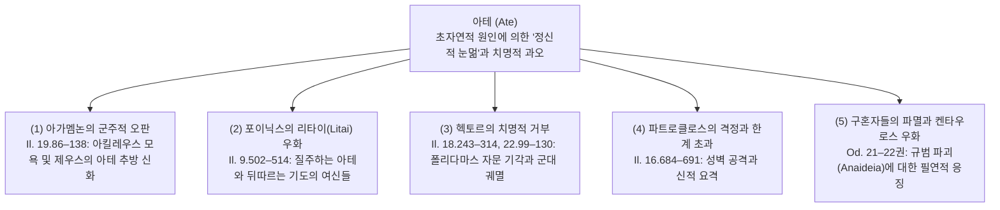
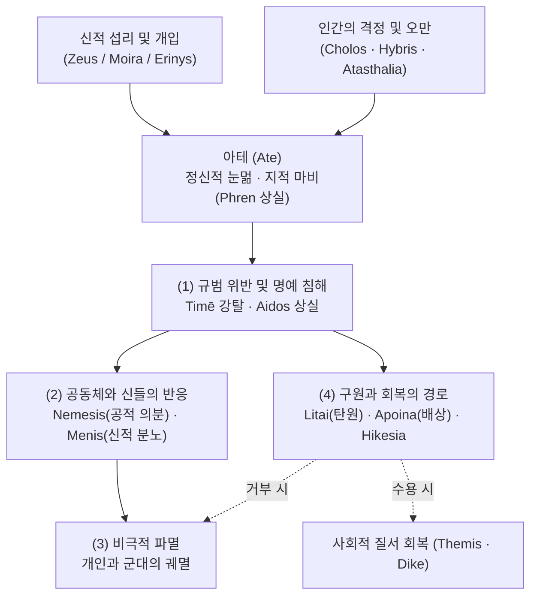

# 아테 (Ate)

**[[greek-reading-guide|읽는 법]]**: 아테 · **원어**: ἄτη · **학술 전사**: *átē*

## 1. 개념 정의 및 어원학적 기원

**아테**(ἄτη, *átē*; 관용 라틴명 Ate)는 고대 그리스 서사시와 초기 희랍 사유에서 신들이 인간의 가슴과 횡격막([[concept-phren|프렌]])에 불어넣어 정상적인 사리분별과 지적 판단력을 일시적으로 마비시키는 **정신적 눈멂**(Mental Delusion, 미망), 그로 인해 저지르는 **치명적 과오**(Disastrous Infatuation/Misjudgment), 그리고 그 과오가 필연적으로 야기하는 **파멸적 파국**(Ruin/Disaster)을 포괄하는 다층적 개념입니다.

- **어원학**(Etymology) **및 파생 어휘군**:
  - '속이다, 호도하다, 정신을 흐리게 하여 손해를 입히다'를 뜻하는 동사 **아아오**(ἀάω, *aáō*)에서 유래합니다.
  - 서사시의 동사 형태론에서는 모음 접속(hiatus)이 보존된 비축약형 **아아사멘**(ἀασάμην, *aasámēn*)과 **아아사토**(ἀάσα토, *aásato*)가 주로 쓰이며, 형용사형 **아테로스**(ἀτηρός, *atērós*)는 '미망에 빠진', '재앙을 초래하는' 상태를 가리킵니다.
  - 아테는 단순한 도덕적 악덕이나 지능의 결함이 아니라, 외부의 초자연적 힘([[entity-zeus|제우스]], [[concept-moira|모이라]], [[entity-erinys|에리뉘스]], [[concept-daimon|다이몬]])이 인간의 인지 체계를 뒤흔들어 '정상 상태의 자기 자신'이라면 결코 하지 않았을 파멸적 선택을 내리게 만드는 초개인적 충동 현상입니다 ([[dodds-1951-greeks-and-irrational|Dodds 1951]], [[williams-1993-shame-and-necessity|Williams 1993]]).
  - 상세한 어원 전파사, 선희랍 기층어(Pre-Greek substrate) 기원 및 현대 영문학 수용사는 [[word-ate|Ate (어원 사전)]]를 참조하십시오.

| 희랍어 어휘 | 원어 표기 | 학술 전사 | 품사 및 형태 분석 | 의미 및 문헌학적 맥락 |
|:---|:---|:---|:---|:---|
| **Ate** | ἄτη | *átē* | 여성 명사 (단수 주격) | 정신적 눈멂, 미망, 치명적 과오, 파멸, 신격화된 재앙 |
| **Aaō** | ἀάω | *aáō* | 능동 동사 (현재 기본형) | 정신을 흐리게 하다, 눈멀게 하다, 손해를 입히다 |
| **Aasamen** | ἀασάμην | *aasámēn* | 1인칭 단수 아오리스트 중간태 | "내가 미망에 빠졌다 / 내가 눈이 멀었다" (_Il._ 9.116, 19.137) |
| **Ase** | ἆσε | *âse* | 3인칭 단수 아오리스트 능동 | "(신/술이) 그를 눈멀게 했다 / 미혹했다" (_Od._ 11.61, 21.295) |
| **Aasato** | ἀάσα토 | *aásato* | 3인칭 단수 아오리스트 중간태 | "(제우스마저도) 미망에 빠졌다" (_Il._ 19.95) |
| **Ateros** | ἀτηρός | *atērós* | 형용사 (남성 주격) | 파멸적인, 미망을 불러일으키는, 재앙의 |
| **Blaptousa** | βλάπτουσα | *bláptousa* | 현재 능동 분사 (여성 주격) | "사람들을 해치며" 호메로스 서사시의 핵심 분사 (_Il._ 9.507, 19.91) |

---

## 2. 호메로스 본문에서의 용례와 5대 서사 영역

호메로스 서사시에서 아테는 영웅 서사의 핵심 분기점마다 등장하여 갈등을 촉발하고 비극적 파국을 추동하는 결정적 계기로 작동합니다.

### 2.1 『일리아스』 19권 86–138행: 아가멤논의 공식 사과와 아테 신화
『일리아스』 19권에서 최고 사령관 [[entity-agamemnon|아가멤논]]은 [[entity-achilles|아킬레우스]]와의 공식 화해 집회에서 자신의 지난 과오(1권의 전리품 강탈과 모욕)를 해명하며, 자신이 아테에 사로잡혔음을 공개적으로 선언합니다.

- **원인의 외재화와 제우스·모이라·에리뉘스**:
  - 아가멤논은 자신이 온전한 정신 상태에서 사태를 주도한 것이 아니라, 신들이 자신의 마음에 사나운 아테를 던져 넣었다고 호소합니다.

- **번역**: "원인은 내가 아니라, 제우스와 모이라, 그리고 어둠 속을 걷는 에리뉘스이다. 그들이 민회에서 내 마음에 사나운 아테를 던졌다."
- **원문**: *ἐγὼ δ’ οὐκ αἴτιός εἰμι, / ἀλλὰ Ζεὺς καὶ Μοῖρα καὶ ἠεροφοῖτις Ἐρινύς, / οἵ τέ μοι εἰν ἀγορῇ φρεσὶν ἔμβαλον ἄγριον ἄτην*
- **학술 전사**: *egṑ d’ ouk aítiós eimi, / allà Zeùs kaì Moîra kaì ēerophoîtis Erinús, / hoí té moi ein agorē̂i phresìn émbalon ágrion átēn* (_Il._ 19.86–88)

- **제우스마저 속인 아테의 신화적 위력**:
  - 아가멤논은 아테의 불가항력적 위력을 예증하기 위해 최고신 [[entity-zeus|제우스]]마저 [[entity-hera|헤라]]의 계략에 속아 아테에 눈이 멀었던 신화를 설파합니다 (_Il._ 19.95–133).
  - 헤라클레스의 탄생을 두고 제우스가 성급한 맹세를 했다가 에우리스테우스가 먼저 태어나 왕권을 빼앗기자, 격노한 제우스는 아테의 머리채를 잡고 올림포스 하늘에서 인간계로 영원히 내던졌습니다.
  - 이로써 아테는 인간들의 머리 위를 밟고 다니며 끊임없이 인간을 파멸에 빠뜨리는 지상적 실재가 되었습니다.

- **과오의 인정과 배상([[concept-apoina|아포이나]])의 결합**:
  - 아가멤논은 신적 개입을 원인으로 밝히면서도, 자신이 눈멀어 저지른 행위의 결과에 대해서는 전적인 배상 책임을 인정합니다.

- **번역**: "하지만 내가 미망에 빠져 제우스께서 내 분별력을 빼앗으셨으니, 나는 다시 화해하기를 바라며 헤아릴 수 없는 배상을 하겠소."
- **원문**: *ἀλλ’ ἐπεὶ ἀασάμην καί μευ φρένας ἐξέλετο Ζεύς, / ἂψ ἐθέλω ἀρέσαι, δόμεναí τ’ ἀπερείσι’ ἄποινα*
- **학술 전사**: *all’ epeì aasámēn kaí meu phrénas ekséleto Zeús, / àps ethélō arésai, dómenaí t’ apereísi’ ápoina* (_Il._ 19.137–138)

### 2.2 『일리아스』 9권 502–514행: 포이닉스의 리타이(Litai) 우화
『일리아스』 9권 사절단 장면에서 노장 [[entity-phoenix|포이닉스]]는 분노에 휩싸인 아킬레우스에게 화해의 제안을 받아들이라고 간곡히 설득하며, **아테**와 **리타이**(Λιταί, *Litaí*; 탄원과 기도의 여신들)의 관계를 우화로 설파합니다.

- **아테와 리타이의 속도 대조**:
  - 아테는 발이 튼튼하고 빨라 온 대지를 앞질러 질주하며 인간을 해치고 파멸로 몰아넣습니다.
  - 반면 제우스의 딸들인 리타이는 다리를 절고 얼굴에 주름이 가득하며 곁눈질을 하는 유약한 모습으로 아테의 뒤를 힘겹게 따라갑니다.

- **번역**: "아테는 강하고 발이 빨라, 모든 기도의 여신들을 훌쩍 앞질러 온 땅 위를 내달리며 사람들을 해치고, 기도의 여신들은 그 뒤에서 상처를 고친다."
- **원문**: *ἡ δ’ Ἄτη σθεναρή τε καὶ ἀρτίπος, οὕνεκα πάσας / πολλὸν ὑπεκπροθέει, φθάνει δέ τε πᾶσαν ἐπ’ αἶαν / βλάπτουσ’ ἀνθρώπους· αἳ δ’ ἐξακέονται ὀπίσσω.*
- **학술 전사**: *hē d’ Átē sthenarḗ te kaì artípos, hoúneka pásas / pollòn hupekprothéei, phthánei dé te pâsan ep’ aîan / bláptous’ anthrṓpous; haì d’ eksakéontai opíssō.* (_Il._ 9.505–507)

- **탄원([[concept-hikesia|히케시아]]) 거부자에 대한 2차 아테의 징벌**:
  - 잘못을 저지른 자가 리타이를 공경하고 받아들이면 치유를 얻지만, 탄원을 비정하게 거절하는 완고한 자에게는 리타이가 제우스에게 간청하여 그 거절자에게 다시 아테가 닥쳐 스스로 파멸을 겪게 만듭니다 (_Il._ 9.510–512).
  - 이는 아킬레우스가 아가멤논의 탄원과 화해 선물을 거부했을 때 결국 가장 소중한 전우 [[entity-patroklos|파트로클로스]]의 전사라는 또 다른 아테의 파국을 맞게 됨을 예고하는 서사적 복선입니다.

### 2.3 『일리아스』 18·22권: 헥토르의 치명적 오판과 트로이아의 붕괴
트로이아의 총사령관 [[entity-hector|헥토르]]의 서사는 영웅적 자만과 승세 속에서 찾아오는 아테의 비극적 파괴력을 체현합니다.

- **점술 계약 위반: 12권 헥토르의 조징(새의 징조) 무시와 아테** (_Il._ 12.211–243):
  - 함선 방벽 전투 중 독수리가 피 흘리는 뱀을 떨어뜨리는 불길한 징조가 나타나자 참모 폴리다마스는 진격을 멈출 것을 간언합니다.
  - 그러나 헥토르는 "단 하나의 길조는 조국을 지키기 위해 싸우는 것뿐이다(*heis oiōnos aristos amynesthai peri patrēs*)"라며 신적 징조를 일축합니다(*Il._ 12.243).
  - 엘리자베스 민친([[minchin-2019-homeric-religion|Minchin 2019]])이 규명하듯, 점술은 '신이 징조를 보내고, 예언자(Mantis)가 해독하며, 공동체가 수용한다'는 상호 묵계(Divination Contract) 위에 성립합니다. 헥토르의 징조 무시는 영웅적 애국심의 발로로 포장되지만, 신학적·서사적 층위에서는 신의 경고를 거부한 치명적 미망(아테)이자 18권의 무모한 야영과 22권의 비극적 죽음을 부르는 근원적 서사 복선입니다.

- **폴리다마스의 자문 기각과 아테나의 눈가림** (_Il._ 18.243–314):
  - 아킬레우스의 전선 복귀가 임박하자, 지혜로운 참모 [[entity-polydamas|폴리다마스]]는 트로이아군 전원이 성벽 안으로 철수해야 한다고 강력히 권고합니다.
  - 그러나 승리에 도취된 헥토르는 이를 맹렬히 기각하며 평원 야영을 고집했고, 트로이아인들은 아테나 여신이 분별력을 빼앗아(*phrénas heíleto Pallàs Athḗnē*, 18.311) 헥토르의 오판에 환호합니다.
- **22권 독백에서의 자책과 파멸 자인** (_Il._ 22.99–130):
  - 홀로 성문 밖에 남은 헥토르는 자신의 무모한 고집([[concept-atasthalia|아타스탈리아]])으로 군대를 파멸시켰음을 뼈저리게 고백하며(*nŷn d’ epeì ṓlesa laòn atasthalíēisin emē̂isin*, 22.104), 아이도스([[concept-aidos|아이도스]])와 전사적 명예 때문에 후퇴하지 못하고 최후를 맞이합니다.

### 2.4 『일리아스』 16권 684–691행: 파트로클로스의 격정과 치명적 진격
- [[entity-patroklos|파트로클로스]]는 함선 방어에만 머무르라는 아킬레우스의 엄명을 잊고 승리의 열정에 눈이 멀어 트로이아 성벽을 향해 돌진합니다.
- 서사시는 파트로클로스가 아킬레우스의 말을 지켰다면 죽음을 피했을 것이라 탄식하며, 그가 "크나큰 미망에 빠졌다"(*még’ aásthē*, _Il._ 16.685)고 명시합니다. 이는 영웅의 전사적 열정(*thumos*)이 냉철한 판단 지성(*noos*)을 압도할 때 일어나는 치명적 아테를 보여줍니다.

### 2.5 『오뒷세이아』 21–22권: 구혼자들의 파멸과 켄타우로스 우화
『오뒷세이아』 후반부에서 구혼자들의 만행은 오만([[concept-hybris|히브리스]]), 파렴치함([[concept-anaideia|아나이데이아]]), 그리고 아테의 연쇄 고리로 묘사됩니다.

- **켄타우로스 에우리티온의 아테** (_Od._ 21.295–304):
  - 구혼자 [[entity-antinoos|안티노오스]]는 거지로 위장한 오디세우스가 활을 잡으려 하자, 페이리토오스의 결혼식에서 포도주에 취해 마음에 미망이 들어(*phresìn hē̂isin aastheís*, 21.301) 난동을 부리다 코와 귀가 잘려 쫓겨난 켄타우로스 에우리티온의 일화를 거론하며 "달콤한 술이 그대를 눈멀게 했다"고 비난합니다.
- **구혼자 집단의 눈멂과 응징** (_Od._ 22.39–40):
  - 그러나 정작 아테에 깊이 빠진 자들은 구혼자 자신들이었습니다. 그들은 오디세우스의 귀환을 알아보지 못하고, 신들의 네메시스([[concept-nemesis|네메시스]])와 사람들의 비난 평판을 무시하다가 전멸당합니다.
- **일상적 실족의 예외적 사례** (_Od._ 11.61):
  - 네키이아에서 오디세우스가 만난 [[entity-elpenor|엘페노르]]의 망령은 자신의 허망한 실족사를 "다이몬의 나쁜 운명과 헤아릴 수 없는 술이 나를 미혹했다"(*âsé me daímonos aîsa kakḕ kaì athésphatos oînos*)고 증언하며, 아테가 거대한 정치적 오판뿐 아니라 일상적 실존의 취약성 속에서도 작동함을 보여줍니다.

---

## 3. 의미 범위와 서사시 정형적 결합

### 3.1 아테의 3단계 인과적 메커니즘
호메로스 서사시에서 아테는 단일한 정적 상태가 아니라 원인에서 결과로 이어지는 동태적 3단계 연쇄를 이룹니다:

$$\text{초자연적 원인 (신적 충동)} \longrightarrow \text{주관적 상태 (정신적 눈멂·판단 마비)} \longrightarrow \text{객관적 결과 (파멸적 파국·재앙)}$$

1. **외적·신적 원인** (Daimonic Cause): 제우스, 모이라, 에리뉘스 등이 인간의 마음에 아테를 불어넣음.
2. **내적·심리적 상태** (Subjective State): 횡격막(Phren)의 판단력이 마비되어 무엇이 진정한 이익이고 명예인지 분별하지 못함.
3. **객관적 실재 및 파국** (Objective Disaster): 군대의 궤멸, 전우의 죽음, 가문의 몰락 등 되돌릴 수 없는 파멸로 귀결됨.

### 3.2 서사시 주요 정형구(Formulas) 및 연어 분석

| 정형구 / 연어 표현 | 원어 표기 | 학술 전사 | 주요 출전 | 서사적 의미 및 기능 |
|:---|:---|:---|:---|:---|
| **Embalon phresin agrion aten** | ἔμβαλον φρεσὶν ἄγριον ἄτην | *émbalon phresìn ágrion átēn* | _Il._ 19.88 | "마음에 사나운 아테를 던져 넣었다" (신적 주입의 전형구) |
| **Phrenas exeleto Zeus** | φρένας ἐξέλετο Ζεύς | *phrénas ekséleto Zeús* | _Il._ 6.234, 19.137 | "제우스가 분별력을 빼앗아 갔다" (지적 마비 상태 묘사) |
| **Aasato de mega thymoi** | ἀάσατο δὲ μέγα θυμῷ | *aásato dè méga thymō̂i* | _Il._ 9.537 | "마음속으로 크나큰 미망에 빠졌다" (영웅의 내적 오판 공식) |
| **Mega aasthe** | μέγ’ ἀάσθη | *még’ aásthē* | _Il._ 16.685 | "크나큰 미망에 빠졌다" (파트로클로스의 치명적 오판) |
| **Blaptous' anthropous** | βλάπτουσ’ ἀνθρώπους | *bláptous’ anthrṓpous* | _Il._ 9.507, 19.91 | "사람들을 해치며 / 손해를 입히며" (아테의 행동 묘사 분사구) |
| **Phresin heisin aastheis** | φρεσὶν ᾗσιν ἀασθείς | *phresìn hē̂isin aastheís* | _Od._ 21.301 | "자신의 마음에 미망이 들어" (수동 아오리스트 분사 정형구) |

### 3.3 이중 결정론(Double Determination) 메커니즘
호메로스 서사시의 사건들은 인간의 자율적 동기(욕망, 성격, 분노)와 신적 섭리(신의 개입, 아테, 운명)라는 두 가지 독립된 차원에서 동시에 완전히 설명되는 **이중 결정론**(Double Determination) 구조를 지닙니다 ([[dodds-1951-greeks-and-irrational|Dodds 1951]], Lesky 1961).

- 아가멤논이 아킬레우스의 전리품을 빼앗은 것은 그의 탐욕스러운 권력욕과 격정([[concept-cholos|콜로스]])의 결과인 동시에, 제우스와 에리뉘스가 내린 아테의 결과입니다.
- 두 차원은 상호 모순되지 않으며, 인간적 동기는 신적 의지가 지상에 실현되는 가시적 통로로 기능합니다.

---

## 4. 관련 개념과 서사적 관계망

### 4.1 아이도스([[concept-aidos|아이도스]]) 및 네메시스([[concept-nemesis|네메시스]])와의 상호작용
- **아이도스의 마비**: 아테에 사로잡힌 인간은 타인의 시선이나 신적 권위를 두려워하는 자기억제 감정인 아이도스(Aidôs)를 일시적으로 상실합니다.
- **네메시스의 촉발**: 아테로 인해 저질러진 무분별한 월권과 타인의 명예([[concept-time|티메]]) 침해는 관찰자 공동체와 신들의 정당한 의분인 네메시스(Nemesis)를 즉각 촉발합니다.

### 4.2 메니스([[concept-menis|메니스]])와의 인과적 촉발
- 아가멤논의 아테(_Il._ 1권)는 아킬레우스의 존재론적 명예를 짓밟음으로써 『일리아스』 전체를 지배하는 초월적이고 파괴적인 신적 분노인 **메니스**(μῆνις, *mē̂nis*)를 폭발시키는 근원적 도화선이 되었습니다.

### 4.3 리타이(Litai) 및 에리뉘스([[entity-erinys|에리뉘스]])와의 대립과 집행
- **리타이와의 치유 관계**: 아테가 초래한 상처는 오직 겸허한 탄원과 기도를 상징하는 리타이(Litai)를 통해서만 치유될 수 있습니다.
- **에리뉘스의 징벌 집행**: 아테에 빠져 탄원을 거부하거나 혈연·우주 질서를 파괴한 자는 지하의 복수 여신 에리뉘스(Erinys)의 가혹한 파멸적 응징을 피할 수 없습니다.

### 4.4 아타스탈리아([[concept-atasthalia|아타스탈리아]]) 및 히브리스([[concept-hybris|히브리스]])와의 결합
- 아테가 외부 신적 요인에 의해 유입된 '인지적 마비'를 강조한다면, 아타스탈리아(무모함, 분수를 넘는 오만)와 히브리스는 인간 행위자의 주관적 방자함과 도덕적 타락을 강조합니다. 서사시에서 영웅들이 아테에 빠질 때 이 두 상태는 긴밀히 결합하여 파멸을 완성합니다.

---

## 5. 학술적 쟁점 및 개념사적 수용

### 5.1 도즈(Dodds 1951)의 '심리적 외주화'와 수치 문화론

> [!WARNING] 모순/이설 발견: 심리 외주화(Dodds) 대 온전한 행위자성 및 인과 책임(Williams)
> - **도즈**(Dodds 1951)**의 심리적 외주화론**: 호메로스 인간은 현대인과 같은 통일된 '자아(Self)'나 내면적 의지 관념이 없었으며, 자신의 통제 불가능한 충동이나 돌발적 판단 착오를 신적 힘(Ate/Daimon)의 개입으로 외부에 투사하여 설명했다고 주장했습니다. 또한 호메로스 사회를 내면적 죄의식이 아닌 외적 평판에만 지배받는 미성숙한 '수치 문화(Shame Culture)'로 규정했습니다.
> - **윌리엄스**(Williams 1993)**의 비판과 복원**: 버나드 윌리엄스는 아가멤논의 사과가 근대적 의미의 '책임 회피용 핑계'가 아님을 논증했습니다. 고대 희랍인들은 의도와 행위의 연쇄를 온전히 인식하고 있었으며, 아가멤논의 아테 언급은 사건 발생에 대한 '인과적 설명(Explanation)'일 뿐 배상 책임(Agent-regret / Responsibility) 자체를 부정한 것이 아니었습니다. 아가멤논은 아테를 탓하면서도 막대한 배상금(Apoina)을 지불함으로써 인과적 행위자로서의 책임을 온전히 감당했습니다.

### 5.2 애드킨스(Adkins 1960)와 로이드-존스(Lloyd-Jones 1971)의 논쟁

> [!WARNING] 모순/이설 발견: 결과주의적 무책임론(Adkins) 대 제우스의 정의와 도덕 질서(Lloyd-Jones)
> - **애드킨스**(Adkins 1960)**의 결과주의적 결함론**: 호메로스 사회에서는 성공과 무용만이 절대적 가치(Arete)였기 때문에, 아테에 의한 실수는 도덕적 비난의 대상이 되지 않고 오직 물질적 손실에 따른 결과적 책임만 문제 되었다고 보았습니다.
> - **로이드-존스**(Lloyd-Jones 1971)**의 반박**: 아테는 제우스의 정의(Dike) 체계 안에서 작동하며, 인간이 오만(Hybris)을 범했을 때 신들이 아테를 내려 스스로 파멸하게 만드는 도덕적 응징의 질서가 서사시 기저에 확고히 존재한다고 논증했습니다.

### 5.3 개념사의 발전: 서사시에서 비극과 하마르티아(Hamartia)로
- **헤시오도스** 『**신통기**』(Theogony 230행):
  - 아테는 불화의 여신 [[entity-eris|에리스]](Eris)가 낳은 자식으로 계보화되어, 거짓말(Pseudea), 분쟁(Neikea), 파멸(Dysnomia)과 함께 인간 사회를 좀먹는 도덕적 재앙으로 정식화됩니다.
- **고전기 아티카 비극 (Aeschylus, Sophocles)**:
  - 비극 작가들에게 아테는 **오만**(Hybris) → **미망**(Ate) → **천벌**(Nemesis) → **파멸**(Katastrophe)로 이어지는 비극적 인과율의 핵심 고리로 고착됩니다. 오만한 인간은 신이 보낸 아테에 의해 눈이 멀어 스스로 무덤을 파게 됩니다.
- **아리스토텔레스** 『**시학**』**의 하마르티아**([[concept-hamartia|하마르티아]]):
  - 아리스토텔레스는 비극적 주인공이 파멸에 이르는 원인으로 하마르티아(ἁμαρτία, *hamartía*; 비극적 결함/판단 착오)를 제시했습니다. 이는 호메로스의 초자연적·신화적 아테 개념이 철학적·극작술적 도덕 심리학으로 내면화되고 세속화된 결실입니다.

> [!NOTE] 개념사적 단절과 이설: 신화적 광기(Ate) 대 극작술적 오판(Hamartia)
> - 호메로스의 아테는 신적 개입과 정념의 폭발을 수반하는 반면, 아리스토텔레스의 하마르티아는 정보의 부족이나 인지적 한계로 인한 비고의적 판단 착오를 중심으로 다룹니다. 따라서 두 개념 사이에는 선형적 진화뿐 아니라 심대한 철학적 범주 변화가 공존합니다.

---

## 6. 증거 매트릭스 (Evidence Matrix)

| 구분 | 출전 및 문헌 | 핵심 내용 및 테제 | 문헌학적 증거 수준 |
|:---|:---|:---|:---:|
| **원전 텍스트** | 『일리아스』 19.86–138 | 아가멤논의 사과, 제우스-모이라-에리뉘스의 아테 주입, 제우스의 아테 추방 신화, 아포이나 배상 | [A] 확실한 원전 명시 |
| **원전 텍스트** | 『일리아스』 9.502–514 | 포이닉스의 우화: 빠른 아테와 절름발이 리타이, 탄원 거부자에 대한 아테의 2차 징벌 | [A] 확실한 원전 명시 |
| **원전 텍스트** | 『일리아스』 18.243–314 | 헥토르의 폴리다마스 권고 기각과 아테나에 의한 트로이아군의 인지적 눈멂 | [A] 확실한 원전 명시 |
| **원전 텍스트** | 『일리아스』 16.684–691 | 파트로클로스의 성벽 공격 오판(*mega aasthe*)과 비극적 전사 | [A] 확실한 원전 명시 |
| **원전 텍스트** | 『오뒷세이아』 21.295–304 | 켄타우로스 에우리티온의 취중 아테와 구혼자들의 오만 | [A] 확실한 원전 명시 |
| **원전 텍스트** | 『오뒷세이아』 11.61 | 엘페노르의 증언: 다이몬의 운명과 과도한 술이 빚어낸 일상적 실족 | [A] 확실한 원전 명시 |
| **원전 텍스트** | 헤시오도스 『신통기』 230 | 에리스(불화)의 딸로서의 아테 계보화 | [A] 확실한 원전 명시 |
| **2차 연구** | [[dodds-1951-greeks-and-irrational\|Dodds 1951]] | 아테의 심리적 외주화 메커니즘, 수치 문화와 아가멤논 변명 분석 | [B] 고전적 표준 학설 |
| **2차 연구** | [[williams-1993-shame-and-necessity\|Williams 1993]] | 호메로스 행위자성(Agency) 복원, 아테의 인과적 설명과 사후 책임(Apoina) 분리 증명 | [B] 현대적 표준 비판 |
| **2차 연구** | [[lloyd-jones-1971-justice-of-zeus\|Lloyd-Jones 1971]] | 제우스의 정의(Dike)와 결합된 아테의 도덕적·응징적 질서 규명 | [B] 주요 비판 연구 |
| **2차 연구** | [[cairns-1993-aidos\|Cairns 1993]] | 아테로 인한 아이도스(Aidôs) 마비와 사회적 규범 위반의 심리학 | [B] 종합 문헌학 연구 |
| **2차 연구** | [[lee-junseok-2024-iliad-jeongam\|Lee 2024]] | 19권 아가멤논의 사과와 아테의 이중 결정론 서사 구조 해제 | [B] 최신 표준 번역 해제 |

---

## 관련 항목

### 상위 분류 및 색인
- [[overview|서사시 개요]] — 호메로스 서사시 세계관 및 핵심 개념 지도
- [[wiki/index|위키 색인]] — 인물, 개념, 분석, 학술 문헌 전체 목록
- [[words/index|어원 사전 색인]] — 고대 그리스어 어휘 및 영단어 수용사 사전

### 호메로스 텍스트 및 핵심 인물
- [[일리아스]] — 아가멤논과 헥토르의 아테, 포이닉스의 리타이 우화가 전개되는 서사시
- [[오뒷세이아]] — 구혼자들의 아테와 파멸, 엘페노르의 비극적 실족이 다뤄지는 서사시
- [[entity-agamemnon|아가멤논 (Agamemnon)]] — 아테에 눈이 멀어 아킬레우스를 모욕하고 파국을 초래했으나 사후 배상을 감당한 군주
- [[entity-achilles|아킬레우스 (Achilles)]] — 아가멤논의 아테로 인해 촉발된 메니스를 겪고, 포이닉스의 리타이 경고를 거부하여 파트로클로스를 잃은 영웅
- [[entity-hector|헥토르 (Hector)]] — 18권에서 폴리다마스의 철수 권고를 기각하는 아테에 빠져 군대를 파멸로 이끈 트로이아 총사령관
- [[entity-polydamas|폴리다마스 (Polydamas)]] — 헥토르에게 성벽 안 방어전을 권고했으나 아테에 눈먼 트로이아군에게 거부당한 현명한 참모
- [[entity-patroklos|파트로클로스 (Patroklos)]] — 함선 방어 명령을 넘어서 무모하게 진격하는 미망(*mega aasthe*)에 빠져 전사한 전우
- [[entity-phoenix|포이닉스 (Phoenix)]] — 9권에서 아테와 리타이의 우화를 통해 분노를 가라앉힐 것을 간청한 노장
- [[entity-zeus|제우스 (Zeus)]] — 헤라의 계략으로 아테에 빠졌다가 아테를 올림포스에서 내던진 최고신
- [[entity-hera|헤라 (Hera)]] — 제우스의 분별력을 흐려 헤라클레스 대신 에우리스테우스가 먼저 태어나게 만든 신들의 여왕
- [[entity-erinys|에리뉘스 (Erinys)]] — 인간의 마음에 사나운 아테를 던져 넣고 질서를 바로잡는 복수의 여신
- [[entity-elpenor|엘페노르 (Elpenor)]] — 취기와 신적 다이몬의 아테로 인해 지붕에서 떨어져 사망한 오디세우스의 부하
- [[entity-antinoos|안티노오스 (Antinoos)]] — 켄타우로스 에우리티온의 아테를 거론했으나 정작 스스로 아테에 눈이 멀어 척살당한 수석 구혼자

### 관련 윤리 및 신화 개념
- [[concept-aidos|아이도스 (Aidos)]] — 타인의 시선과 신에 대한 경외심 및 자기억제 감정
- [[concept-nemesis|네메시스 (Nemesis)]] — 마땅한 몫의 침해와 아테에 의한 탈선에 대한 공적 의분
- [[concept-menis|메니스 (Menis)]] — 아가멤논의 아테로 인해 촉발된 아킬레우스의 초월적·신적 분노
- [[concept-hikesia|히케시아 (Hikesia)]] — 리타이 여신들의 가호 아래 행해지는 신체 접촉과 용서의 탄원 의례
- [[concept-time|티메 (Time)]] — 아테로 인해 침해되는 전사의 존재론적 명예와 사회적 공인
- [[concept-atasthalia|아타스탈리아 (Atasthalia)]] — 인간 자신의 무모함과 분수를 넘는 오만
- [[concept-hybris|히브리스 (Hybris)]] — 아테와 결합하여 신적 질서를 유린하는 오만과 방자함
- [[concept-anaideia|아나이데이아 (Anaideia)]] — 아이도스가 결여된 뻔뻔함과 파렴치함
- [[concept-apoina|아포이나 (Apoina)]] — 아테로 초래된 과오를 보상하기 위해 제공하는 막대한 배상금
- [[concept-moira|모이라 (Moira)]] — 인간의 분수와 피할 수 없는 운명적 할당
- [[concept-themis|테미스 (Themis)]] — 신성한 관습 규범과 우주적 질서
- [[concept-dike|디케 (Dike)]] — 제우스의 섭리에 기초한 정의와 형벌
- [[concept-phren|프렌 (Phren)]] — 아테에 의해 마비되는 인간의 가슴/횡격막이자 사리분별의 좌소
- [[concept-hamartia|하마르티아 (Hamartia)]] — 아리스토텔레스 비극론의 비극적 결함 및 판단 착오
- [[concept-arete|아레테 (Arete)]] — 영웅적 탁월성과 결과주의적 성공 가치
- [[entity-eris|에리스 (Eris)]] — 불화의 여신이자 헤시오도스 신통기에서 아테의 어머니로 묘사되는 신격

### 관련 어원 문서
- [[word-ate|Ate (아테)]] — 고대 그리스어 ἄτη에서 파생되어 셰익스피어 비극 및 천문학으로 수용된 어원 분석

### 관련 분석 문서
- [[analysis-homeric-ethics-literature-review|호메로스 윤리학 문헌 고찰]] — 호메로스 윤리학 연구사 및 아테의 심리적 외주화 테제 분석
- [[analysis-concept-source-matrix|개념과 문헌 매트릭스]] — 핵심 개념과 학술 문헌 24종 간의 교차 매트릭스

### 주요 연구 문헌
- [[dodds-1951-greeks-and-irrational]] — 그리스인들과 비합리적인 것 (아테의 심리적 외주화 및 수치 문화 분석)
- [[williams-1993-shame-and-necessity]] — 수치심과 필연성 (호메로스 행위자성과 아가멤논 변명의 인과적 책임 복원)
- [[cairns-1993-aidos]] — 아이도스: 고대 그리스 문학의 도덕심리학과 명예 체계
- [[adkins-1960-merit-and-responsibility]] — 공적과 책임 (결과주의적 가치관과 책임 분석)
- [[lloyd-jones-1971-justice-of-zeus]] — 제우스의 정의 (호메로스 서사시의 도덕 질서와 신적 징벌)
- [[lee-junseok-2024-iliad-jeongam]] — 정암학당 『일리아스』 해제 (19권 아가멤논의 사과와 아테 분석)
- [[minchin-2019-homeric-religion]] — 호메로스의 종교 (점술 계약 위반과 헥토르의 비극적 징조 거부 분석)
