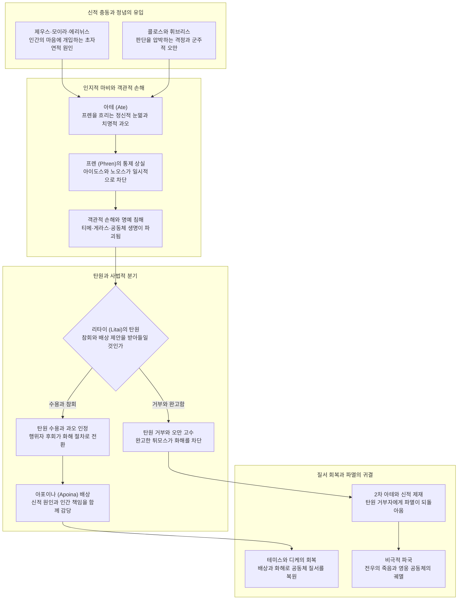

# 아테 (Ate)

**[[greek-reading-guide|읽는 법]]**: 아테 · **원어**: ἄτη · **학술 전사**: *átē*

## 1. 정의와 핵심 테제 (Definition & Core Thesis)

### 1.1 핵심 정의
**아테**(ἄτη, *átē*; 관용 라틴명 Ate, 서사시 고형 ἀάτη, *aátē*)는 고대 그리스 초기 서사시와 사유 체계에서 신들이 인간의 신체화된 인지 좌소인 가슴과 횡격막([[concept-phren|프렌]])에 불어넣어 정상적인 사리분별과 가치 판단력을 일시적으로 마비시키는 **초자연적 정신적 눈멂**(Mental Delusion / Infatuation, 미망), 그로 인해 저지르는 **치명적 과오**(Disastrous Misjudgment), 그리고 그 과오가 필연적으로 초래하는 **파멸적 손해와 파국**(Objective Harm / Ruin)을 포괄하는 다층적 개념입니다.

### 1.2 연구사적 4대 핵심 명제
1. **객관적 손해(Harm)의 논리적 선행성과 인지언어학적 원형 이론** ([[cairns-2012-ate-in-homeric-poems|Cairns 2012]]):
   - 크레타 고에피그라피 비문(*awata*)이 증명하듯 아테의 가장 원초적 초점 의미(Focal Meaning)는 객관적 '손해·손실(Harm/Damage)'입니다. 서사시에서 체감되는 주관적 '판단 착오(Folly)'는 사후적 소급 진단(Retrospective Diagnosis)에 의해 결과(손해)가 원인(착오)으로 환유된 대표 전형(Best Example)입니다.
2. **신적 개입과 사법적 배상 책임(Apoina)의 이중 동기화 양립** ([[williams-1993-shame-and-necessity|Williams 1993]], [[lloyd-jones-1971-justice-of-zeus|Lloyd-Jones 1971]]):
   - 아가멤논이 신들(제우스, 모이라, 에리뉘스)을 원인으로 지목한 것은 근대적 의미의 책임 회피(plea of non-responsibility)가 아닙니다. 호메로스 영웅은 신적 원인을 진술하면서도 행위 결과에 대한 물질적 배상([[concept-apoina|아포이나]]) 의무를 완벽히 짊어지는 성숙한 '행위자 후회(Agent-regret)'와 인과적 책임을 체현합니다.
3. **군주적 명예(Time) 보존과 비전형적 일탈(Aberration) 해명의 화해 수사학** ([[cairns-2012-ate-in-homeric-poems|Cairns 2012]]):
   - 아가멤논은 최고신 제우스마저 아테에 속았던 신화를 원용함으로써, 자신의 실책이 본래 인격의 사악함이 아닌 초자연적 마비로 인한 '비전형적 일탈(Aberration)'이었음을 공적으로 해명하여 군주적 위상을 지키고 연합군 화해를 달성했습니다.
4. **탄원(Litai) 거부자에 대한 제우스의 정의(Dike) 집행 및 2차 아테 신벌** ([[lloyd-jones-1971-justice-of-zeus|Lloyd-Jones 1971]]):
   - 가해자가 정당한 사법적 배상과 탄원([[concept-hikesia|리타이]])을 바칠 때 이를 거절하는 완고한 피해자는 오만한 침해자로 전도되며, 제우스는 그 거절자에게 다시 2차 아테를 내려 스스로 파멸하게 만드는 도덕적 사법 정의를 집행합니다.

### 1.3 개념적 특성과 다의적 작동 기제
아테는 고립된 정적 심리 상태가 아니라 원인에서 결과로 이어지는 동태적 3단계 연쇄를 이룹니다:
- **초자연적 원인 (Daimonic Cause)**: 제우스, 모이라, 에리뉘스, 혹은 [[concept-daimon|다이몬]] 등이 인간의 마음에 사나운 아테를 던져 넣음.
- **내적·심리적 상태 (Subjective State)**: 횡격막(Phren)의 집행 제어 능력이 마비되어 눈앞의 정념에 포획됨.
- **객관적 결과 (Objective Harm)**: 군대의 몰살, 명예의 실추, 전우의 죽음 등 되돌릴 수 없는 파멸로 귀결됨.

---

## 2. 어원과 형태론 (Etymology & Morphology)

### 2.1 인도유럽조어(PIE) 기원과 선희랍 기층어(Pre-Greek substrate) 논쟁
- **전통 인도유럽어 재구 시도와 한계**:
  - 포코르니(Pokorny, *IEW* 1103)는 아테를 인도유럽조어 어근 \`*u̯eh₁-\` 또는 \`*h₂ueh₁-\`('상처 입히다, 해치다')에 연결하려 시도했으나, 피에르 샹트렌(Chantraine, *DELG* 1–2)은 모음 접속(ἀ-ά-)과 장단 교체의 불규칙성 때문에 외부 동계어 확정을 유보했습니다.
- **베이케스(Beekes 2010)의 선희랍 기층어론**:
  - 로베르트 베이케스(*EDG* 17–18)는 명확한 인도유럽어 동계어의 부재, 서사시 특유의 변칙적 모음 접속(ἀ-ά-), 그리고 파생어 ἀάατος(*aáatos*)의 3중 모음 접속을 근거로 아테를 에게해 선희랍 기층어(Pre-Greek substrate) 차용어로 규정했습니다.
- **크레타 고에피그라피(IC iv.72) 비문과 헤쉬키오스 사전의 증거**:
  - 고대 크레타 고르틴 법전 비문(IC iv.72)에는 디감마(ϝ)가 보존된 형태인 **와타**(ϝάτα, *wáta*) 및 **아와타**(ἀϝάτα, *awáta*)가 명시적으로 출현합니다 ([[cairns-2012-ate-in-homeric-poems|Cairns 2012]], Sommerstein 2013).
  - 이 비문에서 *awata*는 정신적 착란이 아니라 엄격하게 객관적 '신체적·물질적 손해(Harm/Damage)'이자 법정이 부과하는 '사법적 배상금/벌금(Mulct)'을 뜻합니다.
  - 헤쉬키오스 사전 역시 \`ἀϝασκεῖν\`과 \`ἀϝάσσειν\`을 \`βλάπτειν\`(*bláptein*, '해치다, 손해를 입히다')으로, \`ἀάτη\`를 \`βλάβη\`(*blábē*, '손해, 손실')로 정의합니다.
- **아타스탈리아(Atasthalia)와의 고대 민간어원설**:
  - 고대 문헌학자들은 아타스탈리아를 "아테 속에서 만발함(τὸ τῇ ἄτῃ θάλλειν, *tò têi átē̂i thállein*)"으로 풀이했습니다. 이는 비록 현대 비교언어학적으로는 민간어원(Folk Etymology)에 불과하지만, 고대 그리스인들의 심상 속에서 아테와 아타스탈리아가 얼마나 긴밀히 상호작용하고 있었는지를 증명합니다.

### 2.2 호메로스 방언 형태론 및 파생 어휘군 (4열 분리 표준 표)

| 그리스어 실제형 | 학술 전사 | 품사 및 형태론 | 의미 및 문헌학적 맥락 |
|:---|:---|:---|:---|
| **ἄτη** | *átē* | 여성 명사, 주격 단수 | 정신적 눈멂, 미망, 치명적 과오, 파멸적 손해, 신격화된 재앙. |
| **ἀάτη** | *aátē* | 여성 명사, 주격 단수 (서사시 비축약) | 모음 접속이 보존된 호메로스 고형. 인지적 마비 및 치명적 파멸. |
| **ϝάτα / ἀϝάτα** | *wáta / awáta* | 여성 명사, 주격 단수 (크레타 고에피그라피) | 객관적 '물적 손해(Harm)', '사법적 배상금/과태료' (IC iv.72 고르틴 법전). |
| **ἀάω** | *aáō* | 동사, 현재 능동태 1인칭 단수 | 정신을 흐리게 하다, 눈멀게 하다, 손해를 입히다 (기저 동사). |
| **ἀᾶται** | *aâtai* | 동사, 현재 중간·수동태 3인칭 단수 | "(아테가) 사람들을 눈멀게 한다 / 해친다" (_Il._ 19.91). |
| **ἀασάμην** | *aasámēn* | 동사, 아오리스트 중간태 1인칭 단수 | "내가 미망에 빠졌다 / 내가 큰 손해를 입혔다" (_Il._ 9.116, 19.137). |
| **ἀάσατο** | *aásato* | 동사, 아오리스트 중간태 3인칭 단수 | "(제우스마저도) 미망에 빠졌다" (_Il._ 19.95, 9.537). |
| **ἆσε** | *âse* | 동사, 아오리스트 능동태 3인칭 단수 (축약형) | "(신/술이) 그를 눈멀게 했다 / 해쳤다" (_Od._ 11.61, 21.295). |
| **ἄασεν** | *áasen* | 동사, 아오리스트 능동태 3인칭 단수 (비축약) | "(신이) 눈멀게 했다" 서사시 비축약 음운 보존형 (_Il._ 19.95 판본). |
| **ἀάσθη** | *aásthē* | 동사, 아오리스트 수동태 3인칭 단수 | "(파트로클로스가) 크나큰 미망에 빠졌다" (_Il._ 16.685). |
| **ἀασθείς** | *aastheís* | 수동태 아오리스트 분사, 남성 주격 단수 | "마음에 미망이 들어 / 눈이 멀어" (_Od._ 21.301 켄타우로스 에우리티온). |
| **ἀάατος** | *aáatos* | 형용사, 남성/여성 주격 단수 | 3중 모음 접속 고형. "침해할 수 없는(inviolable)" 또는 "파멸적인" (_Il._ 14.271). |
| **ἀτηρός** | *atērós* | 형용사, 남성 주격 단수 | 파멸을 부르는, 미망에 사로잡힌, 재앙의 (_Il._ 6.356, Aesch. *Pers.* 1007). |
| **ἀτάσθαλος** | *atásthalos* | 형용사, 남성 주격 단수 | 방자한, 무모한, 선을 넘는 (민간 어원에서 ἄτη + θάλλειν으로 결합된 어휘). |

---

## 3. 호메로스 서사시 본문 용례와 맥락 (Homeric Attestation & Contexts)

### 3.1 양대 서사시 출현 빈도 및 장르적 진폭
- 『**일리아스**』 **(약 37회 집중 출현, 전체의 약 71%)**:
  - 아테는 서사시 전체의 갈등 발단(1권), 화해 제안(9권), 파국 전개(16권), 비극적 절정(22권), 공식 화해(19권)를 추동하는 핵심 동력입니다.
  - 전장과 정치 집회에서 최고 영웅들의 인지 기관(프렌)에 신들이 벼락처럼 내리는 초자연적 마비이자, 파멸 앞에서의 인과적 행위자성과 물질적 배상([[concept-apoina|아포이나]])으로 연결됩니다.
- 『**오뒷세이아**』 **(약 15회 출현, 전체의 약 29%)**:
  - 서사시 서두(_Od._ 1.32–34)에서 제우스가 인간의 불행을 신 탓으로 돌리는 관습을 꾸짖으며, 인간 자신의 "방자한 죄과(*atasthaliai*)"로 인해 자초하는 고통을 선언합니다.
  - 아테의 용례는 신화적 운명극에서 취기(술, *oînos*)로 인한 감각 마비(켄타우로스 에우리티온, _Od._ 21.295–304)나 일상적 실족사(엘페노르, _Od._ 11.61)로 세속화·일상화됩니다.

### 3.2 핵심 정형구(Formulaic Diction) 6대 체계
1. **ἔμβαλον φρεσὶν ἄγριον ἄτην** (*émbalon phresìn ágrion átēn*, _Il._ 19.88):
   - "마음에 사나운 아테를 던져 넣었다". 신들이 인간의 횡격막(프렌)에 야생적 미망을 강제로 투척하여 인지적 마비를 일으키는 전형구.
2. **φρένας ἐξέλε토 Ζεύς** (*phrénas ekséleto Zeús*, _Il._ 6.234, 19.137):
   - "제우스가 분별력을 빼앗아 갔다". 행위자의 정상적인 가치 판단 능력이 신적 개입에 의해 탈취되었음을 천명하는 행말 정형구.
3. **ἀάσα토 δὲ μέγα θυμῷ** (*aásato dè méga thumō̂i*, _Il._ 9.537):
   - "마음속으로 크나큰 미망에 빠졌다". 영웅이 종교적 의무나 규범을 망각하고 내적 격정(튀모스)에 눈이 멀었음을 서술.
4. **μέγ’ ἀάσθη** (*még’ aásthē*, _Il._ 16.685):
   - "크나큰 미망에 빠졌다". 파트로클로스의 성벽 돌진 순간, 서사 화자가 개입하여 영웅의 비극적 파국을 확인하는 탄식적 진단.
5. **βλάπτουσ’ ἀνθρώπους** (*bláptous’ anthrṓpous*, _Il._ 9.507, 19.91):
   - "사람들을 해치며 / 손해를 입히며". 아테가 관념적 착각이 아니라 객관적 '손해·피해(Harm)'를 입히는 파괴적 실재임을 입증하는 분사구.
6. **φρεσὶν ᾗσιν ἀασθείς** (*phresìn hē̂isin aastheís*, _Od._ 21.301):
   - "자신의 마음에 미망이 들어". 외부적 촉매(술, 격정)에 의해 이성적 통제력을 상실하고 파멸로 치닫는 상태를 압축 묘사.

---

## 4. 개념 상호작용과 가치망 (Value Network & Interactions)

아테는 고립된 개념이 아니며, 신적 주권, 인지 좌소의 마비, 사법적 배상, 그리고 탄원의 수용 여부에 따라 공동체의 회복과 멸망이 갈리는 거대한 가치망의 분기점입니다.

### 4.1 대립쌍 역학 (Polarity Dynamics)
- **노오스([[concept-noos|노오스]]) / 프렌([[concept-phren|프렌]]) vs 아테**: 사물의 장기적 본질을 꿰뚫어 보는 지성과 이를 신체적으로 조율하는 숙고 능력이 아테에 의해 전면 마비됩니다.
- **아이도스([[concept-aidos|아이도스]]) vs 아테**: 타인의 시선과 신적 규범 앞에서 주춤거리는 거룩한 부끄러움(Aidos)이 아테의 정념 탈취로 인해 일시적으로 무력화됩니다.
- **아타스탈리아([[concept-atasthalia|아타스탈리아]])와의 부분적 중첩**: 핀켈버그(1995)의 이분법과 달리, 아테(판단 착오와 파멸적 재앙)와 아타스탈리아(도덕적 비난 가능성과 오만)는 '재앙을 낳은 유책한 과오'라는 공통 지대에서 중첩됩니다 (_Il._ 22.104 헥토르의 고백).

---

## 5. 주요 서사 에피소드 정밀 주해 (Epic Episodes & Exegesis)

### 5.1 아가멤논의 사과와 제우스의 아테 추방 신화, 아포이나 제안 (_Il._ 19.86–94, 134–138)

- **선정 장면**: 아가멤논이 아킬레우스와의 공식 화해 집회에서 자신의 지난 과오를 해명하며, 신적 원인을 진술함과 동시에 막대한 배상을 약속하는 대목.
- **본문 강독 및 해제**:
  - **번역**: "원인은 내가 아니오, 오히려 제우스와 모이라와 어둠 속을 걷는 에리뉘스요, 그들이 민회에서 내 마음에 사나운 아테를 던져 넣었던 것이오, 내가 친히 아킬레우스의 명예의 선물을 빼앗았던 바로 그날에 말이오. 하지만 내가 어찌할 수 있었겠소? 신이 만사를 완수하는 것을, 제우스의 존귀한 따님 아테, 그녀는 모든 이를 눈멀게 하니, 파멸을 부르는 자요; 그녀는 발이 부드러워 땅 위를 밟지 않고, 사람들의 머리 위를 밟고 다니며 사람들을 해치고; 한 사람을 옭아매는도다."
  - **원문**: ἐγὼ δ’ οὐκ αἴτιός εἰμι, / ἀλλὰ Ζεὺς καὶ Μοῖρα καὶ ἠεροφοῖτις Ἐρινύς, / οἵ τέ μοι εἰν ἀγορῇ φρεσὶν ἔμβαλον ἄγριον ἄτην, / ἤματι τῷ ὅτ’ Ἀχιλλῆος γέρας αὐτὸς ἀπηύρων. / ἀλλὰ τί κεν ῥέξαιμι; θεὸς διὰ πάντα τελευτᾷ, / πρέσβα Διὸς θυγάτηρ Ἄτη, ἣ πάντας ἀᾶται, / οὐλομένη· τῇ μέν θ’ ἁπαλοὶ πόδες· οὐ γὰρ ἐπ’ οὔδει / πίλναται, ἀλλ’ ἄρα ἥ γε κατ’ ἀνδρῶν κράατα βαίνει / βλάπτουσ’ ἀνθρώπους· κατὰ δ’ οὖν ἕτερόν γε πέδησεν.
  - **학술 전사**: *egṑ d’ ouk aítiós eimi, / allà Zeùs kaì Moîra kaì ēerophoîtis Erinús, / hoí té moi ein agorē̂i phresìn émbalon ágrion átēn, / ḗmati tō̂i hót’ Akhillē̂os géras autòs apēúrōn. / allà tí ken rhéksaimi? theòs dià pánta teleutā̂i, / présba Diòs thugátēr Átē, hḕ pántas aā̂tai, / ouloménē; tē̂i mén th’ hapaloì pódes; ou gàr ep’ oúdei / pílnatai, all’ ára hḗ ge kat’ andrō̂n kráata baínei / bláptous’ anthrṓpous; katà d’ oûn héterón ge pédēsen.* (_Il._ 19.86–94)

이어지는 제우스의 아테 추방 신화(_Il._ 19.95–133) 이후 결론 발화:
- **본문 강독 및 해제**:
  - **번역**: "나 역시 그러했소, 거대한 투구 번쩍이는 헥토르가 선미 쪽에서 아르고스인들을 살육하고 있을 때, 나는 내가 처음에 눈멀었던 아테를 잊을 수 없었소. 하지만 내가 미망에 빠져 제우스께서 내 분별력을 빼앗으셨으니, 나는 다시 화해하기를 바라며 헤아릴 수 없는 배상을 하겠소."
  - **원문**: ὣς καὶ ἐγών, ὅτε δ’ αὖτε μέγας κορυθαίολος Ἕκτωρ / Ἀργείους ὀλέκεσκεν ἐπὶ πρύμνῃσι νέεσσιν, / οὐ δυνάμην λελαθέσθ’ Ἄτης, ᾗ πρῶτον ἀάσθην. / ἀλλ’ ἐπεὶ ἀασάμην καί μευ φρένας ἐξέλε토 Ζεύς, / ἂψ ἐθέλω ἀρέσαι, δόμεναí τ’ ἀπερείσι’ ἄποινα·
  - **학술 전사**: *hṑs kaì egṓn, hóte d’ aûte mégas koruthaíolos Héktōr / Argeíous olékesken epì prúmnēisi néessin, / ou dunámēn lelathésth’ Átēs, hē̂i prō̂ton aásthēn. / all’ epeì aasámēn kaí meu phrénas ekséleto Zeús, / àps ethélō arésai, dómenaí t’ apereísi’ ápoina;* (_Il._ 19.134–138)
- **문헌학적·서사학적 함의**:
  - **이중 동기화와 행위자 후회**: 아가멤논은 신적 원인을 진술하면서도 동사 *aasámēn*을 능동적으로 인정하고 헤아릴 수 없는 배상금(*ápoina*)을 지불함으로써 사법적 책임을 완수합니다 ([[williams-1993-shame-and-necessity|Williams 1993]]).
  - **화해 수사학과 비전형적 일탈**: 제우스마저 헤라에게 속았던 아테 신화를 원용함으로써, 자신의 행동이 본래 인격이 아닌 일시적 마비였음을 설명하여 군주적 위상을 지키는 고도의 공적 화해 수사학을 펼칩니다 ([[cairns-2012-ate-in-homeric-poems|Cairns 2012]]).

---

### 5.2 포이닉스의 리타이-아테 우화와 2차 아테의 사법적 신벌 (_Il._ 9.502–514)

- **선정 장면**: 9권 사절단에서 노장 포이닉스가 완고한 아킬레우스에게 화해를 간청하며 설파한 리타이와 아테의 우화.
- **본문 강독 및 해제**:
  - **번역**: "참으로 기도(리타이)들 또한 위대한 제우스의 따님들이니, 절름발이에 주름투성이요 곁눈질하는 눈을 지녔으며, 그들은 아테의 뒤를 쫓아 돌보느라 애쓰도다. 반면 아테는 억세고 발이 빨라, 모든 기도들을 훨씬 앞질러 달리며, 온 땅 위에서 사람들을 해치고; 기도들은 그 뒤에서 상처를 고치도다. 누구든 가까이 다가오는 제우스의 따님들을 공경하면, 그들은 그에게 큰 도움을 주고 기도하는 자의 청을 들어주나; 누구든 그들을 물리치고 완강하게 거절하면, 기도들은 크로노스의 아들 제우스께 나아가 간청하여 그에게 아테가 달라붙어, 그가 해를 입고 죗값을 치르게 하도다. 그러니 아킬레우스여, 그대 또한 제우스의 따님들에게 명예를 돌리시오, 그 명예는 다른 고결한 이들의 마음조차 굽히는 것이오."
  - **원문**: καὶ γάρ τε Λιταί εἰσι Διὸς κοῦραι μεγάλοιο / χωλαί τε ῥυσαί τε παραβλῶπές τ’ ὀφθαλμώ, / αἵ ῥά τε καὶ μετόπισθ’ Ἄτης ἀλέγουσι κιοῦσαι. / ἡ δ’ Ἄτη σθεναρή τε καὶ ἀρτίπος, οὕνεκα πάσας / πολλὸν ὑπεκπροθέει, φθάνει δέ τε πᾶσαν ἐπ’ αἶαν / βλάπτουσ’ ἀνθρώπους· αἳ δ’ ἐξακέονται ὀπίσσω. / ὃς μέν τ’ αἰδέσεται κούρας Διὸς ἆσσον ἰούσας, / τὸν δὲ μέγ’ ὤνησαν καί τ’ ἔκλυον εὐξαμένοιο· / ὃς δέ κ’ ἀνήνηται καί τε στερεῶς ἀποείπῃ, / λίσσονται δ’ ἄρα ταί γε Δία Κρονίωνα κιοῦσαι / τῷ Ἄτην ἅμ’ ἕπεσθαι, ἵνα βλαφθεὶς ἀποτίσῃ. / ἀλλ’ Ἀχιλεῦ πόρε καὶ σὺ Διὸς κούρῃσιν ἕπεσθαι / τιμήν, ἥ τ’ ἄλλων περ ἐπιγνάμπτει νόον ἐσθλῶν.
  - **학술 전사**: *kaì gár te Litaí eisi Diòs koûrai megáloio / khōlaí te rhusaí te parablō̂pés t’ ophthalmṓ, / haí rhá te kaì metópisth’ Átēs alégousi kioûsai. / hē d’ Átē sthenarḗ te kaì artípos, hoúneka pásas / pollòn hupekprothéei, phthánei dé te pâsan ep’ aîan / bláptous’ anthrṓpous; haì d’ eksakéontai opíssō. / hòs mén t’ aidésetai koúras Diòs âsson ioúsas, / tòn dè még’ ṓnēsan kaí t’ ékluon euksaménoio; / hòs dé k’ anḗnētai kaí te stereō̂s apoeípēi, / líssontai d’ ára taí ge Día Kroníōna kioûsai / tō̂i Átēn hám’ hépesthai, hína blaphtheìs apotísēi. / all’ Akhileû póre kaì sù Diòs koúrēisin hépesthai / timḗn, hḗ t’ állōn per epignámptei nóon esthlō̂n.* (_Il._ 9.502–514)
- **문헌학적·서사학적 함의**:
  - **조형적 속도 대비**: 죄와 파멸의 신속성(artipos) 대 참회와 탄원의 지체된 고통(khōlai, rhysai)을 대비한 그리스적 조형 상상력의 극치 ([[kim-han-2019-gods-zeus-moira-and-god|김한 2019]]).
  - **2차 아테의 신벌과 아킬레우스의 비극**: 관습적 화해 절차를 짓밟고 리타이를 거부한 완고한 자에게 닥치는 2차 아테는 제우스의 정의(Dike)의 집행이며, 결국 파트로클로스의 전사라는 참혹한 대가로 현실화됩니다 ([[lloyd-jones-1971-justice-of-zeus|Lloyd-Jones 1971]]).

---

### 5.3 헥토르의 성문 밖 실존적 독백과 아타스탈리아이 자책 (_Il._ 22.99–107, 연계: 18.311–312)

- **선정 장면**: 트로이아 성벽 밖에 홀로 남아 아킬레우스를 기다리는 헥토르가 지난밤 폴리다마스의 철수 권고를 묵살했던 오판을 참회하는 실존적 독백.
- **본문 강독 및 해제**:
  - **번역**: "아, 가련하도다! 내가 성문과 성벽 안으로 들어간다면, 폴리다마스가 내게 맨 먼저 치욕을 안겨줄 것이니, 그는 신성한 아킬레우스가 떨쳐 일어섰던 저 파멸의 밤에 트로이아인들을 도시로 이끌라고 내게 권고했었지. 하지만 나는 따르지 않았으니; 참으로 그것이 훨씬 유익했을 텐데! 이제 내 자신의 아타스탈리아이(방자한 과오)로 백성을 멸망시켰으니, 나는 트로이아의 사나이들과 옷자락 길게 끄는 여인들을 마주하기 부끄럽구나, 혹여 나보다 못한 다른 자가 이렇게 말할까 두렵구나: '헥토르는 자기 힘만 믿다가 백성을 멸망시켰도다.'라고."
  - **원문**: ὤ μοι ἐγών, εἰ μέν κε πύλας καὶ τείχεα δύω, / Πουλυδάμας μοι πρῶτος ἐλεγχείην ἀναθήσει, / ὅς μ’ ἐκέλευε Τρωσὶ ποτὶ πτόλιν ἡγήσασθαι / νύχθ’ ὕπο τήνδ’ ὀλοήν, ὅτε τ’ ὤρετο δῖος Ἀχιλλεύς. / ἀλλ’ ἐγὼ οὐ πιθόμην· ἦ τ’ ἂν πολὺ κέρδιον ἦεν. / νῦν δ’ ἐπεὶ ὤλεσα λαὸν ἀτασθαλίῃσιν ἐμῇσιν, / αἰδέομαι Τρῶας καὶ Τρῳάδας ἑλκεσιπέπλους, / μή ποτέ τις εἴπῃσι κακώτερος ἄλλος ἐμεῖο· / Ἕκτωρ ἧφι βίηφι πιθήσας ὤλεσε λαόν.
  - **학술 전사**: *ṓ moi egṓn, ei mén ke púlas kaì teíkhea dúō, / Pouludámas moi prō̂tos elegkheíēn anathḗsei, / hós m’ ekéleue Trōsì potì ptólin hēgḗsasthai / núkhth’ húpo tḗnd’ oloḗn, hóte t’ ṓreto dîos Akhilleús. / all’ egṑ ou pithómēn; ē̂ t’ àn polù kérdion ē̂en. / nûn d’ epeì ṓlesa laòn atasthalíēisin emē̂isin, / aidéomai Trō̂as kaì Trōiádas helkesipéplous, / mḗ poté tis eípēisi kakṓteros állos emeîo; / Héktōr hē̂phi bíēphi pithḗsas ṓlese laón.* (_Il._ 22.99–107)

연계 구절: 18권 아테나 여신에 의한 트로이아 민회의 인지 박탈:
- **본문 강독 및 해제**:
  - **번역**: "어리석은 자들이여, 팔라스 아테나가 참으로 그들의 분별력을 빼앗았던 것이니; 그들은 악한 계책을 내는 헥토르에게 찬동하였도다."
  - **원문**: νήπιοι, ἐκ γὰρ σφέων φρένας εἵλετο Παλλὰς Ἀθήνη· / Ἕκτορι μὲν γὰρ ἐπῄνησαν κακὰ μητιόωντι
  - **학술 전사**: *nḗpioi, ek gàr sphéōn phrénas heíleto Pallàs Athḗnē; / Héktori mèn gàr epḗinēsan kakà mētióōnti* (_Il._ 18.311–312)
- **문헌학적·서사학적 함의**:
  - **과장된 도덕적 자책(Hyperbolic Self-reproach)**: 헥토르는 악인이 아님에도 백성의 궤멸 앞에서 자신을 최고 수위의 도덕적 비난어인 *atasthaliai*로 단죄합니다 ([[cairns-2012-ate-in-homeric-poems|Cairns 2012]]).
  - **아이도스의 덫과 실존적 결단**: 헥토르는 부끄러움(Aidos) 때문에 성벽 안으로 숨지 못하고, 자신의 오판을 목숨으로 속죄하기 위해 아킬레우스의 창날 앞에 섭니다.

---

### 5.4 파트로클로스의 성벽 공격 오판과 제우스의 뜻 (_Il._ 16.684–691)

- **선정 장면**: 함선 방어에 만족하지 않고 트로이아 성벽으로 쇄도하는 파트로클로스의 오판과 서사 화자의 비극적 논평.
- **본문 강독 및 해제**:
  - **번역**: "파트로클로스는 말들과 아우토메돈에게 명령을 내리고 트로이아인들과 뤼키아인들을 추격하였으니, 크나큰 미망에 빠졌도다, 어리석은 자여! 만일 그가 펠레우스의 아들의 말을 지켰더라면, 검은 죽음의 사악한 파멸을 진정 피했을 텐데! 하지만 언제나 제우스의 지성이 인간들의 생각보다 강하니, 그분은 용맹한 전사조차 두려움에 떨게 하고 승리를 빼앗으시니, 손쉽게 그리하시며, 때로는 친히 싸우도록 부추기시니, 그때도 파트로클로스의 가슴속에 튀모스를 불어넣으신 분이 바로 제우스이셨도다."
  - **원문**: Πάτροκλος δ’ ἵπποισι καὶ Αὐτομέδοντι κελεύσας / Τρῶας καὶ Λυκίους μετεκίαθε, καὶ μέγ’ ἀάσθη / νήπιος· εἰ δὲ ἔπος Πηληϊάδαο φύλαξεν, / ἦ τ’ ἂν ὑπέκφυγε κῆρα κακὴν μέλανος θανάτοιο. / ἀλλ’ αἰεί τε Διὸς κρείσσων νόος ἠέ περ ἀνδρῶν, / ὅς τε καὶ ἄλκιμον ἄνδρα φοβεῖ καὶ ἀφείλετο νίκην / ῥηϊδίως, ὁτὲ δ’ αὐτὸς ἐποτρύνει πολεμίζειν, / ὅς οἱ καὶ τότε θυμὸν ἐνὶ στήθεσσιν ἀνῆκεν.
  - **학술 전사**: *Pátroklos d’ híppoisi kaì Automédonti keleúsas / Trō̂as kaì Lukíous metekíathe, kaì még’ aásthē / nḗpios; ei dè épos Pēlēïádao phúlaksen, / ē̂ t’ àn hupékphuge kêra kakḕn mélanos thanátoio. / all’ aieí te Diòs kreíssōn nóos ēé per andrō̂n, / hós te kaì álkimon ándra phobeî kaì apheíleto níkēn / rhēïdíōs, hotè d’ autòs epotrúnei polemízein, / hós hoi kaì tóte thumòn enì stḗthessin anē̂ken.* (_Il._ 16.684–691)
- **문헌학적·서사학적 함의**:
  - **화자의 개입과 *még’ aásthē***: 영웅이 한계를 넘어설 때 시인은 그가 미망에 빠졌음을 공언합니다.
  - **제우스의 뜻의 은폐성**: 제우스는 아킬레우스를 복귀시키려는 거대한 계획(*Dios boule*)을 완수하기 위해 파트로클로스의 가슴에 격정(튀모스)을 불어넣어 아테의 희생양으로 삼았습니다 ([[cho-daeho-2007-gods-in-iliad|조대호 2007]]).

---

### 5.5 안티노오스와 켄타우로스 에우리티온의 취중 아테 및 오뒷세이아적 전회 (_Od._ 21.295–304, 11.61, 1.32–34)

- **선정 장면**: 구혼자 안티노오스가 활을 잡으려는 변장한 오디세우스를 비난하며 켄타우로스 에우리티온의 취중 난동 일화를 거론하는 장면.
- **본문 강독 및 해제**:
  - **번역**: "포도주는 켄타우로스마저, 이름 높은 에우리티온마저 눈멀게 하였으니, 용맹한 페이리토오스의 저택에서 말이오, 그가 라피타이족에게 갔을 때; 그가 포도주로 마음에 미망이 들자, 미쳐 날뛰며 페이리토오스의 집 안에서 흉악한 짓을 저질렀소; 영웅들은 분노에 사로잡혀, 문간을 지나 문밖으로 그를 끌고 내달렸으며, 무자비한 청동으로 귀와 코를 베어냈소; 그리하여 그는 제 마음에 미망이 든 채, 분별없는 마음으로 제 아테를 짊어지고 떠나갔소. 그로부터 켄타우로스족과 인간들 사이에 분쟁이 일어났으나, 그는 술에 취해 스스로에게 맨 먼저 재앙을 만들어낸 것이었소."
  - **원문**: οἶνος καὶ Κένταυρον, ἀγακλυτὸν Εὐρυτίωνα, / ἄασ’ ἐνὶ μεγάρῳ μεγαθύμου Πειριθόοιο, / ἐς Λαπίθας ἐλθόνθ’· ὁ δ’ ἐπεὶ φρένας ἄασεν οἴνῳ, / μαινόμενος κάκ’ ἔρεξε δόμον κάτα Πειριθόοιο· / ἥρωας δ’ ἄχος εἷλε, διὲκ προθύρου δὲ θύραζε / ἕλκον ἀναΐξαντες, ἀπ’ οὔατα νηλέϊ χαλκῷ / ῥῖνάς τ’ ἀμήσαντες· ὁ δὲ φρεσὶν ᾗσιν ἀασθεὶς / ἤϊεν ἣν ἄτην ὀχέων ἀεσίφρονι θυμῷ. / ἐξ οὗ Κενταύροισι καὶ ἀνδράσι νεῖκος ἐτύχθη, / οἷ δ’ αὐτῷ πρώτῳ κακὸν εὕρετο οἰνοβαρείων.
  - **학술 전사**: *oînos kaì Kéntauron, agaklutòn Eurutíōna, / áas’ enì megárōi megathúmou Peirithóoio, / es Lapíthas elthónth’; ho d’ epeì phrénas áasen oínōi, / mainómenos kák’ érekse dómon káta Peirithóoio; / hḗrōas d’ ákhos heîle, dièk prothúrou dè thúraze / hélkon anaḯksantes, ap’ oúata nēléï khalkō̂i / rhînás t’ amḗsantes; ho dè phresìn hē̂isin aastheìs / ḗïen hḕn átēn okhéōn aesíphroni thumō̂i. / eks hoû Kentaúroisi kaì andrási neîkos etúkhthē, / hoî d’ autō̂i prṓtōi kakòn heúreto oinobareíōn.* (_Od._ 21.295–304)

연계 구절 1: 엘페노르의 증언 (_Od._ 11.61):
- **본문 강독 및 해제**:
  - **번역**: "다이몬의 나쁜 운명과 헤아릴 수 없는 포도주가 나를 눈멀게 하였습니다."
  - **원문**: ἆσέ με δαίμονος αἶσα κακὴ καὶ ἀθέσφατος οἶνος.
  - **학술 전사**: *âsé me daímonos aîsa kakḕ kaì athésphatos oînos.* (_Od._ 11.61)

연계 구절 2: 제우스의 아타스탈리아 선언 (_Od._ 1.32–34):
- **본문 강독 및 해제**:
  - **번역**: "아 슬프도다, 인간들이 얼마나 신들을 탓하는가! 그들은 우리에게서 재앙이 온다고 말하지만, 실상은 그들 스스로 자신들의 방자한 죄과(아타스탈리아이)로 정해진 몫 이상의 고통을 겪는도다."
  - **원문**: ὢ πόποι, οἷον δή νυ θεοὺς βροτοὶ αἰτιόωνται· / ἐξ ἡμέων γάρ φασι κάκ’ ἔμμεναι, οἳ δὲ καὶ αὐτοὶ / σφῇσιν ἀτασθαλίῃσιν ὑπὲρ μόρον ἄλγε’ ἔχουσιν,
  - **학술 전사**: *ṑ pópoi, hoîon dḗ nu theoùs brotoì aitíōōntai; / eks hēméōn gár phasi kák’ émmenai, hoì dè kaì autoì / sphē̂isin atasthalíēisin hupèr móron álge’ ékhousin,* (_Od._ 1.32–34)
- **문헌학적·서사학적 함의**:
  - **신체적 매개(술)와 세속화**: 오뒷세이아에서 아테는 제우스의 벼락 대신 포도주(*oînos*)나 다이몬의 불운에 의한 일상적 실족으로 변모합니다.
  - **구혼자들의 서사적 아이러니**: 안티노오스는 남을 비난하려 에우리티온을 끌어들였으나, 정작 자신들이 아테에 눈멀어 척살당합니다.
  - **신학적 전회**: 제우스의 선언은 모든 비극의 책임을 인간의 자발적 범죄(**아타스탈리아**)로 돌리는 도덕화된 우주 질서를 확립합니다 ([[kearns-2006-gods-in-homeric-epics|Kearns 2006]]).

---

## 6. 사회역사·제도적 맥락 (Socio-Historical & Institutional Context)

### 6.1 크레타 고에피그라피(*awata*)와 초기 사법 체계의 결과책임
- 고대 크레타 법률 비문(IC iv.72)에 나타난 *wata* / *awata*는 내면적 고의나 과실을 묻기 전에, 발생한 객관적 '손해(Harm)'에 대해 사법적 배상(Strict Liability)을 부과하는 초기 불법행위법(Tort)의 실재를 입증합니다 (Sommerstein 2013).

### 6.2 혈복수(Blood-feud)와 피의 배상금(Poinē, Apoina)
- **아이아스의 연설 (_Il._ 9.632–636)**:
  - 인간 사회는 친형제나 자식을 죽인 살인자로부터도 피의 배상금(**포이네**, *poinē*)을 수령함으로써 복수를 거두고 가해자의 공동체 체류권을 보장합니다. 사법적 배상은 튀모스(Thymos)의 폭주를 잠재우는 사회적 안전판입니다.
- **아킬레우스 방패의 아고라 재판 (_Il._ 18.497–508)**:
  - 살인자가 배상금 전액 지불을 서약하고(*eúkheto*), 유족은 수령을 거부하고 피의 복수를 고집하는(*anaíneto*) 고대 형사 사법의 격돌 현장입니다 ([[benveniste-1969-vocabulaire-institutions-2|Benveniste 1969]]).

### 6.3 아가멤논의 아테 변명: 귀족적 화해 수사학(Reconciliation Rhetoric)
- 전군이 모인 민회에서 최고 사령관이 자신의 무능을 탓하면 군주적 명예([[concept-time|티메]])가 무너져 연합군이 와해됩니다. 아테의 불가항력성을 원용하여 "평소 인격이 아닌 초자연적 마비(Aberration)"로 규정함으로써, 군주 위상을 지키는 동시에 아킬레우스에게 막대한 배상금([[concept-apoina|아포이나]])을 안겨주어 연합군 화해를 비준한 고도의 정치사법 수사학이었습니다 ([[cairns-2012-ate-in-homeric-poems|Cairns 2012]]).

### 6.4 점술 계약(Divination Contract)과 자문 기구(Boulē)의 제도적 파탄
- 엘리자베스 민친([[minchin-2019-homeric-religion|Minchin 2019]])이 규명한 '점술 계약'(신 징조 - 예언자 해독 - 군주 수용)을 헥토르는 "단 하나의 길조는 조국을 위해 싸우는 것뿐"이라며 일축했습니다 (_Il._ 12.243). 이는 영웅적 애국심이 아니라 군주정 의사결정 시스템을 파괴한 아테였습니다.
- 18권에서 참모 폴리다마스의 야간 철수 권고(Boulē)를 기각하고 평원 야영을 고집한 헥토르의 독단과 민회의 맹목적 환호는 통치 시스템 전체의 제도적 파탄을 폭로합니다.

---

## 7. 물질문화와 신체성 (Material Culture & Embodiment)

### 7.1 신체화된 인지 구조: 프렌(Phren), 튀모스(Thumos), 노오스(Noos)
- 호메로스의 마음은 흉강과 횡격막의 물리적 감각에 기초합니다. **프렌**(φρήν)은 감정 충동을 저울질하고 반추하는 인지적 조율판이며, **튀모스**(θυμός)는 행동을 추동하는 정서적 에너지이고, **노오스**(νόος)는 실재의 본질을 꿰뚫어 보는 지적 시각입니다.

### 7.2 아테의 물리적 타격과 인지적 터널 시야
- "제우스가 분별력을 빼앗았다(*phrénas ekséleto*)"는 표현은 신체화된 중앙 제어판(프렌)의 기능 부전을 뜻합니다. 도덕적 제동기인 **아이도스**(Aidôs)가 축출되고, 튀모스가 폭주하여 눈앞의 즉각적 자극에만 매몰되는 '인지적 터널 시야(Cognitive Tunnel Vision)'가 발생합니다.

### 7.3 신체성과 운동 양태: 머리 짓밟기와 절름발이 리타이
- **부드러운 발(*hapaloì pódes*)과 머리 짓밟기(*kat' andrō̂n kráata baínei*)**: 아테는 대지에 발을 딛지 않고 인간의 정수리를 밟고 다닙니다 (_Il._ 19.92–93). 이는 감각되지 않는 은밀한 침투와 최고 인지 기관의 수직적 포획을 상징합니다.
- **리타이의 절름발이 신체**: 죄와 파멸(아테)의 신속성에 대비되는 참회와 배상(리타이)의 지체된 신체성을 형상화합니다.

---

## 8. 종교인류학 및 제의적 실천 (Religious Anthropology & Rituals)

### 8.1 계보학적 이원성: 주권의 내부 균열 대 우주적 카오스
- **일리아스 19권**: '제우스의 맏딸(*Presba Diòs thugátēr*)'로서 최고 주권자의 권력 중심부에 도사린 자멸적 위험을 표상.
- **헤시오도스 신통기 230행**: 불화의 여신 에리스의 딸로서 무법(뒤스노미아)과 함께 폴리스 질서를 파괴하는 사회악으로 정식화.

### 8.2 제우스의 아테 추방 의례와 희생양(Pharmakos) 모티프
- 제우스가 아테의 머리채를 잡고 맹세하여 올림포스 밖으로 던지는 행위(_Il._ 19.126–131)는 주권자의 실책 오염(Miasma)을 제거하는 정화(Katharsis) 의례이자 파르마코스(희생양) 메커니즘입니다.
- 천상의 정화는 지상의 영구적 오염을 낳아, 인간계(*erga anthrōpōn*)는 아테가 상주하는 비극적 실존의 유배지가 되었습니다.

### 8.3 관객석의 신들과 신의 뜻의 은폐
- **관객석의 신들** ([[lee-taesoo-2020-gods-in-audience|이태수 2020]]): 불멸자들은 안전한 관객석에서 인간의 전쟁과 고통을 스포츠처럼 관람하며 "꺼지지 않는 웃음(*asbestos gelos*)"을 터뜨립니다.
- **신의 뜻의 은폐** ([[cho-daeho-2007-gods-in-iliad|조대호 2007]]): 제우스의 거대한 뜻(*Dios kreisson noos*)을 완성하기 위해 영웅의 눈에 아테의 안개를 씌워 파멸로 유도합니다.

---

## 9. 윤리철학과 도덕적 행위주체성 (Philosophical Ethics & Moral Agency)

### 9.1 도즈 비판과 버나드 윌리엄스의 행위자 후회(Agent-regret)
- 버나드 윌리엄스([[williams-1993-shame-and-necessity|Williams 1993]])는 칸트적 내면주의를 비판하며, 호메로스 영웅들이 신적 아테 속에서도 세상에 비극을 초래한 물리적 장본인으로서 책임을 직시하는 ‘**행위자 후회(Agent-regret)**’와 인과적 책임(Causal Responsibility)을 감당했음을 복원했습니다.

### 9.2 이중 동기화(Double Motivation)와 양립론(Compatibilism)
- 신의 개입(초자연적 원인)과 인간의 성격·격정(자율적 충동)은 상호 배타적이지 않고 완벽히 중첩됩니다 ([[lloyd-jones-1971-justice-of-zeus|Lloyd-Jones 1971]]). 인간은 신적 필연성의 한계 속에서도 스스로 결단하고 그 결과의 무게를 온몸으로 감당합니다.

### 9.3 헥토르의 과장된 도덕적 자책 (Hyperbolic Self-reproach)
- 헥토르가 통상 악인에게 쓰이는 *atasthaliai*로 자신을 단죄한 것은(_Il._ 22.104), 전술적 오판으로 백성을 몰살시킨 지휘관의 참담한 죄책감과 무한 책임을 드러내는 숭고한 도덕적 자책입니다 ([[cairns-2012-ate-in-homeric-poems|Cairns 2012]]).

---

## 10. 후대 철학 및 비극 수용사 (Post-Homeric Reception)

### 10.1 솔론(Solon Fr. 13 West)의 5단계 비극적 도덕 공식
- **번영(Olbos) → 포만(Koros) → 오만(Hybris) → 미망(Ate) → 정의/신벌(Dike/Nemesis)**:
  - 솔론은 불의한 부에 반드시 아테가 침투하여 거대한 불길로 번진다고 경고했습니다.
  - 처벌의 세습화: 당대에 벌을 피하더라도 자식과 후손들이 죗값을 치르는 '지연된 세습 응보(Transgenerational Guilt)' 체계를 수립했습니다.

### 10.2 5세기 아티카 비극에서의 아테
- **아이스킬로스**:
  - 『아가멤논』: 가문의 세습 악령(Alastor)이자 이피게네이아 희생을 강요한 최초의 재앙(*prōtopḗmōn átē*). 매혹적인 설득(Peitho)을 앞세운 자주색 융단의 덫.
  - 『페르시아인들』: "오만이 꽃을 피우면 아테의 이삭을 맺나니, 거두는 것은 눈물의 수확뿐이다" (*Pers.* 821–822).
- **소포클레스**:
  - 『안티고네』 620–625행 (아테 송가): “**신이 파멸로 이끌고자 하는 자에게는 악이 선으로 보이게 마련이다.**” 크레온의 국가 수호 확신이 도리어 신성한 법을 짓밟는 인지 전도의 역설.
  - 『아이아스』: 아테나의 환각으로 가축을 도살한 후, 수치심(Aidos)을 견디지 못하고 칼 위에 엎어져 자결하는 영웅적 파멸.

### 10.3 아리스토텔레스 『시학』의 하마르티아(Hamartia)
- 신화적 광기(Ate)에서 세속적 인지 오판(**하마르티아**, *hamartía*)으로의 내면화.
- 불완전한 지식과 상황 오인(*di' agnoian*)으로 인해 불행으로 떨어지는 고결한 주인공의 결함으로 재개념화하여 카타르시스를 설명함.

### 10.4 서구 영문학 및 현대 문화
- **셰익스피어 『줄리어스 시저』 (Act 3, Sc. 1, 270–273)**:
  - "복수를 찾아 헤매는 시저의 영혼이, 지옥에서 갓 올라와 뜨거운 아테(Ate)를 곁에 두고, 군주의 음성으로 '학살하라(Havoc)!' 외치며 전쟁의 사냥개들을 풀어놓으리라."
- **소행성 111 아테 (111 Ate)**:
  - 1870년 보불전쟁 발발 당시 천문학자 C. H. F. 페터스가 통치자들의 광기 어린 전쟁 참상을 경고하며 명명.
- **현대 심리학**: 집단사고(Groupthink)와 자멸적 충동(Thanatos)의 구조적 은유.

---

## 11. 학술 논쟁과 이설 (Academic Debates & Divergence)

> [!WARNING] 학설 대립: 아테의 4대 해석 패러다임 충돌과 환원주의 아포리아
> - **도즈(Dodds 1951)의 심리 외주화·수치 문화론**: 호메로스 인간에게 통합된 자아가 결여되어 통제 불가능한 충동을 신적 개입(Ate)으로 외부에 투사하고 면책을 도모했다고 보았으나, 아가멤논이 원인을 외재화하면서도 막대한 물질적 배상금(Apoina)을 감당하는 인과적 행위자성의 양립 구조를 설명하지 못하는 한계를 드러냅니다.
> - **애드킨스(Adkins 1960)의 비도덕적 결과주의론**: 군사적 성공(Arete)만이 절대적 기준이고 실패는 변명 없이 비난받는 결과 문화로 규정하여 아테를 비도덕적 변명으로 보았으나, 헥토르와 아킬레우스가 겪는 통렬한 내면적 자책과 도덕적 자기 비하의 실존적 파토스를 누락했습니다.
> - **로이드-존스(Lloyd-Jones 1971)의 제우스 정의 일관론**: 아테가 제우스의 정의(Dike)와 결합된 도덕적 신벌 체계라고 주장했으나, 일리아스 2권의 기만적 꿈, 4권의 고의적 맹세 파기 유도, 19권 제우스 자신의 아테 미망 등 다신교 신들의 잔혹하고 비도덕적인 변덕을 유대-기독교적 섭리관으로 과도하게 도덕화했다는 비판에 직면합니다.
> - **케언스(Cairns 2012)의 원형 의미론 및 화해 수사학**: 손해(Harm)의 객관적 선행성과 원형 이론을 정립하고 아가멤논의 사과를 군주적 위상을 지키는 화해 수사학으로 해명했으나, 정교한 인지언어학 모델이 고대인이 신적 기습 앞에서 체감한 종교적 공포와 실존적 파토스를 건조한 언어 기술로 탈색시켰다는 회의론적 비판을 남깁니다.

### 4대 패러다임 비교 매트릭스

| 패러다임 및 주요 문헌 | 핵심 이론 틀 및 접근법 | 아테(Ate)의 본질 규정 | 인간의 책임 및 행위자성 | 결정적 맹점 및 회의론적 반박 | 서사적 긴장 및 아포리아 처리 |
|:---|:---|:---|:---|:---|:---|
| **도즈** (Dodds 1951) *The Greeks and the Irrational* | 문화인류학 + 프로이트 정신분석학 | 불가해한 충동의 초자연적 투사, 정신적 눈멂 | 책임 면탈(Plea of non-responsibility), 외적 평판에 종속 | 아가멤논의 자발적 배상금(Apoina) 지불 모순 미해명; 근대적 죄책감 잣대로 고대 윤리를 미성숙으로 왜곡 | 일리아스 19권을 원시적 수치 문화의 전형적 핑계로 축소 |
| **애드킨스** (Adkins 1960) *Merit and Responsibility* | 옥스퍼드 일상언어학파 + 결과주의 | 전장 실패를 합리화하려는 사후 장치 | 순수한 결과 책임만 존재, 도덕적 책임 부재 | 헥토르와 아킬레우스의 도덕적 자책과 실존적 고뇌 설명 불가; 경쟁/협력의 기계적 2분법 오류 | 호메로스 영웅 윤리를 비도덕적 무력 경쟁으로 납작하게 평면화 |
| **로이드-존스** (Lloyd-Jones 1971) *The Justice of Zeus* | 통합 문헌학 + 제우스 사법 질서론 | 제우스의 정의(Dike) 체계 내에서 오만에 내리는 신벌 | 이중 동기화(Double Motivation): 신적 원인 속 온전한 도덕적·세속적 책임 | 제우스의 기만, 맹세 파기 조장, 제우스 자신의 아테 등 다신교의 잔혹·변덕 은폐; 기독교적 섭리관 과대 투사 | 일리아스와 오뒷세이아 간의 극단적 신학적 균열을 '표현의 변주'로 무마 |
| **케언스** (Cairns 2012) *Atē in the Homeric Poems* | 인지언어학 원형 이론 + 화용론적 수사학 | 논리적 선행: 객관적 손해(Harm) 서사적 전형: 주관적 오판(Folly) | 군주적 위상(Time)을 보존하며 배상(Apoina)을 성립시키는 화해 수사학 | 고대 그리스 종교의 원초적 공포와 파토스를 건조한 언어 행위 및 체면 수사학으로 탈신비화함 | 아테와 아타스탈리아의 부분적 중첩은 밝혔으나, 서사시 간 신학적 아포리아는 미봉 |

---

## 12. 증거 매트릭스 (Evidence Matrix)

| 주장 테제 | 원전·문헌 근거 위치 | 자료 유형 | 확실성 등급 | 적용 섹션 |
|:---|:---|:---|:---|:---|
| **1. 객관적 손해(Harm)의 논리적 선행성과 인지언어학적 초점 의미** | Cairns 2012; IC iv.72 (크레타 법률 비문 awata) | 비교문헌학·인지언어학 | 원전 명시 | 1절, 2절, 11절 |
| **2. 아테 동사 어근(ἀάω) 및 고졸기 사법적 배상금 용례** | Chantraine DELG; Beekes EDG; Sommerstein 2013 | 비교어원사전 | 강한 학술 추론 | 1절, 2절, 6절 |
| **3. 신적 주입에 의한 인지 좌소 프렌(Phren)의 일시적 마비** | _Il._ 19.86–88, 19.137; _Il._ 6.234 | 호메로스 원전 | 원전 명시 | 1절, 3절, 7절 |
| **4. 제우스마저 속인 아테의 위력과 올림포스 영구 추방 신화** | _Il._ 19.95–133 | 호메로스 원전 | 원전 명시 | 3절, 5절, 8절 |
| **5. 신적 개입과 인간의 물질적 배상 책임(Apoina)의 이중 동기화 양립** | _Il._ 19.137–138; Lloyd-Jones 1971; Williams 1993 | 원전 및 현대 고전학 | 논쟁적 | 3절, 5절, 9절 |
| **6. 군주 체면 유지와 '비전형적 일탈(Aberration)' 해명을 위한 화해 수사학** | _Il._ 9.115–116, 19.86–138; Cairns 2012 | 호메로스 원전 및 수사학 분석 | 강한 학술 추론 | 3절, 5절, 6절 |
| **7. 질주하는 아테와 뒤따르는 치유의 리타이(Litai) 우화 구조** | _Il._ 9.502–507; 김한 2019 | 호메로스 원전 및 종교학 | 원전 명시 | 3절, 5절, 7절 |
| **8. 살인자 배상금(포이네) 거부와 리타이 배척자에 대한 2차 아테 신벌** | _Il._ 9.510–512, 9.632–636; Lloyd-Jones 1971 | 호메로스 원전 및 법제사학 | 강한 학술 추론 | 3절, 5절, 8절 |
| **9. 헥토르의 점술 계약 위반(조징 무시) 및 승세 도취 평원 야영 오판** | _Il._ 12.211–243, 18.243–314; Minchin 2019 | 호메로스 원전 및 종교인류학 | 원전 명시 | 3절, 5절, 8절 |
| **10. 헥토르의 자책(atasthaliai)과 아테-아타스탈리아의 부분적 중첩** | _Il._ 22.99–130; Cairns 2012; Finkelberg 1995 | 원전 및 의미론 분석 | 논쟁적 | 3절, 4절, 11절 |
| **11. 파트로클로스의 성벽 돌진(*mega aasthe*)과 영웅적 격정의 한계 초과** | _Il._ 16.684–691; 조대호 2007 | 호메로스 원전 및 철학적 비평 | 원전 명시 | 3절, 7절, 9절 |
| **12. 구혼자들의 아나이데이아와 켄타우로스 에우리티온의 취중 아테** | _Od._ 21.295–304, 22.39–40; Cairns 2012 | 호메로스 원전 | 원전 명시 | 3절, 4절, 8절 |
| **13. 제우스의 서두 선언과 인간 유책적 아타스탈리아이로의 도덕적 패러다임 전회** | _Od._ 1.32–43; Kearns 2006 | 호메로스 원전 및 서사시학 | 강한 학술 추론 | 3절, 9절, 10절 |
| **14. 비극의 '히브리스-아테-네메시스' 도식화 및 아리스토텔레스 하마르티아 세속화** | Hesiod _Theog._ 230; Aristotle _Poet._ 1453a | 고전기 문헌 및 비극 수용사 | 후대 수용 | 10절, 11절 |

---

## 관련 항목

### 상위 분류 및 색인
- [[overview|서사시 개요]] — 호메로스 서사시 세계관 및 핵심 개념 지도
- [[wiki/index|위키 색인]] — 인물, 개념, 분석, 학술 문헌 전체 목록
- [[words/index|어원 사전 색인]] — 고대 그리스어 어휘 및 영단어 수용사 사전

### 호메로스 텍스트 및 핵심 인물
- [[일리아스]] — 아가멤논과 헥토르의 아테, 포이닉스의 리타이 우화가 전개되는 서사시
- [[오뒷세이아]] — 구혼자들의 아테와 파멸, 엘페노르의 비극적 실족이 다뤄지는 서사시
- [[entity-agamemnon|아가멤논 (Agamemnon)]] — 아테에 눈이 멀어 아킬레우스를 모욕하고 파국을 초래했으나 사후 배상을 감당한 군주
- [[entity-achilles|아킬레우스 (Achilles)]] — 아가멤논의 아테로 인해 촉발된 메니스를 겪고, 포이닉스의 리타이 경고를 거부하여 파트로클로스를 잃은 영웅
- [[entity-hector|헥토르 (Hector)]] — 18권에서 폴리다마스의 철수 권고를 기각하는 아테에 빠져 군대를 파멸로 이끈 트로이아 총사령관
- [[entity-polydamas|폴리다마스 (Polydamas)]] — 헥토르에게 성벽 안 방어전을 권고했으나 아테에 눈먼 트로이아군에게 거부당한 현명한 참모
- [[entity-patroklos|파트로클로스 (Patroklos)]] — 함선 방어 명령을 넘어서 무모하게 진격하는 미망(*mega aasthe*)에 빠져 전사한 전우
- [[entity-phoenix|포이닉스 (Phoenix)]] — 9권에서 아테와 리타이의 우화를 통해 분노를 가라앉힐 것을 간청한 노장
- [[entity-zeus|제우스 (Zeus)]] — 헤라의 계략으로 아테에 빠졌다가 아테를 올림포스에서 내던진 최고신
- [[entity-hera|헤라 (Hera)]] — 제우스의 분별력을 흐려 헤라클레스 대신 에우리스테우스가 먼저 태어나게 만든 신들의 여왕
- [[entity-erinys|에리뉘스 (Erinys)]] — 인간의 마음에 사나운 아테를 던져 넣고 질서를 바로잡는 복수의 여신
- [[entity-elpenor|엘페노르 (Elpenor)]] — 취기와 신적 다이몬의 아테로 인해 지붕에서 떨어져 사망한 오디세우스의 부하
- [[entity-antinoos|안티노오스 (Antinoos)]] — 켄타우로스 에우리티온의 아테를 거론했으나 정작 스스로 아테에 눈이 멀어 척살당한 수석 구혼자

### 관련 윤리 및 신화 개념
- [[concept-aidos|아이도스 (Aidos)]] — 타인의 시선과 신에 대한 경외심 및 자기억제 감정
- [[concept-nemesis|네메시스 (Nemesis)]] — 마땅한 몫의 침해와 아테에 의한 탈선에 대한 공적 의분
- [[concept-menis|메니스 (Menis)]] — 아가멤논의 아테로 인해 촉발된 아킬레우스의 초월적·신적 분노
- [[concept-hikesia|히케시아 (Hikesia)]] — 리타이 여신들의 가호 아래 행해지는 신체 접촉과 용서의 탄원 의례
- [[concept-time|티메 (Time)]] — 아테로 인해 침해되는 전사의 존재론적 명예와 사회적 공인
- [[concept-geras|게라스 (Geras)]] — 아가멤논이 빼앗음으로써 아테의 파국을 촉발한 영웅의 명예 몫 전리품
- [[concept-atasthalia|아타스탈리아 (Atasthalia)]] — 인간 자신의 무모함과 분수를 넘는 오만
- [[concept-hybris|히브리스 (Hybris)]] — 아테와 결합하여 신적 질서를 유린하는 오만과 방자함
- [[concept-anaideia|아나이데이아 (Anaideia)]] — 아이도스가 결여된 뻔뻔함과 파렴치함
- [[concept-apoina|아포이나 (Apoina)]] — 아테로 초래된 과오를 보상하기 위해 제공하는 막대한 배상금
- [[concept-moira|모이라 (Moira)]] — 인간의 분수와 피할 수 없는 운명적 할당
- [[concept-themis|테미스 (Themis)]] — 신성한 관습 규범과 우주적 질서
- [[concept-dike|디케 (Dike)]] — 제우스의 섭리에 기초한 정의와 형벌
- [[concept-phren|프렌 (Phren)]] — 아테에 의해 마비되는 인간의 가슴/횡격막이자 사리분별의 좌소
- [[concept-thumos|튀모스 (Thumos)]] — 아테에 의해 이성적 통제를 잃고 폭주하는 정서적 격정
- [[concept-noos|노오스 (Noos)]] — 아테에 의해 차단되는 실재와 장기적 결과를 보는 직관적 지성
- [[concept-daimon|다이몬 (Daimon)]] — 인간의 삶에 돌발적으로 개입하여 행불행과 미망을 일으키는 초자연적 신적 힘
- [[concept-hamartia|하마르티아 (Hamartia)]] — 아리스토텔레스 비극론의 비극적 결함 및 판단 착오
- [[concept-agathos|아가토스 (Agathos)]] — 아테의 미망과 결과주의적 평가로 시험받는 영웅적 전사 규범
- [[concept-arete|아레테 (Arete)]] — 영웅적 탁월성과 결과주의적 성공 가치
- [[entity-eris|에리스 (Eris)]] — 불화의 여신이자 헤시오도스 신통기에서 아테의 어머니로 묘사되는 신격

### 관련 어원 문서
- [[word-ate|Ate (아테)]] — 고대 그리스어 ἄτη에서 파생되어 셰익스피어 비극 및 천문학으로 수용된 어원 분석

### 관련 분석 문서
- [[analysis-homeric-ethics-literature-review|호메로스 윤리학 문헌 고찰]] — 호메로스 윤리학 연구사 및 아테의 심리적 외주화 테제 분석
- [[analysis-concept-source-matrix|개념과 문헌]] — 핵심 개념과 학술 문헌 36종 간의 교차 매트릭스

### 주요 연구 문헌
- [[dodds-1951-greeks-and-irrational|도즈 (1951), 그리스인들과 비합리적인 것]] — 아테의 심리적 외주화 및 수치 문화 분석
- [[williams-1993-shame-and-necessity|윌리엄스 (1993), 수치심과 필연성]] — 호메로스 행위자성과 아가멤논 변명의 인과적 책임 복원
- [[cairns-2012-ate-in-homeric-poems|케언스 (2012), 호메로스 서사시에서의 아테]] — 손해의 객관적 선행성, 원형 이론, 도즈 투사론 비판 및 아테-아타스탈리아 부분 중첩 규명
- [[cairns-1993-aidos|케언스 (1993), 아이도스]] — 아이도스: 고대 그리스 문학의 도덕심리학과 명예 체계
- [[adkins-1960-merit-and-responsibility|애드킨스 (1960), 공적과 책임]] — 결과주의적 가치관과 책임 분석
- [[lloyd-jones-1971-justice-of-zeus|로이드-존스 (1971), 제우스의 정의]] — 호메로스 서사시의 도덕 질서와 신적 징벌
- [[lee-junseok-2024-iliad-jeongam|이준석 (2024), 일리아스 정암학당 해제]] — 19권 아가멤논의 사과와 아테의 이중 결정론 서사 구조 해제
- [[minchin-2019-homeric-religion|민친 (2019), 호메로스의 종교]] — 점술 계약 위반과 헥토르의 비극적 징조 거부 분석
- [[kearns-2006-gods-in-homeric-epics|컨스 (2006), 호메로스 서사시의 신들]] — 신적 미망과 오뒷세이아 아타스탈리아이의 도덕적 전회 규명
- [[cho-daeho-2007-gods-in-iliad|조대호 (2007), 일리아스의 신들]] — 신들의 숨은 뜻과 인간의 무지, 파트로클로스·헥토르의 아테 분석
- [[kim-han-2013-ilias-homeric-gods|김한 (2013), 일리아스에 나타난 호메로스의 신들]] — 맹목적 자연력과 신들의 도덕적 무관심 대 인간의 비극적 책임
- [[kim-han-2019-gods-zeus-moira-and-god|김한 (2019), 호메로스의 신들, 제우스, 모이라이와 성서의 하나님]] — 리타이와 아테 우화의 조형화와 종교사적 한계
- [[lee-taesoo-2020-gods-in-audience|이태수 (2020), 호메로스의 신들 — 관객석의 신들]] — 제우스의 역사와 관람, 인간의 미망을 조망하는 신들의 관객성
