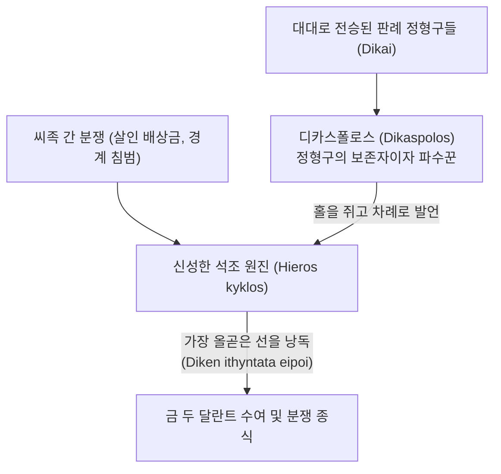

# 디케 (Dike)

**[[greek-reading-guide|읽는 법]]**: 디케 · **원어**: δίκη · **학술 전사**: *díkē*

## 1. 개념 정의 및 어원학적 기원

**디케**(δίκη, *díkē*; 복수형 δίκαι, *díkai*; 관용 라틴명 Dike)는 고대 그리스 서사시와 초기 희랍 사유에서 상이한 가문이나 씨족 간에 분쟁(경계 침범, 살인 배상금)이 발생했을 때, 사법적 권위를 지닌 재판관([[concept-dike#2-디카스폴로스dikaspolos와-정형구formule로서의-디케|디카스폴로스]])이 구두로 공표하는 ‘**올곧은 경계선이자 판결 정형구**’, 폭력(비에, *biē*)의 전횡을 종식시키는 ‘**씨족 간 대외 사법**’(Droit interfamilial), 그리고 훗날 보편적 도덕 질서로 승화된 ‘**정의**’(Justice)를 가리키는 핵심 제도 어휘입니다 ([[benveniste-1969-vocabulaire-institutions-2|Benveniste 1969]], II, pp. 107–114).

- **인도유럽어 어원학**:
  - 인도유럽 조어(PIE) 어근 `*deik-`("보여주다", "말로써 가리켜 밝히다")에서 유래합니다.
  - 이 어근은 그리스어 데이크뉘미(δείκνυμι, *deíknūmi*, 가리키다/보여주다), 산스크리트어 디시(*diś-*, 가리키다/지시하다/가르치다), 아베스타어 디스(*dis-*), 라틴어 디코(*dīcō*, 말하다)로 갈라졌습니다.
- **의미 진화**: '보여주다'에서 '말하다'와 '사법적 정의'로:
  - 벤베니스트는 어떻게 '보여주다'라는 시각적 행위가 라틴어의 '말하다(*dico*)'와 그리스어의 '사법적 판결(*díkē*)'로 귀결되었는지를 세 단계로 논증했습니다:
    1. **보여주는 매체**: 손가락이 아니라 '말(parole)'로써 보여주는 것입니다. 산스크리트어 *diś-*가 언어로써 가르치는 행위를 가리키는 점이 이를 뒷받침합니다.
    2. **발화의 주체와 권위**: 아무나 말하는 것이 아니라 오직 사법적 권위를 지닌 자만이 말할 수 있습니다. 라틴어 유덱스(*iūdex* < `*ious-dex`, 법을 선언하는 자)와 오스크어 최고 사법관 메딕스(*meddix* < `*med-dīx`)가 모두 `*deik-`의 발화 권능에 기초합니다.
    3. **공표되는 대상**: 이미 존재하는 물리적 사물이 아니라, 마땅히 행해져야 할 당위의 정형구(formule)입니다.
    4. 따라서 디케의 원초적 정의는 “**권위 있는 발화 행위를 통해 분쟁 당사자들에게 지켜야 할 마땅한 한계와 올곧은 규범을 가리켜 보여주는 것**”입니다.

| 어휘 (원어) | 학술 전사 | 품사 및 형태론 | 의미 및 문헌학적 맥락 |
|:---|:---|:---|:---|
| **díkē** (δίκη) | *díkē* | 여성 명사 (단수 주격) | 사법적 판결, 올곧은 선, 소송, 정당한 몫, 정의 |
| **díkai** (δίκαι) | *díkai* | 여성 명사 (복수 주격) | 전승된 판례 정형구들, 판결들 |
| **dikaspólos** (δικασπόλος) | *dikaspólos* | 남성 복합 명사 | 판례 정형구를 보존하고 집행하는 재판관 (파수꾼) |
| **díkaios** (δίκαιος) | *díkaios* | 형용사 (남성 주격) | 디케의 판결에 순응하는, 정당한, 정의로운 |
| **ithū̂ia díkē** (ἰθεῖα δίκη) | *itheîa díkē* | 명사구 (형용사 + 명사) | 비뚤어짐이 없는 올곧은 판결 (직선의 사법) |

---

## 2. 디카스폴로스(dikaspolos)와 정형구(formule)로서의 디케

고졸기 그리스 사회에서 재판관을 가리키는 칭호인 **디카스폴로스**(δικασπόλος, *dikaspólos*)는 디케의 고유한 제도적 성격을 증명합니다.

1. **복합어 구조와 기능**:
   - 디카스폴로스는 대격 복수 *dikas*와 어근 *-polos*("돌보는 자, 감시하는 자", 고대 그리스어 *boukolos* 소치기, *aipolos* 염소치기와 동일)가 결합한 형태입니다.
   - 즉, 디카스폴로스는 새로운 법을 머리로 구상하는 사변적 입법자가 아니라, “**대대로 전수되어 온 신성한 사법 정형구들(dikai)을 보존하고 적재적소에 꺼내어 선고하는 파수꾼**”이었습니다.
2. **그리스어 *dikēn eipein*과 라틴어 *ius dicere*의 일치**:
   - 그리스어 "디켄 에이페인(δίκην εἰπεῖν, 판결을 말하다)"과 라틴어 "이우스 디케레(*iūs dīcere*)"는 인도유럽 조어 단계의 완벽한 어휘적 대응물입니다.
   - 그리스어는 명사 *díkē*에 동사 *eipein*을 결합시켰고, 라틴어는 동사 *dīcō* 자체가 '말하다'로 의미가 확장되면서 사법 선고의 본령을 계승하였습니다.

---

## 3. 『일리아스』 18권 아킬레우스 방패의 재판 장면 해제 (*Il.* 18.497–508)

『일리아스』 제18권 헤파이토스가 아킬레우스를 위해 벼려낸 방패에 묘사된 평화로운 도시의 재판정은 고대 그리스 사법의 원형을 완벽히 보여주는 결정적 텍스트입니다:

### (1) 소송의 성격: 씨족 간 살인 배상금 분쟁
- 분쟁의 내용은 살해당한 남자의 피의 배상금([[concept-poine|포이네]], *poinḗ*)을 둘러싼 두 씨족 간의 격돌입니다.
- 가문 내부의 규범인 테미스([[concept-themis|Themis]])와 달리, 상이한 두 가문 사이에 유혈 살인이 벌어졌을 때 복수의 연쇄를 끊기 위해 개입하는 것이 바로 디케(*díkē*)입니다.

### (2) 벤베니스트의 획기적 본문 해석 (18.499–500행)
기존 학계는 이 구절을 "한 사람은 배상금을 다 지불했다고 주장하고(*eúkheto*), 다른 사람은 한 푼도 받지 못했다고 부인했다(*anaíneto*)"라는 시시한 영수증 사실 확인 소송으로 번역해 왔습니다.
벤베니스트는 문법적·제도적 논거를 통해 이를 전면 뒤엎었습니다:
- “**살인자는 피의 배상금(*poinḗ*)을 전액 지불하겠다고 공적으로 서약하고(*eúkheto*), 피해자의 유족은 배상금 받기를 단호히 거부하며 살인자의 목숨(동해보복)을 요구한다(*anaíneto*).**”
- 이것은 고대 법제사에서 **동해보복(피의 복수권)을 고수하려는 원초적 정의관과, 화폐적 배상금(*poinḗ*)을 통해 평화를 회복하려는 발전된 사법 질서 사이의 극적인 생사 대립**입니다. 온 도시 시민들이 둘로 나뉘어 고함을 지르고 원로들이 모여든 이유가 바로 여기에 있습니다.

### (3) 석조 원진과 올곧은 판결
- 원로들은 신성한 돌 원형 좌석(ἱερῷ ἐνὶ κύκλῳ, *hierō̂i enì kúklōi*)에 앉아 전령들로부터 성스러운 홀을 건네받아 차례로 일어나 판결을 제시합니다.
- 법정 중앙에는 금 두 달란트가 놓여 있으며, 이는 "원로들 가운데 가장 올곧은 판결을 말한 자"에게 상금으로 수여됩니다 (*Il.* 18.508):
  - **번역**: "원로들 가운데 가장 올곧은 판결을 말한 자에게 [그것을] 주도록 하라."
  - **원문**: τῷ δόμεν ὃς μετὰ τοῖσι δίκην ἰθύντατα εἴποι
  - **학술 전사**: *tō̂i dómen hòs metà toîsi díkēn ithúntata eípoi*
- 형용사 이튀스(ἰθύς, *ithús*, 올곧은, 직선의)는 디케가 양측의 주장 사이에서 비뚤어짐 없는 바른 경계선을 그어주는 기하학적 행위임을 시각적으로 증명합니다.

---

## 4. '운명적 귀결'에서 '보편적 정의'로의 의미론적 진화

호메로스 서사시에서 디케는 법정 소송 이전의 매우 원초적인 의미를 간직하고 있습니다:

1. **필연적 존재 양식으로서의 디케**:
   - *Od.* 11.218: 저승에서 오뒷세우스가 어머니 안티클레이아를 껴안으려 하나 그림자처럼 흩어지자, 어머니는 탄식합니다:
     - **번역**: "이것이 사람이 죽었을 때 맞는 필멸자들의 도리(디케)이다."
     - **원문**: αὕτη δίκη ἐστὶ βροτῶν
     - **학술 전사**: *haútē díkē estì brotō̂n*
   - *Od.* 14.59: 충직한 에우마이오스는 "항상 두려움에 떠는 것, 이것이 노예들의 디케이다(δίκη δμώων, *díkē dmṓōn*)"라고 말합니다.
   - 여기서 디케는 단순한 관습이 아니라, “**그 신분이나 존재 조건에 피할 수 없이 규정된 필연적 귀결이자 정해진 몫**”을 뜻합니다.
2. **폭력(biē)의 극복과 도덕적 정의(dikaios)**:
   - 각자가 자신의 힘에 기대어 타인의 몫을 침탈하는 폭력(비에, *biē*)의 상태에 맞서, 사법 절차를 통해 정당한 몫을 확정해 주는 제도가 정착되면서 디케는 마침내 '정의'라는 보편적 윤리 가치로 승화되었습니다.
   - 디케의 판결에 복종하고 약자의 몫을 침탈하지 않는 자가 비로소 **디카이오스**(δίκαιος, *díkaios*, 정의로운 자)로 칭송받게 되었습니다.

---

## 5. 호메로스 서사시 핵심 용례 분석표

| 서명 및 행 번호 | 화자 및 상황 | 원어 인용구 | 학술 전사 | 학술적 의의 및 벤베니스트 테제 |
|:---|:---|:---|:---|:---|
| *Il.* 18.508 | 시인 (방패 재판 장면) | δίκην ἰθύντατα εἴποι | *díkēn ithúntata eípoi* | 디케가 권위 있는 구두 발화(*eipein*)이자 올곧은 직선(*ithys*)을 긋는 사법 행위임을 입증 |
| *Il.* 16.388 | 시인 (제우스 폭우 비유) | ἐκ δὲ δίκην ἐλάσωσι | *ek dè díkēn elásōsi* | 폭력으로 굽은 판결을 내려 디케를 법정 밖으로 내쫓을 때 임하는 제우스의 응보 |
| *Od.* 11.218 | 안티클레이아 (저승 만남) | αὕτη δίκη ἐστὶ βροτῶν, ὅτε κέν τε θάνωσιν | *haútē díkē estì brotō̂n, hóte kén te thánōsin* | 죽은 자의 육신이 흩어지는 필연적 존재 양식/공식으로서의 원초적 디케 용례 |
| *Od.* 14.59 | 에우마이오스 (신분 탄식) | δίκη ἐστὶ δμώων | *díkē estì dmṓōn* | 노예라는 사회적 신분에 선천적으로 규정된 숙명적 처지로서의 디케 |
| *Il.* 19.180 | 오뒷세우스 (아가멤논 앞) | ἵνα μή τι δίκης ἐπιδευὲς ἔχῃσθα | *hína mḗ ti díkēs epideuès ékhēistha* | 아킬레우스에게 충분한 화해 선물을 주어 사법적 권리(*díkē*)에 결함이 없도록 권고 |

---

## 관련 항목

- [[concept-themis|테미스 (Themis)]]
- [[concept-poine|포이네 (Poine)]]
- [[concept-horkos|호르코스 (Horkos)]]
- [[concept-time|티메 (Timē)]]
- [[concept-geras|게라스 (Geras)]]
- [[entity-achilles|아킬레우스]]
- [[benveniste-1969-vocabulaire-institutions-2|에밀 벤베니스트 (1969), 인도유럽 제도 어휘집 2]]
- [[lloyd-jones-1971-justice-of-zeus|휴 로이드-존스 (1971), 제우스의 정의]]
