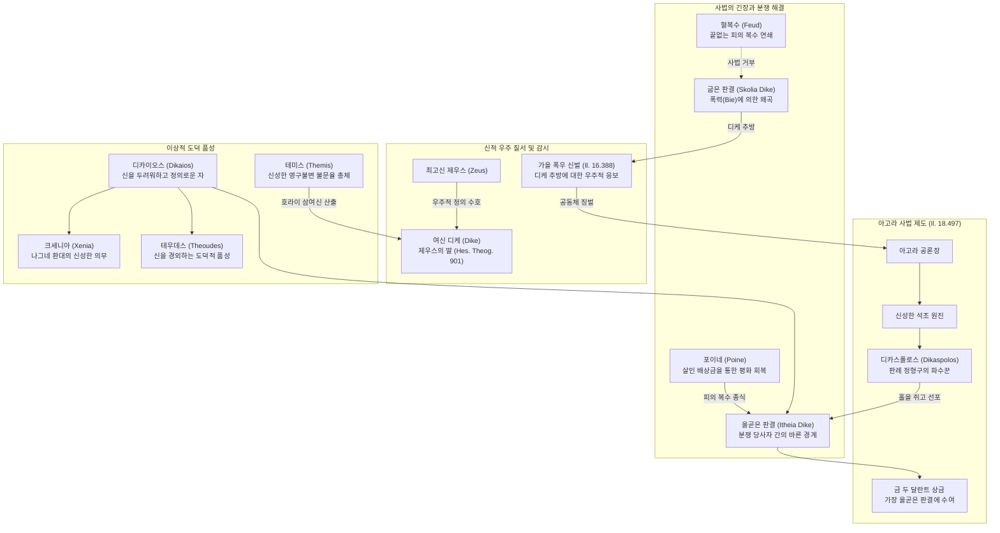

# 디케 (Dike)

**[[greek-reading-guide|읽는 법]]**: 디케 · **원어**: δίκη · **학술 전사**: *díkē*

## 1. 개념 정의 및 기본 성격 (Definition & Core Nature)

**디케**(δίκη, *díkē*; 복수형 δίκαι, *díkai*; 관용 라틴명 Dike)는 고대 그리스 서사시와 초기 희랍 사유에서 상이한 가문이나 씨족 간에 분쟁(살인 배상금, 토지 경계 침범)이 발생했을 때, 사법적 권위를 지닌 재판관([[concept-dike#3-호메로스-서사시-내-작동-메커니즘-operational-mechanism-in-homeric-epic|디카스폴로스]])이 구두로 선포하는 **올곧은 경계선이자 판결 정형구**입니다([[benveniste-1969-vocabulaire-institutions-2|Benveniste 1969]], II, pp. 107–114).

디케는 물리적 무력인 **비에**(βίη, *bíē*, 폭력)와 오만([[concept-hybris|휘브리스]])의 전횡을 종식시키는 **씨족 간 대외 사법**(Droit interfamilial)이자, 나아가 최고신 [[entity-zeus|제우스]]가 주관하는 우주적 도덕 질서로서의 **정의**(Justice)를 아우르는 핵심 제도 어휘입니다([[lloyd-jones-1971-justice-of-zeus|Lloyd-Jones 1971]], pp. 1–27).

호메로스 텍스트에서 디케는 단순한 법정 소송 용어를 넘어 다음과 같은 다층적 의미 층위를 형성합니다:
1. **사법적 경계 긋기와 판결 정형구**: 상이한 두 당사자 사이에서 한쪽으로 치우치지 않고 비뚤어짐 없는 바른 선을 그어주는 '올곧은 판결(ἰθεῖα δίκη, *itheîa díkē*)'입니다.
2. **필연적 존재 양식 및 신분적 본성**: 인간의 필멸성이나 노예의 처지처럼, 어떤 존재 조건에 불가피하게 주어지는 '정해진 몫이자 숙명적 처지'를 가리킵니다(*Od.* 11.218, 14.59).
3. **제우스의 우주적 도덕 질서**: 인간 재판관들이 사리사욕에 눈이 멀어 폭력으로 디케를 왜곡할 때, 제우스가 자연재해(가을 폭우)를 통해 공동체 전체를 응징하는 우주론적 정의입니다(*Il.* 16.384–393).

---

## 2. 어원과 형태론적 분석 (Etymology & Morphological Analysis)

### (1) 어원학적 기원과 인도유럽조어(PIE) 배경
그리스어 디케(δίκη)는 인도유럽조어(PIE) 어근 `*deik-`("손가락으로 가리키다, 말로써 보여주다")에서 파생된 여성 명사입니다(Chantraine, *DELG*, pp. 278–280).

- **벤베니스트의 3단계 의미 진화 논증**:
  에밀 벤베니스트([[benveniste-1969-vocabulaire-institutions-2|Benveniste 1969]])는 '보여주다'라는 시각적 행위가 어떻게 '말하다'와 '사법적 판결'로 발전했는지를 명쾌하게 밝혔습니다:
  1. **보여주는 매체**: 손가락이 아니라 '말(parole)'로써 보여주는 행위입니다. 산스크리트어 *diś-*가 언어로써 가르치고 지시하는 행위를 뜻하는 것과 일치합니다.
  2. **발화 주체의 사법적 권능**: 아무나 말하는 것이 아니라 오직 사법적 권위를 지닌 자만이 선포할 수 있습니다. 라틴어 판관 유덱스(*iūdex* < `*ious-dex`, 법을 선언하는 자)와 오스크어 최고 사법관 메딕스(*meddix* < `*med-dīx`)가 모두 `*deik-`의 발화 권능에 뿌리를 둡니다.
  3. **공표되는 대상**: 이미 존재하는 물리적 사물이 아니라, 분쟁 당사자들이 지켜야 할 '마땅한 한계와 올곧은 규범의 정형구(formule)'입니다.
  4. 따라서 디케의 원초적 본질은 "**권위 있는 구두 발화 행위를 통해 분쟁 당사자들에게 지켜야 할 마땅한 한계선(경계)을 가리켜 보여주는 것**"입니다.

### (2) 인도유럽어족 비교 대응형
- **산스크리트어**: 디시(*diś-*, 가리키다, 언어로 가르치다), 디샤(*diśā-*, 방향, 경계, 방위).
- **라틴어**: 디코(*dīcō*, 말하다), 유덱스(*iūdex*, 재판관), 유디키움(*iūdicium*, 판결), 콘디키오(*condiciō*, 조건).
- **게르만어**: 고대 영어 *tēon*(보여주다), 현대 영어 *teach*(가르치다), *token*(징표), *digit*(손가락/숫자).

### (3) 4열 형태론 표

| 구분 | 그리스어 실제형 | 학술 전사 | 문법 설명 및 호메로스 용례 |
|:---|:---|:---|:---|
| **여성 명사 (단수 주격)** | δίκη | *díkē* | 단수 주격. 사법적 판결, 올곧은 경계선, 소송, 정당한 몫, 정의 (*Od.* 11.218) |
| **여성 명사 (단수 대격)** | δίκην | *díkēn* | 단수 대격. 판결을 선포하다(*díkēn eipeîn*), 디케를 쫓아내다 (*Il.* 16.388, 18.508) |
| **여성 명사 (복수 주격)** | δίκαι | *díkai* | 복수 주격. 대대로 전승된 판례 정형구들, 판결들 (*Il.* 1.542; *Od.* 9.215) |
| **복합 명사 (남성 주격)** | δικασπόλος | *dikaspólos* | 남성 단수 주격. 판례 정형구를 보존하고 집행하는 재판관 (*Il.* 1.238) |
| **파생 형용사 (남성 주격)** | δίκαιος | *díkaios* | 남성 단수 주격. 디케를 준수하는, 의로운, 신을 두려워하는 (*Od.* 9.175) |
| **파생 형용사 (남성 복수)** | δίκαιοι | *díkaioi* | 남성 복수 주격. 나그네를 환대하고 올곧은 도덕을 체현한 자들 (*Od.* 3.52) |
| **합성 형용사 (여성 주격)** | ἰθεῖα | *itheîa* | 여성 단수 주격. 직선의, 올곧은. ἰθεῖα δίκη(올곧은 판결) 구성 (*Il.* 18.508) |
| **합성 형용사 (여성 복수)** | σκολιαί | *skoliaí* | 여성 복수 주격. 굽은, 비뚤어진. σκολιαὶ δίκαι(굽은 판결) 구성 (*Il.* 16.387) |
| **부정 명사 (여성 주격)** | ἀδικία | *adikía* | 여성 단수 주격. 부정 접두사 a- 결합. 불의, 사법적 부정의 (후대·서사시 희귀) |
| **파생 동사 (현재 능동 3단)** | δικάζει | *dikázei* | 3인칭 단수 현재 능동. 판결을 내리다, 재판하다 (*Il.* 18.506) |

---

## 3. 호메로스 서사시 내 작동 메커니즘 (Operational Mechanism in Homeric Epic)

호메로스 영웅 사회에서 디케는 문서화된 법전이 아니라 **공론장(아고라), 신성한 석조 원진, 홀의 전달 의례, 구두 정형구의 선포**를 통해 작동합니다.

### (1) 대외 사법(Droit interfamilial)으로서의 분쟁 종식
- 가문 내부의 갈등이 가부장의 권위와 신성한 불문율인 [[concept-themis|테미스]](*thémis*)에 의해 규율된다면, 상이한 두 가문 간에 유혈 살인이나 경계 침범이 벌어졌을 때 작동하는 외적 절차가 디케입니다.
- 디케의 핵심 목적은 끝없는 피의 복수(동해보복)의 연쇄를 차단하고, 배상금([[concept-poine|포이네]], *poinḗ*)의 합의를 통해 두 가문 사이에 평화와 균형을 회복하는 것입니다.

### (2) 디카스폴로스(dikaspolos)와 정형구(formule)
고졸기 재판관을 뜻하는 **디카스폴로스**(δικασπόλος)는 판결 정형구 복수형 *dikas*와 파수꾼을 뜻하는 *-polos*(목동 *boukolos*, *aipolos*와 동근)가 결합한 어휘입니다:
- 재판관은 머릿속에서 자의적인 법률을 고안하는 입법자가 아니라, "대대로 전수된 신성한 사법 정형구들(dikai)을 보존하고 적재적소에 꺼내어 선포하는 파수꾼"이었습니다.
- 그리스어 '디켄 에이페인'(δίκην εἰπεῖν, 판결을 말하다)과 라틴어 '이우스 디케레'(*iūs dīcere*)는 인도유럽 조어 단계부터 이어진 신성한 구두 사법 선언의 원형입니다.

### (3) 직선의 사법(이튀스, ithús)과 굽은 판결(스콜리오스, skolios)
- 고대 그리스 사법 사유는 기하학적 메타포에 기초합니다. 
- 올바른 판결은 두 당사자 사이에서 기울어짐 없이 똑바른 직선을 그어주는 ‘‘**이테이아 디케**’’(ἰθεῖα δίκη, 올곧은 판결)입니다.
- 반면 뇌물이나 권력자의 폭력에 굴복하여 한쪽으로 휜 판결은 ‘‘**스콜리아이 테미스테스/디카이**’’(σκολιαὶ θέμιστες, 굽은 판결)로 규탄받았습니다.

---

## 4. 핵심 에피소드 및 원전 텍스트 정밀 독해 (Key Narrative Episodes & Close Reading)

### (1) 에피소드 1: 아킬레우스 방패의 재판 장면과 올곧은 판결 (*Il.* 18.497–508)

- **텍스트 인용**:
  - **번역**: "원로들은 신성한 석조 원진에 놓인 매끄러운 돌 좌석에 앉아 있었고, 손에는 목청 큰 전령관들의 홀을 쥐고 있었다. 그들은 그 홀을 쥐고 차례로 일어나 판결을 선고하였다. 중앙에는 금 두 달란트가 놓여 있었으니, 원로들 가운데 가장 올곧은 판결을 말한 자에게 주도록 하기 위함이었다."
  - **원문**: οἱ δὲ γέροντες / εἵατ' ἐπὶ ξεστοῖσι λίθοις ἱερῷ ἐνὶ κύκλῳ, / σκῆπτρα δὲ κηρύκων ἐν χέρσ' ἔχον ἠεροφώνων· / τοῖσιν ἔπειτ' ἤϊσσον, ἀμοιβηδὶς δὲ δίκαζον. / κεῖτο δ' ἄρ' ἐν μέσσοισι δύω χρυσοῖο τάλαντα, / τῷ δόμεν ὃς μετὰ τοῖσι δίκην ἰθύντατα εἴποι
  - **학술 전사**: *hoi dè gérontes / heíat' epì xestoîsi líthois hierō̂i enì kúklōi, / skē̂ptra dè kērúkōn en khérs' ékhon ēerophṓnōn; / toîsin épeit' ḗïsson, amoibēdìs dè díkazon. / keîto d' ár' en méssoisi dúō khrusoîo tálanta, / tō̂i dómen hòs metà toîsi díkēn ithúntata eípoi* (*Il.* 18.503–508)

- **정밀 분석**:
  헤파이토스가 아킬레우스의 방패에 새겨 넣은 평화로운 도시의 재판정은 고대 그리스 사법의 원형을 생생하게 보존합니다. 살인 배상금(poinḗ)을 둘러싼 분쟁에서, 벤베니스트(1969)가 논증하듯 한쪽은 배상금을 다 지불하겠다고 공언하고(*eúkheto*), 다른 쪽은 피의 복수권을 고수하며 배상금 수령을 거부합니다(*anaíneto*). 신성한 석조 원진(hierō̂i enì kúklōi)에 앉은 원로들은 전령의 홀을 넘겨받아 가장 설득력 있고 공평한 판결 정형구를 구두 선포(*díkēn ithúntata eípoi*)하기 위해 경쟁합니다. 중앙의 금 두 달란트는 가장 올곧은 경계선을 그어 공동체의 평화를 회복시킨 판관에게 바쳐지는 상금입니다.

### (2) 에피소드 2: 가을 폭우 비유와 디케 추방에 대한 우주적 신벌 (*Il.* 16.384–393)

- **텍스트 인용**:
  - **번역**: "가을날 거센 폭풍우로 온 땅이 무겁게 짓눌릴 때처럼, 제우스께서 인간들에게 격노하여 거센 비를 쏟아부으실 때이니, 그들이 아고라에서 폭력으로 굽은 판결을 내리고 디케를 쫓아내며, 신들의 감시를 두려워하지 않았기 때문이다."
  - **원문**: ὡς δ' ὑπὸ λαίλαπι πᾶσα κελαινὴ βέβριθε χθὼν / ἤματ' ὀπωρινῷ, ὅτε λαβρότατον χέει ὕδωρ / Ζεύς, ὅτε δή ῥ' ἄνδρεσσι κοτεσσάμενος χαλεπήνῃ, / οἳ βίῃ εἰν ἀγορῇ σκολιὰς κρίνωσι θέμιστας, / ἐκ δὲ δίκην ἐλάσωσι θεῶν ὄπιν οὐκ ἀλέγοντες
  - **학술 전사**: *hōs d' hupò laílapi pâsa kelaìnē bébrithe khthṑn / ḗmat' opōrinō̂i, hóte labrótaton khéei húdōr / Zeús, hóte dḗ rh' ándressi kotessámenos khalepḗnēi, / hoì bíēi ein agorē̂i skoliàs krínōsi thémistas, / ek dè díkēn elásōsi theō̂n ópin ouk alégontes* (*Il.* 16.384–388)

- **정밀 분석**:
  이 구절은 호메로스 서사시에서 제우스의 정의가 단순한 관념이 아니라 우주적 실재임을 입증하는 핵심 문헌입니다([[lloyd-jones-1971-justice-of-zeus|Lloyd-Jones 1971]]). 인간들이 아고라에서 폭력(bíē)으로 올곧은 법을 굽게 만들고 '디케를 추방할 때(ek dè díkēn elásōsi)', 제우스는 농경지를 쓸어버리는 거센 가을 폭우와 홍수로 응징합니다. 사법적 불의는 단순한 인간 사이의 잘못을 넘어 자연과 우주 질서 전체를 파괴하는 신성모독으로 간주됩니다.

### (3) 에피소드 3: 저승의 안티클레이아와 존재론적 필연성으로서의 디케 (*Od.* 11.216–224)

- **텍스트 인용**:
  - **번역**: "사람들이 죽었을 때 이것이 필멸자들의 정해진 본성(디케)이란다. 더 이상 힘줄들이 뼈와 살을 붙들지 못하고, 뼈마디 속에서 흰 뼈를 떠나자마자 맹렬히 타오르는 불길의 위력이 살점을 집어삼키며, 영혼은 꿈처럼 날아가 맴돌기 때문이란다."
  - **원문**: ἀλλ' αὕτη δίκη ἐστὶ βροτῶν, ὅτε κέν τε θάνωσιν· / οὐ γὰρ ἔτι σάρκας τε καὶ ὀστέα ἶνες ἔχουσιν, / ἀλλὰ τὰ μέν τε πυρὸς κρατερὸν μένος αἰθομένοιο / δαμνᾷ, ἐpeí κε πρῶτα λίπῃ λεύκ' ὀστέα θυμός, / ψυχὴ δ' ἠΰτ' ὄνειρος ἀποπταμένη πεπότηται
  - **학술 전사**: *all' haútē díkē estì brotō̂n, hóte kén te thánōsin; / ou gàr éti sárkas te kaì ostéa înes ékhousin, / allà tà mén te puròs krateròn ménos aithoménoio / damnā̂i, epeí ke prō̂ta lípēi leúk' ostéa thumós, / psukhḕ d' ēṻt' óneiros apoptaménē pepótētai* (*Od.* 11.218–222)

- **정밀 분석**:
  오디세우스가 저승에서 어머니 안티클레이아의 혼백을 세 번이나 안으려 하지만 그림자처럼 흩어지자, 어머니는 슬퍼하며 육신의 붕괴를 설명합니다. 여기서 사용된 *haútē díkē estì brotō̂n*은 법정 소송 이전의 원초적 의미인 ‘**필연적 본성, 피할 수 없는 존재의 질서이자 귀결**’을 나타냅니다. 인간에게 죽음이란 신들이 그어놓은 극복할 수 없는 한계선이며, 육신이 불길에 소멸하고 영혼이 하데스로 날아가는 것은 필멸자 존재의 고유한 '디케'입니다.

### (4) 에피소드 4: 에우마이오스의 신분 탄식과 사회적 처지로서의 디케 (*Od.* 14.56–60)

- **텍스트 인용**:
  - **번역**: "늘 두려움에 떠는 것, 이것이 바로 새로운 주인들 밑에서 일하는 노예들의 처지(디케)이지요."
  - **원문**: ἡ γὰρ δμώων δίκη ἐστὶν αἰεὶ δειδιότων, / οἳ ἐπικρατέωσιν ἄνακτες / αἰεὶ τηλόθ' ἐόντες
  - **학술 전사**: *hē gàr dmṓōn díkē estìn aieì deidiótōn, / hoì epikratéōsin ánaktes / aieì tēlóth' eóntes* (*Od.* 14.59–60)

- **정밀 분석**:
  돼지치기 에우마이오스는 거지 차림의 나그네 오디세우스에게 음식을 대접하며 자신의 비천한 처지를 한탄합니다. 여기서 *dmṓōn díkē*는 노예라는 특수한 사회적 신분 집단에 숙명적으로 부과된 '생활 양식, 관례적 태도, 처지'를 뜻합니다. 디케는 각 존재가 세계 안에서 차지하는 고유한 자리와 그 자리에 따른 마땅한 몫(share)과 행동 방식을 규정하는 어휘입니다.

### (5) 에피소드 5: 디카이오스(díkaios)와 이상적 왕권의 우주적 번영 (*Od.* 19.107–114, 9.172–176)

- **텍스트 인용**:
  - **번역**: "흠 없는 고귀한 왕의 명성처럼, 그가 신을 두려워하며 수많은 용맹한 백성들을 다스리고 올곧은 판결(eudikías)을 수호할 때, 검은 대지는 보리와 밀을 풍성히 낳고, 나무들은 열매로 무거우며, 양 떼는 쉼 없이 새끼를 낳고, 바다는 물고기를 제공하나니, 그의 훌륭한 지도 아래 백성들이 번영을 누리기 때문이오."
  - **원문**: ὥς τέ τευ ἢ βασιλῆος ἀμύμονος, ὅς τε θεουδὴς / ἀνδράσιν ἐν πολλοῖσι καὶ ἰφθίμοισιν ἀνάσσων / εὐδικίας ἀνέχῃσι, φέρῃσι δὲ γαῖα μέλαινα / πυροὺς καὶ κριθάς, βρίθῃσι δὲ δένδρεα καρπῷ, / τίκτῃ δ' ἔμπεδα μῆλα, θάλασσα δὲ παρέχῃ ἰχθῦς / ἐξ εὐηγεσίης, ἀρετῶσι δὲ λαοὶ ὑπ' αὐτοῦ
  - **학술 전사**: *hṓs té teu ḕ basilē̂os amúmonos, hós te theoudḕs / andrásin en polloîsi kaì iphthímoisin anássōn / eudikías anékhēisi, phérēisi dè gaîa mélaina / puroùs kaì krithás, bríthēisi dè déndrea karpō̂i, / tíktēi d' émpeda mê̂la, thálassa dè parékhēi ikhthûs / ex euēgesíēs, aretō̂si dè laoì hup' autoû* (*Od.* 19.109–114)

- **정밀 분석**:
  오디세우스가 변장한 채 아내 페넬로페를 칭송하며 읊는 이 구절은 고대 그리스 왕권 신화의 정수입니다. 왕이 신을 두려워하고 올곧은 정의(eudikías)를 보존할 때, 그 도덕적 디케는 자연 생태계 전체의 풍요로 이어집니다. 반대로 *Od.* 9.175에서 키클롭스를 묘사할 때 묻는 질문("그들이 거칠고 야만적인가, 아니면 손님을 환대하고 신을 두려워하는 의로운 자들[díkaioi]인가?")에서 드러나듯, 디카이오스(díkaios)는 단순한 준법자를 넘어 나그네 환대([[concept-xenia|크세니아]])와 신에 대한 경외를 체현한 이상적 인간형을 뜻합니다.

---

## 5. 사회제도 및 다른 개념과의 상호작용망 (Socio-Institutional Network & Conceptual Relations)

디케는 호메로스 사회의 도덕·사법 질서의 중심축으로서 다양한 개념들과 유기적으로 상호작용합니다.

### (1) 상호작용망 Mermaid 다이어그램

### (2) 테미스(Themis) 대 디케(Dike)의 구조적 비교
- **테미스(Themis)**: 인도유럽 어근 `*dʰē-`("정립하다")에서 유래하여 신들이 우주와 인간 사회의 반석으로 세워놓은 '영구불변의 불문율이자 전승 판례 총체(Themistes)'입니다.
- **디케(Dike)**: 어근 `*deik-`("말로써 가리키다")에서 유래하여 갈등이 발생했을 때 재판관이 구두로 그어주는 '올곧은 판결 선'입니다. 테미스가 영구적 규범의 저장소라면, 디케는 현실 분쟁 속에서 이를 구현하는 사법적 집행입니다.

---

## 6. 윤리학 및 심리철학적 함의 (Ethical & Psycho-Philosophical Implications)

### (1) 폭력(비에, biē)의 극복과 사법의 탄생
호메로스 영웅 사회는 개인이 자신의 물리적 완력(비에)을 믿고 타인의 몫을 침탈하는 오만([[concept-hybris|휘브리스]])의 위험에 항상 노출되어 있습니다:
- 디케는 사적 폭력의 자력구제를 중단시키고, 중립적인 제3자(원로 재판관)의 권위 있는 말(*díkēn eipeîn*)을 통해 갈등을 종식시키는 인류 문명화의 결정적 도약입니다.

### (2) 20세기 고전학계 학설 대립: 도즈-애드킨스 대 로이드-존스
1. **도즈(1951)와 애드킨스(1960)의 편견**:
   - 도즈와 애드킨스는 호메로스 영웅 사회를 오직 군사적 무공([[concept-agathos|아가토스]])과 성공만이 찬양받고 도덕적 정의는 결여된 '수치 문화(Shame culture)'이자 전(前)도덕적 단계로 평가절하했습니다.
2. **휴 로이드-존스(1971)의 실증적 반박**:
   - 휴 로이드-존스([[lloyd-jones-1971-justice-of-zeus|Lloyd-Jones 1971]])는 『일리아스』 16권의 제우스 폭우 비유와 트로이아 전쟁 전체가 파리스의 환대 배신에 대한 제우스의 사법적 집행임을 입증하며, 호메로스 초기 서사시부터 제우스의 디케가 일관되고 강력한 도덕 질서로 작동하고 있었음을 완벽히 복원했습니다.

### (3) 초기 그리스 자연철학 및 존재론과의 연계
- **아낙시만드로스(Anaximander)**: "만물은 생성된 곳으로 소멸하니, 시간의 질서에 따라 서로에게 부정의(adikía)에 대한 응보와 처벌(díkē)을 치른다." 만물의 생성과 소멸을 사법적 균형과 디케의 복원으로 파악했습니다.
- **파르메니데스(Parmenides)**: 진리의 여신에게 이르는 문을 지키고 있는 존재가 바로 '많은 벌을 내리는 정의(Díkē Polúpoinos)'입니다. 디케는 우주적 진리와 존재의 필연성을 지키는 수호자입니다.

---

## 7. 종교 제의 및 인류학적 지평 (Religious Ritual & Anthropological Horizon)

### (1) 헤시오도스 신통기와 일과 날의 여신 디케
- 헤시오도스의 『신통기』(901–903행)에서 디케는 제우스와 테미스의 둘째 딸로 등장하며, 질서(에우노미아)와 평화(에이레네)와 함께 호라이 삼여신을 이룹니다.
- 『일과 날』(*Op.* 256–264): 여신 디케는 인간 재판관들이 뇌물을 받고 굽은 판결을 내릴 때 눈물을 흘리며 아버지 제우스의 옥좌 곁에 앉아 인간의 불의를 고발합니다. 제우스는 3만 명의 보이지 않는 불멸의 감시자들(phylakes)을 온 땅에 파견하여 인간의 판결을 감시합니다.

### (2) 살인 배상금(poinē)과 영적 오염(miasma)
- 고대 그리스 종교에서 살인은 피해자의 영혼과 가문에 씻을 수 없는 피의 오염(miasma)을 남깁니다.
- 가해자가 재판정을 통해 정당한 포이네(*poinḗ*)를 지불하고 유족과 화해하는 의례는, 단순한 경제적 보상을 넘어 공동체의 영적 오염을 씻어내는 정화(katharsis)의 종교적 성격을 띱니다.

### (3) 신을 두려워하는 자(theoudēs)와 의로운 자(díkaios)
호메로스 서사시에서 의로운 자(*díkaios*)는 항상 '신을 두려워하는 자(*theoudḗs*)'와 쌍을 이룹니다:
- 낯선 이방인이 찾아왔을 때 그를 환대하는 것([[concept-xenia|크세니아]])은 신들이 정초한 경계를 존중하는 행위이며, 이 경계를 침범하지 않는 절제가 곧 디케의 종교인류학적 본령입니다.

---

## 8. 후대 문학 및 지성사적 수용 (Reception in Later Literature & Intellectual History)

### (1) 고전기 아테네 비극에서의 문명학적 전환
- **아이스킬로스 『오레스테이아(Oresteia)』 3부작**:
  - 『아가멤논』과 『제주를 바치는 여인들』에서 피의 복수를 고수하던 원초적 에리뉘스(복수의 여신들)의 광기는, 『자비로운 여신들(Eumenides)』에 이르러 아테나 여신이 주재하는 아레오파고스 법정의 공민적 투표 재판(디케)으로 흡수됩니다.
  - 끝없는 사적 혈복수의 악순환이 폴리스의 공적 사법 체계(디케)로 전환되는 역사적 기념비입니다.

### (2) 플라톤과 아리스토텔레스의 철학적 체계화
1. 『**플라톤 『국가(Politeia)**』:
   - 1권에서 트라시마코스의 소피스트적 궤변("정의는 강자의 이익이다")을 논박하며, 외적인 사법 판결에 머물던 디케를 영혼의 세 부분(이성, 기개, 욕망)이 조화를 이루는 내면적 덕인 **디카이오쉬네**(δικαιοσύνη, *dikaiosúnē*)로 승화시킵니다.
2. **아리스토텔레스 『니코마코스 윤리학』 5권**:
   - 정의를 '특수한 정의'로 분류하여, 아킬레우스 방패 재판처럼 불법적 가해를 원상 복구시키는 **교정적 정의**(diorthōtikòn díkaion)와, 가치에 따라 공적 자산을 배분하는 **분배적 정의**(dianemetikòn díkaion)로 정밀하게 학문화했습니다.

### (3) 로마법과 현대 법철학
- **로마법의 유스티티아(Justitia)**: 로마 법학자 울피아누스는 정의를 "각자에게 그의 몫을 주려는 항구적이고 영속적인 의지(*Iustitia est constans et perpetua voluntas ius suum cuique tribuendi*)"로 정의했습니다.
- **현대 법철학**: 존 롤스(John Rawls)의 공정으로서의 정의(Justice as Fairness)와 절차적 정의(Procedural Justice)는, 당사자들이 합의한 공정한 절차(석조 원진의 원로 재판)를 통해 도출된 판결이 정당성을 획득한다는 호메로스적 디케의 원초적 문제의식을 현대적으로 계승합니다.

---

## 9. 학술적 쟁점 및 비판적 평가 (Scholarly Debates & Critical Evaluation)

### (1) 아킬레우스 방패 재판(18.497–508)의 성격 논쟁
- **전통적 사실확인설**: 한쪽은 배상금을 이미 다 치렀다고 주장하고 다른 쪽은 받지 못했다고 부인하는 단순 채무 변제 여부 다툼으로 보는 시각.
- **벤베니스트의 실질사법설**: 가해자는 배상금을 치르고 사태를 종결짓겠다고 서약하나, 피해자 유족은 배상금 수령을 거부하고 살인자의 목숨(피의 복수)을 요구하는 '복수권 대 사법 절차'의 문명학적 충돌로 보는 시각. 현대 문헌학계는 벤베니스트의 통찰을 압도적으로 지지합니다.

### (2) 디케 개념의 시대착오(Anachronism) 경계
호메로스의 디케를 후대 칸트식 정언명령이나 근대적 보편 인권으로 지나치게 조기 소급해서는 안 됩니다. 서사시의 디케는 여전히 '노예의 처지(*Od.* 14.59)', '망자의 육신 소멸(*Od.* 11.218)'처럼 구체적 생물학적·신분적 조건에 결부된 원초적 기저를 유지하고 있음을 균형 있게 인식해야 합니다.

---

## 10. 현대적 통찰 및 인문학적 의의 (Modern Insights & Humanistic Significance)

### (1) 사적 제재(사적 복수)와 공적 사법의 가치
최근 사회 전반에서 사법 불신으로 인해 사적 보복과 사적 제재를 미화하는 경향이 대두되고 있습니다. 그러나 호메로스의 디케는 사적 복수가 필연적으로 파멸적 혈복수의 연쇄를 낳을 뿐이며, 공동체가 마련한 공적 절차(아고라와 석조 원진)를 통해서만 진정한 평화와 치유가 가능함을 웅변합니다.

### (2) 직선의 사법과 사법 신뢰 회복
정의가 타락할 때 고대인들은 이를 '굽은 판결(skoliaì thémistes)'이라 불렀습니다. 판사의 자의적 판단이나 정치적 외압에 의해 법이 비뚤어질 때 공동체 전체가 위기에 빠집니다. 중앙의 금 두 달란트처럼 가장 올곧은 선(*ithús*)을 긋는 자에게 최고의 영예를 바쳤던 호메로스 사회의 지혜는 사법 신뢰의 소중함을 일깨웁니다.

---

## 11. 종합 매트릭스: 호메로스 서사시 텍스트 증거 원장 (Comprehensive Textual Evidence Ledger)

| 범주 | 원전 출처 | 핵심 그리스어 구절 | 학술 전사 | 핵심 논점 및 증거 가치 | 확실성 등급 |
|:---|:---|:---|:---|:---|:---|
| **올곧은 판결** | *Il.* 18.508 | δίκην ἰθύντατα εἴποι | *díkēn ithúntata eípoi* | 아킬레우스 방패 재판: 가장 올곧은 판결을 구두 선포한 자에게 상금 수여 | 원전 명시 |
| **석조 원진** | *Il.* 18.504 | εἵατ' ἐπὶ ξεστοῖσι λίθοις ἱερῷ ἐνὶ κύκλῳ | *heíat' epì xestoîsi líthois hierō̂i enì kúklōi* | 신성한 돌 원진에 앉아 홀을 넘겨받아 판결하는 사법 의례 구조 | 원전 명시 |
| **굽은 판결** | *Il.* 16.387–388 | σκολιὰς κρίνωσι θέμιστας, ἐκ δὲ δίκην ἐλάσωσι | *skoliàs krínōsi thémistas, ek dè díkēn elásōsi* | 아고라에서 굽은 판결로 디케를 쫓아낼 때 제우스가 폭우 신벌을 내림 | 원전 명시 |
| **존재의 귀결** | *Od.* 11.218 | αὕτη δίκη ἐστὶ βροτῶν, ὅτε κέν τε θάνωσιν | *haútē díkē estì brotō̂n, hóte kén te thánōsin* | 죽음 앞에서 육신이 흩어지는 필멸자의 생물학적 본성/귀결로서의 디케 | 원전 명시 |
| **신분적 처지** | *Od.* 14.59 | ἡ γὰρ δμώων δίκη ἐστὶν αἰεὶ δειδιότων | *hē gàr dmṓōn díkē estìn aieì deidiótōn* | 새 주인을 두려워하는 노예의 숙명적 처지이자 생활 양식으로서의 디케 | 원전 명시 |
| **의로운 왕권** | *Od.* 19.109–114 | εὐδικίας ἀνέχῃσι ... ἀρετῶσι δὲ λαοί | *eudikías anékhēisi ... aretō̂si dè laoí* | 신을 두려워하는 왕이 바른 정의를 지킬 때 대지와 바다가 번영하는 왕권 신화 | 원전 명시 |
| **정의로운 자** | *Od.* 9.175–176 | φιλόξεινοι, καί σφιν νόος ἐστὶ θεουδής | *philóxeinoi, kaí sphin nóos estì theoudḗs* | 키클롭스와 대조되는, 나그네를 환대하고 신을 두려워하는 의로운 자들(dikaioi) | 원전 명시 |
| **사법적 보상** | *Il.* 19.180 | ἵνα μή τι δίκης ἐπιδευὲς ἔχῃσθα | *hína mḗ ti díkēs epideuès ékhēistha* | 아킬레우스에게 사법적 권리와 배상(díkē)에 결손이 없도록 하라는 오디세우스 권고 | 원전 명시 |
| **판례 파수꾼** | *Il.* 1.238–239 | δικασπόλοι, οἵ τε θέμιστας πρὸς Διὸς εἰρύαται | *dikaspóloi, hoí te thémistas pròs Diòs eirúatai* | 제우스의 테미스테스를 가슴에 보존하고 선포하는 사법관 디카스폴로스 | 원전 명시 |
| **여신 디케** | Hes. *Theog.* 902 | Εὐνομίην τε Δίκην τε καὶ Εἰρήνην τεθαλυῖαν | *Eunomíēn te Díkēn te kaì Eirḗnēn tethaluîan* | 제우스와 테미스의 딸 호라이 삼여신(질서, 정의, 평화) 중 하나로서의 디케 | 후대 수용 |
| **신들의 감시** | Hes. *Op.* 256–260 | ἡ δέ τε παρθένος ἐστὶ Δίκη, Διὸς ἐκγεγαυῖα | *hē dé te parthénos estì Díkē, Diòs ekgegauîa* | 굽은 판결에 눈물 흘리며 제우스에게 고발하는 처녀 여신 디케 | 후대 수용 |
| **비극적 전환** | Aesch. *Eum.* | Areopagos Court Trial | - | 사적 혈복수(에리뉘스)에서 법정 사법(디케)으로의 문명학적 전환 | 후대 수용 |
| **교정적 정의** | Arist. *EN* 1131b–1132a | τὸ διορθωτικὸν δίκαιον | *tò diorthōtikòn díkaion* | 피해를 동등하게 회복시키는 사법으로서의 아리스토텔레스 교정적 정의 | 후대 수용 |

---

## 12. 자주 묻는 질문 (FAQ)

### Q1. 디케(Dike)와 테미스(Themis)의 본질적 차이는 무엇인가요?
**A**: 테미스(θέμις)는 신들이 우주와 인간 사회의 반석으로 세워놓은 '영구불변의 불문율이자 전승 판례 총체(Themistes)'입니다. 반면 디케(δίκη)는 상이한 가문 간에 구체적 경계 침범이나 살인 분쟁이 벌어졌을 때, 재판관이 구두로 공표하는 '올곧은 판결 선'입니다. 테미스가 영구적 규범의 원천이라면, 디케는 구체적 현실 속에서 이를 실현하는 사법적 집행입니다.

### Q2. 왜 디케의 어원이 '가리키다(deik-)'에서 '정의'로 발전했나요?
**A**: 고졸기 사법관(디카스폴로스)은 새로운 법을 머리로 만드는 입법자가 아니라, 전승된 신성한 정형구를 말(*parole*)로써 선포하여 분쟁 당사자들이 지켜야 할 마땅한 한계선을 '손가락으로 가리키듯' 명확히 보여주는 자였기 때문입니다. 이 '올곧은 경계 가리키기'가 곧 사법적 판결이자 정의가 되었습니다.

### Q3. 아킬레우스 방패의 재판 장면(Il. 18권)에서 원로들은 왜 금 두 달란트를 두고 다투나요?
**A**: 중앙의 금 두 달란트는 소송 당사자들의 배상금이 아니라, 재판에 참여한 원로 판관들 가운데 "가장 올곧은 판결을 말한 자(*díkēn ithúntata eípoi*)"에게 수여되는 상금입니다. 이는 판관들이 사리사욕에 치우치지 않고 가장 공평하고 설득력 있는 판결을 내리도록 유도하는 고대 그리스 사회의 제도적 장치였습니다.

### Q4. 죽은 자의 처지나 노예의 두려움도 왜 '디케'라고 불리나요?
**A**: 호메로스 서사시에서 디케는 사법적 재판에만 국한되지 않고, 한 존재가 세계 안에서 차지하는 고유한 자리와 그 조건에 따르는 '필연적 본성, 정해진 몫이자 숙명적 귀결'을 뜻하기 때문입니다. 육신이 흩어지는 것은 필멸자의 디케(*Od.* 11.218)이며, 주인을 두려워하는 것은 노예의 디케(*Od.* 14.59)입니다.

### Q5. 굽은 판결을 내리면 왜 제우스가 폭우를 내리나요?
**A**: 고대 그리스 세계관에서 인간 사법과 자연 질서는 긴밀하게 연결되어 있기 때문입니다. 재판관들이 아고라에서 뇌물과 폭력에 굴복하여 올곧은 판결을 왜곡하고 디케를 쫓아내는 것은 우주적 조화를 깨뜨리는 반역 행위입니다. 제우스는 가을철 거센 폭우와 홍수라는 자연재해를 통해 타락한 인간 사회를 응징하고 질서를 복원합니다(*Il.* 16.384–393).

---

## 관련 항목

- [[concept-themis|테미스 (Themis)]]
- [[concept-poine|포이네 (Poine)]]
- [[concept-xenia|크세니아 (Xenia)]]
- [[concept-hybris|휘브리스 (Hybris)]]
- [[concept-tisis|티시스 (Tisis)]]
- [[concept-horkos|호르코스 (Horkos)]]
- [[concept-time|티메 (Timē)]]
- [[concept-geras|게라스 (Geras)]]
- [[entity-zeus|제우스]]
- [[entity-achilles|아킬레우스]]
- [[entity-odysseus|오디세우스]]
- [[entity-eumaeus|에우마이오스]]
- [[entity-hephaestus|헤파이토스]]
- [[entity-anticleia|안티클레이아]]
- [[analysis-concept-source-matrix|개념과 문헌]]
- [[analysis-homeric-ethics-literature-review|호메로스 윤리학 문헌 고찰]]
- [[benveniste-1969-vocabulaire-institutions-2|에밀 벤베니스트 (1969), 인도유럽 제도 어휘집 2]]
- [[lloyd-jones-1971-justice-of-zeus|휴 로이드-존스 (1971), 제우스의 정의]]
- [[adkins-1960-merit-and-responsibility|A. W. H. 애드킨스 (1960), 공적과 책임]]
- [[dodds-1951-greeks-and-irrational|E. R. 도즈 (1951), 그리스인들과 비합리성]]
- [[cairns-1993-aidos|더글러스 케언스 (1993), 아이도스]]
- [[cairns-2012-ate-in-homeric-poems|더글러스 케언스 (2012), 호메로스 서사시에서의 아테]]
- [[williams-1993-shame-and-necessity|버나드 윌리엄스 (1993), 수치와 필연성]]
- [[lee-junseok-2024-iliad-jeongam|이준석 (2024), 일리아스 정암학당 역주본]]
- [[macintyre-1981-after-virtue-ch10|알래스デア 매킨타이어 (1981), 덕 이후: 영웅 사회의 덕의 본질]]
- [[shay-1994-achilles-in-vietnam|조너선 셰이 (1994), 베트남의 아킬레우스]]
