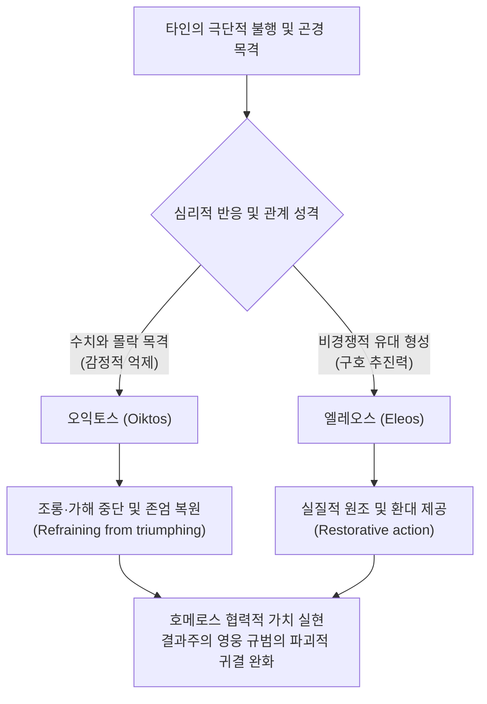

# 엘레오스와 오익토스 (Eleos & Oiktos)

**[[greek-reading-guide|읽는 법]]**: 엘레오스와 오익토스 · **원어**: ἔλεος & οἶκτος · **학술 전사**: *éleos & oîktos*

## 1. 개념 정의 및 문헌학적·도덕심리학적 위상

호메로스 서사시에서 **연민**(Pity)은 근대적 의미의 보편적 인도주의(Humanitarianism)와는 구별되는 아르카익 영웅 사회의 고유한 도덕심리학적 기제에 기반합니다. 호메로스 텍스트에서 연민은 기능과 심리적 방향성이 상이한 두 가지 희랍어 어휘군으로 분화되어 나타납니다 ([[scott-1979-pity-and-pathos|Scott 1979]]):

1. **오익토스**(Oiktos, οἶκτος, *oîktos* / 동사 οἰκτείρειν, *oikteirein* / 형용사 οἰκτρός, *oiktros*):
   - 타인의 극단적인 굴욕과 파멸(*peculiar humiliation*)을 목격할 때 일어나는 ‘**감정적 위축 및 억제(Inhibition / Shrinking back)**’입니다.
   - 승자가 [[concept-arete|아레테(Arete)]] 규범에 따라 패자를 유린하고 조롱할 수 있는 권리를 행사하지 않고, **가해를 멈추며 상대의 잃어버린 존엄 일부를 회복시켜 주는 행위**(Refraining from triumphing / Restoring dignity)로 이어집니다.
   - **[[concept-aidos|아이도스(Aidos)]]와의 차별성**: 아이도스가 '자신이 비난받을 것을 두려워하여 짓는 내적 억제'라면, 오익토스는 '타인의 참혹한 수치를 목격하고 그 처지에 전율하여 가해를 중단하는 억제'라는 점에서 주체와 대상의 구도가 다릅니다.
2. **엘레오스**(Eleos, ἔλεος, *éleos* / 동사 ἐλεαίρειν, *eleairein*, ἐλεεῖν, *eleein* / 형용사 ἐλεεινός, *eleeinos*):
   - 곤경에 처한 대상을 돕고 상황을 바로잡으려는 ‘**적극적 구호 추진력(Positive forward drive)**’입니다.
   - 적을 향해 맹렬히 돌진하는 공격적 분노인 메네아이네인(*meneainein*, μενεαίνειν / 어원 [[concept-menos|메노스, Menos, μένος]])의 대척점에서, 호의를 품고 실질적 원조와 구호를 실행합니다.

> [!WARNING] 모순/이설 발견: 호메로스 파토스(Pathos)의 성격에 관한 학설 대립
> 근대적 인본주의 비평(Schein, Schadewaldt)은 서사시 전편에 보편적 인간애적 비애감이 흐른다고 보았습니다. 반면 A. W. H. Adkins(1960)와 Mary Scott(1979)은 호메로스 사회가 결과 중심 문화(Results-culture)였음을 실증하며, 호메로스 청중의 파토스는 감상적 동정이 아니라 탁월한 귀족 전사(Agathos)가 일순간에 무력화되어 수치스러운 실패자로 전락하는 '성공의 급작스런 붕괴(Collapse of success)'를 볼 때 발생하는 자기투영적 공포에 정초했다고 규정했습니다.

---

## 2. 오익토스(Oiktos)와 엘레오스(Eleos)의 비교 매트릭스

호메로스 도덕심리학에서 두 연민 개념의 차이와 상호작용은 다음과 같이 체계화됩니다:

| 분석 층위 | 오익토스 (Oiktos, οἶκτος) | 엘레오스 (Eleos, ἔλεος) |
|:---|:---|:---|
| **심리적 본질** | 극단적 수치 목격 시의 **감정적 억제 및 위축**(Inhibition) | 곤경을 바로잡으려는 **능동적 추진력**(Forward drive) |
| **행동 양식** | 조롱·가해의 중단 및 **존엄의 부분적 복원** | 물질적·신체적 원조 및 **실질적 구호 제공** |
| **서사시 대표 장면** | [[entity-achilles\|아킬레우스]]의 [[entity-priam\|프리아모스]] 부축(_Il._ 24.515–516), 에우멜로스 위로(_Il._ 23.534–538) | 신들의 구호 개입(_Il._ 15.12, 16.431), 구혼자들의 음식 적선(_Od._ 17.367) |
| **주요 주체** | 인간 관찰자 (서사시 인간 중 아킬레우스가 유일) | 올림포스 신들([[entity-zeus\|제우스]], [[entity-apollo\|아폴론]], [[entity-poseidon\|포세이돈]]) 및 인간 |
| **대립 상태** | 승자의 오만한 조롱(*triumphing over the fallen*) | 맹렬한 파괴적 돌진(*meneainein*, μενεαίνειν) |
| **발동 조건** | 상대방의 무력화와 수치(*aischron*, αἰσχρόν) 인지 | **비경쟁적 관계**(Non-competitive / Philos)의 성립 |
| **결합 규범** | 아이도스(Aidos), 수치심 회피 | [[concept-xenia\|크세니아(Xenia)]], [[concept-hikesia\|탄원(Hikesia)]], 상호부조(*philotes*) |

---

## 3. 호메로스 서사시에서의 작동 메커니즘과 서사적 전개

### 3.1 전장에서의 엘레오스 거부와 무자비(Nēleēs)
- 경쟁적 승패가 지배하는 전장에서 적에 대한 엘레오스는 철저히 차단됩니다. 패배한 적이 목숨을 구걸하더라도, 영웅은 자신의 아레테와 전리품을 지키기 위해 자비를 베풀지 않습니다.
- **[[entity-troos|트로스]]의 탄원 거절** (_Il._ 20.463–472): 트로스는 아킬레우스에게 동년배임을 내세워 자비를 베풀어줄 것(465행: ἐλεήσας)을 탄원했으나, 아킬레우스는 마음이 유순하지도 친절하지도 않아 가차 없이 그를 처형합니다.
- **[[entity-lykaon|뤼카온]]의 탄원 거절** (_Il._ 21.74–114): 뤼카온은 과거 아킬레우스와 식사를 함께했고 몸값을 치러주었던 인연을 들어 필로스(*philos*) 관계를 호소했으나, 친구 [[entity-patroklos|파트로클로스]]를 잃은 아킬레우스의 거대한 맹위(Menos) 앞에서 거부당합니다:
  - *"친구여(ἀλλά, φίλος), 그대 또한 죽어야 한다. 왜 이리 비탄에 젖어 있는가? 파트로클로스 또한 죽었으니, 그는 그대보다 훨씬 뛰어난 사람이었다."* (_Il._ 21.106–107)
  - **[주석]**: 여기서 아킬레우스가 부르는 *philos*(친구여)는 제도적 환대 관계의 인정을 뜻하는 것이 아니라, 불가피한 죽음의 보편성 앞에 선 필멸자 전체를 향한 냉혹하고 비극적인 실존적 호격입니다.

### 3.2 비경쟁적 지반(Non-competitive Ground)의 형성과 엘레오스의 발동
- 엘레오스가 적대적 타자에게 발동하기 위해서는 반드시 ‘**경쟁을 초월한 공통의 지반(Bond of common ground)**’이 마련되어야 합니다 ([[scott-1979-pity-and-pathos|Scott 1979]]).
- 『**일리아스**』 **24권: 프리아모스와 아킬레우스의 화해**:
  - 프리아모스는 아들의 살해자 발치에 엎드려 손에 입을 맞추는 극한의 탄원 의례(Hikesia)를 행하며, 아킬레우스의 늙은 아버지 [[entity-peleus|펠레우스]]를 상기시킵니다 (_Il._ 24.503–504).
  - 이 탄원은 신들의 중재(제우스의 전언 및 테티스의 권고)와 결합하여, 두 사람을 '전쟁의 적대자'에서 '가장 소중한 이를 잃고 노쇠해가는 필멸자 인간'이라는 공통의 지평으로 전환시킵니다.
  - 두 사람이 함께 눈물을 흘리며 슬픔을 나눈 뒤(507행: *himeron ōrse gooio*), 아킬레우스는 비로소 자리에서 일어나 노인을 손수 부축하며 오익토스(516행: *oikteirōn*)를 발동하고, 엘레오스(Eleos)를 통해 헥토르의 시신을 인도하며 12일간의 장례 휴전을 약속합니다 ([[lee-junseok-2024-iliad-jeongam|이준석 2024]], [[zanker-1994-heart-of-achilles|Zanker 1994]]).

### 3.3 손님 환대(Xenia)와 사회적 자비
- 전통적 손님 환대(Xenia)는 동등한 계층 간의 상호부조가 기본이지만, 엘레오스는 “**환대를 되갚을 경제적 능력이 전혀 없는 극빈자나 거지**”에게도 최소한의 생존 자원을 나누어주게 만드는 규범적 동기가 됩니다.
- 『오뒷세이아』 17권에서 구혼자들은 거지로 변장한 [[entity-odysseus|오디세우스]]를 불쌍히 여겨(*eleairontes*, _Od._ 17.367) 빵을 나누어줍니다.
- 비록 이 적선이 아테나 여신이 구혼자들의 의로움과 불의함을 시험하기 위해 유도한 서사적 장치(_Od._ 17.360–364)였을지라도, 텍스트는 엘레오스가 평시 사회에서 사회적 약자에게 작동하는 최소한의 자비 기제임을 실증합니다.

### 3.4 올림포스 신들의 초연함과 연민(Pity)의 공존: 관객석의 신들과 인간 비극의 심연
- 에밀리 컨스([[kearns-2006-gods-in-homeric-epics|Kearns 2006]])가 분석하듯, *일리아스*의 신들은 인간들의 고투를 올림포스에서 내려다보며 "한낱 필멸자들 때문에 우리가 다툴 필요가 없다"(*Il.* 1.573–576, 21.462–467)는 경멸에 가까운 초연함을 보이지만, 동시에 인간 존재의 필멸적 취약성에 대해 깊은 연민(Pity)을 드러냅니다.
- 제우스는 신들의 전장 개입을 허용하면서도 "비록 필멸자일지라도 나는 그들이 파멸해 가는 것을 돌보노라(*mélousí moi ollúmenoí per*, *Il.* 20.21)"라고 독백하며, 헥토르의 시신이 능욕당할 때 완고한 친아카이아계 여신들을 제외한 모든 신이 연민을 느낍니다(*Il.* 24.23–26).
- 이러한 신적 연민은 도덕적 정의보다는 신들의 압도적 우월성(힘과 영속성)에서 우러나오는 감정으로, 신들의 불멸하는 무상함과 대비되어 인간 영웅들의 비극적 파토스를 최고조로 끌어올리는 시학적 대비 장치로 기능합니다.
- **관객석의 신들과 신적 행복의 잔혹성** ([[lee-taesoo-2020-gods-in-audience|이태수 2020]]):
  - 이태수 교수는 신들이 인간의 전쟁을 마치 스포츠 경기나 검투사 시합처럼 관람하며 '꺼지지 않는 웃음(*asbestos gelos*)'을 터뜨리는 구조를 분석했습니다.
  - 신들의 연민은 극장 관객이 무대 위 비극을 보며 흘리는 눈물처럼, 자신의 절대적 안전과 불멸성이 보장된 자리에서 일시적으로 감상하는 심미적 연민일 뿐입니다. 신들의 행복은 인간의 고통을 노래로 감상하는 데서 완성되며, 신들의 이 냉혹한 초연함이야말로 인간이 필멸의 운명 속에서 서로를 불쌍히 여기며 구축하는 비극적 영웅주의의 절대적 대조면이 됩니다.
- **신적인 조건(conditio divina)과 인간적인 조건(conditio humana)의 심연** ([[cho-daeho-2007-gods-in-iliad|조대호 2007]]):
  - 조대호 교수는 고통을 모르는 복된 신들의 희극판(신들의 5대 이율배반성) 위에서만 필멸하는 인간의 비극성이 온전한 윤곽을 드러낸다고 논증했습니다.
  - 『일리아스』 24권에서 아킬레우스가 프리아모스를 맞이하여 분노를 거두고 연민을 회복하는 화해는, 신들의 자의적이고 불가해한 세계 질서(두 개의 항아리 비유)를 직시하고 유한한 인간끼리 나누는 숭고한 연대의 정점입니다.
- **허무의 자각과 연민의 연대** ([[kim-han-2013-ilias-homeric-gods|김한 2013]], [[kim-han-2019-gods-zeus-moira-and-god|2019]]):
  - 김한 교수는 맹목적 자연력과 운명(Moira)의 지배 앞에서 전리품과 불멸의 명성([[concept-kleos|Kleos]])을 추구하던 영웅주의가 허무를 통찰하고 실존적 연민(Eleos)으로 나아가는 궤적을 규명했습니다.
  - 아킬레우스와 프리아모스가 흘린 눈물은 운명의 폭력 앞에 내맡겨진 동료 인간에 대한 비극적 연대이자, 호메로스가 서양 정신사에 남긴 가장 위대한 '인간화된 세계(A Humanized World)'의 징표입니다.

---

## 4. 고전기 도덕철학 및 비극론으로의 전개

1. **아리스토텔레스 비극론과의 연계 및 개념사적 전환**:
   - 아리스토텔레스는 『시학』(Poetics, 1453a)에서 비극의 목적을 ‘**공포(Phobos)와 연민(Eleos)을 통한 카타르시스(Katharsis)**’로 규정했습니다.
   - 호메로스 서사시의 엘레오스가 '탁월한 영웅([[word-agathos|Agathos]])의 급작스러운 성공 붕괴'를 볼 때 느끼는 자기투영적 공포에 기반했다면, 아리스토텔레스의 엘레오스는 '받을 자격이 없는 자가 당하는 부당한 불행(Anaxion dystychounta)'이라는 도덕적 자격 규범으로 정식화되는 개념사적 발전을 거쳤습니다.
2. **협력적 가치의 지위 복원**:
   - A. W. H. 애드킨스([[adkins-1960-merit-and-responsibility|Adkins 1960]])는 호메로스 사회에서 경쟁적 가치만이 행동을 강제했다고 주장했으나, 메리 스콧([[scott-1979-pity-and-pathos|Scott 1979]], [[scott-1980-aidos-and-nemesis|1980]], [[scott-1982-philos-philotes-xenia|1982]])의 연구는 **오익토스, 엘레오스, 아이도스, [[concept-nemesis|네메시스(Nemesis)]], 크세니아**가 결합하여 영웅 사회 내부에서 비경쟁적·사회적 질서를 확고하게 지탱했음을 밝혔습니다.

---

## 5. 핵심 원전 인용

- "전장에서 젊은이가 날카로운 청동 창에 찔려 죽어 누워있는 것은 모든 면에서 어울리고 아름답다(πάντα δὲ καλὰ). 그가 죽었을지라도 보이는 모든 것이 아름답기 때문이다. 그러나 개들이 죽임을 당한 노인의 센 머리와 센 수염과 치부(αἰδῶ)를 더럽힐 때, 이것이야말로 가련한 필멸자들에게 가장 비참하고 수치스러운(τοῦτο δὴ οἴκτιστον) 일이다."
  - **[출전]**: 호메로스, 『일리아스』 22권 71–76행 (프리아모스의 절규)
  - **[주석]**: 75행의 *aidōs*(성기/치부) 훼손이 76행의 *oiktiston*(가장 비참함)과 직접 호응하며, 오익토스가 영웅적 존엄의 완전한 파괴와 극단적 수치심에서 격발되는 감정임을 증명합니다.

- "신들을 두려워하십시오(ἀλλ’ αἰδεῖο θεούς), 아킬레우스여! 그리고 당신 자신의 아버지를 생각하여 나를 불쌍히 여기십시오(ἐλέησον). 나는 그보다 훨씬 더 가련합니다(ἐλεεινότερος). 세상의 어떤 필멸자도 감당하지 못한 일을 나는 감내하여, 내 자식들을 죽인 자의 손에 입을 맞추고 있으니까요."
  - **[출전]**: 호메로스, 『일리아스』 24권 503–506행 (프리아모스의 탄원)
  - **[주석]**: 탄원 의례 속에서 신에 대한 경외(*aideio*)와 자비(*eleēson*)가 결합하여, 가장 냉혹한 전사의 적대적 분노를 멈추고 필멸자 간의 화해를 이끌어내는 정점입니다.

---

## 관련 항목

### 핵심 인물 및 신
- [[entity-achilles|아킬레우스 (Achilles)]] — 헥토르 시신을 유린하다 24권에서 오익토스와 엘레오스를 회복하는 비극적 영웅
- [[entity-priam|프리아모스 (Priam)]] — 아들의 살해자 발치에 엎드려 공통의 필멸성 연대를 이끌어낸 트로이의 노왕
- [[entity-peleus|펠레우스 (Peleus)]] — 아킬레우스의 부친, 프리아모스와의 공통된 노년의 취약성을 환기하는 매개자
- [[entity-patroklos|파트로클로스 (Patroklos)]] — 아킬레우스의 가장 소중한 전우, 그의 죽음이 전장의 자비를 전면 차단함
- [[entity-lykaon|뤼카온 (Lykaon)]] — 전장에서 필로테스를 호소했으나 냉혹한 죽음의 평등관 앞에서 처형된 왕자
- [[entity-troos|트로스 (Tros)]] — 동년배임을 내세워 엘레오스를 구했으나 거절당한 트로이 전사
- [[entity-odysseus|오디세우스 (Odysseus)]] — 거지로 변장하여 구혼자들의 잠재적 엘레오스와 파렴치함을 시험한 영웅
- [[entity-zeus|제우스 (Zeus)]] — 고통받는 영웅과 탄원자를 굽어보며 엘레오스를 베푸는 올림포스 최고의 신
- [[entity-apollo|아폴론 (Apollo)]] — 아킬레우스의 시신 능욕에 분노하여 헥토르를 보호하는 신

### 관련 윤리·도덕 개념
- [[concept-aidos|아이도스 (Aidos)]] — 수치심과 경외, 오익토스와 짝을 이루는 내적 억제 기제
- [[concept-nemesis|네메시스 (Nemesis)]] — 응당한 몫의 질서를 수호하는 공적 의분
- [[concept-hikesia|히케시아 (Hikesia)]] — 신체 접촉과 경외에 기초한 신성 탄원 의례
- [[concept-xenia|크세니아 (Xenia)]] — 손님 환대와 극빈자 자비의 사회적 규범
- [[concept-agathos|아가토스 (Agathos)]] — 군사적 무용과 성공의 귀족 규범 및 [[word-agathos|Agathos 어원 사전]]
- [[concept-kakos|카코스 (Kakos)]] — 무능과 실패의 비난어, 아가토스의 반의어
- [[concept-menos|메노스 (Menos)]] — 공격적 격분의 원동력, 엘레오스의 대척점
- [[concept-cholos|콜로스 (Cholos)]] — 인간적 분노와 적대적 격정
- [[concept-menis|메니스 (Menis)]] — 신적 분노와 우주적 파괴력
- [[concept-arete|아레테 (Arete)]] — 영웅적 탁월성과 무용

### 호메로스 어원 및 영단어 사전
- [[word-eleos|Eleos (ἔλεος) — 현대 영단어 어원 및 수용사 (Alms / Eleemosynary / Almoner)]]
- [[word-agathos|Agathos (ἀγαθός) — 현대 영단어 어원 및 수용사]]

### 주요 연구 문헌 및 종합 분석
- [[scott-1979-pity-and-pathos|메리 스콧 (1979) 호메로스에서의 연민과 파토스]] — 오익토스/엘레오스 도덕심리학 표준 연구
- [[scott-1980-aidos-and-nemesis|메리 스콧 (1980) 아이도스와 네메시스]] — 감정적 위축과 신적 제재
- [[scott-1981-some-greek-terms|메리 스콧 (1981) 비경쟁적 어휘 연구]] — 아가노스·메일리코스·케도스·피스토스 분석
- [[scott-1982-philos-philotes-xenia|메리 스콧 (1982) 필로스, 필로테스, 크세니아]] — 긴장 완화와 상호부조망
- [[adkins-1960-merit-and-responsibility|애드킨스 (1960) 공적과 책임]] — 결과 중심 문화와 경쟁적 가치
- [[lee-junseok-2024-iliad-jeongam|이준석 (2024) 정암학당 일리아스 강좌]] — 24권 화해와 프리아모스 탄원 해제
- [[lee-junseok-2018-wrath-and-pity|이준석 (2018) 분노의 서사시, 연민의 서사시 일리아스]] — 피아를 초월하는 동일화 시학
- [[zanker-1994-heart-of-achilles|잰커 (1994) 아킬레우스의 마음]] — 개인적 윤리와 비극적 연민의 발전
- [[cairns-1993-aidos|케언스 (1993) 아이도스]] — 고대 그리스 도덕심리학
- [[kearns-2006-gods-in-homeric-epics|에밀리 컨스 (2006) 호메로스 서사시의 신들]] — 올림포스 신들의 초연함과 필멸 인간 조건에 대한 연민(Pity) 분석
- [[lee-taesoo-2020-gods-in-audience|이태수 (2020) 호메로스의 신들 — 관객석의 신들]] — 인간의 고통을 노래로 감상하는 신적 행복과 냉혹한 초연함 분석
- [[cho-daeho-2007-gods-in-iliad|조대호 (2007) 일리아스의 신들]] — conditio divina의 희극과 conditio humana의 비극, 두 개의 항아리와 24권 화해 분석
- [[kim-han-2013-ilias-homeric-gods|김한 (2013) 일리아스에 나타난 호메로스의 신들]] — 맹목적 자연력과 신들의 도덕적 무관심 대 인간의 실존적 용기와 연민
- [[kim-han-2019-gods-zeus-moira-and-god|김한 (2019) 호메로스의 신들, 제우스, 모이라이와 성서의 하나님]] — 운명의 폭력 앞에 선 아킬레우스-프리아모스의 비극적 연민의 연대 분석
- [[analysis-homeric-ethics-literature-review|호메로스 윤리학 종합 분석]] — 19종 연구 소스 및 패러다임 총괄 리포트
