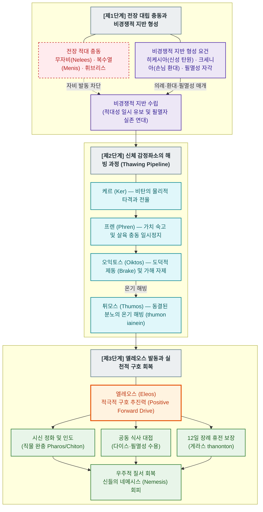

# 엘레오스 (Eleos)

**[[greek-reading-guide|읽는 법]]**: 엘레오스 · **원어**: ἔλεος · **학술 전사**: *éleos*

## 1. 정의와 핵심 테제 (Definition & Core Thesis)

### 1.1 핵심 정의
호메로스 서사시에서 **엘레오스**(ἔλεος, *éleos*; 관용 라틴명 Eleos)는 곤경에 처한 대상을 돕고 파탄 난 상황을 능동적으로 시정하려는 '**적극적 구호 추진력**'(Positive forward drive)입니다 ([[scott-1979-pity-and-pathos|Scott 1979]]).

엘레오스는 적을 향해 저돌적으로 돌진하는 파괴적 공격 충동인 **메네아이네인**(*meneaínein*, μενεαίνειν)의 대척점에서 작동하며, 타자에게 호의를 품고 다가가 시신 반환, 식사 대접, 장례 휴전 보장, 물질적 구제 등 **실질적인 회복 행동**(Restorative action)을 단행합니다. 타인의 처참한 실패를 보았을 때 조롱을 멈추고 가해를 자제하는 소극적 억제 감정인 [[concept-oiktos|오익토스]](Oiktos)를 관문 삼아, 엘레오스는 비경쟁적 지반(Non-competitive ground) 위에서 파괴된 공동체적 유대를 복원하는 궁극적 실천력으로 만개합니다.

### 1.2 연구사적 4 대 핵심 명제
1. **비경쟁적 지반(Non-competitive Ground) 형성을 통한 협력적 가치의 복원** ([[scott-1979-pity-and-pathos|Scott 1979]]):
   경쟁적 승패가 절대적인 전장에서는 적에 대한 엘레오스가 철저히 차단됩니다. 엘레오스가 적대적 타자에게 발동하기 위해서는 반드시 손님 환대([[concept-xenia|Xenia]]), 탄원([[concept-hikesia|Hikesia]]), 또는 공통의 유한성을 환기하는 '**비경쟁적 관계**'(Non-competitive relationship)가 선행 형성되어야 합니다.
2. **올림포스 신들의 신정론적 개입과 우주적 질서 수호** ([[lloyd-jones-1971-justice-of-zeus|Lloyd-Jones 1971]], [[kearns-2006-gods-in-homeric-epics|Kearns 2006]]):
   인간 관찰자의 내적 억제에 집중되는 오익토스와 달리, 엘레오스는 올림포스 신들(제우스, 아폴론, 아테나)의 핵심 행동 동기입니다. 신들은 고통받는 의로운 자를 구원하고, 시신 능욕이라는 과도한 잔혹성에 대해 신적 의분([[concept-nemesis|Nemesis]])을 표출하며 엘레오스를 강제합니다.
3. **외적 결과주의의 극복과 도덕적 행위주체성의 도약** ([[zanker-1994-heart-of-achilles|Zanker 1994]], [[williams-1993-shame-and-necessity|Williams 1993]]):
   군사적 성공만이 최고의 가치라는 애드킨스식 편견과 달리, 타자의 취약성에 응답하여 살해 권능을 자제하고 자비를 베푸는 것은 나약함이 아니라 고결한 도덕적 품격의 발현입니다. 영웅은 복수와 명예의 맹목적 충동 속에서도 타인의 처지를 가치 평가적으로 헤아리고 자비를 결단함으로써 진정한 **도덕적 행위주체성**(Moral Agency)을 성취합니다.
4. **분노(Menis)에서 연민(Eleos)으로의 승화와 실존적 비극성** ([[lee-junseok-2018-wrath-and-pity|이준석 2018]], [[kim-han-2019-gods-zeus-moira-and-god|김한 2019]]):
   『일리아스』 전체의 서사적 궤적은 파괴적 신적 분노([[concept-menis|Menis]])에서 화해의 연민(Eleos)으로 나아가는 치밀한 시학적 전환입니다. 24 권에서 아킬레우스가 프리아모스와 함께 눈물을 흘리며 도달하는 엘레오스는 사적 복수심을 초월하여 유한한 필멸자의 비극적 운명 조건(Condicio humana)을 공유하는 숭고한 실존적 연대입니다.

---

## 2. 어원과 형태론 (Etymology & Morphology)

### 2.1 비교언어학적 기원과 음운론적 분석
- **비-인도유럽어 기층어 가설과 표현론적 어휘**:
  - 로베르트 베이케스(R. Beekes 2010, *EDG*, pp. 407–408), 피에르 샹트렌(P. Chantraine 1968, *DELG*, p. 334), 얄마르 프리스크(H. Frisk, *GEW* 1.485)에 따르면, 엘레오스는 확고한 인도유럽조어(PIE) 어근이나 인도-이란·라틴·게르만 동계어가 존재하지 않습니다. 율리우스 포코르니(Pokorny, *IEW* 306)가 제안한 어근 `*el-` / `*elei-`('구부리다, 몸을 굽히다') 가설은 역사음운론적 근거가 결여된 사후적 억측으로 판정됩니다.
  - 베이케스(Beekes)는 중성 s-어간(τὸ ἔλεος)과 남성 o-어간(ὁ ἔλεος)의 어간 혼재, 불규칙한 파생 접미사 형성을 근거로 에게해 비-인도유럽어계 **선희랍 기층어**(Pre-Greek substrate) 차용어로 규정합니다.
  - 샹트렌(Chantraine)과 프리스크(Frisk)는 비탄과 전율의 탄식 구호인 감탄사 **ἐλελεῦ**(*eleleû*)에서 유래한 **표현론적·의성어적 어휘**(Mot expressif)의 가능성에 더 큰 비중을 둡니다.
- **오익토스(Oiktos)와의 어원론적 대비**:
  - **ἔλεος**가 외부의 구호 요청에 응답하여 물질적·사회적 곤경을 타개하려는 '외재적 구호 실천 어휘'라면, **οἶκτος**는 고대 그리스어 고유의 비탄 감탄사 `οἲ`(*oi*, "아아!")에서 파생된 순수 의성적 탄식어로 타자의 참혹한 몰락을 눈앞에서 본 관찰자의 신체적 전율과 '내적 위축·가해 억제'를 나타냅니다.

### 2.2 핵심 어휘 4 열 형태론 분리 표

| 그리스어 실제형 | 학술 전사 | 품사 및 형태론 | 의미 및 문헌학적 맥락 |
|:---|:---|:---|:---|
| **ἔλεος** | *éleos* | 중성 명사, s-어간 주격·대격 단수 | 연민, 긍휼, 구호 의지. 선희랍 기층어(Pre-Greek) 유래 추정. 고전기에는 남성 o-어간(ὁ ἔλεος)과 혼재. |
| **ἐλεαίρω** | *eleaírō* | 동사 (*-ar-yō 파생, 서사시에는 미완료·분사형만 출현) | 불쌍히 여기다, 측은히 보다. 미완료 지속상(*ēléairon*, *eleaírōn*)으로 타자를 향한 지속적 호의 상태 표명. |
| **ἐλεέω** | *eleéō* | 동사 (명사 유래 계약동사, *-e-yō) | 자비를 베풀다, 구제하다. 서사시에서는 주로 부정과거(Aorist) 형태로 출현하여 구호 결단을 표상. |
| **ἐλεήσας** | *eleḗsas* | 남성 분사 능동 부정과거 주격 단수 | 불쌍히 여겨, 자비를 베풀어. 전장에서 살려줌(*zōgreîn*)을 결단하는 일회적·기동적 상 (_Il._ 20.465). |
| **ἐλέησον** | *eléēson* | 2 인칭 단수 능동 부정과거 명령형 | 자비를 베푸소서. 탄원자([[concept-hikesia\|Hikesia]])가 즉각적이고 능동적인 구호 행동을 촉구하는 공식구 (_Il._ 24.503). |
| **ἐλέησε(ν)** | *eléēse(n)* | 3 인칭 단수 능동 부정과거 직설법 | 불쌍히 여겼다. 제우스 등 올림포스 신들이 필멸자의 곤경에 개입하여 구호를 단행하는 신정론적 술어 (_Il._ 15.12, 17.441). |
| **ἐλεεινός** | *eleeinós* | 남성 형용사 주격 단수 (*eleh-es-no-) | 가련한, 비참한. 헥사메테론 운율 연장형(diektasis). 탄원자나 조난자의 객관적 처지 수식. |
| **ἐλεεινότερος** | *eleeinóteros* | 남성 형용사 비교급 주격 단수 | 더욱 가련한. 『일리아스』 24.504 에서 프리아모스가 펠레우스보다 더 비극적인 처지임을 호소. |
| **ἐλεητύς** | *eleētús* | 여성 명사 주격 단수 (*-tys 추상·동작 접미사) | 불쌍히 여김, 자비심. 대격 *eleētún*으로 구혼자들의 비정함을 고발하는 호메로스 하팍스 레고메논 (_Od._ 14.82). |
| **ἐλεήμων** | *eleḗmōn* | 남성/여성 형용사 주격 단수 (*-mōn 속성 접미사) | 자비로운, 동정심 있는. 칼륍소가 자신의 마음이 무쇠가 아님을 맹세할 때 쓰인 호메로스 하팍스 (_Od._ 5.191). |
| **νηλεής** | *nēleḗs* | 남성/여성 형용사 주격 단수 (*nē-* + *eleos* 복합어) | 무자비한, 냉혹한. 전장의 살육 규범과 탄원을 거절하는 전사의 심장을 수식하는 고졸기 정형구 (_Il._ 21.98). |
| **ἐλεημοσύνη** | *eleēmosýnē* | 여성 추상명사 주격 단수 (*-mosynē 복합 접미사) | 자선, 구제 행위. **호메로스 미출현**(헬레니즘기 칠십인역 초출). 현대 영단어 *alms*의 조어. |

---

## 3. 호메로스 서사시 본문 용례와 맥락 (Homeric Attestation & Contexts)

### 3.1 양대 서사시 출현 빈도 및 신-인간 공통 분포
- 호메로스 텍스트에서 엘레오스는 인간 관찰자뿐만 아니라 **올림포스 신들의 행동을 규정하는 최고 원리**입니다.
  1. **올림포스 신들의 구호 개입과 상(Aspect)의 대립**: 『오뒷세이아』 1권 19–21행에서 모든 신이 오디세우스를 불쌍히 여긴 미완료 지속상 **`ἐλέαιρον`**(*ēléairon*)과, 홀로 분노를 멈추지 않은 포세이돈의 미완료형 **`μενέαινεν`**(*menéainen*)의 문법적 대립은 엘레오스가 메노스(Menos)의 파괴성을 제어하는 우주적 질서의 축임을 입증합니다.
  2. **무자비(Nēleēs)와의 원초적 갈등**: 접두사 *nē-*가 결합된 형용사 *nēleēs*는 적의 탄원을 기각하고 도륙하는 전사의 냉혹함을 상징하며, 서사시는 이 무자비가 어떻게 엘레오스로 극복되는지를 추적합니다.
- **신정론적 엘레오스의 3중 층위**:
  1. **필멸자 전체를 향한 존재론적 연민**: _Il._ 17.441–447 (불사마를 보며 인간 조건 전체를 탄식하는 제우스).
  2. **의로운 자를 구원하는 능동적 개입**: _Il._ 15.12–14 (피를 토하는 헥토르를 보며 즉각 아폴론을 파견하는 제우스), _Il._ 19.340–354 (단식하는 아킬레우스에게 아테나를 보내 넥타르를 주입하는 제우스).
  3. **운명(Moira)과 신적 감정의 비극적 충돌**: _Il._ 16.431–438 (아들 사르페돈을 살리고 싶으나 모이라의 우주 질서 앞에서 탄식하며 눈물을 흘리는 제우스).

### 3.2 『일리아스』에서의 용례 맥락: 경쟁적 전장의 거절과 비경쟁적 화해
- **경쟁적 전장에서의 엘레오스 원천 차단**:
  - 무공과 전리품을 다투는 전장에서는 적의 자비 탄원이 철저히 기각됩니다.
  - 트로스(_Il._ 20.463–472)는 아킬레우스의 무릎으로 다가와 동년배임을 내세워 엘레오스(*eleḗsas*)를 구했으나, 아킬레우스의 맹렬한 분노(*emmemaṓs*)에 칼로 간을 찔려 즉사했습니다.
  - 뤼카온(_Il._ 21.74–114)은 과거 빵을 나눈 인연과 필로스를 호소했으나, 파트로클로스의 전사 이후 아킬레우스의 거대한 무자비(*nēleēs*) 앞에서 처형되었습니다.
  - 아드라스토스(_Il._ 6.37–65)의 몸값 탄원에 메넬라오스의 마음이 흔들리자, 아가멤논은 달려와 "트로이아 사내들은 어머니 뱃속의 태아까지 단 한 명도 파멸을 면치 못해야 한다"며 직접 창으로 찔러 죽였고, 시인은 이를 "합당한 충고(*aísima pareipṓn*)"로 긍정했습니다.
- **서사시의 클라이맥스: 24 권 화해와 실천적 구호**:
  - 프리아모스의 탄원(_Il._ 24.503–516)은 신에 대한 경외(*aidos*)와 연민(*eleos*)을 결합하여 늙은 부친 펠레우스라는 공통의 취약성을 환기합니다. 
  - 함께 눈물을 흘리며 슬픔의 갈망(*hímeron góoio*)을 해소한 뒤, 아킬레우스는 오익토스로 노인을 손수 일으켜 세운 것에 그치지 않고, 헥토르의 시신을 정갈하게 씻겨 인도하고 12일간의 장례 휴전을 보장하는 완전한 엘레오스의 실천을 완성합니다.

### 3.3 『오뒷세이아』에서의 용례 맥락: 신정론, 환대(Xenia), 그리고 무해한 자의 사면
- **신정론적 자비**:
  - 『오뒷세이아』에서 신들의 엘레오스는 고통받는 의로운 자를 향한 우주적 구호로 작동합니다(_Od._ 1.19, 5.336).
- **손님 환대(Xenia)와 사회적 약자 보호**:
  - 전통적 크세니아가 동등한 귀족 간의 호혜적 계약이라면, 엘레오스는 보답할 자원이 전무한 거지나 나그네에게도 음식을 나누어주게 만드는 최소한의 자비 규범입니다(_Od._ 17.367–368).
- **학살 현장에서의 비경쟁적 사면**:
  - 구혼자 학살 중 음유시인 페미오스(_Od._ 22.344–356)와 전령 메돈은 권력 경쟁에 가담하지 않은 비경쟁적 무해성(*anaítion*)이 텔레마코스에 의해 입증됨으로써 탄원 공식구를 통해 유일하게 생환합니다.

---

## 4. 개념 상호작용과 가치망 (Conceptual Network & Polarity)

엘레오스는 전장의 파괴적 살육 충동과 충돌하며, 비경쟁적 지반 위에서 실질적인 구호와 문명적 연대를 산출하는 동역학적 네트워크를 형성합니다.

---

## 5. 주요 서사 에피소드 정밀 주해 (Signature Epic Episodes)

### 5.1 프리아모스의 아킬레우스 탄원: 신성한 자비 간청 (_Il._ 24.503–506)

- **선정 장면**: 호메로스 서사시의 감정적 정점. 아들의 시신을 찾기 위해 적장의 막사로 잠입한 노왕 프리아모스가 아킬레우스의 무릎을 잡고 손에 입 맞추며 자비를 간청하는 장면.
- **본문 강독 및 해제**:
  - **번역**: "신들을 두려워하십시오, 아킬레우스여! 그리고 당신 자신의 아버지를 생각하여 나를 불쌍히 여겨주소서. 나는 그보다 훨씬 더 가련합니다. 세상의 어떤 필멸자도 감당하지 못한 일을 나는 감내하여, 내 자식들을 죽인 자의 손을 입술에 대고 있으니까요."
  - **원문**: ἀλλ᾽ αἰδεῖο θεούς, Ἀχιλεῦ, αὐτόν τ᾽ ἐλέησον / μνησάμενος σοῦ πατρός· ἐγὼ δ᾽ ἐλεεινότερός περ, / ἔτλην δ᾽ οἷ᾽ οὔ πώ τις ἐπιχθόνιος βροτὸς ἄλλος, / ἀνδρὸς παιδοφόνοιο ποτὶ στόμα χεῖρ᾽ ὀρέγεσθαι.
  - **학술 전사**: *all’ aideîo theoús, Akhileû, autón t’ eléēson / mnēsámenos soû patrós; egṑ d’ eleeinóterós per, / étlēn d’ hoî’ oú pṓ tis epikhthónios brotòs állos, / andròs paidophónoio potì stóma kheîr’ orégesthai.*
- **문헌학적·서사학적 함의**:
  - **신에 대한 경외와 엘레오스의 소환**: 프리아모스는 신에 대한 경외(*aideîo theoús*)와 아오리스트 명령형 자비 간청(*eléēson*)을 결합하여, 늙은 부친 펠레우스를 매개로 '필멸자 인간의 공통된 비극'이라는 비경쟁적 지반을 창출합니다.
  - **엘레오스의 능동적 결단 촉구**: 단순한 비탄의 동조를 넘어, 억류된 아들의 시신을 돌려달라는 적극적 구호 결단을 촉구하는 핵심 호메로스 탄원 공식구입니다.

---

### 5.2 전장에서의 무자비(Nelees)와 뤼카온 탄원 거절 (_Il._ 21.74–75, 106–110)

- **선정 장면**: 스카만드로스 강변에서 무방비로 마주친 뤼카온의 구명 탄원과, 친구를 잃고 살육의 광기에 휩싸인 아킬레우스의 냉혹한 거절.
- **본문 강독 및 해제**:
  - **번역**: "무릎 꿇고 간청합니다, 아킬레우스여! 나를 존중하시고 나를 불쌍히 여겨주소서. 제우스의 보살핌을 받는 분이여, 나는 당신에게 존중받아야 마땅한 탄원자와 다름없습니다. ... 그러나 친구여, 그대 또한 죽어야 한다. 왜 이리 비탄에 젖어 있는가? 파트로클로스 또한 죽었으니, 그는 그대보다 훨씬 뛰어난 사람이었다. 그대는 보지 못하는가, 나 또한 얼마나 잘생기고 거대한지? 나는 훌륭한 아버지의 아들이며, 여신께서 나를 낳으셨다. 그러나 내 위에도 죽음과 억센 운명이 드리워져 있다."
  - **원문**: γουνοῦμαί σ᾽, Ἀχιλεῦ· σὺ δέ μ᾽ αἴδεο καί μ᾽ ἐλέησον· / ἀντί τοί εἰμ᾽ ἱκέταο, διοτρεφές, αἰδοίοιο· / ... / ἀλλά, φίλος, θάνε καὶ σύ· τίη ὀλοφύρεαι οὕτως; / κάτθανε καὶ Πάτροκλος, ὅ περ σέο πολλὸν ἀμείνων. / οὐχ ὁράᾳς οἷος κἀγὼ καλός τε μέγας τε; / πατρὸς δ᾽ εἴμ᾽ ἀγαθοῖο, θεὰ δέ με γείνατο μήτηρ· / ἀλλ᾽ ἔπι τοι καὶ ἐμοὶ θάνατος καὶ μοῖρα κραταιή.
  - **학술 전사**: *gounoûmaí s’, Akhileû; sù dé m’ aídeo kaí m’ eléēson; / antí toí eim’ hikétao, diotrephés, aidoíoio; / ... / allá, phílos, tháne kaì sú; tíē olophúreai hoútōs; / kátthane kaì Pátroklos, hó per séo pollòn ameínōn. / oukh horáāis hoîos kagṑ kalós te mégas te; / patròs d’ eím’ agathoîo, theà dé me geínato mḗtēr; / all’ épi toi kaì emoì thánatos kaì moîra krataiḗ.*
- **문헌학적·서사학적 함의**:
  - **경쟁적 전장의 무자비**: 전장에서는 엘레오스가 철저히 봉쇄됩니다. 뤼카온은 과거 식사를 나눈 인연과 탄원자의 지위(*antí toi eim' hikétao*)를 호소했으나, 파트로클로스를 잃은 아킬레우스에게는 오직 절대적 무자비(*nēleēs*)만이 작동합니다.
  - **보편적 죽음의 선고**: 아킬레우스가 뤼카온을 "친구여(*phílos*)"라고 부른 것은 사적 환대가 아니라, 피할 수 없는 죽음의 평등성 앞에 선 모든 필멸자를 향한 서늘한 실존적 호격입니다.

---

### 5.3 아폴론의 네메시스 경고와 엘레오스 상실 고발 (_Il._ 24.44–45, 53–54)

- **선정 장면**: 헥토르의 시신을 전차에 매달아 끌고 다니며 모욕하는 아킬레우스를 향해 올림포스 신들의 회의에서 아폴론이 격분하는 장면.
- **본문 강독 및 해제**:
  - **번역**: "이처럼 아킬레우스는 연민(엘레오스)을 없애버렸고, 사람들에게 큰 해를 끼치기도 하고 도움을 주기도 하는 수치심(아이도스)마저 그에게는 없소. ... 그가 아무리 용맹하다 할지라도 우리가 그에게 네메시스를 품지 않도록 조심해야 할 것이오. 그가 미쳐 날뛰며 말 못하는 흙(시신)을 욕보이고 있으니 말이오."
  - **원문**: ὣς Ἀχιλεὺς μὲν ἀπώλεσεν ἔλεον, οὐδέ οἱ αἰδὼς / γίγνεται, ἥ τ᾽ ἄνδρας μέγα σίνεται ἠδ᾽ ὀνίνησι. / ... / μὴ ἀγαθῷ περ ἐόντι νεμεσσηθέωμέν οἱ ἡμεῖς· / κωφὴν γὰρ δὴ γαῖαν ἀεικίζει μενεαίνων.
  - **학술 전사**: *hō̂s Akhileùs mèn apṓlesen éleon, oudé hoi aidṑs / gígnetai, hḗ t’ ándras méga sínetai ēd’ onínēsi. / ... / mḕ agathō̂i per eónti nemessēthéōmén hoi hēmeîs; / kōphḕn gàr dḕ gaîan aeikízei meneaínōn.*
- **문헌학적·서사학적 함의**:
  - 아폴론은 아킬레우스의 내면에서 엘레오스가 완전히 파괴되었음을 선언합니다. 시신을 '말 못하는 흙'으로 능욕하는 행위는 올림포스 신들의 공적 의분([[concept-nemesis|Nemesis]])을 촉발하며, 신들이 개입하여 시신 반환을 명하는 종교적 근거가 됩니다.

---

### 5.4 필멸자 전체를 향한 제우스의 탄식과 엘레오스 (_Il._ 17.441–447)

- **선정 장면**: 파트로클로스의 전사 앞에서 눈물 흘리는 불사마(Xanthos & Balios)를 내려다보며 탄식하는 최고신 제우스.
- **본문 강독 및 해제**:
  - **번역**: "슬피 우는 그 둘을 보고 크로노스의 아들은 불쌍히 여겨, 머리를 흔들며 자신의 마음에 혼잣말을 했다. '아, 가련한 것들아! 어찌하여 우리는 죽지도 않고 늙지도 않을 너희를 필멸의 인간인 펠레우스 왕에게 주었던가? 슬픔에 잠긴 인간들과 함께 고통을 겪게 하려는 것이었더냐? 정녕 대지 위에서 숨 쉬고 기어 다니는 온갖 생물들 가운데 인간보다 더 비참한 것은 아무것도 없도다.'"
  - **원문**: μυρομένω δ᾽ ἄρα τώ γε ἰδὼν ἐλέησε Κρονίων, / κινήσας δὲ κάρη προτὶ ὃν μυθήσατο θυμόν· / "ἆ δειλώ, τί σφῶϊ δόμεν Πηλῆϊ ἄνακτι / θνητῷ, ὑμεῖς δ᾽ ἐστὸν ἀγήρω τ᾽ ἀθανάτω τε; / ἦ ἵνα δυστήνοισι μετ᾽ ἀνδράσιν ἄλγε᾽ ἔχητον; / οὐ μὲν γάρ τί πού ἐστιν ὀϊζυρώτερον ἀνδρὸς / πάντων, ὅσσα τε γαῖαν ἔπι πνείει τε καὶ ἕρπει."
  - **학술 전사**: *muroménō d’ ára tṓ ge idṑn eléēse Kroníōn, / kinḗsas dè kárē protì hòn muthḗsato thumón; / "â deilṓ, tí sphō̂ï dómen Pēlē̂ï ánakti / thnētō̂i, humeîs d’ estòn agḗrō t’ athanátō te; / ē̂ hína dustḗnoisi met’ andrásin álge’ ékhēton; / ou mèn gár tí poú estin oïzurṓteron andròs / pántōn, hóssa te gaîan épi pneíei te kaì hérpei."*
- **문헌학적·서사학적 함의**:
  - 제우스의 동사 *eléēse*는 개별 영웅에 대한 편애를 넘어, 유한하고 비참한 인간 조건(Condicio humana) 전체를 향한 우주적 통찰이자 존재론적 연민을 드러냅니다.

---

### 5.5 음유시인 페미오스의 탄원과 비경쟁적 사면 (_Od._ 22.344–348a, 356)

- **선정 장면**: 구혼자 처형의 유혈극 속에서 오디세우스의 무릎을 잡고 탄원하는 가객 페미오스와, 텔레마코스의 무죄 증언으로 인한 사면.
- **본문 강독 및 해제**:
  - **번역**: "무릎 꿇고 간청합니다, 오디세우스여! 나를 존중하시고 나를 불쌍히 여겨주소서. 신들과 인간들에게 노래하는 가객인 나를 죽인다면, 훗날 당신 자신에게도 비탄이 될 것입니다. 나는 독학으로 깨우쳤으며, 신께서 내 마음에 온갖 노래의 길들을 심어주셨습니다. ... [텔레마코스가 외쳤다] 멈추십시오! 이 죄 없는 자를 청동 칼로 치지 마십시오."
  - **원문**: γουνοῦμαί σ᾽, Ὀδυσεῦ· σὺ δέ μ᾽ αἴδεο καί μ᾽ ἐλέησον· / αὐτῷ τοι μετόπισθ᾽ ἄχος ἔσσεται, εἴ κεν ἀοιδὸν / πέφνῃς, ὅς τε θεοῖσι καὶ ἀνθρώποισιν ἀείδω. / αὐτοδίδακτος δ᾽ εἰμί, θεὸς δέ μοι ἐν φρεσὶν οἴμας / παντοίας ἐνέφυσεν· / ... / [Τηλέμαχος·] ἴσχεο μηδέ τι τοῦτον ἀναίτιον οὔταε χαλκῷ·
  - **학술 전사**: *gounoûmaí s’, Oduseû; sù dé m’ aídeo kaí m’ eléēson; / autō̂i toi metópisth’ ákhos éssetai, eí ken aoidòn / péphnēis, hós te theoîsi kaì anthrṓpoisin aeídō. / autodídaktos d’ eimí, theòs dé moi en phresìn oímas / pantoías enéphusen; / ... / [Tēlemakhos:] ískheo mēdé ti toûton anaítion oútae khalkō̂i;*
- **문헌학적·서사학적 함의**:
  - 뤼카온의 탄원 공식구(*aídeo kaí m’ eléēson*)가 『오뒷세이아』 학살 현장에서 재현된 장면입니다. 뤼카온과 달리 페미오스의 탄원이 수용된 것은, 그가 권력 투쟁에 가담하지 않은 '비경쟁적 무해성(*anaítion*)'을 지녔음이 입증되었기 때문입니다.

---

### 5.6 올림포스 신들의 엘레오스와 포세이돈의 메노스 (_Od._ 1.19–21)

- **선정 장면**: 『오뒷세이아』 서두. 방랑하는 오디세우스를 향해 올림포스의 전 신들이 품은 지속적 연민과 홀로 광기를 멈추지 않는 포세이돈의 분노가 서사시 전체의 갈등 구도를 규정하는 장면.
- **본문 강독 및 해제**:
  - **번역**: "그러나 해가 굴러 그가 고향으로 돌아가도록 신들이 정해놓은 그 해가 이르렀을 때에도, ... 모든 신들은 그를 불쌍히 여겼으나, 포세이돈만은 예외였다. 그는 신과 같은 오디세우스가 자신의 고향 땅에 닿기 전까지 그에게 끊임없이 맹렬한 분노를 품었다."
  - **원문**: ἀλλ᾽ ὅτε δὴ ἔτος ἦλθε περιπλομένων ἐνιαυτῶν, / ... / ἔνθα θεοὶ μὲν ἅπαντες ἐλέαιρον, νόσφι Ποσειδάωνος· / ὁ δ᾽ ἀσπερχὲς μενέαινεν ἀντιθέῳ Ὀδυσῆϊ.
  - **학술 전사**: *all’ hóte dḕ étos ē̂lthe periploménōn eniautō̂n, / ... / éntha theoì mèn hápantes eléairon, nósphi Poseidáōnos; / ho d’ asperkhès menéainen antithéōi Odusē̂ï.*
- **문헌학적·서사학적 함의**:
  - 호메로스는 전 신들의 지속적 자비 충동을 미완료형 **`ἐλέαιρον`**(*ēléairon*)으로, 포세이돈의 독점적 적대감을 미완료형 **`μενέαινεν`**(*menéainen*)으로 병렬 배치했습니다. 이는 엘레오스가 메노스(Menos)의 파괴성을 무력화하고 영웅의 귀환([[concept-nostos|Nostos]])을 성취시키는 최고 신정론적 구호력임을 증명합니다.

---

### 5.7 빈사 상태의 헥토르를 향한 제우스의 연민과 구호 (_Il._ 15.12–14)

- **선정 장면**: 이다 산정에서 잠에서 깨어난 제우스가, 아이아스의 거석에 맞아 평원에 쓰러져 피를 토하며 가쁜 숨을 몰아쉬는 헥토르를 내려다보는 순간.
- **본문 강독 및 해제**:
  - **번역**: "인간들과 신들의 아버지께서는 그를 보고 불쌍히 여기시어, 무서운 눈초리로 헤라를 쏘아보며 거친 말을 건넸다. '교활하고 다루기 힘든 헤라여, 정녕 그대의 사악한 계략이 고결한 헥토르를 전투에서 물러나게 하고 군사들을 패주하게 만들었구려.'"
  - **원문**: τὸν δὲ ἰδὼν ἐλέησε πατὴρ ἀνδρῶν τε θεῶν τε, / δεινὰ δ᾽ ὑπόδρα ἰδὼν Ἥρην πρὸς μῦθον ἔειπεν· / "ἦ μάλα δὴ κακότεχνος, ἀμήχανε, σὸς δόλος, Ἥρη, / Ἕκτορα δῖον ἔπαυσε μάχης, ἐφόβησε δὲ λαούς."
  - **학술 전사**: *tòn dè idṑn eléēse patḕr andrō̂n te theō̂n te, / deinà d’ hupódra idṑn Hḗrēn pròs mûthon éeipen; / "ē̂ mála dḕ kakótekhnos, amḗkhane, sòs dólos, Hḗrē, / Héktora dîon épause mákhēs, ephóbēse dè laoús."*
- **문헌학적·서사학적 함의**:
  - 제우스의 부정과거 동사 **`ἐλέησε`**(*eléēse*)는 단순한 감정적 동조가 아니라, 즉각 아폴론을 급파하여 헥토르의 가슴에 신적 숨결을 불어넣고 전선으로 복귀시키는 구체적 생명 소생 행동(Restorative action)으로 이어집니다. 엘레오스가 왜 '적극적 구호 추진력'인지를 가장 선명하게 입증하는 장면입니다.

---

### 5.8 사르페돈의 비극적 운명 앞에서의 제우스의 탄식 (_Il._ 16.431–434)

- **선정 장면**: 필멸의 아들 사르페돈이 파트로클로스의 창에 죽을 운명에 처하자, 우주의 주재자인 제우스가 운명([[concept-moira|Moira]])의 질서와 개인적 부정(父情) 사이에서 고뇌하는 순간.
- **본문 강독 및 해제**:
  - **번역**: "그들을 보고 영민한 크로노스의 아들이 불쌍히 여겨, 누이이자 아내인 헤라에게 말을 건넸다. '아, 슬프도다! 인간들 중 내게 가장 소중한 사르페돈이 메노이티오스의 아들 파트로클로스의 손에 쓰러질 운명이로다.'"
  - **원문**: τοὺς δὲ ἰδὼν ἐλέησε Κρόνου πάϊς ἀγκυλομήτεω, / Ἥρην δὲ προσέειπε κασιγνήτην ἄλοχόν τε· / "ὤ μοι ἐγών, ὅ τέ μοι Σαρπηδόνα φίλτατον ἀνδρῶν / μοῖρ᾽ ὑπὸ Πατρόκλοιο Μενοιτιάδαο δαμῆναι."
  - **학술 전사**: *toùs dè idṑn eléēse Krónou páïs agkulomḗteō, / Hḗrēn dè proséeipe kasignḗtēn álokhón te; / "ṓ moi egṓn, hó té moi Sarpēdóna phíltaton andrō̂n / moîr’ hupò Patrókloio Menoitiádao damē̂nai."*
- **문헌학적·서사학적 함의**:
  - 제우스의 **`ἐλέησε`**(*eléēse*)는 신조차 거스를 수 없는 우주적 질서인 모이라(Moira)의 장벽에 부딪힙니다. 헤라의 간언("그를 구한다면 다른 신들도 자식을 구하려 할 것입니다")에 굴복한 제우스는 사르페돈의 죽음을 수용하며 피눈물을 내립니다. 이는 신적 엘레오스가 지닌 존재론적 한계와 비극성을 규정하는 호메로스 신정론의 정점입니다.

---

## 6. 역사적·제도적 맥락 (Historical & Institutional Context)

### 6.1 포로 처우와 몸값(Apoina)의 위신재 교환 경제학
- **살려줌(Zōgrein)과 위신재 교환**: 고졸기 전쟁 관행에서 적의 자비 탄원을 수락하는 것은 상업적 거래가 아니라, 패자 측 오이코스의 청동, 금, 철 등 막대한 위신재(Prestige goods)인 몸값([[concept-apoina|Apoina]])을 제공받아 승자의 명예([[concept-time|Time]])를 격상시키는 귀족적 교환 의례였습니다 (_Il._ 6.46–50).
- **무자비(Nēleēs)로의 전환**: 그러나 전우의 죽음이나 씨족 간 혈원 복수(Tisis)가 개입할 때, 몸값 교환의 사회적 합의는 즉각 붕괴하고 절대적 무자비(*nēleēs*)가 전장을 지배합니다.

### 6.2 오이코스 외부 무권리 3 대 약자군과 비대칭적 안전망
- **무권리 3대 약자군**: 오이코스의 보호망을 상실한 부랑 걸인(*ptōkhós*, _Od._ 17–18), 살인 망명자(*phugás*, _Il._ 9, 24), 전쟁 고아(*orphanós*, 아스티아낙스 _Il._ 22.484–506)는 사법적 보호가 전무한 아티모스([[concept-time|Atimos]])로 전락합니다.
- **비대칭적 환대의 동기**: 대등한 귀족 간의 손님 환대([[concept-xenia|Xenia]])가 상호적 답례를 전제한다면, 보답할 자원이 전무한 이들 약자에게 음식을 나누어주고 생명을 보전하게 만드는 규범적 동기는 바로 엘레오스였습니다 (_Od._ 17.367–368).

---

## 7. 물질문화와 신체성 (Material Culture & Embodiment)

### 7.1 눈물(Goos)의 물리성과 분노의 정화
- 『일리아스』 24 권에서 프리아모스와 아킬레우스가 함께 쏟아내는 눈물(Goos)은 추상적 감상이 아니라, 가슴속을 채우고 있던 파괴적 격분([[concept-cholos|Cholos]])을 물리적으로 탈진시켜 씻어내는 정화(Katharsis)의 생리적 과정이었습니다.

### 7.2 공동 식사(Daïs)와 생물학적 필멸성의 수용
- 비탄을 나눈 뒤 아킬레우스는 열두 자녀를 잃고도 허기를 이기지 못해 음식을 먹었던 니오베(Niobe)의 신화를 인용하며 식사를 권합니다 (_Il._ 24.601–619).
- 양을 잡고 빵과 고기를 나누는 공동 식사(**daís**, δαίς)는 생물학적 허기인 **가스테르**(*gastḗr*, γαστήρ)의 필연성을 공유함으로써, 살인자와 피해자 유족 사이의 적대적 긴장을 일시 해체하고 '가련한 필멸자'라는 신체적 지평에서 두 사람을 결속시킵니다.

### 7.3 시신 정화와 직물 완충재(Material Buffer)
- 아킬레우스는 하녀들에게 명하여 헥토르의 시신을 깨끗한 물로 씻기고 올리브 기름을 바르게 한 뒤, 아름다운 겉옷(*phâros*)과 정교한 튜닉(*khitṓn*)으로 정중히 감싸 안치하도록 지시합니다 (_Il._ 24.582–590).
- 이 직물은 단순한 예우가 아니라, 훼손된 시신을 본 프리아모스가 분노를 참지 못하고 저주를 퍼부어 아킬레우스 자신의 튀모스를 자극하는 사태를 방지하는 감정적 완충재(Material buffer)로 기능했습니다.

---

## 8. 종교인류학 및 제의적 실천 (Religious Anthropology & Ritual)

### 8.1 올림포스 관객 신들의 심미적 연민과 존재론적 간격
- 올림포스의 신들은 고통 없이 안락하게 살아가는 존재(*rheîa zṓontes*)로서 지상의 살육전을 안전한 관객석에서 감상하는 '신적 관객'입니다 ([[lee-taesoo-2020-gods-in-audience|이태수 2020]]). 신들의 연민은 무대 위 비극을 보며 흘리는 일시적이고 안전한 '심미적 연민(Aesthetic Pity)'에 머무르며, 신들은 자신의 불멸성을 담보로 인간의 고통에 뛰어들지 않습니다.
- 반면 죽어야 할 운명의 인간(*mori-brotos*)인 아킬레우스가 자신의 요절 운명을 직시하며 프리아모스에게 베푸는 엘레오스는, 자신의 취약성을 온전히 짊어지는 숭고한 실존적 결단입니다.

### 8.2 시신 훼손(Aikia)의 금기와 죽은 자의 몫(Geras Thanonton)
- 전사자의 시신을 유린하는 행위(아이키아, *aeikía*)는 시신을 '말 못하는 흙'(*kōphē gaîa*)으로 모욕하여 올림포스 신들의 신적 의분([[concept-nemesis|Nemesis]])을 촉발하는 종교적 금기입니다.
- 정당한 매장 의례는 필멸자가 현세에서 거둘 수 있는 마지막 명예인 '죽은 자들의 몫(*géras thanóntōn*)'이며, 신들은 아킬레우스에게 엘레오스를 회복할 것을 강제함으로써 우주적 균형을 수호합니다.

---

## 9. 심리철학 및 도덕적 행위주체성 (Moral Psychology & Agency)

### 9.1 4 대 신체 감정좌소에서의 전환 메커니즘
- **케르(Kēr)의 타격과 프렌(Phrēn)의 숙고**: 타인의 참혹한 굴욕 목격은 가슴 깊은 곳(*kēr*)에 물리적 충격을 가하며, 지적 숙고의 좌소인 프렌(*phrēn*)에서 가해를 일시 멈추는 오익토스(Oiktos)를 촉발합니다.
- **튀모스(Thumos)의 온기 해빙(*thumòn iaínein*)**: 적을 향해 돌진하는 맹렬한 살의로 동결되었던 튀모스는 비경쟁적 지반 위에서 온기로 녹아내려 해빙되는 과정(*thumòn iaínein*, ἰαίνω = 온기로 녹이다)을 거칩니다.
- **무자비한 심장(Nēleēs ētor)의 유연화**: 타자의 고통에 반응하지 않던 완고한 에토르(*ētor*)가 비로소 누그러지고 부드러워지며(μαλακίζεσθαι) 능동적 구호로 방향을 전환합니다.

### 9.2 두 개의 항아리(Pithoi) 비유와 필멸성의 비극적 통찰
- 아킬레우스는 슬픔에 잠긴 노왕에게 제우스의 문간에 놓인 두 항아리(재앙과 축복) 우화를 들려줍니다 (_Il._ 24.527–533).
- 아무리 위대한 아가토스라도 불행과 상실을 피할 수 없다는 냉혹한 세계 질서를 직시함으로써, 아킬레우스는 비탄의 자기고립(Solipsism)을 깨뜨리고 동료 인간을 가엾게 여기는 실존적 연민(**엘레오스**)에 도달하여 진정한 도덕적 행위주체성(Moral Agency)을 획득합니다.

---

## 10. 후대 철학 및 비극 수용사 (Post-Homeric Reception)

### 10.1 고전기 도덕철학: 아리스토텔레스의 3 대 인지 조건과 카타르시스
- 아리스토텔레스는 『수사학』(*Rhetoric* 2.8, 1385b13–16)에서 엘레오스를 인지적으로 정식화하며 다음 세 가지 조건을 제시했습니다:
  1. 멸망을 초래하거나 극심한 고통을 주는 심각한 악(*phthartikòn kaì lupērón*).
  2. 고통받는 자가 당할 만하지 않은 부당함(*anaxion*).
  3. 관찰자 자신이나 소중한 사람이 비슷한 불행을 겪을 수 있다는 취약성의 투영(*prosodokēseien an pathein*).
- 또한 『시학』(*Poetics* 13장, 1453a)에서 비극의 목적을 공포(포보스)와 연민(엘레오스)을 통한 감정의 정화(**카타르시스**, *katharsis*)로 정초했습니다.

### 10.2 칠십인역(LXX) 및 그리스도교 사상사로의 변천
1. **칠십인역(LXX)에서의 신학적 어휘화**: 유대인 학자들은 구약성서를 코이네 희랍어로 번역하며, 하느님의 언약적 자비인 **헤세드**(*ḥesed*)와 애끓는 긍휼인 **라하밈**(*raḥamîm*)의 대응어로 `ἔλεος`와 `ἐλεημοσύνη`를 채택했습니다.
2. **신약성서와 실천적 자선(Alms)**: `ἐλεημοσύνη`는 마음의 동정을 넘어 가난한 약자에게 베푸는 '물질적 구제 행위 및 구제금(Alms)'으로 제도화되었습니다.
3. **키리에 엘레이손(Kyrie eleison)**: 프리아모스가 아킬레우스에게 외쳤던 탄원의 명령형 **ἐλέησον**(*eléēson*, _Il._ 24.503)은 교회 전례의 핵심 기도문인 "주여, 우리를 불쌍히 여기소서"로 수용되어 영속하고 있습니다.

---

## 11. 학술 논쟁과 이설 (Scholarly Debates & Theoretical Conflicts)

> [!WARNING] 학설 대립: 호메로스 사회의 도덕성과 연민(Eleos)의 위상에 관한 거대 논쟁
> A. W. H. 애드킨스(1960)는 호메로스 사회가 오직 무력과 전장 승리만을 칭송하던 결과 중심 문화였으며, 경쟁적 가치가 협력적 가치를 압도하여 엘레오스가 실질적 제재력을 발휘하지 못했다고 보았습니다. 반면 메리 스콧(1979)은 비경쟁적 지반 위에서 엘레오스가 협력적 질서를 수호하는 능동적 추진력임을 입증했고, 더글러스 케언스(1993), 그레이엄 잰커(1994), 휴 로이드-존스(1971)는 아이도스와 제우스의 정의, 그리고 실존적 개인 윤리의 관점에서 호메로스 도덕의 확고한 일관성과 자율적 연민의 숭고함을 논증했습니다.

### 11.1 학파별 핵심 논쟁 쟁점
- **애드킨스(1960)**: 경쟁적 가치 독점론. 전장에서 뤼카온과 트로스의 탄원이 기각되었듯, 연민은 승자의 살육 경쟁을 막지 못하는 무력한 감상에 불과하다고 봄.
- **메리 스콧(1979)**: 비경쟁적 지반론. 엘레오스는 경쟁적 전장에서는 차단되지만, 히케시아, 크세니아, 공통의 필멸성이 확립될 때 강력한 행동 규범으로 작동함.
- **로이드-존스(1971)**: 제우스의 정의(Dike)와 신벌(Nemesis)이 무자비한 자를 징벌함으로써 엘레오스를 우주적으로 강제함.
- **잰커(1994)**: 아킬레우스의 엘레오스는 기성 사회의 명예 보상 체계를 넘어선 숭고한 '개인적 윤리(Personal Ethics)'의 정점임.

### 11.2 학설 비교 매트릭스

| 연구자 및 연도 | 대표 저작 | 학설 모델 | 엘레오스(연민)의 위상 및 해석 | 주요 비판 및 한계 |
|:---|:---|:---|:---|:---|
| **A. W. H. 애드킨스** (Adkins 1960) | 『공적과 책임』 (*Merit and Responsibility*) | 결과주의 경쟁 모델 | 전장에서 무력하게 기각되는 2차적 편의, 승리 추구를 막지 못함 | 협력적 가치의 실효적 구속력 간과, 근대적 의무관 역투사 |
| **메리 스콧** (Scott 1979) | 「호메로스에서의 연민과 파토스」 (*Pity and Pathos in Homer*) | 도덕심리학적 현상학 | 비경쟁적 지반에서 발동하는 적극적 구호 추진력으로 사회 수호 | 비경쟁적 관계 형성 이전의 전장 적대성 해소 메커니즘 설명 부족 |
| **휴 로이드-존스** (Lloyd-Jones 1971) | 『제우스의 정의』 (*The Justice of Zeus*) | 신정론(Theodicy) 모델 | 제우스와 신들이 신벌(Nemesis)을 통해 강제하는 신성한 종교적 의무 | 신들의 자의적 잔혹성과 냉혹한 관객석적 초연함과의 긴장 미해결 |
| **더글러스 케언스** (Cairns 1993) | 『아이도스』 (*Aidōs*) | 역사도덕심리학 | 아이도스 및 오익토스와 결합하여 전사의 무자비한 잔혹성을 억제함 | 귀족 전사 엘리트 내부의 감정 규범에 치중됨 |
| **그레이엄 잰커** (Zanker 1994) | 『아킬레우스의 마음』 (*The Heart of Achilles*) | 영웅 윤리학 및 문학비평 | 공통의 필멸성에 대한 자각 위에서 피아를 초월하여 발동하는 자율적 연대 | 아킬레우스 개인의 예외성에 집중되어 보편적 사회 규범화 한계 |

---

## 12. 증거 매트릭스 (Evidence Matrix)

| 주장 테제 | 원전·문헌 근거 위치 | 자료 유형 | 확실성 등급 | 적용 섹션 |
|:---|:---|:---|:---|:---|
| **엘레오스의 본질**: 곤경을 바로잡고 실질적 원조를 제공하려는 능동적 구호 추진력임. | Scott (1979: 5–9) | 현대 고전학 | 강한 학술 추론 | 1절, 4절, 9절 |
| **선희랍 기층어 기원과 무자비(Nelees)**: 엘레오스는 기층어/탄식 기원이며 부정형 νηλεής는 전장의 무자비를 규정함. | Chantraine DELG 334; Beekes EDG 407–408 | 비교언어학 | 강한 학술 추론 | 2절, 3절 |
| **전장에서의 엘레오스 원천 봉쇄**: 트로스, 뤼카온, 아드라스토스의 탄원은 전장의 아레테와 복수열에 의해 거절됨. | 『일리아스』 6.55–60; 20.463–472; 21.74–114 | 호메로스 본문 | 원전 명시 | 3.2절, 5.2절, 6.1절 |
| **필멸자 전체를 향한 냉혹한 호격(philos)**: 아킬레우스가 뤼카온에게 부른 '친구여'는 환대가 아닌 보편적 죽음의 선고임. | 『일리아스』 21.106–107; [[lee-junseok-2024-iliad-jeongam\|이준석 2024]] | 호메로스 본문·주해 | 원전 명시 | 3.2절, 5.2절 |
| **신체 접촉 탄원과 부친 환기**: 프리아모스의 살인자 손키스와 펠레우스 환기는 비경쟁적 지반을 엶. | 『일리아스』 24.503–506; Crotty (1994) | 호메로스 본문·서사학 | 원전 명시 | 1절, 5.1절, 7절 |
| **두 항아리 우화와 비극적 동일화**: 필멸자 삶의 필연적 고통을 통찰함으로써 사적 분노가 보편적 연민으로 승화됨. | 『일리아스』 24.527–533; [[zanker-1994-heart-of-achilles\|Zanker 1994]]; [[lee-junseok-2018-wrath-and-pity\|이준석 2018]] | 호메로스 본문·도덕철학 | 원전 명시 | 1절, 9.2절 |
| **사회적 약자에 대한 엘레오스**: 구혼자들은 거지 오디세우스에게 빵을 적선하며 최소한의 자비를 보임. | 『오뒷세이아』 17.360–367 | 호메로스 본문 | 원전 명시 | 3.3절, 6.2절 |
| **관객석 신들의 심미적 연민과 초연함**: 신들은 불멸의 안전 속에서 인간 비극을 감상하며 무상한 연민을 표함. | 『일리아스』 1.573–576; 20.21; [[lee-taesoo-2020-gods-in-audience\|이태수 2020]] | 호메로스 본문·고전철학 | 원전 명시 | 3.1절, 8.1절 |
| **신들의 지속적 연민 대 포세이돈의 분노**: 올림포스 전 신들의 엘레오스(eleairon)와 포세이돈의 메노스(meneainen)가 대립함. | 『오뒷세이아』 1.19–21 | 호메로스 본문 | 원전 명시 | 3.1절, 5.6절 |
| **빈사 상태 헥토르를 향한 제우스의 구호**: 제우스의 엘레오스(eleese)는 아폴론을 통한 즉각적 생명 소생 행동으로 직결됨. | 『일리아스』 15.12–14 | 호메로스 본문 | 원전 명시 | 3.1절, 5.7절 |
| **모이라와 신적 엘레오스의 충돌**: 사르페돈의 죽음 앞에서 제우스의 엘레오스는 우주적 운명의 한계에 직면함. | 『일리아스』 16.431–434; [[kim-han-2019-gods-zeus-moira-and-god\|김한 2019]] | 호메로스 본문·신정론 | 원전 명시 | 3.1절, 5.8절 |
| **아폴론의 네메시스 경고와 시신 보호**: 헥토르 시신을 능욕하는 아킬레우스의 무자비에 대해 신들이 공적 의분을 품음. | 『일리아스』 24.33–54; [[kearns-2006-gods-in-homeric-epics\|Kearns 2006]] | 호메로스 본문·종교학 | 원전 명시 | 4절, 5.3절, 8.2절 |
| **직물 완충재와 감정 억제**: 시신을 덮은 파로스와 키톤은 프리아모스의 분노 폭발을 방지하는 물리적 완충재임. | 『일리아스』 24.582–586 | 호메로스 본문·물질문화 | 강한 학술 추론 | 7.3절 |
| **신체 감정좌소의 해빙**: 튀모스는 온기로 녹아내려(thumon iainein) 에토르를 부드럽게 전환시킴. | 『일리아스』 24.119; Clarke (1999) | 호메로스 본문·심리철학 | 강한 학술 추론 | 4절, 9.1절 |
| **아리스토텔레스 3대 인지 조건**: 파괴적 악, 부당함, 유사한 취약성의 투영이 연민의 필수 요소임. | Aristotle, *Rhetoric* 2.8 (1385b13–16) | 고전기 철학 문헌 | 후대 수용 | 10.1절 |
| **아리스토텔레스 비극론으로의 개념사적 진화**: 성공 붕괴에 대한 연민이 '부당한 불행'이라는 도덕적 자격 규범으로 정식화됨. | Aristotle, *Poetics* 1453a | 고전기 철학 문헌 | 후대 수용 | 10.1절 |
| **기독교 자선 및 전례로의 수용**: 헤세드/라하밈 번역과 자선(alms), 키리에 엘레이손 전례 기도로 정착됨. | Septuagint (LXX); Matthew 6:1–4 | 성서·전례학 문헌 | 후대 수용 | 10.2절 |
| **결과주의 대 비경쟁적 지반 학설 대립**: 애드킨스의 경쟁 독점론에 맞서 스콧과 잰커가 협력적 가치와 개인 윤리를 논증함. | Adkins (1960); Scott (1979); Zanker (1994) | 현대 고전학 | 논쟁적 | 11절 |

---

## 관련 항목

### 핵심 인물 및 신
- [[entity-achilles|아킬레우스 (Achilles)]] — 헥토르 시신을 유린하다 24 권에서 오익토스와 엘레오스를 회복하는 비극적 영웅
- [[entity-priam|프리아모스 (Priam)]] — 아들의 살해자 발치에 엎드려 공통의 필멸성 연대를 이끌어낸 트로이의 노왕
- [[entity-peleus|펠레우스 (Peleus)]] — 아킬레우스의 부친, 프리아모스와의 공통된 노년의 취약성을 환기하는 매개자
- [[entity-patroklos|파트로클로스 (Patroklos)]] — 아킬레우스의 가장 소중한 전우, 그의 죽음이 전장의 자비를 전면 차단함
- [[entity-lykaon|뤼카온 (Lykaon)]] — 전장에서 필로스를 호소했으나 냉혹한 죽음의 평등관 앞에서 처형된 왕자
- [[entity-troos|트로스 (Tros)]] — 동년배임을 내세워 엘레오스를 구했으나 아킬레우스에게 처형당한 트로이아 전사
- [[entity-odysseus|오디세우스 (Odysseus)]] — 거지로 변장하여 구혼자들의 잠재적 엘레오스를 시험하고 아이아스의 비극에 연민을 표한 영웅
- [[entity-zeus|제우스 (Zeus)]] — 고통받는 인간을 관객석에서 내려다보며 필멸의 취약성에 존재론적 연민을 표하는 최고신
- [[entity-apollo|아폴론 (Apollo)]] — 헥토르의 시신을 보존하고 아킬레우스의 무자비에 대해 신들의 네메시스를 경고한 신

### 관련 윤리·도덕·사법 개념
- [[concept-oiktos|오익토스 (Oiktos)]] — 타인의 극단적 굴욕 앞에서의 감정적 억제이자 조롱 자제, 엘레오스 구호의 선행 관문
- [[concept-aidos|아이도스 (Aidos)]] — 신적 질서와 타인의 존엄에 대한 경외, 연민을 이끄는 내적 억제 감정
- [[concept-nemesis|네메시스 (Nemesis)]] — 시신 훼손과 탄원 거절 등 도를 넘은 잔혹성에 쏟아지는 신적 의분과 응보
- [[concept-hikesia|히케시아 (Hikesia)]] — 신체 접촉과 자기비하를 통해 비경쟁적 성소를 창출하는 신성 탄원 의례
- [[concept-xenia|크세니아 (Xenia)]] — 낯선 이방인 및 보답할 자원이 없는 극빈자에게 작동하는 환대와 상호부조
- [[concept-time|티메 (Timē)]] — 장례 경기와 무구 분배를 통해 보존되는 영웅의 신분적 명예와 몫
- [[concept-arete|아레테 (Arete)]] — 승리와 탁월성을 요구하는 결과주의 전사 규범
- [[concept-menis|메니스 (Menis)]] — 피아의 유대를 단절시키는 신적 분노, 24 권에서 엘레오스를 통해 종결되는 감정
- [[concept-menos|메노스 (Menos)]] — 전장에서 적을 향해 저돌적으로 돌진하는 공격적 맹위, 엘레오스의 대척점
- [[concept-cholos|콜로스 (Cholos)]] — 개인적 원한에서 솟구치는 격정, 공동 통곡(Goos)을 통해 물리적으로 탈진되는 담즙 분노
- [[concept-tisis|티시스 (Tisis)]] — 탄원과 몸값을 거부하고 전장에서 집행되는 가차 없는 피의 응징
- [[concept-apoina|아포이나 (Apoina)]] — 전장에서 목숨을 살려주는 대가로 교환되는 막대한 물질적 몸값
- [[concept-dike|디케 (Dike)]] — 약자를 보호하고 우주적 균형을 수호하는 제우스의 사법적 정의

### 호메로스 어원 및 영단어 사전
- [[word-eleos|Eleos (엘레오스)]] — [*alms*, *eleemosynary*, *almoner*, *Kyrie eleison*]
- [[word-oiktos|Oiktos (오익토스)]] — 호메로스 비탄 탄식 감탄사 기원과 감정 억제 개념사
- [[word-agathos|Agathos (아가토스)]] — [*agathist*, *agathism*, *kalokagathia*]
- [[word-achilles|Achilles (아킬레우스)]] — [*Achilles' heel*, *Achillean*]
- [[word-time|Time (티메)]] — [*timocracy*, *time*]

### 주요 연구 문헌 및 종합 분석
- [[scott-1979-pity-and-pathos|스콧 (1979), 연민과 파토스]] — 오익토스(억제)와 엘레오스(추진력)의 도덕심리학적 분화 및 비경쟁적 지반론
- [[scott-1980-aidos-and-nemesis|스콧 (1980), 아이도스와 네메시스]] — 감정적 위축과 공적 규탄의 상보적 작동 원리
- [[scott-1981-some-greek-terms|스콧 (1981), 비경쟁적 태도 어휘]] — 아가노스·메일리코스 등 협동적 어휘를 통한 애드킨스 비판
- [[scott-1982-philos-philotes-xenia|스콧 (1982), 필로스, 필로테스, 크세니아]] — 친족 결속과 긴장 완화를 통한 사회적 안전망 기능
- [[adkins-1960-merit-and-responsibility|애드킨스 (1960), 공적과 책임]] — 결과 중심 문화와 경쟁적 가치 모델
- [[lee-junseok-2024-iliad-jeongam|이준석 (2024), 일리아스 정암학당 역주본]] — 24 권 프리아모스-아킬레우스 화해와 원전 정밀 역주
- [[lee-junseok-2018-wrath-and-pity|이준석 (2018), 분노의 서사시, 연민의 서사시]] — 1 권 메니스에서 24 권 엘레오스로의 구조적 완결성과 카타르시스
- [[zanker-1994-heart-of-achilles|잰커 (1994), 아킬레우스의 마음]] — 영웅 사회 관습을 넘어서는 개인적 윤리와 비극적 연민의 발견
- [[cairns-1993-aidos|케언스 (1993), 아이도스]] — 내면화된 억제 감정과 시신 훼손 금기 분석
- [[kearns-2006-gods-in-homeric-epics|컨스 (2006), 호메로스 서사시의 신들]] — 올림포스 신들의 초연함과 필멸 인간 조건에 대한 연민 분석
- [[lee-taesoo-2020-gods-in-audience|이태수 (2020), 관객석의 신들]] — 인간의 고통을 노래로 감상하는 신적 행복과 냉혹한 초연함 분석
- [[cho-daeho-2007-gods-in-iliad|조대호 (2007), 일리아스의 신들]] — conditio divina의 희극과 conditio humana의 비극, 두 항아리 설화 분석
- [[kim-han-2013-ilias-homeric-gods|김한 (2013), 호메로스의 신들]] — 신인동형설의 사유 혁명과 맹목적 자연력 대 인간의 실존적 연민
- [[kim-han-2019-gods-zeus-moira-and-god|김한 (2019), 호메로스의 신들, 제우스, 모이라이와 성서의 하나님]] — 운명의 폭력 앞에 선 아킬레우스-프리아모스의 비극적 연민의 연대
- [[lloyd-jones-1971-justice-of-zeus|로이드-존스 (1971), 제우스의 정의]] — 초기 서사시에서의 도덕적 우주 질서와 제우스의 사법적 디케
- [[williams-1993-shame-and-necessity|윌리엄스 (1993), 수치심과 필연성]] — 호메로스적 인간관의 복원과 칸트적 도덕주의 비판
- [[analysis-homeric-ethics-literature-review|호메로스 윤리학 문헌 고찰]] — 20 세기 고전학계의 경쟁적 가치 대 협력적 가치 논쟁 종합 비평
- [[analysis-concept-source-matrix|개념과 문헌]] — 호메로스 위키 핵심 개념과 학술 연구 문헌 간의 상호 의존성 매트릭스
