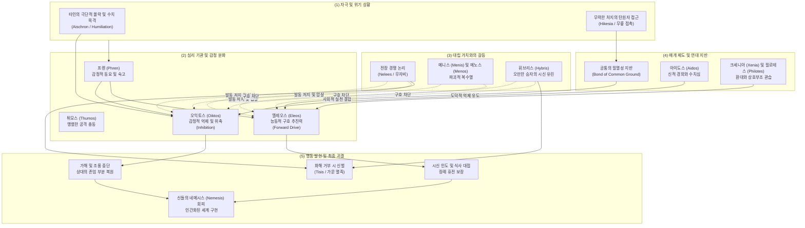

# 엘레오스와 오익토스 (Eleos & Oiktos)

**[[greek-reading-guide|읽는 법]]**: 엘레오스와 오익토스 · **원어**: ἔλεος & οἶκτος · **학술 전사**: *éleos & oîktos*

## 1. 정의와 핵심 테제 (Definition & Core Thesis)

### 1.1 핵심 정의
호메로스 서사시에서 **연민**(Pity)은 근대적 의미의 감상적 인도주의(Humanitarianism)나 보편적 박애가 아니라, 아르카익 영웅 사회의 엄격한 결과 중심 문화(Results-culture)와 실존적 인간관에 정초한 이중적 도덕심리학 기제입니다. 호메로스 텍스트에서 연민은 심리적 방향성과 행동적 귀결이 상이한 두 가지 희랍어 어휘군으로 분화되어 작동합니다 ([[scott-1979-pity-and-pathos|Scott 1979]]):

1. **오익토스**(οἶκτος, *oîktos*; 관용 라틴명 Oiktos):
   타인의 극단적인 실패와 굴욕(*peculiar humiliation*)을 목격할 때 일어나는 '**감정적 위축 및 억제‘**(Inhibition / Shrinking back)입니다. 승자가 영웅적 탁월성([[concept-arete|Arete]]) 규범에 따라 패자를 마음껏 조롱하고 유린할 수 있는 권리를 유보하고, **’가해를 멈추며 상대의 잃어버린 존엄 일부를 회복시켜 주는 행위**(Refraining from triumphing / Restoring dignity)로 이어집니다.
2. **엘레오스**(ἔλεος, *éleos*; 관용 라틴명 Eleos):
   곤경에 처한 대상을 돕고 파탄 난 상황을 시정하려는 '**적극적 구호 추진력‘**(Positive forward drive)입니다. 적을 향해 저돌적으로 돌진하는 파괴적 공격 충동인 **’메네아이네인**(*meneaínein*, μενεαίνειν)의 대척점에서, 타자에게 호의를 품고 다가가 실질적인 원조와 구호 행동(Restorative action: 시신 반환, 몸값 수락, 식사 대접)을 단행합니다.

### 1.2 연구사적 4 대 핵심 명제
1. **파토스의 본질과 성공의 급작스러운 붕괴** ([[adkins-1960-merit-and-responsibility|Adkins 1960]], [[scott-1979-pity-and-pathos|Scott 1979]]):
   호메로스 청중이 느끼는 비애감(Pathos)은 보편적 인류애에서 유래하는 감상적 동정이 아닙니다. 그것은 끊임없는 승리를 요구하는 결과 중심 문화 속에서, 빛나는 지위를 누리던 탁월한 귀족 전사([[concept-agathos|Agathos]])가 일순간에 무력화되어 처참한 실패자로 전락하는 '**성공의 급작스러운 붕괴**'(Collapse of success)를 볼 때 격발되는 자기투영적 공포에 정초합니다.
2. **비경쟁적 지반(Non-competitive Ground) 형성을 통한 협력적 가치의 복원** ([[scott-1979-pity-and-pathos|Scott 1979]]):
   경쟁적 승패가 절대적인 전장에서는 적에 대한 엘레오스가 철저히 차단됩니다. 엘레오스가 적대적 타자에게 발동하기 위해서는 반드시 손님 환대([[concept-xenia|Xenia]]), 탄원([[concept-hikesia|Hikesia]]), 또는 공통의 유한성을 환기하는 '**비경쟁적 관계**'(Non-competitive relationship)가 선행 형성되어야 합니다. 이 비경쟁적 지반 위에서 엘레오스는 경쟁적 영웅주의의 파괴적 귀결을 억제하고 문명적 유대를 수호합니다.
3. **외적 결과주의의 극복과 도덕적 행위주체성의 도약** ([[zanker-1994-heart-of-achilles|Zanker 1994]], [[williams-1993-shame-and-necessity|Williams 1993]]):
   군사적 성공만이 최고의 가치라는 애드킨스식 편견과 달리, 타자의 취약성에 응답하여 살해 권능을 자제하고 자비를 베푸는 것은 나약함이 아니라 고결한 도덕적 품격의 발현입니다. 영웅은 복수와 명예의 맹목적 충동 속에서도 타인의 처지를 가치 평가적으로 헤아리고 자비를 결단함으로써 진정한 **도덕적 행위주체성**(Moral Agency)을 성취합니다.
4. **분노(Menis)에서 연민(Eleos)으로의 승화와 실존적 비극성** ([[lee-junseok-2018-wrath-and-pity|이준석 2018]], [[kim-han-2019-gods-zeus-moira-and-god|김한 2019]]):
   『일리아스』 전체의 서사적 궤적은 파괴적 신적 분노([[concept-menis|Menis]])에서 화해의 연민(Eleos)으로 나아가는 치밀한 시학적 전환입니다. 24 권에서 아킬레우스가 프리아모스와 함께 눈물을 흘리며 도달하는 엘레오스는 사적 복수심을 초월하여 유한한 필멸자의 비극적 운명 조건(Condicio humana)을 공유하는 숭고한 실존적 연대입니다.

---

## 2. 어원과 형태론 (Etymology & Morphology)

### 2.1 비교언어학적 기원과 음운론적 분석
- **엘레오스**(ἔλεος, *éleos*):
  - 로베르트 베이케스(R. Beekes 2010, *EDG*, pp. 407–408), 피에르 샹트렌(P. Chantraine, *DELG*, p. 334), 얄마르 프리스크(H. Frisk, *GEW* 1.485)에 따르면, 엘레오스는 확고한 인도유럽조어(PIE) 어근이나 어족 간 공통 동계어가 존재하지 않습니다. 포코르니(Pokorny, *IEW* 306)가 제안한 어근 `*el-` / `*elei-`('구부리다, 몸을 굽히다') 가설은 역사음운론적 근거가 결여된 사후적 억측으로 판정됩니다.
  - 현대 비교언어학은 엘레오스를 에게해 비-인도유럽어계 **선희랍 기층어**(Pre-Greek substrate)에서 유입되었거나, 비탄과 전율의 탄식 구호인 감탄사 **ἐλελεῦ**(*eleleû*)에 기인한 표현론적 어휘로 분류합니다.
  - 서사시의 중성 s-어간(τὸ ἔλεος)과 후대 아티케 희곡 및 민중 구어의 남성 o-어간(ὁ ἔλεος)이 혼재하는 현상은 외래 기층어 수용의 전형적 징후입니다.
- **오익토스**(οἶκτος, *oîktos*):
  - 샹트렌(*DELG* 788: *sans étymologie*), 프리스크(*GEW* 2.366: *unetymologisiert*), 베이케스(*EDG* 1063) 모두 공통 인도유럽어 어근 재구가 불가능하다고 판정합니다.
  - 타인의 참혹한 파멸을 볼 때 본능적으로 터져 나오는 비탄의 탄식 구호인 **οἴμοι**(*oímoi*, '슬프도다!')와 결부된 표현론적 의성어(Expressive formation)에서 출발하여, 가해를 멈추는 내적 억제 기제로 개념화되었습니다.
  - 동사형의 경우 후대 필사본의 이오타시즘 표기인 `οἰκτίρω`를 배제하고, 기원전 5–4 세기 아티케 비문 증거에 의해 정형으로 확증된 **οἰκτείρω**(*oikteírō*)가 역사음운론적 표준입니다.

### 2.2 핵심 어휘 4 열 형태론 분리 표

| 그리스어 실제형 | 학술 전사 | 품사 및 형태론 | 의미 및 문헌학적 맥락 |
|:---|:---|:---|:---|
| **ἔλεος** | *éleos* | 중성 명사, s-어간 주격·대격 단수 | 연민, 긍휼, 구호 의지. 곤경을 바로잡으려는 능동적 추진력. 선희랍 기층어 유래. |
| **ἐλεαίρω** | *eleaírō* | 1 인칭 단수 현재 능동 직설법 (*-yō 파생 동사) | 불쌍히 여기다, 측은히 보다. 호메로스 서사시 특유의 미완료 지속상으로 호의 표명. |
| **ἐλεέω** | *eleéō* | 1 인칭 단수 현재 능동 직설법 (명사 유래 계약동사) | 자비를 베풀다, 구제하다. 부정과거 명령형 *eléēson*(자비를 베푸소서)은 탄원 시 즉각적 구호 결단 촉구. |
| **ἐλεεινός** | *eleeinós* | 남성 형용사 주격 단수 (*eleh-es-no-) | 가련한, 비참한. 헥사메테론 운율 연장형. 탄원자나 조난자의 객관적 처지 수식. |
| **ἐλεεινότερος** | *eleeinóteros* | 남성 형용사 비교급 주격 단수 | 더욱 가련한. 『일리아스』 24.504 에서 프리아모스가 펠레우스보다 더 비극적인 처지 호소. |
| **ἐλεήμων** | *eleḗmōn* | 남성/여성 형용사 주격 단수 (*-mōn 속성 접미사) | 자비로운, 긍휼히 여기는. 성품이나 기질로서의 자비심 (_Od._ 14.82). |
| **ἐλεημοσύνη** | *eleēmosýnē* | 여성 추상명사 주격 단수 (*-mosynē 복합 접미사) | 자비, 구제 행위, 적선. 칠십인역과 신약성서의 핵심 개념이자 현대 영단어 *alms*의 조어. |
| **νηλεής** | *nēleḗs* | 남성/여성 형용사 주격 단수 (*nē-* + *eleos* 복합어) | 무자비한, 냉혹한. 전장의 살육 규범과 동정 없는 영웅의 심장을 수식하는 고졸기 정형구. |
| **οἶκτος** | *oîktos* | 남성 명사, o-어간 주격 단수 | 비탄, 비애, 연민. 타인의 극단적 수치 목격 시 일어나는 감정적 위축과 가해 억제. |
| **οἰκτείρω** | *oikteírō* | 1 인칭 단수 현재 능동 직설법 (*oikt-er-yō 파생) | 측은히 여기다, 가해를 멈추다. 아티케 금석학 비문 증거로 -ει- 정형 확증. |
| **οἰκτρός** | *oiktrós* | 남성 형용사 주격 단수 (*-ro- 속성 접미사) | 애처로운, 비참한, 슬픈. 외적 굴욕과 파멸로 인해 탄식을 자아내는 물리적 상태. |
| **οἴκτιστος** | *oíktistos* | 남성 형용사 최상급 주격 단수 (*-isto- 최상급) | 가장 비참한. 『일리아스』 22.76 에서 개들에게 물어뜯기는 노인의 치부 훼손을 규정하는 극단의 수치어. |
| **ἀνοίκτιστος** | *anoíktistos* | 남성/여성 형용사 주격 단수 (부정접두사 *a-* + *oiktos*) | 탄식받지 못하는, 동정 없는, 가혹한. 비탄의 눈물조차 허용되지 않는 비극적 운명. |

---

## 3. 호메로스 서사시 본문 용례와 맥락 (Homeric Attestation & Contexts)

### 3.1 양대 서사시 출현 빈도 및 어휘 분포
- 호메로스 텍스트에서 연민 어휘는 기능과 심리적 방향성이 엄격히 분화된 2 대 어휘군을 형성합니다.
  1. **오익토스 어휘군**: 명사 *oîktos*, 동사 *oikteírein*, 형용사 *oiktrós*, 최상급 *oíktistos*. 인간 관찰자(특히 아킬레우스)에게 집중되며, 타인의 극단적 수치와 아가토스의 몰락을 목격했을 때 뒤로 물러서며 가해를 멈추는 '감정적 위축과 억제(Inhibition)'를 나타냅니다.
  2. **엘레오스 어휘군**: 명사 *éleos*, 동사 *eleaírein* / *eleeîn*, 형용사 *eleeinós*, 비교급 *eleeinóteros*, 반의 형용사 *nēleḗs*. 올림포스 신들의 구호 개입 및 인간의 적극적 행동 추진력(Positive forward drive)을 표현합니다.
  3. **Meneainein vs Eleairein의 정형구적 대립**:
     - 『오뒷세이아』 1 권 19–21 행에서 모든 신이 오디세우스를 불쌍히 여겨 구호하려 한 충동(*eleairon*)과, 홀로 지속된 포세이돈의 파괴적 분노(*meneainen*)의 대립은 엘레오스가 메노스(Menos)의 맹위를 제어하는 도덕적 대척점임을 보여줍니다.

### 3.2 『일리아스』에서의 용례 맥락: 경쟁적 전장의 거절과 비경쟁적 화해
- **경쟁적 전장에서의 엘레오스 원천 차단**:
  - 무공과 전리품을 다투는 전장에서는 적의 자비 탄원이 철저히 기각됩니다.
  - 트로스(_Il._ 20.463–472)는 아킬레우스의 무릎으로 다가와 동년배임을 내세워 엘레오스(*eleḗsas*)를 구했으나, 아킬레우스의 맹렬한 분노(*emmemaṓs*)에 칼로 간을 찔려 즉사했습니다.
  - 뤼카온(_Il._ 21.74–114)은 과거 빵을 나눈 인연과 필로스를 호소했으나, 파트로클로스의 전사 이후 아킬레우스의 거대한 무자비(*nēleēs*) 앞에서 처형되었습니다.
  - 아드라스토스(_Il._ 6.37–65)의 몸값 탄원에 메넬라오스의 마음이 흔들리자, 아가멤논은 달려와 "트로이아 사내들은 어머니 뱃속의 태아까지 단 한 명도 파멸을 면치 못해야 한다"며 직접 창으로 찔러 죽였고, 시인은 이를 "합당한 충고(*aísima pareipṓn*)"로 긍정했습니다.
- **아가토스의 붕괴와 오익토스의 발동**:
  - 에우멜로스의 전차경주 사고(_Il._ 23.534–548)에서 아킬레우스는 꼴찌로 전락한 최고의 전사를 보고 오익토스(*ṓikteire*)를 느껴 추가적인 수치를 막기 위해 2 등상을 제안합니다.
- **서사시의 클라이맥스: 24 권 화해와 공통의 필멸성**:
  - 프리아모스의 탄원(_Il._ 24.503–516)은 신에 대한 경외(*aidos*)와 연민(*eleos*)을 결합하여 늙은 부친 펠레우스라는 공통의 취약성을 환기합니다. 두 사람이 함께 눈물을 흘리며 슬픔의 갈망(*hímeron góoio*)을 해소한 뒤, 아킬레우스는 노인을 손수 일으키며 오익토스(*oikteírōn*)를 발동하고 헥토르의 시신을 인도합니다.

### 3.3 『오뒷세이아』에서의 용례 맥락: 신정론, 환대(Xenia), 그리고 무해한 자의 사면
- **신정론적 자비**:
  - 『오뒷세이아』에서 신들의 엘레오스는 고통받는 의로운 자를 향한 우주적 구호로 작동합니다(_Od._ 1.19, 5.336).
- **손님 환대(Xenia)와 사회적 약자 보호**:
  - 전통적 크세니아가 동등한 귀족 간의 호혜적 계약이라면, 엘레오스는 보답할 자원이 전무한 거지나 나그네에게도 음식을 나누어주게 만드는 최소한의 자비 규범입니다(_Od._ 17.367–368).
- **학살 현장에서의 비경쟁적 사면**:
  - 구혼자 학살 중 음유시인 페미오스(_Od._ 22.344–356)와 전령 메돈은 권력 경쟁에 가담하지 않은 비경쟁적 무해성(*anaítion*)이 텔레마코스에 의해 입증됨으로써 탄원 공식구를 통해 유일하게 생환합니다.

---

## 4. 개념 상호작용과 가치망 (Conceptual Network & Polarity)

호메로스 영웅 윤리에서 엘레오스와 오익토스는 단독으로 작동하지 않고, 전장의 경쟁적 살육 규범과 오이코스·신정론적 질서 사이의 긴장 속에서 동역학적 네트워크를 형성합니다.

---

## 5. 주요 서사 에피소드 정밀 주해 (Signature Epic Episodes)

### 5.1 프리아모스의 아킬레우스 탄원: 신성한 자비 간청과 오익토스 (_Il._ 24.503–506, 507–508, 515–516)

- **선정 장면**: 호메로스 서사시의 감정적 정점. 아들의 시신을 찾기 위해 적장의 막사로 잠입한 노왕 프리아모스가 아킬레우스의 무릎을 잡고 손에 입 맞추며 자비를 간청하는 장면.
- **본문 강독 및 해제**:
  - **번역**: "신들을 두려워하십시오, 아킬레우스여! 그리고 당신 자신의 아버지를 생각하여 나를 불쌍히 여겨주소서. 나는 그보다 훨씬 더 가련합니다. 세상의 어떤 필멸자도 감당하지 못한 일을 나는 감내하여, 내 자식들을 죽인 자의 손을 입술에 대고 있으니까요. 그는 이렇게 말했고, 아킬레우스에게는 자기 아버지를 그리워하며 울고 싶은 갈망이 솟구쳤다. 그는 노인의 손을 잡고 부드럽게 밀쳐냈다."
  - **원문**: ἀλλ᾽ αἰδεῖο θεούς, Ἀχιλεῦ, αὐτόν τ᾽ ἐλέησον / μνησάμενος σοῦ πατρός· ἐγὼ δ᾽ ἐλεεινότερός περ, / ἔτλην δ᾽ οἷ᾽ οὔ πώ τις ἐπιχθόνιος βροτὸς ἄλλος, / ἀνδρὸς παιδοφόνοιο ποτὶ στόμα χεῖρ᾽ ὀρέγεσθαι. / ὣς φάτο, τῷ δ᾽ ἄρα πατρὸς ὑφ᾽ ἵμερον ὦρσε γόοιο· / ἁψάμενος δ᾽ ἄρα χειρὸς ἀπώσατο ἦκα γέροντα.
  - **학술 전사**: *all’ aideîo theoús, Akhileû, autón t’ eléēson / mnēsámenos soû patrós; egṑ d’ eleeinóterós per, / étlēn d’ hoî’ oú pṓ tis epikhthónios brotòs állos, / andròs paidophónoio potì stóma kheîr’ orégesthai. / hṑs pháto, tō̂i d’ ára patròs hyph’ hímeron ôrse góoio; / hapsámenos d’ ára kheiròs apṓsato ē̂ka géronta.*
- **문헌학적·서사학적 함의**:
  - **신에 대한 경외와 연민의 결합**: 프리아모스는 신에 대한 경외(*aideîo theoús*)와 자비 간청(*eléēson*)을 결합하여, 늙은 부친 펠레우스를 매개로 아킬레우스와 '필멸자 인간의 공통된 비극'이라는 비경쟁적 지반을 형성합니다.
  - **오익토스와 엘레오스의 상호작용**: 두 사람이 함께 눈물을 흘린 뒤, 아킬레우스가 노인을 일으켜 세우는 행위는 현재분사 *oikteírōn*(오익토스를 품으며)으로 기술됩니다. 자식 살해자 발치에 엎드린 노왕의 극단적 굴욕 앞에서 승자의 조롱을 멈추고 존엄을 회복시켜 주는 오익토스와, 시신을 인도하고 장례 휴전을 보장하는 엘레오스가 완벽하게 결합된 순간입니다.

---

### 5.2 프리아모스의 비극적 절규와 노인의 치욕적 파멸 (_Il._ 22.71–76)

- **선정 장면**: 트로이아 성벽 위에서 헥토르의 출전을 말리며 자신의 비참한 최후와 시신 유린을 예견하는 프리아모스의 절규.
- **본문 강독 및 해제**:
  - **번역**: "젊은이에게는 전장에서 날카로운 청동 창에 찔려 찢긴 채 쓰러져 누워 있는 것이 모든 면에서 어울린다. 그가 죽었을지라도 드러난 모든 것이 아름답기 때문이다. 그러나 개들이 죽임을 당한 노인의 센 머리와 센 턱수염과 치부(치욕스러운 성기)를 더럽힐 때, 이것이야말로 가련한 필멸자들에게 가장 비참하고 수치스러운 일이다."
  - **원문**: νέῳ δέ τε πάντ᾽ ἐπέοικεν / Ἄρηϊ κταμένῳ δεδαϊγμένῳ ὀξέϊ χαλκῷ / κεῖσθαι· πάντα δὲ καλὰ θανόντι περ ὅττι φανήῃ· / ἀλλ᾽ ὅτε δὴ πολιόν τε κάρη πολιόν τε γένειον / αἰδῶ τ᾽ αἰσχύνωσι κύνες κταμένοιο γέροντος, / τοῦτο δὴ οἴκτιστον πέλεται δειλοῖσι βροτοῖσιν.
  - **학술 전사**: *néōi dé te pánt’ epéoiken / Árēï ktaménōi dedaïgménōi okséï khalkō̂i / keîsthai; pánta dè kalà thanónti per hótti phanḗēi; / all’ hóte dḕ polión te kárē polión te géneion / aidō̂ t’ aiskhúnōsi kúnes ktaménoio gérontos, / toûto dḕ oíktiston péletai deiloîsi brotoîsin.*
- **문헌학적·서사학적 함의**:
  - **오익토스 최상급의 본질**: 호메로스 문헌에서 오익토스(Oiktos)의 최상급 형태인 *oíktiston*(가장 비참한)의 본질을 밝히는 결정적 구절입니다. 젊은 영웅의 전사는 아레테와 아름다운 죽음(*kalos thanatos*)의 범주에 속하지만, 늙은 왕의 시신과 성기(*aidō̂*)가 짐승들에게 유린당하는 것은 모든 영웅적 존엄이 파괴된 절대적 수치(*aiskhron*)를 구성합니다.
  - **외적 수치와 연민의 발동**: 오익토스는 바로 이러한 파멸적 수치를 목격할 때 일어나는 감정적 위축과 전율에서 기원함을 입증합니다.

---

### 5.3 전장에서의 무자비(Nelees)와 엘레오스 탄원 거절 (_Il._ 21.74–76, 106–110)

- **선정 장면**: 스카만드로스 강변에서 무방비로 마주친 뤼카온의 구명 탄원과, 친구를 잃고 살육의 광기에 휩싸인 아킬레우스의 냉혹한 거절.
- **본문 강독 및 해제**:
  - **번역**: "무릎 꿇고 간청합니다, 아킬레우스여! 나를 존중하시고 나를 불쌍히 여겨주소서. 고귀하신 제우스의 자손이여, 나는 당신 앞에 탄원자로서 서 있습니다. 내가 데메테르의 곡식을 처음 맛본 것도 당신 곁에서였으니까요. 그러나 친구여, 그대 또한 죽어야 한다. 왜 이리 비탄에 젖어 있는가? 파트로클로스 또한 죽었으니, 그는 그대보다 훨씬 뛰어난 사람이었다. 그대는 보지 못하는가, 나 또한 얼마나 잘생기고 거대한지? 나는 훌륭한 아버지의 아들이며, 여신께서 나를 낳으셨다. 그러나 내 위에도 죽음과 억센 운명이 드리워져 있다."
  - **원문**: γουνοῦμαί σ᾽, Ἀχιλεῦ· σὺ δέ μ᾽ αἴδεο καί μ᾽ ἐλέησον· / πρὸς γάρ σοί τ᾽ εἰμ᾽ ἱκέτης ἐρικύδεε διοτρεφές· / πὰρ γὰρ σοὶ πρώτῳ πασάμην Δημήτερος ἀκτήν, / ἀλλά, φίλος, θάνε καὶ σύ· τίη ὀλοφύρεαι οὕτως; / κάτθανε καὶ Πάτροκλος, ὅ περ σέο πολλὸν ἀμείνων. / οὐχ ὁράᾳς οἷος κἀγὼ καλός τε μέγας τε; / πατρὸς δ᾽ εἴμ᾽ ἀγαθοῖο, θεὰ δέ με γείνατο μήτηρ· / ἀλλ᾽ ἔπι τοι καὶ ἐμοὶ θάνατος καὶ μοῖρα κραταιή.
  - **학술 전사**: *gounoûmaí s’, Akhileû; sù dé m’ aídeo kaí m’ eléēson; / pròs gár soí t’ eím’ hikétēs erikúdee diotrephés; / pàr gàr soì prṓtōi pasámēn Dēmḗteros aktḗn, / allá, phílos, tháne kaì sú; tíē olophúreai hoútōs; / kátthane kaì Pátroklos, hó per séo pollòn ameínōn. / oukh horáāis hoîos kagṑ kalós te mégas te; / patròs d’ eím’ agathoîo, theà dé me geínato mḗtēr; / all’ épi toi kaì emoì thánatos kaì moîra krataiḗ.*
- **문헌학적·서사학적 함의**:
  - **경쟁적 전장의 무자비**: 경쟁적 승패가 지배하는 전장에서 탄원자의 자비 호소가 냉혹하게 거절당하는 대표적 사례입니다. 뤼카온은 식사를 함께했던 호의 관계(*philos*)를 내세웠으나, 친구 파트로클로스를 잃고 맹위(*menos*)에 휩싸인 아킬레우스에게는 무자비(*nēleēs*)만이 지배합니다.
  - **실존적 필로스 호격**: 아킬레우스가 뤼카온을 "친구여(*phílos*)"라고 부른 것은 사적인 애정이 아니라, 불가피한 죽음의 보편성 앞에 선 필멸자 전체를 향한 비극적·실존적 호격입니다.

---

### 5.4 에우멜로스의 꼴찌 전락과 아킬레우스의 오익토스 (_Il._ 23.534–538, 548)

- **선정 장면**: 파트로클로스 장례경기 전차경주에서 불운으로 전차가 부서져 꼴찌로 들어온 에우멜로스를 향한 아킬레우스의 배려.
- **본문 강독 및 해제**:
  - **번역**: "발 빠른 고귀한 아킬레우스는 그를 보고 가엾게 여겼으며, 아르고스인들 가운데 서서 날개 돋친 말을 건넸다. 가장 뛰어난 사내가 꼴찌로 말을 몰고 왔구나! 그러니 자, 당연하고 합당하게 그에게 2등상을 주도록 하자. 그러나 1등상은 튀데우스의 아들이 가져가게 하라. 하지만 만약 당신이 그를 가엾게 여기고 그가 당신의 마음에 든다면..."
  - **원문**: τὸν δὲ ἰδὼν ᾤκτειρε ποδάρκης δῖος Ἀχιλλεύς, / στὰς δ᾽ ἄρ᾽ ἐν Ἀργείοις ἔπεα πτερόεντ᾽ ἀγόρευε· / λοῖσθος ἀνὴρ ὤριστος ἐλαύνει μώνυχας ἵππους· / ἀλλ᾽ ἄγε δή οἱ δῶμεν ἀέθλιον, ὡς ἐπιεικές, / δεύτερ᾽· ἀτὰρ τὰ πρῶτα φερέσθω Τυδέος υἱός. / εἰ δέ μιν οἰκτίρεις καί τοι φίλος ἔπλετο θυμῷ,
  - **학술 전사**: *tòn dè idṑn ṓikteire podárkēs dîos Akhilleús, / stàs d’ ár’ en Argeíois épea pteróent’ agóreue; / loîsthos anḕr ṓristos elaúnei mṓnukhas híppous; / all’ áge dḗ hoi dō̂men aéthlion, hōs epieikés, / deúter’; atàr tà prō̂ta pherésthō Tudéos huiós. / ei dé min oiktíreis kaí toi phílos épleto thumō̂i,*
- **문헌학적·서사학적 함의**:
  - **오익토스의 심리적 메커니즘**: 메리 스콧(Mary Scott 1979)이 오익토스의 심리적 메커니즘을 밝히기 위해 제시한 핵심 증거입니다. 최고의 기수(*ṓristos*)가 불운으로 꼴찌(*loîsthos*)로 전락한 사건은 아가토스의 명예에 치명적인 수치(*aiskhron*)를 가져옵니다.
  - **가해 억제와 체면 보전**: 아킬레우스의 미완료 동사 *ṓikteire*는 패자를 비웃지 않고 그의 훼손된 존엄을 상을 통해 지켜주려는 '감정적 억제와 배려'를 가리키며, 안틸로코스의 조건절 *oiktíreis* 역시 이를 정확히 재확인합니다.

---

### 5.5 음유시인 페미오스의 탄원과 비경쟁적 사면 (_Od._ 22.344–349, 356)

- **선정 장면**: 구혼자 처형의 유혈극 속에서 오디세우스의 무릎을 잡고 탄원하는 가객 페미오스와, 텔레마코스의 무죄 증언으로 인한 사면.
- **본문 강독 및 해제**:
  - **번역**: "무릎 꿇고 간청합니다, 오디세우스여! 나를 존중하시고 나를 불쌍히 여겨주소서. 신들과 인간들에게 노래하는 가객인 나를 죽인다면, 훗날 당신 자신에게도 비탄이 될 것입니다. 나는 독학으로 깨우쳤으며, 신께서 내 마음에 온갖 노래의 길들을 심어주셨습니다. 나는 당신 앞에서도 신에게 하듯 노래할 수 있으니, 내 목을 베려 서두르지 마소서. 멈추십시오! 이 죄 없는 자를 청동 칼로 치지 마십시오."
  - **원문**: γουνοῦμαί σ᾽, Ὀδυσεῦ· σὺ δέ μ᾽ αἴδεο καί μ᾽ ἐλέησον· / αὐτῷ τοι μετόπισθ᾽ ἄχος ἔσσεται, εἴ κεν ἀοιδὸν / πέφνῃς, ὅς τε θεοῖσι καὶ ἀνθρώποισιν ἀείδω. / αὐτοδίδακτος δ᾽ εἰμί, θεὸς δέ μοι ἐν φρεσὶν οἴμας / παντοίας ἐνέφυσεν· ἔοικα δέ τοι παραείδειν / ὥς τε θεῷ· τῷ μή με λιλαίεο δειροτομῆσαι. / ἴσχεο μηδέ τι τοῦτον ἀναίτιον οὔταε χαλκῷ·
  - **학술 전사**: *gounoûmaí s’, Oduseû; sù dé m’ aídeo kaí m’ eléēson; / autō̂i toi metópisth’ ákhos éssetai, eí ken aoidòn / péphnēis, hós te theoîsi kaì anthrṓpoisin aeídō. / autodídaktos d’ eimí, theòs dé moi en phresìn oímas / pantoías enéphusen; éoika dé toi paraeídein / hṓs te theō̂i; tō̂i mḗ me lilaíeo deirotomē̂sai. / ískheo mēdé ti toûton anaítion oútae khalkō̂i;*
- **문헌학적·서사학적 함의**:
  - **탄원 공식구의 재현**: 『일리아스』 21권 74행 뤼카온의 탄원 공식구(*gounoûmaí s’ ... aídeo kaí m’ eléēson*)가 『오뒷세이아』 학살 장면에서 재현된 결정적 순간입니다.
  - **비경쟁적 무해성의 승인**: 뤼카온의 탄원은 거절당했으나 페미오스의 탄원이 수용된 이유는, 페미오스가 구혼자들의 권력 경쟁에 가담하지 않고 강요에 의해 노래했을 뿐이라는 '비경쟁적 무해성(*anaítion*)'이 텔레마코스에 의해 텍스트적으로 입증되었기 때문입니다.

---

## 6. 역사적·제도적 맥락 (Historical & Institutional Context)

<!-- 선택적 렌즈: 적용 -->

호메로스 서사시의 엘레오스와 오익토스는 근대적 의미의 탈맥락화된 도덕 감정이 아니라, 아르카익기 그리스의 오이코스(Oikos) 질서, 신분제적 명예(Time) 분배, 그리고 가혹한 교전 관행 속에서 작동하는 구체적인 사회제도적 기제였습니다.

### 6.1 오이코스(Oikos) 외부 무권리자와 비대칭적 생존 보장망
- **오이코스 질서와 무권리자의 법외 상태**: 아르카익 호메로스 사회에서 모든 사법적 권리와 물리적 안전망은 혈연 공동체인 오이코스에 정초합니다. 따라서 오이코스의 보호를 상실한 자들—추방당한 살인 망명자(φυγάς, *phygas*), 토지 없는 부랑 걸인(πτωχός, *ptōkhos*), 아버지를 잃은 고아(ὀρφανός, *orphanos*), 사로잡힌 전쟁 포로(αἰχμάλωτος, *aikhmalōtos*)—는 공동체의 사법적 배상권([[concept-dike|Dike]])과 복수망([[concept-poine|Poine]])에서 완전히 배제된 무권리자([[concept-time|Atimos]])로 전락합니다.
- **안드로마케의 애가에 나타난 고아의 사회적 처지**: 안드로마케는 헥토르의 죽음 직후 어린 아스티아낙스가 겪을 운명을 예견하며, 보호자 없는 고아가 또래 집단에서 쫓겨나고 아버지 친구들의 연회 식탁을 맴돌며 옷자락을 잡아당겨야 하는 비참한 처지를 묘사합니다 (_Il._ 22.490–500). 이때 고아에게 주어지는 한 모금의 포도주는 권리가 아니라 오직 동석한 어른들의 일시적 연민에 의존합니다.
- **환대(Xenia)의 비대칭적 확장**: 대등한 귀족([[concept-agathos|Agathos]]) 사이의 손님 환대([[concept-xenia|Xenia]])가 상호적 선물교환(Reciprocity)을 전제하는 계약적 연대라면, 물질적 답례(Antidōron)를 전혀 제공할 수 없는 극빈자에게 환대를 베풀게 만드는 규범적 동기는 바로 엘레오스(Eleos)였습니다. 『오뒷세이아』 17 권에서 구혼자들은 비록 오만할지라도 거지로 변장한 오디세우스의 비참함을 불쌍히 여겨(*eleairontes*, _Od._ 17.367) 빵을 떼어줍니다. 이는 엘레오스가 제우스 힉케시오스·크세니오스의 종교적 제재와 결합하여, 법외자로 내몰린 한계 계층의 생물학적 생존을 지탱하는 최후의 초제도적 안전망이었음을 입증합니다.

### 6.2 장례 경기(Athla)와 아리스토스(Aristos)의 명예 실추 방지: 오익토스의 제도적 조정
- **신분적 지위와 경기 결과의 충돌**: 『일리아스』 23 권 파트로클로스의 장례 경기(Athla) 전차 경주에서, 공인된 최강의 기수였던 에우멜로스(Eumelos)는 아테나 여신의 개입으로 멍에가 부러지는 신적 불운을 겪으며 꼴찌로 결승선을 통과합니다.
- **아킬레우스의 오익토스 발동**: 주최자 아킬레우스는 진흙투성이가 된 채 말을 몰고 들어온 에우멜로스를 보고 마음속으로 연민을 품습니다 (_Il._ 23.534: ᾤκτειρε, *ṓikteire*). 아킬레우스는 군중을 향해 "가장 훌륭한 자(ἄριστος ἀνήρ, *aristos anēr*)가 말들을 꼴찌로 몰고 왔구나. 자, 마땅히(*epieikes*) 그에게 2 등 상을 주도록 하자"(_Il._ 23.536–538)고 제안합니다. 이는 '아가토스의 선험적 우월성'이 우연한 불운으로 인해 수치스러운 실패자([[concept-kakos|Kakos]])로 전락하는 것을 차단하려는 '설득적 정의(Persuasive justice)'의 시도였습니다 ([[adkins-1960-merit-and-responsibility|Adkins 1960]]).
- **안틸로코스의 결과주의적 항의와 타협**: 실제 2 위로 들어온 청년 안틸로코스는 자신의 성과에 따른 티메(암말)를 박탈당하는 것에 격렬히 반발하며, 아킬레우스가 에우멜로스를 "가엾게 여기고(*oikteirein*) 마음에 드는 친구(*philos*)로 여긴다면" 막사의 사적 보물에서 다른 상을 주라고 요구합니다 (_Il._ 23.548–554). 이에 아킬레우스는 미소를 지으며 안틸로코스의 공적 티메를 인정하는 동시에, 트로이아 전사 아스테로파이오스에게서 빼앗은 주석 도금 청동 흉갑(thōrēx)을 에우멜로스에게 추가 위로 상으로 수여합니다 (_Il._ 23.560–562).
- **제도사적 함의**: 이 에피소드는 호메로스 사회가 결과 중심 문화(Results-culture)의 공적 원칙을 준수하면서도, 탁월한 귀족의 명예 실추를 막기 위해 '오익토스(Oiktos)'라는 감정적 위축과 사적 보상(Compensation)을 결합하여 귀족 내부의 계층 내 연대(Intra-elite solidarity)를 보존했음을 실증합니다.

### 6.3 교전 관행과 포로 처우: 몸값(Apoina)의 경제학과 무자비(Nēleēs)의 경계
- **살려줌(Zōgrein)과 몸값의 교환 논리**: 호메로스 서사시의 전장에서 패배자가 무릎을 꿇고 탄원하며 엘레오스를 구하는 행위(ἐλεεῖν / ἱκετεύειν)는 인도주의적 구걸이 아니라 철저한 경제적 거래 제안이었습니다. 패자는 자신이 속한 부유한 오이코스의 청동, 금, 철 등 막대한 몸값(ἄποινα, *apoina*)을 승자에게 약속함으로써 자신의 목숨을 살려줄 것(ζωγρεῖν, *zōgrein*)을 요청했습니다 (_Il._ 6.46–50, 11.131–135).
- **상업적 포로 매각 관례**: 파트로클로스가 살아있던 시기, 아킬레우스는 사로잡은 트로이아 왕자들을 렘노스나 임브로스, 사모스 섬 등 바다 건너로 팔아넘겨 가축과 재화로 교환하는 정상적인 상업적 전쟁 관례를 준수했습니다 (_Il._ 21.100–102). 이때 승자가 행사하는 관용은 물질적 이윤 추구와 결합된 제도적 자비였습니다.
- **복수(Tisis) 규범의 압도와 엘레오스의 소멸**: 그러나 전우의 죽음이나 씨족 간 혈원 복수의 계기가 발생할 때, 몸값의 경제학은 일거에 붕괴하고 절대적 무자비(νηλεής, *nēleēs*)가 전장을 지배합니다:
  - 아가멤논은 메넬라오스가 아드라스토스의 몸값 탄원을 듣고 마음이 흔들리자 달려와 꾸짖으며, "트로이아 사내들은 어머니 뱃속에 든 태아까지 단 한 명도 파멸을 면치 못해야 한다"고 선언하고 아드라스토스를 직접 찔러 죽입니다 (_Il._ 6.55–60). 시인은 아가멤논의 이 가차 없는 처형을 "합당한 충고(αἴσιμα παρειπών)"라고 긍정합니다.
  - 파트로클로스를 잃은 아킬레우스는 뤼카온(_Il._ 21.74–114)과 트로스(_Il._ 20.463–472)의 처절한 탄원을 "친구여, 그대 또한 죽어야 한다"며 차갑게 기각합니다. 영웅에게 전쟁이 이익 추구가 아닌 순수한 실존적 복수([[concept-tisis|Tisis]])와 분노([[concept-menis|Menis]])로 전환되는 순간, 엘레오스는 완전히 증발합니다.
- **제도적 경계**: 따라서 고졸기 전쟁법에서 엘레오스는 독자적인 인권 규범이 아니었으며, 오직 **몸값(Apoina)을 통한 물질적 보상이 살해를 통해 얻는 군사적 영예([[concept-kydos|Kydos]])와 복수의 쾌락보다 클 때에만 한시적으로 허용되는 조건부 유예 장치**였습니다.

---

## 7. 물질문화와 신체성 (Material Culture & Embodiment)

<!-- 선택적 렌즈: 적용 -->

호메로스 서사시에서 엘레오스와 오익토스는 추상적 내면의 사유에 머물지 않고, 격렬한 체액의 분출, 극단적인 신체 접촉, 음식의 물리적 분배, 그리고 시신의 물질적 보존이라는 구체적 신체성과 물질문화를 통해 가시화되었습니다.

### 7.1 눈물(Dakrya / Goos)의 물리성과 감정의 전염
- **체액의 물리적 분출**: 호메로스 영웅들에게 눈물(δάκρυ, *dakru*)은 유약함의 징표가 아니라, 억누를 수 없는 감정좌소([[concept-thumos|Thumos]])의 격변이 신체 밖으로 쏟아져 나오는 물리적 힘이었습니다.
- **공동 통곡과 비탄의 전염**: 『일리아스』 24 권에서 프리아모스의 탄원 직후 일어난 사건은 '눈물과 애도의 상호적 격발'이었습니다. 시인은 "그의 말은 아킬레우스의 마음속에 아버지에 대한 슬픔의 충동을 일으켰다"(*toîo dè patròs hyph’ hímeron ôrse góoio*, _Il._ 24.507)고 묘사합니다.
- **신체적 탈진을 통한 분노의 해소**: 프리아모스는 아들 헥토르를 생각하며 아킬레우스의 발치에 쓰러져 울고, 아킬레우스는 늙은 아버지 펠레우스와 죽은 파트로클로스를 생각하며 눈물을 쏟아냅니다 (_Il._ 24.509–512). 두 영웅이 막사 바닥에서 함께 통곡을 터뜨리며 몸을 들썩이는 이 신체적 애도(Goos)는, 가슴속을 가득 채우고 있던 파괴적 격분([[concept-cholos|Cholos]])을 물리적으로 탈진시켜 씻어내는 정화(Katharsis)의 물질적 과정이었습니다.

### 7.2 탄원(Hikesia)의 신체 제스처: 무릎 접촉과 발치 엎드림
- **발치에 엎드림(Propiptein)**: 탄원자 프리아모스는 막사에 들어서자마자 아킬레우스의 발치에 몸을 낮추어 엎드립니다. 직립한 영웅의 신체적 위용을 지표면으로 떨어뜨리는 이 극단적인 수직적 하강은, 상대방에게 자신의 생사여탈권이 온전히 달려 있음을 시각적·공간적으로 선언하는 신체 언어입니다.
- **무릎 접촉(Gounoumai / Gouna labein)**: 프리아모스는 두 손으로 아킬레우스의 무릎을 끌어안습니다 (_Il._ 24.478: λάβε γούνατα). 인도유럽어족 비교문화론에서 무릎(γόνατα, *gonata*)은 인간의 생명력, 기동성, 생식력의 좌소로 인식되었습니다. 탄원자가 상대의 무릎을 붙잡는 동작은:
  1. 상대의 공격적인 진격을 물리적으로 억제하고,
  2. 상대의 신체적 활력의 원천에 자신의 연약한 육신을 밀착시킴으로써,
  3. 상대에게 신성한 수치심과 경외([[concept-aidos|Aidos]])를 강제하여 함부로 뿌리칠 수 없게 만드는 주술적·신체적 결속 행위였습니다.

### 7.3 손에 입맞춤(Kyse cheiras): 극한의 수치와 오익토스 격발
- **살인자의 손에 입술을 대는 행위**: 프리아모스는 아킬레우스의 무릎을 잡는 데 그치지 않고, "수많은 내 자식들을 죽인 남자의 두렵고 살인적인 손에 입을 맞추었습니다(κύσε χεῖρας δεινὰς ἀνδροφόνους)"(_Il._ 24.478–479, 506).
- **오익토스의 신체적 촉발 기제**: 손은 무기를 쥐고 적의 목숨을 앗아가는 영웅적 아레테(Arete)의 물리적 집행 기관입니다. 자식들의 피가 묻은 그 손에 늙은 왕이 입술을 가져다 대는 행위는 지상에 존재하는 가장 극단적인 자기비하이자 수치(*peculiar humiliation*)의 표현이었습니다.
- **아킬레우스의 신체적 반응**: 이 참혹한 신체 접촉을 마주한 아킬레우스는 경악과 전율 속에서 노인의 손을 조용히 밀어내며 물러선 뒤, 비로소 마음속에서 오익토스(516 행 *oikteirōn*)를 일으켜 노인을 손수 손으로 잡아 일으켜 세웁니다 (_Il._ 24.515: χειρὸς ἀνίστη). 억제(Inhibition)로서의 오익토스가 신체적 접촉을 통해 폭력의 중단과 상대 존엄의 물리적 회복으로 전환되는 결정적 순간입니다.

### 7.4 빵과 음식 나눔(Sitos / Daitos): 적대의 신체적 종결
- **니오베 신화와 생물학적 필멸성의 수용**: 비탄을 나눈 뒤 아킬레우스는 프리아모스에게 음식을 권하며 열두 자녀를 잃은 니오베(Niobe)의 신화를 인용합니다 (_Il._ 24.601–619). 아무리 참혹한 슬픔에 잠긴 인간일지라도 육신의 허기를 이길 수 없어 음식을 취했듯, 필멸자는 눈물을 거두고 먹어야 한다는 것입니다.
- **공동 식사(Daïs)의 물질적 평화**: 아킬레우스는 손수 흰 양을 잡고, 전우 오토메돈이 은쟁반에 빵을 배분하며, 함께 구운 고기를 나눕니다 (_Il._ 24.621–626).
- 호메로스 세계에서 식사를 함께 나누는 행위(Syssitia)는 살인자와 피해자 가족 사이의 적대적 긴장을 일시적으로 해체하고, 서로를 생존을 위해 음식을 섭취해야만 하는 '가련한 필멸자'라는 신체적 지평에서 묶어내는 물질적 화해 의례였습니다.

### 7.5 시신 훼손(Aikia) 방지와 장례의 물질성
- **시신 능욕(Aikia)의 신체적 파괴**: 아킬레우스는 헥토르의 발뒤꿈치 힘줄을 뚫어 가죽 끈으로 전차에 묶고 먼지 속으로 끌고 다님으로써 시신을 능욕했습니다 (_Il._ 22.395–404). 이러한 시신 훼손(ἀεικία, *aeikía* / ἀεικές, *aeikés*)은 상대의 영웅적 신체(Chros)를 짐승의 먹이로 전락시켜 사후의 명예([[concept-kleos|Kleos]])를 완전히 말살하려는 물리적 폭력이었습니다.
- **신들의 물질적 보호**: 아폴론은 헥토르의 피부가 찢기지 않도록 황금 아이기스 방패로 감싸 보호했고, 아프로디테는 장미 향기가 나는 불사의 기름(ambrosio elaio)을 시신에 발라 훼손을 물리적으로 방어했습니다 (_Il._ 23.185–191).
- **시신 정화와 직물의 물질문화**: 24 권에서 엘레오스를 회복한 아킬레우스는 하녀들에게 명하여 막사 밖으로 헥토르의 시신을 옮겨 깨끗한 물로 씻기고 올리브 기름을 바르게 한 뒤, 트로이아에서 가져온 아름다운 겉옷(pharos)과 정교하게 짠 튜닉(chitōn)으로 정중히 감싸 안치하도록 지시합니다 (_Il._ 24.582–590).
- 시신을 씻기는 물, 향유, 그리고 고급 직물은 엘레오스와 오익토스가 단순한 마음의 동요가 아니라 파괴된 육신의 존엄을 물리적 물질(Fabric & Oil)을 통해 원상 복원하는 구체적 실천이었음을 증명합니다.

---

## 8. 종교인류학 및 제의적 실천 (Religious Anthropology & Ritual)

<!-- 선택적 렌즈: 적용 -->

고대 그리스 종교인류학에서 연민은 감상적인 심리적 동요에 머물지 않고, 불멸하는 신들의 우주적 질서 감시, 필멸자의 신체 훼손을 금기시하는 정화 및 장례 의례, 그리고 탄원자를 환대하는 신성한 접촉 규범과 떼려야 뗄 수 없는 제의적(Ritual) 실천으로 제도화되어 있었습니다 ([[kearns-2006-gods-in-homeric-epics|Kearns 2006]], [[lee-taesoo-2020-gods-in-audience|이태수 2020]]).

### 8.1 올림포스 관객 신들의 심미적 연민과 존재론적 간격 (The Divine Audience & Aesthetic Pity)
올림포스 신들이 인간 영웅들에게 표출하는 **엘레오스**(Eleos)는 불멸자(Athanatoi)와 필멸자(Thnetoi) 사이의 절대적인 존재론적 간격(*ontological gulf*)에 의해 규정됩니다.

- **관객석의 신들과 심미적 연민의 한계**:
  - 이태수 교수가 규명하듯, 올림포스의 신들은 지상의 살육전을 올림포스나 이다산의 안전한 관객석에서 감상하는 일종의 '신적 관객(Divine Audience)'으로 군림합니다 ([[lee-taesoo-2020-gods-in-audience|이태수 2020]]).
  - 제우스는 전장에서 멀찌감치 떨어져 홀로 자신의 영광을 뽐내며(*kúdeï gaíōn*) 죽이고 죽임당하는 자들을 내려다보고(_Il._ 11.80–83), 아테나와 아폴론은 맹금 형상으로 참나무에 앉아 피 흘리는 인간들을 즐깁니다(*andrasi terpominoi*, _Il._ 7.58–62).
  - 지상에서 수많은 인간이 참혹하게 도륙당하는 순간에도 올림포스 궁정에서는 헤파이스토스의 걸음걸이를 보며 "꺼지지 않는 웃음(*asbestos gelos*)"이 터져 나옵니다(_Il._ 1.599–600). 신들의 행복은 인간의 고통을 노래와 구경거리로 향유하는 데서 완성됩니다.
  - 따라서 신들의 연민은 무대 위 비극을 보며 흘리는 일시적이고 안전한 '심미적 연민(Aesthetic Pity)'에 불과합니다. 신들은 결코 자신의 불멸성과 행복(*rheia zoontes*)을 담보로 인간의 고통에 뛰어들지 않으며, 운명적 파국 앞에서 냉혹한 초연함으로 회귀합니다.
- **필멸성 전체를 향한 제우스의 탄식**:
  - 파트로클로스의 죽음 앞에서 눈물 흘리는 아킬레우스의 불사마(Xanthos & Balios)를 내려다보며 제우스가 품은 엘레오스(_Il._ 17.441–447)는, 개별 영웅에 대한 애착을 넘어 유한한 인간 조건 전체의 비참함을 향한 초월자의 시선입니다:
    - **번역**: "슬피 우는 그 둘을 보고 크로노스의 아들은 불쌍히 여겨, 머리를 흔들며 자신의 마음에 혼잣말을 했다. '아, 가련한 것들아! 어찌하여 우리는 죽지도 않고 늙지도 않을 너희를 필멸의 인간인 펠레우스 왕에게 주었던가? 슬픔에 잠긴 인간들과 함께 고통을 겪게 하려는 것이었더냐? 정녕 대지 위에서 숨 쉬고 기어 다니는 온갖 생물들 가운데 인간보다 더 비참한 것은 아무것도 없도다.'"
    - **원문**: μυρομένω δ’ ἄρα τώ γε ἰδὼν ἐλέησε Κρονίων, / κινήσας δὲ κάρη προτὶ ὃν μυθήσατο θυμόν· / «ἆ δειλώ, τί σφῶϊ δόμεν Πηλῆϊ ἄνακτι / θνητῷ, ὑμεῖς δ’ ἐστὸν ἀγήρω τ’ ἀθανάτω τε; / ἦ ἵνα δυστήνοισι μετ’ ἀνδράσιν ἄλγε’ ἔχητον; / οὐ μὲν γάρ τί πού ἐστιν ὀϊζυρώτερον ἀνδρὸς / πάντων, ὅσσα τε γαῖαν ἔπι πνείει τε καὶ ἕρπει.»
    - **학술 전사**: *muroménō d’ ára tṓ ge idṑn eléēse Kroníōn, / kinḗsas dè kárē protì hòn muthḗsato thumón; / "â deilṓ, tí sphō̂ï dómen Pēlē̂ï ánakti / thnētō̂i, humeîs d’ estòn agḗrō t’ athanátō te; / ē̂ hína dustḗnoisi met’ andrásin álge’ ékhēton; / ou mèn gár tí poú estin oïzurṓteron andròs / pántōn, hóssa te gaîan épi pneíei te kaì hérpei."* (_Il._ 17.441–447)
    - **[ 주석]**: 신들의 불멸과 인간의 가사성이 극명하게 충돌하는 장면입니다. 불사의 존재가 필멸자의 고통에 연루되는 순간 비극이 발생하며, 제우스는 지상에서 가장 비참한 존재(*oïzyroteros*)인 인간의 유한성을 직시하고 존재론적 연민을 표출합니다.

### 8.2 시신 훼손(Aikia)의 금기와 신적 의분(Nemesis): 매장 의례와 죽은 자의 몫(Geras Thanonton)
호메로스 종교인류학에서 전사자의 신체는 생전의 명예([[concept-time|Timē]])가 물리적으로 보존되는 마지막 성역이며, 시신을 유린하는 행위는 올림포스 신들의 신적 의분([[concept-nemesis|Nemesis]])을 촉발하는 절대적 종교적 금기입니다.

- **시신 훼손(Aikia)과 신적 네메시스의 발동**:
  - 아킬레우스가 헥토르의 시신을 전차에 매달아 끌고 다니며 능욕하는 행위(**아이키아**, ἀεικία / ἀικία, *aeikía / aikía*)는 승자의 정당한 권리를 넘어선 오만([[concept-hybris|Hybris]])이자 신성모독([[concept-asebeia|Asebeia]])입니다.
  - 『일리아스』 24 권에서 아폴론은 침묵하는 흙을 모독하는 아킬레우스의 광기를 고발하며 신들의 네메시스를 경고합니다 (_Il._ 24.44–54):
    - **번역**: "이처럼 아킬레우스는 연민(엘레오스)을 없애버렸고, 사람들에게 큰 해를 끼치기도 하고 도움을 주기도 하는 수치심(아이도스)마저 그에게는 없소. ... 그가 아무리 용맹하다 할지라도 우리가 그에게 네메시스를 품지 않도록 조심해야 할 것이오. 그가 미쳐 날뛰며 말 못하는 흙(시신)을 욕보이고(아이키제인) 있으니 말이오."
    - **원문**: ὣς Ἀχιλεὺς μὲν ἀπώλεσεν ἔλεον, οὐδέ οἱ αἰδὼς / γίγνεται, ἥ τ’ ἄνδρας μέγα σίνεται ἠδ’ ὀνίνησι. / ... / μὴ ἀγαθῷ περ ἐόντι νεμεσσηθέωμέν οἱ ἡμεῖς· / κωφὴν γὰρ δὴ γαῖαν ἀεικίζει μενεαίνων.
    - **학술 전사**: *hō̂s Akhileùs mèn apṓlesen éleon, oudé hoi aidṑs / gígnetai, hḗ t’ ándras méga sínetai ēd’ onínēsi. / ... / mḕ agathō̂i per eónti nemessēthéōmén hoi hēmeîs; / kōphḕn gàr dḕ gaîan aeikízei meneainōn.* (_Il._ 24.44–45, 53–54)
    - **[ 주석]**: 아폴론은 아킬레우스의 내면에서 엘레오스와 아이도스가 완전히 파괴되었음을 선언합니다. 시신을 '말 못하는 흙(*kōphē gaîa*)'으로 전락시키는 행위는 자연의 질서를 어지럽히는 중대한 신성모독이며, 신들이 개입하여 네메시스를 내릴 수밖에 없는 제의적 명분을 제공합니다.
- **아폴론의 시신 보존과 죽은 자의 명예의 몫(*Geras thanonton*)**:
  - 아폴론은 헥토르가 생전에 바친 수많은 제물을 기억하고, 그가 죽은 몸일지라도 불쌍히 여겨(*eléairen Apóllōn kaì nékun ándra*, _Il._ 24.19) 황금 아이기스로 시신을 온전히 감싸 부패와 훼손을 막아냅니다.
  - 정당한 매장 의례(Kedeia, Taphe)와 봉분·묘비(Tymbos & Stele)는 필멸자가 현세에서 거둘 수 있는 마지막 명예인 '죽은 자들의 몫(*tò gàr géras estì thanóntōn*, _Il._ 16.457)'입니다.
  - 신들이 아킬레우스에게 시신 반환을 명한 것은, 인간 사회의 복수심이 넘어서는 안 될 제의적 경계선을 강제하고 엘레오스를 복원함으로써 우주적 균형을 회복하려는 종교적 개입이었습니다.

### 8.3 탄원 의례(Hikesia)의 신체성과 제우스 히케시오스의 감시
엘레오스가 적대적 살육전의 논리를 뚫고 현실에서 발동하기 위해서는, 세속적 힘의 우열이 일시적으로 정지되는 엄격한 제의적 통과의례인 **[[concept-hikesia|탄원(Hikesia)]]**이 수반되어야 합니다.

- **자기 비하적 신체 접촉 의례와 경외의 소환**:
  - 탄원자는 무기를 내려놓고 무릎을 꿇으며 상대방의 무릎(gounata)을 감싸 쥐거나 턱(geneion)을 어루만지고 손에 입을 맞춥니다.
  - 프리아모스가 아킬레우스의 진영에 은밀히 침투하여 수행한 탄원은 종교인류학적으로 가장 극적인 통과의례입니다 (_Il._ 24.503–506):
    - **번역**: "신들을 두려워하십시오, 아킬레우스여! 그리고 당신 자신의 아버지를 생각하여 나를 불쌍히 여겨주소서. 나는 그보다 훨씬 더 가련합니다. 세상의 어떤 필멸자도 감당하지 못한 일을 나는 감내하여, 내 자식들을 죽인 자의 손을 입술에 대고 있으니까요."
    - **원문**: ἀλλ’ αἰδεῖο θεούς, Ἀχιλεῦ, αὐτόν τ’ ἐλέησον / μνησάμενος σοῦ πατρός· ἐγὼ δ’ ἐλεεινότερός περ, / ἔτλην δ’ οἷ’ οὔ πώ τις ἐπιχθόνιος βροτὸς ἄλλος, / ἀνδρὸς παιδοφόνοιο ποτὶ στόμα χεῖρ’ ὀρέγεσθαι.
    - **학술 전사**: *all’ aideîo theoús, Akhileû, autón t’ eléēson / mnēsámenos soû patrós; egṑ d’ eleeinóterós per, / étlēn d’ hoî’ oú pṓ tis epikhthónios brotòs állos, / andròs paidophónoio potì stóma kheîr’ orégesthai.* (_Il._ 24.503–506)
    - **[ 주석]**: 프리아모스는 신에 대한 경외(*aideîo theoús*)를 명분으로 내세우며 아킬레우스 내면의 아이도스를 강타하고, 자신의 극단적 굴종 행위를 통해 엘레오스(*eléēson*)를 이끌어냅니다. 살인자의 손에 입을 맞추는 행위는 세속적 전사의 자존심을 완전히 폐기하고 제우스 히케시오스의 초월적 관할권 아래 자신을 의탁하는 거룩한 자기비하입니다.
- **비경쟁적 성소(Sanctuary)의 창출과 애도의 연대**:
  - 탄원이 성립되는 순간 두 사람의 공간은 적대적 전장이 아니라, 초월적 신벌의 감시 아래 놓인 '비경쟁적 성소'로 전환됩니다.
  - 두 사람이 함께 통곡하며 눈물을 쏟아내는 정화 의례(Katharsis)를 거친 후, 아킬레우스는 손수 노인을 일으켜 세우며 오익토스(Oiktos, 존엄의 복원)와 엘레오스(Eleos, 시신 인도 및 12 일 장례 휴전)를 베풉니다.
  - 제우스 히케시오스(Zeus Hikesios)와 제우스 크세니오스(Zeus Xenios)의 보이지 않는 감시는, 전장의 잔혹한 폭력 논리를 일시 정지시키고 필멸의 한계를 공유하는 인간들 사이의 거룩한 연민을 산출하는 궁극적 종교적 보증 장치였습니다.

---

## 9. 심리철학 및 도덕적 행위주체성 (Moral Psychology & Agency)

<!-- 선택적 렌즈: 적용 -->

### 9.1 고대 그리스 신체-정신 감정좌소: 튀모스, 프렌, 케르, 에토르에서의 생리적 전환
호메로스 서사시에서 도덕적 정념과 의지적 결단은 추상적 관념이 아니라, 신체 기관이자 생체 에너지의 장소인 감정좌소들의 직접적인 생리적 변용 속에서 일어납니다.

1. **튀모스(Thumos, θυμός)에서의 격앙과 열기 냉각**:
   - 전장에서 적을 마주한 전사의 내면은 혈기와 공격 충동의 좌소인 **튀모스**([[concept-thumos|Thumos]])에서 분출하는 맹렬한 살의인 메네아이네인(*meneaínein*)과 담즙질 격정인 콜로스([[concept-cholos|Cholos]])로 들끓습니다.
   - 탄원과 취약성의 목격은 이 격앙된 튀모스의 회로를 급정지시키고 열기를 부드럽게 녹여내는 과정(θυμὸν ἰαίνειν, *thumòn iaínein*)을 촉발합니다. 튀모스의 파괴적 운동 에너지가 냉각되면서 호의와 구호의 추진력으로 방향을 전환합니다.
2. **프렌(Phren / Phrenes, φρήν, φρένες)에서의 인지적 억제와 가치 평가적 반추**:
   - 횡격막과 흉곽에 위치하여 감각과 사유를 매개하는 **프렌**([[concept-phren|Phren]])은 타인의 처참한 수치를 직면했을 때 '주춤거림과 감정적 위축'(Inhibition / Shrinking back)을 일으킵니다.
   - 프렌은 맹목적 살해 충동에 제동을 걸고, 승패의 논리를 넘어선 인간적 비극을 숙고하도록 강제하는 가치 평가적 일시 정지(Cognitive Pause)의 좌소입니다.
3. **케르(Ker, κῆρ)에서의 실존적 비탄 타격**:
   - 심장의 가장 깊은 핵인 케르는 타자의 비극적 운명이 가하는 정서적 파동에 직접 타격을 받습니다.
   - 프리아모스가 아킬레우스의 손에 입 맞출 때, 아킬레우스의 케르에는 늙은 아버지 펠레우스에 대한 회한과 깊은 슬픔의 갈망(ἵμερος γόοιο, *hímeros góoio*, _Il._ 24.507)이 솟구쳐 오르며 사적 분노의 벽을 허뭅니다.
4. **에토르(Etor, ἦτορ)의 유연화와 '무자비한 심장(Nēleēs ētor)'의 해체**:
   - 에토르는 의지의 완고함과 생명력의 응축점입니다. 서사시에서 청동 무기와 죽음 외에 오직 아킬레우스와 퀴클롭스 폴리페모스에게만 부여되었던 '**무자비한 심장**'(νηλεὲς ἦτορ, *nēleès ē̂tor*)은 타자의 고통에 반응하지 않는 철벽같은 단단함을 뜻합니다.
   - 연민의 격발은 이 완고한 에토르가 비로소 누그러지고 부드러워지는(μαλακίζεσθαι, *malakízesthai*) 근원적 심리적 전향을 의미합니다.

### 9.2 메리 스콧(Mary Scott 1979)의 도덕심리학: 오익토스의 억제와 엘레오스의 추진력
메리 스콧은 호메로스 텍스트 전수 조사를 통해 연민 어휘군을 두 가지 대립적 심리 벡터로 체계화했습니다 ([[scott-1979-pity-and-pathos|Scott 1979]]):

1. **오익토스(Oiktos) — 굴욕 앞에서의 억제와 존엄 복원**:
   - 타인의 극단적인 수치와 무력화를 목격할 때 일어나는 '감정적 위축'(Shrinking back)입니다.
   - 패자를 조롱하고 유린할 수 있는 승자의 기득 권리를 유보하고 가해를 멈춤(Refraining from taking advantage)으로써 상대의 무너진 존엄을 최소한으로 복원합니다.
   - 『일리아스』 23 권 전차경주에서 아킬레우스가 사고로 꼴찌가 된 에우멜로스의 본래 기량을 안타까워하며 2 등상을 주려 한 행위(_Il._ 23.534–538), 그리고 24 권에서 먼지 바닥에 엎드린 프리아모스를 가엾게 여겨(*oikteírōn*, 516 행) 손수 일으켜 세우는 행위가 대표적입니다.
2. **엘레오스(Eleos) — 실질적 구호를 향한 적극적 추진력**:
   - 억제에 머무는 오익토스와 달리, 엘레오스는 곤경을 바로잡고 타자를 구원하려는 '적극적 추진력'(Positive forward drive)입니다.
   - 적을 향해 저돌적으로 돌진하는 살의인 메네아이네인(*meneaínein*)의 대척점에서, 상대에게 다가가 실질적인 원조와 구호를 실행합니다.
   - 올림포스 신들이 위기에 처한 영웅이나 모욕당하는 헥토르의 시신을 보호하기 위해 개입하는 동기이며(_Il._ 15.12, 24.19), 아킬레우스가 헥토르의 시신을 돌려주고 12 일간의 장례 휴전을 보장하는 실천적 결단의 원천입니다.
3. **비경쟁적 지반(Non-competitive ground)의 필수성**:
   - 엘레오스는 경쟁적 전장에서는 결코 발동하지 않습니다(트로스와 뤼카온의 처형).
   - 엘레오스가 적대자에게 분출하기 위해서는 반드시 '전쟁의 승패를 초월한 공통의 지반', 즉 **비경쟁적 관계**(Non-competitive relationship)가 마련되어야 합니다. 프리아모스는 아킬레우스에게 늙은 아비 펠레우스의 고독을 환기함으로써 '필멸자 인간의 보편적 취약성'이라는 비경쟁적 지반을 창출했습니다.

### 9.3 애드킨스(Adkins 1960) 결과주의 비판: 인간적 취약성과 도덕적 행위주체성의 복원
1. **애드킨스식 편견의 극복**:
   - 아서 애드킨스(A. W. H. Adkins 1960, 『공적과 책임』)는 호메로스 사회를 철저한 '결과 중심 문화'로 규정하고, 무력과 성공만을 중시하여 연민이나 양보 같은 협력적 가치는 아무런 실질적 강제력을 갖지 못했다고 보았습니다.
   - 그러나 텍스트는 영웅들이 아가토스 규범의 살육 속에서도 타자의 유한성을 직면할 때 폭력을 주체적으로 멈추는 높은 수준의 도덕성을 발휘함을 증명합니다.
2. **도덕적 행위주체성(Moral Agency)의 발현**:
   - 타자의 취약성에 응답하는 것은 패배나 무력함이 아닙니다. 그것은 자신의 압도적인 힘과 살해 권능을 인식하면서도, 신적 경외([[concept-aidos|Aidos]])와 타자의 존엄을 고려하여 자발적으로 무력을 제한하는 **자율적 도덕 행위주체성**의 정점입니다.
   - 아킬레우스가 21 권에서 뤼카온을 처형하고 24 권에서 프리아모스를 환대한 것은 기계적 규칙의 강제가 아니라, 상황의 맥락 속에서 가치를 평가하고 결단한 주체적 도덕 재량권(Discretion)의 행사입니다 ([[scott-1979-pity-and-pathos|Scott 1979]], [[zanker-1994-heart-of-achilles|Zanker 1994]]).

### 9.4 『일리아스』 24 권: 두 개의 항아리(Pithoi) 비유와 필멸성(Condicio humana)의 비극적 통찰
『일리아스』 24 권에서 아킬레우스가 도달하는 엘레오스는 호메로스 서사시가 제시하는 가장 심오한 실존철학적 도약입니다.

1. **눈물의 공유와 동일화 시학**:
   - 프리아모스가 아킬레우스의 발치에 엎드려 아들들을 죽인 살인자의 손에 입을 맞출 때, 두 사람은 함께 통곡합니다 (_Il._ 24.507–512).
   - 프리아모스는 죽은 아들 헥토르를 생각하며 울고, 아킬레우스는 홀로 남겨질 아버지 펠레우스와 전사한 벗 파트로클로스를 생각하며 웁니다. 이 상호 동일화의 눈물은 사적 분노의 벽을 무너뜨리고, 서로를 원수가 아닌 '동일한 고통을 짊어진 가련한 필멸자'로 응시하게 만듭니다.
2. **두 개의 항아리(Pithoi) 비유의 실존적 통찰**:
   - 아킬레우스는 슬픔에 잠긴 노왕을 일으켜 세운 뒤, 제우스의 문간에 놓인 두 항아리 우화를 들려줍니다 (_Il._ 24.527–533):
     - **번역**: "제우스의 문간에는 그분이 주시는 선물들이 담긴 두 개의 항아리가 놓여 있으니, 하나는 재앙의 항아리요 다른 하나는 좋은 것들의 항아리라네. 번개를 기뻐하시는 제우스께서 뒤섞어 주시는 자에게는 때로는 불행이, 때로는 행운이 닥쳐오지만, 재앙의 항아리에서만 덜어 주시는 자는 비참한 파멸에 내맡겨져, 가련한 굶주림이 그를 거룩한 대지 위로 내몰아 신들에게도 필멸의 인간들에게도 존경받지 못한 채 헤매게 된다네."
     - **원문**: δοιοὶ γάρ τε πίθοι κατακείαται ἐν Διὸς οὔδει / δώρων οἷα δίδωσι κακῶν, ἕτερος δὲ ἐάων· / ᾧ μέν κ’ ἀμμείξας δῴη Ζεὺς τερπικέραυνος, / ἄλλοτε μέν τε κακῷ ὅ γε κύρεται, ἄλλοτε δ’ ἐσθλῷ· / ᾧ δέ κε τῶν λυγρῶν δῴη, λωβητὸν ἔθηκε, / καί ἑ κακὴ βούβρωστις ἐπὶ χθόνα δῖαν ἐلاύνει, / φοιτᾷ δ’ οὔτε θεοῖσι τετιμένος οὔτε βροτοῖσιν.
     - **학술 전사**: *doioì gár te píthoi katakeíatai en Diòs oúdei / dṓrōn hoîa dídōsi kakō̂n, héteros dè eáōn; / hō̂i mén k’ ammeíksas dṓiē Zeùs terpikéraunos, / állote mén te kakō̂i hó ge kúretai, állote d’ esthlō̂i; / hō̂i dé ke tō̂n lugrō̂n dṓiē, lōbētòn éthēke, / kaí he kakḕ boúbrōstis epì khthóna dîan elaúnei, / phoitâi d’ oúte theoîsi tetiménos oúte brotoîsin.* (_Il._ 24.527–533)
   - 펠레우스도 신들의 축복을 받아 불멸의 여신과 결혼하고 최고의 영화를 누렸으나 단 한 명의 요절할 아들만을 두었고, 프리아모스도 광대한 영토와 수많은 영웅 자식들을 두었으나 참혹한 살육과 패망을 겪었습니다.
3. **인간적 조건(Condicio humana)과 비극적 승화**:
   - 고통을 모르고 영원히 사는 신들의 복락(conditio divina)과 대비되는 인간의 숙명은, 아무리 탁월한 아가토스라도 불행과 상실을 피할 수 없다는 비극적 필멸성입니다.
   - 아킬레우스는 이 냉혹한 세계 질서를 직시함으로써 맹목적인 복수심(**메니스**)을 거두고, 운명의 폭력 앞에 내맡겨진 동료 인간을 가엾게 여기는 실존적 연민(**엘레오스**)에 도달합니다. 이로써 『일리아스』는 영웅의 야수적 분노를 넘어선 가장 위대한 인간화의 순간을 완성합니다.

---

## 10. 후대 철학 및 비극 수용사 (Post-Homeric Reception)

<!-- 선택적 렌즈: 적용 -->

### 10.1 고전기 도덕철학: 아리스토텔레스의 공포·연민과 카타르시스
호메로스 서사시에서 영웅의 몰락에 직면하여 분출하던 비애감은 고전기 철학에서 체계적인 시학적·수사학적 도덕 범주로 정식화되었습니다:

1. **비극의 목적과 카타르시스 정초** (『시학』 1453a):
   - 아리스토텔레스는 『시학』(*Poetics* 13 장, 1453a)에서 비극의 목적을 **공포**(포보스, φόβος, *phobos*)와 **연민**(엘레오스, ἔλεος, *eleos*)을 통한 감정의 정화(**카타르시스**, κάθαρσις, *katharsis*)로 정초했습니다.
   - 호메로스 서사시에서 파토스(*pathos*)가 탁월한 전사(**아가토스**, ἀγαθός, *agathos*)가 일순간에 무력한 파멸자로 추락할 때 청중이 느끼는 '성공의 급작스러운 붕괴에 대한 자기투영적 공포'에 뿌리를 두었다면 ([[scott-1979-pity-and-pathos|Scott 1979]]), 아리스토텔레스는 이를 ‘**부당하게 불행을 겪는 자**’(*anaxion dystychounta*, ἀνάξιον δυστυχοῦντα)라는 명시적인 '도덕적 자격 규범(Moral desert)'으로 개념사적 진화를 이룩했습니다.
   - 악인의 몰락은 정의감을 줄 뿐 엘레오스를 유발하지 못하며, 지나치게 완벽한 의인보다는 도덕적 결함이 아닌 판단의 오인(**하마르티아**, ἁμαρτία, *hamartia*)으로 불행에 빠진 인물만이 관객의 정당한 엘레오스를 격발합니다.
2. **연민의 인지적 정의** (『수사학』 2.8, 1385b):
   - 아리스토텔레스는 『수사학』(*Rhetoric* 1385b)에서 엘레오스를 "받을 자격이 없는 자가 겪는 파멸적이거나 고통스러운 악을 볼 때 일어나는 일종의 고통이며, 자신이나 가까운 이가 당할 수 있다고 예상되는 고통"으로 정의했습니다.
   - 이는 엘레오스가 맹목적 충동이 아니라, 피해자의 부당성 인지와 관찰자 자신의 필멸적 취약성에 대한 인지적 판단이 결합된 도덕심리학적 상태임을 천명한 것입니다.

### 10.2 아테네 5 세기 비극 무대에서의 드라마적 심화
5 세기 아테네 비극 시인들은 호메로스의 연민과 오익토스 규범을 폴리스 공동체의 윤리적 딜레마 속에서 급진적으로 심화시켰습니다:

1. **소포클레스 『필록테테스』 (Philoctetes, 409 BC) — 영웅적 본성과 오익토스의 회복**:
   - 아킬레우스의 아들 네오프톨레모스는 트로이아 정복이라는 군사적 성공을 위해 오디세우스의 기만적 계략에 동참하려 합니다.
   - 그러나 렘노스 무인도에 10 년간 버려진 필록테테스의 끔찍한 발의 질병과 고독한 굴욕을 마주한 순간, 네오프톨레모스는 가슴속에서 솟구치는 오익토스를 이기지 못하고 도덕적 전향을 감행합니다:
     - **번역**: "그에 대한 끔찍한 연민이 내게 덮쳤다, 지금이 아니라 이미 오래전부터."
     - **원문**: οἶκτος δεινός τις ἐμπέπτωκέ μοι / τἀνδρὸς πάλαι δή, μὴ νῦν πρῶτον.
     - **학술 전사**: *oîktos deinós tis empéptōké moi / t’andròs pálai dḗ, mḕ nûn prôton.*
     - **[ 주석]**: 소포클레스, 『필록테테스』 965–966 행. 승리라는 결과 중심 규범을 거부하고, 아버지 아킬레우스의 고결한 본성(*physis*)과 오익토스를 회복하여 타인의 존엄을 지켜주는 위대한 결단의 순간입니다.
2. **소포클레스 『아이아스』 (Ajax, c. 440s BC) — 적대성을 초월한 실존적 연민**:
   - 아이아스의 자살 후 아가멤논과 메넬라오스가 시신 매장을 금지하며 전장의 무자비(**넬레에스**, *nelees*)를 고수할 때, 그의 오랜 숙적이었던 [[entity-odysseus|오디세우스]]가 등장하여 여신 아테나의 조롱 유혹을 물리치고 연민을 선언합니다:
     - **번역**: "비록 원수일지라도 가련한 그를 불쌍히 여깁니다. 그가 끔찍한 파멸의 멍에에 묶여 있기 때문입니다. 그를 보면서 나 자신의 처지도 함께 봅니다. 우리 살아있는 자들은 모두 한낱 환영이자 가벼운 그림자에 불과하니까요."
     - **원문**: ἐποικτίρω δέ νιν / δύστηνον ἔμπας, καίπερ ὄντα δυσμενῆ, / ὁθούνεκ’ ἄτῃ συγκατέζευκται κακῇ, / οὐδὲν τὸ τούτου μᾶλλον ἢ τοὐμὸν σκοπῶν. / ὁρῶ γὰρ ἡμᾶς οὐδὲν ὄντας ἄλλο πλὴν / εἴδωλ’ ὅσοιπερ ζῶμεν ἢ κούφην σκιάν.
     - **학술 전사**: *epoiktírō dé nin / dū́stēnon émpas, kaíper ónta dysmenê, / hothoúnek’ átēi synkatézeuktai kakêi, / oudèn tò toútou mâllon ḕ toùmòn skopôn. / horô gàr hēmâs oudèn óntas állo plḕn / eídōl’ hósoiper zômen ḕ koúphēn skián.*
     - **[ 주석]**: 소포클레스, 『아이아스』 121–126 행. 오디세우스의 연민(*epoiktírō*)은 적대적 경계를 넘어 인간 존재 전체의 덧없음과 취약성을 직시하는 데서 분출하며, 『일리아스』 24 권에서 아킬레우스가 보여준 비경쟁적 연대의 정점을 계승합니다.
3. **에우리피데스 『트로이아 여인들』 (Trojan Women, 415 BC) — 영웅적 전쟁의 탈신화화**:
   - 펠로폰네소스 전쟁 중 아테네의 멜로스 섬 학살 직후 상연된 이 비극은, 승자의 찬란한 [[concept-arete|아레테(Arete)]]와 [[concept-kleos|클레오스(Kleos)]] 이면에 은폐된 야만성을 고발합니다.
   - 함락된 트로이아의 왕비 헤카베와 안드로마케의 절규, 그리고 어린 아스티아낙스를 성벽에서 내던져 죽이는 그리스군의 잔학상을 전면에 배치하여 관객에게 극한의 전율적 엘레오스를 격발시켰습니다.

### 10.3 칠십인역(LXX) 및 그리스도교 사상사로의 변천
호메로스 영웅들의 도덕심리학적 충동이었던 엘레오스는 헬레니즘과 기독교 시대를 거치며 서구 윤리의 핵심 제도로 편입되었습니다 ([[word-eleos|Eleos 어원 사전]]):

1. **칠십인역(LXX)에서의 신학적 어휘화**:
   - 기원전 3~2 세기 알렉산드리아의 유대인 학자들은 구약성서를 코이네 희랍어로 번역하면서, 하느님의 언약적 자비인 **헤세드**(*ḥesed*)와 애끓는 긍휼인 **라하밈**(*raḥamîm*), 정의로운 구제인 **체다카**(*ṣədāqāh*)의 대응어로 `ἔλεος`와 `ἐλεημοσύνη`(*eleēmosynē*)를 전격 채택했습니다.
   - 이로써 세속 전사의 감정이었던 엘레오스는 피조물을 향한 하느님의 초월적 구속 은총으로 신학화되었습니다.
2. **신약성서와 실천적 자선(Alms)으로의 환유적 전이**:
   - 신약성서(마태복음 6:1–4)에서 `ἐλεημοσύνη`는 마음의 동정을 넘어 가난한 약자에게 베푸는 '물질적 구제 행위 및 구제금(Alms)'으로 제도화되었습니다. 감정(Emotion)이 구체적 실천과 재화(Action/Goods)로 치환되는 환유적 전이가 완성된 것입니다.
3. **전례 기도 '키리에 엘레이손'(Kyrie eleison)의 영속화**:
   - 『일리아스』 24 권에서 프리아모스가 아킬레우스의 발치에 엎드려 울부짖었던 탄원의 아오리스트 명령형 **ἐλέησον**(*eleēson*, _Il._ 24.503)은 교회 전례의 핵심 기도문인 **Kyrie eleison**("주여, 우리를 불쌍히 여기소서")으로 수용되어 오늘날까지 전 세계 전례 언어로 영속하고 있습니다.

---

## 11. 학술 논쟁과 이설 (Scholarly Debates & Theoretical Conflicts)

> [!WARNING] 학설 대립: 호메로스 사회의 도덕성과 연민(Eleos)의 위상에 관한 거대 논쟁
> 20 세기 고전학계는 호메로스 영웅 사회에서 연민과 정의 같은 협력적 가치가 실질적인 도덕 규범으로 기능했는가를 두고 첨예하게 대립했습니다. A. W. H. 애드킨스(1960)는 호메로스 세계가 오직 무력과 전장 승리만을 칭송하던 결과 중심 문화(Results-culture)였으며, 경쟁적 가치가 협력적 가치를 압도하여 연민이 실질적 행동 제재력을 발휘하지 못했다고 주장했습니다. 반면 메리 스콧(1979)은 정밀한 어휘 분석을 통해 오익토스의 가해 자제와 엘레오스의 비경쟁적 구호 추진력을 밝혀냈고, 더글러스 케언스(1993), 그레이엄 잰커(1994), 휴 로이드-존스(1971)는 아이도스와 제우스의 정의, 그리고 실존적 개인 윤리의 관점에서 호메로스 도덕의 확고한 일관성과 자율적 연민의 숭고함을 논증하며 애드킨스의 환원론을 극복했습니다.

### 11.1 학파별 핵심 논쟁 쟁점 해명

#### 1. 애드킨스(1960)의 '결과 중심 경쟁적 가치 독점론'
- **핵심 테제**: A. W. H. 애드킨스([[adkins-1960-merit-and-responsibility|Adkins 1960]])는 호메로스 사회가 중앙 사법 공권력이 전무한 상태에서 오이코스(Oikos)의 생존을 귀족 전사의 완력에 의존했던 결과 중심 사회였다고 보았습니다.
- **가치 체계의 2 분법**:
  - **경쟁적 가치**(Competitive values: *agathos, arete, timê*): 최고의 찬사어를 독점하며, 전장 승리와 물리적 성공만을 평가.
  - **협력적/정적 가치**(Cooperative/Quiet values: *dikaiosyne, aidos, eleos, sophrosyne*): 2 차적 편의에 불과하며, 경쟁적 가치와 충돌할 때 무력하게 후순위로 밀림.
- **엘레오스에 대한 평가**: 전장에서 뤼카온과 트로스의 탄원이 가차 없이 기각되었듯, 연민은 승자의 냉혹한 아레테 경쟁을 제어하지 못하는 무력한 감상에 불과하다고 보았습니다.

#### 2. 메리 스콧(1979)의 '비경쟁적 지반론'과 실증적 반박
- **어휘 분화의 발견**: 메리 스콧([[scott-1979-pity-and-pathos|Scott 1979]])은 호메로스 연민 어휘가 소극적 억제인 **오익토스**(Oiktos)와 적극적 구호인 **엘레오스**(Eleos)로 엄격히 분화되어 있음을 실증했습니다.
- **비경쟁적 지반(Non-competitive ground)**:
  - 엘레오스가 전장의 적대성 속에서는 차단되지만, [[concept-xenia|손님 환대(Xenia)]], [[concept-hikesia|탄원(Hikesia)]], 혹은 '공통의 필멸성'이라는 비경쟁적 관계가 성립할 때는 영웅의 행동을 규율하는 강력한 규범적 동기로 작동합니다.
  - 따라서 호메로스 사회는 경쟁적 가치가 지배하는 정글이 아니라, 협력적 가치가 문명적 삶을 떠받치는 필수적 축이었습니다.

#### 3. 케언스·잰커·로이드-존스의 도덕 일관성론적 극복
- **더글러스 케언스**([[cairns-1993-aidos|Cairns 1993]]):
  - [[concept-aidos|아이도스(Aidos)]]가 단순한 외적 평판의 두려움이 아니라, 타인의 존엄을 침범하지 않으려는 내면적 억제 감정임을 규명했습니다.
  - 아이도스는 오익토스와 결합하여 적의 시신 훼손이나 과도한 복수를 억제하는 고도의 도덕심리학적 균형추로 작동했습니다.
- **그레이엄 잰커**([[zanker-1994-heart-of-achilles|Zanker 1994]]):
  - 『일리아스』 24 권 아킬레우스의 행동은 사회적 체면이나 신들의 강요에 굴복한 것이 아니라, 기성 영웅 사회의 명예 보상 체계를 넘어서 고통 속에서 정립한 ‘**개인적 윤리(Personal Ethics)**’이자 숭고한 대도량(*Megalopsychia*)과 자율적 엘레오스의 발현임을 입증했습니다.
- **휴 로이드-존스**([[lloyd-jones-1971-justice-of-zeus|Lloyd-Jones 1971]]):
  - 도즈(Dodds)와 애드킨스의 진화론적 편견(원시적 비도덕 사회 가설)을 논파하고, 호메로스 초기부터 [[entity-zeus|제우스]]의 정의([[concept-dike|Dike]])와 탄원자·나그네의 보호 규범이 확고히 존재했음을 밝혔습니다. 신들은 무자비한 자에게 [[concept-nemesis|신벌(Nemesis)]]을 내림으로써 연민과 정의의 질서를 우주적으로 지탱했습니다.

### 11.2 학설 비교 매트릭스

| 연구자 및 연도 | 대표 저작 | 학설 패러다임 | 핵심 테제 및 가치관 모델 | 엘레오스(연민)의 위상 및 해석 | 주요 비판 및 한계 |
|:---|:---|:---|:---|:---|:---|
| **A. W. H. 애드킨스** (Adkins 1960) | 『공적과 책임』 (*Merit and Responsibility*) | 옥스퍼드 일상언어학 분석철학, 결과주의 모델 | 호메로스 사회는 경쟁적 가치가 협력적 가치를 압도한 결과 중심 문화(Results-culture) | 전장에서 무력하게 기각되는 2 차적 감정, 승리 추구를 막지 못하는 무력한 편의 | 협력적 가치의 실효적 구속력 간과, 근대 칸트주의적 의무관의 자의적 역투사 |
| **메리 스콧** (Scott 1979) | 「호메로스에서의 연민과 파토스」 (*Pity and Pathos in Homer*) | 텍스트 어휘 전수 조사, 도덕심리학적 현상학 | 호메로스 파토스는 '성공의 급작스런 붕괴'에 대한 공포이며 비경쟁적 지반에서 규범 작동 | 오익토스(가해 자제)와 엘레오스(구호 추진력)로 분화되어 사회 질서를 수호 | 비경쟁적 관계 형성 이전의 전장 적대성 해소 메커니즘에 대한 설명 부족 |
| **휴 로이드-존스** (Lloyd-Jones 1971) | 『제우스의 정의』 (*The Justice of Zeus*) | 고전문헌학, 종교인류학, 신정론(Theodicy) 모델 | 초기 서사시부터 제우스의 정의(Dike)와 약자 보호의 도덕 질서가 확고히 작동 | 제우스와 올림포스 신들이 신벌(Nemesis)을 통해 강제하는 신성한 종교적 의무 | 신들의 자의적 잔혹성과 냉혹한 관객석적 초연함([[lee-taesoo-2020-gods-in-audience\|이태수 2020]])과의 긴장 미해결 |
| **더글러스 케언스** (Cairns 1993) | 『아이도스』 (*Aidōs*) | 역사도덕심리학, 인지언어학적 감정 연구 | 아이도스는 외적 평판을 넘어 타인의 몫을 존중하는 고도의 내면화된 억제 감정 | 오익토스와 결합하여 전사의 무자비한 잔혹성과 시신 훼손을 스스로 억제하는 균형추 | 귀족 전사 엘리트 내부의 감정 규범에 치중되어 평민 계층과의 상호작용 검증 제한 |
| **그레이엄 잰커** (Zanker 1994) | 『아킬레우스의 마음』 (*The Heart of Achilles*) | 서사 문학비평, 영웅 윤리학, 인물 형성론 | 아킬레우스는 전통적 명예 코드를 초월하여 실존적 고뇌를 통해 '개인적 윤리'를 창출 | 공통의 필멸성에 대한 자각 위에서 피아를 초월하여 발동하는 숭고한 대도량과 자율적 연대 | 아킬레우스 개인의 예외적 탁월성에 집중되어 호메로스 사회 일반의 규범화에는 한계 |

---

## 12. 증거 매트릭스 (Evidence Matrix)

| 주장 테제 | 원전·문헌 근거 위치 | 자료 유형 | 확실성 등급 | 적용 섹션 |
|:---|:---|:---|:---|:---|
| **오익토스의 심리적 본질**: 극단적 수치를 목격할 때 일어나는 감정적 억제(Inhibition)이자 조롱 중단 행위임. | Scott (1979: 1–5) | 현대 고전학 | 강한 학술 추론 | 1 절, 2 절, 4 절, 9 절 |
| **엘레오스의 심리적 본질**: 곤경을 바로잡고 실질적 원조를 제공하려는 능동적 구호 추진력(Forward drive)임. | Scott (1979: 5–9) | 현대 고전학 | 강한 학술 추론 | 1 절, 2 절, 4 절, 9 절 |
| **비교언어학적 형태론과 무자비(Nelees)**: 엘레오스는 선그리스어/의성어 기원이며, 부정형인 νηλεής는 전장의 무자비를 규정함. | Chantraine DELG 339; Beekes EDG 407–408 | 비교언어학 | 강한 학술 추론 | 2 절, 3 절 |
| **전장에서의 엘레오스 원천 봉쇄**: 트로스, 뤼카온, 아드라스토스의 탄원은 전장의 아레테와 복수열에 의해 가차 없이 거부됨. | 『일리아스』 6.55–60; 20.463–472; 21.74–114 | 호메로스 본문 | 원전 명시 | 3 절, 5 절, 6 절 |
| **필멸자 전체를 향한 냉혹한 호격(philos)**: 아킬레우스가 뤼카온에게 부른 '친구여'는 환대 승인이 아닌 보편적 죽음의 선고임. | 『일리아스』 21.106–107; [[lee-junseok-2024-iliad-jeongam\|이준석 2024]] | 호메로스 본문·주해 | 원전 명시 | 3 절, 5 절 |
| **노인 시신 훼손과 오익토스 극치**: 적장의 손에 노인의 센 수염과 치부(aidōs)가 훼손되는 것은 가장 비참한(oiktiston) 비극임. | 『일리아스』 22.71–76 | 호메로스 본문 | 원전 명시 | 3 절, 5 절 |
| **신체 접촉 탄원과 부친 환기**: 프리아모스의 살인자 손키스와 펠레우스 환기는 적대적 대립을 허물고 공통의 지반을 엶. | 『일리아스』 24.503–506; Crotty (1994) | 호메로스 본문·서사학 | 원전 명시 | 3 절, 5 절, 7 절, 8 절 |
| **오익토스 발동과 노인 부축**: 함께 눈물을 흘린 뒤 아킬레우스는 손수 노인을 일으켜 세우며 존엄을 복원함(oikteirōn). | 『일리아스』 24.515–516 | 호메로스 본문 | 원전 명시 | 1 절, 3 절, 5 절, 9 절 |
| **두 항아리 우화와 비극적 동일화**: 필멸자 삶의 필연적 고통을 통찰함으로써 사적 분노가 보편적 연민으로 승화됨. | 『일리아스』 24.527–533; [[zanker-1994-heart-of-achilles\|Zanker 1994]]; [[lee-junseok-2018-wrath-and-pity\|이준석 2018]] | 호메로스 본문·도덕철학 | 원전 명시 | 1 절, 9 절 |
| **사회적 약자에 대한 엘레오스와 시험**: 구혼자들은 거지 오디세우스에게 빵을 적선하며 최소한의 사회적 자비를 보임. | 『오뒷세이아』 17.360–367 | 호메로스 본문 | 원전 명시 | 3 절, 6 절 |
| **관객석 신들의 심미적 연민과 초연함**: 신들은 불멸의 안전 속에서 인간 비극을 스포츠처럼 감상하며 무상한 연민을 표함. | 『일리아스』 1.573–576; 20.21; [[lee-taesoo-2020-gods-in-audience\|이태수 2020]] | 호메로스 본문·고전철학 | 원전 명시 | 3 절, 8 절 |
| **신적 희극과 인간 비극의 대비**: 5 대 이율배반성 속의 복된 신들의 세계 위에서만 유한한 인간의 연민이 숭고성을 획득함. | [[cho-daeho-2007-gods-in-iliad\|조대호 2007]]; [[kim-han-2013-ilias-homeric-gods\|김한 2013, 2019]] | 현대 고전학 | 강한 학술 추론 | 8 절, 9 절 |
| **아폴론의 네메시스 경고와 시신 보호**: 헥토르 시신을 능욕하는 아킬레우스의 무자비에 대해 신들이 공적 의분(Nemesis)을 품음. | 『일리아스』 24.33–54; [[kearns-2006-gods-in-homeric-epics\|Kearns 2006]] | 호메로스 본문·종교학 | 원전 명시 | 4 절, 8 절 |
| **비경쟁적 가치의 실효성 논쟁**: 애드킨스의 결과주의 비도덕론에 맞서 스콧과 케언스는 협력적 가치의 강력한 구속력을 입증함. | Adkins (1960); Scott (1979, 1980); Cairns (1993) | 현대 고전학 학설사 | 논쟁적 | 1 절, 6 절, 11 절 |
| **아리스토텔레스 비극론으로의 개념사적 진화**: 호메로스의 성공 붕괴에 대한 연민이 '부당한 불행'이라는 도덕적 자격 규범으로 정식화됨. | Aristotle, *Poetics* 1453a | 고전기 철학 문헌 | 후대 수용 | 10.1 절 |

---

## 관련 항목

### 핵심 인물 및 신
- [[entity-achilles|아킬레우스 (Achilles)]] — 헥토르 시신을 유린하다 24 권에서 오익토스와 엘레오스를 회복하는 비극적 영웅
- [[entity-priam|프리아모스 (Priam)]] — 아들의 살해자 발치에 엎드려 공통의 필멸성 연대를 이끌어낸 트로이의 노왕
- [[entity-peleus|펠레우스 (Peleus)]] — 아킬레우스의 부친, 프리아모스와의 공통된 노년의 취약성을 환기하는 매개자
- [[entity-patroklos|파트로클로스 (Patroklos)]] — 아킬레우스의 가장 소중한 전우, 그의 죽음이 전장의 자비를 전면 차단함
- [[entity-lykaon|뤼카온 (Lykaon)]] — 전장에서 필로스를 호소했으나 냉혹한 죽음의 평등관 앞에서 처형된 왕자
- [[entity-troos|트로스 (Tros)]] — 동년배임을 내세워 엘레오스를 구했으나 아킬레우스에게 처형당한 트로이아 전사
- [[entity-odysseus|오디세우스 (Odysseus)]] — 거지로 변장하여 구혼자들의 잠재적 엘레오스를 시험하고 아이아스의 비극에 연민을 표한 영웅
- [[entity-zeus|제우스 (Zeus)]] — 고통받는 인간을 관객석에서 내려다보며 필멸의 취약성에 존재론적 연민을 표하는 최고신
- [[entity-apollo|아폴론 (Apollo)]] — 헥토르의 시신을 보존하고 아킬레우스의 무자비에 대해 신들의 네메시스를 경고한 신

### 관련 윤리·도덕·사법 개념
- [[concept-aidos|아이도스 (Aidos)]] — 신적 질서와 타인의 존엄에 대한 경외, 오익토스를 이끄는 내적 억제 감정
- [[concept-nemesis|네메시스 (Nemesis)]] — 시신 훼손과 탄원 거절 등 도를 넘은 잔혹성에 쏟아지는 신적 의분과 응보
- [[concept-hikesia|히케시아 (Hikesia)]] — 신체 접촉과 자기비하를 통해 비경쟁적 성소를 창출하는 신성 탄원 의례
- [[concept-xenia|크세니아 (Xenia)]] — 낯선 이방인 및 보답할 자원이 없는 극빈자에게 작동하는 환대와 상호부조
- [[concept-time|티메 (Timē)]] — 장례 경기와 무구 분배를 통해 보존되는 영웅의 신분적 명예와 몫
- [[concept-arete|아레테 (Arete)]] — 승리와 탁월성을 요구하는 결과주의 전사 규범
- [[concept-menis|메니스 (Menis)]] — 피아의 유대를 단절시키는 신적 분노, 24 권에서 엘레오스를 통해 종결되는 감정
- [[concept-menos|메노스 (Menos)]] — 전장에서 적을 향해 저돌적으로 돌진하는 공격적 맹위, 엘레오스의 대척점
- [[concept-cholos|콜로스 (Cholos)]] — 개인적 원한에서 솟구치는 격정, 공동 통곡(Goos)을 통해 물리적으로 탈진되는 담즙 분노
- [[concept-tisis|티시스 (Tisis)]] — 탄원과 몸값을 거부하고 전장에서 집행되는 가차 없는 피의 응징
- [[concept-apoina|아포이나 (Apoina)]] — 전장에서 목숨을 살려주는 대가로 교환되는 막대한 물질적 몸값
- [[concept-dike|디케 (Dike)]] — 약자를 보호하고 우주적 균형을 수호하는 제우스의 사법적 정의

### 호메로스 어원 및 영단어 사전
- [[word-eleos|Eleos (엘레오스)]] — [*alms*, *eleemosynary*, *almoner*, *Kyrie eleison*]
- [[word-agathos|Agathos (아가토스)]] — [*agathist*, *agathism*, *agathodaimon*, *kalokagathia*]
- [[word-achilles|Achilles (아킬레우스)]] — [*Achilles' heel*, *Achillean*]
- [[word-time|Time (티메)]] — [*timocracy*, *time*]

### 주요 연구 문헌 및 종합 분석
- [[scott-1979-pity-and-pathos|스콧 (1979), 연민과 파토스]] — 오익토스(억제)와 엘레오스(추진력)의 도덕심리학적 분화 및 비경쟁적 지반론
- [[scott-1980-aidos-and-nemesis|스콧 (1980), 아이도스와 네메시스]] — 감정적 위축과 공적 규탄의 상보적 작동 원리
- [[scott-1981-some-greek-terms|스콧 (1981), 비경쟁적 태도 어휘]] — 아가노스·메일리코스 등 협동적 어휘를 통한 애드킨스 비판
- [[scott-1982-philos-philotes-xenia|스콧 (1982), 필로스, 필로테스, 크세니아]] — 친족 결속과 긴장 완화를 통한 사회적 안전망 기능
- [[adkins-1960-merit-and-responsibility|애드킨스 (1960), 공적과 책임]] — 결과 중심 문화와 경쟁적 가치 모델
- [[lee-junseok-2024-iliad-jeongam|이준석 (2024), 일리아스 정암학당 역주본]] — 24 권 프리아모스-아킬레우스 화해와 원전 정밀 역주
- [[lee-junseok-2018-wrath-and-pity|이준석 (2018), 분노의 서사시, 연민의 서사시]] — 1 권 메니스에서 24 권 엘레오스로의 구조적 완결성과 카타르시스
- [[zanker-1994-heart-of-achilles|잰커 (1994), 아킬레우스의 마음]] — 영웅 사회 관습을 넘어서는 개인적 윤리와 비극적 연민의 발견
- [[cairns-1993-aidos|케언스 (1993), 아이도스: 고대 그리스 문학에서의 도덕과 자유의 개념사]] — 내면화된 억제 감정과 시신 훼손 금기 분석
- [[kearns-2006-gods-in-homeric-epics|컨스 (2006), 호메로스 서사시의 신들]] — 올림포스 신들의 초연함과 필멸 인간 조건에 대한 연민 분석
- [[lee-taesoo-2020-gods-in-audience|이태수 (2020), 관객석의 신들]] — 인간의 고통을 노래로 감상하는 신적 행복과 냉혹한 초연함 분석
- [[cho-daeho-2007-gods-in-iliad|조대호 (2007), 일리아스의 신들]] — conditio divina의 희극과 conditio humana의 비극, 두 항아리 설화 분석
- [[kim-han-2013-ilias-homeric-gods|김한 (2013), 호메로스의 신들]] — 신인동형설의 사유 혁명과 맹목적 자연력 대 인간의 실존적 연민
- [[kim-han-2019-gods-zeus-moira-and-god|김한 (2019), 호메로스의 신들, 제우스, 모이라이와 성서의 하나님]] — 운명의 폭력 앞에 선 아킬레우스-프리아모스의 비극적 연민의 연대
- [[lloyd-jones-1971-justice-of-zeus|로이드-존스 (1971), 제우스의 정의]] — 초기 서사시에서의 도덕적 우주 질서와 제우스의 사법적 디케
- [[williams-1993-shame-and-necessity|윌리엄스 (1993), 수치심과 필연성]] — 호메로스적 인간관의 복원과 칸트적 도덕주의 비판
- [[analysis-homeric-ethics-literature-review|호메로스 윤리학 문헌 고찰]] — 20 세기 고전학계의 경쟁적 가치 대 협력적 가치 논쟁 종합 비평
- [[analysis-concept-source-matrix|개념과 문헌 행렬]] — 호메로스 위키 핵심 개념과 학술 연구 문헌 간의 상호 의존성 매트릭스
