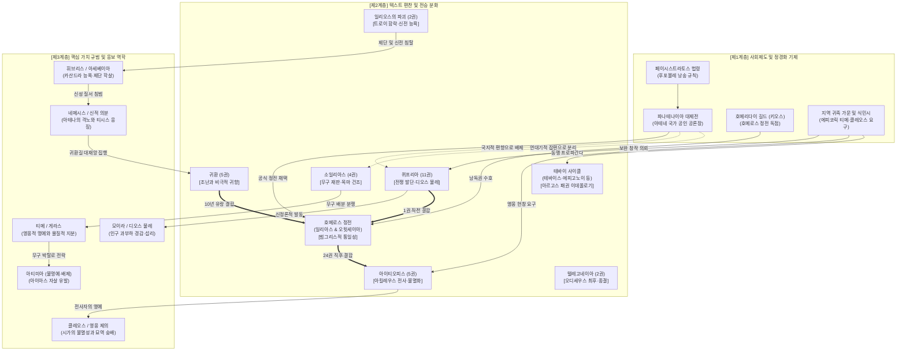
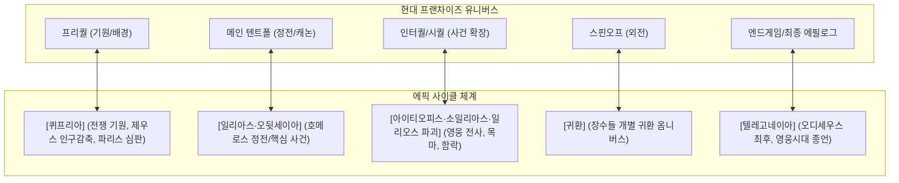

# 에픽 사이클 (Epic Cycle)

**[[greek-reading-guide|읽는 법]]**: 에픽 사이클 · **원어**: ἐπικὸς κύκλος · **학술 전사**: *epikòs kúklos*

## 1. 개념 정의 및 기본 성격 (Definition & Core Thesis)

- **핵심 정의**: **에픽 사이클**(Epic Cycle; 희랍어: ἐπικὸς κύκλος, *epikòs kúklos*; 관용 라틴명 Epic Cycle)은 고대 그리스 아르카익기(기원전 8~6세기경)에 성립하여 헬레니즘 시대에 집대성된 육보격(Dactylic Hexameter) 서사시군으로서, 트로이아 전쟁이나 테바이 전쟁과 같은 거대한 영웅 신화 체계를 태초의 신화적 기원부터 영웅 시대의 최종 종결에 이르기까지 연대기적 인과율에 따라 하나의 완결된 원환(Cycle, 둥근 고리) 형태로 직조해 낸 일련의 서사시 연작 총체를 가리킵니다.
- **연구사적 핵심 테제**:
  1. **신화적 연대기 완결성과 서사적 공백 충원** (M. L. West 2013): 호메로스의 양대 서사시인 『일리아스』와 『오뒷세이아』가 10년의 전쟁과 10년의 방랑 중 각각 50여 일과 40여 일이라는 극히 제한된 위기 국면만을 극적으로 집중 조명한 반면, 에픽 사이클 시인들은 전쟁의 신적 발단(『퀴프리아』)부터 영웅들의 최후와 전사(『아이티오피스』, 『소일리아스』, 『일리오스의 파괴』, 『귀환』), 그리고 오디세우스 가문의 비극적 종말(『텔레고네이아』)에 이르는 전체 서사 공간의 빈틈을 연대기적으로 메워 하나의 단절 없는 거대한 신화 연대기를 완성했습니다.
  2. **호메로스 시학과의 변증법적 긴장과 신분석파의 재평가** (Wolfgang Kullmann 1960, Jonathan Burgess 2001): 20세기 고전문헌학의 신분석파(Neo-analysis) 연구는 에픽 사이클이 호메로스의 단순한 아류나 조잡한 모방작이 아니라는 점을 규명했습니다. 사이클에 잔존한 모티프들(멤논의 참전과 아킬레우스의 전사, 무구 재판, 파리스의 심판 등)은 호메로스 이전부터 헬라스 전역에 구비 전승되던 원초적 구비 영웅 신화의 보고이며, 호메로스는 바로 이 공통의 신화적 지평을 청중이 이미 완벽히 인지하고 있음을 전제한 채 자신의 독창적 시학을 구축했습니다.
  3. **유기적 통일성 대 기계적 연대기 구성의 미학적 분기** (Aristoteles *Poet.* 1459a–b): 아리스토텔레스가 일찍이 간파했듯이, 호메로스가 '하나의 완결된 행동'(아킬레우스의 분노 또는 오디세우스의 귀환)을 중심으로 내적 유기성을 확보한 것과 달리, 사이클 시인들은 '한 시대 또는 한 인물에게 일어난 모든 사건'을 연대기적으로 나열하는 외연적 백과사전주의를 택했습니다. 이로 인해 사이클은 시적 통일성에서는 열등하다는 평가를 받았으나, 후대 5세기 아테네 비극 시인들과 헬레니즘·로마 문학자들에게는 무진장한 비극적 플롯과 신화 모티프의 원천을 제공하는 결정적 저수지 역할을 수행했습니다.
  4. **알렉산드리아 학술 편집과 '퀴클로스'의 제도화** (Proclus *Chrestomathia*): 본래 개별 음유시인들에 의해 독립적으로 유전되던 개별 서사시들을 하나의 체계적인 '사이클(에픽 사이클)'로 묶어 연대기순으로 배열하고 정전화한 것은 헬레니즘 시대 알렉산드리아 도서관의 문헌학적 편집 작업의 결실입니다. 이들은 호메로스의 두 정전을 중심축으로 삼고, 중복되는 서사 부분을 정비하여 그리스 신화 전체를 조망할 수 있는 정합적 교육·문헌 텍스트북을 완성했습니다.
- **개념적 범주 한계 및 오독 방지**:
  - **트로이 사이클 대 광의의 에픽 사이클**: 통상 통용되는 '에픽 사이클'은 트로이아 전쟁의 전말을 다룬 8편의 연작(『퀴프리아』, 『일리아스』, 『아이티오피스』, 『소일리아스』, 『일리오스의 파괴』, 『귀환』, 『오뒷세이아』, 『텔레고네이아』)을 의미하는 **트로이 사이클**(Trojan Cycle)을 주로 지칭합니다. 그러나 엄밀한 문헌학적 범주에서 에픽 사이클은 우주의 기원과 거인족과의 전쟁을 다룬 **신화 사이클**(Titanomachy 등) 및 오이디푸스 가문과 테바이 원정을 다룬 **테바이 사이클**(Oedipodea, Thebaid, Epigoni)을 포괄하는 상위 개념입니다.
  - **문전문헌적 실전 상태 인지**: 현재 호메로스의 양대 서사시를 제외한 사이클의 6편 서사시는 원형 그대로 현존하지 않으며, 9세기 비잔티움 총대주교 포티오스의 『비블리오테케』(codex 239)에 수록된 프로클로스의 『문학 요람』(Chrestomathia) 요약문 및 고대 주석가들의 단편 인용(Testimonia & Fragmenta)을 통해서만 복원된 2차적 재구성 텍스트임을 항시 유념해야 합니다.

---

## 2. 어원과 형태론적 분석 (Etymology & Morphology)

### 2.1 희랍어 κύκλος(kúklos)의 어원과 인도유럽어 계통
고대 그리스어 **퀴클로스**(κύκλος, *kúklos*, "바퀴, 원, 고리, 궤도, 순환")는 인도유럽조어(PIE) 어근 `*kʷel-`("돌다, 회전하다, 주변을 맴돌다")에서 비롯된 중복형(reduplicated thematic noun) `*kʷe-kʷl-o-` (또는 영급 어간 중복형 `*kʷu-kʷl-o-`)에 기원을 둡니다.

1. **음운 변천 과정**:
   - PIE의 어근 중복(reduplication)은 회전 운동의 반복성과 연속성을 상징하는 형태소입니다.
   - 모음 `*u`의 인접 또는 두 개의 순연구개음이 연쇄할 때 발생하는 이화(dissimilation) 규칙(부콜로스 규칙, Boukólos rule)에 의해 순음화가 억제되고 순수 연구개음 `*k`로 정착되었습니다. 이에 따라 `*kʷu-kʷlo-`는 규칙적 음운 변천을 거쳐 고대 그리스어 **κύκλος**(*kúklos*)로 정립되었습니다.
   - 미케네 그리스어(Linear B) 문서에서도 전차 바퀴 및 둥근 장비를 가리키는 파생 인명·직업명 계통(*ku-ke-re-u*)이 확인되어 청동기 시대로 거슬러 올라가는 깊은 역사를 증명합니다.
2. **인도유럽어파 주요 동근어(Cognates) 비교**:
   - **베다 산스크리트어**: `cakrá-` (m./n., "바퀴, 차크라"). PIE `*kʷe-kʷl-o-`의 첫 음절 순연구개음 `*kʷ`가 전설모음 `*e` 앞에서 구개음화(Indo-Iranian Palatal Law)를 거쳐 `c`(/tʃ/)로 변하고, 두 번째 `*kʷ`는 비구개음 환경에서 `k`로 유지되어 성립한 형태입니다.
   - **게르만어파 (영어 wheel)**: 원시 게르만어 `*hwehwlaz`는 그림의 법칙(Grimm's Law)에 따라 어두의 `*kʷ`가 무성 순연구개 마찰음 `*xʷ`(`hw`)로 변화하고, 베르너의 법칙을 거쳐 고대 영어 `hwēol`을 지나 현대 영어 **wheel**로 이어졌습니다.
   - **이탈리아어파 (라틴어)**: 기본 어근 `*kʷel-`은 라틴어로 직결되어 `colere`("경작하다, 돌보다" < 본래 "주변을 돌며 보살피다"), `collum`("목" < "회전하는 관절"), `cultus`("경작, 숭배, 문화")를 낳았습니다. 한편 그리스어 차용어인 `cyclus`("주기, 순환, 사이클")가 별도로 수용되어 서구 문학 용어로 정착했습니다.
3. **초기 그리스 문헌에서의 의미론적 확장**:
   - 호메로스 서사시에서 κύκλος는 일차적으로 전차의 "바퀴"(_Il._ 5.722)와 전사들이 둘러앉은 원형 집회석(_Il._ 18.504, *enì kúklōi*)을 의미했습니다.
   - 이후 고전기로 넘어가며 태양·달의 궤도, 천구(天球), 그리고 계절과 시간의 "순환 주기"(Cycle)라는 추상적·우주론적 개념으로 의미가 확장되었습니다.

### 2.2 희랍어 ἐπικός(epikós) 및 ἔπος(épos)의 어원과 계통
형용사 **에피코스**(ἐπικός, *epikós*, "서사시의, 육보격 시의")는 중성 명사 **에포스**(ἔπος, *épos*, "말, 구절, 시, 서사시")에 속성을 나타내는 관계 형용사 접미사 `-ικός`(*-ikós*)가 결합한 파생어입니다.

1. **인도유럽조어 어근과 음운 변천**:
   - PIE 어근 `*wekʷ-`("말하다, 소리 내어 발언하다")의 중성 s-어간 명사 `*wékʷ-os`에서 출발합니다.
   - 원시 헬라어 형태는 **디감마**(Ϝ, digamma)를 보존한 `*wépos`(Ϝέπος)였습니다. 호메로스 서사시의 육보격 운율에서 이 단어는 앞선 모음의 탈락(elision)을 방지하거나 선행 음절을 위치장음으로 만드는 등, 디감마의 음운론적 흔적을 텍스트 전반에 걸쳐 강력하게 드러냅니다.
   - 아티카-이오니아 방언에서 반모음 `*w`가 소실됨에 따라 `ἔπος`(*épos*)가 되었으며, 모음 축약에 의해 속격은 `ἔπεος`에서 `ἔπους`로, 복수 주/대격은 `ἔπεα`에서 `ἔπη`로 변천했습니다.
2. **인도유럽어파 동근어 비교**:
   - **산스크리트어**: `vácas-` (n., "말, 찬가, 문장"). 동사 어근 `vac-`("말하다") 및 주격 단수 `vāk`("목소리, 언어" < `*wōkʷ-s`)과 동근입니다.
   - **라틴어**: 어근 명사 `vōx` ("목소리, 낱말" < PIE `*wōkʷ-s`), 파생 동사 `vocāre`("부르다, 호명하다"), `vocālis`("목소리의, 모음"). 현대 영어의 **voice**, **vocal**, **vocation** 등은 라틴어 어근의 고대 프랑스어 차용 및 직접 수용을 통해 성립했습니다.
3. **의미론적 변천 (말에서 서사시로)**:
   - 본래 '입 밖으로 발화된 단일한 말이나 문장'을 뜻하던 ἔπος는 호메로스 정형구 '날개 달린 말들'(*épea pteróenta*)처럼 발화 행위 자체를 가리켰습니다.
   - 점차 서정시(노래, melos)나 연극 대사(drama)와 구별되는 **다크틸로스 육보격(Dactylic Hexameter) 운율로 낭송되는 시구**를 전문적으로 지칭하게 되었고, 복수형인 `ἔπεα`(*épea*) 또는 `ἔπη`(*épē*)는 '영웅 서사시'라는 장르 자체를 환유하는 표준 용어로 정착했습니다.

### 2.3 '에픽 사이클'(ἐπικὸς κύκλος) 복합 명칭의 문전문헌학적 성립사
현대 학계에서 트로이아 전쟁 및 테바이 전쟁 전설을 다룬 일련의 아르카익 서사시군을 일컫는 **에픽 사이클**(ἐπικὸς κύκλος, *epikòs kúklos*)이라는 복합 명칭은, 호메로스 당대나 고전기 전기에는 존재하지 않았던 문전문헌학적 신조어입니다.

1. **고전기 (기원전 5~4세기)의 호칭**: ‘**사이클 시인들(οἱ κυκλικοί)**’:
   - 헤로도토스, 플라톤, 아리스토텔레스는 '에픽 사이클'이라는 단일 명사구를 사용하지 않았습니다.
   - 대신 해당 서사시들을 창작한 시인 집단을 가리켜 **호이 퀴클리코이**(οἱ κυκλικοί [ποιηταί], *hoi kuklikoí [poiētaí]*, "사이클 시인들")라 부르거나, 그 작품들을 **타 퀴클리카 에페**(τὰ κυκλικὰ ἔπη, *tà kuklikà épē*, "사이클 서사시들")라는 복수 형용사구로 지칭했습니다.
2. **헬레니즘 알렉산드리아 학파의 도서관 분류학 (기원전 3~2세기)**:
   - 알렉산드리아 왕립 도서관의 학자들(제노도토스, 아리스토파네스 비잔티우스, 아리스타르코스, 그리고 목록학자 칼리마코스)은 호메로스의 정전(『일리아스』, 『오뒷세이아』)과 여타 아르카익 영웅 서사시들을 엄격히 분리할 필요에 직면했습니다.
   - 여기서 **퀴클로스**(κύκλος, "환, 고리")라는 은유가 체계화되었습니다. 이는 천지의 창조에서부터 테바이 전쟁, 트로이아 전쟁의 발단과 전개, 그리고 오디세우스의 최후에 이르기까지 **모든 신화적 연대기를 빈틈없이 연속된 하나의 거대한 '원형 고리'처럼 연결하여 완결 지었다**는 구조적 연속성(*akolouthía*)을 가리키는 서지학적 범주였습니다.
3. **제정기-후대 문법학자들에 의한 명사구 고착화 (기원후 2~9세기)**:
   - '에픽 사이클'(ὁ ἐπικὸς κύκλος, *ho epikòs kúklos*)이라는 단수 명사구의 명확한 문헌학적 용례는 로마 제정기의 문법학자 에우티키오스 프로클로스의 저작 『문학 요람』(Chrestomathia) 및 아테나이오스의 『학자들의 만찬』(Deipnosophistae, 7.277e)에서 확고하게 확립되었습니다.
   - 9세기 비잔티움 총대주교 포티오스(Photios)는 『비블리오테케』(codex 239)에서 프로클로스를 요약하며 에픽 사이클의 시들이 보존되어 읽히는 것은 시적 탁월성(*aretē*) 때문이라기보다는 사건들의 빈틈없는 연속성(*akolouthía*) 때문이라고 기록했습니다.

### 2.4 칼리마코스의 반(反)사이클 선언과 로마 시학의 수용
알렉산드리아 학파를 대표하는 시인이자 학자였던 **칼리마코스**(Callimachus, 기원전 310경~240)는 호메로스의 방대한 서사시를 무비판적으로 모방하여 장황하고 기계적인 사건 나열에만 몰두하던 당대의 아류 서사시인들을 격렬히 거부했습니다. 그의 미학적 신념은 유명한 에피그램 28(Anthologia Palatina 12.43 = Pfeiffer Epigr. 28)의 첫머리에 응축되어 있습니다:

- **텍스트 인용**:
  - **번역**: "나는 사이클 시를 증오하며, 이리저리 수많은 사람들을 실어 나르는 큰길을 기뻐하지 않는다. / 나는 두루 돌아다니는 연인을 미워하며, 공공의 샘터에서 물을 마시지 않는다. 나는 대중적인 모든 것을 역겨워한다."
  - **원문**: ἐχθαίρω τὸ ποίημα τὸ κυκλικόν, οὐδὲ κελεύθῳ / χαίρω, τίς πολλοὺς ὧδε καὶ ὧδε φέρει· / μισέω καὶ περίφοιτον ἐρώμενον, οὐδ' ἀπὸ κρήνης / πίνω· σικχαίνω πάντα τὰ δημόσια.
  - **학술 전사**: *ekhthaírō tò poíēma tò kuklikón, oudè keléuthōi / khaírō, tís polloùs hō̂de kaì hō̂de phérei; / miséō kaì períphoiton erṓmenon, oud' apò krḗnēs / pínō; sikkhaínō pánta tà dēmósia.*

칼리마코스에 의해 형용사 `κυκλικός`(*kuklikós*)는 '진부한', '판에 박힌', '독창성 없이 대중의 발길에 닳고 닳은'이라는 강한 경멸적(pejorative) 함의를 획득했습니다. 이는 로마의 시인 **호라티우스**(Horace)에게 계승되어, 『시학』(Ars Poetica, 136–139행)에서 "옛날의 사이클 시인(scriptor cyclicus)처럼 시작하지 마라... 산들이 진통을 겪고 있으나 태어나는 것은 우스꽝스러운 생쥐 한 마리뿐이다(*Parturiunt montes, nascetur ridiculus mus*)"라는 신랄한 풍자로 정착했습니다.

### 2.5 형태론 및 곡용 분석 표 (Morphological Paradigm)

| 구분 | 그리스어 실제형 | 학술 전사 | 문법 설명 및 호메로스/전승 용례 |
|:---|:---|:---|:---|
| 명사 단수 주격 | κύκλος | *kúklos* | 남성 명사 단수 주격. "바퀴, 원, 고리, 궤도". 호메로스 서사시에서 전차 바퀴(_Il._ 5.722) 및 원형 집회석(_Il._ 18.504)의 기본 표제형. |
| 명사 단수 속격 | κύκλου | *kúklou* | 남성 명사 단수 속격. "바퀴의, 원의, 회전의". 기하학적 둘레, 방패의 테두리, 또는 천체의 회전 궤적을 규정하는 속격형. |
| 명사 단수 여격 | κύκλῳ | *kúklōi* | 남성 명사 단수 여격. "원형으로, 둥글게, 둘러싸며". 호메로스 본문에서 처소 및 수단 부사구로 출현(_Il._ 13.551 적을 사방에서 에워쌈). |
| 명사 단수 대격 | κύκλον | *kúklon* | 남성 명사 단수 대격. "바퀴를, 원을, 궤도를". 동작의 직접 목적어(_Il._ 15.353 수레바퀴를 굴리다) 및 시간의 순환 주기(_Od._ 11.295 세월의 주기)로 출현. |
| 명사 복수 주격 | κύκλοι | *kúkloi* | 남성 명사 복수 주격. "바퀴들, 동심원들". 전차의 복수 바퀴나 겹겹이 둘러쳐진 원형 진형을 묘사할 때 사용. |
| 이형 중성 복수 | κύκλα | *kúkla* | 중성 명사 복수 주/대격. 호메로스 특유의 이변화(heteroclite) 복수형. PIE 집합명사 접미사 `*-eh₂`의 흔적(_Il._ 5.722 여덟 살 청동 바퀴들). |
| 파생 형용사 주격 | κυκλικός | *kuklikós* | 형용사 남성 단수 주격. "원형의, 순환하는, 사이클 시의". 그리스어 접미사 *-ikós* 결합. 칼리마코스에서 통속적·기계적 서사시를 경멸조로 지칭. |
| 파생 형용사 복수 | κυκλικοί | *kuklikoí* | 형용사/실질명사 남성 복수 주격. "사이클 시인들". 아리스토텔레스 주석가 및 알렉산드리아 학파 문법가들이 호메로스 외 아르카익 서사시 작가군을 총칭. |
| 복합 명사구 주격 | ἐπικὸς κύκλος | *epikòs kúklos* | 남성 복합 명사구 단수 주격. "에픽 사이클(에픽 사이클)". 프로클로스 『문학 요람』, 포티오스 『비블리오테케』에서 아르카익 연작 서사시군 전체를 가리키는 표준 학술 명칭. |
| 어근 기원 명사 단수 | ἔπος | *épos* | 중성 명사 단수 주/대격. "말, 전언, 구절, 육보격 시행". PIE `*wekʷ-os` 기원, 원시 헬라어 디감마 보존형(Ϝέπος). 서사시 전반에서 신탁, 연설, 시적 발언을 지칭. |
| 어근 기원 명사 복수 | ἔπεα | *épea* | 중성 명사 복수 주/대격. 호메로스 미축약형(아티카 축약형 *épē*). "말들, 시구들, 서사시". 호메로스 정형구 '날개 달린 말들'(*épea pteróenta*) 및 서사시 장르 환유. |
| 파생 동사 현재 | κυκλέω | *kukléō* | 동사 현재 능동태 직설법 1인칭 단수. "빙빙 돌리다, 회전시키다, 둘러싸다". 쟁기를 돌려 밭을 갈거나(_Il._ 18.543), 강물이 시신을 소용돌이치게 하는 역동적 운동 묘사. |

---

## 3. 호메로스 서사시 내 작동 메커니즘과 상호텍스트성 (Narrative Mechanisms & Neo-analysis)

### 3.1 호메로스의 서사적 집중과 사이클의 연대기적 연속성 (총 77권 매트릭스)

트로이 사이클은 트로이아 전쟁의 발발 원인부터 영웅시대의 최종적 종언까지를 한 치의 서사적 단절 없이 인과적 연쇄로 엮어낸 8편의 대서사시 연작(총 77권)입니다:

| 순번 | 작품명 및 원제 | 권수 | 전승 작가 및 기원지 | 핵심 서사 매듭 및 결실부 처리 |
|:---:|:---|:---:|:---|:---|
| 1 | **퀴프리아** (*Cypria*, *Kúpria*) | 11권 | 살라미스의 스타시노스 (Stasinos) 또는 헤게시아스 (Hegesias) | 가이아의 탄원과 제우스의 뜻(Boulē Dios), 에리스의 사과와 파리스의 심판, 헬레네 납치, 아울리스 집결과 이피게네이아 희생, 텔레포스 원정, 테네도스 상륙과 필록테테스 유기, 트로이아 상륙전, 아킬레우스의 주변 도시 약탈, 크뤼세이스·브리세이스 분배. 『일리아스』 1.1의 직전 상황까지 서술. |
| 2 | **일리아스** (*Ilias*, *Iliás*) | 24권 | 호메로스 (Homer) | 아킬레우스의 분노([[concept-menis\|Mênis]]) 발발, 아카이아군의 위기, 파트로클로스의 대리 출진과 전사, 아킬레우스의 참전과 헥토르 살해, 헥토르의 장례식(총 51일간의 서사). |
| 3 | **아이티오피스** (*Aethiopis*, *Aithiopís*) | 5권 | 밀레토스의 아르크티노스 (Arktinos) | 헥토르 장례 직후 아마존 여왕 펜테실레이아 참전 및 전사, 에티오피아 왕 멤논 도착, 네스토르의 아들 안틸로코스 전사, 아킬레우스-멤논 결투와 멤논 전사, 스카이아 문 앞 아킬레우스 전사(파리스와 아폴론), 테티스의 백도(Leuke) 이송 및 불멸화, 아킬레우스 무구를 둘러싼 분쟁(hoplōn krisis) 발발. |
| 4 | **소일리아스** (*Ilias Mikra*, *Iliàs mikrá*) | 4권 | 피라의 레스케스 (Leskhes) | 무구 재판(오디세우스 승리), 아이아스의 광기와 자결, 헬레노스 포획을 통한 트로이 함락 3대 조건 예언, 필록테테스 귀환 및 파리스 사살, 네오프톨레모스 참전, 목마 제작, 오디세우스·디오메데스의 팔라디온 탈취. |
| 5 | **일리오스의 파괴** (*Ilioupersis*, *Ilíou pérsis*) | 2권 | 밀레토스의 아르크티노스 (Arktinos) | 라오코온의 참화, 목마의 성내 진입, 시논의 신호와 야습, 궁궐 함락, 네오프톨레모스의 프리아모스 제단 도륙, 아스티아낙스의 성벽 투하, 카산드라 능욕(소아이아스)과 아테나의 분노, 폴릭세네의 아킬레우스 무덤 산제물, 도시 소각. |
| 6 | **귀환** (*Nostoi*, *Nóstoi*) | 5권 | 트로이젠의 아기아스 (Agias) | 아테나의 분노로 인한 아가멤논-메넬라오스 결별, 카페레우스 암초에서의 소아이아스 익사, 네오프톨레모스의 육로 귀환, 아가멤논의 귀환과 아이기스토스·클리타임네스트라에 의한 암살, 오레스테스의 복수, 메넬라오스의 이집트 방랑과 스파르타 귀환. |
| 7 | **오뒷세이아** (*Odyssea*, *Odússeia*) | 24권 | 호메로스 (Homer) | 오디세우스의 10년 표류와 귀환([[concept-nostos\|Nostos]]), 텔레마코스의 편력, 구혼자 학살과 이타카 왕권 회복, 페넬로페와의 재회. |
| 8 | **텔레고네이아** (*Telegonia*, *Tēlegonía*) | 2권 | 키레네의 에우가몬 (Eugamon) | 구혼자 매장, 오디세우스의 엘리스 제의 방문, 테스프로티아 원정과 재혼, 이타카 복귀, 키르케와 오디세우스의 아들 텔레고노스(Telegonos)의 상륙 약탈, 가오리 가시 창에 의한 오디세우스 오인 살해, 유해 수습 후 아이아이아 섬 이송, 키르케에 의한 4인의 불멸화와 영웅시대의 종결. |

### 3.2 신분석파(Neo-analysis) 이론과 멤논 서사(Memnonis)의 전이
신분석파(페스탈로치, 카크리디스, 쿨만, 버제스)가 거둔 가장 결정적인 문헌학적 성과는 『일리아스』 후반부의 중심축인 '파트로클로스-헥토르-아킬레우스'의 비극적 삼각 구도가 『아이티오피스』의 ‘**안틸로코스-멤논-아킬레우스' 서사**’(Memnonis 모티프)를 구조적으로 전이·변형한 것이라는 사실입니다:

1. **대리자의 전사와 절친의 복수**: 『아이티오피스』에서 아킬레우스에게 가장 소중한 전우였던 안틸로코스가 부친 네스토르를 구하려다 새벽의 여신 에오스의 아들 멤논에게 전사합니다. 아킬레우스는 비탄에 잠겨 복수를 감행하여 멤논을 죽입니다. 『일리아스』에서 파트로클로스는 안틸로코스의 역할을 대행하는 일종의 분신(therapōn)으로 창출되었습니다.
2. **신적 무구(Hephaestian Armor)의 모티프 역전**: 『아이티오피스』에서 멤논은 헤파이토스가 직접 제작한 신적 무구를 입고 전장에 등장합니다. 『일리아스』에서 호메로스는 이 모티프를 정교하게 비틀어, 파트로클로스가 아킬레우스의 옛 무구를 입고 나갔다가 헥토르에게 빼앗기게 만들고, 아킬레우스가 테티스를 통해 헤파이토스로부터 '새로운 신적 무구'를 받아 출진하게 만듭니다.
3. **안틸로코스의 전령 역할**: 『일리아스』 18.1–21에서 파트로클로스의 전사 소식을 아킬레우스에게 전하는 인물이 다름 아닌 **안틸로코스**라는 사실은, 호메로스가 청중들에게 『아이티오피스』 전통의 멤논 서사를 강렬하게 환기시키는 고도의 메타시학적 장치입니다.
4. **죽음의 운명적 즉시성 (_Il._ 18.95–96)**:
   - **텍스트 인용**:
     - **번역**: "헥토르 다음에는 네 운명이 즉시 준비되어 있느니라."
     - **원문**: αὐτί카 γάρ τοι ἔπειτα μεθ' Ἕκτορα πότμος ἑτοῖμος
     - **학술 전사**: *autíka gár toi épeita meth' Héktora pótmos hetoîmos*
   이 구절은 헥토르 살해 직후 아킬레우스가 전사하지 않는 『일리아스』의 내부 전개로 볼 때 기이한 경고이지만, 『아이티오피스』에서 멤논을 죽인 직후 아킬레우스가 스카이아 문에서 즉각 화살에 맞아 전사하는 사이클의 원형적 플롯을 청중에게 전제하고 있음을 입증합니다.

### 3.3 테바이 사이클(The Theban Cycle) 3부작의 전승 구조
테바이 사이클은 트로이아 전쟁보다 1세대 앞선 라브다코스 가문(Labdakidai)의 저주와 테바이 왕권 쟁탈전을 다룬 서사군으로, 호메로스 서사시 곳곳(『일리아스』 4·5권 디오메데스의 무훈)에서 중요한 신화적 전거로 소환됩니다:
1. 『**오이디포데이아**』 **(Oedipodea, 6,600행, 키나이톤 작)**: 오이디푸스가 스핑크스를 물리치고 모친 에피카스테(이오카스테)와 결혼하나, 진실이 밝혀진 후 에피카스테는 자결하고 오이디푸스는 에우뤼가네이아(Euryganeia)와 재혼하여 네 자녀를 낳는 고졸기 원형 전승을 보존.
2. 『**테바이스**』 **(Thebaid, 7,000행, 파우사니아스가 극찬한 서사시)**:
   - **텍스트 인용**:
     - **번역**: "여신이여, 목마른 아르고스를 노래하소서, 그곳에서 군주들이..."
     - **원문**: Ἄργος ἄειδε, θεά, πολυδίψιον, ἔνθεν ἄνακτες
     - **학술 전사**: *Árgos áeide, theá, poludípsion, énthen ánaktes*
   - 오이디푸스의 저주, 아르고스 왕 아드라토스를 맹주로 한 7장수의 출정, 에테오클레스와 폴리네이케스의 상호 도륙.
3. 『**에피고노이**』 **(Epigoni, 7,000행)**:
   - **텍스트 인용**:
     - **번역**: "이제 뮤즈들이여, 젊은이들의 전쟁을 노래하기 시작하노라..."
     - **원문**: Νῦν αὖθ' ὁπλοτέρων ἀνδρῶν ἀρχώμεθα, Μοῦσαι
     - **학술 전사**: *Nûn aûth' hoplotérōn andrô̂n arkhṓmetha, Moûsai*
   - 10년 후 7장수의 아들들(알크마이온, 디오메데스 등)이 테바이를 완전히 함락·파괴하고 부친들의 복수를 완수한 전승.

---

## 4. 핵심 에피소드 및 원전 텍스트 정밀 독해 (5 Key Episodes)

### 4.1 [에피소드 1] 『퀴프리아』 단편 1: 인구 과잉과 제우스의 뜻(Boulē Dios)
- **서사적 맥락**: 『일리아스』 1.5의 고대 주석(Schol. D ad Il. 1.5)에 보존된 단편. 가이아(대지)의 고통과 인구 과잉을 해결하기 위한 제우스의 우주론적 섭리가 트로이아 전쟁의 궁극적 발단임을 밝힙니다.

- **텍스트 인용**:
  - **번역**: "제우스께서는 이를 보시고 가련히 여기시어 슬기로운 마음속에서 결심하셨으니, / 만물을 기르는 대지에서 인간의 짐을 덜어주기로 하셨도다. / 일리오스 전쟁의 거대한 불화를 일으켜 죽음으로 대지의 무게를 비우고자 하셨으니, / 영웅들은 트로이아에서 죽어갔고, 제우스의 뜻은 그렇게 이루어졌도다."
  - **원문**: Ζεὺς δὲ ἰδὼν ἐλέησε καὶ ἐν πυκιναῖς πραπίδεσσι / σύνθετο κουφίσαι ἀνθρώπων παμβώ토ρα γαῖαν, / ῥιπίσσας πολέμου μεγάλην ἔριν Ἰλιακοῖο, / ὄφρα κενώσειεν θανάτου βάρος· οἱ δ' ἐνὶ Τροίῃ / ἥρωες κτείνοντο· Διὸς δ' ἐτελείε토 βουλή.
  - **학술 전사**: *Zeùs dè idṑn eléēse kaì en pukinaîs prapídessi / súntheto kouphísai anthrṓpōn bambṓtora gaîan, / rhipíssas polémou megálēn érin Iliakoîo, / óphra kenṓseien thanátou báros; hoi d' enì Troíēi / hḗrōes kteínonto; Diòs d' eteleíeto boulḗ.*

### 4.2 [에피소드 2] 『아이티오피스』 단편: 아킬레우스의 전사와 테티스의 백도(Leuke) 불멸화
- **서사적 맥락**: 프로클로스 『문학 요람』(Chrestomathia 172–178 Severyns / West p. 112). 아킬레우스가 파리스와 아폴론 신에게 전사한 후, 화장터 장작더미에서 구출되어 흑해 백도로 이송되어 불멸의 존재가 되는 장면입니다.

- **텍스트 인용**:
  - **번역**: "그 후 테티스는 장작더미에서 자기 아들을 낚아채어 백도(Leuke) 섬으로 옮겨 놓았도다. 한편 아카이아인들은 무덤을 쌓아 올리고 장례 경기를 거행하였노라."
  - **원문**: καὶ μετὰ ταῦτα ἐκ τῆς πυρᾶς ἡ Θέτις ἀναρπάσασα τὸν παῖδα εἰς τὴν Λευκὴν νῆσον διακομίζει· οἱ δὲ Ἀχαιοὶ τὸν τάφον χώσαντες ἀγῶνα τιθέασιν.
  - **학술 전사**: *kaì metà taûta ek tē̂s purâs hē Thétis anarpásasa tòn paîda eis tḕn Leukḕn nē̂son diakomízei; hoi dè Akhaioì tòn táphon khṓsantes agō̂na tithéasin.*

### 4.3 [에피소드 3] 『소일리아스』 단편: 무구 재판(hoplōn krisis)과 아이아스의 자결
- **서사적 맥락**: 아리스토파네스 『기사』 1056행 주석(Schol. Aristoph. Eq. 1056 / Ilias Mikra fr. 2 West) 및 프로클로스 요약문. 헤파이토스제 무구를 둘러싼 오디세우스와의 분쟁에서 패배한 아이아스의 광기와 자살을 기록합니다.

- **텍스트 인용**:
  - **번역**: "아이아스는 격전 속에서 영웅 펠레우스의 아들을 들어 메고 나왔으나, / 고귀한 오디세우스는 그리하려 하지 않았노라."
  - **원문**: Αἴας μὲν γὰρ ἄειρε καὶ ἔкφερε δηϊοτῆτος / ἥρω Πηλεΐδην, οὐδ' ἤθελε δῖος Ὀδυσσεύς.
  - **학술 전사**: *Aías mèn gàr áeire kaì ékphere dēïotē̂tos / hḗrō Pēleḯdēn, oud' ḗthele dîos Odusseús.*

### 4.4 [에피소드 4] 『일리오스의 파괴』 단편: 프리아모스 도륙과 아스티아낙스 투하
- **서사적 맥락**: 제체스(Tzetzes ad Lyc. 1268 / Ilias Mikra fr. 29 West) 및 프로클로스 요약문(Chrestomathia 239–251 Severyns). 함락의 광기 속에서 벌어진 비극적 잔학 행위의 정점입니다.

- **텍스트 인용**:
  - **번역**: "그는 아름답게 땋은 머리의 유모 품에서 아이를 빼앗아 / 발을 잡고 탑 위에서 내던져 버렸으니, 떨어지는 아이를 / 검붉은 죽음과 가혹한 운명이 덮쳐 버렸도다."
  - **원문**: τόν ῥα λαβὼν ἐκ κόλπου ἐϋπλοκάμοιο τιθήνης / ῥῖψε ποδὸς τεταγὼν ἀπὸ πύργου, τὸν δὲ πεσόντα / ἔλλαβε πορφύρεος θάνατος καὶ μοῖρα κραταιή.
  - **학술 전사**: *tón rha labṑn ek kólpou eüplokámoio tithḗnēs / rhîpse podòs tetagṑn apò púrgou, tòn dè pesónta / éllabe porphúreos thánatos kaì moîra krataiḗ.*

### 4.5 [에피소드 5] 『텔레고네이아』 단편: 오디세우스의 살해와 영웅시대 종결
- **서사적 맥락**: 프로클로스 『문학 요람』(Chrestomathia 318–340 Severyns / West p. 166). 에픽 사이클 전체의 최종 마침표를 찍는 비극적 결말부입니다.

- **텍스트 인용**:
  - **번역**: "텔레고노스는 아버지를 찾아 항해하다가 이타카에 상륙하여 그 섬을 약탈하니, / 오디세우스가 구원하러 출진하였다가 아들인 줄 알지 못한 채 살해당하였으니, / 텔레고노스의 창끝에는 바다 가오리의 독가시가 달려 있었기 때문이라."
  - **원문**: Τηλέγονος δὲ πλέων ἐπὶ ζήτησιν τοῦ πατρὸς ἀποβὰς εἰς τὴν Ἰθάκην δῃοῖ τὴν νῆσον· / ἐκβοηθήσας δὲ Ὀδυσσεὺς ὑπὸ τοῦ παιδὸς ἀναιρεῖται κατ' ἄγ노ιαν, / ἔχοντος τοῦ Τηλεγόνου κέντρον τρυγόνος θαλασσίας ἐπὶ τοῦ δόρατος.
  - **학술 전사**: *Tēlégonos dè pléōn epì zḗtēsin toû patròs apobàs eis tḕn Ithákēn dēiô̂i tḕn nē̂son; / ekboēthḗsas dè Odusseùs hupò toû paidòs anaireîtai kat' ágnoian, / ékhontos toû Tēlegónou kéntron trugónos thalassías epì toû dóratos.*

---

## 5. 사회제도 및 다른 개념과의 상호작용망 (Mermaid Network)

### 5.1 파나테나이아 제전과 페이시스트라토스 정경화
기원전 6세기 아테네 참주 페이시스트라토스와 그의 아들 히파르코스는 대 파나테나이아 제전에서 랍소도스(서사시 낭송자)들에게 호메로스의 시편들을 “**앞사람이 멈춘 곳에서 이어받아 순서대로(ἐξ ὑποβολῆς ἐφεξῆς, *ex hupobolē̂s ephexē̂s*)**” 낭송하도록 법제화했습니다(위-플라톤 『히파르코스』 228b).
- **정전 선별의 이유**: 아테네는 범그리스적(Panhellenic) 통합을 위해 특정 가문의 국지적(Epichoric) 이권이 짙은 사이클 시편들(키프로스의 아프로디테 숭배를 강조한 『퀴프리아』, 밀레토스의 흑해 식민 개척과 연결된 『아이티오피스』, 키레네 왕조를 현창한 『텔레고네이아』)을 배제하고, 보편적 시민 윤리와 통일성을 성취한 『일리아스』와 『오뒷세이아』만을 국가 공인 정전으로 격상시켰습니다.
- **호메리다이 길드와 지방 귀족의 상보성**: 키오스 섬의 호메리다이(Homeridai) 길드가 호메로스 낭송권을 독점한 반면, 사이클 시인들은 호메로스가 소외시킨 지방 영웅들(팔라메데스, 멤논, 소아이아스)에게 티메(명예)와 클레오스(명성)를 공급하는 계보학적 보완 기능을 수행했습니다.
- **테바이 사이클과 아르고스 헤게모니**: 헤로도토스(5.67)에 따르면, 시퀴온의 참주 클레이스테네스는 아르고스와의 전쟁 중 "아르고스 영웅들을 끊임없이 찬미한다"는 이유로 시퀴온 내 랍소도스의 서사시 낭송을 전면 금지했습니다. 이는 서사시 전승이 단순한 문학이 아니라 폴리스 간 영토 헤게모니를 다투는 국가적 프로파간다였음을 증명합니다.

### 5.2 개념 상호작용망 다이어그램

---

## 6. 윤리학 및 심리철학적 함의 (Ethics & Narratology)

### 6.1 아리스토텔레스 『시학』(Poetics 1459a–b)의 서사미학적 판결
- **유기적 통일성(μία πρᾶξις) 대 연대기적 나열(πολυμυθία)**:
  아리스토텔레스는 시적 플롯(mythos)이 살아있는 동물(zōon)처럼 머리, 몸통, 사지가 필연적으로 결합된 '하나의 완결된 전체(hen holon kai teleion)'여야 한다고 역설했습니다. 호메로스는 10년의 전쟁 전체를 다루지 않고 '아킬레우스의 분노'라는 단 하나의 행동선을 잘라내어 유기적으로 직조했습니다.
- **8대 비극 난립 테제**:
  반면 에픽 사이클 시인들은 '트로이 전쟁'이라는 한 시대나 한 인물에게 일어난 모든 사건을 연대기순(post hoc)으로 나열하는 오류에 빠졌습니다. 이로 인해 『일리아스』와 『오뒷세이아』에서는 각 1~2편의 비극만 도출할 수 있지만, 『소일리아스』 하나에서만 무구 재판, 필록테테스, 네오프톨레모스, 에우리필로스, 걸인 변장, 트로이 함락 등 **8편 이상의 비극 소재가 난립**하게 되었습니다.

### 6.2 필멸성(Mortality)과 불멸화(Apotheosis)의 실존적 긴장
- **호메로스의 비극적 현실주의**:
  호메로스 서사시의 전 우주는 신(불사자 athanatoi)과 인간(필멸자 brotoi/thnetoi) 사이의 메울 수 없는 간극 위에 구축됩니다. 인간은 "나뭇잎의 세대"(_Il._ 6.146)이며, 하데스는 잿빛 그림자들의 침묵일 뿐입니다. 장-피에르 베르낭이 통찰했듯, **죽음이 절대적이고 비가역적인 상실이기 때문에** 유한한 인간이 단 하나뿐인 생명을 바치는 영웅적 결단(Arete)과 시들지 않는 명성(Kleos aphthiton)이 숭고한 도덕적 광채를 얻습니다.
- **에픽 사이클의 환상적 초월주의와 비극성의 증발**:
  반면 『아이티오피스』는 멤논과 아킬레우스를 불사자로 만들어 각각 올림포스와 흑해 백도(Leuke)로 승천시키며, 『텔레고네이아』는 키르케의 마법으로 오디세우스의 일가족 네 명 모두를 불멸자로 만들어 행복자의 섬으로 보냅니다. 죽음의 최종성이 지워지는 순간, 영웅적 고뇌와 희생은 '신격화에 앞선 통과의례'로 격하되며, 호메로스적 숭고미와 비극성은 증발하고 맙니다.

### 6.3 제우스의 뜻(Boulē Dios)의 두 얼굴
- 『**퀴프리아**』 **의 신학적 맬서스주의**:
  대지 가이아의 과부하를 덜기 위해 거대한 전쟁으로 인류를 도살하는 제우스의 계획은 고대 근동 『아트라하시스 서사시』(Atrahasis)의 우주적 위생학과 동형입니다. 영웅들은 신적 인구 감축 프로그램의 장기말에 불과합니다.
- 『**일리아스**』 **의 실존적 섭리**:
  호메로스는 가이아 탄원 설화를 배제하고, 제우스의 뜻(_Il._ 1.5)을 부당하게 모욕당한 아킬레우스의 명예(Time)를 회복해 주겠다는 개인적 섭리에 결속시켰습니다. 인간은 신의 장기말이 아니라 자유로운 심리적 결단과 도덕적 책임을 지는 주체(이중 동기화)로 서게 됩니다.

---

## 7. 종교 제의 및 인류학적 지평 (Hero Cults & Ritual Violence)

### 7.1 영웅 제의(Hero Cult)와 에픽 사이클의 성스러운 지리
- **흑해 백도(Leuke)의 아킬레우스 폰타르케스**:
  밀레토스인 아르크티노스의 『아이티오피스』에서 아킬레우스가 백도로 승천한 것은, 기원전 7세기 밀레토스의 흑해 식민화 운동과 정확히 맞물립니다. 올비아 등 식민 폴리스들은 백도에 거대한 성역을 짓고 '바다의 군주 아킬레우스(Achilleus Pontarches)'로 숭배했습니다(알카이오스 fr. 354).
- **영웅 묘역(Heroon)과 유해 이장(Translatio)**:
  기원전 8세기 암흑기 말기 청동기 묘역에 봉헌물이 폭증하는 '영웅 제의 부흥(Snodgrass)'이 일어났습니다. 영웅의 유골은 폴리스 영토 경계를 획정하는 주술적 부적이었습니다. 『소일리아스』에서 트로이 함락 조건으로 '펠롭스의 유골 이장'이 제시된 것은 스파르타의 오레스테스 유골 이장(헤로도토스 1.67)이나 아테네의 테세우스 유골 이장과 같은 국가적 수호 의례의 원형입니다.

### 7.2 인신공희(Human Sacrifice)와 피의 교환 의례
- **이피게네이아 희생과 사슴 대체**:
  『퀴프리아』에서 아르테미스에게 바쳐진 처녀가 사슴으로 대체된 것은, 발터 부르케르트(W. Burkert)가 지적했듯 인신공희에서 동물 희생으로 전환될 때 발생하는 원초적 살해 죄책감을 완화하는 통과의례(브라우론의 곰 의례 Arkteia)의 신화적 정초입니다.
- **아킬레우스 무덤 위 폴릭세네 참수**:
  『일리오스의 파괴』에서 트로이 공주 폴릭세네의 목을 베어 피를 무덤 흙으로 쏟아부은 것은 전형적인 지하 영웅 위령제(Enagismos)입니다. 망령은 피를 마셔야 분노를 가라앉힙니다.
- **호메로스의 정화 대 사이클의 원초성**:
  호메로스는 범그리스적 인본주의를 위해 인신공희를 철저히 은폐·정화한 반면, 에픽 사이클은 각 성역에서 거행되던 피의 제의와 금기(Taboo)를 날것 그대로 보존했습니다.

### 7.3 신성 모독(Sacrilege)과 세습적 미아스마(Miasma)
- **소아이아스의 카산드라 능욕과 로크리스 처녀 조공**:
  『일리오스의 파괴』에서 소아이아스가 아테나 신전 목간(Paladion)을 잡고 탄원하던 카산드라를 겁탈하자, 그 오염(Miasma)으로 인해 그리스 함대는 카페레우스 곶에서 대폭풍을 맞았습니다. 이 신성모독의 죄책은 세습되어 로크리스인들은 1천 년간 매년 두 명의 처녀를 트로이 아테나 신전의 노예로 바쳐야 했습니다(로크리스 비문 IG IX.1² 706).
- **네오프톨레모스의 제단 학살과 델포이 응보**:
  제우스 헤르케이오스 제단에서 프리아모스를 도륙한 네오프톨레모스는 훗날 델포이 아폴론 제단에서 똑같이 피를 흘리며 살해당했습니다(핀다로스 *Nem.* 7). 제단 앞에서 피를 흘리게 한 자는 제단 위에서 죽는다는 신성 사법(Dike)의 완성이었습니다.

---

## 8. 후대 문학 및 지성사적 수용 (Reception & Legacy)

### 8.1 아테네 3대 비극작가의 에픽 사이클 전면 수용
- **아이스킬로스의 역설**:
  아테나이오스(8.347e)는 아이스킬로스가 자신의 비극을 "호메로스의 성대한 잔칫상에서 떨어진 빵부스러기(temache)"라고 불렀다고 전합니다. 그러나 실제로 아이스킬로스가 취한 소재의 80% 이상은 호메로스 본문이 아니라 **에픽 사이클**(『귀환』 계열의 『오레스테이아』, 『아이티오피스』 계열의 『멤논』·『프시코스타시아』, 『소일리아스』 계열의 『무구 재판』)이었습니다.
- **소포클레스**:
  아테나이오스(7.277e)는 "소포클레스는 에픽 사이클 전체를 기뻐하며 그것으로부터 극을 지었다"고 증언합니다. 현존작 『아이아스』(무구 재판과 자살)와 『필록테테스』는 모두 『소일리아스』의 핵심 사건을 무대화한 걸작입니다.
- **에우리피데스**:
  『일리오스의 파괴』의 잔혹성을 취하여 『트로이아 여인들』(아스티아낙스 투하), 『헤카베』(폴릭세네 희생), 『아울리스의 이피게네이아』(퀴프리아) 등 전쟁의 참상과 권력의 위선을 폭로하는 반전 비극을 완성했습니다.

### 8.2 로마 서사시 및 고대 후기 문헌 전승
- **베르길리우스 『아이네이스』 제2권**:
  『일리아스』에는 없는 트로이 목마 침투, 시논의 연기, 라오코온의 죽음, 프리아모스의 제단 도륙 등 트로이 함락의 전말은 『일리오스의 파괴』와 『소일리아스』를 로마적 관점(아이네이아스의 pietas)에서 재창작한 것입니다.
- **오비디우스 『변신이야기』 12–13권**:
  『소일리아스』의 무구 재판을 아이아스와 울릭세스(오디세우스)의 화려한 로마 수사학적 법정 변론 대결(Armorum Iudicium)로 승화시켰습니다.
- **퀸투스 스미르나이오스 『호메로스 후일담』(Posthomerica, 4세기)**:
  실전된 『아이티오피스』, 『소일리아스』, 『일리오스의 파괴』의 내용을 14권의 대서사시로 전면 복원한 고대 후기의 유일무이한 1차급 간접 문헌입니다.

---

## 9. 학술적 쟁점 및 비판적 평가 (Scholarly Debates & Critical Assessment)

> [!WARNING] 학설 대립: 에픽 사이클의 역사성과 문헌적 실체에 관한 쟁점
> 에픽 사이클이 아르카익 시대에 실제로 기획된 유기적 연작이었는가, 아니면 헬레니즘 알렉산드리아 학자들의 사후적 편집물에 불과한가에 대해 고전학계의 입장은 첨예하게 갈립니다. 또한 프로클로스 요약의 1차 사료성 및 호메로스와의 영향 관계를 둘러싼 신분석파와 구비시가학파의 대립은 호메로스 서사시 형성사를 바라보는 근본적 시각 차이를 드러냅니다.

### 9.1 에픽 사이클 개념의 역사성 비판: 유기적 연작인가, 사후적 편집물인가?
- **전통적 통일성 가설에 대한 비판**: 19세기 문헌학은 호메로스가 『일리아스』와 『오뒷세이아』를 완성한 후, 후대 아르카익 시인들이 호메로스의 서사적 공백을 메우기 위해 8부작 에픽 사이클을 계획적으로 분담 창작했다고 보았습니다.
- **부르게스(Burgess 2001)의 사후 편집론**: 조너선 부르게스(The Tradition of the Trojan War)는 이를 '호메로스 중심주의적 착시'로 규정하고, '에픽 사이클'이라는 개념 자체가 헬레니즘 시대 알렉산드리아 도서관 학자들에 의해 구성된 사후적 편집물(retrospective construct)이라고 논증했습니다. 아르카익 시대에는 각지에서 독립적으로 유통되던 수많은 구비 서사시들이 존재했을 뿐이며, 알렉산드리아 문법학자들이 신화 연대기순으로 이들을 강제로 꿰어 맞추고 중복되는 경계를 잘라낸 것입니다. 현존 단편 속에서 『아이티오피스』, 『소일리아스』, 『일리오스의 파괴』는 사건의 경계선이 심각하게 겹칩니다.

### 9.2 프로클로스 요약의 문헌학적 한계와 신빙성
- **저자 정체성 논쟁**: 9세기 포티오스 『비블리오테케』(codex 239)에 수록된 요약본의 저자 '프로클로스'에 대해, 5세기 신플라톤주의 철학자 프로클로스 디아도코스 설과 2세기 로마 제정기 문법학자 에우티키오스 프로클로스 설이 맞섭니다. 현대 학계는 실용적 교재 성격으로 보아 2세기 문법학자설에 더 큰 무게를 둡니다.
- **2차 신화 편람의 재요약 가능성**: 로마 제정기 시점에 기원전 7~6세기의 방대한 육보격 원본 서사시가 온전히 남아 있었을 가능성은 희박합니다. 프로클로스는 원본 서사시가 아니라 알렉산드리아 학자들이 정리한 산문 신화 편람(Mythological handbooks)을 다시 요약한 '요약의 요약(epitome of an epitome)'을 작성했을 개연성이 대단히 높습니다. 따라서 프로클로스의 요약은 원작의 시적 구조가 탈색된 평면적 줄거리 메모로 다루어져야 합니다.

### 9.3 신분석파(Neo-analysis) vs 구비시가설(Oral Theory)
- **신분석파의 텍스트 차용 모델**: 페스탈로치와 쿨만 등은 『일리아스』 본문 속에 『아이티오피스』의 멤논 모티프가 선행 모델로 차용되어 있음을 밝혀내며, 호메로스 이전 서사시의 존재를 역추적했습니다.
- **구비시가설의 반론**: 밀먼 패리와 앨버트 로드의 구비공식구 이론, 그리고 그레고리 나기의 구비 전통론은 신분석파가 근대 문자 문학의 '텍스트 대 텍스트 차용' 모델을 구비 전통에 무리하게 투사했다고 비판합니다. 호메로스가 사이클 시인의 고정된 책을 베낀 것이 아니라, 동일한 거대한 범그리스 구비 전통의 테마와 모티프를 공유하여 변주한 것입니다.
- **신화 원형과 텍스트 아류의 변증법**: 신화적 모티프 자체는 호메로스와 대등하거나 선행하는 원형이지만, 오늘날 전하는 단편 텍스트의 언어와 형태는 기원전 6세기 이후 확립된 호메로스의 절대적 권위에 맞추어 조율된 후대적 아류작(Epigonen)의 성격을 공유합니다.

---

## 10. 현대적 통찰 및 인문학적 의의 (Modern Insights)

### 10.1 '시네마틱 유니버스'의 고대적 원형
현대 대중문화의 지배적 서사 양식인 '시네마틱 유니버스'(MCU, 스타워즈 확장 세계관)의 아키텍처는 기원전 7~6세기 에픽 사이클의 시스템과 구조적으로 완벽히 일치합니다:

1. **캐논과 프리퀄/시퀄**: 『일리아스』와 『오뒷세이아』가 독보적 통일성을 지닌 메인 정전(Canon)이라면, 『퀴프리아』는 전쟁의 발단을 다룬 프리퀄(Prequel)이며, 『아이티오피스』·『소일리아스』·『일리오스의 파괴』는 세대교체와 결전을 다룬 인터퀄/시퀄입니다.
2. **외전과 엔드게임**: 『귀환』(*Nostoi*)은 각 장수들의 경로를 다룬 옴니버스 외전이며, 『텔레고네이아』는 본편 영웅의 사후를 다루고 영웅시대를 닫는 엔드게임 에필로그입니다.

### 10.2 거대 서사의 아카이빙과 데이터베이스 소비
- **트랜스미디어 스토리텔링(Henry Jenkins)**: 단일 텍스트가 전체 세계관을 독점하지 않으며, 그리스 청중은 서사시 낭송, 비극 공연, 신전 부조, 도기 그림을 넘나들며 파편화된 조각들을 결합하여 머릿속에 '완전한 트로이아 세계관'을 스스로 구축했습니다.
- **네거티브 스페이스와 설정 채우기(Lore-filling)**: 호메로스는 극적 긴장을 위해 트로이 목마나 아킬레우스의 죽음 같은 대중적 클라이맥스를 서사적 여백(Negative Space)으로 처리했습니다. 에픽 사이클은 바로 이 서사적 공백을 빈틈없이 메우려는 집단적 '로어 채우기'의 산물이었습니다.
- **데이터베이스 소비(Azuma Hiroki)**: 에픽 사이클은 선형적으로 처음부터 끝까지 읽는 텍스트라기보다는, 영웅의 캐릭터성, 무구, 혈통, 기믹이 축적된 거대한 신화 데이터베이스였습니다. 고대 비극작가와 도기 화공들은 이 데이터베이스에서 요소를 검색하고 인출하여 새로운 예술로 리믹스했습니다.
- **2차 창작의 정전화 역설**: 오늘날 대중의 뇌리에 각인된 트로이아 전쟁의 대표적 이미지(목마, 아킬레우스의 발뒤꿈치 화살, 트로이 성채의 화염)는 호메로스의 『일리아스』 원전이 아니라 에픽 사이클이 정립한 설정들입니다. 2차 창작적 확장 세계관이 대중적 원형으로 등극한 궁극의 사례입니다.

---

## 11. 종합 매트릭스: 호메로스 서사시 텍스트 증거 원장 (Evidence Ledger Matrix)

| 주장 테제 | 원전·문헌 근거 위치 | 자료 유형 | 확실성 등급 | 적용 섹션 |
|:---|:---|:---|:---|:---|
| **제우스의 인류 감축 계획과 트로이 전쟁의 신적 기원** | _Il._ 1.5; *Cypria* fr. 1 West; [[cho-daeho-2007-gods-in-iliad\|조대호(2007)]] | 호메로스 서사시 및 사이클 단편 | 원전 명시 | 1절, 4절, 6절 |
| **파리스의 심판과 세 여신의 불화 모티프의 선행성** | _Il._ 24.25–30; *Cypria* arg. 1 West | 호메로스 본문 및 프로클로스 요약 | 원전 명시 | 1절, 3절, 4절 |
| **아울리스 집결과 뱀의 참새 포식 징조(10년 전쟁 예언)** | _Il._ 2.301–329; *Cypria* arg. 1 West | 호메로스 본문 및 아르카익 전승 | 원전 명시 | 3절, 4절 |
| **파리스의 헬레네 납치와 스파르타 궁정 침탈** | _Il._ 3.46–53, 3.174–176; *Cypria* arg. 1 West | 호메로스 본문 및 트로이 서사 | 원전 명시 | 1절, 4절, 5절 |
| **아킬레우스의 스퀴로스 은신 및 네오프톨레모스 출생** | _Il._ 9.666–668, 19.326–333; *Cypria* fr. 19 West | 호메로스 본문 및 영웅 계보학 | 원전 명시 | 3절, 4절, 6절 |
| **아킬레우스의 트로이아 주변 23개 도시 약탈 원정** | _Il._ 9.325–329; *Cypria* arg. 1 West | 호메로스 본문 및 원정 서사 | 원전 명시 | 3절, 5절 |
| **아마존 여왕 펜테실레이아와 에티오피아 국왕 멤논의 참전** | _Od._ 11.522, _Il._ 3.188–189; *Aethiopis* arg. 1 West | 호메로스 본문 및 신분석파 문헌 | 강한 학술 추론 | 3절, 4절, 8절 |
| **스카이아 문 앞 아킬레우스 전사 예언(파리스와 아폴론 협공)** | _Il._ 22.359–360; *Aethiopis* arg. 1 West | 호메로스 본문 및 영웅 종말 전승 | 원전 명시 | 3절, 4절, 6절 |
| **아킬레우스 장례식과 백도(Leuke) 불멸화 제의** | _Od._ 24.36–94; *Aethiopis* arg. 1 West; Alcaeus fr. 354 | 호메로스 본문 및 영웅 제의 비문 | 원전 명시 | 4절, 6절, 7절 |
| **아킬레우스 신성 무구 재판과 아이아스의 자살** | _Od._ 11.543–564; *Little Iliad* arg. 1 West | 호메로스 본문 및 비극 전승 | 원전 명시 | 3절, 4절, 8절 |
| **렘노스 섬의 필록테테스 유기와 헤라클레스의 활 귀환** | _Il._ 2.718–725, _Od._ 8.219; *Little Iliad* arg. 1 | 호메로스 본문 및 함락 조건 서사 | 원전 명시 | 3절, 4절, 7절 |
| **에페이오스의 목마(Doureios Hippos) 건조와 침투** | _Od._ 4.271–289, 8.492–520; *Little Iliad* / *Ilioupersis* | 호메로스 본문 및 함락 서사 | 원전 명시 | 3절, 4절, 10절 |
| **트로이 함락 참상(프리아모스 제단 학살 및 카산드라 능욕)** | _Od._ 8.514–520, 11.421–426; *Ilioupersis* arg. 1 West | 호메로스 본문 및 비극적 파멸사 | 원전 명시 | 3절, 4절, 7절 |
| **소아이아스 신성모독과 로크리스 처녀 조공 제의** | _Od._ 4.499–511; *Ilioupersis*; IG IX.1² 706 | 호메로스 본문 및 금석학 비문 | 역사적 실재 | 4절, 7절 |
| **귀환길 카페레우스 폭풍과 아가멤논 암살** | _Od._ 1.35–43, 3.130–185, 11.405–434; *Nostoi* | 호메로스 본문 및 가문 비극사 | 원전 명시 | 3절, 4절, 8절 |
| **텔레고노스에 의한 오디세우스 살해('바다로부터의 죽음')** | _Od._ 11.134–137; *Telegony* arg. 1 West; Burgess(2001) | 호메로스 예언 및 영웅시대 종결 | 강한 학술 추론 | 3절, 4절, 6절 |
| **호메로스의 유기적 통일성 대 사이클의 산만한 연대기적 나열** | Aristoteles *Poetica* 1459a30–1459b7 | 고전기 비평 철학 문헌 | 후대 수용 | 1절, 6절, 9절 |
| **신분석파의 원형 전승론 대 구비공식구 이론의 파생론 격돌** | Kullmann(1960), Burgess(2001) vs Parry/Lord; West(2013) | 현대 고전문헌학 학설사 | 논쟁적 | 1절, 3절, 9절 |

---

## 12. 자주 묻는 질문 (FAQ)

### Q1. 호메로스의 『일리아스』와 『오뒷세이아』는 왜 에픽 사이클에 포함되기도 하고 제외되기도 하는가?
- 트로이 전쟁의 전체 신화 연대기(Chronology)를 구성할 때는 『일리아스』(제2편)와 『오뒷세이아』(제7편)가 전쟁의 결정적 순간을 담당하는 핵심 축으로서 사이클 연작 체계 안에 포함됩니다. 그러나 문헌학적·장르사적 맥락에서 '에픽 사이클'이라 부를 때는, 호메로스의 정전(canon) 두 작품을 제외한 **나머지 실전된 6편의 비(非)-호메로스계 서사시군만을 구별하여 가리키는 편의적 용칭**으로 사용됩니다. 고대 알렉산드리아 학자들과 프로클로스 역시 이미 모든 그리스인이 필수 교양으로 암송하던 호메로스 본문은 요약에서 제외하고, 잊혀가던 나머지 6편만을 『문학 요람』에 수록했습니다.

### Q2. 에픽 사이클의 원본 텍스트들은 왜 모조리 실전(소실)되었는가?
- 첫째, **호메로스 서사시의 압도적 교육적·문화적 독점** 때문입니다. 고대 그리스의 파이데이아(Paideia, 교양 교육)는 철저히 호메로스 중심으로 이루어졌으며, 교육 현장에서 배제된 사이클 서사시들은 필사 수요가 급감했습니다. 둘째, **기원전 5세기 아테네 비극의 서사 흡수** 때문입니다. 아이스킬로스, 소포클레스, 에우리피데스 등 3대 비극 시인들이 에픽 사이클의 파편적 에피소드(이피게네이아 희생, 아이아스의 광기, 필록테테스, 트로이 여인들의 비극 등)를 극장 무대 예술로 완벽히 재창조하자 원본 육보격 서사시를 읽을 필요성이 사라졌습니다. 셋째, 고대 말기(4~6세기) 파피루스 두루마리에서 양피지 코덱스(책자본)로 도서 매체가 전환되는 과정에서, 막대한 필사 비용을 감당할 수 있는 정전(Homer)만이 선택 복제되었고 사이클 서사시들은 자연 도태되었습니다.

### Q3. 아킬레우스의 발뒤꿈치 약점 전승은 호메로스 서사시에 나오는가, 사이클에 나오는가?
- **호메로스는 물론 에픽 사이클 원본(『아이티오피스』)에도 일체 나오지 않습니다.** 호메로스의 『일리아스』에서 아킬레우스는 완벽한 필멸의 인간이며, 21권 스카만드로스 강변 전투에서 아스테로파이오스가 던진 창에 팔을 스쳐 붉은 피를 흘리는 장면이 명시됩니다(_Il._ 21.166–167). 에픽 사이클의 『아이티오피스』에서도 아킬레우스는 스카이아 문으로 돌진하던 중 파리스와 아폴론 신의 협공을 받아 전사할 뿐, '불사신'이나 '발뒤꿈치 유일 약점' 설정은 전무합니다. 어머니 테티스가 갓난아기 아킬레우스를 저승의 스틱스강에 담가 불사신으로 만들었으나 손으로 잡고 있던 발뒤꿈치만 물에 젖지 않아 치명적 약점이 되었다는 전승은, 기원후 1세기 로마 시인 스타티우스(Statius)의 서사시 『아킬레우스 이야기』(Achilleid, 1.269)에서야 비로소 문헌상 처음으로 확립된 로마 제정기의 매우 늦은 낭만적 윤색입니다.

### Q4. 트로이 목마 이야기는 『일리아스』 본문에 나오는가, 사이클에 나오는가?
- 트로이 목마의 건조, 침투, 함락의 전말은 『**일리아스**』 **본문에는 단 한 줄도 나오지 않습니다.** 『일리아스』는 트로이 전쟁 10년째의 50여 일간 벌어진 '아킬레우스의 분노'만을 다루며, 목마가 등장하기 훨씬 전인 헥토르의 장례식(24권)으로 서사가 완전히 끝납니다. 목마를 제작하고 트로이 성내로 잠입하여 도시를 불태운 본격적인 전말은 에픽 사이클의 『**소일리아스**』 **(Little Iliad)와 『일리오스의 파괴』(Ilioupersis)**에서 집중적으로 다루어졌습니다. 다만 호메로스의 후속작인 『오뒷세이아』 본문에서 메넬라오스의 회상(4권 271–289행), 파이아케스 궁정 음유시인 데모도코스의 노래(8권 492–520행), 저승에서 오디세우스가 아킬레우스에게 전하는 회고(11권 523–537행)를 통해 과거 사건으로 간략하게 회상(flashback)될 뿐입니다.

### Q5. 에픽 사이클은 호메로스보다 우수한가 열등한가?
- 평가의 잣대에 따라 완전히 상반된 결론에 도달합니다. **문학적·예술적 통일성의 잣대**(아리스토텔레스 『시학』 1459a–b)에서는 호메로스에 비해 명백히 열등합니다. 호메로스는 방대한 전쟁사 속에서 '분노'나 '귀환'이라는 단 하나의 완결된 행위(praxis)를 선택하여 극한의 극적 긴장과 예술적 통일성을 구축했습니다. 반면 사이클 시인들은 사건을 연대기순으로 지루하고 산만하게 나열하여, 한 작품 안에서 대여섯 편의 비극 소재가 난립하는 평면적 연대기(Chronicle) 수준에 머물렀습니다. 그러나 **신화학적·인류학적 원형 보존의 잣대**에서는 사이클이 결코 열등하지 않으며 독보적인 가치를 지닙니다. 호메로스는 자신의 고전적 품격과 인간 중심적 비극성을 확립하기 위해 원초적인 신화 요소(인간 희생 제의, 변신, 육체적 불멸화, 주술적 정화 의례 등)를 의도적으로 거세하거나 축소했습니다. 반면 에픽 사이클은 이러한 원시적·샤머니즘적·제의적 신화 요소들(이피게네이아와 폴릭세네의 인신공양, 아킬레우스의 백도 불멸화, 가오리 가시 창에 의한 오디세우스의 기괴한 죽음 등)을 날것 그대로 보존하고 있어, 고대 그리스 종교와 신화의 다원적 지형을 복원하는 데 대체 불가능한 학술적 보물창고 역할을 합니다.

---

## 관련 항목

- [[overview|호메로스 위키 대시보드]] — 호메로스 서사시 세계관 및 종합 안내
- [[wiki/index|위키 색인]] — 전체 문서 카탈로그 및 인덱스
- [[entity-achilles|아킬레우스 (Achilles)]] — 메니스(분노)에서 엘레오스(연민)로 이행하는 『일리아스』의 중심 영웅이자 에픽 사이클 전승의 핵심축
- [[entity-odysseus|오디세우스 (Odysseus)]] — 메티스와 노스토스를 통해 귀향과 왕권 회복을 수행하는 『오뒷세이아』의 중심 영웅
- [[entity-agamemnon|아가멤논 (Agamemnon)]] — 제우스적 스켑트론과 통치권의 정통성, 미망(Atē)과 비극적 노스토스의 중심축
- [[entity-hector|헥토르 (Hector)]] — 가족과 공동체를 수호하는 시민적 책무와 영웅 규범의 파괴적 모순을 체현하는 트로이아 총사령관
- [[entity-paris|파리스 (Paris)]] — 트로이아 전쟁의 원인을 제공한 왕자이자 아프로디테의 은사와 궁술을 체현하는 영웅
- [[entity-neoptolemos|네오프톨레모스 (Neoptolemos)]] — 아킬레우스의 아들이자 트로이 함락의 주역으로 프리아모스 학살과 폴릭세네 희생을 집행한 전사
- [[concept-menis|메니스 (Menis)]] — 우주적 질서를 흔드는 신적 분노이자 『일리아스』 전체를 추동하는 핵심 동인
- [[concept-nostos|노스토스 (Nostos)]] — 시련을 딛고 조국과 가정으로 돌아가는 영웅적 귀환 모티프
- [[concept-time|티메 (Time)]] — 신적 배당과 전사 공동체의 인정 경제를 구성하는 가치 체계
- [[concept-kleos|클레오스 (Kleos)]] — 필멸의 인간이 시가와 영웅 제의를 통해 획득하는 시들지 않는 불멸의 명성
- [[concept-moira|모이라 (Moira)]] — 신들과 인간 모두에게 할당된 존재론적 한계이자 피할 수 없는 몫
- [[concept-aidos|아이도스 (Aidos)]] — 사회적 비난에 대한 두려움과 내면적 억제 및 타인에 대한 경외심
- [[concept-nemesis|네메시스 (Nemesis)]] — 몫과 질서를 침범한 오만(휘브리스)에 발동하는 공적 의분과 신적 응징
- [[concept-hikesia|히케시아 (Hikesia)]] — 신체 접촉 의례를 통한 신성한 탄원과 제우스 히케시오스의 약자 보호 규범
- [[concept-eleos|엘레오스와 오익토스 (Eleos & Oiktos)]] — 타인의 불행에 대한 감정적 억제와 비경쟁적 지반에서 발동하는 적극적 연민
- [[concept-geras|게라스 (Geras)]] — 공동체가 군주와 영웅에게 헌정하는 물질적 특권 몫이자 명예의 가시적 표지
- [[concept-themis|테미스 (Themis)]] — 제우스가 군주에게 위탁한 신성한 선례이자 아고라의 공적 판례 및 공동체 질서
- [[concept-dike|디케 (Dike)]] — 상이한 씨족 간 분쟁 시 재판관이 올곧은 선을 긋는 정형구적 사법이자 제우스의 도덕 정의
- [[concept-ate|아테 (Ate)]] — 초자연적 원인에 의한 인지적 판단 마비와 치명적 과오 및 파멸적 손해의 연쇄
- [[concept-agathos|아가토스 (Agathos)]] — 군사적 무용(Arete)과 신적 혈통을 바탕으로 공동체를 수호하는 영웅적 귀족 전사
- [[word-achilles|Achilles (아킬레우스)]] — *Achilles' heel*, *Achilles tendon*, *Achillean*
- [[word-hector|Hector (헥토르)]] — *to hector*, *hectoring*, *hectorism*
- [[cho-daeho-2007-gods-in-iliad|조대호 (2007), 일리아스의 신들]] — 신들의 5대 이율배반성과 인간의 무지, conditio divina와 conditio humana의 서사시적 설명 분석
- [[lee-junseok-2024-iliad-jeongam|이준석 (2024), 정암학당 『일리아스』 해제]] — 분노(메니스)와 연민(엘레오스)의 서사적 이행과 한국어 강독 해제
- [[nagy-1979-best-of-achaeans|그레고리 나기 (1979), 아카이아인들의 최고 영웅]] — 서사시 전통과 영웅 제의론 및 클레오스 탐구
- [[analysis-homeric-ethics-literature-review|호메로스 윤리학 종합 분석]] — 호메로스 서사시 윤리학 특징 및 전 세계 연구사 종합 분석 리포트
