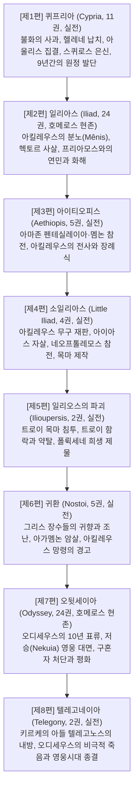

# 에픽 사이클 (Epic Cycle)

**[[greek-reading-guide|읽는 법]]**: 에픽 사이클 · **원어**: ἐπικὸς κύκλος · **학술 전사**: *epikòs kúklos*

## 1. 개요와 정의

**에픽 사이클**(Epic Cycle; 희랍어: ἐπικὸς κύκλος, *epikòs kúklos*)은 고대 그리스에서 트로이 전쟁이나 테바이 전쟁과 같은 거대한 신화적 서사 체계를 시작부터 결말까지 연대기순으로 엮어 **'하나의 둥근 고리(환, Cycle)'**처럼 완성한 서사시들의 모음집(연작 군)을 가리킵니다. 희랍어 원어로는 **에피코스 퀴클로스**(ἐπικὸς κύκλος)라 부릅니다.

일반적으로 '에픽 사이클'이라 할 때는 트로이 전쟁의 전말을 다룬 **'트로이 사이클(Trojan Cycle)'**을 주로 지칭하며, 넓은 의미로는 오이디푸스와 테바이 원정을 다룬 '테바이 사이클(Theban Cycle)' 및 신들의 기원을 다룬 '신화 사이클(Mythological Cycle)'을 포함합니다.

호메로스의 양대 서사시인 『일리아스』와 『오뒷세이아』(BC 8세기경)는 10년의 전쟁과 10년의 귀환이라는 방대한 시공간 중 극히 제한된 결정적 순간(각각 50여 일과 40여 일)만을 집중적으로 다루었습니다. 이에 따라 BC 7~6세기 아르카익 중기의 서사시인들은 호메로스가 다루지 않은 **전쟁의 발단, 영웅들의 전사, 트로이 목마와 함락, 그리고 각 영웅들의 귀환과 최후**를 보완하는 연작 서사시들을 창작하여 신화 전설 전체를 빈틈없이 완성했습니다.

---

## 2. 트로이 사이클의 연대기 구조 (8편)

트로이 사이클은 사건의 발생 순서에 따라 다음과 같은 8편의 육보격(Dactylic Hexameter) 서사시로 구성됩니다:

---

## 3. 작품별 상세 서사 및 전승

### 3.1 『퀴프리아』 (Cypria / Κύπρια, 11권) — 실전
- **추정 작가**: 살라미스의 스타시노스(Stasinos) 또는 키프로스의 헤게시아스.
- **주요 내용**:
  - 대지(가이아)의 과부하를 줄이기 위한 제우스의 인류 절멸 계획(트로이 전쟁의 신적 기원).
  - 펠레우스와 테티스의 결혼식, 불화의 여신 에리스의 황금 사과와 '파리스의 심판'.
  - 파리스의 헬레네 납치와 스파르타 침탈, [[entity-agamemnon|아가멤논]]과 메넬라오스의 그리스 전역 동원령.
  - [[entity-achilles|아킬레우스]]의 참전을 막기 위한 테티스의 스퀴로스섬 여장 은신, 데이다메이아와의 사이에서 [[entity-neoptolemos|네오프톨레모스]] 출생, [[entity-odysseus|오디세우스]]의 간계에 의한 징집.
  - 아울리스 집결, 바람을 잠재우기 위한 이피게네이아 희생 제물(사슴 대체 전승), 텔레포스의 상처 치유.
  - 트로이 해변 상륙(프로테실라오스 전사), 아킬레우스의 트로이아 주변 도시 9년간 공략, 크뤼세이스와 브리세이스 나포.

### 3.2 『일리아스』 (Iliad / Ἰλιάς, 24권) — 호메로스 현존
- 트로이 전쟁 10년째, 아가멤논과의 불화로 인한 [[entity-achilles|아킬레우스]]의 신적 분노([[concept-menis|Menis]])와 전선 이탈.
- [[entity-patroklos|파트로클로스]]의 출전과 [[entity-hector|헥토르]]에 의한 전사, 아킬레우스의 복수 복귀와 헥토르 사살.
- 프리아모스 왕의 야간 탄원([[concept-hikesia|Hikesia]]) 수용, 두 항아리 우화와 인간 조건에 대한 비극적 연민([[concept-eleos|Eleos]]), 헥토르 장례식으로 종결.

### 3.3 『아이티오피스』 (Aethiopis / Αἰθιοπίς, 5권) — 실전
- **추정 작가**: 밀레토스의 아르크티노스(Arktinos).
- **주요 내용**:
  - 헥토르 사후 트로이를 지원하러 온 아마존 여왕 펜테실레이아와 에티오피아 국왕 멤논(티토노스와 에오스의 아들)의 참전.
  - 아킬레우스가 펜테실레이아와 멤논을 일대일 결투 끝에 격살.
  - 스카이아 문으로 돌진하던 아킬레우스가 파리스와 아폴론 신의 협공을 받아 발뒤꿈치에 화살을 맞고 전사.
  - [[entity-ajax|아이아스]]와 [[entity-odysseus|오디세우스]]의 격렬한 유해 구출 작전, 테티스와 무사이들의 애가, 아킬레우스의 유골을 파트로클로스의 유골과 황금 항아리에 합장. 테티스가 아들을 흑해의 백도(레우케섬)로 데려가 불멸화했다는 전승 수록.

### 3.4 『소일리아스』 (Little Iliad / Ἰλιὰς μικρά, 4권) — 실전
- **추정 작가**: 피라의 레스케스(Lesches).
- **주요 내용**:
  - 아킬레우스의 헤파이토스제 신성 무구를 둘러싼 [[entity-odysseus|오디세우스]]와 [[entity-ajax|아이아스]]의 재판. 아테나의 개입으로 오디세우스 승리.
  - 패배한 아이아스의 광기(가축 도살)와 수치심에 의한 자살.
  - 예언자 헬레노스 생포 및 트로이 함락 조건 획득(헤라클레스의 활, 팔라디온 탈취, 펠롭스의 유골, [[entity-neoptolemos|네오프톨레모스]] 참전).
  - 렘노스섬의 필록테테스 귀환 및 파리스 사살, 아킬레우스의 아들 네오프톨레모스의 프티아 출전.
  - 에페이오스에 의한 트로이 목마(Wooden Horse) 건조.

### 3.5 『일리오스의 파괴』 (Ilioupersis / Ἰλίου πέρσις, 2권) — 실전
- **추정 작가**: 밀레토스의 아르크티노스(Arktinos).
- **주요 내용**:
  - 트로이인들의 목마 성내 진입 논쟁(라오코온과 카산드라의 경고 무시), 시논의 거짓 전향.
  - 야간에 목마에서 나온 그리스 특공대의 성문 개방과 그리스 본대의 상륙 및 기습.
  - 트로이 성채의 함락과 대약탈. [[entity-neoptolemos|네오프톨레모스]]가 제우스 헤르케이오스 제단에서 프리아모스 왕을 도륙.
  - 소(小)아이아스가 아테나 신전에서 카산드라를 겁탈(아테나의 저주 유발).
  - 아스티아낙스의 성벽 투하 사살, 트로이 공주 폴뤽세네를 아킬레우스의 묘역 봉분에 희생 제물로 바침.

### 3.6 『귀환』 (Nostoi / Νόστοι, 5권) — 실전
- **추정 작가**: 트로이젠의 아기아스(Agias).
- **주요 내용**:
  - 아테나의 분노로 인해 귀항길에 오른 그리스 함대에 닥친 카페레우스 곶의 대폭풍과 조난.
  - 출항 직전 아킬레우스의 망령이 나타나 [[entity-agamemnon|아가멤논]] 등에게 귀국 후의 참극을 예고.
  - 아가멤논의 미케네 귀환과 아내 클리타임네스트라 및 아이기스토스에 의한 암살, 오레스테스의 복수.
  - 메넬라오스의 이집트 표류와 네스토르의 안전한 귀환.

### 3.7 『오뒷세이아』 (Odyssey / Ὀδύσσεια, 24권) — 호메로스 현존
- 트로이 함락 후 [[entity-odysseus|오디세우스]]가 포세이돈의 분노로 인해 겪는 10년간의 험난한 해상 표류와 귀환([[concept-nostos|Nostos]]).
- 11권 저승(Nekuia)에서 아킬레우스 망령과의 대면("망령의 군주보다 지상의 머슴이 낫다").
- 이타카 궁정의 구혼자 처단, 아내 페넬로페와의 재결합, 아테나의 중재를 통한 내전 종식.

### 3.8 『텔레고네이아』 (Telegony / Τηλεγονία, 2권) — 실전
- **추정 작가**: 키레네의 에우가몬(Eugamon).
- **주요 내용**:
  - 구혼자 학살 이후 오디세우스의 에페이로스 테스프로티아 원정 및 속죄 의례.
  - 오디세우스와 마녀 키르케 사이에서 태어난 아들 텔레고노스가 아버지를 찾으러 이타카에 상륙.
  - 약탈자로 오인한 오디세우스와 텔레고노스의 교전, 텔레고노스가 가오리 가시 창으로 아버지를 찔러 살해.
  - 뒤늦게 친부를 깨달은 텔레고노스의 비탄, 텔레마코스 및 페넬로페와 함께 키르케의 아이아이아섬으로 오디세우스의 유해 운구.
  - 키르케의 마법에 의한 불멸화(텔레고노스-페넬로페, 텔레마코스-키르케의 결연)로 트로이 영웅 서사시 시대의 최종 종결.

---

## 4. 문헌학적 상태와 학술적 평가

### 4.1 실전(失傳)과 프로클로스의 요약
- 호메로스의 두 작품을 제외한 6편의 에픽 사이클 텍스트는 고대 말기-비잔티움 초기에 소실되었습니다.
- 현대 고전학이 에픽 사이클의 줄거리를 복원할 수 있는 것은 9세기 비잔티움 총대주교 **포티오스**(Photios)의 『비블리오테케』(Bibliotheke, codex 239)에 인용되어 전하는 **프로클로스**(Proclus)의 저작 **『문학 요람』**(Chrestomathia) 요약문 덕분입니다.
  > [!NOTE] 프로클로스 저자 문제
  > 이 요약본의 저자인 '프로클로스'가 5세기 신플라톤주의 철학자(Proclus Diadochus)인지, 2세기 마르쿠스 아우렐리우스 황제의 스승이었던 문법학자 에우티키오스 프로클로스(Eutychios Proklos)인지에 대해서는 학계의 이설이 존재합니다.
- **신분석파(Neo-analysis)의 평가**: 20세기 고전문헌학 연구(Kullmann, Burgess 등)는 에픽 사이클이 단순한 호메로스 모방작이 아니라, 호메로스 이전부터 구비 전승되던 다채로운 영웅 신화의 원형적 모티프들을 보존하고 있는 귀중한 지식의 보고로 재평가합니다.

### 4.2 아리스토텔레스 『시학』에서의 비판
아리스토텔레스는 『시학』(Poetics, 1459a–b)에서 호메로스와 에픽 사이클 시인들의 극적 구성력을 다음과 같이 대비하며 호메로스의 탁월성을 찬양했습니다:
- **호메로스의 통일성**: 호메로스는 트로이 전쟁 전체를 다루지 않고 '하나의 완결된 행동(아킬레우스의 분노 또는 오디세우스의 귀환)'만을 취하여 극적 긴장과 예술적 통일성을 확립했다. 『일리아스』와 『오뒷세이아』에서는 각 1~2편의 비극만을 만들 수 있다.
- **에픽 사이클의 연대기적 나열**: 반면 『퀴프리아』나 『소일리아스』의 작가들은 한 인물이나 한 시대의 모든 사건을 연대기순으로 산만하게 나열했기 때문에, 『소일리아스』 하나에서만 무구 재판, 필록테테스, 네오프톨레모스, 목마, 함락 등 8편 이상의 비극 소재가 난립하게 되었다.

---

## 관련 항목
- [[overview]] — 호메로스 위키 메인 대시보드
- [[wiki/index|전체 문서 카탈로그]]
- [[entity-framework]] — 엔티티 프레임워크 작성 지침
- [[entity-achilles|achilles]] — 아킬레우스 엔티티 문서 (에픽 사이클 전승 수록)
- [[concept-menis|Menis]] — 일리아스의 핵심 모티프 (신적 분노)
- [[concept-nostos|Nostos]] — 귀환 모티프와 오뒷세이아
- [[concept-themis|Themis]] — 신성 관습과 영웅 사회 규범
- [[concept-aidos|Aidos]] — 수치심과 경외
- [[analysis-homeric-ethics-literature-review]] — 호메로스 서사시 윤리학 종합 분석
