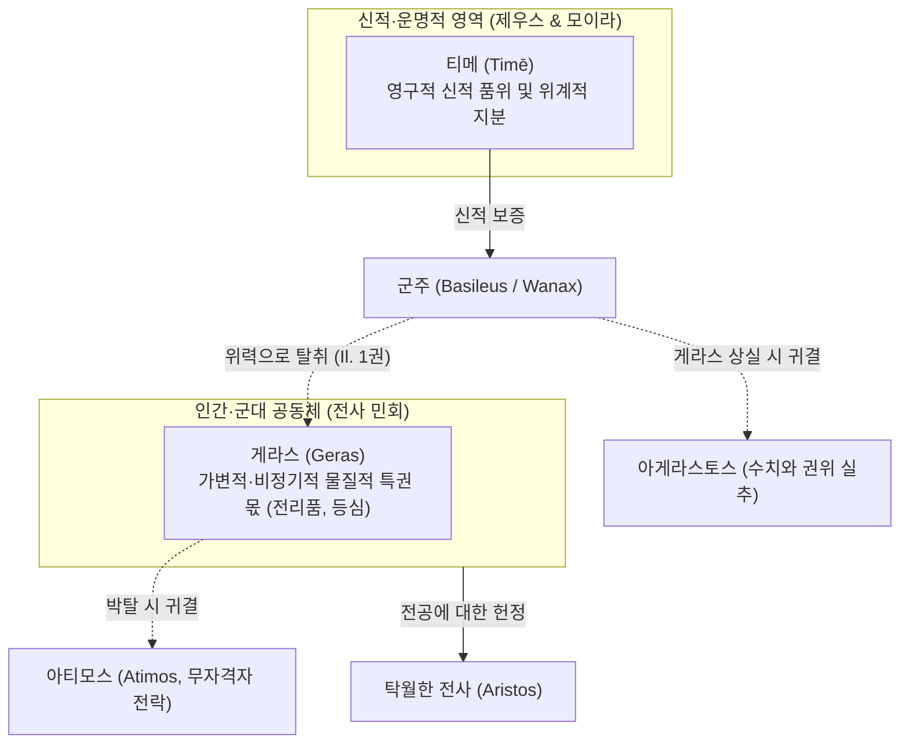

# 게라스 (Geras)

**[[greek-reading-guide|읽는 법]]**: 게라스 · **원어**: γέρας · **학술 전사**: *géras*

## 1. 개념 정의 및 어원학적 기원

**게라스**(γέρας, *géras*; 관용 라틴명 Geras)는 호메로스 영웅 사회에서 전사 공동체(군대)가 도시를 약탈하거나 전쟁에서 획득한 공동 전리품을 일반 전사들에게 균등 분배([[concept-moira|모이라]])하기에 앞서, 최고 군주([[entity-agamemnon|아가멤논]])나 탁월한 전공을 세운 영웅([[entity-achilles|아킬레우스]])에게 공식적으로 헌정하는 ‘**물질적 특권 몫**’(Part d'honneur / Prerogative), 그리고 연회에서 군주에게 바쳐지는 최상의 고기 부위(등심)를 뜻하는 핵심 제도 어휘입니다 ([[benveniste-1969-vocabulaire-institutions-2|Benveniste 1969]], II, pp. 43–50).

- **형태론 및 고대성**:
  - 그리스어 고대 중성명사 `-as`형(κέρας, τέρας, δέπας, κρέας)에 속하며, 인도유럽 공통조어 중성 e-모음도수를 원형 그대로 보존합니다.
  - 파생 형용사 게라로스(γεραρός, *gerarós*, 품위 있는), 동사 게라이로(γεραίρω, *gerairō*, 특권 몫을 바쳐 공경하다), 부정 형용사 아게라스토스(ἀγέραστος, *agérastos*, 특권 몫을 박탈당한)의 존재는 `*ger-as`와 `*ger-ar`의 교체(heteroclite)를 반영하는 심원한 고졸기 어형임을 증명합니다.
  - 미케네 선문자 B 점토판(PY Ta 711 등)에 이미 직무상의 특권을 가리키는 단어 `ke-ra`로 출현하여 미케네 궁전 관료제 이래의 제도적 연속성을 보여줍니다.

- **오스트호프(Osthoff 1906) 민간어원설의 완전한 반박**:
  - H. 오스트호프를 위시한 20세기 초 언어학계는 *일리아스*의 구절 "이것이 노인들의 게라스이다"(*tò gàr géras estì geróntōn*, *Il.* 4.323, 9.422)를 근거로, 게라스가 게론(γέρων, *gérōn*, "노인")에서 파생된 연령 계급적 특권이라고 주장하였고, 이는 오랫동안 정설로 군림했습니다.
  - 그러나 에밀 벤베니스트([[benveniste-1969-vocabulaire-institutions-2|Benveniste 1969]])는 문헌학적 전수 조사를 통해 이를 통렬히 논박했습니다:
    1. 서사시에서 노인에 관한 구절은 단 2회 등장할 뿐이며, 늙어서 전투에 나서지 못하는 노인이 군대에서 충고하거나(네스토르) 사절단으로 문서를 전하는 은유적 권리를 뜻할 뿐입니다.
    2. 반면 서사시에는 동일 구조의 공식구가 무려 6회나 등장하며, 선행 연구자들은 이를 의도적으로 묵살했습니다 (*Il.* 16.457, 16.675, 23.9; *Od.* 4.197, 24.190, 24.296):
      - **번역**: "이것이 죽은 자들의 게라스이다."
      - **원문**: τὸ γὰρ γέρας ἐστὶ θανόντων
      - **학술 전사**: *tò gàr géras estì thanóntōn*
      죽은 자의 매장과 비탄의 눈물이 망자의 마땅한 특권 몫이라고 해서, 게라스가 죽음과 어원적 관계를 맺는다고 주장할 수 없는 것과 마찬가지입니다.
    3. 음운론적 분리: '노령/늙음'을 뜻하는 게라스(γῆρας, *gē̂ras*)는 어간 모음이 장음 *ē*이며, 산스크리트어 *jarati*("쇠약해지다"), *jarant-*("노인")과 연결되어 육체적 노쇠와 쇠약을 가리킬 뿐입니다. 서사시에서 낡고 해진 방패를 '사코스 게론'(σάκος γέρον, *sákos géron*, *Od.* 22.184)이라 부르듯, 이 어근에는 권위나 명예의 뉘앙스가 일체 없습니다.
    4. 따라서 게라스(*géras*, 특권 몫)와 게론(*gérōn*, 노인)의 연결은 고대 주석가들과 근대 학자들이 빠져든 전형적인 민간어원(étymologie populaire)에 불과합니다.

| 어휘 (원어) | 학술 전사 | 품사 및 형태론 | 본래 의미 및 문헌학적 맥락 |
|:---|:---|:---|:---|
| **géras** (γέρας) | *géras* | 중성 명사 (단수 주격/대격) | 공동체가 군주나 영웅에게 헌정하는 비정기적 물질적 특권 몫, 등심 고기 |
| **gerarós** (γεραρός) | *gerarós* | 형용사 (남성 주격) | 게라스를 수여받아 위엄과 신체적 풍채를 갖춘, 당당한 |
| **gerairō** (γεραίρω) | *gerairō* | 동사 (현재 능동) | 특권적 몫을 바치다, 의례적 선물을 증정하여 높이다 |
| **agérastos** (ἀγέραστος) | *agérastos* | 복합 형용사 (부정 접두사 a-) | 유일하게 게라스를 받지 못해 전사단 전체 앞에서 수치스럽게 된 상태 |
| **gē̂ras** (γῆρας) | *gē̂ras* | 중성 명사 (장모음 ē) | 육체적 노쇠, 늙음 (*géras*와는 무관한 별개 어원) |

---

## 2. 게라스의 사회제도적 실체와 물질성

호메로스 서사시에서 게라스는 추상적 감정이나 심리적 자긍심이 아니라, **눈으로 확인되고 손으로 만져지는 구체적인 물질적 실체**입니다.

### (1) 전리품 분배 제도의 3단계 메커니즘
영웅 사회의 전리품 획득과 처분은 엄격한 제도적 절차를 따릅니다:
1. **공출 및 취합**: 정복한 도시나 적군에게서 노획한 재화, 가축, 여성 포로는 일단 군대 전체의 공유 자산으로 한곳에 모읍니다(*ksunēïa*, *Il.* 1.124).
2. **게라스(géras)의 선분배**: 전사 민회가 소집되면, 공동체는 장수들의 합의에 따라 최고 사령관 아가멤논과 당일 최고의 무공을 세운 아킬레우스 등 주역들에게 최상의 포획물(크뤼세이스, 브리세이스)을 게라스로 먼저 떼어 바칩니다.
3. **모이라(moira)의 균등 분배**: 게라스를 제하고 남은 나머지 전리품은 제비뽑기나 균등 배분을 통해 전 병사들에게 각자의 몫([[concept-moira|모이라]])으로 나누어집니다(*Il.* 1.163–168).

### (2) 식탁과 연회에서의 물질적 전형: 등심(nōta)
게라스의 물질성은 식탁 위의 고기 분배 의례에서 가장 원초적인 형태로 보존됩니다:
- 왕이나 귀빈이 참석한 공식 연회에서 주최자는 큰 솥에서 가장 기름지고 살코기가 풍성한 **소나 돼지의 등심/등뼈 부위**(νῶτα, *nōta*)를 잘라내어 게라스로 헌정합니다.
- *오뒷세이아* 4권 65행: 메넬라오스는 텔레마코스와 피시스트라토스를 영접하며 "자신에게 명예의 몫으로 주어진 구운 소의 기름진 등심"을 집어 두 젊은이에게 건넵니다.
- 『호메로스 찬가 (헤르메스 찬가)』 128행: 아폴론의 소를 도살한 헤르메스는 신들에게 바칠 제물을 12등분하면서, 가장 영예로운 몫을 "게라스의 등심(νῶτα γεράσμια, *nōta gerásmia*)"이라 부릅니다.
- 영토적 봉토인 [[concept-temenos|테메노스]](témenos)가 왕권에 부속된 영구적 농경지라면, 게라스는 매 출정이나 연회마다 새롭게 갱신되어 바쳐지는 비정기적 특권 재화입니다.

---

## 3. 게라스(Geras) 대 티메(Timē)의 제도적 위계

벤베니스트는 호메로스 서사시의 비극적 갈등을 정확히 이해하기 위해 **게라스와 [[concept-time|티메]](timē)의 범주적 차이**를 반드시 분리해야 한다고 강조합니다.

1. **수여 주체의 차이**:
   - **게라스**(géras)는 **인간 공동체**(전사단)가 특정 행동(무공, 전공)에 상응하여 비정기적으로 부여하고 철회할 수 있는 가변적 물질입니다.
   - **티메**(timē)는 **제우스와 운명**([[concept-moira|모이라]])이 태초에 배타적으로 분배한 영구적 신적 품위이자 사회적 지분입니다 (*Il.* 15.189 크로노스 세 아들의 티메 분할).
2. **외적 가시성과 내적 품위**:
   - 게라스는 티메를 시각적으로 증명해 주는 가장 확실한 '물질적 지표(Tangible token)'입니다. 높은 티메를 지닌 자는 당연히 공동체로부터 그에 상응하는 크기의 게라스를 받아야 합니다.
   - 만약 게라스를 강탈당하면, 비록 내적 탁월성([[concept-arete|아레테]])이 유지되더라도 외적 공인 체계가 붕괴하여 사회적 무자격자([[concept-time|아티모스]], *átimos*)로 전락합니다.

---

## 4. 『일리아스』 1권 분쟁의 제도사적 해명

『일리아스』 제1권의 파국적 충돌은 단순한 감정싸움이 아니라, **게라스 분배 규칙의 파탄과 두 군주권 논리의 정면충돌**입니다 ([[riedinger-1976-la-time-chez-homere|Riedinger 1976]], [[benveniste-1969-vocabulaire-institutions-2|Benveniste 1969]]):

### (1) 아가멤논의 공포: 유일한 아게라스토스(agérastos)의 수치
아폴론의 징벌로 인해 자신의 게라스인 크뤼세이스를 돌려보내야 했을 때, 아가멤논이 가장 두려워한 것은 전군 앞에서 자신만이 게라스를 갖지 못한 자가 되는 사태였습니다 (*Il.* 1.118–119):
- **번역**: "그러나 내게 즉시 게라스를 마련해 다오. 아르고스인들 가운데 나 혼자만 게라스를 갖지 못하는 일이 없도록 하라."
- **원문**: αὐτὰρ ἐμοὶ γέρας αὐτίχ' ἑτοιμάσατ', ὄφρα μὴ οἶος Ἀργείων ἀγέραστος ἔω
- **학술 전사**: *autàr emoì géras autíkh' hetoimásat', óphra mḕ oîos Argeíōn agérastos éō*

아가멤논에게 게라스의 부재는 단순한 전리품 손실이 아니라, 연합군 최고 사령관(*wanax andrōn*)으로서의 신분적 권위가 완전히 붕괴하는 치명적 굴욕이었습니다.

### (2) 아킬레우스의 정당한 분노: 몫의 침탈과 아티미아
아가멤논이 전군 공출품이 바닥난 상태에서 아킬레우스의 게라스인 브리세이스를 완력으로 강탈하자, 아킬레우스는 어머니 테티스에게 눈물로 호소합니다 (*Il.* 1.356):
- **번역**: "광막한 권력의 아가멤논이 나를 모욕했나이다. 내 게라스를 친히 빼앗아 자신이 소유하고 있나이다."
- **원문**: ἠτίμησεν· ἑλὼν γὰρ ἔχει γέρας αὐτὸς ἀπούρας
- **학술 전사**: *ētī́mēsen; helṑn gàr ékhei géras autòs apoúras*

아킬레우스는 전장에서 가장 피 흘려 싸운 자에게 전사 민회가 정당하게 부여한 게라스를 최고 권력자가 독단으로 찬탈한 처사에 경악하였으며, 이로 인해 아가멤논과의 봉건적 유대를 일체 단절하고 전선을 이탈하게 됩니다.

---

## 5. 호메로스 서사시 핵심 용례 분석

| 작품 및 행 번호 | 화자 및 상황 | 원어 인용구 | 학술 전사 | 제도적 의미 및 벤베니스트 테제 |
|:---|:---|:---|:---|:---|
| *Il.* 1.118–119 | 아가멤논 (민회) | Ἀργείων ἀγέραστος ἔω | *Argeíōn agérastos éō* | 최고 군주로서 게라스 박탈(*agérastos*)이 가져오는 정치적 파탄에 대한 원초적 공포 |
| *Il.* 1.355–356 | 아킬레우스 (테티스 앞) | ἑλὼν γὰρ ἔχει γέρας | *helṑn gàr ékhei géras* | 게라스 강탈이 곧 신분적 명예 침탈(*ētī́mēsen*)로 직결되는 메커니즘 |
| *Il.* 16.457 | 헤라 (사르페돈 전사 논의) | τὸ γὰρ γέρας ἐστὶ θανόντων | *tò gàr géras estì thanóntōn* | 매장, 무덤, 비석이 망자에게 바쳐지는 신성한 특권 몫임을 입증 (오스트호프설 반박) |
| *Od.* 4.65–66 | 메넬라오스 (궁정 연회) | νῶτα λαβὼν βοὸς | *nō̂ta labṑn boòs* | 연회에서 군주에게 게라스로 바쳐지는 최상의 고기 부위가 등심(*nōta*)임을 증명 |
| *Il.* 9.422 | 아킬레우스 (사절단 대답) | τὸ γὰρ γέρας ἐστὶ γερόντων | *tò gàr géras estì geróntōn* | 사절단 원로들이 충고를 건네는 구두 권리를 가리키는 파생적·은유적 용례 |

---

## 관련 항목

- [[concept-time|티메 (Timē)]]
- [[concept-moira|모이라 (Moira)]]
- [[concept-temenos|테메노스 (Temenos)]]
- [[entity-agamemnon|아가멤논]]
- [[entity-achilles|아킬레우스]]
- [[benveniste-1969-vocabulaire-institutions-2|에밀 벤베니스트 (1969), 인도유럽 제도 어휘집 2]]
- [[riedinger-1976-la-time-chez-homere|장클로드 리댕제 (1976), 호메로스에게서의 티메]]
- [[vleminck-1982-institutional-aspect-of-time|세르주 플레밍크 (1982), 어원학의 관점에서 본 호메로스 티메의 제도적 측면]]
