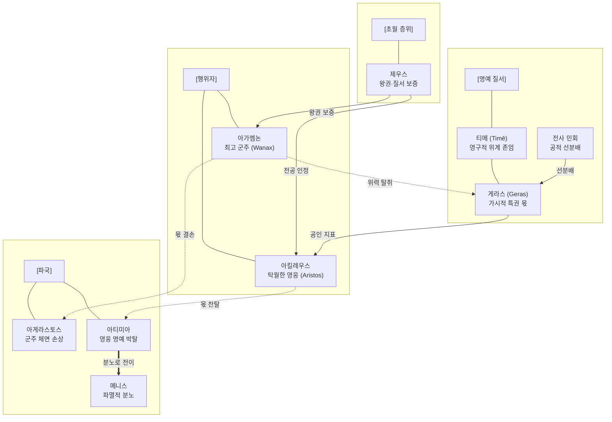

# 게라스 (Geras)

**[[greek-reading-guide|읽는 법]]**: 게라스 · **원어**: γέρας · **학술 전사**: *géras*

## 1. 개념 정의 및 기본 성격 (Definition & Core Nature)

**게라스**(γέρας, *géras*; 관용 라틴명 Geras)는 호메로스 영웅 사회에서 전사 공동체가 노획한 공동 전리품을 일반 전사들에게 균등하게 추첨 분배([[concept-moira|모이라]])하기에 앞서, 최고 군주([[entity-agamemnon|아가멤논]])나 전장에서 탁월한 무공을 세운 영웅([[entity-achilles|아킬레우스]], [[entity-ajax|아이아스]])에게 공식 민회의 합의를 거쳐 헌정하는 **물질적 특권 몫**(Part d'honneur / Prerogative)을 가리키는 핵심 제도 어휘입니다([[benveniste-1969-vocabulaire-institutions-2|Benveniste 1969]], II, pp. 43–50).

게라스는 결코 추상적인 관념이나 심리적 자긍심에 머물지 않으며, **공동체의 시선 앞에서 감각적으로 확인되고 만져지는 구체적 사물**로 실체화됩니다. 전장에서는 가장 아름답고 고귀한 여성 포로([[entity-chryses|크뤼세이스]], [[entity-briseis|브리세이스]])나 명마, 정교한 청동 갑주와 황금 잔의 형태로 수여되며, 평시 공식 연회에서는 소나 돼지의 가장 기름지고 풍성한 **최상급 등심 고기 부위**(νῶτα, *nō̂ta*)로 분배됩니다.

호메로스 서사시의 가치 체계에서 게라스는 다음과 같은 본질적 규정성을 지닙니다:
1. **공동체적 공인의 산물**: 개인이 전장에서 사적으로 노획한 약탈물(ληΐς, *lēḯs*)과 달리, 게라스는 전리품 전체를 군대의 공유 자산(ξυνήϊα, *ksunḗïa*)으로 모은 뒤 전사 민회(ἀγορή, *agorḗ*)의 공적 결의를 통해 공식적으로 수여되는 제도적 인정의 징표입니다.
2. **티메([[concept-time|Timē]])의 가시적 구현체**: 영웅이 지닌 추상적 권위와 신분적 존엄([[concept-time|티메]])은 눈에 보이지 않지만, 공동체가 그에게 안겨준 물질적 게라스를 통해 비로소 사회적으로 입증되고 보증됩니다([[vleminck-1982-institutional-aspect-of-time|Vleminck 1982]]).
3. **박탈 시의 실존적 파탄**: 게라스의 박탈은 단순한 재산 손실이 아니라, 공동체 구성원 전체 앞에서 자신의 전사적 가치와 존엄이 완전히 부정당하는 **아티미아**(ἀτιμία, 존재론적 불명예)이자 살아있는 사회적 죽음으로 귀결됩니다([[finkelberg-1998-time-and-arete|Finkelberg 1998]]).

---

## 2. 어원과 형태론적 분석 (Etymology & Morphological Analysis)

### (1) 어원학적 기원과 인도유럽조어(PIE) 배경
그리스어 게라스(γέρας)는 인도유럽조어(PIE) 고대 중성명사 *-os/-es- (그리스어 *-as) 어간 계열에 속합니다. 이 계열은 뿔(κέρας, *kéras*), 신적 표징(τέρας, *téras*), 술잔(δέπας, *dépas*), 살코기(κρέας, *kréas*) 등 고졸기 제의 및 물질문화와 밀접한 원초적 중성 명사들과 형태론적 형제 관계를 형성합니다(Chantraine, *DELG*, pp. 216–217).

- **어간 교체(Heteroclitic Declension)의 흔적**:
  게라스는 고졸기 인도유럽어의 전형적 특징인 `*ger-as`와 `*ger-ar` 간의 어간 교체 흔적을 보존합니다. 파생 형용사 게라로스(γεραρός, *gerarós*, 품위 있는, 위엄을 갖춘), 동사 게라이로(γεραίρω, *geraírō*, 특권 몫을 바쳐 공경하다), 그리고 부정 복합 형용사 아게라스토스(ἀγέραστος, *agérastos*, 특권 몫을 받지 못해 수치스러운)의 존재는 이 어휘가 원초적인 제의·제도 언어였음을 입증합니다.

### (2) 벤베니스트의 오스트호프 민간어원설 비판
초기 비교언어학자 헤르만 오스트호프(Hermann Osthoff 1906)는 서사시의 원로 자문 구절을 근거로, 게라스가 게론(γέρων, *gérōn*, 노인)에서 파생된 연령 계급적 특권이라고 주장했습니다:
- **번역**: "이것이 노인들의 게라스이다."
- **원문**: τὸ γὰρ γέρας ἐστὶ γερόντων
- **학술 전사**: *tò gàr géras estì geróntōn* (*Il.* 4.323, 9.422)

그러나 에밀 벤베니스트([[benveniste-1969-vocabulaire-institutions-2|Benveniste 1969]])는 음운론과 문헌 비교를 통해 이를 철저히 논박했습니다:

1. **음운론적 단절 (장모음 ē 대 단모음 e)**:
   - '노령/늙음'을 뜻하는 게라스(γῆρας, *gē̂ras*)는 어간 모음이 장음 *ē*이며, 인도유럽조어 `*ǵerh₂-`("성숙하다, 늙다")에서 유래하여 산스크리트어 *járati*("쇠약해지다"), *járan-*("노인")과 직결됩니다. *오뒷세이아* 22.184에서 낡아 해진 방패를 '사코스 게론'(σάκος γέρον)이라 부르듯, 이 어근은 권위나 명예가 아닌 육체적 마모와 쇠약을 가리킵니다.
   - 반면 특권 몫을 뜻하는 게라스(γέρας, *géras*)는 어간 모음이 명확한 단음 *e*이며, 품위와 특권을 부여하는 사회제도적 행위를 나타냅니다. 두 단어는 음운론적으로 완전히 별개의 어휘입니다.
2. **서사시 공식구의 은유적 전용**:
   - 호메로스 서사시에는 "이것이 죽은 자들의 게라스이다"(*Il.* 16.457, 23.9; *Od.* 4.197: 원문 τὸ γὰρ γέ라스 ἐστὶ θανόντων, 학술 전사 *tò gàr géras estì thanóntōn*)라는 완벽히 대칭적인 공식구가 존재합니다.
   - 망자의 장례와 봉분이 고유한 특권 몫이라고 해서 게라스가 '죽음'에서 파생되지 않은 것처럼, 원로들의 자문권 역시 전투에 나설 수 없는 노인들에게 공동체가 안배한 제도적·은유적 특권 몫일 뿐입니다. 따라서 게라스와 게론의 결합은 표면적 발음 유사성에 기인한 민간어원(étymologie populaire)에 불과합니다.

### (3) 미케네 선문자 B 점토판의 'ke-ra' 논쟁
미케네 궁전 점토판(Pylos Eb 416, Ep 704)에는 여사제 에리타(Eritha)와 지역 자치 공동체인 다모스(damos) 사이의 토지 분쟁 기록에서 *ke-ra*라는 어휘가 등장합니다:
- 일부 미케네 문헌학자들은 이 *ke-ra*를 호메로스적 게라스(*géras*)의 조상형으로 보아, 여사제가 신의 종 후아미아에게 부여한 면세 특권 토지(gift of honour)로 해석합니다.
- 반면 다른 학자들은 이를 뿔(κέρας, *kéras*)이나 직물/가죽 가공 기술과 관련된 세속적 명칭으로 신중하게 보류합니다. 따라서 미케네 관료제와 호메로스 서사시 간의 제도적 연속성은 학술적 논쟁 상태(Pending)에 놓여 있습니다.

### (4) 4열 형태론 표

| 구분 | 그리스어 실제형 | 학술 전사 | 문법 설명 및 호메로스 용례 |
|:---|:---|:---|:---|
| **중성 명사 (단수 주/대격)** | γέρας | *géras* | 단수 주격/대격. 공동체가 군주나 영웅에게 바치는 물질적 특권 몫, 등심 고기 (*Il.* 1.118, 7.321) |
| **중성 명사 (단수 속격)** | γέραος / γέρως | *géraos / gérōs* | 단수 속격. 특권 몫의 소유 및 귀속 관계를 명시 (*Il.* 2.614; *Od.* 20.297) |
| **중성 명사 (복수 주/대격)** | γέρα | *géra* | 복수 주격/대격. 축약형 (*géraa* → *géra*). 영웅들이 향유하는 복수의 특권들 (*Od.* 4.65) |
| **파생 형용사 (남성 주격)** | γεραρός | *gerarós* | 남성 단수 주격. 게라스를 지녀 품위 있고 당당한 풍채를 갖춘 상태 (*Il.* 3.170, 3.211) |
| **파생 동사 (현재 능동 3단)** | γεραίρει | *geraírei* | 3인칭 단수 현재 능동. 특권 몫을 주어 공식적으로 치하하고 높이다 (*Od.* 14.437) |
| **파생 동사 (미완료 능동 3단)** | γέραιρεν | *gérairen* | 3인칭 단수 미완료 능동. 등심 고기를 바쳐 치하하던 행위의 지속 (*Il.* 7.321) |
| **부정 형용사 (남성 주격)** | ἀγέραστος | *agérastos* | 남성 단수 주격. 부정 접두사 a- 결합. 게라스를 받지 못해 수치스러운 상태 (*Il.* 1.119) |
| **비교 대상: 노화 (중성 명사)** | γῆρας | *gē̂ras* | 중성 단수 주격 (장모음 ē). 육체적 쇠약과 늙음. *géras*와 어원적 무관 (*Il.* 1.29) |

---

## 3. 호메로스 서사시 내 작동 메커니즘 (Operational Mechanism in Homeric Epic)

호메로스 영웅 사회의 경제 및 권력 질서는 시장 거래나 화폐가 아닌 **호혜적 재분배**(Reciprocal Redistribution)를 축으로 작동합니다. 게라스는 이 분배 시스템의 정점에 위치한 장치입니다.

### (1) 전리품 분배의 3단계 순환 메커니즘
트로이아 원정군이 적의 도시나 촌락을 함락시키면, 노획물은 자의적으로 사유화되지 않고 엄격한 3단계의 공적 절차를 거칩니다:
1. **제1단계: 취합 및 공유 자산화 (ksunḗïa)**:
   - 노획된 모든 가축, 청동 무기, 보물, 여성 포로는 전사단 전체의 공동 자산(ξυνήϊα, *ksunḗïa*, *Il.* 1.124)으로 한곳에 집결됩니다. 이 단계에서 개인의 은닉은 엄격히 금지됩니다.
2. **제2단계: 전사 민회의 게라스 선분배 (Part d'honneur)**:
   - 전사 민회(ἀγορή, *agorḗ*)가 소집되면, 공동체는 전체 전리품을 개별 분배하기 전에 최고 총사령관 아가멤논과 당일 가장 눈부신 전공으로 신적 승리의 힘([[concept-kydos|쿠도스]])을 체현한 아킬레우스 등 주역들에게 최상의 몫을 게라스로 먼저 헌정합니다.
3. **제3단계: 잔여 전리품의 추첨 균등 분배 (dasmós / moira)**:
   - 게라스를 떼어내고 남은 전리품은 제비뽑기(dasmós)를 통해 일반 전사단 전체에게 공평한 몫([[concept-moira|모이라]])으로 균등하게 배분됩니다(*Il.* 1.125–126; *Od.* 9.42). 아무도 몫을 받지 못해 소외되는 일이 없도록 하는 평등주의적 장치입니다.

### (2) 식탁과 연회에서의 물질적 전형: 등심(νῶτα, nō̂ta)
게라스의 원형적 실체는 식탁 위의 육류 분배 의례에서 가장 원초적으로 체현됩니다:
- 전사 공동체의 공식 연회나 희생제사 잔치에서 주최자는 도살한 가축에서 가장 살코기가 풍성하고 기름진 **소나 돼지의 등심 부위**(νῶτα, *nō̂ta*)를 통째로 잘라내어 최고 귀빈이나 무공을 세운 전사에게 게라스로 건넵니다.
- 등심 고기는 단순한 칼로리 섭취원이 아니라, 전사단 전체가 지켜보는 가운데 한 인간의 위계와 전공을 시각적·미각적으로 승인하는 감각적 상징물입니다.

### (3) 테메노스(témenos)와의 제도적 비교
호메로스 사회에서 공동체가 영웅의 공적에 보답하여 떼어주는(τέμνω, *témnō*) 특권적 물질 보상에는 게라스 외에 [[concept-temenos|테메노스]](*témenos*, 봉토)가 존재합니다(*Il.* 12.310–328 [[entity-sarpedon|사르페돈]] 연설):
- **테메노스**: 군주나 영웅에게 영구적으로 귀속되는 비옥한 과수원 및 농경지로서, 세습적 가문 경제(oikos)를 지탱하는 '부동재(immovable property)'입니다.
- **게라스**: 매 전투의 승리나 연회마다 새롭게 갱신되어 전사 민회의 결의로 수여되는 '비정기적 이동재(movable property)'입니다. 게라스는 영웅이 현세에서 누리는 생생한 인정의 지표이자, 사후에 노래될 불멸의 명성([[concept-kleos|클레오스]])을 획득하기 위한 현실적 발판이 됩니다.

---

## 4. 핵심 에피소드 및 원전 텍스트 정밀 독해 (Key Narrative Episodes & Close Reading)

### (1) 에피소드 1: 아가멤논의 아게라스토스 공포와 아킬레우스의 아티미아 고발 (*Il.* 1.118–119, 1.135–139, 1.355–356)

- **텍스트 인용 1: 아가멤논의 공포**:
  - **번역**: "그러나 내게 즉시 게라스를 마련해 다오. 아르고스인들 가운데 나 혼자만 게라스를 갖지 못하는 자(아게라스토스)가 되는 일이 없도록 하라. 그것은 온당치 못한 일이기 때문이다."
  - **원문**: αὐτὰρ ἐμοὶ γέρας αὐτίχ' ἑτοιμάσατ', ὄφρα μὴ οἶος / Ἀργείων ἀγέραστος ἔω, ἐπεὶ οὐδὲ ἔοικε
  - **학술 전사**: *autàr emoì géras autíkh' hetoimásat', óphra mḕ oîos / Argeíōn agérastos éō, epeì oudè éoike* (*Il.* 1.118–119)

- **텍스트 인용 2: 아킬레우스의 존재론적 모멸 고발**:
  - **번역**: "아트레우스의 아들, 넓은 권능의 아가멤논이 나를 모욕하였습니다(모멸했습니다). 내 게라스를 손수 빼앗아 차지하고 있기 때문입니다."
  - **원문**: ἦ γάρ μ' Ἀτρεΐδης εὐρὺ κρείων Ἀγαμέμνων / ἠτίμησεν· ἑλὼν γὰρ ἔχει γέρας αὐτὸς ἀπούρας
  - **학술 전사**: *ē̂ gár m' Atreḯdēs eurù kreíōn Agamémnōn / ētímēsen; helṑn gàr ékhei géras autòs apoúras* (*Il.* 1.355–356)

- **정밀 분석**:
  아가멤논은 아폴론의 역병을 멈추기 위해 자신의 게라스인 크뤼세이스를 돌려보내야 하는 상황에 직면하자, 극심한 정치적 공황 상태에 빠집니다. 연합군 총사령관으로서 군대 전체에서 유일하게 '게라스를 받지 못한 자'(ἀγέραστος, *agérastos*)가 되는 것은 전통적 왕권 규범(`ἔοικε`)의 붕괴를 의미하기 때문입니다. 이미 공유 자산(ksunēïa)이 소진되었음에도 아가멤논은 완력으로 아킬레우스의 게라스인 [[entity-briseis|브리세이스]]를 강탈합니다. 이 행위는 전사 민회의 공적 결의를 최고 군주가 사적으로 유린한 폭거였으며, 아킬레우스에게는 자신이 목숨 걸고 세운 무공이 송두리째 부정당하는 절대적 명예 박탈(ἠτίμησεν, *ētímēsen*)이었습니다. 이 분배 정의의 붕괴가 10년간 지속된 트로이아 전쟁의 향방을 뒤흔든 아킬레우스의 신적 분노([[concept-menis|메니스]])를 점화합니다.

### (2) 에피소드 2: 아이아스의 단독 결투와 등심(νῶτα) 게라스 치하 (*Il.* 7.321–322)

- **텍스트 인용**:
  - **번역**: "그리고 그는 길게 썬 등심 부위로 아이아스를 예우하였다."
  - **원문**: νώ토ισιν δ’ Αἴαν타 διηνεκέεσσι γέραιρεν / ἥρως Ἀτρεΐδης εὐρὺ κρείων Ἀγαμέμνων
  - **학술 전사**: *nṓtoisin d’ Aíanta diēnekéesi gérairen / hḗrōs Atreḯdēs eurù kreíōn Agamémnōn* (*Il.* 7.321–322)

- **정밀 분석**:
  트로이아의 영웅 헥토르와 대등한 단독 결투를 벌이고 무사히 진영으로 귀환한 아이아스를 환영하며, 아가멤논은 5년 된 황소를 도살하여 성대한 잔치를 엽니다. 이때 아가멤논은 아이아스에게 소의 가장 길고 기름진 등심 부위(nō̂ta)를 통째로 헌정하며 동사 게라이로(γέραιρεν, "게라스로 예우하다")를 사용합니다. 결투에서 죽음을 무릅쓰고 아카이아 군대의 방벽 역할을 해낸 전사적 탁월성([[concept-arete|아레테]])에 대해, 최고 사령관이 전 장수들이 지켜보는 식탁에서 물리적 고기의 최상급 부위를 건넴으로써 그의 무공을 공식적으로 치하하고 서열을 재확인하는 전형적인 게라스 수여 장면입니다.

### (3) 에피소드 3: 사르페돈의 노블레스 오블리주와 물질적 게라스의 대가 (*Il.* 12.310–328)

- **텍스트 인용**:
  - **번역**: "글라우코스여, 어찌하여 뤼키아에서 우리는 상석과 고기 부위와 가득 찬 술잔으로 최고의 영예를 받으며, 모든 이들이 우리를 신처럼 우러러보는가? 또한 크산토스 강가에 아름다운 과수원과 밀밭으로 이루어진 넓은 테메노스를 차지하고 있는가? 그러므로 우리는 지금 뤼키아인들의 최전선에 서서 뜨거운 전투 속으로 당당히 걸어 들어가야만 하네."
  - **원문**: Γλαῦκε, τίη δὴ νῶϊ τετιμήμεσθα μάλιστα / ἕδρῃ τε κρέασίν τε ἰδὲ πλείοις δεπάεσσιν / ἐν Λυκίῃ, πάντες δὲ θεοὺς ὣς εἰσορόωσι, / καὶ τέμενος νεμόμεσθα μέγα Ξάνθοιο παρ' ὄχθας ... / τὼ νῦν χρὴ Λυκίοισι μέτα πρώτοισιν ἐόντας / ἑστάμεν ἠδὲ μάχης καυ스테ίρης ἀντιβολῆσαι
  - **학술 전사**: *Glaûke, tíē dḕ nō̂ï tetimḗmestha málista / hédrēi te kréasín te idè pleíois depáessin / en Lukíēi, pántes dè theoùs hṑs eisoróōsi, / kaì témenos nemómestha méga Xánthoio par' ókhthas ... / tṑ nûn khrḕ Lukíoisi méta prṓtoisin eóntas / hestámen ēdè mákhēs kausteírēs antibolē̂sai* (*Il.* 12.310–316)

- **정밀 분석**:
  사르페돈의 이 불멸의 독백은 호메로스 영웅 사회에서 게라스와 테메노스가 결코 무임승차의 특권이 아님을 웅변합니다. 공동체 백성들이 영웅들에게 바치는 최상의 고기(kréasin / nō̂ta), 넘치는 잔(depáessin), 그리고 비옥한 토지(témenos)는 전쟁 시 가장 위험한 전선의 선봉(prṓtoisin)에 서서 목숨을 바쳐 싸워야 한다는 치명적인 군사적 책무와 완벽한 등가 교환 관계를 형성합니다. 게라스는 공동체의 보호 비용으로 지불되는 선급금이며, 영웅은 자신의 생명을 담보로 그 특권 몫의 정당성을 증명해야 합니다.

### (4) 에피소드 4: 사르페돈의 전사와 망자의 신성한 게라스 (*Il.* 16.456–457, 23.9)

- **텍스트 인용**:
  - **번역**: "그곳에서 그의 형제들과 친족들이 무덤과 비석으로 그를 장사지내리니, 이것이 바로 죽은 자들의 게라스이기 때문입니다."
  - **원문**: ἔνθα ἑ ταρχύσουσι κασίγνητοί τε ἔται τε / τύμβῳ τε στήλῃ τε· τὸ γὰρ γέ라스 ἐστὶ θανόντων
  - **학술 전사**: *éntha he tarkhúsousi kasígnētoí te étai te / túmbōi te stḗlēi te; tò gàr géras estì thanóntōn* (*Il.* 16.456–457)

- **정밀 분석**:
  사르페돈이 파트로클로스의 창에 맞아 전사했을 때, 제우스는 아들의 시신이 훼손되지 않도록 슬픔과 잠의 신(Hypnos & Thanatos)을 보내 뤼키아 고향 땅으로 운구하게 합니다. 헤라와 제우스가 확인하듯, 무덤(túmbos)을 쌓고 비석(stḗlē)을 세우며 눈물과 애도의 의식을 치르는 것은 "죽은 자들에게 돌아가는 유일하고 신성한 특권 몫(tò gàr géras estì thanóntōn)"입니다. 산 자에게 게라스가 전리품과 등심 고기이듯, 필멸의 한계를 다하고 목숨을 바친 영웅에게 공동체가 바칠 수 있는 마지막이자 불가침의 게라스는 온전한 시신의 매장과 영구한 기억의 비석입니다.

### (5) 에피소드 5: 에우마이오스의 환대와 식탁의 게라스 (*Od.* 14.437–438, 4.65)

- **텍스트 인용**:
  - **번역**: "그리고 그는 긴 등심 부위로 주인의 마음을 영광스럽게(드높게) 하였다."
  - **원문**: κύδαινε δὲ θυμὸν ἄνακτος / νώτοισιν δ' ἤγειρε διηνεκέεσσι συός
  - **학술 전사**: *kúdaine dè thumòn ánaktos / nṓtoisin d' ḗgeire diēnekéesi suós* (*Od.* 14.437–438)

- **정밀 분석**:
  돼지치기 에우마이오스는 남루한 거지 차림으로 찾아온 오디세우스의 정체를 알지 못하면서도, 환대의 신 제우스의 가르침([[concept-xenia|크세니아]])에 따라 자신이 가진 최상의 5년 된 거세 멧돼지를 잡습니다. 고기를 일곱 몫으로 나누어 님프들과 헤르메스에게 제물 몫을 바친 뒤, 에우마이오스는 낯선 나그네에게 가장 길고 살코기가 두터운 등심(nō̂ta) 부위를 바쳐 손님의 마음을 드높입니다(kúdaine thumón). 이는 게라스가 최고 군주 간의 군사적 권력 다툼을 넘어, 인간이 타자에게 표할 수 있는 최고의 존경과 환대를 체현하는 가장 원초적인 문화적 상징임을 드러냅니다.

---

## 5. 사회제도 및 다른 개념과의 상호작용망 (Socio-Institutional Network & Conceptual Relations)

게라스는 호메로스 세계관의 주요 사회·윤리적 개념들과 긴밀하게 얽혀 거대한 상호작용 네트워크를 형성합니다.

### (1) 상호작용망 Mermaid 다이어그램

### (2) 게라스와 티메의 제도적 상호작용
1. **분석적 구분과 상호의존성**:
   - 벤베니스트([[benveniste-1969-vocabulaire-institutions-2|Benveniste 1969]])는 수여 주체의 차이에 주목하여, 게라스는 인간 전사단이 전공에 따라 수여하는 가변적 물질인 반면, [[concept-time|티메]](*timē*)는 제우스와 운명([[concept-moira|모이라]])이 배분한 영구적 신분 지분이라고 보았습니다(*Il.* 15.189).
   - 그러나 블레맹크([[vleminck-1982-institutional-aspect-of-time|Vleminck 1982]])가 실증하듯, 서사시의 실제 작동에서 게라스는 보이지 않는 티메를 만져지는 형태로 공인하는 핵심적인 ‘**물질적 토큰(tangible token)**’입니다. 가시적 게라스가 부재하거나 박탈당하면 추상적 티메 역시 허물어집니다.
2. **세습적 군주권 대 전공 기반 아리스토스 권위의 충돌**:
   - 마르갈리트 핀켈버그([[finkelberg-1998-time-and-arete|Finkelberg 1998]])의 분석에 따르면, 아가멤논의 티메는 조상 대대로 물려받은 왕권의 홀(skē̂ptron)에 기초한 '선천적·세습적 티메'인 반면, 아킬레우스의 티메는 전선에서의 활약으로 획득한 '후천적·인정적 티메'입니다.
   - 따라서 게라스 상실이 아가멤논에게는 전군 앞에서의 체면 훼손(아게라스토스, *agérastos*)을 의미한 반면, 목숨을 바친 무공만이 유일한 자산이었던 아킬레우스에게는 실존적 파멸이자 [[concept-time#55-법제사적-진화-호메로스적-아티미아에서-고전기-아테네-시민권-박탈로|아티모스]](*átimos*, 무가치한 자)로의 전락이었습니다.

---

## 6. 윤리학 및 심리철학적 함의 (Ethical & Psycho-Philosophical Implications)

### (1) 수치 문화(Shame Culture)에서의 가시적 인정과 자아 존중
E. R. 도즈([[dodds-1951-greeks-and-irrational|Dodds 1951]])와 버나드 윌리엄스([[williams-1993-shame-and-necessity|Williams 1993]])가 논증하듯, 호메로스 사회는 내면적 죄책감(guilt)보다 타인의 시선과 사회적 평판(doxa / aidos)이 개인의 도덕적 정체성을 규정하는 전형적인 **수치 문화**(Shame culture)입니다.
- 이 사회에서 한 인간의 가치는 객관적인 사물로 표상되어 타인들의 눈앞에 놓여야만 인정됩니다. 
- 게라스는 단순한 탐욕의 대상이 아니라, '내가 이 공동체에서 어떤 존재인가'를 입증하는 영혼의 신분증입니다.

### (2) 아가멤논의 심리: 유일한 아게라스토스에 대한 실존적 공포
아가멤논이 크뤼세이스의 반환을 요구받았을 때 보인 히스테리적 반응은 단순한 소유욕이 아닙니다:
- "나 혼자만 아게라스토스가 될 수 없다"(*Il.* 1.118–119)는 외침은, 다른 제후들은 모두 게라스를 거느리고 있는데 최고 통수권자인 자신만이 빈손이 됨으로써 겪게 될 공적 수치(aidos)와 권위의 붕괴에 대한 원초적 공포였습니다.

### (3) 아킬레우스의 분노: 물질적 손실을 넘어선 도덕적 상해(Moral Injury)
조너선 셰이([[shay-1994-achilles-in-vietnam|Jonathan Shay 1994]])는 베트남전 참전 군인들의 심리적 붕괴를 분석하며 아킬레우스의 고통을 ‘**도덕적 상해(Moral Injury)**’로 명명합니다.
- 아킬레우스는 브리세이스라는 한 여성의 물리적 상실 때문에 분노한 것이 아닙니다. 
- 자신이 목숨을 바쳐 충성했던 최고 지휘관이 공동체의 기본 신뢰와 약속(themis)을 배신하고 자신의 존재 가치를 쓰레기처럼 짓밟았다는 사실에 분노한 것입니다.

### (4) 『일리아스』 9권의 거부: 물질적 배상의 한계
아가멤논은 9권에서 사절단을 보내며 엄청난 황금, 말, 일곱 도시, 그리고 자신의 딸과의 결혼을 배상 선물(apóina / dō̂ra)로 제시합니다(*Il.* 9.119–156). 그러나 아킬레우스는 이를 단호히 거부합니다(*Il.* 9.318–345):
- 손상된 것은 양적인 물질이 아니라 질적인 '신뢰와 인정'이었기 때문입니다. 
- 아무리 산더미 같은 재물을 안겨준다 한들, 최고 군주의 오만한 위계 아래서 주어지는 보상은 아킬레우스에게 또 다른 종속과 굴욕일 뿐, 최초의 게라스가 보증했던 온전한 존재론적 자격을 회복시켜 줄 수 없었습니다.

### (5) 피에르 부르디외와 악셀 호네트의 철학적 통찰
- **피에르 부르디외(Pierre Bourdieu)의 상징자본(Symbolic Capital)**: 게라스는 경제적 자본(물질적 고기, 포로)이 공동체의 승인을 거쳐 권위와 명예라는 '상징자본'으로 전환되는 완벽한 메커니즘을 보여줍니다.
- **악셀 호네트(Axel Honneth)의 인정투쟁(Kampf um Anerkennung)**: 아킬레우스의 분노는 인간이 사회적 협동에 기여한 바에 대해 마땅한 가치 인정을 받지 못했을 때 발생하는 모멸감(Mißachtung)과 정의 회복을 위한 투쟁의 원형적 서사입니다.

---

## 7. 종교 제의 및 인류학적 지평 (Religious Ritual & Anthropological Horizon)

### (1) 동물 희생제의와 신들의 게라스 (Divine Geras)
호메로스 세계관에서 게라스는 인간 사회의 전리품에 국한되지 않고, 신과 인간의 우주론적 소통 관계를 규정하는 제의적 개념입니다:
- 헤시오도스의 『신통기』(535–557행)에 나오는 메코네(Mēkōnē) 분배 신화 이래, 희생제사(θυσία, *thusía*)에서 인간은 부패하는 살코기를 취하지만 신들은 제단 위에서 온전히 태워지는 **기름 덮인 넓적다리 뼈(mēría)와 향기로운 연기(knísē)**를 취합니다.
- 제우스는 『일리아스』 24권에서 헥토르의 제의적 충성을 회고하며 이를 신들의 배타적 특권 몫으로 명시합니다:
  - **번역**: "내 제단에는 결코 훌륭한 잔치 제물과 헌주와 향기(knisē)가 부족한 적이 없었으니, 이것이 바로 우리가 분배받은 게라스(tò gàr lákhomen géras hēmeîs)이기 때문이다." (*Il.* 24.69–70)
- 『호메로스 찬가(헤르메스 찬가)』 121–129행에서 헤르메스는 암소를 도살한 뒤 '명예로운 등심 부위'(νῶτά τε γεράσμια, *nō̂tá te gerásmia*)를 떼어내고, 열두 몫의 제비뽑기를 통해 올림포스 12신 각각에 완전한 명예(게라스)를 안배합니다. 게라스의 수여와 향유는 한 존재가 신성한 판테온의 정당한 일원임을 공인받는 절대적 표징입니다.

### (2) 사제의 제의적 특권과 아폴론의 신벌
- 아폴론의 사제 크뤼세스는 신의 권능을 상징하는 황금 홀과 화관(stémma)을 들고 찾아옵니다(*Il.* 1.14–15). 
- 아가멤논이 사제를 능욕하고 그의 딸 크뤼세이스(군주 자신의 세속적 게라스)를 돌려주지 않자, 아폴론은 역병(λοιμός, *loimós*)의 화살을 쏘아 진영 전체를 제의적 오염(miasma)과 집단적 파멸로 몰아넣습니다.
- 신과 사제가 마땅히 누려야 할 제의적 존중(geras)을 침해한 대가는 우주적 재앙으로 귀결되며, 아카이아군은 성대한 백 마리 황소 제물(hekatombē)을 바치는 속죄 제의를 통해서만 신의 분노를 진정시킬 수 있었습니다.

### (3) 망자의 게라스와 장-피에르 베르낭의 '아름다운 죽음(la belle mort)'
호메로스 서사시에서 반복되는 정형구 “**이것이 죽은 자들의 게라스이다(τὸ γὰρ γέ라스 ἐστὶ θανόντων)**”(*Il.* 16.457, 23.9; *Od.* 4.197)는 그리스 장례 제의의 핵심 규범입니다:
1. **망자의 게라스를 구성하는 제의적 요소**: 애도자들의 눈물과 통곡(góos), 신체의 일부를 바치는 삭발(keírasthai khaítēn), 영혼의 하데스 안식을 돕는 정화의 화장(fire burial), 지상에 기억을 영구히 고정하는 흙무덤 봉분(túmbos), 그리고 이름을 증언하는 비석(stḗlē).
2. **시신 훼손 방지와 존재론적 구원**:
   - 장-피에르 베르낭([[vernant-1989-belle-mort|Vernant 1989]])이 밝히듯, 전사가 가장 두려워한 것은 죽음 자체가 아니라 시신이 적에게 훼손되어 들개와 새의 먹이가 되는 능욕(ἀεικία)이었습니다.
   - 육체의 형상(eîdos)이 파괴되어 무덤을 갖지 못하는 것은 기억 속에서 영구히 지워지는 ‘**존재론적 말살**’이었습니다.
   - 따라서 적국의 왕 프리아모스가 아킬레우스의 막사에 목숨을 걸고 찾아와 아들의 시신을 돌려받고 성대한 장례를 치르는 『일리아스』 24권의 결말은, 전쟁의 야만적 광기 속에서도 '망자의 게라스'라는 신성한 제의적 권리가 회복됨으로써 인간성과 우주 질서가 수습되는 장엄한 제의적 봉합을 뜻합니다.

### (4) 마르셀 모스와 리처드 시포드의 인류학적 모델
- 『**마르셀 모스(Marcel Mauss)의 『증여론**』: 게라스는 영웅이 목숨을 걸고 바친 전투 봉사(prestation)에 대해 공동체가 바쳐야 하는 '의무적 반대급부(counter-prestation)'입니다. 이를 강탈하는 것은 증여의 호혜적 사슬을 끊어 공동체를 아노미로 몰아넣는 행위입니다.
- **리처드 시포드(Richard Seaford 1994)의 호혜성 모델**: 제의적 '공평한 잔치'(*dais eḯsē*)에서 모든 전사는 균등한 몫([[concept-moira|모이라]])을 받아 평등주의적 결속을 다지지만, 동시에 최고의 영웅에게는 등심(nō̂ta)이라는 '게라스'가 헌정되어 계층적 위계를 확인합니다. 게라스와 모이라의 결합은 공동체의 평등성과 영웅적 탁월성을 하나의 제의 속에서 조화시키는 지혜로운 제도적 균형추였습니다.

---

## 8. 후대 문학 및 지성사적 수용 (Reception in Later Literature & Intellectual History)

### (1) 고전기 아테네 비극에서의 실존적 파탄과 왜곡
1. **소포클레스 『아이아스(Ajax)』: 무구 재판(Hoplōn Krisis)과 신체적 공적의 배신**:
   - 아킬레우스 사후 그의 황금 무구라는 지고의 게라스를 둘러싸고 전선 최고의 방벽이었던 아이아스와 지략가 오디세우스가 충돌합니다.
   - 무구는 전장에서 피흘려 싸운 신체적 무공(ἔργον, *érgon*)이 아니라, 오디세우스의 웅변술(λόγος, *lógos*)과 장수들의 정치적 투표(ψῆφος, *psē̂phos*)에 의해 배분됩니다.
   - 자신의 전사적 아레테가 전군 앞에서 조롱거리로 전락하고 완전한 아티모스(átimos)로 전락한 아이아스는 수치심과 광기를 겪은 뒤 칼 위에 몸을 던져 자살합니다. 소포클레스는 호메로스적 전사 게라스가 민주정 투표 정치와 충돌할 때 발생하는 비극적 붕괴를 고발합니다.
2. **에우리피데스 『헤카베(Hecuba)』: 아킬레우스 망령의 산제물 요구와 망자 게라스의 야만화**:
   - 트로이아를 함락시킨 그리스 함대 앞에 아킬레우스의 망령이 나타나 자신의 무덤이 게라스 없는 상태(ἀγέραστον... τύμβον, 115행)로 방치되는 것을 거부하며 트로이아의 공주 폴릭세네의 산제물 희생을 요구합니다.
   - 오디세우스는 국가를 위해 목숨 바친 영웅에게 마땅한 명예와 게라스를 바치지 않으면 누가 국가를 위해 싸우겠느냐는 냉혹한 국가주의적 변론을 폅니다. 에우리피데스는 영웅 숭배와 게라스 이데올로기가 패전국의 무고한 처녀를 학살하는 피비린내 나는 폭력으로 변질되는 현실을 통렬히 비판합니다.

### (2) 고전 철학에서의 공민적 분배 정의로의 승화
1. **아리스토텔레스 『니코마코스 윤리학』 5권의 분배적 정의(Dianemetikon Dikaion)**:
   - 아리스토텔레스는 공동체가 공적 자산(명예, 관직, 재화)을 분배할 때 1:1의 산술적 평등이 아니라 각자의 **가치와 자격**(ἀξία, *axía*)에 비례하는 기하학적 평등(κατ' ἀναλογίαν)을 따라야 한다고 규정합니다(*EN* 1131a–b).
   - 『일리아스』에서 아킬레우스가 절규했던 불만("비겁자나 용사나 똑같은 대우를 받는다")은 아리스토텔레스 분배 정의론의 정확한 문제의식이 되었으며, 호메로스식 자의적 게라스 관행은 공민적 자격에 따른 합리적 명예 배분 체계로 체계화되었습니다.
2. **아리스토텔레스 『정치학』 3권의 영웅 군주정 분석**:
   - 아리스토텔레스는 고대 영웅 군주정(basileia)이 누리던 본질적 권한과 물질적 보상으로 테메노스와 게라스를 명시하며(*Pol.* 1285b), 스파르타 게루시아(원로회) 분석에서 호메로스의 "노인들의 게라스"를 법치(nomos)와 감사(euthuna)의 통제를 받는 '원로의 명예 몫(γεροντικὴ τιμή)'으로 재해석했습니다.

### (3) 로마 군제와 현대 분배 정의로의 변용
1. **로마 군대의 공식 군사 훈포장 체계(Dona Militaria)**:
   - 로마 공화정과 제정은 그리스의 가변적 전리품 분배를 국가 관료제적 훈포장 체계로 재편했습니다.
   - 적장을 일대일 결투로 베어 넘긴 최고 사령관의 전리품인 **스폴리아 오피마(Spolia Opima)**, 시민의 목숨을 구한 자에게 수여되는 **시민관(Corona Civica)**, 성벽을 최초로 넘은 자의 **성벽관(Corona Muralis)**, 가슴에 패용하는 **팔레라**(Phalerae)와 **토르크(Torques)** 등은 전공에 대한 가시적 징표를 국가가 발행하는 상징적 게라스의 표준화였습니다.
2. **현대 정치철학과 국립묘지의 영속성**:
   - 마이클 왈저(Michael Walzer, 『정의의 영역들』)는 돈이 지배하는 시장의 영역과 공적 존경이 지배하는 명예와 관직의 영역이 분리되어야 한다고 역설하며, 권력으로 명예를 매수하는 전제(tyranny)를 비판했습니다. 아가멤논의 게라스 찬탈은 바로 이 명예 영역의 폭력적 유린이었습니다.
   - 전사자에 대한 국립묘지 안장, 의장대 사격, 국가장은 "이것이 죽은 자들의 게라스이다"라는 3천 년 전의 호메로스적 규범이 현대 민주공화국의 시민 종교(civil religion)로 여전히 계승되고 있음을 웅변합니다.

---

## 9. 학술적 쟁점 및 비판적 평가 (Scholarly Debates & Critical Evaluation)

### (1) 벤베니스트의 이분법(인간 수여 대 신적 수여)에 대한 재검토
에밀 벤베니스트(1969)는 게라스(인간 전사단 수여)와 티메(제우스와 모이라의 초월적 배분)를 지나치게 엄격하게 대조시켰습니다. 그러나 원전 텍스트를 면밀히 검토하면 두 개념은 훨씬 더 유기적으로 상호 침투합니다:
- 제우스 본인이 제단 위의 제물 연기를 "우리가 받은 게라스"(*Il.* 24.69–70)라고 부르며, 『헤르메스 찬가』에서도 신들에게 바쳐지는 몫에 게라스와 티메가 혼용됩니다.
- 인간 군주 아가멤논 역시 장수들에게 티메를 수여하거나 박탈할 수 있는 현실적 권력을 행사하므로, 초월적 티메와 세속적 게라스를 기계적으로 양분하는 것은 서사시의 역동적 현실을 단순화할 위험이 있습니다.

### (2) 민간어원설 비판과 시적 언어유희(Wordplay)의 공존 가능성
음운론적으로 게라스(*géras*, 특권 몫)와 게론(*gérōn*, 노인) 및 게라스(*gē̂ras*, 노화)가 무관하다는 벤베니스트의 논증은 완벽하지만, 구전문학의 특성상 호메로스 음유시인들이 발음의 유사성을 활용해 의도적인 언어유희를 구사했을 가능성을 완전히 배제할 수는 없습니다. "이것이 노인들의 게라스이다"라는 시행은 제도적 전용임과 동시에, 청중들에게 두 단어의 울림을 겹쳐 들리게 만드는 고도의 시적 장치였을 수 있습니다.

### (3) 브리세이스의 성격 규정: 물질적 전리품인가 인격적 반려자인가?
일부 유물론적·마르크스주의적 문헌학자들은 게라스를 단순한 가축이나 금속과 동등한 '물화된 재화(commodity)'로만 규정하며 브리세이스를 남성 영웅들의 트로피로 환원합니다. 그러나 아킬레우스는 9권 340–343행에서 브리세이스를 가리켜 "마치 아내처럼 내 온 마음을 다해 사랑했던 여인(alokhos / philēske)"이라고 절규합니다. 게라스가 여성 포로일 때, 그것은 단순한 분배 지분을 넘어 남녀 간의 인격적 애착(philotēs)과 가정적 결속이 교차하는 복합적 긴장을 내포합니다.

---

## 10. 현대적 통찰 및 인문학적 의의 (Modern Insights & Humanistic Significance)

### (1) 화폐 만능주의와 비화폐적 공공 인정의 회복
자본주의 시장 경제는 모든 인간의 가치와 성취를 화폐(임금, 주가, 보너스)라는 단일한 수치로 환산하려 합니다. 그러나 호메로스의 게라스는 인간이 진정으로 갈망하는 궁극적 보상이 단순한 현금이 아니라, **자신이 속한 공동체 구성원들이 한자리에 모여 자신의 헌신을 공개적으로 칭송하고 헌정하는 상징적 명예**임을 일깨웁니다. 훈장, 감사패, 공민적 표창 등 비화폐적 인정 지표의 품격을 회복하는 일은 현대 사회의 황폐해진 공동체성을 되살리는 핵심 과제입니다.

### (2) 직장과 조직 내 도덕적 상해(Moral Injury) 방지
현대 기업과 관료 조직에서 직원들이 가장 깊은 절망과 이직 충동을 느끼는 순간은 성과급 액수가 적을 때보다, 자신이 피땀 흘려 완수한 프로젝트의 공적을 상급자가 가로채거나 자의적으로 묵살할 때입니다. 아가멤논의 게라스 찬탈이 불러온 파국은, 조직의 최고 지도자가 공정한 평가와 보상의 원칙을 훼손할 때 조직 전체가 회복 불가능한 내부분열과 사기 저하에 빠지게 됨을 경고하는 시대를 초월한 조직윤리학의 고전적 교훈입니다.

### (3) 망자에 대한 기억의 윤리와 국가의 책무
국가를 위해 희생한 군인과 공공 봉사자의 유해를 끝까지 찾아내어 국립묘지에 정중히 안장하고, 비석에 이름을 새겨 후대에 전하는 일은 단순한 의전이 아닙니다. 그것은 국가가 성립하기 위해 전제되어야 하는 가장 원초적인 호혜적 계약, 즉 “**망자의 게라스(τὸ γὰρ γέ라스 ἐστὶ θανόντων)"를 완수하는 숭고한 도덕적 책무**”입니다.

---

## 11. 종합 매트릭스: 호메로스 서사시 텍스트 증거 원장 (Comprehensive Textual Evidence Ledger)

| 범주 | 원전 출처 | 핵심 그리스어 구절 | 학술 전사 | 핵심 논점 및 증거 가치 | 확실성 등급 |
|:---|:---|:---|:---|:---|:---|
| **군주권** | *Il.* 1.118–119 | ὄφρα μὴ οἶος / Ἀργείων ἀγέραστος ἔω | *óphra mḕ oîos / Argeíōn agérastos éō* | 게라스 결손이 군주 위신 손상(`ἔοικε`)으로 직결되는 공포 | 원전 명시 |
| **명예 박탈** | *Il.* 1.355–356 | ἠτίμησεν· ἑλὼν γὰρ ἔχει γέ라스 αὐτὸς ἀπούρας | *ētímēsen; helṑn gàr ékhei géras autòs apoúras* | 게라스 강탈이 존재론적 명예 훼손(atimía)으로 귀결됨을 고발 | 원전 명시 |
| **전사 치하** | *Il.* 7.321–322 | νώ토ισιν δ’ Αἴαν타 διηνεκέεσσι γέραιρεν | *nṓtoisin d’ Aíanta diēnekéesi gérairen* | 단독 결투 무공을 세운 아이아스에게 소 등심을 게라스로 수여 | 원전 명시 |
| **노블레스** | *Il.* 12.310–316 | ἕδρῃ τε κρέασίν τε ἰδὲ πλείοις δεπάεσσιν | *hédrēi te kréasín te idè pleíois depáessin* | 상석, 고기, 술잔, 테메노스의 게라스와 최전선 전투 책무의 등가성 | 원전 명시 |
| **망자 권리** | *Il.* 16.456–457 | τύμβῳ τε στήλῃ τε· τὸ γὰρ γέ라스 ἐστὶ θανόντων | *túmbōi te stḗlēi te; tò gàr géras estì thanóntōn* | 무덤 봉분과 비석이 망자에게 바쳐지는 신성한 특권 몫임을 규정 | 원전 명시 |
| **망자 애도** | *Od.* 4.197–198 | κείρασθαί τε κόμην βαλέειν τ' ἀπὸ δάκρυ | *keírasthaí te kómēn baléein t' apò dákru* | 삭발과 눈물이 필멸의 망자에게 돌아가는 유일한 게라스임을 명시 | 원전 명시 |
| **신적 제의** | *Il.* 24.69–70 | λοιβῆς τε κνίσης τε· τὸ γὰρ λάχομεν γέ라스 ἡμεῖς | *loibē̂s te knísēs te; tò gàr lákhomen géras hēmeîs* | 제단 위의 제물 연기(knisē)가 신들의 고유한 게라스임을 제우스가 선언 | 원전 명시 |
| **제의 분배** | *Hymn Herm.* 121–129 | νῶτά τε γεράσμια ... δώδεκα μοίρας | *nō̂tá te gerásmia ... dṓdeka moíras* | 헤르메스가 12신 판테온에 등심 게라스를 분배하여 신격 공인 | 원전 명시 |
| **환대 의례** | *Od.* 14.437–438 | κύדαινε δὲ θυμὸν ἄνακτος / νώ토ισιν | *kúdaine dè thumòn ánaktos / nṓtoisin* | 에우마이오스가 멧돼지 등심으로 손님의 품위를 높이는 환대 게라스 | 원전 명시 |
| **원로 특권** | *Il.* 4.323 | τὸ γὰρ γέ라스 ἐστὶ γερόντων | *tò gàr géras estì geróntōn* | 전투 불참 원로의 발언권과 조언을 인정한 제도적·은유적 몫 | 원전 명시 |
| **분배 불평등** | *Il.* 9.318–319 | ἴση μοῖρα μένοντι ... ἐν ἰῇ δὲ τιμῇ | *ísē moîra ménonti ... en iē̂i dè timē̂i* | 무공과 무관하게 균등 몫이 주어지는 제도적 모순에 대한 아킬레우스 질타 | 원전 명시 |
| **미케네 토지** | Pylos Eb 416 | *ke-ra* (Eritha priestess dispute) | *ke-ra* (*géras*?) | 여사제 에리타의 명예 증여 토지 특권 해당 여부 (선문자 B 논쟁) | 학술 대립 |
| **비극적 왜곡** | Soph. *Ajax* 441–446 | ὅπλων κρίσις | *hóplōn krísis* | 투표 재판으로 변질된 무구 게라스 배분과 아이아스의 자살 | 후대 수용 |
| **산제물 요구** | Eur. *Hec.* 41, 115 | ἀγέραστον... τύμβον | *agéraston... túmbon* | 아킬레우스 망령의 폴릭세네 산제물 요구와 망자 게라스의 야만화 | 후대 수용 |
| **분배 정의** | Arist. *EN* 1131a–b | διανεμητικὸν δίκαιον / κατ' ἀξίαν | *dianemetikòn díkaion / kat' axían* | 가치(axia)에 따른 기하학적 비례 배분으로의 철학적 규범화 | 후대 수용 |

---

## 12. 자주 묻는 질문 (FAQ)

### Q1. 게라스(Geras)와 모이라(Moira)의 가장 근본적인 차이는 무엇인가요?
**A**: 모이라(μοῖρα)는 전리품이나 제물 전체를 제비뽑기를 통해 모든 전사에게 균등하게 1/n로 배분하는 '공평한 몫'입니다. 반면 게라스(γέρας)는 제비뽑기를 시작하기 전, 전사 민회의 공적 합의를 통해 최고 군주나 최우수 전공자에게 먼저 떼어주는 '특권적 몫(선분배)'입니다. 모이라가 공동체의 평등주의적 결속을 상징한다면, 게라스는 영웅적 탁월성([[concept-arete|아레테]])과 신분적 위계를 인정하는 장치입니다.

### Q2. 왜 하필 소나 돼지의 '등심(νῶτα, nō̂ta)' 부위가 게라스의 상징이 되었나요?
**A**: 등심은 가축의 척추를 따라 길게 뻗은 부위로, 지방과 살코기가 가장 풍부하고 부드러워 고대 그리스 식문화에서 가장 귀하고 영양가가 높은 최고급 육류였습니다. 연회에서 주최자가 등심을 잘라 건네는 행위는 시각적으로 가장 크고 훌륭한 고기 덩어리를 타인의 눈앞에 놓아줌으로써 그의 위상을 전사단 전체 앞에서 공인하는 가장 확실한 감각적 징표였기 때문입니다.

### Q3. 아가멤논은 왜 브리세이스를 빼앗으며 그토록 극렬하게 분노했나요?
**A**: 아가멤논에게 크뤼세이스의 반환은 단순한 여성 노예 1명의 상실이 아니라, 연합군 최고 사령관으로서 전군 앞에서 유일하게 '게라스를 갖지 못한 자(ἀγέραστος)'로 전락하는 권위의 실추를 의미했습니다. 자신의 위신 손상을 만회하기 위해 그는 전사 민회의 결정을 무시하고 가장 뛰어난 영웅 아킬레우스의 게라스(브리세이스)를 강탈하는 무리수를 범했고, 이것이 서사시 전체의 비극적 파국을 초래했습니다.

### Q4. 살아있는 전사의 전리품뿐만 아니라 노인의 발언권과 망자의 무덤도 '게라스'라고 불리는 이유는 무엇인가요?
**A**: 호메로스 사회에서 게라스는 '공동체가 한 개인의 존재 가치에 대해 바치는 배타적이고 신성한 권리'로 은유적 확장을 거쳤기 때문입니다. 더 이상 칼을 쥐고 싸울 수 없는 원로에게는 지혜로운 조언을 경청하는 것이 그의 위엄을 세워주는 게라스이며, 모든 필멸의 호흡을 다하고 차가운 시신이 된 전사에게는 눈물과 삭발, 온전한 화장과 무덤 비석을 세워주는 것만이 공동체가 그의 영웅적 삶에 대해 지불할 수 있는 유일하고 마지막인 게라스이기 때문입니다.

### Q5. 게라스 개념은 고전기 아테네와 로마에서 어떻게 변화했나요?
**A**: 고전기 아테네에서는 민주정의 대두와 함께 소포클레스의 『아이아스』처럼 무구 배분이 전사의 물리적 공적이 아닌 민주적 투표(로고스)로 결정되면서 비극적 갈등을 낳았습니다. 아리스토텔레스는 이를 수용하여 각자의 가치(axia)에 비례하여 명예를 배분하는 '분배적 정의'로 체계화했습니다. 한편 로마 군대는 이를 국가 관료제화하여 참나무 잎 관(시민관), 성벽관, 팔레라 등의 규격화된 '군사 훈장(Dona Militaria)' 체계로 발전시켰습니다.

---

## 관련 항목

- [[concept-time|티메 (Timē)]]
- [[concept-menis|메니스 (Menis)]]
- [[concept-moira|모이라 (Moira)]]
- [[concept-temenos|테메노스 (Temenos)]]
- [[concept-kleos|클레오스 (Kleos)]]
- [[concept-kydos|쿠도스 (Kydos)]]
- [[concept-themis|테미스 (Themis)]]
- [[concept-dike|디케 (Dike)]]
- [[concept-arete|아레테 (Arete)]]
- [[concept-aidos|아이도스 (Aidos)]]
- [[concept-nemesis|네메시스 (Nemesis)]]
- [[concept-xenia|크세니아 (Xenia)]]
- [[entity-agamemnon|아가멤논]]
- [[entity-achilles|아킬레우스]]
- [[entity-briseis|브리세이스]]
- [[entity-chryses|크뤼세스]]
- [[entity-sarpedon|사르페돈]]
- [[entity-ajax|아이아스]]
- [[entity-nestor|네스토르]]
- [[entity-odysseus|오디세우스]]
- [[analysis-concept-source-matrix|개념과 문헌]]
- [[analysis-homeric-ethics-literature-review|호메로스 윤리학 문헌 고찰]]
- [[benveniste-1969-vocabulaire-institutions-2|에밀 벤베니스트 (1969), 인도유럽 제도 어휘집 2]]
- [[riedinger-1976-la-time-chez-homere|장클로드 리댕제 (1976), 호메로스에게서의 티메]]
- [[vleminck-1982-institutional-aspect-of-time|세르주 블레맹크 (1982), 호메로스 티메의 제도적 측면]]
- [[finkelberg-1998-time-and-arete|마르갈리트 핀켈버그 (1998), 호메로스에게서의 티메와 아레테]]
- [[adkins-1960-merit-and-responsibility|A. W. H. 애드킨스 (1960), 공적과 책임]]
- [[lee-junseok-2024-iliad-jeongam|이준석 (2024), 일리아스 정암학당 역주본]]
- [[vernant-1989-belle-mort|장피에르 베르낭 (1989), 아름다운 죽음]]
- [[shay-1994-achilles-in-vietnam|조너선 셰이 (1994), 베트남의 아킬레우스]]
- [[dodds-1951-greeks-and-irrational|E. R. 도즈 (1951), 그리스인들과 비이성]]
- [[williams-1993-shame-and-necessity|버나드 윌리엄스 (1993), 수치와 필연성]]
- [[macintyre-1981-after-virtue-ch10|알래스デア 매킨타이어 (1981), 덕 이후: 영웅 사회의 덕의 본질]]
