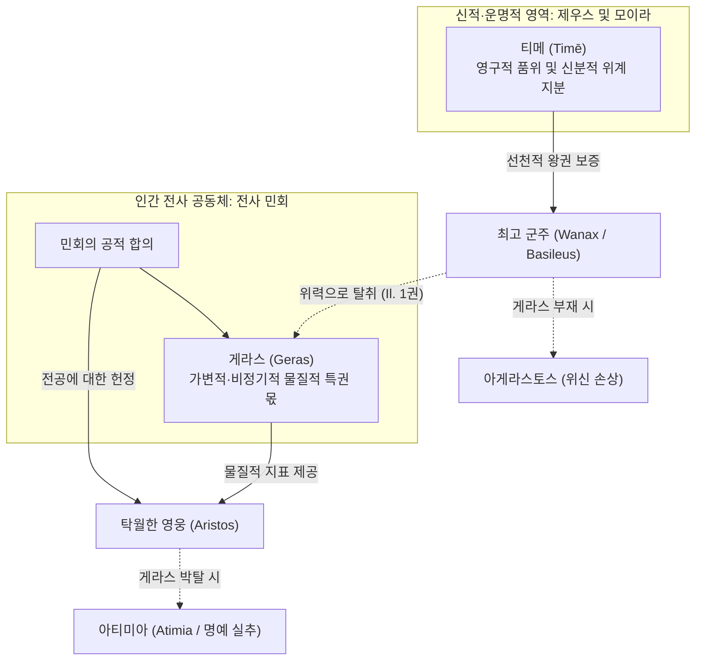

# 게라스 (Geras)

**[[greek-reading-guide|읽는 법]]**: 게라스 · **원어**: γέρας · **학술 전사**: *géras*

## 1. 개념 정의 및 어원학적 기원

**게라스**(γέρας, *géras*; 관용 라틴명 Geras)는 호메로스 영웅 사회에서 전사 공동체가 공동 전리품을 일반 전사에게 균등 분배([[concept-moira|모이라]])하기에 앞서, 최고 군주([[entity-agamemnon|아가멤논]])나 탁월한 전공을 세운 영웅([[entity-achilles|아킬레우스]])에게 공식적으로 헌정하는 물질적 특권 몫(Part d'honneur / Prerogative)을 가리키는 제도 어휘입니다. 같은 말이 연회에서 군주나 귀빈에게 바쳐지는 최상의 고기 부위(등심)에도 쓰입니다 ([[benveniste-1969-vocabulaire-institutions-2|Benveniste 1969]], II, pp. 43–50).

- **형태론 및 고대성**:
  - 그리스어 고대 중성명사 `-as`형(κέρας, τέρας, δέπας, κρέας)에 속하며, 인도유럽 공통조어 중성 e-모음도수를 원형에 가깝게 보존합니다.
  - 파생 형용사 게라로스(γεραρός, *gerarós*, 품위 있는), 동사 게라이로(γεραίρω, *geraírō*, 특권 몫을 바쳐 공경하다), 부정 형용사 아게라스토스(ἀγέραστος, *agérastos*, 특권 몫을 박탈당한)의 존재는 `*ger-as`와 `*ger-ar`의 어간 교체(heteroclite)를 반영하는 고졸기 어형입니다.
  - 미케네 선문자 B 점토판의 `ke-ra`를 게라스(*géras*)로 보는 가설이 제기되었으나, 미케네 궁전 관료제와의 직접적 제도 연속성은 미확정 상태입니다.

- **오스트호프 민간어원설의 문헌학적 반박**:
  - **오스트호프**(Osthoff 1906)를 비롯한 초기 학설은 원로 자문 구절을 근거로 게라스가 게론(γέρων, *gérōn*, "노인")에서 파생된 연령 계급적 특권이라고 보았습니다 (*Il.* 4.323, 9.422):
    - **번역**: "이것이 노인들의 게라스이다."
    - **원문**: τὸ γὰρ γέρας ἐστὶ γερόντων
    - **학술 전사**: *tò gàr géras estì geróntōn*
  - 에밀 벤베니스트([[benveniste-1969-vocabulaire-institutions-2|Benveniste 1969]])는 음운론과 문헌 비교를 통해 이 주장을 논박했습니다:
    1. **음운론적 단절**: '노령/늙음'을 뜻하는 게라스(γῆρας, *gē̂ras*)는 어간 모음이 장음 *ē*이며, 산스크리트어 *jarati*("쇠약해지다"), *jarant-*("노인")과 연결되어 육체적 노쇠를 가리킵니다. *오뒷세이아* 22.184에서 해진 낡은 방패를 '사코스 게론'(σάκος γέρον, *sákos géron*)이라 부르듯, 이 어근에는 권위나 명예의 뉘앙스가 없습니다. 단음 *e*를 지닌 게라스(*géras*, 특권 몫)와는 음운론적으로 별개의 어휘입니다.
    2. **서사시 공식구의 은유적 확장**: 동일한 통사 구조의 공식구가 망자 맥락에서도 반복됩니다 (*Il.* 16.457, 23.9; *Od.* 4.197, 24.190):
      - **번역**: "이것이 죽은 자들의 게라스이다."
      - **원문**: τὸ γὰρ γέρας ἐστὶ θανόντων
      - **학술 전사**: *tò gàr géras estì thanóntōn*
      망자의 장례와 매장이 마땅한 특권 몫이라고 해서 게라스가 죽음과 어원적으로 연결되지 않는 것과 마찬가지로, *geróntōn* 공식 역시 전투에 직접 나서지 못하는 원로([[entity-nestor|네스토르]])의 발언권과 조언을 제도적·은유적으로 인정한 용법입니다.
    3. 따라서 게라스(*géras*)와 게론(*gérōn*)의 연결은 표면적 유사성에 기인한 민간어원(étymologie populaire)에 해당합니다.

| 그리스어 원어 | 학술 전사 | 품사 및 형태론 | 본래 의미 및 제도적 맥락 |
|:---|:---|:---|:---|
| γέρας | *géras* | 중성 명사 (단수 주격/대격) | 공동체가 군주나 영웅에게 헌정하는 비정기적 물질적 특권 몫, 최상급 등심 고기 |
| γεραρός | *gerarós* | 형용사 (남성 주격) | 게라스를 수여받아 위엄과 당당한 풍채를 갖춘 상태 |
| γεραίρω | *geraírō* | 동사 (현재 능동) | 특권적 몫을 바치다, 의례적 선물을 증정하여 공경하다 |
| ἀγέραστος | *agérastos* | 복합 형용사 (부정 접두사 a-) | 게라스를 받지 못해 전사단 앞에서 위신과 권위가 실추된 상태 |
| γῆρας | *gē̂ras* | 중성 명사 (장모음 ē) | 육체적 노쇠, 늙음 (*géras*와는 무관한 별개 어원) |

---

## 2. 게라스의 사회제도적 실체와 물질성

호메로스 서사시에서 게라스는 추상적 관념이나 심리적 자긍심이 아니라, **눈으로 확인되고 손으로 만져지는 구체적인 물질적 실체**입니다.

### (1) 전리품 분배의 관행: 선분배와 균등 분배
영웅 사회의 전리품 처분은 공동체의 합의에 기초한 전형적 관행을 따릅니다:
1. **취합 및 공유 자산화**: 노획한 재화, 가축, 여성 포로는 일단 군대 전체의 공유 자산(ξυνήϊα, *ksunḗïa*, *Il.* 1.124)으로 모입니다.
2. **게라스의 선분배**: 전사 민회가 소집되면, 공동체는 최고 사령관 아가멤논과 당일 최고의 무공으로 신적 승리의 힘([[concept-kydos|쿠도스]])을 체현한 아킬레우스 등 주역들에게 최상의 몫([[entity-chryses|크뤼세스]]의 딸 크뤼세이스, [[entity-briseis|브리세이스]])을 게라스로 먼저 헌정합니다.
3. **모이라의 균등 분배**: 게라스를 제하고 남은 전리품은 전사단 전체에게 각자의 몫([[concept-moira|모이라]])으로 공평하게 배분됩니다(*Il.* 1.125–126; *Od.* 9.42). 아킬레우스는 후일 게라스의 자의적 찬탈과 배당 불평등에 맞서 아가멤논을 질타합니다:
   - **번역**: "머물러 있는 자에게도 같은 모이라가 돌아오고 똑같은 티메로 대우받는다."
   - **원문**: ἴση μοῖρα μένοντι, καὶ εἰ μάλα τις πολεμίζοι / ἐν ἰῇ δὲ τιμῇ ἠμὲν κακὸς ἠὲ καὶ ἐσθλός
   - **학술 전사**: *ísē moîra ménonti, kaì eì mála tis polemízoi / en iē̂i dè timē̂i ḕmèn kakòs ēè kaì esthlós*

### (2) 식탁과 연회에서의 물질적 전형: 등심(νῶτα)
게라스의 물질성은 식탁 위의 고기 분배 의례에서 원초적인 형태로 체현됩니다:
- 왕이나 귀빈이 참석한 공식 연회에서 주최자는 가장 기름지고 살코기가 풍성한 **소나 돼지의 등심 부위**(νῶτα, *nō̂ta*)를 잘라내어 게라스로 바칩니다.
- *일리아스* 7.321: 아가멤논은 트로이아의 [[entity-hector|헥토르]]와 일대일 결투를 벌이고 돌아온 [[entity-ajax|아이아스]]를 영접하며 예우합니다:
  - **번역**: "그리고 그는 길게 썬 등심으로 아이아스를 예우했다."
  - **원문**: νώτοισιν δ’ Αἴαν타 διηνεκέεσσι γέραιρεν
  - **학술 전사**: *nṓtoisin d’ Aíanta diēnekéesi gérairen*
- *오뒷세이아* 14.437–438: 돼지치기 에우마이오스는 거지로 변장한 주인 [[entity-odysseus|오디세우스]]에게 긴 흰 멧돼지의 등심 부위를 바쳐 환대합니다:
  - **번역**: "그리고 긴 등심으로 주인의 마음을 기쁘게 하였다."
  - **원문**: κύδαινε δὲ θυμὸν ἄνακτος νώτοισιν
  - **학술 전사**: *kúdaine dè thumòn ánaktos nṓtoisin*
- *오뒷세이아* 4.65: [[entity-menelaos|메넬라오스]]는 [[entity-telemachos|텔레마코스]] 일행을 맞이하며 자신에게 명예의 몫으로 바쳐진 구운 소의 등심(*nō̂ta*)을 직접 건넵니다.
- 『호메로스 찬가(헤르메스 찬가)』: [[entity-hermes|헤르메스]]는 도살한 고기를 손질하며 "게라스의 기름진 등심"(νῶτά τε γεράσμια, 121–122행)을 떼어내고, 신들에게 바칠 12개 모이라 각각에 명예의 몫을 안배합니다(128–129행).
- **테메노스와의 제도적 비교**: 영토적 봉토인 [[concept-temenos|테메노스]](*témenos*)와 게라스(*géras*)는 모두 전사 공동체가 탁월한 전공과 헌신에 보답하여 떼어주는(τέμνω, *témnō*) 특권적 보상 체계에 속합니다(*Il.* 12.310–328 [[entity-sarpedon|사르페돈]] 연설). 다만 테메노스가 왕권에 부속된 고정된 농경지·과수원이라면, 게라스는 매 출정이나 연회마다 새롭게 갱신되어 수여되는 비정기적 가동재입니다. 이는 영웅이 사후에 누릴 불멸의 명성인 [[concept-kleos|클레오스]]를 현세에서 지탱하는 물질적 기초가 됩니다.

---

## 3. 게라스와 티메의 제도적 상호작용

호메로스 서사시의 명예 체계를 이해하기 위해서는 **게라스**와 [[concept-time|티메]](*timē*)의 관계를 다층적으로 파악해야 합니다. 벤베니스트([[benveniste-1969-vocabulaire-institutions-2|Benveniste 1969]])는 수여 주체의 차이에 주목하여 양자를 분석적으로 대비시켰으며, 세르주 블레맹크([[vleminck-1982-institutional-aspect-of-time|Vleminck 1982]])와 마르갈리트 핀켈버그([[finkelberg-1998-time-and-arete|Finkelberg 1998]])는 게라스가 티메의 가시적 구현체로 기능하는 환유적 연쇄를 규명했습니다.

> [!WARNING] 학설 간 시각 차이
> 벤베니스트는 게라스(인간 공동체 수여)와 티메(제우스와 모이라의 신적 분배)의 수여 주체를 엄격히 대조한다. 반면 블레맹크는 게라스를 티메의 물질적 가시화 단계로 보며, 애드킨스와 핀켈버그는 게라스를 둘러싼 갈등을 세습적 군주권과 전공 기반 인정 간의 경쟁적 긴장으로 분석한다.

1. **분석적 구분과 환유적 연속성**:
   - 벤베니스트의 구분에 따르면, 게라스는 인간 전사단이 전공에 따라 비정기적으로 헌정하는 가변적 물질인 반면, 티메는 [[entity-zeus|제우스]]와 운명([[concept-moira|모이라]])이 배분한 영구적 신분 지분입니다(*Il.* 15.189).
   - 그러나 블레맹크(1982)가 실증하듯, 서사시의 실제 작동에서 게라스는 추상적인 티메를 감각적으로 입증하는 핵심적인 '물질적 지표(tangible token)'입니다. 영웅의 내적 탁월성([[concept-arete|아레테]])과 사회적 인정은 가시적 게라스를 통해 공인됩니다.
2. **아게라스토스와 아티미아의 구조적 비대칭성**:
   - 핀켈버그(1998)의 분석처럼, 군주 아가멤논의 티메가 가문과 홀(skêptron)에 기초한 '선천적·세습적 티메'라면, 아킬레우스의 티메는 전장에서의 목숨을 건 활약으로 획득한 '후천적·인정적 티메'입니다.
   - 따라서 게라스의 상실이 아가멤논에게는 최고 군주로서 전군 앞에서의 체면 손상(아게라스토스, *agérastos*)을 의미하는 반면, 전공에 대한 사회적 인정이 유일한 보상이었던 아킬레우스에게는 실존적 자격 박탈인 [[concept-time#55-법제사적-진화-호메로스적-아티미아에서-고전기-아테네-시민권-박탈로|아티모스]](*átimos*)이자 명예 훼손(ἠτίμησεν)으로 귀결됩니다.

---

## 4. 『일리아스』 1권 분쟁의 제도사적 해명

『일리아스』 제1권의 파국적 충돌은 단순한 감정적 자존심 싸움이 아니라, **공유된 티메 규범 질서에 대한 최고 군주의 일탈과 게라스 분배 원칙의 붕괴**에서 기인합니다 ([[riedinger-1976-la-time-chez-homere|Riedinger 1976]], Benveniste 1969):

### (1) 아가멤논의 불안: 유일한 아게라스토스(*agérastos*)
아폴론의 재앙으로 자신의 게라스인 크뤼세이스를 반환해야 했을 때, 아가멤논은 군주로서의 위신이 훼손되는 사태를 거부합니다(*Il.* 1.118–119):
- **번역**: "그러나 내게 즉시 게라스를 마련해 다오. 아르고스인들 가운데 나 혼자만 게라스를 갖지 못하는 일이 없도록 하라. 그것은 온당치 못한 일이기 때문이다."
- **원문**: αὐτὰρ ἐμοὶ γέρας αὐτίχ' ἑτοιμάσατ', ὄφρα μὴ οἶος / Ἀργείων ἀγέραστος ἔω, ἐπεὶ οὐδὲ ἔοικε
- **학술 전사**: *autàr emoì géras autíkh' hetoimásat', óphra mḕ oîos / Argeíōn agérastos éō, epeì oudè éoike*

아가멤논에게 게라스 부재는 연합군 최고 사령관으로서 군림해 온 권위 규범(`ἔοικε`)이 흔들리는 심각한 정치적 위기였습니다.

### (2) 아킬레우스의 분노: 몫의 침탈과 메니스([[concept-menis|Mē̂nis]])의 발동
공동 전리품이 이미 소진된 상태에서 아가멤논이 완력으로 아킬레우스의 게라스인 브리세이스를 빼앗자, 아킬레우스는 어머니 [[entity-thetis|테티스]]에게 호소합니다(*Il.* 1.355–356):
- **번역**: "아트레우스의 아들, 넓은 권능의 아가멤논이 나를 모욕하였습니다. 내 게라스를 빼앗아 손수 차지하고 있기 때문입니다."
- **원문**: ἦ γάρ μ' Ἀτρεΐδης εὐρὺ κρείων Ἀγαμέμνων / ἠτίμησεν· ἑλὼν γὰρ ἔχει γέρας αὐτὸς ἀπούρας
- **학술 전사**: *ē̂ gár m' Atreḯdēs eurù kreíōn Agamémnōn / ētímēsen; helṑn gàr ékhei géras autòs apoúras*

리댕제(1976)가 지적하듯, 호메로스 사회는 예측 가능한 티메 규범 질서로 지탱되고 있었습니다. 아가멤논의 찬탈은 전사 민회의 공적 결정을 파기한 규범적 일탈(aberrant)이었으며, 이에 격분한 아킬레우스의 신적 분노([[concept-menis|메니스]])는 아카이아 군 전체의 파멸적 위기로 이어집니다.

---

## 5. 호메로스 서사시 핵심 용례 분석

| 작품 및 행 번호 | 화자 및 맥락 | 그리스어 원어 | 학술 전사 | 제도적 의미 및 기능 |
|:---|:---|:---|:---|:---|
| *Il.* 1.118–119 | 아가멤논 (전사 민회) | ἀγέραστος ἔω, ἐπεὶ οὐδὲ ἔοικε | *agérastos éō, epeì oudè éoike* | 최고 군주로서 게라스 결손이 가져오는 규범적 부당성(`ἔοικε`) 표명 |
| *Il.* 1.355–356 | 아킬레우스 (테티스 앞) | ἠτίμησεν· ἑλὼν γὰρ ἔχει γέρας | *ētímēsen; helṑn gàr ékhei géras* | 정당한 전공 게라스 강탈이 존재론적 명예 침해(*ētímēsen*)로 직결됨을 고발 |
| *Il.* 7.321 | 아가멤논 (영웅 연회) | νώτοισιν δ’ Αἴαν타 ... γέραιρεν | *nṓtoisin d’ Aíanta ... gérairen* | 결투 무공을 세운 아이아스에게 소 등심 부위를 게라스로 바쳐 공식 치하 |
| *Od.* 14.437–438 | 에우마이오스 (식사 대접) | κύδαινε δὲ θυμὸν ... νώ토ισιν | *kúdaine dè thumòn ... nṓtoisin* | 멧돼지 등심 부위를 증정하여 주인의 품위를 높이는 의례적 환대 |
| *Il.* 16.457 | 헤라 (사르페돈 전사) | τύμβῳ τε στήλῃ τε· τὸ γὰρ γέ라스 ἐστὶ θανόντων | *túmbōi te stḗlēi te; tò gàr géras estì thanóntōn* | 무덤과 비석의 장례 의례가 망자에게 바쳐지는 신성한 특권 몫임을 규정 |
| *Il.* 4.323, 9.422 | 네스토르 / 아킬레우스 | τὸ γὰρ γέρας ἐστὶ γερόντων | *tò gàr géras estì geróntōn* | 전투 불참 원로의 발언권과 지혜 조언을 가리키는 제도적·은유적 특권 |

---

## 관련 항목

- [[concept-time|티메 (Timē)]]
- [[concept-menis|메니스 (Menis)]]
- [[concept-moira|모이라 (Moira)]]
- [[concept-temenos|테메노스 (Temenos)]]
- [[concept-kleos|클레오스 (Kleos)]]
- [[concept-kydos|쿠도스 (Kydos)]]
- [[concept-themis|테미스 (Themis)]]
- [[concept-dike|디케 (Dike)]]
- [[concept-arete|아레테 (Arete)]]
- [[entity-agamemnon|아가멤논]]
- [[entity-achilles|아킬레우스]]
- [[entity-briseis|브리세이스]]
- [[entity-chryses|크뤼세스]]
- [[entity-sarpedon|사르페돈]]
- [[entity-nestor|네스토르]]
- [[analysis-concept-source-matrix|개념과 문헌]]
- [[analysis-homeric-ethics-literature-review|호메로스 윤리학 문헌 고찰]]
- [[benveniste-1969-vocabulaire-institutions-2|에밀 벤베니스트 (1969), 인도유럽 제도 어휘집 2]]
- [[riedinger-1976-la-time-chez-homere|장클로드 리댕제 (1976), 호메로스에게서의 티메]]
- [[vleminck-1982-institutional-aspect-of-time|세르주 블레맹크 (1982), 호메로스 티메의 제도적 측면]]
- [[finkelberg-1998-time-and-arete|마르갈리트 핀켈버그 (1998), 호메로스에게서의 티메와 아레테]]
- [[adkins-1960-merit-and-responsibility|A. W. H. 애드킨스 (1960), 공적과 책임]]