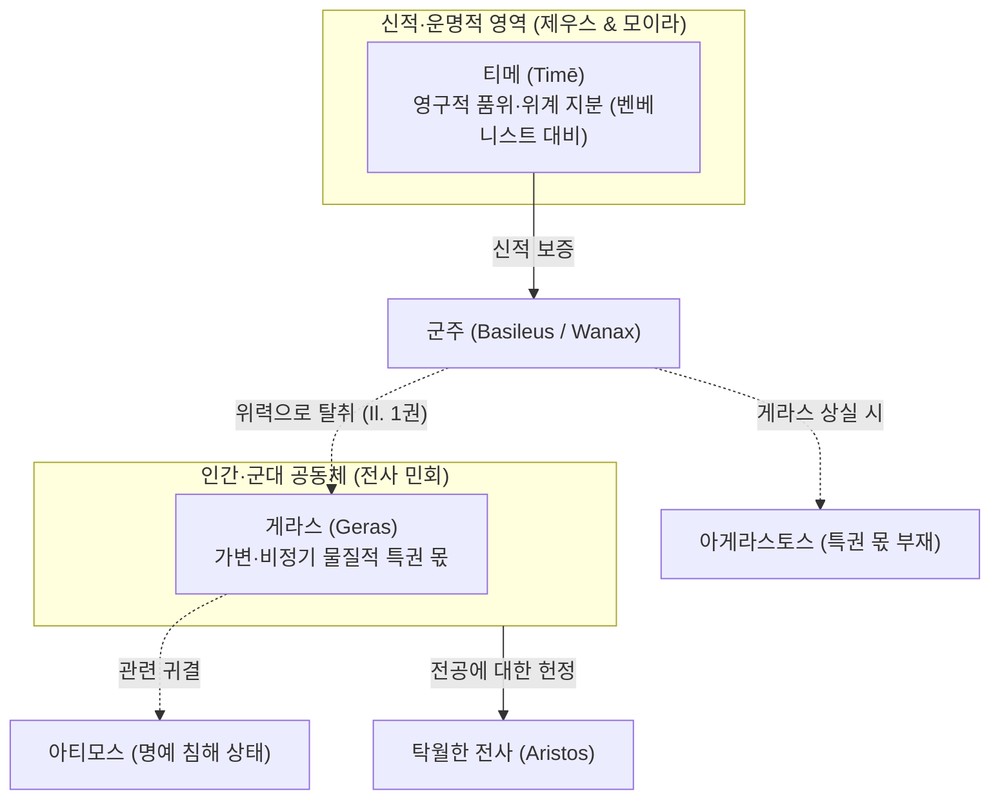

# 게라스 (Geras)

**[[greek-reading-guide|읽는 법]]**: 게라스 · **원어**: γέρας · **학술 전사**: *géras*

## 1. 개념 정의 및 어원학적 기원

**게라스**(γέρας, *géras*; 관용 라틴명 Geras)는 호메로스 영웅 사회에서 전사 공동체가 공동 전리품을 일반 전사에게 균등 분배([[concept-moira|모이라]])하기에 앞서, 최고 군주([[entity-agamemnon|아가멤논]])나 탁월한 전공을 세운 영웅([[entity-achilles|아킬레우스]])에게 공식적으로 헌정하는 물질적 특권 몫(Part d'honneur / Prerogative)을 가리키는 제도 어휘입니다. 같은 말이 연회에서 군주·귀빈에게 바쳐지는 최상의 고기 부위(등심)에도 쓰입니다 ([[benveniste-1969-vocabulaire-institutions-2|Benveniste 1969]], II, pp. 43–50).

- **형태론 및 고대성**:
  - 그리스어 고대 중성명사 `-as`형(κέρας, τέρας, δέπας, κρέας)에 속하며, 인도유럽 공통조어 중성 e-모음도수를 원형에 가깝게 보존합니다.
  - 파생 형용사 게라로스(γεραρός, *gerarós*, 품위 있는), 동사 게라이로(γεραίρω, *geraírō*, 특권 몫을 바쳐 공경하다), 부정 형용사 아게라스토스(ἀγέραστος, *agérastos*, 특권 몫을 박탈당한)의 존재는 `*ger-as`와 `*ger-ar`의 교체(heteroclite)를 반영하는 고졸기 어형으로 읽힙니다.
  - 벤베니스트는 미케네어 `ke-ra`를 게라스(*géras*)로 보는 **잠정적 제안**을 언급합니다. 특정 점토판 번호나 미케네 궁전 관료제 이래의 제도적 연속성은 여기서 확정하지 않습니다.

- **오스트호프 민간어원설에 대한 벤베니스트의 비판**:
  - **오스트호프**(Osthoff 1906)를 비롯한 20세기 초 논의는 *일리아스*의 구절 "이것이 노인들의 게라스이다"(*tò gàr géras estì geróntōn*, *Il.* 4.323, 9.422)를 근거로, 게라스가 게론(γέρων, *gérōn*, "노인")에서 파생된 연령 계급적 특권이라고 보았습니다.
  - 벤베니스트는 문헌학적 전수 조사를 통해 이 어원 연결을 비판했습니다.
    1. 서사시에서 노인 관련 공식구는 소수이며, 전투에 나서지 못하는 원로가 군대에서 충고하거나([[entity-nestor|네스토르]]) 사절단으로 발언하는 **살아 있는 제도적·은유적 권리**를 가리키는 용법으로 읽는 편이 타당합니다. 단순한 어원 잔재로만 축소하지 않습니다.
    2. 동일 구조의 공식구가 망자 맥락에서 반복됩니다 (*Il.* 16.457, 16.675, 23.9; *Od.* 4.197, 24.190, 24.296):
      - **번역**: "이것이 죽은 자들의 게라스이다."
      - **원문**: τὸ γὰρ γέρας ἐστὶ θανόντων
      - **학술 전사**: *tò gàr géras estì thanóntōn*
      매장·애도가 망자의 특권 몫이라고 해서 게라스가 죽음과 어원적으로 연결된다고 주장할 수 없는 것과 마찬가지로, *geróntōn* 공식만으로 노인 어원을 입증할 수는 없습니다.
    3. 음운론적 분리: '노령/늙음'을 뜻하는 γῆρας(*gē̂ras*)는 어간 모음이 장음 *ē*이며, 산스크리트어 *jarati*("쇠약해지다"), *jarant-*("노인")과 연결되어 육체적 노쇠를 가리킵니다. 서사시에서 낡고 해진 방패를 '사코스 게론'(σάκος γέρον, *sákos géron*, *Od.* 22.184)이라 부르듯, 이 어근에는 권위나 명예의 뉘앙스가 없습니다.
    4. 따라서 게라스(*géras*, 특권 몫)와 게론(*gérōn*, 노인)의 직접 어원 연결은 민간어원(étymologie populaire) 쪽으로 기우는 가설이며, *geróntōn* 공식은 그 자체로 원로 발언권의 제도·은유 용법으로 남습니다.

| 어휘 (원어) | 학술 전사 | 품사 및 형태론 | 본래 의미 및 문헌학적 맥락 |
|:---|:---|:---|:---|
| **géras** (γέρας) | *géras* | 중성 명사 (단수 주격/대격) | 공동체가 군주나 영웅에게 헌정하는 비정기적 물질적 특권 몫, 등심 고기 |
| **gerarós** (γεραρός) | *gerarós* | 형용사 (남성 주격) | 게라스를 수여받아 위엄과 신체적 풍채를 갖춘, 당당한 |
| **geraírō** (γεραίρω) | *geraírō* | 동사 (현재 능동) | 특권적 몫을 바치다, 의례적 선물을 증정하여 높이다 |
| **agérastos** (ἀγέραστος) | *agérastos* | 복합 형용사 (부정 접두사 a-) | 게라스를 받지 못해 전사단 앞에서 수치·권위 실추에 놓인 상태 |
| **gē̂ras** (γῆρας) | *gē̂ras* | 중성 명사 (장모음 ē) | 육체적 노쇠, 늙음 (*géras*와는 무관한 별개 어원) |

---

## 2. 게라스의 사회제도적 실체와 물질성

호메로스 서사시에서 게라스는 추상적 감정이나 심리적 자긍심이 아니라, **눈으로 확인되고 손으로 만져지는 구체적인 물질적 실체**입니다.

### (1) 전리품 분배의 전형적 절차 (*Il.* 1권에 보이는 관행)
영웅 사회의 전리품 획득과 처분은 *일리아스* 1권에서 논쟁적으로 드러나는 **전형적 관행**으로 재구성할 수 있으며, 전 서사시에 걸쳐 단일한 '엄격한' 법전으로 고정된 것으로 단정하지는 않습니다.
1. **공출 및 취합**: 정복한 도시나 적군에게서 노획한 재화·가축·여성 포로는 일단 군대 전체의 공유 자산으로 모입니다(*ksunḗïa*, *Il.* 1.124).
2. **게라스의 선분배**: 전사 민회가 소집되면, 공동체는 장수들의 합의에 따라 최고 사령관 아가멤논과 당일 최고의 무공을 세운 아킬레우스 등에게 최상의 포획물(크뤼세이스, [[entity-briseis|브리세이스]])을 게라스로 먼저 떼어 바칩니다.
3. **모이라의 균등 분배**: 게라스를 제하고 남은 전리품은 제비뽑기나 균등 배분을 통해 전 병사들에게 각자의 몫(모이라)으로 나누어집니다(*Il.* 1.163–168). 여기서의 모이라는 전리품 분배의 몫을 가리키며, 우주적 운명으로서의 모이라(Moira)와는 다의적으로 구별됩니다.

### (2) 식탁과 연회에서의 물질적 전형: 등심(*nō̂ta*)
게라스의 물질성은 식탁 위의 고기 분배 의례에서 원초적인 형태로 보존됩니다.
- 왕이나 귀빈이 참석한 공식 연회에서 주최자는 가장 기름지고 살코기가 풍성한 **소나 돼지의 등심/등뼈 부위**(νῶτα, *nō̂ta*)를 잘라내어 게라스로 헌정합니다.
- *오뒷세이아* 4.65: [[entity-menelaos|메넬라오스]]는 [[entity-telemachos|텔레마코스]]와 피시스트라토스를 영접하며, 자신에게 명예의 몫으로 주어진 구운 소의 등심(*nō̂ta*)을 집어 두 젊은이에게 건넵니다(벤베니스트도 Od. 4.65의 νῶτα를 확인). 연속 원문 문자열을 임의로 합성하지 않고, 행 인용과 한국어 요약으로 적습니다.
- 『호메로스 찬가(헤르메스 찬가)』 128행: [[entity-apollo|아폴론]]의 소를 도살한 [[entity-hermes|헤르메스]]는 신들에게 바칠 제물을 12등분하면서, 가장 영예로운 몫을 "게라스의 등심"(νῶτα γεράσμια, *nō̂ta gerásmia*)이라 부릅니다.
- 영토적 봉토인 [[concept-temenos|테메노스]](*témenos*)가 왕권에 부속된 영구적 농경지라면, 게라스는 매 출정이나 연회마다 새롭게 갱신되어 바쳐지는 비정기적 특권 재화입니다.

---

## 3. 게라스 대 티메의 제도적 대비

벤베니스트는 호메로스 서사시의 갈등을 이해하기 위해 **게라스**와 [[concept-time|티메]](*timē*)의 범주적 차이를 분리하는 것이 유용하다고 강조합니다. 아래 대비는 절대 존재론이 아니라, 벤베니스트가 제시한 **분석적 대조**로 읽습니다. 제도·어원 층위에서 티메의 공적 인정 구조를 다루는 논의로는 [[vleminck-1982-institutional-aspect-of-time|Vleminck 1982]]도 참조할 수 있습니다.

> [!WARNING] 모순/이설 발견
> 벤베니스트의 게라스(인간 공동체 수여)·티메(신적 분배) 대비는 유용한 분석틀이지만, 티메를 공동체 인정·경쟁적 가치 체계로 보는 다른 모형(Adkins / Finkelberg 등, concept-time에서 추적)과 긴장이 있다. 절대 존재론으로 읽지 말 것.

1. **수여 주체의 대비**(벤베니스트의 유용한 구분):
   - **게라스**는 **인간 공동체**(전사단)가 무공·전공에 상응하여 비정기적으로 부여·철회할 수 있는 가변적 물질로 서술됩니다.
   - **티메**는 [[entity-zeus|제우스]]와 운명(모이라)이 배타적으로 분배한 영구적 품위·사회적 지분으로 대비됩니다(*Il.* 15.189 크로노스 세 아들의 티메 분할). 이는 벤베니스트의 대비이며, 다른 모형에서는 티메의 공동체적·경쟁적 층위가 더 강조됩니다.
2. **외적 가시성과 관련 메커니즘**:
   - 게라스는 티메를 시각적으로 증명해 주는 물질적 지표(tangible token)로 기능합니다. 높은 티메를 지닌 자는 그에 상응하는 게라스를 받는 것이 기대됩니다.
   - 게라스 강탈·상실은 곧바로 아티모스(*átimos*)와 **동일한 것**이 아니라, 외적 공인 체계의 붕괴를 통해 명예 침해(ἠτίμησεν 등)와 **연관되는 메커니즘**입니다. 내적 탁월성([[concept-arete|아레테]])이 유지되더라도 사회적 인정 지표가 흔들릴 수 있습니다.

---

## 4. 『일리아스』 1권 분쟁의 제도사적 해명

『일리아스』 제1권의 충돌은 단순한 감정싸움이 아니라, **게라스 분배 규칙의 파탄과 두 군주권 논리의 정면충돌**입니다 ([[riedinger-1976-la-time-chez-homere|Riedinger 1976]], Benveniste 1969):

### (1) 아가멤논의 공포: 유일한 아게라스토스(*agérastos*)
아폴론의 징벌로 자신의 게라스인 크뤼세이스를 돌려보내야 했을 때, 아가멤논이 두려워한 것은 전군 앞에서 자신만이 게라스를 갖지 못한 자가 되는 사태였습니다(*Il.* 1.118–119):
- **번역**: "그러나 내게 즉시 게라스를 마련해 다오. 아르고스인들 가운데 나 혼자만 게라스를 갖지 못하는 일이 없도록 하라."
- **원문**: αὐτὰρ ἐμοὶ γέρας αὐτίχ' ἑτοιμάσατ', ὄφρα μὴ οἶος Ἀργείων ἀγέραστος ἔω
- **학술 전사**: *autàr emoì géras autíkh' hetoimásat', óphra mḕ oîos Argeíōn agérastos éō*

아가멤논에게 게라스의 부재는 전리품 손실을 넘어, 연합군 최고 사령관(*wanax andrōn*)으로서의 신분·권위 지표가 무너지는 제도적 위기였습니다.

### (2) 아킬레우스의 분노: 몫의 침탈과 명예 침해
아가멤논이 전군 공출품이 바닥난 상태에서 아킬레우스의 게라스인 브리세이스를 완력으로 가져가자, 아킬레우스는 어머니 [[entity-thetis|테티스]]에게 호소합니다(*Il.* 1.355–356):
- **번역**: "아트레우스의 아들, 넓은 권능의 아가멤논이 나를 명예 침해하였습니다. 내 게라스를 빼앗아 스스로 가지고 있기 때문입니다."
- **원문**: ἦ γάρ μ' Ἀτρεΐδης εὐρὺ κρείων Ἀγαμέμνων / ἠτίμησεν· ἑλὼν γὰρ ἔχει γέρας αὐτὸς ἀπούρας
- **학술 전사**: *ē̂ gár m' Atreḯdēs eurù kreíōn Agamémnōn / ētī́mēsen; helṑn gàr ékhei géras autòs apoúras*

아킬레우스는 전사 민회가 부여한 게라스를 최고 권력자가 독단으로 찬탈한 처사를 명예 규범의 침해로 규정하며, 이로 인해 군주와의 복무·명예 관계를 단절하고 전선을 이탈하게 됩니다.

---

## 5. 호메로스 서사시 핵심 용례 분석

| 작품 및 행 번호 | 화자 및 상황 | 원어 인용구 | 학술 전사 | 제도적 의미 |
|:---|:---|:---|:---|:---|
| *Il.* 1.118–119 | 아가멤논 (민회) | Ἀργείων ἀγέραστος ἔω | *Argeíōn agérastos éō* | 최고 군주로서 게라스 부재(*agérastos*)가 가져오는 정치적 위기 |
| *Il.* 1.355–356 | 아킬레우스 (테티스 앞) | ἠτίμησεν· … γέρας | *ētī́mēsen; … géras* | 게라스 강탈과 명예 침해(*ētī́mēsen*)가 연관되는 메커니즘 |
| *Il.* 16.456–457 | 헤라 (사르페돈) | τύμβῳ τε στήλῃ τε / τὸ γὰρ γέρας ἐστὶ θανόντων | *túmbōi te stḗlēi te / tò gàr géras estì thanóntōn* | 무덤·비석은 16.456; 망자 공식구는 16.457. 두 행을 분리해 읽어야 함 |
| *Od.* 4.65 | 메넬라오스 (궁정 연회) | νῶτα (등심) | *nō̂ta* | 연회 게라스로 바쳐지는 최상의 고기 부위. 임의 연속 문자열 인용 지양 |
| *Il.* 9.422 | 아킬레우스 (사절단) | τὸ γὰρ γέρας ἐστὶ γερόντων | *tò gàr géras estì geróntōn* | 원로 충고·발언권의 제도적·은유적 용법 (민간어원 잔재만으로 축소하지 않음) |

---

## 관련 항목

- [[concept-time|티메 (Timē)]]
- [[concept-moira|모이라 (Moira)]]
- [[concept-temenos|테메노스 (Temenos)]]
- [[concept-themis|테미스 (Themis)]]
- [[concept-dike|디케 (Dike)]]
- [[concept-arete|아레테 (Arete)]]
- [[entity-agamemnon|아가멤논]]
- [[entity-achilles|아킬레우스]]
- [[benveniste-1969-vocabulaire-institutions-2|에밀 벤베니스트 (1969), 인도유럽 제도 어휘집 2]]
- [[riedinger-1976-la-time-chez-homere|장클로드 리댕제 (1976), 호메로스에게서의 티메]]
- [[vleminck-1982-institutional-aspect-of-time|세르주 플레밍크 (1982), 어원학의 관점에서 본 호메로스 티메의 제도적 측면]]