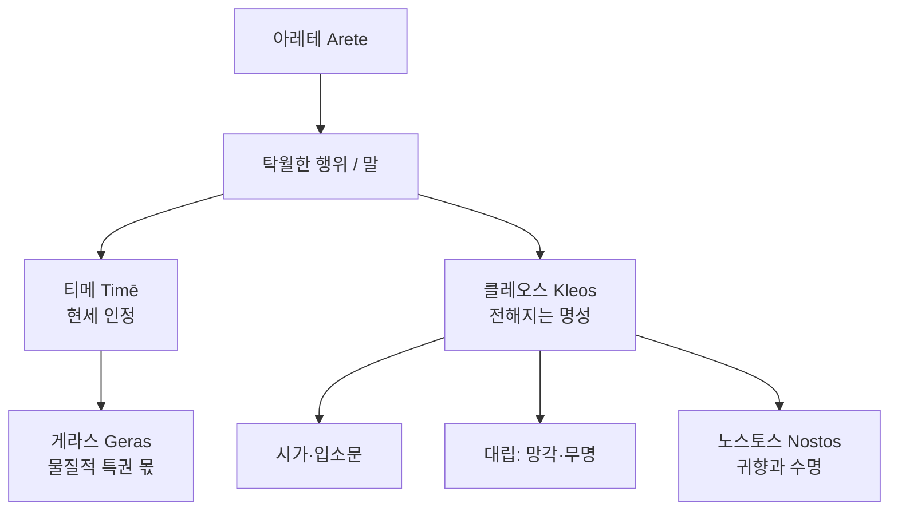

# 클레오스 (Kleos)

**[[greek-reading-guide|읽는 법]]**: 클레오스 · **원어**: κλέος · **학술 전사**: *kléos*

## 1. 정의와 핵심 테제 (Definition & Core Thesis)

**클레오스**(κλέος, *kléos*)는 호메로스 영웅 사회에서 전사의 행위·말이 **청중의 귀와 시가**를 통해 전달되어, 당사자의 육체적 죽음 이후에도 남는 **공적 명성**을 가리킨다. 그것은 사적 자긍심이 아니라, 공동체가 노래로 보존하는 **청각적·서사적 존재**이다([[nagy-1979-best-of-achaeans|Nagy 1979]]).

- **핵심 정의**: 클레오스는 “들려진 것”으로서의 명성이다. 현세의 위신([[concept-time|티메]])이 공동체 안에서의 인정 몫이라면, 클레오스는 그 인정이 **세대 너머 서사**로 연장된 형태다.
- **연구사적 테제**: 나기(Nagy)는 영웅의 최선의 선택이 곧 *kleos aphthiton*(불멸의 명성)을 향한 시가적 기획이라고 본다. 베르낭(Vernant)은 이를 “아름다운 죽음”(*belle mort*)과 결합된 문화적 불멸로 읽는다([[vernant-1989-belle-mort|Vernant 1989]]).
- **핵심 긴장**: 짧은 삶·큰 클레오스([[entity-achilles|아킬레우스]]) 대 긴 귀향·재구성된 클레오스([[entity-odysseus|오디세우스]], [[concept-nostos|노스토스]]) — 같은 가치어가 두 서사에서 다른 생명 설계를 요구한다([[finkelberg-1995-odysseus-and-genus-hero|Finkelberg 1995]]).

---

## 2. 어원과 형태론 (Etymology & Morphology)

어원·형태론·수용사 상세의 **단일 원천**은 [[word-kleos|Kleos (클레오스)]]이다. 여기서는 개념 독해에 필요한 최소만 적는다.

- 표제어 κλέος (*kléos*)는 “듣다” 계열(PIE *ḱlew-*)과 연결되어, 명성이 **청각적 전달**에 의존함을 어휘 자체가 드러낸다.
- 파생·합성(예: κλέος ἄφθιτον, *kléos áphthiton*)과 후대 표기(*kleos*, Clio 등)는 word 문서를 본다.

---

## 3. 호메로스 서사시 본문 용례와 맥락 (Homeric Attestation & Contexts)

### 3.1 『일리아스』에서의 출현과 용례

- **아킬레우스의 이중 운명** (*Il.* 9.410–416): 귀향하면 오래 살되 클레오스가 사라지고, 트로이아에 남으면 목숨은 짧으나 클레오스가 불멸한다는 선택지가 명시된다. 클레오스는 여기서 **수명과 교환 가능한 서사적 재화**로 나타난다.
- **헥토르와 도시 수호**: [[entity-hector|헥토르]]의 전선 선택은 개인 명성만이 아니라 트로이아 공동체의 기억·수치와 얽힌다. 클레오스는 단독 영웅의 독백이 아니라 **폴리스적 시선** 앞에서 측정된다.
- **티메·게라스와의 연쇄**: 게라스 박탈로 티메가 훼손될 때(*Il.* 1), 아킬레우스가 철군을 택하는 논리는 “현세 인정 몫”의 위기이며, 9권의 클레오스 선택은 그 위기를 **사후 명성**의 축으로 재배치한다([[finkelberg-1998-time-and-arete|Finkelberg 1998]]; [[concept-geras|게라스]]·[[concept-time|티메]]).

### 3.2 『오뒷세이아』에서의 출현과 용례

- **자기 소개와 명성**: 오디세우스는 퀴클롭스·파이아케스 등 장면에서 이름·계보·행적을 말해 클레오스를 **구두로 재생산**한다. 귀향 서사에서 클레오스는 전장의 “짧은 삶” 공식과 달리, **살아 돌아와 이야기를 완성**하는 쪽에 무게가 실린다.
- **노스토스와의 긴장**: 귀향([[concept-nostos|노스토스]])이 지연될수록 이타케에서의 지위·기억은 위태로워지고, 클레오스는 “바다 위의 모험담”과 “집의 질서 회복” 사이에서 재정의된다([[finkelberg-1995-odysseus-and-genus-hero|Finkelberg 1995]]).

---

## 4. 개념 상호작용과 가치망 (Conceptual Network & Polarity)

- **티메 ([[concept-time|Time]])**: 공동체가 지금 여기서 부여하는 위신. 클레오스는 그 위신이 **노래로 잔존**하는 형태.
- **게라스 ([[concept-geras|Geras]])**: 티메의 가시적 몫. 게라스 박탈은 티메 위기를 촉발하고, 클레오스 선택은 그 위기의 장기 해법으로 제시되기도 한다.
- **아레테 ([[concept-arete|Arete]])**: 탁월함이 행위로 나타날 때 클레오스의 재료가 된다.
- **노스토스 ([[concept-nostos|Nostos]])**: 귀향·생존과 클레오스의 **교환·병치**가 오디세이아의 축이다.
- **대립축**: 망각·무명(이름이 들리지 않음). 단순히 “수치”([[concept-aidos|아이도스]])와 동일하지 않다 — 아이도스가 억제·경외의 정서라면, 클레오스의 결여는 **서사적 침묵**에 가깝다.

---

## 5. 대표 서사 에피소드 정밀 해제 (Signature Epic Episodes)

### 5.1 아킬레우스의 이중 운명 (*Il.* 9)

사절단 장면에서 아킬레우스는 귀향과 전사의 클레오스를 명시적으로 대비한다. 핵심은 도덕적 설교가 아니라 **존재 설계의 분기**: 현세적 장수 대 시가적 불멸. 이후 파트로클로스 죽음·헥토르 살해로 클레오스의 대가는 구체적 상실과 분노([[concept-menis|메니스]])의 연쇄로 지불된다.

### 5.2 헥토르의 성벽 앞 선택

헥토르는 폴리스·가족·명성의 교차점에서 전장을 고른다. 클레오스는 여기서 개인 브랜드가 아니라 **공동체가 기억할 죽음**의 형식으로 작동한다([[vernant-1989-belle-mort|Vernant 1989]]의 “아름다운 죽음” 논의를 헥토르·아킬레우스 쌍에 적용할 때 특히 유효하나, 적용 범위는 해석적으로 열어 둔다).

### 5.3 오디세우스의 이름 밝히기

변장·지연 뒤 이름을 밝히는 장면들은, 클레오스가 전리품이 아니라 **서사 수행**(말하기)으로 갱신됨을 보여 준다. 귀향 완료는 모험담의 클레오스와 이타케 질서의 티메를 다시 한 줄로 묶는다.

---

## 12. 증거 매트릭스 (Evidence Matrix)

| 주장 | 근거 | 등급 |
|:---|:---|:---|
| 클레오스는 시가·청각으로 전해지는 명성이다 | Nagy 1979; κλέος의 “들림” 어원([[word-kleos]]) | 강한 학술 추론 |
| *Il.* 9.410–416은 수명 대 클레오스의 교환을 명시한다 | _Il._ 9.410–416 | 원전 명시 |
| “아름다운 죽음”과 영웅 명성의 결합 | Vernant 1989 | 논쟁적 |
| 오디세우스형 영웅은 클레오스를 노스토스와 재구성한다 | Finkelberg 1995 | 강한 학술 추론 |
| 티메·아레테·게라스와 제도적으로 맞물린다 | Finkelberg 1998; [[concept-time]], [[concept-arete]], [[concept-geras]] | 강한 학술 추론 |
| 후대 “kleos / Clio” 수용 | [[word-kleos]] 수용사 절 | 후대 수용 |

---

## 관련 항목

- [[concept-time|티메 (Time)]]
- [[concept-arete|아레테 (Arete)]]
- [[concept-nostos|노스토스 (Nostos)]]
- [[concept-geras|게라스 (Geras)]]
- [[concept-menis|메니스 (Menis)]]
- [[entity-achilles|아킬레우스 (Achilles)]]
- [[entity-hector|헥토르 (Hector)]]
- [[entity-odysseus|오디세우스 (Odysseus)]]
- [[word-kleos|Kleos (클레오스)]]
- [[nagy-1979-best-of-achaeans|나기 (1979), Best of the Achaeans]]
- [[vernant-1989-belle-mort|베르낭 (1989), 아름다운 죽음]]
