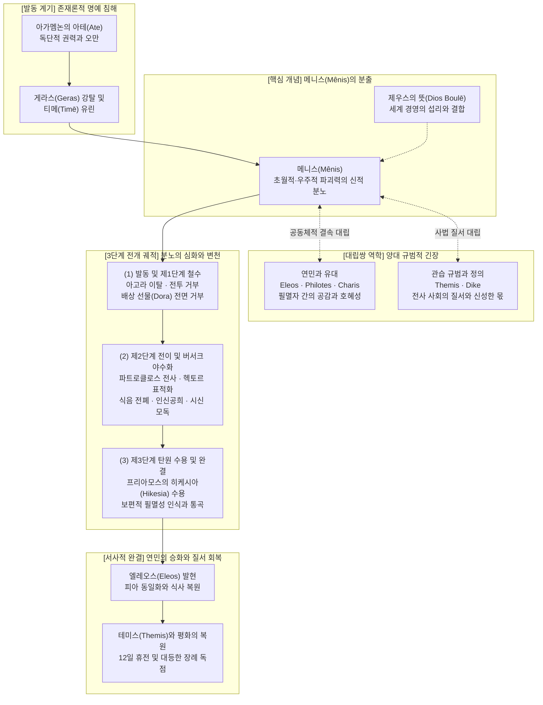

# 메니스 (Menis)

**[[greek-reading-guide|읽는 법]]**: 메니스 · **원어**: μῆνις · **학술 전사**: *mē̂nis*

## 1. 정의와 핵심 테제 (Definition & Core Thesis)

- **핵심 정의**: **메니스**(μῆνις, *mē̂nis*; 관용 라틴명 Menis)는 호메로스 서사 세계에서 우주적 질서([[concept-themis|Themis]])와 신성한 금기가 파괴되었을 때 발동하여 원상태로 복원될 때까지 집요하게 지속되는 **초개인적 신성 제재 장치**(Sacral Sanction)이자, 본래 올림포스 신들에게 고유하게 귀속되는 초월적 파괴력입니다.
- **연구사적 핵심 테제**:
  1. **우주적 제재 장치와 신적 주권** (Leonard Muellner 1996): 인도유럽조어(PIE) 어근 \`*men-\`에 기원을 둔 메니스는 사적 감정의 폭발이 아니라 우주적 경계와 위계를 수호하는 신성한 보복 메커니즘입니다. 서사시에서 인간 영웅 중 유일하게 아킬레우스에게 적용된 메니스(_Il._ 1.1)는 그가 신과 필멸자의 경계선에 선 초월적 존재임을 선언하는 서사적 장치입니다.
  2. **제의적 적대와 사회적 고립** (Gregory Nagy 1979): 메니스는 영웅을 군대 공동체(Laos)로부터 절연시키고 아카이아 군단 전체에 막대한 비탄(Akhos)을 부과함으로써 역설적으로 영웅 고유의 시들지 않는 명성([[concept-kleos|Kleos]])을 완성하는 서사적·제의적 동인이며, 아폴론과의 상동적 대립을 형성합니다.
  3. **존재론적 명예의 붕괴와 기성 영웅 윤리의 한계** ([[lee-junseok-2024-iliad-jeongam|이준석 2024]]): 아가멤논의 전리품([[concept-geras|Geras]]) 강탈은 단순한 재산 탈취가 아니라 전사의 존재론적 가치([[concept-time|Timē]])를 무효화한 도덕적 폭거입니다. 아킬레우스의 메니스는 기성 전사 사회의 물질적 교환·보상 체계 전체를 근본적으로 거부하고 재평가를 강제하는 실존적 저항으로 발현됩니다.
  4. **제우스의 숨은 뜻과 서사시의 논리** ([[cho-daeho-2007-gods-in-iliad|조대호 2007]]): 아킬레우스의 분노는 인간의 자의적 결단을 넘어 제우스의 계획(*Dios Boulê*, _Il._ 1.5)과 맞물려 작동하는 '이중 결정론'의 지배를 받습니다. 신적인 조건(*conditio divina*)의 냉혹하고 숭고한 질서 속에서 메니스는 영웅에게 파트로클로스의 전사라는 파국을 초래하고, 궁극적으로 24권에서 유한한 인간 조건(*conditio humana*)에 대한 연민([[concept-eleos|Eleos]])으로 승화되며 종결됩니다.
- **개념적 범주 한계 및 오독 방지**:
  - **사적 격정과의 구별**: 생리적 울분인 **콜로스**(Cholos, 간/담즙 기원)나 권력자의 잠재적 원한인 **코토스**(Kotos)와 달리, 메니스는 물질적 배상금([[concept-apoina|Apoina]])이나 화해의 선물([[concept-dora|Dora]])로 즉각 환원되거나 소멸하지 않습니다.
  - **심리학적 환원주의 배제**: 조너선 셰이(Shay 1994) 등이 제시한 근대적 도덕적 상해(Moral Injury)와 버서크(Berserk) 상태는 현대적 유비에 기초한 후대 수용사적 해석일 뿐이며, 호메로스 텍스트 고유의 종교적·우주론적 제재 메커니즘과 혼동되어서는 안 됩니다.

---

## 2. 어원과 형태론 (Etymology & Morphology)

### 2.1 인도유럽조어(PIE) 어근과 음운 변천

고대 그리스어 **메니스**(μῆνις, *mē̂nis*)는 인도유럽조어(PIE) 어근 \`*men-\`('마음에 품다', '지속적으로 생각하다', '주의를 집중하다', '기억하다')에서 파생된 종교·신화적 전문 어휘입니다.

- **어근의 의미론적 본질**: PIE 어근 \`*men-\`은 단순한 사유 작용(cognition)에 그치지 않고, 특정한 대상이나 사건을 마음에 집요하게 간직하며 에너지를 응축하는 정신적 지향성을 의미합니다. 호메로스 전통에서 *mē̂nis*는 이 어근의 원초적 특성을 이어받아, 신성한 질서나 금기가 유린당했을 때 발동하여 원상태로 복원되거나 파멸적 징벌이 완결될 때까지 식지 않고 지속되는 초개인적·신성한 제재의 성격을 띱니다 (Leonard Muellner 1996, Calvert Watkins 1977).
- **모음 교체와 파생 계통**:
  - **기본형(Full-grade) \`*men-\`**: 그리스어 중성 명사 \`μένος\`(*ménos*, 기력, 격정, 충동), 라틴어 \`mēns\` (속격 \`mentis\`, 마음·지성 < \`*mn̥-ti-s\`), 베다 산스크리트어 \`mánas-\` (중성, 마음·정신) 등으로 발전했습니다.
  - **영급(Zero-grade) \`*mn̥-\`**: 접미사 \`*-ti-\`와 결합한 \`*mn̥-ti-s\`는 그리스어에서 \`μάντις\`(*mántis*, 신적 영감을 받아 앞날을 투시하는 예언자)로 분화되었고, 라틴어 \`meminī\` (기억하다), 그리스어 \`μέμονα\`(*mémona*, 열망하다), \`μνάομαι\`(*mnáomai*, 기억하다)의 기저가 되었습니다.
  - **장급(Lengthened-grade) \`*mēn-\`**: 원시 헬라어 단계에서 장모음 어근에 추상·행위 명사 형성 접미사 \`*-i-\`가 결합하여 \`*mā́nis\`가 재구됩니다.
    - **도리스 방언**: 원시 헬라어의 고형 장모음 \`*ā\`를 보존하여 \`μᾶνις\`(*mā̂nis*)로 잔존합니다.
    - **이오니아-아티카 방언**: 원시 헬라어 장모음 \`*ā\`가 규칙적 음운 추이(*ā > η*)를 겪음으로써 호메로스 서사시의 표준 형태인 \`μῆνις\`(*mē̂nis*)가 성립했습니다.
- **인도유럽어파 주요 동계어 대응**:
  - **산스크리트어**: \`manyú-\` (남성 명사: 신성한 격정, 맹렬한 분노). 『리그베다』에서 인드라, 루드라, 아그니 등 질서를 수호하고 적을 섬멸하는 신들의 파괴적이고 신성한 분노를 지칭하며, 그리스어 \`μῆνις\`와 신화·종교적 위상 및 어원적 계통을 완벽하게 공유합니다.
  - **아베스타어**: \`mainyu-\` (신적 정신, 영; 예: Spenta Mainyu, Angra Mainyu).
  - **라틴어**: \`mēns\` (정신, 마음), \`meminī\` (기억하다), 사역 동사 \`moneō\` (일깨우다, 경고하다; 영어 *monitor*, *monument*의 어원).
  - **게르만어파**: 고트어 \`muns\` (생각, 의도), 고대 영어 \`gemynd\` (기억, 마음 > 현대 영어 \`mind\`).

---

### 2.2 호메로스 곡용과 형태론

호메로스 서사시에서 **메니스**(μῆνις)는 여성 단수 명사로서, 본래 i-어간 명사이나 서사시 전통의 3변화(자음·치음어간 -ιδ-)로의 전이 흔적 및 불규칙 굴절 양상을 보입니다.

| 그리스어 실제형 | 학술 전사 | 품사 및 형태론 | 의미 및 문헌학적 맥락 |
|:---|:---|:---|:---|
| μῆνις | *mē̂nis* | 여성 명사 (단수 주격) | 신적 분노의 본질 규정. 신([[entity-apollo\|아폴론]], [[entity-zeus\|제우스]])의 우주적 질서 수호 및 응징 의지 (_Il._ 1.75, 15.122). |
| μήνιος | *mḗnios* | 여성 명사 (단수 속격) | 신적 분노의 원인과 기원 규정. i-어간 속격 어미 결합형. 아폴론의 진노를 피하라는 경고 문맥 (_Il._ 5.444, 16.711). |
| μήνιδι | *mḗnidi* | 여성 명사 (단수 여격) | 신적 분노의 상태와 수단. 치음 어간(-ιδ-) 확장 굴절. 아이네이아스가 프리아모스 왕에게 품은 억눌린 분노의 표현 (_Il._ 13.460). |
| μῆνιν | *mē̂nin* | 여성 명사 (단수 대격) | 『일리아스』 서사시 전체의 제1표제어이자 핵심 주제. 아킬레우스의 파멸적 분노를 서사시의 목적어로 선언 (_Il._ 1.1). |
| μηνίω | *mēníō* | 동사 (현재 능동태 직설법 1인칭 단수) | 신적 분노를 지속적으로 품다. 파생 동사의 기본 표제형. |
| μηνίων | *mēníōn* | 동사 (현재 능동태 분사 남성 단수 주격) | 분노를 가슴에 품고 지속하는 상태. 진영에 머물며 출전을 거부하는 [[entity-achilles\|아킬레우스]]의 지속상 묘사 (_Il._ 1.488, 9.426, 15.72). |
| ἐμήνιε | *emḗnie* | 동사 (미완료 과거 능동태 3인칭 단수) | 분노를 식히지 않고 오랜 기간 유지하고 있었다는 서사적 지속성 묘사 (_Il._ 2.769). |
| μηνίσῃ | *mēnísēi* | 동사 (아오리스트 능동태 가정법 3인칭 단수) | 신적 분노를 품게 되다. 파트로클로스가 아킬레우스에게 파괴적 분노에 사로잡히지 말 것을 호소하는 장면 (_Il._ 16.32). |
| ἀπομηνίσας | *apomēnísas* | 동사 (접두사 결합 아오리스트 능동태 분사 남성 단수 주격) | 분노를 끝까지 완고하게 밀고 나간 상태. 진영에서 분노를 고수하며 고립된 전사의 상태 (_Il._ 2.772). |

---

### 2.3 분노의 어휘 체계: Menis vs Cholos vs Kotos

호메로스 서사시에서 분노를 지칭하는 핵심 어휘군(Menis, Cholos, Kotos)은 감정의 주체, 발생 좌소(생리학적 기원), 시간적 지속성, 사회적 해소 방식에 따라 엄격한 위계와 차별성을 지닙니다.

| 희랍어 어휘 | 원어 표기 | 학술 전사 | 어원 및 생리적 기원 | 주체 및 존재론적 위계 | 시간성 및 작동 메커니즘 | 서사적 해소 및 완결 방식 |
|:---|:---|:---|:---|:---|:---|:---|
| **메니스** (Menis) | μῆνις | *mē̂nis* | PIE \`*men-\` (마음에 품다, 지속적 집중). 신성한 질서([[concept-themis\|Themis]]) 침해에 대한 초개인적 제재. | **올림포스 신들**([[entity-apollo\|아폴론]], [[entity-zeus\|제우스]]) 및 신적 한계선에 선 초월적 영웅([[entity-achilles\|아킬레우스]]). | **영속적·지속적**. 시간의 경과나 물질적 보상으로 마모되지 않으며, 우주적 파멸과 질서 재편이 완결될 때까지 지속됨. | 물질적 배상금([[concept-apoina\|Apoina]])이나 화해의 선물([[concept-dora\|Dora]])로 즉각 해소 불가. 24권에서 탄원([[concept-hikesia\|Hikesia]])과 연민([[concept-eleos\|Eleos]])을 통해 종결. |
| **콜로스** (Cholos) | χόλος | *khólos* | PIE \`*ghel-\` (쓸개즙). 간과 담낭에서 분비되는 쓴 담즙이 가슴으로 치밀어 오르는 신체적·체액적 격정. | **필멸자**(인간 전사들, [[entity-agamemnon\|아가멤논]], 헥토르) 및 신들의 일시적 울분. | **급성적·폭발적**. 연기처럼 솟구치고 꿀보다 달콤하게 차오르나(_Il._ 18.108–110), 발산되거나 억제되면 신속히 소멸함. | 공식 사과, 화해의 선물([[concept-dora\|Dora]]), 배상금([[concept-apoina\|Apoina]]) 수수를 통해 사회적으로 신속히 해소됨 (_Il._ 19.67 아킬레우스의 분노 종결 선언). |
| **코토스** (Kotos) | κότος | *kótos* | 원시 헬라어 어원 (적의, 원한). 가슴속에 삼켜 내면에 품어둔 한. | **정치적 권력자**, 군주([[entity-agamemnon\|아가멤논]]), 사회적 강자. | **잠복적·음험함**. 당일에는 콜로스를 소화시켜 가라앉힌 척하더라도, 가슴 깊은 곳에 악의를 보존하여 훗날 보복을 도모함 (_Il._ 1.81–83). | 대등한 물질적 배상으로 풀리지 않으며, 권력의 비대칭성을 이용하여 기회를 포착했을 때 치명적인 보복을 가함으로써 종결됨. |

---

## 3. 호메로스 서사시 본문 용례와 맥락 (Homeric Attestation & Contexts)

### 3.1 『일리아스』에서의 출현과 용례

- **서사시 제1표제어로서의 메니스 (_Il._ 1.1–2)**:
  『일리아스』의 첫 단어는 다크틸로스 6보격 첫머리에 대격 단수 형태인 **메닌**(μῆνιν, *mē̂nin*)으로 선포됩니다. 서두의 첫 낱말은 작품 전체의 핵심 주제를 규정합니다.
  - **번역**: "노래하소서, 여신이여! 펠레우스의 아들 아킬레우스의 파멸적인 분노를, / 아카이아인들에게 헤아릴 수 없이 수많은 고통을 안겨주었으며,"
  - **원문**: μῆνιν ἄειδε θεὰ Πηληϊάδεω Ἀχιλῆος / οὐλομένην, ἣ μυρί’ Ἀχαιοῖς ἄλγε’ ἔθηκε,
  - **학술 전사**: *mē̂nin áeide theà Pēlēïádeō Akhilē̂os / ouloménēn, hḕ murí’ Akhaioîs álge’ éthēke,*
  분사형 수식어 **울로메넨**(οὐλομένην, *ouloménēn*, '파멸적인')은 '멸망시키다'(*óllumi*)에서 파생된 형태로, 이 분노가 공동체 전체에 쏟아낼 우주적 재앙을 각인합니다.

- **아폴론의 메니스 (_Il._ 1.75)**:
  예언자 [[entity-calchas|칼카스]]는 아킬레우스에게 그리스 군단을 덮친 역병의 원인을 증언하기 전, 신의 분노를 발설하는 것을 두려워하며 이를 메니스로 규정합니다:
  - **번역**: "원거리 사수이신 주권자 아폴론의 분노를."
  - **원문**: μῆνιν Ἀπόλλωνος ἑκατηβελέταο ἄνακτος
  - **학술 전사**: *mē̂nin Apóllōnos hekatēbelétao ánaktos*
  아가멤논이 사제 크리세스를 모욕하고 딸의 속전을 거부함으로써 신성한 제의 질서를 침해했을 때, 아폴론은 역병(*loimós*)으로 응징합니다. 1권 전반부 아폴론의 메니스는 후반부 아킬레우스의 메니스를 선취하는 신화적 원형으로 기능합니다.

- **제우스의 메니스 (_Il._ 15.122)**:
  군신 아레스가 아들의 전사에 격분하여 지상 전투에 개입하려 하자, 아테네가 그를 물리적으로 가로막으며 최고신의 징벌을 경고합니다:
  - **번역**: "제우스로부터 불멸의 신들에게 격분과 분노가 닥쳤을 것입니다."
  - **원문**: πὰρ Διὸς ἀθανάτοισι χόλος καὶ μῆνις ἐτύχθη.
  - **학술 전사**: *pàr Diòs athanátoisi khólos kaì mē̂nis etúkhthē.*
  제우스의 메니스는 올림포스 불멸자들조차 감히 저항할 수 없는 우주 질서([[concept-themis|Themis]])의 최종 강제력이자 사법적 최고형벌입니다.

- **인간 영웅으로서의 아킬레우스의 독점적 메니스**:
  호메로스 서사시 전통에서 명사 **메니스**(μῆνις)는 올림포스 신들의 고유 권능입니다. 인간 영웅 중에서는 오직 아킬레우스만이 이 명사의 유일무이한 주체로 호명됩니다. 바다의 여신 테티스의 아들로서 신과 필멸자의 경계에 서 있는 실존적 초월성, 제우스의 뜻(**디오스 불레**, *Diòs boulḗ*, _Il._ 1.5)과의 결합, 그리고 군단 전체의 운명을 뒤흔드는 우주적 파괴력 때문입니다.

- **아이네이아스의 예외 용례 (_Il._ 13.460)**:
  『일리아스』 13권 460행은 인간 영웅에게 메니스 어근이 사용된 서사시 전편 유일의 예외적 대목입니다:
  - **번역**: "그는 언제나 고결한 프리아모스에게 분노를 품고 있었기 때문이니, / 그가 용사들 사이에서 뛰어남에도 그를 전혀 예우하지 않았던 까닭이다."
  - **원문**: αἰεὶ γὰρ Πριάμῳ ἐπεμήνιε δίῳ, / οὕνεκ’ ἄρ’ ἐσθλὸν ἐόντα μετ’ ἀνδράσιν οὔ τι τίεσκεν.
  - **학술 전사**: *aieì gàr Priámōi epemḗnie díōi, / hoúnek’ ár’ esthlòn eónta met’ andrásin oú ti tíesken.*
  여기서는 명사형이 아닌 미완료 동사 **에페메니에**(ἐπεμήνιε, *epemḗnie*)가 쓰였습니다. 반신적 영웅인 아이네이아스 역시 프리아모스 왕이 합당한 명예([[concept-time|티메]])를 지급하지 않자 지속적인 원한을 품고 전선에서 태업하고 있었습니다. 그러나 이는 단편적인 전술 행동의 심리적 배경을 밝힐 뿐이며, 서사시 플롯을 통괄하는 명사형 메니스의 독점적 위상은 아킬레우스에게 국한됩니다.

---

### 3.2 『오뒷세이아』에서의 출현과 용례

- 『**오뒷세이아**』 **에서의 극단적 희소성과 신적 속성으로의 환원**:
  『오뒷세이아』에서 메니스의 명사형 출현 빈도는 단 5회(_Od._ 3.135, 5.146, 11.73, 14.283, 22.39)로 급감하며, 오디세우스에게는 단 한 번도 메니스가 부여되지 않습니다. 아테네의 메니스(_Od._ 3.135)나 환대의 신 제우스 크세니오스의 분노(_Od._ 14.283)처럼 신적 속성으로 환원됩니다.
- **신정론적 패러다임 전환과 아타스탈리아 (_Od._ 1.32–34)**:
  『오뒷세이아』 1권 서두에서 제우스의 독백은 두 서사시 간의 신학적 패러다임 전환을 웅변합니다:
  - **번역**: "아아, 참으로 필멸자들은 신들을 탓하는구나! / 그들은 재앙이 우리에게서 나온다고 말하지만, 실은 그들 스스로가 / 자신들의 분별없는 짓으로 운명을 넘어 고통을 겪는 것을."
  - **원문**: ὢ πόποι, οἷον δή νυ θεοὺς βροτοὶ αἰτιόωνται· / ἐξ ἡμέων γάρ φασι κάκ’ ἔμμεναι, οἳ δὲ καὶ αὐτοὶ / σφῇσιν ἀτασθαλίῃσιν ὑπὲρ μόρον ἄλγε’ ἔχουσιν,
  - **학술 전사**: *ō̂ pópoi, hoîon dḗ nu theoùs brotoì aitióōntai; / eks hēméōn gár phasí kák’ émmenai, hoì dè kaì autoì / sphē̂isin atasthalíēisin hupèr móron álge’ ékhousin,*
  『일리아스』에서 인간의 고통이 신적 메니스와 제우스의 뜻이라는 비극적 운명론의 결과물이었다면, 『오뒷세이아』에서 인간의 고통은 맹목적 오만과 도덕적 일탈인 **아타스탈리아**(ἀτασθαλίαι, *atasthalíai*)가 자초한 자업자득으로 재규정됩니다.

---

## 4. 개념 상호작용과 가치망 (Conceptual Network & Polarity)

메니스(μῆνις, *mē̂nis*)는 호메로스 세계관에서 단순한 감정적 흥분이 아니라, 우주적·신성한 위계 질서가 침해되었을 때 발동하는 초월적 응징 메커니즘입니다.

### 4.1 메니스의 양대 대립쌍 역학

- **메니스 대 엘레오스(Eleos) · 필로테스(Philotes) · 카리스(Charis)**: 메니스는 타자와의 관계를 단절시키고 인간적 유대([[concept-philotes|필로테스]])와 호혜적 은혜(카리스)를 무효화합니다. 일반적인 분노인 콜로스는 속전이나 배상 선물로 달래질 수 있으나, 메니스는 가사적 존재의 실존적 비극성을 공유하는 비극적 연민(엘레오스)에 도달할 때에만 승화되어 종결될 수 있습니다.
- **메니스 대 테미스(Themis) · 디케(Dike)**: 메니스는 본래 아고라의 공적 분배 규범([[concept-themis|테미스]]) 위반에 맞서 발동했으나, 분노가 격화되면서 탄원자 학살, 강물의 신과의 결전, 시신 모독 등 스스로 테미스와 디케의 한계를 유린하는 역설적 파괴성으로 치닫습니다. 따라서 24권에서 프리아모스에게 시신을 돌려주고 12일간의 장례 휴전을 보장하는 행위는 붕괴되었던 사회적 테미스와 디케가 최종 복원되는 사법적 의의를 지닙니다.

### 4.2 메니스의 3단계 서사적 전개와 질적 변천

- **(1) 발동 및 제1단계 철수: 존재론적 명예 유린과 아고라 이탈 (_Il._ 1~9권)**: 게라스가 강탈당하자 아킬레우스는 자신의 탁월성([[concept-arete|아레테]])과 명예([[concept-time|티메]])가 전면 부정당했음을 자각하고, 전장에서 완전히 철수하여 공동체에 치명적 공백을 만듭니다. 제우스에게 청원하여 아카이아 군단이 패멸 위기에 몰리도록 한 것은 자신의 대체 불가능성을 증명하려는 메니스의 1단계 작동입니다.
- **(2) 제2단계 전이 및 버서크 야수화: 파트로클로스 전사와 탈인간화 (_Il._ 18~22권)**: 전우 파트로클로스의 전사로 인해 분노의 대상이 헥토르로 전이됩니다. 식음 전폐, 12명의 트로이아 청년 인신공희, 헥토르 시신 훼손 등 인간과 야수의 문명적 경계를 붕괴시키는 초월적 파괴 상태로 치닫습니다.
- **(3) 제3단계 탄원 수용 및 연민으로의 승화: 필멸성의 보편적 연대 (_Il._ 24권)**: 노왕 프리아모스가 아들을 죽인 손에 입을 맞추는 종교적 탄원([[concept-hikesia|히케시아]])을 올리자, 아킬레우스는 늙은 아버지를 떠올리며 함께 통곡합니다. 제우스의 두 항아리 비유(_Il._ 24.527–533)를 통해 유한한 필멸성을 직시하고, 음식을 나누며 잠자리를 배려함으로써 문명적 인간 조건으로 복귀하고 메니스는 완결됩니다.

---

## 5. 대표 서사 에피소드 정밀 해제 (Signature Epic Episodes)

### 1) 서가 서두의 메니스 선언과 제우스의 뜻 (_Il._ 1.1–7)

- **선정 장면**: 『일리아스』의 서시(Proem). 서사시 전체의 플롯을 추동하는 아킬레우스의 분노의 기원과 그로 인한 파멸, 그리고 제우스의 우주적 경륜이 완결되는 전 과정을 단 7행 안에 응축하여 선언하는 최고 권위의 장면.
- **본문 강독 및 해제**:
  - **번역**: "노래하소서, 여신이여! 펠레우스의 아들 아킬레우스의 파멸적인 분노를, / 아카이아인들에게 헤아릴 수 없이 수많은 고통을 안겨주었으며, / 수많은 용사들의 굳센 혼백들을 하데스에게로 미리 내던져버리고, / 그들 자신은 개들과 온갖 날짐승들의 / 먹이가 되게 하였던 그 분노를! 그리하여 제우스의 뜻은 이루어져 갔도다, / 처음 인류의 지배자인 아트레우스의 아들과 고결한 아킬레우스가 / 서로 다투고 갈라선 그날부터."
  - **원문**: μῆνιν ἄειδε θεὰ Πηληϊάδεω Ἀχιλῆος / οὐλομένην, ἣ μυρί’ Ἀχαιοῖς ἄλγε’ ἔθηκε, / πολλὰς δ’ ἰφθίμους ψυχὰς Ἄϊδι προΐαψεν / ἡρώων, αὐτοὺς δὲ ἑλώρια τεῦχε κύνεσσιν / οἰωνοῖσί τε πᾶσι, Διὸς δ’ ἐτελείετο βουλή, / ἐξ οὗ δὴ τὰ πρῶτα διαστήτην ἐρίσαντε / Ἀτρεΐδης τε ἄναξ ἀνδρῶν καὶ δῖος Ἀχιλλεύς.
  - **학술 전사**: *mē̂nin áeide theà Pēlēïádeō Akhilē̂os / ouloménēn, hḕ murí’ Akhaioîs álge’ éthēke, / pollàs d’ iphthímous psukhàs Áïdi proḯapsen / hērṓōn, autoùs dè helṓria teûkhe kúnessin / oiōnoîsí te pâsi, Diòs d’ eteleíeto boulḗ, / eks hoû dḕ tà prō̂ta diastḗtēn erísante / Atreḯdēs te ánaks andrō̂n kaì dîos Akhilleús.*
- **문헌학적·서사적 함의**:
  - **신정론적 이중 결정론**: 1행의 첫 단어 *mē̂nin*과 5행 후반부의 *Diòs d’ eteleíeto boulḗ*(제우스의 뜻은 이루어져 갔도다)는 서사시의 두 기둥입니다. 영웅의 분노는 세속 군주권의 전횡에 대한 저항이자, 최고신 제우스의 숨겨진 계획이 실현되는 우주적 매개체입니다.
  - **탈문화적 야수화의 복선**: 유해가 매장되지 못하고 들개와 새들의 먹이(*helṓria*)로 전락한다는 서술은, 메니스가 문명적 질서를 파괴하고 인간을 야수의 상태로 퇴행시킬 것임을 예고하는 비극적 복선입니다.

---

### 2) 프리아모스의 탄원과 아킬레우스의 눈물: 메니스의 해소와 엘레오스 (_Il._ 24.503–512)

- **선정 장면**: 트로이아의 노왕 프리아모스가 아들을 살해한 원수의 손에 입을 맞추며 시신 반환을 간청하고, 아킬레우스의 맹목적 광포성이 비극적 연민([[concept-eleos|Eleos]])과 눈물 속에서 해소되는 절정부.
- **본문 강독 및 해제**:
  - **번역**: "그러니 신들을 두려워하십시오, 아킬레우스여, 그리고 당신의 아버지를 생각하시어 / 나를 불쌍히 여기소서. 실로 나는 그보다 훨씬 더 가련합니다, / 지상에 살아가는 그 어떤 필멸의 인간도 일찍이 감내하지 못한 일을 나는 견디어냈으니, / 내 자식을 죽인 자의 손을 내 입술로 가져갔던 것입니다." / 그가 이렇게 말하자, 아킬레우스의 마음속에 자기 아버지를 향한 비탄의 갈망이 솟구쳤다. / 그는 노인의 손을 잡고 조용히 그를 밀쳐냈다. / 그리고 두 사람은 저마다 기억에 잠겨, 한 사람은 살인자 헥토르를 생각하며 / 아킬레우스의 발치에 몸을 웅크린 채 끊임없이 흐느껴 울었고, / 아킬레우스는 자신의 아버지를 생각하며 울었고, 또 어떤 때는 다시 / 파트로클로스를 생각하며 울었으니, 그들의 통곡 소리가 집 안 가득 울려 퍼졌다.
  - **원문**: ἀλλ’ αἰδεῖο θεούς, Ἀχιλεῦ, αὐτόν τ’ ἐλέησον / μνησάμενος σοῦ πατρός· ἐγὼ δ’ ἐλεεινότερός περ, / ἔτλην δ’ οἷ’ οὔ πώ τις ἐπιχθόνιος βροτὸς ἄλλος, / ἀνδρὸς παιδοφόνοιο ποτὶ στόμα χεῖρ’ ὀρέγεσθαι. / ὣς φάτο, τῷ δ’ ἄρα πατρὸς ὑφ’ ἵμερον ὦρσε γόοιο· / ἁψάμενος δ’ ἄρα χειρὸς ἀπώσατο ἦκα γέροντα. / τὼ δὲ μνησαμένω, ὃ μὲν Ἕκτορος ἀνδροφόνοιο / κλαῖ’ ἁδινὰ προπάροιθε ποδῶν Ἀχιλῆος ἐλυσθείς, / αὐτὰρ Ἀχιλλεὺς κλαῖεν ἑὸν πατέρ’, ἄλλοτε δ’ αὖτε / Πάτροκλον· τῶν δὲ στοναχὴ κατὰ δώματ’ ὀρώρει.
  - **학술 전사**: *all’ aideîo theoús, Akhileû, autón t’ eléēson / mnēsámenos soû patrós; egṑ d’ eleeinóterós per, / étlēn d’ hoî’ oú pṓ tis epikhthónios brotòs állos, / andròs paidophónoio potì stóma kheîr’ orégesthai. / hṑs pháto, tō̂i d’ ára patròs huph’ hímeron ôrse góoio; / hapsámenos d’ ára kheiròs apṓsato ē̂ka géronta. / tṑ dè mnēsaménō, hò mèn Héktoros androphónoio / klaî’ hadinà propároithe podō̂n Akhilē̂os elustheís, / autàr Akhilleùs klaîen heòn patér’, állote d’ aûte / Pátroklon; tō̂n dè stonakhḕ katà dṓmat’ orṓrei.*
- **문헌학적·서사적 함의**:
  - **탄원과 도덕적 감정의 소환**: *aideîo theoús*(신들을 두려워하시오)와 *autón t’ eléēson*(나를 불쌍히 여기소서)은 신성한 탄원([[concept-hikesia|히케시아]])의 핵심 어휘입니다. 프리아모스는 신에 대한 경외심([[concept-aidos|아이도스]])과 보편적 연민([[concept-eleos|엘레오스]])을 환기하여 아킬레우스를 인간적 도덕 공동체로 복귀시킵니다.
  - **신체 접촉과 굴종**: 자식을 죽인 자의 손에 입을 맞추는 행위(*andròs paidophónoio potì stóma kheîr’ orégesthai*)는 적대감을 압도하는 슬픔의 절대성을 각인합니다.
  - **필멸성의 상호 연대**: 두 사람이 함께 통곡하는 대목(*tṑ dè mnēsaménō*)은, 적과 아군을 넘어 유한한 운명([[concept-moira|모이라]]) 앞에 선 인간 실존의 비극성을 공유하는 순간입니다. 아킬레우스의 메니스는 적의 고통 속에서 자신의 아버지와 자신의 죽음을 겹쳐 보는 필멸성의 연대를 통해 완전한 종결에 도달합니다.

---

## 6. 역사적·제도적 맥락 (Historical & Institutional Context)

<!-- 선택적 렌즈: 적용 -->

아킬레우스의 **메니스**(μῆνις)는 통제되지 않는 개인의 심리적 격정을 넘어, 고졸기 호메로스 영웅 사회의 권력 구조, 공론장 규범, 가치 배분 체계가 총체적으로 파탄에 이르렀음을 고발하는 제도적 충돌의 산물입니다.

### 6.1 오이코스와 아고라 공론장: 전사 민회에서의 군주권과 영웅의 충돌
- **사적 오이코스 질서와 공적 아고라의 분립**: 호메로스 사회에서 **오이코스**(οἶκος, *oîkos*)는 가부장이 절대적 소유권을 행사하는 사적 영역인 반면, **아고라**(ἀγορή, *agorḗ*)는 동등한 전사 귀족들이 모여 공공의 위기를 숙의하고 전리품을 배분하는 제도적 공론장입니다. 아가멤논이 역병의 위기 속에서 사적 오이코스적 소유욕(크리세이스 고수)을 공적 이익 위에 놓음으로써 갈등이 촉발됩니다 (_Il._ 1.111–115).
- **아킬레우스의 민회 소집과 제도적 전복**: 총사령관 아가멤논이 행동하지 못하자, 아킬레우스가 전군을 아고라로 소집합니다 (_Il._ 1.54–56). 이는 최고 무력을 체현한 영웅과 제도적 군주권을 쥔 아가멤논 간의 정면 대치로 이어집니다.

### 6.2 군주권(바실레이아)의 권력 기반 대 전사적 탁월성(아레테)의 충돌
- **스켑트론에 기반한 아가멤논의 군주권**: 아가멤논의 통치권인 **바실레이아**(βασιλεία)는 제우스로부터 위임받은 신성한 **홀**(σκῆπτρον, *skē̂ptron*, _Il._ 2.100–108)에 제도적 뿌리를 두며, 병력 통솔 우위(*phérteros*)와 신분적 군주권(*basileúteros*)을 근거로 삼습니다.
- **아레테에 기반한 아킬레우스의 전사적 카리스마**: 반면 아킬레우스의 권위는 전선을 지탱하는 압도적 무공과 탁월성([[concept-arete|아레테]]), 즉 가장 용맹한 자(*karterós*)이자 군단의 대체 불가능한 방벽(*hérkos*, _Il._ 1.284)이라는 기능적 현실에 기초합니다.
- **네스토르의 중재 실패**: 원로 네스토르는 왕홀을 든 군주의 제도적 우위와 전사의 용맹을 분별하며 중재를 시도하지만(_Il._ 1.277–281), 세습 군주권과 최전선 무력 집행자 간의 갈등을 조정할 헌정 장치가 부재하여 공론장은 회복 불가능한 파탄에 이릅니다.

### 6.3 게라스(Geras)와 티메(Time)의 물질적 분배 메커니즘 붕괴
- **게라스의 본질: 명예(Timē)의 물리적 담지체**: **게라스**(γέρας, *géras*)는 전사가 입증한 아레테에 대해 공동체가 아고라에서 공적으로 헌정한 물질화된 명예([[concept-time|티메]])입니다.
- **게라스 강탈과 존재론적 지위의 말살**: 아가멤논이 아킬레우스의 게라스인 브리세이스를 강탈한 것은, 공적 분배 규범([[concept-themis|테미스]])을 파기하고 전사의 실존 가치를 0으로 환원하는 치명적인 모욕이자 명예 박탈([[concept-atimia|아티미아]])이었습니다.
- **메니스의 제도적 발동**: 전리품 분배를 통한 호혜적 연대라는 공동체 존립 기반이 붕괴했기에, 아킬레우스는 전장에서 이탈함으로써 군단의 생존 메커니즘 전체를 마비시키는 방식으로 자신의 가치를 입증하고자 합니다.

### 6.4 9권 사절단의 배상 제안(Dora) 거절과 종속화 거부의 제도사
- **아가멤논의 배상 제안에 내포된 비대칭적 권력**: 아가멤논이 제시한 막대한 화해의 선물([[concept-dora|도라]])은 "그는 내게 굴복해야 마땅하오. 내가 그보다 훨씬 더 군주답기 때문이오"(_Il._ 9.160–161)라는 조건이 붙은 '선물 공격'이었습니다.
- **봉건적 하위 종속화 거부**: 선물 교환은 수증자의 부채 의무를 창출하는 정치적 행위입니다 (Marcel Mauss 1925). 아킬레우스는 물질적 보상을 매개로 자신을 가신으로 종속시키려는 시도를 간파하고 "저자의 선물 따위는 내게 역겨울 뿐"(_Il._ 9.378)이라며 거절합니다. 이는 세습 군주권의 종속자로 전락하기를 거부하고 전사 영웅의 절대적 자율성을 지키기 위한 제도사적 저항이었습니다.

---

## 7. 물질문화와 신체성 (Material Culture & Embodiment)

<!-- 선택적 렌즈: 적용 -->

- **게라스(브리세이스)의 물질성과 신체적 체화**: 전리품 브리세이스의 강제 압송(_Il._ 1.320–348)은 단순한 소유권 침해가 아니라, 아킬레우스의 전사 신체성을 거세하고 상징적 신체를 절단한 신체적 박탈이었습니다.
- **성스러운 홀(skēptron) 투척과 테미스의 물질적 단절 (_Il._ 1.245–246)**:
  - **번역**: "펠레우스의 아들은 이렇게 말하고 황금 못들이 박힌 홀을 땅바닥으로 내던졌으니, 그러고는 스스로 자리에 앉았다."
  - **원문**: ὣς φάτο Πηлеΐδης, ποτὶ δὲ σκῆπτρον βάλε γαίῃ / χρυσείοις ἥλοισι πεπαρμένον, ἕζετο δ’ αὐτός·
  - **학술 전사**: *hṑs pháto Pēleḯdēs, potì dè skê̂ptron bále gaíē̄i / khruseíois hḗloisi peparménon, hézeto d’ autós;*
  - 테미스의 성스러운 매개체인 홀을 바닥에 내던짐으로써, 아킬레우스는 인간 사법 질서와의 결별을 선언하고 초인간적 메니스의 절대적 고립 속으로 진입합니다.
- **파트로클로스 시신을 안은 통곡과 애도의 신체적 융합 (_Il._ 18.22–27, 18.316–323)**: 아킬레우스는 재와 흙먼지를 머리에 쏟아붓는 신체적 자기모독을 감행하고, 피 묻은 손을 전우의 가슴에 얹고 통곡합니다. 전우의 죽음으로 발생한 신체적 공백을 살육열로 채우려는 메니스의 신체적 전이 과정입니다.
- **헥토르 시신의 전차 능욕(Aikia)과 신체성의 파괴 (_Il._ 22.395–405, 24.14–18)**: 헥토르의 발뒤꿈치를 뚫어 전차 뒤에 묶고 먼지 속에 끌고 다니는 신체 능욕(*aikía*)은, 사자의 몫인 영예(géras thanóntōn)를 박탈하고 상대의 영웅적 형태(eidos)를 해체하려는 파괴적 집착이었습니다.
- **신체 접촉의 현상학: 무릎과 손에 입맞추기 (_Il._ 24.478–479)**:
  - **번역**: "그리고 그는 다가와 손으로 아킬레우스의 무릎을 잡고, 자신의 많은 아들들을 죽인 그 무섭고 살인적인 손에 입을 맞추었다."
  - **원문**: χερσὶν Ἀχιλλῆος λάβε γούνατα καὶ κύσε χεῖρας / δεινὰς ἀνδροφόνους, αἵ οἱ πολέας κτάνον υἷας.
  - **학술 전사**: *khersìn Akhillê̂os lábe goúnata kaì kúse kheîras / deinàs androphónous, haí hoi poléas ktánon huîas.*
  - 무릎(생명력의 좌소)을 잡고 살인적인 손에 입을 맞추는 극한의 신체 접촉을 통해 메니스의 흉포한 매듭이 풀리고 연민(엘레오스)이 신체적으로 개화합니다.

---

## 8. 종교인류학 및 제의적 실천 (Religious Anthropology & Ritual)

<!-- 선택적 렌즈: 적용 -->

- **신성한 금기 침해에 대한 우주적 신벌로서의 메니스**: 메니스는 신성한 관습인 테미스와 금기가 파괴되었을 때 발동하는 우주적 신벌([[concept-nemesis|네메시스]], [[concept-tisis|티시스]])입니다. 아폴론의 역병처럼, 아킬레우스의 메니스 역시 제우스의 엄숙한 고개 끄덕임과 결합하여 신적 섭리(*Diòs boulḗ*)의 대행자로 격상됩니다.
- **12명 트로이아 청년 인신공희 (_Il._ 21.26–32, 23.175–176)**:
  - **번역**: "그리고 트로이아의 기백 넘치는 아들들 열둘을 청동으로 살육했으니, 그의 마음속에 흉포한 짓들을 꾸미고 있었기 때문이다."
  - **원문**: δώδεκα δὲ Τρώων μεγαθύμων υἱέας ἐσθλοὺς / χαλκῷ δῃόων· κακὰ δὲ φρεσὶ μήδετο ἔργα·
  - **학술 전사**: *dṓdeka dè Trṓōn megathúmōn huiéas esthloùs / khalkō̂i dēióōn; kakà dè phresì mḗdeto érga;*
  - 문명사회의 금기를 깨고 파트로클로스의 장작더미에 인간을 제물로 바친 행위(*kakà érga*)는 공동체 전체를 심각한 제의적 부정과 오염(미아스마, *miasma*)으로 몰아넣은 일탈이었습니다.
- **스카만드로스 강물의 신 크산토스와의 우주적 결전 (_Il._ 21.211–382)**: 시체로 물길이 막힌 거룩한 강(hieròs potamós) 크산토스의 경고를 묵살하고 신과 맞서 싸운 아킬레우스의 모습은, 메니스가 대우주의 원소 질서와 자연 신성을 마비시키는 파멸적 반신성(Anti-sacrality)을 띠고 있음을 보여줍니다.
- **24권 한시적 휴전 제의(Spondai)와 장례 의례를 통한 종교적 복원**: 피와 먼지로 뒤덮인 헥토르의 시신을 씻기고 기름을 바르는 정화(Katharsis), 12일간의 휴전 제의(**스폰다이**, *spondaí*, _Il._ 24.656–670), 그리고 성대한 장례를 통해 우주적 분노는 거룩한 제의적 질서 속에서 봉인됩니다.

---

## 9. 심리철학 및 도덕적 행위주체성 (Moral Psychology & Agency)

<!-- 선택적 렌즈: 적용 -->

### 9.1 고대 그리스 신체-정신 감정좌소와 분노의 존재론
- **감정좌소의 분화**: 생명력과 행동 충동의 **튀모스**([[concept-thumos|Thumos]]), 충동을 수용하여 숙고하는 가슴·횡격막의 **프렌**([[concept-phren|Phren]]), 상황의 본질을 꿰뚫어 보는 지적 통찰인 **노오스**([[concept-noos|Noos]]), 깊은 슬픔과 실존적 공포를 감내하는 심장의 핵인 케르(Ker).
- **콜로스와 메니스의 층위 차이**: 간과 담낭의 쓴 담즙에서 끓어오르는 콜로스(Cholos)가 신속히 가라앉을 수 있는 세속적 울분이라면, PIE \`*men-\`에 뿌리를 둔 메니스(Menis)는 프렌과 노오스 전체를 장악하며 우주적 질서가 복원될 때까지 멈추지 않는 초개인적 신성 제재입니다.

### 9.2 조너선 셰이(Jonathan Shay 1994)의 분석: 도덕적 상해와 버서크 야수화
- **최고 지휘관의 배신과 도덕적 상해(Moral Injury)**: 합법적 권위를 지닌 아가멤논이 관습 규범인 테미스를 파괴하고 게라스를 강탈했을 때, 아킬레우스는 세계의 도덕 질서 자체가 무너지는 도덕적 상해를 입었습니다.
- **파트로클로스의 전사와 인격 해체**: 분신과도 같았던 전우의 전사는 아킬레우스의 도덕적 세계관을 붕괴시키며 인격의 해체(*Undoing of Character*)를 가져왔습니다.
- **버서크(Berserk) 야수화 상태**: 공포의 소멸, 고통에 대한 무감각, 아이도스의 증발과 함께 뤼카온 탄원 거부, 스카만드로스 강과의 결전, 인신공희, 시신 능욕 등 문명 규범을 벗어난 극단적 탈인간화로 폭주했습니다.

### 9.3 인간적 기본 조건(condicio humana)의 이탈: 식사(Sitos)와 수면(Hypnos)의 거부
- **곡식을 먹는 필멸자(sitophagos)의 조건**: 규칙적인 식사(*sītos*)와 수면(*húpnos*)은 신이나 맹수와 구별되는 문명적 인간 조건(*condicio humana*)의 최소 경계선입니다.
- **식음과 수면의 거부**: 아킬레우스는 파트로클로스의 시신 앞에서 음식을 거부하여 아테네 여신이 신들의 양식(넥타르와 암브로시아)을 주입해야 했으며(_Il._ 19.340–354), 밤마다 잠들지 못하고 해변을 서성였습니다(_Il._ 24.128–131). 이는 메니스가 주체 자신의 생명 기반마저 붕괴시키는 실존적 막다른 골목에 도달했음을 보여줍니다.

### 9.4 이중 동기화와 도덕적 책임: 제우스의 숨은 뜻과 실존적 결단
- **이중 동기화(Doppelmotivation)**: 아킬레우스는 제우스에게 탄원하여 명예를 회복하고자 했으나, 제우스의 숨은 계획(*Dios pykinòs nóos*, _Il._ 1.5)은 인간의 무지([[concept-ate|Atē]])를 통해 파트로클로스를 희생시키는 참혹한 대가를 숨겨두었습니다.
- **도덕적 행위주체성과 책임**: 신적 미혹이 개입했더라도 영웅의 책임은 면책되지 않습니다. 아킬레우스는 "동료들에게 구원의 빛이 되어주지 못했다"(_Il._ 18.98–104)고 절규하며, 죽음의 운명([[concept-moira|Moira]])을 알면서도 피하지 않는 실존적 결단을 내립니다.
- **제우스의 두 항아리 우화와 필멸성의 연대**: 24권에서 아킬레우스는 제우스의 문턱에 놓인 재앙과 축복의 두 항아리(*dōioì píthoi*, _Il._ 24.527–533) 우화를 들려주며, 고통 없는 신적 조건(*conditio divina*)과 유한한 필멸자의 조건(*condicio humana*)을 자각합니다. 이로써 비극적 연민([[concept-eleos|Eleos]])이 회복되고, 니오베 신화를 매개로 프리아모스와 함께 식사를 나누며 인간 조건으로 복귀합니다.

---

## 10. 후대 철학 및 비극 수용사 (Post-Homeric Reception)

<!-- 선택적 렌즈: 적용 -->

### 10.1 에픽 사이클: 메니스 모티프의 반복과 제의적 정화
- 『**아이티오피스**』 **의 서사적 변주**: 아킬레우스는 아마존 펜테실레이아 시신 앞에서 자신을 조롱한 테르시테스를 살해하고, 전우 안틸로코스를 죽인 멤논을 향해 제2차 메니스를 폭발시킵니다.
- **제의적 정화(Katharsis)**: 동료를 살해한 아킬레우스는 레스보스섬에서 오뒷세우스의 주관 아래 정화 의례를 거칩니다. 호메로스에서 인간적 연대(24권)로 종결된 분노가, 고졸기 후기에는 살인의 부정(Miasma)과 정화(Katharsis)라는 종교적 제도권으로 포섭되는 변화를 보여줍니다.

### 10.2 5세기 아테네 비극: 고립된 영웅과 분노의 파멸성
- 『**아이스킬로스의 『아킬레우스 3부작**』: 극 전반부에서 베일을 쓴 채 침묵하는 아킬레우스의 모습은 폴리스적 숙의와 대화(Logos)를 전면 거부하는 절대적 메니스의 파괴적 완고함을 시각화했습니다. 파트로클로스의 시신 앞 처절한 애도를 통해 메니스가 남긴 상흔을 비극적 파토스로 심화시켰습니다.
- 『**소포클레스의 『아이아스**』: 아킬레우스 무구 판결에 격분한 아이아스의 분노는 신적 권위에 도전하는 오만([[concept-hybris|Hybris]])으로 간주되어 광기(Mania)와 신벌([[concept-nemesis|Nemesis]])을 받습니다. 소포클레스는 고졸기 영웅의 비타협적 분노가 폴리스 사회에서 필연적으로 영웅의 자멸로 귀결됨을 증명했습니다.

### 10.3 고전기 철학의 비판과 윤리학적 범주화
- **플라톤: 시인 추방론과 영혼 삼분설**: 『국가』 2~3권에서 플라톤은 신과 영웅의 통제되지 않는 분노(인신공희, 시신 모독)를 수호자의 덕성을 파괴하는 악덕으로 단죄했습니다. 이성의 통제를 벗어나 세계를 파괴하는 메니스는 이상국가에서 제거되어야 할 반이성적 광기로 규정되었습니다.
- **아리스토텔레스: 분노의 중용론과 비극적 하마르티아**: 『니코마코스 윤리학』에서 마땅한 상황에 분노하는 온유함(Praotês)을 중용의 덕으로 본 아리스토텔레스의 관점에서, 메니스는 과도함(Hyperbole)이었습니다. 그러나 『시학』에서 그는 아킬레우스의 분노를 고결한 자가 빚어낸 비극적 과오([[concept-hamartia|하마르티아]])의 서사적 원형으로 재해석했습니다.

---

## 11. 학술 논쟁과 이설 (Scholarly Debates & Theoretical Conflicts)

> [!WARNING] 학설 대립: 우주론적 신성 제재론 대 실존적·도덕적 상해론
> 레오나드 뮐너(Leonard Muellner 1996)와 그레고리 나기(Gregory Nagy 1979)는 메니스를 사적 감정이나 단순한 심리적 격정이 아니라, 우주적 질서(Themis)와 신적 금기를 침해당한 주체가 질서 회복을 위해 발동하는 '초개인적 신성 제재(Sacral Sanction)'로 파악합니다. 반면 조너선 셰이(Jonathan Shay 1994)와 그레이엄 잰커(Graham Zanker 1994)는 최고 지휘관의 권력 남용과 배신에 직면한 전사의 '도덕적 상해(Moral Injury)' 및 전우 상실의 외상이 촉발한 '버서크(Berserk) 상태와 탈인간화'로 메니스를 해석합니다. 한편 한국의 조대호(2007)와 김한(2013)은 호메로스 신들의 이율배반적 섭리(제우스의 숨은 계획)와 신인동형설의 한계를 짚으며, 아킬레우스의 분노가 불멸하는 신들의 도덕적 무관심을 딛고 인간적 고통의 보편성과 연민으로 승화되는 '인간화된 세계'의 발견 과정임을 규명하여 신학적 결정론과 인본주의적 실존론의 변증법적 긴장을 제시합니다.

### 11.1 우주론적 신성 제재론 (Muellner 1996, Nagy 1979)
- **레오나드 뮐너 (Leonard Muellner 1996)**: 『아킬레우스의 분노』(*The Anger of Achilles*)에서 PIE 어근 \`*men-\`을 추적하여, 메니스가 본래 올림포스 최고신들이 질서와 금기 위반에 발동하는 응징 메커니즘이며, 아킬레우스는 신적 질서의 대행자(Divine Surrogate)로 성별되었음을 문헌학적으로 입증했습니다.
- **그레고리 나기 (Gregory Nagy 1979)**: 『아카이아인들의 최고 영웅』(*The Best of the Achaeans*)에서 아킬레우스의 메니스가 아폴론의 메니스와 구조적 대칭을 이루며, 군대의 희생을 수반하면서 영웅에게 불멸의 시적 명예([[concept-kleos|클레오스]])를 부여하는 신화적 엔진임을 밝혔습니다.

### 11.2 실존적·도덕적 상해론 (Shay 1994, Zanker 1994)
- **조너선 셰이 (Jonathan Shay 1994)**: 『베트남의 아킬레우스』(*Achilles in Vietnam*)에서 메니스를 전투 트라우마와 도덕적 상해(Moral Injury)로 규명했습니다. 최고 지휘관의 배신으로 세계의 도덕 질서가 무너진 상태에서 전우의 전사를 겪으며 통제 불능의 버서크(Berserk) 상태와 반문명적 탈인간화로 치달았다고 진단했습니다.
- **그레이엄 잰커 (Graham Zanker 1994)**: 『아킬레우스의 심장』(*The Heart of Achilles*)에서 아킬레우스의 메니스를 기성 외재적 수치 문화와 전리품 중심주의에 대한 근본적인 회의이자 개인적 윤리(Personal Ethics)의 태동으로 파악하고, 24권 연민([[concept-eleos|엘레오스]])을 통해 윤리적으로 승화된다고 보았습니다.

### 11.3 한국 고전학의 독창적 종합: 신들의 이율배반과 인간화된 세계의 발견
- **조대호 (2007, 「일리아스의 신들」)**: 아킬레우스의 메니스가 제우스의 숨은 계획(*Dios kreisson noos*)과 얽혀 전개되는 '서사시의 논리'를 정립했습니다. 신들은 영웅의 메니스를 지원하는 듯하지만 파트로클로스를 희생시키는 역설을 낳으며, 분노는 두 항아리 우화를 통해 객관화되고 정화됩니다.
- **김한 (2013, 「일리아스에 나타난 호메로스의 신들」)**: 호메로스의 신들이 도덕과 무관한 맹목적 자연력의 예술적 형상화임을 논증했습니다. 아킬레우스는 메니스의 맹목적 폭력성을 통과하여, 불멸의 신들을 향한 굴종이 아닌 동료 인간을 향한 연민과 연대를 발견하는 '인간화된 세계(A Humanized World)'의 사유 혁명을 완성했습니다.

---

## 12. 증거 매트릭스 (Evidence Matrix)

본문에서 주장된 메니스의 핵심 테제들과 문헌학적·원전 근거의 1:1 매핑 표입니다.

| 주장 테제 | 원전·문헌 근거 위치 | 자료 유형 | 확실성 등급 | 적용 섹션 |
|:---|:---|:---|:---|:---|
| **메니스의 신적 독점성과 서사시 제1표제어 위상** | _Il._ 1.1–2, 1.75, 15.122; Muellner(1996) pp. 1–8 | 호메로스 본문 및 어원학 | 원전 명시 | 1절, 3절 |
| **인도유럽조어 어근 \`*men-\`과 기억·신성 제재로서의 본질** | Muellner(1996) pp. 8–31, Watkins(1977) | 비교언어학 및 인도유럽어학 | 강한 학술 추론 | 1절, 2절 |
| **분노 어휘의 3대 위계** (Menis vs Cholos vs Kotos의 분별) | _Il._ 1.81–83, 1.282–284, 19.67; [[lee-junseok-2024-iliad-jeongam\|이준석(2024)]] | 호메로스 본문 및 어휘 분석 | 원전 명시 | 2절, 3절 |
| **게라스 강탈과 존재론적 티메 침해에 따른 메니스 발동** | _Il._ 1.352–356, 1.503–510; [[lee-junseok-2024-iliad-jeongam\|이준석(2024)]] | 호메로스 본문 및 사회제도사 | 원전 명시 | 3절, 4절, 6절 |
| **제우스의 뜻(Dios Boulē)과 메니스의 이중 결정론적 결합** | _Il._ 1.5, 1.528–530; [[cho-daeho-2007-gods-in-iliad\|조대호(2007)]] pp. 31–58 | 서사시 본문 및 고전철학 | 원전 명시 | 1절, 3절, 8절 |
| **전사 사회의 물질적 보상(Dora) 거부와 가치 체계의 근본적 위기** | _Il._ 9.378–387; Donlan(1993), [[zanker-1994-heart-of-achilles\|Zanker(1994)]] | 호메로스 본문 및 인류학 | 강한 학술 추론 | 3절, 4절, 9절 |
| **파트로클로스 전사 이후 헥토르로의 분노 전이와 살육열** | _Il._ 18.107–126, 19.65–68; [[lee-junseok-2018-wrath-and-pity\|이준석(2018)]] | 호메로스 본문 및 서사학 | 원전 명시 | 3절, 4절, 5절 |
| **버서크(Berserk) 상태와 탈인간화(식음 전폐·인신공희·시신 모독)** | _Il._ 19.198–237, 21.26–32, 22.395–405; [[shay-1994-achilles-in-vietnam\|Shay(1994)]] | 서사시 본문 및 정신분석·트라우마학 | 원전 명시 | 3절, 4절, 7절 |
| **우주적 자연 질서와의 정면 충돌(스카만드로스 강과의 결전)** | _Il._ 21.211–382; [[redfield-1975-nature-and-culture\|Redfield(1975)]] pp. 106–109 | 호메로스 본문 및 문화인류학 | 원전 명시 | 3절, 4절, 8절 |
| **초개인적 신성 제재론 대 도덕적 상해·버서크론의 학설 대립** | Muellner(1996) vs [[shay-1994-achilles-in-vietnam\|Shay(1994)]] | 현대 고전학 학설사 | 논쟁적 | 2절, 11절 |
| **피아를 허무는 3단계 상호 동일화 시학** | _Il._ 17.201–208, 22.363, 24.480–484; [[lee-junseok-2018-wrath-and-pity\|이준석(2018)]] | 서사시 문헌학 및 비교시학 | 강한 학술 추론 | 3절, 4절, 5절 |
| **히케시아 탄원 수용과 엘레오스를 통한 메니스의 최종 완결** | _Il._ 24.477–551; [[zanker-1994-heart-of-achilles\|Zanker(1994)]] | 호메로스 본문 및 제의학 | 원전 명시 | 3절, 4절, 8절 |
| **신들의 무관심·잔혹성과 메니스의 인간 중심적 전환** | _Il._ 24.525–533; [[kim-han-2013-ilias-homeric-gods\|김한(2013)]], [[kim-han-2019-gods-zeus-moira-and-god\|김한(2019)]] | 고전문헌학 및 종교철학 | 강한 학술 추론 | 3절, 8절, 9절 |
| **비극적 하마르티아(Hamartia) 및 분노론으로의 후대 철학 수용** | Aristoteles *Poet.* 1453a, Seneca *De Ira*; Macleod(1982) | 고전기·로마 철학 문헌 | 후대 수용 | 10절 |

---

## 관련 항목

### 호메로스 텍스트 및 핵심 인물
- [[일리아스]] — 메니스를 서사시의 제1표제어로 삼아 분노에서 연민으로의 질적 전이를 집대성한 작품
- [[entity-achilles|아킬레우스 (Achilles)]] — 메니스의 유일한 인간 영웅 주체이자 필멸성과 신적 초월성의 경계에 선 주인공
- [[entity-agamemnon|아가멤논 (Agamemnon)]] — 총사령관의 권력으로 게라스를 강탈하여 아킬레우스의 존재론적 메니스를 촉발한 군주
- [[entity-patroklos|파트로클로스 (Patroklos)]] — 아킬레우스의 분노를 헥토르를 향한 파괴적 살육열로 전이시킨 결정적 전우
- [[entity-hector|헥토르 (Hector)]] — 아킬레우스의 탈인간화된 보복의 표적이 되었으나 대등한 장례로 화해를 완성한 트로이아 총사령관
- [[entity-priam|프리아모스 (Priam)]] — 목숨을 걸고 적진에 들어가 무릎을 잡는 탄원(히케시아)으로 아킬레우스의 메니스를 잠재운 트로이아 노왕
- [[entity-zeus|제우스 (Zeus)]] — 메니스를 자신의 우주적 섭리(Dios Boulē) 속에 포섭하여 실현한 올림포스 최고신
- [[entity-apollo|아폴론 (Apollo)]] — 1권에서 사제의 모욕에 신적 메니스를 터뜨리고 24권에서 아킬레우스의 잔혹성을 규탄한 신
- [[entity-thetis|테티스 (Thetis)]] — 아들의 명예 훼손을 듣고 제우스에게 탄원하여 메니스의 우주적 전개를 이끌어낸 어머니 여신
- [[entity-briseis|브리세이스 (Briseis)]] — 아킬레우스의 전사적 탁월성에 대한 공인(게라스)이자 갈등의 발단이 된 여인
- [[entity-aeneas|아이네이아스 (Aeneas)]] — 서사시에서 예외적으로 프리아모스에 대한 메니스가 한 차례 언급된 트로이아 영웅 (_Il._ 13.460)

### 관련 윤리 및 신화 개념
- [[concept-cholos|콜로스 (Cholos)]] — 간(담즙)에서 솟구치는 인간적 격정이자 배상 선물(도라)을 통해 해소 가능한 사적 울분
- [[concept-kotos|코토스 (Kotos)]] — 군주나 권력자가 내면에 오랜 기간 품어두는 장기적이고 음험한 원한
- [[concept-time|티메 (Timē)]] — 공동체가 부여하는 존재론적 명예이자 메니스를 폭발시킨 근원적 쟁점
- [[concept-geras|게라스 (Geras)]] — 전사의 티메를 가시적으로 증명하기 위해 공동체가 수여하는 전리품 몫
- [[concept-eleos|엘레오스 (Eleos)]] — 보편적 필멸성에 대한 공감과 눈물을 통해 메니스를 최종 해소하는 비극적 연민
- [[concept-hikesia|히케시아 (Hikesia)]] — 무릎과 턱의 신체 접촉을 통해 복수의 연쇄를 끊어내는 종교적 탄원 의례
- [[concept-themis|테미스 (Themis)]] — 회의와 분배의 신성한 관습 규범이자 메니스가 일탈했다가 복귀한 사회적 질서
- [[concept-dike|디케 (Dike)]] — 제우스가 주재하는 우주적 사법이자 각자의 정당한 몫을 보장하는 정의
- [[concept-aidos|아이도스 (Aidos)]] — 신과 타인의 시선에 대한 경외심이자 잔혹한 메니스를 제어하는 내적 억제 감정
- [[concept-nemesis|네메시스 (Nemesis)]] — 마땅한 몫의 침해와 탈인간화된 시신 모독에 대해 신과 공동체가 품는 공적 의분
- [[concept-ate|아테 (Ate)]] — 아가멤논이 아킬레우스의 게라스를 빼앗도록 만든 파멸적 판단 착오와 정신적 눈멂
- [[concept-moira|모이라 (Moira)]] — 신과 인간 모두에게 주어진 불가역적 운명의 몫이자 필멸성의 한계
- [[concept-philotes|필로테스 (Philotes)]] — 메니스의 극단적 고립에 맞서 사회적 평화와 유대를 복원하는 우애
- [[concept-xenia|크세니아 (Xenia)]] — 이방인과 손님에 대한 신성한 환대 규범이자 제우스가 보증하는 평화의 계약
- [[concept-apoina|아포이나 (Apoina)]] — 포로 석방이나 과오 보상을 위해 지불하는 물질적 속전
- [[concept-dora|도라 (Dora)]] — 화해를 위해 증여되는 선물이나 메니스의 층위에서는 수용이 거부된 물질적 재화
- [[concept-arete|아레테 (Arete)]] — 전장에서 목숨을 걸고 입증하는 영웅적 탁월성
- [[concept-kleos|클레오스 (Kleos)]] — 요절의 운명을 대가로 획득하는 시인의 노래와 불멸의 명성

### 주요 연구 문헌
- [[lee-junseok-2018-wrath-and-pity|이준석 (2018), 분노의 서사시, 연민의 서사시 일리아스]] — 아킬레우스-헥토르, 헥토르-파트로클로스, 아킬레우스-프리아모스 간 3단계 상호 동일화 시학 규명
- [[lee-junseok-2024-iliad-jeongam|이준석 (2024), 일리아스 정암학당 역주 및 집중강좌]] — 메니스의 존재론적 본질과 헥사메테론 서사시학 정밀 해제
- [[shay-1994-achilles-in-vietnam|조너선 셰이 (1994), 베트남의 아킬레우스]] — 지휘관의 배신에 의한 도덕적 상해(Moral Injury)와 전우 전사로 인한 버서크(Berserk) 야수화 분석
- [[zanker-1994-heart-of-achilles|G. 쟁커 (1994), 아킬레우스의 비탄]] — 영웅 윤리의 한계와 24권에서 아킬레우스가 도달한 비극적 연민(Eleos)의 도덕철학
- [[redfield-1975-nature-and-culture|제임스 레드필드 (1975), 자연과 문화: 호메로스 서사시의 비극]] — 영웅 규범의 내적 모순과 식음 거부·시신 모독 등 문화적 경계 이탈 분석
- [[cho-daeho-2007-gods-in-iliad|조대호 (2007), 일리아스의 신들]] — 제우스의 숨은 계획(Dios Boulē)과 메니스의 이중 결정론 및 신인 조건의 존재론적 분석
- [[kim-han-2013-ilias-homeric-gods|김한 (2013), 일리아스에 나타난 호메로스의 신들]] — 맹목적 자연력의 신격화 비판과 연민을 통한 인간화된 세계의 발견 규명
- [[kim-han-2019-gods-zeus-moira-and-god|김한 (2019), 호메로스의 신들, 제우스, 모이라이와 성서의 하나님]] — 제우스의 항아리 비유와 유한한 인간 실존의 연대 분석
- [[lloyd-jones-1971-justice-of-zeus|휴 로이드-존스 (1971), 제우스의 정의]] — 호메로스 서사시 전반에 관철되는 신적 도덕 질서와 징벌 체계 분석
- [[long-1970-morals-and-values|A. A. 롱 (1970), 호메로스의 도덕과 가치]] — 아드킨스 비판 및 전사 사회에서 배상(Apoina)과 명예(Time)의 상호 작용 규명
- [[nagy-1979-best-of-achaeans|그레고리 나기 (1979), 아카이아인들 가운데 최고자]] — 메니스의 어원학적·시학적 구조와 영웅 제의(Hero Cult) 분석
- [[scott-1979-pity-and-pathos|M. 스콧 (1979), 호메로스의 연민과 파토스]] — 서사시 내 비극적 고통의 묘사와 연민의 기능 분석
- [[scott-1982-philos-philotes-xenia|M. 스콧 (1982), 필로스, 필로테스, 크세니아]] — 호메로스 사회의 혈연·우애·환대 규범망 분석

### 상위 분석 문서
- [[analysis-homeric-ethics-literature-review|호메로스 윤리학 문헌 고찰]] — 호메로스 도덕심리학, 가치 체계 및 메니스·엘레오스 연구사 총람
- [[analysis-concept-source-matrix|개념과 문헌 행렬]] — 위키 내 핵심 개념과 36종 학술 소스 간의 2차원 교차 매트릭스

### 관련 어원 문서
- [[word-menis|Menis (메니스)]] — 고대 그리스어 μῆνις와 인도유럽조어 *men- 어근에서 유래하여 현대 영단어 mind, mental, monitor, monster, mania 등으로 수용된 어원 분석