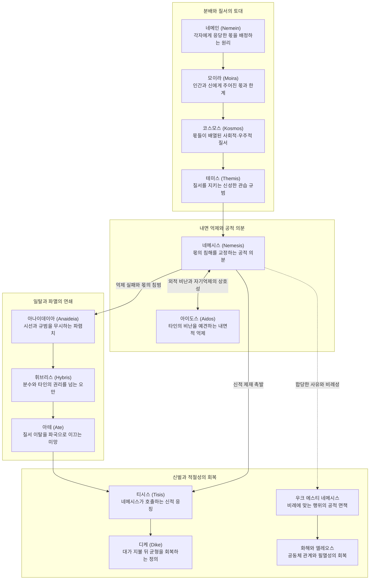

# 네메시스 (Nemesis)

**[[greek-reading-guide|읽는 법]]**: 네메시스 · **원어**: νέμεσις · **학술 전사**: *némesis*

## 1. 정의와 핵심 테제 (Definition & Core Thesis)

### 1.1 핵심 정의 (Core Definition)
**네메시스**(νέμεσις, *némesis*; 관용 라틴명 Nemesis)는 고대 그리스 서사시에서 인간이나 신이 자신의 마땅한 분수와 몫([[concept-moira|Moira]])을 넘어서거나 사회적 위계 질서([[concept-kosmos|Kosmos]]) 및 신성 규범([[concept-themis|Themis]])을 침범했을 때, 공동체와 신들이 느끼는 객관적 규범 척도이자 공적 의분(Righteous Indignation)입니다.

네메시스는 고전기 이후 숭배된 초월적 복수의 인격신(람누스의 여신)이 아니며, 근대 칸트주의적 자율 도덕 법칙에서 유래하는 추상적 정의감도 아닙니다. 그것은 '나누다, 배분하다'를 뜻하는 동사 **네메인**(*nemein*, νέμειν)에 뿌리를 두고, 공동체의 구성원 각자에게 응당 배정되어야 할 몫과 자리가 훼손되었을 때 관찰자의 가슴속([[concept-thumos|Thumos]])에서 생생하게 발동하는 신체화된 도덕 정념이자 상호 제재 기제입니다.

### 1.2 연구사적 핵심 테제 (Core Theses in Scholarship)
호메로스 윤리학 및 도덕심리학 연구사(Long 1970, Lloyd-Jones 1971, Scott 1980, Cairns 1993, 이준석 2024)를 종합할 때, 네메시스의 본질과 사회적 기능을 규명하는 4대 핵심 명제는 다음과 같습니다.

1. **분배 질서와 적절성의 객관적 척도** ([[long-1970-morals-and-values|Long 1970]], [[scott-1980-aidos-and-nemesis|Scott 1980]]):
   네메시스는 어원인 네메인(*nemein*)이 지시하듯 만물과 인간의 마땅한 몫([[concept-moira|Moira]])을 보존하는 '적절성의 기준(Standard of Appropriateness)'입니다. 앤서니 롱(Long 1970)이 논증했듯, 호메로스 사회의 도덕은 결과 중심의 아레테([[concept-arete|Arete]])와 결핍된 협력 가치의 단순 대립이 아니라, 비겁이라는 결핍(Deficiency)과 오만([[concept-hybris|Hybris]])이라는 과도함(Excess) 양자를 감시하는 통합적 척도로 작동합니다. 행위가 객관적 사리와 비례에 부합할 때는 어떠한 도덕적 비난도 성립하지 않는다는 공식 면책 관용구인 '**네메시스가 되지 않는다**(*ouk esti nemesis*)'가 선언됩니다.
2. **아이도스(Aidos)와의 대칭적 상호 제재 기제** ([[scott-1980-aidos-and-nemesis|Scott 1980]], [[cairns-1993-aidos|Cairns 1993]]):
   네메시스는 행위자 내면의 수치·경외·자기억제 감정인 **아이도스**([[concept-aidos|Aidos]])와 불가분의 대칭적 짝을 이룹니다. 메리 스콧(Scott 1980)과 더글러스 케언스(Cairns 1993)가 규명했듯, 공동체와 관찰자가 표출하는 공적 의분(Nemesis)과 세간의 비난 평판(*phatis dēmou*)을 행위자가 사전에 예견하고 내면화할 때 본능적인 감정적 위축(Shrinking back)으로서의 아이도스가 발동합니다. 즉, 네메시스는 외부의 시선과 제재를 통해 개인의 명예([[concept-time|Time]])를 상호 승인하고 공동체 질서를 유지시키는 외적 규범 축입니다.
3. **제우스의 정의(Dike) 및 신적 제재와의 연동** ([[lloyd-jones-1971-justice-of-zeus|Lloyd-Jones 1971]], [[cairns-1993-aidos|Cairns 1993]]):
   네메시스는 인간 사회의 여론에 머물지 않고 올림포스 신들의 신벌(Divine Sanction)과 직접 연동됩니다. 휴 로이드-존스(Lloyd-Jones 1971)가 입증했듯, 『일리아스』에서부터 제우스는 손님 환대([[concept-xenia|Xenia]])와 탄원자([[concept-hikesia|Hikesia]])를 유린하는 불의에 대해 침묵하지 않습니다. 아킬레우스가 헥토르의 사체를 훼손할 때 신들이 느끼는 의분(_Il._ 24.53–54)처럼, 네메시스는 필멸자의 한계를 망각한 오만에 개입하여 우주적 균형과 정의([[concept-dike|Dike]])를 복원하는 초월적 응징의 원천으로 기능합니다.
4. **귀족 과두 질서의 기득권 수호와 분배 갈등의 비극성** ([[scott-1980-aidos-and-nemesis|Scott 1980]], [[lee-junseok-2024-iliad-jeongam|이준석 2024]]):
   네메시스는 보편적 평등 정의가 아니라 바실레우스(Basileus) 귀족 전사 계층의 위계와 전리품([[concept-geras|Geras]]) 배분 체계를 보호하는 사회제도적 도구성을 띱니다. 평민 [[entity-thersites|테르시테스]]의 정당한 비판이 '질서 위반(*ou kata kosmon*)'으로 규정되어 군대의 네메시스와 물리적 폭력으로 탄압받은 것은 규범의 계급적 비대칭성을 폭로합니다. 나아가 이준석(2024)이 분석하듯, 최고 권력자 [[entity-agamemnon|아가멤논]]이 [[entity-achilles|아킬레우스]]의 전리품을 부당하게 박탈하여 전통적 분배 정의를 파괴했을 때, 네메시스의 제도적 안전판은 붕괴하고 영웅 윤리 전체가 치명적인 비극적 내전 상태로 치닫게 됩니다.

### 1.3 상황적 면책 기제: '네메시스가 되지 않는다(Ouk esti nemesis)'의 객관적 비례성
호메로스 서사시에서 관용구 '**네메시스가 되지 않는다**(*ouk esti nemesis* / οὐ νέμεσις)'는 외견상 비난받을 만한 상황일지라도, 그 행위가 인간 실존의 한계나 초인적 가치, 혹은 더 높은 공동체적 당위와 '비례의 척도'를 갖출 때 공적으로 면책을 부여하는 객관적 규범 기준입니다 ([[long-1970-morals-and-values|Long 1970]], [[scott-1980-aidos-and-nemesis|Scott 1980]]).
- **초인적 아름다움에 상응하는 비극적 희생 인정**: 트로이아 원로들이 헬레네의 미모를 보고 양군이 겪는 10년의 전란이 "결코 네메시스가 아니다"라고 인정할 때 (_Il._ 3.156–157).
- **군주의 위엄보다 우선하는 공동체적 배상과 화해**: 오디세우스가 아가멤논에게 먼저 화해하고 배상하는 것은 군주에게 "결코 네메시스가 되지 않는다"고 조언할 때 (_Il._ 19.182–183).
- **가혹한 전쟁 앞에서의 인간적 연약함 정상 참작**: 9년간의 고난 끝에 고향을 그리워하며 우는 전사들의 슬픔을 변호할 때 (_Il._ 2.296–298).
- **과도함과 결핍을 배격하는 중용의 환대**: 메넬라오스가 손님을 지나치게 붙잡거나 내쫓는 양극단 모두를 경계하고 적절한 환대의 척도를 제시할 때 (_Od._ 15.68–74).

---

## 2. 어원과 형태론 (Etymology & Morphology)

### 2.1 인도유럽 조어(PIE) 기원과 비교언어학적 계통

- **인도유럽 조어(PIE) 어근 `*nem-`의 음운 체계와 원초적 의미론**:
  - 그리스어 **네메시스**(νέμεσις, *némesis*) 및 기저 동사 **네모**(νέμω, *némō*, '분배하다, 할당하다, 방목하다')는 인도유럽 조어 어근 `*nem-`('할당하다, 분배하다, 배정하다, 세다/헤아리다; [중간태] 자신의 몫을 취하다, 소유하다', LIV² 453; Chantraine DELG 742–744; Beekes EDG 1007–1008)에서 직접 유래합니다.
  - 어근 `*nem-`은 인도유럽 조어 모음 교체(Ablaut) 체계에 따라 다음과 같이 다각도로 분화되었습니다:
    - **e-계제(e-grade)** `*nem-`: 기본 동작 동사 그리스어 **네모**(νέμω, *némō*, '분배하다') 및 중성 s-어간 명사 **네모스**(νέμος, *némos*, '배당된 목초지, 숲')의 모태입니다. 명사 **네메시스**(νέμεσις)는 명사 형성 접미사 `*-tis / *-sis`가 결합한 `*nem-e-tis` 혹은 s-어간 기저 `*nemes-`에서 음운론적으로 도출된 추상 동작 명사(Nomen actionis)로, 원초적으로 '마땅한 몫의 배정' 및 '그 배정의 침범에 대한 반작용적 의분'을 가리킵니다.
    - **o-계제(o-grade)** `*nom-`: 명사화 모음 교체를 통해 그리스어 **노모스**(νομός, *nomós*, '목초지, 구역, 할당지' < `*nom-ó-s`)와 **노모스**(νόμος, *nómos*, '관습, 법, 배당된 규범' < `*nóm-o-s`), 그리고 동사 **노미조**(νομίζω, *nomízō*, '관습으로 여기다, 인정하다')를 파생시켰습니다.
    - **제로 계제(zero-grade)** `*n̥m-`: 복합어 형성 및 특정 분사 형태의 기저를 이룹니다.
  - 에밀 벵베니스트(Émile Benveniste 1969)의 제도어휘론적 분석에 따르면, `*nem-`의 원초적 본질은 단순한 기계적 균등 분할이 아니라 **공동체의 권위와 전통 질서에 따라 각 구성원에게 '응당한 몫(Due share)'을 배정하는 사법적·사회적 행위**입니다. 따라서 **네메시스**(νέμεσις)는 배정된 몫의 경계([[concept-moira|Moira]])가 침범당하거나 위계 질서([[concept-kosmos|Kosmos]])가 파괴되었을 때 이를 원상 복구하려는 '사회적·신적 분배 항상성 메커니즘'으로 언어학적 기원을 지닙니다.

- **인도유럽어족 주요 어파별 동계어(Cognates) 비교 체계**:
  - **게르만어파 (Germanic)**:
    - 게르만 조어 `*nemaną`('취하다, 받아들이다')로 계승되어 원시 어근의 반사적·중간태적 의미('자신에게 배정된 몫을 취하다')를 보존합니다.
    - 고트어(Gothic) 동사 **니만**(*niman*, '취하다, 받아들이다')은 성경 번역에서 광범위하게 사용되는 기본 동사입니다.
    - 고대 고지 독일어(OHG) **네만**(*neman*), 중세 고지 독일어 **네멘**(*nemen*)을 거쳐 현대 독일어 **네멘**(*nehmen*, '취하다, 가지다')으로 직계 계승되었습니다.
    - 파생어 계통: 독일어 **페어눈프트**(*Vernunft*, '이성, 분별' < 중세 고지 독일어 *vernünft* < *vernehmen* '지각하다, 받아들여 파악하다'), **안게넴**(*angenehm*, '유쾌한, 마음에 드는' < '받아들일 만한'), **베네멘**(*Benehmen*, '행실, 처신' < '스스로 취하는 태도').
    - 고대 영어(Old English) 동사 **니만**(*niman*, '취하다, 붙잡다')은 중세 영어까지 쓰이다가 스칸디나비아 차용어 *take*로 대체되었으나, 과거분사형 *numen*('사로잡힌, 마비된')에서 현대 영어 형용사 **넘**(*numb*, '감각이 마비된')이 잔존 파생되었습니다.
  - **이탈리아어파 (Italic / Latin)**:
    - 라틴어 **누메루스**(*numerus*, '수, 척도, 운율, 계산' < `*nom-es-ro-s` 또는 `*nomes-`, de Vaan 2008: 403–404): 어근 `*nem-`의 o-계제 파생어로, '배당을 위해 세다, 몫을 분배하기 위해 헤아리다'라는 의미에서 추상적 '수(Number)'와 '비례의 척도'로 의미가 전이되었습니다.
    - 라틴어 **네무스**(*nemus*, 속격 *nemoris*, 중성 명사, '성스러운 숲, 목초지, 숲속 공지'): 그리스어 **네모스**(νέμος)와 완전한 음운적 대응쌍(`*ném-os-`)을 이루며, 가축 방목을 위해 분배된 목초지 또는 신에게 특별히 배정된 '성소(Sacred grove)'를 가리킵니다.
    - 라틴어 고유명사 **네메시스**(*Nemesis*): 고전기 이후 그리스 종교와 문학에서 차용된 외래 신명입니다.
  - **인도-이란어파 (Indo-Iranian)**:
    - 베다 산스크리트어(Vedic Sanskrit) 중성 명사 **나마스**(*namas-*, '경배, 헌사, 굴복, 예배') 및 동사 **나마티**(*namati*, '구부리다, 절하다, 복종하다').
    - 비교언어학적 쟁점: 고전 비교언어학(Chantraine, Pokorny 763–764)에서는 산스크리트어 *namas-*를 각자에게 배정된 신적 위계와 권위를 인정하고 '응당한 몫을 바치는 경배'로 해석하여 그리스어 νέμος / νέμεσις와 단일 어근으로 결합했습니다. 반면 현대 인도유럽어 어근 사전(LIV² 453–454; Mayrhofer EWAia II 13–14)에서는 분배·취득의 `*nem-¹`('allot, take')과 굽힘·경배의 `*nem-²`('bend, bow')을 엄밀한 음운·의미론적 층위에서 별개의 어근으로 분리합니다. 그러나 제의적·사회적 맥락에서 신적 몫에 대한 '인정과 굴복(Homage)'과 '신적 의분(Nemesis)'이 갖는 기능적 상응성은 인도유럽 가치론 비교 연구의 핵심 주제로 논의됩니다.
  - **켈트어파 (Celtic)**:
    - 갈리아어(Gaulish) **네메톤**(*nemeton*, '성스러운 숲, 신전') 및 고대 아일랜드어(Old Irish) **네메드**(*nemed*, '성소, 특권적 지위/계급'): 원시 켈트어 `*nemeto-` (< PIE `*nem-`)에서 유래하여, 신적 권위에 의해 구획되고 할당된 성역의 원초적 공간 관념을 입증합니다.
  - **발트-슬라브어파 (Balto-Slavic)**:
    - 라트비아어 **누오마**(*nùoma*, '임대료, 배당 지분') 및 리투아니아어 **누오마**(*nùoma*, '임대, 차지'): 분배와 경제적 지분의 의미를 계승합니다.

---

### 2.2 호메로스 방언 곡용·활용형 및 파생 어휘 체계 (Morphology & Lexicon)

호메로스 서사시 본문에서 명사 **네메시스**(νέμεσις)는 원시 i-어간 명사의 굴절을 따르며, 파생 동사는 s-어간 기저(`*nemes-`)에 데노미나티브(Denominative) 접미사 `*-ye/o-`가 결합한 **네메사오**(νεμεσάω)와 **네메시조마이**(νεμεσίζομαι)로 실체화됩니다. 특히 서사시 운율(Dactylic Hexameter)의 필요에 따라 모음 간 시그마의 중복 표기(-σσ-, Epic Gemination) 및 디엑타시스(Diectasis) 형태가 광범위하게 출현합니다.

| 그리스어 실제형 | 학술 전사 | 품사 및 형태론 | 의미 및 문헌학적 맥락 |
|:---|:---|:---|:---|
| νέμεσις | *némesis* | 명사 (여성 단수 주격) | "공적 의분, 정당한 분노, 비난". 응당한 분수와 몫([[concept-moira\|Moira]])을 침범한 자에 대해 공동체와 신들이 느끼는 객관적 도덕 분노 (_Il._ 2.223: 테르시테스에 대한 분노; _Od._ 2.136). |
| νέμεσιν | *némesin* | 명사 (여성 단수 대격) | "의분을, 비난을". 타인의 비난 시선(*phatis dēmou*)을 의식하는 문맥 (_Il._ 6.351: 헬레네가 자책하며 '사람들의 수많은 비난'을 의식할 줄 아는 남편을 원했음을 한탄). |
| νεμέσσι | *neméssi* | 명사 (여성 단수 여격 / 도구격) | "의분으로, 비난 때문에". 운율적 자음 중복(-σσ-)이 적용된 호메로스 고형 여격 (_Il._ 6.335: 파리스가 트로이아인들의 분노나 의분 때문이 아니라 슬픔 때문에 방에 머물렀다고 변명함). |
| οὐ νέμεσις / οὐκ ἔστι νέμεσις | *ou némesis* / *ouk ésti némesis* | 정형구 (부정사 + 계사 + 명사) | "결코 비난거리가 아니다, 의분의 대상이 아니다". 일정한 고난이나 행위가 비례의 척도에 부합함을 공인하는 면책 공식 (_Il._ 3.156: 헬레네의 미모에 대한 찬탄; _Il._ 19.182; _Od._ 1.350). |
| νεμεσάω / νεμεσᾶν | *nemesáō* / *nemesâ̂n* | 동사 (현재 능동태 표제형 / 아티카 부정사) | "의분을 품다, 정당하게 격분하다". s-어간 명사 기저 `*nemes-yo-`에서 형성된 기본 동사. 호메로스에서는 주로 비축약형 및 에픽 중복형으로 출현. |
| νεμεσσῶμαι | *nemessō̂mai* | 동사 (현재 중포태 1인칭 단수) | "나는 가슴속 깊이 격분하노라". 운율적 시그마 중복(-σσ-) 형태 (_Il._ 13.119: 포세이돈이 나약한 병사가 아닌 탁월한 영웅들의 나태에 대해 '가슴속 깊이 의분을 느낀다'며 질타). |
| νεμεσσᾶτον | *nemessâton* | 동사 (현재 능동태 2인칭 쌍수) | "그대들 둘은 [타인에게도] 의분을 느낄 것이다". 상호적 의분과 역지사지를 촉구하는 쌍수형 (_Il._ 23.494: 아킬레우스가 다투는 아이아스와 이도메네우스를 중재하며 훈계). |
| νεμεσήσεται / νεμεσσήσεται | *nemesḗsetai* / *nemessḗsetai* | 동사 (미래 직설법 / 단모음 접속법 3인칭 단수) | "의분을 품을까 두렵다, 비난할 것이다" (_Il._ 17.95: 메넬라오스가 전우 파트로클로스의 시신을 두고 물러설 때 '다나오스인들이 내게 네메시스를 품을까' 고뇌함). |
| νεμεσσήθητε | *nemessḗthēte* | 동사 (무기명 아오리스트 수동 2인칭 복수 명령형) | "가슴속에 의분을 품으라!". 공적 집회에서 시민들의 도덕적 궐기를 촉구하는 명령형 (_Od._ 2.64: 텔레마코스가 이타카 아고라에서 구혼자들의 만행에 분노할 것을 시민들에게 호소). |
| νεμεσσηθεῖεν | *nemessētheîen* | 동사 (아오리스트 수동 3인칭 복수 희구법) | "그들이 의분을 느끼기를, 마땅히 분노할 터이다" (_Il._ 16.544: 글라우코스가 사르페돈의 시신 유기에 대해 뮈르미돈족이 의분을 느끼기를 탄원함). |
| νεμεσσητός / νεμεσητός | *nemessētós* / *nemesētós* | 형용사 (남성 단수 주격, 언어적 형용사) | "비난받아 마땅한, 네메시스를 살 만한; 불의에 깊이 의분을 느끼는 성품의" (_Il._ 11.649: 네스토르의 성품에 대해 '사소한 일에도 의분을 품는 엄격한 인물'임을 묘사; _Il._ 19.182: *ou... nemessētón*). |
| νεμέτωρ | *nemétōr* | 명사 (남성 단수 주격, 행위자 명사 `*-tōr`) | "분배자, 할당자; 불의를 바로잡는 응징자/복수자". 어근 `*nem-`의 직접 파생 행위자 명사로, 정의로운 몫을 분배하고 일탈을 단죄하는 초월적·인간적 심판관 (서정시 및 비극 문헌에 계승). |
| νεμεσητήρ | *nemesētḗr* | 명사 (남성 단수 주격, 행위자 명사 `*-tēr`) | "비난하는 자, 의분을 터뜨리는 자". 파생 어간 `*nemesē-`에 결합한 행위자 명사로, 공동체의 관습과 규범을 감시하고 위반자에게 공적 견책을 가하는 자를 지칭. |
| νεμεσίζομαι | *nemesízomai* | 동사 (현재 중간태 1인칭 단수) | "차마 하지 못하다, 불경으로 여겨 꺼리다, 비난하다". 접미사 `*-izō`가 부가된 이차 파생형 (_Od._ 3.14, 20.330: 텔레마코스가 노인이나 손님에 대해 선을 넘지 않으려는 도덕적 조심성을 표현). |

---

### 2.3 수치·의분 3대 규범 어휘 비교 체계 (Aidos vs Nemesis vs Aischyne)

호메로스 영웅 사회의 규범 질서와 도덕 심리학은 **아이도스**(αἰδώς), **네메시스**(νέμεσις), **아이스퀴네**(αἰσχύνη)라는 3대 핵심 어휘의 상호 연동을 통해 지탱됩니다. 이들은 인도유럽 조어 어근에서부터 ‘**물러섬**(Inhibition)’, ‘**분배**(Allocation)’, ‘**추함/치욕**(Ugliness/Disgrace)’이라는 고유한 의미론적 핵을 지니며, 작동 주체, 시선의 방향, 시간성, 그리고 분배 질서와의 관계에서 다음과 같이 정밀하게 분화됩니다:

| 비교 기준 | 아이도스 (αἰδώς / *aidṓs*) | 네메시스 (νέμεσις / *némesis*) | 아이스퀴네 (αἰσχύνη / *aiskhúnē*) |
|:---|:---|:---|:---|
| **어원 및 기저 어근** | PIE `*h₂eyd-` ('경외하여 물러서다, 삼가다') | PIE `*nem-` ('할당하다, 분배하다, 세다') | PIE `*h₂eyg̑ʰ-` / `*h₂eys-` 계통 추정, 그리스어 αἶσχος(*aîskhos*, '추함, 볼품없음, 치욕') 파생 |
| **분배 질서([[concept-moira\|Moira]])와의 결합 방식** | **자신의 몫에 대한 자발적 억제와 준수** 타인의 분배 영역을 침범하지 않도록 자신의 욕망을 경계선 안쪽으로 주춤거리게 하는 내적 제동 장치 | **공동체의 분배 척도([[concept-kosmos\|Kosmos]]) 위반에 대한 감시와 응징** 누군가 마땅한 몫을 초과(오만, [[concept-hybris\|Hybris]])하거나 타인의 몫을 침탈할 때 작동하는 공적 분배 교정 기제 | **분배의 균형 실패와 영웅적 위계 탈락에서 비롯되는 추악한 불명예** 분배받을 자격([[concept-arete\|Arete]])을 증명하지 못하여 사회적 명예([[concept-time\|Time]])가 훼손된 상태 |
| **심리적 본질** | **내면적·선제적 자기억제** (Inhibition / Emotional Shrinking back) | **외적·응징적 공적 의분** (Righteous Indignation / Retributive Anger) | **결과적·사후적 불명예와 객관적 수치** (Disgrace / Consequential Shame) |
| **작동 주체와 시선의 방향** | **행위자 자신** 가슴속([[concept-thumos\|Thumos]])에서 작동하는 '내면화된 타자'의 시선을 의식하여 스스로 행동을 제어 | **관찰자 공동체 및 신들** 일탈자를 향해 쏟아지는 세간의 비난 여론(*phatis dēmou*) 및 신들의 초월적 응징 시선 | **타인의 조롱과 멸시에 노출된 행위자** 사회적 체면과 '얼굴(Face)'을 상실하여 공동체의 시선 앞에서 위축되고 고개 숙임 |
| **시간적 역학 (Temporality)** | **선제적·예방적(Prospective / Preventive)** 선과 한계를 넘기 '직전'에 스스로를 멈추게 함 | **반응적·교정적(Reactive / Retrospective)** 분배 균형의 침범과 일탈이 일어난 '직후'에 발동됨 | **결과적·사후적(Resultative / Consequential)** 패배, 도주, 추태 등의 결과가 '확정된 후' 엄습함 |
| **위반 시 수반되는 사법적 결과** | 파렴치([[concept-anaideia\|Anaideia]]) 및 광포한 미망([[concept-ate\|Ate]])으로의 추락 | 신적 징벌([[concept-tisis\|Tisis]]) 및 공동체로부터의 배척과 징계 | 조롱거리(*katagelōs*)로의 전락 및 명예 실추(*atimia*) |
| **호메로스 서사시 내 위상** | 서사시 전체의 **제1 내적 도덕 억제력** (전열 유지, 탄원 수용, 손님 환대, 노인 공경) | 아이도스와 쌍을 이루는 **제1 외적 제재 기제** (적절성의 척도 판정, *ou nemesis* 면책 공식) | 호메로스에서는 추상명사보다는 구체적 명사 αἶσχος(*aîskhos*, 치욕)와 동사 αἰσχύνω(*aiskhúnō*, 더럽히다)로 빈번히 등장 |

- **아이도스와 네메시스의 상호 제재 축 (Mutual Sanction Loop)**:
  - 길버트 머레이(Gilbert Murray)와 메리 스콧(Mary Scott 1980)이 정명했듯, **아이도스는 행위자가 '타인의 네메시스(외적 의분)'를 사전에 예견하여 자신의 가슴속에 선제적으로 체화한 내면적 억제 감정**입니다.
  - 따라서 어원적으로 분배(`*nem-`)의 객관적 기준을 수호하는 **네메시스**가 외적 지평에서 작동하지 않는다면, 경외와 물러섬(`*h₂eyd-`)을 뜻하는 **아이도스** 역시 그 규범적 준거점을 상실하게 됩니다. 두 개념은 분배 질서의 객관적 척도와 주관적 내면화를 양극으로 하는 완전한 상호 보완적 도덕 체계를 구축합니다.

---

## 3. 호메로스 서사시 본문 용례와 맥락 (Homeric Attestation & Contexts)

호메로스 서사시에서 **네메시스**(νέμεσις, *némesis*) 및 관련 동사군(νεμεσάω, νεμεσίζομαι)은 추상화된 법률이나 외재적 형벌 제도가 아니라, 인간과 신들의 정서적 중심 기관인 [[concept-thumos|튀모스(Thumos)]]에서 솟구치는 **도덕적·공적 의분**(Righteous Indignation)으로 작동합니다. 어원적으로 '응당한 몫을 분배하다'를 뜻하는 동사 **네메인**(*némein*, νέμειν)에 기원을 둔 네메시스는 모든 인간과 신이 우주적 분수([[concept-moira|Moira]])와 사회적 위계 질서([[concept-kosmos|Kosmos]]), 그리고 관습 규범([[concept-themis|Themis]])을 침범했을 때 이를 원상 복구하려는 강력한 반작용 감정입니다.

서사시 전편에서 명사 *némesis*는 총 9회(『일리아스』 4회, 『오뒷세이아』 5회), 동사 *nemesáō / nemesízomai*는 총 21회(『일리아스』 10회, 『오뒷세이아』 11회) 출현합니다. 『일리아스』에서는 전열 붕괴, 위계 질서 파괴, 전우 시신 유기, 신들의 거룩한 경계선 침범 등 전시(戰時) 공동체의 존립을 위협하는 행위에 대한 응징적 분노로 주로 표출됩니다. 반면 『오뒷세이아』에서는 사적 가산([[concept-oikos|Oikos]]) 침탈, 손님 환대([[concept-xenia|Xenia]])의 결핍과 과도함, 민회(Agora)에서의 공론화 및 귀족적 평판 갈등 등 평화기 아르카익 폴리스의 사회윤리적 척도로 다변화되어 작동합니다.

### 3.1 『일리아스』에서의 출현과 용례

#### 1) 신분 및 위계 질서(Kosmos) 수호
호메로스 전사 사회에서 군대의 결속을 유지하는 핵심 축은 엄격한 계급적 위계 질서(*kósmos*)입니다. 하층민이 귀족 지휘관의 권위를 침범하거나, 신분 질서에 부합하지 않는 무책임한 탈선을 저지를 때 공동체는 집단적 네메시스를 분출합니다.

- **테르시테스의 월권 단죄** (_Il._ 2.222–223):
  평민 전사 [[entity-thersites|테르시테스]]가 총사령관 [[entity-agamemnon|아가멤논]]을 향해 탐욕과 무능을 공개적으로 성토하며 조롱했을 때, 아카이아 군대 전체는 그에게 깊은 증오와 함께 가슴속 깊이 끓어오르는 네메시스를 품습니다. 이는 계급 질서의 일탈이 전체 전열의 붕괴를 초래할 수 있다는 공포와 분노의 결합입니다.
  - **번역**: "그러나 아카이아인들은 그에게 맹렬히 노여워했고 가슴속으로 깊이 의분(네메시스)을 품었다."
  - **원문**: τῷ δ’ ἄρ’ Ἀχαιοὶ / ἐκπάγλως κοτέοντο νεμέσσηθέν τ’ ἐνὶ θυμῷ.
  - **학술 전사**: *tō̂i d’ ár’ Akhaioì / ekpáglōs kotéonto neméssēthén t’ enì thumō̂i.*
  수동형 분사 'νεμέσσηθεν'(*neméssēthen*)은 분노가 통제되지 않는 개인적 원한이 아니라, 공동체의 질서 감각에 의해 촉발된 필연적·정당한 반작용임을 보여줍니다.

- **헬레네의 자책과 세간의 비난** (_Il._ 6.350–351):
  [[entity-helene|헬레네]]는 헥토르와의 대화에서 자신의 비극적 처지와 남편 [[entity-paris|파리스]]의 나태함을 한탄하며, 세간의 비난을 전혀 의식하지 못하는 파리스의 도덕적 마비를 질타합니다.
  - **번역**: "그렇다면 사람들의 수많은 비난(네메시스)과 치욕을 알 줄 아는 더 훌륭한 남자의 아내가 되었어야 마땅했을 것을."
  - **원문**: ἀνδρὸς ἔπειτ’ ὤφελλον ἀμείνονος εἶναι ἄκοιτις, / ὃς ᾔδη νέμεσίν τε καὶ αἴσχεα πόλλ’ ἀνθρώπων.
  - **학술 전사**: *andròs épeit’ ṓphellon ameínonos eînai ákoitis, / hòs ḗidē némesín te kaì aískhea póll’ anthrṓpōn.*
  여기서 '사람들의 네메시스'(*némesis anthrṓpōn*)는 외적 평판([[concept-aidos|Aidos]])을 감지할 줄 아는 성품이 탁월한 영웅([[concept-agathos|Agathos]])의 본질적 징표임을 증명합니다. 파리스는 네메시스를 알지 못하기에 진정한 아가토스가 되지 못합니다.

#### 2) 영웅적 아레테 불이행과 전우애 질책
네메시스는 귀족 전사 계급에게 부여된 영웅적 탁월성([[concept-arete|Arete]])과 상호적 전우애([[concept-hetairoi|Hetairoi]])를 감시하는 가장 날카로운 내적 척도입니다.

- **포세이돈의 용사 질책** (_Il._ 13.117–122):
  아카이아 방벽이 무너지고 함선이 불탈 위기에 처하자, 바다의 신 [[entity-poseidon|포세이돈]]은 칼카스의 모습으로 나타나 최정예 영웅들을 질타합니다. 신은 나약한 자의 비겁함에는 화를 내지 않으나, 가장 뛰어난 자들(*áristoi*)이 무력하게 용기를 버릴 때는 가슴속 깊이(*perì kê̂ri*) 네메시스를 느낀다고 선언합니다.
  - **번역**: "그대들은 진중의 가장 탁월한 자들이면서도 더 이상 격렬한 용맹을 아름답게 떨치지 않고 있소. 나는 나약한 자가 싸움에서 물러선다면 그 자와는 다투지(나무라지) 않겠으나, 그대들에게는 가슴속 깊이 의분(네메시스)을 느끼오!"
  - **원문**: ὑμεῖς δ’ οὐκέτι καλὰ μεθίετε θούριδος ἀλκῆς / πάντες ἄριστοι ἐόντες ἀνὰ στρατόν· οὐδ’ ἂν ἔγωγε / ἀνδρὶ μαχεσσαίμην ὅς τις πολέμοιο μεθείη / λυγρὸς ἐών, ὑμῖν δὲ νεμεσσῶμαι περὶ κῆρι.
  - **학술 전사**: *humeîs d’ oukéti kalà methíete thoúridos alkê̂s / pántes áristoi eóntes anà stratón; oud’ àn égōge / andrì makhessaímēn hós tis polemóio metheíē / lugròs eṓn, humîn dè nemessō̂mai perì kê̂ri.*
  이는 네메시스가 만인에게 균등하게 분배되는 감정이 아니라, 신분적 위상과 탁월성의 역량에 비례하여 부과되는 책무의 척도임을 명시합니다.

- **전우 시신 수습 의무와 메넬라오스의 고뇌**:
  호메로스 전장에서 전우의 시신 수습과 무구 방어는 거룩한 종교적 의무입니다. 이를 포기하는 행위는 동료 전사들의 파멸적 네메시스를 불러옵니다.
  - **메넬라오스의 독백** (_Il._ 17.91–93): [[entity-patroklos|파트로클로스]]의 시신 곁에서 홀로 분투하던 [[entity-menelaos|메넬라오스]]는 헥토르의 맹공 앞에서 후퇴를 고민하며 동료들의 네메시스를 두려워합니다.
    - **번역**: "아, 슬프도다! 만일 내가 이 아름다운 무구들과, 나의 명예(티메)를 위해 이곳에 쓰러져 있는 파트로클로스를 두고 떠난다면, 이를 보는 다나오스인들 중 누군가가 나에게 의분(네메시스)을 품지 않겠는가!"
    - **원문**: ὤ μοι ἐγών, εἰ μέν κε λίπω κάτα τεύχεα καλὰ / Πατρόκλον θ’, ὃς κεῖται ἐμῆς ἕνεκ’ ἐνθάδε τιμῆς, / μή τίς μοι Δαναῶν νεμεσήσεται, ὅς κεν ἴδηται·
    - **학술 전사**: *ṓ moi egṓn, ei mén ke lípō káta teúkhea kalà / Patróklon th’, hòs keîtai emê̂s hének’ entháde timê̂s, / mḗ tís moi Danaō̂n nemesḗsetai, hós ken ídētai;*
  - **글라우코스의 사르페돈 시신 구원 촉구** (_Il._ 16.544–545): [[entity-glaukos|글라우코스]]는 [[entity-sarpedon|사르페돈]]이 전사했을 때 헥토르와 트로이 전사들에게 즉각 네메시스를 품으라고 명령합니다.
    - **번역**: "벗들이여, 어서 나아가 가슴속에 의분(네메시스)을 품으시오! 뮈르미돈족이 무구를 벗기고 시신을 능욕하지 못하도록 말이오."
    - **원문**: ὦ φίλοι, ἀλλὰ μόλες, νεμεσήθητε δ’ ἐνὶ θυμῷ, / μὴ ἀπὸ τεύχε’ ἕλωνται, ἀεικίσσωσι δὲ νεκρὸν
    - **학술 전사**: *ō̂ phíloi, allà móles, nemesḗthēte d’ enì thumō̂i, / mḕ apò teúkhe’ hélōntai, aeikíssōsi dè nekròn*
  - **아이아스의 전열 환기** (_Il._ 17.254–255): 큰 [[entity-ajax|아이아스]] 역시 파트로클로스의 시신을 지키기 위해 장수들을 독려합니다.
    - **번역**: "오히려 스스로 나아가, 파트로클로스가 트로이아 개들의 노리개가 되는 것을 가슴속으로 분개(네메시스)해야 할 것이오!"
    - **원문**: ἀλλά τις αὐτὸς ἴτω, νεμεσιζέσθω δ’ ἐνὶ θυμῷ / Πάτροκλον Τρῳῇσι κυσὶ μέλπηθρα γενέσθαι.
    - **학술 전사**: *allá tis autòs ítō, nemesizésthō d’ enì thumō̂i / Patróklon Trōiê̂isi kusì mélpēthra genésthai.*

#### 3) 신들의 의분과 한계선 수호
올림포스의 신들은 필멸자가 정해진 운명의 몫([[concept-moira|Moira]])을 넘어 과도함(Excess)과 오만([[concept-hybris|Hybris]])을 자행하거나, 신들 사이의 분배 질서를 침범할 때 최고의 신적 네메시스를 발동합니다.

- **아폴론의 시신 모독 경고** (_Il._ 24.53–54):
  [[entity-achilles|아킬레우스]]가 헥토르의 사체를 전차에 묶어 끌고 다니며 모독할 때, [[entity-apollo|아폴론]]은 올림포스 신들에게 그 잔혹함을 고발합니다.
  - **번역**: "그가 제아무리 용맹한 자(아가토스)일지라도 우리가 그에게 의분(네메시스)을 품지 않도록 경계해야 하오. 그가 광포함에 사로잡혀 말 못 하는 흙먼지(대지)를 능욕하고 있기 때문이오."
  - **원문**: μὴ ἀγαθῷ περ ἐόντι νεμεσσηθέωμέν οἱ ἡμεῖς· / κωφὴν γὰρ δὴ γαῖαν ἀεικίζει μενεαίνων.
  - **학술 전사**: *mḕ agathō̂i per eónti nemessēthéōmén hoi hēmeîs; / kōphḕn gàr dḕ gaîan aeikízei meneainōn.*
  이 구절은 아가토스의 아레테가 도덕적 면책특권이 아니며, 자연과 신성 질서를 능욕할 경우 신적 네메시스의 심판을 면치 못함을 선언하는 호메로스 윤리학의 핵심 테제입니다.

- **헤라의 아레스 월권 항의** (_Il._ 5.757–759):
  전쟁의 신 [[entity-ares|아레스]]가 제우스의 섭리를 넘어 전장에서 질서 없이(*ou katà kósmon*) 학살을 자행하자, [[entity-hera|헤라]]는 [[entity-zeus|제우스]]에게 최고 지배자로서의 네메시스를 발동할 것을 강력히 항의합니다.
  - **번역**: "아버지 제우스시여, 아레스가 이토록 난폭한 만행을 저지르며 아카이아 군대를 헛되이, 그리고 질서 없이 파멸시키고 있는데도 그에게 의분(네메시스)을 품지 않으십니까?"
  - **원문**: Ζεῦ πάτερ, οὐ νεμεσίζῃ Ἄρῃ τάδε καρτερὰ ἔργα, / ὁσσάτιόν τε καὶ οἷον ἀπώλεσε λαὸν Ἀχαιῶν / μὰψ ἀτὰρ οὐ κατὰ κόσμον;
  - **학술 전사**: *Zeû páter, ou nemesízēi Árēi táde karterà érga, / hossátión te kaì hoîon apṓlese laòn Akhaiō̂n / màps atàr ou katà kósmon?*
  헤라는 신들의 행동 역시 '코스모스에 합치되는가(*katà kósmon*)'라는 척도에 의해 통제되어야 하며, 제우스의 침묵은 신적 직무유기임을 꼬집습니다.

- **포세이돈의 동등한 몫 주장** (_Il._ 15.185–188, 211–217):
  제우스가 전령 이리스를 통해 전장에서 즉각 퇴각하라고 위협하자, 포세이돈은 크로노스의 세 아들이 우주를 제비뽑기로 3분할(*trikhthà dè pánta dédastai*)하여 각자 동등한 명예([[concept-time|Timê]])와 몫(*homótimon*, *isómoron*)을 받았음을 환기시킵니다.
  - **번역**: "아아, 슬프도다! 그가 제아무리 강할지라도 오만한 말을 뱉었구나. 나와 동등한 명예를 지닌 나를 완력으로 내 뜻을 거슬러 억누르려 하다니!"
  - **원문**: ὢ πόποι, ἦ ῥ’ ἀγαθός περ ἐὼν ὑπέροπλον ἔειπεν, / εἴ δή μ’ ὁμότιμον ἐόντα βίῃ ἀέκοντα καθέξει.
  - **학술 전사**: *ṑ pópoi, ē̂ rh’ agathós per eṑn hupéroplon éeipen, / eí dḗ m’ homótimon eónta bíēi aékonta kathéksei.*
  포세이돈의 저항은 근원적 분배(*nemein*)에 뿌리내린 네메시스가 신들의 질서에서도 독재적 권력을 견제하는 우주론적 균형 장치로 기능함을 웅변합니다.

### 3.2 『오뒷세이아』에서의 출현과 용례

『오뒷세이아』에서 네메시스는 전장의 군사적 위기에서 벗어나, 아르카익 폴리스의 일상적 삶을 규율하는 공민적 여론, 가정적 정의, 그리고 손님 환대의 중용 척도로 확장됩니다.

#### 1) 텔레마코스의 아고라 고발 (_Od._ 2.64–67, 136–137)
사적 보복 수단을 갖지 못한 소년 [[entity-telemachos|텔레마코스]]는 이타카 민회(Agora)를 소집하여 구혼자들의 만행을 공민 공동체에 고발합니다. 법정과 상설 관료제가 결여된 아르카익 사회에서 유일한 공적 제재력은 동료 시민들의 가슴속에 일어나는 네메시스뿐입니다.
- **번역**: "그대들 스스로 가슴속에 의분(네메시스)을 품으시오! 그리고 주위에 둘러사는 다른 이웃 사람들을 부끄러워(아이도스)하시오! 또한 신들의 분노(메니스)를 두려워하시오, 신들이 그대들의 악행에 분노하여 이를 뒤엎지 않도록 말이오."
- **원문**: νεμεσσήθητε δὲ καὶ αὐτοί, / ἄλλους τ’ αἰδέσθητε περικτίονας ἀνθρώπους, / οἳ περιναιετάουσι· θεῶν δ’ ὑποδείσατε μῆνιν, / μή τι μεταστρέψωσιν ἀγασσά메νοι κακὰ ἔργα.
- **학술 전사**: *nemessḗthēte dè kaì autoí, / állous t’ aidésthēte periktíonas anthrṓpous, / hoì perinaietáousi; theō̂n d’ hupodeísate mē̂nin, / mḗ ti metastrépsōsin agassámenoi kakà érga.*

나아가 136–137행에서 텔레마코스는 어머니 페넬로페를 억지로 친정으로 쫓아낼 경우, 복수의 여신 에리뉘에스(Erinyes)의 저주뿐 아니라 인간들로부터 쏟아질 공적 비난을 두려워합니다.
- **번역**: "어머니께서 집을 떠나며 끔찍한 복수의 여신들을 부르실 터이니 말이오. 그리고 사람들의 의분(네메시스)이 내게 닥쳐올 것이오."
- **원문**: οἴκου ἀπερχομένη· νέ메σις δέ μοι ἐξ ἀνθρώπων / ἔσσεται·
- **학술 전사**: *oíkou aperkhoménē; némesis dé moi eks anthrṓpōn / éssetai;*
이는 네메시스가 효도와 오이코스의 신성함을 지키는 사회적 평판 감시망임을 입증합니다.

#### 2) 구혼자들의 파렴치함과 세간의 비난 두려움 (_Od._ 21.285–286, 323–329)
페넬로페의 구혼자들은 평소 신과 인간의 네메시스를 무시하는 극단적 파렴치(ἀναίδεια, *anaídeia*)를 일삼습니다. 그러나 누더기를 걸친 거지([[entity-odysseus|오디세우스]])가 활쏘기 시합에 참여하려 할 때, 구혼자들의 우두머리 안티노오스와 에우리마코스는 극심한 분노와 공포를 드러냅니다.
- 에우리마코스는 페넬로페에게 활을 건네지 못하게 막아서며, 하층민 거지가 활을 메기고 귀족들이 실패할 경우 닥쳐올 세간의 평판(*phátis*)과 치욕(*eléngkhea*)을 두려워합니다 (_Od._ 21.323–329).
- 구혼자들의 행태는 네메시스의 계급적 양면성을 적나라하게 폭로합니다. 그들은 남의 재산을 약탈하는 실질적 불의에는 네메시스를 느끼지 못하면서도, 하층민에 의해 귀족적 아레테의 우월성이 훼손되어 조롱거리가 되는 외적 체면 손상에는 병적으로 반응합니다.

#### 3) 손님 환대의 중용 척도 (_Od._ 15.68–74)
스파르타의 왕 메넬라오스는 귀향을 재촉하는 텔레마코스를 전송하며 고대 그리스 환대 윤리([[concept-xenia|Xenia]])의 최고 규범을 천명합니다.
- **번역**: "텔레마코스여, 귀향을 열망하는 그대를 내 결코 이곳에 오래 붙잡아 두지 않겠소. 나는 손님을 지나치게 사랑하거나 지나치게 박대하는 어떤 집주인에게도 의분(네메시스)을 느끼오. 모든 일에는 알맞은 척도(중용)가 더 훌륭한 법이오. 떠나고 싶어 하지 않는 손님을 재촉하는 것이나, 서둘러 떠나려는 손님을 억지로 붙잡아 두는 것은 똑같이 나쁜 일이오. 머물러 있는 손님은 잘 대접하고, 떠나고자 하는 손님은 배웅해야 마땅하오."
- **원문**: Τηλέμαχ’, οὔ τί σ’ ἐγώ γε πολὺν χρόνον ἐνθάδ’ ἐρύξω / ἱέμενον νόστοιο· νεμεσσῶμαι δὲ καὶ ἄλλῳ / ἀνδρὶ ξεινοδόκῳ, ὅς κ’ ἔξοχα μὲν φιλέῃσιν, / ἔξοχα δ’ ἐχθαίρῃσιν· ἀμείνω δ’ αἴσιμα πάντα. / ἶσόν τοι κακόν ἐσθ’, ὅς τ’ οὐκ ἐθέλοντα νέεσθαι / ξεῖνον ἐποτρύνει καὶ ὃς ἐσσύμενον κατερύκει. / χρὴ ξεῖνον παρεόντα φιλεῖν, ἐθέλοντα δὲ πέμπειν.
- **학술 전사**: *Tēlémakh’, oú tí s’ egṓ ge polùn khrónon enthád’ erúksō / hiémenon nóstoio; nemessō̂mai dè kaì állōi / andrì kseinodókōi, hós k’ éksokha mèn philéēisin, / éksokha d’ ekhthaírēisin; ameínō d’ aísima pánta. / îsón toi kakón esth’, hós t’ ouk ethélonta néesthai / kseînon epotrúnei kaì hòs essúmenon katerúkei. / khrḕ kseînon pareónta phileîn, ethélonta dè pémpein.*

메넬라오스의 선언은 네메시스가 단순히 악인을 응징하는 데 그치지 않고, '과도함(Excess)'과 '결핍(Deficiency)'이라는 양극단을 제어하여 '합당한 척도'(*aísima pánta*)를 유지시키는 중용(Mesotes)의 도덕 감정임을 보여줍니다.

---

## 5. 대표 서사 에피소드 정밀 해제 (Signature Epic Episodes)

### 5.1 포세이돈의 아카이아 용사 질책: 신분과 역량에 비례하는 네메시스 (『일리아스』 13.117–122)

#### 1) 서사적 맥락 및 상황
트로이 총사령관 헥토르가 아카이아 진영의 목책을 뚫고 들어와 아르고스 함선들을 불태우기 일보 직전인 파국적 위기 상황입니다. 제우스가 트로이 전선에서 시선을 돌려 트라키아와 히페몰고이족의 평화로운 땅을 내려다보는 틈을 타, 바다의 신 [[entity-poseidon|포세이돈]]이 예언자 칼카스의 모습으로 지상에 강림합니다. 그는 전의를 상실하고 주저앉은 아카이아의 두 아이아스와 최정예 영웅들을 질타하며 전열을 재정비하도록 촉구합니다.

#### 2) 원문 강독 및 전사
- **번역**: "그대들은 진중의 가장 탁월한 자들이면서도 더 이상 격렬한 용맹을 아름답게 떨치지 않고 있소. 나는 나약한 자가 싸움에서 물러선다면 그 자와는 다투지(나무라지) 않겠으나, 그대들에게는 가슴속 깊이 의분(네메시스)을 느끼오!"
- **원문**: ὑμεῖς δ’ οὐκέτι καλὰ μεθίετε θούριδος ἀλκῆς / πάντες ἄριστοι ἐόντες ἀνὰ στρατόν· οὐδ’ ἂν ἔγωγε / ἀνδρὶ μαχεσσαίμην ὅς τις πολέμοιο μεθείη / λυγρὸς ἐών, ὑμῖν δὲ νεμεσσῶμαι περὶ κῆρι.
- **학술 전사**: *humeîs d’ oukéti kalà methíete thoúridos alkê̂s / pántes áristoi eóntes anà stratón; oud’ àn égōge / andrì makhessaímēn hós tis polemóio metheíē / lugròs eṓn, humîn dè nemessō̂mai perì kê̂ri.*

#### 3) 문헌학적 정밀 해제 및 서사적 함의
- **어휘적 대조와 귀족적 비대칭성**: 텍스트는 '진중의 가장 탁월한 자들'(*pántes áristoi*)과 '나약하고 비천한 자'(*lugròs eṓn*)를 선명하게 대립시킵니다. 호메로스 사회에서 네메시스는 보편적 인간 평등에 근거한 감정이 아닙니다. 신분과 역량이 낮은 자가 도망칠 때 전사 귀족 사회는 경멸할지언정 가슴 깊은 네메시스를 품지 않습니다. 그러나 공동체의 명예([[concept-time|Timê]])와 부를 독점적으로 분배받은 귀족 전사(Agathoi)들이 책무를 방기할 때, 신과 사회는 공동체의 존립을 위협하는 배신으로 간주하여 격렬한 네메시스를 터뜨립니다.
- **심장의 좌소와 정념의 격렬함**: '가슴속 깊이 네메시스를 느끼다'(*humîn dè nemessō̂mai perì kê̂ri*)라는 정형구는 이 분노가 관념적 판단이 아니라 신체적 중심인 심장 둘레(*perì kê̂ri*)에서 혈관을 타고 솟구치는 생리적·정서적 반응임을 입증합니다.
- **치료적 분노와 회복 탄력성**: 115행에서 포세이돈은 "고귀한 자들의 마음은 고쳐질 수 있는 법이오"(*akestaí toi phrénes esthlō̂n*)라고 전제합니다. 따라서 포세이돈의 네메시스는 영웅들을 영원히 파멸시키려는 저주가 아니라, 탈선한 아레테를 본래의 궤도로 복원하려는 '교육적·교정적 의분'입니다.

---

### 5.2 아킬레우스의 황금률 중재: 역지사지의 상호적 네메시스 (『일리아스』 23.492–494)

#### 1) 서사적 맥락 및 상황
파트로클로스의 장례 경기 중 가장 큰 명예와 상금이 걸린 전차 경주가 펼쳐집니다. 결승선 멀리서 흙먼지를 일으키며 다가오는 선두 마차를 바라보며, 관람석의 관중들은 누가 앞서고 있는지 설전을 벌입니다. 크레타의 노련한 지휘관 이도메네우스가 디오메데스의 말이 선두라고 정확히 지적하자, 성미가 급한 오일레우스의 아들 소(小) [[entity-ajax|아이아스]]가 격분하여 그를 거짓말쟁이라고 모욕하며 주먹다짐 직전까지 치닫습니다. 이때 주최자인 [[entity-achilles|아킬레우스]]가 자리에 일어나 두 영웅을 엄숙히 제지합니다.

#### 2) 원문 강독 및 전사
- **번역**: "이제 더 이상 험악하고 수치스러운 말들을 서로 주고받지 마시오. 그것은 도리에 맞지 않소. 만일 다른 어떤 이가 그런 짓을 한다면 당신들도 그에게 의분(네메시스)을 느낄 것이 아니오!"
- **원문**: μηκέτι νῦν χαλεποῖσιν ἀμείβεσθον ἐπέεσσιν / αἰσχροῖς, ἐπεὶ οὐδὲ ἔοικε· νεμεσσᾶτον δὲ καὶ ἄλλῳ, / ὅς τις τοιαῦτά γε ῥέζοι.
- **학술 전사**: *mēkéti nûn khalepoîsin ameíbesthon epéessin / aiskhroîs, epeì oudè éoike; nemessâton dè kaì állōi, / hós tis toiaûtá ge rhézoi.*

#### 3) 문헌학적 정밀 해제 및 서사적 함의
- **쌍수(Dual) 동사형의 문법적 의미**: 아킬레우스는 2인칭 쌍수 명령/직설법 형태인 'νεμεσσᾶτον'(*nemessâton*)을 사용합니다. 이는 다투는 두 사람 모두가 동일한 인격적 자격으로 타인에게 비난을 가할 수 있는 주체이자, 동시에 동일한 비난을 받아 마땅한 대상임을 언어학적으로 각인시킵니다.
- **황금률(Golden Rule)의 태동**: "타인이 그러한 짓을 행한다면 그대들도 분개할 터인데(*nemessâton dè kaì állōi*)"라는 아킬레우스의 훈계는 고대 그리스 문헌에서 **역지사지(Perspective-taking)에 기반한 상호적 도덕 의식**이 싹트는 가장 위대한 순간 중 하나입니다 ([[scott-1980-aidos-and-nemesis|Scott 1980]]). 행위자는 타인의 행동을 관찰할 때 발동하는 비판적 네메시스를 자신의 내면으로 되돌려, 스스로의 행동을 검열하고 억제해야 합니다.
- **적절성 규범의 확립**: 아킬레우스는 '도리에 맞지 않다'(*oudè éoike*)는 기준을 제시합니다. 이는 A. A. 롱([[long-1970-morals-and-values|Long 1970]])이 논증한 바와 같이, 호메로스 영웅 윤리가 단순한 성공과 실패의 결과주의에 갇혀 있지 않고, 상황에 걸맞은 품격과 적절성(Appropriateness)을 상호적으로 감시하는 성숙한 규범 체계를 갖추고 있었음을 보여줍니다.

---

### 5.3 아폴론의 신적 네메시스 경고: 흙먼지 능욕과 모이라의 한계선 (『일리아스』 24.53–54)

#### 1) 서사적 맥락 및 상황
파트로클로스의 유골을 안치한 뒤에도 상실의 슬픔과 격노([[concept-menis|Menis]])를 삭이지 못한 아킬레우스는 열두 날 동안 날마다 새벽이면 헥토르의 시신을 전차 뒤에 묶어 친구의 무덤 주위를 세 바퀴씩 끌고 다닙니다. 시신의 살갗이 찢기고 흙먼지에 더럽혀지는 참극을 내려다보던 신들 사이에서 동정과 탄식이 번집니다. 마침내 [[entity-apollo|아폴론]]이 올림포스 평의회에서 헤라와 아테나의 침묵을 뚫고 아킬레우스의 무제한적 복수를 강력히 규탄합니다.

#### 2) 원문 강독 및 전사
- **번역**: "그가 제아무리 용맹한 자(아가토스)일지라도 우리가 그에게 의분(네메시스)을 품지 않도록 경계해야 하오. 그가 광포함에 사로잡혀 말 못 하는 흙먼지(대지)를 능욕하고 있기 때문이오."
- **원문**: μὴ ἀγαθῷ περ ἐόντι νεμεσσηθέωμέν οἱ ἡμεῖς· / κωφὴν γὰρ δὴ γαῖαν ἀεικίζει μενεαίνων.
- **학술 전사**: *mḕ agathō̂i per eónti nemessēthéōmén hoi hēmeîs; / kōphḕn gàr dḕ gaîan aeikízei meneainōn.*

#### 3) 문헌학적 정밀 해제 및 서사적 함의
- **아가토스의 윤리적 한계**: '비록 용맹할지라도'(*agathō̂i per eónti*)라는 조건절은 아가토스의 아레테가 도덕적 면죄부가 될 수 없음을 천명합니다. 영웅적 탁월성은 인간 사회 내에서 최고의 찬양을 받지만, 신들이 주재하는 우주 질서와 자연의 한계를 유린할 때 그것은 신적 네메시스의 직접적 표적이 됩니다.
- '**말 못 하는 대지**'의 능욕과 형이상학적 월권: 아폴론은 헥토르의 사체를 '말 못 하는 대지/흙먼지'(*kōphḕn gaîan*)로 규정합니다. 영혼이 이미 하데스로 떠난 뒤 남겨진 육체는 자연으로 돌아가야 할 흙에 불과합니다. 따라서 시신에 대한 끝없는 훼손은 망자에 대한 복수를 넘어, 만물의 근원인 대지와 신성 질서 전체를 모독하는 형이상학적 만행(*aeikízei*)이자 휘브리스([[concept-hybris|Hybris]])입니다.
- **모이라 수호와 엘레오스로의 이행**: 신들은 인간에게 슬픔을 겪더라도 때가 되면 멈출 줄 아는 '견뎌내는 심장'(*tlētòn thumón*, 49행)을 운명의 몫([[concept-moira|Moira]])으로 주었습니다. 아폴론의 네메시스 경고는 테티스를 통해 아킬레우스에게 전해지고, 이는 아킬레우스가 노왕 프리아모스를 맞아 시신을 돌려주며 비극적 연민([[concept-eleos|Eleos]])으로 도약하는 서사적 전환의 결정적 발판이 됩니다.

---

### 5.4 트로이 원로들의 '우크 에스티 네메시스': 아름다움과 희생의 비례 (『일리아스』 3.156–157)

#### 1) 서사적 맥락 및 상황
파리스와 메넬라오스의 단판 결투를 앞두고 휴전이 선포된 전장, 트로이의 노왕 프리아모스와 원로들(판토오스, 티모이테스, 람포스 등)이 스카이아 문 망루 위에 모여 있습니다. 그들은 노쇠하여 더 이상 전쟁터에 칼을 들고 나가지 못하지만, 숲속 높은 나무 위에서 맑은 소리를 내는 매미처럼 지혜로운 담소를 나눕니다. 바로 그때 눈부신 흰 옷을 입고 눈물을 글썽이며 다가오는 [[entity-helene|헬레네]]의 신적인 자태가 원로들의 눈에 들어옵니다.

#### 2) 원문 강독 및 전사
- **번역**: "트로이아인들과 정강이받이 잘 갖춘 아카이아인들이 이러한 여인을 두고 오랜 세월 고통을 겪는 것은 결코 의분(네메시스)의 거리가 되지 않는다."
- **원문**: οὐ νέμεσις Τρῶας καὶ ἐϋκνήμιδας Ἀχαιοὺς / τοιῇδ’ ἀμφὶ γυναικὶ πολὺν χρόνον ἄλγεα πάσχειν·
- **학술 전사**: *ou némesis Trō̂as kaì eüknḗmidas Akhaioùs / toiê̂id’ amphì gunaikì polùn khrónon álgea páskhein;*

#### 3) 문헌학적 정밀 해제 및 서사적 함의
- **면책 공식 '우크 에스티 네메시스'의 역설**: 관용구 'οὐ νέμεσις'(*ou némesis*)는 통상적인 사회 규범에 비추어 볼 때 비난받아 마땅한 사태에 대해, 그럴 수밖에 없는 절대적이고 합당한 이유가 존재함을 공인하는 면책 선언입니다. 10년 동안 도시를 포위당하고 수많은 아들과 형제들을 잃은 원로들이 전쟁의 원인을 제공한 여인을 향해 "비난할 수 없다"고 읊조리는 것은 서사시 전체를 관통하는 가장 충격적인 미학적 순간입니다.
- **초인적 아름다움과 비극적 고통의 등가성**: 이어지는 158행에서 원로들은 그녀의 용모가 "불사의 여신들과 무섭도록 닮았다"(*ainō̂s athanátēisi theê̂is eis ō̂pa éoiken*)고 속삭입니다. 인간의 척도를 아득히 초월한 신적 아름다움 앞에서는 10년에 걸친 참혹한 고통(*álgea*)조차도 비례적으로 상쇄될 수 있는 정당성을 획득합니다.
- **비극적 탄원과 현실적 한계**: 그러나 원로들의 찬탄은 낭만적 탐닉으로 끝나지 않습니다. 그들은 곧바로 "하지만 비록 그렇다 하더라도 그녀가 배를 타고 떠나 우리와 자식들에게 재앙으로 남지 않기를"(*allà kaì hō̂s... nēusìn neoísthō*, 159–160행)이라 덧붙입니다. 이처럼 '우크 에스티 네메시스'는 도덕적 분노를 일시적으로 초월하게 만드는 미의 위력을 인정하면서도, 필멸자의 파멸을 경계하는 노련한 정치적 현실 인식을 함께 담아냅니다.

---

### 5.5 텔레마코스의 아고라 고발: 공민 공동체의 집단적 의분 호소 (『오뒷세이아』 2.64–67)

#### 1) 서사적 맥락 및 상황
오디세우스가 트로이 원정을 떠난 뒤 소식이 끊긴 지 20년, 이타카의 궁궐은 108명의 구혼자들에게 점거당해 매일 가축이 도륙되고 포도주가 바닥나는 파탄 상태에 놓입니다. 성년이 된 [[entity-telemachos|텔레마코스]]는 여신 아테나의 격려를 받아 아버지가 떠난 이래 단 한 번도 소집된 적이 없었던 전 이타카 주민의 아고라(Agora, 공민 민회)를 전격적으로 소집합니다. 그는 헤럴드 페이세노르로부터 지휘봉(Skeptrion)을 넘겨받고 눈물로써 구혼자들의 만행을 만천하에 고발합니다.

#### 2) 원문 강독 및 전사
- **번역**: "그대들 스스로 가슴속에 의분(네메시스)을 품으시오! 그리고 주위에 둘러사는 다른 이웃 사람들을 부끄러워(아이도스)하시오! 또한 신들의 분노(메니스)를 두려워하시오, 신들이 그대들의 악행에 분노하여 이를 뒤엎지 않도록 말이오."
- **원문**: νεμεσσήθητε δὲ καὶ αὐτοί, / ἄλλους τ’ αἰδέσθητε περικτίονας ἀνθρώπους, / οἳ περιναιετάουσι· θεῶν δ’ ὑποδείσατε μῆνιν, / μή τι μεταστρέψωσιν ἀγασσάμενοι κακὰ ἔργα.
- **학술 전사**: *nemessḗthēte dè kaì autoí, / állous t’ aidésthēte periktíonas anthrṓpous, / hoì perinaietáousi; theō̂n d’ hupodeísate mē̂nin, / mḗ ti metastrépsōsin agassámenoi kakà érga.*

#### 3) 문헌학적 정밀 해제 및 서사적 함의
- **3중 도덕 제재망의 총체적 가동**: 텔레마코스는 호메로스 세계관이 지닌 3대 도덕 감정을 한 구절 속에 압축하여 호소합니다.
  1. **내재적 의분(Nemesis)**: '그대들 스스로 분개하라'(*nemessḗthēte dè kaì autoí*). 외부의 강요가 아닌 시민 각자의 내면에서 솟아나는 도덕적 공분.
  2. **수평적 평판 감시(Aidos)**: '주변 이웃 사람들을 의식하여 부끄러워하라'(*állous t’ aidésthēte*). 타자들의 시선과 공적 비난에 직면하여 움츠러드는 사회적 수치심.
  3. **초월적 신적 제재(Menis)**: '신들의 진노를 두려워하라'(*theō̂n d’ hupodeísate mē̂nin*). 인간의 정의가 무너졌을 때 우주적 균형을 복원하기 위해 개입하는 신들의 파멸적 징벌.
- **아르카익 공공성의 비극적 한계**: 텔레마코스의 호소는 문명적 사법 제도가 부재한 사회에서 정의의 집행이 오직 공동체의 집단적 도덕 감정(Nemesis)에 의존할 수밖에 없음을 보여줍니다. 그러나 이타카의 시민들은 구혼자 가문의 무력과 권세에 눌려 침묵하고, 민회는 아무런 실질적 조치를 내리지 못한 채 허망하게 해산됩니다.
- **피의 응징(Tisis)을 향한 서사적 필연성**: 세속적 네메시스의 무력함은 결국 구혼자들의 죄과가 인간의 설득을 넘어 신적 응징([[concept-tisis|Tisis]])과 피의 학살로만 해결될 수밖에 없음을 예고합니다. 이는 『오뒷세이아』 22권의 활시위 응징으로 이어지는 결정적 서사적 정당성을 확보해 줍니다.

---

## 6. 역사적·제도적 맥락 (Historical & Institutional Context)

<!-- 선택적 렌즈: 적용 -->

### 6.1 지위 중심 전사 사회(Status Warriors)의 사법 공백과 상호 감시 체계
- **제도화된 사법 기구 부재와 공적 제재(Public Sanctions)로서의 네메시스**:
  - 호메로스 시대의 공동체는 근대적 주권 국가가 보유한 상비군, 경찰, 성문법정, 공식 헌병대와 같은 강제적 사법·행정 기구를 결여한 전형적인 '무국가 사회(Stateless Society)'였습니다. 한스 판 베스([[van-wees-1992-status-warriors|van Wees 1992]])가 정식화했듯, 서사시 세계는 귀족 전사들이 지속적인 결투와 무력 과시, 물질적 전리품 획득을 통해 각자의 위계와 사회적 지위를 쟁취하고 방어하는 '**지위 중심의 전사 사회**(Status Warrior Society)'이자 조밀한 대면 구술 공동체(Face-to-face oral community)였습니다.
  - 중앙집권적 법 집행 기구가 없는 원시적 전사 사회에서 공동체의 존립과 최소한의 사회적 규범([[concept-themis|테미스]], [[concept-dike|디케]])을 유지하는 실질적 동력은 법조문이나 형벌이 아니라, 동료 전사 집단의 가차 없는 '상호 감시(Mutual Surveillance)'였습니다.
  - 행위자 자신이 타인의 시선과 비난을 예견하여 가슴속에서 움츠러드는 내재적 수치 감정이 **아이도스**([[concept-aidos|Aidōs]])라면, 관찰자 공동체가 규범을 일탈하거나 마땅한 몫을 침범한 자를 향해 집단적으로 표출하는 외적이고 객관적인 공적 의분(Righteous Indignation)이 바로 **네메시스**([[concept-nemesis|Nemesis]])였습니다 ([[scott-1980-aidos-and-nemesis|Scott 1980]], [[cairns-1993-aidos|Cairns 1993]]). 네메시스는 사법 공백기 사회에서 집단 규율을 수호하는 사실상 유일하고 가장 강력한 '초법적 공적 제재(Extra-legal Public Sanction)'로 기능했습니다.
- **바실레이아(Basileia) 군주권과 헤타이로이(Hetairoi) 전우 집단의 상호 책무**:
  - 호메로스 사회의 바실레우스(βασιλεύς, *basileús*) 군주권은 절대적 전제군주권(Despotism)이 아니라, 동료 귀족 전사이자 전우 집단인 **헤타이로이**(ἑταῖροι, *hetaîroi*)의 자발적 충성과 군사적 승인에 기반한 취약한 연합 체제였습니다.
  - 군주는 최고 지휘관으로서 전선에서 솔선수범하여 무용([[concept-arete|아레테]])을 입증하고 전우들의 생명을 보호하며 공정한 연회와 전리품을 배분할 책무를 졌습니다. 만약 군주가 직무를 유기하거나 비겁하게 물러서면 헤타이로이 전우들의 즉각적인 네메시스에 직면했습니다. 반대로 헤타이로이 전사들 역시 전투 대열을 유지하고 전우의 시신을 목숨 바쳐 수습해야 할 엄중한 상호 의무를 공유했습니다.
  - 『일리아스』 16권에서 뤼키아의 지휘관 글라우코스([[entity-glaukos|글라우코스]])는 동맹군 사르페돈([[entity-sarpedon|사르페돈]])의 시신이 적에게 탈취당할 위기에 처하자, 헥토르와 트로이아 전우들을 향해 가슴속 깊이 네메시스를 품고 전열에 나설 것을 호소합니다.
    - **번역**: "벗들이여, 곁에 서서 가슴속에 네메시스를 품으시오! 뮈르미도네스족이 무구를 벗겨가고 사르페돈의 시신을 능욕하지 못하게 하시오!"
    - **원문**: ἀλλὰ φίλοι πὰρ στῆτε, νεμεσσήθητε δὲ θυμῷ, / μὴ ἀπὸ τεύχε’ ἕλωνται, ἀεικίσσωσι δὲ νεκρὸν / Μυρμιδόνες
    - **학술 전사**: *allà phíloi pàr stē̂te, nemessḗthēte dè thumō̂i, / mḕ apò teúkhe’ hélōntai, aeikíssōsi dè nekròn / Murmidónes* (_Il._ 16.544–546)
  - 또한 17권에서 대아이아스([[entity-ajax|아이아스]]) 역시 파트로클로스의 시신이 적들의 개밥이 되지 않도록 각자 가슴속에 네메시스를 느껴야 한다고 사자후를 토합니다 (_Il._ 17.254–255: *nemesizésthō d' enì thumō̂i*). 포세이돈 신이 나약한 자의 도망에는 침묵하면서도 탁월한 영웅들이 싸움을 기피할 때 "가슴속 깊이 네메시스를 느낀다"(*humîn dè nemessō̂mai perì kê̂ri*, _Il._ 13.119)며 용사들을 질타한 것은, 네메시스가 신분적 위계와 전우애의 상호 책무를 강제하는 전사 사회의 절대적 규범 장치였음을 증명합니다.

---

### 6.2 세평과 여론의 제도적 강제력: 아고라(Agora)와 사회적 배제
- **대면 구술 사회에서의 세평(Phatis demou), 비난(Epos), 여론(Pheme)**:
  - 성문화된 법전이 전무했던 호메로스 세계에서 개인의 사회적 실존과 명예([[concept-time|Timē]])는 오직 공동체 구성원들의 입과 귀를 통해 전달되는 구술 담론망에 의해 결정되었습니다.
  - 이 사회를 지배한 세평인 **파티스 데무**(φῆτις δήμου, *phē̂tis dḗmou*), 대중의 입에 오르내리는 비난의 말인 **에포스**(ἔπος, *épos*), 그리고 신성한 여론이자 소문인 **페메**(φήμη, *phḗmē*)는 개인의 지위와 명예를 일거에 파괴할 수 있는 초법적 강제력을 행사했습니다.
  - 전사들에게 공동체의 부정적 세평은 생명보다 무거운 위협이었으며, 네메시스는 바로 이 공적 여론이 규범 위반자를 향해 가차 없는 도덕적 규탄으로 응집·표출되는 제도적 통로였습니다.
- **아고라(Agora)에서의 공개적 비난과 사회적 배제(Ostracism)**:
  - 전사 민회이자 시민들의 공론장인 **아고라**(아고라(Agora))는 이러한 네메시스가 공적으로 선포되고 집행되는 제도적 공간이었습니다.
  - 아고라에서 네메시스의 표적이 된 자는 공적 조롱과 치욕(*elencheiē*)을 겪었을 뿐만 아니라, 공동체의 사회적·물질적 관계망에서 배제(Social Exclusion/Ostracism)되어 완전한 무자격 상태인 **아티미아**([[concept-atimia|Atimia]])로 추락했습니다.
  - 『오뒷세이아』 2권에서 텔레마코스([[entity-telemachos|텔레마코스]])는 무력한 개인이 기댈 수 있는 공적 사법 기구가 존재하지 않는 상황에서, 이타카의 시민들을 아고라에 소집하여 구혼자들의 만행을 고발하고 동료 시민들의 네메시스에 직접 호소합니다.
    - **번역**: "그대들 가슴속에 스스로 네메시스를 품으시오! 그리고 주변에 사는 다른 이웃 사람들을 부끄러워하시오! 또한 신들의 노여움을 두려워하시오, 신들이 그대들의 악행에 분노하여 화를 돌이키지 않도록 말이오."
    - **원문**: νεμεσσήθητε δὲ θυμῷ, / ἄλλους τ’ αἰδέσθητε περικτίονας ἀνθρώπους, / οἳ περιναιετάουσι· θεῶν δ’ ὑποδείσατε μῆνιν, / μή τι μεταστρέψωσιν ἀγασσάμενοι κακὰ ἔργα.
    - **학술 전사**: *nemessḗthēte dè thumō̂i, / állous t’ aidésthēte periktíonas anthrṓpous, / hoì perinaietáousi; theō̂n d’ hupodeísate mē̂nin, / mḗ ti metastrépsōsin agassámenoi kakà érga.* (_Od._ 2.64–67)
  - 텔레마코스의 이 호소는 국가 공권력이 결여된 사회에서 불의한 자를 통제하고 응징할 수 있는 유일한 제도적 보루가 아고라에서 결집되는 동료 시민들의 네메시스(공적 분노)와 아이도스(세평에 대한 수치), 그리고 신들의 보복([[concept-tisis|Tisis]])뿐이었음을 명징하게 보여줍니다.
- '**우크 에스티 네메시스**'(Ouk esti nemesis)의 공식적 면책 기능과 사회적 합의:
  - 서사시에서 반복 등장하는 관용구 **우크 에스티 네메시스** (그리스어 οὐκ ἔστι νέμεσις, *ouk ésti némesis* / οὐ νέμεσις, *ou némesis*, "결코 비난거리가 되지 않는다 / 탓할 수 없다")는 단순한 일상 언어가 아니라, 외견상 비난받을 만한 파격이나 갈등 상황에서 그 행위가 합당한 비례(Proportionality)와 정당한 이유를 갖추고 있음을 공동체가 공인하는 **공식적 면책 선언**(Institutional Immunity & Justification)이자 사회적 합의의 기제였습니다 ([[long-1970-morals-and-values|Long 1970]], [[scott-1980-aidos-and-nemesis|Scott 1980]]).
  - 『일리아스』 3권에서 트로이아의 원로 장로들은 스카이아 문 성벽 위에 나타난 헬레네([[entity-helene|헬레네]])의 눈부신 미모를 목격하고, "이러한 여인을 두고 오랜 세월 고통을 겪는 것은 결코 네메시스가 아니다(*ou nemesis*)"라고 선언합니다 (_Il._ 3.156–157). 이는 초인적 아름다움이라는 가치에 비례하여 참혹한 전쟁의 대가를 치르는 행위가 정당함을 원로 공동체가 공인한 것입니다.
  - 더욱 고도화된 제도적 면책 용례는 『일리아스』 19권에서 확인됩니다. 오디세우스([[entity-odysseus|오디세우스]])는 최고 군주 아가멤논([[entity-agamemnon|아가멤논]])에게 아킬레우스와의 파국적 불화를 종식하기 위해 공개적으로 배상하고 사과할 것을 권고하며 다음과 같이 설득합니다.
    - **번역**: "왕이라 할지라도 먼저 화를 낸 자에게 보상하여 마음을 달래는 것은 결코 네메시스가 되지 않는 법입니다."
    - **원문**: οὐ μὲν γάρ τι νεμεσσητὸν βασιλῆα / ἄνδρ’ ἀπαρέσσασθαι, ὅτε τις πρότερος χαλεπήνῃ.
    - **학술 전사**: *ou mèn gár ti nemessētòn basilē̂a / ándr’ aparesássathai, hóte tis próteros khalepḗnēi.* (_Il._ 19.182–183)
  - 오디세우스의 이 발언은 군주 개인의 자존심이나 권위 훼손보다, 파괴된 사법적 균형([[concept-dike|Dike]])을 회복하고 공동체를 통합하는 화해 행위가 전사단 전체의 합의 속에서 더 상위의 정당성을 부여받으며 '공적 비난의 대상에서 완전히 면제된다'는 점을 천명한 제도적 면책 공식이었습니다.

---

### 6.3 전리품 분배(Geras, Daseis)와 분배적 질서(Kosmos) 파탄에 대한 공동체적 분노
- **다세이스(Daseis) 의례와 공유 자산(Ksyneïa)의 원리**:
  - 호메로스 영웅 사회에서 노획한 전리품은 장수 개인의 사적 소유물로 즉시 은닉되는 것이 엄격히 금지되었습니다. 모든 노획물은 먼저 전군(全軍)의 공유 자산인 **크쉬네이아**(ξυνήϊα, *ksunḗïa*, _Il._ 1.124)로 집결된 후, 전사 민회 아고라에서 공적 분배 의례인 **다세이스**(δάσεις, *dáseis*, 분배/배당; 동사 *datéomai*)를 거쳐 질서정연하게 배분되었습니다.
  - 전리품 분배는 엄격한 이중적 위계 구조를 따랐습니다:
    1. 전사단 전체의 공적 합의에 따라 최고 사령관 아가멤논과 당일 최고의 무공을 세운 영웅 아킬레우스 등에게 최우선으로 증정되는 명예의 특권 몫인 **게라스**([[concept-geras|Geras]]).
    2. 게라스를 제하고 남은 잔여 전리품을 일반 전사들에게 공평하게 나누어주는 균등 분배 몫인 **모이라**([[concept-moira|Moira]]).
  - 어원적으로 네메시스(*némesis*)가 '나누다, 분배하다, 할당하다'를 뜻하는 동사 **네메인**(νέμειν, *némein*)에서 유래했다는 문헌학적 사실([[benveniste-1969-vocabulaire-institutions-2|Benveniste 1969]])은, 네메시스의 가장 원초적인 사회제도적 본령이 바로 이 **분배적 정의(Distributive Justice)와 정돈된 질서인 코스모스([[concept-kosmos|Kosmos]])의 수호**에 있음을 결정적으로 증명합니다.
- **분배 질서(Kosmos)의 파탄과 권력자의 전횡에 대한 저항**:
  - 만약 최고 권력자가 탐욕에 눈이 멀어 공적 다세이스의 절차를 무시하거나 이미 분배된 동료의 게라스를 강탈한다면, 이는 단순한 물질적 절도가 아니라 공동체를 지탱하는 분배적 질서(*kosmos*)와 신성 규범([[concept-themis|테미스]]) 전체를 파괴하는 중대한 범죄였습니다.
  - 『일리아스』 1권에서 아가멤논이 자신의 게라스인 크뤼세이스를 반환해야 하는 위기에 처하자 완력으로 아킬레우스의 게라스인 브리세이스를 빼앗은 사태는, 민회의 공적 합의를 짓밟고 분배적 질서를 붕괴시킨 전형적인 권력 남용이었습니다.
  - 아킬레우스가 아가멤논을 향해 "가장 탐욕스러운 자여(*philokteanṓtate pántōn*)", "백성을 집어삼키는 왕이여(*dēmóboros basilēús*)"라고 규탄하며 분노([[concept-menis|Menis]])를 터뜨린 것은, 군주가 전사단의 공유 질서를 사적으로 유린한 것에 대해 마땅히 폭발해야 할 전사 공동체의 네메시스를 대변한 것이었습니다.
- **신분 질서 일탈과 공동체 자산 침탈에 대한 단죄**:
  - 반대로 분배 질서의 위계는 하층민에 의해서도 함부로 침범될 수 없었습니다. 『일리아스』 2권에서 평민 전사 테르시테스([[entity-thersites|테르시테스]])가 군주들의 전리품 독점을 거칠게 비난하며 선동했을 때, 아카이아 군대 전체는 테르시테스를 동조하기는커녕 오히려 그에게 깊은 네메시스를 품었습니다.
    - **번역**: "그러나 아카이아인들은 그에게 몹시 격분하였고 가슴속 깊이 네메시스를 느꼈다."
    - **원문**: τῷ δ’ ἄρ’ Ἀχαιοὶ / ἐκπάγλως κοτέοντο νεμέσσηθέν τ’ ἐνὶ θυμῷ.
    - **학술 전사**: *tō̂i d’ ár’ Akhaioì / ekpágloos kotéonto neméssēthén t’ enì thumō̂i.* (_Il._ 2.222–223)
  - 군대가 테르시테스에게 네메시스를 품은 이유는, 그가 신분적 서열(*kosmos*)에 맞지 않게(*ou kata kosmon*) 군주를 모욕함으로써 전열의 위계적 질서를 뒤흔들었기 때문입니다. 즉 네메시스는 군주의 독단을 견제하는 동시에 하층민의 무질서한 월권을 억제하여 공동체의 신분제적 분배 질서를 양방향에서 수호하는 쌍방향적 억제 장치였습니다.
  - 나아가 『오뒷세이아』에서 구혼자 집단이 오디세우스의 오이코스(Oikos)에 무단 침입하여 정당한 교환이나 선물 증정 없이 매일 소와 양을 도살하고 가산을 탕진하는 행위는, 호혜적 분배와 식사 공동체의 코스모스를 철저히 유린한 최악의 오만([[concept-hybris|Hybris]])이었습니다. 이들의 만행은 이타카 주민들의 네메시스를 넘어 올림포스 신들의 신적 분노와 응징([[concept-tisis|Tisis]])을 필연적으로 촉발함으로써 파멸의 심판을 받게 됩니다.

---

## 4. 개념 상호작용과 가치망 (Conceptual Network & Polarity)

네메시스(Nemesis)는 고립된 감정이 아니라, 우주적 분배 원리인 **네메인**(*nemein*)에서 출발하여 인간 행위자의 내면 억제인 **아이도스**(*aidos*)와 관찰자 공동체의 외적 제재, 그리고 위반 시 발동하는 초월적 신벌인 **티시스**(*tisis*) 및 우주적 정의인 **디케**(*dike*)로 이어지는 거대한 규범망의 핵심 축으로 기능합니다.

### 4.1 개념 상호작용망 다이어그램

### 4.2 행위자의 아이도스와 관찰자의 네메시스 상호 제재 고리

호메로스 윤리학에서 가장 독창적인 메커니즘은 **아이도스**([[concept-aidos|Aidos]])와 **네메시스**([[concept-nemesis|Nemesis]])가 형성하는 상호 반사적 억제 구조입니다.

1. **내적 억제와 외적 제재의 상호 보완**:
   - **아이도스**가 잠재적 위반자의 가슴속([[concept-thumos|Thumos]])에서 작동하는 주관적·내면적 수치심이자 자제력이라면, **네메시스**는 그 행위를 지켜보는 공동체와 신들이 느끼는 객관적·공적 의분(Righteous Indignation)입니다.
   - 길버트 머레이(Gilbert Murray)의 고전적 통찰처럼, 아이도스는 "타인이 나에게 품을 네메시스를 미리 예견하고 두려워하는 감정"이며, 네메시스는 "타인이 아이도스를 결여했을 때 공동체가 그에게 퍼붓는 공적 분노"입니다.
2. **역지사지와 황금률(Golden Rule)의 태동**:
   - 『일리아스』 23권 마차 경주 분쟁에서 아킬레우스가 아이아스와 이도메네우스의 설전을 꾸짖으며 건넨 발언은 네메시스의 상호성 원리를 집약합니다:
     - *"만일 다른 어떤 이가 그런 짓을 한다면 당신들도 그에게 네메시스를 느낄 터인데, 어찌 당신들이 그 짓을 하는가!"* (_Il._ 23.492–494: *nemessâton de kai allôi*)
   - 이는 네메시스가 일방적인 권력자의 횡포가 아니라, '내가 타인에게 가할 비난을 스스로에게도 동일하게 적용한다'는 상호적이고 성찰적인 보편 도덕 의식의 씨앗임을 입증합니다.

### 4.3 대립쌍 역학: 휘브리스(Hybris) 및 아나이데이아(Anaideia)와의 충돌

네메시스는 질서의 파괴와 경계 침범을 결코 용납하지 않는 감정이므로, 두 가지 치명적인 악덕과 절대적 대립 관계를 형성합니다.

1. **네메시스 대 휘브리스([[concept-hybris|Hybris]], 오만·월권)**:
   - 휘브리스는 자신의 분수와 몫([[concept-moira|Moira]])을 넘어 타인의 권리와 신적 영역을 침탈하는 폭력적 과도함(Excess)입니다.
   - 네메시스는 바로 이 휘브리스가 발생한 정확한 지점에서 즉각적으로 촉발되는 감정적 방어기제입니다. 구혼자들이 이타카의 궁정을 점거하고 타인의 재산을 탕진할 때, 텔레마코스와 이타카 시민들이 품어야 할 마땅한 반응이 바로 네메시스였습니다 (_Od._ 2.64–67).
2. **네메시스 대 아나이데이아(Anaideia, 파렴치·후안무치)**:
   - 아나이데이아는 마땅히 느껴야 할 아이도스를 상실하여 타인의 시선과 신들의 규범을 무시하는 뻔뻔함입니다.
   - 행위자가 아나이데이아에 빠져 내적 브레이크를 상실할 때, 공동체는 오직 외적 징벌의 전조인 네메시스를 통해서만 그를 제어할 수 있습니다.

### 4.4 연계 가치망: 분배(Nemein)에서 정의(Dike)로

네메시스는 우주적 질서의 순환 속에서 사법적 사슬을 완성합니다:

$$\text{Nemein(분배)} \longrightarrow \text{Moira(몫)} \longrightarrow \text{Kosmos(질서)} \longrightarrow \text{Themis(규범)} \longrightarrow \text{Nemesis(공적 의분)} \longrightarrow \text{Tisis(신벌)} \longrightarrow \text{Dike(정의 회복)}$$

- **네메인**(*nemein*)에 뿌리를 둔 사회는 모든 구성원에게 응당한 **모이라**([[concept-moira|Moira]])를 할당합니다.
- 이 몫들이 조화롭게 배열된 상태가 **코스모스**([[concept-kosmos|Kosmos]])이며, 이를 지탱하는 신성한 관습법이 **테미스**([[concept-themis|Themis]])입니다.
- 누군가 이 경계를 무너뜨릴 때 공동체의 감정좌소에서는 **네메시스**가 들끓으며, 이 의분은 신들의 물리적 응징인 **티시스**([[concept-tisis|Tisis]])를 호출합니다.
- 최종적으로 가해자가 대가를 치름으로써 파괴되었던 척도와 몫이 원상 복구되는 것, 그것이 곧 호메로스적 **디케**([[concept-dike|Dike]])의 실현입니다.

### 4.5 면책의 윤리학: '우크 에스티 네메시스(Ouk esti nemesis)'의 중용

네메시스는 맹목적이고 무자비한 분노가 아니며, 상황의 불가피성과 합당한 비례를 인정하는 정교한 '적절성의 척도(Standard of Appropriateness)'를 내장하고 있습니다.

- 관용구 **우크 에스티 네메시스**(*ouk esti nemesis* / οὐ νέμεσις, "결코 비난거리가 되지 않는다")는 겉보기에 일탈이나 나약함으로 보일 수 있는 행위일지라도, 충분히 납득할 만한 존재론적·윤리적 이유가 있을 때 공적 비난을 공식적으로 면제해 주는 장치입니다:
  - **초인적 가치에 대한 승인**: 트로이 원로들은 성벽 위의 헬레네를 바라보며, 그녀의 신적인 아름다움 앞에서는 10년의 비극적 전쟁과 고통조차 "결코 네메시스가 아니다"라며 탄식합니다 (_Il._ 3.156–157).
  - **군주권의 유연한 복종**: 오디세우스는 아가멤논에게, 분노를 먼저 촉발한 왕이라 할지라도 파국을 막기 위해 피해자에게 사과하고 배상하는 것은 군주의 권위를 훼손하는 수치가 아니라 "결코 네메시스가 되지 않는" 지혜로운 행위임을 역설합니다 (_Il._ 19.182–183).
  - **손님 환대의 중용**: 메넬라오스는 나그네를 너무 서둘러 내쫓는 것도, 지나치게 붙잡아 두는 것도 모두 네메시스에 해당한다며, "머무는 동안 융숭히 대접하고 떠나고자 할 때 배웅하는 것"이 네메시스를 피하는 참된 척도임을 규정합니다 (_Od._ 15.68–74).

---

## 7. 물질문화와 신체성 (Material Culture & Embodiment)

<!-- 선택적 렌즈: 적용 -->

호메로스 서사시에서 **네메시스**는 가슴속 내밀한 도덕 감정에 그치지 않고, 공론장 아고라에서의 격분한 음성과 손짓, 전우 시신의 물리적 훼손과 무구 박탈에 직면한 신체적 전율, 그리고 전리품 분배 현장에서 시각화되는 물질적 결핍에 대한 거부 반응을 통해 구체적인 물질문화와 신체성으로 현상화됩니다 ([[cairns-1993-aidos|Cairns 1993]], [[scott-1980-aidos-and-nemesis|Scott 1980]]).

### 7.1 공적 의분의 신체적 표출과 공론장 아고라의 음향학

네메시스는 사적 분노인 **콜로스**([[concept-cholos|Cholos]])나 원한인 **코토스**(κότος, *kótos*)와 달리, 반드시 공동체의 시선과 청각에 노출되는 공적 성격을 띱니다. 공론장인 **아고라**(ἀγορά, *agorá*)에서 네메시스는 정형화된 신체 동작과 음향학적 공명을 통해 방출됩니다.

- **아고라에서의 공개적 탄핵과 신체적 격앙**:
  - 『오뒷세이아』 2권에서 [[entity-telemachos|텔레마코스]]는 이타카 민회를 소집하여 구혼자들의 오이코스 침탈을 규탄합니다. 그는 민회 지팡이인 **스켑트론**(σκῆπτρον, *skê̂ptron*)을 부여잡고 눈물을 쏟으며 땅바닥에 내던지는 극적인 신체 행동을 통해 좌절된 네메시스를 물질적으로 시각화합니다 (_Od._ 2.80–82).
  - 텔레마코스는 이타카 시민들을 향해 신체적 몸짓과 높은 음성으로 외치며 가슴속 깊이 네메시스를 품으라고 호소합니다 (_Od._ 2.64–67).
    - **번역**: "그대들 스스로 가슴속에 네메시스를 품으시오! 주위에 둘러사는 이웃 사람들을 부끄러워하시오. 신들의 분노를 두려워하시오, 신들이 악행에 분노하여 이를 뒤엎지 않도록!"
    - **원문**: νεμεσσήθητε καὶ αὐτοί, / ἄλλους τ’ αἰδέσθητε περικτίονας ἀνθρώπους, / οἳ περιναιετάουσι· θεῶν δ’ ὑποδείσατε μῆνιν, / μή τι μεταστρέψωσιν ἀγασσάμενοι κακὰ ἔργα.
    - **학술 전사**: *nemessḗthēte kaì autoí, / állous t’ aidésthēte periktíonas anthrṓpous, / hoì perinaietáousi; theō̂n d’ hupodeísate mê̂nin, / mḗ̂ ti metastrépsōsin agassámenoi kakà érga.* (_Od._ 2.64–67)
- **대중의 평판(Phatis dêmou)과 집단적 비난의 음향**:
  - 네메시스는 세간의 소문과 여론인 **파티스 데무**(φῆτις δήμου, *phê̂tis dḗmou*) 및 비난의 웅성거림인 **에넥히에**(ἐνεχιή, *enekhiḗ*)라는 소리의 물질성을 동반합니다.
  - 『일리아스』 2권에서 평민 전사 [[entity-thersites|테르시테스]]가 아가멤논을 공개 모욕했을 때, 군대 전체는 그에게 깊은 네메시스를 품고 수군거립니다 (_Il._ 2.222–223). 이어 [[entity-odysseus|오디세우스]]가 스켑트론으로 테르시테스의 등을 후려쳐 피멍이 맺히게 하자, 군중은 배를 쥐고 웃음을 터뜨리며 집단적 의분을 신체적으로 해소합니다 (_Il._ 2.270–277). 손가락질과 조롱의 웃음은 공동체의 규범을 위반한 자를 향해 쏟아지는 네메시스의 직접적인 육체적 처벌입니다.

### 7.2 시신 훼손(대지 능욕)과 무구 약탈(Skyla)에 직면한 신체적 전율

고대 그리스 전사 사회에서 전사의 육체는 가문의 영예와 개인의 **티메**([[concept-time|Timê]])가 거하는 신성한 물질적 매개체입니다. 따라서 쓰러진 영웅의 무구를 벗겨내고 사체를 훼손하는 행위는 공동체 전체에 극심한 신체적 전율과 네메시스를 유발합니다.

- **무구 약탈(스퀼라)과 시신 방치에 대한 공포**:
  - 전사의 갑주와 투구 등 청동 무구는 영웅의 사회적 신체를 구성하는 외적 자아입니다. 적의 손에 무구를 빼앗기는 무구 약탈(**스퀼라**, σκῦλα, *skŷla* / *teúkhea sylân*)과 시신 능욕은 전사로서의 존재론적 위상을 지우는 파멸적 치욕입니다.
  - 『일리아스』 17권에서 [[entity-menelaos|메넬라오스]]는 헥토르의 맹렬한 기세에 밀려 [[entity-patroklos|파트로클로스]]의 사체 곁을 떠나야 할 위기에 처하자, 홀로 서서 극심한 내적 전율과 고뇌를 겪습니다 (_Il._ 17.91–93).
    - **번역**: "아아, 슬프다! 만일 내가 아름다운 무구들과 나의 명예를 위해 쓰러져 누워 있는 파트로클로스를 버려둔다면, 이를 본 다나오스인들 중 어느 누가 나에게 네메시스를 품지 않겠는가!"
    - **원문**: ὤ μοι ἐγών, εἰ μέν κε λίπω κάτα τεύχεα καλὰ / Πατρόκλου θ’, ὃς κεῖται ἐμῆς ἕνεκα τιμῆς, / μή τίς μοι Δαναῶν νεμεσήσεται, ὅς κε ἴδηται.
    - **학술 전사**: *ṓ̂ moi egṓn, ei mén ke lípō káta teúkhea kalà / Patróklou th’, hòs keîtai emê̂s héneka timê̂s, / mḗ̂ tís moi Danawō̂n nemesḗsetai, hós ke ídētai.* (_Il._ 17.91–93)
  - 전우의 무구와 육신이 약탈당하도록 방치하는 것은 전우애([[concept-hetairoi|Hetairoi]])의 책무를 배반하는 행위이며, 전우들이 보낼 네메시스의 시선은 전사에게 생리적 공포로 각인됩니다. [[entity-glaukos|글라우코스]] 역시 헥토르에게 [[entity-sarpedon|사르페돈]]의 시신이 미르미돈족에게 벗겨지지 않도록 "가슴속에 네메시스를 품으라(*nemessḗthēte thumō̂i*)"고 촉구합니다 (_Il._ 16.544).
- **대지 능욕(Aeikizein gaian)과 아킬레우스의 과도함에 대한 신적 거부**:
  - 『일리아스』 24권에서 [[entity-achilles|아킬레우스]]는 파트로클로스의 복수를 위해 [[entity-hector|헥토르]]의 사체를 전차 뒤에 묶어 무덤 주위 흙먼지 바닥에 끌고 다닙니다. 이는 인간적 분노의 한계선을 넘어선 야만적 신체 모독입니다.
  - [[entity-apollo|아폴론]]은 올림포스 신들 앞에서 아킬레우스의 잔혹 행위를 엄중히 질타하며, 그것이 신들의 네메시스를 촉발하는 행위임을 선언합니다 (_Il._ 24.53–54).
    - **번역**: "그가 제아무리 용맹할지라도 우리가 그에게 네메시스를 품지 않도록 조심해야 할 것이오. 그는 격분하여 말 못 하는 흙먼지(대지)를 능욕하고 있기 때문이오."
    - **원문**: μὴ ἀγαθῷ περ ἐόντι νεμεσσηθέωμέν οἱ ἡμεῖς· / κωφὴν γὰρ δὴ γαῖαν ἀεικίζει μενεαίνων.
    - **학술 전사**: *mḕ agathō̂i per eónti nemessēthéōmén hoi hēmeîs; / kōphḕn gàr dḕ gaîan aeikízei meneainōn.* (_Il._ 24.53–54)
  - 사체를 훼손하여 대지(흙먼지)를 더럽히는 행위(*aeikízei gaîan*)는 대지 자체에 종교적 오염(Miasma)을 가하는 불경이자 생물학적 필멸성의 경계를 무너뜨리는 행위로, 신과 인간 모두에게 신체적·도덕적 거부 반응을 폭발시킵니다.

### 7.3 전리품 분배 현장에서의 물질적 몫의 시각화와 결핍에 대한 반응

호메로스 사회에서 명예와 위계는 추상적 관념이 아니라, 공론장 중앙에 쌓인 물질적 전리품의 크기와 부피로 직관됩니다. 동등한 향연인 **다이스**(δαίς, *daís*)와 명예의 몫인 **게라스**([[concept-geras|Geras]])의 분배가 비례의 척도(*kata moiran*)를 벗어날 때, 네메시스는 물질적 박탈감과 결합하여 맹렬히 점화됩니다.

- **전리품 더미의 시각적 노출과 분배의 긴장**:
  - 약탈한 청동 솥(lebes), 삼발이(tripod), 말, 무구, 포로 여인들은 전군이 지켜보는 가운데 진영 한가운데에 집적됩니다. 이 물질적 더미는 각 전사의 용맹과 위험 감수에 비례하여 분배되어야 하는 공적 정의([[concept-dike|Dike]])의 시각적 시험대입니다.
  - 최고 지휘관이 권력을 남용하여 전우들의 합의된 몫을 침탈할 때, 군영 전체는 분배의 균형이 깨진 것을 두 눈으로 목격하고 분노합니다.
- **아킬레우스의 손(신체)과 불균등한 분배에 대한 격분**:
  - 『일리아스』 1권에서 아킬레우스가 [[entity-agamemnon|아가멤논]]에게 폭발시킨 분노는 물질적 몫의 노골적인 불균형에서 기인합니다 (_Il._ 1.161–168).
  - 아킬레우스는 전투의 가장 참혹한 노고를 자신의 두 손(*kheîres*)으로 도맡아 수행했음에도, 분배의 순간에는 아가멤논이 거대한 전리품을 독차지하고 자신에게는 "작고도 소중한 것(*olígon te phílon te*)"만이 쥐어지는 물질적 결핍의 현실을 고발합니다.
  - 육체적 희생에 상응하는 게라스의 박탈은 전사의 존재 기반인 티메를 물질적으로 파괴하는 행위이며, 아킬레우스로 하여금 군대를 이탈하게 만드는 영웅적 네메시스와 신적 분노([[concept-menis|Menis]])의 도화선이 됩니다.

---

## 8. 종교인류학 및 제의적 실천 (Religious Anthropology & Ritual)

<!-- 선택적 렌즈: 적용 -->

네메시스는 세속적 인간 관계의 질책을 넘어, 올림포스 신들의 신성 질서와 우주적 경계선을 수호하는 핵심적인 종교인류학적 기제로 기능합니다 ([[lloyd-jones-1971-justice-of-zeus|Lloyd-Jones 1971]], [[cairns-1993-aidos|Cairns 1993]]).

### 8.1 신적 의분과 우주적 질서(Kosmos) 수호: 제우스와 아폴론의 네메시스

호메로스 서사시의 신들은 무관심한 방관자가 아니라, 우주와 인간 사회의 질서인 **코스모스**([[concept-kosmos|Kosmos]])가 파괴될 때 격렬한 의분을 발동하는 도덕적·우주적 감시자입니다.

- **신들의 한계선 감시와 아폴론의 개입**:
  - 『일리아스』 24권에서 아폴론이 아킬레우스에게 경고한 네메시스(_Il._ 24.53–54)는 신들이 인간의 과도함(Excess)과 무자비함을 무한정 용인하지 않는다는 신적 제재의 선언입니다.
  - 아폴론은 아킬레우스가 동료 인간에게 품어야 할 부끄러움인 **아이도스**([[concept-aidos|Aidōs]])와 연민인 **엘레오스**([[concept-eleos|Eleos]])를 상실하고 짐승 같은 폭력으로 치달았음을 고발하며, 신들이 그에게 네메시스를 품어 개입할 것임을 명시합니다.
- **아레스의 월권에 대한 헤라의 항의와 제우스의 묵인**:
  - 전쟁의 신 아레스가 전장에서 사적 광기에 사로잡혀 질서 없이(*màps atàr ou katà kósmon*) 살육을 자행하자, [[entity-hera|헤라]]는 최고의 주권신 [[entity-zeus|제우스]]에게 직소하여 왜 아레스에게 네메시스를 느끼지 않느냐고 거세게 질타합니다 (_Il._ 5.757–759).
    - **번역**: "아버지 제우스여, 아레스가 저토록 난폭한 짓을 저지르는데도 그에게 네메시스를 느끼지 않으십니까? 그가 얼마나 많은 아카이아 군대를 이치에도 맞지 않게 함부로 죽였는지 보십시오!"
    - **원문**: Ζεῦ πάτερ, οὐ νεμεσίζῃ Ἄρῃ τάδε καρτερὰ ἔργα, / ὁσσάτιόν τε καὶ οἷον ἀπώλεσε λαὸν Ἀχαιῶν / μὰψ ἀτὰρ οὐ κατὰ κόσμον;
    - **학술 전사**: *Zeû páter, ou nemesízēi Árēi táde karterà érga, / hossátión te kaì hoîon apṓlese laòn Akhaiō̂n / màps atàr ou katà kósmon?* (_Il._ 5.757–759)
  - 제우스의 허락 하에 아테나가 디오메데스를 이끌어 아레스에게 부상을 입히고 퇴각시키는 것은, 신들의 세계 내부에서도 네메시스가 신적 질서와 권능의 한계를 감시하는 규범적 동력으로 작동함을 보여줍니다.

### 8.2 신벌 티시스(Tisis) 및 모이라(Moira)의 경계선 침범에 대한 응징

종교인류학적으로 네메시스는 운명적 분수인 **모이라**([[concept-moira|Moira]]), 오만인 **휘브리스**([[concept-hybris|Hybris]]), 그리고 신벌인 **티시스**([[concept-tisis|Tisis]])와 떼려야 뗄 수 없는 순환적 인과 고리를 형성합니다.

- **모이라의 경계 획정과 네메시스의 발동**:
  - 모이라는 모든 필멸자와 불멸자에게 부여된 고유한 몫이자 활동 영역의 경계선입니다. 인간이 자신의 필멸성을 잊고 신적 영역을 넘보거나 타인의 정당한 몫을 강탈하는 행위는 곧 모이라를 침범하는 오만(휘브리스)입니다.
  - 네메시스는 이 경계선 침범에 직면하여 우주적 균형 감각이 무너졌을 때 촉발되는 정당한 의분입니다. 신들과 인간 공동체가 느끼는 네메시스는 일탈자를 원상태로 되돌려놓으려는 우주적 복원력의 감정적 표현입니다.
- **도덕 감정에서 물리적 신벌 티시스(Tisis)로의 이행**:
  - 네메시스는 심리적 분노에 그치지 않고, 반드시 실질적인 대가 지불과 응징인 티시스를 호출합니다.
  - 『오뒷세이아』 22권에서 구혼자들의 학살은 단순한 사적 복수극이 아닙니다. 구혼자들은 손님 환대 규범인 **크세니아**([[concept-xenia|Xenia]])와 사회적 관습인 **테미스**([[concept-themis|Themis]])를 유린하며 이타카 시민들의 네메시스와 신들의 경고를 조롱했습니다 (_Od._ 22.35–41).
  - 오디세우스의 활시위에서 뿜어져 나오는 화살은 신들이 내린 네메시스의 물리적 집행관이 되어 침탈자들을 제의적으로 도륙하고, 오염된 궁정을 유황과 불로 정화(Katharsis)함으로써 파괴된 우주적 코스모스를 복원합니다.

### 8.3 아티카 람누스(Rhamnous)의 네메시스 성소와 헤시오도스적 신격화의 제의적 배경

호메로스 서사시에서 인간과 신의 가슴속 내재적 도덕 정서로 약동하던 네메시스는, 고졸기 문헌과 제의적 실천을 거치며 오만을 징벌하고 우주적 척도를 수호하는 독립된 여신으로 신격화(Deification)되었습니다.

- **헤시오도스 서사시에서의 신격화와 종말론적 경고**:
  - 헤시오도스의 『신통기』(*Theogony* 223–224)에서 네메시스는 밤의 여신 **닉스**(Νύξ, *Nýx*)가 아비 없이 낳은 딸로 등장합니다. 그녀는 필멸의 인간들에게 가혹한 재앙(*pêma thnētoîsi brotoîsi*)을 가져다주는 어둡고 준엄한 운명의 집행자로 의인화됩니다.
  - 또한 헤시오도스는 『일과 날』(*Works and Days* 197–200)에서 정의와 염치가 붕괴된 '철의 종족'의 비극적 종말을 예언하며, 인간 사회를 지탱하던 두 축인 아이도스와 네메시스가 지상을 떠나는 장면을 묘사합니다.
    - **번역**: "그때 진정 아이도스와 네메시스는 흰 옷으로 아름다운 몸을 감싸고, 인간들을 버려둔 채 넓은 길의 대지로부터 올림포스를 향해 불멸의 신족들에게로 떠나가리라."
    - **원문**: καὶ τότε δὴ πρὸς Ὄλυμπον ἀπὸ χθονὸς εὐρυοδείης / λευκοῖσιν φαρέεσσι καλυψαμένω χρόα καλὸν / ἀθανάτων μετὰ φῦλον ἴτον προλιπόντ’ ἀνθρώπους / Αἰδὼς καὶ Νέ메σις·
    - **학술 전사**: *kaì tóte dḕ pròs Ólympon apò khthonòs euruodeíēs / leukoîsin pharéessi kalupsaménō khróa kalòn / athanátōn metà phûlon íton prolipónt’ anthrṓpous / Aidṑs kaì Némesis;* (Hesiod, *Op._ 197–200)
  - 흰 옷(*leukà phárē*)으로 몸을 가리고 떠나는 두 신격의 모습은, 아이도스와 네메시스가 사라진 인간 사회에는 오직 피할 수 없는 악과 파멸만이 남게 된다는 종교적 경고를 집약합니다.
- **아티카 람누스(Rhamnous)의 네메시스 성소와 마라톤의 역사적 제의**:
  - 아테네 북동쪽 해안 요새 도시인 람누스에 위치한 **네메시스 성소**(Sanctuary of Nemesis at Rhamnous)는 고대 그리스 세계에서 네메시스를 숭배한 가장 대표적인 국가 제의 중심지였습니다.
  - 파우사니아스(Pausanias, 1.33.2–3)의 증언에 따르면, 페르시아 제국군은 마라톤 전투(기원전 490년)에 출정하며 아테네 함락을 확신한 나머지 전승 기념비를 세우기 위해 파로스섬산 최고급 대리석 덩어리를 군함에 싣고 왔습니다.
  - 그러나 오만한 정복자들은 마라톤 평원에서 참패했고, 조각가 아고라크리토스(Agorakritos of Paros, 페이디아스의 제자)는 침략자들이 버리고 간 바로 그 대리석 덩어리로 거대한 네메시스 신상을 조각하여 람누스 신전에 안치했습니다.
  - 신상은 오른손에 사과나무 가지를, 왼손에 은잔(phiale)을 들고, 머리에는 사슴들과 승리의 여신 니케(Nike)로 장식된 관을 쓴 모습으로 묘사되었습니다. 이는 인간의 한계를 시험하며 휘브리스를 저지른 자는 신적 네메시스에 의해 전복된다는 확고한 제의적·역사적 증거로 영구히 기념되었습니다.

---

## 9. 심리철학 및 도덕적 행위주체성 (Moral Psychology & Agency)

<!-- 선택적 렌즈: 적용 -->

고대 그리스 서사시에서 **네메시스**(νέμεσις, *némesis*)는 추상화된 사법적 교리가 아니라, 행위자와 관찰자의 신체적 장기에서 격동하는 원초적 정념이자 상호 주관적 승인 질서를 지탱하는 핵심 도덕 심리학적 기제입니다. 서사시 인간은 고립된 원자적 자아가 아니라, 타자의 시선과 공동체의 규범 척도를 내면화하여 자신의 충동을 규율하는 성숙한 도덕적 행위주체성(Moral Agency)을 발휘합니다.

### 9.1 신체-정신 감정좌소와 의분(*nemesēsis*)의 생리심리학
호메로스적 인간관에서 정신 작용과 감정은 탈신체화된 순수 지성이 아니라, 구체적인 신체 장기(Viscera/Organs)의 물리적 반응과 직접 결합되어 있습니다. 의분을 품는 심리적 과정인 **네메세시스**(*nemesēsis*, νεμέσησις)는 세 가지 핵심 감정좌소를 통해 체현됩니다:

1. **튀모스([[concept-thumos|Thumos]], θυμός)의 격동**:
   - 튀모스는 호흡, 혈기, 충동, 정서적 격정의 중심 좌소입니다.
   - 서사시에서 의분은 자주 관용구 *"튀모스 속에서 네메시스를 느끼다(thumôi nemesômai / nemessêthête d' eni thumôi)"*로 표현됩니다 (_Il._ 13.119, _Od._ 2.64).
   - 타인이 마땅한 분수([[concept-moira|Moira]])를 침범하거나 비겁하게 책무를 방기할 때, 관찰자의 튀모스에서는 억누를 수 없는 열기와 격동이 솟구칩니다. 이는 계산된 지적 판단 이전에 신체적으로 분출하는 직접적 정념(Pathos)입니다.
2. **프렌([[concept-phren|Phren]], φρήν / 복수 phrenes, φρένες)의 인지적 균형과 유연성**:
   - 횡격막 및 심폐 부위를 가리키는 프렌은 감정과 사유가 교차하며 균형을 잡는 인지적 판단의 좌소입니다.
   - 포세이돈은 전사들을 질책하며 "고귀한 자들의 마음(프렌)은 고쳐질 수 있다(*akestai toi phrenes esthlôn*)"고 상기시킵니다 (_Il._ 13.115).
   - 진정으로 탁월한 영웅은 맹목적 격분에 갇히지 않고, 정당한 네메시스의 질책을 들었을 때 자신의 프렌을 돌이킬 줄 아는 유연성(*streptai phrenes*)을 지닙니다 (_Il._ 15.203). 즉, 네메시스는 프렌의 반성적 조율을 촉발하는 윤리적 자극제입니다.
3. **케르(Ker, κῆρ / 에토르, etor)를 옥죄는 원초적 분노**:
   - 물리적 심장이자 생명의 심층을 뜻하는 케르는 가장 절실하고 깊은 고통과 분노를 담아냅니다.
   - 포세이돈이 아카이아 용사들의 태만을 꾸짖으며 *"심장 둘레에서/가슴 깊이 그대들에게 네메시스를 느낀다(humin de nemessômai peri kêri)"*고 외칠 때 (_Il._ 13.122), 의분은 단순한 외적 훈계를 넘어 내장의 가장 깊은 곳을 뒤흔드는 물리적 파동으로 실감됩니다.

### 9.2 애드킨스(Adkins 1960)의 결과 문화론과 비도덕적 감정관 비판
20세기 중반 아서 애드킨스([[adkins-1960-merit-and-responsibility|A. W. H. Adkins, 1960]])는 호메로스 사회를 전쟁의 승패와 물질적 성공이라는 물리적 귀결만이 지배하는 '결과 문화(Results-culture)'로 규정했습니다:

- **애드킨스의 2분법 모델**:
  - 전사의 용맹과 승리를 찬양하는 '경쟁적 가치(*competitive values: agathos, arete*)'가 정의와 공평을 요구하는 '협력적 가치(*cooperative values: dikaios, sophron*)'를 압도적으로 억누른다고 보았습니다.
  - 따라서 호메로스 서사시의 *nemesis*나 *aidos*는 칸트적 순수 도덕 의무나 양심이 아니라, 오직 패배와 지위 실추에 따르는 평판 저하를 두려워하는 세속적·비도덕적 감정에 불과하다고 폄하했습니다.
- **심리철학적 비판 및 반박**:
  - 애드킨스의 주장은 "우리 모두는 칸트주의자다(We are all Kantians now)"라는 근대적 도덕 편견을 고대 텍스트에 무비판적으로 투사한 전형적인 **범주 착오** (Category Mistake)입니다.
  - 서사시 텍스트는 결과만을 절대시하지 않습니다. 헥토르와 아카이아 장수들은 신적 개입이나 불가항력적 한계 속에서도 '최선의 노력(Trying one's best)'을 기울였는지를 행위 평가의 본질적 요소로 분별합니다 (_Il._ 17.175).
  - 아무리 탁월한 승리자([[concept-agathos|Agathos]])라 할지라도 무제한적인 전횡을 부릴 수는 없으며, 아킬레우스가 헥토르의 시신을 모독할 때 아폴론이 경고하듯 (_Il._ 24.53–54: *agathôi per eonti*), 과도한 잔혹 행위는 신들과 공동체 전체의 준엄한 네메시스를 촉발합니다. 호메로스 영웅들의 도덕 감정은 승패의 계산으로 환원될 수 없는 정당한 질서 수호의 척도입니다.

### 9.3 롱(Long 1970)의 '적절성의 기준'과 '우크 에스티 네메시스(*ouk esti nemesis*)' 분석
앤서니 A. 롱([[long-1970-morals-and-values|A. A. Long, 1970]])은 애드킨스의 인위적 2분법을 통렬히 논파하고, 호메로스 윤리를 관통하는 통합 원리로서 ‘**적절성의 기준(The Standard of Appropriateness)**’을 정식화했습니다:

- **과도와 결핍의 동시 통제**:
  - 호메로스 가치 체계는 이원적 대립이 아니라, 순리에 부합함(*kata moiran*), 질서에 합당함(*kata kosmon*), 이치에 맞음(*eoike*), 분수를 지킴(*aisimos*)이라는 연속적 척도를 통해 결핍(비겁, 태만)과 과도(오만, 침탈)를 양방향에서 제어합니다.
- **관용구 '우크 에스티 네메시스(*ouk ésti némesis*)'의 규범적 심리학**:
  - "네메시스가 되지 않는다(οὐκ ἔστι νέμεσις / οὐ νέμεσις)"라는 공식 선언은 자의적 면책이 아니라, 행위가 사태의 엄중함에 상응하는 비례성(Proportionality)과 정당한 이유를 충족했음을 공동체가 승인하는 **객관적 규범 척도** (Objective Normative Yardstick)입니다.
  - **비례적 정당성의 서사적 용례**:
    - **초인적 가치와 고난의 등가성**: 트로이 원로들은 헬레네의 미모를 목격하고 "이런 여인을 두고 트로이아인들과 아카이아인들이 오랜 세월 고통을 겪는 것은 결코 네메시스가 아니다(*ou nemesis*)"라고 선언합니다 (_Il._ 3.156–157). 이는 희생의 크기가 대상의 탁월성에 정당하게 비례함을 승인하는 미학적·윤리적 판단입니다.
    - **군주의 화해와 배상 의무**: 오디세우스는 아가멤논에게 "왕이라 할지라도 먼저 분노를 일으킨 자에게 마음을 달래기 위해 보상(*apareskein*)하는 것은 결코 네메시스가 아니다"라고 조언합니다 (_Il._ 19.182–183). 군주의 자존심보다 공동체의 평화와 정의([[concept-dike|Dike]]) 회복이 더 상위의 적절성을 지님을 명시합니다.
    - **인간적 실존 조건의 정상 참작**: 오디세우스가 9년간의 원정으로 고향을 그리워하며 우는 전사들을 변호할 때 (_Il._ 2.296–298), 가혹한 현실 앞에서의 인간적 슬픔은 정당한 감정으로 면책됩니다.
    - **환대의 중용 척도**: 메넬라오스는 손님을 지나치게 붙잡아 두는 것도 박절하게 쫓아내는 것도 모두 네메시스를 부르는 과도함이라 지적하며, 적절한 균형(*aisima*)이야말로 최선임을 천명합니다 (_Od._ 15.68–74).
  - 이처럼 *nemesis*의 부재 선언은 사회적 분노가 변덕스러운 개인의 감정이 아니라, 상호 합의된 객관적 적절성 척도에 엄격히 구속되어 있음을 입증합니다.

### 9.4 케언스(Cairns 1993)와 윌리엄스(Williams 1993)의 상호적 도덕 심리학: 타자의 네메시스 예견과 자율적 억제
E. R. 도즈([[dodds-1951-greeks-and-irrational|Dodds 1951]]) 이래 유행했던 '외적 체면에만 얽매이는 원시적 수치 문화(Shame-culture)' 가설은 더글러스 케언스([[cairns-1993-aidos|Douglas Cairns, 1993]])와 버나드 윌리엄스([[williams-1993-shame-and-necessity|Bernard Williams, 1993]])에 의해 결정적으로 논파되었습니다:

- **케언스(Cairns 1993)의 사전적 억제 브레이크(Prospective Inhibitory Brake)**:
  - **아이도스**([[concept-aidos|Aidos]])는 이미 저지른 잘못에 대해 느끼는 단순한 사후적 수치심이 아닙니다.
  - 아이도스는 행위자가 선을 넘으려 할 때, 타인과 공동체가 품을 정당한 공적 분노인 **네메시스**([[concept-nemesis|Nemesis]])를 미리 표상하고 예견(Prospective Anticipation)함으로써 자신의 행동을 사전에 제어하는 **내면적 도덕 브레이크**입니다.
  - 행위자의 내적 억제(아이도스)와 관찰자의 공적 의분(네메시스)은 분리된 두 감정이 아니라, 동일한 도덕적 규범 공간을 공유하는 **동전의 양면**입니다.
- **윌리엄스(Williams 1993)의 '내면화된 타자(Internalized Other)'와 도덕적 행위주체성**:
  - 윌리엄스는 고대 그리스 영웅이 의식하는 타자가 단순한 물리적 군중이 아니라, 자신의 영혼 속에 자리 잡은 '존경할 만하고 이상화된 타자(An idealized, respected other)'임을 밝혔습니다.
  - 타자의 네메시스를 두려워하여 부당한 행위를 멈추는 것은 타율적 비굴함이 아니라, 타인의 존엄성과 권리를 승인하는 성숙한 **자기 존중** (Self-respect)이자 **도덕적 행위주체성** (Moral Agency)의 발현입니다.
- **성찰적 역지사지(Reciprocal Reflexivity)와 황금률의 맹아**:
  - 『일리아스』 23권 마차 경주 분쟁에서 아킬레우스가 다투는 아이아스와 이도메네우스에게 던진 훈계는 네메시스 도덕 심리학의 정수를 보여줍니다:
    - **번역**: "이제 더 이상 험악하고 수치스러운 말들을 서로 주고받지 마시오. 그것은 도리에 맞지 않소. 만일 다른 어떤 이가 그런 짓을 한다면 당신들도 그에게 네메시스를 느낄 것이 아니오!"
    - **원문**: μηκέτι νῦν χαλεποῖσιν ἀμείβεσθον ἐπέεσσιν / αἰσχροῖς, ἐπεὶ οὐδὲ ἔοικε· νεμεσσᾶτον δὲ καὶ ἄλλῳ, / ὅς τις τοιαῦτά γε ῥέζοι.
    - **학술 전사**: *mēkéti nûn khalepoîsin ameíbesthon epéessin / aiskhroîs, epeì oudè éoike; nemessâton dè kaì állōi, / hós tis toiaûtá ge rhézoi.* (_Il._ 23.492–494)
  - 아킬레우스는 영웅들에게 '관찰자로서 타인에게 발동할 네메시스'를 자기 자신의 행위에 투사하여 역지사지할 것을 요구합니다. 이는 타자의 시선을 거울삼아 자신의 행위를 자율적으로 검속하는 고도의 도덕적 반성 능력입니다.

### 9.5 아리스토텔레스 도덕 감정론과의 연결: 시기(Phthonos)와 악의(Epichairekakia) 사이의 중용
호메로스 서사시에서 '마땅한 몫의 분배(*nemein*)'를 수호하던 구체적 의분의 감정은, 고전기 아리스토텔레스의 덕 윤리학에서 감정의 **중용(Mesotes in Pathos)** 이론으로 철학적 체계화를 이룹니다:

- **감정의 중용으로서의 네메시스**:
  - 아리스토텔레스는 『니코마코스 윤리학』(*Ethica Nicomachea* 2권 7장 1108a30–35, 1108b1–6), 『에우데모스 윤리학』(*Ethica Eudemia* 3권 7장 1233b16–25), 그리고 『수사학』(*Rhetorica* 2권 9장 1386b8–16)에서 **네메시스**(*nemesis*, νέ메σις)를 타인의 번영과 불행에 반응하는 정서적 지형의 핵심 중용으로 정의합니다:

| 감정 상태 | 그리스어 실제형 | 학술 전사 | 한국어 개념명 | 감정의 성격 및 도덕적 결함/탁월성 |
|:---|:---|:---|:---|:---|
| **과도 (Excess)** | φθόνος | *phthónos* | 프토노스 (시기/질투) | 자격 있는 자(*axioi*)가 마땅히 누리는 행운과 번영에 대해서도 고통을 느끼는 비열한 악덕 |
| **중용 (Mean)** | νέμεσις | *némesis* | 네메시스 (의분) | 자격 없는 자(*anaxioi*)가 부당하게 누리는 번영에 대해 정당한 고통을 느끼며 응분의 몫을 옹호하는 칭찬받을 만한 감정 |
| **결핍 (Deficiency)** | ἐπιχαιρεκακία | *epikhairekakía* | 에피카이레카키아 (악의/남의 불행을 기뻐함) | 타인의 부당한 고통을 보고도 함께 슬퍼하지 않고 기뻐하거나, 불의한 번영을 보고도 아무런 분노를 느끼지 못하는 도덕적 불감증 |

- **분배적 정의(Distributive Justice)와의 유기적 연동**:
  - 아리스토텔레스에게 네메시스는 단순한 적대감이 아닙니다. 그것은 각자의 가치와 공적(Desert, *axia*)에 따라 명예와 재화가 배정되어야 한다는 '분배적 정의'의 감정적 수호자입니다.
  - 서사시에서 영웅들이 타인의 월권과 부당한 전리품 탈취에 대해 튀모스로 격분하던 원초적 에토스는, 철학자에 이르러 응분의 자격에 정밀하게 감응하는 합리적 도덕 정념으로 완성되었습니다.

---

## 10. 후대 철학 및 비극 수용사 (Post-Homeric Reception)

<!-- 선택적 렌즈: 적용 -->

호메로스 서사시에서 공동체 구성원의 가슴속([[concept-thumos|튀모스]])에서 분배의 정당성과 신분 질서([[concept-kosmos|코스모스]]) 일탈을 감시하는 생생한 내재적 도덕 감정이었던 **네메시스**(νέμεσις, *némesis*)는, 고졸기 교훈시와 성소 제의를 거쳐 5세기 아테네 비극 및 고전기 윤리학으로 계승되며 심오한 존재론적 격상과 의미론적 분화를 겪었습니다. 호메로스 서사시의 내적 정념은 점차 초월적인 인격신이자 우주적 질서의 복수자로 외재화되었으며, 마침내 아리스토텔레스에 이르러 감정적 중용의 엄밀한 도덕철학적 범주로 정초되었습니다.

### 10.1 헤시오도스: 인격신으로의 전환과 우주적 도덕의 붕괴

헤시오도스는 호메로스적 '내재적 도덕 감정'을 우주론적 계보와 종말론적 신화 안에서 독자적인 초월적 인격신으로 정초했습니다.

- 『**신통기**』: 밤(Nyx)의 딸이자 필멸자의 재앙 (*Theogony* 223–224):
  - 헤시오도스의 신통기에서 네메시스는 올림포스 신족이 아닌 원초적 밤의 여신 **닉스**(Νύξ, *Núx*)의 자식으로 태어납니다.
  - **번역**: "또한 파멸적인 밤은 필멸의 인간들에게 재앙인 네메시스를 낳았다."
  - **원문**: τίκτε δὲ καὶ Νέμεσιν, πῆμα θνητοῖσι βροτοῖσι, / Νὺξ ὀλοή·
  - **학술 전사**: *tíkte dè kaì Némesin, pê̂ma thnētoîsi brotoîsi, / Nùx oloḗ;* (*Theog.* 223–224)
  - 네메시스가 모이라(운명), 케르(죽음), 모모스(비난), 오이지스(비탄), 아파테(속임수), 에리스(불화)와 동렬의 어두운 자식으로 배치된 것은, 네메시스가 분수를 넘어선 필멸자에게 가차 없이 닥쳐오는 파멸적 징벌의 운명적 속성을 띠고 있음을 보여줍니다.
- 『**일과 날**』: 철의 시대 종말과 아이도스·네메시스의 승천 (*Works and Days* 197–201):
  - 인류가 도덕적으로 철저히 타락한 다섯 번째 종족인 '철의 시대(Iron Age)'에 도달할 때, 네메시스는 동반자적 짝인 **[[concept-aidos|아이도스]]**(Αἰδώς, *Aidṓs*)와 함께 인간 세상을 영영 떠납니다.
  - **번역**: "그리고 그때 참으로 넓은 땅에서 올림포스로, 흰 옷으로 아름다운 살갗을 감싸고, 인간들을 떠나 불멸의 신들의 족속에게로 아이도스와 네메시스가 올라가리라. 필멸의 인간들에게는 오직 쓰라린 고통만이 남을 것이요, 재앙을 막을 방도는 없으리라."
  - **원문**: καὶ τότε δὴ πρὸς Ὄλυμπον ἀπὸ χθονὸς εὐρυοδείης / λευκοῖσιν φαρέεσσι καλυψαμένω χρόα καλὸν / ἀθανάτων μετὰ φῦλον ἴτον προλιπόντ’ ἀνθρώπους / Αἰδὼς καὶ Νέμεσις· λείψεται δὲ ἄλγεα λυγρὰ / θνητοῖς ἀνθρώποισι, κακοῦ δ’ οὐκ ἔσσεται ἀλκή.
  - **학술 전사**: *kaì tóte dḕ pròs Ólumpon apò khthonòs euruodeíēs / leukoîsin pharéessi kalupsaménō khróa kalòn / athanátōn metà phûlon íton prolipónt’ anthrṓpous / Aidṑs kaì Némesis; leípsetai dè álgea lugrà / thnētoîs anthrṓpoisi, kakoû d’ ouk éssetai alkḗ.* (*Op.* 197–201)
  - 인간 공동체에서 수치심(아이도스)과 공적 의분(네메시스)이 소멸하는 순간 인간은 짐승과 다름없는 아노미(anomie) 상태로 전락하며, 남는 것은 파멸적인 고통(ἄλγεα λυγρά)뿐입니다. 헤시오도스에게 두 여신의 지상 이탈은 신적 질서와 인간 사회를 연결하던 최후의 도덕적 방어선이 붕괴했음을 알리는 종말론적 징표였습니다.

### 10.2 아티카 람누스 성소: 페르시아 전쟁과 오만(Hybris) 응징의 성지

고전기 아테네에서 네메시스는 단순한 문학적 비유나 추상적 신격을 넘어, 아티카 북동부 해안의 **람누스**(Rhamnous) 성소를 중심으로 폴리스의 자유와 정의를 수호하는 국가적 신앙으로 정착했습니다.

- **마라톤 전투와 페르시아군의 파로스산 대리석 전설**:
  - 파우사니아스(Pausanias 1.33.2–3)의 기록에 따르면, 기원전 490년 제1차 페르시아 전쟁 당시 페르시아 침략군은 아테네를 함락시키기도 전에 승리를 자만한 나머지, 전승 기념비를 세우기 위해 키클라데스 제도의 파로스산 백색 대리석(Parian marble)을 배에 싣고 마라톤으로 상륙했습니다.
  - 그러나 페르시아군은 마라톤 전투에서 기적적으로 궤멸당했고, 남겨두고 도주한 거대한 대리석 원석은 아테네인들에게 노획되었습니다.
  - 위대한 조각가 아고라크리토스(Agorakritos of Paros, 페이디아스의 수제자)는 바로 페르시아군의 오만한 전승비가 될 뻔했던 그 대리석을 깎아 람누스 성소에 안치할 거대한 네메시스 상을 조각했습니다.
- **오만([[concept-hybris|휘브리스]])을 단죄하는 '람누시아'(Rhamnousia)**:
  - 람누스의 네메시스 여신은 '**람누시아**'(Ῥαμνουσία, *Rhamnousía*)라는 고유한 칭호로 불리며, '자신의 한계를 망각하고 선을 넘는 오만한 인간과 제국을 반드시 파멸시키는 신적 응징자'로 숭배되었습니다.
  - 아테네인들에게 페르시아 제국의 침략은 동방의 거대한 부와 권력에 도취되어 바다와 육지의 경계를 어지럽힌 전형적인 **휘브리스**(ὕβρις, *húbris*)였으며, 마라톤의 승리는 네메시스가 오만한 자에게 내린 필연적인 신벌이었습니다. 이로써 네메시스는 개인 윤리를 넘어 국가 간의 침략과 패권을 제어하는 국제적·우주적 정의의 상징으로 격상되었습니다.

### 10.3 5세기 아테네 비극: 오만의 파멸과 신적 보복의 인격화

5세기 아테네 비극 시인들은 호메로스 서사시의 내재적 감정이었던 네메시스를 무대 위에서 운명의 비극적 인과율을 집행하는 능동적이고 초월적인 신적 동인으로 인격화했습니다.

- **비극적 연쇄 고리와 네메시스의 개입**:
  - 아테네 비극을 지배하는 비극적 운명의 도식은 다음과 같은 인과적 연쇄로 정식화됩니다:
    $$\text{올보스(Olbos, 과도한 번영)} \longrightarrow \text{코로스(Koros, 교만한 포만)} \longrightarrow \text{휘브리스(Hybris, 오만과 침탈)} \longrightarrow \text{아테(Ate, 신적 미망)} \longrightarrow \text{네메시스 / 티시스(Nemesis / Tisis, 신적 의분과 파멸적 응징)}$$
  - 인간이 지나친 부와 권력에 취해 신과 인간의 경계를 망각하고 오만을 저지를 때, 네메시스는 눈에 보이지 않는 거미줄처럼 죄인을 포위하여 마침내 파멸적 응징(**티시스**, τίσις, *tísis*)으로 몰아넣습니다.
- **아이스킬로스 『페르시아인들』과 군주들의 파멸**:
  - 아이스킬로스의 『페르시아인들』(*Persae* 800–842)에서 죽은 다리우스 왕의 유령은 살라미스 해전의 참패를 목도하며, 아들 크세르크세스가 신성한 헬레스폰토스 바다를 쇠사슬로 결박하려 했던 행위를 오만으로 규탄합니다.
  - 다리우스는 "오만이 꽃을 피우면 파멸([[concept-ate|아테]])의 이삭을 맺고, 눈물의 수확을 거둘 뿐"이라고 경고하며, 인간의 지나친 자만을 결코 용납하지 않는 최고신 [[entity-zeus|제우스]]와 네메시스의 심판을 선언합니다.
- **소포클레스 『엘렉트라』와 살인자에 대한 보복 호소**:
  - 소포클레스의 『엘렉트라』(*Electra* 792)에서 어머니 클리타임네스트라가 아들 오레스테스의 거짓 사망 소식을 듣고 안도하며 기뻐하자, 비통에 젖은 엘렉트라는 하늘을 향해 절규합니다:
  - *"방금 죽은 자의 네메시스여, 들으소서!"* (그리스어 원문 ἄκουε, Νέμεσι τοῦ θανόντος ἀρτίως / *ákoue, Némesi toû thanóntos artíōs*)
  - 여기서 네메시스는 억울하게 살해당하거나 몫을 박탈당한 사자의 원한을 대리하여 불의한 승리자에게 복수를 내리는 사법적 복수신으로 호명됩니다.

### 10.4 고전기 철학: 아리스토텔레스의 감정적 중용론(Pathos and Mesotes)

아리스토텔레스는 호메로스의 서사적 감정이자 비극의 초월적 신격이었던 네메시스를 합리적인 철학적 윤리학의 체계 안으로 포섭하여, '마땅한 비례와 자격'에 기초한 감정적 중용(mesotes)으로 엄밀하게 재정의했습니다.

- 『**니코마코스 윤리학**』 2권 7장: 정당한 의분의 감정적 중용 (*EN* 1108a35–1108b6):
  - 아리스토텔레스는 네메시스를 고정된 도덕적 품성 상태(hexis, 덕)라기보다는, 타인의 처지를 목격할 때 일어나는 감정(**파토스**, πάθος, *páthos*)의 올바른 중용으로 파악합니다:
  - **번역**: "네메시스는 시기(phthonos)와 남의 불행을 기뻐함(epichairekakia) 사이의 중용이며, 이는 이웃에게 일어나는 일들에 대해 느끼는 고통과 즐거움에 관련된 것이다. 의분을 품는 자(nemesetikos)는 부당하게 잘되는 자들을 보고 고통을 느끼지만, 시기하는 자는 이를 지나쳐 모든 이의 번영에 고통을 느끼며, 남의 불행을 기뻐하는 자는 고통을 느끼기는커녕 오히려 기뻐하기까지 한다."
  - **원문**: ἡ δὲ νέμεσις μεσότης φθόνου καὶ ἐπιχαιρεκακίας, εἰσὶ δὲ περὶ λύπην καὶ ἡδονὴν τὰς ἐπὶ τοῖς συμβαίνουσι περὶ τοὺς πέλας γινομένας· ὁ μὲν γὰρ νεμεσητικὸς λυπεῖται ἐπὶ τοῖς ἀναξίως εὖ πράττουσιν, ὁ δὲ φθονερὸς ὑπερβάλλων τοῦτον ἐπὶ πᾶσι λυπεῖται, ὁ δ’ ἐπιχαιρέκακος τοσοῦτον ἐλλείπει τοῦ λυπεῖσθαι ὥστε καὶ χαίρειν.
  - **학술 전사**: *hē dè némesis mesótēs phthónou kaì epikhairekakías, eisì dè perì lúpēn kaì hēdonḕn tàs epì toîs sumbaínousi perì toùs pélas ginoménas; ho mèn gàr nemesētikòs lupeîtai epì toîs anaxíōs eû práttousin, ho dè phthoneròs huperbállōn toûton epì pâsi lupeîtai, ho d’ epikhairékakos tosoûton elleípei toû lupeîsthai hṓste kaì khaírein.* (*EN* 1108a35–1108b6)
- **네메시스 감정 삼분법 구조**:
  1. **과도(Excess) — 시기·질투(φθόνος, *phthónos*)**: 타인이 누리는 행운이나 번영 그 자체를 견디지 못하여, 상대방이 누릴 만한 자격이 있든 없든 모든 번영에 대해 맹목적으로 고통을 느끼는 악덕.
  2. **중용(Mean) — 네메시스·의분(νέμεσις, *némesis*)**: 행위자의 마땅한 자격(**악시아**, ἀξία, *axía*)을 엄밀히 헤아려, 오직 '부당하게 잘되는 자(*anaxiôs eu prattousin*)'를 보았을 때만 정당한 도덕적 분노와 고통을 느끼는 중용의 감정.
  3. **결핍(Deficiency) — 악의적 기쁨·고소해함(ἐπιχαιρεκακία, *epikhairekakía*)**: 불의에 대한 고통을 전혀 느끼지 못할 뿐만 아니라, 무고한 자가 부당하게 불행에 처했을 때 오히려 통쾌해하고 즐거워하는 가장 추악한 결핍의 악덕(독일어의 *Schadenfreude*에 대응).
- 『**수사학**』 2권 9장: 연민([[concept-eleos|엘레오스]])과의 대칭적 상호작용 (*Rhetoric* 1386b8–16):
  - 아리스토텔레스는 『수사학』에서 네메시스와 연민(ἔλεος, *éleos*)이 고결한 도덕적 품성(**크레스톤 에토스**, χρηστὸν ἦθος, *khrēstòn ê̂thos*)에서 비롯된 동전의 양면임을 천명합니다.
  - 연민이 '부당하게 불행을 겪는 자(*anaxiôs kakôs prattousin*)'를 보고 아파하는 슬픔이라면, 네메시스는 '부당하게 행운을 누리는 자(*anaxiôs eu prattousin*)'를 보고 격분하는 의분입니다.
  - 두 감정은 모두 '각자에게 마땅한 몫이 돌아가야 한다'는 고대 그리스의 비례적 정의관에 확고하게 뿌리를 내리고 있습니다.

---

## 11. 학술 논쟁과 이설 (Scholarly Debates & Theoretical Conflicts)

> [!WARNING] 학설 대립: 비도덕적 결과주의 대 분배적 의분 및 우주적 정의론
> 20세기 호메로스 윤리학 연구에서 네메시스의 본질과 도덕적 위상은 고전학계의 핵심 격전지였습니다. 아서 애드킨스(1960)는 호메로스 사회를 행위자의 의도가 아닌 오직 물리적 승패만을 평가하는 결과 문화로 규정하고, 네메시스 역시 보편적 도덕 분노가 아닌 전사 귀족의 실패에 쏟아지는 세속적 조롱과 멸시에 불과한 비도덕적 감정으로 보았습니다. 반면 앤서니 롱(1970)은 네메시스가 되지 않는다 관용구 분석을 통해 네메시스가 사회적 역할과 비례의 척도를 감시하는 적절성의 기준임을 논증했습니다. 나아가 휴 로이드-존스(1971)는 네메시스가 단순한 인간적 평판을 넘어 제우스의 정의 체계와 결합된 필연적 우주적 보복의 집행 기제임을 실증했습니다. 이에 대해 메리 스콧(1980)은 네메시스를 고전기적 초월신으로 환원하지 않고, 행위자의 내적 억제인 아이도스와 대칭을 이루며 가슴속 튀모스에서 일어나는 상황 적응적 도덕 감정이자 상호주의의 맹아로 정밀하게 재구성했습니다.

### 11.1 애드킨스: 결과 문화와 비도덕적 체면론 (Adkins 1960)

아서 애드킨스([[adkins-1960-merit-and-responsibility|Adkins 1960]])는 옥스퍼드 분석철학의 일상언어학적 방법론을 적용하여 호메로스 사회의 윤리 체계를 해부했습니다.

- **경쟁적 가치의 절대적 우위**:
  - 애드킨스는 호메로스 가치어를 '경쟁적 가치(Competitive values: *agathos, arete, time*)'와 '협력적/정적 가치(Cooperative/Quiet values: *dikaios, aidos, sophron*)'로 엄격히 양분했습니다.
  - 중앙 국가 권력과 사법 제도가 결여된 아르카익 전사 사회에서, 오이코스(가문)의 존속은 오직 외부 적을 격퇴할 수 있는 군사 귀족([[concept-agathos|아가토스]])의 물리적 완력에 의존합니다.
  - 따라서 호메로스 사회는 '성공과 승리'라는 가시적 결과만을 최고선으로 평가하는 '**결과 문화**(Results-culture)'일 수밖에 없었습니다.
- **네메시스의 비도덕적 성격 규정**:
  - 애드킨스에 따르면 호메로스 영웅들의 네메시스는 칸트적 의미의 보편적 도덕 분노나 정의감이 아닙니다.
  - 그것은 전장에서 패배하거나 전리품을 빼앗긴 무능한 자, 즉 '실패자(**카코스**, κακός, *kakós*)'에게 공동체 동료들이 쏟아붓는 세속적 조롱, 경멸, 그리고 체면 손상(elencheiē, aischos)에 불과합니다.
  - 행위자가 아무리 선한 의도를 지녔거나 불가항력적인 신적 개입으로 실패했다 하더라도, 결과 문화 아래서는 어떠한 도덕적 면책도 주어지지 않으며 네메시스의 비난을 피할 수 없습니다. 따라서 네메시스는 전사 귀족의 외적 명예 경쟁에 철저히 종속된 비도덕적(non-moral)이고 타율적인 제재 기제로 평가절하되었습니다.

### 11.2 롱: 적절성의 기준과 '네메시스가 되지 않는다'의 규범학 (Long 1970)

앤서니 A. 롱([[long-1970-morals-and-values|Long 1970]])은 애드킨스가 고대 서사시에 현대 칸트주의적 '의무'와 '도덕적 책임'의 잣대를 자의적으로 투사했다고 통렬히 비판하며, 호메로스 윤리의 독자적인 통합 원리를 복원했습니다.

- **인위적 2분법 극복과 적절성의 기준**:
  - 롱은 호메로스 텍스트에서 협력적 덕목과 경쟁적 명예가 배타적으로 대립하지 않는다고 논증했습니다. 전우의 시신을 수습하고 손님을 환대하는 협력적 의무를 다하지 못할 때, 영웅은 경쟁적 명예([[concept-time|티메]]) 자체를 상실하기 때문입니다.
  - 호메로스 영웅 윤리의 핵심은 경쟁과 협력을 아우르는 ‘**적절성의 기준(Standard of Appropriateness)**’입니다. 이는 각 인물이 자신의 신분, 상황, 역할에 어울리는 마땅한 몫과 태도를 취하고 있는가를 평가하는 포괄적 척도입니다.
- **관용구 '우크 에스티 네메시스(*ouk esti nemesis*)'의 문헌학적 발견**:
  - 롱은 호메로스 서사시에서 빈번하게 등장하는 공식구 "**네메시스가 되지 않는다(*ouk esti nemesis*)**"의 용례를 정밀 분석하여, 네메시스가 합당한 비례와 이치에 따라 작동하는 고도의 도덕적 규범임을 입증했습니다:
    1. **초인적 가치 앞에서의 납득**: 트로이 원로들이 성벽 위 헬레네를 보고 "이토록 아름다운 여인을 위해 고통을 겪는 것은 결코 네메시스가 아니다"라고 탄복할 때(_Il._ 3.156), 이는 고난의 크기가 대상의 탁월성에 정당하게 비례함을 승인하는 윤리적 면책입니다.
    2. **군주의 화해와 배상 승인**: 오디세우스가 아가멤논에게 "왕이 먼저 분노를 일으킨 자에게 화해를 위해 보상하는 것은 네메시스가 되지 않는다"고 충고할 때(_Il._ 19.182), 왕의 사적인 체면보다 공동체의 정의 회복이 더 상위의 적절성을 지님을 명시합니다.
    3. **과도함과 결핍의 동시 통제**: 메넬라오스가 손님을 지나치게 붙잡는 것도, 지나치게 박대하는 것도 모두 네메시스를 느낀다며 중용을 제시할 때(_Od._ 15.68–74), 네메시스는 극단을 배제하고 올바른 척도를 수호하는 능동적 도덕 감정으로 기능합니다.
  - 따라서 네메시스는 단순한 승자 찬양의 도구가 아니라, 사회적 적절성의 경계를 넘어서는 모든 오만([[concept-hybris|휘브리스]])과 일탈을 양방향으로 억제하는 호메로스 사회의 핵심적 도덕 나침반입니다.

### 11.3 로이드-존스: 제우스의 정의와 우주적 보복 질서 (Lloyd-Jones 1971)

휴 로이드-존스([[lloyd-jones-1971-justice-of-zeus|Lloyd-Jones 1971]])는 스넬, 도즈, 애드킨스로 이어지는 20세기 진화론적·진보주의적 고전학 패러다임을 근본적으로 뒤엎었습니다.

- **초기 서사시부터 확립된 제우스의 도덕 질서**:
  - 진화론자들은 『일리아스』를 신들의 도덕적 정의가 결여된 야만적 단계로 보고, 『오뒷세이아』와 헤시오도스에 이르러서야 비로소 도덕적 디케([[concept-dike|Dike]])가 발명되었다고 주장했습니다.
  - 로이드-존스는 트로이아 전쟁의 발단 자체가 파리스가 메넬라오스의 손님 환대([[concept-xenia|크세니아]])를 배신하고 아내와 재물을 약탈한 죄과에 대해, 환대의 수호신 **제우스 크세니오스**(Zeus Xenios)가 내리는 사법적 심판임을 서사 전체의 플롯을 통해 실증했습니다.
- **네메시스와 신적 보복(Tisis)의 결합**:
  - 로이드-존스에 따르면 네메시스는 한갓 인간들의 세간 소문(φῆτις δήμου)이나 무력한 도덕적 불평에 머물지 않습니다.
  - 인간의 네메시스는 곧 올림포스 신들의 네메시스로 직결되며, 신들은 보이지 않는 감시의 눈길인 **오피스**(ὄπις, *ópis*)로 인간의 월권을 지켜보다가 마침내 피할 수 없는 보복인 **티시스**(τίσις, *tísis*)를 내립니다.
  - 『일리아스』 16권의 제우스 폭우 비유(_Il._ 16.384–393)에서 광장에서 굽은 판결을 내려 정의를 쫓아내는 자들에게 제우스가 폭풍우로 응징하듯, 24권에서 아폴론이 아킬레우스의 시신 훼손을 보며 "신들이 그에게 네메시스를 품지 않도록 하라"고 경고하듯(_Il._ 24.53–54), 네메시스는 우주 만물이 각자의 정해진 몫([[concept-moira|모이라]])을 지키도록 통어하는 제우스의 확고하고 초월적인 정의 질서의 핵심 기제입니다.

### 11.4 스콧: 상황 적응적 튀모스 정념론과 상호적 규범망 (Scott 1980)

메리 스콧([[scott-1980-aidos-and-nemesis|Scott 1980]])은 서사시 전편에 나타난 네메시스 및 아이도스 어휘군을 전수 조사하여, 고전기의 고정관념이나 근대적 형이상학으로 환원되지 않는 호메로스 고유의 심리학적 실재를 규명했습니다.

- **어원학적 근본(*nemein*)과 분배 감시**:
  - 스콧은 네메시스가 '나누다, 분배하다'를 뜻하는 동사 **네메인**(νέμειν, *némein*)에서 유래했음을 재확인하고, 네메시스가 본질적으로 모든 사회적 위계와 분배 질서([[concept-kosmos|코스모스]])를 감시하는 공적 의분임을 밝혔습니다.
  - 평민 [[entity-thersites|테르시테스]]가 총사령관 아가멤논을 비난했을 때 군대 전체가 네메시스를 품은 것(_Il._ 2.222), 거지가 활을 쏘려 할 때 구혼자들이 격분한 것(_Od._ 21.285)은 모두 신분적 분배 질서의 위반에 대한 즉각적인 거부 반응입니다.
- **튀모스(Thumos) 중심의 상황 적응적 도덕 정념**:
  - 스콧은 네메시스가 고전기 비극의 외적 복수신이 아니라, 관찰자가 구체적인 사건에 직면했을 때 가슴속 **튀모스**([[concept-thumos|Thumos]])에서 생생하게 끓어오르는 정서적 도덕 감정임을 강조했습니다 (_Il._ 13.119: *thumôi nemesômai*).
  - 이는 객관적이고 고정된 법조문이 아니라, 관찰자가 상황의 맥락에 따라 유연하게 감응하는 정서적 척도입니다.
- **아이도스-네메시스 상호 제재 고리와 황금률의 태동**:
  - 스콧의 가장 탁월한 통찰은 네메시스가 행위자의 내적 억제 감정인 **아이도스**([[concept-aidos|Aidos]])와 완벽한 대칭적 짝을 이룬다는 점을 규명한 것입니다:
    $$\text{행위자의 아이도스(Aidos, 내적 위축)} \iff \text{관찰자의 네메시스(Nemesis, 공적 의분)}$$
  - 행위자는 타인이 자신에게 품을 네메시스를 미리 머릿속에 예견함으로써 스스로 행동을 자제하는 아이도스를 경험합니다.
  - 특히 『일리아스』 23권 마차 경기에서 아킬레우스가 다투는 장수들을 말리며 "남이 그런 짓을 하면 당신들도 그에게 네메시스를 느낄 터인데 어찌 당신들이 그 짓을 하는가"라고 훈계하는 장면(_Il._ 23.492–494)은, ‘**자신이 타인에게 비난할 행동을 스스로 범하지 않는다**’는 성찰적 역지사지와 상호적 황금률(Golden Rule)의 맹아가 이미 호메로스 서사시 안에서 만개해 있었음을 결정적으로 증명합니다.

### 11.5 4대 학설 종합 비교 및 패러다임 매트릭스

호메로스 네메시스를 둘러싼 20세기 고전학계 4대 패러다임의 핵심 쟁점과 논증 구조를 비교하면 다음과 같습니다:

| 분석 층위 | 아서 애드킨스 (Adkins 1960) | 앤서니 롱 (Long 1970) | 휴 로이드-존스 (Lloyd-Jones 1971) | 메리 스콧 (Scott 1980) |
|:---|:---|:---|:---|:---|
| **핵심 저작** | 『공적과 책임』 (*Merit and Responsibility*) | 「호메로스의 도덕과 가치」 (*Morals and Values in Homer*) | 『제우스의 정의』 (*The Justice of Zeus*) | 「호메로스 저작에서의 아이도스와 네메시스」 (*Aidos and Nemesis in Homer*) |
| **네메시스의 본질** | 실패자(kakos)에 대한 세속적 조롱과 경멸 | 신분과 상황에 따른 ‘**적절성의 기준**’ | 제우스의 정의(Dike)와 결합된 ‘**우주적 보복(Tisis)**’ | Nemein(분배)에 기초한 ‘**상황 적응적 공적 의분**’ |
| **도덕적 성격** | **비도덕적(Non-moral)** 결과주의 승패에 종속 | **도덕적(Moral)** 과도와 결핍을 통제하는 규범 | **종교-도덕적(Cosmic-moral)** 초월적 신정론의 집행 기제 | **상호 도덕적(Inter-subjective)** 아이도스와 대칭을 이루는 도덕 감정 |
| **작동 좌소** | 외적 세간 평판(elencheiē) | 사회적 역할 관계 및 행위 척도 | 올림포스 신들의 감시(Opis)와 심판 | 신체-정신 기관인 가슴속 튀모스(Thumos) |
| **결정적 문헌 증거** | 귀족 전사의 승패 결과 및 아가토스 중심주의 | 공식구 '우크 에스티 네메시스(*ouk esti nemesis*)' | 16권 제우스 폭우 비유, 24권 아폴론의 신벌 경고 | 23권 아킬레우스의 상호성 중재, 13권 포세이돈의 분노 |
| **학술사적 기여 및 한계** | 고대 가치어의 기능주의적 분석 개척 / 칸트적 편견으로 인한 도덕성 부정 | 애드킨스 2분법 논파 및 규범적 균형 복원 / 우주론적 신정론과의 결합 미흡 | 진화론적 편견 격파 및 서사시 전체 일관성 회복 / 개인적 감정 층위의 다변성 축소 | 아이도스-네메시스 상호 제재망 및 어원적 복원 완성 / 사회정치적 강제력 분석 일부 제한 |

---

## 12. 증거 매트릭스 (Evidence Matrix)

본 문서에서 제시된 핵심 명제와 학술적 논점들의 문헌적 근거 및 확실성 등급을 1:1로 매핑합니다.

| 주장 테제 | 원전·문헌 근거 위치 | 자료 유형 | 확실성 등급 | 적용 섹션 |
|:---|:---|:---|:---|:---|
| 네메시스는 동사 *nemein*(분배하다)에서 파생되어 각자의 몫([[concept-moira\|Moira]])과 질서([[concept-kosmos\|Kosmos]])를 침범한 자에 대한 공적 의분을 의미함 | Chantraine 1968–1980 (DELG s.v. νέμω); Benveniste 1969, Vol. 1 | 비교언어학 | 강한 학술 추론 | 1절, 2절 |
| 호메로스 서사시에서 *nemesis*는 초월적 인격신이 아니라 튀모스([[concept-thumos\|Thumos]]) 내면에서 일어나는 생생한 도덕 감정으로 작동함 | _Il._ 13.119 (*thumôi nemesômai*); Scott 1980 | 호메로스 본문 | 원전 명시 | 1절, 9절 |
| 테르시테스의 월권적 지휘관 비난에 대해 아카이아 군대 전체가 네메시스를 느끼며 군주 질서([[concept-kosmos\|Kosmos]])를 수호함 | _Il._ 2.222–224 (*tôi d’ ar’ Akhaior ekpagleôs koteonto nemessēthen t’ eni thumôi*) | 호메로스 본문 | 원전 명시 | 2절, 3절, 6절 |
| 텔레마코스는 이타카 민회에서 구혼자들의 만행을 고발하며 시민들에게 가슴속 네메시스를 품고 인간의 비난과 신들의 노여움을 두려워할 것을 호소함 | _Od._ 2.64–67, 2.136–137 (*nemessēthēte d’ eni thumôi*) | 호메로스 본문 | 원전 명시 | 2절, 3절, 6절 |
| 구혼자들은 걸인(오디세우스)의 활쏘기 도전에 대해 귀족([[concept-agathos\|Agathoi]])의 명예 실추와 세간의 평판(*phatis dêmou*)에 따른 네메시스를 두려워함 | _Od._ 21.285–286, 21.323–329 | 호메로스 본문 | 원전 명시 | 2절, 3절, 6절 |
| 포세이돈은 나약한 자의 도피는 묵인하나 탁월한 영웅([[concept-esthloi\|Esthloi]])들의 전투 태만에 대해서는 가슴 깊이 네메시스를 표출함 | _Il._ 13.117–122 (*humîn dè nemessō̂mai perì kê̂ri*) | 호메로스 본문 | 원전 명시 | 2절, 5절 |
| 아폴론은 아킬레우스의 헥토르 시신 훼손이 신들의 네메시스를 초래할 수 있음을 엄중히 경고함 | _Il._ 24.53–54 (*mê agathôi per eónti nemessēthéōmén hoi hēmeîs*) | 호메로스 본문 | 원전 명시 | 2절, 3절, 8절 |
| 헤라는 아레스의 무질서한(*ou kata kosmon*) 학살 행위에 대해 제우스에게 왜 네메시스를 느끼지 않느냐고 항의함 | _Il._ 5.757–759 (*ou nemesízēi Árēi táde kártera érga*) | 호메로스 본문 | 원전 명시 | 2절, 8절 |
| 아킬레우스는 아이아스와 이도메네우스의 설전에 대해 역지사지(타인의 행동에 느낄 네메시스)를 통해 자신의 행동을 통제하라고 훈계함 | _Il._ 23.492–494 (*nemessâton dè kaì állōi*) | 호메로스 본문 | 원전 명시 | 4절, 5절, 9절 |
| 관용구 '우크 에스티 네메시스(*ouk esti nemesis*)'는 비례와 적절성의 기준에 부합할 때 공적 비난을 정당하게 면제하는 윤리적 공식임 | _Il._ 3.156–157, 19.182–183; _Od._ 15.68–74; Long 1970; Scott 1980 | 호메로스 본문 및 학술 연구 | 강한 학술 추론 | 4절, 5절 |
| 행위자의 아이도스([[concept-aidos\|Aidos]])와 관찰자의 네메시스([[concept-nemesis\|Nemesis]])는 상호 외적 비난 예견과 내적 억제로 맞물리는 대칭적 도덕 제재 쌍을 형성함 | Murray 1907; Cairns 1993; Scott 1980 | 현대 고전학 | 강한 학술 추론 | 4절, 9절 |
| 호메로스 사회가 결과 중심 문화로서 진정한 도덕적 네메시스를 결여하고 세속적 체면에 불과하다는 주장에 대한 학설 대립 | Adkins 1960 vs Long 1970; Lloyd-Jones 1971 | 현대 고전학 | 논쟁적 | 11절 |
| 서사시의 감정적 네메시스는 헤시오도스와 고전기 이후 오만([[concept-hybris\|Hybris]])을 징벌하는 독립된 복수의 여신으로 신격화·인격화됨 | Hesiod *Theogony* 223–224; Farnell 1896–1909 | 고전기 문헌 및 종교사 | 후대 수용 | 1절, 10절 |
| 아킬레우스는 신들의 네메시스 경고를 수용하여 엘레오스([[concept-eleos\|Eleos]], 연민)를 발현하고 메니스([[concept-menis\|Menis]])를 종식함 | _Il._ 24.503–512; Zanker 1994; 이준석 2024 | 서사시 본문 및 현대 비평 | 원전 명시 | 4절, 5절, 8절 |

---

## 관련 항목

### 핵심 인물 및 신
- [[entity-achilles|아킬레우스 (Achilles)]] — 23권에서 네메시스의 상호성을 훈계하고, 24권에서 신들의 네메시스 경고를 수용하여 분노를 종식한 영웅
- [[entity-agamemnon|아가멤논 (Agamemnon)]] — 아킬레우스에게 화해의 선물을 건네는 것이 네메시스가 아님을 공인받은 아카이아 총사령관
- [[entity-helene|헬레네 (Helen)]] — 트로이 원로들로부터 신적 미모에 따른 고난의 정당성을 인정받아 네메시스를 면한 여인
- [[entity-thersites|테르시테스 (Thersites)]] — 군주에 대한 무례와 질서 파괴로 군대 전체의 네메시스를 촉발하여 응징당한 평민 전사
- [[entity-telemachos|텔레마코스 (Telemachus)]] — 이타카 민회에서 구혼자들의 만행에 대한 시민들의 네메시스를 촉구한 오디세우스의 아들
- [[entity-menelaos|메넬라오스 (Menelaus)]] — 파트로클로스 시신 수습 과정에서 네메시스를 경계하고, 손님 환대의 중용 척도를 제시한 왕
- [[entity-odysseus|오디세우스 (Odysseus)]] — 19권에서 아가멤논에게 사과의 당위성을 조언하고, 22권에서 구혼자들의 파렴치를 처벌한 영웅
- [[entity-poseidon|포세이돈 (Poseidon)]] — 탁월한 용사들의 나태와 전열 이탈에 대해 가슴 깊이 네메시스를 표출한 신
- [[entity-apollo|아폴론 (Apollo)]] — 아킬레우스의 헥토르 시신 훼손에 대해 신들의 네메시스를 준엄하게 경고한 신
- [[entity-hera|헤라 (Hera)]] — 아레스의 무분별한 학살에 대해 제우스에게 네메시스를 촉구한 여신
- [[entity-zeus|제우스 (Zeus)]] — 우주적 질서와 정의([[concept-dike|Dike]])의 최종 수호자로서 네메시스를 주재하는 최고신
- [[entity-ares|아레스 (Ares)]] — 규범 없는 살육으로 신들의 네메시스를 자아낸 전쟁의 신

### 관련 윤리 및 신화 개념
- [[concept-aidos|아이도스 (Aidos)]] — 네메시스를 예견하여 내면에서 일어나는 수치심과 도덕적 자기억제 감정
- [[concept-hybris|휘브리스 (Hybris)]] — 분수와 몫을 넘어선 오만이자 네메시스를 촉발하는 최대의 일탈
- [[concept-time|티메 (Time)]] — 각자의 신분과 몫에 비례하여 부여되는 공적 명예와 사회적 위계
- [[concept-moira|모이라 (Moira)]] — 인간과 신에게 할당된 응당한 몫이자 네메시스가 수호하는 존재론적 한계
- [[concept-themis|테미스 (Themis)]] — 신성한 전통과 관습적 규범 체계
- [[concept-kosmos|코스모스 (Kosmos)]] — 사회와 우주의 질서정연한 위계 배열
- [[concept-dike|디케 (Dike)]] — 네메시스와 티시스를 통해 최종적으로 회복되는 균형과 우주적 정의
- [[concept-tisis|티시스 (Tisis)]] — 네메시스의 의분이 임계점을 넘었을 때 집행되는 신적 징벌과 보복
- [[concept-eleos|엘레오스 (Eleos)]] — 신들의 네메시스 경고를 수용하여 발현되는 숭고한 비극적 연민
- [[concept-menis|메니스 (Menis)]] — 아폴론의 네메시스 경고와 프리아모스의 탄원으로 마침내 해소되는 파멸적 분노
- [[concept-ate|아테 (Ate)]] — 네메시스를 촉발하는 치명적인 정신적 눈멂과 오판
- [[concept-arete|아레테 (Arete)]] — 영웅적 탁월성이자 네메시스가 태만을 질타하는 도덕적 기준
- [[concept-xenia|크세니아 (Xenia)]] — 과도함과 결핍 모두에 네메시스가 작동하는 손님 환대 규범
- [[concept-thumos|튀모스 (Thumos)]] — 네메시스의 공적 의분이 격렬하게 솟구치는 가슴속 정서 기관

### 주요 연구 문헌
- [[scott-1980-aidos-and-nemesis|Scott (1980), Aidos and Nemesis in the Works of Homer]] — 호메로스 서사시에서 네메시스의 사회 질서 수호 기능과 적절성 기준을 정밀 규명한 기초 연구
- [[scott-1979-pity-and-pathos|Scott (1979), Pity and Pathos in Homer]] — 신들의 네메시스 경고와 아킬레우스의 연민 발현 과정을 추적한 논문
- [[scott-1982-philos-philotes-xenia|Scott (1982), Philos, Philotes and Xenia]] — 구혼자들의 환대 규범 위반과 신적 네메시스 메커니즘 분석
- [[cairns-1993-aidos|Cairns (1993), Aidos: The Psychology and Ethics of Honour and Shame in Ancient Greek Literature]] — 아이도스와 네메시스의 상호 반사적 도덕심리학 체계를 집대성한 역작
- [[long-1970-morals-and-values|Long (1970), Morals and Values in Homer]] — '우크 에스티 네메시스'의 적절성 기준을 통해 호메로스 도덕성을 입증한 기념비적 연구
- [[lloyd-jones-1971-justice-of-zeus|Lloyd-Jones (1971), The Justice of Zeus]] — 제우스의 정의 체계와 네메시스-티시스의 우주적 응보 질서를 옹호한 저작
- [[adkins-1960-merit-and-responsibility|Adkins (1960), Merit and Responsibility: A Study in Greek Values]] — 결과 문화 도식을 통해 네메시스를 세속적 평판으로 해석한 논쟁적 고전
- [[zanker-1994-heart-of-achilles|Zanker (1994), The Heart of Achilles: Characterization and Personal Ethics in the Iliad]] — 24권 신들의 네메시스 경고와 아킬레우스의 인간성 회복을 분석한 저작
- [[lee-junseok-2024-iliad-jeongam|이준석 (2024), 일리아스 정암학당 집중강좌]] — 호메로스 영웅들의 도덕적 억제와 신적 의분의 상호작용 해제

### 상위 분석 및 메타 문서
- [[analysis-homeric-ethics-literature-review|호메로스 윤리학 연구사 검토]] — 수치 문화 대 죄책 문화, 결과 문화 논쟁의 지성사적 총괄
- [[analysis-concept-source-matrix|개념과 문헌 행렬]] — 볼트 내 핵심 개념과 텍스트 소스 간의 교차 매트릭스
- [[concept-framework|개념 지식 프레임워크]] — 호메로스 핵심 개념 13섹션 풀스펙 표준 규격
- [[greek-reading-guide|그리스어 읽기 가이드]] — 고대 그리스어 음운·전사 표기 및 독법 안내
