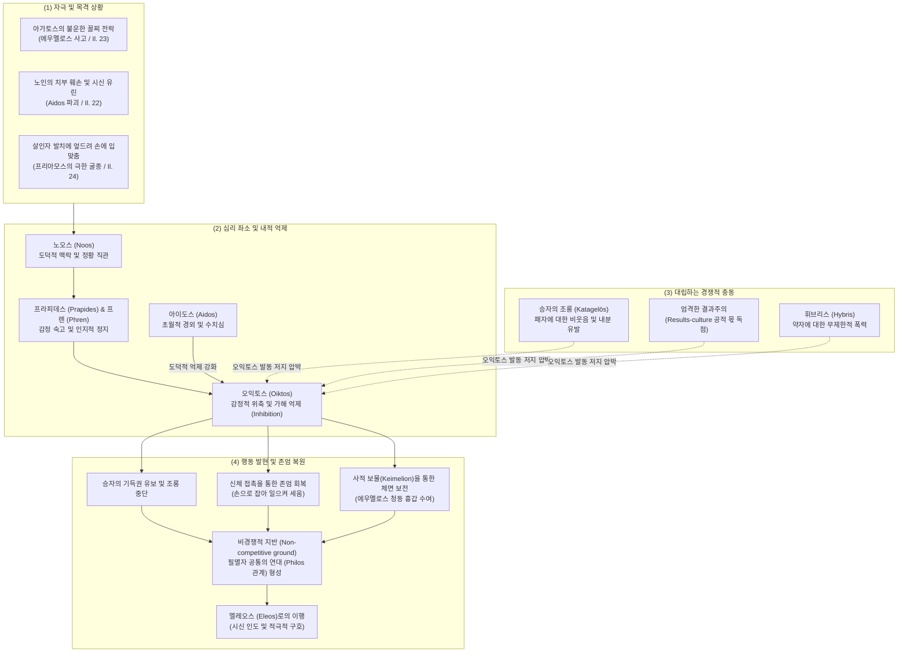

# 오익토스 (Oiktos)

**[[greek-reading-guide|읽는 법]]**: 오익토스 · **원어**: οἶκτος · **학술 전사**: *oîktos*

## 1. 정의와 핵심 테제 (Definition & Core Thesis)

### 1.1 핵심 정의
호메로스 서사시에서 **오익토스**(οἶκτος, *oîktos*; 관용 라틴명 Oiktos)는 타인의 극단적인 실패와 굴욕(*peculiar humiliation*)을 목격할 때 일어나는 '**감정적 위축 및 억제**'(Inhibition / Shrinking back)입니다 ([[scott-1979-pity-and-pathos|Scott 1979]]). 

오익토스는 영웅적 탁월성([[concept-arete|Arete]])과 결과 중심 문화(Results-culture) 규범에 따라 승자가 패자를 마음껏 조롱하고 유린할 수 있는 기득 권리를 스스로 유보하고, **가해를 멈추며 상대의 짓밟힌 존엄 일부를 회복시켜 주는 도덕적 자제 행위**(Refraining from triumphing / Restoring dignity)로 이어집니다. 곤경을 적극적으로 바로잡으려는 추진력인 [[concept-eleos|엘레오스]](Eleos)와 상보적으로 작동하지만, 오익토스는 주로 **인간 관찰자**(특히 아킬레우스)가 타자의 파멸적 수치에 직면하여 주춤거리고 뒤로 물러서는 소극적 브레이크의 성격을 갖습니다. 오익토스가 엘레오스로 이행하기 위해서는 반드시 필멸자 공통의 연대인 **비경쟁적 지반**(Non-competitive ground / Philos 관계)이 먼저 형성되어야 합니다.

### 1.2 연구사적 4 대 핵심 명제
1. **굴욕 앞에서의 억제와 조롱 자제** ([[scott-1979-pity-and-pathos|Scott 1979]]):
   오익토스는 추상적인 감상이 아니라, 빛나던 전사가 어처구니없는 불운으로 처참한 실패자로 전락하는 '특수한 굴욕(*peculiar humiliation*)'을 볼 때 격발됩니다. 승자는 패자를 비웃는 자연스러운 권리를 억제하고 상대의 체면을 보전합니다.
2. **아가토스의 체면 보전과 귀족 내부 연대** ([[scott-1979-pity-and-pathos|Scott 1979]], [[finkelberg-1998-time-and-arete|Finkelberg 1998]]):
   장례경기 전차경주에서 꼴찌로 전락한 에우멜로스에게 아킬레우스가 오익토스(*ṓikteire*)를 품고 보상을 제안한 사건은, 결과주의 원칙 속에서도 탁월한 귀족([[concept-agathos|Agathos]])의 명예 실추를 막기 위해 사적 전리품을 결합하여 귀족 내부의 결속(Intra-elite solidarity)을 지키는 사회적 장치였습니다.
3. **아이도스(Aidos)와의 상보적 억제 결합** ([[cairns-1993-aidos|Cairns 1993]]):
   오익토스는 타인의 고통받는 신체와 영예를 함부로 유린하지 않으려는 내면적 경외이자 수치심인 [[concept-aidos|아이도스]](Aidos)와 밀접히 공조합니다. 24권에서 아킬레우스가 먼지 바닥에 엎드린 노왕 프리아모스를 가엾게 여겨(*oikteírōn*) 손수 잡아 일으켜 세우는 행위는 아이도스와 오익토스가 결합한 존엄 회복의 절정입니다.
4. **내면화된 타자와 자율적 도덕 행위주체성** ([[williams-1993-shame-and-necessity|Williams 1993]], [[zanker-1994-heart-of-achilles|Zanker 1994]]):
   애드킨스식 승리 지상주의와 달리, 승자가 자신의 무력을 자발적으로 멈추고 패자의 고통에 공명하는 것은 영웅의 나약함이 아니라, 공통의 필멸성 앞에서 기성 영웅 규범을 넘어서 발휘되는 높은 차원의 **도덕적 행위주체성**(Moral Agency)이자 개인적 윤리(Personal Ethics)입니다.

---

## 2. 어원과 형태론 (Etymology & Morphology)

### 2.1 비교언어학적 기원과 음운론적 분석
- **어원 재구의 한계**:
  - 피에르 샹트렌(P. Chantraine, *DELG*, p. 788: *sans étymologie*), 얄마르 프리스크(H. Frisk, *GEW* 2.366: *unetymologisiert*), 로베르트 베이케스(R. Beekes 2010, *EDG*, p. 1063: *IE etymology: None*) 모두 공통 인도유럽어(PIE) 어근 재구가 불가능하다고 판정합니다.
- **표현론적 의성어 기원과 형성사**:
  - 비교언어학계는 오익토스를 타인의 참혹한 파멸이나 비극을 목격할 때 본능적으로 터져 나오는 비탄의 탄식 구호인 **οἴμοι**(*oímoi*, '슬프도다!', '아아!')와 결부된 **표현론적 의성어 형성**(Expressive formation)으로 파악합니다 (Schwyzer, *Griech. Gramm.* I, 722).
  - 비탄의 외침 *oi-*에 연구개 확장음 *-k-*가 덧붙어 표현적 어간 *oik-*가 형성되었으며, 여기에 동작 추상명사 접미사 *-to-*가 결합하여 남성 명사 **οἶκτος**(*oik-to-s*, 비탄, 슬픔)가 파생되었습니다.
  - 속성 형용사 **οἰκ트ρός**(*oik-tró-s*)는 명사 기반 *-ro-* 접미사 파생(cf. αἶσχος -> αἰσχρός, ἔχθος -> ἐχθρός)과 평행하며, 이는 다시 타인에 대한 가해를 멈추는 내적 억제 기제로 심리철학적 개념화를 겪었습니다.
- **폐기된 민간어원설의 차단**:
  - 과거 19세기 비교언어학 일각에서 시도되었던 οἶκος(*woyḱ-o-s*, '집', '가족처럼 대하다')와의 결부설은 완전히 기각되었습니다. 결정적 증거는 호메로스 텍스트 운율 스캔에서 *oîktos* 및 *oikteírō* 어휘군이 초기 디감마(*w-*)의 흔적을 전혀 보이지 않는다는 점입니다 (_Il._ 23.534 `ἰδὼν ᾤκτειρε`, _Il._ 24.516 `ἀνίστη, / οἰκτείρων`).
- **동사형의 금석학적 표준 표기와 음운론**:
  - 후대 헬레니즘 및 비잔틴 필사본에는 이오타시즘(Iotacism)으로 인해 `οἰκτίρω`로 표기되는 경우가 잦으나, 기원전 5–4세기 아티케 비문 증거(Leslie Threatte 1996: 642; Meisterhans 1888: 180)에 의해 정형은 **οἰκτείρω**(*oikteírō*)로 확증됩니다. 원시 그리스어 `*oikt-er-yō`에서 반모음 `*y`의 전치 및 이중모음화(epenthesis / diphthongization, `*oikt-eryō` > `*oikt-eyrō` > `oikteírō`)를 거쳤습니다.

### 2.2 핵심 어휘 4 열 형태론 분리 표

| 그리스어 실제형 | 학술 전사 | 품사 및 형태론 | 의미 및 문헌학적 맥락 |
|:---|:---|:---|:---|
| **οἶκτος** | *oîktos* | 남성 명사, o-어간 주격 단수 | 비탄, 비애, 연민. 타인의 극단적 수치 목격 시 일어나는 감정적 위축과 가해 억제. 『일리아스』에는 명사형 부재. |
| **οἰκτείρω** | *oikteírō* | 1 인칭 단수 현재 능동 직설법 (*oikt-er-yō 파생) | 측은히 여기다, 가해를 멈추다. 아티케 금석학 비문 증거로 -ει- 정형 확증. |
| **οἰκτείρεις** | *oikteíreis* | 2 인칭 단수 현재 능동 직설법 | 그대를 측은히 여긴다면. 『일리아스』 23.548에서 안틸로코스가 아킬레우스의 온정주의를 향해 건넨 조건절 동사. |
| **ᾤκτειρε** | *ṓikteire* | 3 인칭 단수 미완료 / 기동적 부정과거 능동 직설법 | 가엾게 여겼다. 『일리아스』 23.534에서 꼴찌가 된 에우멜로스를 향한 아킬레우스의 내적 억제 발동. |
| **οἰκτείρων** | *oikteírōn* | 남성 분사 현재 능동 주격 단수 | 측은히 여기며, 가엾게 보며. 『일리아스』 24.516에서 프리아모스를 일으켜 세우는 아킬레우스의 태도. |
| **οἰκτρός** | *oiktrós* | 남성 형용사 주격 단수 (*-ro- 속성 접미사) | 애처로운, 비참한, 슬픈. 외적 굴욕과 파멸로 인해 탄식을 자아내는 물리적 상태. |
| **οἴκτιστον** | *oíktiston* | 중성 형용사 최상급 주격 단수 (*-isto- 최상급) | 가장 비참한 (일). 『일리아스』 22.76에서 개들에게 물어뜯기는 노인의 치부 훼손을 규정하는 극단의 수치어. |
| **οἰκτίστῳ** | *oiktístōi* | 남성 형용사 최상급 여격 단수 | 가장 비참한 (죽음으로). 『오뒷세이아』 11.412에서 아가멤논이 자신의 비열한 암살을 규정한 표현(*oíktistōi thanátōi*). |
| **ἐποικτείρω** | *epoikteírō* | 1 인칭 단수 현재 능동 직설법 (접두사 *epi-*) | 깊이 측은히 여기다. 소포클레스 『아이아스』 121에서 오디세우스가 적의 파멸 앞에서 조롱을 거부하며 사용한 동사. |
| **ἀνοίκτιστος** | *anoíktistos* | 남성/여성 형용사 주격 단수 (부정접두사 *a-* + *oiktos*) | 탄식받지 못하는, 동정 없는, 가혹한. 비극 전용 어휘(소포클레스, 에우리피데스)로 호메로스 원전에는 부재. |

---

## 3. 호메로스 서사시 본문 용례와 맥락 (Homeric Attestation & Contexts)

### 3.1 양대 서사시 출현 빈도 및 인간 관찰자 중심성
호메로스 텍스트에서 오익토스 어휘군은 다음과 같은 독특한 분포를 보입니다:
- 『**일리아스**』 **내 명사 `οἶκτος`의 절대적 부재**:
  - 『일리아스』 전체에서 명사 형태인 **`οἶκτος`는 단 1회도 등장하지 않습니다.**
  - 모든 용례는 동사 **`οἰκτείρω`** (23.534, 23.548, 24.516)와 최상급 형용사 **`οἴκτιστον`** (22.76)뿐입니다. 서사시는 이를 정적인 관념이 아니라 '가해를 멈추는 구체적 행위'와 '존엄이 붕괴된 극단의 물리적 상태'로 파악합니다.
- **인간 관찰자 중심성**:
  - 엘레오스(*eleos*)가 올림포스 신들의 중요한 행동 동기이자 지상 개입의 원천인 것과 대조적으로, 오익토스(*oiktos*)는 신들에게 사용되지 않으며 **철저히 인간 관찰자**(특히 아킬레우스)에게 집중됩니다.
  - 신들은 영원한 불멸과 자족성 속에서 인간의 비극을 안전한 관객석에서 내려다보기 때문에, '타인의 수치에 직면하여 내적 위축과 공포를 느끼는' 오익토스의 자기투영적 기제를 경험할 수 없습니다 ([[lee-taesoo-2020-gods-in-audience|이태수 2020]]).

### 3.2 『일리아스』에서의 용례 맥락: 아가토스의 붕괴와 존엄 보전
1. **에우멜로스의 전차 사고와 아킬레우스의 오익토스** (_Il._ 23.534–548):
   - 최고의 전차 기수였던 에우멜로스가 신적 불운으로 꼴찌가 되었을 때, 아킬레우스는 그를 보고 가엾게 여겨(*ṓikteire*) 보상을 제안합니다. 이는 결과주의 사회에서 최선의 자가 수치(*aischron*)를 겪는 것을 막으려는 오익토스의 대표적 작동입니다.
2. **노인의 치욕적 시신 유린에 대한 탄식** (_Il._ 22.71–76):
   - 프리아모스는 젊은이의 죽음은 아름다우나, 노인의 센 수염과 은밀한 부위(치부, *aidōs*)가 개들에게 찢기는 것은 지상에서 "가장 비참한 일(*oíktiston*)"이라고 탄식합니다.
3. **엎드린 프리아모스를 일으켜 세움** (_Il._ 24.513–516):
   - 아들의 살해자 발치에 엎드려 손에 입 맞추는 노왕을 보며 아킬레우스는 마음속으로 오익토스를 품고(*oikteírōn*), 손수 그를 잡아 일으켜 세웁니다(*kheiròs anístē*).
4. **안드로마케의 탄원과의 대조** (_Il._ 6.431):
   - 안드로마케는 헥토르에게 "나를 불쌍히 여겨 누각에 머무르소서(*eléaire*)"라며 **엘레오스**를 간청합니다. 이는 가해 조롱 억제(Oiktos)가 아니라 가족을 구호하는 적극적 전진 충동(Eleos)을 구하는 대조적 용례입니다.
5. **파트로클로스의 질타** (_Il._ 16.33–35):
   - 파트로클로스는 아카이아군의 몰살 위기 속에서도 출전을 거부하는 아킬레우스를 향해 "동정 없는 자여(*nēleés* < *nē-* + *éleos*), 그대의 마음(*nóos*)이 가혹하기 짝이 없기 때문이오"라고 규탄합니다.

### 3.3 『오뒷세이아』에서의 용례 맥락: 하데스 망령의 비탄과 생존자의 전율
1. **아가멤논 망령의 비참한 최후 회고** (_Od._ 11.411–421):
   - 하데스 저승에서 아가멤논은 귀향 축하연 자리에서 식탁과 술잔 곁에서 도륙되던 광경을 "가장 비참한 죽음(*oiktístōi thanátōi*)"으로 규정합니다. 배신과 비열한 식탁 살육은 영웅적 명예를 송두리째 박탈당한 극단의 오익토스를 촉발합니다.
2. **포로 여인의 비유** (_Od._ 8.521–531):
   - 알키노오스 궁정에서 함락가를 듣던 오디세우스의 눈물은, 조국과 남편을 잃고 노예로 끌려가는 여인의 "가장 애처로운 슬픔(οἰκτροτάτῳ ἀχέϊ, *oiktrotátōi akhéï*)"에 비유됩니다. 승자가 자신이 파멸시킨 패자의 극단적 수치에 영혼 깊이 공명하는 심리적 정점입니다.
3. **스퀼라의 바위 괴물과 조난 선원들의 비탄** (_Od._ 12.258–259):
   - 스퀼라에게 낚싯바늘에 꿴 물고기처럼 낚여 산 채로 잡아먹히던 동료들을 보며, 오디세우스는 "내가 겪은 모든 일 가운데 가장 가련하고 비참한 광경(οἴκτιστον δὴ κεῖνο ... ἴδον, *oíktiston dḕ keîno ... ídon*)"이었다고 진술합니다.

---

## 4. 개념 상호작용과 가치망 (Conceptual Network & Polarity)

오익토스는 타인의 극단적인 파멸과 수치를 목격했을 때 격발하여, 승리욕과 잔혹성을 제어하고 상대의 존엄을 지켜주는 도덕적 완충망으로 기능합니다. 특히 오익토스(브레이크)가 엘레오스(구호 추진력)로 나아가기 위해서는 비경쟁적 지반 형성이 필수적입니다.

---

## 5. 대표 서사 에피소드 정밀 해제 (Signature Epic Episodes)

### 5.1 에우멜로스의 꼴찌 전락과 아킬레우스의 오익토스 (_Il._ 23.534–538, 548)

- **선정 장면**: 파트로클로스 장례경기 전차경주에서 신적 불운으로 전차가 파손되어 꼴찌로 들어온 당대 최고의 기수 에우멜로스를 향한 아킬레우스의 배려와 안틸로코스의 항의.
- **본문 강독 및 해제**:
  - **번역**: "[아킬레우스]: 발 빠른 고귀한 아킬레우스는 그를 보고 가엾게 여겼으며, 아르고스인들 가운데 서서 날개 돋친 말을 건넸다. '가장 뛰어난 사내가 꼴찌로 말을 몰고 왔구나! 그러니 자, 마땅하고 합당하게 그에게 2등상을 주도록 하자. 그러나 1등상은 튀데우스의 아들이 가져가게 하라.' [...] [안틸로코스]: '하지만 만약 당신이 그를 가엾게 여기고 그가 당신의 마음에 든다면, 당신의 막사 안에 많은 금과 청동이 있으니...'"
  - **원문**: τὸν δὲ ἰδὼν ᾤκτειρε ποδάρκης δῖος Ἀχιλλεύς, / στὰς δ᾽ ἄρ᾽ ἐν Ἀργείοις ἔπεα πτερόεντ᾽ ἀγόρευε· / λοῖσθος ἀνὴρ ὥριστος ἐλαύνει μώνυχας ἵππους· / ἀλλ᾽ ἄγε δή οἱ δῶμεν ἀέθλιον, ὡς ἐπιεικές, / δεύτερ᾽· ἀτὰρ τὰ πρῶτα φερέσθω Τυδέος υἱός. / [...] / εἰ δέ μιν οἰκτείρεις καί τοι φίλος ἔπλετο θυμῷ, / ἔστι τοι ἐν κλισίῃ χρυσὸς πολύς, ἔστι δὲ χαλκός,
  - **학술 전사**: *tòn dè idṑn ṓikteire podárkēs dîos Akhilleús, / stàs d’ ár’ en Argeíois épea pteróent’ agóreue; / loîsthos anḕr hṓristos elaúnei mṓnukhas híppous; / all’ áge dḗ hoi dō̂men aéthlion, hōs epieikés, / deúter’; atàr tà prō̂ta pherésthō Tudéos huiós. / [...] / ei dé min oikteíreis kaí toi phílos épleto thumō̂i, / ésti toi en klisíēi khrusòs polús, ésti dè khalkós,*
- **문헌학적·서사학적 함의**:
  - **화자 분리와 9행 생략(`[...]`)**: 534–538행은 아킬레우스가 군중에게 제안한 발언이며, 548행은 2등상을 빼앗기지 않으려는 안틸로코스가 9개 시행(539–547행)에 걸쳐 거세게 항의한 뒤 아킬레우스에게 사적 보상을 대안으로 제시하는 대목입니다.
  - **크라시스 및 철자 정형**: 536행은 `ὁ ἄριστος`의 축약이므로 거친숨표 **ὥριστος**(*hṓristos*)가 정형이며, 548행의 동사는 아티케 금석학 표준에 따른 **οἰκτείρεις**(*oikteíreis*)입니다.
  - **공적 규범과 사적 보상의 타협**: 아킬레우스는 안틸로코스의 정당한 공적 결과주의 권리를 승인하면서도, 자신의 막사에서 노획한 청동 흉갑을 에우멜로스에게 지급함으로써 패자의 수치를 막고 엘리트 간 결속을 완벽히 지켜냅니다.

---

### 5.2 노인의 치욕적 시신 유린에 대한 탄식 (_Il._ 22.71–76)

- **선정 장면**: 트로이아 성벽 위에서 출전을 고집하는 아들 헥토르를 말리며, 함락 후 노왕인 자신이 겪을 참혹한 능욕을 예견하는 프리아모스의 절규.
- **본문 강독 및 해제**:
  - **번역**: "젊은이에게는 전장에서 날카로운 청동 창에 찔려 찢긴 채 쓰러져 누워 있는 것이 모든 면에서 어울린다. 그가 죽었을지라도 드러난 모든 것이 아름답기 때문이다. 그러나 개들이 죽임을 당한 노인의 센 머리와 센 턱수염과 치부(성기)를 더럽힐 때, 이것이야말로 가련한 필멸자들에게 가장 비참하고 수치스러운 일이다."
  - **원문**: νέῳ δέ τε πάντ᾽ ἐπέοικεν / Ἄρηϊ κταμένῳ δεδαϊγμένῳ ὀξέϊ χαλκῷ / κεῖσθαι· πάντα δὲ καλὰ θανόντι περ ὅττι φανήῃ· / ἀλλ᾽ ὅτε δὴ πολιόν τε κάρη πολιόν τε γένειον / αἰδῶ τ᾽ αἰσχύνωσι κύνες κταμένοιο γέροντος, / τοῦτο δὴ οἴκτιστον πέλεται δειλοῖσι βροτοῖσιν.
  - **학술 전사**: *néōi dé te pánt’ epéoiken / Árēï ktaménōi dedaïgménōi okséï khalkō̂i / keîsthai; pánta dè kalà thanónti per hótti phanḗēi; / all’ hóte dḕ polión te kárē polión te géneion / aidō̂ t’ aiskhúnōsi kúnes ktaménoio gérontos, / toûto dḕ oíktiston péletai deiloîsi brotoîsin.*
- **문헌학적·서사학적 함의**:
  - **`αἰδώς`의 어휘적 다의성과 존재론적 오물화**: 75행의 *aidōs*는 도덕 감정인 '수치심/경외'이면서 동시에 물리적으로 가려져야 할 '성기(치부)'를 뜻합니다. 청년 전사의 죽음은 '아름다운 죽음(*kalos thanatos*)'이 될 수 있지만, 존경받아야 할 원로의 성기가 짐승들에게 유린당하는 것은 문명 질서 전체가 파괴된 존재론적 오물화(Abjection)입니다.
  - 시인은 이 극한의 상태를 가리켜 지상에서 가장 비참한 일인 **오익티스톤**(οἴκτιστον, *oíktiston*)으로 규정합니다.

---

### 5.3 엎드린 프리아모스를 가엾게 여겨 손으로 일으킴 (_Il._ 24.513–516)

- **선정 장면**: 막사에서 함께 통곡을 마친 뒤, 바닥에 엎드린 적국의 노왕을 아킬레우스가 직접 손을 잡아 일으켜 세우는 장면.
- **본문 강독 및 해제**:
  - **번역**: "그러나 고귀한 아킬레우스가 울부짖음의 갈망을 채우고, 그의 프라피데스(횡격막)와 사지에서 그 욕망이 물러갔을 때, 그는 곧바로 자리에서 일어나 손으로 노인을 일으켜 세웠으니, 센 머리와 센 턱수염을 가엾게 여겼던 것이다."
  - **원문**: αὐτὰρ ἐπεί ῥα γόοιο τετάρπε토 δῖος Ἀχιλλεύς, / καί οἱ ἀπὸ πραπίδων ἦλθ᾽ ἵμερος ἠδ᾽ ἀπὸ γυίων, / αὐτίκ᾽ ἀπὸ θρόνου ὦρτο, γέρον타 δὲ χειρὸς ἀνίστη, / οἰκτείρων πολιόν τε κάρη πολιόν τε γένειον,
  - **학술 전사**: *autàr epeí rha góoio tetárpeto dîos Akhilleús, / kaí hoi apò prapídōn êlth’ hímeros ēd’ apò guíōn, / autík’ apò thrónou ôrto, géronta dè kheiròs anístē, / oikteírōn polión te kárē polión te géneion,*
- **문헌학적·서사학적 함의**:
  - **원문 텍스트 복원**: 515행의 `ὦρτο`(*ôrto*, 3단수 무매개 부정과거)를 정밀 복원하였으며, 인용 범위를 513–516행 전체로 확정합니다.
  - **공간 기호학적 존엄 복원과 신체적 반전**: 바닥에 엎드린 수평적 굴종(동물/시체 상태)에서 직립한 수직적 인간 상태로 복귀시키는 행위입니다. 특히 수많은 아들들을 도륙했던 바로 그 살인적인 손(*cheir*)이 이제 노왕을 부축하는 구원의 손으로 전도되는 신체적 반전(Somatic Inversion)을 보여줍니다.

---

### 5.4 아가멤논 망령의 비극적 회고 (_Od._ 11.411–414, 418–421)

- **선정 장면**: 저승에서 오디세우스를 만난 아가멤논이 자신의 비열한 암살을 회고하며 절규하는 장면.
- **본문 강독 및 해제**:
  - **번역**: "아이기스토스는 나에게 죽음과 운명을 꾸며내어, 파멸적인 아내와 함께 나를 죽였소. 잔치에 초대하여 식사를 대접하듯, 여물통 곁에서 황소를 도륙하듯 말이오. 그렇게 나는 가장 비참한 죽음으로 죽어갔소. [...] 그 광경을 보았더라면 그대의 마음은 가장 깊이 슬퍼졌을 것이오. 어떻게 우리가 믹싱볼과 가득 찬 식탁 곁에서 쓰러져 죽었는지, 그리고 바닥 전체가 피로 끓어 넘쳤는지를."
  - **원문**: Αἴγισθος γάρ μοι θάνατον καὶ πότμον ἐπισπὼν / ἔκτα σὺν οὐλομένῃ ἀλόχῳ, οἶκόνδε καλέσσας, / δειπνίσσας, ὥς τίς τε κατέκτανε βοῦν ἐπὶ φάτνῃ. / ὣς θάνον οἰκτίστῳ θανάτῳ· [...] / ἀλλά κε κεῖνα μάλιστα ἰδὼν ὀλοφύραο θυμῷ, / ὡς ἀμφὶ κρητῆρα τραπέζας τε πληθούσας / κείμεθ᾽ ἐνὶ μεγάρῳ, δάπεδον δ᾽ ἅπαν αἵματι θῦεν.
  - **학술 전사**: *Aígisthos gár moi thánaton kaì pótmon epispṑn / ékta sùn ouloménēi alókhōi, oîkónde kaléssas, / deipníssas, hṓs tís te katéktane boûn epì phátnēi. / hṑs thánon oiktístōi thanátōi; [...] / allá ke keîna málista idṑn olophúrao thumō̂i, / hōs amphì krētêra trapézas te plēthoúsas / keímeth’ enì megárōi, dápedon d’ hápan haímati thûen.*
- **문헌학적·서사학적 함의**:
  - **핵심 표제어 복원**: 표제어 형용사가 명시된 412행 **`οἰκτίστῳ θανάτῳ`**(*oiktístōi thanátōi*, 가장 비참한 죽음으로)를 본문 전면에 배치했습니다. 손님 환대와 평화의 공간인 연회장에서 기습당해 가축처럼 도륙당한 죽음은 영웅적 명예를 송두리째 박탈당한 극단의 굴욕을 대변합니다.

---

### 5.5 파트로클로스의 탄식과 냉혹함 비판 (_Il._ 16.33–35)

- **선정 장면**: 아카이아 군대가 해변까지 밀려 몰살당할 위기에 처하자, 홀로 분노를 고집하는 아킬레우스의 냉혹함을 질타하는 파트로클로스.
- **본문 강독 및 해제**:
  - **번역**: "무자비한 자여(엘레오스가 없는 자여)! 기수 펠레우스는 당신의 아버지가 아니었으며, 테티스 여신도 당신을 낳지 않았소. 푸른 바다가 당신을 낳았고 깎아지른 절벽이 당신을 낳았으니, 당신의 노오스(마음)가 가혹하기 짝이 없기 때문이오!"
  - **원문**: νηλεές, οὐκ ἄρα σοί γε πατὴρ ἦν ἱππότα Πηλεύς, / οὐδὲ Θέτις μήτηρ· γλαυκὴ δέ σε τίκτε θάλασσα / πέτραι τ᾽ ἠλίβατοι, ὅτι τοι νόος ἐστὶν ἀπηνής.
  - **학술 전사**: *nēleés, ouk ára soí ge patḕr ê̂n hippóta Pēleús, / oudè Thétis mḗtēr; glaukḕ dé se tíkte thálassa / pétrai t’ ēlíbatoi, hóti toi nóos estìn apēnḗs.*
- **문헌학적·서사학적 함의**:
  - **문자 오염 복원 및 실제 어휘 확정**: 34행의 감마 뒤 합자 오염을 제거하여 올바른 그리스어 **`γλαυκὴ`**(*glaukḕ*)로 복원했습니다.
  - **문헌학적 정정**: 파트로클로스가 사용한 어휘는 비극 어휘인 `ἀ노익티스토스`가 아니라 **`νηλεές`**(*nēleés* < *nē-* + *éleos*, 엘레오스가 없는 자)이며, 질타의 핵심 좌소는 도덕적 맥락을 조망하지 못하는 **노오스**(νόος, *nóos*)입니다.

---

## 6. 역사적·제도적 맥락 (Historical & Institutional Context)

### 6.1 장례 경기(Athla)와 공/사 영역의 제도적 경계 구획
- **아곤의 공적 결과주의 규범 수호**: 장례 경기는 영웅 공동체가 지켜보는 공론장에서 집행되는 공식적 위신재 재분배 의례입니다. 안틸로코스가 2등상(암말)을 요구한 것은 사리사욕이 아니라 "실제 행위 성과(performance-based result)에 따라 공적 몫(*geras*)이 배분되어야 한다"는 아곤의 공적 결과주의 규범을 지키려는 제도적 항의였습니다 (_Il._ 23.543–554).
- **사적 케이멜리온을 통한 오익토스 실현**: 아킬레우스가 에우멜로스에게 지급한 청동 흉갑(*thōrēx*, 23.560)은 아스테로파이오스에게서 노획한 사적 전리품이자 가문 보물(*keimēlion*)입니다. 이 사건의 제도사적 본질은 공적 아곤의 결과주의 질서를 훼손하지 않으면서도, 사적 케이멜리온을 매개로 오익토스를 발동하여 엘리트의 명예 실추를 막아낸 **이중적 제도 타협**입니다.
- **학설의 정확한 구분**: 애드킨스([[adkins-1960-merit-and-responsibility|Adkins 1960: 48–49]])는 이 사건을 오익토스가 결과주의 규범에 밀려 사적 편의로 후퇴한 '무력론'의 증거로 본 반면, 메리 스콧([[scott-1979-pity-and-pathos|Scott 1979: 7–8]])과 핀켈버그([[finkelberg-1998-time-and-arete|Finkelberg 1998]])는 귀족 내부의 파탄을 막고 결속(Intra-elite solidarity)을 지키는 적극적 완충 장치로 재평가했습니다.

### 6.2 승자의 조롱(Katagelōs) 억제와 엘리트 내전 방지
- **조롱의 사회적 파괴력**: 호메로스 수치 문화에서 조롱(*katagelōs*)은 단순한 웃음이 아니라, 한 귀족의 사회적 위상(*timē*)과 공론장 발언권(*themistes*)을 완전히 박탈하는 사회적 파멸입니다. 패자가 조롱당할 때 유발되는 격분(*cholos*)은 동맹 전체를 내파시킬 내분(*stasis*)의 도화선이 됩니다.
- **오익토스의 평화 유지 기능**: 오익토스는 승자가 당연히 행사할 수 있는 조롱의 기득권을 자발적으로 유보함으로써, 패자를 비웃음거리(*katagelastos*)로 전락시키지 않고 귀족 연합의 균열을 방지하는 **엘리트 내전 방지용 제도적 안전판**이었습니다.

### 6.3 아고라/테미스에서의 노인 지위와 신체 유린의 낙차
- 호메로스 사회에서 노인(*gerōn*)은 전장에서의 완력(*biē*)을 잃은 대신, 공론장 아고라(*agora*)와 원로회(*boulē gerontōn*)에서 지혜(*mêtis*)와 관습 규범([[concept-themis|Themis]]), 판결봉(*skēptron*)을 쥐고 판결을 내리는 최고 정치적 권위자입니다.
- 그러나 전쟁의 패배로 성벽이 무너지면 노인은 가장 무력한 도륙의 대상이 됩니다. 『일리아스』 22권에서 프리아모스가 절규한 노인의 비참함은, 공론장의 최고 권위자가 전쟁터에서 가축 수준의 고깃덩어리로 전락하는 **제도적·사회적 지위의 극단적 추락**(Status Collapse)에서 격발합니다.

---

## 7. 물질문화와 신체성 (Material Culture & Embodiment)

### 7.1 살인자의 손에 입맞춤(Kýse kheîras): 전례 없는 제의적 충격
- **손의 상징성**: 영웅의 손(*cheir*)은 창을 쥐고 적을 도륙하는 물리적 살인 기구입니다.
- **파격적 탄원 제스처(Hapax Ritual Gesture)**: 프리아모스가 아킬레우스의 "수많은 내 자식들을 죽인 살인적인 손(χειρὸς ἀνδροφόνοιο)"에 입술을 대는 행위(_Il._ 24.506)는 통상적인 탄원 정형구를 파괴한 전례 없는 행위였습니다. 피해자의 입술이 가해자의 살인 흉기에 닿는 순간, 아킬레우스의 살육 분노는 충격 속에서 일시에 마비(Inhibition)됩니다.

### 7.2 공간적 하강과 무릎 접촉(Gouna labein)
- 탄원자가 상대의 발치로 몸을 던지는 동작은 직립한 영웅의 공간적 위상을 지표면으로 떨어뜨리는 신체 언어입니다.
- 무릎(*gonata*)은 기동성과 생명력의 좌소로서, 무릎을 끌어안는 동작은 상대의 공격적 기동성을 물리적으로 봉쇄하고 도덕적 자제를 유도합니다.

### 7.3 손을 잡아 일으켜 세움(Kheiròs anístē): 공간 기호학적 존엄 복원
- 아킬레우스는 "자리에서 일어나, 손으로 노인을 일으켜 세웠습니다(*kheiròs anístē*; _Il._ 24.515)".
- 바닥에 엎드린 수평적 굴종(동물/시체 상태)에서 직립한 수직적 인간 상태로 복귀시키는 **공간 기호학적 존엄 복원**입니다. 아들의 목을 베었던 바로 그 살인적인 손이 이제 노왕을 붙잡아 일으켜 세우는 구원의 손으로 전도되는 **신체적 반전**(Somatic Inversion)의 순간입니다.

---

## 8. 종교인류학 및 제의적 실천 (Religious Anthropology & Ritual)

### 8.1 아이도스(Aidos)와 오익토스(Oiktos)의 2축 상보 메커니즘
- **아이도스(Aidos)**: 제우스 히케시오스(탄원자의 제우스)의 신벌([[concept-nemesis|Nemesis]])을 두려워하고 관습적 도덕선을 지키는 **수직적·초월적 규범 억제**입니다. 프리아모스는 "신들을 두려워하시오(αἴδειο θεούς, *aideîo theoús*)"라며 이 수직적 축을 소환합니다 ([[cairns-1993-aidos|Cairns 1993]]).
- **오익토스(Oiktos)**: 눈앞에 엎드린 노인의 백발과 비참한 굴종을 목격할 때 주체의 프라피데스와 가슴에서 터져 나오는 **수평적·생리적 전율 억제**입니다. 초월적 규범(아이도스)과 타자의 취약성에 대한 공명(오익토스)이 합치될 때 비로소 살의가 멈춥니다.

### 8.2 올림포스 신들의 오익토스 부재와 필멸자 인간의 조건
- **엘레오스와 오익토스의 신학적 분화**: 올림포스 신들은 『일리아스』에서 엘레오스(*eleos*)를 자주 느낍니다 (제우스가 헥토르와 사르페돈을 불쌍히 여김). 그러나 이태수([[lee-taesoo-2020-gods-in-audience|2020]])가 밝혔듯, 신들의 엘레오스는 자신의 불멸성과 행복을 조금도 위협받지 않는 '안전한 관객석에서의 심미적 자비'입니다.
- **오익토스의 실존적 자기투영성**: 반면 오익토스는 타인의 참혹한 굴욕을 보며 "저 비참한 운명이 바로 나의 운명이 될 수 있다"는 공통의 취약성(Vulnerability)을 느낄 때 일어납니다. 신들은 영원히 불멸(*athanatoi*)하고 늙지 않으며(*agērō*), 꼴찌로 전락하거나 시신이 훼손될 위험이 없는 존재들(*rheîa zṓontes*)이므로, 오익토스를 느낄 수 있는 **존재론적 지반 자체가 원천적으로 결여**되어 있습니다. 오익토스는 오직 죽어야 할 유한한 운명의 필멸자(*brotoi*)들만이 공유하는 실존적 정념입니다.

### 8.3 시신 매장 의례(Kēdeia)와 케데몬(Kēdemōn) 책무의 복원
- 시신을 수습하여 씻기고, 기름을 바르고, 화장하여 봉분을 쌓는 의례(**케데이아**, *kēdeia*)는 영혼을 하데스로 보내고 망자의 명예(*geras thanontōn*)를 완결하는 필수 제의입니다. 이 의례를 거행할 종교적·친족적 의무를 진 주체를 **케데몬**(κηδεμών, *kēdemṓn*; 상주, 친족 보호자)이라 부릅니다.
- 24권에서 아킬레우스가 오익토스를 품고 노인을 일으켜 세운 것은, 적대적 살해 권능을 멈추고 프리아모스를 **정당한 케데몬**(Kēdemōn)으로 인정하는 제의적 전환점이었습니다. 아킬레우스가 12일간의 장례 휴전을 선언한 것은 트로이아인들이 케데이아를 완수할 수 있도록 보장한 오익토스의 종교인류학적 귀결입니다.

---

## 9. 심리철학 및 도덕적 행위주체성 (Moral Psychology & Agency)

### 9.1 심리좌소의 역학과 오익토스 억제의 위태로운 긴장
- **노오스(Noos)의 정황 직관**: 파트로클로스가 아킬레우스의 닫힌 노오스를 질타했듯(_Il._ 16.35), 호메로스 심리학에서 *noos*는 사태 전체의 도덕적 정황을 조망하는 지적 직관 좌소입니다.
- **프라피데스(Prapides)와 프렌(Phren)에서의 슬픔 정화**: 『일리아스』 24.514행에서 아킬레우스가 프리아모스를 일으켜 세우기 직전 슬픔의 갈망이 물러간 자리는 횡격막의 지각 좌소인 프라피데스였습니다.
- **튀모스(Thumos) 억제의 위태로운 긴장**: 오익토스는 완성된 평정이 아니라 폭발 직전의 튀모스를 억누르는 위태로운 인지적 브레이크입니다. 실제로 아킬레우스는 노인을 일으켜 세운 뒤에도 "노인이여, 내 마음(thumos)을 더 이상 자극하지 마시오. 내 튀모스가 분노하여 제우스의 명령을 어기고 당신을 죽일지도 모르오(_Il._ 24.568–570)"라고 경고합니다.

### 9.2 메리 스콧(1979) 이원 모델: 비경쟁적 지반(Philos)의 매개
- **오익토스(Oiktos)**: 굴욕 앞에서의 소극적 억제, 조롱 중단, 상대의 체면 보전. (Inhibition)
- **비경쟁적 지반(Non-competitive ground)**: 오익토스가 엘레오스로 발전하기 위해서는 반드시 필멸자 공통의 연대(*philos* 관계)가 수립되어야 합니다. 24권에서 프리아모스가 '펠레우스의 고독'을 환기하며 비경쟁적 지반을 형성했기에 비로소 전환이 가능했습니다.
- **엘레오스(Eleos)**: 곤경을 타개하려는 적극적 전진 충동, 실질적 구호 행동. (Forward drive)

### 9.3 내면화된 타자와 자율적 도덕 행위주체성
- 버나드 윌리엄스([[williams-1993-shame-and-necessity|Williams 1993]])는 호메로스 영웅들이 단순한 외적 성공/실패에만 반응한 것이 아니라, '내면화된 타자(Internalized Other)'의 시선을 의식하며 필연성 속에서도 인과적 책임을 회피하지 않는 도덕적 행위주체성(Agency)을 지녔음을 입증했습니다.
- 그레이엄 잰커([[zanker-1994-heart-of-achilles|Zanker 1994]])는 24권의 아킬레우스가 기성 영웅 사회의 보상 체계(Timē/Geras)를 초월하여 인간 보편의 고통에 응답하는 독자적인 '개인적 윤리(Personal Ethics)'와 대도량(Megalopsychia)을 성취했음을 밝혔습니다.

---

## 10. 후대 철학 및 비극 수용사 (Post-Homeric Reception)

### 10.1 소포클레스 『필록테테스』: 피시스(Physis)의 분출과 도덕적 아포리아
- **극적 상황**: 네오프톨레모스는 트로이아 정복을 위해 오디세우스의 기만술에 가담하여 무인도에 버려진 필록테테스의 활을 빼앗으려 합니다.
- **오익토스의 엄습과 피시스의 회복**: 그러나 10년간 악취 나는 발의 궤양 속에서 구른 필록테테스의 처참한 굴욕을 마주한 순간, 네오프톨레모스는 도덕적 전향을 선언합니다:
  - **번역**: "그에 대한 두려운 연민이 내게 덮쳤다, 지금이 아니라 이미 오래전부터."
  - **원문**: οἶκτος δεινός τις ἐμπέπτωκέ μοι / τἀνδρὸς πάλαι δή, μὴ νῦν πρῶτον.
  - **학술 전사**: *oîktos deinós tis empéptōké moi / t’andròs pálai dḗ, mḕ nûn prôton.* (_Phil._ 965–966)
- **비극적 의의**: 여기서 오익토스는 두려운 정념(*deinós*)으로 표현되며, 행위자의 계산을 마비시키고 아버지 아킬레우스의 고결한 본성(**피시스, Physis**)을 회복시킵니다. 네오프톨레모스는 "내가 무엇을 해야 한단 말인가(τί δρῶμεν;)"라는 도덕적 번민을 거쳐 빼앗은 활을 돌려주는 능동적 정의로 나아갑니다.

### 10.2 소포클레스 『아이아스』: 프롤로그의 실존적 오익토스와 엑소도스의 시신 매장
- **프롤로그(121–126행)의 실존적 자제**:
  - 광기에 빠져 가축들을 도륙한 살아있는 아이아스를 천막에 두고, 여신 아테나가 "적을 비웃는 것보다 더 달콤한 웃음이 어디 있겠느냐(*Ajax* 79)"라며 조롱을 부추길 때 오디세우스는 이를 단호히 거부합니다:
  - **번역**: "비록 원수일지라도 가련한 그를 깊이 불쌍히 여깁니다(ἐποικτείρω). 그가 끔찍한 파멸의 멍에에 묶여 있기 때문입니다. 그를 보면서 나 자신의 처지도 함께 봅니다. 우리 살아있는 자들은 모두 한낱 환영이자 가벼운 그림자에 불과하니까요."
  - **원문**: ἐποικτείρω δέ νιν / δύστηνον ἔμπας, καίπερ ὄντα δυσμενῆ, / ὁθούνεκ’ ἄτῃ συγκατέζευκται κακῇ, / οὐδὲν τὸ τούτου μᾶλλον ἢ τοὐμὸν σκοπῶν. / ὁρῶ γὰρ ἡμᾶς οὐδὲν ὄντας ἄλλο πλὴν / εἴδωλ’ ὅσοιπερ ζῶμεν ἢ κούφην σκιάν.
  - **학술 전사**: *epoikteírō dé nin / dū́stēnon émpas, kaíper ónta dysmenê, / hothoúnek’ átēi synkatézeuktai kakêi, / oudèn tò toútou mâllon ḕ toùmòn skopôn. / horô gàr hēmâs oudèn óntas állo plḕn / eídōl’ hósoiper zômen ḕ koúphēn skián.*
- **엑소도스(1316–1401행)의 제도적 관철**:
  - 아이아스 자살 후, 아가멤논과 메넬라오스가 시신 매장을 금지하자 오디세우스가 다시 등장하여 신들의 법과 인간 존엄을 내세워 시신 매장을 기어이 관철시킵니다. 프롤로그의 내적 오익토스가 엑소도스에서 정치적·제도적 매장권 보장으로 완성됩니다.

### 10.3 플라톤 『국가』에서의 비판과 자족성(Autarky)의 대결
- **3권(387d–388d)의 텍스트 검열**: 플라톤은 탁월한 자(*epieikēs*)는 스스로 자족(*autarkēs*)해야 하므로 비탄을 가장 적게 표출해야 한다고 보았습니다. 파트로클로스를 잃은 아킬레우스의 통곡이나 프리아모스의 뒹굶 등 서사시 영웅들의 오익토스 묘사를 교육에서 추방하라고 명령했습니다.
- **10권(605c–606b)의 시학적 위험 경고**: 비극을 관람하며 타인의 비참함에 감정적으로 동조하여 오익토스를 분출하는 행위가 영혼의 비이성적 부분을 살찌워 현실에서의 이성적 절제력을 파괴한다고 규탄했습니다.
- **문명사적 긴장**: 비극 시인들에게 오익토스는 "인간은 한낱 그림자에 불과하다"는 **취약성(Vulnerability)의 응시이자 폭력 억제 장치**였던 반면, 플라톤에게 오익토스는 **이성 영혼의 자족성(Autarky)을 무너뜨리는 위험한 정념**이었습니다.

---

## 11. 학술 논쟁과 이설 (Scholarly Debates & Theoretical Conflicts)

> [!WARNING] 학설 대립: 호메로스 사회에서 오익토스(Oiktos)의 도덕적 구속력과 가치 위상
> A. W. H. 애드킨스(1960)는 호메로스 사회를 철저한 결과 중심 문화로 규정하며, 전차경주에서 아킬레우스의 오익토스가 안틸로코스의 결과주의적 항의에 막혀 사적 편의로 후퇴했음을 들어 오익토스가 공적 가치 체계를 바꾸지 못하는 무력한 정념에 불과했다고 보았습니다. 반면 메리 스콧(1979)은 정밀한 어휘 분석을 통해 오익토스가 패자의 수치를 방지하고 귀족 내부 연대를 지키는 고유한 도덕심리학적 억제 메커니즘임을 입증했습니다. 더글러스 케언스(1993)는 아이도스와 연동된 내면화된 규범 제동기로, 버나드 윌리엄스(1993)는 내면화된 타자를 통한 성숙한 행위주체성으로, 그레이엄 잰커(1994)는 영웅 규범을 초월하는 자율적 개인 윤리로 오익토스의 도덕적 위상을 확립했습니다.

### 11.1 학파별 5대 핵심 쟁점

1. **애드킨스(1960)의 결과주의적 무력론**:
   - 오익토스는 경쟁적 결과주의 규범 앞에서 공적 몫을 변경하지 못하고 사적 타협으로 후퇴하는 2차적 편의에 불과하다고 보았습니다.
2. **메리 스콧(1979)의 도덕심리학적 억제론**:
   - 아킬레우스는 사적 보물을 통해 에우멜로스의 수치를 기어이 막아냈으며, 오익토스의 본질은 결과의 전복이 아니라 '패자의 체면 보전과 귀족 내부 결속'에 있음을 입증했습니다.
3. **더글러스 케언스(1993)의 규범 내면화론**:
   - 아이도스와 연동하여 승자의 잔혹성과 시신 훼손을 자제시키는 내면화된 수치 제동기로서 오익토스의 사회심리적 구속력을 복원했습니다.
4. **버나드 윌리엄스(1993)의 분석철학적 행위주체성론**:
   - 칸트식 도덕 결핍 모델을 반박하고, '내면화된 타자'의 시선에 응답하며 필연성 속에서 책임을 결단하는 성숙한 행위주체성의 발현으로 규명했습니다.
5. **그레이엄 잰커(1994)의 실존적 개인 윤리론**:
   - 영웅 사회의 기성 보상 체계를 넘어 타인의 고통에 공명하는 자율적 '개인적 윤리(Personal Ethics)'와 대도량의 정점으로 해석했습니다.

### 11.2 학설 비교 매트릭스

| 연구자 및 연도 | 대표 저작 | 학설 모델 | 오익토스(Oiktos)의 위상 및 해석 | 주요 비판 및 한계 |
|:---|:---|:---|:---|:---|
| **A. W. H. 애드킨스** (Adkins 1960) | 『공적과 책임』 (*Merit and Responsibility*) | 결과주의 경쟁 모델 | 공적 결과 체계를 바꾸지 못하고 사적 타협에 머무는 무력한 편의 | 사적 보상을 통한 체면 보전의 사회적 결속 기능 간과 |
| **메리 스콧** (Scott 1979) | 「호메로스에서의 연민과 파토스」 (*Pity and Pathos in Homer*) | 도덕심리학적 어휘 분석 | 타인의 굴욕 목격 시 승자의 조롱을 멈추고 존엄을 지키는 내적 억제 | 비경쟁적 지반 형성 이전의 전장 적대성 해소 기제 설명 제한 |
| **더글러스 케언스** (Cairns 1993) | 『아이도스』 (*Aidōs*) | 역사도덕심리학 | 아이도스와 연동하여 승자의 시신 훼손과 가학성을 자제시키는 내면적 제동기 | 귀족 전사 엘리트 내부의 규범에 치중됨 |
| **버나드 윌리엄스** (Williams 1993) | 『수치심과 필연성』 (*Shame and Necessity*) | 고대 도덕철학 및 행위론 | 내면화된 타자의 시선과 필연성 속에서 작동하는 성숙한 도덕적 행위주체성 | 서사시의 구체적 의례·신체성 분석보다는 철학적 개념 복원에 집중 |
| **그레이엄 잰커** (Zanker 1994) | 『아킬레우스의 마음』 (*The Heart of Achilles*) | 영웅 윤리학 및 문학비평 | 필멸자 공통의 취약성을 통찰하고 타인을 손수 일으켜 세우는 자율적 개인 윤리 | 아킬레우스 개인의 예외성에 집중되어 보편적 사회 제도화 분석 제한 |

---

## 12. 증거 매트릭스 (Evidence Matrix)

| 주장 테제 | 원전·문헌 근거 위치 | 자료 유형 | 확실성 등급 | 적용 섹션 |
|:---|:---|:---|:---|:---|
| **오익토스의 본질**: 타인의 극단적 수치 목격 시 일어나는 감정적 위축과 조롱 억제임. | Scott (1979: 1–5) | 현대 고전학 | 강한 학술 추론 | 1절, 2절, 9.2절 |
| **의성어 표현론적 어원**: οἴμοι 탄식 구호에서 파생되어 가해 억제로 개념화됨. | Chantraine DELG 788; Beekes EDG 1063; Schwyzer I, 722 | 비교언어학 | 강한 학술 추론 | 2.1절 |
| **에우멜로스 꼴찌 전락과 오익토스**: 아킬레우스는 꼴찌가 된 아가토스의 수치를 막기 위해 사적 보상을 지급함. | 『일리아스』 23.534–538, 548–562 | 호메로스 본문 | 원전 명시 | 3.2절, 5.1절, 6.1절 |
| **노인 시신 훼손과 극단의 수치**: 노인의 센 수염과 치부(성기)가 개들에게 훼손되는 것은 가장 비참한(oíktiston) 일임. | 『일리아스』 22.71–76 | 호메로스 본문 | 원전 명시 | 3.2절, 5.2절, 6.3절 |
| **프리아모스를 손수 일으켜 세움**: 아킬레우스는 엎드린 노왕을 가엾게 여겨(oikteírōn) 손을 잡아 일으킴. | 『일리아스』 24.513–516 | 호메로스 본문 | 원전 명시 | 1절, 5.3절, 7.3절 |
| **아가멤논의 암살 회고**: 손님 환대 식탁 곁에서 도륙된 최후를 가장 비참한 죽음(oíktistōi thanátōi)으로 규정함. | 『오뒷세이아』 11.411–414, 418–421 | 호메로스 본문 | 원전 명시 | 3.3절, 5.4절 |
| **포로 여인 비유의 공명**: 오디세우스의 비애를 남편을 잃은 여인의 가장 애처로운 슬픔(oiktrotátōi akhéï)에 비유함. | 『오뒷세이아』 8.521–531 | 호메로스 본문 | 원전 명시 | 3.3절 |
| **스퀼라 참상의 전율**: 괴물에게 낚여 도륙당하는 동료들의 모습을 가장 비참한 광경(oíktiston)으로 규정함. | 『오뒷세이아』 12.258–259 | 호메로스 본문 | 원전 명시 | 3.3절 |
| **파트로클로스의 냉혹함 비판**: 동료의 위기에도 출전을 거부하는 아킬레우스의 무자비함(nēleés)과 노오스를 질타함. | 『일리아스』 16.33–35 | 호메로스 본문 | 원전 명시 | 3.2절, 5.5절, 9.1절 |
| **신들의 오익토스 부재와 필멸성**: 신들은 안전한 관객석에 머물며 자기투영적 오익토스를 겪지 못함. | [[lee-taesoo-2020-gods-in-audience\|이태수 2020: 97–102]] | 현대 고전학 | 강한 학술 추론 | 3.1절, 8.2절 |
| **오익토스 도덕 구속력 학설 대립**: 결과주의 무력론(Adkins) 대 도덕심리학적 억제 및 귀족 연대론(Scott). | Adkins 1960: 48–49 vs Scott 1979: 7–8 | 현대 고전학 | 논쟁적 | 6.1절, 11절 |
| **소포클레스 비극 수용 (필록테테스)**: 네오프톨레모스는 환자의 굴욕 앞에서 두려운 연민(oîktos deinós)을 품고 도덕적 전향을 결단함. | Sophocles, *Philoctetes* 965–966 | 고전기 문헌 | 후대 수용 | 10.1절 |
| **소포클레스 비극 수용 (아이아스)**: 오디세우스는 적의 광기 앞에서 인간 실존의 덧없음을 직시하며 조롱을 거부함(epoiktírō). | Sophocles, *Ajax* 121–126, 1316–1401 | 고전기 문헌 | 후대 수용 | 10.2절 |
| **플라톤 철학적 추방**: 영혼의 자족성(autarky)을 해치고 이성을 마비시킨다는 이유로 비탄과 오익토스를 비판함. | Plato, *Republic* 387d–388d, 605c–606b | 고전기 문헌 | 후대 수용 | 10.3절 |

---

## 관련 항목

### 핵심 인물 및 신
- [[entity-achilles|아킬레우스 (Achilles)]] — 23권 에우멜로스와 24권 프리아모스 앞에서 오익토스를 발동하여 존엄을 회복시킨 영웅
- [[entity-priam|프리아모스 (Priam)]] — 아들의 살해자 발치에 엎드려 손에 입 맞추는 극단의 자기비하로 오익토스를 격발한 트로이아 노왕
- [[entity-eumelos|에우멜로스 (Eumelos)]] — 전차 파손으로 꼴찌가 되어 아킬레우스의 오익토스와 청동 흉갑 위로상을 받은 최강의 기수
- [[entity-antilochus|안틸로코스 (Antilochos)]] — 공적 결과주의 권리를 주장하며 사적 오익토스 보상 타협을 이끌어낸 청년 영웅
- [[entity-patroklos|파트로클로스 (Patroklos)]] — 아카이아군의 비극적 패배를 보며 아킬레우스의 냉혹함(*nēleés*)과 노오스를 질타한 영웅
- [[entity-agamemnon|아가멤논 (Agamemnon)]] — 저승에서 자신의 비열한 암살을 가장 비참한 죽음(*oiktístōi*)으로 회고한 총사령관
- [[entity-odysseus|오디세우스 (Odysseus)]] — 소포클레스 비극에서 숙적 아이아스의 비극에 오익토스를 품고 시신 매장을 관철한 지혜의 영웅

### 관련 윤리·도덕·사법 개념
- [[concept-eleos|엘레오스 (Eleos)]] — 오익토스의 억제를 거쳐 비경쟁적 지반에서 발동하는 적극적 구호 추진력
- [[concept-aidos|아이도스 (Aidos)]] — 신적 질서와 타인의 존엄에 대한 경외, 오익토스를 내면에서 강제하는 초월적 제동기
- [[concept-arete|아레테 (Arete)]] — 승리와 탁월성을 요구하는 결과 중심 규범, 오익토스와 긴장을 형성하는 영웅 가치
- [[concept-time|티메 (Timē)]] — 장례경기와 전리품 분배를 통해 보존되는 영웅의 신분적 명예
- [[concept-nemesis|네메시스 (Nemesis)]] — 시신 훼손과 가학적 조롱에 대해 인간과 신들이 표출하는 공적 규탄과 의분
- [[concept-hikesia|히케시아 (Hikesia)]] — 무릎 접촉과 발치 엎드림을 통해 오익토스와 엘레오스를 이끌어내는 신성한 탄원 의례
- [[concept-hybris|휘브리스 (Hybris)]] — 패자의 무력함을 조롱하고 유린하는 오만한 폭력, 오익토스의 대척점

### 호메로스 어원 및 영단어 사전
- [[word-oiktos|Oiktos (오익토스)]] — 호메로스 비탄 탄식 감탄사 기원과 감정 억제 개념사
- [[word-eleos|Eleos (엘레오스)]] — [*alms*, *eleemosynary*, *almoner*, *Kyrie eleison*]
- [[word-achilles|Achilles (아킬레우스)]] — [*Achilles' heel*, *Achillean*]
- [[word-agathos|Agathos (아가토스)]] — [*agathist*, *agathism*, *kalokagathia*]

### 주요 연구 문헌 및 종합 분석
- [[scott-1979-pity-and-pathos|스콧 (1979), 연민과 파토스]] — 오익토스(억제)와 엘레오스(추진력)의 도덕심리학적 분화 및 귀족 내부 연대 규명
- [[adkins-1960-merit-and-responsibility|애드킨스 (1960), 공적과 책임]] — 결과 중심 문화와 에우멜로스 에피소드의 가치 갈등 및 오익토스 무력론
- [[cairns-1993-aidos|케언스 (1993), 아이도스]] — 내면화된 억제 감정과 시신 훼손 금기 분석
- [[williams-1993-shame-and-necessity|윌리엄스 (1993), 수치심과 필연성]] — 호메로스 인간관과 내면화된 타자, 도덕적 행위주체성
- [[zanker-1994-heart-of-achilles|잰커 (1994), 아킬레우스의 마음]] — 영웅 사회 규범을 넘어서는 개인적 윤리와 자율적 연민
- [[lee-junseok-2024-iliad-jeongam|이준석 (2024), 일리아스 정암학당 역주본]] — 23권 장례경기 및 24권 화해 장면의 정밀 주석
- [[lee-junseok-2018-wrath-and-pity|이준석 (2018), 분노의 서사시, 연민의 서사시]] — 분노에서 연민으로 이행하는 서사시의 시학
- [[lee-taesoo-2020-gods-in-audience|이태수 (2020), 관객석의 신들]] — 신들의 초연한 심미성과 인간 고유의 실존적 비애 대조
