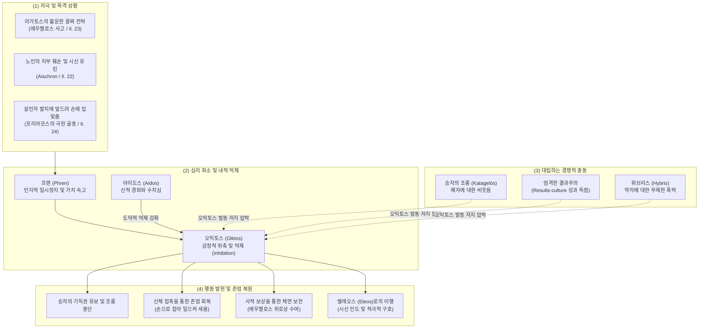

# 오익토스 (Oiktos)

**[[greek-reading-guide|읽는 법]]**: 오익토스 · **원어**: οἶκτος · **학술 전사**: *oîktos*

## 1. 정의와 핵심 테제 (Definition & Core Thesis)

### 1.1 핵심 정의
호메로스 서사시에서 **오익토스**(οἶκτος, *oîktos*; 관용 라틴명 Oiktos)는 타인의 극단적인 실패와 굴욕(*peculiar humiliation*)을 목격할 때 일어나는 '**감정적 위축 및 억제**'(Inhibition / Shrinking back)입니다 ([[scott-1979-pity-and-pathos|Scott 1979]]). 

오익토스는 영웅적 탁월성([[concept-arete|Arete]])과 결과 중심 문화(Results-culture) 규범에 따라 승자가 패자를 마음껏 조롱하고 유린할 수 있는 기득 권리를 스스로 유보하고, **가해를 멈추며 상대의 짓밟힌 존엄 일부를 회복시켜 주는 도덕적 자제 행위**(Refraining from triumphing / Restoring dignity)로 이어집니다. 곤경을 적극적으로 바로잡으려는 추진력인 [[concept-eleos|엘레오스]](Eleos)와 상보적으로 작동하지만, 오익토스는 주로 **인간 관찰자**(특히 아킬레우스)가 타자의 파멸적 수치에 직면하여 주춤거리고 뒤로 물러서는 소극적 브레이크의 성격을 갖습니다.

### 1.2 연구사적 4 대 핵심 명제
1. **굴욕 앞에서의 억제와 조롱 자제** ([[scott-1979-pity-and-pathos|Scott 1979]]):
   오익토스는 추상적인 연민이 아니라, 빛나던 전사가 어처구니없는 불운으로 처참한 실패자로 전락하는 '특수한 굴욕(*peculiar humiliation*)'을 볼 때 격발됩니다. 승자는 패자를 비웃는 자연스러운 권리를 억제하고 상대의 체면을 보전합니다.
2. **아가토스의 체면 보전과 귀족 내부 연대** ([[adkins-1960-merit-and-responsibility|Adkins 1960]], [[scott-1979-pity-and-pathos|Scott 1979]]):
   장례경기 전차경주에서 꼴찌로 전락한 에우멜로스에게 아킬레우스가 오익토스(*ṓikteire*)를 품고 2등상을 제안한 사건은, 결과주의 원칙 속에서도 탁월한 귀족([[concept-agathos|Agathos]])의 명예 실추를 막기 위해 사적 보상을 결합하여 귀족 내부의 결속(Intra-elite solidarity)을 지키는 사회적 장치였습니다.
3. **아이도스(Aidos)와의 상보적 억제 결합** ([[cairns-1993-aidos|Cairns 1993]]):
   오익토스는 타인의 고통받는 신체와 영예를 함부로 유린하지 않으려는 내면적 경외이자 수치심인 [[concept-aidos|아이도스]](Aidos)와 밀접히 공조합니다. 24권에서 아킬레우스가 먼지 바닥에 엎드린 노왕 프리아모스를 가엾게 여겨(*oikteírōn*) 손수 잡아 일으켜 세우는 행위는 아이도스와 오익토스가 결합한 존엄 회복의 절정입니다.
4. **결과 중심주의의 한계와 실존적 개인 윤리** ([[zanker-1994-heart-of-achilles|Zanker 1994]], [[williams-1993-shame-and-necessity|Williams 1993]]):
   애드킨스식 승리 지상주의와 달리, 승자가 자신의 무력을 자발적으로 멈추고 패자의 고통에 공명하는 것은 영웅의 나약함이 아니라, 공통의 필멸성 앞에서 발휘되는 높은 차원의 **도덕적 행위주체성**(Moral Agency)입니다.

---

## 2. 어원과 형태론 (Etymology & Morphology)

### 2.1 비교언어학적 기원과 음운론적 분석
- **어원 재구의 한계**:
  - 피에르 샹트렌(P. Chantraine, *DELG*, p. 788: *sans étymologie*), 얄마르 프리스크(H. Frisk, *GEW* 2.366: *unetymologisiert*), 로베르트 베이케스(R. Beekes 2010, *EDG*, p. 1063) 모두 공통 인도유럽어(PIE) 어근 재구가 불가능하다고 판정합니다.
- **표현론적 의성어 기원**:
  - 비교언어학계는 오익토스를 타인의 참혹한 파멸이나 비극을 목격할 때 본능적으로 터져 나오는 비탄의 탄식 구호인 **οἴμοι**(*oímoi*, '슬프도다!', '아아!')와 결부된 **표현론적 의성어 형성**(Expressive formation)으로 파악합니다.
  - 탄식의 외침(*oî*)에서 명사 *oîktos*(비탄, 슬픔)와 속성 형용사 *oiktrós*(애처로운, 비참한)가 파생되었으며, 이는 다시 타인에 대한 가해를 멈추는 내적 억제 기제로 심리철학적 개념화를 겪었습니다.
- **동사형의 금석학적 표준 표기**:
  - 후대 헬레니즘 및 비잔틴 필사본에는 이오타시즘(Iotacism)으로 인해 `οἰκτίρω`로 표기되는 경우가 잦으나, 기원전 5–4세기 아티케 비문(Epigraphical evidence) 증거에 의해 정형은 **οἰκτείρω**(*oikteírō*)로 확증됩니다 (*oikt-er-yō* 파생에 따른 규칙적 보상 연장).

### 2.2 핵심 어휘 4 열 형태론 분리 표

| 그리스어 실제형 | 학술 전사 | 품사 및 형태론 | 의미 및 문헌학적 맥락 |
|:---|:---|:---|:---|
| **οἶκτος** | *oîktos* | 남성 명사, o-어간 주격 단수 | 비탄, 비애, 연민. 타인의 극단적 수치 목격 시 일어나는 감정적 위축과 가해 억제. |
| **οἰκτείρω** | *oikteírō* | 1 인칭 단수 현재 능동 직설법 (*oikt-er-yō 파생) | 측은히 여기다, 가해를 멈추다. 아티케 금석학 비문 증거로 -ει- 정형 확증. |
| **ᾤκτειρε** | *ṓikteire* | 3 인칭 단수 미완료 능동 직설법 | 가엾게 여겼다. 『일리아스』 23.534에서 꼴찌가 된 에우멜로스를 향한 아킬레우스의 내적 억제. |
| **οἰκτείρων** | *oikteírōn* | 남성 분사 현재 능동 주격 단수 | 측은히 여기며, 가엾게 보며. 『일리아스』 24.516에서 프리아모스를 일으켜 세우는 아킬레우스의 태도. |
| **οἰκτρός** | *oiktrós* | 남성 형용사 주격 단수 (*-ro- 속성 접미사) | 애처로운, 비참한, 슬픈. 외적 굴욕과 파멸로 인해 탄식을 자아내는 물리적 상태. |
| **οἴκτιστος** | *oíktistos* | 남성 형용사 최상급 주격 단수 (*-isto- 최상급) | 가장 비참한. 『일리아스』 22.76에서 개들에게 물어뜯기는 노인의 치부 훼손을 규정하는 극단의 수치어. |
| **οἴκτι스타** | *oíktista* | 중성 복수 대격 형용사 (부사적 용법) | 가장 비참하게. 『오뒷세이아』 11.412에서 아가멤논이 자신의 비열한 암살을 회고하며 절규한 표현. |
| **ἀνοίκτιστος** | *anoíktistos* | 남성/여성 형용사 주격 단수 (부정접두사 *a-* + *oiktos*) | 탄식받지 못하는, 동정 없는, 가혹한. 비탄의 눈물조차 허용되지 않는 비극적 운명. |
| **κατοικτείρω** | *katoikteírō* | 1 인칭 단수 현재 능동 직설법 (강의 접두사 *kata-*) | 깊이 측은히 여기다. 고전기 비극에서 타인의 참상에 완전히 압도되는 심리. |

---

## 3. 호메로스 서사시 본문 용례와 맥락 (Homeric Attestation & Contexts)

### 3.1 양대 서사시 출현 빈도 및 인간 관찰자 중심성
호메로스 텍스트에서 오익토스 어휘군은 다음과 같은 독특한 분포를 보입니다:
- **인간 관찰자 중심성**:
  - 엘레오스(*eleos*)가 올림포스 신들의 중요한 행동 동기이자 지상 개입의 원천인 것과 대조적으로, 오익토스(*oiktos*)는 신들에게 거의 사용되지 않으며 **철저히 인간 관찰자**(특히 아킬레우스)에게 집중됩니다.
  - 신들은 영원한 불멸과 행복 속에서 인간의 비극을 안전한 관객석에서 내려다보기 때문에, '타인의 수치에 직면하여 내적 위축과 공포를 느끼는' 오익토스의 자기투영적 기제를 경험할 수 없습니다.
- **출현 양상**:
  - 명사 *oîktos*, 동사 *oikteírō*, 형용사 *oiktrós*, 최상급 *oíktistos*는 전장에서 패배자의 짓밟힌 육신, 노인의 치욕, 영웅적 기량의 불운한 좌절을 목격할 때 강렬하게 터져 나옵니다.

### 3.2 『일리아스』에서의 용례 맥락: 아가토스의 붕괴와 존엄 보전
1. **에우멜로스의 전차 사고와 아킬레우스의 오익토스** (_Il._ 23.534–548):
   - 최고의 전차 기수였던 에우멜로스가 신적 불운으로 꼴찌가 되었을 때, 아킬레우스는 그를 보고 가엾게 여겨(*ṓikteire*) 2등상을 제안합니다. 이는 결과주의 사회에서 최선의 자가 수치(*aischron*)를 겪는 것을 막으려는 오익토스의 대표적 작동입니다.
2. **노인의 치욕적 시신 유린에 대한 탄식** (_Il._ 22.71–76):
   - 프리아모스는 젊은이의 죽음은 아름다우나, 노인의 센 수염과 은밀한 부위(치부, *aidōs*)가 개들에게 찢기는 것은 지상에서 "가장 비참한 일(*toûto dḕ oíktiston péletai*)"이라고 탄식합니다. 오익토스의 최상급은 명예가 완전히 파괴된 절대적 수치를 규정합니다.
3. **엎드린 프리아모스를 일으켜 세움** (_Il._ 24.515–516):
   - 아들의 살해자 발치에 엎드려 손에 입 맞추는 노왕을 보며 아킬레우스는 마음속으로 오익토스를 품고(*oikteírōn*), 손수 그를 잡아 일으켜 세웁니다. 승자의 조롱을 멈추고 타인의 존엄을 물리적으로 회복시키는 순간입니다.

### 3.3 『오뒷세이아』에서의 용례 맥락: 하데스 망령의 비탄과 생존자의 전율
1. **아가멤논 망령의 비참한 최후 회고** (_Od._ 11.412–421):
   - 하데스 저승에서 오디세우스를 만난 아가멤논은, 귀향 축하연 자리에서 아이기스토스와 클뤼타임네스트라에게 암살당할 때 동료들이 식탁과 술잔 곁에서 도륙되던 광경을 "가장 비참하게 죽어갔다(*oíktistōi thanátōi*)"고 회고합니다.
   - 트로이아 전장의 장엄한 전사와 대비되는, 배신과 비열한 식탁 살육은 영웅적 명예를 송두리째 박탈당한 극단의 오익토스를 촉발합니다.
2. **키르케의 섬과 조난 선원들의 비탄** (_Od._ 10.209, 12.258):
   - 스퀼라의 바위 괴물에게 동료들이 산 채로 잡아먹히며 손발을 버둥거릴 때, 오디세우스는 자신이 항해 중 겪은 일들 가운데 "가장 가련하고 비참한 광경(*oíktiston dḕ keîno ... eîdon*)"이었다고 진술합니다.

---

## 4. 개념 상호작용과 가치망 (Conceptual Network & Polarity)

오익토스는 타인의 극단적인 파멸과 수치를 목격했을 때 격발하여, 승리욕과 잔혹성을 제어하고 상대의 존엄을 지켜주는 도덕적 완충망으로 기능합니다.

---

## 5. 주요 서사 에피소드 정밀 주해 (Signature Epic Episodes)

### 5.1 에우멜로스의 꼴찌 전락과 아킬레우스의 오익토스 (_Il._ 23.534–538, 548)

- **선정 장면**: 파트로클로스 장례경기 전차경주에서 신적 불운으로 전차가 파손되어 꼴찌로 들어온 당대 최고의 기수 에우멜로스를 향한 아킬레우스의 배려.
- **본문 강독 및 해제**:
  - **번역**: "발 빠른 고귀한 아킬레우스는 그를 보고 가엾게 여겼으며, 아르고스인들 가운데 서서 날개 돋친 말을 건넸다. '가장 뛰어난 사내가 꼴찌로 말을 몰고 왔구나! 그러니 자, 마땅하고 합당하게 그에게 2등상을 주도록 하자. 그러나 1등상은 튀데우스의 아들이 가져가게 하라.' 하지만 만약 당신이 그를 가엾게 여기고 그가 당신의 마음에 든다면..."
  - **원문**: τὸν δὲ ἰδὼν ᾤκτειρε ποδάρκης δῖος Ἀχιλλεύς, / στὰς δ᾽ ἄρ᾽ ἐν Ἀργείοις ἔπεα πτερόεντ᾽ ἀγόρευε· / λοῖσθος ἀνὴρ ὤριστος ἐλαύνει μώνυχας ἵππους· / ἀλλ᾽ ἄγε δή οἱ δῶμεν ἀέθλιον, ὡς ἐπιεικές, / δεύτερ᾽· ἀτὰρ τὰ πρῶτα φερέσθω Τυδέος υἱός. / εἰ δέ μιν οἰκτίρεις καί τοι φίλος ἔπλετο θυμῷ,
  - **학술 전사**: *tòn dè idṑn ṓikteire podárkēs dîos Akhilleús, / stàs d’ ár’ en Argeíois épea pteróent’ agóreue; / loîsthos anḕr ṓristos elaúnei mṓnukhas híppous; / all’ áge dḗ hoi dō̂men aéthlion, hōs epieikés, / deúter’; atàr tà prō̂ta pherésthō Tudéos huiós. / ei dé min oiktíreis kaí toi phílos épleto thumō̂i,*
- **문헌학적·서사학적 함의**:
  - **오익토스의 심리적 메커니즘**: 메리 스콧(Mary Scott 1979)이 오익토스의 본질을 밝히기 위해 제시한 핵심 증거입니다. 최고의 기수(*ṓristos*)가 꼴찌(*loîsthos*)로 전락한 것은 귀족 전사의 명예에 회복하기 힘든 수치(*aischron*)를 안깁니다.
  - **가해 자제와 사적 타협**: 아킬레우스의 미완료 동사 *ṓikteire*는 패자를 비웃지 않고 그의 체면을 지켜주려는 '감정적 억제'를 나타내며, 안틸로코스의 항의에 맞추어 사적 보물(트로이아 흉갑)을 지급함으로써 공적 결과주의와 사적 존엄 보전을 성공적으로 조화시킵니다.

---

### 5.2 노인의 치욕적 시신 유린에 대한 탄식 (_Il._ 22.71–76)

- **선정 장면**: 트로이아 성벽 위에서 출전을 고집하는 아들 헥토르를 말리며, 함락 후 노왕인 자신이 겪을 참혹한 능욕을 예견하는 프리아모스의 절규.
- **본문 강독 및 해제**:
  - **번역**: "젊은이에게는 전장에서 날카로운 청동 창에 찔려 찢긴 채 쓰러져 누워 있는 것이 모든 면에서 어울린다. 그가 죽었을지라도 드러난 모든 것이 아름답기 때문이다. 그러나 개들이 죽임을 당한 노인의 센 머리와 센 턱수염과 치부(치욕스러운 성기)를 더럽힐 때, 이것이야말로 가련한 필멸자들에게 가장 비참하고 수치스러운 일이다."
  - **원문**: νέῳ δέ τε πάντ᾽ ἐπέοικεν / Ἄρηϊ κταμένῳ δεδαϊγμένῳ ὀξέϊ χαλκῷ / κεῖσθαι· πάντα δὲ καλὰ θανόντι περ ὅττι φανήῃ· / ἀλλ᾽ ὅτε δὴ πολιόν τε κάρη πολιόν τε γένειον / αἰδῶ τ᾽ αἰσχύνωσι κύνες κταμένοιο γέροντος, / τοῦτο δὴ οἴκτιστον πέλεται δειλοῖσι βροτοῖσιν.
  - **학술 전사**: *néōi dé te pánt’ epéoiken / Árēï ktaménōi dedaïgménōi okséï khalkō̂i / keîsthai; pánta dè kalà thanónti per hótti phanḗēi; / all’ hóte dḕ polión te kárē polión te géneion / aidō̂ t’ aiskhúnōsi kúnes ktaménoio gérontos, / toûto dḕ oíktiston péletai deiloîsi brotoîsin.*
- **문헌학적·서사학적 함의**:
  - **최상급 오익티스톤(oíktiston)의 규정**: 오익토스의 최상급 형태가 어떤 맥락에서 쓰이는지 밝히는 결정적 대목입니다. 전사의 죽음은 아레테의 완성인 '아름다운 죽음(*kalos thanatos*)'이 될 수 있지만, 존경받아야 할 늙은 군주의 육신과 성기(*aidō̂*)가 짐승들에게 유린당하는 것은 모든 인간적 존엄이 파괴된 절대적 수치(*aischron*)입니다.
  - **자기투영적 비애감**: 관찰자가 이러한 참극 앞에서 느끼는 오익토스는 단순한 감상이 아니라, 인간 조건의 파멸적 취약성에 대한 전율입니다.

---

### 5.3 엎드린 프리아모스를 가엾게 여겨 손으로 일으킴 (_Il._ 24.515–516)

- **선정 장면**: 막사에서 함께 통곡을 마친 뒤, 바닥에 엎드린 적국의 노왕을 아킬레우스가 직접 손을 잡아 일으켜 세우는 장면.
- **본문 강독 및 해제**:
  - **번역**: "그러나 고귀한 아킬레우스가 울부짖음의 갈망을 채우고, 그의 사지와 마음에서 그 욕망이 사라졌을 때, 그는 자리에서 일어나 손으로 노인을 일으켜 세웠으니, 센 머리와 센 턱수염을 가엾게 여겼던 것이다."
  - **원문**: αὐτὰρ ἐπεί ῥα γόοιο τετάρπετο δῖος Ἀχιλλεύς, / καί οἱ ἀπὸ πραπίδων ἦλθ᾽ ἵμερος ἠδ᾽ ἀπὸ γυίων, / αὐτίκ᾽ ἀπὸ θρόνου ὦρτο, γέροντα δὲ χειρὸς ἀνίστη, / οἰκτείρων πολιόν τε κάρη πολιόν τε γένειον,
  - **학술 전사**: *autàr epeí rha góoio tetárpeto dîos Akhilleús, / kaí hoi apò prapídōn êlth’ hímeros ēd’ apò guíōn, / autík’ apò thrónou ôrto, géronta dè kheiròs anístē, / oikteírōn polión te kárē polión te géneion,*
- **문헌학적·서사학적 함의**:
  - **오익토스 분사의 실천성**: 현재분사 *oikteírōn*은 아킬레우스의 행동을 직접 수식합니다. 아들의 살해자 발치에 엎드린 노인의 백발과 수염을 보며 아킬레우스는 승자의 우월감을 부리지 않고, 손으로 노인을 부축하여(*kheiròs anístē*) 신체적 존엄을 회복시킵니다.
  - **억제에서 구호로의 관문**: 이 오익토스의 자제가 선행됨으로써, 비로소 시신을 씻겨 반환하고 식사를 대접하는 엘레오스의 적극적 구호로 나아갈 수 있었습니다.

---

### 5.4 아가멤논 망령의 비극적 회고 (_Od._ 11.418–421)

- **선정 장면**: 저승에서 오디세우스를 만난 아가멤논이 자신의 비열한 암살을 회고하며 절규하는 장면.
- **본문 강독 및 해제**:
  - **번역**: "그대는 수많은 사내들이 죽어 넘어가는 것을 보았을 것이다. 일대일 결투에서, 혹은 격렬한 격전 속에서 살해당하는 것을. 그러나 그 광경을 보았더라면 그대의 마음은 가장 깊이 슬퍼졌을 것이다. 어떻게 우리가 믹싱볼과 가득 찬 식탁 곁에서 쓰러져 죽었는지, 그리고 바닥 전체가 피로 끓어 넘쳤는지를."
  - **원문**: ἤδη μὲν πολέων φόνῳ ἀνδρῶν ἀντεβόλησας, / μουνὰξ κτεινομένων καὶ ἐνὶ κρατερῇ ὑσμίνῃ· / ἀλλά κε κεῖνα μάλιστα ἰδὼν ὀλοφύραο θυμῷ, / ὡς ἀμφὶ κρητῆρα τραπέζας τε πληθούσας / κείμεθ᾽ ἐνὶ μεγάρῳ, δάπεδον δ᾽ ἅπαν αἵματι θῦεν.
  - **학술 전사**: *ḗdē mèn poléōn phónōi andrō̂n antebólēsas, / mounàks kteinoménōn kaì enì kraterē̂i husmínēi; / allá ke keîna málista idṑn olophúrao thumō̂i, / hōs amphì krētêra trapézas te plēthoúsas / keímeth’ enì megárōi, dápedon d’ hápan haímati thûen.*
- **문헌학적·서사학적 함의**:
  - 앞선 412행에서 아가멤논은 자신의 죽음을 "가장 비참한 죽음(*oíktistōi thanátōi*)"으로 규정했습니다. 손님 환대와 평화의 공간인 연회장에서 기습당해 짐승처럼 도륙당한 죽음은 전사의 명예를 극단적으로 훼손하는 수치였으며, 오익토스는 이러한 비정상적 몰락 앞에서 터져 나오는 공포와 비애입니다.

---

### 5.5 파트로클로스의 탄식과 무자비한 아킬레우스 비판 (_Il._ 16.33–35)

- **선정 장면**: 아카이아 군대가 해변까지 밀려 몰살당할 위기에 처하자, 홀로 분노를 고집하는 아킬레우스의 냉혹함을 질타하는 파트로클로스.
- **본문 강독 및 해제**:
  - **번역**: "무자비한 자여! 기수 펠레우스는 당신의 아버지가 아니었으며, 테티스 여신도 당신을 낳지 않았소. 푸른 바다가 당신을 낳았고 깎아지른 절벽이 당신을 낳았으니, 당신의 마음이 가혹하기 짝이 없기 때문이오!"
  - **원문**: νηλεές, οὐκ ἄρα σοί γε πατὴρ ἦν ἱππότα Πηλεύς, / οὐδὲ Θέτις μήτηρ· γلاυκὴ δέ σε τίκτε θάλασσα / πέτραι τ᾽ ἠλίβατοι, ὅτι τοι νόος ἐστὶν ἀπηνής.
  - **학술 전사**: *nēleés, ouk ára soí ge patḕr ê̂n hippóta Pēleús, / oudè Thétis mḗtēr; glaukḕ dé se tíkte thálassa / pétrai t’ ēlíbatoi, hóti toi nóos estìn apēnḗs.*
- **문헌학적·서사학적 함의**:
  - 파트로클로스는 아킬레우스에게 인간의 혈통을 부정하고 바위와 바다의 자식이라고 비난합니다. 이는 동료 전사들의 처참한 패배와 굴욕을 보고도 오익토스(위축)와 엘레오스(구호)를 전혀 느끼지 못하는 상태(**동정 없음**, *anoíktistos*)가 인간의 본성(*physis*)을 벗어난 괴물성임을 폭로하는 결정적 순간입니다.

---

## 6. 역사적·제도적 맥락 (Historical & Institutional Context)

### 6.1 장례 경기(Athla)와 결과 중심 문화의 완충재
- **성과와 지위의 충돌**: 아르카익 호메로스 사회는 전장과 운동 경기에서 승리한 자만이 명예([[concept-time|Timē]])를 독점하는 엄격한 결과 중심 문화(Results-culture)였습니다. 
- **오익토스를 통한 계층 내 결속**: 최고의 기수 에우멜로스가 불운으로 꼴찌가 되었을 때, 아킬레우스가 발동한 오익토스는 '탁월한 귀족의 명예 실추 방지'라는 사회적 안전판이었습니다. 패자의 실수를 조롱하지 않고 위로상을 주는 관행은, 귀족 계층 내부의 적대적 파탄을 막고 계층 내 연대(Intra-elite solidarity)를 지탱하는 제도적 타협이었습니다 ([[adkins-1960-merit-and-responsibility|Adkins 1960]]).

### 6.2 승자의 승리욕(Katagelōs) 억제와 사적 보상
- **조롱(Katagelōs)의 공포**: 고대 그리스 수치 문화에서 가장 두려운 사회적 제재는 적들의 비웃음과 조롱(*katagelōs*)이었습니다. 패배자가 겪는 수치는 영웅적 정체성을 위협합니다.
- **오익토스의 억제 기능**: 오익토스는 승자가 패자를 마음껏 조롱할 수 있는 기득권을 유보하게 만듭니다. 안틸로코스가 자신의 공적 상(암말)을 지키겠다고 주장하자, 아킬레우스는 자신의 사적 막사 보물에서 청동 흉갑을 꺼내 에우멜로스에게 줌으로써, 공적 결과주의와 사적 오익토스 배려를 완벽히 양립시켰습니다.

### 6.3 노인의 지위와 치욕적 파멸의 금기
- 호메로스 사회에서 원로 귀족은 공론장 아고라([[concept-themis|Themis]])에서 지혜를 제공하는 존경의 대상입니다.
- 그러나 전쟁의 패배로 오이코스가 무너지면, 노인은 전사로서 무기를 들 힘이 없어 가장 비참한 학살의 희생자가 됩니다. 『일리아스』 22권에서 프리아모스가 예견한 노인의 치부 훼손은 문명적 질서가 완전히 붕괴한 야만을 상징하며, 오익토스는 이러한 극단의 파멸을 목격할 때 인간이 느끼는 생리적 전율이자 규범적 브레이크였습니다.

---

## 7. 물질문화와 신체성 (Material Culture & Embodiment)

### 7.1 살인자의 손에 입맞춤(Kyse cheiras): 극한의 신체적 자기비하
- **손의 상징성**: 영웅의 손(cheir)은 창을 쥐고 적을 도륙하는 영웅적 아레테의 물리적 집행 기관입니다.
- **자기비하의 극치**: 프리아모스가 아킬레우스의 "수많은 내 자식들을 죽인 살인적인 손(χειρὸς ἀνδροφόνοιο)"에 입술을 대는 행위(_Il._ 24.506)는, 지상에 존재하는 가장 극단적인 자기비하이자 수치(*peculiar humiliation*)의 신체화였습니다.
- **오익토스의 촉발**: 이 비정상적인 신체 접촉을 마주한 아킬레우스는 소름 돋는 경악 속에서 노인의 손을 조용히 밀쳐낸 뒤, 비로소 마음속에서 오익토스(*oikteírōn*)를 일으키게 됩니다.

### 7.2 공간적 하강과 무릎 접촉(Gouna labein)
- 탄원자가 상대의 발치로 몸을 던지는 행위(Propiptein)는 직립한 영웅의 공간적 위상을 지표면으로 떨어뜨리는 신체 언어입니다.
- 무릎(gonata)을 끌어안는 동작은 상대의 공격적 기동성을 물리적으로 억제하고, 상대방의 생명력 원천에 자신을 결속시킴으로써 상대에게 도덕적 주춤거림(Inhibition)을 강제합니다.

### 7.3 손을 뻗어 일으켜 세움(Cheiros anistēmi): 물리적 존엄 복원
- 『일리아스』 24.515에서 아킬레우스는 "자리에서 일어나, 손으로 노인을 일으켜 세웠다(*géronta dè kheiròs anístē*)".
- 바닥에 엎드린 패자를 손으로 붙잡아 직립시키는 이 제스처는, 오익토스가 단순한 내면의 감상이 아니라 '상대의 무너진 존엄을 물리적 공간에서 원상 복원하는' 구체적 신체적 실천임을 보여줍니다.

---

## 8. 종교인류학 및 제의적 실천 (Religious Anthropology & Ritual)

### 8.1 아이도스(Aidos)와의 상보적 결합: 신적 경외와 억제의 연동
- 오익토스는 단독으로 작동하지 않고, 신성한 질서와 타인의 존엄을 침범하지 않으려는 내면적 억제 감정인 [[concept-aidos|아이도스]](Aidos)와 한 쌍을 이룹니다 ([[cairns-1993-aidos|Cairns 1993]]).
- 프리아모스는 "신들을 두려워하시오(*aideîo theoús*)"라고 호소하며 아킬레우스의 아이도스를 소환했고, 아킬레우스는 노인의 치욕을 보며 오익토스를 일으켜 손을 뻗었습니다. 아이도스가 '넘어서는 안 될 선'을 지키는 억제라면, 오익토스는 '이미 무너진 자'의 굴욕 앞에서 가해를 멈추는 억제입니다.

### 8.2 신들의 부재: 인간 실존 고유의 정념
- 올림포스의 신들은 영원한 불멸성(Athanatoi)과 무한한 행복을 누리는 '신적 관객'입니다 ([[lee-taesoo-2020-gods-in-audience|이태수 2020]]). 신들은 지상의 비극을 심미적으로 관람할 뿐, 타인의 수치 앞에서 자신의 파멸을 예감하며 오익토스를 느끼지 않습니다.
- 따라서 오익토스는 오직 늙음, 질병, 패배, 죽음이라는 유한한 운명(Condicio humana)에 내맡겨진 **필멸자 인간들 사이에서만 성립하는 실존적 도덕 감정**입니다.

### 8.3 시신 매장과 제의적 모독 방지
- 전사자의 시신이 개와 새들의 먹이로 던져지는 것은 호메로스 종교관에서 가장 두려운 저주입니다.
- 오익토스는 적장의 시신을 끝없이 유린하려는 승자의 가학적 충동에 제동을 걸고, 정당한 매장 의례(Kedeia)를 통해 죽은 자의 명예의 몫(*Geras thanonton*)을 보존하게 만드는 종교인류학적 방파제였습니다.

---

## 9. 심리철학 및 도덕적 행위주체성 (Moral Psychology & Agency)

### 9.1 프렌(Phren)에서의 인지적 정지와 주춤거림
- 호메로스인의 심리좌소에서, 혈기와 공격성을 관장하는 **튀모스**([[concept-thumos|Thumos]])가 적을 향해 돌진할 때, 횡격막의 지적·숙고 좌소인 **프렌**([[concept-phren|Phren]])은 타자의 처참한 수치를 마주하여 '주춤거림과 감정적 위축(Inhibition / Pause)'을 일으킵니다.
- 프렌은 살해의 맹목적 충동에 제동을 걸고, "저 참혹한 몰락이 내게도 닥칠 수 있다"는 자기투영적 가치 평가를 수행합니다. 이 인지적 정지의 순간이 바로 오익토스의 발동입니다.

### 9.2 메리 스콧(1979)의 도덕심리학: 엘레오스와의 대조
메리 스콧은 호메로스 연민을 두 축으로 규명했습니다:
1. **오익토스(Oiktos)**: 굴욕 앞에서의 소극적 억제, 조롱 중단, 상대의 존엄 회복. (Inhibition)
2. **엘레오스(Eleos)**: 곤경을 타개하려는 적극적 전진 충동, 실질적 구호 행동. (Forward drive)
- 영웅은 먼저 오익토스를 통해 폭력의 가속 페달에서 발을 떼고 브레이크를 밟은 뒤, 비로소 엘레오스를 통해 구호의 핸들을 잡습니다.

### 9.3 애드킨스 결과주의 비판과 자율적 행위주체성
- 아서 애드킨스([[adkins-1960-merit-and-responsibility|Adkins 1960]])는 호메로스 사회가 오직 성공만을 평가하여 협력적 감정이 무력했다고 보았으나, 텍스트는 영웅들이 승리의 권능 속에서도 자발적으로 무력을 자제함을 실증합니다.
- 아킬레우스가 프리아모스를 부축한 것은 외적 강요가 아니라, 가치를 헤아리고 결단한 **자율적 도덕 행위주체성**(Moral Agency)의 정점입니다 ([[zanker-1994-heart-of-achilles|Zanker 1994]]).

---

## 10. 후대 철학 및 비극 수용사 (Post-Homeric Reception)

### 10.1 소포클레스 『필록테테스』: 네오프톨레모스의 오익토스와 도덕적 전향
- **극적 상황**: 아킬레우스의 아들 네오프톨레모스는 트로이아 정복이라는 군사적 성공을 위해 오디세우스의 기만술에 가담하여, 렘노스 무인도에 버려진 필록테테스의 활을 빼앗으려 합니다.
- **오익토스의 발동**: 그러나 10년간 악취 나는 발의 궤양과 고독 속에서 뒹군 필록테테스의 처참한 굴욕을 마주한 순간, 네오프톨레모스는 가슴을 짓누르는 오익토스를 이기지 못하고 도덕적 전향을 선언합니다:
  - **번역**: "그에 대한 끔찍한 연민이 내게 덮쳤다, 지금이 아니라 이미 오래전부터."
  - **원문**: οἶκτος δεινός τις ἐμπέπτωκέ μοι / τἀνδρὸς πάλαι δή, μὴ νῦν πρῶτον.
  - **학술 전사**: *oîktos deinós tis empéptōké moi / t’andròs pálai dḗ, mḕ nûn prôton.* (_Phil._ 965–966)
- **수용사적 의의**: 네오프톨레모스는 결과 중심적 승리(오디세우스의 궤변)를 거부하고, 아버지 아킬레우스의 고결한 본성(*physis*)인 오익토스를 회복하여 활을 돌려줌으로써 타인의 존엄을 지켜냅니다.

### 10.2 소포클레스 『아이아스』: 오디세우스의 실존적 자제
- 아이아스가 광기 속에서 자살한 뒤, 아가멤논과 메넬라오스는 시신 매장을 금지하며 시신 능욕을 획책합니다.
- 이때 숙적이었던 오디세우스가 등장하여 여신 아테나의 조롱 유혹을 거부하고 연민을 선언합니다:
  - **번역**: "비록 원수일지라도 가련한 그를 불쌍히 여깁니다. 그가 끔찍한 파멸의 멍에에 묶여 있기 때문입니다. 그를 보면서 나 자신의 처지도 함께 봅니다. 우리 살아있는 자들은 모두 한낱 환영이자 가벼운 그림자에 불과하니까요."
  - **원문**: ἐποικτίρω δέ νιν / δύστηνον ἔμπας, καίπερ ὄντα δυσμενῆ, / ὁθούνεκ’ ἄτῃ συγκατέζευκται κακῇ, / οὐδὲν τὸ τούτου μᾶλλον ἢ τοὐμὸν σκοπῶν. / ὁρῶ γὰρ ἡμᾶς οὐδὲν ὄντας ἄλλο πλὴν / εἴδωλ’ ὅσοιπερ ζῶμεν ἢ κούφην σκιάν.
  - **학술 전사**: *epoiktírō dé nin / dū́stēnon émpas, kaíper ónta dysmenê, / hothoúnek’ átēi synkatézeuktai kakêi, / oudèn tò toútou mâllon ḕ toùmòn skopôn. / horô gàr hēmâs oudèn óntas állo plḕn / eídōl’ hósoiper zômen ḕ koúphēn skián.* (Soph. *Ajax* 121–126)
- 오디세우스의 동사 *epoiktírō*는 적대적 경계를 허물고, 인간 실존 전체의 덧없음을 직시함으로써 가해를 멈추는 오익토스의 고전기적 심화를 완벽히 대변합니다.

### 10.3 플라톤 『국가』에서의 비판과 통제
- 플라톤은 『국가』(*Republic* 3권, 10권)에서 시인들이 묘사하는 통곡과 오익토스가 수호자 계급의 영혼을 나약하게 만든다고 비판했습니다. 
- 플라톤은 이성을 통해 비탄을 억누를 것을 요구했으나, 비극 시인들에게 오익토스는 폭력적 오만([[concept-hybris|Hybris]])을 통제하는 최후의 인간적 양심이었습니다.

---

## 11. 학술 논쟁과 이설 (Scholarly Debates & Theoretical Conflicts)

> [!WARNING] 학설 대립: 호메로스 사회에서 오익토스(Oiktos)의 도덕적 구속력 논쟁
> A. W. H. 애드킨스(1960)는 호메로스 사회를 철저한 결과 중심 문화로 규정하며, 전차경주에서 아킬레우스가 에우멜로스에게 오익토스를 품고 상을 주려 한 시도가 안틸로코스의 결과주의적 항의에 막혀 좌절되었음을 들어, 오익토스가 공적 가치 체계를 바꾸지 못하는 무력한 사적 편의에 불과했다고 보았습니다. 반면 메리 스콧(1979)은 정밀한 어휘 분석을 통해 오익토스가 패자의 수치를 방지하고 승자의 조롱을 억제하는 고유한 도덕심리학적 메커니즘임을 입증했습니다. 더글러스 케언스(1993)와 그레이엄 잰커(1994)는 오익토스가 아이도스 및 자율적 개인 윤리와 결합하여 결과주의의 폭력성을 제어하는 실질적 도덕 규범으로 기능했음을 논증했습니다.

### 11.1 학파별 핵심 논쟁 쟁점

#### 1. 애드킨스(1960)의 결과주의적 무력론
- **테제**: 장례경기 23권에서 아킬레우스는 에우멜로스에게 2등상을 주지 못하고 안틸로코스에게 암말을 넘겨주어야 했습니다.
- **평가**: 오익토스는 경쟁적 결과주의의 철벽같은 규범 앞에서 패퇴할 수밖에 없는 2차적 감정에 불과하다고 주장했습니다.

#### 2. 메리 스콧(1979)의 심리 억제론
- **반박**: 아킬레우스는 안틸로코스의 공적 몫을 인정하면서도, 사적 보물을 통해 에우멜로스의 수치를 기어이 막아냈습니다.
- **의의**: 오익토스의 본질은 결과의 전복이 아니라, '패자의 극단적 수치를 방지하는 감정적 억제와 체면 보전'에 있음을 밝혔습니다.

#### 3. 케언스(1993)와 잰커(1994)의 도덕적 행위주체성론
- **통찰**: 24권에서 아킬레우스가 프리아모스를 일으켜 세우는 행위는 단순한 관습의 이행이 아니라, 살해 권능을 쥔 영웅이 타자의 고통에 공명하여 자발적으로 힘을 제한하는 숭고한 도덕적 도약임을 증명했습니다.

### 11.2 학설 비교 매트릭스

| 연구자 및 연도 | 대표 저작 | 학설 모델 | 오익토스(Oiktos)의 위상 및 해석 | 주요 비판 및 한계 |
|:---|:---|:---|:---|:---|
| **A. W. H. 애드킨스** (Adkins 1960) | 『공적과 책임』 (*Merit and Responsibility*) | 결과주의 경쟁 모델 | 공적 결과 체계를 바꾸지 못하고 사적 타협에 머무는 무력한 편의 | 사적 보상을 통한 체면 보전의 사회적 결속 기능 간과 |
| **메리 스콧** (Scott 1979) | 「호메로스에서의 연민과 파토스」 (*Pity and Pathos in Homer*) | 도덕심리학적 어휘 분석 | 타인의 굴욕 목격 시 승자의 조롱을 멈추고 존엄을 지키는 내적 억제 | 비경쟁적 지반 형성 이전의 전장 적대성 해소 기제 설명 제한 |
| **더글러스 케언스** (Cairns 1993) | 『아이도스』 (*Aidōs*) | 역사도덕심리학 | 아이도스와 연동하여 승자의 시신 훼손과 가학성을 자제시키는 내면적 제동기 | 귀족 전사 엘리트 내부의 규범에 치중됨 |
| **그레이엄 잰커** (Zanker 1994) | 『아킬레우스의 마음』 (*The Heart of Achilles*) | 영웅 윤리학 및 문학비평 | 필멸자 공통의 취약성을 통찰하고 타인을 손수 일으켜 세우는 자율적 개인 윤리 | 아킬레우스 개인의 예외성에 집중되어 보편적 사회 제도화 분석 제한 |

---

## 12. 증거 매트릭스 (Evidence Matrix)

| 주장 테제 | 원전·문헌 근거 위치 | 자료 유형 | 확실성 등급 | 적용 섹션 |
|:---|:---|:---|:---|:---|
| **오익토스의 본질**: 타인의 극단적 수치 목격 시 일어나는 감정적 위축과 조롱 억제임. | Scott (1979: 1–5) | 현대 고전학 | 강한 학술 추론 | 1절, 2절, 9절 |
| **의성어 표현론적 어원**: οἴμοι 탄식 구호에서 파생되어 가해 억제로 개념화됨. | Chantraine DELG 788; Beekes EDG 1063 | 비교언어학 | 강한 학술 추론 | 2.1절 |
| **에우멜로스 꼴찌 전락과 오익토스**: 아킬레우스는 꼴찌가 된 아가토스의 수치를 막기 위해 2등상을 제안함. | 『일리아스』 23.534–538 | 호메로스 본문 | 원전 명시 | 3.2절, 5.1절, 6.1절 |
| **노인 시신 훼손과 극단의 수치**: 노인의 센 수염과 치부가 개들에게 훼손되는 것은 가장 비참한(oíktiston) 일임. | 『일리아스』 22.71–76 | 호메로스 본문 | 원전 명시 | 3.2절, 5.2절, 6.3절 |
| **프리아모스를 손수 일으켜 세움**: 아킬레우스는 엎드린 노왕을 가엾게 여겨(oikteírōn) 손을 잡아 일으킴. | 『일리아스』 24.515–516 | 호메로스 본문 | 원전 명시 | 1절, 5.3절, 7.3절 |
| **아가멤논의 암살 회고**: 손님 환대 식탁 곁에서 도륙된 최후를 가장 비참한 죽음(oíktistōi thanátōi)으로 규정함. | 『오뒷세이아』 11.412–421 | 호메로스 본문 | 원전 명시 | 3.3절, 5.4절 |
| **동정 없는 자(anoíktistos) 비판**: 파트로클로스는 동료의 몰락에 오익토스를 느끼지 못하는 아킬레우스를 바위의 자식이라 비판함. | 『일리아스』 16.33–35 | 호메로스 본문 | 원전 명시 | 3.1절, 5.5절 |
| **신들의 부재와 인간 고유성**: 신들은 안전한 관객석에 머물며 오익토스를 겪지 않음. | [[lee-taesoo-2020-gods-in-audience\|이태수 2020]] | 현대 고전철학 | 강한 학술 추론 | 3.1절, 8.2절 |
| **소포클레스 비극 수용 (필록테테스)**: 네오프톨레모스는 환자의 굴욕 앞에서 오익토스를 품고 도덕적 전향을 결단함. | Sophocles, *Philoctetes* 965–966 | 고전문헌 | 원전 명시 | 10.1절 |
| **소포클레스 비극 수용 (아이아스)**: 오디세우스는 적의 파멸 앞에서 인간 실존의 덧없음을 직시하며 가해를 거부함(epoiktírō). | Sophocles, *Ajax* 121–126 | 고전문헌 | 원전 명시 | 10.2절 |

---

## 관련 항목

### 핵심 인물 및 신
- [[entity-achilles|아킬레우스 (Achilles)]] — 23권 에우멜로스와 24권 프리아모스 앞에서 오익토스를 발동하여 존엄을 회복시킨 영웅
- [[entity-priam|프리아모스 (Priam)]] — 아들의 살해자 발치에 엎드려 손에 입 맞추는 극단의 자기비하로 오익토스를 격발한 트로이아 노왕
- [[entity-eumelos|에우멜로스 (Eumelos)]] — 전차 파손으로 꼴찌가 되어 아킬레우스의 오익토스와 위로상을 받은 최강의 기수
- [[entity-antilochus|안틸로코스 (Antilochos)]] — 공적 결과주의 권리를 주장하며 사적 오익토스 보상 타협을 이끌어낸 청년 영웅
- [[entity-patroklos|파트로클로스 (Patroklos)]] — 아카이아군의 비극적 패배를 보며 아킬레우스의 냉혹함(*anoíktistos*)을 질타한 영웅
- [[entity-agamemnon|아가멤논 (Agamemnon)]] — 저승에서 자신의 비열한 암살을 가장 비참한 죽음(*oíktistos*)으로 회고한 총사령관
- [[entity-odysseus|오디세우스 (Odysseus)]] — 소포클레스 비극에서 숙적 아이아스의 비극에 오익토스를 품고 시신 매장을 관철한 지혜의 영웅

### 관련 윤리·도덕·사법 개념
- [[concept-eleos|엘레오스 (Eleos)]] — 오익토스의 억제를 거쳐 비경쟁적 지반에서 발동하는 적극적 구호 추진력
- [[concept-aidos|아이도스 (Aidos)]] — 신적 질서와 타인의 존엄에 대한 경외, 오익토스를 내면에서 강제하는 제동기
- [[concept-arete|아레테 (Arete)]] — 승리와 탁월성을 요구하는 결과 중심 규범, 오익토스와 긴장을 형성하는 영웅 가치
- [[concept-time|티메 (Timē)]] — 장례경기와 전리품 분배를 통해 보존되는 영웅의 신분적 명예
- [[concept-nemesis|네메시스 (Nemesis)]] — 시신 훼손과 가학적 조롱에 대해 인간과 신들이 표출하는 공적 규탄과 의분
- [[concept-hikesia|히케시아 (Hikesia)]] — 무릎 접촉과 발치 엎드림을 통해 오익토스와 엘레오스를 이끌어내는 신성한 탄원 의례
- [[concept-hybris|휘브리스 (Hybris)]] — 패자의 무력함을 조롱하고 유린하는 오만한 폭력, 오익토스의 대척점

### 호메로스 어원 및 영단어 사전
- [[word-oiktos|Oiktos (오익토스)]] — 호메로스 비탄 탄식 감탄사 기원과 감정 억제 개념사
- [[word-eleos|Eleos (엘레오스)]] — [*alms*, *eleemosynary*, *almoner*, *Kyrie eleison*]
- [[word-achilles|Achilles (아킬레우스)]] — [*Achilles' heel*, *Achillean*]
- [[word-agathos|Agathos (아가토스)]] — [*agathist*, *agathism*, *kalokagathia*]

### 주요 연구 문헌 및 종합 분석
- [[scott-1979-pity-and-pathos|스콧 (1979), 연민과 파토스]] — 오익토스(억제)와 엘레오스(추진력)의 도덕심리학적 분화 규명
- [[adkins-1960-merit-and-responsibility|애드킨스 (1960), 공적과 책임]] — 결과 중심 문화와 에우멜로스 에피소드의 가치 갈등
- [[cairns-1993-aidos|케언스 (1993), 아이도스]] — 내면화된 억제 감정과 시신 훼손 금기 분석
- [[zanker-1994-heart-of-achilles|잰커 (1994), 아킬레우스의 마음]] — 영웅 사회 규범을 넘어서는 개인적 윤리와 자율적 연민
- [[williams-1993-shame-and-necessity|윌리엄스 (1993), 수치심과 필연성]] — 호메로스 인간관과 도덕적 행위주체성
- [[lee-junseok-2024-iliad-jeongam|이준석 (2024), 일리아스 정암학당 역주본]] — 23권 장례경기 및 24권 화해 장면의 정밀 주석
- [[lee-junseok-2018-wrath-and-pity|이준석 (2018), 분노의 서사시, 연민의 서사시]] — 분노에서 연민으로 이행하는 서사시의 시학
- [[lee-taesoo-2020-gods-in-audience|이태수 (2020), 관객석의 신들]] — 신들의 초연한 심미성과 인간 고유의 실존적 비애 대조
