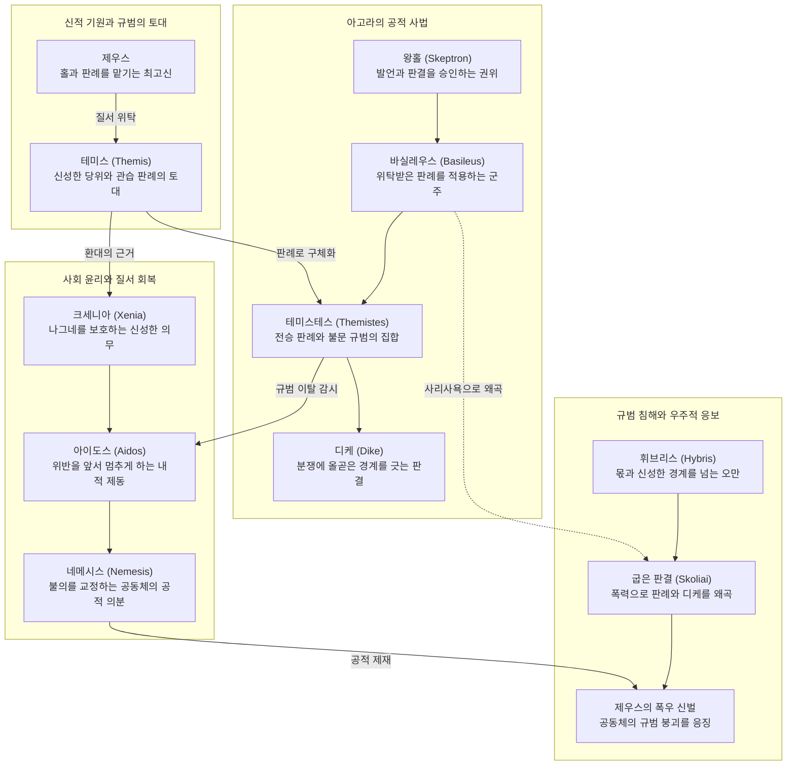

# 테미스 (Themis)

**[[greek-reading-guide|읽는 법]]**: 테미스 · **원어**: θέμις · **학술 전사**: *thémis*

## 1. 개념 정의 및 기본 성격 (Definition & Core Nature)

**테미스**(θέμις, *thémis*; 복수 주격 θέμιστες, *thémistes*; 복수 대격 θέμιστας, *thémistas*; 관용 라틴명 Themis)는 호메로스 서사시에서 최고신 [[entity-zeus|제우스]]가 왕권을 쥔 군주([[entity-agamemnon|아가멤논]])에게 황금 못이 박힌 홀(*skē̂ptron*)과 함께 하사하여 지키게 한 **신성한 불문율·전승 판례의 총체이자 사회적 질서의 기초**를 가리키는 핵심 제도 어휘입니다([[benveniste-1969-vocabulaire-institutions-2|Benveniste 1969]], II, pp. 99–105).

에밀 벤베니스트는 이를 분석적으로 가문([[concept-oikos|오이코스]])과 혈연 집단 내부를 규율하는 '씨족 내부법(Droit familial)'이라 정식화하였으나, 서사시 속에서 복수형 **테미스테스**(thémistes)는 개별 가문의 울타리를 넘어 전사 민회(ἀγορή, *agorḗ*)에서 군주와 재판관([[concept-dike|디카스폴로이]])들이 공적으로 선고하고 보존하는 사법 규범의 총체로 확장되어 작동합니다.

호메로스 텍스트에서 테미스는 문법적 수(단수 대 복수)에 따라 엄격히 구분되는 두 층위를 지닙니다:
1. **단수 테미스(thémis)**: 신들이 우주와 인간 사회의 기초로서 정립해 놓은 '신성한 당위(right, proper)'이자 종교적 금기(taboo)를 의미합니다. 부정어와 결합한 '우 테미스'(*ou thémis*)는 "신들의 법에 어긋나 허락되지 않는다"는 절대적 금기 선언으로 기능합니다.
2. **복수 테미스테스(thémistes)**: 제우스로부터 전수되어 군주와 재판관들의 가슴속에 보존되는 '구체적인 판례·선례들의 집합(precedents, decrees)'입니다. 군주는 법을 마음대로 제정하는 입법자가 아니라, 이 신성한 판례들을 올곧게 적용하고 수호하는 파수꾼(phylax)입니다.

---

## 2. 어원과 형태론적 분석 (Etymology & Morphological Analysis)

### (1) 어원학적 기원과 인도유럽조어(PIE) 배경
그리스어 테미스(θέμις)는 인도유럽조어(PIE) 어근 `*dʰē-`("놓다, 창조적으로 정립하다, 반석 위에 세우다")에서 유래한 여성 명사입니다(Chantraine, *DELG*, pp. 426–428). 

- **우주적 질서(*ar-)와의 분리와 독자적 사법화**:
  - 인도유럽어에서 조화롭게 맞물린 우주 질서를 가리키던 어근 `*ar-`는 인도-이란어파에서 베다의 르타(*Ṛtá-*), 아베스타의 아르타(*Arta- / Aša-*) 및 라틴어 리투스(*ritus*, 제의)를 낳았습니다.
  - 그러나 그리스어에서 `*ar-` 어근(형용사 *artios*, 동사 *arariskō*)은 실정 사법 어휘로 발전하지 못했습니다. 그리스인들은 신이 인간 사회의 기초로서 정초해 놓은 규범을 가리키기 위해 `*dʰē-` 어근에서 파생된 **테미스**(thémis)를 중심 사법 어휘로 채택하였습니다.
- **인도유럽어족 비교 대응형**:
  - **산스크리트어 다만(dhā́man-)**: 최고신 바루나와 미트라가 수호하는 '신적 의지로 정립된 거처이자 신성한 규범'. 어근적·개념적 대응형입니다.
  - **아베스타어 다미(dāmi-)**: 우주의 질서를 창조적으로 정립한 '창조자'.
  - **게르만어 둠(dōm / doom)**: 고대 영어 *dōm*(판결, 법령, 최후의 심판), 고대 고지독일어 *tuom*, 현대 독일어 동사 *tun*(행하다, 놓다).

### (2) 호메로스 방언 고유의 치음군 `-στ-` 사격 곡용
호메로스 서사시의 테미스는 후대 고전기 아티케 방언의 치음 `-δ-`(*thémidos*)나 도리아 방언의 `-τ-`(*thémitos*)와 뚜렷이 구별되는 고유한 치음군 `-στ-`를 사격에서 보존하는 고졸기 곡용 체계를 유지합니다:
- 단수 주격: θέμις (*thémis*)
- 단수 속격: θέμιστος (*thémistos*)
- 단수 여격: θέμιστι (*thémisti*)
- 복수 주격: θέμιστες (*thémistes*)
- 복수 대격: θέμιστας (*thémistas*)
- 복수 속격: θεμίστεων (*themísteōn*)
- 복수 여격: θεμίστεσσι (*themístessi*)

이 치음군 `-στ-`는 건물의 단단한 기초를 뜻하는 테메틀라(θέμεθλα, *thémethla*, 주춧돌) 및 입법적 규정인 테스모스(θεσμός, *thesmós*)와 형태론적으로 직접 연결되어, 테미스가 '흔들리지 않는 사회적 반석'임을 증명합니다.

### (3) 4열 형태론 표

| 구분 | 그리스어 실제형 | 학술 전사 | 문법 설명 및 호메로스 용례 |
|:---|:---|:---|:---|
| **여성 명사 (단수 주격)** | θέμις | *thémis* | 단수 주격. 신성한 당위, 신들이 정립한 도덕적 규범 (*Od.* 14.56) |
| **여성 명사 (단수 속격)** | θέμιστος | *thémistos* | 단수 속격. 테미스의 권위 및 정당한 한계 명시 (*Il.* 11.779) |
| **여성 명사 (복수 주격)** | θέμιστες | *thémistes* | 복수 주격. 왕과 재판관이 보존하는 전승 판례 총체 (*Od.* 9.112) |
| **여성 명사 (복수 대격)** | θέμιστας | *thémistas* | 복수 대격. 서사시 공적 사법의 핵심 목적어 (*Il.* 1.238, 9.99, 16.387) |
| **파생 동사 (현재 능동 3단)** | θεμιστεύει | *themisteúei* | 3인칭 단수 현재 능동. 가부장적 판결을 내리다 (*Od.* 9.114) |
| **복합 형용사 (남성 주격)** | ἀθέμιστος | *athémistos* | 남성 단수 주격. 부정 접두사 a- 결합. 법 없는 자, 야만인 (*Il.* 9.63) |
| **복합 형용사 (속격 복수)** | ἀθεμίστων | *athemístōn* | 속격 복수. 키클롭스 족의 무규범 상태 수식 (*Od.* 9.106) |
| **합성 명사 (남성 주격)** | θεμιστοπόλος | *themistopólos* | 남성 단수 주격. 테미스테스를 집행하는 통치자 (*Hymn Cer.* 103) |
| **동원 명사 (중성 복수)** | θέμεθλα | *thémethla* | 중성 복수 주격. 건물의 기초, 주춧돌 (*Il.* 12.28) |
| **동원 명사 (남성 주격)** | θεσμός | *thesmós* | 남성 단수 주격. 정립된 법령, 제도 (*Od.* 23.296) |

---

## 3. 호메로스 서사시 내 작동 메커니즘 (Operational Mechanism in Homeric Epic)

호메로스 영웅 사회에서 사법과 통치는 성문화된 법률이 아니라 **신적 위탁, 홀(skē̂ptron)의 의례, 그리고 아고라의 공적 숙의**를 통해 구현됩니다.

### (1) 제우스의 신적 위탁과 바실레우스의 사법 책무
호메로스 군주(바실레우스)는 스스로 법을 만들어내는 전제 군주(autocrat)가 아닙니다:
- 제우스는 군주에게 통치권의 상징인 홀(*skē̂ptron*)과 함께 대대로 전승되어 온 판례들인 **테미스테스**(θέμιστες, *thémistes*)를 위탁합니다(*Il.* 9.98–99).
- 군주의 임무는 자의적 변덕이 아니라, 조상 대대로 내려온 이 신성한 불문율들을 가슴속에 보존하고 백성들의 분쟁에 올곧게 적용하는 것입니다.

### (2) 홀(σκῆπτρον, skē̂ptron)의 의례적 기능
홀은 단순한 지팡이가 아니라 제우스의 신성한 사법 질서가 인간 세계에 물질화된 성물입니다:
- 민회(아고라)에서 발언하고자 하는 자는 전령관(kē̂ryx)으로부터 홀을 넘겨받아 손에 쥐어야만 비로소 발언의 신성한 면책특권과 정당성을 획득합니다.
- 재판관들이 판결을 선고할 때 홀을 쥐는 것은(Il. 1.238–239), 그 판결이 개인의 사적 보복이 아니라 제우스의 테미스테스를 대리 집행하는 공적 행위임을 전사단 전체에 천명하는 의례적 절차입니다.

### (3) 아고라와 키클롭스 사회의 문명학적 대조
호메로스는 문명화된 인간 사회와 야만 상태를 가르는 결정적 척도로 테미스를 제시합니다:
- **문명 사회 (Achaia / Phaiakia)**: 열린 광장인 아고라(ἀγορή)가 존재하여 원로와 전사들이 모여 숙의하고, 공유된 공적 관습법인 테미스테스(*thémistes*)를 바탕으로 분쟁을 평화적으로 해결합니다.
- **야만 사회 (Cyclopes)**: 공동의 아고라도 없고 공적 테미스테스도 없습니다(*Od.* 9.112). 각자가 자기 동굴 속에서 처자식에게만 사적 규범을 휘두를 뿐(*themisteúei*), 상호 간의 사회적 연대와 법적 보호망이 완전히 부재한 고립된 야만 상태입니다.

---

## 4. 핵심 에피소드 및 원전 텍스트 정밀 독해 (Key Narrative Episodes & Close Reading)

### (1) 에피소드 1: 아킬레우스의 홀(skē̂ptron) 맹세와 통치 규범의 파탄 (*Il.* 1.234–239)

- **텍스트 인용**:
  - **번역**: "산 위에서 잘려 나와 밑동을 남겨두고 다시는 잎도 싹도 틔우지 못할 이 홀을 두고 맹세하노니, 청동 칼이 잎사귀와 껍질을 벗겨내었기 때문이다. 이제 아카이아인들의 자손들인 재판관들(디카스폴로이)이 손에 쥐고 있으니, 그들은 제우스께로부터 테미스테스를 지키는 자들이다. 그러므로 이것은 그대에게 위대한 맹세가 될 것이다."
  - **원문**: ναὶ μὰ τόδε σκῆπτρον, τὸ μὲν οὔ ποτε φύλλα καὶ ὄζους / φύσει, ἐπεὶ δὴ πρῶτα τομὴν ἐν ὄρεσσι λέλοιπεν, / οὐδ' ἀναθηλήσει· περὶ γάρ ῥά ἑ χαλκὸς ἔλεψε / φύλλά τε καὶ φλοιόν· νῦν αὖτέ μιν υἷες Ἀχαιῶν / ἐν παλάμῃς φορέουσι δικασπόλοι, οἵ τε θέμιστας / πρὸς Διὸς εἰρύαται· ὃ δέ τοι μέγας ἔσσεται ὅρκος
  - **학술 전사**: *naì mà tóde skē̂ptron, tò mèn oú pote phúlla kaì ózous / phúsei, epeì dḕ prō̂ta tomḕn en óressi léloipen, / oud' anathlḗsei; perì gár rhá he khalkòs élepse / phúllá te kaì phloión; nûn aûté min huîes Akhaiō̂n / en palámēis phoréousi dikaspóloi, hoí te thémistas / pròs Diòs eirúatai; hò dé toi mégas éssetai hórkos* (*Il.* 1.234–239)

- **정밀 분석**:
  아가멤논이 자신의 정당한 게라스([[concept-geras|브리세이스]])를 힘으로 빼앗자, 아킬레우스는 생명력을 상실하여 다시는 싹을 틔울 수 없는 마른 나무 홀을 집어던지며 맹세합니다. 홀을 쥐고 판결을 내리는 디카스폴로이(δικασπόλοι)는 제우스가 세운 신성한 판례들(*thémistas*)을 수호하는 자들입니다. 그러나 최고 군주 아가멤논이 바로 그 테미스테스를 스스로 유린했기 때문에, 아킬레우스에게 군대의 사법 질서는 생명력을 잃은 마른 나무 막대기처럼 죽어버렸습니다. 이 에피소드는 최고 권력자의 불법적 일탈이 공동체의 근원적 규범을 어떻게 파괴하는지를 보여주는 호메로스 사법 문헌학의 최고봉입니다.

### (2) 에피소드 2: 네스토르의 연설과 통치권의 본질 규정 (*Il.* 9.63–64, 9.97–99)

- **텍스트 인용 1: 내전 애호자에 대한 단죄**:
  - **번역**: "형제애도 없고, 테미스테스도 없으며, 가문의 화덕도 없는 자로다, 끔찍한 동족 간의 내전을 탐하는 자는!"
  - **원문**: ἀφρήτωρ ἀθέμιστος ἀνέστιος ἔστιν ἐκεῖνος / ὃς πολέμου ἔραται ἐπιδημίου ὀκρυόεντος
  - **학술 전사**: *aphrḗtōr athémistos anéstios éstin ekeînos / hòs polémou ératai epidēmíou okruóentos* (*Il.* 9.63–64)

- **텍스트 인용 2: 군주권과 테미스테스 위탁**:
  - **번역**: "그대는 수많은 군대를 다스리는 왕이며, 제우스께서는 그대에게 홀과 테미스테스를 맡기셨으니, 그대가 백성들을 위해 올바르게 숙고하도록 하심입니다."
  - **원문**: πολλῶν γὰρ λαῶν ἐσσι ἄναξ, καί τοι Ζεὺς ἐγγυάλιξε / σκῆπτρόν τ' ἠδὲ θέμιστας, ἵνά σφισι βουλεύῃσθα
  - **학술 전사**: *pollō̂n gàr laō̂n essi ánax, kaí toi Zeùs enguálixe / skē̂ptrón t' ēdè thémistas, híná sphisi bouleúēistha* (*Il.* 9.97–99)

- **정밀 분석**:
  원로 네스토르는 동족 간의 내분을 즐기는 자를 향해 고대 그리스 사회의 3대 추방자 규정인 '형제애 결여(aphrḗtōr)', '테미스테스 결여(athémistos)', '화덕 결여(anéstios)'를 선언합니다. 테미스가 없는 자(athémistos)는 인간 사회의 기본적 규범망에서 축출된 자입니다. 이어 네스토르는 아가멤논을 향해 왕의 권력이 자의적 지배가 아니라, 제우스로부터 위탁받은 홀과 판례들(*thémistas*)을 백성을 위해 올바르게 행사(bouleúēistha)해야 하는 무거운 도덕적·사법적 책무임을 상기시키며 아킬레우스와의 화해를 촉구합니다.

### (3) 에피소드 3: 가을 폭우 비유와 굽은 판결에 대한 제우스의 우주적 신벌 (*Il.* 16.384–393)

- **텍스트 인용**:
  - **번역**: "가을날 거센 폭풍우로 온 땅이 무겁게 짓눌릴 때처럼, 제우스께서 인간들에게 격노하여 거센 비를 쏟아부으실 때이니, 그들이 아고라에서 폭력으로 굽은 테미스테스를 판결하고 디케를 쫓아내며, 신들의 감시를 두려워하지 않았기 때문이다."
  - **원문**: ὡς δ' ὑπὸ λαίλαπι πᾶσα κελαινὴ βέβριθε χθὼν / ἤματ' ὀπωρινῷ, ὅτε λαβρότατον χέει ὕδωρ / Ζεύς, ὅτε δή ῥ' ἄνδρεσσι κοτεσσάμενος χαλεπήνῃ, / οἳ βίῃ εἰν ἀγορῇ σκολιὰς κρίνωσι θέμιστας, / ἐκ δὲ δίκην ἐλάσωσι θεῶν ὄπιν οὐκ ἀλέγοντες
  - **학술 전사**: *hōs d' hupò laílapi pâsa kelaìnē bébrithe khthṑn / ḗmat' opōrinō̂i, hóte labrótaton khéei húdōr / Zeús, hóte dḗ rh' ándressi kotessámenos khalepḗnēi, / hoì bíēi ein agorē̂i skoliàs krínōsi thémistas, / ek dè díkēn elásōsi theō̂n ópin ouk alégontes* (*Il.* 16.384–388)

- **정밀 분석**:
  파트로클로스가 트로이아군을 패주시키는 격렬한 말발굽 소리를 묘사하는 이 직유는 호메로스 서사시 전체에서 제우스의 정의가 어떻게 우주적으로 작동하는지를 보여주는 가장 결정적인 사법 텍스트입니다([[lloyd-jones-1971-justice-of-zeus|Lloyd-Jones 1971]], pp. 1–9). 부패한 재판관들이 아고라에서 폭력(bíē)으로 올곧은 법을 왜곡하여 '굽은 판결(skoliaì thémistes)'을 내리고 디케를 추방할 때, 제우스는 가을철 홍수와 산사태라는 우주적 파멸로 공동체 전체를 징벌합니다. 인간 사법의 타락(테미스테스의 왜곡)은 우주적 자연 질서의 붕괴로 직결됩니다.

### (4) 에피소드 4: 키클롭스 사회의 문명학적 결여 (*Od.* 9.106–115)

- **텍스트 인용**:
  - **번역**: "그들에게는 의회를 여는 아고라도 없고 테미스테스도 없도다. 오히려 그들은 높은 산봉우리 깊은 동굴 속에 살며, 각자가 자기 아내와 자식들에게만 사적으로 판결을 내릴 뿐(themisteúei), 서로에 대해 전혀 상관하지 않는다."
  - **원문**: τοῖσιν δ' οὔτ' ἀγοραὶ βουληφόροι οὔτε θέμιστες, / ἀλλ' οἵ γ' ὑψηλῶν ὀρέων ναίουσι κάρηνα / ἐν σπέσσι γλαφυροῖσι, θεμιστεύει δὲ ἕκαστος / παίδων ἠδ' ἀλόχων, οὐδ' ἀλλήλων ἀλέγουσι
  - **학술 전사**: *toîsin d' oút' agoraì boulēphóroi oúte thémistes, / all' hoí g' hupsēlō̂n oréōn naíousi kárēna / en spéssi glaphuroîsi, themisteúei dè hékastos / paídōn ēd' alókhōn, oud' allḗlōn alégousi* (*Od.* 9.112–115)

- **정밀 분석**:
  호메로스는 오디세우스의 입을 통해 키클롭스 사회를 '법 없는 자들(ἀθεμίστων, *athemístōn*)'의 세계로 규정합니다. 키클롭스들에게 결여된 것은 단순한 농경 기술이 아니라, 집단적 숙의를 가능케 하는 아고라와 공동의 공적 관습법인 테미스테스(*thémistes*)입니다. 그들은 오직 개별 동굴 속에서 처자식에게만 가부장적 권력(*themisteúei*)을 행사할 뿐입니다. 이 구절은 벤베니스트가 말한 '가문 내부법'이 공적 아고라 사법으로 발전하지 못하고 파편화되었을 때 초래되는 야만의 비극을 예리하게 통찰합니다.

### (5) 에피소드 5: 환대(크세니아)와 종교적 금기로서의 단수 테미스 (*Od.* 14.56–60, *Il.* 16.796–798)

- **텍스트 인용 1: 에우마이오스의 환대 선언**:
  - **번역**: "이방인이여, 비록 그대보다 더 비천한 자가 오더라도 나그네를 모욕하는 것은 내게 허락되지 않소(ou thémis ést'). 모든 나그네와 거지는 제우스에게서 오기 때문이오."
  - **원문**: ξεῖν', οὔ μοι θέμις ἔστ', οὐδ' εἰ κακίων σέθεν ἔλθοι, / ξεῖνον ἀτιμῆσαι· πρὸς γὰρ Διός εἰσιν ἅπαντες / ξεῖνοί τε πτωχοί τε
  - **학술 전사**: *xeîn', ou moi thémis ést', oud' ei kakíōn séthen élthoi, / xeînon atimē̂sai; pròs gàr Diós eisin hápantes / xeînoí te ptōkhoí te* (*Od.* 14.56–58)

- **텍스트 인용 2: 파트로클로스의 투구 낙하와 불경 금지**:
  - **번역**: "이전에는 말총 달린 투구가 흙먼지 속에 더럽혀지는 것이 결코 허락되지 않았다(ou thémis ē̂en)."
  - **원문**: πάρος γε μὲν οὐ θέμις ἦεν / ἱππόκομον πήληκα μιαίνεσθαι κονίῃσιν
  - **학술 전사**: *páros ge mèn ou thémis ē̂en / hippókomon pḗlēka miaínesthai koníēisin* (*Il.* 16.796–797)

- **정밀 분석**:
  복수형 테미스테스가 재판관의 판례 집합을 뜻하는 반면, 단수형 테미스는 신들이 확립한 '근원적 당위와 종교적 금기'를 가리킵니다. 에우마이오스에게 나그네 환대는 단순한 친절이 아니라, 제우스의 명령에 의해 정초된 신성한 의무(*thémis*)입니다. 한편 파트로클로스의 머리에서 떨어진 아킬레우스의 신성한 무구가 먼지에 더럽혀지는 장면에서 시인이 사용한 *ou thémis ē̂en*은 사법적 차원을 넘어 성스러운 기물이 불경하게 오염되는 것을 금지하는 원초적 종교 금기(라틴어 *fas*의 영역)를 드러냅니다.

---

## 5. 사회제도 및 다른 개념과의 상호작용망 (Socio-Institutional Network & Conceptual Relations)

테미스는 호메로스 사회의 도덕·사법 체계를 구성하는 핵심 개념망의 중심 결절점입니다.

### (1) 상호작용망 Mermaid 다이어그램

### (2) 테미스(Themis) 대 디케(Dike)의 구조적 비교
에밀 벤베니스트(1969)와 휴 로이드-존스([[lloyd-jones-1971-justice-of-zeus|Lloyd-Jones 1971]])의 분석을 종합한 두 사법 개념의 본질적 대비는 다음과 같습니다:

| 비교 범주 | 테미스 (Themis / Themistes) | 디케 (Dikē / Dikai) |
|:---|:---|:---|
| **어원적 근원** | `*dʰē-` (반석 위에 놓다, 창조적으로 정립하다) | `*deik-` (손가락으로 가리키다, 말로써 보여주다) |
| **사회공간적 관할** | **씨족 내부법** (가문, 오이코스, 군대 전체의 공적 판례) | **씨족 간 대외 사법** (상이한 가문·부족 간 경계 분쟁) |
| **규범의 성격** | 신들이 전통 속에 심어놓은 **영속적인 불문율 선례** | 갈등 국면에서 재판관이 그어주는 **올곧은 판결 선** |
| **집행 주체** | 홀(*skē̂ptron*)을 쥔 바실레우스 및 테미스테스 수호자 | 정형구 판결을 선언하여 경계를 긋는 재판관 |
| **사법적 왜곡** | 굽은 판례 (*skoliaì thémistes*) | 디케의 폭력적 추방 및 불의(ádikon) |
| **라틴어 대응형** | **파스 (fas)**: 신적 허용이자 불문율 | **이우스 (ius)**: 인간의 절차적 구두 사법 |

---

## 6. 윤리학 및 심리철학적 함의 (Ethical & Psycho-Philosophical Implications)

### (1) 신성한 당위의 내면화: 아이도스와 네메시스
호메로스 사회에서 테미스는 외부의 강제력으로만 작동하지 않습니다:
- 개인의 내면에서는 신성한 당위를 위반할 때 느끼는 부끄러움과 억제 감정인 [[concept-aidos|아이도스]](*aidō̂s*)로 내면화됩니다.
- 공동체의 차원에서는 테미스테스를 짓밟은 자를 향해 전사단 전체가 터뜨리는 공적 의분인 [[concept-nemesis|네메시스]](*némesis*)로 집단 표출됩니다.
- 따라서 테미스는 고대 그리스 수치 문화(Shame culture)에서 개인의 양심과 사회적 비판을 결합시키는 핵심 규범 지반입니다([[cairns-1993-aidos|Cairns 1993]]).

### (2) 조너선 셰이의 테미스 붕괴와 도덕적 상해(Moral Injury)
조너선 셰이([[shay-1994-achilles-in-vietnam|Jonathan Shay 1994]])는 베트남 참전 군인들의 심리적 붕괴를 호메로스 텍스트와 비교하며, 『일리아스』 1권 아킬레우스의 비극을 ‘**테미스의 배반(What's right is betrayed)**’으로 명명합니다:
- 군대의 최고 통수권자인 아가멤논이 전사들의 생명을 지탱하던 기본적 약속과 신뢰(테미스)를 파괴했을 때, 전사 아킬레우스는 실존적 절망과 '도덕적 상해(Moral Injury)'를 입습니다.
- 테미스의 붕괴는 단순한 법률 위반이 아니라, 인간이 세계와 타자에 대해 갖는 신뢰의 우주 전체를 붕괴시키는 파멸적 재앙입니다.

### (3) 자연법(Natural Law)의 고졸기 원형
호메로스의 테미스는 후대 소포클레스의 『안티고네』와 스토아 철학으로 이어지는 **자연법(Natural Law)** 사상의 원초적 출발점입니다:
- 인간이 인위적으로 제정하거나 폐지할 수 있는 실정법(nomos) 이전에, 신들이 존재의 기초로서 인간 본성과 우주에 새겨놓은 '영구불변의 도덕적 당위'가 존재한다는 확신입니다.

---

## 7. 종교 제의 및 인류학적 지평 (Religious Ritual & Anthropological Horizon)

### (1) 헤시오도스 신통기의 우주론적 신화학
헤시오도스의 『신통기』(*Theogony* 901–906행)는 테미스의 우주론적 위상을 확립합니다:
- 테미스는 하늘(우라노스)과 땅(가이아)의 결합으로 태어난 원초적 티타니스(Titanis)입니다.
- 제우스는 메티스(지혜)를 삼킨 뒤, 두 번째 정배로 테미스를 맞이합니다.
- 제우스와 테미스의 결합으로 탄생한 자식들은 계절과 질서의 여신들인 **호라이(Horai)**:
  1. [[concept-eunomia|에우노미아]](Eunomia, 올바른 질서)
  2. [[concept-dike|디케]](Dike, 사법적 정의)
  3. 에이레네(Eirene, 평화)
- 나아가 인간의 운명을 배분하는 **모이라이(Moirai)** 삼여신(클로토, 라케시스, 아트로포스) 역시 테미스의 자식들로 등장합니다. 이는 테미스가 우주의 계절 순환과 인간 운명 배분의 도덕적 모태임을 웅변합니다.

### (2) 제우스 헤르케이오스와 화덕(Hestia) 제의
테미스는 오이코스(가문)의 물리적·종교적 경계를 수호하는 제의 질서와 직결됩니다:
- 안마당의 제단에 모셔진 **제우스 헤르케이오스**(Zeus Herkeios, 울타리의 제우스)와 가문의 중심인 화덕(Hestia)은 외부의 불경한 침입으로부터 가문의 신성함을 지키는 테미스의 성소입니다.
- 네스토르가 내전을 탐하는 자를 "화덕도 없는 자(anéstios)"라고 단죄한 것은, 그가 테미스의 제의적 보호망에서 파문당한 자임을 뜻합니다.

### (3) 서사시에서 의인화된 여신 테미스의 역할
호메로스 서사시에서 테미스는 추상적 어휘일 뿐만 아니라 올림포스 판테온의 질서를 주관하는 품위 있는 여신으로도 등장합니다:
- *일리아스* 15.87–95: 제우스의 분노를 피해 올림포스로 돌아온 헤라에게 가장 먼저 다가가 잔을 건네며 위로하는 여신이 테미스입니다.
- *일리아스* 20.4–6: 트로이아 전쟁의 최종 결전을 앞두고, 제우스의 명령을 받아 올림포스의 모든 신들을 회의로 소집하는 전령관 역할을 수행하는 존재가 바로 테미스입니다. 이는 테미스가 신들의 사회에서도 공적 회의 소집과 질서 조정을 주관하는 존재임을 보여줍니다.

---

## 8. 후대 문학 및 지성사적 수용 (Reception in Later Literature & Intellectual History)

### (1) 고전기 아테네 비극에서의 심화
1. 『**아이스킬로스 『결박된 프로메테우스**』:
   - 프로메테우스는 자신의 어머니를 '가이아-테미스(Gaia-Themis)'라고 부르며(209–210행), 형태는 하나이나 이름이 여럿인 대지의 여신과 테미스를 일체화합니다. 테미스는 미래를 내다보는 예언적 지혜의 원천입니다.
2. 『**소포클레스 『안티고네**』:
   - 크레온 왕이 선포한 국가 실정법(nomos)에 맞서, 안티고네는 "어제오늘 생겨난 것이 아니요 언제 시작되었는지 아무도 모르는, 신들의 영구불변한 불문율(ἄγραπτα νόμιμα, *ágrapta nómima*)"(450–457행)을 선언합니다. 이 불문율의 원형이 바로 호메로스적 테미스입니다.

### (2) 고전 철학과 로마법으로의 제도적 진화
1. **아리스토텔레스의 불문법(Nomos Agraphos)**:
   - 아리스토텔레스는 『수사학』(1373b)에서 인간의 합의로 제정된 특수법(nomos idios)과 대조되는, 자연에 기초한 보편적 법(nomos koinos)이자 '불문법(nomos agraphos)'의 개념을 정립하여 호메로스 테미스를 철학적으로 체계화했습니다.
2. **로마법의 파스(Fas)와 이우스(Ius)**:
   - 로마인들은 신들이 인간에게 허용한 신성한 불문율을 **파스**(Fas)로, 인간들이 정형구를 통해 확립한 사법적 권리를 **이우스**(Ius)로 분리했습니다. 이는 테미스 대 디케의 이원론이 서양 법학 체계로 계승된 전형입니다.
3. **정의의 여신(Justitia / Lady Justice)**:
   - 헬레니즘과 로마 시대를 거치며 테미스와 디케의 상징은 로마의 유스티티아(Justitia)로 융합되어, 한 손에는 형벌의 칼을, 다른 한 손에는 공평한 저울을 든 근대 사법의 상징으로 완성되었습니다.

---

## 9. 학술적 쟁점 및 비판적 평가 (Scholarly Debates & Critical Evaluation)

### (1) 벤베니스트 '씨족 내부법' 환원론의 한계
에밀 벤베니스트(1969)는 테미스를 가문 내부를 다스리는 '씨족 내부법'으로 국한하려 했습니다. 그러나 휴 로이드-존스(1971)와 후대 문헌학자들이 밝혀냈듯:
- *일리아스* 1권의 홀 맹세(1.238–239), 9권의 군주권 위탁(9.98–99), 그리고 16권의 아고라 굽은 판결(16.387–388)에서 테미스테스는 이미 가문의 경계를 넘어 **공적 전사 공동체 전체를 규율하는 보편적 사법 규범**으로 완전히 확장되어 있습니다. 따라서 테미스를 사적 가문법으로만 환원하는 것은 서사시의 사법적 역동성을 과소평가한 것입니다.

### (2) 도즈와 애드킨스의 '비도덕적 제우스' 가설 극복
E. R. 도즈([[dodds-1951-greeks-and-irrational|Dodds 1951]])와 A. W. H. 애드킨스([[adkins-1960-merit-and-responsibility|Adkins 1960]])는 호메로스의 제우스가 도덕적 정의와 무관한 변덕스러운 힘의 화신이라고 보았습니다:
- 그러나 *일리아스* 16권 384–393행의 가을 폭우 비유는 제우스가 아고라에서 굽은 판결을 내리고 디케를 추방하는 자들에게 도덕적 격노를 터뜨려 신벌을 내림을 명백히 보여줍니다.
- 로이드-존스([[lloyd-jones-1971-justice-of-zeus|Lloyd-Jones 1971]])가 입증하듯, 호메로스 서사시는 이미 제우스의 정의(Dikē)와 테미스테스가 우주 전체를 관통하는 도덕적 질서관을 확고히 내포하고 있습니다.

---

## 10. 현대적 통찰 및 인문학적 의의 (Modern Insights & Humanistic Significance)

### (1) 법실증주의의 한계와 실질적 정의의 회복
근대 법치주의는 의회에서 합법적 절차를 거쳐 제정된 법률(실정법)만을 법으로 인정하는 법실증주의로 경도되기 쉽습니다. 그러나 나치 독일의 악법 사례처럼, 형식적 합법성이 인류의 보편적 양심을 짓밟는 비극이 발생할 수 있습니다. 호메로스의 테미스는 실정법 이전에 인간 존엄과 우주적 양심에 기초한 ‘**실질적 당위와 정의**’가 우선해야 함을 끊임없이 일깨웁니다.

### (2) 지도자의 사법적 일탈과 도덕적 해이 경고
아가멤논이 홀과 테미스테스를 위탁받은 군주이면서도 완력으로 아킬레우스의 권리를 침탈했을 때 그리스 군대 전체가 파멸의 위기에 처했습니다. 이는 공동체의 최고 통수권자가 법치를 파괴하고 공적 규범을 사유화할 때, 조직 전체의 신뢰 자본이 어떻게 붕괴하는지를 경고하는 강력한 리더십 윤리학의 텍스트입니다.

### (3) 공론장(아고라)의 숙의 민주주의
키클롭스처럼 각자 동굴 속에서 독단적 폭력을 휘두르는 사회를 넘어, 아고라에 모여 홀을 쥐고 신성한 불문율을 바탕으로 대화하고 판결하는 호메로스의 테미스테스는 현대 사회의 **민주적 공론장과 숙의 민주주의**(Deliberative Democracy)의 원초적 씨앗을 담고 있습니다.

---

## 11. 종합 매트릭스: 호메로스 서사시 텍스트 증거 원장 (Comprehensive Textual Evidence Ledger)

| 범주 | 원전 출처 | 핵심 그리스어 구절 | 학술 전사 | 핵심 논점 및 증거 가치 | 확실성 등급 |
|:---|:---|:---|:---|:---|:---|
| **홀 위탁** | *Il.* 9.98–99 | Ζεὺς ἐγγυάλιξε σκῆπτρόν τ' ἠδὲ θέμιστας | *Zeùs enguálixe skē̂ptrón t' ēdè thémistas* | 제우스가 군주에게 홀과 테미스테스를 위탁하여 백성을 숙의하게 함 | 원전 명시 |
| **사법 수호** | *Il.* 1.238–239 | δικασπόλοι, οἵ τε θέμιστας πρὸς Διὸς εἰρύαται | *dikaspóloi, hoí te thémistas pròs Diòs eirúatai* | 재판관들이 제우스의 테미스테스를 손에 쥐고 지키는 파수꾼임을 선언 | 원전 명시 |
| **굽은 판결** | *Il.* 16.387–388 | σκολιὰς κρίνωσι θέμιστας, ἐκ δὲ δίκην ἐλάσωσι | *skoliàs krínōsi thémistas, ek dè díkēn elásōsi* | 아고라에서 테미스테스를 왜곡하고 디케를 쫓아낼 때 제우스가 폭우 신벌을 내림 | 원전 명시 |
| **공동체 결여** | *Il.* 9.63–64 | ἀφρήτωρ ἀθέμιστος ἀνέσ티ος | *aphrḗtōr athémistos anéstios* | 형제애, 테미스테스, 화덕이 결여된 자는 동족 내전을 탐하는 추방자임 | 원전 명시 |
| **야만 상태** | *Od.* 9.112 | οὔτ' ἀγοραὶ βουληφόροι οὔτε θέμιστες | *oút' agoraì boulēphóroi oúte thémistes* | 아고라도 테미스테스도 없는 키클롭스 사회의 문명학적 야만성 | 원전 명시 |
| **사적 판결** | *Od.* 9.114–115 | θεμιστεύει δὲ ἕκαστος παίδων ἠδ' ἀλόχων | *themisteúei dè hékastos paídōn ēd' alókhōn* | 공적 법 없이 각자 처자식에게만 가부장적 판결을 휘두르는 상태 | 원전 명시 |
| **환대 의무** | *Od.* 14.56–57 | οὔ μοι θέμις ἔστ'... ξεῖνον ἀτιμῆσαι | *ou moi thémis ést'... xeînon atimē̂sai* | 나그네 영접이 제우스가 정초한 신성한 당위(thémis)임을 선언 | 원전 명시 |
| **종교적 금기** | *Il.* 16.796–797 | πάρος γε μὲν οὐ θέμις ἦεν ... μιαίνεσθαι | *páros ge mèn ou thémis ē̂en ... miaínesthai* | 신성한 무구가 먼지에 더럽혀지는 것을 금지하는 종교적 불경(taboo) | 원전 명시 |
| **신들의 회의** | *Il.* 20.4–5 | Θέμιστα δὲ κέλευσε Διὸς κατὰ δῶμα καλέσσαι | *Thémista dè kéleuse Diòs katà dō̂ma kaléssai* | 여신 테미스가 제우스의 명을 받아 올림포스 신들의 공적 회의를 소집 | 원전 명시 |
| **신화적 계보** | Hes. *Theog.* 901–902 | δεύτερον ἠγάγετο λιπαρὴν Θέμιν | *deúteron ēgágeto liparḕn Thémin* | 제우스의 둘째 정배로서 호라이(질서, 정의, 평화)를 낳은 우주론적 모태 | 후대 수용 |
| **비극적 불문율** | Soph. *Ant.* 454–455 | ἄγραπτα κἀσφαλῆ θεῶν νόμιμα | *ágrapta kasphalē̂ theō̂n nómima* | 실정법을 초월하는 신들의 불문율이자 테미스의 비극적 계승 | 후대 수용 |
| **도덕적 상해** | Shay 1994 | What's right is betrayed (Themis breakdown) | - | 최고 지휘관의 테미스 배반이 전사에게 초래하는 심리적 붕괴 | 강한 학술 추론 |
| **사법 이원론** | Benveniste 1969 | Droit familial vs Droit interfamilial | - | 씨족 내부법(Themis)과 대외 사법(Dike)의 공간적·제도적 대비 | 강한 학술 추론 |

---

## 12. 자주 묻는 질문 (FAQ)

### Q1. 테미스(Themis)와 디케(Dike)는 어떻게 다른가요?
**A**: 테미스(θέμις)는 신들이 우주와 인간 사회의 기초로서 세워놓은 '영구불변의 불문율이자 전승된 판례 총체(Themistes)'입니다. 반면 디케(δίκη)는 상이한 가문이나 개인 간에 구체적인 경계 다툼이나 갈등이 발생했을 때, 재판관이 정형구 판결을 통해 그어주는 '올곧은 판결 선'입니다. 테미스가 영구적 규범의 저장소라면, 디케는 그 규범이 구체적 현실 속에서 실현되는 사법적 집행입니다.

### Q2. 단수 테미스(thémis)와 복수 테미스테스(thémistes)의 의미 차이는 무엇인가요?
**A**: 단수 테미스는 "마땅히 그러해야 한다"는 신성한 도덕적 당위나, 부정어와 결합한 '우 테미스'(*ou thémis*, "신들의 뜻에 어긋나 허락되지 않는다")처럼 종교적 금기를 뜻합니다. 반면 복수 테미스테스는 제우스가 군주에게 위탁하여 보존하게 한 '구체적인 전승 판례들의 집합'을 가리킵니다.

### Q3. 왜 호메로스 사회에서 왕은 새로운 법을 만들지 못하나요?
**A**: 호메로스 사회에서 법은 인간이 임의로 제정하는 실정법(legislation)이 아니라, 최고신 제우스로부터 전수된 신성한 전통이기 때문입니다. 군주는 입법자가 아니라 제우스가 위탁한 홀과 테미스테스를 가슴에 간직하고, 백성들의 분쟁에 편견 없이 올곧게 적용해야 하는 '보존자이자 수호자(phylax)'였습니다.

### Q4. 키클롭스 사회를 '아테미스토스(athémistos)'라고 부르는 이유는 무엇인가요?
**A**: 키클롭스들은 문명인들처럼 공적 숙의를 여는 아고라도 없고, 조상 대대로 전해지는 공통의 판례(테미스테스)도 없이 각자 동굴 속에서 처자식에게만 사적 권력을 휘두르기 때문입니다. 공유된 사회적 규범망이 결여되어 서로를 법적으로 보호하거나 규제하지 못하는 고립 상태가 바로 '아테미스토스(법 없는 야만)'입니다.

### Q5. '굽은 판결(skoliaì thémistes)'을 내리면 왜 제우스가 폭우를 내리나요?
**A**: 호메로스 세계관에서 인간 사법과 자연 질서는 분리되어 있지 않기 때문입니다. 재판관들이 아고라에서 뇌물이나 폭력에 굴복하여 신성한 테미스테스를 왜곡하고 디케를 쫓아내는 것은 우주적 질서에 대한 반역입니다. 제우스는 가을철 거센 폭우와 홍수라는 자연재해를 통해 타락한 인간 사회 전체를 응징하고 질서를 복원합니다.

---

## 관련 항목

- [[concept-dike|디케 (Dike)]]
- [[concept-eunomia|에우노미아 (Eunomia)]]
- [[concept-moira|모이라 (Moira)]]
- [[concept-time|티메 (Timē)]]
- [[concept-geras|게라스 (Geras)]]
- [[concept-menis|메니스 (Menis)]]
- [[concept-aidos|아이도스 (Aidos)]]
- [[concept-nemesis|네메시스 (Nemesis)]]
- [[concept-xenia|크세니아 (Xenia)]]
- [[concept-horkos|호르코스 (Horkos)]]
- [[concept-hybris|휘브리스 (Hybris)]]
- [[concept-poine|포이네 (Poine)]]
- [[concept-oikos|오이코스 (Oikos)]]
- [[entity-zeus|제우스]]
- [[entity-nestor|네스토르]]
- [[entity-agamemnon|아가멤논]]
- [[entity-achilles|아킬레우스]]
- [[entity-odysseus|오디세우스]]
- [[entity-eumaeus|에우마이오스]]
- [[entity-patroklos|파트로클로스]]
- [[analysis-concept-source-matrix|개념과 문헌]]
- [[analysis-homeric-ethics-literature-review|호메로스 윤리학 문헌 고찰]]
- [[benveniste-1969-vocabulaire-institutions-2|에밀 벤베니스트 (1969), 인도유럽 제도 어휘집 2]]
- [[lloyd-jones-1971-justice-of-zeus|휴 로이드-존스 (1971), 제우스의 정의]]
- [[shay-1994-achilles-in-vietnam|조너선 셰이 (1994), 베트남의 아킬레우스]]
- [[dodds-1951-greeks-and-irrational|E. R. 도즈 (1951), 그리스인들과 비합리성]]
- [[adkins-1960-merit-and-responsibility|A. W. H. 애드킨스 (1960), 공적과 책임]]
- [[cairns-1993-aidos|더글러스 케언스 (1993), 아이도스]]
- [[cairns-2012-ate-in-homeric-poems|더글러스 케언스 (2012), 호메로스 서사시에서의 아테]]
- [[williams-1993-shame-and-necessity|버나드 윌리엄스 (1993), 수치와 필연성]]
- [[lee-junseok-2024-iliad-jeongam|이준석 (2024), 일리아스 정암학당 역주본]]
- [[macintyre-1981-after-virtue-ch10|알래스デア 매킨타이어 (1981), 덕 이후: 영웅 사회의 덕의 본질]]
