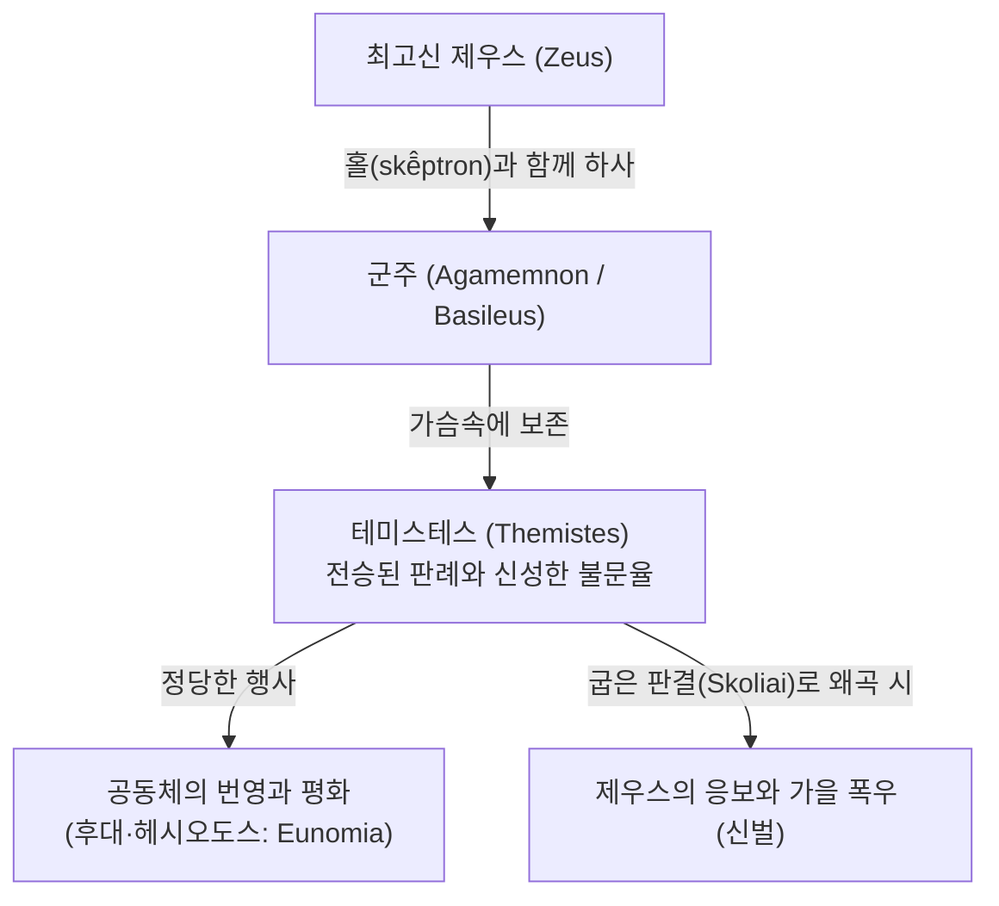

# 테미스 (Themis)

**[[greek-reading-guide|읽는 법]]**: 테미스 · **원어**: θέμις · **학술 전사**: *thémis*

## 1. 개념 정의 및 어원학적 기원

**테미스**(θέμις, *thémis*; 복수형 θέμιστες, *thémistes*; 관용 라틴명 Themis)는 호메로스 서사시에서 최고신 [[entity-zeus|제우스]]가 군주([[entity-agamemnon|아가멤논]])에게 홀(*skē̂ptron*)과 함께 하사하여 지키게 한 **신성한 선례·불문율의 총체**, 가문([[concept-oikos|오이코스]])과 혈연 공동체의 질서를 규율하는 제도 어휘로 읽히는 말이다. 벤베니스트는 이를 분석적으로 ‘**씨족 내부법**’(Droit familial)이라 정식화했으나, 서사시 속 공적 테미스테스(아고라·왕홀)는 그 모형만으로 총체화되지 않는다 ([[benveniste-1969-vocabulaire-institutions-2|Benveniste 1969]], II, pp. 99–105). 본 항목의 초점은 후대 의인화 여신 Themis가 아니라 **제도·어휘로서의 θέμις / θέμιστες**이다.

- **인도유럽어 어원학**:
  - 인도유럽 조어(PIE) 어근 `*dʰē-`("놓다", "창조적으로 정립하다", "세우다")에서 유래합니다.
  - 여성 *-i-* 어간 명사로, 사격(oblique cases)에서 치음 *-t-*가 삽입되는 독특한 곡용(단수 속격 *thémistos*, 복수 주격 *thémistes*)을 보존합니다. 주춧돌·기초를 뜻하는 테메틀라(θέμεθλα, *thémethla*; 중성 복수) 및 제도적 법령인 테스모스(θεσμός, *thesmós*)는 동일 `*dʰē-` 계열의 동원어이지, 테미스 자체의 성·어간을 중성으로 만드는 증거가 아닙니다.
  - 비교언어학적 대응형:
    - 산스크리트어 다만(*dhā́man-*, 중성): 신적 의지에 의해 정립된 '거처'이자 미트라-바루나가 수호하는 가문·제의의 '신성한 규범'. 어근 대응이지 테미스와 동일한 성·어간이 아닙니다.
    - 아베스타어 다미(*dāmi-*): 세상의 질서를 창조적으로 정립한 '창조자'.
- **우주적 질서(*ar-)와의 분리와 독자적 사법화**:
  - 인도유럽어에서 조화롭게 맞물린 전체 질서를 뜻하는 어근 `*ar-`는 인도-이란어에서 우주적 진리인 베다 르타(*Ṛtá-*), 아베스타 아르타(*Arta- / Aša-*) 및 라틴어 리투스(*ritus*, 제의)를 낳았습니다.
  - 그러나 그리스어에서는 `*ar-` 어근(형용사 *artios*, 동사 *arariskō*)이 구체적인 실정 사법 어휘로 발전하지 못했습니다. 그리스인들은 신이 인간 사회의 기초로서 존재 안으로 확립해 놓은 정립적 규범을 가리키기 위해 `*dʰē-` 어근에서 파생된 **테미스**(thémis)를 중심 사법 어휘로 채택하였습니다.

| 어휘 (원어) | 학술 전사 | 품사 및 형태론 | 의미 및 제도적 맥락 |
|:---|:---|:---|:---|
| **thémis** (θέμις) | *thémis* | 여성 *-i-* 어간 명사 (단수 주격) | 신들이 정립한 불문율, 가문·공동체 규범, 신성한 당위 |
| **thémistos** (θέμιστος) | *thémistos* | 명사 단수 속격 | 테미스의 (고졸기 치음 t-곡용 보존) |
| **thémistes** (θέμιστες) | *thémistes* | 명사 복수 주격/대격 | 왕이 신들로부터 전수받아 보존하는 판례·규범의 총체 |
| **athemístōn** (ἀθεμίστων) | *athemístōn* | 복합 형용사 속격 복수 (*Od.* 9.106 좌소형; 표제어 주격 ἀθέμιστοι / *athémistoi*) | 테미스테스도 아고라도 결여된 상태를 가리키는 수식 (*athemistos*) |
| **themistós** (θεμιστός) | *themistós* | 형용사 (후대·파생; 호메로스 핵심 목록 외) | 관습법에 합당한, 올바른 규범에 따른 |

---

## 2. 테미스의 본질: 벤베니스트의 Droit familial과 서사시 증거

에밀 벤베니스트([[benveniste-1969-vocabulaire-institutions-2|Benveniste 1969]])는 테미스를 막연한 '신의 법'으로 치부하던 기존 학설을 쇄신하여, 테미스의 원초적 성격을 혈연 공동체·가문 내부를 규율하는 법(**Droit familial**)으로 정식화하였습니다. 아래 용례는 그 분석틀을 검증·한정하는 서사시 증거이며, 단수 *thémis*(당위·원리), 복수 *thémistes*(전승 판례), 홀(*skē̂ptron*), 환대([[concept-xenia|크세니아]])는 절 경계로 구분합니다.

### (1) 키클롭스 사회: 공유 아고라·테미스테스의 부재
*오뒷세이아* 제9권 106–115행에서 호메로스는 키클롭스 사회를 묘사할 때 테미스 관련 어휘를 판별 기준으로 사용합니다:
- 키클롭스는 **ὑπερφιάλων ἀθεμίστων**(*hyperphiálōn athemístōn*, *Od.* 9.106; 표제어 주격 ἀθέμιστοι / *athémistoi*)으로 수식됩니다.
- 그들에게는 공동의 의견을 모으는 아고라도 없고, 조상 대대로 전승되는 관습법인 테미스테스(*thémistes*)도 없습니다(*Od.* 9.112).
- **번역**: 「의회를 여는 아고라도 없고 테미스테스도 없다」
- **원문**: οὔτ' ἀγοραὶ βουληφόροι οὔτε θέμιστες
- **학술 전사**: *oút' agoraì boulēphóroi oúte thémistes*
- 각자가 자기 처자식에게만 제멋대로 규범을 행할 뿐(**테미스튜에이**, θεμιστεύει, *themisteúei*) 상호 간 공유 규범을 갖지 못합니다.
- 벤베니스트·서사시 증거가 보여 주는 바는 **공유 아고라와 테미스테스의 부재**이지, 테미스가 가부장 가구의 사적 권위에서 ‘기원’했다는 발생사적 추론이 아닙니다.

### (2) 환대(크세니아)와 단수 테미스
*오뒷세이아* 제14권 56–60행에서 충직한 돼지치기 [[entity-eumaeus|에우마이오스]]는 거지 차림으로 찾아온 낯선 나그네([[entity-odysseus|오뒷세우스]])를 맞이하며 선언합니다:
- **번역**: 「이방인이여, 비록 그대보다 더 비천한 자가 오더라도 나그네를 모욕하는 것은 내게 테미스가 허락하지 않소. 모든 나그네와 거지는 제우스에게서 오기 때문이오.」
- **원문**: οὔ μοι θέμις ἔστ'
- **학술 전사**: *ou moí thémis ést'*
- 에우마이오스는 집안으로 들어온 나그네를 환대([[concept-xenia|크세니아]])하는 것이 제우스가 정립한 거룩한 규범(*thémis*)임을 밝힌 뒤, 곧이어 노예들의 처지를 대조합니다.
  - **번역**: 「새 주인 밑에서 늘 두려움에 떠는 것, 이것이 노예들의 디케요.」
  - **원문**: δίκη δμώων
  - **학술 전사**: *díkē dmṓōn*
- 여기서 δίκη δμώων은 **노예의 방식·처지**를 가리키는 대조일 뿐, 씨족 간 대외 사법으로서의 디케를 가문 안으로 투사한 것이 아닙니다. 손님을 오이코스 안으로 받아들여 안전을 보장하는 층위는 테미스([[concept-xenia|크세니아]]와 중첩), 신분·처지의 정식화는 디케([[concept-dike|디케 (Dike)]])의 별도 층위로 둡니다.

### (3) 정형구 *ou thémis*: 무구 오염의 불허
*일리아스* 제16권 796–798행에서 [[entity-patroclus|파트로클로스]]가 [[entity-apollo|아폴론]]의 일격을 받아 [[entity-achilles|아킬레우스]]의 청동 투구가 먼지 속에 나뒹굴 때, 시인은 말합니다:
- **번역**: 「이전에는 이 말총 달린 투구가 흙먼지 속에 더럽혀지는 것이 결코 허락되지 않았다.」
- **원문**: οὐ θέμις ἦεν
- **학술 전사**: *ou thémis ē̂en*
- 이 구절의 *ou thémis*는 신적 혈통·가족법의 독립 입증이라기보다, 영웅 무구의 오염을 막는 정형적 **불허·당위 부정** 용법에 가깝습니다. 아킬레우스의 신적 연관은 장면의 비감(悲感)을 높이나, 테미스 개념의 본질 정의로 과독하지 않습니다.

---

## 3. 테미스테스(Themistes)와 왕홀(*skē̂ptron*)의 지배권

서사시에서 테미스는 단수형으로 쓰일 때는 '신성한 당위이자 원리'를 가리키지만, 복수형 **테미스테스**(θέμιστες, *thémistes*)로 쓰일 때는 제우스가 군주에게 위탁한 ‘**판례와 통치 규범의 총체**’를 가리킵니다. 홀(*skē̂ptron*)은 그 위탁을 가시화하는 권위의 표지입니다.

### (1) 제우스의 홀과 왕의 책무
- *일리아스* 제9권 97–99행에서 [[entity-nestor|네스토르]]는 최고 사령관 아가멤논을 향해 왕권의 본질을 천명합니다:
  - **번역**: 「그대는 수많은 군대를 지배하는 왕이며, 제우스께서는 그대에게 홀과 테미스테스를 맡기셨으니, 그대가 백성들을 위해 올바르게 숙고하도록 하심입니다.」
  - **원문**: Ζεὺς ἐγγυάλιξε σκῆπτρόν τ' ἠδὲ θέμιστας
  - **학술 전사**: *Zeùs enguálixe skē̂ptrón t' ēdè thémistas*
  - 왕은 새로운 법을 임의로 만들어내는 입법자가 아닙니다. 왕은 제우스로부터 전수받은 신성한 판례들(*thémistes*)을 가슴속에 보존하고 적재적소에 올바르게 적용하는 파수꾼입니다.

### (2) 굽은 판결에 대한 제우스의 우주적 신벌
인간 군주가 사리사욕이나 폭력(비에, *biē*)에 굴복하여 테미스테스를 왜곡할 때, 제우스는 우주적 자연재해를 통해 그 공동체 전체를 응징합니다:
- *일리아스* 제16권 384–393행: 제우스는 아고라에서 폭력으로 굽은 판결을 선고하고, 신들의 감시를 무시하며 디케를 쫓아낸 인간들에게 격노하여 거센 가을 폭우를 쏟아붓습니다.
  - **번역**: 「굽은 테미스테스를 (판결하여)」
  - **원문**: σκολιὰς θέμιστας
  - **학술 전사**: *skoliàs thémistas*
- 이 비유는 테미스테스 왜곡과 공동체·자연 질서 붕괴의 연관에 대한 서사시 내 증거로 읽힙니다 ([[lloyd-jones-1971-justice-of-zeus|Lloyd-Jones 1971]], pp. 1–9). 로이드-존스가 여기서 겨루는 상대(Dodds / Adkins 등)는 주로 **디케 연속성·도덕 신학** 논쟁이며, 테미스의 인도유럽 어원 논증과는 층위를 달리합니다.

---

## 4. 테미스(Themis) 대 디케(Dike)의 이원성 비교

> [!WARNING] 모순/이설 발견
> 벤베니스트의 Droit familial(테미스) / Droit interfamilial(디케) 대비는 유용한 분석 모형이다. 그러나 공적 테미스테스—홀 맹세(Il. 1.238–239), 왕에게 위탁된 홀·테미스테스(Il. 9.98–99), 아고라의 굽은 판결·폭우 비유(Il. 16.384–393)—는 「순수 씨족 내부법」으로의 총체화를 스스로 제한한다. 절대 존재론으로 읽지 말 것. 단수 thémis / 복수 thémistes / skē̂ptron / 환대(xenia) 맥락을 혼동하지 말 것.

에밀 벤베니스트가 정립한 두 사법 개념의 공간적·제도적 대비(분석틀)는 다음과 같습니다:

| 비교 범주 | 테미스 (Themis / Themistes) | 디케 (Dikē / Dikai) |
|:---|:---|:---|
| **어원적 근원** | `*dʰē-` (창조적으로 정립하다, 반석 위에 놓다) | `*deik-` (가리키다, 말로써 보여주다) |
| **사회공간적 관할** (벤베니스트) | **씨족 내부법**(Droit familial) | **씨족 간 대외 사법**(Droit interfamilial) |
| **적용 범위** | 게노스, 오이코스, 왕과 백성의 일체적 공동체 (및 서사시 속 공적 테미스테스) | 상이한 가문·부족 간의 경계 분쟁, 살인 배상금(*poinē*) |
| **규범의 성격** | 신들이 양심과 전통 속에 심어준 영속적 선례 | 갈등 국면에서 재판관이 그어주는 올곧은 판결 선 |
| **집행 주체** | 홀(*skē̂ptron*)을 쥔 바실레우스(basileus) | 판례 정형구를 낭독하는 디카스폴로스(dikaspolos) |
| **왜곡의 형태** | 굽은 판결 (*skoliaì thémistes*) | 디케의 추방 및 폭력에 의한 침탈 |
| **라틴어 대응형** | 파스 (*fas*, 신들의 비인칭적 허용 선언) | 이우스 (*ius*, 절차적 구두 사법 정형구) |

---

## 5. 호메로스 서사시 핵심 용례 분석표

| 서명 및 행 번호 | 화자 및 상황 | 원어 인용구 | 학술 전사 | 학술적 의의 및 벤베니스트 테제 |
|:---|:---|:---|:---|:---|
| *Il.* 1.238–239 | 아킬레우스 (홀 맹세) | δικασπόλοι, οἵ τε θέμιστας πρὸς Διὸς εἰρύαται | *dikaspóloi, hoí te thémistas pròs Diòs eirúatai* | 디카스폴로스들이 제우스로부터 전수받은 테미스테스를 수호함을 명시 (공적 테미스테스) |
| *Il.* 9.98–99 | 네스토르 (아가멤논 앞) | Ζεὺς ἐγγυάλιξε σκῆπτρόν τ' ἠδὲ θέμιστας | *Zeùs enguálixe skē̂ptrón t' ēdè thémistas* | 왕홀(*skē̂ptron*)과 테미스테스가 제우스가 왕에게 위탁한 주권의 쌍을 이룸 |
| *Il.* 16.387 | 시인 (폭우 비유) | σκολιὰς κρίνωσι θέμιστας | *skoliàs krínōsi thémistas* | 사익과 폭력으로 테미스테스를 굽게 판결할 때 임하는 우주적 제우스 신벌 |
| *Od.* 9.106 | 시인 (키클롭스 묘사) | ὑπερφιάλων ἀθεμίστων | *hyperphiálōn athemístōn* | 좌소 속격 복수; 공유 규범 부재의 수식 (주격 ἀθέμιστοι는 표제어) |
| *Od.* 9.112 | 시인 (키클롭스 묘사) | οὔτ' ἀγοραὶ βουληφόροι οὔτε θέμιστες | *oút' agoraì boulēphóroi oúte thémistes* | 아고라와 테미스테스의 결여가 문명/야만 판별의 척도 |
| *Od.* 14.56 | 에우마이오스 (환대) | οὔ μοι θέμις ἔστ' | *ou moí thémis ést'* | 나그네 영접이 신성한 당위(*thémis*)임을 천명 (γάρ 유입형 배제) |

---

## 관련 항목

- [[concept-dike|디케 (Dike)]]
- [[concept-geras|게라스 (Geras)]]
- [[concept-xenia|크세니아 (Xenia)]]
- [[concept-time|티메 (Timē)]]
- [[concept-horkos|호르코스 (Horkos)]]
- [[concept-oikos|오이코스 (Oikos)]]
- [[entity-agamemnon|아가멤논]]
- [[entity-achilles|아킬레우스]]
- [[entity-odysseus|오뒷세우스]]
- [[benveniste-1969-vocabulaire-institutions-2|에밀 벤베니스트 (1969), 인도유럽 제도 어휘집 2]]
- [[lloyd-jones-1971-justice-of-zeus|휴 로이드-존스 (1971), 제우스의 정의]]
