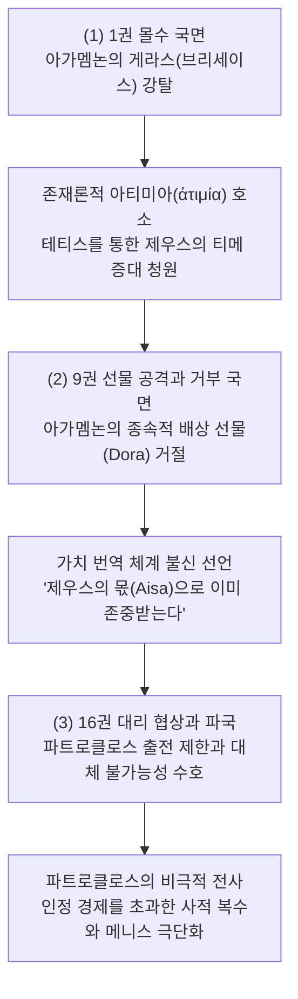
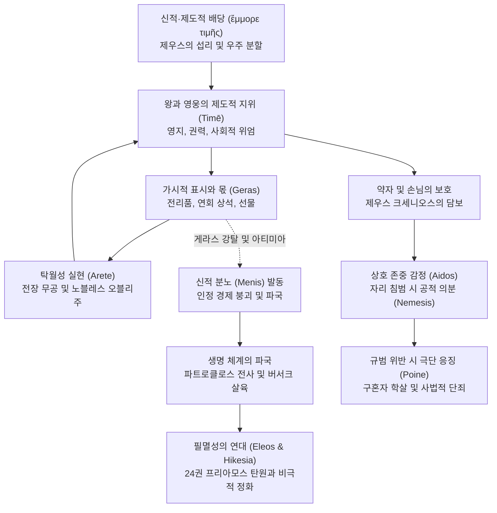

# 티메 (Time)

**[[greek-reading-guide|읽는 법]]**: 티메 · **원어**: τιμή · **학술 전사**: *timḗ*

## 1. 개념 정의 및 어원학적 기원

**티메** (τιμή, *timḗ*; 관용 라틴명 Time)는 호메로스 서사시와 고대 그리스 문화 전반을 관통하는 핵심 가치 제도로, 근대적 의미의 주관적 자긍심이나 내면적 명예에 국한되지 않고 **신적 질서와 공동체 관습 속에서 각 존재에게 배당된 고유한 사회적 자리, 직분, 자격 및 이를 가시적으로 증명하는 물질적·의례적 보상 체계**를 포괄하는 다층적 시스템입니다.

- **어원학(Etymology) 및 의미소의 발전**:
  - 인도유럽조어(PIE) 어근 `*kwey-`('주의 깊게 보다', '헤아리다', '값을 매기다')에서 유래합니다. 이는 대상을 관찰하고 정량적으로 측정하는 객관적 평가의 시선을 원형으로 지닙니다.
  - 슬라브어파와 발트어파에서 '세다', '읽다', '생각하다' 등으로 분화된 것과 궤를 같이하며, 고대 그리스어에서는 동사 **티오**(τίω, *tíō*, 값을 매기다 / 존중하다)를 핵심 축으로 삼아 '시선-평가-값'이 통합된 행위로 발전했습니다.
  - 『일리아스』 23권의 파트로클로스 장례 경기에서 아킬레우스가 상으로 제시한 놋쇠 솥을 군중이 소 12마리의 가치로, 여인을 소 4마리의 가치로 평가하는 장면(_Il._ 23.700–705)은 물건과 사람에 객관적 값을 매기는 시선과 평가의 원형적 단계를 보여줍니다.
- **Vleminck(1982)의 5단계 환유 연쇄 모델**:
  - 세르주 블레맹크(Serge Vleminck)는 티메가 고립된 명사가 아니라 티오 어군의 역사적 환유(Metonymy) 과정을 통해 형성된 제도적 지위임을 규명했습니다:
    1. **시선과 정량적 평가 (Évaluer)**: 대상의 가치를 눈으로 확인하고 값을 매김 (동사 *tíō* / *tîon*).
    2. **존중의 태도 (Respecter)**: 평가 메커니즘이 인격체로 확장되어 신적 질서와 탁월성을 인정함 (_Od._ 14.83–84).
    3. **가시적 표시와 선물 (Sign/Gift)**: 추상적 존중이 연회의 상석, 고기, 잔, 전리품 선물([[concept-geras|Geras]]), 영지([[concept-temenos|Temenos]]) 등 물질적 재화로 물화(物化)됨 (_Il._ 23.615–649 네스토르의 잔 수여).
    4. **특권의 획득 (Privilège)**: 가시적 표시를 수령할 수 있는 제도적 권리와 우선권.
    5. **직분과 우주적 배당 질서 (Charge/Statut)**: 표시와 특권을 부여하는 신성한 지위, 나아가 신들이 분할한 우주적 자격 그 자체 (_Il._ 15.185–195, 17.248–251).
- **보상 및 응징 어휘와의 구별**:
  - 동사 티노(τίνω, *tínō*, 갚다/배상하다), 아포티노(ἀποτίνω) 및 명사 **티시스**([[concept-tisis|Tisis]], τίσις, 보복/응징), **포이네**([[concept-poine|Poine]], ποινή, 피의 대가)는 어원적으로 장모음·후두음 확장을 공유하는 티오/티메 어군과 구분되는 별개의 기원을 지닙니다. 그러나 가치 침해에 대한 보상 및 응징의 맥락에서 티메와 밀접하게 상호작용하며 후대 고대 그리스 법률·윤리 어휘의 기초를 형성합니다.
- **아리스토텔레스의 수사학적 정의**:
  - 아리스토텔레스는 『수사학』(*Rhetorica* 1361a)에서 티메를 "은혜를 베풀 수 있는 평판의 표시"로 정의했습니다. 그는 가장 정당하게 존중받는 자는 실제로 은혜를 베푼 자이지만, 은혜를 베풀 능력만 있는 자 역시 존중받는다고 갈파했습니다. 호메로스 서사시에서 왕이 쥐고 있는 왕홀(σκῆπτρον, *skē̂ptron*)은 바로 이 권능의 가시적 표시이며, 전장에서의 당일 무공과 별개로 존중받을 수 있는 제도적 근거가 됩니다.

### 핵심 형태론 및 어군 대조표

| 그리스어 실제형 | 학술 전사 | 표제형 및 형태론 | 한국어 풀이 | 문헌학적 맥락 및 근거 |
|:---|:---|:---|:---|:---|
| `τιμή` | *timḗ* | τιμή, 여성 주격 단수 | 티메, 사회적 자리, 직분, 가시적 명예 | 신적 배당 및 전사의 위엄 (*Il.* 1.159, 15.189) |
| `τίω` / `τῖον` | *tíō* / *tîon* | τίω, 직설법 미완료 3인칭 복수 | 값을 매기다, 헤아리다, 존중하다 | 놋쇠 솥과 여인의 가치 평가 (*Il.* 23.703, *Od.* 14.84) |
| `τετιμήμεσθα` | *tetimḗmestha* | τιμάω, 직설법 완료 수동 1인칭 복수 | (공동체로부터) 이미 존중받고 있다 | 사르페돈의 노블레스 오블리주 (*Il.* 12.310) |
| `ἀτιμάω` / `ἠτίμησεν` | *atimáō* / *ētímēsen* | ἀτιμάω, 직설법 부정과거 3인칭 단수 | 자리를 빼앗다, 몫을 박탈하다, 모욕하다 | 아가멤논의 크리세스·아킬레우스 모욕 (*Il.* 1.11, 1.356) |
| `ἄτιμος` / `ἀτίμητος` | *átimos* / *atī́mētos* | ἄτιμος / ἀτίμητος, 형용사 남성 주격 단수 | 티메를 박탈당한 자, 권리 없는 자 | 아킬레우스의 실존적 배제 비유 (*Il.* 1.171, 9.648) |
| `ἔμμορε τιμῆς` | *émmore timē̂s* | μείρομαι + τιμή 속격 (정형구) | 티메의 몫을 받았다 (배당받다) | 왕과 신의 신성한 사전 배당 (*Il.* 1.278–279, 15.189) |

---

## 2. 호메로스 본문에서의 용례와 작동 영역

### 2.1 『일리아스』의 용례: 인정 경제의 파국과 3단계 변동

『일리아스』는 군주와 영웅들 사이에서 티메의 가치 번역 체계가 붕괴하고 재편되는 인정 경제(Economy of Recognition)의 비극적 파국을 다룹니다 ([[lee-junseok-2024-iliad-jeongam|이준석 2024]]).

- **1단계: 아가멤논의 게라스 몰수와 존재론적 아티미아 (1권)**
  - 아가멤논은 사제 크리세스에게 딸을 돌려주어야 하는 상황에 직면하자, 군주로서의 위엄 상실을 두려워한 나머지 아킬레우스에게 배당되었던 전리품([[concept-geras|Geras]]) 브리세이스를 강탈합니다. 이는 군주의 과잉 권력([[concept-hybris|Hybris]])에 의한 침해입니다.
  - 아킬레우스는 이를 단순한 재산 손실이 아니라 단명할 운명에 대한 유일한 보상인 신적 티메의 박탈로 규정합니다.
  - 어머니 [[entity-thetis|테티스]]는 [[entity-zeus|제우스]]에게 나아가 아들의 티메를 보장하고 드높여 줄 것(_Il._ 1.510)을 청원합니다. 아카이아 군대가 패배하여 아킬레우스의 대체 불가능성이 입증될 때 비로소 최고의 경의가 바쳐진다는 우주적 소송입니다.
    - **번역**: "어머니, 당신께서 저를 단명할 운명으로 낳으셨을진대, 높은 곳에서 번개를 치시는 올림포스의 제우스께서는 마땅히 제 손에 명예(티메)를 쥐여 주셨어야 했습니다. 그러나 지금 그는 저를 조금도 존중하지 않으시니, 아트레우스의 아들 넓은 통치자 아가멤논이 제 명예를 짓밟고 친히 제 몫(게라스)을 빼앗아 차지했기 때문입니다."
    - **원문**: *μῆτερ ἐπεί γ’ ἔτεκές γε μινυνθάδιόν περ ἐόντα, / τιμήν πέρ μοι ὄφελλεν Ὀλύμπιος ἐγγυαλίξαι / Ζεὺς ὑψιβρεμέτης· νῦν δ’ οὐδέ με τυτθὸν ἔτισεν· / ἦ γάρ μ’ Ἀτρεΐδης εὐρὺ κρείων Ἀγαμέμνων / ἠτίμησεν· ἑλὼν γὰρ ἔχει γέρας αὐτὸς ἀπούρας.*
    - **학술 전사**: *mêter epeí g’ étekés ge minunthádión per eónta, / timḗn pér moi óphellen Olúmpios eggualíksai / Zeùs hupsibremétēs; nûn d’ oudé me tutthòn étisen; / ē̂ gár m’ Atreḯdēs eurù kreíōn Agamémnōn / ētímēsen; helṑn gàr ékhei géras autòs apoúras.* (_Il._ 1.352–356)
- **2단계: 9권 아가멤논의 '선물 공격' 거부와 가치 번역 체계 불신**
  - 패전에 직면한 아가멤논은 막대한 삼각대, 금, 준마, 7명의 여인과 브리세이스, 딸과의 혼약 및 영지를 제시합니다. 그러나 이 선물은 대등한 화해가 아니라 수령자를 하위 종속자로 편입시키는 '선물 공격(Gift-Attack)'의 성격을 띱니다 ([[van-wees-1992-status-warriors|van Wees 1992]]).
  - 아킬레우스는 "겁쟁이나 용자나 똑같은 티메를 받는다"며 전사 사회의 물질적 가치 번역 체계 자체가 붕괴했음을 선언합니다.
  - 인간 사회의 가시적 표시를 거부한 아킬레우스는 초월적 배당 질서로 상소합니다.
    - **번역**: "머물러 있는 자에게도 같은 몫이 돌아오고, 격렬하게 싸운 자에게도 마찬가지로다. 겁쟁이나 용자나 똑같은 명예(티메)로 대우받으며, 아무 일도 하지 않은 자나 많은 공적을 세운 자나 똑같이 죽음에 이르는도다."
    - **원문**: *ἴση μοῖρα μένοντι, καὶ εἰ μάλα τις πολεμίζοι· / ἐν ἰῇ δὲ τιμῇ ἠμὲν κακὸς ἠδὲ καὶ ἐσθλός· / κάτθαν’ ὁμῶς ὅ τ’ ἀεργὸς ἀνὴρ ὅ τε πολλὰ ἐοργώς.*
    - **학술 전사**: *ísē moîra ménonti, kaì ei mála tis polemízoi; / en iē̂i dè timē̂i ēmèn kakòs ēdè kaì esthlós; / kátthan’ homō̂s hó t’ aergòs anḕr hó te pollà eorgṓs.* (_Il._ 9.318–320)
    - **번역**: "포이닉스 노인이여, 제우스께서 기르신 아버지여, 내게는 그런 명예(티메)가 필요 없습니다. 나는 제우스의 배당(아이사)에 의해 이미 존중받고 있다고 생각하며, 그것이 이 굽은 배들 곁에 숨이 내 가슴에 머물고 무릎이 움직이는 한 나를 붙들어 줄 것입니다."
    - **원문**: *Φοῖνιξ ἄττα γεραιὲ διοτρεφές, οὔ τί με ταύτης / χρεὼ τιμῆς· φρονέω δὲ τετιμῆσθαι Διὸς αἴσῃ, / ἥ μ’ ἕξει παρὰ νηυσὶ κορωνίσιν, εἰς ὅ κ’ ἀϋτμὴ / ἐν στήθεσσι μένῃ καί μοι φίλα γούνατ’ ὀρώρῃ.*
    - **학술 전사**: *Phoîniks átta geraiè diotrephés, oú tí me taútēs / khreṑ timē̂s; phronéō dè tetimē̂sthai Diòs aísēi, / hḗ m’ héksei parà nēusì korōnísin, eis hó k’ aütmḕ / en stḗthessi ménēi kaí moi phíla goúnat’ orṓrēi.* (_Il._ 9.607–610)
- **3단계: 16권 대체 불가능성의 협상과 파트로클로스의 비극적 죽음**
  - 아킬레우스는 [[entity-patroklos|파트로클로스]]를 대신 출전시키며 엄격한 한계선을 설정합니다. 홀로 트로이아를 함락하여 자신을 더욱 자격 없는 자(`ἀ티모테론`, *atimóteron*)로 만들지 말라는 경고는 인정 경제에서의 대체 불가능성을 지키기 위한 장치입니다.
  - 목표는 파트로클로스가 가져오는 승리의 광채([[concept-kydos|Kydos]])를 바탕으로 자신의 위대한 티메(`τιμὴν μεγάλην`, *timḕn megálēn*)를 확보하는 것입니다 (_Il._ 16.84–90). 그러나 이 인정 경제의 도구적 운용은 가장 소중한 전우의 전사라는 생명 체계의 파국으로 귀결됩니다.

### 2.2 『오뒷세이아』의 용례: 일상적 집행, 위장, 그리고 포이네로의 이행

『오뒷세이아』에서 티메의 위기는 전리품 분배가 아니라 가내 공간([[concept-oikos|Oikos]]) 및 환대([[concept-xenia|Xenia]]) 규범의 침탈 형태로 전개됩니다.

- **오이코스 침탈 및 구혼자들의 약자 모욕**:
  - 구혼자들은 오디세우스의 가산을 탕진하는 데 그치지 않고, [[entity-telemachos|텔레마코스]]의 상속권을 침해하며 집안의 하인과 나그네를 체계적으로 모욕(ἀτιμάζω)합니다.
- **거지 위장과 에우마이오스의 일상적 환대 집행 (14권)**:
  - [[entity-odysseus|오디세우스]]는 왕의 가시적 표시를 모두 벗어던지고 거지 누더기를 걸친 채 귀환하여, 표시가 없는 약자의 티메를 다루는 귀족 사회의 도덕성을 시험합니다.
  - 돼지치기 [[entity-eumaeus|에우마이오스]]는 남루한 거지 앞에서도 제우스의 손님법에 따라 고기, 빵, 잠자리를 제공하며 일상적 티메를 성실히 집행합니다 (_Od._ 14.56–58). 약자의 티메는 인간적 탁월성이 아니라 **[[entity-zeus-xenios|Zeus Xenios]]**와 **[[entity-zeus-hikesios|Zeus Hikesios]]**가 보증인(ἐπιτιμήτωρ, *epitimḗtōr*)으로 개입하기 때문에 성립합니다.
- **배상 거부와 피의 복수 포이네 (22권)**:
  - 오디세우스의 정체가 드러나자 구혼자 에우리마코스는 소비한 재물에 대한 20배의 변상(ἀποτίνω)과 청동·금을 바치겠다며 티메의 경제적 복원을 제안합니다 (_Od._ 22.55–60).
  - 그러나 오디세우스는 어떤 재화로도 침해된 가장과 왕의 티메가 보상될 수 없음을 선언하며 제안을 일축합니다. 자격 침해가 보상 한계를 초과했을 때, 교환과 배상의 티메 국면은 끝나고 유혈 응징인 포이네([[concept-poine|Poine]], ποινή)의 단독 지배로 넘어갑니다.

---

### 2.3 긴 원문과 실제형 대조

#### 사르페돈의 노블레스 오블리주 연설 (_Il._ 12.310–328)

리키아의 왕 [[entity-sarpedon|사르페돈]]이 전우 [[entity-glaukos|글라우코스]]에게 전하는 이 연설은 호메로스 사회에서 티메(특권)와 의무가 어떻게 완벽한 선순환적 계약 관계를 형성하는지를 보여주는 가장 표준적인 문헌학적 증거입니다.

- **12.310–314 (특권과 영지의 확인)**:
  - **번역**: "글라우코스여, 어찌하여 우리는 리키아에서 상석과 고기와 가득 찬 술잔으로 가장 큰 존중(티메)을 받으며, 모두가 우리를 신처럼 바라보는가? 어찌하여 우리는 크산토스 강가에 과수원과 밀을 심을 좋은 땅으로 이루어진 크고 아름다운 영지(테메노스)를 차지하고 있는가?"
  - **원문**: *Γλαῦκε τίη δὴ νῶϊ τετιμήμεσθα μάλιστα / ἕδρῃ τε κρέασίν τε ἰδὲ πλείοις δεπάεσσιν / ἐν Λυκίῃ, πάντες δὲ θεοὺς ὣς εἰσορόωσι, / καὶ τέμενος νεμόμεσθα μέγα Ξάνθοιο παρ’ ὄχθας / καλὸν φυταλιῆς καὶ ἀρούρης πυроφόроιο;*
  - **학술 전사**: *Glaûke tíē dḕ nō̂ï tetimḗmestha málista / hédrēi te kréasín te idè pleíois depáessin / en Lukíēi, pántes dè theoùs hṑs eisoróōsi, / kaì témenos nemómetha méga Ksánthoio par’ ókhthas / kalòn phutaliē̂s kaì aroúrēs purophóroio;*
- **12.315–321 (전장의 의무와 교환)**:
  - **번역**: "그러므로 우리는 마땅히 리키아인들의 최전선에 서서 뜨거운 전투에 맞서 싸워야 하리라. 그리하여 견고한 갑옷을 입은 리키아인 누군가가 이렇게 말하도록 해야 한다. '실로 리키아를 다스리는 우리 왕들은 명예 없는(아클레에스) 자들이 아니요, 살진 양과 꿀처럼 달콤한 최상의 포도주를 마시는구나. 그들에게는 훌륭한 무용(아레테) 또한 있으니, 리키아인들의 최전선에서 싸우기 때문이다.'"
  - **원문**: *τὼ χρὴ νῦν Λυκίοισι μέτα πρώτοισιν ἐόντας / ἑστάμεν ἠδὲ μάχης καυστείρης ἀνтиβολῆσαι, / ὄφρά τις ὧδ’ εἴπῃ Λυκίων πύκα θωρηκτάων· / ‘οὐ μὰν ἀκλεέες Λυκίην κάτα κοιρανέουσιν / ἡμέτεροι βασιλῆες, ἔδουσί τε πίονα μῆλα / οἶνόν τ’ ἔξαιτον μελιηδέα· ἀλλ’ ἄра καὶ ἲς / ἐσθλή, ἐπεὶ Λυκίοισι μέτα πρώτοισι μάχονται.’*
  - **학술 전사**: *tṑ khrḕ nûn Lukíoisi méta prṓtoisin eóntas / hestámen ēdè mákhēs kausteírēs antibolē̂sai, / óphrá tis hō̂d’ eípēi Lukíōn púka thōrēktáōn; / ‘ou màn akleées Lukíēn káta koiranéousin / hēméteroi basilē̂es, édousí te píona mêla / oînón t’ éksaiton meliēdéa; all’ ára kaì ìs / esthlḗ, epeì Lukíoisi méta prṓtoisi mákhontai.’*
- **12.322–328 (필멸성의 자각과 영광의 결단)**:
  - **번역**: "오 친구여, 만일 우리가 이 전쟁을 피하여 영원히 늙지도 않고 불사신이 될 수 있다면, 나 자신도 앞장서서 싸우지 않을 것이며 그대를 영광을 가져오는 전장으로 보내지도 않을 것이다. 그러나 죽음의 여신들이 수없이 우리를 둘러싸고 있어 필멸의 인간은 이를 피할 수도 달아날 수도 없으니, 나아가자! 누군가에게 영광을 안겨주든, 스스로 영광을 차지하든!"
  - **원문**: *ὦ πέπον εἰ μὲν γὰρ πόλεμον περὶ τόνδε φυγόντε / αἰεὶ δὴ μέλλοιμεν ἀγήρω τ’ ἀθανάτω τε / ἔσσεσθ’, οὔτε κεν αὐτὸς ἐνὶ πρώτοισι μαχοίμην / οὔτε κέ σε στέλλοιμι μάχην ἐς κυδιάνειραν· / νῦν δ’ ἔμπης γὰρ κῆρες ἐφεστᾶσιν θανάτοιο / μυρίαι, ἃς οὐκ ἔστι φυγεῖν βροτὸν οὐδ’ ὑπαλύξαι, / ἴομεν ἠέ τῳ εὖχος ὀρέξομεν ἠέ τις ἡμῖν.*
  - **학술 전사**: *ō̂ pépon ei mèn gàr pólemon perì tónde phugónte / aieì dḕ mélloimen agḗrō t’ athanátō te / éssesth’, oúte ken autòs enì prṓtoisi makhoímēn / oúte ké se stélloimi mákhēn es kudiáneiran; / nûn d’ émpēs gàr kêres ephestâsin thanátoio / muríai, hàs ouk ésti phugeîn brotòn oud’ hupalúksai, / íomen ēé tōi eûkhos oréksomen ēé tis hēmîn.*

---

#### 올림포스 3형제 신들의 우주 분할과 호모티모스 선언 (_Il._ 15.185–195)

신들의 티메 분할은 인간 사회 제도와 왕권 배당의 원형이자 형이상학적 바닥을 이룹니다.

- **15.185–195 (제비뽑기와 대등한 위엄 선언)**:
  - **번역**: "아아, 제우스가 아무리 강하다 할지라도 이것은 너무 지나친 말이로다. 나와 대등한 명예(호모티모스)를 지닌 나를 그가 힘으로 억누르려 하다니! 우리는 크로노스가 낳고 레아가 낳은 삼형제이니, 제우스와 나, 그리고 망자들을 다스리는 하데스가 셋째다. 만물은 셋으로 나뉘었고 저마다 명예의 몫(티메)을 받았도다. 제비를 뽑았을 때 나는 잿빛 바다에 영원히 살 운명을 얻었고, 하데스는 캄캄한 어둠을 얻었으며, 제우스는 창공의 에테르와 구름을 얻었도다. 그러나 대지와 높은 올림포스는 우리 셋 모두의 공동의 몫으로 남았느니라. 그러므로 나는 결코 제우스의 뜻대로 살지 않으리라. 그가 아무리 강할지라도 그는 자신의 셋째 몫에 만족하며 조용히 머물러야 하리라."
  - **원문**: *ὢ πόποι ἦ ῥ’ ἀγαθός περ ἐὼν ὑπέροπλον ἔειπεν, / εἴ μ’ ὁμότιμον ἐόντα βίῃ ἀέκοντα καθέξει. / τρεῖς γάρ τ’ ἐκ Κρόνου εἰμὲν ἀδελφεοί, οὓς τέκετο Ῥέα, / Ζεὺς καὶ ἐγώ, τρίτατος δ’ Ἀΐδης, ἐνέροισιν ἀνάσσων· / τριχθὰ δὲ πάντα δέδασται, ἕκαστος δ’ ἔμμορε τιμῆς· / ἤτοι ἐγὼν ἔλαχον πολιὴν ἅλα ναιέμεν αἰεὶ / παλλομένων, Ἀΐδης δ’ ἔλαχε ζόφον ἠερόεντα, / Ζεὺς δ’ ἔλαχ’ οὐρανὸν εὐρὺν ἐν αἰθέρι καὶ νεφέλῃσι· / γαῖα δ’ ἔτι ξυνὴ πάντων καὶ μακρὸς Ὄλυμπος. / τὼ ῥα καὶ οὔ τι Διὸς βουλαῖς ἐπιπείσομαι, ἀλλὰ ἕκηλος / καὶ κρατερός περ ἐὼν μενέτω τριτάτῃ ἐνὶ μοίρῃ.*
  - **학술 전사**: *ṑ pópoi ē̂ rh’ agathós per eṑn hupéroplon éeipen, / eí m’ homótimon eónta bíēi aékonta kathéksei. / treîs gár t’ ek Krónou eimèn adelpheoí, hoùs téketo Rhéa, / Zeùs kaì egṓ, trítatos d’ Aḯdēs, enéroisin anássōn; / trikhthà dè pánta dédastai, hékastos d’ émmore timē̂s; / ḗtoi egṑn élakhon poliḕn hála naiémen aieì / palloménōn, Aḯdēs d’ élakhe zóphon ēeróenta, / Zeùs d’ élakh’ ouranòn eurùn en aithéri kaì nephélēisi; / gaîa d’ éti ksunḕ pántōn kaì makròs Ólumpos. / tṑ rha kaì oú ti Diòs boulaîs epipeísomai, allà hékēlos / kaì kraterós per eṑn menétō tritátēi enì moírēi.*

---

## 3. 의미 범위와 정형적 결합

### 3.1 Finkelberg(1998)의 `ἔμμορε τιμῆς` 정형구 분석

마르갈리트 핑켈버그(Margalit Finkelberg)는 호메로스 서사시의 고유한 정형 표현인 **`ἔμμορε τιμῆς`**("티메의 몫을 받았다")를 정밀 분석하여, 티메가 개인의 경쟁적 쟁취 이전에 존재하는 **분배적(Distributive) 가치**임을 논증했습니다.

- **결합 동사의 제한성**: 동사 메이로마이(μείρομαι, *meíromai*, 몫을 배당받다)의 완료형인 `ἔμμορε`는 오직 티메와만 결합합니다.
- **적용 대상의 협소성**: 이 정형구는 인간 왕(_Il._ 1.278–279), 올림포스 3형제 신(_Il._ 15.189), 바다의 여신 이노(_Od._ 5.335), 파이아케스 귀족(_Od._ 11.338) 등 신적·제도적 특권을 부여받은 존재에게만 배타적으로 적용됩니다.
- **아레테와의 분리**: 네스토르가 아킬레우스에게 왕홀을 든 군주의 우위를 상기시키는 장면(_Il._ 1.278–279)은 아가멤논이 더 용감해서가 아니라 제우스가 왕홀을 든 군주에게 다른 몫을 배당했기 때문입니다. 아레테는 탁월성의 실현이며, 티메는 그 탁월성과 항상 일치하지 않는 사회적 배당 질서입니다.

---

### 3.2 호메로스 가치·보상 어휘 체계 비교표

| 희랍어 어휘 | 원어 표기 | 학술 전사 | 주요 의미 및 기능 | 서사적 성격 | 대표 작동 장면 |
|:---|:---|:---|:---|:---|:---|
| **티메** (Timē) | τιμή | *timḗ* | 지속적인 사회적 자리, 직분, 자격 및 이를 가시화하는 가치 표시 | 제도적·상속적·구조적 가치 | 신들의 우주 분할, 아킬레우스의 지위 상실, 환대 집행 |
| **게라스** (Geras) | γέρας | *géras* | 이미 확립된 티메를 가시적으로 증명하기 위해 공동체가 가산하는 몫 | 동적·가변적·추가적 전리품 | 브리세이스, 연회에서의 상석 및 특별 고기 몫 |
| **퀴도스** (Kydos) | κῦδος | *kûdos* | 신이 전장의 영웅에게 순간적으로 씌워주는 일시적 승리의 광휘 | 카리스마적·일시적 신성 부여 | 파트로클로스가 가져오는 전장의 승리 광채 (_Il._ 16.84) |
| **클레오스** (Kleos) | κλέος | *kléos* | 시인의 노래를 통해 죽음 이후까지 구전되는 불멸의 명성 | 시상적·담론적·사후적 잔여 | 영웅의 사후 명예, 아킬레우스의 불멸의 명성 선택 (_Il._ 9.413) |
| **포이네** (Poine) | ποινή | *poinḗ* | 자격 침해 복구가 거부된 후 일어나는 유혈 응징 및 신체적 형벌 | 사법적·징벌적 극단 응징 | 구혼자들에 대한 오디세우스의 학살, 살인 피댓값 |
| **아포이나** (Apoina) | ἄποινα | *ápoina* | 포로의 석방이나 시신 반환을 위해 주고받는 한정된 대가적 몸값 | 대등한 물목 교환 | 헥토르 시신 몸값 (_Il._ 24), 리카온의 석방 탄원 (_Il._ 21) |
| **아이도스** (Aidos) | αἰδώς | *aidṓs* | 타인의 티메를 감지하고 존중하며 자신의 사회적 자리를 지키는 감정 | 자율적·억제적 도덕 심리 | 환대 규범 준수, 전장 도주에 대한 수치심, 헥토르의 출전 결단 |
| **네메시스** (Nemesis) | νέμεσις | *némesis* | 타인의 자리를 침범하거나 아이도스를 저버린 행위에 대한 공적 분노 | 집단적·신성적 규범 집행 | 구혼자들의 비위 규탄, 헥토르 시신 모독에 대한 신들의 분노 |

---

### 3.3 결합 정형구 표

| 희랍어 정형구 실제형 | 학술 전사 | 한국어 풀이 | 문맥 및 출전 |
|:---|:---|:---|:---|
| `ἔμμορε τιμῆς` | *émmore timē̂s* | 티메의 몫을 받았다 | 왕과 신의 신성한 사전 배당 (*Il.* 1.278, 15.189, *Od.* 5.335) |
| `τιμὴν ἀποτίνειν` | *timḕn apotínein* | 합당한 티메(배상/경의)를 치르다 | 트로이아 전쟁 맹약의 배상 및 정치적 경의 (*Il.* 3.286) |
| `τιμὴν μεγάλην` | *timḕn megálēn* | 위대한 티메(사회적 위엄) | 아킬레우스의 위상 회복 목표 (*Il.* 16.84) |
| `ἀτίμητον μετανάστην` | *atī́mēton metanástēn* | 아무런 티메도 없는 떠돌이 | 사회적 자리를 박탈당한 최하위 패리아 상태 (*Il.* 9.648, 16.59) |
| `τετιμήμεσθα μάλιστα` | *tetimḗmestha málista* | 가장 큰 티메를 받고 있다 | 사르페돈의 노블레스 오블리주 근거 (*Il.* 12.310) |
| `ὀφέλλωσίν τε ἑ τιμῇ` | *ophéllōsín te he timē̂i* | 그의 티메를 드높여 주다 | 테티스가 제우스에게 청원한 명예 증대 (*Il.* 1.510) |

---

## 4. 관련 개념과 서사적 관계

호메로스 서사시에서 티메는 독립된 개별 미덕이 아니라, 분노, 수치, 의분, 탁월성, 환대, 연민의 감정 체계와 유기적으로 맞물려 작동합니다.

- **메니스([[concept-menis|Menis]])와의 인과 관계**:
  - 군주 아가멤논이 아킬레우스의 정당한 게라스(브리세이스)를 강탈하여 그의 존재론적 티메를 침해한 사건이 초인적 영웅의 신적 분노(메니스)를 촉발하는 결정적 계기가 됩니다.
- **아이도스([[concept-aidos|Aidos]]) 및 네메시스([[concept-nemesis|Nemesis]])와의 상호 연동**:
  - 아이도스는 타인의 티메를 감지하고 존중하며 자신의 분수를 지키는 내적 억제 심리입니다.
  - 타인의 티메를 침범하거나 아이도스를 저버린 자에게는 공동체와 신들의 공적 의분인 네메시스가 발동됩니다 ([[scott-1980-aidos-and-nemesis|Scott 1980]], [[cairns-1993-aidos|Cairns 1993]]).
- **아가토스([[concept-agathos|Agathos]]) 및 아레테([[concept-arete|Arete]])와의 관계**:
  - 아레테는 전장과 회의장에서의 탁월한 역량 실현이며, 티메는 공동체가 그 아레테를 공인하여 부여하는 사회적 자격입니다. 양자의 대응이 어긋날 때 서사시의 거대한 비극이 발생합니다.
- **크세니아([[concept-xenia|Xenia]]), 엘레오스([[concept-eleos|Eleos]]), 히케시아([[concept-hikesia|Hikesia]])와의 관계**:
  - 자체 무력이 없는 손님과 탄원자는 제우스 크세니오스와 제우스 히케테시오스를 통해 티메를 보장받습니다.
  - 『일리아스』 24권에서 프리아모스의 탄원([[concept-hikesia|Hikesia]])은 아킬레우스의 가슴속에 보편적 연민([[concept-eleos|Eleos]])을 일깨움으로써, 세속적 티메의 교환을 초월하여 필멸성의 연대로 나아가는 비극적 정화를 완성합니다.

---

## 5. 학술적 쟁점 및 수용

### 5.1 5대 학술 패러다임 종합

호메로스의 티메 연구사는 개별 학자가 이 다면적 개념의 어느 층위를 특권화하는가에 따라 5대 패러다임으로 범주화할 수 있습니다:

1. **힘·경쟁 층위 (Agonistic Tier)** — Adkins(1960), Finley(1954):
   - 티메의 핵심 기반을 전사 사회의 무력적 유효성과 전리품 재화로 파악합니다. 위기 상황에서 협동 규범이 무너지고 제로섬 방식의 지위 경쟁이 폭발하는 국면을 설명합니다 ([[adkins-1960-merit-and-responsibility|Adkins 1960]]).
2. **상호 인정 층위 (Reciprocal Tier)** — Long(1970), Riedinger(1976), Cairns(1993):
   - Adkins의 경쟁주의 모델을 비판하며, 티메가 타인의 자리를 인정하는 필리아(φιλία) 및 아이도스(αἰδώς)와 결합된 상호 인정 체계임을 증명했습니다 ([[long-1970-morals-and-values|Long 1970]], [[cairns-1993-aidos|Cairns 1993]]).
3. **신적 분배 층위 (Distributive Tier)** — Benveniste(1969), Finkelberg(1998):
   - 티메가 개인의 무공 경쟁에 앞서 운명, 제비, 제우스가 사전에 배당한 정합적 몫(`ἔμмоρε τιμῆς`)임을 입증했습니다.
4. **표시·환유 층위 (Semiotic Tier)** — Vleminck(1982), Gernet(1948):
   - "평가 → 존중 → 가시적 선물 → 특권 → 직분"으로 이어지는 환유적 연쇄 모형을 제시하여, 가시적 표시(게라스)의 박탈이 곧 직분(티메)의 침해로 번지는 메커니즘을 규명했습니다.
5. **법·배상 층위 (Juridical Tier)** — Vatin(1982):
   - 침해된 존엄과 지위를 회복하기 위한 사법적 배상 절차로서 티메를 분석하고, 이것이 거부될 때 유혈 응징인 포이네(ποινή)로 이행함을 밝혔습니다.

> [!WARNING] 모순/이설 발견: 경쟁적 가치론(Adkins) 대 분배적 배당론(Finkelberg)
> - **경쟁주의 모델** (Adkins 1960): 티메를 오직 전장에서의 승리와 물리적 무력으로 쟁취하고 방어해야 하는 제로섬 경쟁 가치로 파악합니다.
> - **분배주의 모델** (Finkelberg 1998): 공식 구절 'ἔμ모레 티메스' 분석을 통해 티메가 경쟁 이전에 신과 운명이 사전에 배당한 정합적 몫임을 입증하고, 아가멤논의 왕권처럼 전장 공적과 독립된 지위가 존재함을 논증했습니다.

### 서사적 국면별 5대 층위 상호작용 대조표

| 서사적 국면 | 주 작동 층위 | 서사 내 구체적 상황 | 층위 간 상호작용 메커니즘 |
|:---|:---|:---|:---|
| **조화적 정상 상태** | 힘·경쟁 + 신적 분배 + 표시·환유 | 사르페돈의 연설 (_Il._ 12.310–328) | 신적 배당과 물질적 표시가 전장의 무공 및 의무와 완벽한 선순환적 균형을 이룸 |
| **권력 몰수 위기** | 표시·환유 붕괴 및 힘·경쟁 폭주 | 아가멤논의 브리세이스 강탈 (_Il._ 1권) | 군주의 과잉 권력이 가시적 표시를 박탈하여 상호 인정 체계를 깨뜨리고 힘의 대립을 야기함 |
| **인정 체계 거부** | 표시·환유 불신 및 신적 분배 상소 | 아킬레우스의 사절단 선물 거절 (_Il._ 9권) | 인간 사회의 가시적 표시를 불신하고 제우스의 초월적 배당 질서로 직접 소송을 제기함 |
| **일상적 질서 유지** | 상호 인정 + 신적 분배 | 에우마이오스의 돼지우리 환대 (_Od._ 14권) | 신적 보증 아래 필리아와 아이도스를 통해 약자에게 최소한의 자리를 일상적으로 집행함 |
| **극단적 파국 및 응징** | 상호 인정 파괴 및 법·배상 단독 작동 | 구혼자 학살 및 시신 모독 (_Od._ 22권) | 상호 인정이 파괴되어 보상 불가능 상태에 도달함으로써 오직 피의 형벌(포이네)만 남음 |

---

### 5.2 Gregory Nagy(1979)의 영웅 제의론과 파네레니즘 서사시 상호작용

그레고리 나기(Gregory Nagy)는 호메로스 서사시 내부에서 작동하는 문자적 명예와 서사시 외부 역사적 그리스 사회의 제의적 숭배 사이의 구조적 연결 고리를 규명했습니다 ([[nagy-1979-best-of-achaeans|Nagy 1979]]):

- **서사 내부의 클레오스와 서사 외부의 제의적 티메**:
  - 서사 내부에서 영웅은 시인의 노래([[concept-kleos|Kleos]])를 통해 초공간적 불멸성을 얻습니다. 반면 역사적 그리스 종교에서 영웅에게 바쳐지는 티메는 무덤(σῆμα, *sē̂ma*)과 유해가 위치한 특정 지역 성소에서 바쳐지는 제의적 숭배(희생제, 장례 경기)를 의미합니다.
  - 『일리아스』 9권에서 아킬레우스가 마주하는 두 가지 운명의 선택(귀향 포기와 불멸의 클레오스)은 서사 외부에서 그가 범그리스적 영웅 제의의 대상으로서 티메를 받게 될 것임을 예형론적으로 암시합니다.
- **아킬레우스의 이름과 비극적 고통의 시상적 연쇄**:
  - Nagy는 어원학적 분석을 통해 아킬레우스(*Akhilleús*)라는 이름이 **'민중(laos)의 고통(akhos)'**을 체화한 합성어임을 규명했습니다. 브리세이스를 빼앗긴 아킬레우스의 개인적 고통(*akhos*)은 분노(*mēnis*)를 낳고, 이는 아카이아 군대 전체(*laos*)에 참혹한 고통(*akhos*)을 유발합니다.
- **애도가(Thrēnos/Lament)의 정치성**:
  - 남성 영웅 중심의 티메 체계 속에서 여성이 발화권을 얻는 유일하고 강력한 공간은 애도가입니다. 『일리아스』 19권 브리세이스의 애도와 24권 안드로마케·헤카베의 애도는 영웅의 승리와 명예가 가족과 공동체의 파멸이라는 비극적 대가를 치르고 얻어진 것임을 고발합니다.

---

### 5.3 체계의 음영: 여성·전쟁포로 노예의 물상화와 제한적 자격

호메로스의 티메 체계는 자유민 남성 엘리트 전사들의 자격 배당을 중심으로 구축되었으나, 이 체계는 여성, 전쟁 포로, 노예 계층의 물상화(Commodification)와 강제 노동을 필수적 전제로 삼았습니다.

- **전리품 분배에서 여성의 물상화**:
  - 브리세이스와 크리세이스는 정복지의 왕족이었으나, 전리품 분배 과정을 거치며 솥, 삼각대, 금과 함께 교환 가능한 재화이자 영웅의 게라스로 환원됩니다.
  - 『일리아스』 19권에서 아가멤논이 제시하는 화해 물목에는 놋쇠 삼각대, 금, 말과 함께 "일솜씨가 훌륭한 여성 7명과 여덟 번째인 브리세이스"가 평행하게 나열되며, 23권 경기에서 기술 있는 여인은 소 4마리의 가치로 등급화됩니다.
- **선형문자 B(Linear B) 점토판의 역사적 실재**:
  - 미케네 문명의 피로스(Pylos) 궁전에서 출토된 선형문자 B 점토판에는 에게해 동부에서 포획된 외방 여성 노예 집단이 기록되어 있습니다.
  - 특히 점토판에 기록된 **`to-ro-ja`**(트로이아 여인)라는 명칭은 서사시가 담고 있는 전쟁 포로 여성들의 집단적 강제 노동 현실과 정확히 일치합니다. 이들은 개인 이름 없이 출신지로만 분류된 채 방적, 제분 등 고된 노역에 종사했습니다.
- **전쟁 포로 노예(dmōai)와 가내 구매 노예의 지위 격차**:
  - 전쟁 포로 여성들은 가사 노동 강제와 함께 성적 종속을 강요받았습니다.
  - 반면 어려서 구매되어 가내에서 육성된 유모 에우리클레이아나 돼지치기 에우마이오스는 오이코스 내에서 정서적 결속과 제한된 존중을 받았습니다. 그러나 이 존중은 가부장적 질서에 완벽히 순종할 때만 유효한 조건부 자격이었습니다.

---

### 5.4 법제사적 진화: 호메로스적 아티미아에서 고전기 아테네 시민권 박탈로

호메로스 서사시의 부정적 상태어인 **아티모스**(ἄτιμος, *átimos*)와 **아티메토스**(ἀτίμητος, *atī́mētos*)가 고전기 아테네 폴리스의 성문 법제 아래에서 헌법적 형벌 제도인 **아티미아**(atimia, ἀτιμία)로 발전하는 과정은 그리스 공공 제도의 진화를 보여줍니다.

- **호메로스 시대의 실존적 아티모스**:
  - 법률에 따른 자격 정지가 아니라, 사회적 인정의 신호가 차단되어 공동체의 종교적·물질적 보호막으로부터 튕겨 나간 존재론적 박탈 상태를 의미합니다. 아킬레우스가 자신을 "아무런 티메도 없는 떠돌이(`ἀτίμητον μετανάστην`)"에 비유할 때의 상태가 이에 해당합니다.
- **고전기 아테네의 사법적 아티미아 (Civic Atimia)**:
  - 민주정 폴리스에서 티메가 모든 성인 남성 자유민에게 균등하게 부여되는 공적 시민권(Politeia)으로 재정의됨에 따라, 아티미아 역시 헌법적 시민권 박탈 형벌로 정착했습니다.
  - 민회 투표권, 법정 재판 청구권, 공직 담임권이 전면 박탈되는 전면적 아티미아(*Atimia pantelēs*)와 특정 정치 행위만을 제한하는 부분적 아티미아(*Atimia kata prostaxin*)로 정교화되었습니다.

### 호메로스 서사시와 고전기 아테네의 티메·아티미아 비교

| 비교 항목 | 호메로스 서사시 (Archaic Era) | 고전기 아테네 (Classical Era) |
|:---|:---|:---|
| **티메(Timē)의 본질** | 신적 배당, 귀족적 직분, 가시적 전리품 및 상호 존중 | 폴리스에 참여하는 공적 시민권(Politeia) 및 법적 평등권 |
| **아티미아의 성격** | 실존적·공간적 배제, 보호막의 결여, 존재론적 무자격 | 헌법적 형벌, 공적·정치적 권리의 사법적 박탈 |
| **주요 발생 원인** | 군주의 권력 남용, 게라스 강탈, 약자 및 나그네 모욕 | 공금 횡령, 국채 미납, 탈영, 부모 부양 의무 위반 |
| **권리 회복 메커니즘** | 사적 무력 집행, 아포이나 수용, 피의 복수(포이네) | 법원의 채무 완납 확인, 민회의 특별 사면(Adeia) 의결 |
| **보호 담보 주체** | 제우스 크세니오스, 개인의 전사적 무력, 가문의 필리아 | 폴리스 성문 법률, 민중 법정(Heliaia), 헌법적 제도 |

---

## 6. 증거 매트릭스

| 주장 및 테제 | 자료 유형 | 근거 및 출전 | 확실성 | 관련 위키 문서 |
|:---|:---|:---|:---|:---|
| **티메의 환유적 연쇄 구조** (시선-평가-선물-직분) | 어원학 및 서사시 분석 | Vleminck(1982), Aristoteles *Rhet.* 1361a, *Il.* 23.700–705 | 높음 | [[concept-geras\|게라스]], [[concept-temenos\|테메노스]] |
| **티메의 사전 분배적 성격** (`ἔμμορε τιμῆς`) | 정형구 문헌학 | Finkelberg(1998), Benveniste(1969), *Il.* 1.278, 15.189 | 높음 | [[concept-themis\|테미스]], [[concept-moira\|모이라]] |
| **사르페돈의 계약적 교환 모델** (특권과 무공) | 텍스트 원문 대조 | *Il.* 12.310–328 | 높음 | [[entity-sarpedon\|사르페돈]], [[concept-arete\|아가토스]] |
| **9권 아킬레우스의 가치 불신과 초월적 상소** | 서사 분석 및 인류학 | van Wees(1992), Donlan(1993), *Il.* 9.318–320, 9.607–610 | 높음 | [[entity-achilles\|아킬레우스]], [[concept-menis\|메니스]] |
| **약자 티메의 신적 보증과 환대 집행** | 서사 텍스트 분석 | Yamagata(1994), Cairns(1993), *Od.* 14.56–58, 20.129–130 | 높음 | [[concept-xenia\|크세니아]], [[concept-aidos\|아이도스]] |
| **포이네로의 사법적 전이** (배상 거부와 학살) | 법제사 및 텍스트 | Vatin(1982), *Od.* 22.55–67 | 높음 | [[concept-poine\|포이네]], [[entity-odysseus\|오디세우스]] |
| **영웅 제의와 파네레니즘 클레오스의 상호작용** | 종교사 및 구송시학 | Nagy(1979) *Best of the Achaeans* | 보통-높음 | [[nagy-1979-best-of-achaeans]], [[concept-kleos\|클레오스]] |
| **미케네 여성 노예 강제 노동의 실재성** | 금석문/고고학 자료 | Pylos Linear B 점토판 (`to-ro-ja`), *Il.* 19.245–246 | 높음 | [[concept-geras\|게라스]], [[entity-briseis\|브리세이스]] |
| **고전기 아테네 시민권 박탈(atimia)로의 진화** | 법제사 비교 연구 | Hansen(1976), Vleminck(1982), Aristoteles *Ath. Pol.* | 높음 | [[concept-dike\|디케]], [[wiki/index\|위키 색인]] |

---

## 관련 항목

### 호메로스 서사 및 핵심 인물
- [[overview]]
- [[wiki/index|위키 색인]]
- [[entity-achilles|아킬레우스]] — 티메 침해로 인해 메니스를 발동하고 가치 번역 체계를 비판한 영웅
- [[entity-agamemnon|아가멤논]] — 군주적 권력으로 아킬레우스의 게라스를 빼앗아 체계의 파국을 초래한 총사령관
- [[entity-odysseus|오디세우스]] — 거지 위장을 통해 약자의 티메를 시험하고 구혼자들을 포이네로 단죄한 영웅
- [[entity-sarpedon|사르페돈]] — 노블레스 오블리주 연설을 통해 티메와 전장 의무의 이상적 교환을 선언한 리키아의 왕
- [[entity-patroklos|파트로클로스]] — 아킬레우스의 티메 회복을 위해 출전했다가 비극적으로 전사한 전우
- [[entity-glaukos|글라우코스]] — 사르페돈과 함께 리키아의 최전선에서 싸운 장수
- [[entity-eumaeus|에우마이오스]] — 누더기 걸친 나그네에게 신성한 환대의 티메를 집행한 돼지치기
- [[entity-briseis|브리세이스]] — 영웅 간 티메 크기를 측정하는 가시적 표시(게라스)로 물상화된 여인
- [[entity-zeus|제우스]] — 우주적 티메를 주재하며 약자의 보호자(ἐπιτιμήτωρ)로 개입하는 최고신
- [[entity-poseidon|포세이돈]] — 제우스와 동등한 명예(호모티모스)의 몫을 받았음을 선언한 바다의 신

### 관련 개념 및 윤리 체계
- [[concept-menis|메니스 (Menis)]] — 티메의 존재론적 침해에 의해 촉발되는 신적 파괴력
- [[concept-aidos|아이도스 (Aidos)]] — 타인의 티메를 감지하고 존중하며 자신의 자리를 지키는 내적 억제 감정
- [[concept-nemesis|네메시스 (Nemesis)]] — 타인의 티메를 침범한 자에게 가해지는 공동체와 신의 공적 의분
- [[concept-agathos|아가토스 (Agathos)]] — 티메를 획득하고 지킬 수 있는 역량을 갖춘 탁월한 영웅
- [[concept-arete|아레테 (Arete)]] — 전장과 회의장에서 발휘되는 탁월성
- [[concept-geras|게라스 (Geras)]] — 확립된 티메를 가시적으로 증명하기 위해 수여되는 전리품
- [[concept-kydos|퀴도스 (Kydos)]] — 신이 전장의 영웅에게 순간적으로 씌워주는 승리의 광채
- [[concept-kleos|클레오스 (Kleos)]] — 시인의 노래를 통해 사후까지 구전되는 불멸의 명성
- [[concept-xenia|크세니아 (Xenia)]] — 나그네와 손님에게 마땅한 티메를 부여하는 신성한 환대 규범
- [[concept-eleos|엘레오스 (Eleos)]] — 필멸성의 보편적 고통을 직시하며 세속적 티메를 초월하는 비극적 연민
- [[concept-hikesia|히케시아 (Hikesia)]] — 신체 접촉과 경외를 통해 보호와 자비를 구하는 탄원 의례
- [[concept-poine|포이네 (Poine)]] — 티메의 경제적 복원이 불가능할 때 발동되는 피의 유혈 응징
- [[concept-themis|테미스 (Themis)]] — 신성한 관습 규범과 질서
- [[concept-moira|모이라 (Moira)]] — 인간과 신에게 할당된 운명과 몫
- [[concept-oikos|오이코스 (Oikos)]] — 티메의 사회경제적 물질 기반을 이루는 가내 공동체
- [[concept-tisis|티시스 (Tisis)]] — 가치 침해에 대한 보복과 응징

### 주요 학술 문헌 소스
- [[adkins-1960-merit-and-responsibility]] — 호메로스 사회의 경쟁적 가치와 물질적 명예 분석
- [[cairns-1993-aidos]] — 아이도스와 티메의 상호 인정 도덕심리학
- [[long-1970-morals-and-values]] — Adkins 비판 및 협동적 가치와 티메의 결합 규명
- [[nagy-1979-best-of-achaeans]] — 영웅 제의(Hero Cult)와 파네레니즘 클레오스/티메의 상호작용
- [[lee-junseok-2024-iliad-jeongam]] — 『일리아스』 정암학당 역주 및 호메로스 인정 경제 분석
