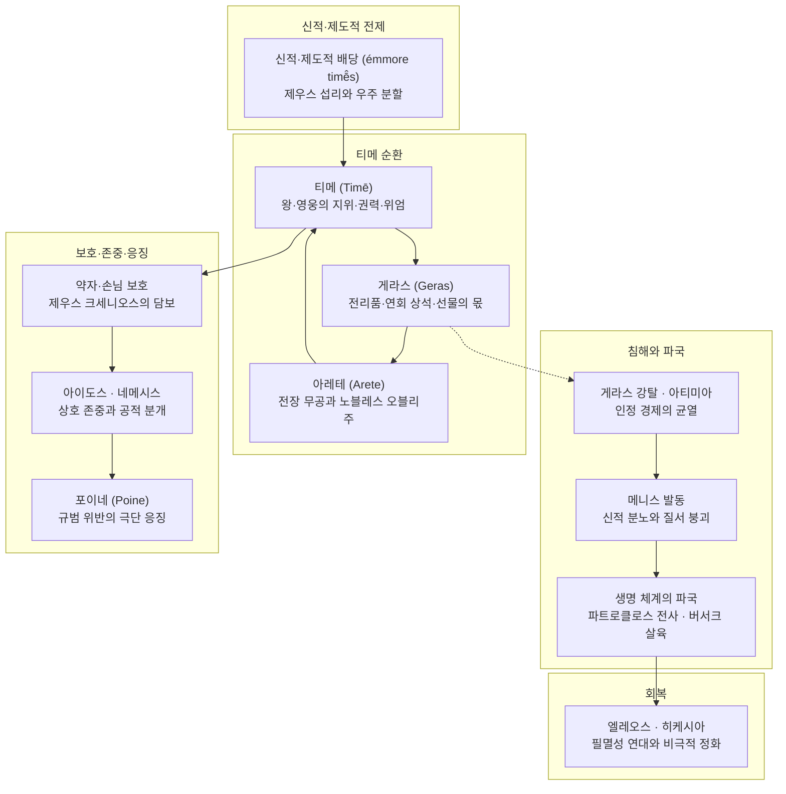

# 티메 (Time)

**[[greek-reading-guide|읽는 법]]**: 티메 · **원어**: τιμή · **학술 전사**: *timḗ*

## 1. 정의와 핵심 테제 (Definition & Core Thesis)

- **핵심 정의**:
  - **티메**(τιμή, *timḗ*; 관용 라틴명 Time)는 호메로스 서사시와 고대 그리스 문화 전반을 관통하는 핵심 가치 제도로, 근대적 의미의 주관적 자긍심이나 내면적 명예에 국한되지 않고 **신적 질서와 공동체 관습 속에서 각 존재(신, 영웅, 시민, 약자)에게 배당된 고유한 사회적 자리, 직분, 자격 및 이를 가시적으로 증명하는 물질적·의례적 보상 체계**를 포괄하는 다층적 시스템입니다.
  - 아리스토텔레스가 『수사학』(*Rhet.* 1361a)에서 정의했듯, 티메는 "은혜를 베풀 수 있는 권능의 표시(sēmeîon euergetikê̄s dunámeōs)"이자 신과 공동체가 공인한 신성한 자리입니다.

- **연구사적 핵심 테제**:
  - **블레맹크(Vleminck 1982)의 5단계 환유 연쇄**: 티메는 고립된 추상명사가 아니라 평가 동사 **티오**(τίω, *tíō*, 값을 매기다 / 존중하다)에서 비롯된 역사적 환유(Metonymy) 과정을 통해 확립된 제도적 지위입니다. 사물과 인간에 대한 정량적 평가에서 출발하여, 인격적 존중, 가시적 표시(상석, 고기, 잔, 전리품 게라스), 특권의 정당한 요구를 거쳐, 최종적으로 신과 인간 사회의 공식적 직무 및 우주적 배당 질서로 고착되었습니다.
  - **핑켈버그(Finkelberg 1998)와 벤베니스트(Benveniste 1969)의 분배적 지위 테제‘**: 정형구 `ἔμ모레 티메스`(`ἔμμορε τιμῆς`, "티메의 몫을 받았다")가 증명하듯, 티메는 개인이 전장에서 쟁취하는 가변적 전공 이전에 제우스와 운명([[concept-moira|모이라]])이 사전에 배당한 **’분배적 가치**'(Distributive Value)입니다. 이는 공동체에 의해 가산되는 물질 몫인 [[concept-geras|게라스 (Geras)]] 및 개인의 실천적 탁월성인 [[concept-arete|아레테 (Arete)]]와 범주적으로 구별됩니다.
  - **리댕제(Riedinger 1976)의 객관적 예측 가능성과 호혜성 테제**: 아서 애드킨스(Adkins 1960)의 힘 중심 경쟁주의를 비판하며, 티메가 행위에 상응하여 사전에 객관적으로 계산·예측 가능한(prévisible) 사회적 질서 규범이며, 단순한 물질적 이해관계를 초월한 호혜성과 계산 없는 관대함(réciprocité et générosité)에 기초한 고유한 도덕 질서임을 규명했습니다.
  - **나기(Nagy 1979)의 영웅 제의와 이원적 연속성 테제**: 서사 내부에서 영웅이 시인의 노래([[concept-kleos|클레오스]])를 통해 초공간적 불멸성을 얻는다면, 서사 외부 역사적 그리스 종교에서 영웅에게 바쳐지는 티메는 무덤(σῆμα, *sē̂ma*)을 중심으로 바쳐지는 제의적 숭배(Hero Cult)입니다.

### 블레맹크(1982)의 티메 5단계 환유 연쇄

| 단계 | 환유 층위 (원어) | 의미론적 전개 및 서사시 문헌적 증거 |
|:---|:---|:---|
| **(1)** | **정량적 평가** (*Évaluation*) | 사물이나 인물의 가치를 시선으로 관찰하고 정량적으로 산정함 (*Il.* 23.700–705 삼각솥·여인의 소 가치 산정) |
| **(2)** | **인격적 존중** (*Estime*) | 내면적 탁월성, 지혜, 정의로운 행동을 높이 평가함 (*Od.* 14.83–84 신들의 디케 존중) |
| **(3)** | **가시적 표시** (*Marque visible*) | 존경을 상석, 연회의 고기와 잔, 전리품([[concept-geras\|Geras]]) 등 물질적 선물로 표시함 (*Il.* 23.648–649 네스토르의 잔) |
| **(4)** | **특권과 권리** (*Privilège / Droit*) | 영웅이 자신의 가치에 상응하는 표시를 당연히 요구할 수 있는 정당한 권리 (*Il.* 9.319 아킬레우스의 항변) |
| **(5)** | **직분과 제도** (*Charge / Institution*) | 신과 인간 사회의 공식적 직무, 아파나주, 우주적 배당으로 고착됨 (*Il.* 15.185–195 포세이돈의 호모티모스 선언) |

---

## 2. 어원과 형태론 (Etymology & Morphology)

- **인도유럽 조어 기원**:
  - 인도유럽 조어(PIE) 어근 `*kwey-`('주의 깊게 보다', '값을 매기다', '보상하다', '처벌하다')에서 유래합니다.
  - 시각적 주목 행위(*kwey-*)가 사물의 가치를 정량적으로 매기는 행위로 발전하고, 나아가 배상과 징벌이라는 사법적 교환으로 분기되었습니다.

- **동계어 대조**:
  - **산스크리트어**: *cáyate*('존중하다', '복수하다'), *cā́yati*('주의 깊게 보다', '두려워하다'), *apaciti-*('존경', '보상')
  - **아베스타어**: *kāy-*('값을 치르다', '속죄하다'), *kaēnā-*('벌', '보복' — 그리스어 *poinḗ*와 동계)
  - **고대 슬라브어**: *cěna*('가격', '가치', '명예')
  - **리투아니아어**: *káina*('가격', '값')

> [!NOTE] 어원 및 영단어 수용사 상세
> 인도유럽조어 어근(*kwey-), 상세 계통수, 슬라브어 동계어 대응 및 현대 영단어(Timocracy, Timothy, Timon) 수용사는 Time 어원 분석 문서(word-time)를 참조하십시오.

### 형태론 분석 표

| 그리스어 실제형 | 학술 전사 | 품사 및 형태론 | 의미 및 문헌학적 맥락 |
|:---|:---|:---|:---|
| τιμή | *timḗ* | 여성 명사 (단수 주격) | 사회적 가치, 배당된 지위, 직분, 존중, 가시적 보상 |
| τίω | *tíō* | 동사 (현재 능동) | 가치를 평가하다, 값을 매기다, 높이 존중하다 (*Il.* 23.703, 705) |
| τίνω | *tínō* | 동사 (현재 능동) | 대가를 치르다, 배상하다, 갚다 (*Il.* 3.286) |
| τίνυμαι | *tínumai* | 동사 (현재 중·수동) | 징벌하다, 보복하다, 죗값을 물려받다 |
| τίμημα | *tímēma* | 중성 명사 (단수 주격) | 재산 평가액, 배상금 액수, 벌금 (고전기 사법 용어로 발전) |
| τίμιος | *tímios* | 형용사 (남성 주격) | 귀중한, 존중받는, 값비싼 |
| ἄτιμος | *átimos* | 복합 형용사 (부정 접두사 a-) | 가치 평가를 받지 못한, 자리가 박탈된, 모욕당한 (*Il.* 1.171) |
| ἀτίμητος | *atī́mētos* | 복합 형용사 (과거분사형) | 평가되지 않은, 티메가 없는 패리아 상태 (*Il.* 9.648) |
| ὁμότιμος | *homótimos* | 복합 형용사 (homo- + timē) | 동등한 위엄과 지분을 지닌 (*Il.* 15.186 포세이돈 선언) |
| ἐπιτιμήτωρ | *epitimḗtōr* | 남성 행위자 명사 | 침해된 티메의 보증인, 징벌자 (제우스의 신성 칭호; *Od.* 9.270) |

### 호메로스 가치·보상 어휘 체계 비교표

| 희랍어 어휘 | 원어 표기 | 학술 전사 | 주요 의미 및 기능 | 서사적 성격 | 대표 작동 장면 |
|:---|:---|:---|:---|:---|:---|
| **티메** (Timē) | τιμή | *timḗ* | 지속적인 사회적 자리, 직분, 자격 및 이를 가시화하는 가치 표시 | 제도적·상속적·구조적 가치 | 신들의 우주 분할, 아킬레우스의 지위 상실, 환대 집행 |
| **게라스** (Geras) | γέρας | *géras* | 이미 확립된 티메를 가시적으로 증명하기 위해 공동체가 가산하는 몫 | 동적·가변적·추가적 전리품 | 브리세이스, 연회에서의 상석 및 특별 고기 몫 |
| **퀴도스** (Kydos) | κῦδος | *kûdos* | 신이 전장의 영웅에게 순간적으로 씌워주는 일시적 승리의 광휘 | 카리스마적·일시적 신성 부여 | 파트로클로스가 가져오는 전장의 승리 광채 (*Il.* 16.84) |
| **클레오스** (Kleos) | κλέος | *kléos* | 시인의 노래를 통해 죽음 이후까지 구전되는 불멸의 명성 | 시상적·담론적·사후적 잔여 | 영웅의 사후 명예, 아킬레우스의 불멸의 명성 선택 (*Il.* 9.413) |
| **포이네** (Poine) | ποινή | *poinḗ* | 자격 침해 복구가 거부된 후 일어나는 유혈 응징 및 신체적 형벌 | 사법적·징벌적 극단 응징 | 구혼자들에 대한 오디세우스의 학살, 살인 피댓값 |
| **아포이나** (Apoina) | ἄποινα | *ápoina* | 포로의 석방이나 시신 반환을 위해 주고받는 한정된 대가적 몸값 | 대등한 물목 교환 | 헥토르 시신 몸값 (*Il.* 24), 리카온의 석방 탄원 (*Il.* 21) |
| **아이도스** (Aidos) | αἰδώς | *aidṓs* | 타인의 티메를 감지하고 존중하며 자신의 사회적 자리를 지키는 감정 | 자율적·억제적 도덕 심리 | 환대 규범 준수, 전장 도주에 대한 수치심, 헥토르의 출전 결단 |
| **네메시스** (Nemesis) | νέμεσις | *némesis* | 타인의 자리를 침범하거나 아이도스를 저버린 행위에 대한 공적 분노 | 집단적·신성적 규범 집행 | 구혼자들의 비위 규탄, 헥토르 시신 모독에 대한 신들의 분노 |

### 결합 정형구 표

| 희랍어 정형구 실제형 | 학술 전사 | 한국어 풀이 | 문맥 및 출전 |
|:---|:---|:---|:---|
| `ἔμμορε τιμῆς` | *émmore timē̂s* | 티메의 몫을 받았다 | 왕과 신의 신성한 사전 배당 (*Il.* 1.278, 15.189, *Od.* 5.335) |
| `τιμὴν ἀποτίνειν` | *timḕn apotínein* | 합당한 티메(배상/경의)를 치르다 | 트로이아 전쟁 맹약의 배상 및 정치적 경의 (*Il.* 3.286) |
| `τιμὴν μεγάλην` | *timḕn megálēn* | 위대한 티메(사회적 위엄) | 아킬레우스의 위상 회복 목표 (*Il.* 16.84) |
| `ἀτίμητον μετανάστην` | *atī́mēton metanástēn* | 아무런 티메도 없는 떠돌이 | 사회적 자리를 박탈당한 최하위 패리아 상태 (*Il.* 9.648, 16.59) |
| `τετιμήμεσθα μάλιστα` | *tetimḗmestha málista* | 가장 큰 티메를 받고 있다 | 사르페돈의 노블레스 오블리주 근거 (*Il.* 12.310) |
| `ὀφέλλωσίν τε ἑ τιμῇ` | *ophéllōsín te he timē̂i* | 그의 티메를 드높여 주다 | 테티스가 제우스에게 청원한 명예 증대 (*Il.* 1.510) |

- **Finkelberg(1998)의 정형구 분석**:
  - 동사 메이로마이(μείρομαι, *meíromai*, 몫을 배당받다)의 완료형인 `ἔμμορε`는 오직 티메와만 결합합니다.
  - 이 정형구는 인간 왕(*Il.* 1.278–279), 올림포스 3형제 신(*Il.* 15.189), 바다의 여신 이노(*Od.* 5.335), 파이아케스 귀족(*Od.* 11.338) 등 신적·제도적 특권을 부여받은 존재에게만 배타적으로 적용됩니다.
  - 네스토르가 아킬레우스에게 왕홀을 든 군주의 우위를 상기시키는 장면(*Il.* 1.278–279)은 아가멤논이 더 용감해서가 아니라 제우스가 왕홀을 든 군주에게 다른 몫을 배당했기 때문입니다. 아레테는 탁월성의 실현이며, 티메는 그 탁월성과 항상 일치하지 않는 사회적 배당 질서입니다.

---

## 3. 호메로스 서사시 본문 용례와 맥락 (Homeric Attestation & Contexts)

### 3.1 『일리아스』에서의 출현과 용례

『일리아스』는 군주와 영웅들 사이에서 티메의 가치 번역 체계가 붕괴하고 재편되는 인정 경제(Economy of Recognition)의 비극적 파국을 다룹니다 ([[lee-junseok-2024-iliad-jeongam|이준석 2024]]).

- **1단계: 아가멤논의 게라스 몰수와 존재론적 아티미아 (1권)**
  - 아가멤논은 사제 크리세스에게 딸을 돌려주어야 하는 상황에 직면하자, 군주로서의 위엄 상실을 두려워한 나머지 아킬레우스에게 배당되었던 전리품([[concept-geras|Geras]]) 브리세이스를 강탈합니다. 이는 군주의 과잉 권력([[concept-hybris|Hybris]])에 의한 침해입니다.
  - 아킬레우스는 이를 단순한 재산 손실이 아니라 단명할 운명에 대한 유일한 보상인 신적 티메의 박탈로 규정합니다.
  - 어머니 [[entity-thetis|테티스]]는 [[entity-zeus|제우스]]에게 나아가 아들의 티메를 보장하고 드높여 줄 것(*Il.* 1.510)을 청원합니다. 아카이아 군대가 패배하여 아킬레우스의 대체 불가능성이 입증될 때 비로소 최고의 경의가 바쳐진다는 우주적 소송입니다.
    - **번역**: "어머니, 당신께서 저를 단명할 운명으로 낳으셨을진대, 높은 곳에서 번개를 치시는 올림포스의 제우스께서는 마땅히 제 손에 명예(티메)를 쥐여 주셨어야 했습니다. 그러나 지금 그는 저를 조금도 존중하지 않으시니, 아트레우스의 아들 넓은 통치자 아가멤논이 제 명예를 짓밟고 친히 제 몫(게라스)을 빼앗아 차지했기 때문입니다."
    - **원문**: μῆτερ ἐπεί γ’ ἔτεκές γε μινυνθάδιόν περ ἐόντα, / τιμήν πέρ μοι ὄφελλεν Ὀλύμπιος ἐγγυαλίξαι / Ζεὺς ὑψιβρεμέτης· νῦν δ’ οὐδέ με τυτθὸν ἔτισεν· / ἦ γάρ μ’ Ἀτρεΐδης εὐρὺ κρείων Ἀγαμέμνων / ἠτίμησεν· ἑλὼν γὰρ ἔχει γέρας αὐτὸς ἀπούρας.
    - **학술 전사**: *mêter epeí g’ étekés ge minunthádión per eónta, / timḗn pér moi óphellen Olúmpios eggualíksai / Zeùs hupsibremétēs; nûn d’ oudé me tutthòn étisen; / ē̂ gár m’ Atreḯdēs eurù kreíōn Agamémnōn / ētímēsen; helṑn gàr ékhei géras autòs apoúras.* (*Il.* 1.352–356)

- **2단계: 9권 아가멤논의 '선물 공격' 거부와 가치 번역 체계 불신**
  - 패전에 직면한 아가멤논은 막대한 삼각대, 금, 준마, 7명의 여인과 브리세이스, 딸과의 혼약 및 영지를 제시합니다. 그러나 이 선물은 대등한 화해가 아니라 수령자를 하위 종속자로 편입시키는 '선물 공격(Gift-Attack)'의 성격을 띱니다 ([[van-wees-1992-status-warriors|van Wees 1992]]).
  - 아킬레우스는 "겁쟁이나 용자나 똑같은 티메를 받는다"며 전사 사회의 물질적 가치 번역 체계 자체가 붕괴했음을 선언합니다.
  - 인간 사회의 가시적 표시를 거부한 아킬레우스는 초월적 배당 질서로 상소합니다.
    - **번역**: "머물러 있는 자에게도 같은 몫이 돌아오고, 격렬하게 싸운 자에게도 마찬가지로다. 겁쟁이나 용자나 똑같은 명예(티메)로 대우받으며, 아무 일도 하지 않은 자나 많은 공적을 세운 자나 똑같이 죽음에 이르는도다."
    - **원문**: ἴση μοῖρα μένοντι, καὶ εἰ μάλα τις πολεμίζοι· / ἐν ἰῇ δὲ τιμῇ ἠμὲν κακὸς ἠδὲ καὶ ἐσθλός· / κάτθαν’ ὁμῶς ὅ τ’ ἀεργὸς ἀνὴρ ὅ τε πολλὰ ἐοργώς.
    - **학술 전사**: *ísē moîra ménonti, kaì ei mála tis polemízoi; / en iē̂i dè timē̂i ēmèn kakòs ēdè kaì esthlós; / kátthan’ homō̂s hó t’ aergòs anḕr hó te pollà eorgṓs.* (*Il.* 9.318–320)
    - **번역**: "포이닉스 노인이여, 제우스께서 기르신 아버지여, 내게는 그런 명예(티메)가 필요 없습니다. 나는 제우스의 배당(아이사)에 의해 이미 존중받고 있다고 생각하며, 그것이 이 굽은 배들 곁에 숨이 내 가슴에 머물고 무릎이 움직이는 한 나를 붙들어 줄 것입니다."
    - **원문**: Φοῖνιξ ἄττα γεραιὲ διοτρεφές, οὔ τί με ταύτης / χρεὼ τιμῆς· φρονέω δὲ τετιμῆσθαι Διὸς αἴσῃ, / ἥ μ’ ἕξει παρὰ νηυσὶ κορωνίσιν, εἰς ὅ κ’ ἀϋτμὴ / ἐν στήθεσσι μένῃ καί μοι φίλα γούνατ’ ὀρώρῃ.
    - **학술 전사**: *Phoîniks átta geraiè diotrephés, oú tí me taútēs / khreṑ timē̂s; phronéō dè tetimē̂sthai Diòs aísēi, / hḗ m’ héksei parà nēusì korōnísin, eis hó k’ aütmḕ / en stḗthessi ménēi kaí moi phíla goúnat’ orṓrēi.* (*Il.* 9.607–610)

- **3단계: 16권 대체 불가능성의 협상과 파트로클로스의 비극적 죽음**
  - 아킬레우스는 [[entity-patroklos|파트로클로스]]를 대신 출전시키며 엄격한 한계선을 설정합니다. 홀로 트로이아를 함락하여 자신을 더욱 자격 없는 자(`ἀ티모테론`, *atimóteron*)로 만들지 말라는 경고는 인정 경제에서의 대체 불가능성을 지키기 위한 장치입니다.
  - 목표는 파트로클로스가 가져오는 승리의 광채([[concept-kydos|Kydos]])를 바탕으로 자신의 위대한 티메(`τιμὴν μεγάλην`, *timḕn megálēn*)를 확보하는 것입니다 (*Il.* 16.84–90). 그러나 이 인정 경제의 도구적 운용은 가장 소중한 전우의 전사라는 생명 체계의 파국으로 귀결됩니다.

### 3.2 『오뒷세이아』에서의 출현과 용례

『오뒷세이아』에서 티메의 위기는 전장의 전리품 분배가 아니라 가내 공간([[concept-oikos|Oikos]]) 및 환대([[concept-xenia|Xenia]]) 규범의 침탈 형태로 전개됩니다.

- **오이코스 침탈 및 구혼자들의 약자 모욕**:
  - 구혼자들은 오디세우스의 가산을 탕진하는 데 그치지 않고, [[entity-telemachos|텔레마코스]]의 상속권을 침해하며 집안의 하인과 나그네를 체계적으로 모욕(ἀτιμάζω, *atimázō*)합니다.
- **거지 위장과 에우마이오스의 일상적 환대 집행 (14권)**:
  - [[entity-odysseus|오디세우스]]는 왕의 가시적 표시를 모두 벗어던지고 거지 누더기를 걸친 채 귀환하여, 표시가 없는 약자의 티메를 다루는 귀족 사회의 도덕성을 시험합니다.
  - 돼지치기 [[entity-eumaeus|에우마이오스]]는 남루한 거지 앞에서도 제우스의 손님법에 따라 고기, 빵, 잠자리를 제공하며 일상적 티메를 성실히 집행합니다 (*Od.* 14.56–58). 약자의 티메는 인간적 탁월성이 아니라 **[[entity-zeus-xenios|Zeus Xenios]]**와 **[[entity-zeus-hikesios|Zeus Hikesios]]**가 보증인(ἐπιτιμήτωρ, *epitimḗtōr*)으로 개입하기 때문에 성립합니다.
- **배상 거부와 피의 복수 포이네 (22권)**:
  - 오디세우스의 정체가 드러나자 구혼자 에우리마코스는 소비한 재물에 대한 20배의 변상(ἀποτίνω, *apotínō*)과 청동·금을 바치겠다며 티메의 경제적 복원을 제안합니다 (*Od.* 22.55–60).
  - 그러나 오디세우스는 어떤 재화로도 침해된 가장과 왕의 티메가 보상될 수 없음을 선언하며 제안을 일축합니다. 자격 침해가 보상 한계를 초과했을 때, 교환과 배상의 티메 국면은 끝나고 유혈 응징인 포이네([[concept-poine|Poine]], ποινή)의 단독 지배로 넘어갑니다.

---

## 4. 개념 상호작용과 가치망 (Conceptual Network & Polarity)

- **대립쌍(Polarity) 역학**:
  - **티메(Timē) 대 아티미아([[concept-atimia|Atimia]])**: 티메가 신적·공동체적 승인을 통해 존재의 자리를 확립하는 것이라면, 아티미아는 사회적 인정의 신호가 전면 차단되어 보호막 밖으로 내던져지는 존재론적 무자격 상태를 뜻합니다. 아킬레우스가 자신을 "아무런 티메도 없는 떠돌이(`ἀτίμητον μετανάστην`)"로 자조할 때, 그는 단순한 분노를 넘어 인간 사회의 경계 밖으로 축출된 패리아의 비참을 고발합니다.
  - **정당한 티메 질서 대 휘브리스([[concept-hybris|Hybris]])**: 자신의 분수와 신적 배당 질서를 넘어 타인의 고유한 몫을 무력으로 찬탈하는 행위는 휘브리스이며, 이는 필연적으로 공동체와 신들의 보복([[concept-nemesis|Nemesis]], [[concept-tisis|Tisis]])을 부릅니다.

- **연계 규범군 서술**:
  - **게라스([[concept-geras|Geras]])와의 역학**: 게라스는 이미 확립된 티메를 대중 앞에서 감각적으로 확인시키는 '가시적 징표'입니다. 게라스의 강탈은 곧 티메의 침해로 직결됩니다.
  - **아이도스([[concept-aidos|Aidos]]) 및 네메시스([[concept-nemesis|Nemesis]])와의 상호 연동**: 아이도스는 타인의 티메를 감지하고 존중하며 자신의 분수를 지키는 내적 억제 심리입니다. 타인의 티메를 침범하거나 아이도스를 저버린 자에게는 공동체와 신들의 공적 의분인 네메시스가 발동됩니다 ([[cairns-1993-aidos|Cairns 1993]]).
  - **메니스([[concept-menis|Menis]])의 격발**: 군주 아가멤논이 아킬레우스의 정당한 게라스(브리세이스)를 강탈하여 그의 존재론적 티메를 침해한 사건이 초인적 영웅의 신적 분노(메니스)를 촉발하는 결정적 계기가 됩니다.
  - **크세니아([[concept-xenia|Xenia]])와 엘레오스([[concept-eleos|Eleos]])**: 자체 무력이 없는 손님과 탄원자는 제우스 크세니오스를 통해 티메를 보장받으며, 『일리아스』 24권에서 프리아모스의 탄원([[concept-hikesia|Hikesia]])은 세속적 티메의 교환을 초월하여 필멸성의 보편적 연민([[concept-eleos|Eleos]])으로 승화됩니다.

---

## 5. 대표 서사 에피소드 정밀 해제 (Signature Epic Episodes)

### 1. 사르페돈의 노블레스 오블리주 연설 (*Il.* 12.310–328)

리키아의 왕 [[entity-sarpedon|사르페돈]]이 전우 [[entity-glaukos|글라우코스]]에게 전하는 이 연설은 호메로스 사회에서 티메(특권)와 의무가 어떻게 완벽한 선순환적 계약 관계를 형성하는지를 보여주는 가장 표준적인 문헌학적 증거입니다.

- **12.310–314 (특권과 영지의 확인)**:
  - **번역**: "글라우코스여, 어찌하여 우리는 리키아에서 상석과 고기와 가득 찬 술잔으로 가장 큰 존중(티메)을 받으며, 모두가 우리를 신처럼 바라보는가? 어찌하여 우리는 크산토스 강가에 과수원과 밀을 심을 좋은 땅으로 이루어진 크고 아름다운 영지(테메노스)를 차지하고 있는가?"
  - **원문**: Γλαῦκε τίη δὴ νῶϊ τετιμήμεσθα μάλιστα / ἕδρῃ τε κρέασίν τε ἰδὲ πλείοις δεπάεσσιν / ἐν Λυκίῃ, πάντες δὲ θεοὺς ὣς εἰσορόωσι, / καὶ τέμενος νεμόμεσθα μέγα Ξάνθοιο παρ’ ὄχθας / καλὸν φυταλιῆς καὶ ἀρούρης πυροφόροιο;
  - **학술 전사**: *Glaûke tíē dḕ nō̂ï tetimḗmestha málista / hédrēi te kréasín te idè pleíois depáessin / en Lukíēi, pántes dè theoùs hṑs eisoróōsi, / kaì témenos nemómestha méga Ksánthoio par’ ókhthas / kalòn phutaliē̂s kaì aroúrēs purophóroio;*

- **12.315–321 (전장의 의무와 교환)**:
  - **번역**: "그러므로 우리는 마땅히 리키아인들의 최전선에 서서 뜨거운 전투에 맞서 싸워야 하리라. 그리하여 견고한 갑옷을 입은 리키아인 누군가가 이렇게 말하도록 해야 한다. '실로 리키아를 다스리는 우리 왕들은 명예 없는(아클레에스) 자들이 아니요, 살진 양과 꿀처럼 달콤한 최상의 포도주를 마시는구나. 그들에게는 훌륭한 무용(아레테) 또한 있으니, 리키아인들의 최전선에서 싸우기 때문이다.'"
  - **원문**: τὼ χρὴ νῦν Λυκίοισι μέτα πρώτοισιν ἐόντας / ἑστάμεν ἠδὲ μάχης καυστείρης ἀντιβολῆσαι, / ὄφρά τις ὧδ’ εἴπῃ Λυκίων πύκα θωρηκτάων· / ‘οὐ μὰν ἀκλεέες Λυκίην κάτα κοιρανέουσιν / ἡμέτεροι βασιλῆες, ἔδουσί τε πίονα μῆλα / οἶνόν τ’ ἔξαιτον μελιηδέα· ἀλλ’ ἄρα καὶ ἲς / ἐσθλή, ἐπεὶ Λυκίοισι μέτα πρώτοισι μάχονται.’
  - **학술 전사**: *tṑ khrḕ nûn Lukíoisi méta prṓtoisin eóntas / hestámen ēdè mákhēs kausteírēs antibolē̂sai, / óphrá tis hō̂d’ eípēi Lukíōn púka thōrēktáōn; / ‘ou màn akleées Lukíēn káta koiranéousin / hēméteroi basilē̂es, édousí te píona mêla / oînón t’ éksaiton meliēdéa; all’ ára kaì ìs / esthlḗ, epeì Lukíoisi méta prṓtoisi mákhontai.’*

- **12.322–328 (필멸성의 자각과 영광의 결단)**:
  - **번역**: "오 친구여, 만일 우리가 이 전쟁을 피하여 영원히 늙지도 않고 불사신이 될 수 있다면, 나 자신도 앞장서서 싸우지 않을 것이며 그대를 영광을 가져오는 전장으로 보내지도 않을 것이다. 그러나 죽음의 여신들이 수없이 우리를 둘러싸고 있어 필멸의 인간은 이를 피할 수도 달아날 수도 없으니, 나아가자! 누군가에게 영광을 안겨주든, 스스로 영광을 차지하든!"
  - **원문**: ὦ πέπον εἰ μὲν γὰρ πόλεμον περὶ τόνδε φυγόντε / αἰεὶ δὴ μέλλοιμεν ἀγήρω τ’ ἀθανάτω τε / ἔσσεσθ’, οὔτε κεν αὐτὸς ἐνὶ πρώτοισι μαχοίμην / οὔτε κέ σε στέλλοιμι μάχην ἐς κυδιάνειραν· / νῦν δ’ ἔμπης γὰρ κῆρες ἐφεστᾶσιν θανάτοιο / μυρίαι, ἃς οὐκ ἔστι φυγεῖν βροτὸν οὐδ’ ὑπαλύξαι, / ἴομεν ἠέ τῳ εὖχος ὀρέξομεν ἠέ τις ἡμῖν.
  - **학술 전사**: *ō̂ pépon ei mèn gàr pólemon perì tónde phugónte / aieì dḕ mélloimen agḗrō t’ athanátō te / éssesth’, oúte ken autòs enì prṓtoisi makhoímēn / oúte ké se stélloimi mákhēn es kudiáneiran; / nûn d’ émpēs gàr kêres ephestâsin thanátoio / muríai, hàs ouk ésti phugeîn brotòn oud’ hupalúksai, / íomen ēé tōi eûkhos oréksomen ēé tis hēmîn.*

- **서사적 함의**:
  - 사르페돈은 군주가 누리는 물질적 특권(상석, 고기, 술잔, 비옥한 영지 테메노스)이 무조건적 권리가 아니라, 전장의 최전선에서 목숨을 걸고 싸우는 실천적 책무(아레테)와 정확히 맞물려 있는 상호적 교환 계약임을 선언합니다.
  - 나아가 필멸성의 자각(*Il.* 12.322–328)은 이 현세적 티메 교환을 영웅적 명성([[concept-kleos|Kleos]])의 결단으로 승화시키는 철학적 정당화가 됩니다.

---

### 2. 올림포스 3형제 신들의 우주 분할과 호모티모스 선언 (*Il.* 15.185–195)

신들의 티메 분할은 인간 사회 제도와 왕권 배당의 원형이자 형이상학적 바닥을 이룹니다.

- **15.185–195 (제비뽑기와 대등한 위엄 선언)**:
  - **번역**: "아아, 제우스가 아무리 강하다 할지라도 이것은 너무 지나친 말이로다. 나와 대등한 명예(호모티모스)를 지닌 나를 그가 힘으로 억누르려 하다니! 우리는 크로노스가 낳고 레아가 낳은 삼형제이니, 제우스와 나, 그리고 망자들을 다스리는 하데스가 셋째다. 만물은 셋으로 나뉘었고 저마다 명예의 몫(티메)을 받았도다. 제비를 뽑았을 때 나는 잿빛 바다에 영원히 살 운명을 얻었고, 하데스는 캄캄한 어둠을 얻었으며, 제우스는 창공의 에테르와 구름을 얻었도다. 그러나 대지와 높은 올림포스는 우리 셋 모두의 공동의 몫으로 남았느니라. 그러므로 나는 결코 제우스의 뜻대로 살지 않으리라. 그가 아무리 강할지라도 그는 자신의 셋째 몫에 만족하며 조용히 머물러야 하리라."
  - **원문**: ὢ πόποι ἦ ῥ’ ἀγαθός περ ἐὼν ὑπέροπλον ἔειπεν, / εἴ μ’ ὁμότιμον ἐόντα βίῃ ἀέκοντα καθέξει. / τρεῖς γάρ τ’ ἐκ Κρόνου εἰμὲν ἀδελφεοί, οὓς τέκετο Ῥέα, / Ζεὺς καὶ ἐγώ, τρίτατος δ’ Ἀΐδης, ἐνέροισιν ἀνάσσων· / τριχθὰ δὲ πάντα δέδασται, ἕκαστος δ’ ἔμμορε τιμῆς· / ἤτοι ἐγὼν ἔλαχον πολιὴν ἅλα ναιέμεν αἰεὶ / παλλομένων, Ἀΐδης δ’ ἔλαχε ζόφον ἠερόεντα, / Ζεὺς δ’ ἔλαχ’ οὐρανὸν εὐρὺν ἐν αἰθέρι καὶ νεφέλῃσι· / γαῖα δ’ ἔτι ξυνὴ πάντων καὶ μακρὸς Ὄλυμπος. / τὼ ῥα καὶ οὔ τι Διὸς βουλαῖς ἐπιπείσομαι, ἀλλὰ ἕκηλος / καὶ κρατερός περ ἐὼν μενέτω τριτάτῃ ἐνὶ μοίρῃ.
  - **학술 전사**: *ṑ pópoi ē̂ rh’ agathós per eṑn hupéroplon éeipen, / eí m’ homótimon eónta bíēi aékonta kathéksei. / treîs gár t’ ek Krónou eimèn adelpheoí, hoùs téketo Rhéa, / Zeùs kaì egṓ, trítatos d’ Aḯdēs, enéroisin anássōn; / trikhthà dè pánta dédastai, hékastos d’ émmore timē̂s; / ḗtoi egṑn élakhon poliḕn hála naiémen aieì / palloménōn, Aḯdēs d’ élakhe zóphon ēeróenta, / Zeùs d’ élakh’ ouranòn eurùn en aithéri kaì nephélēisi; / gaîa d’ éti ksunḕ pántōn kaì makròs Ólumpos. / tṑ rha kaì oú ti Diòs boulaîs epipeísomai, allà hékēlos / kaì kraterós per eṑn menétō tritátēi enì moírēi.*

- **서사적 함의**:
  - 포세이돈은 제비뽑기(*palloménōn*)를 통해 삼형제 모두가 동등한 위엄의 몫(`trikhthà dè pánta dédastai, hékastos d’ émmore timē̂s`)을 받았음을 천명하며, 자신을 제우스와 대등한 자인 **호모티모스**(ὁμότιμος, *homótimos*)로 규정합니다.
  - 이는 티메가 위계적 복종을 요구하는 군주의 사적 완력(비에, *biē*)에 종속되지 않는 고유한 신성 분배의 몫임을 보여주는 형이상학적 헌장입니다.

---

### 3. 파리스-메넬라오스 결투 조약과 봉건적 신종 조공 (*Il.* 3.284–290)

아가멤논이 양군 간의 전쟁 종결 조약에서 요구한 티메 조항은 고전문헌학자 세르주 블레맹크([[vleminck-1982-institutional-aspect-of-time|Vleminck 1982]])가 규명했듯 단순한 일회성 손해배상금(포이네)이 아니라, 미케네 패권에 대한 **영구적인 봉건적 신종(hommage féodal)이자 정치적 종주권 승인의 조공**입니다.

- **3.284–290 (영구적 종속 공납 요구)**:
  - **번역**: "만일 금발의 메넬라오스가 알렉산드로스를 죽인다면, 트로이아인들은 헬레네와 모든 재물을 돌려주고, 아르고스인들에게 마땅한 명예(티메)를 바쳐 만족시켜야 하되, 그 티메는 후대 인간들에게까지 영구히 남아야 하리라. 그러나 알렉산드로스가 쓰러진 뒤에도 프리아모스와 프리아모스의 아들들이 내게 그 티메를 바치지 않으려 한다면, 나는 그때 배상(포이네)을 받아내기 위해 다시 싸울 것이다."
  - **원문**: εἰ δέ κ’ Ἀλέξανδρον κτείνῃ ξανθὸς Μενέλαος, / Τρῶας ἔπειθ’ Ἑλένην καὶ κτήματα πάντ’ ἀποδοῦναι, / τιμὴν δ’ Ἀργείοις ἀποτινέμεν ἥν τιν’ ἔοικεν, / ἥ τε καὶ ἐσσομένοισι μετ’ ἀνθρώποισι πέληται· / εἰ δ’ ἂν ἐμοὶ τιμὴν Πρίαμος Πριάμοιό τε παῖδες / τίνειν οὐκ ἐθέλωσιν Ἀλεξάνδροιο πεσόντος, / αὐτὰρ ἐγὼ καὶ ἔπειτα μαχήσομαι εἵνεκα ποινῆς...
  - **학술 전사**: *ei dé k’ Aléksandron kteínēi ksanthòs Menélaos, / Trō̂as épeith’ Helénēn kaì ktḗmata pánt’ apodoûnai, / timḕn d’ Argeíoisi apotinémen hḗn tin’ éoiken, / hḗ te kaì essoménoisi met’ anthrṓpoisi pélētai; / ei d’ àn emoì timḕn Príamos Priámoió te paîdes / tínein ouk ethélōsin Aleksándroio pesóntos, / autàr egṑ kaì épeita makhḗsomai heíneka poinē̂s...*

- **문헌학적 분석**:
  - '후대 인간들에게까지 영구히 남는다'는 규정은 소모성 금은보화의 일회성 배상으로는 충족될 수 없습니다.
  - 피해 당사자(메넬라오스)가 아닌 총사령관 아가멤논과 아르고스군 전체에게 지속적으로 귀속되는 지위이므로, 이는 트로이아가 패권을 인정하고 정기적 공납과 칭신을 바치는 국가 간 제도적 종속 관계(vassalité)를 뜻합니다.
  - 조약은 이 제도적 티메 지불이 거부될 때 비로소 피의 징벌인 포이네([[concept-poine|Poine]])를 위해 전쟁을 재개한다고 명시하여, 티메(제도적 예우와 신종)와 포이네(징벌적 응징)의 사법적 범주를 명확히 갈라놓습니다.

---

## 6. 역사적·제도적 맥락 (Historical & Institutional Context)

<!-- 선택적 렌즈: 적용 -->

- **바실레이아 군주권과 지위의 취약성**:
  - 후기 청동기 미케네 문명의 강력한 관료제적 대군주인 와낙스(*wanax*) 체제가 붕괴한 후, 암흑기를 거쳐 호메로스 서사시에 반영된 초기 철기시대 군주권은 다수의 경쟁적 귀족 가운데 으뜸인 **바실레우스**(βασιλεύς, *basileus*) 체제였습니다.
  - 바실레우스의 권위는 절대적인 관료적 기구가 아니라 동료 전사 귀족들의 끊임없는 승인과 전리품 재분배 역량에 기초했습니다.
  - 아가멤논의 군주권은 이처럼 구조적으로 취약했기 때문에, 크리세이스를 돌려주는 상황에서 자신의 티메가 훼손될 것을 극도로 두려워하여 무리하게 아킬레우스의 게라스를 강탈하는 파국으로 이어졌습니다.

- **전리품 배분 제도 (선분배와 균등 분배)**:
  - 호메로스 전사 사회의 전리품 처분은 공동체의 합의에 기초한 엄격한 관행을 따랐습니다.
  - 1단계 취합: 노획한 재화, 가축, 여성 포로는 일단 군대 전체의 공유 자산(ξυνήϊα, *ksunḗïa*, *Il.* 1.124)으로 모입니다.
  - 2단계 게라스 선분배: 전사 민회가 소집되면, 공동체는 총사령관 아가멤논과 최고의 무공을 세운 아킬레우스 등 주역들에게 최상의 몫을 게라스([[concept-geras|Geras]])로 먼저 헌정합니다.
  - 3단계 모이라 균등 배분: 게라스를 제하고 남은 전리품은 전사단 전체에게 각자의 몫([[concept-moira|모이라]])으로 공평하게 배분됩니다(*Il.* 1.125–126; *Od.* 9.42).

- **미케네 선문자 B 점토판의 역사적 실재**:
  - 미케네 문명의 피로스(Pylos) 궁전에서 출토된 선문자 B 점토판에는 에게해 동부에서 포획된 외방 여성 노예 집단이 기록되어 있습니다.
  - 특히 점토판에 기록된 **`to-ro-ja`**(트로이아 여인), `ki-ni-di-ja`(크니도스 여인), `mi-ra-ti-ja`(밀레토스 여인)라는 명칭은 서사시가 담고 있는 전쟁 포로 여성들의 집단적 강제 노동 현실과 정확히 일치합니다.
  - 이들은 개인 이름 없이 출신지로만 분류된 채 방적, 제분 등 고된 노역에 종사했습니다.
  - 호메로스 영웅들의 찬란한 티메와 게라스 체계는 이처럼 여성 포로와 노예 계층의 물상화(Commodification)와 강제 노동을 물질적 전제로 삼고 있었습니다.

- **전쟁 포로 노예(dmōai)와 가내 구매 노예의 지위 격차**:
  - 전쟁 포로 여성들은 가사 노동 강제와 함께 성적 종속을 강요받았습니다.
  - 반면 어려서 구매되어 가내에서 육성된 유모 에우리클레이아나 돼지치기 에우마이오스는 오이코스 내에서 정서적 결속과 제한된 존중을 받았습니다. 그러나 이 존중 역시 가부장적 질서에 완벽히 순종할 때만 유효한 조건부 자격이었습니다.

---

## 7. 물질문화와 신체성 (Material Culture & Embodiment)

<!-- 선택적 렌즈: 적용 -->

- **삼각솥과 소(bous) 가치 척도 (*Il.* 23.700–705)**:
  - 파트로클로스 장례 경기 중 레슬링 종목의 상을 내놓는 장면에서 동사 τίω는 대상을 눈으로 보고 구체적인 재화 척도(소)로 가치를 매기는 물리적 평가 행위로 사용됩니다.
  - **번역**: "펠레우스의 아들은 곧이어 다나오스인들에게 보여주며 고된 레슬링 경기의 세 번째 상들을 내놓았으니, 승자에게는 불 위에 얹는 큰 삼각솥이었고 아카이오이족은 마음속으로 그것을 열두 마리 소의 가치로 평가했다. 패자에게는 한 여인을 가운데 세웠으니, 많은 일에 능숙한 여인이었고 그들은 그녀를 네 마리 소의 가치로 평가했다."
  - **원문**: Πηλεΐδης δ’ αἶψ’ ἄλλα κατὰ τρίτα θῆκεν ἄεθλα, / δεικνύμενος Δαναοῖσι, παλαισμοσύνης ἀλεγεινῆς, / τῷ μὲν νικήσαντι μέγαν τρίποδ’ ἐμπυριβήτην, / τὸν δὲ δυωδεκάβοιον ἐνὶ σφίσι τῖον Ἀχαιοί· / ἀνδρὶ δὲ νικηθέντι γυναῖκ’ ἐς μέσσον ἔθηκε, / πολλὰ δ’ ἐπίστατο ἔργα, τίον δέ ἑ τεσσαράβοιον.
  - **학술 전사**: *Pēleḯdēs d’ aîps’ álla katà tríta thêken áethla, / deiknúmenos Danaoîsi, palaismosúnēs alegeinê̄s, / tō̂i mèn nikḗsanti mégan trípod’ empuribḗtēn, / tòn dè duōdekáboion enì sphísi tîon Akhaioí; / andrì dè nikēthénti gunaîk’ es mésson éthēke, / pollà d’ epístato érga, tíon dé he tessaráboion.* (*Il.* 23.700–705)
  - 화폐 경제 이전 호메로스 사회에서 소(*bous*)는 가치를 환산하고 사회적 위계를 물리적으로 서열화하는 핵심 표준 척도였습니다.

- **게라스(브리세이스)의 신체성과 물상화**:
  - 영웅의 티메는 추상적 관념이나 내면적 긍지가 아니라, 눈으로 확인되고 손으로 만져지는 전리품 여성을 통해 가시화되었습니다.
  - 『일리아스』 19권에서 아가멤논이 제시하는 화해 물목에는 놋쇠 삼각대, 금, 말과 함께 "일솜씨가 훌륭한 여성 7명과 여덟 번째인 브리세이스"가 평행하게 나열됩니다. 브리세이스 강탈은 아킬레우스의 가시적 존재 증명을 물리적으로 탈취한 신체적 상해였습니다.

- **연회 상석과 고기·잔의 물리적 배치**:
  - 공식 연회에서 주최자는 가장 기름지고 살코기가 풍성한 **소나 돼지의 등심 부위**(νῶτα, *nō̂ta*)를 잘라내어 게라스로 바쳤습니다 (*Il.* 7.321; *Od.* 14.437–438).
  - 가장 높은 상석(*hédrē*)과 넘치도록 채워진 술잔(*depáessin*)은 티메를 일상의 의례 속에서 신체적으로 확인시키는 핵심 물질 도구였습니다 (*Il.* 12.310–314).

- **왕홀(skēptron)의 상징성**:
  - 산에서 베어져 껍질과 잎이 벗겨져 다시는 싹을 틔우지 못하는 단단한 나무에 금박을 입힌 왕홀(*Il.* 1.234–239).
  - 이는 제우스로부터 전수되어 군주와 재판관들에게 상속되는 합법적 사법권, 공적 발언권, 신성한 권위의 물질적 담지체였습니다.

---

## 8. 종교인류학 및 제의적 실천 (Religious Anthropology & Ritual)

<!-- 선택적 렌즈: 적용 -->

- **제물 향기(Knisē)와 신적 신용 계좌 (Minchin 2019)**:
  - 신들은 불멸(*athanatoi*)과 무노화(*agerôi*)의 생리학을 지녀 인간의 썩는 고기를 직접 먹지 않지만, 불에 태운 제물의 고기 향기(κνίση, *knisē*)를 취함으로써 자신들의 티메를 확인합니다 ([[minchin-2019-homeric-religion|Minchin 2019]]).
  - 『일리아스』 24권에서 제우스는 헥토르의 시신을 아킬레우스의 모욕으로부터 구출하도록 명하며, 헥토르가 제단을 비운 적 없이 바친 풍성한 제물의 향기야말로 "우리의 명예의 몫(timê)"이라고 직접 밝힙니다(*Il.* 24.68–70).
  - 인간이 평소 바치는 희생제물과 신전 건축은 일종의 '**신적 신용 계좌**(Credit Account)'에 호의를 적립하는 행위입니다. 크리세스가 아가멤논에게 모욕당한 뒤 아폴론에게 과거 바친 제물을 근거로 아카이아군에 재앙을 내려달라고 간청하는 기도는 바로 이 상호적 채권에 기반합니다(*Il.* 1.39–42).
  - **불경에 대한 네거티브 상호성(Negative Reciprocity)**: 제사의 결여나 티메의 침해는 신들의 즉각적이고 파괴적인 보복을 초래합니다. 테우크로스는 아폴론에게 첫 새끼 양을 바치겠다고 서원하지 않아 화살이 빗나갔으며(*Il.* 23.862–865), 아카이아군은 장엄한 헤카톰베 없이 방벽을 쌓음으로써 포세이돈과 아폴론의 티메를 모욕했고, 그 대가로 방벽 전체가 바다와 강물에 의해 영구히 지워지는 형벌을 받게 됩니다(*Il.* 7.446–450, 12.1–35).

- **신들의 당파적 티메 경쟁 (Kearns 2006)**:
  - 에밀리 컨스는 서사시의 신들이 실제 제의의 국지적 다원성과 달리 명확히 규정된 '단일 개체'로서 인간 영웅들과 대등한 서사적 행위자로 기능하며, 지상 전장을 자신들의 우월성과 티메를 겨루는 경쟁의 장으로 삼는다고 분석했습니다 ([[kearns-2006-gods-in-homeric-epics|Kearns 2006]]).
  - 신들은 인간의 제사를 통해 축적된 신용 계좌와 편애를 바탕으로 치열하게 다투지만, 위기 시에는 "필멸의 인간들 때문에 신들이 다툴 가치는 없다"며 초연함으로 회귀하는 독특한 위계를 유지합니다.

- **영웅 제의와 클레오스 (Nagy 1979)**:
  - 그레고리 나기([[nagy-1979-best-of-achaeans|Nagy 1979]])는 호메로스 서사시 내부에서 작동하는 문자적 명예와 서사시 외부 역사적 그리스 사회의 제의적 숭배 사이의 구조적 연결 고리를 규명했습니다.
  - 서사 내부에서 영웅은 시인의 노래([[concept-kleos|Kleos]])를 통해 초공간적 불멸성을 얻습니다. 반면 역사적 그리스 종교에서 영웅에게 바쳐지는 티메는 무덤(σῆμα, *sē̂ma*)과 유해가 위치한 특정 지역 성소에서 바쳐지는 제의적 숭배(희생제, 장례 경기)를 의미합니다.
  - 어원학적으로 아킬레우스(*Akhilleús*)라는 이름은 '**민중(laos)의 고통(akhos)**'을 체화한 합성어입니다. 브리세이스를 빼앗긴 아킬레우스의 개인적 고통(*akhos*)은 분노(*mēnis*)를 낳고, 이는 아카이아 군대 전체(*laos*)에 참혹한 고통(*akhos*)을 유발합니다.
  - 남성 영웅 중심의 티메 체계 속에서 여성이 발화권을 얻는 유일하고 강력한 공간은 **애도가**(Thrēnos/Lament)입니다. 『일리아스』 19권 브리세이스의 애도와 24권 안드로마케·헤카베의 애도는 영웅의 승리와 명예가 가족과 공동체의 파멸이라는 비극적 대가를 치르고 얻어진 것임을 고발합니다.

- **관객석의 신들과 영광의 향유 (이태수 2020)**:
  - 이태수 교수는 호메로스의 올림포스 신들이 인간 사회의 도덕적 정의 수호자가 아니라, 인간의 살육전을 마치 스포츠 경기처럼 관람하는 초연한 관객임을 규명했습니다 ([[lee-taesoo-2020-gods-in-audience|이태수 2020]]).
  - 제우스가 전장에서 멀찌감치 떨어져 홀로 자신의 영광을 즐기며(*kū́deï gaíōn*, *Il.* 11.80–83) "죽이고 죽임당하는 자들"을 내려다보는 장면은, 신들의 티메가 인간의 도덕적 인정이 아니라 '압도적인 힘의 우위와 불멸의 자족성'에서 도출됨을 극명하게 보여줍니다.

- **신들의 5대 이율배반성과 자의적 티메 (조대호 2007)**:
  - 조대호 교수는 레스키의 이율배반성을 확장하여 호메로스의 신들이 친근/소원, 총애/무자비, 자의/정의, 숭고/경박, 현시/은폐라는 5대 대립쌍을 이룬다고 보았습니다 ([[cho-daeho-2007-gods-in-iliad|조대호 2007]]).
  - 신들의 티메 배당은 인간의 공적에 비례하는 정의로운 보상이 아니라 신들의 자의적 편애와 충동에 좌우되며, 신들의 숨겨진 뜻(은폐)은 인간의 무지([[concept-ate|Atē]])와 결합하여 비극적 파국을 낳습니다.

- **자연력의 신격화와 티메 추구의 실존적 한계 (김한 2013, 2019)**:
  - 김한 교수는 호메로스 신들의 이름이 우주 만물 속에 내재하는 맹목적 자연력(오케아노스=물, 헤파이토스=불, 아레스=전쟁)의 실체화이며, 신들이 인간의 도덕과 무관하게 활동함을 밝혔습니다 ([[kim-han-2013-ilias-homeric-gods|김한 2013]], [[kim-han-2019-gods-zeus-moira-and-god|2019]]).
  - 하데스에서 아킬레우스가 "사자들의 왕이 되느니 지상에서 가난한 자의 머슴이 되겠다"(*Od.* 11.488–491)고 고백한 것은 전장에서 목숨을 걸고 추구하던 세속적 티메와 클레오스의 절대적 허무성을 폭로한 것이며, 서사시는 24권에서 공통의 유한성을 공유하는 유한자 간의 비극적 연민([[concept-eleos|Eleos]])으로 귀결됩니다.

---

## 9. 심리철학 및 도덕적 행위주체성 (Moral Psychology & Agency)

<!-- 선택적 렌즈: 적용 -->

- **아이도스(Aidos)와 네메시스(Nemesis)의 도덕심리학적 연동**:
  - **아이도스**([[concept-aidos|Aidos]])는 타인의 사회적 자리와 티메를 민감하게 감지하고 이를 침범하지 않도록 스스로를 제어하는 내적 억제 심리이자 부끄러움입니다 ([[cairns-1993-aidos|Cairns 1993]]).
  - **네메시스**([[concept-nemesis|Nemesis]])는 타인의 정당한 티메를 짓밟거나 아이도스를 저버린 파렴치한 행위에 대해 공동체와 신들이 터뜨리는 공적 의분이자 징벌적 반작용입니다.
  - 이 두 감정은 호메로스 영웅 사회에서 성문화된 법률 없이도 상호 인정 질서가 자율적으로 유지되도록 만드는 심리적 양대 기둥입니다.

- **도덕적 상해(akhos)와 메니스(Menis)**:
  - 군주 아가멤논이 아킬레우스의 정당한 게라스(브리세이스)를 강탈했을 때, 아킬레우스가 겪은 고통은 단순한 재산상 손실이 아니라 영혼의 좌소인 튀모스(*thūmos*)와 심장(*kēr*)을 찢는 도덕적 상해(**아코스**, *akhos*)였습니다.
  - 이 존재론적 박탈감과 모욕은 인간적 분노를 초과하여 신적 파괴력을 띤 **메니스**([[concept-menis|Menis]])로 비화하였고, 이는 군대 전체(*laos*)에 궤멸적 파멸을 몰고 왔습니다.

- **24권 엘레오스(Eleos)로의 초월**:
  - 『일리아스』 제24권에서 트로이아의 늙은 왕 프리아모스가 야음을 틈타 아킬레우스의 막사로 잠입하여 무릎을 잡고 손에 입을 맞추는 탄원([[concept-hikesia|Hikesia]])을 올립니다.
  - 아킬레우스는 프리아모스의 모습에서 고향에 홀로 남겨진 늙은 아버지 펠레우스를 떠올리고, 함께 눈물을 흘리며 비극적 연민(**엘레오스**, [[concept-eleos|Eleos]])을 회복합니다.
  - 이는 끝없는 전리품 계산과 상호 복수의 폐쇄회로를 형성하던 세속적 티메의 한계를 돌파하고, 죽음을 피할 수 없는 인간 실존의 유한성을 공유하는 유한자 간의 거룩한 연대로 승화되는 도덕적 정화입니다.

---

## 10. 후대 철학 및 비극 수용사 (Post-Homeric Reception)

<!-- 선택적 렌즈: 적용 -->

- **호메로스 시대의 실존적 아티모스에서 고전기 아테네 시민권 박탈로**:
  - **호메로스 시대의 아티모스(ἄτιμος, *átimos*)**: 법률에 따른 자격 정지가 아니라, 사회적 인정의 신호가 차단되어 공동체의 종교적·물질적 보호막으로부터 튕겨 나간 존재론적 박탈 상태를 의미합니다. 아킬레우스가 자신을 "아무런 티메도 없는 떠돌이(`ἀτίμητον μετανάστην`)"에 비유할 때의 상태가 이에 해당합니다.
  - **고전기 아테네의 사법적 아티미아 (Civic Atimia)**: 민주정 폴리스에서 티메가 모든 성인 남성 자유민에게 균등하게 부여되는 공적 시민권(Politeia)으로 재정의됨에 따라, 아티미아 역시 헌법적 시민권 박탈 형벌로 정착했습니다. 민회 투표권, 법정 재판 청구권, 공직 담임권이 전면 박탈되는 전면적 아티미아(*Atimia pantelēs*)와 특정 정치 행위만을 제한하는 부분적 아티미아(*Atimia kata prostaxin*)로 정교화되었습니다.

### 호메로스 서사시와 고전기 아테네의 티메·아티미아 비교

| 비교 항목 | 호메로스 서사시 (Archaic Era) | 고전기 아테네 (Classical Era) |
|:---|:---|:---|
| **티메(Timē)의 본질** | 신적 배당, 귀족적 직분, 가시적 전리품 및 상호 존중 | 폴리스에 참여하는 공적 시민권(Politeia) 및 법적 평등권 |
| **아티미아의 성격** | 실존적·공간적 배제, 보호막의 결여, 존재론적 무자격 | 헌법적 형벌, 공적·정치적 권리의 사법적 박탈 |
| **주요 발생 원인** | 군주의 권력 남용, 게라스 강탈, 약자 및 나그네 모욕 | 공금 횡령, 국채 미납, 탈영, 부모 부양 의무 위반 |
| **권리 회복 메커니즘** | 사적 무력 집행, 아포이나 수용, 피의 복수(포이네) | 법원의 채무 완납 확인, 민회의 특별 사면(Adeia) 의결 |
| **보호 담보 주체** | 제우스 크세니오스, 개인의 전사적 무력, 가문의 필리아 | 폴리스 성문 법률, 민중 법정(Heliaia), 헌법적 제도 |

- **아리스토텔레스 『수사학』(Rhet. 1361a)의 철학적 체계화**:
  - 아리스토텔레스는 『수사학』(*Rhet.* 1361a)에서 티메를 "은혜를 베풀 수 있는 권능의 표시(sēmeîon euergetikê̄s dunámeōs)"이자 선행에 대한 정당한 보답으로 체계화했습니다.
  - 그는 희생제, 기념비, 상석, 공공 매장, 동상 건립, 공유지 제공 등을 티메의 핵심 구성 요소로 열거하며, 호메로스 시대의 물질적 징표(상석, 선물, 영지)가 폴리스 공공 기제의 공식적 명예 보상으로 계승되었음을 보여주었습니다.

---

## 11. 학술 논쟁과 이설 (Scholarly Debates & Theoretical Conflicts)

> [!WARNING] 학설 대립: 경쟁적 가치론 대 분배적 배당론
> 아서 애드킨스(Adkins 1960)는 티메를 전장에서의 무력과 전리품 획득을 통해 끊임없이 쟁취하고 방어해야 하는 경쟁적이고 가변적인 제로섬 가치로 파악합니다. 반면 마르갈리트 핑켈버그(Finkelberg 1998)와 에밀 벤베니스트(Benveniste 1969)는 공식 표현 '에모레 티메스(émmore timē̂s)' 분석을 통해 티메가 개인의 전공 이전에 제우스와 운명(모이라)이 신분과 직분에 따라 사전에 안배한 분배적 가치(Distributive Value)임을 논증했습니다. 전자의 관점에서는 아킬레우스의 분노가 전사로서의 위신 실추에 대한 반응으로 환원되지만, 후자의 관점에서는 세습 군주권의 선천적 위계와 전공 기반 탁월성(아레테) 간의 구조적 충돌로 해석됩니다.

### 5대 학술 패러다임 종합

호메로스의 티메 연구사는 개별 학자가 이 다면적 개념의 어느 층위를 특권화하는가에 따라 5대 패러다임으로 범주화할 수 있습니다:

1. **힘·경쟁 층위 (Agonistic Tier)** — Adkins(1960), Finley(1954):
   - 티메의 핵심 기반을 전사 사회의 무력적 유효성과 전리품 재화로 파악합니다. 위기 상황에서 협동 규범이 무너지고 제로섬 방식의 지위 경쟁이 폭발하는 국면을 설명합니다 ([[adkins-1960-merit-and-responsibility|Adkins 1960]]).
2. **상호 인정 층위 (Reciprocal Tier)** — Long(1970), Riedinger(1976), Cairns(1993):
   - Adkins의 경쟁주의 모델을 비판하며, 티메가 타인의 자리를 인정하는 필리아(φιλία) 및 아이도스(αἰδώς)와 결합된 상호 인정 체계임을 증명했습니다 ([[long-1970-morals-and-values|Long 1970]], [[riedinger-1976-la-time-chez-homere|Riedinger 1976]], [[cairns-1993-aidos|Cairns 1993]]). 특히 리댕제(Riedinger 1976)는 티메가 행위에 상응하여 사전에 객관적으로 계산·예측 가능한(prévisible) 사회적 질서 규범이며, 단순한 이해관계 교환을 넘어선 '호혜성과 계산 없는 관대함(réciprocité et générosité)'에 기반한 고유한 도덕 질서임을 입증했습니다.
3. **신적 분배 층위 (Distributive Tier)** — [[benveniste-1969-vocabulaire-institutions-2|Benveniste(1969)]], [[finkelberg-1998-time-and-arete|Finkelberg(1998)]]:
   - 에밀 벤베니스트(Benveniste 1969, II, pp. 43–55)는 군대 공동체가 전공에 따라 비정기적으로 헌정하는 가변적 물질 몫인 [[concept-geras|게라스 (Geras)]]와 달리, 티메는 제우스와 운명([[concept-moira|모이라]])이 태초에 배타적으로 할당한 '영구적 신적 품위이자 위계적 지분'임을 문헌학적으로 규명했습니다 (*Il.* 15.189 크로노스 세 아들의 티메 분할). 또한 *일리아스* 3권 결투 조약 구절(*Il.* 3.275–290) 정밀 분석을 통해, 승자에게 지불하는 정당한 조공·경의로서의 티메와 거부 시 집행되는 형벌적 응징인 포이네([[concept-poine|Poine]])의 제도적 구별을 확립했습니다.
   - 마르갈리트 핑켈버그(Finkelberg 1998)는 Adkins의 경쟁적 가치 테제를 비판하며, 정형구 `ἔμ모레 티메스`(`ἔμ모ρε τιμῆς`, "명예의 몫을 나누어 받았다") 분석을 통해 티메가 경쟁 이전에 신과 운명이 사전에 배당한 '**분배적 가치‘**(Distributive Value)임을 실증했습니다. 핑켈버그는 『일리아스』 9권에서 아가멤논의 막대한 선물 제안으로 아킬레우스의 티메는 극대화되었으나 전장을 이탈함으로써 공동체를 위한 실천적 탁월성인 **’아레테**([[concept-arete|Arete]])는 완전히 상실되는 구조적 모순을 규명했습니다.
4. **표시·환유 층위 (Semiotic Tier)** — Vleminck(1982), Gernet(1948):
   - "평가 → 존중 → 가시적 선물 → 특권 → 직분"으로 이어지는 환유적 연쇄 모형을 제시하여, 가시적 표시(게라스)의 박탈이 곧 직분(티메)의 침해로 번지는 메커니즘을 규명했습니다.
5. **법·배상 층위 (Juridical Tier)** — Vatin(1982):
   - 침해된 존엄과 지위를 회복하기 위한 사법적 배상 절차로서 티메를 분석하고, 이것이 거부될 때 유혈 응징인 포이네(ποινή)로 이행함을 밝혔습니다.

### 서사적 국면별 5대 층위 상호작용 대조표

| 서사적 국면 | 주 작동 층위 | 서사 내 구체적 상황 | 층위 간 상호작용 메커니즘 |
|:---|:---|:---|:---|
| **조화적 정상 상태** | 힘·경쟁 + 신적 분배 + 표시·환유 | 사르페돈의 연설 (*Il.* 12.310–328) | 신적 배당과 물질적 표시가 전장의 무공 및 의무와 완벽한 선순환적 균형을 이룸 |
| **권력 몰수 위기** | 표시·환유 붕괴 및 힘·경쟁 폭주 | 아가멤논의 브리세이스 강탈 (*Il.* 1권) | 군주의 과잉 권력이 가시적 표시를 박탈하여 상호 인정 체계를 깨뜨리고 힘의 대립을 야기함 |
| **인정 체계 거부** | 표시·환유 불신 및 신적 분배 상소 | 아킬레우스의 사절단 선물 거절 (*Il.* 9권) | 인간 사회의 가시적 표시를 불신하고 제우스의 초월적 배당 질서로 직접 소송을 제기함 |
| **일상적 질서 유지** | 상호 인정 + 신적 분배 | 에우마이오스의 돼지우리 환대 (*Od.* 14권) | 신적 보증 아래 필리아와 아이도스를 통해 약자에게 최소한의 자리를 일상적으로 집행함 |
| **극단적 파국 및 응징** | 상호 인정 파괴 및 법·배상 단독 작동 | 구혼자 학살 및 시신 모독 (*Od.* 22권) | 상호 인정이 파괴되어 보상 불가능 상태에 도달함으로써 오직 피의 형벌(포이네)만 남음 |

---

## 12. 증거 매트릭스 (Evidence Matrix)

| 주장 테제 | 원전·문헌 근거 위치 | 자료 유형 | 확실성 등급 | 적용 섹션 |
|:---|:---|:---|:---|:---|
| **티메의 환유적 연쇄 구조** (시선-평가-선물-직분) | Vleminck(1982), Aristoteles *Rhet.* 1361a, *Il.* 23.700–705 | 어원학 및 서사시 분석 | 원전 명시 | 1절, 2절, 7절 |
| **티메의 사전 분배적 성격** (`ἔμ모레 티메스`) | Finkelberg(1998), Benveniste(1969), *Il.* 1.278, 15.189 | 정형구 문헌학 | 원전 명시 | 1절, 2절, 5절 |
| **사르페돈의 계약적 교환 모델** (특권과 무공) | *Il.* 12.310–328 | 텍스트 원문 대조 | 원전 명시 | 5절 |
| **9권 아킬레우스의 가치 불신과 초월적 상소** | van Wees(1992), Donlan(1993), *Il.* 9.318–320, 9.607–610 | 서사 분석 및 인류학 | 원전 명시 | 3절, 9절 |
| **약자 티메의 신적 보증과 환대 집행** | Yamagata(1994), Cairns(1993), *Od.* 14.56–58, 20.129–130 | 서사 텍스트 분석 | 원전 명시 | 3절, 4절 |
| **포이네로의 사법적 전이** (배상 거부와 학살) | Vatin(1982), *Od.* 22.55–67 | 법제사 및 텍스트 | 원전 명시 | 3절, 4절 |
| **영웅 제의와 파네레니즘 클레오스의 상호작용** | Nagy(1979) *Best of the Achaeans* | 종교사 및 구송시학 | 강한 학술 추론 | 1절, 8절 |
| **신적 신용 계좌와 제의적 상호성** | Minchin(2019), *Il.* 1.39–42, 24.68–70 | 종교인류학 | 강한 학술 추론 | 8절 |
| **올림포스 판테온의 당파적 티메 경쟁** | Kearns(2006), *Il.* 4.20–29, 21.462–467 | 신화서사학 | 강한 학술 추론 | 8절 |
| **관객석의 신들과 영광의 자족적 향유** | 이태수(2020), *Il.* 11.80–83 | 고전철학 연구 | 강한 학술 추론 | 8절 |
| **신들의 5대 이율배반성과 자의적 티메** | 조대호(2007) | 고전철학 연구 | 강한 학술 추론 | 8절 |
| **자연력의 실체화와 세속적 티메의 허무** | 김한(2013, 2019), *Od.* 11.488–491 | 종교철학 연구 | 강한 학술 추론 | 8절 |
| **미케네 여성 노예 강제 노동의 실재성** | Pylos Linear B 점토판 (`to-ro-ja`), *Il.* 19.245–246 | 금석문/고고학 자료 | 원전 명시 | 6절, 7절 |
| **고전기 아테네 시민권 박탈(atimia)로의 사법적 진화** | Hansen(1976), Vleminck(1982), Aristoteles *Ath. Pol.* | 법제사 비교 연구 | 후대 수용 | 10절 |
| **티메의 객관적 예측 가능성과 관대함의 도덕** | Riedinger(1976), Gernet(1968), *Il.* 1.508–510, 4.257–264 | 서사시 전수 분석 및 법인류학 | 강한 학술 추론 | 1절, 11절 |
| **경쟁적 가치론 대 분배적 배당론의 대립** | Adkins(1960) vs Finkelberg(1998) | 현대 고전학 학설사 | 논쟁적 | 11절 |

---

## 관련 항목

### 호메로스 서사 및 핵심 인물
- [[overview]]
- [[wiki/index|위키 색인]]
- [[entity-achilles|아킬레우스]] — 티메 침해로 인해 메니스를 발동하고 가치 번역 체계를 비판한 영웅
- [[entity-agamemnon|아가멤논]] — 군주적 권력으로 아킬레우스의 게라스를 빼앗아 체계의 파국을 초래한 총사령관
- [[entity-odysseus|오디세우스]] — 거지 위장을 통해 약자의 티메를 시험하고 구혼자들을 포이네로 단죄한 영웅
- [[entity-sarpedon|사르페돈]] — 노블레스 오블리주 연설을 통해 티메와 전장 의무의 이상적 교환을 선언한 리키아의 왕
- [[entity-patroklos|파트로클로스]] — 아킬레우스의 티메 회복을 위해 출전했다가 비극적으로 전사한 전우
- [[entity-glaukos|글라우코스]] — 사르페돈과 함께 리키아의 최전선에서 싸운 장수
- [[entity-eumaeus|에우마이오스]] — 누더기 걸친 나그네에게 신성한 환대의 티메를 집행한 돼지치기
- [[entity-briseis|브리세이스]] — 영웅 간 티메 크기를 측정하는 가시적 표시(게라스)로 물상화된 여인
- [[entity-zeus|제우스]] — 우주적 티메를 주재하며 약자의 보호자(ἐπιτιμήτωρ)로 개입하는 최고신
- [[entity-poseidon|포세이돈]] — 제우스와 동등한 명예(호모티모스)의 몫을 받았음을 선언한 바다의 신

### 관련 개념 및 윤리 체계
- [[concept-atimia|아티미아 (Atimia)]] — 티메가 박탈된 존재론적 배제 상태 및 고전기 시민권 박탈
- [[concept-menis|메니스 (Menis)]] — 티메의 존재론적 침해에 의해 촉발되는 신적 파괴력
- [[concept-aidos|아이도스 (Aidos)]] — 타인의 티메를 감지하고 존중하며 자신의 자리를 지키는 내적 억제 감정
- [[concept-nemesis|네메시스 (Nemesis)]] — 타인의 티메를 침범한 자에게 가해지는 공동체와 신의 공적 의분
- [[concept-agathos|아가토스 (Agathos)]] — 티메를 획득하고 지킬 수 있는 역량을 갖춘 탁월한 영웅
- [[concept-arete|아레테 (Arete)]] — 전장과 회의장에서 발휘되는 탁월성
- [[concept-geras|게라스 (Geras)]] — 확립된 티메를 가시적으로 증명하기 위해 수여되는 전리품
- [[concept-kydos|퀴도스 (Kydos)]] — 신이 전장의 영웅에게 순간적으로 씌워주는 승리의 광채
- [[concept-kleos|클레오스 (Kleos)]] — 시인의 노래를 통해 사후까지 구전되는 불멸의 명성
- [[concept-xenia|크세니아 (Xenia)]] — 나그네와 손님에게 마땅한 티메를 부여하는 신성한 환대 규범
- [[concept-eleos|엘레오스 (Eleos)]] — 필멸성의 보편적 고통을 직시하며 세속적 티메를 초월하는 비극적 연민
- [[concept-hikesia|히케시아 (Hikesia)]] — 신체 접촉과 경외를 통해 보호와 자비를 구하는 탄원 의례
- [[concept-poine|포이네 (Poine)]] — 티메의 경제적 복원이 불가능할 때 발동되는 피의 유혈 응징
- [[concept-themis|테미스 (Themis)]] — 신성한 관습 규범과 질서
- [[concept-moira|모이라 (Moira)]] — 인간과 신에게 할당된 운명과 몫
- [[concept-oikos|오이코스 (Oikos)]] — 티메의 사회경제적 물질 기반을 이루는 가내 공동체
- [[concept-tisis|티시스 (Tisis)]] — 가치 침해에 대한 보복과 응징

### 주요 학술 문헌 소스
- [[adkins-1960-merit-and-responsibility]] — 호메로스 사회의 경쟁적 가치와 물질적 명예 분석
- [[cairns-1993-aidos]] — 아이도스와 티메의 상호 인정 도덕심리학
- [[long-1970-morals-and-values]] — Adkins 비판 및 협동적 가치와 티메의 결합 규명
- [[minchin-2019-homeric-religion]] — 올림포스 판테온의 형성과 제사·기도의 상호성 및 시학적 양식화 분석
- [[kearns-2006-gods-in-homeric-epics]] — 제의 실재와 서사 판테온의 괴리, 신들의 당파적 티메 경쟁과 시학적 종속 분석
- [[nagy-1979-best-of-achaeans]] — 영웅 제의(Hero Cult)와 파네레니즘 클레오스/티메의 상호작용
- [[lee-junseok-2024-iliad-jeongam]] — 『일리아스』 정암학당 역주 및 호메로스 인정 경제 분석
- [[lee-taesoo-2020-gods-in-audience|이태수 (2020)]] — 제우스의 전지적 관람과 초연한 신적 행복 및 영광(kū́deï gaíōn) 분석
- [[cho-daeho-2007-gods-in-iliad|조대호 (2007)]] — 신들의 5대 이율배반성과 자의적 티메 배당 및 인간의 무지 분석
- [[kim-han-2013-ilias-homeric-gods|김한 (2013)]] — 맹목적 자연력의 신격화와 신인동형설의 인본주의적 한계 분석
- [[kim-han-2019-gods-zeus-moira-and-god|김한 (2019)]] — 우주 내재적 신들의 티메와 세속적 명예의 허무 및 실존적 연민 분석
- [[riedinger-1976-la-time-chez-homere|장클로드 리댕제 (1976)]] — 애드킨스의 힘 중심론을 비판하고 티메의 객관적 예측 가능성과 호혜성·관대함의 도덕 규범을 실증한 논문
- [[finkelberg-1998-time-and-arete|마르갈리트 핑켈버그 (1998)]] — 애드킨스의 경쟁적 가치 테제를 비판하고 티메를 운명의 몫처럼 배당되는 '분배적 가치'로 규명하며 아레테와의 구조적 충돌을 입증한 연구
- [[vleminck-1982-institutional-aspect-of-time|세르주 블레맹크 (1982)]] — 어원학(*kwey-)과 5단계 환유를 통해 사물 평가에서 우주적 직분/제도로의 티메 진화를 밝히고 3권 맹약의 봉건적 신종을 규명한 논문
- [[benveniste-1969-vocabulaire-institutions-2|에밀 벤베니스트 (1969)]] — 인도유럽 비교제도어휘학을 통해 게라스(전리품 몫)와 티메(신적 위계 지분)의 제도적 분리 및 일리아스 3권 조약 구절의 티메 대 포이네 구별을 확립한 기념비적 고전
