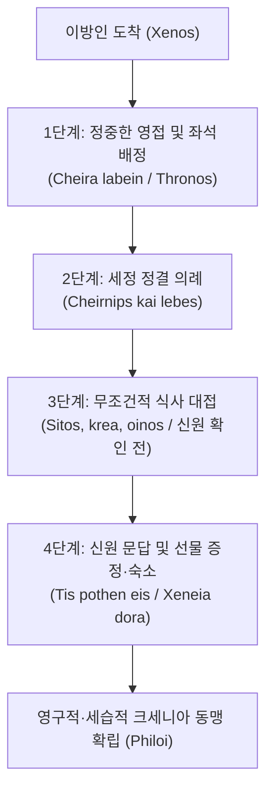

# 크세니아 (Xenia)

**[[greek-reading-guide|읽는 법]]**: 크세니아 · **원어**: ξενία · **학술 전사**: *ksenía*

## 1. 개념 정의 및 종교적·사회적 위상

**크세니아**(ξενία, *ksenía*; 관용 라틴명 Xenia)는 고대 그리스 사회에서 낯선 이방인(**크세노스**, Xenos, ξένος)과 주인(Host) 사이에 맺어지는 **신성한 손님 환대 규범이자 세습적 상호 안전 보장 제도**입니다. 희랍어 *xenos*는 환대를 받는 손님(Guest)과 환대를 베푸는 주인(Host) 양방향을 모두 지칭하며, 이는 크세니아가 본질적으로 **상호적·호혜적(Reciprocal) 관계**임을 보여줍니다.

중앙집권적 공권력과 치안 기구가 부재했던 아르카익 그리스 세계에서, 여행자는 본질적으로 무권리 상태이자 잠재적 약탈 대상에 불과했습니다. 크세니아는 이 취약한 이방인을 폭력과 경쟁의 영역에서 비적대적 협력 영역(**필로스**, Philos, φίλος) 내부로 수용하여 숙식과 안전을 제공하고, 향후 상대 지역 방문 시 동등한 보호를 약속받는 상호부조의 핵심 기제였습니다 ([[scott-1982-philos-philotes-xenia|Scott 1982]]).

- **제우스 크세니오스(Zeus Xenios)의 신학적 보증과 트로이아 원정의 사법적 정당성**:
  - 나그네와 손님의 안전은 최고신 **[[entity-zeus|제우스]] 크세니오스**(Zeus Xenios, 손님 환대의 수호신)의 권위 아래 놓입니다. 손님을 해치거나 환대를 배신하는 것은 단순한 사적 모욕이나 에티켓 위반이 아니라, 환대의 최고 수호신인 제우스에 대한 중대한 종교적 불경죄(Sacrilege)이자 신적 법질서에 대한 정면 도전입니다.
  - 휴 로이드-존스([[lloyd-jones-1971-justice-of-zeus|Lloyd-Jones 1971]], pp. 5–9)가 실증하듯, 『일리아스』 전체를 관통하는 트로이아 원정의 도덕적·신학적 동인은 바로 이 크세니아의 침해에 대한 신적 징벌에 있습니다. 트로이아의 함락은 전사들의 맹목적 완력이나 잔혹한 힘의 승리가 아니라, 손님 환대의 법도를 유린한 파리스와 이를 묵인한 트로이아에 대해 제우스가 내린 사법적 판결의 필연적 집행(execution of Zeus's decree)입니다.
  - 『일리아스』 3권에서 메넬라오스는 자신을 배신하고 헬레네를 유괴한 파리스와의 결투를 앞두고 제우스 크세니오스에게 공정한 응징을 탄원하며(*Il._ 3.351–354), 13권에서는 트로이아인들이 제우스 크세니오스의 무거운 분노를 두려워하지 않는다고 준열히 꾸짖습니다(*Il._ 13.622–625). 즉 아카이아 연합군의 트로이아 원정은 사적 복수를 넘어 크세니아를 침해한 죄악에 대한 범그리스적·신학적 징벌로서의 도덕적 정당성을 확보합니다 ([[minchin-2019-homeric-religion|Minchin 2019]]).
  - 『오뒷세이아』에서도 구혼자들의 만행은 오디세우스 가문의 환대 규범을 체계적으로 짓밟은 죄악으로 규정되며, 아테나 여신의 지원 아래 감행되는 구혼자 살육은 제우스의 환대 질서를 복원하는 신성한 응징(Dike)으로 정당화됩니다.
  - 에밀리 컨스([[kearns-2006-gods-in-homeric-epics|Kearns 2006]])가 분석하듯, *오뒷세이아* 후반부에서 신들은 개인적 편애를 넘어 크세니아를 파괴한 불의한 구혼자들을 징벌하고 의로운 오디세우스를 복권시키는 '도덕적 단일 전선(United front on a moral basis)'을 형성합니다. 시인 스스로 "신과 강한 영웅이 그들에게 차려줄 저녁보다 더 끔찍한 것은 없었을 것이니, 그들이 먼저 온당치 못한 짓을 꾸몄기 때문이라(*Od.* 20.392–395)"라고 확언하듯, 구혼자 살육은 크세니아 질서의 도덕적 수호를 위한 올림포스 전체의 신적 합의에 기초합니다.

---

## 2. 크세니아 의례의 4단계 프로토콜과 상징 체계

호메로스 서사시(특히 『오뒷세이아』)에서 크세니아는 엄격하고 정형화된 4단계 의례 절차를 준수합니다:

| 단계 | 의례 행위 및 희랍어 표현 | 문헌학적·사회적 의미 |
|:---|:---|:---|
| **1단계: 영접 및 좌석 안내** | 손잡아 이끌기(*cheira labein kai eisagein*), 털방석 의자 안내(*thronos / klismos*) | 이방인의 무장 해제 및 가정의 평화 구역으로의 수용. |
| **2단계: 세정 및 정결 의례** | 황금 주전자와 은대야로 손 씻기(*cheirnips kai lebes*), 발 씻기 | 여행의 노고와 외부 부정(Miasma)을 정화하는 종교적 의식. |
| **3단계: 무조건적 식사 제공** | 빵과 고기, 섞은 포도주 대접(*sitos, krea, oinos*) | **신원 및 목적을 묻기 전 무조건적 식사 제공** (의례적 무차별성). |
| **4단계: 신원 문답 및 선물·숙소** | 정체 탐문(*tis pothen eis*), 잠자리 마련 및 작별 선물(*xeneia dōra*) | 가문 간 크세니아 결연 확정 및 양측 명예([[concept-time\|Timê]])의 물적 증명. |

---

## 3. 크세니아의 도덕심리학적·사회철학적 역학

### 3.1 필로스(Philos)와 긴장의 완화
- 아가토스는 자신의 아레테([[concept-arete|Arete]])와 지위를 지키기 위해 끊임없는 경계와 긴장 상태에 놓여 있음.
- 크세니아는 낯선 타자를 '그 앞에서는 경계와 긴장을 풀고 이완될 수 있는 대상(**필로스, Philos**)'으로 전환시킴 ([[scott-1982-philos-philotes-xenia|Scott 1982]]).
- 알키노오스 왕의 선언처럼, "지각이 있는 사람에게 손님과 탄원자는 형제의 자리에 있음"(_Od._ 8.546–547).

### 3.2 티메(Timê)의 교환과 손님 선물(Xeneia)
- 손님을 환대하는 것(*philein*)은 곧 그에게 명예를 증여하는 것(*tiemen*)이며, 홀대하는 것은 모욕(*atimazein*)임.
- 작별 시 건네는 손님 선물(*xeneion*)은 주인의 부와 관대함을 입증하여 주인의 티메를 높이고, 손님의 귀향 길에 그의 지위를 증명해 주는 물적 보증이 됨 (_Od._ 10.38–41, 11.356–361).
- 단, 교환되는 선물의 가치는 균형을 이루어야 하며, 글라우코스가 디오메데스와 황금 무구를 청동 무구와 바꾼 행위(_Il._ 6.234–236)는 자신의 티메를 훼손한 어리석음으로 간주됨.

### 3.3 필록세니아(Philoxenia)와 문명(Eunomia) 대 야만의 준별
- 『오뒷세이아』에서 문명화된 인간의 징표는 '이방인을 환대하고 신을 두려워하는 성품(**필록세니아, Philoxenia** / *theoudês*)'임.
- 반면 무법과 야만의 징표는 이방인을 적대하고 법을 무시하는 오만(**히브리스, [[concept-hybris|Hybris]]** / *agrios, ou dikaios*)임.
- 식인 괴물 폴리페모스뿐만 아니라, 오디세우스의 집에서 거지를 구타한 구혼자 안티노오스는 크세니아를 파괴한 야만인으로 단죄됨 (_Od._ 17.483–487).

---

## 4. 서사시 내 주요 문헌학적 용례

### 4.1 트로이 전쟁의 신학적·사법적 동인: 파리스의 크세니아 배신과 지연된 정의 (『일리아스』 3·4·13권)
- **파리스의 크세니아 유린과 트로이아 원정의 종교적 성격**:
  - 트로이 전쟁의 근본적 원인은 영토 분쟁이나 단순한 민족적 적대감이 아니라, 스파르타의 손님으로 극진히 환대받았던 [[entity-paris|파리스]]가 메넬라오스의 아내 헬레네와 보물을 훔쳐 달아난 **크세니아 유린 범죄**에 있습니다 ([[lee-junseok-2024-iliad-jeongam|이준석 2024]]).
  - 파리스의 배신은 단순한 사적 모욕을 넘어 손님 환대의 최고 수호신인 **제우스 크세니오스**(Zeus Xenios)에 대한 직접적인 종교적 불경죄(Sacrilege)이자 신적 법질서에 대한 정면 도전입니다.
  - 『일리아스』 3권에서 메넬라오스는 파리스와의 단독 결투를 앞두고 제우스 크세니오스에게 공정한 사법적 응징을 탄원합니다:
    - **번역**: "제우스 주신이여, 내게 먼저 악행을 저지른 고결한 알렉산드로스(파리스)에게 복수하게 하시고 내 손에 쓰러지게 하소서. 그리하여 훗날 태어날 인간들 가운데 누구라도 자신을 손님으로 환대한 주인에게 해악을 끼치기를 두려워하게 하소서."
    - **원문**: *ῥιγήσῃ κακὰ ῥέξαι ἀριξείνῳ ποθι φωτί*
    - **학술 전사**: *rhigḗsēi kakà rhéksai arikseínōi pothi phōtí* (_Il._ 3.351–354)
  - 13권에서도 메넬라오스는 트로이인들이 환대의 신 제우스 크세니오스의 무거운 분노를 두려워하지 않고 손님 환대의 집을 짓밟았음을 질타합니다(_Il._ 13.620–627).
- **3~4권 맹세(Horkia) 파기와 아가멤논의 '지연된 정의' 선언**:
  - 3권에서 아카이아와 트로이아 양군은 제우스와 태양신, 강들과 지하의 복수신들을 증인으로 삼아 거룩한 휴전 맹약(ὅρκια, *hórkia*)을 맺고, 이를 깨뜨리는 자는 뇌수가 땅에 쏟아질 것이라 서약합니다.
  - 그러나 4권에서 트로이아의 명궁 판다로스가 아테나의 사주와 자신의 분별없는 욕망에 이끌려 메넬라오스에게 화살을 쏨으로써 신성한 맹세를 파기합니다.
  - 이에 분노한 아가멤논은 트로이의 필망과 제우스의 필연적 심판을 선언합니다:
    - **번역**: "비록 올림포스의 주재자께서 즉시 벌을 내리지 않으실지라도, 언젠가는 반드시 큰 대가를 치르게 하실 것이며, 그들은 자신들의 머리와 아내와 자식들로 무거운 죗값을 치르게 되리라."
    - **원문**: *εἴ περ γάρ τε καὶ αὐτίκ’ Ὀλύμπιος οὐκ ἐτέλεσσεν, / ἔκ τε καὶ ὀψὲ τελεῖ, σύν τε μεγάλῳ ἀπέτισαν*
    - **학술 전사**: *eí per gár te kaì autík’ Olúmpios ouk etélessen, / ék te kaì opsè teleî, sún te megálōi apétisan* (_Il._ 4.160–161)
- **로이드-존스의 실증 분석: 지연된 정의와 트로이아 함락의 사법적 필연성**:
  - 휴 로이드-존스([[lloyd-jones-1971-justice-of-zeus|Lloyd-Jones 1971]], pp. 5–9)는 이 구절을 호메로스 서사시 전체의 도덕적·신학적 척추인 '**지연된 정의** (Delayed Justice)' 테제의 결정적 문헌학적 증거로 제시합니다.
  - 19세기 이래 고전학계의 발전론자들(스넬, 애드킨스)은 『일리아스』에는 도덕적 정의가 결여되어 있고 맹목적 무력과 변덕스러운 신들만 존재한다고 보았습니다.
  - 그러나 로이드-존스는 서사시의 첫 시작(파리스의 크세니아 유린)부터 전개(판다로스의 맹세 파기), 그리고 결말(트로이아의 완전한 멸망)에 이르는 전 과정이 제우스의 사법적 판결 집행(execution of Zeus's decree)이라는 단일한 도덕적 인과율 아래 완결된다고 논증했습니다.
  - 제우스의 정의(Dike)는 인간의 조급한 기대처럼 즉각 실현되지 않을 수 있지만 늦게라도(*opsé*) 반드시 집행되며, 시간이 지체될수록 그 형벌의 무게는 가중되어 개인을 넘어 불의를 방조한 공동체 전체의 파멸로 귀결됩니다. 트로이의 함락은 맹목적 무력의 승리가 아니라, 크세니아와 맹세를 유린한 자들에 대한 제우스의 정의의 엄정한 승리입니다.

### 4.2 전장에서의 크세니아 발동: 디오메데스와 글라우코스 (『일리아스』 6권)
- 아카이아 장수 [[entity-diomedes|디오메데스]]와 트로이 맹장 [[entity-glaukos|글라우코스]]가 격전 중 마주쳐 가문을 밝힘.
- 조부 오이네우스와 벨레로폰이 맺은 크세니아와 선물 교환 기억을 상기하자, 두 사람은 즉시 창을 땅에 꽂고 전투를 중단함:
  - *"그러므로 나는 아르고스 한가운데서 그대에게 소중한 크세노스(φίλος ξεῖνος)요, 그대는 내가 뤼키아에 갈 때 나의 크세노스요. 그러니 우리 싸움터에서 서로의 창을 피하도록 합시다."* (_Il._ 6.224–226)
- 이는 국가적 애국심이 부재했던 호메로스 세계에서, 가문 간의 세습적 크세니아가 전시의 적대감조차 무력화하는 최상위의 구속력을 지녔음을 증명합니다.

### 4.3 네스토르와 메넬라오스의 모범적 환대 (『오뒷세이아』 3·4권)
- 필로스에 도착한 [[entity-telemachos|텔레마코스]]에게 [[entity-nestor|네스토르]]는 그들이 해적일 가능성을 알면서도 먼저 고기와 포도주를 풍성히 대접함 (_Od._ 3.69–74).
- 스파르타의 [[entity-menelaos|메넬라오스]]는 새로운 손님을 다른 집으로 보내려던 시종 에테오네우스를 꾸짖으며 환대의 '연쇄 상호성'을 역설함:
  - *"우리는 다른 사람들의 후한 대접을 먹고 마시며 이곳까지 무사히 돌아왔소. 그러니 어서 손님들의 말들을 풀고 안으로 모셔 식사를 대접하시오."* (_Od._ 4.31–36)

### 4.4 돼지치기 에우마이오스의 가난 속 고결한 환대 (『오뒷세이아』 14권)
- 남루한 거지로 변장한 주인 오디세우스를 맞이한 노예 [[entity-eumaeus|에우마이오스]]는 자신이 가진 가장 좋은 돼지를 잡아 대접함:
  - *"이방인이여, 비록 그대보다 더 초라한 자가 찾아올지라도 손님을 홀대하는 것은 나의 법도가 아니오. 모든 나그네와 거지는 제우스의 보살핌 아래 있기 때문이오. 우리가 베푸는 것은 비록 보잘것없지만 자연스러운 정성이오(φίλη)."* (_Od._ 14.56–59)
- 크세니아는 부유한 영웅들만의 사치스러운 과시가 아니라, 미천한 신분의 하인에게도 체화된 보편적 윤리였음을 입증합니다.

### 4.5 폴리페모스의 반(反)크세니아와 신벌 (『오뒷세이아』 9권)
- 퀴클롭스 [[entity-polyphemos|폴리페모스]]는 손님 선물을 청하며 제우스 크세니오스를 내세우는 오디세우스에게 "퀴클롭스는 제우스나 신들을 신경 쓰지 않는다"고 조롱하며 부하들을 잡아먹음 (_Od._ 9.266–278).
- 폴리페모스가 눈이 멀고 파멸하는 것은 호메로스 서사시가 반크세니아적 야만에 내리는 가장 명확한 우주적 단죄입니다 ([[lee-junseok-2016-odyssey-humanity|이준석 2016]]).

### 4.6 구혼자들의 크세니아 유린과 안티노오스의 파멸 (『오뒷세이아』 17·22권)
- 구혼자들은 주인이 부재한 집에서 매일 재산을 축내며 크세니아를 기생적 착취로 변질시킴.
- 특히 수괴 [[entity-antinoos|안티노오스]]가 구걸하는 오디세우스에게 발판(Footstool)을 던져 폭행하자, 동료 구혼자들조차 신들이 나그네로 변장하여 인간의 오만을 감시한다는 네메시스를 느끼며 경악함 (_Od._ 17.483–487).
- 22권의 구혼자 살육은 단순한 사적 복수가 아니라, 훼손된 가정의 테미스([[concept-themis|Themis]])와 크세니아의 신성한 질서를 회복하는 우주적 응징입니다.

---

## 5. 학술적 쟁점 및 개념사적 수용

### 5.1 실리적 도구론(Adkins) 대 상호부조와 문명 질서(Scott, Gould)

> [!WARNING] 모순/이설 발견: 크세니아의 성격에 관한 학설 대립
> A. W. H. 애드킨스(Adkins 1960, 1963)는 크세니아를 아가토스(Agathos) 계층의 철저한 '자기보존을 위한 실리적 도구'로 파악했습니다. 반면 메리 스콧(Scott 1982)과 존 굴드(Gould 1973)는 비록 실리적 동기에서 출발했더라도, 실제 환대 의례는 '신원 확인 이전의 무조건적 숙식 제공'과 '연쇄 상호성'을 통해 보편적 인간 존중과 문명적 법질서의 초석으로 기능했음을 강조합니다.

### 5.2 로이드-존스(Lloyd-Jones 1971)의 제우스의 정의 일관성 모델

- **진화론적 단절론 비판**:
  - 19세기 이래 고전학계(스넬, 애드킨스, 예거)는 『일리아스』에는 정의 개념이 없으며 오직 『오뒷세이아』에 이르러서야 도덕적 정의가 발명되었다는 역사주의적 진화론을 고수했습니다.
  - 그러나 휴 로이드-존스([[lloyd-jones-1971-justice-of-zeus|Lloyd-Jones 1971]])는 『일리아스』와 『오뒷세이아』 전반에 걸쳐 **제우스 크세니오스**(Zeus Xenios)와 **제우스의 정의**([[concept-dike|Dike]])가 일관되고 확고한 도덕 원리로 작동하고 있음을 실증했습니다.
- **트로이아 전쟁과 구혼자 살육의 동일한 사법 구조**:
  - 파리스의 크세니아 배신에 대한 트로이아의 함락(*Il.*)과, 오디세우스 가문의 크세니아를 유린한 구혼자들에 대한 살육(*Od.*)은 동일한 신학적·사법적 인과율 위에 놓여 있습니다.
  - 인간의 오만과 환대 규범 유린은 제우스 크세니오스에 대한 불경죄이며, 이는 '지연된 정의'의 법칙에 따라 반드시 파멸적 신벌(Tisis)을 초래합니다.

---

## 6. 증거 매트릭스 (Evidence Matrix)

| 구분 | 출전 및 문헌 | 핵심 내용 및 테제 | 문헌학적 증거 수준 |
|:---|:---|:---|:---:|
| **원전 텍스트** | 『일리아스』 3.351–354 | 파리스의 크세니아 배반에 대한 메넬라오스의 제우스 크세니오스 탄원 | [A] 확실한 원전 명시 |
| **원전 텍스트** | 『일리아스』 4.160–168 | 판다로스의 맹세 파기와 아가멤논의 지연된 정의(*opsè teleî*) 선언 | [A] 확실한 원전 명시 |
| **원전 텍스트** | 『일리아스』 6.224–226 | 디오메데스와 글라우코스의 조부 세습 크세니아 확인 및 교전 중단 | [A] 확실한 원전 명시 |
| **원전 텍스트** | 『오뒷세이아』 9.266–278 | 폴리페모스의 반(反)크세니아적 불경과 그에 대한 신벌적 실명 | [A] 확실한 원전 명시 |
| **원전 텍스트** | 『오뒷세이아』 14.56–59 | 돼지치기 에우마이오스의 제우스 손님법 준수와 정성어린 환대 | [A] 확실한 원전 명시 |
| **원전 텍스트** | 『오뒷세이아』 20.392–395 | 구혼자들의 환대 유린에 대한 신들의 도덕적 단일 전선과 단죄 | [A] 확실한 원전 명시 |
| **2차 연구** | [[lloyd-jones-1971-justice-of-zeus\|Lloyd-Jones 1971]] | 제우스 크세니오스의 사법적 섭리와 트로이아 원정의 지연된 정의 규명 | [B] 주요 비판 연구 |
| **2차 연구** | [[scott-1982-philos-philotes-xenia\|Scott 1982]] | 필로스와 크세니아의 관계, 이방인의 비적대적 영역 포섭과 연쇄 상호성 | [B] 표준 학설 |
| **2차 연구** | [[minchin-2019-homeric-religion\|Minchin 2019]] | 제우스 크세니오스의 환대 감시와 신학적 정당화 분석 | [B] 최신 종교학 연구 |
| **2차 연구** | [[kearns-2006-gods-in-homeric-epics\|Kearns 2006]] | 크세니아 수호를 위한 올림포스 신들의 도덕적 단일 전선 분석 | [B] 표준 신학 연구 |
| **2차 연구** | [[lee-junseok-2024-iliad-jeongam\|Lee 2024]] | 파리스의 크세니아 유린과 트로이 전쟁 발발의 사법적 성격 해제 | [B] 최신 표준 번역 해제 |

---

## 관련 항목
### 호메로스 텍스트 및 인물
- [[일리아스]]
- [[오뒷세이아]]
- [[entity-odysseus|오디세우스]]
- [[entity-telemachos|텔레마코스]]
- [[entity-menelaos|메넬라오스]]
- [[entity-nestor|네스토르]]
- [[entity-eumaeus|에우마이오스]]
- [[entity-diomedes|디오메데스]]
- [[entity-glaukos|글라우코스]]
- [[entity-paris|파리스]]
- [[entity-polyphemos|폴리페모스]]
- [[entity-antinoos|안티노오스]]
- [[entity-zeus|제우스]]

### 관련 윤리·종교·사회 개념
- [[concept-hikesia|Hikesia]] (탄원의 의례와 경외)
- [[concept-aidos|Aidos]] (수치심과 신성한 경외)
- [[concept-nemesis|Nemesis]] (공적 의분과 분배의 정의)
- [[concept-themis|Themis]] (관습적 정의와 환대의 법도)
- [[concept-time|Timê]] (명예와 물질적 위계)
- [[concept-arete|Arete]] (탁월성과 자기보존 규범)
- [[concept-dike|Dike]] (우주적 정의와 응징)
- [[concept-eleos|Eleos]] (연민과 환대의 정서)
- [[concept-hybris|Hybris]] (오만과 크세니아 파괴)
- [[concept-eunomia|Eunomia]] (문명적 좋은 법질서)
- [[concept-horkos|Horkos]] (신성한 맹세와 파기 시의 응징)

### 관련 연구 소스 및 종합 분석
- [[lloyd-jones-1971-justice-of-zeus]] (휴 로이드-존스: 제우스의 정의 — 제우스 크세니오스와 지연된 정의 실증 분석)
- [[scott-1979-pity-and-pathos]] (메리 스콧: 호메로스에서의 연민과 파토스 — 환대에서의 엘레오스 분석)
- [[scott-1982-philos-philotes-xenia]] (메리 스콧: 필로스, 필로테스, 크세니아 표준 연구)
- [[scott-1980-aidos-and-nemesis]] (메리 스콧: 아이도스와 네메시스)
- [[adkins-1960-merit-and-responsibility]] (A. W. H. 애드킨스: 공적과 책임)
- [[lee-junseok-2024-iliad-jeongam]] (이준석: 일리아스 집중강좌 — 파리스의 크세니아 배반 분석)
- [[lee-junseok-2016-odyssey-humanity]] (이준석: 호메로스의 휴머니티와 구혼자 처벌)
- [[minchin-2019-homeric-religion]] (엘리자베스 민친: 호메로스의 종교 — 제우스 크세니오스의 환대 감시와 신학적 정당화 분석)
- [[kearns-2006-gods-in-homeric-epics]] (에밀리 컨스: 호메로스 서사시의 신들 — 구혼자 응징과 신들의 도덕적 단일 전선 분석)
- [[analysis-homeric-ethics-literature-review]] (호메로스 서사시 윤리학 연구사 종합 분석)
