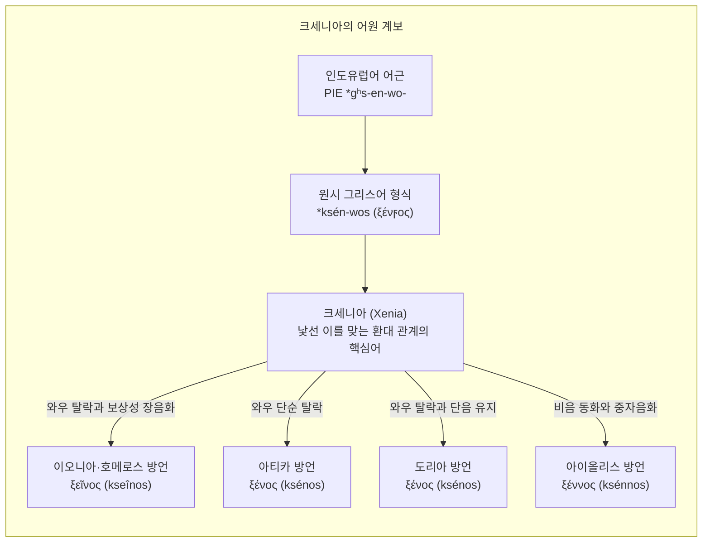
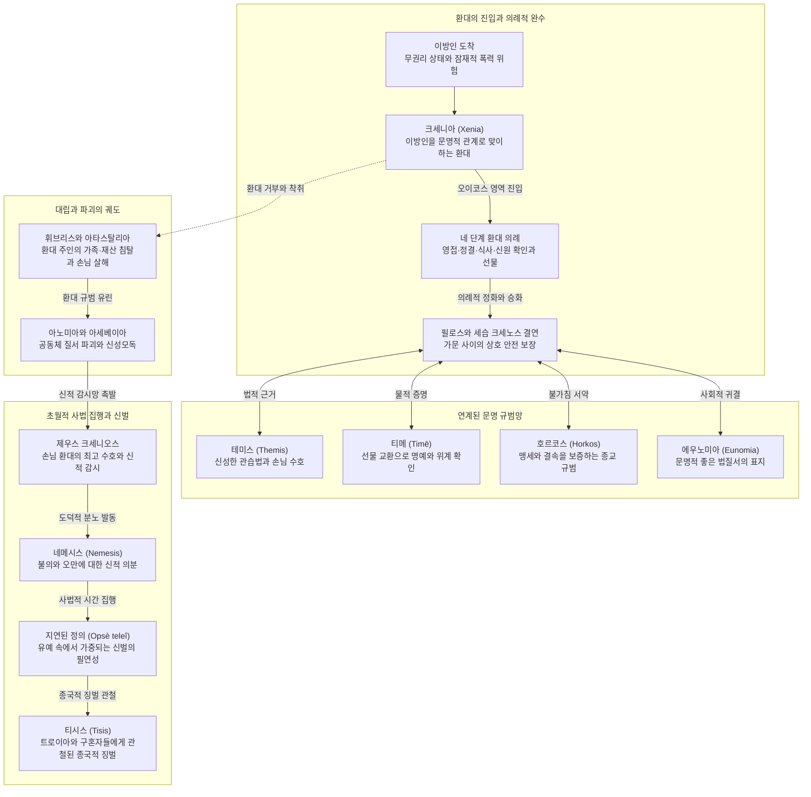

# 크세니아 (Xenia)

**[[greek-reading-guide|읽는 법]]**: 크세니아 · **원어**: ξενία · **학술 전사**: *ksenía*

## 1. 정의와 핵심 테제 (Definition & Core Thesis)

### 1.1 학술적 객관적 정의
**크세니아**(ξενία, *ksenía*; 관용 라틴명 Xenia)는 고대 그리스 사회에서 혈연 집단([[concept-oikos|Oikos]]) 외부에서 도래한 낯선 이방인(**크세노스**, *ksénos*)과 집주인(Host) 사이에 성립하는 **신성한 손님 환대 규범이자 세습적 상호 안전 보장 및 선물 교환 제도**입니다. 희랍어 명사 *ksenos*는 환대를 베푸는 '주인'과 환대를 받는 '손님'을 상호 대칭적으로 모두 지칭하듯, 크세니아는 일방적 시혜가 아니라 양자 간의 엄격한 상호 호혜적(Reciprocal) 권리와 의무를 규정하는 제도적 계약입니다.

### 1.2 연구사적 4대 핵심 명제
1. **상호 대칭적 의무 계약과 호혜적 교환 질서** ([[benveniste-1969-vocabulaire-institutions-2|Benveniste 1969]]):
   크세니아는 인도유럽 조어 단계의 공통 어근 `*gʰos-ti-`에 기반하여, 잠재적 적대자였던 외부인을 평화적 동맹자로 전환시키는 총체적 급부(Total prestation) 체계입니다.
2. **실존적 긴장 완화와 계발된 자기이익의 연쇄 상호성** ([[scott-1982-philos-philotes-xenia|Scott 1982]]):
   상시적 침탈과 명예 훼손의 공포에 노출된 영웅들이 무장을 해제하고 안도할 수 있는 '협력적 평화 지대'이자, 과거 타인에게 받은 은혜를 새로운 이방인에게 갚는 '연쇄 상호성' 메커니즘입니다.
3. **제우스 크세니오스의 사법적 섭리와 지연된 정의** ([[lloyd-jones-1971-justice-of-zeus|Lloyd-Jones 1971]], [[lee-junseok-2024-iliad-jeongam|Lee 2024]]):
   크세니아의 침해는 단순한 예절 위반이 아니라 우주적 불경죄([[concept-asebeia|아세베이아]])이며, 최고신 제우스의 지연된 정의(*opsè teleî*)에 의해 가문과 국가의 완전한 파멸([[concept-tisis|티시스]])을 초래합니다.
4. **올림포스 신들의 도덕적 단일 전선과 환대 질서의 복원** ([[kearns-2006-gods-in-homeric-epics|Kearns 2006]], [[lee-junseok-2016-odyssey-humanity|Lee 2016]]):
   신들은 당파적 편애를 넘어 크세니아 질서를 수호하고 오만한 구혼자들을 단죄하기 위해 도덕적 단일 전선을 구축합니다.

### 1.3 비판적 학술 감시: 귀족 과두 카르텔과 권력 투쟁
- **귀족 중심의 배타적 과두 카르텔**:
  크세니아를 낭만주의적 '보편 인류애'나 '무조건적 인도주의'로 미화하는 것은 서사시의 역사적 실재를 왜곡하는 것입니다. 당대 사회에서 크세니아는 본질적으로 대등한 자원과 무력을 지녀 미래에 환대를 되갚을 능력(Reciprocity)이 있는 **지배 귀족(바실레우스 계층) 간의 배타적 과두 카르텔**이었습니다.
- **하층 유랑민의 실존적 취약성**:
  보답 능력이 없는 하층 유랑민이나 걸인(Ptochos)에게 크세니아는 보장된 권리가 아니었으며, 『오뒷세이아』 17권에서 거지로 변장한 오디세우스가 안티노오스에게 발판으로 구타당하듯(*Od.* 17.462) 일상적 폭력에 노출되어 있었습니다. 돼지치기 에우마이오스의 환대(*Od.* 14.56–59)는 종복의 예외적 종교적 경건함이자 서사적 극화일 뿐 당대 사회의 제도적 보장이 아니었습니다.
- **선물 교환(Xeneia)과 위신 경제의 권력 투쟁**:
  손님 선물(Xeneia) 교환은 순수한 호의에 그치지 않고, 가문의 부와 명예([[concept-time|티메]])를 과시하고 상대를 도덕적 채무자로 묶어두려는 **치열한 위신 경제(Prestige Economy)이자 권력 투쟁**이었습니다. 디오메데스와 글라우코스의 무구 교환(*Il.* 6.234–236)에서 100마리 황소 가치의 황금 무구를 9마리 청동 무구와 바꾼 글라우코스의 어리석음에 대한 시인의 냉소는 이를 잘 보여줍니다.

---

## 2. 어원과 형태론 (Etymology & Morphology)

### 2.1 인도유럽조어(PIE) 기원과 비교언어학적 계통
명사 **크세니아**(ξενία, *ksenía*)와 형용사·명사 **크세노스**(ξένος, *ksénos*; 호메로스 서사시형 **크세이노스**, ξεῖνος, *kseînos*)는 고대 그리스 사회의 영토적 경계와 인적 결속을 규정하는 핵심 제도 어휘입니다. 비교언어학(Chantraine DELG 762–763; Frisk GEW 2.327–328; Beekes EDG 1032–1033)과 인도유럽 제도 어휘 연구([[benveniste-1969-vocabulaire-institutions-2|Benveniste 1969]], I, pp. 87–101)에 따르면, 이 어휘군은 인도유럽조어(PIE) 단계의 복합적 어원 계통과 동계어 대응을 형성합니다.

- **인도유럽조어 어근과 파생 구조**:
  - 그리스어 *ksénos* / *kseînos*의 원형은 원시 그리스어 형태인 `*ksén-wos`(ξένϝος)로 재구됩니다.
  - 이는 인도유럽조어 어근 `*gʰos-` 또는 영계제(zero-grade) 형태인 `*gʰs-`에 비음 접미사(`*-en-`)와 반모음 접미사(`*-wo-`)가 결합된 `*gʰs-en-wo-` 계통으로 분석됩니다.
  - 기원전 2천년기 미케네 선문자 B(Linear B) 정형 문서(KN As 1516, PY Cn 286 등)에 기록된 **케세누워**(*ke-se-nu-wo*, /ksenwos/)는 이 어휘가 그리스 방언 분화 이전부터 반모음 와우(w/digamma, ϝ)를 포함한 온전한 자음군(`*-nw-`) 형태로 실재했음을 실증합니다.
- **인도유럽어족 동계어(Cognates) 비교와 `*gʰos-ti-` 계통 대조**:
  - 라틴어, 게르만어, 슬라브어는 동일 어근 `*gʰos-`에 치음 접미사(`*-ti-`)가 결합된 PIE `*gʰos-ti-`('낯선 자', '손님', '주인') 계통을 온전히 보존하고 있습니다:
    - **라틴어**: 호스티스(*hostis*)는 고졸기 라틴어(12표법)에서 본래 '법적 권리를 인정받는 대등한 외국인/이방인'을 뜻했으나, 공화정기 이후 '공동체의 공적 적(Public Enemy)'으로 의미가 특화되었습니다. 반면 '손님'과 '주인'의 상호 호혜적 기능은 복합어 호스페스(*hospes* < `*gʰos-pot-is`, '낯선 자를 다스리는 주인/손님의 주재자')로 분화 발전하였습니다.
    - **게르만어파**: 게르만 조어 `*gastiz`에서 유래하여 고트어 가스츠(*gasts*), 고대고지독일어 가스트(*gast*), 고대영어 기에스트(*giest/gæst*)를 거쳐 현대 영어 **게스트**(*guest*)로 이어졌습니다.
    - **슬라브어파**: 고대교회슬라브어 고스티(*gostь*), 러시아어 고스티(*гость*) 등에서 손님과 상인을 지칭하는 어휘로 정착하였습니다.
  - 그리스어 `*ksen-wos`는 라틴어 *hostis* 및 영어 *guest*와 직접적인 접미사 형성 방식(`*-wo-` 대 `*-ti-`)에서는 갈라지지만, '경계 외부의 낯선 타자'를 지칭하던 원시 인도유럽어의 어휘적·제도적 기저를 공유합니다.

### 2.2 방언 음운론과 디감마(ϝ) 소실에 따른 분화
원시 그리스어 어형 `*ksén-wos`(ξένϝος)는 그리스 방언들이 비음 뒤의 반모음 와우(`*-nw-`)를 처리하는 방식에 따라 네 갈래의 전형적인 음운론적 분화를 거쳤습니다:

1. **이오니아·호메로스 서사시 방언 (ξεῖνος, *kseînos*)**:
   - 비음 뒤의 와우(ϝ)가 소실되면서 앞선 단모음 ε가 장음화되는 **보상성 장음화**(Compensatory Lengthening)를 겪었습니다.
   - 이때 형성된 장모음 /eː/는 가성 이중모음(spurious diphthong) 표기인 `ει`로 고착되어 **크세이노스**(ξεῖνος)가 되었습니다. 호메로스 헥사메테론 서사시에서는 운율적 편의(단장단 운율 및 장모음 음보 확보)를 위해 이 이오니아형 ξεῖνος가 압도적인 빈도로 사용됩니다.
2. **아티카 방언 (ξένος, *ksénos*)**:
   - 와우(ϝ)가 보상성 장음화 없이 단순 탈락하여 단모음 ε를 그대로 유지한 **크세노스**(ξένος)로 정착하였습니다. 이는 고전기 아테네 산문과 비극의 표준형이 되었습니다.
3. **도리아 방언 (ξένος, *ksénos*)**:
   - 대부분의 도리아 방언(라코니아, 코린토스, 크레타 등)에서도 보상성 장음화를 거치지 않고 와우가 탈락하여 **크세노스**(ξένος)로 나타납니다.
4. **아이올리스 방언 (ξέννος, *ksénnos*)**:
   - 레스보스와 테살리아의 아이올리스 방언에서는 반모음 와우가 앞선 비음 ν에 역행 동화되어 중자음(geminate)을 형성하는 **자음 중첩 현상**이 일어났습니다.
   - 그 결과 사포(Sappho fr. 134)와 알카이오스의 서정시에서 확인되듯 **크센노스**(ξέννος) 형태가 확립되었습니다.

### 2.3 '낯선 적대자'에서 '신성한 손님·주인'으로의 의미론적 진화 경로
에밀 벤베니스트([[benveniste-1969-vocabulaire-institutions-2|Benveniste 1969]])가 명쾌하게 분석했듯이, 크세니아 어휘군은 '잠재적 적대 관계'에서 '신성한 호혜 동맹'으로 전환되는 3단계 의미론적 진화 궤적을 보여줍니다:

1. **제1단계: 영역 외부의 무권리자이자 잠재적 적대자 (The Outlaw Stranger)**:
   - 중앙집권적 법 집행 기구와 국가 공권력이 부재했던 고졸기 사회에서, 혈연 집단(oikos, phratria)과 공동체의 영역 바깥에 존재하는 인간은 본질적으로 법적 보호를 받지 못하는 무권리 상태였습니다.
   - 라틴어 *hostis*가 '이방인'에서 '적'으로 전환된 것처럼, 경계를 넘어온 낯선 타자는 약탈자, 해적, 혹은 적대적 침입자로 간주되는 극단적 취약성과 위험성을 동시에 내포했습니다.
2. **제2단계: 호혜적 의례를 통한 비적대적 영역 포섭 (The Ritualized Contract)**:
   - 타자와의 영구적 적대는 소모적 파멸을 초래하므로, 낯선 자를 폭력의 장에서 평화의 장인 **필로스** (φίλος, *phílos*)의 범주 내부로 끌어들이는 의례적 장치가 요구되었습니다 ([[scott-1982-philos-philotes-xenia|Scott 1982]]).
   - 무기를 거두고, 손을 씻기며, 신원을 묻기 전에 음식을 나누는 정형화된 환대 의례를 통해 '위험한 이방인'은 '평화적 손님'으로 탈바꿈합니다.
   - 이 단계에서 명사 *ksenos*는 환대를 베푸는 **주인**(Host)과 환대를 받는 **손님**(Guest) 양방향을 동시에 가리키는 **의미론적 상호 대칭성**을 획득합니다.
3. **제3단계: 제우스 크세니오스의 신정론적 보증과 세습 동맹 (Sacralized Institution)**:
   - 손님-주인 관계는 일회적 접대를 넘어 신성한 증표(**크세이네이아**, ξεινήϊα)의 교환과 가문 간의 영구적 동맹(**파트리오이 크세이노이**, πάτριοι ξεῖνοι)으로 제도화됩니다.
   - 이 계약은 최고신 **[[entity-zeus|제우스]] 크세니오스**(Zeus Xenios)의 직접적인 사법 관할 아래 편입되어, 이를 깨뜨리는 행위는 우주적 불경죄([[concept-asebeia|Asebeia]])이자 가문 전체의 파멸을 부르는 신벌의 대상([[concept-tisis|Tisis]])으로 규정되었습니다.

### 2.4 서사시 핵심 어휘 4열 형태론 표

| 그리스어 실제형 | 학술 전사 | 품사 및 형태론 | 의미 및 문헌학적 맥락 |
|:---|:---|:---|:---|
| ξενία | *ksenía* | 여성 명사 (단수 주격) | 손님 환대 규범, 환대의 의례, 손님과 주인 사이에 성립하는 신성한 계약 관계 전반. |
| ξεῖνος / ξένος | *kseînos* / *ksénos* | 형용사/명사 (남성 단수 주격) | 손님 또는 주인 (상호 대칭적). 서사시 운율에서는 이오니아형인 ξεῖνος가 압도적 빈도로 출현. |
| ξένιος / ξείνιος | *ksénios* / *kseínios* | 형용사 (남성 단수 주격) | 환대에 속하는, 손님을 수호하는. 주로 [[entity-zeus\|제우스]]의 신성 칭호(Ζεὺς ξένιος/ξείνιος)로 결합. |
| ξεινήϊα / ξένια | *kseinḗïa* / *ksénia* | 중성 명사 (복수 주격·대격) | 손님 선물, 환대의 물적 증표. 결연을 맺고 작별할 때 양측의 [[concept-time\|티메]]를 증명하는 귀금속·무구 등. |
| φιλόξενος | *philóksenos* | 복합 형용사 (남성 단수 주격) | 이방인을 기꺼이 환대하는, 손님을 사랑하는. 문명인의 핵심 징표로서 *theoudḗs*(신을 두려워함)와 상시 병치. |
| ξενίζω / ξεινίζω | *ksenízō* / *kseinízō* | 동사 (현재 능동태 직설법 1인칭 단수) | 손님으로 맞아들이다, 환대하다, 숙식을 제공하다. 접미사 *-izō*가 결합된 규범 행위 수행 동사. |
| ξενοδόκος / ξεινοδόκος | *ksenodókos* / *kseinodókos* | 남성 복합 명사 (단수 주격) | 손님을 맞아들이는 주인(*dékhomai* 영접하다 결합). 이방인을 오이코스 내부로 수용하는 환대의 주체. |
| ἀρίξεινος | *aríkseinos* | 복합 형용사 (남성 단수 여격 등) | 지극히 후대하는, 훌륭한 주인의. 『일리아스』 3.354에서 메넬라오스가 파리스의 배신을 고발하며 자신을 지칭. |
| ξενίη | *kseníē* | 여성 명사 (이오니아 단수 주격) | *ksenía*의 서사시·이오니아 방언형. 『오뒷세이아』 본문에서 정형구적으로 빈번히 채택. |
| ἄξεινος | *ákseinos* | 복합 형용사 (남성 단수 주격) | 손님을 환대하지 않는, 이방인에게 적대적인. 퀴클롭스 같은 야만적 상태를 규정하는 대립 어휘. |

### 2.5 대외 결속 규범 3대 체계 대조: 크세니아 vs 필로테스 vs 히케시아

| 비교 분석 축 | 크세니아 (Xenia, ξενία) | 필로테스 (Philotes, φιλότης) | 히케시아 (Hikesia, ἱκεσία) |
|:---|:---|:---|:---|
| **진입 시 초기 지위** | **잠재적 대칭자·동등한 독립 주체**: 여행자, 사절, 상인 등 독자적 신분과 위엄을 유지한 채 평화적으로 접근하는 이방인. | **대등한 계약 당사자**: 정치·군사적 동맹 집단, 휴전 협상 상대, 혹은 에로스적·정서적 연대를 형성하려는 동등자. | **극단적 비대칭·무력자**: 전장의 패배자, 살인 추방자, 난민 등 생명권이 완전히 박탈된 절대적 약자. |
| **필수적 신체 의례** | **상호 존중적 거리 유지와 환대 절차**: 손잡아 이끌기(dexiosis), 무기 거두기, 발·손 씻기기(cheirnips), 털방석 의자 안내. | **제의적 서약 및 신체 결합**: 희생제 거행, 헌주(spondai), 오른손 맞잡기(dexia tithenai), 성적 결합(kline/eune) 등. | **극단적 자기비하와 물리적 접촉**: 무릎 잡기(gounata labein), 턱 쓰다듬기(geneiou haptesthai), 손등 입맞춤, 잿더미 착석. |
| **핵심 청원 및 규범** | **무조건적 숙식 및 호혜적 결속**: 신원 탐문 전 식사 대접, 안전 호송(pompe), 손님 선물(xeinia) 교환, 세습 동맹 확립. | **상호 적대 종식 및 공동 협력**: 휴전 협약, 군사 방위 조약(horkia pista), 평화 정착, 상호 배타적 적대 행위 중지. | **생명 보존과 긴급 피난**: 즉각적 처형 면제(zōgrei), 피난처(asylia) 획득, 몸값(apoina) 지불을 통한 생존 보장. |
| **주권 수호신** | **[[entity-zeus\|제우스]] 크세니오스**(Zeus Xenios): 손님과 주인의 상호 관습 규범과 환대 계약을 총괄 수호. | **[[entity-zeus\|제우스]] 호르키오스**(Zeus Horkios) 및 **아프로디테**: 맹세의 불가침성 및 정서적 결합을 보증. | **[[entity-zeus\|제우스]] 히케시오스**(Zeus Hikesios): 자비와 보호를 애원하는 무력한 자의 탄원을 직접 감시. |
| **거부 및 침해 시 제재** | **공동체적 파멸과 지연된 신벌**: 가문과 국가 단위의 전쟁(트로이아 멸망, 구혼자 학살), 제우스의 엄중한 사법적 응징([[concept-tisis\|티시스]]). | **맹세 파기 저주와 에리뉘에스 추적**: 맹세 파기자(horkon lelobēkotes) 낙인, 동맹 파기, 뇌수가 땅에 쏟아지는 신체적 저주. | **우주적 부정(Miasma)과 신벌 촉발**: 종교적 불경에 따른 [[concept-nemesis\|네메시스]] 발동, 역병(Loimos) 창궐. (단, 전장에서는 거부 빈번). |

---

## 3. 호메로스 서사시 본문 용례와 맥락 (Homeric Attestation & Contexts)

### 3.1 『일리아스』에서의 출현과 용례

- **1) 트로이 전쟁의 발발 원인으로서의 파리스의 크세니아 배신 (_Il._ 3.351–354, 13.620–627)**:
  - 트로이 전쟁은 단순한 영토 쟁탈이나 민족 간 반목이 아니라, 스파르타 궁정에 빈객으로 머물며 극진한 대접을 받았던 트로이아 왕자 [[entity-paris|파리스]](알렉산드로스)가 안주인 헬레네와 가문의 귀중품을 탈취해 달아난 **크세니아 유린 범죄**에서 촉발되었습니다.
  - 『일리아스』 3권에서 [[entity-menelaos|메넬라오스]]는 파리스와의 단독 결투 직전 창을 던지며 최고신 [[entity-zeus|제우스]]에게 탄원합니다 (*Il._ 3.351–354). 그는 사적 원한의 해소를 넘어, 자신을 후대한 주인을 해친 자(*kseinodókon kakà rhéksai*)를 신벌로 다스림으로써 미래 세대(*opsigónoi ánthrōpoi*)가 환대의 법도를 침해하는 것을 두려워하게 해달라는 공적·사법적 정의를 청원합니다.
  - 13권에서 메넬라오스는 트로이 전사 피산드로스를 처단한 뒤 트로이아 진영을 향해 준열한 사자후를 토합니다 (*Il._ 13.620–627). 그는 트로이인들이 환대의 주신인 **제우스 크세니오스**(Ζεὺς ξείνιος, *Zeùs kseínios*)의 무거운 분노를 두려워하지 않고 손님으로 머물던 오이코스를 도륙하고 약탈했음을 고발하며, 제우스께서 반드시 트로이아의 높은 성벽을 파멸시킬 것이라 선언합니다. 이로써 아카이아 연합군의 원정은 단순한 침략이 아니라 크세니아 질서를 회복하기 위한 제우스의 사법적 판결 집행([[concept-dike|디케]])이라는 신학적·도덕적 정당성을 획득합니다.

- **2) 전장에서의 크세니아 발동과 살육 중단: 디오메데스와 글라우코스의 조부 세습 크세니아 확인 (_Il._ 6.215–236)**:
  - 아카이아의 맹장 [[entity-diomedes|디오메데스]]와 트로이 측 뤼키아 장수 [[entity-glaukos|글라우코스]]가 적대적 전선 한복판에서 일대일 결투를 위해 맞닥뜨려 가문의 계보를 문답합니다.
  - 글라우코스가 벨레로폰의 계보를 밝히자, 디오메데스는 자신의 조부 오이네우스가 벨레로폰을 20일간 궁정에서 환대하고 황금 술잔과 자주색 허리띠를 손님 선물(크세네이아, *kseíneia*)로 교환했던 사실을 상기합니다 (*Il._ 6.215–220).
  - 디오메데스는 즉시 창을 땅에 꽂고 교전을 중단하며, 아르고스에서는 자신이 글라우코스의 손님 친구이며 뤼키아에서는 글라우코스가 자신의 손님 친구(φίλος ξεῖνος, *phílos kseînos*)임을 선언합니다 (*Il._ 6.224–226).
  - 두 영웅은 난전 중에도 서로의 창을 피하기로 서약하고 무구를 맞바꿈으로써(글라우코스의 황금 무구와 디오메데스의 청동 무구) 세습 손님 결연(*kseînoi patrṓïoi*)을 공개적으로 확증합니다. 이는 폴리스적 애국심이 부재했던 호메로스 세계에서, 가문 간의 세습적 크세니아가 전시의 적대감조차 무력화하는 최상위의 법적·도덕적 구속력을 지녔음을 증명합니다.

- **3) 아킬레우스 천막에서의 손님 접대: 사절단 영접 (_Il._ 9.196–224) 및 프리아모스와의 식사 (_Il._ 24.621–632)**:
  - **사절단 영접 (_Il._ 9.196–224)**: 아가멤논과의 불화로 출전을 거부하고 막사에 칩거하던 [[entity-achilles|아킬레우스]]는 [[entity-odysseus|오디세우스]], 대(大)아이아스, 포이닉스가 당도하자 즉시 수금 연주를 멈추고 반갑게 일어서서 손을 잡으며 영접합니다 ("오신 것을 환영하오. 참으로 소중한 분들(φίλοι ἄνδρες, *phíloi ándres*)이 오셨구려"). 그는 사절단이 찾아온 정치적 용무(아가멤논의 배상 제안)를 묻기 전에, 파트로클로스에게 가장 순수한 포도주를 더 큰 잔에 따르게 하고 양과 염소, 돼지 등심을 구워 극진히 대접합니다. 손님의 신원과 목적을 탐문하기에 앞서 숙식을 무조건 제공하는 크세니아의 3단계 프로토콜이 철저히 준수됩니다.
  - **프리아모스와의 식사 (_Il._ 24.621–632)**: 자식을 죽인 원수의 막사에 야음을 틈타 홀로 찾아온 트로이아의 노왕 [[entity-priam|프리아모스]]의 탄원([[concept-hikesia|히케시아]])을 수용한 아킬레우스는, 헥토르의 시신 반환을 약조한 뒤 손수 흰 어린 양을 잡아 요리하고 노왕에게 고기와 빵을 권합니다 ("이제 우리 식사를 생각합시다, 고결한 노인이여"). 비극적 적대 관계를 초월하여 한 식탁에서 음식을 나누는 이 행위는, 맹목적 광포성(메니스)에 갇혀 있던 전사가 인간적 연민([[concept-eleos|엘레오스]])과 문명적 환대의 품격을 실존적으로 회복하는 결정적 순간입니다.

### 3.2 『오뒷세이아』에서의 출현과 용례

- **1) 텔레마코스의 편력과 모범적 영웅 환대: 네스토르의 필로스 (_Od._ 3.69–74), 메넬라오스의 스파르타 (_Od._ 4.31–36)**:
  - **필로스의 네스토르 (_Od._ 3.69–74)**: 필로스 해변에 도착한 [[entity-telemachos|텔레마코스]]와 아테나(멘토르 변장)를 맞이한 [[entity-nestor|네스토르]]와 아들들은 제사를 지내다 말고 즉시 달려와 손을 잡고 좌석으로 이끎으로써 환대를 시작합니다. 고기와 포도주를 풍성히 대접하고 헌주와 기도를 올린 후, 식사가 완전히 끝난 뒤에야 비로소 "이제 손님들이 음식으로 즐겼으니, 그대들이 누구이며 어디서 항해해 왔는지 묻는 것이 합당하오. 장사 때문이오, 아니면 목숨을 걸고 바다를 떠도는 해적들이오?"라고 신원을 탐문합니다. 이는 '신원 문답 이전의 무조건적 식사 제공'이라는 크세니아 의례의 정형화된 규범을 완벽히 보여줍니다.
  - **스파르타의 메넬라오스 (_Od._ 4.31–36)**: 스파르타 궁정에 도착한 텔레마코스 일행을 두고 시종 에테오네우스가 손님을 들일지 다른 곳으로 보낼지 묻자, 메넬라오스는 그를 준열히 꾸짖으며 자신들 역시 방랑 시절 수많은 타국에서 후한 대접(ξεινήϊα, *kseinḗïa*)을 받았기에 무사히 귀향할 수 있었음을 상기시킵니다. 환대는 1:1 폐쇄형 거래가 아니라, 과거 낯선 타인에게서 받은 은혜를 새로운 낯선 타인에게 베푸는 '연쇄 상호성(Chain Reciprocity)'의 보편 규범임을 천명합니다.

- **2) 파이아케스 왕실의 환대와 오디세우스의 정체 회복 (_Od._ 7·8권)**:
  - 스케리아섬 해변에 알몸으로 표착한 난민 오디세우스는 나우시카아의 조언에 따라 알키노오스 왕과 아레테 왕비의 궁전으로 들어갑니다. 화덕 재 속에 앉아 탄원하는 이방인을 원로 에케네오스의 간언에 따라 일으켜 세운 알키노오스는 은의자에 앉히고 정결 의례와 만찬을 베풉니다.
  - 파이아케스인들은 손님의 이름조차 묻지 않은 채 하룻밤을 극진히 재우고, 이튿날 민회를 열어 안전한 귀향 호송(폼페, *pompḗ*)을 의결하며 성대한 경기와 연회를 엽니다.
  - 궁정 시인 데모도코스의 트로이 목마 노래를 듣고 눈물을 흘리는 손님을 향해 알키노오스가 "지각 있는 자에게 손님과 탄원자는 친형제와 같소"(_Od._ 8.546–547)라고 선언하며 비로소 이름을 묻자, 오디세우스는 크세니아의 절대적 안전 속에서 트로이의 정복자 영웅으로서의 정체성을 회복하고 9~12권의 대서사를 구술합니다.

- **3) 돼지치기 에우마이오스의 가난 속 고결한 환대 (_Od._ 14.56–59)**:
  - 남루한 거지로 변장한 주인 오디세우스를 맞이한 노예 [[entity-eumaeus|에우마이오스]]는 맹견들의 공격을 막아 나그네를 구출하고, 가시덤불 오두막으로 맞아들여 염소 가죽 침상에 앉힌 뒤, 자신이 가진 가장 좋은 새끼 돼지를 잡아 구워 대접합니다.
  - "비록 그대보다 더 비천한 자가 찾아올지라도 손님을 홀대하는 것은 나의 법도([[concept-themis|테미스]])가 아니오. 모든 나그네와 거지는 제우스의 보호 아래 있기 때문이오"(_Od._ 14.56–58)라는 그의 신앙 고백은, 크세니아가 부유한 군주들의 과시적 의례에 머무는 것이 아니라 비천한 노예 계층에게까지 내면화된 성스러운 보편 규범임을 입증합니다.

- **4) 반(反)크세니아적 야만과 신벌: 폴리페모스의 식인 (_Od._ 9.266–278), 구혼자들의 기생적 착취와 안티노오스의 거지 폭행 (_Od._ 17.483–487, 22.392–395)**:
  - **폴리페모스의 식인 (_Od._ 9.266–278)**: 퀴클롭스 [[entity-polyphemos|폴리페모스]]는 제우스 크세니오스의 권위를 내세우며 손님 선물을 청하는 오디세우스 일행을 향해 "퀴클롭스는 제우스나 신들을 신경 쓰지 않는다, 우리가 훨씬 강하기 때문"이라고 신성 모독을 자행하고, 손님 선물 대신 부하 둘씩을 바위에 메쳐 잡아먹는 식인(Cannibalism)의 만행을 저지릅니다. 법률과 아고라, 종교가 없는 절대 야만은 불타는 올리브 말뚝에 눈이 찔려 장님이 되는 처절한 신벌적 파멸을 맞이합니다.
  - **구혼자들의 기생적 착취와 안티노오스의 파멸 (_Od._ 17.483–487, 22.392–395)**: 오디세우스의 궁정을 무단 점거한 구혼자들은 주인의 재산을 매일 도륙하며 크세니아를 기생적 약탈로 변질시킵니다. 특히 수괴 [[entity-antinoos|안티노오스]]가 구걸하는 거지(변장한 오디세우스)에게 발판을 던져 폭행하자, 동료 구혼자들조차 신들이 나그네의 모습으로 변장하여 인간의 오만([[concept-hybris|히브리스]])과 좋은 법질서([[concept-eunomia|에우노미아]])를 감시하러 도시들을 순찰한다며 전율합니다 (_Od._ 17.483–487). 22권의 구혼자 대학살은 단순한 사적 복수가 아니라, 크세니아의 신성한 법도를 유린한 자들에 대해 제우스와 아테나가 내린 가차 없는 신벌(티시스, *tísis*)의 완벽한 사법 집행입니다.

---

## 4. 개념 상호작용과 가치망 (Conceptual Network & Polarity)

크세니아(Xenia)는 단순한 사적 환대 예절이 아니라, 치안 기구와 성문법이 부재했던 원시 전사 사회에서 낯선 외부인을 잠재적 약탈 대상인 적대적 야만 상태에서 비적대적 신뢰와 상호부조의 영역으로 전환시키는 고도의 사법적·종교적 문명화 장치입니다.

이 가치망은 **문명적 의례 완수를 통한 신분 승화 축**과 **오만과 방자함에 의한 크세니아 유린 축**이라는 양대 극성을 핵심 동역학으로 삼습니다. 의례가 정당하게 완수되면 낯선 이방인은 '긴장을 풀 수 있는 대상'인 **필로스**(Philos)이자 가문 간 세습 크세노스로 승화되며, 이는 관습법인 **테미스**(Themis), 명예의 선물 교환인 **티메**(Timê), 신성한 맹세인 **호르코스**(Horkos), 문명적 법질서인 **에우노미아**(Eunomia)와 유기적으로 결합합니다. 반면 파리스나 구혼자들처럼 환대의 법도를 짓밟는 자들에게는 최고 수호신 **제우스 크세니오스**의 엄정한 사법 감시 아래 신적 의분인 **네메시스‘**(Nemesis)와 **’지연된 정의‘**(Opsè teleî)의 법칙이 작동하여, 궁극적으로 가문과 국가의 완전한 파멸인 **’티시스**(Tisis)로 귀결됩니다.

### 4.1 핵심 축: 이방인(Xenos)에서 세습적 필로스(Philos)로의 신분 승화
- **긴장의 이완과 심리적 안전**: 호메로스 세계의 영웅(Agathos)은 언제나 침탈과 명예 손상의 위협 속에 극도의 긴장 상태를 유지합니다. 크세니아는 낯선 타자를 '그 앞에서는 방어 무장을 해제하고 안도할 수 있는 대상(**필로스, Philos**)'으로 공식 전환시키는 제도적 보호막입니다 ([[scott-1982-philos-philotes-xenia|Scott 1982]]).
- **무조건적 환대의 의례적 정화**: 신원을 묻기 전에 손을 씻기고 빵과 포도주를 대접하는 의례적 선행성은 외부 세계의 잠재적 오염(Miasma)과 적대감을 정화하고, 손님을 가정의 신성한 영역 안으로 무조건 수용하는 문명적 도덕의 징표입니다.
- **세습 크세노스의 영속성**: 의례의 완결 단계에서 교환되는 손님 선물(**크세네이온**, *xeneion*)은 양 가문의 결연을 영구화하여, 훗날 전장에서 마주친 디오메데스와 글라우코스처럼 전쟁의 피비린내 나는 증오조차 즉각 무력화하는 최상위의 구속력을 발휘합니다.

### 4.2 대립·파괴 축: 휘브리스(Hybris)와 아타스탈리아(Atasthalia)에서 티시스(Tisis)로의 파멸 인과율
- **크세니아 유린의 3대 유형**:
  - **배은망덕한 손님의 배신**: 스파르타의 극진한 손님 대접을 받고도 안주인 헬레네와 보물을 훔쳐 달아난 파리스의 범죄 (*Il.* 3.351–354).
  - **기생적 약탈과 주인 폭행**: 주인이 없는 틈을 타 오이코스의 가산을 탕진하고 걸인으로 변장한 주인을 구타한 구혼자들의 만행 (*Od.* 17.483–487).
  - **신성모독적 야만과 식인**: 제우스 크세니오스를 조롱하며 손님을 잡아먹은 퀴클롭스 폴리페모스의 반(反)크세니아 (*Od.* 9.266–278).
- **지연된 정의(Opsè teleî)와 필연적 신벌**:
  - 제우스의 사법 질서는 인간의 조급한 기대처럼 즉시 실현되지 않을 수 있지만, 시간이 지체될수록 형벌의 무게는 가중됩니다 (*Il.* 4.160–161, [[lloyd-jones-1971-justice-of-zeus|Lloyd-Jones 1971]]).
  - 파리스의 죄악은 트로이아 전역의 멸절이라는 민족적 티시스(Tisis)를 초래했고, 구혼자들의 아타스탈리아(무모한 방자함)는 올림포스 신들의 단일 도덕 전선 아래 궁정 내 전원 살육이라는 단죄로 종결되었습니다.

### 4.3 연계망: 테미스(Themis), 티메(Time), 호르코스(Horkos), 에우노미아(Eunomia)와의 제도적 공명
- **테미스(Themis)와의 법적 결속**: 크세니아는 인간이 자의적으로 만든 계약이 아니라 우주와 공동체의 조화를 지탱하는 태고의 신성한 관습법이자 제우스의 법통입니다.
- **티메(Time)와의 물질적 결합**: 손님에게 최상의 음식과 선물을 건네는 것은 손님의 명예를 높이는 행위(*tiemen*)인 동시에 주인의 부와 관대함을 과시하여 자신의 위계를 공고히 하는 상호 명예 증여 메커니즘입니다.
- **호르코스(Horkos)에 의한 성역화**: 맹세의 신령 아래 맺어진 크세니아 동맹을 파기하는 자는 스스로 저주의 올가미에 걸려 신들의 응징 대상이 됩니다.
- **에우노미아(Eunomia)의 문명적 경계**: 호메로스 서사시는 이방인을 영접하는 태도를 통해 법질서가 지배하는 문명 세계(Eunomia)와 폭력과 야만만이 판치는 무법 세계(Anomia/Agriotes)를 명확히 판별합니다.

---

## 5. 대표 서사 에피소드 정밀 해제 (Signature Epic Episodes)

### 1) 메넬라오스의 제우스 크세니오스 탄원: 크세니아 배신 응징의 정당성 (_Il._ 3.351–354)

- **선정 장면**: 트로이아 평원에서 메넬라오스가 파리스와의 단독 결투를 앞두고 창을 던지기 직전 제우스에게 올리는 탄원 기도. 트로이아 원정 전체의 사법적·신학적 정당성을 4행에 응축한 장면.
- **본문 강독 및 해제**:
  - **번역**: "제우스 주권자시여, 내게 먼저 악행을 저지른 자, 고결한 알렉산드로스(파리스)에게 복수하게 해 주시고 / 내 손 아래 쓰러지게 하소서. 그리하여 훗날 태어날 인간들 가운데 누구라도 / 자신을 손님으로 맞아 환대를 베푼 주인에게 해악을 끼치기를 두려워하게 하소서."
  - **원문**: Ζεῦ ἄνα, δὸς τίσασθαι ὅ με πρότερος κάκ’ ἔοργε, / δῖον Ἀλέξανδρον, καὶ ἐμῇς ὑπὸ χερσὶ δάμασσον, / ὄφρα τις ἐρρίγῃσι καὶ ὀψιγόνων ἀνθρώπων / ξεινοδόκον κακὰ ῥέξαι, ὅ κεν φιλότητα παράσχῃ.
  - **학술 전사**: *Zeû ána, dòs tísasthai hó me próteros kák’ éorge, / dîon Aléksandron, kaì emē̂is hupò khersì dámasson, / óphra tis errhígēisi kaì opsigónōn anthrṓpōn / kseinodókon kakà rhéksai, hó ken philótēta paráskhēi.*
- **문헌학적·서사적 함의**:
  - **형벌적 사법 행위로서의 복수**: 부정과거 중간태 동사 **티사스타이**(τίσασθαι, *tísasthai*, '죗값을 물게 하다/복수하다')는 맹목적 혈기나 사적 보복이 아니라, 침해된 법질서에 대한 응징적 대가(Tisis)를 청구하는 사법적 행위입니다. 비교급 형용사 **프로테로스**(πρότερος, *próteros*, '먼저')는 파리스가 평화와 신뢰의 크세니아를 선제적으로 파괴한 범죄 주체임을 명백히 규정합니다.
  - **미래 세대에 대한 범죄 억지력(General Deterrence)**: '훗날 태어날 인간들 가운데 누구라도 두려워 떨게 하소서'(*óphra tis errhígēisi kaì opsigónōn anthrṓpōn*)라는 구절은, 메넬라오스의 결투가 개인의 명예 회복을 넘어 문명 세계 전체의 손님 환대 제도(ξεινοδόκος, *kseinodókos*, '손님을 맞아들인 주인')를 수호하기 위한 규범적 억지력의 수립임을 천명합니다.

---

### 2) 디오메데스와 글라우코스의 조부 세습 크세니아 확인과 무구 교환 (_Il._ 6.224–231)

- **선정 장면**: 난전의 혼란 속에서 적으로 마주친 디오메데스와 글라우코스가 가문의 계보를 대조한 뒤, 조부들의 크세니아를 확인하고 즉시 교전을 중단하며 무구를 맞바꾸는 전장 속 평화의 순간.
- **본문 강독 및 해제**:
  - **번역**: "그러므로 이제 나는 아르고스 한가운데서 그대에게 소중한 손님 친구(크세노스 필로스)요, / 그대는 내가 뤼키아의 백성들에게 갈 때 나의 손님 친구요. / 그러니 우리는 난전 중에도 서로의 창을 피하도록 합시다. / 내게는 죽여야 할 트로이아인들과 이름 높은 원군들이 많이 있고, / 신께서 내 손에 넘겨주시고 내 발이 따라잡는 자라면 누구든 죽일 것이며, / 그대에게도 죽일 수 있는 아카이아인들이 많이 있으니 말이오. / 그리고 우리 서로 무구를 맞바꿉시다, 그리하여 이 사람들도 / 우리가 조부 때부터 손님 친구임을 자랑하고 있음을 알게 합시다."
  - **원문**: τῷ νῦν σοὶ μὲν ἐγὼ ξεῖνος φίλος Ἄργεϊ μέσσῳ / εἰμί, σὺ δ’ ἐν Λυκίῃ, ὅτε κεν τῶν δῆμον ἵκωμαι. / ἔγχεα δ’ ἀλλήλων ἀλεώμεθα καὶ δι’ ὁμίλου· / πολλοὶ μὲν γὰρ ἐμοὶ Τρῶες κλειτοί τ’ ἐπίκουροι / κτείνειν ὅν κε θεός γε πόρῃ καὶ ποσσὶ κιχείω, / πολλοὶ δ’ αὖ σοὶ Ἀχαιοὶ ἐναιρέμεν ὅν κε δύνηαι. / τεύχεα δ’ ἀλλήλοις ἐπαμείψομεν, ὄφρα καὶ οἵδε / γνῶσιν ὅτι ξεῖνοι πατρώϊοι εὐχόμεθ’ εἶναι.
  - **학술 전사**: *tō̂i nûn soì mèn egṑ kseînos phílos Árgeï méssōi / eimí, sù d’ en Lukíēi, hóte ken tôn dêmon híkōmai. / énkhea d’ allḗlōn aleṓmetha kaì di’ homílou; / polloì mèn gàr emoì Trō̂es kleitoí t’ epíkouroi / kteínein hón ke theós ge pórēi kaì possì kikheíō, / polloì d’ aû soì Akhaioì enairémen hón ke dúnēai. / teúkhea d’ allḗlois epameípsomen, óphra kaì hoíde / gnō̂sin hóti kseînoi patrṓïoi eukhómeth’ eînai.*
- **문헌학적·서사적 함의**:
  - **세습 크세니아의 초전시적(Trans-bellic) 구속력**: '소중한 손님 친구'(*kseînos phílos*)와 '조부 때부터의 손님 친구'(*kseînoi patrṓïoi*)라는 결연 선언은, 혈연 가문 간에 맺어진 크세니아가 세대를 넘어 전승되며 전시의 국가적·군사적 적대 의무를 압도하는 최상위의 사법적 구속력을 지녔음을 증명합니다.
  - **무구 교환(Teukhea epameipsomen)의 상징성**: 적장의 시신에서 무구를 벗겨 전리품(스킬라, *skûla*)으로 탈취하는 전사 사회의 약탈 논리를 자발적인 우호 증여로 전복시킵니다. 비록 234–236행에서 시인이 글라우코스가 제우스에게 분별을 빼앗겨 100마리 황소 가치의 황금 무구를 9마리 황소 가치의 청동 무구와 바꾸었다고 촌평하지만, 이는 두 가문 간 크세니아 유대 자체의 숭고함을 격하시키지 않는 호메로스 특유의 현실주의적 시선입니다.

---

### 3) 메넬라오스의 연쇄 상호성 환대 선언: 낯선 나그네의 무조건적 환대 (_Od._ 4.31–36)

- **선정 장면**: 스파르타 궁전에 도착한 낯선 두 젊은이(텔레마코스와 페이시스트라토스)를 두고 시종 에테오네우스가 손님을 맞을지 주저하자, 메넬라오스가 엄히 꾸짖으며 즉각적인 무조건적 환대를 명하는 장면.
- **본문 강독 및 해제**:
  - **번역**: "보에토오스의 아들 에테오네우스여, 예전에는 그대가 철없는 자가 아니었건만, / 지금은 어린아이처럼 철없는 소리를 지껄이는구나. / 참으로 우리 두 사람 역시 다른 사람들에게서 많은 손님 대접을 받아먹으며 / 이곳으로 돌아왔으니, 언젠가 제우스께서 앞으로는 고통을 멎게 해 주시기를 바랄 뿐이오. / 그러니 손님들의 말들을 풀고, 그분들을 안으로 모셔 음식을 대접하시오."
  - **원문**: οὐ μὲν νήπιος ἦσθα, Βοηθοΐδη Ἐτεωνεῦ, / τὸ πρίν· ἀτὰρ μὲν νῦν γε πάϊς ὣς νήπια βάζεις. / ἦ μὲν δὴ νῶι ξεινήϊα πολλὰ φαγόντε / ἄλλων ἀνθρώπων δεῦρ’ ἱκόμεθ’, αἴ κέ ποθι Ζεὺς / ἐξοπίσω περ παύσῃ ὀϊζύος. ἀλλὰ λύ’ ἵππους / ξείνων, ἐς δ’ αὐτοὺς προτέρω ἄγε θοινηθῆναι.
  - **학술 전사**: *ou mèn nḗpios ē̂stha, Boēthoḯdē Eteōneû, / tò prín; atàr mèn nûn ge páïs hṑs nḗpia bázeis. / ē̂ mèn dḕ nō̂i kseinḗïa pollà phagónte / állōn anthrṓpōn deûr’ hikómeth’, aí ké pothi Zeùs / eksopísō per paúsēi oïzúos. allà lú’ híppous / kseínōn, es d’ autoùs protérō áge thoinēthē̂nai.*
- **문헌학적·서사적 함의**:
  - **환대의 연쇄 상호성(Chain Reciprocity)**: 메넬라오스는 자신이 방랑 중 타인들로부터 받은 손님 대접(*kseinḗïa pollà phagónte*)의 은혜를 특정 보은 대상자가 아닌 새로운 낯선 타인에게 되돌려주는 '열린 순환망'으로 파악합니다. 크세니아는 1:1 폐쇄형 등가교환이 아니라, 세계 전체의 나그네를 보호하기 위해 구축된 보편적 상호부조 체계입니다.
  - **의례의 무조건적 집행**: '말을 풀고 안으로 모셔 음식을 대접하라'(*allà lú’ híppous ... protérō áge thoinēthē̂nai*)는 명령은, 여행자의 신원·가문·목적을 묻기 전에 안식처와 식사를 먼저 제공하는 크세니아 프로토콜의 무조건적 당위성을 천명합니다.

---

### 4) 폴리페모스의 반크세니아 선언과 제우스 모독 (_Od._ 9.269–278)

- **선정 장면**: 동굴 속에 갇힌 오디세우스가 제우스 크세니오스를 내세우며 손님 선물을 청하자, 퀴클롭스 폴리페모스가 신들을 조롱하며 크세니아 규범을 전면 거부하는 장면.
- **본문 강독 및 해제**:
  - **번역**: "오 가장 뛰어난 분이여, 신들을 두려워하십시오. 우리는 당신의 탄원자들입니다. / 제우스께서는 탄원자들과 손님들의 보복자이시며, / 공경받아야 마땅한 손님들의 뒤를 보살피시는 손님의 수호신(제우스 크세니오스)이십니다.' / 내가 이렇게 말하자 그는 매정한 마음으로 즉시 대답했다. / '이방인이여, 그대는 참으로 어리석거나 아니면 아주 먼 곳에서 왔나 보군, / 내게 신들을 두려워하거나 피하라고 명하다니. / 퀴클롭스들은 아이기스를 쥐신 제우스도, 행복한 신들도 안중에 두지 않는다. / 우리가 그들보다 훨씬 더 강하기 때문이지. / 나는 제우스의 미움을 피하고자 그대나 그대의 동료들을 살려주지 않을 것이다, / 내 마음이 스스로 시키지 않는 한은 말이다.'"
  - **원문**: ἀλλ’ αἰδεῖο, φέριστε, θεούς· ἱκέται δέ τοί εἰμεν. / Ζεὺς δ’ ἐπιτιμήτωρ ἱκετάων τε ξείνων τε, / ξείνιος, ὃς ξείνοισιν ἅμ’ αἰδοίοισιν ὀπηδεῖ.’ / ὣς ἐφάμην, ὁ δέ μ’ αὐτίκ’ ἀμείβε토 νηλέϊ θυμῷ· / ‘νήπιός εἰς, ὦ ξεῖν’, ἢ τηλόθεν εἰλήλουθας, / ὅς με θεοὺς κέλεαι ἢ δειδίμεν ἢ ἀλέασθαι· / οὐ γὰρ Κύκλωπες Διὸς αἰγιόχου ἀλέγουσιν / οὐδὲ θεῶν μακάρων, ἐπεὶ ἦ πολὺ φέρτεροί εἰμεν· / οὐδ’ ἂν ἐγὼ Διὸς ἔχθος ἀλευάμενος πεφιδοίμην / οὔτε σεῦ οὔθ’ ἑτάρων, εἰ μὴ θυμός με κελεύοι.
  - **학술 전사**: *all’ aideîo, phériste, theoús; hikétai dé toí eimen. / Zeùs d’ epitimḗtōr hiketáōn te kseínōn te, / kseínios, hòs kseínoisin hám’ aidoíoisin opēdeî.’ / hṑs ephámēn, ho dé m’ autík’ ameíbeto nēléï thumō̂i; / ‘nḗpiós eis, ô kseîn’, ḕ tēlóthen eilḗlouthas, / hós me theoùs kéleai ḕ deidímen ḕ aléasthai; / ou gàr Kúklōpes Diòs aigiókhou alégousin / oudè theō̂n makárōn, epeì ē̂ polù phérteroí eimen; / oud’ àn egṑ Diòs ékhthos aleuámenos pephidoímēn / oúte seû oúth’ hetárōn, ei mḕ thumós me keleúoi.*
- **문헌학적·서사적 함의**:
  - **제우스 크세니오스 대 야만적 완력(Bie)의 충돌**: 오디세우스가 호명한 **에피티메토르**(ἐπιτιμήτωρ, *epitimḗtōr*, '보복자/처벌자')이자 **크세니오스**(ξείνιος, *kseínios*)인 제우스는 문명적 환대 질서의 최고 보증자입니다. 반면 폴리페모스의 거부(*epeì ē̂ polù phérteroí eimen*, '우리가 훨씬 더 강하기 때문')는 도덕과 종교를 물리적 완력(비에, *bíē*)으로 깔아뭉개는 야만성(*agriótēs*)의 체현입니다.
  - **신벌의 필연성**: 손님을 환대하는 대신 동료들을 잡아먹고 "가장 나중에 잡아먹는 것"을 손님 선물(*kseíneion*)로 주겠다고 조롱한 폴리페모스는, 결국 포도주에 취해 외눈을 잃고 파멸합니다. 이는 크세니아를 능멸한 자에게 올림포스의 최고신이 내리는 가장 명확한 우주적 신벌입니다.

---

### 5) 에우마이오스의 제우스 손님법 선언: 신분과 빈부를 초월한 보편 규범 (_Od._ 14.56–59)

- **선정 장면**: 거지 행색의 오디세우스가 돼지치기 에우마이오스의 오두막을 찾았을 때, 에우마이오스가 가난한 형편 속에서도 환대의 정성을 다하며 건네는 숭고한 도덕적 선언.
- **본문 강독 및 해제**:
  - **번역**: "이방인이여, 비록 그대보다 더 비천한 자가 찾아올지라도 손님을 홀대하는 것은 / 내게 합당한 법도(테미스)가 아니오. 모든 손님과 거지는 / 제우스의 보살핌 아래 있기 때문이오. 우리가 베푸는 것은 비록 보잘것없으나 / 정성 어린 선물(필레)이 될 것이오. 그것이 우리 같은 하인들의 도리이기 때문이오."
  - **원문**: ξεῖν’, οὔ μοι θέμις ἔστ’, οὐδ’ εἰ κακίων σέθεν ἔλθοι, / ξεῖνον ἀτιμῆσαι· πρὸς γὰρ Διός εἰσιν ἅπαντες / ξεῖνοί τε πτωχοί τε· δόσις δ’ ὀλίγη τε φίλη τε / γίγνεται ἡμετέρη· ἡ γὰρ δμώων δίκη ἐστίν·
  - **학술 전사**: *kseîn’, oú moi thémis ést’, oud’ ei kakíōn séthen élthoi, / kseînon atimē̂sai; pròs gàr Diós eisin hápantes / kseînoí te ptōkhoí te; dósis d’ olígē te phílē te / gígnetai hēmetérē; hḕ gàr dmṓōn díkē estín;*
- **문헌학적·서사적 함의**:
  - **테미스와 제우스의 결합**: "손님을 홀대하는 것은 내게 테미스가 아니오"(*oú moi thémis ést’ ... kseînon atimē̂sai*). 전통적인 사회적 관습 규범인 테미스([[concept-themis|Themis]])가 최고신 제우스의 직접적인 권위(*pròs gàr Diós*)와 결합하여 하인의 입을 통해 천명됩니다.
  - **보편적 인간 존엄과 크세니아의 민주화**: "모든 손님과 거지는"(*hápantes kseînoí te ptōkhoí te*). 귀족 영웅들의 화려한 선물 교환에 국한되던 크세니아가 가장 비천한 부랑자와 거지에게까지 무차별적으로 확장되는 순간입니다. 궁정의 구혼자 귀족들은 부유하면서도 환대를 짓밟는 야만인으로 타락한 반면, 가난한 하인 에우마이오스는 진정한 문명의 수호자로 우뚝 서며 서사시의 도덕적 역전을 완성합니다.

---

## 6. 역사적·제도적 맥락 (Historical & Institutional Context)

<!-- 선택적 렌즈: 적용 -->

### 6.1 암흑기-고졸기 무국가 사회와 귀족 간 대외 안전망
- **무국가 지중해 세계와 이방인의 무권리성**:
  - 미케네 궁전 경제 붕괴 이후 암흑기(기원전 1100~800년경)와 고졸기 초기의 그리스 세계는 중앙집권적 국가 권력, 상비 치안 기구, 영토적 국제법 및 상주 외교 사절이 부재한 전형적인 '**무국가 사회**(Stateless society)'였습니다.
  - 자신의 출신 공동체나 오이코스(Oikos)의 물리적 경계 바깥으로 나선 나그네는 어떠한 법적 권리도 보장받지 못하는 무권리자였으며, 납치, 노예화, 살해의 위험에 상시 노출된 무방비 상태의 잠재적 약탈 대상이었습니다.
  - 당대 사회에서 약탈(**레이스**, ληΐς, *lēḯs*)은 비도덕적 범죄가 아니라 귀족 계급의 정당한 부의 축적 수단이자 용기를 입증하는 명예로운 행위로 공인되었습니다. 텔레마코스를 맞이한 필로스의 네스토르가 숙식을 먼저 극진히 대접한 뒤에야 비로소 "그대들은 무역을 위해 항해하는 상인들인가, 아니면 목숨을 걸고 남들에게 재앙을 가져다주는 해적들인가"(_Od._ 3.71–74)라고 자연스럽게 질문하는 장면은 해적 행위와 약탈이 일상화되었던 당시 지중해의 냉혹한 제도적 현실을 적나라하게 증언합니다.
- **세습적 동맹(Patrōïē Xeniē)과 신변 불가침권(Asylia)**:
  - 이처럼 구조적 폭력이 만연한 세계에서 지배 엘리트인 바실레우스(Basileus) 계층은 파편화된 오이코스의 한계를 극복하기 위해, 폴리스의 지리적 경계를 초월하여 대등한 타국 귀족 가문과 1:1로 결연하는 수평적 사적 동맹망을 구축했습니다.
  - 크세니아는 두 귀족 개인 간의 단기적 신의에 그치지 않고 자손 대대로 승계되는 영구적 **세습적 동맹**(πατρωΐη ξενίη, *patrōḯē kseníē*)으로 제도화되었습니다.
  - 이 결연은 상대 가문의 영역 내에서 완벽한 신변 불가침권(**아쉴리아**, ἀσυλία, *asulía*)을 보장하여, 분쟁과 전쟁, 정변이나 추방으로 망명길에 오른 귀족에게 절대적인 피난처와 생존의 보루를 제공했습니다.
- **교역(Emporia)의 보호와 안전 호송(Pompē)**:
  - 호메로스 영웅 사회에서 화폐 매개적 이윤 추구 행위는 페니키아 상인과 같은 하층민의 비천한 사술로 멸시받았습니다. 따라서 원거리 물자의 조달과 문물 교류는 시장 거래가 아니라 크세니아 망을 통한 엘리트 간의 품격 있는 **교역**(ἐμπορία, *emporía*)과 선물 교환 형태로 흡수·포섭되었습니다.
  - 나아가 호스트(주인)는 손님이 체류하는 동안 식량과 숙소를 무조건 제공할 뿐만 아니라, 여정이 재개될 때 다음 목적지까지 무사히 도달할 수 있도록 무장 선박, 선원 및 호위대를 붙여주는 **안전 호송 의무**(πομπή, *pompḗ*)를 졌습니다. 『오뒷세이아』에서 파이아케스인들이 낯선 조난자인 오디세우스를 극진히 환대한 뒤 막대한 보물과 함께 배에 태워 이타케까지 호송해 준 서사는 바로 이 제도화된 폼페의 전형적 귀결입니다.

### 6.2 오이코스 중심의 환대 경제와 증여 교환(Gift-Exchange)의 사회학
- **마르셀 모스(Marcel Mauss)의 증여론과 3대 의무의 순환**:
  - 프랑스 사회학자 마르셀 모스(Marcel Mauss, 1925, 『**증여론**』)가 규명했듯, 고대 사회의 선물 교환은 자발적 호의의 외양을 띠지만 실제로는 엄격한 강제성을 지닌 '전체적 사회적 사실(Total Social Fact)'이자 경제·사회·정치·종교가 일체화된 제도적 실천입니다.
  - 호메로스의 크세니아는 모스가 분석한 **증여의 3대 의무**(L'obligation de donner, de recevoir, de rendre) 메커니즘을 완벽하게 체현합니다:
    1. **주는 의무**(L'obligation de donner): 찾아온 나그네를 문전박대하거나 선물을 주지 않는 오이코스는 즉시 공동체적 평판을 잃고, 퀴클롭스와 같은 야만적 고립 상태로 격하되며, **[[concept-themis|테미스]]** (Themis)와 신적 질서를 저버린 자로 낙인찍힙니다.
    2. **받는 의무**(L'obligation de recevoir): 호스트가 내미는 음식과 숙소, 손님 선물을 거부하는 행위는 상대 가문이 내민 **[[concept-philotes|필로테스]]** (Philos, 우애)의 연대를 모욕하고 선전포고를 행하는 것과 동일한 적대적 도전으로 간주되었습니다.
    3. **되갚는 의무**(L'obligation de rendre): 선물을 받은 자는 미래의 시점에 반드시 그에 상응하거나 더 우월한 반대급부(Counter-gift)를 되갚아야 합니다. 이는 마오리족의 '하우(*hau*, 증여물에 깃들어 원래 주인에게 되돌아가려 하는 영혼)' 관념이나 북미 태평양 연안의 포틀래치(Potlatch)적 순환처럼, 일방적 채무 상태를 해소하고 가문의 위신을 회복하기 위한 구조적 강제력을 형성합니다.
- **손님 선물(Xeneia dōra)의 경제적·정치적 위상**:
  - 작별 시 수여되는 **손님 선물**(ξένια δῶρα, *kséneia dō̂ra*)은 단순한 감상적 기념품이나 감사의 표시가 아니었습니다.
  - 이는 시장에서 화폐로 환산되는 교환 상품과 엄격히 구별되는 비양도적 귀족 가문의 보물(**케이멜리온**, κειμήλιον, *keimḗlion*)로서, 청동 솥(lebes), 황금 삼발이(tripous), 정교한 직물, 명마, 명검 등의 형태로 존재했습니다.
  - 손님 선물은 증여자 오이코스의 축적된 부와 고결한 관대함을 시각적으로 증명함으로써 가문의 **[[concept-time|티메]]** (Timê, 명예와 사회적 지분)를 과시하는 결정적 도구였습니다.
  - 동시에 케이멜리온을 받아 든 손님은 자신의 귀향길에 동맹의 물적 증표를 지니게 됨과 동시에, 상대 가문에 대한 '영구적 호혜 부채(Structural debt)'를 공식적으로 짊어지게 되었습니다. 오이코스의 깊숙한 보고(thalamos)에 비축된 이 선물들은 향후 정치적 협상, 군사적 징집, 혼인 결연 등 거대한 외교적 자산으로 끊임없이 재가동되었습니다.

### 6.3 디오메데스와 글라우코스의 무구 교환(Il. 6권): 가치 불균형과 티메의 역학
- **전장에서의 세습적 크세니아 각성과 교전 중단**:
  - 『일리아스』 6권에서 아카이아 군의 최강 맹장 [[entity-diomedes|디오메데스]]와 트로이아 연합군 뤼키아의 장수 [[entity-glaukos|글라우코스]]는 전선 한가운데서 격돌 직전 서로의 혈통을 탐문합니다 (_Il._ 6.119–211).
  - 글라우코스의 족보를 들은 디오메데스는 자신의 조부 오이네우스(Oineus)가 벨레로폰(Bellerophon)을 궁전에서 스무 날 동안 환대하며 자주색 띠와 황금 양손 잔을 교환했던 역사적 사실을 상기하고, 즉시 창을 땅에 꽂으며 전장에서 교전을 중단합니다.
  - 이는 전시의 극한 적대감과 국가적 군사 동원령보다 조부 세대로부터 물려받은 '가문 간의 세습적 크세니아'가 전사의 행위를 제약하는 최상위의 법적·윤리적 규범이었음을 웅변합니다.
- **무구 교환과 호메로스의 가치 불균형 평석**:
  - 두 영웅은 서로의 우정을 공적으로 선포하기 위해 자신들이 착용한 무구를 맞바꾸기로 합의합니다:
    - **번역**: "그때 크로노스의 아들 제우스께서 글라우코스의 분별을 빼앗으셨으니, 그가 튀데우스의 아들 디오메데스와 무구를 바꾸되, 황금 무구를 청동 무구와, 황소 백 마리 가치를 아홉 마리 가치와 바꾼 까닭이라."
    - **원문**: ἔνθ’ αὖτε Γλαύκῳ Κρονίδης φρένας ἐξέλετο Ζεύς, / ὃς πρὸς Τυδεΐδην Διομήδεα τεύχε’ ἄμειβε / χρύσεα χαλκείων, ἑκατόμβοι’ ἐννεαβοίων.
    - **학술 전사**: *énth’ aûte Glaúkōi Kronídēs phrénas ekséleto Zeús, / hòs pròs Tudeḯdēn Diomḗdea teúkhe’ ámeibe / khrúsea khalkeíōn, hekatómboi’ enneaboíōn.* (_Il._ 6.234–236)
- **제도사적·인류학적 재해석: 과시적 관대함과 영구적 부채의 형성**:
  - 서사시의 화자는 겉보기에 제우스가 글라우코스의 분별(**프레네스**, φρένες, *phrénes*)을 마비시켜 황소 9마리 값의 청동 무구를 주고 황소 100마리 값의 황금 무구를 건네준 터무니없는 손해 거래를 저질렀다고 비판합니다.
  - 그러나 모지스 핀리(M. I. Finley, 1954, 『**오디세우스의 세계**』)를 위시한 역사사회학 및 인류학적 관점에서 이 장면은 상업적 손익 계산을 초월한 '귀족적 위신 경제(Prestige Economy)'의 극적인 표출로 재해석됩니다:
    1. **상업적 등가성 대 귀족적 관대함의 충돌**: 서사시인이 언급한 "황소 백 마리 대 아홉 마리"라는 정량적 가치 척도는 농민적·실용주의적 시각에서 포착된 교환 가치일 뿐, 전사 귀족의 증여 규범에서 진정한 목표는 경제적 등가성이 아니라 상대방을 압도하는 과시적 관대함(Magnanimity)에 있었습니다.
    2. **글라우코스의 우위 확보와 티메의 획득**: 10배가 넘는 황금 무구를 주저 없이 내어줌으로써 글라우코스는 뤼키아 왕실 오이코스의 막대한 부와 우월한 영웅적 기개를 전장 전체에 과시하였으며, 물질적 손실을 압도적인 상징적 자본인 **[[concept-time|티메]]** (Timê)로 환전하는 데 성공했습니다.
    3. **디오메데스의 비대칭적 부채 종속**: 디오메데스는 당장 막대한 물질적 이득을 얻었으나, 모스의 증여론이 지적하듯 불균등한 증여를 일방적으로 수령함으로써 글라우코스 가문에 대해 도덕적·호혜적 채무자(Debtor)의 위치로 밀려나게 되었습니다.
  - 따라서 디오메데스와 글라우코스의 무구 교환은 단순한 인지적 착오나 실수가 아니라, 화폐와 상업적 합리성이 부재했던 고졸기 사회에서 가문 간 동맹을 재확인하고, 영구적인 호혜 부채를 조직하며, 물질을 매개로 명예의 위계를 각인시키는 호메로스 증여 경제의 가장 정교한 제도적 작동 사례입니다.

---

## 7. 물질문화와 신체성 (Material Culture & Embodiment)

<!-- 선택적 렌즈: 적용 -->

호메로스 세계에서 **크세니아** (Xenia)는 추상적 윤리 규범이나 막연한 심리적 호의에 머물지 않고, 오이코스의 물리적 공간, 위계적 가구, 직접적인 신체 접촉, 정결 도구, 음식과 식기, 그리고 세습 보물이라는 구체적인 물질문화를 매개로 실체화됩니다. 손님 환대는 이방인의 낯섦과 잠재적 폭력성을 단계적으로 탈색시키고 그를 평화로운 비적대적 협력 영역(**필로스**, Philos) 내부로 편입시키는 엄격한 신체·물질 프로토콜을 통해 완성됩니다.

### 7.1 환대 의례의 4단계 신체·물질 프로토콜

1. **1단계: 영접과 좌석 배치 (Reception & Seating)**
   - **손잡아 이끌기** (χειρὸς ἑλεῖν / χεῖρα λαβεῖν, *kheiròs heleîn* / *kheîra labeîn*):
     낯선 이방인이 문간에 당도했을 때, 주인이 직접 다가가 그의 오른손을 맞잡고 오이코스 내부 메가론(Megaron)으로 인도하는 신체 접촉 행위입니다. 『오뒷세이아』 1권에서 텔레마코스는 문간에 서 있는 멘테스(아테나)를 보자마자 다가가 손을 잡고 청동 창을 받아들였으며(*Od.* 1.121–124), 3권에서 네스토르의 아들 페이시스트라토스 역시 해변에 도착한 손님들의 손을 잡고 자리로 인도합니다(*Od.* 3.36–37). 이 신체 접촉은 손님의 무장을 해제하고 물리적 안전을 보증함으로써, 적대적 긴장을 종식시키고 비폭력적 평화 상태로 이방인을 편입시키는 원초적 신체 의례입니다.
   - **좌석의 물질적 위계** (Thronos, Klismos, Threnys):
     손님은 오이코스 내에서 그의 사회적 명예(**티메**, Timē)에 상응하는 자리에 앉혀집니다. 가장 존귀한 손님에게는 은못이 박히고 정교하게 조각된 높은 의자(**트로노스**, θρόνος, *thrónos*)가 제공되며, 그 발이 흙바닥에 닿지 않도록 발판(**트레뉘스**, θρῆνυς, *thrênus*)이 받쳐집니다(*Od.* 1.130–131). 트로노스 위에는 부드러운 아마포나 진홍빛 털가죽 깔개(ῥῆγος / κῶας)를 얹어 안락함을 극대화합니다. 반면 상대적으로 젊거나 지위가 낮은 동행에게는 등받이 의자(**클리스모스**, κλισμός, *klismós*)나 간이 걸상(**디프로스**, δίφρος, *díphros*)이 배정됩니다. 가구의 높이와 재질은 오이코스 내부에서 손님의 위상과 환대의 품격을 가시화하는 물질적 척도입니다.

2. **2단계: 세정과 정결 의례 (Lustration & Bodily Care)**
   - **황금 주전자와 은대야** (χεῖρα νίψασθαι / χέρνιψ καὶ λέβης, *kheîra nípsasthai* / *khérnips kaì lébēs*):
     식사에 앞서 하녀가 아름다운 황금 주전자(πρόχοος χρυσείη, *prókhoos khruseíē*)로 맑은 물을 붓고 은대야(ἀργύρεος λέβης, *argúreos lébēs*)로 이를 받아 손님의 손을 씻기는 정결 행위는 호메로스 서사시의 대표적인 전형적 장면(Type-scene)입니다(*Od.* 1.136–138, 4.52–54, 17.91–93). 손 씻기는 외부 세계의 먼지와 물리적 오염뿐만 아니라, 외부 영역에서 묻어왔을지 모를 종교적 부정(**미아스마**, Miasma)을 씻어내어 오이코스의 성스러운 식탁에 참여할 자격을 부여하는 의례적 정화입니다.
   - **목욕과 올리브유 도포** (Bath & Anointing):
     극진한 환대에서는 손님을 매끄러운 돌 욕조(**아사민토스**, ἀσάμινθος, *asáminthos*)로 안내하여 온수로 목욕시킵니다. 필로스에서는 네스토르의 막내딸 폴리카스테가 텔레마코스를 직접 씻기고(*Od.* 3.464–467), 오디세우스 역시 파이아케스 왕궁과 키르케의 궁정에서 시녀들의 목욕 시중을 받습니다. 목욕 후에는 향기로운 올리브유(**엘라이온**, ἔλαιον, *élaion*)를 온몸에 발라 여독으로 지친 신체의 탄력과 생명력을 회복시킵니다.
   - **새 옷의 증여** (Khlaina & Khiton):
     정결해진 신체에는 오이코스에서 마련한 깨끗한 속옷(**키톤**, χιτών, *khitṓn*)과 두터운 모직 겉옷(**클라이나**, χλαῖνα, *khlaîna*)을 입힙니다(*Od.* 3.467, 8.454–455). 이방인이 입고 온 해어지고 낡은 옷을 벗기고 새 옷을 입히는 것은, 외부의 이방인 신분을 상징적으로 탈피시키고 주인의 보호 아래 포섭된 정주적 구성원으로 신체를 재구축하는 통과제의적 환복(Vestimentary investiture)입니다.

3. **3단계: 식사와 향연 (Commensality & Feasting)**
   - **등심 고기와 명예로운 분배** (Mera & Noton):
     정결 의례를 마친 후 광택 나는 식탁(τραπέζα) 위에 음식물이 진설됩니다. 여식량 관리인(tamie)이 빵(**시토스**, σῖτος, *sîtos*)과 온갖 별식을 아낌없이 내어오며, 고기 분배인(daitros)은 손님에게 최고급 부위인 기름진 허리 고기/등심(**노톤**, νῶτον, *nôton*)이나 제물로 바쳐진 넓적다리 고기(**메리아**, μηρία, *mēría*)를 배정합니다(*Od.* 8.475–478, 14.437–438). 고기의 특정 부위를 손님에게 헌정하는 것은 주인이 손님에게 공적으로 부여하는 최상위의 명예 표식입니다.
   - **황금 잔과 섞은 포도주** (Kypellon & Krasis):
     연회의 절정에서 전령이나 시종은 큰 믹싱 볼(**크라테르**, κρατήρ, *kratḗr*)에 포도주와 물을 정량으로 혼합(**크라시스**, κρᾶσις, *krâsis*)하여 황금 잔(**퀴펠론**, κύπελλον, *kúpellon*)이나 두 손잡이가 달린 잔(**데파스**, δέπας, *dépas*)에 가득 따릅니다. 술을 마시기 전 반드시 신들에게 첫 모금을 헌주(**스폰데**, σπονδή)하여 식사를 성화합니다. 손님과 주인이 한자리에서 동일한 빵과 고기, 포도주를 신체 속으로 섭취하는 공동 식사(Commensality)는 두 신체 사이에 실체적·화학적 동질성을 형성하며, 상호 불침번의 물질적 확약을 완성합니다.

4. **4단계: 손님 선물의 증여 (Xeneia Dora)**
   - **작별 선물과 가문 보물** (Keimelia & Dora):
     손님이 떠날 때 주인은 손님 선물(**크세네이아 도라**, ξένεια δῶρα, *kséneia dôra*)을 증여합니다. 이 선물은 시장에서 소비되는 교환 가치물이 아니라, 가문의 보물창고(**탈라모스**, θάλαμος, *thálamos*)에 대대로 보관되는 명예로운 영구 보물(**케이멜리아**, κειμήλια, *keimḗlia*)입니다.
   - **물질적 담지체의 유형**:
     대표적인 크세네이아는 불에 달구어지지 않은 정교한 청동 삼발이(**트리푸스**, τρίπους, *trípous*), 은으로 주조되고 테두리에 금을 입힌 솥(**레베스**, λέβης, *lébēs*), 헤파이토스가 직접 주조했다고 전해지는 정교한 황금 잔(κύπελλον), 그리고 준마(**히포이**, ἵπποι)와 견고한 마차(**하르마**, ἅρμα) 등입니다(*Od.* 4.590–619, 13.13–15).
   - **물질화된 기억과 세습 동맹**:
     이 보물들은 손님의 오이코스로 이동하여 보관되며, 훗날 자손들이 상호 방문했을 때 과거의 결연을 입증하는 물질적 증거물(Token)로 작동합니다. 『일리아스』 6권에서 디오메데스와 글라우코스가 조부 때 교환한 황금 잔과 자줏빛 띠를 상기하며 전장에서 무기를 거두었듯(*Il.* 6.216–221), 크세네이아 도라는 필멸하는 인간의 신체와 세대를 넘어 영속하는 불멸의 사회적 관계망을 물질 속에 봉인하는 기제입니다.

---

## 8. 종교인류학 및 제의적 실천 (Religious Anthropology & Ritual)

<!-- 선택적 렌즈: 적용 -->

호메로스 사회에서 환대는 세속적 예절이나 단순한 도덕적 권고가 아니라, 우주적 질서의 근원인 신적 법질서와 인간 세계를 연결하는 엄격한 종교인류학적 제의(Ritual)입니다. 나그네와 탄원자는 세속적 친족망 바깥에 놓인 가장 취약한 존재이지만, 바로 그 취약성으로 인해 최고신의 특별한 보호권 아래 놓이며 초월적 성스러움(Sacredness)을 담지합니다.

### 8.1 제우스 크세니오스(Zeus Xenios)의 성역과 환대 감시권
- **보편 사법권의 신학적 기초**:
  폴리스와 성문화된 국법이 성립하기 이전의 아르카익 그리스 세계에서, 이방인은 법적 보호를 전혀 받지 못하는 무권리자였습니다. 그러나 호메로스 신학은 이 결함을 최고신 **제우스 크세니오스** (Ζεὺς Ξένιος, *Zeùs Ksénios*, 손님 환대의 제우스)와 **제우스 히케테시오스** (Ζεὺς Ἱκετήσιος, *Zeùs Hiketésios*, 탄원자의 제우스)의 신적 관할권을 통해 극복합니다.
- **초월적 감시자로서의 제우스**:
  제우스 크세니오스는 국경과 가문을 초월하여 모든 인간 거주지에 편재하는 보편적 사법의 수호자입니다. 『오뒷세이아』 14권에서 돼지치기 에우마이오스가 가난 속에서도 정성을 다해 거지를 영접하며 "모든 나그네와 거지는 제우스께 속해 있기 때문"(*Od.* 14.56–58)이라고 고백하듯, 손님을 박대하거나 해치는 것은 단순한 인간 간의 갈등이 아니라 환대의 최고 보증신인 제우스의 명예(**티메**, Timē)를 직접 능멸하는 중대한 신성모독(**아세베이아**, Asebeia)입니다.
- **신벌(Tisis)과 지연된 정의**:
  환대 규범을 위반한 자에게는 반드시 제우스의 피할 수 없는 신벌(**티시스**, Τίσις, *tísis*)과 공적 의분(**네메시스**, Νέμεσις, *némesis*)이 뒤따릅니다. 메넬라오스가 스파르타의 환대를 배신한 파리스를 처벌해 달라고 제우스 크세니오스에게 올린 탄원(*Il.* 3.351–354)과, 오디세우스 가문의 환대 권리를 짓밟은 구혼자들에게 쏟아진 참혹한 살육(*Od.* 22권)은, 제우스 크세니오스가 주재하는 우주적 사법 판결의 필연적 집행입니다.

### 8.2 신현과 변장 순행(Theoxenia): 잠재적 신성에 대한 경외
- **테오크세니아(Theoxenia)의 민간신앙 구조**:
  고대 그리스 종교인류학에서 가장 강력한 환대 강제 기제는 '신들이 인간의 모습으로 변장하여 지상을 순행한다'는 **테오크세니아** (θεοξενία, *theoksenía*) 신앙입니다. 올림포스의 불멸자들은 눈부신 신적 광채를 감추고 비천한 거지, 지친 방랑자, 무력한 탄원자의 형상으로 인간의 문간을 두드립니다.
- **문헌학적 정초 (『오뒷세이아』 17권 483–487행)**:
  구혼자들의 수괴 안티노오스가 거지로 변장한 오디세우스에게 적선을 거부하고 도리어 무거운 발판(θρῆνυς)을 집어던져 어깨를 강타했을 때, 다른 구혼자들은 경악하며 안티노오스의 오만(**히브리스**, Hybris)을 준열히 꾸짖습니다:
  - **번역**: "안티노오스여, 그대가 가련한 방랑자를 때린 것은 결코 온당치 못하오. 만약 저자가 하늘에 계신 신들 가운데 한 분이라면 그대에게 참혹한 파멸이 닥칠 것이오! 신들께서는 온갖 이방인의 모습으로 변장하시어, 인간들의 오만(히브리스)과 올바른 법도(에우노미아)를 감시하시며 도시들을 두루 순행하시기 때문이오."
  - **원문**: οὐ μὲν κάλ’ ἔβαλες δύστηνον ἀλήτην, / οὐλόμεν’, εἰ δή πού τις ἐπουράνιος θεός ἐστι. / καί τε θεοὶ ξείνοισιν ἐοικότες ἀλλοδαποῖσι, / παντοῖοι τελέθοντες, ἐπιστρωφῶσι πόληας, / ἀνθρώπων ὕβριν τε καὶ εὐνομίην ἐφορῶντες.
  - **학술 전사**: *ou mèn kál’ ébales dústēnon alḗtēn, / oulómen’, ei dḗ poú tis epouránios theós esti. / kaí te theoì kseínoisin eoikótes allodapoîsi, / pantoîoi teléthontes, epistrōphôsi pólēas, / anthrṓpōn húbrin te kaì eunomíēn ephorôntes.* (*Od.* 17.483–487)
- **아이도스(Aidos)와 무조건적 환대의 발생학**:
  신이 인간의 눈앞에 누추한 거지로 나타날 수 있다는 가능성은, 문간에 선 모든 이방인에게 '잠재적 신성'의 외피를 씌웁니다. 인간은 겉모습만으로 상대가 신인지 인간인지 분간할 수 없으므로, 신벌을 피하기 위해 모든 낯선 자를 신처럼 경외(**아이도스**, Aidos)하며 신원과 목적을 묻기 전에 먼저 무조건적으로 영접하고 먹여야 합니다. 즉 테오크세니아 신앙은 약자에 대한 착취를 억제하고 환대의 '의례적 무차별성(Ritual Indiscrimination)'을 지탱하는 강력한 심리적·종교적 억지력으로 작동합니다.

### 8.3 희생제(Hiera)와 공동 식사(Commensality)의 제의적 결속
- **향연의 제의적 성격 (Hiera Dais)**:
  호메로스 서사시에서 손님에게 제공되는 음식은 단순한 영양 섭취나 세속적 만찬이 아니라, 신들에게 바쳐지는 정규 **희생제** (ἱερά, *hierá*)와 긴밀히 결합되어 있습니다. 고기를 굽기 전 반드시 가축의 이마 털을 잘라 불에 던지고, 넓적다리뼈(**메리아**, μηρία)를 두 겹의 비계로 감싸 향기로운 연기를 신들에게 바치는 번제(Thysia)가 선행됩니다(*Il.* 1.458–466, *Od.* 3.447–463).
- **신-인간-손님의 제의적 3자 계약**:
  신들에게 바쳐진 제물의 남은 부분을 인간들이 나누어 먹는 '희생 공동 식사(**다이스**, δαίς, *daís*)'에 손님을 참여시키는 행위는, 손님을 주인의 신성한 종교 공동체 내부로 수용하는 의식입니다:
  - **신과의 교제**: 제단의 불과 연기를 통해 올림포스 신들이 먼저 몫을 향유합니다.
  - **신체적 동질화**: 주인과 손님이 동일한 제물의 살코기를 나누어 먹고, 크라테르에서 함께 헌주(**스폰데**, σπονδή)한 동일한 포도주를 마심으로써 신체 내적 일체감을 이룹니다.
- **호시오스(Hosios)와 히에로스(Hieros)의 전환**:
  이 제의적 식탁을 함께한 자들 사이에는 '피를 나눈 형제'에 준하는 상호 불가침의 타부가 성립합니다. 외부 영역에서 떠돌던 불확정적 존재(Xenos)는 희생 제의의 신성한 영역(**히에로스**, *hierós*)을 거쳐, 오이코스의 정당하고 신성한 법도(**호시오스**, ὅσιος, *hósios*) 아래 안착한 동반자(**필로스**, Philos)로 질적 전환을 이룹니다. 이로 인해 공동 식사를 나눈 손님을 해치거나 배신하는 것은 신들의 제단을 모독하는 가장 가증스러운 죄악으로 규탄받았습니다.

---

## 9. 심리철학 및 도덕적 행위주체성 (Moral Psychology & Agency)

<!-- 선택적 렌즈: 적용 -->

호메로스 서사시에서 **크세니아**(ξενία, *ksenía*)는 단순한 외적 예법이나 사교적 관습을 넘어, 타자성(Alterity)의 원초적 공포를 극복하고 전사의 신체화된 정신(Embodied Mind)을 구조적으로 재배치하는 심오한 도덕심리학적 전환 장치로 작동합니다. 중앙집권적 치안 기구와 보편 법률이 전무했던 고졸기 그리스 사회에서, 혈연 집단([[concept-oikos|Oikos]]) 외부의 낯선 타자는 언제든 공격과 약탈을 감행할 수 있는 잠재적 위협이었습니다. 크세니아는 이 적대적 긴장 관계를 해체하고 낯선 이방인을 '또 다른 자아'이자 협력적 동료인 **필로스**(φίλος, *phílos*)로 수용함으로써, 영웅 사회의 파괴적 경쟁 윤리를 제어하고 문명적 신뢰의 기틀을 마련합니다.

### 9.1 타자성(Alterity)과 경계의 해체: 낯선 이방인(Xenos)에서 '또 다른 자아' 필로스(Philos)로의 심리적 전회
- **타자성의 실존적 위협과 이중적 양가성**:
  호메로스 세계에서 자신의 거주 영역 바깥에서 도래한 낯선 자(**크세노스**, ξένος, *ksénos*)는 본래 법적 권리가 박탈된 존재이자 오이코스의 안녕을 위협하는 잠재적 침략자였습니다. 동시에 그는 최고신 [[entity-zeus|제우스]] 크세니오스(Zeus Xenios)의 보호 아래 놓인 거룩한 방문객이자, 언제든 신이 인간의 형상으로 변장하여 강림했을지도 모르는 종교적 두려움의 대상이라는 극단적 양가성(Ambivalence)을 띱니다.
- **감정좌소(Thumos, Phren)의 상시적 방어 회로와 무장해제(Demilitarization)**:
  - 전사의 내면에서 생체 에너지와 전투적 격기의 좌소인 **튀모스**([[concept-thumos|Thumos]])는 낯선 타자의 출현에 직면하여 즉각적인 살해 충동과 적대적 방어 기제를 격발합니다.
  - 동시에 횡격막 부위에 위치하여 인지적 계산과 의심, 위험 감시를 담당하는 **프렌**([[concept-phren|Phren]], 복수 *phrénes*)은 상대방의 무력, 무기 소지 여부, 적대적 의도를 끊임없이 저울질하며 고도의 각성 태세를 유지합니다.
  - 크세니아 의례는 이처럼 팽팽하게 당겨진 심신 감정좌소의 방어 회로에 단계적 급제동을 겁니다:
    1. **손잡아 안으로 이끌기**(*kheîra labeîn kaì eiságein*)와 무기 거둠: 주인이 먼저 다가가 손을 잡고 창과 방패를 받아 무기 보관소에 거치하는 물리적 동작은 튀모스의 파괴적 방출 경로를 선제적으로 차단합니다.
    2. **정결 의례**(*khérnips kaì lébēs*): 여행의 흙먼지와 외부 세계의 부정(**미아스마**, *míasma*)을 황금 주전자와 은대야로 씻어냄으로써, 이방인을 자신의 신성한 가정 영역 내부로 맞아들일 수 있는 신체적 정결 상태로 전환합니다.
    3. **털방석 의자 배정**(*thrónos / klismós*): 주인이 손님을 편안한 자리에 앉히는 순간, 프렌의 공격적 감시와 의심은 일시 정지(Affective Arrest)되고 상호 비침해의 안도감이 자리 잡습니다.
- **필로스(Philos)로의 범주 전복**:
  - 의례를 통과한 이방인은 더 이상 잠재적 약탈자가 아니라, 영웅이 자신의 생존을 의지하고 함께 지켜야 할 '내 편', 즉 **필로스**(φίλος, *phílos*)이자 '또 다른 자아(Alter ego)'로 승격됩니다.
  - 알키노오스 왕의 선언처럼, 이방인은 경쟁자가 아닌 형제의 자리를 차지합니다:
    - **번역**: "지각이 조금이라도 있는 사람에게는 손님과 탄원자가 형제의 자리에 있는 법이오."
    - **원문**: ἀντὶ κασιγνήτου ξεῖνός θ’ ἱκέτης τε τέτυκται / ἀνέρι, ὅς τ’ ὀλίγον περ ἐπιψαύῃ πραπίδεσσιν.
    - **학술 전사**: *antì kasignḗtou kseînós th’ hikétēs te tétuktai / anéri, hós t’ olígon per epipsaúēi prapídessin.* (_Od._ 8.546–547)

### 9.2 메리 스콧(Mary Scott 1982)의 '필로스와 긴장 완화(Relaxation of Vigilance)' 이론
- **아가토스(Agathos)의 실존적 고뇌와 상시적 긴장**:
  - 메리 스콧([[scott-1982-philos-philotes-xenia|Scott 1982]])은 A. W. H. 애드킨스([[adkins-1960-merit-and-responsibility|Adkins 1960]], 1963)의 연구를 계승하여 호메로스 영웅 사회의 심리적 조건을 분석했습니다.
  - 고결한 귀족 영웅(**아가토스**, ἀγαθός, *agathós*)은 국가나 사법 기구의 보호 없이 오직 자신의 무력과 영웅적 탁월성(**아레테**, [[concept-arete|Arete]])으로 자신의 지위와 명예(**티메**, [[concept-time|Timê]])를 스스로 방어해야 했습니다.
  - 사소한 모욕이나 경시에도 즉각 대응하지 못하면 사회적 파멸과 티메의 삭감을 초래하기에, 영웅은 매 순간 영구적인 경계와 숨 막히는 긴장 상태(*permanent state of preparedness and tension*)에 갇혀 있었습니다.
- **필로스의 도덕심리학적 정의**: '긴장의 완화'
  - 스콧은 필로스를 단순한 감상적 애정이나 현대적 우정이 아닌, 도덕심리학적 긴장 이론에 기초하여 재정의했습니다: “**그 앞에서는 경계와 긴장을 풀고 이완될 수 있는 대상(That in the presence of which one is relaxed)**.”
  - 필로스는 살육과 경쟁으로 가득 찬 적대적 세계에서 영웅이 칼을 내려놓고 무방비 상태로 등을 내보일 수 있는 유일한 대상을 가리킵니다. 이는 자신의 신체 부위(*phílos thumós*, *phíla gûia*), 소유물(*phílos oîkos*), 아내와 자식, 전우, 그리고 크세니아 결연을 맺은 손님에게 이르기까지 객관적으로 확장됩니다.
- **크세니아를 통한 평화 지대(Zone of Peace)와 심리적 안식의 창출**:
  - 영웅들은 크세니아 제도를 통해 고립된 공포 속에서 소모되던 정신 에너지를 보존하고, 적대적 세계 한복판에 상호 신뢰의 피난처(Sanctuary)를 확보했습니다.
  - 『일리아스』 6권에서 아카이아의 맹장 [[entity-diomedes|디오메데스]]와 트로이아의 장수 [[entity-glaukos|글라우코스]]가 마주친 장면은 이를 가장 극적으로 증언합니다. 두 사람은 생사를 건 격전의 전장에서 가문 간의 세습적 크세니아(조부 벨레로폰과 오이네우스의 인연)를 확인하는 순간 즉시 창을 땅에 꽂고 전투를 멈춥니다:
    - **번역**: "그러므로 나는 아르고스 한가운데서 그대에게 소중한 손님이요, 그대는 내가 뤼키아에 갈 때 나의 손님이오. 그러니 우리 싸움터에서 서로의 창을 피하도록 합시다."
    - **원문**: τὼ νῦν σοὶ μὲν ἐγὼ ξεῖνος φίλος Ἄργεϊ μέσσῳ / εἰμί, σὺ δ’ ἐν Λυκίῃ, ὅτε κεν τῶν δῆμον ἵκωμαι. / ἔγχεα δ’ ἀλλήλων ἀλεώμεθα καὶ δι’ ὁμίλου·
    - **학술 전사**: *tṑ nûn soì mèn egṑ kseînos phílos Árgeï méssōi / eimí, sù d’ en Lukíēi, hóte ken tō̂n dêmon híkōmai. / énkhea d’ allḗlōn aleṓmetha kaì di’ homílou;* (_Il._ 6.224–226)
  - 이 장면은 크세니아가 적대적 전시 상황조차 일시적으로 무력화하고 영웅들의 내면에 깃든 살육의 긴장을 해제시키는 강력한 심리적 안식처이자 평화 지대로 기능했음을 명백히 실증합니다.

### 9.3 신원 확인 이전의 무조건적 환대의 현상학: 의례적 선행성과 실존적 신뢰의 정초
- **의례적 선행성(Priority of Hospitality over Identity)의 구조적 역설**:
  - 호메로스 서사시(특히 『오뒷세이아』)에 등장하는 환대 규범의 가장 독보적인 현상학적 특징은, 주인이 손님의 이름, 신분, 방문 목적을 묻기 전에 **반드시 먼저 먹이고 마시게 하는 의례적 선행성**을 실천한다는 점입니다.
  - 3단계의 무조건적 음식 제공(*sîtos, kréa, oînos*)이 완료되어 손님의 육체적 갈증과 굶주림이 충족되기 전까지는, 4단계의 신원 문답(*tís póthen eis*, "당신은 누구이며 어디서 왔는가?")을 제기하는 것이 엄격히 금기시되었습니다.
  - 『오뒷세이아』 3권에서 네스토르의 모범적 환대는 이 원칙의 절대성을 보여줍니다. 네스토르는 손님들이 목숨을 걸고 남에게 해악을 끼치는 잔혹한 해적일 가능성을 명백히 인지하면서도, 음식을 풍성히 먹인 뒤에야 비로소 신원을 묻습니다:
    - **번역**: "이방인들이여, 당신들은 누구시오? 어디서부터 물길을 헤쳐 왔소? 무슨 장사 일 때문이오, 아니면 목숨을 내걸고 남들에게 해악을 끼치며 바다 위를 떠도는 해적들처럼 정처 없이 헤매는 것이오?"
    - **원문**: ὦ ξεῖνοι, τίνες ἐστέ; πόθεν πλεῖθ’ ὑγρὰ κέλευθα; / ἤ τι κατὰ πρῆξιν ἦ μαψιδίως ἀλάλησθε, / οἷά τε ληϊστῆρες, ὑπεὶρ ἅλα, τοί τ’ ἀλόωνται / ψυχὰς παρθέμενοι, κακὸν ἀλλοδαποῖσι φέροντες;
    - **학술 전사**: *ô kseînoi, tínes esté; póthen pleîth’ hugrà kéleutha; / ḗ ti katà prē̂ksin ē̂ mapsidíōs alálēsthe, / hoîá te lēïstē̂res, hupeìr hála, toí t’ alóōntai / psukhàs parthémenoi, kakòn allodapoîsi phérontes?* (_Od._ 3.71–74)
  - 『오뒷세이아』 1권에서도 어린 [[entity-telemachos|텔레마코스]]는 정체불명의 나그네 멘테스(변장한 아테나)를 문간에서 보자마자 달려가 손을 잡고 창을 받아 세운 뒤, 식사를 마치기 전까지는 일체의 질문을 삼갔습니다 (_Od._ 1.119–124).
- **타자의 신체적 취약성(Somatic Vulnerability)에 대한 실존적 응답**:
  - 이러한 의례적 선행성은 상대방의 사회적 지위, 가문의 배경, 그리고 환대를 되갚을 수 있는 상호교환적 능력(Calculative reciprocity)을 따지기에 앞서, **도착한 인간 존재 자체의 육체적 쇠락과 피로, 굶주림이라는 실존적 취약성에 먼저 응답하는 절대적 신뢰의 정초**를 의미합니다.
  - 타자는 계산의 대상이 되기 이전에 지친 사지(*phíla gûia*)와 타는 목마름을 가진 필멸자(Condicio humana)로서 도덕적 배려의 중심에 놓입니다. 주인은 신원을 묻지 않음으로써 상대방의 방어 기제를 완전히 해제시키고, 가장 근원적인 생물학적 돌봄을 통해 문명적 신뢰를 선제적으로 공여합니다.
- **메넬라오스의 '연쇄 상호성'과 에우마이오스의 보편 윤리**:
  - 『오뒷세이아』 4권에서 [[entity-menelaos|메넬라오스]]는 낯선 나그네들을 번거롭다고 다른 집으로 보내려던 시종 에테오네우스를 꾸짖으며, 환대의 의무가 1:1의 직접적 거래를 넘어 사회 전체의 연쇄적 은혜 속에서 작동함을 역설합니다:
    - **번역**: "우리는 다른 사람들의 후한 대접을 먹고 마시며 이곳까지 무사히 돌아왔소. 제우스께서 앞으로도 우리를 재앙에서 구해 주시기를 바라오. 그러니 어서 손님들의 말들을 풀고 안으로 모셔 식사를 대접하시오."
    - **원문**: ἦ μὲν δὴ νῶϊ ξενήϊα πολλὰ φαγόντε / ἄλλων ἀνθρώπων δεῦρ’ ἱκόμεθ’, εἴ πού ποθι Ζεὺς / ἐξοπίσω περ παύσαι ὀϊζύος. ἀλλὰ λύ’ ἵππους / ξείνων, ἐς δ’ αὐτοὺς προτέρω ἄγε θοινηθῆναι.
    - **학술 전사**: *ē̂ mèn dḕ nō̂ï ksenḗïa pollà phagónte / állōn anthrṓpōn deûr’ hikómeth’, eí poú pothi Zeùs / eksopísō per paúsai oïzúos. allà lú’ híppous / kseínōn, es d’ autoùs protérō áge thoinēthē̂nai.* (_Od._ 4.33–36)
  - 메넬라오스가 제시하는 '**연쇄 상호성**' (Chain Reaction)은 자신이 과거에 받은 무조건적 환대의 빚을 새로운 이방인에게 갚음으로써 문명 사회의 상호부조 고리를 영속시키는 도덕적 책무입니다.
  - 나아가 돼지치기 [[entity-eumaeus|에우마이오스]]는 남루한 거지에게 가장 아끼는 돼지를 잡아 바치며 크세니아가 계급과 부를 초월한 보편적 인간 존중의 규범임을 확인합니다:
    - **번역**: "이방인이여, 비록 그대보다 더 비천한 자가 찾아올지라도 손님을 홀대하는 것은 나의 법도가 아니오. 모든 나그네와 거지는 제우스의 보살핌 아래 있기 때문이오. 우리가 베푸는 것은 비록 보잘것없지만 자연스러운 정성이오."
    - **원문**: ξεῖν’, οὔ μοι θέμις ἔστ’, οὐδ’ εἰ κακίων σέθεν ἔλθοι, / ξεῖνον ἀτιμῆσαι· πρὸς γὰρ Διός εἰσιν ἅπαντες / ξεῖνοί τε πτωχοί τε· δόσις δ’ ὀλίγη τε φίλη τε / γίγνεται ἡμετέρη· ἡ γὰρ δμώων δίκη ἐστίν·
    - **학술 전사**: *kseîn’, oú moi thémis ést’, oud’ ei kakíōn séthen élthoi, / kseînon atimē̂sai; pròs gàr Diós eisin hápantes / kseînoí te ptōkhoí te; dósis d’ olígē te phílē te / gígnetai hēmetérē; hḕ gàr dmṓōn díkē estín;* (_Od._ 14.56–59)

### 9.4 도덕적 행위주체성(Moral Agency)과 문명화의 도약: 야만의 통제와 초월적 질서의 내면화
- **충동의 자율적 억제와 도덕적 주체성의 확립**:
  보호자가 없는 연약한 이방인을 마주했을 때 그를 약탈하거나 살해하여 전리품을 취하는 것은, 폭력 중심 사회에서 가장 저항하기 힘든 원초적 충동(폴리페모스적 야만, [[concept-hybris|Hybris]])입니다. 그러나 주인이 자신의 공격 본능과 이기적 계산을 통제하고, 정성껏 음식을 바치며 손님 선물을 증여하는 것은 고도의 자율적 **도덕적 행위주체성**(Moral Agency)의 발현입니다. 이는 자연 상태의 야수적 폭력을 극복하고 문명적 법질서(**에우노미아**, [[concept-eunomia|Eunomia]])를 주체적으로 선택하는 실천적 결단입니다.
- **제우스 크세니오스(Zeus Xenios)에 대한 경외와 내면적 브레이크**:
  크세니아를 지탱하는 궁극적 동력은 환대의 수호신 제우스에 대한 종교적 경외심(**아이도스**, [[concept-aidos|Aidos]])과, 환대를 저버린 자에게 반드시 가해지는 신적 의분(**네메시스**, [[concept-nemesis|Nemesis]])에 대한 두려움입니다. 구혼자의 수괴 안티노오스가 거지를 발판으로 구타했을 때, 다른 타락한 구혼자들조차 신들의 변장 강림을 두려워하며 경악했습니다 (_Od._ 17.485–487). 크세니아는 이기적 자기보존의 차원을 넘어, 초월적 감시자의 시선을 내면화하여 보편적 인간성을 보존해 낸 고대 그리스 도덕성의 결정적 성취입니다.

---

## 10. 후대 철학 및 비극 수용사 (Post-Homeric Reception)

<!-- 선택적 렌즈: 적용 -->

호메로스 서사시에서 개인과 가문 간의 신성한 종교적·호혜적 규범으로 작동했던 크세니아(**ξενία**)는, 아르카익기를 거쳐 고전기 아테네 비극과 폴리스의 공적 외교 제도로 심화·변용되었으며, 근대에 이르러서는 세계시민주의적 보편 인권 및 국제 평화 철학의 원형으로 수용되었습니다.

### 10.1 5세기 아테네 비극에서의 크세니아 갈등과 변용
기원전 5세기 아테네 비극 시인들은 호메로스의 전통적 크세니아 규범을 극한의 실존적 갈등과 비극적 아이러니를 산출하는 극적 장치로 심화시켰습니다. 사적 혈연·가정의 비탄과 손님 환대의 종교적 의무가 충돌할 때, 크세니아는 인간적 본능을 초월하는 숭고한 결단이자 구원의 계기로 작동합니다.

- **에우리피데스 『알케스티스』(Alcestis): 비탄을 압도하는 극단적 환대와 부활의 보답**:
  페라이의 왕 아드메토스(Admetus)는 아내 알케스티스가 자신의 대속물로 막 숨을 거두어 온 궁정이 통곡에 잠긴 절체절명의 순간, 뜻밖에 찾아온 손님 헤라클레스를 맞이합니다. 아드메토스는 손님이 발길을 돌리는 치욕과 집안의 명예 훼손을 막기 위해, 상복을 감추고 아내의 죽음을 낯선 여인의 별세로 둘러대며 헤라클레스를 안채 깊숙이 영접하여 융숭한 주연을 베풉니다. 자신의 사적 슬픔과 오이코스의 파멸 앞에서도 손님 환대의 의무를 절대적으로 우선시한 아드메토스의 결단에 감복한 헤라클레스는, 죽음의 신 타나토스(Thanatos)와 사투를 벌여 무덤에서 알케스티스를 구출해 냄으로써 극진한 크세니아에 대한 기적적인 보은을 완성합니다.
- **에우리피데스 『메데이아』(Medea): 아이게우스와의 맹약 결연을 통한 망명처 확보**:
  이아손에게 버림받고 코린토스에서 추방 위기에 처한 메데이아는, 아테네의 왕 아이게우스(Aegeus)가 자식에 관한 신탁을 묻고 귀국하던 길에 코린토스를 지나자 그에게 크세니아의 법도와 신성한 맹세([[concept-horkos|Horkos]])를 청원합니다. 메데이아는 임신을 돕는 마법을 대가로 제공하고, 아이게우스는 제우스와 모든 신들의 이름으로 메데이아에게 아테네에서의 불가침 피난처와 환대를 맹세합니다. 이 결연은 국가와 법률이 분립된 고전기 폴리스 사회에서도, 호메로스적 세습 크세니아와 맹약이 정치적 추방자에게 생존을 보장하는 초국가적 망명 및 안전망으로 유효하게 작동했음을 웅변합니다.

### 10.2 고전기 폴리스 제도로서의 공적 영사 제도(프록세니아, Proxenia)
- **사적 크세니아에서 공적 외교 제도로의 진화**:
  아르카익기 귀족 가문 간의 1:1 사적 결연이었던 크세니아는, 기원전 5~4세기 고전기 폴리스 체제가 성립하면서 도시국가 간의 공식적인 국제 외교 제도인 **프록세니아**(προξενία, *proksenía*)로 제도화되었습니다.
- **프록세노스(Proxenos)의 공적 기능과 특권**:
  폴리스는 타국에 거주하는 유력한 유지를 자신의 공적 대리인인 **프록세노스**(πρόξενος, '외국인을 보호하는 공적 보호자/영사')로 임명했습니다. 프록세노스는 자국을 방문한 상대 폴리스의 시민과 사절단에게 숙식을 제공하고, 법정 소송을 대리하며, 조약 체결을 중재하는 현대의 명예 영사(Honorary Consul) 역할을 수행했습니다. 이들에게는 조세 감면, 토지 소유권(enktēsis), 신변 불가침권(asylia), 민회 우선 발언권(prodikia) 등 막대한 명예와 물질적 특권이 공적 비문(Inscriptions)으로 공표되었습니다.
- **문명사적 의의**:
  이는 호메로스 영웅 사회에서 싹튼 제우스 크세니오스의 종교적 환대 의무가 소멸한 것이 아니라, 폴리스의 합리적 법치 체계 속에서 국가 간 평화와 외교적 소통을 지탱하는 공적 사법 기구로 발전적으로 승화되었음을 보여줍니다.

### 10.3 근대 철학으로의 확장: 임마누엘 칸트의 '보편적 환대권'
- 『**영구 평화론**』(Zum ewigen Frieden, 1795)의 제3확정 조항:
  근대 계몽주의 철학자 임마누엘 칸트(Immanuel Kant)는 영구 평화를 위한 세계시민법(Weltbürgerrecht)의 핵심 원리로 "**보편적 환대권**(Das Hospitalitätsrecht / Universal Hospitality)"을 정초했습니다.
- **호메로스 크세니아의 칸트적 세속화**:
  칸트는 지구 표면이 유한하므로 인류는 서로를 영구히 배척할 수 없으며, 낯선 타국에 도착한 이방인은 그가 적대적으로 행동하지 않는 한 적대적으로 대우받지 않을 권리(방문권, Besuchsrecht)를 가진다고 논증했습니다. 낯선 타자를 잠재적 적으로 보지 않고 환대해야 한다는 칸트의 법철학적 명제는, 제우스 크세니오스의 초월적 감시 아래 낯선 이방인을 비적대적 영역으로 맞아들였던 호메로스 크세니아의 고졸기적 통찰이 근대 세계시민주의(Cosmopolitanism) 및 현대 국제 난민법의 보편적 인권 규범으로 만개한 사상사적 도약입니다.

---

## 11. 학술 논쟁과 이설 (Scholarly Debates & Theoretical Conflicts)

> [!WARNING] 학설 대립: 귀족적 실리 도구론 대 보편적 문명 규범 및 신학적 정의론
> 호메로스 서사시의 크세니아를 둘러싼 현대 고전학계의 논쟁은 크게 두 축으로 대립합니다. 아서 애드킨스(1960, 1963)를 위시한 공리주의적·역사주의적 학자들은 크세니아를 치안과 법률이 없는 험악한 무법 사회에서 귀족들이 살아남기 위해 맺은 '철저히 계산된 실리적 보험이자 이기적 계약'으로 규정합니다. 반면 휴 로이드-존스(1971), 메리 스콧(1982), 에밀 벤베니스트(1969), 존 굴드(1973) 등은 이에 맞서 크세니아가 신원 탐문 이전의 무조건적 환대, 연쇄 상호성의 미덕, 제우스 크세니오스의 엄정한 신정론적 정의(Dike)를 구현하는 '보편적 문명화의 시금석이자 총체적 호혜 제도'였음을 실증합니다.

### 11.1 A. W. H. 애드킨스(Adkins 1960): 귀족 계층의 결과주의적 실리 도구론
- **경쟁적 가치의 지배와 협력적 규범의 종속**:
  애드킨스([[adkins-1960-merit-and-responsibility|Adkins 1960]], pp. 35–40)는 호메로스 사회를 영웅적 탁월성(**아레테**, Arete)과 군사적 성공, 물질적 부의 보존만이 절대적 선으로 인정받는 '수치 문화(Shame Culture)'로 규정했습니다.
- **상호 보험으로서의 크세니아**:
  이 약육강식의 세계에서 크세니아는 결코 인도주의적 박애나 보편적 윤리가 아닙니다. 중앙 권력이 부재한 상황에서 외국으로 항해하거나 추방당했을 때 생명과 재산을 보존하기 위해, 대등한 힘을 가진 타국 귀족들과 맺은 **사적 상호 보험**(Mutual Insurance)에 불과합니다.
- **도덕적 한계**:
  환대를 되갚을 능력(Reciprocity)이 없는 약자나 걸인은 철저히 배제되며, 의례적 접대는 미래의 반대급부를 회수하기 위한 철저히 타산적인 투자 행위로 격하됩니다.

### 11.2 휴 로이드-존스(Lloyd-Jones 1971): 제우스 크세니오스의 일관된 사법적 정의론
- **진화론적 단절론 논파**:
  로이드-존스([[lloyd-jones-1971-justice-of-zeus|Lloyd-Jones 1971]], pp. 5–27)는 19세기 이래 고전학계(스넬, 도즈, 애드킨스)가 『일리아스』에는 정의가 없고 오직 힘의 논리만 지배한다고 본 진화론적 편견을 전면 격파했습니다.
- **서사시 전체를 관통하는 도덕적 척추**:
  로이드-존스는 『일리아스』의 발단(파리스의 크세니아 배신)부터 판다로스의 맹세 파기, 그리고 결말(트로이아의 멸망)에 이르는 전 과정이 **제우스 크세니오스의 일관되고 확고한 사법적 판결 집행**이라고 논증합니다.
- **지연된 정의(Opsè teleî)**:
  인간의 눈에는 신벌이 지체되는 것처럼 보일지라도, 제우스의 정의([[concept-dike|디케]])는 늦게라도(*opsé*) 반드시 실현되며, 크세니아를 유린한 자는 개인을 넘어 공동체 전체의 멸절이라는 무거운 죗값을 치르게 됩니다. 트로이아 원정과 『오뒷세이아』의 구혼자 학살은 동일한 신학적 인과율 위에 놓여 있습니다.

### 11.3 메리 스콧(Mary Scott 1982): 필로스와 긴장 완화의 협력적 가치론
- **애드킨스 모델의 내적 한계 극복**:
  메리 스콧([[scott-1982-philos-philotes-xenia|Scott 1982]])은 애드킨스가 경쟁적 가치에만 매몰되어 호메로스 사회를 지탱하는 강력한 비경쟁적·협력적 가치망을 간과했다고 비판합니다.
- **도덕심리학적 긴장 이완**:
  스콧은 크세니아의 핵심을 '긴장의 완화'로 규명합니다. 상시적 전쟁과 경계 속에서 탈진해 가던 영웅들에게, 크세니아는 낯선 타자를 '안심하고 등을 내보일 수 있는 동료(**필로스**, Philos)'로 수용하는 심리적 평화 지대를 제공했습니다.
- **연쇄 상호성의 발견**:
  스콧은 메넬라오스의 발언(*Od.* 4.31–36)을 근거로, 크세니아가 1:1의 폐쇄적 보은을 넘어 사회 전체의 연쇄적 상호부조망으로 확장되는 문명적 도덕성을 체현하고 있음을 밝혀냈습니다.

### 11.4 에밀 벤베니스트(Benveniste 1969): 비교언어학과 총체적 선물 교환론
- **제도 어원학적 정초**:
  에밀 벤베니스트([[benveniste-1969-vocabulaire-institutions-2|Benveniste 1969]], I, pp. 87–101)는 인도유럽 조어 어근 `*gʰos-ti-`의 비교언어학적 분석을 통해 크세니아의 구조적 본질을 해명했습니다.
- **경계의 전환과 대칭성**:
  라틴어 *hostis*(적/이방인)와 *hospes*(손님/주인), 그리스어 *xenos*의 의미론적 대칭성은, 환대가 '잠재적 적대자'를 '신성한 결연 주체'로 변환시키는 통과제의적 장치였음을 증명합니다.
- **마르셀 모스의 증여론 결합**:
  크세니아는 단순한 물질적 거래가 아니라 마르셀 모스(Marcel Mauss)가 말한 '주는 의무, 받는 의무, 되갚는 의무'가 완벽히 결합된 인도유럽 고유의 '총체적 급부 체계'입니다. 디오메데스와 글라우코스가 전장에서 무구를 교환하며 싸움을 멈춘 사건(*Il.* 6.224–236)은, 이러한 고대 인도유럽적 교환의 제의적 구속력이 국가적 전쟁의 적대성마저 단번에 무력화할 정도로 강력했음을 보여주는 결정적 증거입니다.

### 11.5 4대 학설 비교 분석 종합

| 학자 및 저작 | 학문적 접근법 | 크세니아의 핵심 성격 규정 | 주요 논거 및 서사시 증거 | 한계점 및 비판 |
|:---|:---|:---|:---|:---|
| **A. W. H. 애드킨스** (Adkins 1960) | 분석철학·윤리진화론 | **귀족적 실리 도구 및 상호 보험** (경쟁적 아레테의 종속물) | 무법 세계에서의 자기보존 필요성, 지배 계층 간 실리적 호혜성 | 제우스 크세니오스의 종교적 사법성과 무조건적 환대 의례의 숭고성을 지나치게 축소·탈색함 |
| **휴 로이드-존스** (Lloyd-Jones 1971) | 고전문헌학·신정론 | **우주적 사법 정의(Dike)** (제우스 크세니오스의 절대 법도) | 파리스의 배반과 트로이 함락의 도덕적 인과율, 지연된 정의(*opsè teleî*) | 서사시 내에 공존하는 인간들의 세속적 이해관계와 물질적 선물 교환의 역학을 다소 과소평가함 |
| **메리 스콧** (Scott 1982) | 도덕심리학·사회학 | **필로스 포섭과 협력적 가치** (긴장 이완 및 문명 규범) | 신원 탐문 이전의 무조건적 영접, 연쇄 상호성, 오디세우스와 에우마이오스 | 가문 간의 세습적 구속력이나 위반 시 수반되는 가혹한 종교적 저주의 물리성을 상대적으로 덜 강조함 |
| **에밀 벤베니스트** (Benveniste 1969) | 비교언어학·역사제도학 | **인도유럽 호혜적 선물 교환 제도** (*ghos-ti-*, 총체적 급부) | *xenos*-*hostis* 어근 대응, 디오메데스와 글라우코스의 무구 교환 | 언어학적·제도적 구조에 집중하여 개별 서사시 영웅들의 실존적 고뇌와 심리적 파토스를 포괄하기 어려움 |

---

## 12. 증거 매트릭스 (Evidence Matrix)

본문에서 분석된 크세니아 개념의 핵심 명제들과 문헌학적·역사학적 근거의 1:1 대응 관계는 다음과 같습니다:

| 주장 테제 | 원전·문헌 근거 위치 | 자료 유형 | 확실성 등급 | 적용 섹션 |
|:---|:---|:---|:---|:---|
| **상호적·호혜적 정의와 크세노스의 양방향성**: 희랍어 *xenos*는 손님과 주인을 모두 뜻하며, 크세니아는 상호적 권리와 의무를 규정하는 세습적 결연 제도임. | 『일리아스』 6.215–231; Benveniste (1969); [[scott-1982-philos-philotes-xenia\|Scott 1982]] | 호메로스 본문·비교언어학 | 원전 명시(Explicit) | 1절, 2절, 6절 |
| **제우스 크세니오스의 신학적 보증과 트로이아 원정의 사법성**: 파리스의 크세니아 유린에 대한 메넬라오스의 탄원과 트로이아 전쟁의 신학적 정당화. | 『일리아스』 3.351–354; 13.620–627; [[lloyd-jones-1971-justice-of-zeus\|Lloyd-Jones 1971]] | 호메로스 본문·현대 고전학 | 원전 명시(Explicit) | 1절, 4절, 5절 |
| **지연된 정의(Opsè teleî)와 공동체 멸절의 인과율**: 제우스의 정의는 즉각 실현되지 않더라도 언젠가 반드시 집행되어 가문과 국가를 멸절시킴. | 『일리아스』 4.160–161; [[lloyd-jones-1971-justice-of-zeus\|Lloyd-Jones 1971]] | 호메로스 본문·신정론 연구 | 원전 명시(Explicit) | 1절, 4절, 5절 |
| **엄격한 4단계 의례 프로토콜과 신원 문답 전 식사 제공**: 영접-세정-식사-문답/선물의 정형화된 절차 및 의례적 무차별성 규범. | 『오뒷세이아』 1.119–143; 3.69–74; 4.59–64; Gould (1973) | 호메로스 본문·종교인류학 | 원전 명시(Explicit) | 2절, 6절, 7절 |
| **필로스(Philos) 전환을 통한 전사 사회의 상호 긴장 완화**: 아가토스의 경계 상태를 해제하고 비적대적 협력 영역으로 타자를 편입하는 기제. | 『오뒷세이아』 8.546–547; [[scott-1982-philos-philotes-xenia\|Scott 1982]] | 호메로스 본문·도덕심리학 | 강한 학술 추론(Strong Inference) | 3절, 4절, 9절 |
| **티메(Timê)의 교환과 손님 선물(Xeneia)의 물적 증명**: 손님 환대와 선물 증여는 주인의 관대함과 손님의 명예를 상호 입증하는 물질적 담지체임. | 『오뒷세이아』 10.38–41; 11.356–361; 『일리아스』 6.230–236; [[vleminck-1982-institutional-aspect-of-time\|Vleminck 1982]] | 호메로스 본문·사회경제사 | 원전 명시(Explicit) | 3절, 4절, 7절 |
| **전장(Battlefield)에서의 세습 크세니아 효력 발동**: 가문 간의 세습적 환대 결속이 전시의 군사적 적대감을 무력화하고 교전을 중단시킴. | 『일리아스』 6.215–236 (디오메데스와 글라우코스) | 호메로스 본문 | 원전 명시(Explicit) | 3절, 4절, 5절 |
| **실리적 도구론 대 보편적 문명 질서론의 학설 대립**: 귀족 계층의 자기보존을 위한 실리적 계약(Adkins) 대 보편적 인간 존중과 법질서의 초석(Scott, Gould). | [[adkins-1960-merit-and-responsibility\|Adkins 1960]]; Gould (1973); [[scott-1982-philos-philotes-xenia\|Scott 1982]] | 현대 고전학 학설사 | 논쟁적(Contested) | 5절, 11절 |
| **올림포스 신들의 도덕적 단일 전선과 구혼자 응징**: 구혼자들의 크세니아 파괴를 처벌하기 위해 신들이 편애를 넘어 도덕적 합의에 기초해 개입함. | 『오뒷세이아』 20.392–395; 24.351–352; [[kearns-2006-gods-in-homeric-epics\|Kearns 2006]] | 호메로스 본문·서사신학 | 강한 학술 추론(Strong Inference) | 1절, 4절, 8절 |
| **신분과 계층을 초월한 보편 윤리로서의 에우마이오스 환대**: 노예 신분의 돼지치기가 가장 좋은 고기를 내어놓으며 제우스의 손님법을 자발적으로 준수함. | 『오뒷세이아』 14.56–59; [[lee-junseok-2016-odyssey-humanity\|이준석 2016]] | 호메로스 본문·도덕철학 | 원전 명시(Explicit) | 4절, 5절, 6절 |
| **반(反)크세니아적 야만(폴리페모스)에 대한 우주적 단죄**: 제우스 크세니오스를 조롱하고 손님을 잡아먹은 퀴클롭스의 실명과 파멸은 반문명적 야만에 대한 징벌임. | 『오뒷세이아』 9.266–278; 9.475–479; [[lee-junseok-2016-odyssey-humanity\|이준석 2016]] | 호메로스 본문·신화인류학 | 원전 명시(Explicit) | 3절, 4절, 5절 |
| **신들의 나그네 변장(Theoxeny)과 인간의 네메시스 감각**: 신들이 나그네로 변장하여 인간의 환대를 시험한다는 믿음이 도덕적 경계심(Nemesis)을 발동시킴. | 『오뒷세이아』 17.483–487; [[minchin-2019-homeric-religion\|Minchin 2019]] | 호메로스 본문·종교인류학 | 원전 명시(Explicit) | 4절, 8절, 9절 |
| **연쇄 상호성(Serial Reciprocity)과 환대의 사회적 확산**: 자신이 과거에 받은 환대를 미래의 다른 나그네에게 베푸는 환대의 연쇄적 순환 의무. | 『오뒷세이아』 4.31–36 (메넬라오스의 훈계); Herman (1987) | 호메로스 본문·사회인류학 | 강한 학술 추론(Strong Inference) | 3절, 4절, 6절 |
| **고전기 폴리스의 프록세니아(Proxenia) 제도로의 공적 수용**: 호메로스적 사적·가문 간 크세니아가 5~4세기 아테네 등 폴리스 간 공적 국가 외교 대리 제도로 제도화됨. | Thucydides 2.29; Herman (1987); Mitchell (1997) | 고전기 역사 문헌·역사사회학 | 후대 수용(Reception) | 10절 |

---

## 관련 항목

### 호메로스 텍스트 및 핵심 인물
- [[일리아스]] — 파리스의 크세니아 유린에 대한 트로이아 원정과 디오메데스·글라우코스의 전장 환대 동맹 서사시
- [[오뒷세이아]] — 구혼자들의 기생적 환대 파괴와 오디세우스 가문의 크세니아 질서 회복 및 제우스 징벌 서사시
- [[entity-zeus|제우스 (Zeus)]] — 나그네와 탄원자를 수호하고 환대 유린자에게 네메시스의 신벌을 내리는 최고 수호신(Zeus Xenios)
- [[entity-paris|파리스 (Paris)]] — 스파르타의 극진한 환대를 배신하고 헬레네와 보물을 훔쳐 조국의 멸망을 초래한 환대 유린자
- [[entity-menelaos|메넬라오스 (Menelaos)]] — 파리스의 배신으로 크세니아를 훼손당했으나 연쇄 상호성의 미덕으로 텔레마코스를 극진히 환대한 군주
- [[entity-diomedes|디오메데스 (Diomedes)]] — 조부 오이네우스의 세습 크세니아를 기억하여 전장에서 글라우코스와 교전을 중단하고 무구를 교환한 영웅
- [[entity-glaukos|글라우코스 (Glaukos)]] — 조부 벨레로폰의 크세니아 결속을 확인하고 황금 무구를 청동 무구와 맞바꾼 뤼키아의 장수
- [[entity-nestor|네스토르 (Nestor)]] — 필로스에 도착한 텔레마코스 일행에게 신원을 묻기 전 고기와 포도주를 극진히 베푼 모범적 환대의 원로
- [[entity-odysseus|오디세우스 (Odysseus)]] — 방랑 중 수많은 반(反)크세니아적 야만을 겪고, 걸인으로 변장하여 궁정의 환대 유린자들을 심판한 지혜의 영웅
- [[entity-telemachos|텔레마코스 (Telemachos)]] — 궁정에 찾아온 아테나(멘테스)를 가장 먼저 영접하여 환대하고, 필로스와 스파르타에서 크세니아를 체득한 왕자
- [[entity-eumaeus|에우마이오스 (Eumaeus)]] — 남루한 걸인에게 가장 좋은 돼지를 잡아 대접하며 제우스의 손님법을 몸소 실천한 고결한 돼지치기
- [[entity-antinoos|안티노오스 (Antinoos)]] — 오디세우스 가문의 재산을 탕진하고 걸인에게 발판을 던져 폭행함으로써 신벌의 첫 번째 표적이 된 구혼자 수괴
- [[entity-polyphemos|폴리페모스 (Polyphemos)]] — 제우스 크세니오스를 조롱하며 손님을 잡아먹은 죄로 눈이 멀고 파멸한 반(反)크세니아적 야만의 표상
- [[entity-alkinoos|알키노오스 (Alkinoos)]] — 조난자 오디세우스에게 풍성한 잔치와 배편, 막대한 작별 선물을 제공한 파이아케스의 이상적 군주
- [[entity-arete|아레테 (Arete)]] — 화덕(헤스티아)에 엎드린 오디세우스의 탄원을 수용하여 파이아케스의 극진한 손님으로 공식 편입시킨 왕비

### 관련 윤리·종교·사회 개념
- [[concept-hikesia|히케시아 (Hikesia)]] — 무력한 이방인이 오이코스 화덕에 앉아 생명 안전을 획득하고 크세노스로 전환되는 탄원 의례
- [[concept-themis|테미스 (Themis)]] — 손님 환대와 나그네 보호를 규정하는 태고의 신성한 관습법이자 제우스의 법통
- [[concept-time|티메 (Timē)]] — 환대와 작별 선물(Xeneia) 교환을 통해 상호 확인되고 증여되는 사회적 명예와 물질적 몫
- [[concept-aidos|아이도스 (Aidos)]] — 낯선 나그네와 탄원자에 대한 종교적 경외 및 자의적 폭력을 억제하는 내적 수치심
- [[concept-nemesis|네메시스 (Nemesis)]] — 손님을 홀대하거나 환대를 배신한 자에게 쏟아지는 공동체의 공적 의분과 신적 응보
- [[concept-dike|디케 (Dike)]] — 환대 규범을 파괴한 자들을 처벌하고 가문의 정당한 질서를 복원하는 우주적·사법적 정의
- [[concept-horkos|호르코스 (Horkos)]] — 환대 동맹과 평화적 결속을 보증하며 위반 시 가혹한 저주를 집행하는 신성한 맹세
- [[concept-eunomia|에우노미아 (Eunomia)]] — 이방인을 존중하고 신을 두려워하는 문명화된 사회의 좋은 법질서
- [[concept-hybris|휘브리스 (Hybris)]] — 환대의 법도를 무시하고 폭력과 약탈을 일삼는 오만과 방자함
- [[concept-atasthalia|아타스탈리아 (Atasthalia)]] — 경고를 무시하고 손님의 재산을 축내며 스스로 파멸을 재촉하는 구혼자들의 맹목적 어리석음
- [[concept-tisis|티시스 (Tisis)]] — 크세니아 유린과 신성모독에 대해 제우스가 내리는 필연적이고 완전한 멸절의 신벌
- [[concept-eleos|엘레오스 (Eleos)]] — 정처 없이 떠도는 나그네의 취약성과 필멸성에 공명하여 환대를 베풀게 하는 연민
- [[concept-oikos|오이코스 (Oikos)]] — 외부의 폭력과 차단되어 손님에게 숙식과 평화를 제공하는 가정과 화덕(Hestia)의 성역

### 호메로스 어원 및 영단어 사전
- [[word-time|Time (티메)]] — [*timocracy*, *time*]
- [[word-agathos|Agathos (아가토스)]] — [*agathist*, *agathism*, *agathodaimon*]
- [[word-achilles|Achilles (아킬레우스)]] — [*Achilles' heel*, *Achillean*]
- [[word-eleos|Eleos (엘레오스)]] — [*alms*, *eleemosynary*, *almoner*]

### 연구 문헌 및 종합 분석
- [[scott-1982-philos-philotes-xenia|스콧 (1982), 필로스, 필로테스, 크세니아]] — 필로스와 크세니아의 상관성 및 전사 사회에서 이방인을 비적대적 영역으로 포섭하는 상호부조 메커니즘
- [[lloyd-jones-1971-justice-of-zeus|로이드-존스 (1971), 제우스의 정의]] — 제우스 크세니오스의 사법적 섭리와 트로이아 원정 및 구혼자 살육의 지연된 정의(*opsè teleî*) 실증 규명
- [[minchin-2019-homeric-religion|민친 (2019), 호메로스의 종교]] — 제우스 크세니오스의 환대 감시와 신들의 나그네 변장(Theoxeny)에 대한 종교학적 분석
- [[kearns-2006-gods-in-homeric-epics|컨스 (2006), 호메로스 서사시의 신들]] — 크세니아 수호와 구혼자 단죄를 위해 편애를 넘어 형성된 올림포스 신들의 도덕적 단일 전선 분석
- [[adkins-1960-merit-and-responsibility|애드킨스 (1960), 공적과 책임: 고대 그리스 가치 체계 연구]] — 결과 중심 경쟁 가치와 귀족 계층의 자기보존적 크세니아 도구론
- [[cairns-1993-aidos|케언스 (1993), 아이도스: 고대 그리스 문학에서의 도덕과 자유의 개념사]] — 나그네와 탄원자에 대한 종교적 경외 및 내면화된 억제 감정 분석
- [[lee-junseok-2024-iliad-jeongam|이준석 (2024), 일리아스 정암학당 역주본]] — 파리스의 크세니아 유린과 트로이 전쟁 발발의 사법적 성격 및 원전 정밀 역주
- [[lee-junseok-2016-odyssey-humanity|이준석 (2016), 호메로스의 휴머니티와 구혼자 처벌]] — 오뒷세이아에 나타난 크세니아 질서의 회복과 인간성, 구혼자 처벌의 정당성 분석
- [[benveniste-1969-vocabulaire-institutions-2|벤베니스트 (1969), 인도유럽어족 제도 어휘집 2]] — 인도유럽 조어 수준에서의 손님-주인 호혜적 선물 교환 및 제도사적 어원 연구
- [[vleminck-1982-institutional-aspect-of-time|블레맹크 (1982), 티메의 제도적 측면]] — 손님 선물 증여와 물질적 분배가 영웅의 명예(Timê) 형성에 미치는 영향 분석
- [[analysis-homeric-ethics-literature-review|호메로스 윤리학 문헌 고찰]] — 20세기 고전학계의 경쟁적 가치 대 협력적 가치 논쟁 및 제우스 정의관 종합 비평
- [[analysis-concept-source-matrix|개념과 문헌 행렬]] — 호메로스 위키 핵심 개념과 학술 연구 문헌 간의 상호 의존성 및 근거 매트릭스
