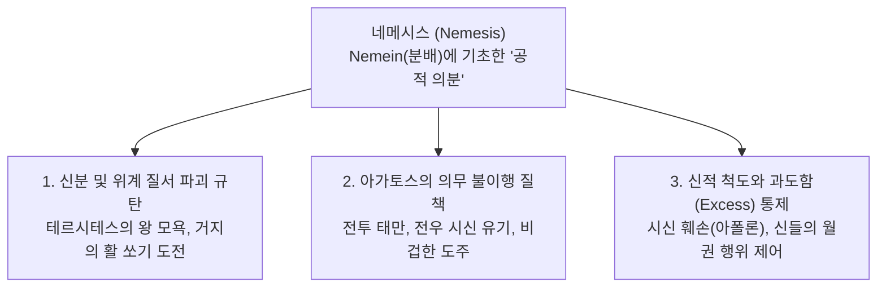

# 네메시스 (Nemesis, νέμεσις) — 응당한 분배와 공적 의분

## 1. 개념 정의 및 어원학적 기원

**네메시스(Nemesis, νέμεσις)**는 고대 그리스 서사시에서 **인간이나 신이 자신의 마땅한 분수와 몫([[Moira]])을 넘어서거나 사회적 질서(Kosmos)와 신성 규범([[Themis]])을 침범했을 때, 공동체와 신들이 느끼는 정당한 공적 분노(Indignation, 의분)**를 가리킵니다.

- **어원학(Etymology)**: '나누다, 분배하다, 할당하다'를 뜻하는 동사 **네메인(*nemein*, νέμειν)**에서 유래합니다. 즉, 네메시스는 모든 사람과 사물에 응당한 몫이 공평하게 배정되어 있는 우주적·사회적 균형 상태를 파괴한 자에 대한 응징적 감정입니다 ([[scott-1980-aidos-and-nemesis|Scott 1980]]).
- **후대 신격화와의 차이**: 고전기 이후 네메시스는 오만(*hybris*)을 처벌하는 복수의 여신으로 고정되었으나, 호메로스 서사시에서 *nemesis*는 일차적으로 **인간과 신의 가슴속(*thumos*)에서 일어나는 생생한 도덕적 정서(Moral Emotion)**로 기능합니다.

---

## 2. 서사시 내 네메시스의 3대 작동 층위

### 2.1 신분제 질서(*Kosmos*) 일탈에 대한 공동체적 단죄
- **테르시테스의 월권**: 평민 전사 테르시테스가 최고 지휘관들을 모욕했을 때, 그리스 군대 전체가 그에게 깊은 네메시스를 품습니다 (_Il._ 2.222–223). 신분 질서의 위반은 공동체 전체의 안전을 위협하기 때문입니다.
- **구혼자들의 불안**: 누더기를 걸친 거지가 활을 쏘려 할 때 구혼자들이 격분하는 것은(_Od._ 21.286), 하층민이 귀족(*agathoi*)의 우월성을 침범하는 사태에 대한 네메시스입니다.

### 2.2 영웅적 아레테([[Arete]]) 불이행에 대한 비난
- **용사의 나태 질책**: 포세이돈은 나약한 자가 도망치는 것에는 화를 내지 않지만, 탁월한 영웅들이 싸움을 게을리할 때는 가슴속에서 네메시스를 느낀다고 선언합니다 (_Il._ 13.117–119).
- **전우 시신 수습 의무**: 전사자가 적에게 무장을 벗겨지도록 방치하는 것은 전우(*philoi*)에 대한 도리를 저버리는 일로서 즉각 네메시스를 유발합니다 (_Il._ 16.543–547, 17.254–255).

### 2.3 신들의 의분과 한계선 수호
- **대지 능욕에 대한 아폴론의 분노**: 아킬레우스가 헥토르의 사체를 마차에 끌고 다니며 모독할 때, 아폴론은 "그가 아무리 훌륭할지라도(*agathos per eôn*) 신들이 그에게 네메시스를 품지 않도록 조심해야 한다"고 경고합니다 (_Il._ 24.53–54).
- **아레스의 광포한 월권 억제**: 전쟁의 신 아레스가 제우스의 섭리를 넘어 전장에서 무분별한 학살을 자행할 때 헤라는 제우스에게 왜 아레스에게 네메시스를 느끼지 않느냐고 항의합니다 (_Il._ 5.757–759).

---

## 3. '네메시스가 되지 않는다(Ouk esti nemesis)'의 윤리학

호메로스 서사시에서 관용구 **"네메시스가 되지 않는다(*ouk esti nemesis* / οὐ νέμεσις)"**는 특정한 행위가 겉보기와 달리 **합당한 이유와 비례의 척도(Standard of Appropriateness)**를 갖추고 있어 비난받을 필요가 없음을 선언하는 중요한 윤리적 면책 기제입니다 ([[long-1970-morals-and-values|Long 1970]], [[scott-1980-aidos-and-nemesis|Scott 1980]]):

1. **마땅한 척도에 대한 인정 (헬레네의 아름다움)**: 트로이 원로들이 헬레네를 보고 "이런 여인을 두고 양군이 오랜 세월 고통을 겪는 것은 결코 네메시스가 아니다"라고 말할 때(_Il._ 3.156–157), 이는 초인적 아름다움에 비례하는 고통의 정당성을 인정하는 것입니다.
2. **왕의 위엄보다 우선하는 화해와 배상**: 오디세우스가 아가멤논에게 "왕이 먼저 분노를 일으킨 자에게 화해를 위해 보상하는 것(*apareskein*)은 결코 네메시스가 되지 않는다"고 충고할 때(_Il._ 19.182–183), 공동체의 화해와 정의([[Dike]])가 군주의 개인적 자존심보다 우위에 있음을 천명합니다.
3. **손님 환대의 중용**: 메넬라오스는 손님을 지나치게 붙잡아 두거나 지나치게 내쫓는 과도함 모두에 네메시스를 느낀다며, 손님 대접의 적절한 척도를 제시합니다 (_Od._ 15.68–71).

---

## 4. 아이도스(Aidos)와의 상호 연동 및 황금률의 맹아

- **머레이(Gilbert Murray)의 정식**:
  - *"아이도스는 자신의 행위에 대해 스스로 느끼는 억제 감정이며, 네메시스는 타인의 행위에 대해 느끼는 의분, 혹은 타인이 나에게 느낄 것이라 예견하는 감정이다."*
- **역지사지와 황금률의 태동**:
  - 『일리아스』 23권에서 아킬레우스는 마차 경주 도중 다투는 아이아스와 이도메네우스에게 이렇게 질책합니다:
  > *"남이 그런 짓을 하면 당신들도 네메시스를 느낄 터인데 어찌 당신들이 그 짓을 하는가!"* (_Il._ 23.492–494)
  - 이는 **'자신이 타인에게 비난할 행위를 스스로 범하지 않는다'**는 성찰적 황금률의 맹아를 호메로스 서사시가 이미 배태하고 있었음을 보여주는 결정적 문헌학적 증거입니다 ([[scott-1980-aidos-and-nemesis|Scott 1980]]).

---

## 5. 관련 항목

### 핵심 인물 및 텍스트
- [[일리아스]] / [[오뒷세이아]]
- [[아킬레우스]] — 23권에서 네메시스의 상호성을 가르치고, 24권에서 신들의 네메시스 경고를 수용한 주인공
- [[아가멤논]] — 아킬레우스에게 화해의 선물을 건네는 것이 네메시스가 아님을 확인받은 왕
- [[헬레네]] — 트로이 원로들로부터 고난의 정당성을 인정받아 네메시스를 면한 여인
- [[테르시테스]] — 공동체 전체의 네메시스를 촉발하여 응징당한 평민 전사

### 관련 윤리 및 신화 개념
- [[Aidos]] — 네메시스를 예견하여 내면에서 일어나는 자기억제 감정
- [[Moira]] — 인간에게 할당된 응당한 몫과 한계
- [[Themis]] — 신성한 질서와 사회적 규범
- [[Dike]] — 균형과 우주적 정의
- [[Arete]] — 영웅적 탁월성과 그에 따르는 의무
- [[Xenia]] — 환대의 적절한 척도를 요구하는 손님 규범
- [[Hybris]] — 몫을 넘어선 오만과 파멸

### 주요 연구 문헌
- [[scott-1980-aidos-and-nemesis]] — 호메로스 저작에서의 아이도스와 네메시스 (네메시스의 질서 수호 기능 규명)
- [[long-1970-morals-and-values]] — 호메로스의 도덕과 가치 (적절성의 기준과 네메시스 부재 분석)
- [[cairns-1993-aidos]] — 아이도스: 고대 그리스 문학의 도덕심리학
- [[lloyd-jones-1971-justice-of-zeus]] — 제우스의 정의 (우주적 질서와 신적 보복)
