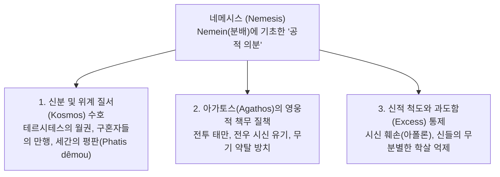

# 네메시스 (Nemesis, νέμεσις) — 응당한 분배와 공적 의분

## 1. 개념 정의 및 어원학적 기원

**네메시스(Nemesis, νέμεσις)**는 고대 그리스 서사시에서 **인간이나 신이 자신의 마땅한 분수와 몫([[Moira]])을 넘어서거나 사회적 위계 질서([[Kosmos]]) 및 신성 규범([[Themis]])을 침범했을 때, 공동체와 신들이 느끼는 정당한 공적 분노(Righteous Indignation, 의분)**를 가리킵니다.

- **어원학(Etymology) 및 파생 어휘군**:
  - '나누다, 분배하다, 할당하다'를 뜻하는 동사 **네메인(*nemein*, νέμειν)**에서 유래합니다. 즉, 네메시스는 모든 사람과 사물에 응당한 몫이 공평하게 배정되어 있는 우주적·사회적 균형 상태를 파괴한 자에 대한 응징적 감정입니다 ([[scott-1980-aidos-and-nemesis|Scott 1980]]).
  - 동사형 **네메사오 / 네메산(*nemesaô / nemesan*, νεμεσάω / νεμεσᾶν)**은 '부당한 일탈이나 파렴치한 행위에 대해 가슴속 깊이 의분을 품다/격분하다'를 뜻합니다.
  - 형용사형 **네메세토스(*nemesētos*, νεμεσητός)**는 '네메시스를 받을 만한(비난받아 마땅한)', 혹은 '타인의 불의에 대해 정당한 의분을 품는 성품'을 가리킵니다 (_Il._ 11.649).
  - 관용구 **우크 에스티 네메시스(*ouk esti nemesis* / οὐ νέμεσις)**는 어떤 행위가 비례와 이치에 맞아 '결코 비난거리가 되지 않는다'는 공식적 면책 선언입니다.
- **후대 신격화(Deification)와의 준별**:
  - 고전기 이후 네메시스는 헤시오도스(Hesiod, *Theogony* 223–224: 밤의 여신 닉스의 딸) 및 아티카 람누스(Rhamnous) 성소에서 숭배되듯 오만([[Hybris]])을 징벌하는 독립된 복수의 여신으로 고정되었습니다.
  - 그러나 호메로스 서사시에서 *nemesis*는 아직 초월적 인격신이 아니라, **인간과 신의 가슴속([[Thumos]])에서 일어나는 생생한 내재적 도덕 감정(Moral Emotion)**으로 기능합니다 (_Il._ 13.119: *thumôi nemesômai*).

---

## 2. 서사시 내 네메시스의 3대 작동 층위

### 2.1 신분 질서(*Kosmos*) 일탈 및 세간의 평판(*Phatis dêmou*) 수호
- **테르시테스의 월권 단죄**: 평민 전사 [[테르시테스]]가 최고 지휘관 [[아가멤논]]을 모욕했을 때, 그리스 군대 전체가 그에게 깊은 네메시스를 품습니다 (_Il._ 2.222–223). 신분 질서의 위반은 전열과 공동체의 존립을 위협하기 때문입니다.
- **텔레마코스의 아고라 고발**: [[텔레마코스]]는 이타카 민회에서 구혼자들의 재산 약탈을 고발하며 시민들에게 "가슴속에 네메시스를 품으라(*nemessêthête d' eni thumôi*)"고 호소하고, 인간들의 네메시스와 신들의 노여움을 두려워하라고 촉구합니다 (_Od._ 2.64–67, 2.136–137).
- **구혼자들의 평판 불안**: 누더기를 걸친 거지([[오디세우스]])가 활을 쏘려 할 때 구혼자 에우리마코스가 격분하는 것은(_Od._ 21.285–286, 21.323–329), 하층민이 귀족([[Agathoi]])의 우월성을 침범하여 세간의 비난과 조롱(*elencheiê / phatis*)을 살 것에 대한 네메시스입니다.
- **헬레네의 탄식**: [[헬레네]]는 자신의 처지와 [[파리스]]의 나태함을 한탄하며 "훗날 사람들의 수많은 비난(*nemesin*)을 의식할 줄 아는 남자의 아내가 되었어야 했다"고 자책합니다 (_Il._ 6.351).

### 2.2 영웅적 아레테([[Arete]]) 불이행과 전우애에 대한 질책
- **용사의 나태 질책**: 바다의 신 [[포세이돈]]은 나약한 자가 도망치는 것에는 화를 내지 않지만, 탁월한 영웅들([[Esthloi]])이 싸움을 게을리할 때는 "가슴속 깊이 네메시스를 느낀다(*thumôi nemesômai*)"며 용사들을 질타합니다 (_Il._ 13.117–122).
- **전우 시신 수습 의무**: [[사르페돈]]과 [[파트로클로스]]의 사체가 방치되거나 무장을 벗겨질 위기에 처했을 때, [[글라우코스]]와 [[아이아스]]는 전우([[Hetairoi]])들에게 즉각 네메시스를 느끼고 분발할 것을 호소합니다 (_Il._ 16.543–547, 17.254–255).
- **메넬라오스의 고뇌**: [[메넬라오스]]는 헥토르의 위세에 눌려 파트로클로스의 시신을 두고 후퇴하려 할 때, 아카이아 전우들이 자신에게 네메시스를 품을까 두려워 고뇌합니다 (_Il._ 17.91–95: *mê tis moi Danawôn nemesêsetai*).

### 2.3 신들의 의분과 한계선 수호
- **대지 능욕에 대한 아폴론의 분노**: [[아킬레우스]]가 헥토르의 사체를 전차에 매달아 끌고 다니며 모독할 때, [[아폴론]]은 "그가 아무리 용맹할지라도(*agathôi per eonti*), 말 못 하는 흙먼지(대지)를 능욕하여 우리가 그에게 네메시스를 품지 않도록 조심해야 한다"고 엄중히 경고합니다 (_Il._ 24.53–54).
- **아레스의 광포한 월권 억제**: 전쟁의 신 [[아레스]]가 제우스의 섭리를 넘어 전장에서 질서 없이(*ou kata kosmon*) 학살을 자행할 때, [[헤라]]는 [[제우스]]에게 왜 아레스에게 네메시스를 느끼지 않느냐고 강력히 항의합니다 (_Il._ 5.757–759).
- **포세이돈의 동등한 몫 주장**: 제우스가 전장에서 물러나라고 위협할 때, 포세이돈은 자신 역시 제우스와 동등한 몫(*homotimon*)을 분배받았음을 상기시키며 제우스의 월권에 격분합니다 (_Il._ 15.185–217).

---

## 3. 학술적 쟁점 및 패러다임 대립

### 3.1 호메로스 사회의 도덕성 존재 여부

> [!WARNING] 모순/이설 발견: 비도덕적 결과주의(Adkins) 대 통합적 적절성 규범(Long / Lloyd-Jones)
> - **애드킨스(Adkins 1960)의 결과 중심 결함론**: 호메로스 사회를 성공과 실패라는 결과만이 지배하는 '결과 문화(Results-culture)'로 규정하고, *nemesis* 역시 칸트적 순수 도덕 분노가 아닌 귀족 전사의 세속적 체면과 승패에 종속된 비도덕적 감정으로 평가 절하했습니다.
> - **롱(Long 1970)과 로이드-존스(Lloyd-Jones 1971)의 반박**: *nemesis*는 분배(*nemein*)와 규범(*themis*), 질서(*kosmos*)에 기반하여 귀족의 오만(*hybris*)과 과도함(Excess), 약자에 대한 부당한 침탈을 실질적으로 제재하는 호메로스 사회의 핵심적 도덕 규범임을 문헌학적으로 입증했습니다.

### 3.2 감정적 정념론 대 신적 응징 및 우주적 정의론

> [!WARNING] 모순/이설 발견: 상황 적응적 감정론(Scott) 대 신적 응징/정의론(Lloyd-Jones)
> - **스콧(Scott 1980)의 상황 적응적 정념론**: 서사시의 *nemesis*는 고전기의 고정된 복수 신격이 아니며, 관찰자가 상황에 따라 주관적·정서적으로 감응하는 튀모스(*thumos*) 내면의 도덕 감정으로 분석합니다.
> - **로이드-존스(Lloyd-Jones 1971)의 우주적 정의론**: *nemesis*는 제우스의 정의([[Dike]]) 체계와 결합되어 있으며, 불의한 자에게 반드시 파멸을 가져오는 신적 보복([[Tisis]])과 우주 질서 보존의 집행 기제라고 강조합니다.

---

## 4. '네메시스가 되지 않는다(Ouk esti nemesis)'의 윤리학

호메로스 서사시에서 관용구 **"네메시스가 되지 않는다(*ouk esti nemesis* / οὐ νέμεσις)"**는 특정한 행위가 겉보기의 비난 가능성에도 불구하고 **합당한 이유와 비례의 척도(Standard of Appropriateness)**를 갖추고 있어 정당함을 공인하는 중요한 윤리적 면책 기제입니다 ([[long-1970-morals-and-values|Long 1970]], [[scott-1980-aidos-and-nemesis|Scott 1980]]):

1. **초인적 아름다움에 비례하는 고난의 정당성 (헬레네의 미모)**:
   - 트로이 원로들이 성벽 위 헬레네를 보고 "이런 여인을 두고 트로이아인들과 아카이아인들이 오랜 세월 고통을 겪는 것은 결코 네메시스가 아니다(*ou nemesis*)"라고 탄탄할 때(_Il._ 3.156–157), 이는 초인적 가치에 상응하는 비극적 희생의 당위성을 인정하는 것입니다.
2. **왕의 위엄보다 우선하는 화해와 배상 (아가멤논의 사과)**:
   - [[오디세우스]]가 아가멤논에게 "왕이 먼저 분노를 일으킨 자에게 화해를 위해 보상(*apareskein*)하여 마음을 달래는 것은 결코 네메시스가 되지 않는다"고 충고할 때(_Il._ 19.182–183), 군주의 개인적 자존심보다 공동체의 화해와 정의([[Dike]]) 회복이 더 상위의 정당성을 지님을 천명합니다.
3. **인간적 고통과 귀향 염원의 정당화 (9년 종군의 슬픔)**:
   - 오디세우스가 고향을 그리워하며 눈물짓는 병사들을 변호하며 "9년 동안 머물며 괴로워하는 자들이 비통해하는 것은 결코 네메시스가 아니다"라고 말할 때(_Il._ 2.296–298), 가혹한 현실 앞에서의 인간적 한계를 정상 참작합니다.
4. **손님 환대의 중용 (메넬라오스의 척도)**:
   - 메넬라오스는 손님을 지나치게 붙잡아 두거나 지나치게 내쫓는 과도함 모두에 네메시스를 느낀다며, "있을 때는 잘 대접하고 떠나려 할 때는 배웅하는 것"이 참된 중용의 규범임을 제시합니다 (_Od._ 15.68–74).

---

## 5. 아이도스(Aidos) 및 연민(Eleos)과의 상호 연동

### 5.1 아이도스와 네메시스의 상호 제재 고리
아이도스는 관찰자 공동체의 공적 의분인 **네메시스([[Nemesis]])**와 대칭적 짝을 이룹니다 ([[scott-1980-aidos-and-nemesis|Scott 1980]]):

$$\text{행위자의 아이도스(Aidôs, 내적 억제)} \iff \text{관찰자의 네메시스(Nemesis, 공적 의분)}$$

- **길버트 머레이(Gilbert Murray)의 고전적 정식**:
  > *"아이도스는 자신의 행동에 대해 스스로 느끼는 내적 억제 감정이며, 네메시스는 타인의 탈선에 대해 느끼는 공적 의분이자, 타인이 나에게 품을 것이라 예견하는 반응이다."*
- **역지사지와 황금률(Golden Rule)의 태동**:
  - 『일리아스』 23권 마차 경주 분쟁에서 아킬레우스는 다투는 아이아스와 이도메네우스에게 이렇게 질책합니다:
  > *"만일 다른 어떤 이가 그런 짓을 한다면 당신들도 그에게 네메시스를 느낄 터인데, 어찌 당신들이 그 짓을 하는가!"* (_Il._ 23.492–494: *nemessâton de kai allôi*)
  - 이는 **'자신이 타인에게 비난할 행동을 스스로 범하지 않는다'**는 성찰적 역지사지와 상호적 도덕 의식의 맹아를 보여주는 결정적 증거입니다.

### 5.2 24권: 신들의 네메시스 경고와 연민([[Eleos]])으로의 영적 도약
- 『일리아스』 24권에서 아폴론의 네메시스 경고(_Il._ 24.53–54)는 테티스를 통해 아킬레우스에게 전달됩니다.
- 아킬레우스는 신들의 네메시스를 두려워하는 **신적 경외(*aideio theous*)**와 노왕 프리아모스에 대한 **연민([[Eleos]])**을 결합하여, 헥토르의 시신을 인도하고 비극적 분노([[Menis]])를 종식하며 인간성을 회복합니다 ([[zanker-1994-heart-of-achilles|Zanker 1994]], [[lee-junseok-2024-iliad-jeongam|이준석 2024]]).

---

## 6. 문헌학적 어휘 사전 및 핵심 원문 인용

### 6.1 네메시스 핵심 어휘 사전
| 희랍어 어휘 | 원어 표기 | 품사 및 문헌학적 정의 | 서사시 주요 용례 |
|:---|:---|:---|:---|
| **Nemesis** | νέμεσις | *nemein*(분배하다)에서 파생. 각자의 마땅한 몫과 질서(*kosmos*)를 침범한 자에 대한 공적 의분. | _Il._ 2.223, 3.156, _Od._ 2.136 |
| **Nemesaô / Nemesan** | νεμεσάω / νεμεσᾶν | 동사. 부당한 행위나 오만(*hybris*)에 대해 가슴속 깊이 의분을 품거나 소리쳐 질타하다. | _Il._ 13.119, _Od._ 1.158, 22.40 |
| **Nemesētos** | νεμεσητός | 형용사. 네메시스를 받을 만한(비난받아 마땅한), 혹은 타인의 불의에 깊이 분노하는 성품. | _Il._ 11.649 |
| **Ouk esti nemesis** | οὐκ ἔστι νέμεσις / οὐ νέμεσις | 관용구. '결코 비난거리가 되지 않는다'. 합당한 척도와 비례에 따른 행위임을 승인하는 면책 공식. | _Il._ 3.156, 19.182, _Od._ 15.68 |
| **Phatis dêmou** | φῆτις δήμου | 대중의 평판, 세간의 소문. 호메로스 영웅의 네메시스와 아이도스를 자극하는 가장 강력한 외적 여론. | _Od._ 16.75, 2.137, _Il._ 6.351 |

### 6.2 핵심 원문 인용 및 정밀 주석

#### 1) 포세이돈의 용사 질책 (_Il._ 13.117–122)
> **원문**:
> ἀλλ᾽ εἰ μέν ῥα μάλ᾽ αἰνῶς ἥρως Ἀτρεΐδης εὐρὺ κρείων Ἀγαμέμνων / ἤτοι ὅ γ᾽ ἐξήμαρτε... / ἡμέας γ᾽ οὔ πως ἔστι μεθιέμεναι πολέμοιο. / ἀλλ᾽ ἀκεώμεθα θᾶσσον· ἀκεσταί τοι φρένες ἐσθλῶν. / ὑμεῖς δ᾽ οὐκέτι καλὰ μεθίετε θούριδος ἀλκῆς / πάντες ἄριστοι ἐόντες ἀνὰ στρατόν· οὐδ᾽ ἂν ἔγωγε / ἀνδρὶ μαχεσσαίμην ὅς τις πολέμοιο μεθείη / λυγρὸς ἐών, ὑμῖν δὲ νεμεσσῶμαι περὶ κῆρι.
>
> **번역**: "설령 아가멤논 왕이 크게 잘못했다 하더라도... 우리는 결코 싸움을 포기해서는 안 되오. 어서 잘못을 바로잡읍시다. 고귀한 자들의 마음은 고쳐질 수 있는 법이오(*akestai toi phrenes esthlôn*). 군대에서 가장 탁월한 그대들 모두가 용맹을 버리는 것은 결코 아름답지 못하오. 나는 나약한 자가 싸움을 피한다면 결코 나무라지 않겠으나, 그대들에게는 내 가슴속 깊이 네메시스를 느끼오(*humin de nemessômai peri kêri*)!"
>
> **주석**: 포세이돈은 신분과 탁월성([[Arete]])에 비례하여 더 높은 도덕적 책무가 부여됨을 천명합니다. 네메시스는 모든 인간에게 무차별적으로 적용되는 평등주의적 규범이 아니라, 각자의 신분적 몫과 역량에 상응하는 탁월성을 감시하는 척도입니다.

#### 2) 아킬레우스의 황금률 중재 (_Il._ 23.492–494)
> **원문**:
> μηκέτι νῦν χαλεποῖσιν ἀμείβεσθον ἐπέεσσιν / αἰσχροῖς, ἐπεὶ οὐδὲ ἔοικε· νεμεσσᾶτον δὲ καὶ ἄλλῳ, / ὅς τις τοιαῦτά γε ῥέζοι.
>
> **번역**: "이제 더 이상 험악하고 수치스러운 말들을 서로 주고받지 마시오. 그것은 도리에 맞지 않소(*oude eoike*). 만일 다른 어떤 이가 그런 짓을 한다면 당신들도 그에게 네메시스를 느낄 것이 아니오!"
>
> **주석**: 아킬레우스는 타인의 행위에 대해 느낄 네메시스를 역지사지로 고려하여 자신의 행동을 통제하라고 훈계합니다. 이는 외적 평판에 대한 두려움을 넘어 타자의 시선을 내면화하는 협력적 도덕 의식의 비약적 발전을 증명합니다.

---

## 7. 관련 항목

### 핵심 인물 및 신
- [[아킬레우스]] — 23권에서 네메시스의 상호성을 훈계하고, 24권에서 신들의 네메시스 경고를 수용한 영웅
- [[아가멤논]] — 아킬레우스에게 화해의 선물을 건네는 것이 네메시스가 아님을 확인받은 군주
- [[헬레네]] — 트로이 원로들로부터 고난의 정당성을 인정받아 네메시스를 면한 여인
- [[테르시테스]] — 공동체 전체의 네메시스를 촉발하여 응징당한 평민 전사
- [[텔레마코스]] — 이타카 민회에서 구혼자들의 만행에 대한 시민들의 네메시스를 촉구한 오디세우스의 아들
- [[메넬라오스]] — 전우의 시신 유기에 대한 네메시스를 경계하고, 손님 환대의 중용 척도를 제시한 왕
- [[포세이돈]] — 용사들의 나태에 가슴 깊이 네메시스를 표출한 신
- [[아폴론]] — 아킬레우스의 시신 훼손에 대해 신들의 네메시스를 경고한 신
- [[헤라]] — 아레스의 무분별한 학살에 대해 제우스에게 네메시스를 촉구한 여신

### 관련 윤리 및 신화 개념
- [[Aidos]] — 네메시스를 예견하여 내면에서 일어나는 수치심과 자기억제 감정
- [[Moira]] — 인간과 신에게 할당된 응당한 몫과 운명적 한계
- [[Themis]] — 신성한 질서와 관습적 규범
- [[Kosmos]] — 우주와 사회의 정돈된 위계 질서
- [[Dike]] — 균형과 우주적 정의
- [[Arete]] — 영웅적 탁월성과 그에 상응하는 사회적 책무
- [[Xenia]] — 환대의 과도함과 결핍을 제어하는 손님 규범
- [[Hybris]] — 몫을 넘어선 오만과 파멸
- [[Tisis]] — 불의와 월권에 대한 신적 응징과 보복
- [[Eleos]] — 24권에서 신들의 네메시스 경고를 수용하여 발현되는 연민
- [[Menis]] — 아폴론의 네메시스 경고와 프리아모스의 탄원으로 종식되는 신적 분노
- [[Thumos]] — 네메시스의 의분이 생생하게 일어나는 가슴속 정서 기관

### 주요 연구 문헌
- [[scott-1980-aidos-and-nemesis]] — 메리 스콧: 호메로스 저작에서의 아이도스와 네메시스 (네메시스의 질서 수호 기능 규명)
- [[long-1970-morals-and-values]] — A. A. 롱: 호메로스의 도덕과 가치 (적절성의 기준과 네메시스 부재 분석)
- [[cairns-1993-aidos]] — 더글러스 케언스: 아이도스 (고대 그리스 문학의 도덕심리학)
- [[lloyd-jones-1971-justice-of-zeus]] — 휴 로이드-존스: 제우스의 정의 (우주적 질서와 신적 보복)
- [[adkins-1960-merit-and-responsibility]] — A. W. H. 애드킨스: 공적과 책임 (결과 문화와 경쟁적 가치)
- [[zanker-1994-heart-of-achilles]] — 그레이엄 잰커: 아킬레우스의 마음 (24권 신들의 네메시스와 연민의 승화)
- [[lee-junseok-2024-iliad-jeongam]] — 이준석: 정암학당 2024 『일리아스』 집중강좌 해제
