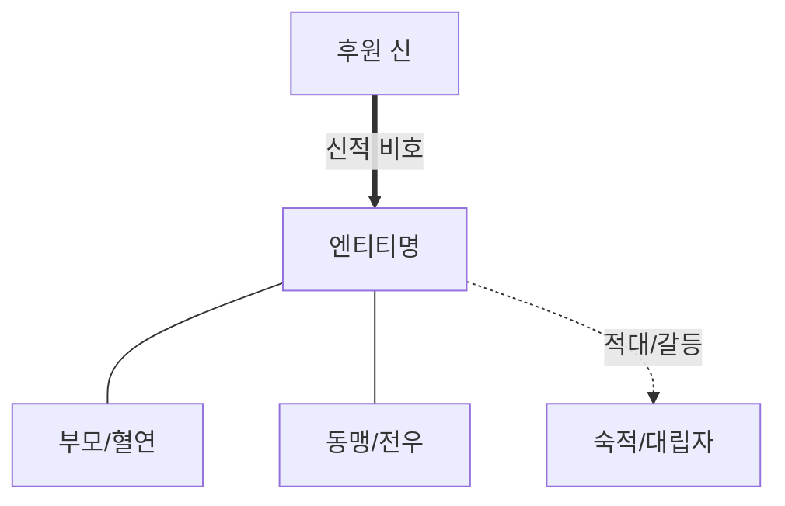

# 엔티티명 (Greek / Latin)

## 1. 정의와 식별 (Definition & Identification)
- **핵심 정의**: 엔티티의 정체성과 위상을 집약하는 1~2문장의 백과사전적 정의.
- **분류 및 소속**: 엔티티 유형(`entity_type`), 주요 진영/지역 소속, 사회적/신적 지위.
- **서사적 출현 범위**: 『일리아스』 및 『오뒷세이아』에서의 핵심 활동 권·행 및 비중.

---

## 2. 명칭과 문헌학 (Philology, Epithets & Dialect)
### 2.1 희랍어 표기 및 어원
- **원어 표기**: 희랍어 철자(강약 악센트 병기) 및 어원학적 기원(*etymology*).
- **의미론적 분석**: 어근 결합 방식 및 원초적 의미소.

### 2.2 고유 정형구와 별칭 (Epithets & Formulae)
- **대표 수식어**: 호메로스 정형구(*formula*) 목록 및 의미 (예: 발이 빠른, 준마를 부리는 등).
- **운율적 기능**: 육보격(Dactylic Hexameter) 시행 내 위치(운율적 쉼표/휴지부) 및 서술적 효과.

### 2.3 방언 및 이형 표기
- 이오니아-아이올리스 방언 혼재 양상 및 호메로스 텍스트 내 형태론적 특이점.

---

## 3. 호메로스 본문에서의 모습 (Homeric Attestation & Narrative Arc)
### 3.1 『일리아스』에서의 행적
- 주요 권(Book)별 사건 전개, 핵심 행위 및 갈등 양상 (서/행 번호 명시: 예: _Il._ 1.1–7).

### 3.2 『오뒷세이아』에서의 행적
- 작품 내 직접 출현 또는 회고/전승을 통한 간접 언급 양상 (예: _Od._ 11.467–540).

### 3.3 서사적 전환점과 결정적 장면
- 인물/대상의 운명을 가르는 핵심 결절점 및 클라이맥스 장면 분석.

---

## 4. 관계와 소속 (Genealogy, Alliances & Networks)
- **계보 및 혈연**: 부모, 배우자, 자녀, 신적 혈통.
- **동맹 및 적대 관계**: 진영 내 상하 위계, 전우애, 숙적 관계.
- **신과 인간의 후원 관계**: 특정 신의 비호/적대 및 신적 개입 양상.

---

## 5. 유형별 상세 (Type-Specific Details)
> [!NOTE]
> 엔티티 유형에 따라 해당하는 전용 항목을 작성하고 불필요한 항목은 삭제합니다.

<!-- 인물(person)인 경우:
- 영웅적 지위와 정치적 권력 (Basileia / Agora)
- 주요 연설과 직언 (Parrhesia / Logoi)
- 전장 무용과 아리스테이아 (Aristeia / 결투)
- 내적 갈등 및 선택 (도덕적 딜레마)
- 죽음과 사후 운명 (Belle Mort / 하데스)
-->

<!-- 신적 존재(deity)인 경우:
- 주관 권능 영역 (Timai / 영역)
- 올림포스 위계와 제우스와의 관계
- 인간사에 대한 개입 방식 (Epiphany / 환영 / 직접 조언)
- 타 신들과의 연대 및 충돌 (Theomachy)
-->

<!-- 장소(place)인 경우:
- 본문 내 지형 및 자연환경 묘사
- 항해 및 지리적 이동 경로
- 거주 집단 및 정치적 통치 구조
- 후보 유적 및 지리적 식별성
-->

<!-- 집단/민족(group)인 경우:
- 명칭의 범위와 하위 부족 편제
- 지휘관 및 함선 수 (목록시)
- 집단 정체성 및 타자(야만/비문명) 표상
-->

<!-- 사물/유물(object)인 경우:
- 재료 및 제작자 (신적 제작 / 인간 명장)
- 소유권 이전 및 증여 계보 (Xenia / 상속)
- 서사 내 기능 및 상징적 행위성
-->

---

## 6. 역사적 맥락 (Historical Context & Social Institutions)
- **서사 시대 vs 역사적 지평**: 미케네 청동기 문명(BC 1600–1200)의 기억과 암흑기·아르카익 초기(BC 8세기) 폴리스 형성기의 중첩.
- **사회 제도와 규범**: 왕권(*basileia*), 전사 회의(*agora*), 선물 교환망, 신분 위계.

---

## 7. 고고학과 지리 (Archaeology, Topography & Material Culture)
- **관련 물질자료**: 해당 시기 발굴 유적, 무구, 도기화, 건축 양식과의 비교.
- **텍스트와 유물의 일치/불일치**: 서사시 묘사와 고고학 발굴 증거의 정합성 및 한계.

---

## 8. 종교학·인류학적 해석 (Religion, Cult & Anthropology)
- **제의 및 숭배**: 아르카익·고전기 그리스의 영웅 숭배(*hero cult*), 신전 의례, 희생제.
- **인류학적 구조**: 탄원([[Hikesia]]), 손님 환대([[Xenia]]), 장례 의례, 수치 문화와 공적 평판.

---

## 9. 철학·윤리학적 해석 (Philosophical & Ethical Dimensions)
- **행위 주체성과 도덕 심리학**: 감정의 좌소(*thumos*, *phren*), 신적 개입(*Ate*)과 인간 책임의 공존.
- **핵심 가치 갈등**: 명예([[Timê]]), 불멸의 명성([[Kleos]]), 수치심([[Aidos]]), 공적 의분([[Nemesis]]), 연민([[Eleos]]).

---

## 10. 후대 전승과 수용 (Post-Homeric Tradition & Reception)
- **서사시환(Epic Cycle) 및 고전기 비극**: 서사시환(*Cypria*, *Aethiopis*, *Ilioupersis* 등) 및 3대 비극 시인의 변형.
- **고대 말기 및 근현대 수용**: 헬레니즘·로마 서사시(베르길리우스, 스타티우스) 및 현대 문학·예술적 재해석.

---

## 11. 학술 논쟁 (Scholarly Debates & Contradictions)
> [!WARNING] 모순/이설 발견
> 주요 학설 간의 첨예한 대립이나 서사 내 긴장 관계를 근거별로 기술합니다.

- **쟁점 1**: 
- **쟁점 2**: 

---

## 12. 증거 매트릭스 (Evidence Matrix)

| 주장 및 테제 | 자료 유형 | 근거 및 출전 | 확실성 | 관련 위키 문서 |
|:---|:---|:---|:---|:---|
| 본문 핵심 행적 | 호메로스 본문 | _Il._ 0.000–000 | 원전 명시 | [[]] |
| 물질문화/고고학 비정 | 물질자료 | 유적지 발굴 보고서 | 강한 학술 추론 | [[]] |
| 학술적 해석 가설 | 현대 연구 | 연구자 (연도) | 논쟁적 | [[]] |

---

## 13. 관련 항목 (See Also)

- [[overview]]
- [[index]]
- [[entity-framework]]
- [[]]
