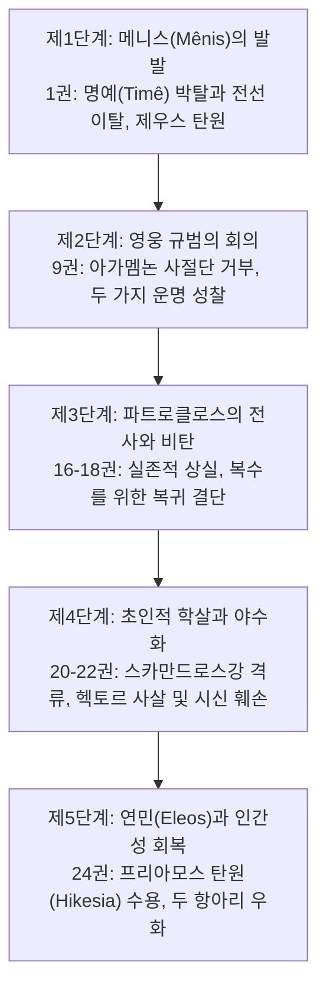
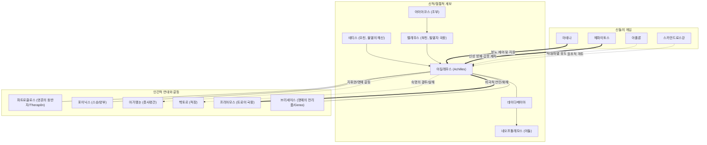

# 아킬레우스 (Achilles / Ἀχιλλεύς)

## 1. 정의와 식별 (Definition & Identification)
- **핵심 정의**: 프티아(Phthia)의 국왕 펠레우스(Peleus)와 바다의 여신 테티스(Thetis) 사이에서 태어난 영웅으로, 트로이 원정군(아카이아 연합군) 내 최강의 전사이자 호메로스 서사시 『일리아스』(Iliad)의 중심 주인공입니다.
- **분류 및 소속**: 인물(`entity_type: person`), 아카이아 진영 미르미도네스(Myrmidones) 군단의 최고 지휘관이자 왕.
- **서사적 출현 범위**:
  - 『일리아스』: 작품의 발단인 1권 분노([[Menis]])의 촉발부터 9권 사절단 거부, 16권 파트로클로스의 출전과 전사, 18–22권 복수와 헥토르 사살, 23권 장례 경기 주재, 24권 프리아모스 탄원([[Hikesia]]) 수용 및 화해에 이르기까지 서사 전체의 내적 동력으로 기능합니다.
  - 『오뒷세이아』: 11권 저승(Nekuia) 장면에서 오디세우스와 대면하여 사후 운명에 대한 결정적 성찰을 남기며, 24권에서 그의 장례식이 회고됩니다.

---

## 2. 명칭과 문헌학 (Philology, Epithets & Dialect)

### 2.1 희랍어 표기 및 어원학
- **원어 표기**: 희랍어 **아킬레우스(Ἀχιλλεύς)**, 호메로스 육보격 운율상 변형 **아킬레우스(Ἀχιλεύς)**.
- **어원론적 기원 (Etymology)**:
  - 그레고리 나지(Gregory Nagy 1979)와 근대 고전문헌학 연구에 따르면, 아킬레우스의 이름은 **비탄/고통(*achos*, ἄχος)**과 **전사 집단/군대(*laos*, λαός)**의 결합형태인 ***Achi-lāwos* ("자신의 군대에게 비탄을 가져오는 자" 또는 "군대의 고통을 체화하는 자")**에서 기원한 것으로 분석됩니다.
  - 이 어원은 서사시 1권에서 아킬레우스의 전선 이탈로 인해 아카이아 군대 전체가 겪는 파멸적 고통(_achos_)과 완벽히 호응하는 시학적 작명입니다.

### 2.2 고유 정형구와 별칭 (Formulaic Epithets)
호메로스 운율 체계에서 아킬레우스는 시행 내 위치와 격 변화에 따라 정교하게 배치된 고유 수식어를 갖습니다:

| 희랍어 정형구 | 한글 번역 | 운율적 기능 및 서술 효과 |
|:---|:---|:---|
| **πόδας ὠκὺς Ἀχιλλεύς** (*podas ôkus Achilleus*) | 발이 빠른 아킬레우스 | 육보격 제4각 여성 쉼표(caesura) 뒤 시행 말미 종결부 |
| **ποδάρκης δῖος Ἀχιλλεύς** (*podarkês dios Achilleus*) | 발이 굳센 신 같은 아킬레우스 | 육보격 종결부, 신적 품격과 육체적 탁월성의 결합 |
| **Πηληϊάδης / Πηλεΐδης** (*Pêlêiadês / Pêleïdês*) | 펠레우스의 아들 (부칭) | 가문의 영예와 필멸적 혈통을 환기하는 기본 호칭 |
| **Αἰακίδης** (*Aiakidês*) | 아이아코스의 손자 (조부칭) | 신화적 조부 아이아코스의 신성한 정의와 영웅적 혈통 강조 (_Il._ 16.15, 21.189) |
| **ῥηξήνωρ** (*rhêxênôr*) | 전열을 부수는 자 | 결투와 전면전에서의 압도적 돌파력 강조 |
| **δῖος Ἀχιλλεύς** (*dios Achilleus*) | 신 같은 아킬레우스 | 영웅의 비범한 신적 아우라 지칭 |

### 2.3 방언 및 형태론적 특이점
호메로스 텍스트 내에서 테살리아-아이올리스 방언계 어휘와 이오니아 서사시 전통의 격변화가 융합되어 나타납니다. 특히 단수 속격 *Pêlêiadeô*(이오니아식), 서사시 단수 여격 **아킬레이(Ἀχιλῆϊ)**, 대격 **아킬레아(Ἀχιλῆα)** 등 운율적 요구에 맞춘 다양한 곡용 이형이 혼재합니다.

---

## 3. 호메로스 본문에서의 모습 (Homeric Attestation & Narrative Arc)

### 3.1 『일리아스』의 서사적 궤적
아킬레우스의 행적은 단순한 군사적 활약이 아니라, **분노([[Menis]]) → 탈인간화(야수화) → 비극적 자각 및 연민([[Eleos]])**으로 이어지는 5단계 실존적 이행을 보여줍니다 ([[lee-junseok-2018-wrath-and-pity|이준석 2018]]):

1. **1권 (분노의 기원과 이중 동기화)**: 아가멤논이 아폴론 사제의 딸 크뤼세이스를 반환하는 대가로 아킬레우스의 전리품 브리세이스를 강탈하자, 최고 전사로서의 공적 명예([[Timê]])가 짓밟힌 아킬레우스는 칼을 뽑아 아가멤논을 베려 합니다. 이때 아테나 여신이 나타나 머리채를 잡고 분노를 억제시킵니다 (_Il._ 1.188–222). 전선 이탈을 선언한 그는 어머니 테티스를 통해 제우스에게 아카이아군의 패배를 간청합니다 (_Il._ 1.350–412).
2. **9권 (사절단 거부와 가치 체계의 전복)**: 아카이아 진영이 붕괴 직전에 이르자 아가멤논은 막대한 배상물(Apoina)을 제시하며 오디세우스, 포이닉스, 아이아스로 구성된 사절단을 파견합니다. 그러나 아킬레우스는 목숨의 가치는 어떤 물질적 재화로도 바꿀 수 없음을 선언하며 제안을 전면 거부하고, 자신의 '두 가지 운명'을 공표합니다 (_Il._ 9.308–429).
3. **16–18권 (파트로클로스의 죽음과 죄책감)**: 함선이 불타는 위기 속에서 분신과도 같은 친구 [[파트로클로스]]에게 자신의 갑옷을 입혀 출전을 허락하나, 그가 [[헥토르]]에게 전사하자 극한의 슬픔과 자책에 빠집니다. 테티스와 네레이스들이 바다에서 올라와 함께 비탄의 애가를 부르고(_Il._ 18.22–64), 헤파이토스가 제작한 새 신성 무구를 받고 복수를 위해 전장에 복귀합니다 (_Il._ 18.1–137).
4. **20–22권 (아리스테이아와 헥토르 사살)**: 신에 필적하는 초인적 무용으로 트로이군을 학살하고, 강신(江神) 스카만드로스와 대적하며, 트로이의 수호 영웅 헥토르와 일대일 결투를 벌여 그를 사살합니다. 분노에 눈이 멀어 헥토르의 시신을 전차 뒤에 매달아 끌고 다니며 영웅적 규범([[Aidos]])을 유린합니다 (_Il._ 22.395–404).
5. **23–24권 (화해와 연민의 서사시)**: 파트로클로스의 성대한 장례 경기를 주재한 뒤, 야간에 목숨을 걸고 아들의 시신을 찾으러 온 적장 [[프리아모스]]의 탄원([[Hikesia]])을 받습니다. 아킬레우스는 프리아모스의 모습에서 고향에 홀로 남겨진 아버지 펠레우스를 떠올리고 함께 오열하며, 헥토르의 시신을 정중히 인도하고 12일간의 장례 휴전을 보장합니다 (_Il._ 24.477–676).

### 3.2 『오뒷세이아』에서의 모습
- **11권 저승(Nekuia)**: 오디세우스가 저승에서 아킬레우스의 망령을 만나 "그대는 살아서도 신처럼 추앙받았고 죽어서도 망자들의 군주"라고 칭송하자, 아킬레우스는 이를 단호히 거부하며 명예 중심 영웅주의의 한계를 통렬히 뒤집는 명언을 남깁니다:
  > "죽음에 대해 내게 그럴듯하게 말하지 마시오, 영광스러운 오디세우스여. 나는 망령들의 군주가 되기보다는 차라리 땅 위에서 가난한 농부의 머슴이 되어 살고 싶소." (_Od._ 11.488–491)
- **24권 장례 회고**: 아가멤논의 망령이 저승에서 아킬레우스의 장례식을 회고하며, 신들과 인간이 함께 슬퍼한 그의 찬란한 죽음과 명성을 기립니다 (_Od._ 24.36–97).

---

## 4. 관계와 소속 (Genealogy, Alliances & Networks)

- **부모와 혈통**: 인간 국왕 펠레우스와 네레이스(Nereis) 해신 테티스의 아들로, **'신적 혈통을 지녔으나 필멸의 운명을 타고난 자'**라는 영웅의 근원적 비극성을 상징합니다.
- **파트로클로스(Patroklos)**: 전우 이상의 '또 다른 자아(alter ego)'이자 심리적 안식처. 그의 죽음은 아킬레우스의 자포자기적 참전과 죽음의 수용을 야기합니다.
- **포이닉스(Phoinix)**: 유년 시절 아킬레우스를 양육하고 "말을 하는 웅변가이자 행동을 하는 전사"로 기른 스승.

---

## 5. 인물 전용 모듈 (Person-Specific Details)

### 5.1 두 가지 운명의 선택 (*Dichthadias Kêras*)
아킬레우스는 어머니 테티스로부터 자신의 숙명에 두 갈래 길이 있음을 고지받습니다 (_Il._ 9.410–416):
1. **불멸의 명성([[Kleos | Kleos Aphthiton]])의 길**: 트로이에 남아 싸우다 젊은 나이에 전사하지만, 영원히 칭송받는 명성을 얻는 길.
2. **평온한 귀환([[Nostos]])의 길**: 고향 프티아로 돌아가 무명의 장수를 누리지만, 사후 영원히 잊혀지는 길.
아킬레우스는 9권에서 영웅적 가치관에 회의를 품고 귀환을 고려하지만, 파트로클로스의 전사 이후 명예를 넘어선 복수와 필멸성의 수용을 통해 첫 번째 운명을 능동적으로 결단합니다.

### 5.2 영웅적 진실성과 직언 (*Parrhesia*)
아킬레우스는 정략적 외교술과 가식을 혐오하며, 호메로스 영웅 중 가장 정직하고 투명한 언어관을 표명합니다:
> "마음속에 품은 생각과 입으로 내뱉는 말이 다른 자를, 나는 저 하데스의 문만큼이나 증오한다." (_Il._ 9.312–313)

### 5.3 아리스테이아(Aristeia)와 야수화
20–22권에서 아킬레우스의 무용은 인간의 한계를 초월하여 거의 자연재해나 굶주린 사자, 신적 불길에 비유됩니다. 적들을 강물에 몰아넣고 도륙하며, 인간의 문명적 규범(식사, 수면, 의례)을 일절 거부하는 **탈인간화(Dehumanization)** 상태에 도달합니다 ([[shay-1994-achilles-in-vietnam|Shay 1994]]).

### 5.4 아름다운 죽음 (*Kalos Thanatos / Belle Mort*)
장-피에르 베르낭([[vernant-1989-belle-mort|Vernant 1989]])이 규명하듯, 아킬레우스는 노화와 육체적 쇠락을 겪지 않고 젊음의 절정에서 전사함으로써 불멸의 영웅적 육체성을 획득하는 고대 그리스 '아름다운 죽음'의 원형입니다.

---

## 6. 역사적 맥락 (Historical Context & Social Institutions)

### 6.1 미케네 청동기 문명과 아르카익 폴리스의 중첩
- **미케네 전사 엘리트 (BC 1400–1200년경)**: 중무장 개인 결투, 전차의 전장 기동, 왕궁 중심의 전리품 배분 체제 등 후기 청동기 사회의 전사 귀족층 모습이 반영되어 있습니다.
- **아르카익 초기 폴리스 형성기 (BC 8세기)**: 아가멤논과 아킬레우스의 갈등은 세습적 지휘권(Basileia)을 가진 군주와, 공적 집회(*agora*) 및 능력 중심의 전사 공동체 사이의 권력 균형과 공정 배분의 쟁점을 투영합니다.

### 6.2 전리품 배분과 사회적 가치 체계
호메로스 사회에서 전리품(*geras*)은 단순한 재산이 아니라 영웅의 탁월성([[Arete]])에 대해 공동체가 부여하는 공식적 가치 척도인 명예([[Timê]])의 가시적 징표였습니다. 아가멤논의 브리세이스 강탈은 전사 사회의 합의된 배분 질서([[Themis]])를 파괴한 폭거였습니다.

---

## 7. 고고학과 지리 (Archaeology, Topography & Material Culture)

### 7.1 지리적 배경과 프티아
- 아킬레우스의 영지 프티아(Phthia) 및 헬라스(Hellas)는 중부 그리스 테살리아 남부 스페르케이오스(Spercheios)강 유역으로 비정됩니다. 후기 헬라딕(LH III B/C) 취락 흔적이 확인되는 지역입니다.

### 7.2 트로아스 베식-테페와 시게이온 묘역 (Beşik-Tepe & Sigeion)
- 헬레스폰토스 해협 입구 시게이온(Sigeion, 현재 튀르키예 예니셰히르) 곶에는 고대부터 '아킬레우스의 무덤'으로 불린 거대한 봉분(Tumulus)이 존재합니다.
- 만프레트 코르프만(Manfred Korfmann)이 이끈 트로이 발굴단은 인근 **베식-테페(Beşik-Tepe)** 만에서 미케네 청동기 시대의 항구와 매장 유적을 발굴하였으며, 고전기 그리스인들과 알렉산드로스 대왕, 로마 황제들이 이곳 봉분을 찾아 아킬레우스에게 제물을 바쳤음이 문헌과 고고학적으로 확인됩니다.

### 7.3 물질문화의 층위와 5중 방패
- **무구의 연대적 혼재**: 헤파이토스가 제작한 5중 방패(_Il._ 18.478–608)의 다채로운 금속 상감 묘사는 미케네 4호 수직갱 묘역(Shaft Grave IV)에서 출토된 '사자 사냥 단검'의 **니엘로(Niello) 상감 기법**과, 아르카익기 기하학 문양 도기 회화 양식이 긴밀하게 중첩되어 있음을 실증합니다.

---

## 8. 종교학·인류학적 해석 (Religion, Cult & Anthropology)

### 8.1 영웅 숭배 (Hero Cult)
- 아르카익기 및 고전기에 아킬레우스는 단순한 신화 속 인물을 넘어 신적 숭배의 대상이 되었습니다.
- 특히 **흑해 북부 레우케(Leuke, 백도/Snake Island)** 섬과 폰토스 에우크세이노스 연안에서는 **"바다의 군주 아킬레우스(Achilles Pontarches)"**로서 선원들의 수호신이자 영웅신으로 숭배되었으며, 올비아(Olbia) 비문 등에서 광범위한 봉헌 제의가 확인됩니다.

### 8.2 탄원 의례([[Hikesia]])와 인간성의 회복
- 24권에서 프리아모스가 아킬레우스의 무릎을 잡고 아들을 죽인 원수의 손에 입 맞추는 장면은 호메로스 종교 의례 중 가장 극적인 탄원([[Hikesia]])입니다.
- 아킬레우스가 프리아모스를 일으켜 세우고 함께 식사를 나누는 행위는, 야수적 광기에서 벗어나 인간 문명의 거룩한 규범인 손님 환대([[Xenia]])와 종교적 경외([[Aidos]])로 복귀했음을 선포합니다.

---

## 9. 철학·윤리학적 해석 (Philosophical & Ethical Dimensions)

### 9.1 신적 분노([[Menis]]), 신체-정신 철학과 이중 동기화
- 아킬레우스의 분노(*mênis*)는 단순한 개인적 화(*cholos*)가 아니라 신들의 영역에 속하는 우주적 파괴력입니다.
- 호메로스 특유의 신체-정신 감정 좌소(座所, seat of emotion: 감정·충동·사고가 신체 내부에서 물리적으로 발생하고 머무는 자리)인 **튀모스([[Thumos]])**와 **프렌([[Phren]])**의 관점에서 볼 때, 1권 188–222행에서 칼을 뽑으려는 내적 격정(*thumos*, 가슴속 뜨거운 혈기)을 아테나 여신이 머리채를 잡아 억제시키는 장면은 외적 신적 개입과 내적 심리 결단이 동시에 작동하는 전형적인 **'이중 동기화(Double Motivation)'**의 모델을 제시합니다 ([[dodds-1951-greeks-and-irrational|Dodds 1951]]).
- 정신의학자 조너선 셰이([[shay-1994-achilles-in-vietnam|Jonathan Shay 1994]])는 지휘관의 부당한 권력 남용([[Themis]]의 붕괴)으로 인해 전사가 겪는 심리적 파탄인 '도덕적 상해(Moral Injury)'의 관점에서 아킬레우스의 분노와 트라우마를 분석했습니다.

### 9.2 명예([[Timê]])와 영예([[Kleos]])의 분리
- 9권에서 아킬레우스는 영웅 사회 최초로 외적 보상 체계([[Timê]])에 근본적 회의를 제기합니다.
- 아가멤논이 제공하는 배상물은 영혼을 치유할 수 없으며, 모든 전사가 결국 죽음에 이른다는 필멸성 앞에서 세속적 권력의 보상은 무의미함을 간파합니다 ([[adkins-1960-merit-and-responsibility|Adkins 1960]], [[williams-1993-shame-and-necessity|Williams 1993]]).

### 9.3 연민([[Eleos]])과 제우스의 두 항아리 우화
- 24권에서 아킬레우스는 프리아모스에게 **'제우스의 두 항아리(Pithoi)'** 우화를 들려줍니다 (_Il._ 24.527–551):
  - 제우스의 문간에는 재앙의 항아리와 축복의 항아리가 있어, 인간은 기껏해야 화복이 섞인 운명을 받거나 온전한 재앙만을 받습니다.
- 이 철학적 우화는 적과 동지라는 이분법을 넘어, **'모든 인간은 죽을 수밖에 없으며 고통받는 존재'**라는 유한한 인간 조건(*condicio humana*)에 대한 실존적 자각과 비극적 연민([[Eleos]])으로 승화됩니다 ([[lee-junseok-2018-wrath-and-pity|이준석 2018]], [[zanker-1994-heart-of-achilles|Zanker 1994]]).

---

## 10. 후대 전승과 수용 (Post-Homeric Tradition & Reception)

### 10.1 서사시환 ([[epic-cycle | Epic Cycle]])
> 상세한 트로이 전쟁 8편 전편 구조 및 전승 체계는 [[epic-cycle | 서사시환(Epic Cycle)]] 문서를 참조하십시오.

- **『퀴프리아』(Cypria)**: 트로이 출정 전 스퀴로스섬 은신 전승(데이다메이아와의 사이에서 네오프톨레모스 출생), 텔레포스의 상처 치유, 아울리스에서의 이피게네이아 제물 사건 등이 다루어집니다.
- **『아이티오피스』(Aethiopis)**: 아킬레우스가 아마존의 여왕 펜테실레이아와 에티오피아 왕 멤논을 결투 끝에 쓰러뜨린 후, 스카이아 문 앞에서 파리스와 아폴론의 협공으로 화살을 맞고 전사합니다.
- **『소일리아스』(Little Iliad)**: 아킬레우스의 신성 무구를 둘러싼 오디세우스와 아이아스의 재판, 그리고 아킬레우스의 유골이 파트로클로스의 유골과 황금 항아리에 함께 섞여 안치되는 과정이 묘사됩니다.

### 10.2 고전 비극 및 철학
- **아이스킬로스**: 『미르미도네스 3부작』에서 아킬레우스와 파트로클로스의 비극적 유대를 다루었습니다.
- **플라톤**: 『향연』(Symposion 179e)에서 파이드로스는 아킬레우스가 파트로클로스의 복수를 위해 죽음을 각오하고 전장에 뛰어든 행위를 에로스가 부여한 최고의 용기로 해석했습니다.

### 10.3 헬레니즘 및 로마 문학
- **스타티우스(Statius)**: 서사시 『아킬레이다』(Achilleid 1.133)에서 테티스가 아들을 불사신으로 만들기 위해 스틱스(Styx) 강물에 담글 때 잡고 있던 발뒤꿈치만이 유일한 약점으로 남았다는 전설(아킬레스건 전승)을 대중화했습니다.
  > [!NOTE] 호메로스 원전과의 차이
  > 스틱스강 침수와 불사신 전승은 호메로스 원전에는 전혀 등장하지 않는 헬레니즘-로마기의 후대 전승입니다. 호메로스의 아킬레우스는 완전히 필멸하는 육체를 지닌 인간 전사입니다.
- **알렉산드로스 대왕**: 스스로를 아킬레우스의 후예로 여겨 동방 원정 중 일리오스의 아킬레우스 묘역을 찾아 제물을 바치고 추모 경기를 열었습니다.

---

## 11. 학술 논쟁 (Scholarly Debates & Contradictions)

> [!WARNING] 모순/이설 발견: 9권 사절단 거부의 성격과 도덕적 지위
> 아킬레우스가 9권에서 아가멤논의 막대한 배상을 거절한 행위를 어떻게 해석할 것인가에 대해 고전학계의 평가가 크게 엇갈립니다.

1. **체계적 결함 및 오만설 (Adkins 1960)**: A. W. H. 애드킨스는 호메로스 사회가 결과 중심의 '경쟁적 가치'에 지배되므로, 아가멤논이 물질적 배상을 통해 아킬레우스의 손상된 명예를 충분히 회복시켜 주었음에도 이를 거절한 아킬레우스의 태도는 비합리적 오만(*hubris*)이자 사회 규범의 파괴라고 봅니다.
2. **새로운 개인 윤리의 태동설 (Williams 1993, Zanker 1994)**: 버나드 윌리엄스와 그레이엄 잰커는 아킬레우스의 거절이 물질적 보상과 영혼의 가치 사이의 괴리를 통찰한 진정한 도덕적 자율성의 표출이며, 영웅 사회의 외적 수치 문화를 초월한 내면적 자아의 발견이라고 반박합니다.
3. **서사시 전체의 일관된 비극 시학설 (이준석 2018, 2024)**: 이준석은 9권의 거절이 파트로클로스의 전사(16권)와 헥토르 사살(22권)을 거쳐 24권의 프리아모스와의 연민으로 나아가는 치밀하고 필연적인 3단계 동일화 시학의 필수적 단계임을 논증합니다.

---

## 12. 증거 매트릭스 (Evidence Matrix)

| 주장 및 테제 | 자료 유형 | 근거 및 출전 | 확실성 | 관련 위키 문서 |
|:---|:---|:---|:---|:---|
| 아킬레우스 이름의 어원 (*Achi-lāwos*) | 현대 문헌학 | Nagy (1979) *Best of the Achaeans* | 강한 학술 추론 | [[lee-junseok-2024-iliad-jeongam\|이준석 2024]] |
| 아이아키데스 등 주요 부칭 및 정형구 | 호메로스 본문 | _Il._ 1.1, 16.15, 21.189 | 원전 명시 | [[lee-junseok-2024-iliad-jeongam\|이준석 2024]] |
| 아테나 개입과 이중 동기화 모델 | 호메로스 본문 | _Il._ 1.188–222, Dodds (1951) | 원전 명시 | [[dodds-1951-greeks-and-irrational\|Dodds 1951]] |
| 아킬레우스의 두 가지 운명 선택 | 호메로스 본문 | _Il._ 9.410–416 | 원전 명시 | [[lee-junseok-2018-wrath-and-pity\|이준석 2018]] |
| 24권 프리아모스 탄원 수용과 연민 | 호메로스 본문 | _Il._ 24.507–551 | 원전 명시 | [[zanker-1994-heart-of-achilles\|Zanker 1994]] |
| 저승에서의 명예주의 비판 명언 | 호메로스 본문 | _Od._ 11.488–491 | 원전 명시 | [[lee-junseok-2016-odyssey-humanity\|이준석 2016]] |
| 트로아스 베식-테페 및 시게이온 묘역 | 물질자료/발굴 | Korfmann 트로이 발굴 보고서 | 강한 학술 추론 | [[lee-junseok-2024-iliad-jeongam\|이준석 2024]] |
| 5중 방패와 미케네 니엘로 상감 대조 | 원전/물질자료 | _Il._ 18.478–608, Shaft Grave IV 단검 | 강한 학술 추론 | [[lee-junseok-2024-iliad-jeongam\|이준석 2024]] |
| 흑해 레우케섬 폰타르케스 영웅 숭배 | 물질자료/비문 | 올비아 비문 및 레우케 신전 터 | 강한 학술 추론 | [[vernant-1989-belle-mort\|Vernant 1989]] |
| 서사시환(퀴프리아/아이티오피스) 전승 | 후대 문헌 | Proclus, *Chrestomathia* | 후대 수용 (고대 전승) | [[homeric-ethics-literature-review]] |
| 스틱스강 침수 및 아킬레스건 전승 | 후대 문헌 | Statius, _Achilleid_ 1.133 | 후대 수용 (호메로스 부재) | [[homeric-ethics-literature-review]] |
| 9권 배상 거부의 도덕 철학적 의의 | 현대 학술 연구 | Adkins vs Williams/Zanker vs 이준석 | 논쟁적 | [[homeric-ethics-literature-review]] |
| 도덕적 상해(Moral Injury) 분석 | 현대 학술 연구 | Jonathan Shay (1994) | 강한 학술 추론 | [[shay-1994-achilles-in-vietnam\|Shay 1994]] |

---

## 13. 관련 항목 (See Also)

- [[words/achilles|Achilles (영단어 어원 및 수용사)]] — 아킬레우스 이름의 어원 계보 및 현대 영어 파생어 사전
- [[_template]] — 엔티티 표준 마크다운 템플릿
- [[entity-framework]] — 엔티티 프레임워크 작성 지침
- [[Menis]] — 신적 분노와 우주적 파괴력
- [[Thumos]] — 영웅적 열정과 감정의 좌소
- [[Phren]] — 사유와 감정이 교차하는 내적 기관
- [[Hikesia]] — 신성한 탄원의 의례와 프리아모스의 방문
- [[Aidos]] — 수치심과 도덕 감정
- [[Nemesis]] — 공적 의분과 질서의 수호
- [[homeric-ethics-literature-review]] — 호메로스 서사시 윤리학 종합 분석
- [[lee-junseok-2018-wrath-and-pity]] — 분노의 서사시, 연민의 서사시 일리아스
- [[zanker-1994-heart-of-achilles]] — 아킬레우스의 마음과 연민
- [[shay-1994-achilles-in-vietnam]] — 베트남의 아킬레우스와 도덕적 상해
- [[vernant-1989-belle-mort]] — 아름다운 죽음과 호메로스 영웅 윤리
- [[williams-1993-shame-and-necessity]] — 수치심과 필연성
