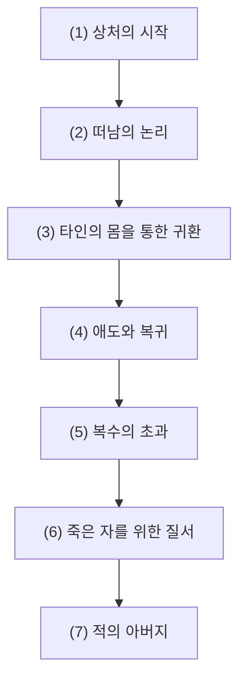
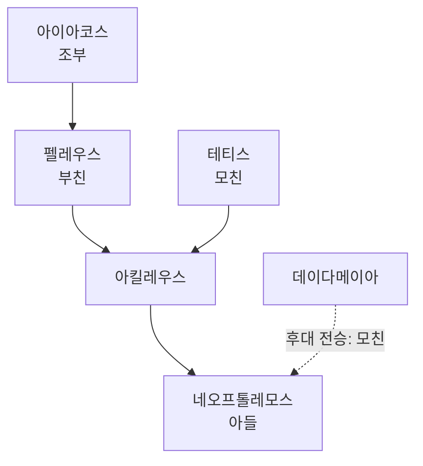

# 아킬레우스 (Achilles)

**[[greek-reading-guide|읽는 법]]**: 아킬레우스 · **원어**: Ἀχιλλεύς · **학술 전사**: *Akhilleús*

## 서사적 입구 (Narrative Entry)

『일리아스』는 아킬레우스의 승리를 보여주는 장면이 아니라 그의 분노가 아카이아군에 어떤 결핍을 남기는지를 말하며 시작한다. 아킬레우스의 [[concept-menis|메니스]]는 사적인 기분에 머물지 않고 전쟁의 질서 전체를 흔드는 힘으로 제시된다(_Il._ 1.1–7). 그 분노가 터져 나온 계기는 [[entity-agamemnon|아가멤논]]이 전리품 [[entity-briseis|브리세이스]]를 가져간 사건이었다. 이때 훼손된 것은 한 사람의 소유물만이 아니라, 전사의 공적을 공동체가 알아보는 방식인 [[concept-time|티메]]였다(_Il._ 1.121–187).

아킬레우스는 칼을 뽑아 아가멤논을 베려다가 아테나의 개입으로 멈춘다(_Il._ 1.188–222). 그러나 멈춘다는 것은 화해한다는 뜻이 아니었다. 그는 전선에서 물러나 어머니 테티스를 통해 제우스에게 아카이아군의 패배를 청하고, 9권의 사절단 앞에서는 선물로 보상될 수 없는 생명의 가치를 말한다(_Il._ 1.350–412; 9.308–429). 그가 제시하는 두 길, 곧 [[concept-kleos|클레오스]]를 얻는 대신 죽는 길과 [[concept-nostos|노스토스]]를 얻는 대신 이름 없이 오래 사는 길은, 영웅적 명성과 생존이 서로 양립하지 않는다는 서사의 압축된 형식이다(_Il._ 9.410–416).

그러나 파트로클로스가 자신의 갑옷을 입고 나갔다가 전사하면서, 아킬레우스의 고립은 더 이상 아가멤논과의 협상 문제가 아니게 된다(_Il._ 16.1–47, 16.843–854). 그는 애도 속에서 전장으로 돌아오지만, 그 복귀는 곧바로 인간적 질서의 회복으로 이어지지 않는다. 스카만드로스와의 대결과 헥토르의 살해, 시신을 전차 뒤에 매다는 행위는 상실이 복수로 전환될 때 전사의 탁월성이 어떻게 파괴적 초과로 변하는지를 보여준다(_Il._ 20–22).

전환은 승리의 순간이 아니라 장례와 탄원의 장면에서 일어난다. 파트로클로스의 장례를 치른 뒤(_Il._ 23), 아킬레우스는 아들을 찾아온 적장 [[entity-priam|프리아모스]]의 탄원([[concept-hikesia|히케시아]])을 받아들인다. 프리아모스에게서 자신의 아버지 펠레우스를 떠올린 그는 헥토르의 시신을 돌려주고 장례를 위한 휴전을 허락한다(_Il._ 24.477–676). 『오뒷세이아』 11권의 죽은 아킬레우스가 “살아 있는 가난한 자의 머슴이 되더라도 낫다”고 말하는 장면은 이 결말을 단순한 도덕적 성장으로 확정하기보다, 영웅적 명성의 대가를 다시 묻는 사후의 반론으로 읽게 한다(_Od._ 11.488–491).

따라서 이 문서의 중심 질문은 “아킬레우스가 분노를 버리고 연민을 배웠는가”가 아니다. 더 정확한 질문은 명예의 손상이 공동체에 대한 철수로, 상실이 복수로, 복수가 다시 타인의 고통을 알아보는 순간으로 어떻게 변형되는가이다. 이 궤적은 원전의 장면을 중심으로 하되, 분노에서 연민으로의 연속성을 강조하는 연구가 하나의 해석임을 잊지 않는다([[lee-junseok-2018-wrath-and-pity|이준석 2018]], [[zanker-1994-heart-of-achilles|Zanker 1994]]).

## 1. 정의와 식별 (Definition & Identification)

- **핵심 정의**: [[entity-peleus|펠레우스]]와 [[entity-thetis|테티스]]의 아들인 아킬레우스는 프티아(Phthia)의 왕가에 속한 영웅이자, 아카이아 연합군의 미르미도네스(Myrmidones)를 이끄는 최강의 전사이다. 『일리아스』는 그의 분노와 철수를 중심으로 전쟁의 질서, 전우의 죽음, 적과의 연민을 전개한다.
- **분류 및 소속**: 인물(`entity_type: person`), 아카이아 진영의 전사 지휘관. 신적 혈통을 지녔지만 호메로스의 아킬레우스는 필멸의 육체와 죽음의 운명을 가진 인간 영웅으로 제시된다.
- **서사적 출현 범위**: 『일리아스』에서는 1권의 갈등, 9권의 사절단, 16권 이후의 파트로클로스·헥토르 사건, 23권의 장례 경기, 24권의 프리아모스 방문이 중심을 이룬다. 『오뒷세이아』에서는 11권의 저승 대화와 24권의 장례 회고를 통해 이미 죽은 영웅으로 재현된다.

## 2. 명칭과 문헌학 (Philology, Epithets & Dialect)

### 2.1 희랍어 표기와 이름의 해석

- **표제형**: Ἀχιλλεύς (*Akhilleús*). 호메로스 서사시에는 운율과 격에 따른 곡용형이 함께 나타난다.
- **시학적 어원 해석**: 그레고리 나기(Gregory Nagy)는 이름을 *ákhos* (ἄχος, 비탄)와 *laós* (λαός, 군대·민중)의 결합으로 해석한다. 이 분석은 아킬레우스의 철수가 군대 전체에 고통을 가져온다는 서사적 기능을 설명하는 강한 문헌학적 추론이지만, 선사시대 이름의 확정된 역사언어학적 어원은 아니다([[nagy-1979-best-of-achaeans|Nagy 1979]]).

> [!WARNING] 어원과 시학의 구분
> 아킬레우스의 이름을 군대의 고통과 연결하는 해석은 서사시의 의미 작용을 설명하는 가설이다. 이를 이름의 객관적 어원이나 인물의 역사적 실재를 증명하는 자료로 사용할 수 없다.

### 2.2 정형구와 부칭 (Epithets & Formulae)

호메로스의 수식어는 인물의 성격을 한 번에 고정하는 별명이면서, 육보격 시행의 서로 다른 위치를 채우는 정형구이다. 같은 인물도 장면과 문법적 형태에 따라 다른 수식어로 불리므로, 하나의 별칭을 인물 전체의 단일한 해석 열쇠로 삼지 않는다.

| 희랍어 정형구 | 학술 전사 | 통상적 의미 | 서사적 기능 및 대표 근거 |
|:---|:---|:---|:---|
| **πόδας ὠκὺς Ἀχιλλεύς** | *pódas ōkùs Akhilleús* | 발이 빠른 아킬레우스 | 전장에서의 기동성과 육체적 탁월성을 환기한다. _Il._ 1.84 등 |
| **Πηληϊάδης / Πηλεΐδης** | *Pēlēïádēs / Pēleḯdēs* | 펠레우스의 아들 | 가문과 필멸의 혈통을 전면에 둔다. _Il._ 16.15 등 |
| **Αἰακίδης** | *Aiakídēs* | 아이아코스의 후손 | 영웅적 계보와 전통적 명예를 환기한다. _Il._ 16.15, 21.189 |
| **δῖος Ἀχιλλεύς** | *dī̂os Akhilleús* | 신과 같은 아킬레우스 | 비범한 전사적 위상을 표시하지만, 불사신이라는 뜻은 아니다. |
| **ῥηξήνωρ** | *rhēksḗnōr* | 전열을 부수는 자 | 결투와 돌파 장면에서 공격적 행위성을 강조한다. |

### 2.3 방언과 곡용형

호메로스의 언어는 이오니아 서사시 전통과 다른 방언적 요소가 결합된 인공적인 시어이다. 아킬레우스의 이름도 격과 운율에 따라 여러 형태로 나타나며, 이는 단일한 일상 발음의 기록이라기보다 서사시 운율 안에서 전승된 형태들의 체계로 이해해야 한다.

## 3. 호메로스 본문에서의 모습 (Homeric Attestation & Narrative Arc)

### 3.1 『일리아스』의 서사적 궤적

#### (1) 상처의 시작: 분노는 개인적 감정이면서 공적 질서의 문제다

크뤼세이스의 반환 뒤 아가멤논이 아킬레우스의 전리품 브리세이스를 가져가면서, 두 사람의 갈등은 지휘관과 전사의 권한 다툼으로 번진다(_Il._ 1.121–187). 아킬레우스는 아가멤논을 모욕하고 칼을 뽑지만, 아테나가 개입하자 살인을 실행하지는 않는다(_Il._ 1.188–222). 이 장면의 긴장은 분노의 유무가 아니라, 분노를 멈추면서도 불의의 원인을 인정하지 않는 데 있다.

#### (2) 떠남의 논리: 보상으로 회복되지 않는 명예

아킬레우스는 테티스를 통해 제우스에게 아카이아군의 패배를 청하고(_Il._ 1.350–412), 9권의 사절단에도 즉시 돌아가지 않는다. 그는 막대한 선물이 손상된 관계와 사라질 생명을 되돌릴 수 없다고 말하며, 트로이에 남는 삶과 귀향하는 삶의 두 운명을 나란히 놓는다(_Il._ 9.308–429, 9.410–416). 이 거부는 영웅 사회의 보상 체계를 비판하는 목소리로 읽힐 수 있지만, 동시에 공동체가 무너지는 동안 자신의 분노를 끝까지 밀어붙이는 선택이기도 하다.

#### (3) 타인의 몸을 통한 귀환: 파트로클로스의 갑옷

함선이 위협받자 아킬레우스는 파트로클로스에게 자신의 갑옷을 입혀 전장에 나가게 한다. 이 선택은 그가 직접 돌아가지 않으면서도 자신의 이름과 전투적 위상을 타인의 몸에 실어 보내는 장면이다(_Il._ 16.1–47). 그러나 파트로클로스가 헥토르에게 죽자 대리된 전투는 대리할 수 없는 상실로 되돌아온다(_Il._ 16.843–854).

#### (4) 애도와 복귀: 무구가 다시 몸을 만든다

18권에서 아킬레우스는 흙을 뒤집어쓰고 파트로클로스를 애도한다(_Il._ 18.22–64). 테티스가 헤파이토스에게 새 무구를 받아오고, 19권에서 아가멤논의 사과와 보상이 정리되면서 아킬레우스는 전장으로 돌아올 수 있게 된다(_Il._ 18.368–617; 19.1–237). 이 복귀는 처음의 명예 분쟁을 단순히 해결한 결과가 아니라, 전우의 죽음이 새로운 행동의 이유가 된 결과이다.

#### (5) 복수의 초과: 가장 뛰어난 전사는 가장 위험한 전사가 된다

20–22권의 아킬레우스는 트로이 전사들을 압도하고 스카만드로스 강신과 맞선다(_Il._ 20–21). 헥토르와의 결투에서 승리한 뒤에는 시신을 전차에 매달아 끌고 다닌다(_Il._ 22.395–404). 이 장면은 영웅적 탁월성이 자동으로 윤리적 절제가 되지 않는다는 사실을 드러낸다. 조너선 셰이는 이 부분을 전투 트라우마와 도덕적 상해의 언어로 읽지만, 그 현대적 분석을 호메로스의 고유 심리학과 동일시해서는 안 된다([[shay-1994-achilles-in-vietnam|Shay 1994]]).

#### (6) 죽은 자를 위한 질서: 장례와 경기

23권에서 아킬레우스는 파트로클로스의 장례와 경기를 주재한다(_Il._ 23.1–897). 전투의 경쟁을 장례 의례와 경기 규칙 안으로 옮기는 이 장면은, 공동체에서 물러났던 전사가 다시 공동체의 죽은 자와 산 자를 조직하는 순간이다. 다만 이것을 완전한 회복이나 최종적 성숙으로 단정하지 않고, 복수의 폭력을 의례가 잠시 다른 형식으로 바꾸는 장면으로 보는 편이 안전하다.

#### (7) 적의 아버지: 프리아모스가 열어 놓은 인간의 공통 지평

프리아모스는 아들을 죽인 사람의 손에 입을 맞추며 헥토르의 시신을 돌려달라고 청한다(_Il._ 24.477–506). 아킬레우스는 그에게서 자신의 아버지 펠레우스를 떠올리고 함께 울며, 시신을 씻기고 장례 휴전을 허락한다(_Il._ 24.507–676). 적대의 해소가 전쟁의 종결을 뜻하는 것은 아니지만, 두 사람의 공동 애도는 적과 동지를 가르던 질서 밖에서 필멸성이 공유된다는 사실을 잠시 가시화한다.

### 3.2 『오뒷세이아』의 사후 아킬레우스

『오뒷세이아』 11권에서 오디세우스는 저승의 아킬레우스를 영웅들의 지배자로 칭송하지만, 아킬레우스는 죽은 자의 명예보다 살아 있는 삶을 원한다고 대답한다(_Od._ 11.467–491). 짧은 대화는 『일리아스』의 클레오스 중심 선택을 무효화하지 않는다. 대신 귀향을 실제로 얻은 오디세우스와 이미 죽은 아킬레우스를 마주 세워, 명성이 생존을 대신할 수 있는지 다시 묻는다.

24권의 장례 회고는 아킬레우스의 죽음과 장례가 신들과 인간 모두의 애도 대상이 되었음을 전한다(_Od._ 24.36–97). 그의 죽음 자체는 『일리아스』의 직접 서사가 아니라 『오뒷세이아』와 에픽 사이클이 전제하는 후속 사건이므로, 호메로스 각 작품의 층위를 구분해야 한다.

### 3.3 전환점을 따라 읽는 질문

- 명예의 손상은 왜 보상물의 양으로 회복되지 않는가(_Il._ 1, 9)? 이 질문은 물질적 보상과 관계적 인정의 차이를 드러낸다.
- 파트로클로스의 갑옷은 아킬레우스의 힘을 확장했는가, 아니면 그의 부재를 드러냈는가(_Il._ 16)?
- 아킬레우스의 복수는 왜 헥토르의 죽음에서 끝나지 않고 프리아모스의 방문까지 이어지는가(_Il._ 22–24)?

## 4. 관계와 소속 (Genealogy, Alliances & Networks)

아킬레우스의 관계망은 혈통의 신성함보다 관계가 행동을 어떻게 움직이는지를 보여준다. 테티스와 펠레우스는 신적·필멸적 혈통의 양면을 만들고, 파트로클로스와 프리아모스는 각각 전우와 적의 아버지라는 위치에서 아킬레우스의 행동을 다른 방향으로 돌린다. 반대로 아가멤논과 헥토르는 명예와 복수의 언어를 가장 날카롭게 자극하는 상대이다.

### 4.1 혈통과 후손

> [!NOTE] 전승 층위
> 네오프톨레모스가 아킬레우스의 아들이라는 정보는 『오뒷세이아』에 나타나지만, 데이다메이아를 그의 모친으로 특정하는 계보는 호메로스 본문 밖의 후대 전승에 속한다.

아킬레우스는 인간 국왕 펠레우스와 네레이스 테티스 사이의 아들이다. 이 계보는 그를 불사신으로 만들지 않으며, 오히려 신적 혈통과 필멸의 운명이 한 인물 안에서 충돌하는 조건을 설명한다.

### 4.2 인간 관계

| 대상 | 관계가 움직이는 방향 | 원전 근거 |
|:---|:---|:---|
| 파트로클로스 (Patroklos) | 갑옷을 입고 대신 싸우며, 그의 죽음이 아킬레우스의 복귀를 촉발한다. | _Il._ 16.1–47, 16.843–854, 18.1–137 |
| 포이닉스 (Phoinix) | 아버지 같은 연장자로서 사절단에서 귀환과 공동체의 의무를 설득한다. | _Il._ 9.432–605 |
| 아가멤논 (Agamemnon) | 브리세이스와 전리품 배분을 둘러싸고 명예·지휘권의 경계를 시험한다. | _Il._ 1.121–187, 9.308–429, 19.1–237 |
| 헥토르 (Hektor) | 전투의 숙적이자 시신 반환을 통해 복수의 한계를 드러내는 상대이다. | _Il._ 22.131–404, 24.477–676 |
| 프리아모스 (Priamos) | 탄원을 통해 헥토르를 적장이 아니라 아들로 보게 만드는 관계를 연다. | _Il._ 24.477–676 |
| 브리세이스 (Briseis) | 전쟁 포로이자 전리품 배분의 모순을 가시화하는 인물이다. | _Il._ 1.184–187, 19.282–300 |

### 4.3 신적 개입과 대결

| 존재 | 서사적 기능 | 원전 근거 |
|:---|:---|:---|
| 아테나 (Athena) | 1권에서 살인을 제지하고, 22권의 결투 국면에서 신적 개입을 수행한다. | _Il._ 1.188–222, 22.214–247 |
| 테티스 (Thetis) | 아킬레우스의 운명과 무구를 매개하고, 아들의 애도에 참여한다. | _Il._ 1.350–412, 18.35–147, 18.368–617 |
| 헤파이토스 (Hephaistos) | 테티스의 청에 따라 새 무구와 방패를 제작한다. | _Il._ 18.368–617 |
| 아폴론 (Apollon) | 트로이 편의 신으로서 파트로클로스의 죽음과 아킬레우스의 전투에 개입한다. | _Il._ 16.843–854, 21.595–611, 22.1–32 |
| 스카만드로스 (Skamandros) | 지형이 아니라 의인화된 강신으로서 아킬레우스의 살육과 맞선다. | _Il._ 21.211–382 |

## 5. 인물 전용 모듈 (Person-Specific Details)

### 5.1 두 운명과 선택

테티스가 전하는 두 운명은 아킬레우스의 서사를 윤리적 선택의 형태로 압축한다(_Il._ 9.410–416).

1. **트로이에 남는 길**: 젊은 죽음과 함께 시들지 않는 명성을 얻지만 귀향을 잃는다.
2. **귀향하는 길**: 오래 살 수 있지만 전쟁에서 얻을 영원한 명성을 포기한다.

9권의 아킬레우스는 두 번째 길을 말할 수 있는 상태에 있다. 그러나 파트로클로스의 죽음 이후 그는 첫 번째 길을 단순히 명예 때문에 선택하는 것이 아니라, 상실에 응답하는 복수의 행동 속으로 들어간다. 두 운명이 실제로 언제 확정되는지, 그리고 아킬레우스가 얼마나 자유롭게 선택하는지는 학술적으로 논쟁적이다.

### 5.2 직언과 내적 불일치의 거부

아킬레우스는 말과 생각이 어긋나는 외교적 태도를 노골적으로 거부한다.

- *“마음속에 품은 생각과 입으로 내뱉는 말이 다른 자를 나는 하데스의 문만큼이나 증오한다.”* (_Il._ 9.312–313)

이 직언은 그를 도덕적으로 무결한 인물로 만들지 않는다. 헥토르의 시신을 훼손하는 행동은 말의 진실성과 타인의 죽음에 대한 존중이 별개의 문제임을 보여준다.

### 5.3 아리스테이아와 전사의 야수화

20–22권의 아리스테이아(Aristeia)는 전사의 탁월성이 극대화되는 동시에 인간적 제어가 약해지는 장면군이다. 강을 피로 물들이고, 탄원하는 적을 죽이며, 헥토르의 시신을 끌고 가는 행동은 전쟁의 영웅성이 공동체의 규범을 파괴할 수 있음을 보여준다(_Il._ 21.1–135; 22.395–404). 셰이의 도덕적 상해 분석은 이 장면들을 현대 전투 경험과 비교하는 강한 학술 추론이지만, 호메로스 인물의 내면을 현대 임상 진단으로 확정하는 근거는 아니다.

### 5.4 아름다운 죽음과 후대의 영웅상

장-피에르 베르낭(Jean-Pierre Vernant)의 ‘아름다운 죽음’(*belle mort*)은 젊음과 전사적 명성이 죽음 이후의 기억 속에서 결합하는 방식을 설명한다([[vernant-1989-belle-mort|Vernant 1989]]). 아킬레우스는 『일리아스』 안에서 아직 죽지 않지만, 『오뒷세이아』의 장례 회고와 에픽 사이클의 후속 전승은 그의 죽음을 이미 알고 있다. 그러므로 ‘아킬레우스가 아름다운 죽음을 선택했다’는 표현은 본문 명시라기보다, 두 운명과 후대의 장례·수용 전승을 연결하는 해석으로 제시해야 한다.

## 6. 역사적 맥락 (Historical Context & Social Institutions)

### 6.1 청동기 기억과 아르카익 시대의 중첩

호메로스 서사시는 하나의 역사적 시기를 그대로 기록한 문서가 아니다. 전차·무구·왕궁 중심의 전사 문화는 미케네 청동기 시대의 기억을 환기하는 반면, 전사 회의와 선물 교환, 명예를 둘러싼 공개적 논쟁은 후대의 공동체 경험과도 맞닿아 있다. 이 층위들은 서사시 안에서 겹쳐지며, 아킬레우스를 실제 청동기 왕의 전기처럼 읽게 해주지 않는다.

### 6.2 전리품, 지휘권, 공적 명예

전리품(*geras*)은 단순한 재산이 아니라 전사의 공적이 공동체에서 인정되었다는 가시적 표지였다. 아가멤논이 브리세이스를 가져간 사건은 소유권 분쟁이면서 지휘관이 하위 전사의 명예를 얼마나 임의로 침해할 수 있는지 묻는 사건이다(_Il._ 1.121–187). 이 사회적 배경은 아킬레우스의 분노를 설명하지만, 그의 모든 행동을 정당화하지는 않는다.

## 7. 고고학과 지리 (Archaeology, Topography & Material Culture)

### 7.1 프티아와 테살리아의 지리적 지평

프티아(Phthia)는 일반적으로 테살리아 남부와 스페르케이오스(Spercheios)강 유역을 포함하는 지역으로 비정되지만, 이 지리적 동일시가 아킬레우스라는 인물의 역사적 실재를 입증하지는 않는다. 후기 헬라딕 취락과 물질문화는 서사시가 기억하는 지역적 지평을 비교하게 할 뿐이다.

### 7.2 트로아스의 묘역과 후대 기념

헬레스폰토스 인근의 시게이온(Sigeion)으로 전승된 봉분은 고대인들이 아킬레우스의 묘역으로 기억한 장소 가운데 하나이다. 베식-테페(Beşik-Tepe)와 트로아스 일대의 항구·매장 자료는 이 지역이 에게해와 북서 아나톨리아를 잇는 물질문화의 공간이었음을 보여주지만, 특정 봉분이 서사시 영웅의 실제 무덤이라는 결론을 제공하지는 않는다.

### 7.3 방패 묘사와 물질문화의 비교

헤파이토스가 만든 방패의 제작 장면(_Il._ 18.478–608)은 금속·농경·도시·전투가 한 물체의 표면에 함께 배치되는 서사적 파노라마이다. 미케네 상감 무기나 기하학기 도상과의 비교는 시인이 오래된 물질문화의 기억을 재구성했을 가능성을 탐색하게 하지만, 특정 유물을 방패의 직접 모델로 확정하지는 않는다.

## 8. 종교학·인류학적 해석 (Religion, Cult & Anthropology)

### 8.1 영웅 숭배의 후대 형성

아킬레우스 숭배는 호메로스 서사의 직접 증거가 아니라 아르카익기 이후의 제의·비문·기념 지형 자료에서 확인된다. 흑해의 레우케(Leuke)와 폰토스 연안에서 아킬레우스가 영웅신 또는 항해자와 연결된 존재로 숭배되었다는 자료는, 서사시 인물이 지역 제의의 수호자로 재구성되는 과정을 보여준다([[vernant-1989-belle-mort|Vernant 1989]]). 이 후대 숭배는 아킬레우스의 역사적 실존을 증명하는 것이 아니라, 그의 서사적 명성이 다른 사회적 기능을 얻었다는 후대 수용의 증거이다.

### 8.2 탄원, 장례, 식사

24권의 프리아모스는 무릎을 잡고 손에 입을 맞추는 탄원의 형식으로 적의 공간에 들어온다(_Il._ 24.477–506). 아킬레우스는 그를 일으켜 세우고 함께 울고 식사한 뒤 시신 반환과 휴전을 준비한다(_Il._ 24.507–676). 이 장면은 탄원·장례·식사가 전쟁의 폭력을 잠시 중단시키는 의례적 장치를 보여주지만, 이를 현대적 의미의 화해 조약이나 영구적 평화로 번역해서는 안 된다.

## 9. 철학·윤리학적 해석 (Philosophical & Ethical Dimensions)

### 9.1 메니스와 이중 동기화

아킬레우스의 *mēnis*는 1권의 첫 행부터 개인의 분노보다 큰 파괴적 범주로 제시된다. 1.188–222에서 칼을 뽑으려는 충동과 아테나의 제지가 동시에 나타나는 장면은, 호메로스적 행위가 인간의 판단과 신적 개입을 분리하지 않고 겹쳐 놓는다는 해석을 가능하게 한다. 이를 현대 심리학의 ‘분열된 자아’로 단정하기보다, 튀모스(*thumos*)와 [[concept-phren|프렌]](*phren*) 같은 신체적 심성 어휘를 통해 고대의 행위 묘사를 읽는 편이 적절하다([[dodds-1951-greeks-and-irrational|Dodds 1951]], [[williams-1993-shame-and-necessity|Williams 1993]]).

### 9.2 티메와 클레오스의 불일치

9권의 아킬레우스는 공동체가 주는 보상인 티메와 죽음 뒤의 명성인 클레오스가 서로 다른 가치일 수 있음을 드러낸다. 애드킨스는 그의 거부를 경쟁적 가치 체계의 파괴로 읽는 반면, 윌리엄스와 잰커는 보상으로 대체할 수 없는 개인적 판단과 책임의 표출로 읽는다([[adkins-1960-merit-and-responsibility|Adkins 1960]], [[williams-1993-shame-and-necessity|Williams 1993]], [[zanker-1994-heart-of-achilles|Zanker 1994]]). 어느 해석도 9권의 연설만으로 24권의 결말을 미리 확정할 수는 없다.

### 9.3 제우스의 두 항아리와 연민

24권에서 아킬레우스는 프리아모스에게 제우스의 두 항아리(*pithoi*)를 말한다(_Il._ 24.527–551). 인간은 축복과 재앙이 섞인 운명을 받거나, 재앙만을 받으며 살아간다는 이 비유는 헥토르의 죽음을 정당화하는 논리가 아니다. 오히려 아킬레우스와 프리아모스가 모두 상실을 피할 수 없는 존재라는 공통 조건을 말하게 하며, 그 공통성이 복수의 언어를 잠시 연민의 언어로 바꾼다([[lee-junseok-2018-wrath-and-pity|이준석 2018]]).

### 9.4 티메와 아레테의 분리 및 저승에서의 두 영웅주의 선택

마르갈리트 핀켈버그의 두 연구([[finkelberg-1995-odysseus-and-genus-hero|Finkelberg 1995]], [[finkelberg-1998-time-and-arete|Finkelberg 1998]])는 아킬레우스의 비극을 지위 분배와 실천적 덕, 그리고 영웅주의의 양식적 대립이라는 새로운 시각에서 해명합니다.

- **제9권의 모순과 아레테의 상실**: Finkelberg(1998)는 아가멤논의 막대한 보상 제안으로 인해 아킬레우스의 분배적 명예인 **티메**([[concept-time|Time]])는 극대화되었으나, 출전을 거부하고 공동체를 구원하지 않음으로써 그의 실천적 탁월성인 **아레테**([[concept-arete|Arete]])는 완전히 소멸했다고 분석합니다. 아레테는 사적으로 소유될 수 없으며 타인을 위한 행위(Enérgeia) 속에서만 성립합니다. 따라서 18권에서 아킬레우스가 스스로를 "대지의 쓸모없는 짐(*etōsion akhthos aroures*)"으로 자책한 것은 아레테를 발휘하지 못한 영웅의 존재론적 파탄을 가리킵니다.
- **저승에서의 선택과 두 가지 영웅주의**: Finkelberg(1995)는 『오뒷세이아』 11.488–491에서 저승의 아킬레우스가 망자의 왕 노릇보다 지상에서 가난한 자 밑에서 머슴살이(*thēteuein*)를 하겠다고 고백한 장면을 재해석합니다. *thēteuein*(머슴살이하다)은 신화적으로 포세이돈과 아폴론의 라오메돈 복종에서 보듯 *athleuein*(노고를 치르다)의 동의어입니다. 따라서 이는 영웅적 죽음에 대한 비겁한 후회가 아니라, 『일리아스』의 '전장에서의 요절과 영원한 명성'이라는 영웅주의와 『오뒷세이아』의 '삶의 노고를 감내하고 생존하는' 영웅주의 사이의 **두 영웅주의 양식 간의 선택**입니다.

## 10. 후대 전승과 수용 (Post-Homeric Tradition & Reception)

### 10.1 에픽 사이클

『퀴프리아』와 『아이티오피스』의 전승 요약은 스퀴로스의 은신, 펜테실레이아와 멤논과의 전투, 파리스와 아폴론에 의한 죽음 등 『일리아스』 이후의 사건을 전한다. 『소일리아스』는 아킬레우스 무구의 심판과 유골의 안치를 다룬다. 이 사건들은 호메로스의 『일리아스』에 직접 서술된 행적이 아니라, 트로이 전쟁을 둘러싼 후대 에픽 사이클의 층위로 표시해야 한다([[concept-epic-cycle|에픽 사이클]]).

### 10.2 비극과 철학

아이스킬로스의 미르미도네스 전승과 플라톤의 『향연』(179e)은 아킬레우스와 파트로클로스의 관계 및 죽음의 선택을 각기 다른 윤리적·에로스적 언어로 재구성한다. 후대 작품은 호메로스의 빈틈을 메우는 자료가 아니라, 아킬레우스라는 인물이 시대마다 어떤 가치의 표상이 되었는지를 보여주는 수용 자료이다.

### 10.3 헬레니즘·로마 전승과 대중적 신화

스타티우스의 『아킬레이다』는 스틱스강에 담근 몸과 발뒤꿈치의 약점이라는 아킬레스건 전승을 널리 퍼뜨렸다. 이 전승은 호메로스 원전에 없으며, 아킬레우스가 태어날 때부터 사실상 불사신이었다는 통념을 호메로스의 인간적 영웅상과 혼동해서는 안 된다. 알렉산드로스 대왕이 트로아스의 아킬레우스 묘역을 방문했다는 이야기는 고대 통치자가 영웅의 기억을 자신의 정복 서사와 연결한 수용의 사례이다.

## 11. 학술 논쟁 (Scholarly Debates & Contradictions)

> [!WARNING] 모순/이설 발견: 9권 사절단 거부의 의미
> 아킬레우스의 배상 거부를 부당한 오만으로 볼 것인지, 외적 보상으로 환원되지 않는 판단의 표현으로 볼 것인지 학설이 갈린다. 9권의 연설을 24권의 연민으로 곧장 연결하는 독해는 매력적이지만, 두 장면 사이의 폭력과 중단을 충분히 설명해야 한다.

- **사회 규범의 붕괴**: 애드킨스는 경쟁적 가치와 결과 중심의 영웅 사회에서 아킬레우스의 거부가 공동체 규범을 파괴한다고 본다.
- **개인 윤리의 출현**: 윌리엄스와 잰커는 그 거부가 생명·판단·책임을 물질적 보상과 분리하는 계기라고 본다.
- **서사적 연속성**: 이준석은 9권의 거부, 16권의 동일화, 24권의 연민을 하나의 비극적 시학으로 연결한다. 이는 유력한 해석이지만, 모든 독해를 대체하는 원전의 명시적 명제는 아니다.

## 12. 증거 매트릭스 (Evidence Matrix)

| 주장 및 테제 | 자료 유형 | 근거 및 출전 | 확실성 | 관련 위키 문서 |
|:---|:---|:---|:---|:---|
| 아킬레우스의 메니스가 서사의 발단을 이룬다 | 호메로스 본문 | _Il._ 1.1–7, 1.121–222 | 원전 명시 | [[lee-junseok-2024-iliad-jeongam\|이준석 2024]] |
| 이름을 *akhos*와 *laos*의 결합으로 읽는 해석 | 현대 문헌학 | Nagy 1979, 이름과 시학적 어원 논의 | 강한 학술 추론 | [[nagy-1979-best-of-achaeans\|Nagy 1979]] |
| 주요 부칭과 정형구가 혈통·전사성을 환기한다 | 호메로스 본문 | _Il._ 1.84, 16.15, 21.189 | 원전 명시 | [[lee-junseok-2024-iliad-jeongam\|이준석 2024]] |
| 두 운명은 클레오스와 노스토스의 상호 배제를 제시한다 | 호메로스 본문 | _Il._ 9.410–416 | 원전 명시 | [[nagy-1979-best-of-achaeans\|Nagy 1979]] |
| 사절단 거부는 서사적·윤리적 논쟁의 중심이다 | 현대 학술 연구 | Adkins, Williams, Zanker, 이준석의 상이한 해석 | 논쟁적 | [[analysis-homeric-ethics-literature-review\|호메로스 윤리학 문헌 고찰]] |
| 파트로클로스의 죽음이 아킬레우스의 복귀를 촉발한다 | 호메로스 본문 | _Il._ 16.1–47, 16.843–854, 18.1–137 | 원전 명시 | [[lee-junseok-2018-wrath-and-pity\|이준석 2018]] |
| 헥토르의 시신 훼손은 복수의 초과를 보여준다 | 호메로스 본문 | _Il._ 22.395–404 | 원전 명시 | [[shay-1994-achilles-in-vietnam\|Shay 1994]] |
| 전투 트라우마와 도덕적 상해의 비교가 가능하다 | 현대 학술 연구 | Shay 1994 | 강한 학술 추론 | [[shay-1994-achilles-in-vietnam\|Shay 1994]] |
| 프리아모스의 탄원과 시신 반환이 마지막 전환점이다 | 호메로스 본문 | _Il._ 24.477–676 | 원전 명시 | [[zanker-1994-heart-of-achilles\|Zanker 1994]] |
| 제우스의 두 항아리가 공통의 필멸성을 말한다 | 호메로스 본문·현대 연구 | _Il._ 24.527–551; Zanker 1994 | 강한 학술 추론 | [[lee-junseok-2018-wrath-and-pity\|이준석 2018]] |
| 저승의 아킬레우스가 생존을 명예보다 우선해 말한다 | 호메로스 본문 | _Od._ 11.488–491 | 원전 명시 | [[lee-junseok-2016-odyssey-humanity\|이준석 2016]] |
| 프티아·트로아스의 지리와 물질문화는 서사시의 층위를 비교하게 한다 | 물질자료·고고학 | 테살리아·트로아스의 유적 및 후대 기념 자료 | 강한 학술 추론 | [[lee-junseok-2024-iliad-jeongam\|이준석 2024]] |
| 레우케의 아킬레우스 숭배는 후대 영웅신 수용의 사례다 | 후대 제의·비문 | 레우케·올비아 관련 자료 | 후대 수용 | [[vernant-1989-belle-mort\|Vernant 1989]] |
| 스틱스강 침수와 아킬레스건은 호메로스 밖의 전승이다 | 후대 문헌 | Statius, _Achilleid_ 1.133 | 후대 수용 | [[analysis-homeric-ethics-literature-review\|호메로스 윤리학 문헌 고찰]] |
| 제9권 티메의 극대화와 공동체 아레테의 구조적 충돌 | 호메로스 본문·문헌학 | Il. 9.607–610, 11.762–763, 16.29–35; Finkelberg 1998 | 강한 학술 추론 | [[finkelberg-1998-time-and-arete\|핀켈버그 1998]] |
| 저승의 아킬레우스 발언은 두 영웅주의 양식 간의 선택이다 | 호메로스 본문·비교신화 | Od. 11.488–491; Finkelberg 1995 | 강한 학술 추론 | [[finkelberg-1995-odysseus-and-genus-hero\|핀켈버그 1995]] |

## 관련 항목

- [[entity-odysseus|오디세우스]] — 귀향과 생존을 통해 아킬레우스와 다른 영웅적 경로를 보여주는 인물
- [[entity-patroklos|파트로클로스]] — 아킬레우스의 복귀를 촉발하는 전우
- [[entity-hector|헥토르]] — 복수와 시신 반환의 중심이 되는 트로이아의 영웅
- [[entity-priam|프리아모스]] — 24권의 탄원으로 아킬레우스와 공동 애도에 이르는 인물
- [[entity-peleus|펠레우스]] — 아킬레우스의 필멸적 부친
- [[entity-thetis|테티스]] — 아킬레우스의 신적 모친
- [[concept-menis|Menis]] — 서사의 발단을 이루는 신적 분노
- [[concept-time|Timê]] — 전리품과 공적 명예의 관계
- [[concept-kleos|Kleos]] — 죽음 뒤의 영웅적 명성
- [[concept-nostos|Nostos]] — 귀향과 생존의 가치
- [[concept-eleos|Eleos]] — 프리아모스 장면에서 작동하는 연민
- [[concept-hikesia|Hikesia]] — 프리아모스의 탄원 의례
- [[concept-xenia|Xenia]] — 적대 중단과 식사의 사회적 규범
- [[word-achilles|Achilles]] — 아킬레우스 이름의 어원 및 현대 영어 수용사
- [[finkelberg-1995-odysseus-and-genus-hero|마르갈리트 핀켈버그 (1995)]] — 오뒷세우스와 영웅이라는 유: 일리아스형 전사 영웅주의와 저승 아킬레우스의 재해석
- [[finkelberg-1998-time-and-arete|마르갈리트 핀켈버그 (1998)]] — 호메로스에게서의 티메와 아레테: 9권 티메의 극대화와 아레테의 구조적 충돌
- [[analysis-homeric-ethics-literature-review|호메로스 윤리학 문헌 고찰]] — 명예·책임·연민의 종합 분석
- [[wiki/entities/_template|엔티티 표준 마크다운 템플릿]]
- [[entity-framework|엔티티 프레임워크 작성 지침]]
