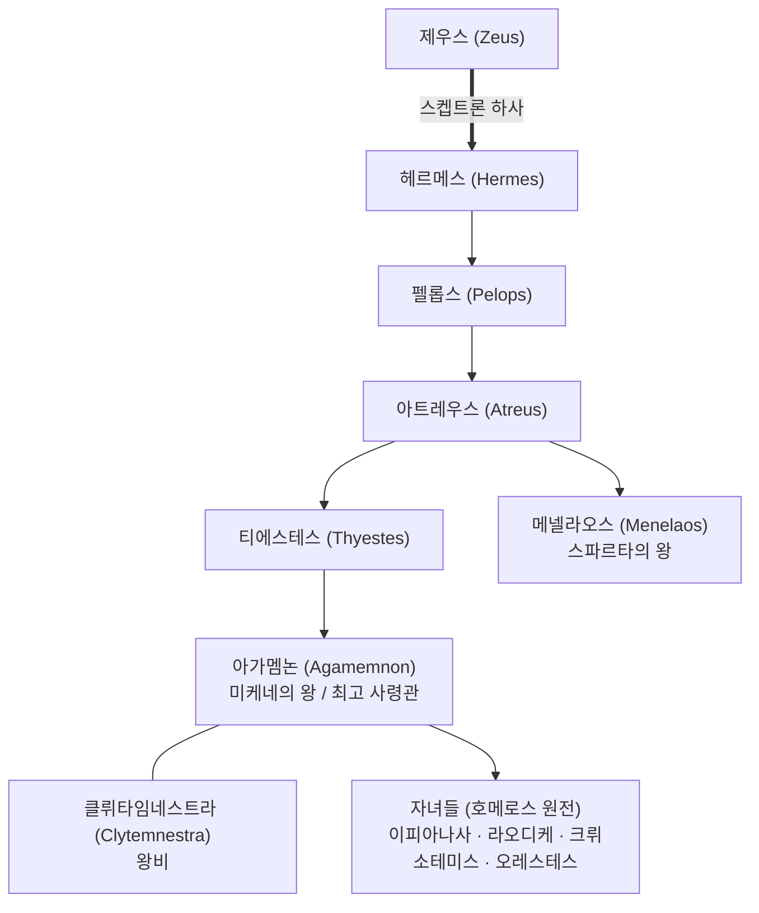
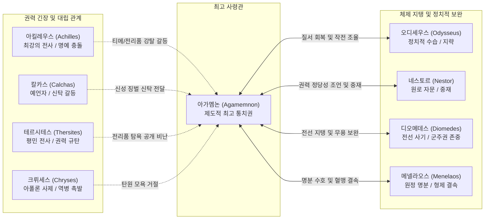
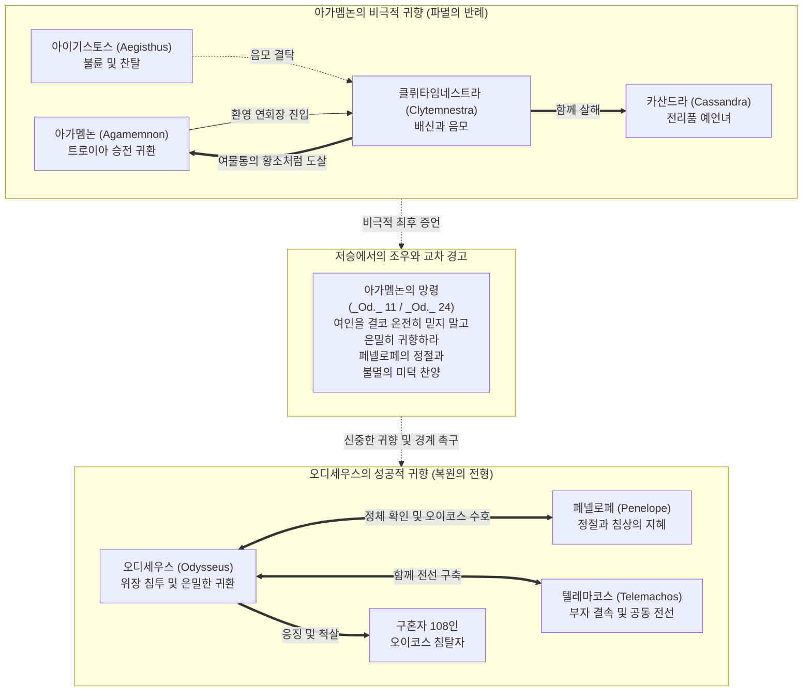

# 아가멤논 (Agamemnon)

**[[greek-reading-guide|읽는 법]]**: 아가멤논 · **원어**: Ἀγαμέμνων · **학술 전사**: *Agamémnōn*

## 서사적 입구 (Narrative Entry)

호메로스 서사시에서 **아가멤논** (Agamemnon)은 트로이아 원정 아카이아 연합군의 최고 총사령관이자 미케네의 군주로서, 서사 전체의 갈등을 점화하고 유지하는 정치적 중심축을 이룬다(_Il._ 1.1–7). 그는 대장장이 신 헤파이토스가 벼리고 제우스가 헤르메스를 거쳐 펠롭스와 아트레우스 가문에 내린 신성한 왕봉, 곧 불멸의 '**스켑트론**'(_skēptron_)을 세습한 정통 군주이다(_Il._ 2.100–108).

그러나 그의 최고 권위는 절대적이지 않으며, 동료 귀족 장군들(*basileis*)과의 끊임없는 협의(*boulē*)와 전사 민회(*agora*)의 집합적 승인(*epainos*)에 의존하는 취약한 제도적 기반 위에 놓여 있다. 『일리아스』 제1권에서 벌어진 [[entity-achilles|아킬레우스]]와의 파국적 충돌은 자신의 전리품인 [[entity-chryses|크뤼세스]]의 딸 크뤼세이스를 신의 명령으로 반환하게 되자, 최고 군주로서의 [[concept-time|티메]](명예)가 추락하는 것을 막기 위해 아킬레우스의 전리품 [[entity-briseis|브리세이스]]를 강제로 수탈하면서 촉발되었다(_Il._ 1.106–187). 이 사건은 아킬레우스의 [[concept-menis|메니스]](신적 분노)를 촉발하여 연합군 전체를 궤멸적 위기로 몰아넣는다.

아가멤논은 11권의 아리스테이아(*aristeia*)에서 맹수 직유와 함께 트로이아군을 홀로 유린하는 독보적인 전사적 용맹을 입증하지만(_Il._ 11.91–217), 전황이 불리해질 때마다 공황에 빠져 함선을 바다에 띄우고 도주하자고 제안하는 심리적 불안정성을 드러낸다(_Il._ 2.110–141, 9.17–28, 14.65–81). 19권의 대화해 공론장에서 그는 자신의 과오를 인정하면서도 그것이 제우스와 운명([[concept-moira|모이라]]), 그리고 에리뉘스가 마음에 씌운 [[concept-ate|미망]](*Atē*) 때문이었다고 선언하며 이중 동인론(*Double Agency*)에 입각한 화해를 이룬다(_Il._ 19.78–144). 

나아가 『오뒷세이아』에서 아가멤논은 살아 있는 행위자가 아니라, 귀향 즉시 아내 클뤼타임네스트라와 아이기스토스의 음모로 여물통의 황소처럼 도살당한 망령으로 등장한다(_Od._ 11.405–420). 그의 비참한 파멸은 [[entity-odysseus|오디세우스]]와 [[entity-penelope|페넬로페]]의 정절 및 성공적 [[concept-nostos|노스토스]](귀향)를 돋보이게 하는 강력한 비극적 반-패러다임(*negative exemplum*)으로 기능한다(_Od._ 24.19–204).

---

## 1. 정의와 식별 (Definition & Identification)

아가멤논은 호메로스 서사 세계에서 '인간들의 왕'(*anax andrōn*), '널리 통치하는 자'(*euru kreiōn*), '백성의 목자'(*poimēn laōn*)로 불리는 아카이아 연합군의 최고 수장이자 미케네의 지배자이다.

- **혈통 및 가문**: 탄탈로스와 펠롭스를 잇는 아트레우스(Atreus)와 아에로페(Aerope)의 장남이며, 스파르타의 왕 [[entity-menelaos|메넬라오스]]의 형이다.
- **거점 및 영역**: "황금이 풍부한 미케네"(*polychrysos Mykēnē*)를 수도로 삼고, 코린토스, 클레오나이, 시퀴온 등 아르고스 북부와 펠로폰네소스 요충지를 통치한다(_Il._ 2.569–576).
- **출현 범위**:
  - 『일리아스』: 1권(다툼과 분노), 2권(시험 연설과 함선 목록), 3권(서약 제의), 4권(군대 사열), 6권(아드라스트로스 처형), 7권(단독 결투 추첨), 9권(사절단 파견), 10권(야습 작전 모의), 11권(무장 및 아리스테이아, 부상), 14권(퇴각 모의), 19권(화해 공론장 및 아테 신화 연설), 23권(파트로클로스 장례 경기 창던지기).
  - 『오뒷세이아』: 1권(제우스의 회고), 3권(네스토르의 귀환 회고), 4권(메넬라오스의 증언), 11권(제1 네퀴아 저승 만남), 24권(제2 네퀴아 아킬레우스 추모).
- **서사적 위상**: 군사적 동원력(단독 100척 지휘 및 아르카디아군 60척 지원, _Il._ 2.576, 2.610)과 신성한 스켑트론에 기반한 최고 권력자이나, 도덕적 자제력과 심리적 항상성의 결여로 서사적 파국과 성찰을 동시에 낳는 입체적 인물이다.

---

## 2. 명칭과 문헌학 (Philology, Epithets & Dialect)

### 2.1 어원과 이름의 구조

- **그리스어 표기**: Ἀγαμέμνων (*Agamémnōn*)
- **어원 분석**: 강화 접두사 *agan*(ἄγαν, "대단히", "몹시") 또는 형용사 *agathos* 계열과 동사 *mimnō* / *menō*(μίμνω / μένω, "머무르다", "버티다", "확고하다")의 결합으로 풀이된다. 즉 "대단히 끈기 있는 자", "몹시 확고하게 버티는 자", 혹은 "위대한 지혜/의지를 지닌 자"를 의미한다.
- **방언적 층위**: 서사시 전통의 이오니아-아이올리스 방언 혼합 층위에서 6보격 헥사메터의 후반부 운율 단위(dactylic tetrameter / penthemimeres)를 충족시키는 핵심 고유명으로 정착하였다.

### 2.2 주요 정형구와 수식어 (Epithets & Formulas)

| 희랍어 실제형 | 학술 전사 | 번역 | 운율적 위치 및 기능 | 원전 출전 예시 |
|:---|:---|:---|:---|:---|
| ἄναξ ἀνδρῶν Ἀγαμέμνων | *ánaks andrô̂n Agamémnōn* | 인간들의 왕 아가멤논 | 행말 종결 정형구 (Dactylic cadence) | _Il._ 1.172, 1.340, 2.772 |
| εὐρὺ κρείων Ἀγαμέμνων | *eurù kreíōn Agamémnōn* | 널리 통치하는 아가멤논 | 헥사메터 전반부 종결 정형구 | _Il._ 1.102, 3.81, 11.238 |
| ποιμὴν λαῶν | *poimḕn laô̂n* | 백성의 목자 | 주격 단독 수식어 / 통치 책임 환기 | _Il._ 2.243, 2.772, 10.3 |
| Ἀτρεΐδης | *Atreḯdēs* | 아트레우스의 아들 (부칭) | 행두 및 휴지부 배치 | _Il._ 1.7, 1.12, 11.15 |
| κύδιστε μέγιστε | *kýdiste mégiste* | 가장 영광스럽고 위대하신 분 | 호격 경칭 정형구 (동료들의 호칭) | _Il._ 2.412, 9.96, 19.78 |

---

## 3. 호메로스 본문에서의 모습 (Homeric Narrative Arc)

### 3.1 일리아스: 권력의 위기와 서사의 격돌

1. **제1권: 명예의 충돌과 메니스의 촉발**
   - 아폴론 사제 크뤼세스가 막대한 몸값([[concept-apoina|아포이나]])을 들고 딸의 반환을 탄원하자, 아가멤논은 폭언과 함께 그를 모욕적으로 추방한다(_Il._ 1.26–32).
   - 아폴론의 징벌 역병으로 군사들이 죽어가자 아킬레우스가 소집한 민회에서 예언자 [[entity-calchas|칼카스]]를 위협하고, 크뤼세이스를 돌려주는 대가로 아킬레우스의 전리품 브리세이스를 강탈하겠다고 선언한다(_Il._ 1.106–187).
   - 아킬레우스가 칼을 뽑으려다 아테나의 만류로 멈추고 참전을 거부하자, 아가멤논은 전령들을 보내 브리세이스를 끌고 오며 파국을 완성한다(_Il._ 1.320–348).

2. **제2권: 거짓 시험 연설(*peira*)과 군대 와해 위기**
   - 제우스가 보낸 기만적인 꿈에 미혹되어 연합군의 사기를 시험하고자 전면 퇴각을 제안하는 연설을 감행한다(_Il._ 2.110–141).
   - 병사들이 환호하며 함선으로 난투적으로 달려가 탈영 사태가 발생하자, 오디세우스가 아가멤논의 스켑트론을 넘겨받아 군대를 수습하고 [[entity-thersites|테르시테스]]를 체벌함으로써 군세를 재건한다(_Il._ 2.142–277).
   - 함선 목록(Catalogue of Ships)에서 100척의 대함대를 이끌고 아르카디아군에게 60척을 빌려주는 최대 군주로서의 위세를 과시한다(_Il._ 2.576–614).

3. **제4·6권: 냉혹한 전사성과 군대 사열**
   - 4권에서 전선을 사열하며 오디세우스와 [[entity-diomedes|디오메데스]]에게 부친보다 못하다는 무분별한 질책을 쏟아붓지만, 디오메데스는 군주의 권위를 존중하며 침묵한다(_Il._ 4.338–418).
   - 6권에서 메넬라오스가 트로이아 장수 아드라스트로스의 몸값 탄원을 받아들이려 하자 개입하여 "합당한 말을 하여(*aisima pareipōn*)" 메넬라오스를 질책하고, 트로이아인은 어머니 자궁 속 태아까지 남김없이 몰살해야 한다고 선언하며 아드라스트로스를 직접 찔러 죽인다(_Il._ 6.37–65).

4. **제9권: 사절단 파견과 오만한 보상 조항**
   - 트로이아군의 맹공으로 방벽이 위협받자 눈물을 흘리며 전면 퇴각을 주장하다가 디오메데스와 네스토르의 준엄한 비판을 받는다(_Il._ 9.17–78).
   - 자신의 미망을 인정하고 아킬레우스에게 막대한 보상 목록(황금 10달란트, 가마솥 20개, 명마 12필, 레스보스 여인 7명, 브리세이스 반환, 트로이 함락 시 황금과 트로이 여인 20명, 자신의 딸과의 지참금 없는 혼인 및 7개 도시 할양)을 제안한다(_Il._ 9.114–156).
   - 그러나 연설 말미에 "그는 내게 굴복할지어다. 내가 더 왕답고(*basileuteros*), 연배가 더 위이기 때문이다"라는 오만한 조건을 덧붙임으로써 사절단(오디세우스, 아이아스, 포이닉스)의 설득을 무위로 만든다(_Il._ 9.160–161).

5. **제11권: 무장과 독보적 아리스테이아**
   - 키프로스 왕 키뉘라스가 헌납한 10조의 감청석, 12조의 금, 20조의 주석으로 이루어진 찬란한 흉갑과 고르고네이온(Gorgoneion)이 새겨진 방패로 무장하고 출진한다(_Il._ 11.19–46).
   - 사자에 비유되는 맹렬한 기세로 비아노르, 피산드로스, 히폴로코스 등을 학살하며 트로이아군을 성벽 앞까지 격퇴한다(_Il._ 11.91–180).
   - 제우스조차 헥토르에게 아가멤논이 부상을 입고 물러날 때까지 직접 교전을 피하라고 전령 이르스를 통해 명령한다(_Il._ 11.181–217).
   - 안테노르의 아들 코온의 창에 팔을 찔려 부상을 입고, 그 고통이 산고를 겪는 여인의 격통(*ōdis*)에 비유되며 전선에서 퇴각한다(_Il._ 11.248–283).

6. **제14·19권: 공황과 대화해 공론장**
   - 14권에서 부상당한 상태로 다시 야간에 함선을 바다로 띄워 도망치자고 제안하다가 오디세우스로부터 "재앙과도 같은 사령관"이라는 격렬한 비판을 받는다(_Il._ 14.65–102).
   - 19권 파트로클로스의 전사 이후 열린 화해 공론장에서 자신의 과오가 의도적 악의가 아니라 제우스와 모이라, 에리뉘스가 마음에 던진 *Atē*(미망) 때문이었음을 아테 신화를 인용하여 연설하고, 약속된 모든 보상물을 공적으로 전달하며 아킬레우스와 공식 화해한다(_Il._ 19.78–275).
   - 23권 파트로클로스 장례 경기 창던지기에서 아킬레우스는 그에게 경기를 치르지 않고도 최고의 창잡이이자 최고 통치자로서의 위상을 인정하며 우승상인 솥을 헌정한다(_Il._ 23.884–897).

---

### 3.2 오뒷세이아: 비극적 반-패러다임과 노스토스의 명암

1. **제1·3·4권: 비극의 소식과 경고**
   - 제우스는 올림포스 회의에서 인간들이 신들을 탓하지만 아이기스토스가 경고를 무시하고 아가멤논을 죽여 스스로 파멸을 불렀다고 한탄한다(_Od._ 1.28–43).
   - 네스토르와 메넬라오스는 텔레마코스에게 아가멤논의 처참한 최후와 오레스테스의 복수를 전하며, 가문의 비극을 경계하도록 훈계한다(_Od._ 3.254–312, 4.512–547).

2. **제11권: 제1 네퀴아(저승에서의 조우)**
   - 오디세우스가 만난 아가멤논의 망령은 귀향하자마자 환영 연회장에서 아내 클뤼타임네스트라와 아이기스토스에 의해 "여물통 앞의 황소처럼" 도살당한 참상을 전한다(_Od._ 11.405–420).
   - 함께 살해당한 프리아모스의 딸 카산드라의 비명을 회고하며, 아내의 배신을 저주하고 오디세우스에게 "아무리 현숙한 아내라도 결코 모든 비밀을 다 털어놓지 말고 은밀히 귀향하라"고 당부한다(_Od._ 11.421–456).

3. **제24권: 제2 네퀴아(클레오스의 대위법)**
   - 저승에서 아킬레우스의 망령과 대화하며, 트로이아 전장에서 영광스럽게 전사하여 온 군대의 애도를 받고 불멸의 명성(*kleos*)을 누리는 아킬레우스의 운명을 부러워한다(_Od._ 24.19–97).
   - 구혼자들의 혼령으로부터 오디세우스의 승리와 페넬로페의 정절 소식을 듣고, 배신자 클뤼타임네스트라와 대비되는 페넬로페의 불멸의 미덕을 찬양한다(_Od._ 24.191–202).

---

## 4. 관계와 소속 (Genealogy, Alliances & Networks)

아가멤논의 관계망은 단순한 친족·전우 관계를 넘어, **① 제우스로부터 세습된 신성한 통치권의 계보**, **② 최고 지휘권과 영웅적 자율성이 충돌·조정되는 연합군 지휘망**, 그리고 **③ 가택(*oikos*)의 배신과 성공적 귀향을 극적으로 대비시키는 비극적 대위망**이라는 3개 층위로 작동한다.

---

### 4.1 혈통과 신성한 스켑트론 계보 (Genealogy & Scepter)

아가멤논의 군주권은 개인의 무력보다 신들의 왕 제우스가 하사한 불멸의 왕봉, 곧 '**스켑트론**'(_skēptron_)의 정통성에 뿌리를 둔다(_Il._ 2.100–108).

> [!NOTE] 호메로스 원전의 계보와 후대 비극의 차이
> 호메로스 서사시(Il. 2.100–108)에서 스켑트론은 티에스테스를 거쳐 아가멤논에게 평화롭게 상속되며, 가문의 인육 만찬이나 이피게네이아 희생은 서술되지 않는다. Il. 9.145에서 아가멤논의 세 딸은 크뤼소테미스, 라오디케, 이피아나사로 온전히 생존해 있으며, '이피게네이아'와 '엘렉트라'는 에픽 사이클과 아테네 비극에서 확장·대체된 명칭이다.

---

### 4.2 아카이아 연합군 지휘망과 인간관계 (Achaean Command & Hero Network)

아가멤논을 중심으로 연합군은 권력의 긴장을 유발하는 '대립·충돌 축'과 군주의 권위를 보완하고 체제를 지탱하는 '협력·중재 축'으로 양분된다.

| 대상 | 영웅적 위상 및 역할 | 아가멤논과의 상호작용 및 갈등 메커니즘 | 원전 근거 |
|:---|:---|:---|:---|
| 아킬레우스 (Achilles) | 아카이아 최강의 전사 | 크뤼세이스 반환의 대가로 브리세이스를 강탈당하자 참전을 거부하고, 9권의 과도한 보상을 거절하며 아가멤논의 군주권을 근본적으로 부정한다. | _Il._ 1.121–187, 9.308–429, 19.1–237 |
| 오디세우스 (Odysseus) | 탁월한 지략과 정치적 수습자 | 2권 시험 연설 실패 시 스켑트론을 넘겨받아 군대를 수습하고, 9권 사절단을 이끌며, 14권의 야간 퇴각 제안을 준엄하게 질책하여 군대를 지킨다. | _Il._ 2.142–277, 9.225–306, 14.65–102 |
| 디오메데스 (Diomedes) | 아르고스의 맹장이자 전선의 기둥 | 4권 사열에서 아가멤논의 부당한 질책을 군주에 대한 존중(*aidōs*)으로 감내하지만, 9권과 14권에서는 아가멤논의 패배주의적 도주 제안을 정면으로 분쇄한다. | _Il._ 4.365–418, 9.32–49, 14.109–134 |
| 네스토르 (Nestor) | 필로스의 최고령 원로 | 1권에서 두 영웅의 다툼을 중재하고, 9권에서 아킬레우스에게 공식 사절단과 배상을 보낼 것을 제안하여 왕권의 과오를 수습하는 지혜를 제공한다. | _Il._ 1.247–284, 9.53–113 |
| 칼카스 (Calchas) | 아카이아군의 수석 예언자 | 아폴론의 역병 원인이 아가멤논의 크뤼세스 모욕에 있음을 폭로하여 아가멤논의 격노와 폭언을 사지만, 아킬레우스의 보호 아래 신탁을 관철한다. | _Il._ 1.68–120 |
| 테르시테스 (Thersites) | 평민 군사를 대변하는 비판자 | 민회에서 아가멤논의 끝없는 전리품 탐욕과 무능을 공개적으로 규탄하여 위계질서를 위협하다가 오디세우스에게 스켑트론으로 체벌당한다. | _Il._ 2.211–277 |
| 크뤼세스 (Chryses) | 아폴론의 사제 | 딸 크뤼세이스의 몸값 탄원을 아가멤논에게 모욕적으로 거절당하자 아폴론에게 기도하여 아카이아 진영에 궤멸적 역병을 불러온다. | _Il._ 1.11–52 |
| 브리세이스 (Briseis) | 전리품이자 명예의 기호 | 아가멤논이 자신의 훼손된 명예(*timē*)를 보충하기 위해 강제로 수탈한 여인으로, 두 최고 영웅 간 가치 충돌의 가시적 뇌관이 된다. | _Il._ 1.184–187, 19.282–300 |

---

### 4.3 비극적 귀향과 오이코스의 붕괴 (오뒷세이아적 대위법)

『오뒷세이아』에서 아가멤논의 귀향 실패는 오디세우스의 성공적 귀향을 비추는 핵심 대위법(Counterpoint)으로 기능한다.

| 인물 및 대상 | 오이코스 내 역할 및 서사적 기능 | 원전 근거 |
|:---|:---|:---|
| 클뤼타임네스트라 (Clytemnestra) | 아가멤논의 왕비이나 아이기스토스와 결탁하여 귀향한 남편을 연회장에서 살해함으로써, 가택(*oikos*) 내부의 배신과 여성 불신의 대명사로 전락한다. | _Od._ 11.405–434, 24.199–202 |
| 아이기스토스 (Aegisthus) | 아가멤논의 부재중 미케네의 권력을 찬탈하고 아가멤논을 함정으로 유인하여 도살한 주범으로, 제우스에 의해 파멸을 자초한 인간의 전형으로 지목된다. | _Od._ 1.28–43, 3.254–312, 4.512–537 |
| 카산드라 (Cassandra) | 트로이아 함락 후 아가멤논이 데려온 전리품 예언녀로, 아가멤논과 함께 클뤼타임네스트라에게 살해당하며 저승의 아가멤논에게 비극적 비명으로 회고된다. | _Od._ 11.421–426 |
| 오레스테스 (Orestes) | 아가멤논의 아들로, 아버지의 원수인 아이기스토스와 어머니를 처단하여 가문의 명예를 회복한 모범적 후계자로서 텔레마코스의 귀감이 된다. | _Od._ 1.298–302, 3.303–312 |
| 페넬로페 (Penelope) | 클뤼타임네스트라와 극적으로 대비되는 정절과 지혜의 여인으로, 저승의 아가멤논 망령으로부터 영원한 찬양을 받으며 오디세우스의 노스토스를 완성한다. | _Od._ 11.444–456, 24.191–202 |

---

## 5. 인물 전용 모듈 (Person-Specific Details)

### 5.1 영웅적 신분과 왕권의 메커니즘
- **세습 왕권(*basileia*)의 성격**: 아가멤논의 군주권은 개인적 탁월성(*aretē*)보다 가문의 세습과 신성한 스켑트론에 의해 뒷받침된다. 그는 병력의 규모와 부의 양에서 타 영웅들을 압도하지만, 집단 전체의 군사적 결정을 독단적으로 내릴 수 없으며 원로회(*boulē gerontōn*)와 전사 민회(*agora*)의 승인을 거쳐야만 한다.
- **연설의 수사학과 심리적 기복**: DICES 데이터베이스 분석에 따르면 아가멤논은 일리아스 내에서 46회의 직접 연설을 수행한다. 그의 연설은 위엄 있는 명령과 거만한 질책으로 시작되나, 위기 상황에서는 급격한 자기비하와 비관주의, 패배주의적 도주 제안으로 전락하는 뚜렷한 심리적 양극성을 보인다.

### 5.2 11권 아리스테이아의 서사 구조
- **무장 제의**: 키프로스 왕 키뉘라스의 흉갑, 10개의 청동 띠와 20개의 놋쇠 장식이 달린 방패, 고르고의 머리 형상이 새겨진 무구 묘사는 아킬레우스의 신성 방패 장면에 필적하는 장엄성을 띤다(_Il._ 11.19–44).
- **야수적 폭력성**: 전장에서 아가멤논은 도망치는 적의 목을 베고 팔을 잘라 원통처럼 굴려버리는 잔혹성을 드러내며, 시인은 그를 마른 숲을 태우는 파괴적 불길과 사자에 비유한다(_Il._ 11.145–162).
- **산고 직유와 퇴각**: 영웅적 무용이 절정에 달한 순간, 코온의 기습 창에 부상을 입고 해산하는 여인의 산고(*ōdis*)에 비유되는 극심한 육체적 고통 속에서 전장을 이탈함으로써, 그의 영웅성이 필멸성의 한계에 부딪히는 구조를 보여준다(_Il._ 11.269–283).

---

## 6. 역사적 맥락 (Historical Context & Social Institutions)

### 6.1 미케네 청동기 *Wa-na-ka*와 아르카익 *Basileus*의 중첩

호메로스 텍스트에 나타난 아가멤논의 군주권은 두 역사적 층위의 복합체이다.

1. **후기 청동기(LH III B, BC 13세기)의 기억**: 선형문자 B 점토판(Pylos Er 312, Ta 711)에서 입증되는 **와낙스**(*wa-na-ka*)는 관료제적 궁정 경제, 군사 지휘권, 제의적 독점권, 왕실 토지(*te-me-no*)를 장악한 신성 군주이다. 아가멤논의 '인간들의 왕'(*anax andrōn*) 칭호와 스켑트론 계보는 이 미케네 전제 군주권의 역사적 잔영을 보존한다.
2. **아르카익 초기(BC 8세기) 폴리스 형성기의 현실**: 선형문자 B에서 지방 관리나 대장장이 수장에 불과했던 *qa-si-re-u*는 암흑기를 거쳐 동등한 귀족 계급인 **바실레우스**(*basileus*)로 성장했다. 호메로스 서사시의 아가멤논은 명목상 와낙스이나, 실질적으로는 동료 바실레우스들의 자발적 복종과 민회의 승인을 지속적으로 구해야 하는 아르카익기 수장(Paramount Chief)의 정치적 제약을 반영한다.

### 6.2 선물 경제와 집합적 승인(*Epainos*)의 위기

- **선물 교환의 상호성**: Walter Donlan(1982, 1993)에 따르면 호메로스 영웅 사회는 대등한 영웅들 간의 명예로운 증여(*dora*)와 약탈물 배분(*geras*)을 통해 결속한다. 아가멤논이 9권에서 아킬레우스에게 제시한 과도한 배상물은 대등한 화해의 선물이 아니라, 상대방을 채무 관계에 종속시키려는 위계적 권력 과시(*basileuteros*)로 작동하여 설득에 실패한다.
- **합의의 시학**: David Elmer(2013, *The Poetics of Consent*)는 아가멤논의 권위 붕괴가 전사 공동체의 집합적 승인 기제인 **에파이노스**(*epainos*)를 무시한 독단에서 비롯되었음을 규명한다. 1권에서 아카이아 전사들이 크뤼세스를 존중하라고 함성을 질렀음에도(1.22–23) 이를 묵살한 행위는 호메로스 정치 공동체의 정당성 규범을 파괴한 원죄가 된다.

---

## 7. 고고학과 지리 (Archaeology, Topography & Material Culture)

### 7.1 미케네 성채와 아르고스 통제권

- **미케네 아크로폴리스**: 기원전 13세기 중엽(LH IIIB) 거석 축조술(Cyclopean masonry)로 축조된 미케네 성채, 사자문(Lion Gate), 왕궁 터(*Megaron*), 지하 저수조는 텍스트가 묘사하는 "황금이 풍부한 미케네"의 방어력과 지배력을 증명한다.
- **지리적 비정**: 함선 목록(_Il._ 2.569–576)의 미케네, 코린토스, 클레오나이, 시퀴온 등은 아르고스 평야에서 코린트만으로 이어지는 핵심 육상 무역로와 전략적 통로를 장악한 요충지들이다.

### 7.2 물질문화와 편년 불일치

> [!WARNING] 고고학적 편년 불일치: 슐리만의 "아가멤논의 가면"
> 하인리히 슐리만이 1876년 미케네 원형 묘역 A(Grave Circle A, Shaft Grave V)에서 발굴한 순금 데스마스크(NAMA 624)는 전통적으로 '아가멤논의 가면'으로 불려왔다. 그러나 현대 고고학 편년에 따르면 이 유물은 기원전 16세기(LH I, c. 1550 BC)의 것으로, 전통적인 트로이아 전쟁기(LH IIIB–C, c. 1200–1180 BC)보다 약 350~400년 앞선다. 이는 서사시의 인물과 청동기 초기 무덤 유물 간의 직접적 동일시가 불가능함을 보여준다.

- **키뉘라스 흉갑과 동지중해 야금 교역**: 11권에 등장하는 키프로스 왕의 흉갑 선물(_Il._ 11.19–28)은 덴드라(Dendra) 청동 갑주(c. 1400 BC)와 엔코미(Enkomi) 유적 등에서 확인되는 청동기 후기 에게해-키프로스-레반트 간의 금속 선물 교환 네트워크와 야금술 발전을 물질적으로 뒷받침한다.

---

## 8. 종교학·인류학적 해석 (Religion, Cult & Anthropology)

### 8.1 제사의 왕(*King of Sacrifice*)과 제의적 정통성

- **제의적 독점권**: Sarah Hitch(2009, *King of Sacrifice*)에 따르면 아가멤논의 군주권은 군사적 무력보다 연합군 전체를 대표하여 올림포스 신들에게 공적인 백우제(*hekatombē*)를 주재하고 고기를 공평하게 분배(*dais*)하는 종교적 제사장의 지위에서 비롯된다(_Il._ 2.402–431, 3.271–291).
- **신성 침해와 오염(*Miasma*)**: 1권에서 아폴론의 사제 크뤼세스를 축출한 것은 단순한 오만이 아니라 신-인간 제의 질서를 단절시킨 신성모독이며, 연합군 전체에 역병이라는 종교적 오염을 초래하는 결과를 낳는다.

### 8.2 영웅 숭배(Hero Cult)와 아가멤노네이온

- **스파르타 아뮈클라이의 숭배**: 아르카익 및 고전기 스파르타 인근 아뮈클라이(Amyklai)에서는 '제우스-아가멤논'(Zeus-Agamemnon)이라는 복합 신격으로 숭배되었으며, 파우사니아스(3.19.6)에 따르면 카산드라와 함께 신전과 제단을 공유하였다.
- **미케네 아가멤노네이온**: 미케네 성채 남서쪽 1km 지점에서는 기원전 8세기 후반부터 헬레니즘 시대까지 아가멤논을 기리는 영웅 숭배 제단(Agamemnoneion)이 운영되었으며, 수많은 봉헌 도기편(graffiti)이 발굴되었다.

---

## 9. 철학·윤리학적 해석 (Philosophical & Ethical Dimensions)

### 9.1 미망(*Atē*)과 이중 동인론(*Double Agency*)

- **도즈의 호메로스 도덕심리학**: E. R. Dodds(1951, *The Greeks and the Irrational*)는 19권 아가멤논의 참회 연설(_Il._ 19.78–144)을 고대 '수치 문화'(*shame-culture*)의 전형적 심리 기제로 분석한다. 아가멤논이 자신의 죄책을 제우스, 모이라, 에리뉘스의 탓으로 돌리는 것은 위선적 면피가 아니라, 주체의 인지 좌소인 프렌(*phrēn*)이 외부 신성에 의해 일시적으로 마비되는 객관적 정신 현상으로 이해되었다.
- **이중 동기화(Lesky & Williams)**: Albin Lesky(1961)와 Bernard Williams(1993)가 정립한 '이중 동인론'에 따르면, 신성한 *Atē*의 개입과 아가멤논의 격정(*thumos*) 및 이기적 오판은 상호 배타적이지 않고 동시에 작동한다. 아가멤논은 신의 개입을 주장하면서도 막대한 배상물을 실질적으로 전달함으로써 사회적·도덕적 책임을 완수한다.

### 9.2 티메(*Timē*) 체계의 모순과 아이도스(*Aidōs*)의 결핍

- **가치 체계의 분열**: 영웅의 내적 가치인 티메가 물리적 몫인 [[concept-geras|게라스]]와 분리될 수 없었던 호메로스 전사 사회에서, 아가멤논의 게라스 상실은 군주권의 존재론적 위기였다. 그는 자신의 지위를 지키기 위해 타인의 몫을 침해함으로써 호메로스 공동체의 윤리적 상호성을 파괴한다.
- **아이도스와 네메시스의 불균형**: Douglas Cairns(1993, *Aidos*)에 따르면 아가멤논은 타인의 정당한 사회적 비난([[concept-nemesis|네메시스]])을 두려워하면서도, 권력의 우위에 취해 마땅히 지녀야 할 내면적 수치심과 경외([[concept-aidos|아이도스]])를 제어하지 못하는 도덕적 취약성을 보인다.

---

## 10. 후대 전승과 수용 (Post-Homeric Tradition & Reception)

### 10.1 에픽 사이클(Epic Cycle)의 전승 변용

호메로스 서사시 본문에는 아울리스에서의 이피게네이아 희생 설화가 없다. 호메로스에서 아가멤논의 세 딸은 크뤼소테미스, 라오디케, 이피아나사로 온전히 생존해 있다(_Il._ 9.145). 이피게네이아의 인신공희와 사슴 대체 모티프는 에픽 사이클 『퀴프리아』(_Cypria_ fr. 1)에서 처음 도입되어 후대 비극의 핵심 소재로 확립되었다.

### 10.2 아테네 3대 비극 시인의 수용

- **아이스퀼로스 『오레스테이아』 3부작 (BC 458)**: 『아가멤논』에서 그는 승리하여 귀환한 위대한 왕이자, 카산드라를 대동하고 붉은 카펫(자주색 천)을 밟으며 궁전으로 들어가는 오만(*hybris*)의 희생자로 그려진다. 이피게네이아 희생에 대한 클뤼타임네스트라의 복수와 가문의 피의 저주가 중심 테마로 부각된다.
- 소포클레스 『**엘렉트라**』 및 에우리피데스 『**엘렉트라**』·『**오레스테스**』: 아가멤논의 살해는 자녀들(엘렉트라, 오레스테스)의 복수 의무와 윤리적 고뇌를 촉발하는 비극적 배경으로 작동한다.
- **에우리피데스 『아울리스의 이피게네이아』 (BC 405)**: 원정군 총사령관으로서의 정치적 야망과 아버지로서의 혈육의 정 사이에서 갈등하며 고뇌하는 유약하고 분열된 정치가의 모습으로 재창작된다.

### 10.3 로마 및 현대 수용사

- **세네카** 『**아가멤논**』: 스토아 철학적 관점에서 운명의 무상함과 권력의 덧없음을 경고하는 폭군과 희생자의 이중적 초상으로 각색되었다.
- **셰익스피어** 『**트로일루스와 크레시다**』: 르네상스적 회의주의 속에서 통제력을 상실한 채 웅변만 늘어놓는 무력한 군주들의 수장으로 풍자된다.
- **현대 고전문학 및 예술**: 마이클 카코야니스 감독의 영화 『이피게네이아』(1977) 등 현대 예술 매체에서 정치적 생존과 인간적 양심 사이에서 파멸해 가는 현대적 권력자의 알레고리로 지속적으로 재해석된다.

---

## 11. 학술 논쟁 (Scholarly Debates & Contradictions)

### 11.1 포터(Porter) vs 태플린(Taplin): 군주상의 본질

> [!WARNING] 학술 논쟁: 아가멤논의 리더십 평가
> 아가멤논의 인물 형상화를 두고 현대 고전학계에서는 날카로운 학설 대립이 지속되고 있다.
> - '**가련한 전제군주**' 모델 (Andrew Porter 2019, Charles Segal 1971): 아가멤논을 충동적이고 설득력 없으며 잔혹한 폭군으로 규정한다. 구전 전통 속에서 미래의 비참한 죽음(아내에 의한 살해)이라는 운명적 패턴이 『일리아스』의 초상에 이미 어두운 그림자를 드리우고 있다고 본다.
> - '**구조적 중심성과 도덕적 나약함**' 모델 (Oliver Taplin 1990, Johannes Haubold 2000): 아가멤논을 단순한 악역으로 환원하는 것을 거부한다. 그는 전장에서 목숨을 걸고 싸우는 뛰어난 전사이자 메넬라오스의 복수를 책임진 연합군의 불가결한 구심점이며, 그의 결함은 개인의 악의가 아닌 호메로스 왕권 제도의 구조적 한계에서 기인한다고 논증한다.

### 11.2 19권 *Atē* 연설의 성격: 진정한 성찰인가 정치적 면피인가

- **도즈(Dodds)·라벨(Rabel) 진영**: 고대 그리스인의 세계관에서 신성한 미망은 주관적 변명이 아닌 객관적 실재이며, 아가멤논은 군주로서의 위신을 잃지 않으면서 아킬레우스에게 전적인 물질적 배상을 제공하는 가장 세련된 화해 의례를 수행했다고 평가한다.
- **태플린(Taplin)·민친(Minchin) 진영**: 9권에서는 아킬레우스가 없으면 패배한다는 위기감 속에서 마지못해 사과하다가 조건을 붙였고, 19권에서는 군사들 앞에서 자신의 체면을 지키기 위해 장황한 신화적 우화로 책임을 전가하는 고도의 정치적 연행(*performance*)으로 해석한다.

---

## 12. 증거 매트릭스 (Evidence Matrix)

| 주장 및 테제 | 자료 유형 | 근거 및 출전 | 확실성 | 관련 위키 문서 |
|:---|:---|:---|:---|:---|
| 제우스 유래의 불멸의 스켑트론 계보와 통치 정통성 | 호메로스 본문 | _Il._ 2.100–108 | 원전 명시 | [[entity-achilles]] |
| 1권 크뤼세이스 반환 거부 및 브리세이스 강탈 | 호메로스 본문 | _Il._ 1.106–187 | 원전 명시 | [[concept-time]] |
| 2권 거짓 시험 연설 실패 및 테르시테스 체벌 소동 | 호메로스 본문 | _Il._ 2.110–277 | 원전 명시 | [[lee-junseok-2024-iliad-jeongam]] |
| 6권 아드라스트로스 탄원 거부 및 태아 몰살 명령 | 호메로스 본문 | _Il._ 6.37–65 | 원전 명시 | [[concept-hikesia]] |
| 9권 막대한 배상 제시 및 복종 전제조건(*basileuteros*) | 호메로스 본문 | _Il._ 9.114–161 | 원전 명시 | [[concept-aidos]] |
| 11권 키뉘라스 흉갑 무장 및 맹수 직유 아리스테이아 | 호메로스 본문 | _Il._ 11.19–217 | 원전 명시 | [[nagy-1979-best-of-achaeans]] |
| 19권 아테 신화 연설과 이중 동인론적 화해 | 호메로스 본문 | _Il._ 19.78–275 | 원전 명시 | [[dodds-1951-greeks-and-irrational]] |
| 오뒷세이아 저승 네퀴아의 비극적 도살 증언과 경고 | 호메로스 본문 | _Od._ 11.405–456 | 원전 명시 | [[lee-junseok-2016-odyssey-humanity]] |
| 미케네 선형문자 B *wa-na-ka*와 아르카익 *basileus*의 중층성 | 언어·비문 / 고고학 | Pylos Er 312, Ta 711 | 강한 학술 추론 | [[adkins-1960-merit-and-responsibility]] |
| 슐리만 "아가멤논의 가면"(BC 16C)의 편년 불일치 | 물질/고고학 | Grave Circle A, Shaft Grave V | 원전 명시 (물질 확정) | [[entity-achilles]] |
| Sarah Hitch의 제사의 왕(*King of Sacrifice*) 이론 | 현대 학술 연구 | Hitch (2009) | 강한 학술 추론 | [[lee-junseok-2018-wrath-and-pity]] |
| 호메로스 원전 내 이피게네이아 희생 부재 vs 비극 수용 | 에픽 사이클 / 비극 | _Il._ 9.145 vs _Cypria_ fr. 1; Aesch. _Ag._ | 후대 수용 | [[concept-epic-cycle]] |

---

## 관련 항목

### 인물 및 신화적 존재
- [[entity-achilles|아킬레우스]] — 명예와 전리품을 두고 격돌한 아카이아 최강의 전사이자 서사의 대립축
- [[entity-odysseus|오디세우스]] — 아가멤논의 군사적 위기를 수습하고 성공적 노스토스를 이룬 지략의 영웅
- [[entity-menelaos|메넬라오스]] — 아가멤논의 동생이자 트로이아 원정의 명분을 제공한 스파르타의 왕
- [[entity-diomedes|디오메데스]] — 아가멤논의 부당한 질책을 감내하면서도 그의 패배주의를 준엄하게 꾸짖은 아르고스의 맹장
- [[entity-nestor|네스토르]] — 아가멤논과 아킬레우스의 화해를 중재한 필로스의 최고령 원로 장군
- [[entity-calchas|칼카스]] — 아폴론의 분노 원인을 밝혀 아가멤논의 분노를 산 아카이아군의 수석 예언자
- [[entity-briseis|브리세이스]] — 아가멤논이 아킬레우스로부터 강탈하여 메니스를 점화한 비운의 여인
- [[entity-chryses|크뤼세스]] — 아가멤논의 모욕적 거절로 아폴론의 징벌 역병을 불러일으킨 아폴론의 사제
- [[entity-thersites|테르시테스]] — 아가멤논의 전리품 탐욕을 공론장에서 원색적으로 비난하다 체벌당한 평민 전사
- [[entity-zeus|제우스]] — 아가멤논에게 스켑트론과 통치권을 내렸으나 기만적 꿈으로 그를 시험한 최고신

### 핵심 개념
- [[concept-time|티메 (Timē)]] — 아가멤논과 아킬레우스가 목숨을 걸고 다툰 영웅의 사회적 명예와 가치
- [[concept-menis|메니스 (Mēnis)]] — 아가멤논의 권력 남용으로 폭발한 아킬레우스의 우주적·신적 분노
- [[concept-aidos|아이도스 (Aidōs)]] — 최고 군주로서 아가멤논이 결여했던 도덕적 자제력과 수치심
- [[concept-nemesis|네메시스 (Nemesis)]] — 아가멤논의 독단과 전리품 강탈에 대해 공동체가 느끼는 의분
- [[concept-eleos|엘레오스 (Eleos)]] — 아가멤논이 6권 아드라스트로스 처형 등에서 철저히 거부한 자비와 연민
- [[concept-hikesia|히케시아 (Hikesia)]] — 크뤼세스와 아드라스트로스가 시도했으나 아가멤논에 의해 짓밟힌 탄원 의례
- [[concept-xenia|크세니아 (Xenia)]] — 파리스의 침해로 트로이아 원정을 결의하게 된 신성한 환대 규범
- [[concept-epic-cycle|에픽 사이클 (Epic Cycle)]] — 호메로스 이후 아가멤논의 이피게네이아 희생과 귀향 참극을 확립한 서사시군

### 문헌 및 소스
- [[lee-junseok-2024-iliad-jeongam|이준석 (2024), 일리아스 정암학당 역주]] — 1·9·11·19권 아가멤논 텍스트 및 주석
- [[lee-junseok-2018-wrath-and-pity|이준석 (2018), 분노의 서사시, 연민의 서사시 일리아스]] — 아가멤논과 아킬레우스의 갈등 구조 분석
- [[lee-junseok-2016-odyssey-humanity|이준석 (2016), 호메로스의 휴머니티]] — 오뒷세이아 속 아가멤논 비극과 노스토스 대조
- [[dodds-1951-greeks-and-irrational|E. R. Dodds (1951), The Greeks and the Irrational]] — 19권 아가멤논의 Atē와 이중 동인론 분석
- [[analysis-homeric-ethics-literature-review|호메로스 윤리학 종합 문헌 검토]] — 고대 영웅 사회의 명예, 수치 및 책임 체계
- [[wiki/entities/_template|엔티티 표준 마크다운 템플릿]]
- [[entity-framework|엔티티 프레임워크 작성 지침]]
