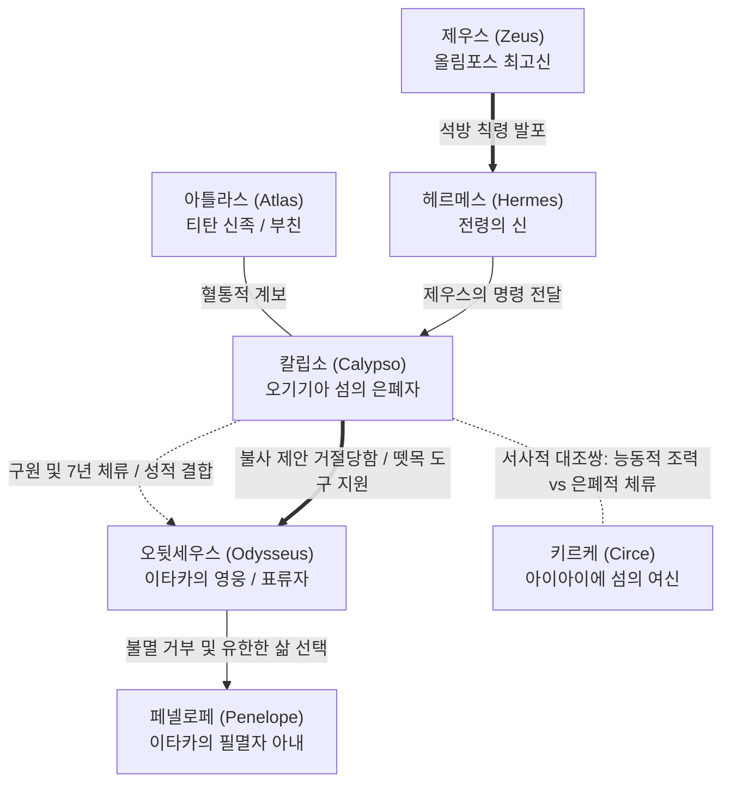

# 칼립소 (Calypso)

**[[greek-reading-guide|읽는 법]]**: 칼립소 · **원어**: Καλυψώ · **학술 전사**: *Kalupsṓ*

## 서사적 입구 (Narrative Entry)
- **핵심 장면**: 동굴 안에서 베를 짜며 노래하는 칼립소와, 바닷가 바위에 앉아 눈물로 고향 쪽 바다를 바라보는 [[entity-odysseus|오뒷세우스]]의 대비(_Od._ 5.55–84, 5.151–158).
- **서사적 궤적**: 조난당한 영웅을 구원하여 불로불사를 제안했으나, [[entity-zeus|제우스]]의 칙령을 수용하여 뗏목 건조 도구와 순풍을 제공하고 귀향길로 떠나보냅니다.
- **인문학적 질문**: 신적인 불멸의 영생 제안이 왜 필멸의 영웅에게는 오이코스와 정체성을 지워버리는 존재론적 은폐로 작용하는가?
- **증거 층위 안내**: 칼립소의 서사적 행적은 『오뒷세이아』 1, 5, 7, 9, 12, 23권의 본문에 근거하며, 불사 거절과 공간 상징성은 장-피에르 베르낭과 W. S. 앤더슨의 고전학적 분석에 기반합니다.

---

## 1. 정의와 식별 (Definition & Identification)
- **핵심 정의**: **칼립소**(Calypso, Καλυψώ)는 호메로스 서사시 『오뒷세이아』에서 외딴 오기기아(Ōgygíē) 섬에 거주하며 트로이아 참전 영웅 [[entity-odysseus|오뒷세우스]]를 7년간 머물게 하고 불로불사를 제안했던 '은폐의 여신이자 님페'입니다.
- **분류 및 소속**: 신적 존재(`entity_type: deity`), 티탄 아틀라스 계통의 고립된 도서 해양 님페, 올림포스 12주신의 일상적 위계 바깥에 위치하는 원초적 자연 신격.
- **서사적 출현 범위**: 『일리아스』에는 등장하지 않으며, 『오뒷세이아』 서사의 전환부(제1권, 제5권, 제7권, 제9권, 제12권, 제23권)에 집중 출현합니다.

---

## 2. 명칭과 문헌학 (Philology, Epithets & Dialect)

### 2.1 희랍어 표기 및 어원
- **원어 표기**: **Καλυψώ** (*Kalupsṓ*, 칼립소 / 고대 이오니아-아이올리스 서사시 방언).
- **어원학적 기원**: 인도유럽조어 어근 `*ḱel-`("덮다, 숨기다, 감추다")에서 파생된 고대 희랍어 동사 **καλύπτω**(*kalúptō*, "숨기다, 덮다")의 능동적 행위자 명사형입니다([[word-calypso|Calypso (칼립소)]]).
- **의미론적 분석**: 칼립소라는 고유명은 대상을 세계의 시선과 기억으로부터 가려두는 '은폐자(The Concealer)'라는 서사적 본질을 집약하는 '의미론적 고유명(nomen omen)'입니다.

### 2.2 고유 정형구와 별칭 (Epithets & Formulae)

| 희랍어 정형구 실제형 | 학술 전사 | 한국어 풀이 | 운율적 기능 및 출전 |
|:---|:---|:---|:---|
| **νύμφη πότνι’ ἔρυκε** | *númphē pótni’ éruke* | 존귀한 요정이 붙잡아 두었다 | 1–2음보 (_Od._ 1.14), 원초적 자연신의 위엄과 서사적 구속을 결합 |
| **δῖα θεάων** | *dîa theáōn* | 여신들 중의 고귀한 여신 | 5–6음보 행말 종결구 (_Od._ 1.14, 5.78, 5.116), 서사시 전통의 찬미적 종결구 |
| **ναίει ἐϋπλόκαμος, δεινὴ θεός** | *naíei eüplókamos, deinḕ theós* | 머리가 아름다운, 두려운 여신이 살고 있으니 | 3–6음보 (_Od._ 7.246, 12.449), 아름다움과 신적 위압성의 결합 |
| **δολόεσσα** | *dolóessa* | 간계를 품은 | 3–4음보, 서술자 음성이 아닌 **오뒷세우스의 1인칭 회고**(_Od._ 7.245)에서만 투사됨 |
| **Ἄτλαντος θυγάτηρ ὀλοόφρονος** | *Átlantos thugátēr oloóphronos* | 불길한 마음을 품은 아틀라스의 딸 | 1음보 첫머리부터 4음보 말까지 전개 (_Od._ 1.52), 문명 바깥 우주론적 한계 지대를 확정 |

### 2.3 5권 488–493행의 어원적 언어유희 (Kalypsis의 전도)
『오뒷세이아』 5권의 대미를 장식하는 488–493행에서 시인은 칼립소의 이름 어근(*kalup-*)을 활용하여 언어유희와 상징적 전도를 완성합니다:

- **번역**: "외딴 시골 끝자락에서 어떤 사람이 다른 곳에서 불씨를 구해오지 않으려고 검은 재 속에 장작불을 묻어 불씨를 보존하듯, 그렇게 오뒷세우스는 나뭇잎으로 자신을 덮었다. 그러자 [[entity-athena|아테나]]가 피로를 멈추게 하려고 그의 눈에 잠을 부어주었으니, 사랑하는 눈꺼풀을 포근히 덮어주면서였다."
- **원문**: *ὣς Ὀδυσεὺς φύλλοισι καλύψατο· τῷ δ’ ἄρ’ Ἀθήνη  ὕπνον ἐπ’ ὄμμασι χεῦ’, ἵνα μιν παύσειε τάχιστα  δυσπονέος καμά토ιο φίلا βλέφαρ’ ἀμφικαλύψας.*
- **학술 전사**: *hṑs Oduseùs phúlloisi kalúpsato: tô̂i d’ ár’ Athḗnē  húpnon ep’ ómmasi kheû’, hína min paúseie tákhista  dusponéos kamátoio phíla bléphar’ amphikalúpsas.*

칼립소의 섬에서 작동한 은폐가 영웅의 이름과 [[concept-kleos|클레오스]]를 세상으로부터 지워버리는 '타자적 억류'였다면, 스케리아 해변 나뭇잎 더미 속에서 영웅이 행한 **καλύψατο**(*kalúpsato*, 스스로를 덮었다)는 생명의 불씨를 보존하기 위한 '자발적 자기 보호'로 전환됩니다([[word-calypso|Calypso (칼립소)]]).

---

## 3. 호메로스 본문에서의 모습 (Homeric Attestation & Narrative Arc)

### 3.1 서사적 출현과 행적
1. **서사적 발단** (_Od._ 1.14–15, 1.48–59): 트로이 출전 영웅 중 유일하게 귀향하지 못한 오뒷세우스를 동굴에 붙잡아 둔 장본인으로 지목되며, '바다의 배꼽'에 사는 아틀라스의 딸로 소개됩니다.
2. **신들의 칙령과 대결** (_Od._ 5.1–144): [[entity-zeus|제우스]]의 전갈을 전하는 [[entity-hermes|헤르메스]]를 맞아 손님 환대([[concept-xenia|Xenia]])를 행한 뒤, 영웅 석방 명령에 맞서 남신들의 성적 이중 잣대를 비판하는 항변 연설을 전개합니다.
3. **불사 제안과 귀향 결단** (_Od._ 5.145–227): 낮마다 해변에서 눈물 흘리는 오뒷세우스에게 불로불사(Athanasia)를 제안하지만, 필멸의 귀향을 감당하겠다는 영웅의 결단을 수용합니다.
4. **뗏목 건조 지원 및 작별** (_Od._ 5.228–268): 청동 도끼와 자귀, 송곳을 내어주어 마른 나무를 벌채하게 돕고, 돛을 만들 천과 식량을 실어준 뒤 순풍을 보내어 출항을 완수시킵니다.
5. **스케리아 궁정의 회고** (_Od._ 7.244–259): 파이아케스 왕궁에서 오뒷세우스는 자신이 칼립소에게 7년간 머물렀음(_Od._ 7.259: *éntha mèn heptáetes ménon émmpedon*)을 밝힙니다.
6. **아폴로고이와 부부 침상의 매듭** (_Od._ 9.29–32, 12.447–453, 23.333–337): [[entity-circe|키르케]]와의 병치 비교를 거쳐, [[entity-penelope|페넬로페]]와의 재회 침상에서 칼립소의 불사 제안을 뿌리치고 귀향했음을 회고합니다.

### 3.2 5권 118–144행 항변 연설의 수사학적 구조
칼립소의 연설은 아르카익 서사시에서 보기 드문 고도의 항의 연설(protest speech) 구조를 보여줍니다([[kearns-2006-gods-in-homeric-epics|Kearns 2006]]):
- **서두 규탄** (5.118–120): "참으로 가혹하고 질투심 많은 자들이로다, 너희 신들이여!"(*skhétlioí este, theoí, zēlḗmones*)라 일갈하며 남신들의 성적 위선을 직격합니다.
- **신화적 선례** (5.121–128): 새벽의 여신 에오스가 오리온을 택했을 때 아르테미스가 활로 쏘아 죽이고, 데메테르가 이아시온과 결합했을 때 제우스가 벼락으로 내리친 선례를 들어 남신 중심의 불평등을 고발합니다.
- **구출자의 정당성** (5.129–136): 난파된 인간을 거두어 먹이고 사랑하며 불사불로의 존재로 만들고자 했던 자신의 행위가 정당한 구원이었음을 변호합니다.
- **불가피한 승복** (5.137–144): 제우스의 절대적 의지를 거스를 수 없음을 인정하고, 바다를 건널 방도를 일러주겠다고 선언합니다.

---

## 4. 관계와 소속 (Genealogy, Alliances & Networks)
- **계보 및 혈통**: 호메로스 전승에서는 대지와 하늘을 떠받치는 티탄 아틀라스의 딸로 확정되나, 헤시오도스 『신통기』(359행)에서는 오케아노스와 테튀스의 딸(오케아니스)로 분류됩니다.
- **신과 인간의 긴장망**: 올림포스 최고신 제우스의 일방적 칙령에 굴복하면서도 그 도덕적 위선을 통렬히 고발하며, 전령 헤르메스를 의례적으로 환대하는 독자적 지위를 유지합니다.
- **키르케 및 페넬로페와의 대조**: 동쪽 끝에서 약물로 인간을 변형시키는 능동적 조력자 키르케와 대칭을 이루며, 필멸의 인간 아내 페넬로페의 대척점에서 영구한 불멸의 유혹으로 맞섭니다.

---

## 5. 유형별 상세 (Type-Specific Details: Deity)
- **주관 영역과 권능**: 문명 세계의 항로가 끊긴 외딴 도서의 전권 지배, 자연 식생과 샘물의 보존, 선박 제조를 위한 천연 목재와 공구의 관장.
- **올림포스 위계와의 관계**: 올림포스 판테온에 통합되지 않은 주변부 티탄 신격으로, 독자적 주권을 누리지만 최고신의 정치적 명령(운명과 질서)에는 궁극적으로 복종해야 하는 종속적 위치.
- **인간에 대한 개입 방식**: 조난자 구출과 환대를 매개로 한 성적 반려화, 불로불사(Athanasia) 제안을 통한 인간 조건의 탈피 종용, 7년간의 비자발적 억류.

---

## 6. 역사적 맥락 (Historical Context & Social Institutions)
- **판정**: 생략 (Omitted)
- **생략 사유**: 칼립소의 오기기아 섬은 인간 사회의 역사적 제도(폴리스, 바실레이아, 아고라)가 부재한 탈문명 도서 신격의 공간이므로, 역사적 제도 분석 렌즈를 생략합니다.

---

## 7. 고고학과 지리 (Archaeology, Topography & Material Culture)
- **판정**: 생략 (Omitted)
- **생략 사유**: 오기기아는 '바다의 배꼽(omphalos thalassēs)'으로 표상되는 탈지리적 신화 공간이며, 청동기 물질문화나 고고학 발굴 증거가 전무하므로 고고학 렌즈를 생략합니다. 후대의 지리 비정 전승은 수용사로 다룹니다.

---

## 8. 종교학·인류학적 해석 (Religion, Cult & Anthropology)

### 8.1 오기기아 식생의 이중성: 쾌적한 이상향(locus amoenus)과 고립감
5권 55–75행의 풍경은 맑은 샘물과 포도 덩굴, 제비꽃과 파슬리가 어우러져 신조차 도취시키는 아름다운 이상향(*locus amoenus*)입니다. 그러나 종교인류학적 분석(Anderson 1958, Xian 2018)은 이 공간의 양가성을 지적합니다:
- **수목과 조류**: 오리나무, 사시나무, 편백나무는 고대 장례 의례와 묘지 식수 관행에 연관되며, 둥지를 튼 올빼미, 매, 바다새들은 인간의 문명 바깥을 상징합니다.
- **시선의 분열**: 신 헤르메스에게는 영원한 기쁨의 정원이지만, 귀향을 열망하는 인간 오뒷세우스에게는 사회적 행위와 정체성이 차단된 고립의 장소로 지각됩니다.

### 8.2 크세니아(Xenia)의 도착과 비대칭적 관계
- 조난자를 살려내고 먹인 초기 행위는 참된 환대([[concept-xenia|Xenia]])였으나, 손님의 자유로운 귀향 호송(pompē)을 거부함으로써 환대는 '억류'로 변질되었습니다.
- 호메로스는 침실의 관계를 서술합니다: 낮에는 바닷가에서 울었으나, 밤이면 속이 빈 동굴 안에서 "원치 않는 자로서 원하는 여인 곁에서 **강제로**(ἀνάγκῃ) 잠들어야만 했다"(_Od._ 5.154–155). 이는 신적 권력의 우위 속에서 이루어진 비대칭적 억류 상태를 보여줍니다.

---

## 9. 철학·윤리학적 해석 (Philosophical & Ethical Dimensions)

### 9.1 불사(Athanasia) 거부와 오이코스로의 귀향 (Vernant 1982, 이준석 2016)
- **유한한 인간 조건(condicio humana)의 수락**: 칼립소의 불사 제안(_Od._ 5.135–136, 5.203–224)을 거부한 오뒷세우스의 결단은 호메로스 영웅의 인간적 정체성을 확립한 핵심 사건입니다.
- 불로불사의 고립된 영생 대신 영웅은 늙고 죽어갈 아내 페넬로페와 아들, 백성들이 있는 이타카로의 귀향([[concept-nostos|Nostos]])을 선택합니다. 이는 고통과 노동이 따르더라도 오이코스(oikos)의 군주이자 가족 구성원으로서의 역사적 삶과 도덕적 책무([[concept-themis|Themis]])를 온전히 회복하려는 결단입니다([[lee-junseok-2016-odyssey-humanity|이준석 2016]]).

### 9.2 클레오스(Kleos)와 은폐(Kalypsis)의 서사적 대립
- 영웅에게 진정한 불멸은 생물학적 육체의 영구한 지속이 아니라 공동체의 기억 속에서 영원히 전승되는 '시들지 않는 명성'([[concept-kleos|Kleos]])입니다.
- 칼립소의 오기기아에 머무는 동안 영웅은 "보이지도 않고 알려지지도 않은 채(ἄιστος ἄπυστος, _Od._ 1.242)" 세상에서 잊힌 존재였습니다. 오뒷세우스의 탈출은 이러한 망각의 은폐(Kalypsis)를 벗어나 고난의 귀향을 통해 자신의 명예를 증명하는 행위입니다.

---

## 10. 후대 전승과 수용 (Post-Homeric Tradition & Reception)

### 10.1 고대 주석학, 지리학 및 로마 문학의 변용
- **고대 스콜리아의 양면적 평가**: 알렉산드리아 학자들은 칼립소를 연정에 굴복한 여인으로 읽는 한편, 신들의 이중 잣대를 논박하는 이성적 변론가로 평가했습니다(Pontani 2013).
- **지리 비정 전승**: 헬레니즘 및 로마기 학자들은 오기기아 섬을 지중해의 구체적 지리(말타 또는 고조 섬)와 결부시키려 시도했습니다.
- **베르길리우스 『아이네이스』의 디도**: 카르타고의 여왕 디도가 아이네아스를 붙잡아두다 신들의 명령으로 영웅이 떠나자 절규하는 서사 구조는 5권 칼립소 에피소드의 직접적 전위입니다(Navarro Diana 2022).
- **프로페르티우스와 오비디우스**: 로마 애가 시인들은 텅 빈 해변에서 눈물짓는 칼립소를 순수한 에로스와 비탄의 원형으로 수용했습니다.

### 10.2 근세 도덕 교육론에서 모더니즘으로
- **페늘롱 『텔레마코스의 모험』(1699)**: 칼립소는 청년 텔레마코스를 유혹하는 '감각적 정념의 위험'으로 규정되어 계몽주의적 도덕 교육의 대척점에 섰습니다.
- **제임스 조이스 『율리시스』 4장 ("Calypso")**: 침대 속에서 레오폴드 블룸을 머물게 하는 아내 몰리 블룸의 나른한 일상성과 세속적 감각으로 변용되었습니다.

---

## 11. 학술 논쟁 (Scholarly Debates & Contradictions)

> [!WARNING] 모순/이설 발견
> 칼립소를 둘러싼 연구사에서는 서사 지체의 기원, 젠더와 권력 구조, 키르케와의 서사적 관계를 둘러싸고 첨예한 학설 대립이 지속되고 있습니다.

- **서사 구성론: 시인의 즉흥 발명설 vs 서사적 지체(Delay)의 기능**:
  - 분석파(Wilamowitz, Delebecque)는 텔레마코스의 성년 나이와 트로이 함락 후 10년의 공백을 맞추기 위해 시인이 7년 체류를 삽입했다고 보았습니다.
  - 반면 신분석파 및 서사학 연구(Alden 1985, Crane 1988)는 칼립소의 체류가 영웅이 불멸을 시험받고 인간적 귀향을 스스로 선택하도록 이끄는 서사적 지체(Narrative Delay)의 핵심 구조라고 반론합니다.
- **젠더와 권력: 가부장제 비판과 비대칭적 위계**:
  - 페미니즘 고전학(Murnaghan 1987, Doherty 1995, Wilson 2017)은 칼립소의 연설(_Od._ 5.118–144)을 올림포스 가부장제의 성적 이중 잣대에 정면 저항하는 독립적 발언으로 조명합니다. 동시에 5.154–155행에 드러나는 신-인간 위계 속에서의 비동의적 억류 관계 역시 서사 내 복합적 권력 긴장으로 분석됩니다.
- **키르케와의 관계: 단순 중복인가 구조적 대칭쌍인가**:
  - 과거 분석론은 두 여신을 동일한 민담 모티프의 무의미한 중복으로 보았으나, 현대 서사학(Louden 1999, Bär 2023)은 동쪽과 서쪽, 일차 서사와 1인칭 아폴로고이, 1년과 7년, 마법 변형과 은폐적 억류라는 대칭적 대조쌍(Antithesis)으로 파악합니다.

---

## 12. 증거 매트릭스 (Evidence Matrix)

| 주장 및 테제 | 자료 유형 | 근거 및 출전 | 확실성 | 관련 위키 문서 |
|:---|:---|:---|:---|:---|
| 아틀라스의 딸이자 오기기아의 지배자 | 호메로스 본문 | _Od._ 1.50–54, 7.244–246 | 원전 명시 | [[entity-odysseus\|오디세우스]] |
| 7년간의 억류 사실 명시 | 호메로스 본문 | _Od._ 7.259 | 원전 명시 | [[entity-odysseus\|오디세우스]] |
| 남신들의 성적 이중 잣대에 대한 항변 연설 | 호메로스 본문 | _Od._ 5.118–144; Baltes (1978) | 강한 학술 추론 | [[kearns-2006-gods-in-homeric-epics\|에밀리 컨스 (2006)]] |
| 불사(Athanasia) 제안 및 인간 조건 선택 | 호메로스 본문 | _Od._ 5.135–136, 5.203–224 | 원전 명시 | [[lee-junseok-2016-odyssey-humanity\|이준석 (2016)]] |
| 비자발적 동침(Anankē)과 비대칭적 권력 관계 | 호메로스 본문 | _Od._ 5.154–155 | 강한 학술 추론 | [[entity-odysseus\|오디세우스]] |
| 5.488–493행 불씨 직유와 καλύψατο의 대칭적 전환 | 호메로스 본문 | _Od._ 5.488–493; Peradotto (1990) | 강한 학술 추론 | [[word-calypso\|Calypso (칼립소)]] |
| 오기기아 식생의 locus amoenus와 고립의 양가성 | 현대 학술 연구 | Anderson (1958); Xian (2018) | 강한 학술 추론 | [[concept-nostos\|노스토스]] |
| 환대(Xenia)의 억류화 및 호송 거부 | 서사 규범 분석 | _Od._ 5.130–144; Heubeck (1988) | 강한 학술 추론 | [[concept-xenia\|크세니아]] |
| 망각의 은폐(Kalypsis)와 클레오스 추구 | 서사 가치 체계 | _Od._ 1.235–242, 5.306–312 | 강한 학술 추론 | [[concept-kleos\|클레오스]] |
| 베르길리우스 디도 형상의 직접적 원형 | 비교문학 연구 | Virgil, _Aen._ 4; Navarro Diana (2022) | 강한 학술 추론 | [[concept-nostos\|노스토스]] |
| 7년 체류의 서사 형성사적 기능 논쟁 | 서사 구성론 | Wilamowitz vs Alden (1985) | 논쟁적 | [[entity-odysseus\|오디세우스]] |

---

## 관련 항목
- [[wiki/index|위키 색인]]
- [[entity-odysseus|오디세우스]]
- [[entity-penelope|페넬로페]]
- [[lee-junseok-2016-odyssey-humanity|이준석 (2016), 호메로스의 휴머니티]]
- [[kearns-2006-gods-in-homeric-epics|에밀리 컨스 (2006), 호메로스 서사시의 신들]]
- [[concept-xenia|크세니아]]
- [[concept-kleos|클레오스]]
- [[concept-nostos|노스토스]]
- [[concept-themis|테미스]]
- [[word-calypso|Calypso (칼립소)]]
