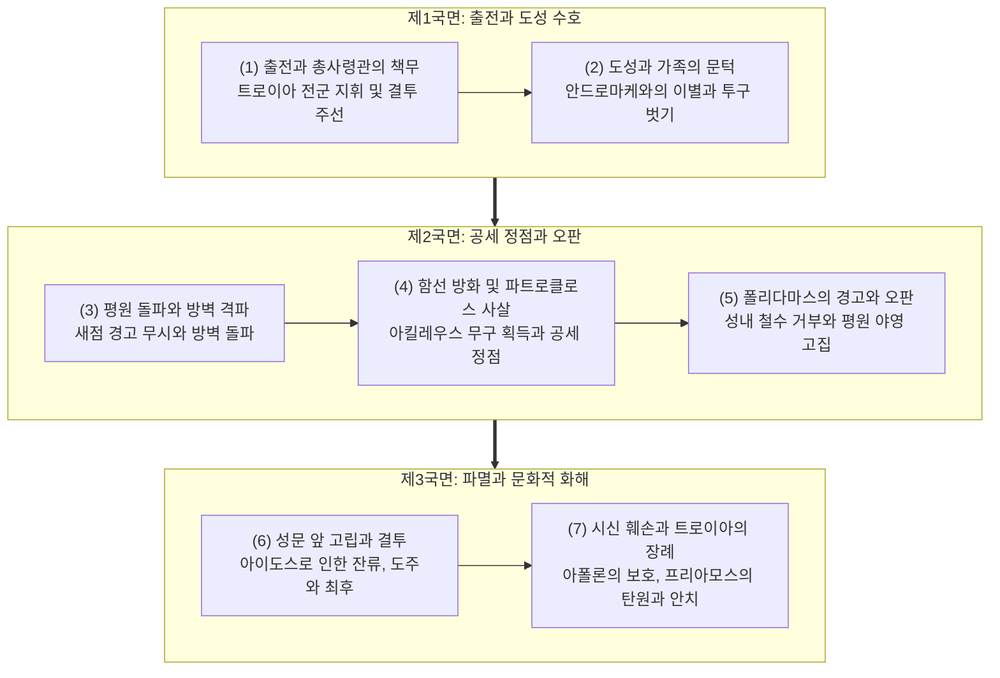
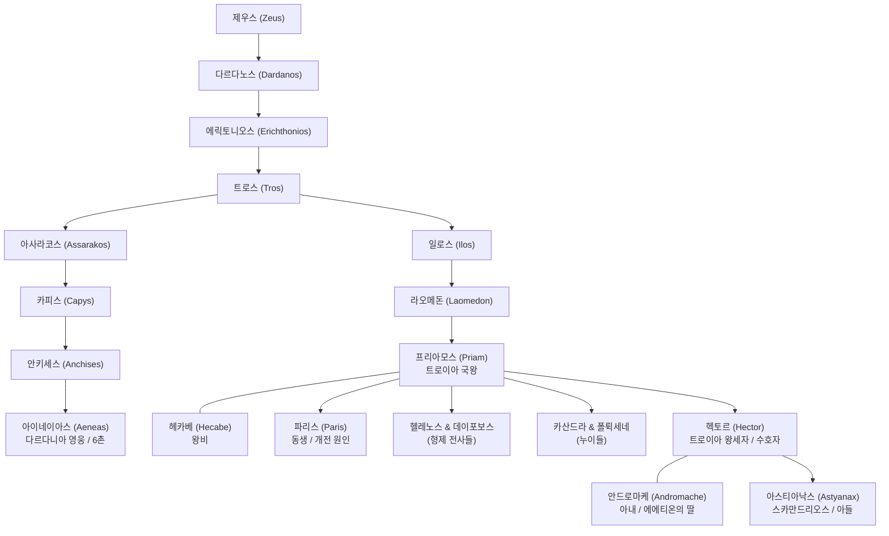
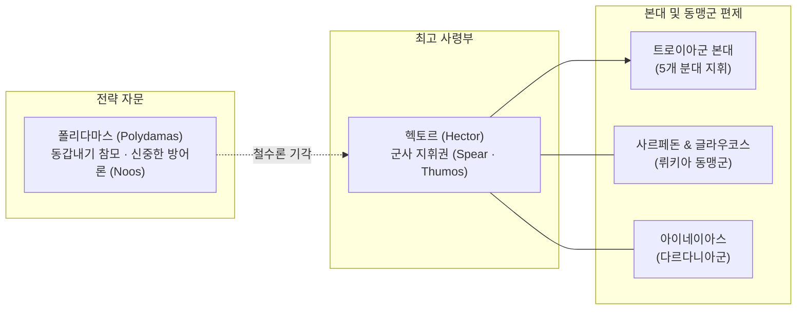
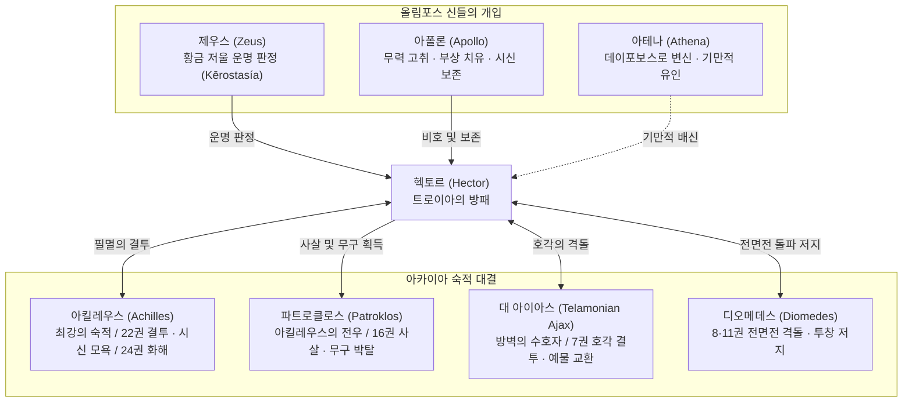

# 헥토르 (Hector)

**[[greek-reading-guide|읽는 법]]**: 헥토르 · **원어**: Ἕκτωρ · **학술 전사**: *Héktōr*

## 서사적 입구 (Narrative Entry)

『일리아스』의 시작이 [[entity-achilles|아킬레우스]]의 파괴적 분노([[concept-menis|메니스]])를 선포한다면, 서사시의 마지막 시행은 "그들은 그렇게 말을 길들이는 헥토르의 장례를 치렀다"(_Il._ 24.804)라는 담담한 장례 의례로 닫힌다. 헥토르는 트로이아의 왕세자이자 총사령관으로서, 도시의 성벽과 종묘사직, 부모와 아내, 젖먹이 아들을 자신의 육체로 방어하는 트로이아 진영의 유일무이한 보루이다. 아킬레우스가 자신의 손상된 [[concept-time|티메]](명예)를 이유로 전선에서 이탈하여 공동체의 궤멸을 방관할 때, 헥토르는 동포들의 평화와 가족의 안녕을 위해 전장의 맨 앞줄에서 목숨을 건다(_Il._ 6.441–446).

그러나 헥토르의 비극성은 그가 단순한 희생적 수호자에 머물지 않는다는 데서 비롯된다. 그는 가족과 국가라는 '인간 문화(Culture)'의 총체에 온전히 뿌리내린 인물이지만, 동시에 전사 사회의 명예 규범과 동료들의 시선에 대한 극심한 부끄러움([[concept-aidos|아이도스]])에 결박되어 있다. 제6권 스카이아이 성문 앞에서 아내 [[entity-andromache|안드로마케]]의 간곡한 만류를 뿌리칠 때도, 제22권 성벽 밖에서 홀로 남아 아킬레우스를 맞이할 때도, 그를 결투로 내모는 것은 비겁자로 낙인찍히는 것에 대한 두려움이었다(_Il._ 22.99–130). 영웅적 명예를 쟁취하여 도시를 지키겠다는 그의 결의는, 역설적으로 아카이아 함선 방화라는 전술적 과신과 [[entity-polydamas|폴리다마스]]의 전략적 충고 기각으로 이어져 군대전멸의 참화를 부른다.

헥토르의 최후는 필멸하는 인간 영웅의 한계를 적나라하게 드러낸다. 아킬레우스의 신적 압도성 앞에서 그는 공포에 질려 성벽 주위를 세 번이나 도주하며(_Il._ 22.136–166), [[entity-athena|아테나]]의 잔혹한 기만에 속아 형제 데이포보스의 환영을 믿고 돌아섰다가 창을 던진 뒤에야 자신이 버림받았음을 깨닫는다(_Il._ 22.296–305). 목을 찔려 쓰러지면서도 시신을 가족에게 돌려보내 달라고 간청하지만 냉혹하게 거부당하고, 전차 뒤에 매달려 파트로클로스의 무덤 주위를 끌려다니는 극도의 훼손을 겪는다.

그러나 그의 서사는 모욕으로 끝나지 않는다. 노부 [[entity-priam|프리아모스]]가 적진으로 들어가 아들의 시신을 되찾아오고, 트로이아 도성 안에서 세 여인(안드로마케, [[entity-hecabe|헤카베]], [[entity-helene|헬레네]])의 삼중 애가가 울려 퍼지는 24권의 장례 의례는 전쟁의 폭력성을 넘어서는 보편적 인간 연민([[concept-eleos|엘레오스]])과 문화적 정화의 계기를 이룬다. 헥토르는 서사시에서 공동체적 책무와 영웅적 자기주장의 치명적 모순을 체현하는 가장 비극적인 인간적 영웅으로 자리매김된다([[redfield-1975-nature-and-culture|Redfield 1975]], [[lee-junseok-2018-wrath-and-pity|이준석 2018]]).

## 1. 정의와 식별 (Definition & Identification)

- **핵심 정의**: 트로이아의 국왕 [[entity-priam|프리아모스]]와 왕비 [[entity-hecabe|헤카베]]의 장남이자, 트로이아군 및 동맹군 전체를 지휘하는 최고사령관. 도시와 가족을 방어하는 시민적 수호자이면서도 전사 규범의 한계로 인해 파멸하는 『일리아스』의 대등한 주인공.
- **분류 및 소속**: 인물(`entity_type: person`), 트로이아 왕실의 계승자, 트로이아-다르다니아 연합군 총사령관. 신적 혈통의 조상을 두었으나 철저히 필멸의 육체와 유한한 인간 조건을 지닌 지상적 영웅으로 묘사됨.
- **서사적 출현 범위**: 『일리아스』 전 24권 중 2권의 출전부터 24권의 장례식까지 전편에 걸쳐 중심인물로 등장함. 『오뒷세이아』에서는 직접 출현하지 않으나 8권의 과부 직유(_Od._ 8.523–529) 등을 통해 트로이아 함락과 안드로마케의 비극을 환기하는 서사적 메아리로 작동함.

## 2. 명칭과 문헌학 (Philology, Epithets & Dialect)

### 2.1 희랍어 표기와 어원

- **표제형**: Ἕκτωρ (*Héktōr*).
- **어원학적 분석**: 인구조어(PIE) 어근 `*seɡ̑ʰ-`('붙잡다', '지탱하다', '정복하다')에서 유래한 희랍어 동사 `ἔχω`(*ékhō*, 미래형 `ἕξω` 또는 `σχήσω` / 아오리스트 `ἔσχον`)의 어간에 행위자 접미사 `-τωρ`(*-tōr*)가 결합된 형태이다. 문자 그대로의 의미는 "**굳게 붙잡아 지탱하는 자**", 곧 "**도시의 수호자** (Holder / Sustainer / Defender)"를 뜻한다.
- **미케네 그리스어 비문 증거**: 기원전 14–13세기 미케네 크노소스 선형문자 B 점토판(KN V 60.1) 및 필로스 점토판(PY Eb 913.1)에서 실존 남성 인명 `e-ko-to`(*Héktōr*, 속격 *Héktoros* / `e-ko-to-ro`)가 명확히 확인된다. 이는 헥토르라는 명칭이 호메로스의 즉흥적 문학 조어가 아니라 청동기 미케네 사회에 확립되어 있던 유서 깊은 그리스계 인명임을 입증한다.
- **원전 내 시학적 언어 유희**: 호메로스는 헥토르의 이름이 지닌 어원적 의미를 서사 속에서 반복적으로 변주한다.
  - 사르페돈은 헥토르가 친족들만으로 "도시를 지킬[*σχήσειν*, *skhḗsein*]" 수 있다고 호언장담했던 것을 힐난한다(_Il._ 5.473–474).
  - 아들 아스티아낙스의 명명 대목에서 시인은 헥토르 홀로 "일리오스를 지켰기에[*ἐρύετο Ἴλιον Ἕκτωρ*, *erúeto Ílion Héktōr*] 사람들이 그 아이를 도시의 군주라 불렀다"라고 명시한다(_Il._ 6.402–403).

### 2.2 고유 정형구와 별칭 (Epithets & Formulae)

호메로스 육보격(Dactylic Hexameter) 시학에서 헥토르에게 부여된 정형 수식어들은 그의 군사적 무장, 사회적 위상, 파괴적 전사성을 운율적 위치에 따라 엄밀하게 배분한다.

| 희랍어 정형구 실제형 | 학술 전사 | 한국어 풀이 | 운율적 기능 및 문법 격 | 대표 출전 |
|:---|:---|:---|:---|:---|
| **κορυθαίολος Ἕκτωρ** | *koruthaíolos Héktōr* | 투구 번쩍이는 헥토르 | 주격(단수), 5~6보격 행말 정형구. 헥토르의 최다 고유 수식어(38회) | _Il._ 2.816, 6.439 |
| **Ἕκτορος ἱπποδάμοιο** | *Héktoros hippodámoio* | 말을 길들이는 헥토르의 | 속격(단수), 5~6보격 행말. 귀족적 기마술과 서사시 종결행 장식 | _Il._ 24.804 |
| **Ἕκτορα ἀνδροφόνον** | *Héktora androphónon* | 살인자 / 사람을 죽이는 헥토르를 | 대격(단수), 운율 휴지부 뒤. 전장에서의 치명적 파괴력 | _Il._ 1.242, 18.317 |
| **χαλκοκορυστής** | *khalkokorustḗs* | 청동 투구로 무장한 | 주격(단수). 청동기 중장 무장의 위엄 | _Il._ 5.699, 7.38 |
| **φαίδιμος Ἕκτωρ** | *phaídimos Héktōr* | 빛나는 헥토르 | 주격(단수), 행말 정형구. 왕실 혈통의 고귀함과 영광 | _Il._ 3.314, 11.347 |
| **μέγας κορυθαίολος Ἕκτωρ** | *mégas koruthaíolos Héktōr* | 위대하고 투구 번쩍이는 헥토르 | 주격(단수), 4~6보격. 단독 돌파 및 최고 지휘관의 위용 | _Il._ 12.437 |

### 2.3 방언 및 형태론적 특징

- 호메로스 텍스트에서 헥토르의 이름은 이오니아-아이올리스 방언이 융합된 서사시 전통에 따라 규칙적인 제3곡용 자음 어간 명사로 곡용한다(주격 `Ἕκτωρ`, 속격 `Ἕκτορος`, 여격 `Ἕκτορι`, 대격 `Ἕκτορα`, 호격 `Ἕκτορ`).
- 호격 `Ἕκτορ`는 악센트가 어두로 후퇴하는 열성 악센트(recessive accent) 규칙을 따르며, 전장에서 동료들이나 가족이 그를 절박하게 부르는 대화 장면에서 집중적으로 사용된다(_Il._ 6.440, 22.229).

## 3. 호메로스 본문에서의 모습 (Homeric Attestation & Narrative Arc)

### 3.1 『일리아스』의 서사적 궤적

#### (1) 출전과 총사령관의 책무: 전쟁의 수습과 전사 윤리
2권 연합군 사열 직후 트로이아군을 이끌고 출전하며(_Il._ 2.807–818), 3권에서 메넬라오스를 보고 달아나는 동생 [[entity-paris|파리스]]를 향해 격렬한 수치심을 표출하며 일대일 결투를 주선한다(_Il._ 3.38–120). 7권에서는 아카이아군 최강자에게 결투를 청하여 거인 [[entity-ajax|대 아이아스]]와 밤이 올 때까지 호각으로 격돌한 뒤 명예로운 예물(칼과 허리띠)을 교환한다(_Il._ 7.66–312).

#### (2) 도성과 가족의 문턱: 스카이아이 성문 앞의 작별
6권에서 전선의 위기를 타개하기 위해 성내로 들어간 헥토르는 어머니 헤카베에게 아테나 신전 봉헌을 청하고, 파리스를 전장으로 독려한 뒤 스카이아이 성문에서 안드로마케와 젖먹이 아스티아낙스를 만난다(_Il._ 6.390–502). 아기가 말총 투구 깃털에 겁을 먹고 울자 투구를 벗어 땅에 내려놓고 웃으며 아이를 축복하는 장면은, 전쟁의 비정함과 가정의 평화가 극적으로 교차하는 서사시 최고의 인간적 명장면이다.

#### (3) 평원 돌파와 방벽 격파: 신적 비호와 공세의 정점
8권 야간 군사회에서 평원 야영을 명령하고(_Il._ 8.489–541), 12권에서는 좌측에 나타난 독수리 새점을 불길하게 여겨 후퇴를 건의하는 폴리다마스를 "조국을 지키는 것이 유일한 최고의 길조"라며 일축한다(_Il._ 12.195–250). 거대한 바위를 번쩍 들어 아카이아 목책의 성문을 부수고 진영으로 돌입한다(_Il._ 12.437–471).

#### (4) 함선 방화와 파트로클로스 사살: 영광과 파멸의 서곡
15권에서 아카이아 함선에 불을 지르며 공세의 정점에 달한다(_Il._ 15.718 이하). 16권에서 아킬레우스의 갑옷을 입고 출전한 [[entity-patroklos|파트로클로스]]가 아폴론과 에우포르보스의 일격으로 무력화되자, 마지막 창을 던져 그를 사살하고 아킬레우스의 신성한 무구를 벗겨 자신이 착용한다(_Il._ 16.818–861). 이는 제우스가 일시적으로 허락한 영광이었으나 동시에 그의 죽음이 임박했음을 알리는 신적 징표였다(_Il._ 17.194–208).

#### (5) 폴리다마스의 경고와 오판: 치명적 미망(Atē)
18권에서 아킬레우스의 전선 복귀 함성이 울리자, 폴리다마스는 트로이아군 전체가 즉시 성벽 안으로 철수하여 방어전을 펼쳐야 한다고 강력히 권고한다. 그러나 승리에 도취된 헥토르는 이를 맹렬히 비난하며 평원 야영을 고집하고, 트로이아인들은 아테나의 미망([[concept-ate|아테]])에 눈이 멀어 헥토르의 오판에 환호한다(_Il._ 18.243–314).

#### (6) 성문 앞 고립과 결투: 도주, 기만, 최후
22권에서 패주하는 트로이아군이 모두 성안으로 들어갔으나 헥토르 홀로 스카이아이 성문 밖에 남는다. 부모의 애절한 호소에도 불구하고 폴리다마스의 비난과 동포들의 시선([[concept-aidos|아이도스]])을 두려워하여 잔류를 결단한다(_Il._ 22.99–130). 그러나 아킬레우스가 다가오자 공포에 사로잡혀 성벽 주위를 세 바퀴 도주한다(_Il._ 22.136–166). 제우스의 황금 저울이 기울자 수호신 아폴론은 그를 떠나고(_Il._ 22.208–213), 아테나가 데이포보스로 변신하여 그를 기만한다. 결국 아킬레우스의 펠리온 물푸레나무 창에 목을 관통당해 전사한다(_Il._ 22.326–363).

#### (7) 시신 훼손과 트로이아의 장례: 애도와 정화
아킬레우스는 헥토르의 시신을 전차에 매달아 파트로클로스의 무덤 주위를 끌고 다니며 모욕하지만, 아폴론이 황금 아이기스로 감싸 훼손을 막는다(_Il._ 23.184–191, 24.18–21). 24권에서 프리아모스가 적진에 들어가 몸값을 치르고 시신을 인도받아 도성으로 귀환한다. 안드로마케, 헤카베, 헬레네의 삼중 애가 속에 성대한 화장과 장례 봉분이 완성되며 서사시가 종결된다(_Il._ 24.718–804).

### 3.2 『오뒷세이아』 간접 메아리 (Intertextual Echoes)

- 『오뒷세이아』 본문에서 헥토르는 직접 등장하지 않으나, 트로이아의 함락과 관련된 서사적 기억의 중심축으로 작동한다.
- **8권 과부의 눈물 직유**: 페이아케스 궁정에서 데모도코스가 트로이아 목마와 도성 함락을 노래할 때, 오디세우스가 흘리는 눈물은 "성벽 앞에서 도시와 동포를 지키다 쓰러진 남편의 시신을 끌어안고 통곡하는 여인의 슬픔"에 비유된다(_Od._ 8.523–529). 이는 헥토르의 시신을 안고 울부짖던 안드로마케의 처지를 직접 반향하며 서사시 간의 강력한 상호텍스트적 메아리를 형성한다.

### 3.3 서사적 전환점과 결정적 장면 (핵심 원문 대조)

#### 1) _Il._ 6.441–446 (안드로마케를 향한 출전 결의와 수치심)
- **번역**: "부인이여, 나 역시 이 모든 일들이 마음에 걸리오. 하지만 만일 내가 비겁자처럼 싸움터에서 물러선다면, 트로이아의 남인들과 옷자락을 끄는 트로이아의 여인들을 볼 면목이 없소. 내 마음(thumos) 또한 그것을 용납하지 않소. 나는 언제나 용기를 내어 트로이아군 맨 앞줄에서 싸우며, 아버지의 위대한 명성과 내 자신의 명예를 지키도록 배웠기 때문이오."
- **원문**: *ἦ καὶ ἐμοὶ τάδε πάντα μέλει γύναι· ἀλλὰ μάλ’ αἰνῶς / αἰδέομαι Τρῶας καὶ Τρῳάδας ἑλκεσιπέπλους, / αἴ κε κακὸς ὣς νόσφιν ἀλυσκάζω πολεμοῖο· / οὐδέ με θυμὸς ἄνωγεν, ἐπεὶ μάθον ἔμμεναι ἐσθλὸς / αἰεὶ καὶ πρώτοισι μετὰ Τρώεσσι μάχεσθαι / ἀρνύμενος πατρός τε μέγα κλέος ἠδ’ ἐμὸν αὐτοῦ.*
- **학술 전사**: *ē̂ kaì emoì táde pánta mélei gúnai; allà mál’ ainō̂s / aidéomai Trō̂as kaì Trōiádas helkesipéplous, / aí ke kakòs hṑs nósphin aluskázō polemoîo; / oudé me thumòs ánōgen, epeì máthon émmenai esthlòs / aieì kaì prṓtoisi metà Trṓessi mákhesthai / arnúmenos patrós te méga kléos ēd’ emòn autoû.*

#### 2) _Il._ 22.99–105 (스카이아이 성문 앞 고립된 내적 독백)
- **번역**: "아, 슬프도다! 만일 내가 지금 성문과 성벽 안으로 들어간다면, 폴리다마스가 맨 먼저 내게 비난을 퍼부을 것이다. 그는 신성한 아킬레우스가 떨쳐 일어섰던 저 끔찍한 밤에 나더러 트로이아군을 성 안으로 인도하라고 권고했으나, 나는 듣지 않았으니, 진실로 들었더라면 훨씬 좋았을 것을! 이제 내 무모함으로 군대를 파멸시켰으니, 트로이아의 남인들과 옷자락을 끄는 트로이아의 여인들을 대하기 부끄럽구나."
- **원문**: *ὤ μοι ἐγών, εἰ μέν κε πύλας καὶ τείχεα δύω, / Πολυδάμας μοι πρῶτος ἐλεγχείην ἀναθήσει, / ὅς μ’ ἐκέλευε Τρωσὶ ποτὶ πτόλιν ἡγήσασθαι / νύχθ’ ὕπο τήνδ’ ὀλοήν, ὅτε τ’ ὤρετο δῖος Ἀχιλλεύς. / ἀλλ’ ἐγὼ οὐ πιθόμην· ἦ τ’ ἂν πολὺ κέρδιον ἦεν. / νῦν δ’ ἐπεὶ ὤλεσα λαὸν ἀτασθαλίῃσιν ἐμῇσιν, / αἰδέομαι Τρῶας καὶ Τρῳάδας ἑλκεσιπέπλους,*
- **학술 전사**: *ṓ moi egṓn, ei mén ke púlas kaì teíkhea dúō, / Poludámas moi prō̂tos elengkheíēn anathḗsei, / hós m’ ekéleue Trōsì potì ptólin hēgḗsasthai / núkhth’ húpo tḗnd’ oloḗn, hóte t’ ṓreto dîos Akhilleús. / all’ egṑ ou pithómēn; ē̂ t’ àn polù kérdion ē̂en. / nûn d’ epeì ṓlesa laòn atasthalíēisin emē̂isin, / aidéomai Trō̂as kaì Trōiádas helkesipéplous,*

#### 3) _Il._ 24.767–772 (시신 앞 헬레네의 마지막 애가)
- **번역**: "그러나 다른 이들이 궁정 안에서 나를 꾸짖을 때마다—시숙들이든 동서들이든 고운 옷을 입은 시누이들이든, 시어머니이든(시아버님은 언제나 친아버지처럼 다정하셨지만)—그대는 부드러운 마음과 부드러운 말씨로 그들을 타일러 말려주었소. 그렇기에 나는 비통한 마음으로 그대와 함께 가련한 내 자신을 위해 통곡하오."
- **원문**: *ἀλλ’ εἴ τίς με καὶ ἄλλος ἐνὶ μεγάροισιν ἐνίπτοι / δαέρων ἢ γαλόων ἢ εἰνατέρων εὐπέπλων, / ἢ ἑκυρή, ἑκυρὸς δὲ πατὴρ ὣς ἤπιος αἰεί, / ἀλλὰ σὺ τὸν ἐπέεσσι παραιφάμενος κατέρυκες / σῇ τ’ ἀγανοφροσύνῃ καὶ σοῖς ἀγανοῖς ἐπέεσσι. / τῶ σέ θ’ ἅμα κλαίω καὶ ἔμ’ ἄμμορον ἀχνυμένη κῆρ*
- **학술 전사**: *all’ eí tís me kaì állos enì megároisin eníptoi / daérōn ē̂ galóōn ē̂ einatérōn eupéplōn, / ē̂ hekurḗ, hekuròs dè patḕr hṑs ḗpios aieí, / allà sù tòn epéessi paraiphámenos katérukes / sē̂i t’ aganophrosúnēi kaì soîs aganoîs epéessi. / tō̂ sé th’ háma klaíō kaì ém’ ámmoron akhnuménē kē̂r*

## 4. 관계와 소속 (Genealogy, Alliances & Networks)

헥토르의 관계망은 단순한 친족·전우 관계를 넘어, **(1) 트로이아 왕가의 신성한 건국 계보와 가정적 결속**, **(2) 최고 군사 지휘권과 자문관의 대립이 얽힌 트로이아 군사 지휘망**, 그리고 **(3) 올림포스 신들의 운명 판정과 아카이아 영웅들과의 숙적 대결망**이라는 3개 층위로 작동한다.

---

### 4.1 트로이아 왕실 계보와 가정적 유대 (Genealogy & Oikos)

헥토르는 제우스로부터 시작되는 다르다니아-트로이아 왕가의 정통 후계자이며, 스카이아이 성문 앞에서 3대 직계 가족(부모-부부-자식)의 생존을 지키는 가장이다(_Il._ 6.390–502, 20.215–240).

---

### 4.2 트로이아 군사 지휘망과 정치적 긴장 (Trojan Command & Assembly)

트로이아 군사회는 헥토르의 창(*spear*) 중심 최고 군사 지휘권과, 객관적 전황과 신중한 방어론을 제시하는 폴리다마스의 정치적·전략적 긴장을 축으로 전개된다(_Il._ 8.489–541, 12.195–250, 18.243–314).

| 인물 및 집단 | 소속 및 역할 | 헥토르와의 관계 성격 | 서사적 상호작용 및 갈등 메커니즘 | 대표 출전 |
|:---|:---|:---|:---|:---|
| [[entity-polydamas\|폴리다마스]] | 트로이아 원로 판토오스의 아들 / 전략 자문관 | 동갑내기 전우이자 전략적 라이벌 | 12권 새점 경고 무시, 18권 도성 철수 자문 기각 등 헥토르의 독단과 비극적 과오를 부각하는 거울 | _Il._ 12.195–250, 18.243–314 |
| [[entity-sarpedon\|사르페돈]] | 뤼키아군 총사령관 / 제우스의 아들 | 최정예 동맹군 수장 | 5권에서 헥토르의 소극적 방어를 질책하여 분발을 촉구하고, 12권 방벽 돌파의 선봉에 섬 | _Il._ 5.471–492, 12.290–429 |
| [[entity-glaukos\|글라우코스]] | 뤼키아군 부사령관 / 히폴로코스의 아들 | 핵심 동맹군 장수 | 사르페돈 전사 후 시신 방어를 소홀히 한 헥토르를 맹렬히 비판하며 동맹군 철수를 위협함 | _Il._ 17.140–182 |
| [[entity-aeneas\|아이네이아스]] | 다르다니아군 지휘관 / 아프로디테의 아들 | 왕실 방계 영웅이자 2인자 | 헥토르와 함께 전선의 전방을 담당하며 트로이아 멸망 이후 왕통을 보존할 운명적 후계자 | _Il._ 5.460–518, 13.455–505 |
| [[entity-paris\|파리스]] (알렉산드로스) | 트로이아 왕자 / 전쟁의 원인 제공자 | 형제이자 징벌·독려의 대상 | 결투 도주 시 헥토르의 격렬한 수치심([[concept-aidos\|아이도스]]) 유발 대상이며, 전장 복귀를 거듭 독려받음 | _Il._ 3.38–75, 6.325–368 |

---

### 4.3 숙적 대결망과 신적 개입 (Achaean Rivals & Divine Intervention)

헥토르의 전장 대결은 올림포스 신들의 운명 판정 아래 전개되며, 아카이아 숙적 영웅들과의 대결을 통해 파멸과 장례로 귀결된다(_Il._ 7.66–312, 11.343–360, 16.818–861, 22.131–363, 24.477–676).

| 숙적 및 대립자 | 진영 및 위상 | 헥토르와의 대결 성격 | 서사적 전개 및 결과 | 대표 출전 |
|:---|:---|:---|:---|:---|
| [[entity-achilles\|아킬레우스]] | 아카이아 최강의 전사 | 서사시의 대등한 양대 주인공이자 운명적 숙적 | 22권 성벽 도주 끝에 전사, 시신 훼손을 겪으나 24권 프리아모스와의 탄원을 통해 장례 허용 | _Il._ 22.131–363, 24.477–676 |
| [[entity-patroklos\|파트로클로스]] | 아킬레우스의 분신이자 전우 | 공세 정점에서 살해한 희생자 | 아폴론의 일격 후 헥토르가 사살하고 무구를 탈취하여 아킬레우스의 메니스(분노)를 촉발 | _Il._ 16.818–861, 17.125–208 |
| [[entity-ajax\|대 아이아스]] | 아카이아 진영 제2의 영웅 | 방어와 공격의 호각 라이벌 | 7권 일대일 결투 후 칼과 허리띠를 교환하는 명예로운 기사도적 대칭 관계 형성 | _Il._ 7.66–312, 14.402–439 |
| [[entity-diomedes\|디오메데스]] | 아르고스의 군주 | 전면전에서 헥토르와 직접 격돌한 강적 | 8권과 11권에서 헥토르의 돌파를 투창으로 저지하고 위기를 유발함 | _Il._ 8.112–156, 11.343–360 |

---

## 5. 유형별 상세: 인물 전용 모듈 (Person-Specific Details)

### 5.1 시민적 수호자와 영웅적 자존심의 충돌

헥토르는 사적 약탈과 개인적 영광을 위해 원정을 떠나온 아카이아 영웅들과 달리, 가족의 존속과 도성의 방어라는 공적 책무를 짊어진 인물이다. 그러나 호메로스 사회의 지배적 가치관인 전사 규범은 그에게 사적인 생존이나 전략적 후퇴를 '수치(Aidos)'로 인식하게 만든다. 가족을 구하기 위해 싸우지만, 바로 그 전사 규범에 얽매여 가족을 파멸로 이끄는 내적 모순이 그의 인물성을 규정한다.

### 5.2 정치적 리더십과 군사 지휘권의 긴장

트로이아 군사회는 헥토르가 군사적 지휘권의 상징인 ‘창’(*spear*)을 짚은 채 주재하며, 객관적 전황을 경고하는 폴리다마스의 방어적 충고를 기각하고 평원 야영과 공세를 강행하는 독단적 지휘권을 행사한다. 이는 집단적 합의보다 전사적 결단과 개인적 명예를 우선시한 결과 치명적인 군대 전멸의 참화로 이어진다([[analysis-homeric-ethics-literature-review|Barker 2009]]).

### 5.3 판단 착오(Hamartia)와 전술적 과신

헥토르의 가장 치명적인 서사적 과오는 제18권에서 아킬레우스의 복귀를 목도하고도 성벽 안으로 철수하자는 폴리다마스의 자문을 기각한 것이다. 이는 단순한 전술적 오판을 넘어, 승세 속에서 신적 미망([[concept-ate|아테]])에 사로잡혀 영웅적 자만(*atasthalia*)에 빠진 결과이며, 그 자신도 22권 독백에서 "내 무모함으로 군대를 파멸시켰다"고 자인한다(_Il._ 22.104).

### 5.4 죽음과 사후 운명 (Belle Mort와 실존적 각성)

헥토르의 죽음은 조국을 지키다 전선 맨 앞에서 장렬하게 전사하는 고대 그리스 전사의 '아름다운 죽음([[concept-belle-mort|Belle Mort]])'의 전형을 이룬다([[vernant-1989-belle-mort|Vernant 1989]]). 제22권에서 데이포보스의 환영이 사라지고 신들의 기만을 깨달았을 때(_Il._ 22.297–305), 그는 도주를 멈추고 "비참하게 죽지 않고 후세에 전해질 위대한 행적을 남기겠다"며 칼을 뽑음으로써 유한한 인간 조건(*condicio humana*)을 능동적으로 껴안는 실존적 존엄성을 완성한다. 아킬레우스에 의해 자행된 시신 훼손은 24권의 장례식을 통해 비로소 정화되고 영웅적 명예를 회복한다.

## 6. 역사적 맥락 (Historical Context & Social Institutions)

- **청동기 기억과 아르카익 폴리스의 중첩**: 헥토르의 형상에는 기원전 13~12세기 미케네 청동기 문명(LH IIIB/C)의 전차 전사 및 성채 사령관의 기억과 함께, 기원전 8세기 암흑기 말기 및 아르카익 초기에 태동하던 그리스 폴리스의 도성 방어자(Polisschutz) 이념이 복합 투사되어 있다.
- **와낙스(Wanax)와 라와게타스(Lawagetas)의 군사적 분업**: 선형문자 B 점토판(PY An 724 등)에 기록된 종교·사법적 최고 군주 와낙스(*wa-na-ka*)와 병력 동원 및 전선 지휘를 전담하는 총사령관 라와게타스(*ra-wa-ke-ta*)의 이원 통치 구조는, 트로이아 서사에서 원로 국왕 프리아모스와 전선 최고사령관 헥토르 간의 군사적 분업 원형을 제공한다.

## 7. 고고학과 지리 (Archaeology, Topography & Material Culture)

- **히타이트 외교 설형문자 점토판 사료**: 보아즈쾨이(Hattuša)에서 출토된 히타이트 제국 외교 점토판들은 트로아스 지역의 역사적 실재를 입증한다. 『알락산두 조약』(CTH 76, 윌루사 통치자와 무와탈리 2세의 동맹), 『마나파-타르훈타 서한』(CTH 191, 피야마라두의 윌루사 공격), 『타와갈라와 서한』(CTH 181, 윌루사를 둘러싼 히타이트와 아히야와의 군사적 긴장)은 트로이아(Wilusa/Tarwisa)가 후기 청동기 아나톨리아 서부의 핵심 지정학적 요충지였음을 증명한다.
- **트로이아 제6h/7a층(Hisarlık) 발굴 증거**: 하인리히 슐리만과 빌헬름 되르프펠트가 발굴한 트로이 제6층(Troia VIh, BC 1300년경)의 웅장한 거석 경사 성벽(ashlar masonry)은 서사시 속 트로이아 성채의 시각적 배경을 제공하며(지진으로 파괴), 칼 블레겐(Carl Blegen)과 만프레트 코르프만(Manfred Korfmann)이 확인한 트로이 제7a층(Troia VIIa, BC 1200~1180년경)의 화재, 매설 피토이(pithoi), 골목 유골 및 투석구는 공성전 함락의 역사적 핵을 이룬다. 서사시의 트로이아는 이 두 지층의 기억이 구술 전통 속에서 결합된 중층적 합성물이다.
- **스카이아이 성문(Scaean Gates)과 방어 시설군**: 성채 서남쪽에 위치한 실제 트로이 VI 성문 경사로(Gate VI S)와 서문(Gate VI U), 그리고 북동 바스티온(VIg) 유구는, 서사시 속에서 헥토르가 출전하고 가족과 작별하던 스카이아이 성문의 물질적 지형 지평을 형성한다.
- **물질문화의 층위와 갑주**: 덴드라(Dendra) 12호분의 전신 청동 판갑과 선형문자 B(Sd/Sc 시리즈) 전차 문헌이 증명하는 미케네식 중무장 전차 충격전 기억이 쇠퇴한 뒤, 헥토르가 전차를 이동 수단(battle taxi)으로만 쓰고 내려서 보병 투창전을 벌이는 묘사와 번쩍이는 청동 투구(*korythaiolos*)는 기원전 8세기 아르카익 초기 보병전 관념과 청동 주조 기술이 중첩된 결과이다.

## 8. 종교학·인류학적 해석 (Religion, Cult & Anthropology)

- **아폴론의 비호와 케로스타시아(Kērostasía)**: 아폴론은 헥토르의 독실한 희생제와 경건함을 총애하여 무력을 고취하고 전차전을 도우나, 제우스의 황금 저울에서 헥토르의 운명의 날(*aision ēmar*)이 하데스로 기울자 즉시 그를 떠난다(_Il._ 22.208–213). 이는 신적 총애조차 우주적 운명([[concept-moira|모이라]])의 한계를 거스를 수 없음을 드러낸다.
- **영웅 숭배(Hero Cult) 제의와 폴리스 보호**: 고대 그리스 역사 시대에 헥토르는 트로이아뿐 아니라 보이오티아의 중심 도시 테바이(Thebes)에서도 수호 영웅으로 숭배되었다. 파우사니아스(Pausanias 9.18.5)에 따르면, 테바이인들은 델포이 신탁의 명령에 따라 트로이아에서 헥토르의 유골을 이장해와 도시의 안녕을 비는 제의를 거행하였다. 이는 적대적이었던 비극적 전사의 영혼을 폴리스의 구원력으로 전유하는 고대 그리스 정화 제의(Apotropaic Cult)의 전형이다.
- **삼중 애가와 장례 의례의 성별 분업**: 24권의 장례는 전문 가객들의 공적 애가(*thrēnos*)와 친족 여성들의 사적 비탄(*goos*)이라는 대위법적 성별 분업을 통해 거행된다. 안드로마케(부부애와 국가 멸망의 예고), 헤카베(모성애와 신들의 총애), 헬레네(외로운 이방인에게 베푼 헥토르의 부드러움과 관용)라는 세 여성의 삼중 고오스(*goos*)는 사적인 비탄을 공동체 전체의 정화된 애도로 승화시키고 화장을 통해 오염(*miasma*)을 씻어내는 인류학적 정화 구조를 완성한다.

## 9. 철학·윤리학적 해석 (Philosophical & Ethical Dimensions)

- **도덕 심리학과 신체-정신 감정 좌소(Thumos, Phren, Noos, Ker)**: 헥토르는 승리의 격정에 휩싸여 가슴속의 전사적 열정(*thumos*)이 팽창할 때, 상황의 본질을 꿰뚫는 폴리다마스의 예지적 지성(*noos*)을 일축하고 치명적 미망([[concept-ate|아테]])에 빠진다. 호메로스적 인간관에서 행위의 실패는 내면적 악덕이 아니라 신체적 사유 좌소(*phren*)가 흐려지는 인지적 눈멂에서 비롯된다([[dodds-1951-greeks-and-irrational|Dodds 1951]], [[williams-1993-shame-and-necessity|Williams 1993]]).
- **아이도스(Aidōs)의 이중 구속과 네메시스(Nemesis)**: 헥토르의 윤리적 결단은 사회적 평판과 체면, 타인의 비난에 대한 두려움인 [[concept-aidos|아이도스]]와 공동체의 도덕적 응징인 네메시스(*nemesis*)의 상호주관적 규범장에 결박되어 있다. 6권에서는 가족을 두고 출전하게 만들고, 22권에서는 성벽 안으로 피신하지 못하고 죽음을 선택하게 만드는 도덕적 이중 구속(Double Bind)으로 작동한다([[cairns-1993-aidos|Cairns 1993]]).
- **자연과 문화의 긴장**: 제임스 레드필드가 규명하듯, 헥토르는 가족과 도시라는 문명화된 질서(Culture)의 수호자이지만, 그 공동체를 지키기 위해 동원해야 하는 전사 규범 자체가 역설적으로 공동체를 파괴하는 모순을 안고 있다([[redfield-1975-nature-and-culture|Redfield 1975]]).

## 10. 후대 전승과 수용 (Post-Homeric Tradition & Reception)

- **에픽 사이클(Epic Cycle)과 친트로이아 전승**:
  - 『퀴프리아』(Cypria): 그리스군 상륙전에서 선봉장 프로테실라오스를 사살하는 헥토르의 무용을 기록한다.
  - 『소일리아스』 및 『일리오스의 낙성』: 트로이아 함락의 밤, 헥토르의 어린 아들 아스티아낙스가 성벽에서 내던져져 처형당하는 비극을 전한다.
  - 다레스 프리지우스(Dares Phrygius) 및 딕티스 크레텐시스(Dictys Cretensis): 후대 라틴어 위서를 통해 호메로스의 친그리스적 시각을 전복하고 헥토르를 이상적이고 결점 없는 비극적 기사로 재정립하여 중세 유럽 친트로이아 문학의 모태가 되었다.
- **고전기 아테네 비극**:
  - 에우리피데스 『안드로마케』: 헥토르 사후 노예로 전락한 안드로마케의 수난을 통해 트로이아의 몰락과 헥토르의 고결한 기억을 대비시킨다.
  - 에우리피데스 『트로이아 여인들』: 아스티아낙스의 시신이 헥토르의 거대한 청동 방패 위에 눕혀져 장례가 치러지는 비극적 연출을 통해 전쟁의 야만성을 폭로한다.
  - 위작 『레소스』: 야간 기습에 방심하고 동맹군을 오만하게 대하는 헥토르의 군사적 결함을 비판적으로 조명한다.
- **베르길리우스 『아이네이스』 제2권**: 트로이아 함락의 밤, 피투성이가 된 헥토르의 유령이 아이네이아스의 꿈에 나타나 트로이아의 가신(Penates)과 성스러운 불씨를 넘겨주며 새 도시(로마) 건국의 사명을 위탁한다(Virgil, *Aeneid* 2.268–297). 헥토르는 로마 제국의 영적 조상으로 신성화된다.
- **중세 기사도 9대 영웅(Nine Worthies / Les Neuf Preux)**: 14세기 유럽 기사도 문화에서 헥토르는 알렉산드로스, 율리우스 카이사르와 함께 3인의 이교도 영웅 중 으뜸으로 꼽히며, 충성·용기·예절을 갖춘 이상적 기사의 모범으로 숭상되었다.
- **셰익스피어** 『**트로일루스와 크레시다**』: 기사도적 도덕을 지키려던 헥토르가 무장을 해제한 순간 아킬레우스와 뮈르미도네스들의 비겁한 기습에 난자당하는 결말을 통해, 영웅주의의 허상과 냉혹한 현실 정치를 풍자한다.
- **18세기 감수성의 남자(Man of Feeling)**: 알렉산더 포프의 『일리아스』 번역(1715) 이후, 6권의 작별 장면은 가정적 자애와 영웅적 의무를 겸비한 근대적 "감수성의 영웅"의 원형으로 재해석되었다.
- **영어 어원사**: 현대 영어 동사 [[word-hector|hector]](위협하다, 으스대며 괴롭히다)는 17세기 후반 런던의 무뢰배 건달 집단(Cavalier bullies)이 스스로를 'Hectors'라 자칭하며 시민들에게 행패를 부린 데서 유래하여, 호메로스의 고결한 수호 영웅상과는 정반대의 부정적 의미로 전락하였다.

## 11. 학술 논쟁 (Scholarly Debates & Contradictions)

> [!WARNING] 모순/이설 발견
> 헥토르의 서사적 결단과 인물 형상을 둘러싸고 고전학계에서는 다음과 같은 첨예한 해석 대립이 존재합니다.

- **쟁점 1: 비극적 과오(Hamartia) vs 상황적 불가피성**:
  - 제18권에서 폴리다마스의 철수 건의를 거부하고 평원 야영을 고집한 행위에 대해, 섀드발트(Schadewaldt)와 레드필드(Redfield)는 영웅적 자만(*Hubris*)과 지적 눈멂에 기인한 치명적 도덕적 과오로 해석한다.
  - 반면 콤벨랙(Combellack)과 파론(Farron)은 아킬레우스가 없는 동안 승세를 굳혀야 했던 당시 전황에서 전술적으로 불가피한 도박이었으며, 전적인 도덕적 결함으로만 치부할 수 없다고 반론한다.
- **쟁점 2: 구비시학적 관습성 vs 다면적 캐릭터 심리학**:
  - 페닉(Fenik)과 에드워즈(Edwards) 등 구비시학 연구자들은 헥토르의 용맹과 도주(22권)의 급변을 호메로스 구술 전통의 정형화된 전투 유형 장면(type-scene)의 서술적 관습으로 설명한다.
  - 반면 린 코작(Lynn Kozak, 2017)은 헥토르를 단일한 공식으로 환원할 수 없는 "인지 불가능한(unknowable)" 다면적 인물로 규정하며, 상황과 상대에 따라 공포와 용기, 잔인함과 온화함이 교차하는 복합적 심리적 주체로 해석한다.
- **쟁점 3: 젠더와 남성성 전사 이데올로기 비판**:
  - 반 노르트윅(Thomas Van Nortwick, 2001)과 엠마 브리지스(Emma Bridges, 2023)는 6권 안드로마케의 애원과 22권 헥토르의 내적 독백이, 불멸의 명성만을 맹목적으로 좇는 가부장적 남성 전사 이데올로기의 폭력성과 한계를 시 내부에서 스스로 해체하고 폭로하는 비판적 장치라고 분석한다.
- **쟁점 4: 정치 체제 비교 — 트로이아의 창(Spear) 지휘 vs 아카이아의 홀(Sceptre) 공론장**:
  - 엘튼 바커(Elton Barker, 2009)는 아카이아 진영의 다원적 합의 정치와 트로이아의 헥토르 1인 군사 지휘 체제를 대조하여 가부장적 군주정의 구조적 취약성을 지적하는 반면, 군사 현실주의적 시각에서는 전시 최고사령관의 불가피한 결단권 행사로 본다.

## 12. 증거 매트릭스 (Evidence Matrix)

| 주장 및 테제 | 자료 유형 | 근거 및 출전 | 확실성 | 관련 위키 문서 |
|:---|:---|:---|:---|:---|
| 헥토르의 죽음과 장례가 『일리아스』 전체의 서사적 종결을 이룬다 | 호메로스 본문 | _Il._ 24.718–804 | 원전 명시 | [[lee-junseok-2024-iliad-jeongam\|이준석 2024]] |
| 표제어 *Héktōr*는 *ékhein*(지탱하다/수호하다)에서 유래한 '도시의 수호자'를 뜻한다 | 언어/비문 자료 | Chantraine 1968, Nagy 1979 | 강한 학술 추론 | [[nagy-1979-best-of-achaeans\|Nagy 1979]] |
| 미케네 선형문자 B 점토판에서 실존 인명 *Héktōr*(*e-ko-to*)가 확인된다 | 언어/비문 자료 | KN V 60.1, PY Eb 913.1 | 원전 명시 | [[analysis-homeric-ethics-literature-review\|호메로스 윤리학 문헌 고찰]] |
| 6권 안드로마케와의 이별에서 투구를 벗는 행위가 가정과 전장의 긴장을 드러낸다 | 호메로스 본문 | _Il._ 6.390–502 | 원전 명시 | [[redfield-1975-nature-and-culture\|Redfield 1975]] |
| 12권에서 새점 징조를 무시하고 조국 방어를 유일한 길조로 선언한다 | 호메로스 본문 | _Il._ 12.243 | 원전 명시 | [[lee-junseok-2024-iliad-jeongam\|이준석 2024]] |
| 16권 파트로클로스 사살 및 아킬레우스 신성 무구 탈취·착용 | 호메로스 본문 | _Il._ 16.818–861, 17.194–208 | 원전 명시 | [[lee-junseok-2024-iliad-jeongam\|이준석 2024]] |
| 18권 회의에서 폴리다마스의 도성 철수 자문을 기각하고 평원 야영을 고집한다 | 호메로스 본문 | _Il._ 18.243–314 | 원전 명시 | [[lee-junseok-2018-wrath-and-pity\|이준석 2018]] |
| 22권 성문 앞 독백에서 동료들에 대한 아이도스(*Aidōs*)로 인해 피신을 거부한다 | 호메로스 본문 | _Il._ 22.99–130 | 원전 명시 | [[cairns-1993-aidos\|Cairns 1993]] |
| 22권 아킬레우스의 접근 앞에서 공포에 사로잡혀 성벽 주위를 도주한다 | 호메로스 본문 | _Il._ 22.136–166 | 원전 명시 | [[lee-junseok-2024-iliad-jeongam\|이준석 2024]] |
| 22권 아테나의 기만을 깨닫고 유한한 인간 조건을 긍정하며 결투에 임한다 | 호메로스 본문 | _Il._ 22.297–305 | 원전 명시 | [[vernant-1989-belle-mort\|Vernant 1989]] |
| 아킬레우스에 의한 시신 훼손과 아폴론의 보존 및 24권 몸값 반환과 장례 | 호메로스 본문 | _Il._ 22.395–404, 24.14–21, 24.718–804 | 원전 명시 | [[vernant-1989-belle-mort\|Vernant 1989]] |
| 히사를리크(Hisarlık) 트로이 VI/VIIa층이 서사시의 물질문화적 배경 지평을 이룬다 | 물질/고고학 자료 | Blegen 1958, Korfmann 2001 | 강한 학술 추론 | [[lee-junseok-2024-iliad-jeongam\|이준석 2024]] |
| 히타이트 외교 설형문자 점토판(CTH 76/181/191)이 트로아스 국제 관계를 입증한다 | 언어/비문 자료 | Beckman et al. 2011 | 원전 명시 | [[lee-junseok-2024-iliad-jeongam\|이준석 2024]] |
| 보이오티아 테바이(Thebes)에 헥토르의 유골이 이장되어 제의가 거행되었다 | 후대 전승/수용 | Pausanias 9.18.5 | 후대 수용 | [[vernant-1989-belle-mort\|Vernant 1989]] |
| 18권 철수 거부: 비극적 과오(Schadewaldt) vs 전술적 불가피성(Combellack) | 현대 학술 연구 | Schadewaldt 1956, Combellack 1976 | 논쟁적 | [[analysis-homeric-ethics-literature-review\|호메로스 윤리학 문헌 고찰]] |
| 헥토르를 일관된 인격이 아닌 다면적이고 '인지 불가능한' 서사적 인물로 보는 해석 | 현대 학술 연구 | Kozak 2017 | 논쟁적 | [[analysis-homeric-ethics-literature-review\|호메로스 윤리학 문헌 고찰]] |
| 트로이아 방어 서사 내 남성 전사 이데올로기 자기 비판 장치 | 현대 학술 연구 | Van Nortwick 2001, Bridges 2023 | 논쟁적 | [[analysis-homeric-ethics-literature-review\|호메로스 윤리학 문헌 고찰]] |
| 트로이아 군사회에서 창(spear) 중심 군사 지휘권의 긴장과 독단 | 현대 학술 연구 | Barker 2009 | 논쟁적 | [[analysis-homeric-ethics-literature-review\|호메로스 윤리학 문헌 고찰]] |
| 영어 동사 'hector'가 '위협하다'로 의미가 전락한 것은 17세기 런던 무뢰배 수용에 기인함 | 후대 전승/수용 | Oxford English Dictionary (OED) | 후대 수용 | [[word-hector\|Hector]] |

## 관련 항목

- [[overview]] — 호메로스 서사시 개요 및 대시보드
- [[wiki/index|위키 색인]] — 전체 문서 색인
- [[entity-framework]] — 엔티티 지식베이스 스키마 및 가이드라인
- [[entity-achilles|아킬레우스 (Achilles)]] — 헥토르의 숙적이자 『일리아스』의 대등한 주인공
- [[entity-andromache|안드로마케 (Andromache)]] — 헥토르의 아내이자 트로이아 비극의 증언자
- [[entity-priam|프리아모스 (Priam)]] — 헥토르의 부친이자 트로이아의 국왕
- [[entity-hecabe|헤카베 (Hecabe)]] — 헥토르의 모친이자 트로이아의 왕비
- [[entity-polydamas|폴리다마스 (Polydamas)]] — 헥토르의 동갑내기 전우이자 전략적 자문관
- [[entity-patroklos|파트로클로스 (Patroklos)]] — 헥토르에게 살해당하여 아킬레우스의 복수를 촉발한 전우
- [[entity-ajax|대 아이아스 (Telamonian Ajax)]] — 7권에서 헥토르와 호각으로 결투하고 무구를 교환한 아카이아의 영웅
- [[entity-diomedes|디오메데스 (Diomedes)]] — 8권과 11권 전면전에서 헥토르와 직접 격돌한 아르고스의 군주
- [[entity-paris|파리스 (Paris)]] — 트로이아 전쟁의 원인을 제공한 헥토르의 동생
- [[concept-aidos|아이도스 (Aidos)]] — 헥토르의 행동과 출전을 규율하는 사회적 수치심과 체면
- [[concept-time|티메 (Time)]] — 영웅 사회의 공적 가치이자 명예
- [[concept-kleos|클레오스 (Kleos)]] — 시인의 노래를 통해 영속되는 불멸의 명성
- [[concept-ate|아테 (Ate)]] — 18권에서 헥토르를 지배한 치명적 미망과 인지적 눈멂
- [[concept-eleos|엘레오스 (Eleos)]] — 24권 화해와 장례를 가능하게 한 보편적 연민
- [[concept-belle-mort|아름다운 죽음 (Belle Mort)]] — 조국을 지키다 전선에서 맞이하는 영웅적 전사
- [[concept-moira|모이라 (Moira)]] — 신들조차 거스를 수 없는 우주적 운명
- [[word-hector|Hector (헥토르)]] — *hector*, *hectoring*, 런던 무뢰배 집단에서 유래한 현대 영어 동사 수용사
- [[redfield-1975-nature-and-culture|제임스 레드필드 (1975), 『일리아스의 자연과 문화: 헥토르의 비극』]]
- [[lee-junseok-2024-iliad-jeongam|이준석 (2024), 『일리아스 정암학당 역주』]]
- [[lee-junseok-2018-wrath-and-pity|이준석 (2018), 「분노의 서사시, 연민의 서사시 『일리아스』」]]
- [[nagy-1979-best-of-achaeans|그레고리 나기 (1979), 『아카이아인들의 최고 영웅』]]
- [[dodds-1951-greeks-and-irrational|E. R. 도즈 (1951), 『그리스인들과 비합리주의』]]
- [[cairns-1993-aidos|더글러스 케언스 (1993), 『아이도스: 고대 그리스 문헌에서의 수치심과 도덕성』]]
- [[vernant-1989-belle-mort|장-피에르 베르낭 (1989), 「전사의 아름다운 죽음」]]
- [[analysis-homeric-ethics-literature-review|호메로스 영웅 윤리학 문헌 고찰]]
