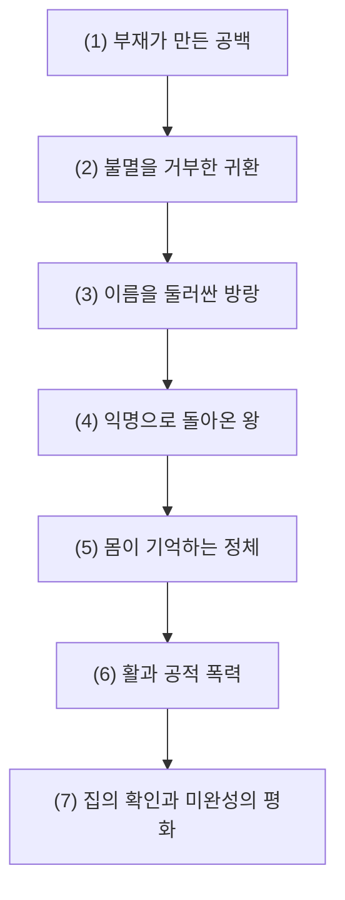
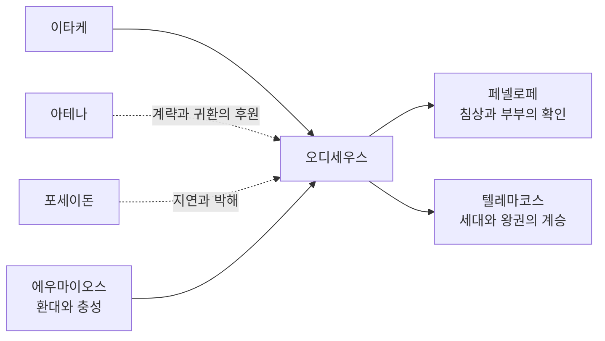

# 오디세우스 (Odysseus)

**[[greek-reading-guide|읽는 법]]**: 오디세우스 · **원어**: Ὀδυσσεύς · **학술 전사**: *Odusseús*

## 서사적 입구 (Narrative Entry)

『오뒷세이아』는 오디세우스가 어디에 있는지보다, 그가 없는 동안 이타케에서 무엇이 무너졌는지를 먼저 보여준다. 텔레마코스는 아버지의 부재 속에서 집과 왕권의 경계를 배워야 하고, 페넬로페는 구혼자들의 요구를 견디며 오이코스의 시간을 지연한다(_Od._ 1–4). 오디세우스의 귀환은 단순히 한 사람이 집으로 돌아오는 일이 아니라, 그가 없는 동안 달라진 관계 속에서 다시 알아보여야 하는 일이 된다.

바다에서 그는 [[entity-calypso|칼륍소]]의 섬에 붙잡혀 불멸과 늙지 않음을 제안받지만, 필멸의 집으로 돌아가기를 원한다(_Od._ 5.135–136, 5.203–224). 이 선택은 모험심보다 장소와 관계에 대한 지향을 보여준다. 그러나 집으로 가는 길은 이름을 드러내는 순간마다 다시 늦어진다. 폴뤼페모스 앞에서 “아무도”가 되는 계략은 탈출을 가능하게 하지만, 떠나며 자신의 이름을 외친 행동은 포세이돈의 분노와 새로운 방랑을 불러온다(_Od._ 9.382–536).

이타케에 도착한 뒤 오디세우스는 왕의 이름을 먼저 말하지 않는다. 그는 [[entity-athena|아테나]]와 계획을 세우고, [[entity-eumaeus|에우마이오스]]와 [[entity-penelope|페넬로페]]에게 다른 이력을 들려주며, 상처와 침상과 활을 통해 정체가 단계적으로 확인되도록 만든다(_Od._ 13–23). 그가 집에 들어가는 방식은 귀환의 역설을 드러낸다. 가장 가까운 사람에게조차 낯선 사람으로 보여야 자신의 집을 되찾을 수 있다는 역설이다.

마지막에 오디세우스는 텔레마코스와 하인들과 함께 구혼자들을 죽이고, 페넬로페와 라에르테스의 확인을 거쳐 이타케의 질서로 돌아간다(_Od._ 21–24). 그러나 구혼자들의 유족과의 적대는 아테나의 개입으로 중지될 뿐, 폭력이 없었던 것처럼 지워지지는 않는다. 이 문서의 중심 질문은 “오디세우스가 얼마나 영리한가”가 아니라, 생존을 가능하게 한 익명성과 거짓말이 언제 관계의 회복을 돕고 언제 타인을 통제하는 폭력이 되는가이다.

따라서 오디세우스의 궤적은 `부재 → 익명성 → 증언 → 단계적 재인 → 왕권 회복`으로 정리할 수 있다. 이것은 『일리아스』의 전사·사절과 『오뒷세이아』의 방랑자·귀향자를 하나의 심리적 성장담으로 무리하게 통합하려는 명제가 아니라, 두 작품에서 반복되는 이름·몸·집의 장면을 연결하는 편집적 관점이다.

## 1. 정의와 식별 (Definition & Identification)

- **핵심 정의**: [[entity-ithaca|이타케]]의 통치자이자 [[entity-laertes|라에르테스]]와 [[entity-anticleia|안티클레이아]]의 아들인 오디세우스는 [[entity-penelope|페넬로페]]의 남편이자 [[entity-telemachos|텔레마코스]]의 아버지이다. 『일리아스』에서는 전사·연설가·사절·정찰자로, 『오뒷세이아』에서는 귀향과 오이코스 회복을 수행하는 중심 인물로 등장한다.
- **주요 특성**: 상황에 따라 정체와 전술을 바꾸는 [[concept-metis|메티스]], 오래 견디는 능력, 언어적 설득, 전투 능력이 함께 제시된다. 이 특성들은 서로 조화를 이루기만 하는 것이 아니라, 진실·거짓·폭력의 경계를 끊임없이 흔든다.
- **서사적 범위**: 『일리아스』에서는 1·2·9·10·11권의 행동이 핵심이며, 『오뒷세이아』에서는 1–24권 전체가 그의 부재와 귀환을 둘러싼 서사로 구성된다. 트로이 목마 사건은 『오뒷세이아』의 회고와 노래에 나타나지만(_Od._ 8.492–520; 11.523–532), 『일리아스』의 직접 줄거리에 포함되지 않는다.

## 2. 명칭과 문헌학 (Philology, Epithets & Dialect)

### 2.1 희랍어 표기와 이름 풀이

- **표제형**: Ὀδυσσεύς (*Odusseús*). 속격 Ὀδυσσῆος 등 운율과 방언에 따른 형태가 나타난다.
- **본문 내 이름 풀이**: 외조부 [[entity-autolycus|아우톨뤼코스]]는 자신이 많은 사람에게 원망을 샀다는 말과 동사 *odussasthai*를 아이의 이름에 연결한다(_Od._ 19.406–412). 이는 작품이 제공하는 이름 풀이이지, 이름의 선사시대 기원을 확정하는 역사언어학적 증명은 아니다([[nagy-1979-best-of-achaeans|Nagy 1979]]).

### 2.2 주요 정형구와 별칭

| 희랍어 정형구 | 학술 전사 | 통상적 의미 | 서사적 기능 및 대표 출전 |
|:---|:---|:---|:---|
| πολύτροπος | *polútropos* | 여러 방향으로 도는, 다방면의 | 『오뒷세이아』 첫 행에서 이동과 변형의 가능성을 연다. _Od._ 1.1 |
| πολύμητις | *polúmētis* | 많은 계책을 지닌 | 계략의 보유자라는 반복 표지이다. _Od._ 9.1 |
| πολυμήχανος | *polumḗkhanos* | 여러 방책을 지닌 | 전사·사절·설계자의 복합적 역할을 환기한다. _Il._ 2.173 |
| πολύτλας δῖος Ὀδυσσεύς | *polútlas dī̂os Odusseús* | 많이 견딘 고귀한 오디세우스 | 고난을 견디는 귀환자의 정형구이다. 『오뒷세이아』 반복형 |
| πτολίπορθος | *ptolíporthos* | 도시를 함락하는 자 | 계략가뿐 아니라 전쟁 영웅이라는 이력을 남긴다. _Od._ 8.3 |

이 표현들은 성격표의 고정 항목만이 아니라 육보격의 서로 다른 위치를 채우는 정형구 체계의 일부이다. 따라서 *polytropos*나 *polymētis* 하나를 모든 장면의 유일한 해석 열쇠로 삼지 않는다.

### 2.3 μῆτις와 μή τις의 언어유희

μῆτις는 지혜·계책을 뜻하는 여성 명사이다. 반면 μή + τις는 부정소 μή와 불특정 대명사 τις가 결합한 두 단어이다. 『오뒷세이아』 9.410의 표면형 μή τίς와 9.414의 μῆτις는 단어 경계와 악센트가 다르지만 소리가 가까우며, 오디세우스가 사용한 “아무도”라는 가명 *Οὖτις*와 함께 이름과 계책의 언어유희를 만든다. 이 언어유희의 정확한 범위는 문헌학적 해석의 대상이며, μῆτις를 단순한 현대적 ‘지능’으로 번역해서는 안 된다([[detienne-1974-cunning-intelligence|Detienne & Vernant 1974]]).

## 3. 호메로스 본문에서의 모습 (Homeric Attestation & Narrative Arc)

### 3.1 『일리아스』의 행적: 공동체를 말과 행동으로 붙들기

오디세우스는 『일리아스』에서 한 가지 역할로 고정되지 않는다. 그는 제의를 수행하고, 군대의 귀향을 막고, 왕의 메시지를 전달하고, 밤의 정찰에 나서며, 전장에서 부상을 입는다.

#### (1) 제의와 설득

1권에서 오디세우스는 크뤼세이스를 아버지에게 돌려보내는 배를 지휘하고 제의를 수행한다(_Il._ 1.308–311, 1.430–474). 2권에서는 아테나의 지시에 따라 귀향하려는 군대를 되돌리며, 지도자에게는 다른 말투로, 일반 병사에게는 다른 방식으로 질서를 회복한다(_Il._ 2.169–210). 그러나 테르시테스의 불만을 폭력적으로 억누르는 장면은 그의 설득이 언제나 비위계적 대화는 아니었음을 보여준다(_Il._ 2.211–277).

#### (2) 사절과 실패

9권에서 오디세우스는 아가멤논의 제안을 아킬레우스에게 전달하는 사절단의 첫 연설자이다(_Il._ 9.222–306). 그는 보상과 공동체의 필요를 논리적으로 배열하지만, 아킬레우스의 상처가 물질적 제안으로 회복되지 않는다는 사실 앞에서 실패한다. 이 실패는 오디세우스의 메티스가 언제나 상대의 결정을 바꾸는 힘은 아니라는 점을 남긴다.

#### (3) 야간 정찰과 전투의 협력

10권에서 오디세우스는 디오메데스와 함께 돌론을 심문하고 트라키아 진영을 기습한다(_Il._ 10.239–579). 그는 정보를 얻고 상대의 욕망을 이용하지만, 이 행동은 혼자 완성되지 않는다. 11권에서도 소코스를 죽인 뒤 부상을 입고 물러나며 아이아스와 메넬라오스의 지원을 받는다(_Il._ 11.401–488). 오디세우스를 ‘혼자 전선을 지배한 영웅’으로 만들지 않는 것이 본문에 더 가깝다.

### 3.2 『오뒷세이아』의 행적: 부재에서 재인으로

#### (1) 부재가 만든 공백

1–4권은 오디세우스가 없는 이타케를 보여준다. 텔레마코스는 아버지의 소식을 찾기 위해 퓔로스와 스파르타를 방문하고, 페넬로페는 구혼자들의 요구를 지연한다. 귀환의 첫 과제는 영웅이 스스로 돌아오는 것이 아니라, 그의 부재가 만든 세대·가계·정치적 공백을 드러내는 것이다.

#### (2) 불멸을 거부한 귀환

5권에서 오디세우스는 칼륍소의 섬을 떠나 파이아케스로 향한다. 칼륍소는 불멸과 늙지 않음을 제안하지만, 오디세우스는 필멸의 페넬로페와 집으로 돌아가기를 바란다(_Od._ 5.135–136, 5.203–224). 이 선택은 귀향을 단순한 지리적 이동이 아니라, 유한한 삶을 특정한 관계와 장소 속에서 다시 선택하는 행위로 만든다.

#### (3) 이야기로 시간을 버는 사람

6–12권에서 오디세우스는 파이아케스인에게 구조되고, 자기 이름을 밝힌 뒤 방랑을 회고한다. 키클롭스와 세이렌, 키르케, 저승의 이야기는 모험 목록이면서 동시에 자신의 정체를 이야기로 통제하는 과정이다. 데모도코스의 노래에서 그는 자신이 겪은 전쟁을 듣고 눈물을 흘리며(_Od._ 8.72–82, 8.492–520), 말할 수 있는 사람과 말해지게 되는 사람 사이의 차이를 드러낸다.

#### (4) 익명으로 돌아온 왕

13–16권에서 오디세우스는 이타케에 도착한 뒤 아테나의 도움으로 거지의 모습이 된다. 그는 에우마이오스와 텔레마코스에게 계획을 나누지만, 모든 사람에게 같은 진실을 공개하지 않는다. 귀환은 이름의 선언보다 정보의 배분으로 먼저 진행된다.

#### (5) 몸이 기억하는 정체

17–20권에서 오디세우스는 구혼자들과 페넬로페 앞에 낯선 사람으로 머문다. 유모 [[entity-eurycleia|에우뤼클레이아]]는 허벅지의 흉터를 알아보고(_Od._ 19.386–475), 오디세우스는 침묵을 명령한다. 20권에서는 불충한 하녀들을 보고 즉시 공격하려는 충동을 자신의 심장(*kradiē*)에게 말하며 억제한다(_Od._ 20.13–21). 정체는 얼굴이나 선언만이 아니라 몸의 기억과 자기 통제를 통해 드러난다.

#### (6) 활과 공적 폭력

21–22권에서 활 시험은 오디세우스의 사적 정체를 공적 행위 능력으로 전환한다. 텔레마코스와 에우마이오스, [[entity-philoetius|필로이티오스]]가 함께 전투하고 아테나가 개입하므로, 오디세우스가 혼자 108명의 구혼자를 처단했다는 식의 요약은 본문을 왜곡한다(_Od._ 16.247–253; 21–22). 활은 귀환을 증명하지만, 그 증명이 곧 폭력의 윤리적 정당화를 끝내지는 않는다.

#### (7) 집의 확인과 미완성의 평화

23권에서 페넬로페는 침상의 비밀을 통해 오디세우스를 확인하고(_Od._ 23.177–230), 24권에서 라에르테스가 그를 다시 알아본다. 구혼자 유족과의 적대는 아테나의 개입과 맹약으로 중지되지만, 죽은 자들의 가족이 느끼는 상실까지 사라지는 것은 아니다(_Od._ 24.531–548). 귀환은 집을 회복하지만, 집을 회복하는 폭력의 흔적은 남긴다.

### 3.3 폴뤼페모스와 포세이돈: 이름이 귀환을 지연시키는 순간

오디세우스가 눈을 멀게 한 대상은 포세이돈이 아니라 그의 아들 폴뤼페모스이다(_Od._ 9.382–536). 그는 “아무도”라는 이름으로 자신과 동료를 탈출시키지만, 배가 멀어진 뒤 자신의 이름을 외친다. 이 자랑은 영웅적 명성을 확보하는 동시에 폴뤼페모스의 저주와 포세이돈의 박해를 불러온다. 노를 내륙에 세우고 포세이돈에게 제사하라는 과업은 이미 성취된 화해가 아니라 테이레시아스가 훗날 수행하라고 예언한 의례이다(_Od._ 11.121–137).

### 3.4 전환점을 따라 읽는 질문

- 낯선 사람으로 남아야 집으로 돌아갈 수 있다면, 귀환의 주체는 이름을 가진 사람인가 아니면 관계 속에서 다시 확인되는 사람인가?
- 폴뤼페모스 사건에서 이름을 숨기는 계략과 이름을 밝히는 자랑은 왜 한 인물에게 함께 존재하는가(_Od._ 9)?
- 구혼자들을 처벌한 뒤에도 유족과의 적대가 남는다면, 왕권의 회복은 질서의 회복과 같은 것인가(_Od._ 24)?

## 4. 관계와 소속 (Genealogy, Alliances & Networks)

오디세우스의 관계망은 그를 대신 정의하는 고정된 성격표가 아니다. 페넬로페와 텔레마코스는 귀환의 목적을 이루는 관계이고, 아테나는 그의 메티스를 신적 차원에서 비추는 후원자이다. 반대로 포세이돈과 폴뤼페모스는 이름과 자랑이 관계를 어떻게 적대로 바꾸는지를 보여준다.

| 대상 | 관계가 수행하는 기능 | 원전 근거 |
|:---|:---|:---|
| 라에르테스·안티클레이아 | 가계와 귀향의 정서적 기반. 안티클레이아의 죽음은 귀환이 시간의 상실을 되돌리지 못함을 보여준다. | _Od._ 11.84–89, 11.187–203 |
| 페넬로페 | 정체 확인과 오이코스 회복의 공동 주체. 침상 시험은 부부만 공유하는 지식을 사용한다. | _Od._ 19.535–604, 23.177–230 |
| 텔레마코스 | 귀환 뒤 전투 동맹이자 가계와 왕권의 계승자이다. | _Od._ 16.1–320, 21–22권 |
| 아테나 | 변장·계획·귀환을 돕는 신적 후원자. 인간의 메티스와 신의 계략이 나란히 놓인다. | _Od._ 13.287–310 |
| 포세이돈·폴뤼페모스 | 폴뤼페모스 사건에서 이름의 자랑이 귀향 지연과 연결되는 적대 관계이다. | _Od._ 9.382–536 |
| 에우마이오스·필로이티오스 | 신분을 가린 왕을 환대하고 구혼자 전투에 참여하는 하인·동맹이다. | _Od._ 14.1–491, 21–22권 |
| 아킬레우스 | 데모도코스의 노래와 저승 대화를 통해 귀향의 영웅성과 죽음의 영웅성을 대비시키는 동료이다. | _Od._ 8.72–82, 11.467–491 |

## 5. 인물 전용 모듈 (Person-Specific Narrative Details)

### 5.1 익명성에서 재인으로

오디세우스의 귀환은 이름을 곧바로 선언하는 과정이 아니라 정보를 단계적으로 통제하는 과정이다. 아테나와 텔레마코스에게 계획을 세우고, 에우마이오스와 페넬로페에게 다른 이력을 말하며, 에우뤼클레이아에게는 흉터로 정체가 드러난다(_Od._ 19.386–475). 활 시험과 침상 시험은 각각 공적 전투 능력과 부부만 아는 지식을 통해 정체를 확인한다(_Od._ 21.404–434; 23.177–230). 정체는 말로만 선포되는 것이 아니라 상대가 감당할 수 있는 방식으로 공개된다.

### 5.2 분노의 통제와 심장에 대한 말

불충한 하녀들의 행동을 본 오디세우스는 즉시 공격하려는 충동을 억누르며 자신의 *kradiē* (κραδίη, 심장)를 꾸짖는다(_Od._ 20.13–21). 이 장면은 자기 통제를 보여주지만, 해당 행이 노오스·프렌·튀모스라는 일관된 심리 기관 체계를 직접 제시하는 것은 아니다. 따라서 “분열된 자아를 합일했다”는 현대적 서사를 덧붙이기보다, 행동을 지연시키는 자기 발화의 기능에 집중해야 한다.

### 5.3 활, 동맹, 처벌의 범위

16권의 출신지별 목록을 합산하면 구혼자는 108명으로 계산되지만(_Od._ 16.247–253), 22권의 전투는 오디세우스 혼자 수행하지 않는다. 텔레마코스·에우마이오스·필로이티오스가 함께 싸우고 아테나도 개입한다. 활 시험과 출입구 통제는 수적 열세를 뒤집는 계책인 동시에, 구혼자·무장 해제된 사람·하녀·유족에게 가해진 폭력의 범위를 둘러싼 판단을 남긴다.

## 6. 역사적 맥락 (Historical Context & Social Institutions)

오디세우스는 *basileus*로 불리며 집회에서 말하고 전리품·환대·가계의 권위를 관리한다. 그러나 이 모습을 선형문자 B 문서의 미케네 *wanax*와 그대로 동일시할 수는 없다. 호메로스 사회는 청동기 물질문화의 기억과 후대 귀족 공동체의 관행이 겹친 시적 구성물로 다루는 편이 안전하다.

『오뒷세이아』 2권에서 아이귑티오스는 오디세우스가 떠난 뒤 처음으로 집회가 열렸다고 말한다(_Od._ 2.25–34). 이 장면은 구혼자들이 공적 숙의와 오이코스 질서를 약화시킨 상태를 보여주지만, 이타케의 실제 청동기 정치 제도를 직접 기록한 사료는 아니다. 오디세우스의 귀환은 왕의 개인적 복귀와 공적 질서의 재건을 포개지만, 둘을 동일한 사건으로 단순화하지 않는다.

## 7. 고고학과 지리 (Archaeology, Topography & Material Culture)

### 7.1 그리스 전역에서의 이타키

<iframe
  class="odysseus-regional-map"
  title="이타키를 중심으로 한 그리스 및 이오니아 해 Google 지도"
  src="https://www.google.com/maps/embed?origin=mfe&amp;pb=!1m3!2m1!1s38.45,20.65!6i6"
  width="100%"
  height="480"
  loading="lazy"
  allowfullscreen
  referrerpolicy="strict-origin-when-cross-origin"></iframe>

이타키(Ithaki)는 그리스 서부 이오니아 해에 있는 섬으로, 그리스 본토와 펠로폰네소스반도에서 서쪽 바다로 나간 이오니아 제도 안에 놓인다. 방향 감각을 위해 말하면, 이타키는 **아테네의 서쪽**, 케팔로니아(Cephalonia)의 북동쪽, 레프카다(Leucas)의 남쪽에 있다. 레프카다는 본토와 통행이 연결되어 보이지만 현대 지리상 섬이다.

위 전역 지도는 이타키의 현대 좌표(`38.45°N, 20.65°E`)를 중심으로, 그리스 전역과 이오니아 해·주변 지역이 함께 보이도록 축척을 `z=6`으로 둔 Google Maps 임베드이다. 전역 지도의 표식이 너무 작아 세 섬의 관계를 놓치지 않도록, 바로 아래에 레프카다·케팔로니아·이타키를 함께 읽는 확대 미니맵을 덧붙였다. 임베드가 차단된 환경에서는 [Google 지도에서 이타키 열기](https://www.google.com/maps?q=38.45,20.65&amp;z=6)를 사용한다.

<figure class="odysseus-ionian-inset">
  <figcaption><strong>이오니아 제도 확대</strong>: 레프카다는 북쪽, 케팔로니아는 남서쪽, 이타키는 그 사이의 동쪽에 있다.</figcaption>
  <iframe
    class="odysseus-ionian-minimap"
    title="레프카다, 케팔로니아, 이타키의 상대 위치를 보여 주는 Google 지도"
    src="https://www.google.com/maps/embed?origin=mfe&amp;pb=!1m3!2m1!1s38.45,20.65!6i9"
    width="100%"
    height="352"
    loading="lazy"
    allowfullscreen
    referrerpolicy="strict-origin-when-cross-origin"></iframe>
</figure>

확대 지도는 이타키와 레프카다·케팔로니아의 실제 해안선 관계를 확인하는 보조 위치도이다. 임베드가 차단된 경우에는 [이오니아 제도 확대 지도 열기](https://www.google.com/maps?q=38.45,20.65&amp;z=9)를 사용한다. 아래의 상세 지도는 이 전역·지역 맥락 속에서 이타키 북부의 발굴 지점을 확대해 보여 준다.

> [!NOTE] 지도 읽기
> 위 지도는 현대 지명과 WGS84 좌표를 이용한 인터랙티브 지역 위치도이다. 이타키 표식은 현대 좌표를 가리킬 뿐이며, 호메로스 시대 해안선의 복원이나 호메로스 이타케의 단일한 비정을 주장하지 않는다.

### 7.2 현대 이타키의 고고학 지점 위치도

<figure class="odysseus-ithaca-archaeology-map">
  <iframe
    class="odysseus-ithaca-archaeology-iframe"
    title="현대 이타키 북부의 폴리스 만 로이조스 동굴과 아기오스 아타나시오스 유적을 보여 주는 OpenStreetMap 지도"
    srcdoc='<!doctype html><html lang="ko"><head><meta charset="utf-8" /><meta name="viewport" content="width=device-width, initial-scale=1" /><link rel="stylesheet" href="https://unpkg.com/leaflet@1.9.4/dist/leaflet.css" crossorigin="" /></head><body>

</body></html>'
    width="100%"
    height="512"
    loading="lazy"
    allowfullscreen
    referrerpolicy="strict-origin-when-cross-origin"></iframe>
  <figcaption>현대 OpenStreetMap 지형 위에 두 고고학 지점의 WGS84 좌표를 표시한 위치도. 지도 바탕 © OpenStreetMap 기여자.</figcaption>
</figure>

이 지도는 두 고고학 지점의 현대 WGS84 좌표를 고정한 위치도이다. 폴리스 만 로이조스 동굴은 `38.439792°N, 20.637871°E`(Mycenaean Atlas 정확도 10m), 아기오스 아타나시오스의 이른바 ‘호메로스 학교’ 유적은 `38.460623°N, 20.637957°E`(정확 좌표)이다([[greek-ministry-2025-odysseion-ithaca|그리스 문화부·Mycenaean Atlas 2025]]). 지도를 직접 조작하려면 [OpenStreetMap에서 이타키 북부 열기](https://www.openstreetmap.org/?mlat=38.4502&amp;mlon=20.6379#map=13/38.4502/20.6379)를 사용한다. 바티(Vathy)는 독자의 방향 감각을 위한 현대 기준점이며, 두 후보지의 증거 등급을 높이는 근거는 아니다.

지도에 현대 이타키·팔리키·레프카다를 함께 놓은 목적은 경쟁설의 **상대 위치**를 보이는 데 있다. 이는 고대 해안선의 복원도가 아니며, 팔리키·레프카다는 각각 논쟁적 가설과 소수설로만 표시했다. 『오뒷세이아』 9.21–27은 이타케·네리톤·인접 섬을 서사적으로 기술하지만, 이 구절만으로 현대 좌표 하나를 확정할 수는 없다.

### 7.3 호메로스 이타케의 위치

| 후보 | 근거 | 제한 |
|:---|:---|:---|
| 현대 이타키 | 지명 연속성, 고대의 동일시, 폴리스 만 제의 자료 | _Od._ 9.21–27의 지세 표현 해석이 논쟁적 |
| 케팔로니아 팔리키 | 서쪽·저지대라는 독해, 옛 티니아 해협 가설 | 조사된 경로의 후기 청동기 연속 해협 배제, 대안 구조운동 모형 미검증, 미케네기 중심지 증거 부족 |
| 레프카다 | 북서쪽 위치, 초기~중기 청동기 무덤군과 근대 이래의 지형 비교 | 주요 무덤군이 후기 청동기·미케네기보다 이르고 지명 연속성이 약함 |

[[bittlestone-2005-odysseus-unbound|Bittlestone et al. 2005]]은 팔리키를 이타케로 비정하지만 통설로 확정된 결과가 아니다. Hunter(2013)는 제안된 경로에서 후기 청동기 해수면 높이의 연속 수로를 배제했으며, 대안적 구조운동 모형은 추가 검증이 필요하다. *chthamalē*와 *pros zophon*의 번역, 인접 섬들의 위치와 미케네기 중심지 증거도 별도로 검토해야 한다.

### 7.4 아기오스 아타나시오스와 오디세이온

이타케 북부의 아기오스 아타나시오스-‘호메로스 학교’ 유적에는 후기 미케네기 도기편과 지하 수조·샘 시설이 보고되어 있다. 그리스 문화부의 2025년 발표은 이 유적을 북서 이타케의 청동기 활동망 안에 놓으면서도, 현장 자료만으로 오디세우스의 궁전을 확정하지는 않는다. 반면 헬레니즘기부터 초기·중기 로마기에 집중된 기념비적 복합체와 오디세우스 명문은 후대의 오디세이온, 즉 영웅 성소·숭배의 강한 근거이다([[greek-ministry-2025-odysseion-ithaca|그리스 문화부·Mycenaean Atlas 2025]]).

### 7.5 멧돼지 어금니 투구

『일리아스』 10.261–271의 투구는 본문에서 일반명 κυνέη로 불리며 별도의 고유 희랍어 명칭이 없다. 투구는 아뮌토르의 소유물에서 시작해 아우톨뤼코스의 절취, 암피다마스, 몰로스, [[entity-meriones|메리오네스]]를 거쳐 오디세우스에게 빌려진다.

고고학 사례는 중기 헬라딕기부터 LH IIIC까지 이어진다. 이 묘사는 미케네 물질문화의 기억을 보존하지만, 투구가 LH IIIB/C 전에 사라졌다는 가정이나 이 구절만으로 700년 이상의 연속 구전을 증명하는 논거는 성립하지 않는다.

### 7.6 폴리스 만 로이조스 동굴

로이조스 동굴의 헬레니즘기 봉헌 명문은 오디세우스 숭배의 직접 증거이다. 더 이른 기하학기 삼발이솥은 중요한 제의 자료이지만, 그것만으로 기하학기부터 오디세우스 숭배가 연속되었다거나 그가 ‘선원의 수호 영웅’으로 숭배되었다고 확정할 수는 없다.

## 8. 종교학·인류학적 해석 (Religion, Cult & Anthropology)

### 8.1 아테나와 인간의 메티스

이타케에서 오디세우스가 변장한 아테나에게 즉석 거짓 이야기를 들려주자, 아테나는 자신의 신적 계략과 오디세우스의 인간적 계략을 나란히 놓는다(_Od._ 13.287–310). 이는 두 존재의 지적 친화성을 보여주지만 완전한 동등성을 선언하지는 않는다. 오디세우스의 메티스는 신의 지혜를 소유하는 것이 아니라, 신적 후원 아래에서도 필멸자가 위험을 계산하고 시간을 벌어야 하는 방식이다.

### 8.2 크세니아와 사회 판별

『오뒷세이아』는 낯선 이를 대하는 방식으로 공동체의 성격을 반복해서 판별한다. 파이아케스인과 에우마이오스의 환대는 낯선 몸을 먼저 보호하고 나중에 신원을 묻는 질서를 보여주며, 폴뤼페모스의 식인과 구혼자들의 오이코스 침탈은 그 질서의 붕괴를 보여준다. 그러나 구혼자 살육의 모든 세부가 자동으로 정당화되는 것은 아니다. 작품의 신적 승인, 환대 규범, 인간적 폭력의 범위를 나누어 검토해야 한다([[concept-xenia|크세니아]], [[lee-junseok-2016-odyssey-humanity|이준석 2016]]).

## 9. 철학·윤리학적 해석 (Philosophical & Ethical Dimensions)

### 9.1 메티스의 양가성

오디세우스의 메티스는 약자가 강자를 이기게 하고 귀향을 가능하게 하지만, 거짓말·위장·정보 비대칭을 수단으로 삼는다. 따라서 이를 현대적 ‘실용 지능’으로 찬양하거나 단순한 비겁함으로 환원하기보다, 어떤 상대와 목적을 향해 사용되는지 장면별로 평가해야 한다([[detienne-1974-cunning-intelligence|Detienne & Vernant 1974]]). 폴뤼페모스 앞의 익명성과 이타케에서의 변장은 생존을 돕지만, 같은 기술이 구혼자와 하인들을 통제하는 방식으로도 작동한다.

### 9.2 불멸과 귀향

칼륍소는 오디세우스를 불멸하고 늙지 않게 만들 수 있다고 말하지만(_Od._ 5.135–136), 오디세우스는 여신의 우월함을 인정하면서도 페넬로페와 집으로 돌아가기를 바란다(_Od._ 5.203–224). 이 선택은 필멸의 가정과 장소에 대한 지향을 보여주지만, ‘망각 대 실존’ 같은 현대 철학 용어를 원전 자체의 개념으로 제시해서는 안 된다. 여기서 핵심은 불멸의 추상적 가치보다 특정한 관계 속에서 다시 살아가는 선택이다.

### 9.3 구혼자 살육과 왕권 회복의 폭력

구혼자들은 오이코스를 소모하고 손님을 모욕하며 텔레마코스의 죽음을 모의한다. 작품은 이들을 비난하고 신들의 개입으로 응징을 승인한다. 동시에 무장 해제된 사람들, 하녀들, 유족에게 이어지는 폭력은 정당한 처벌과 과잉 보복의 경계를 남긴다. 따라서 구혼자 전투를 질서의 완전한 회복으로만 읽거나, 반대로 작품이 제시하는 응징의 논리를 전혀 고려하지 않는 것도 모두 불충분하다. *Nemesis*를 ‘존재론적 죄악’의 이름으로 사용하는 것은 호메로스 어휘의 용법과 맞지 않는다.

## 10. 후대 전승과 수용 (Post-Homeric Tradition & Reception)

보존된 서사시환의 요약은 『소일리아스』에서 아킬레우스 무구의 심판, 트로이 정찰, 팔라디온 절취와 목마 계획을 다룬다. 필록테테스를 데려오는 인물은 디오메데스이고, 목마 제작자는 아테나의 지시를 받은 에페이오스이다. 이는 『일리아스』와 『오뒷세이아』의 직접 서사에 추가된 후대 전승으로 분리해야 한다([[concept-epic-cycle|서사시환]]).

오디세우스가 미친 척 소금을 뿌리며 밭을 갈고 팔라메데스가 텔레마코스를 쟁기 앞에 놓았다는 상세는 주로 히기누스 『이야기』 95와 같은 후대 신화편람 전승에 속한다. 이를 현전하지 않는 『퀴프리아』의 보존 내용으로 단정할 수 없다. 『텔레고니아』 요약의 텔레고노스가 아버지를 알아보지 못하고 죽였다는 이야기도 테이레시아스의 ‘바다로부터 오는 죽음’ 예언(_Od._ 11.134–137)의 유일한 원래 의미로 확정해서는 안 된다.

소포클레스의 『필록테테스』는 목적을 위해 네오프톨레모스에게 잠시 수치심을 감수하라고 설득하는 오디세우스를, 『아이아스』는 적의 장례권을 인정하는 오디세우스를 제시한다. 이 두 비극의 인물상을 『오뒷세이아』의 선형적 성숙으로 합칠 필요는 없다. 후대 전승은 오디세우스의 본질을 확정하는 자료가 아니라, 계략·전쟁·귀환의 윤리를 다시 배치한 수용의 기록이다.

## 11. 학술 논쟁 (Scholarly Debates & Contradictions)

> [!WARNING] 모순/이설 발견: 두 서사시의 인물상
> 『일리아스』의 전사·사절과 『오뒷세이아』의 방랑자·귀향자는 여러 능력을 공유하지만 서로 다른 장르와 전승 속에 놓인다. 이를 전쟁 뒤 심리적으로 성숙한 한 인물의 연속성으로 단정하거나, 전혀 무관한 인물의 결합으로 단정하는 것은 모두 현전 텍스트보다 강한 주장이다.

> [!WARNING] 모순/이설 발견: 이타케의 비정
> 현대 이타키, 팔리키, 레프카다설은 본문 지리·지질·고고학·지명 연속성에 서로 다른 가중치를 둔다. 팔리키의 옛 수로 가설에는 반론이 제시되었지만, 대안 모형과 미케네기 중심지의 관계도 확정되지 않았다. 현재 증거는 하나의 섬을 호메로스 이타케로 결정하지 않으며, 호메로스 지리를 실측 지도처럼 읽어야 하는지도 논쟁적이다.

> [!WARNING] 모순/이설 발견: 구혼자 살육
> 작품 내부의 신적 승인과 오이코스 질서 회복이라는 독해와, 집단 살육·하녀 처형·유족과의 적대 중지를 문제 삼는 독해가 공존한다. 한쪽을 작품 전체의 유일한 윤리로 만들지 않는다.

## 12. 증거 매트릭스 (Evidence Matrix)

| 주장 및 테제 | 자료 유형 | 근거 및 출전 | 확실성 | 관련 위키 문서 |
|:---|:---|:---|:---|:---|
| 오디세우스의 부재가 이타케의 정치·가계 공백을 만든다 | 호메로스 본문 | _Od._ 1–4, 2.25–34 | 원전 명시 | [[lee-junseok-2016-odyssey-humanity\|이준석 2016]] |
| 이름을 *odussasthai*와 연결하는 본문 내 풀이 | 호메로스 본문·현대 문헌학 | _Od._ 19.406–412; Nagy 1979 | 원전 명시 | [[nagy-1979-best-of-achaeans\|Nagy 1979]] |
| 정형구는 변형·계략·인내의 여러 역할을 배치한다 | 호메로스 본문 | _Od._ 1.1, 8.3, 9.1; _Il._ 2.173 | 원전 명시 | [[lee-junseok-2024-iliad-jeongam\|이준석 2024]] |
| μῆτις와 μή τίς가 이름·계략의 언어유희를 만든다 | 호메로스 본문·현대 연구 | _Od._ 9.406–414; Detienne & Vernant 1974 | 강한 학술 추론 | [[detienne-1974-cunning-intelligence\|Detienne & Vernant 1974]] |
| 아테나와 오디세우스의 계략 친화성이 나타난다 | 호메로스 본문 | _Od._ 13.287–310 | 원전 명시 | [[detienne-1974-cunning-intelligence\|Detienne & Vernant 1974]] |
| 폴뤼페모스의 저주가 포세이돈의 박해와 귀환 지연을 연결한다 | 호메로스 본문 | _Od._ 9.382–536, 11.121–137 | 원전 명시 | [[nagy-1979-best-of-achaeans\|Nagy 1979]] |
| 오디세우스의 정체는 흉터·활·침상으로 단계적으로 확인된다 | 호메로스 본문 | _Od._ 19.386–475, 21.404–434, 23.177–230 | 원전 명시 | [[lee-junseok-2016-odyssey-humanity\|이준석 2016]] |
| 구혼자 전투는 동맹과 신적 개입으로 수행된다 | 호메로스 본문 | _Od._ 21–22 | 원전 명시 | [[lee-junseok-2016-odyssey-humanity\|이준석 2016]] |
| 불멸보다 필멸의 집으로 돌아가기를 선택한다 | 호메로스 본문 | _Od._ 5.135–136, 5.203–224 | 원전 명시 | [[nagy-1979-best-of-achaeans\|Nagy 1979]] |
| 구혼자 처벌의 윤리적 범위는 논쟁적이다 | 호메로스 본문·현대 연구 | _Od._ 22–24; 이준석 2016 | 논쟁적 | [[analysis-homeric-ethics-literature-review\|호메로스 윤리학 문헌 고찰]] |
| 이타케의 후보 비정은 확정되지 않았다 | 고고학·지리·현대 연구 | Bittlestone et al. 2005; Hunter 2013 | 논쟁적 | [[bittlestone-2005-odysseus-unbound\|Bittlestone et al. 2005]] |
| 아기오스 아타나시오스와 로이조스 동굴은 서로 다른 층위의 자료를 제공한다 | 물질자료·후대 수용 | 그리스 문화부 2025; Mycenaean Atlas; 로이조스 동굴 봉헌 명문 | 강한 학술 추론 | [[greek-ministry-2025-odysseion-ithaca\|그리스 문화부·Mycenaean Atlas 2025]] |
| 멧돼지 어금니 투구는 미케네 물질문화의 기억을 환기한다 | 호메로스 본문·물질자료 | _Il._ 10.261–271; 고고학 종합 자료 | 강한 학술 추론 | [[lee-junseok-2024-iliad-jeongam\|이준석 2024]] |
| 오디세우스의 후대 전승은 호메로스 원전과 분리해야 한다 | 후대 문헌 | 『소일리아스』·『텔레고니아』 요약·소포클레스 비극 | 후대 수용 | [[concept-epic-cycle\|서사시환]] |

## 관련 항목

- [[entity-penelope|페넬로페]] — 정체 확인과 오이코스 회복의 공동 주체
- [[entity-telemachos|텔레마코스]] — 귀환 뒤 전투 동맹이자 가계 계승자
- [[entity-laertes|라에르테스]] — 귀환의 마지막 확인자
- [[entity-athena|아테나]] — 메티스와 귀환을 후원하는 신
- [[entity-poseidon|포세이돈]] — 폴뤼페모스 사건 이후 귀향을 지연시키는 신
- [[entity-polyphemos|폴뤼페모스]] — 이름의 자랑과 저주를 연결하는 상대
- [[entity-achilles|아킬레우스]] — 귀향과 죽음의 영웅성을 대비시키는 인물
- [[concept-metis|Metis]] — 계략과 상황 판단의 지혜
- [[concept-nostos|Nostos]] — 오디세우스 서사의 귀향 구조
- [[concept-xenia|Xenia]] — 낯선 사람과 공동체를 판별하는 환대 규범
- [[concept-epic-cycle|Epic Cycle]] — 호메로스 이후 오디세우스 전승의 층위
- [[detienne-1974-cunning-intelligence|Detienne & Vernant 1974]] — 메티스와 계략의 인류학
- [[nagy-1979-best-of-achaeans|Nagy 1979]] — 아킬레우스와 오디세우스의 영웅적 대비
- [[bittlestone-2005-odysseus-unbound|Bittlestone et al. 2005]] — 이타케 비정 논쟁
- [[greek-ministry-2025-odysseion-ithaca|그리스 문화부·Mycenaean Atlas 2025]] — 이타케 고고학과 오디세이온 자료
- [[lee-junseok-2016-odyssey-humanity|이준석 2016]] — 『오뒷세이아』의 인간성과 귀환
- [[analysis-concept-source-matrix|개념과 문헌]]
- [[analysis-homeric-ethics-literature-review|호메로스 윤리학 문헌 고찰]]
