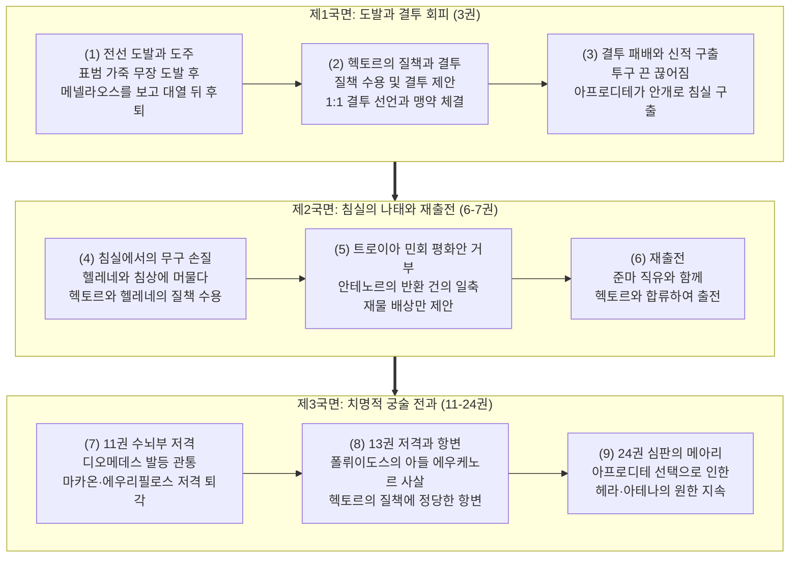
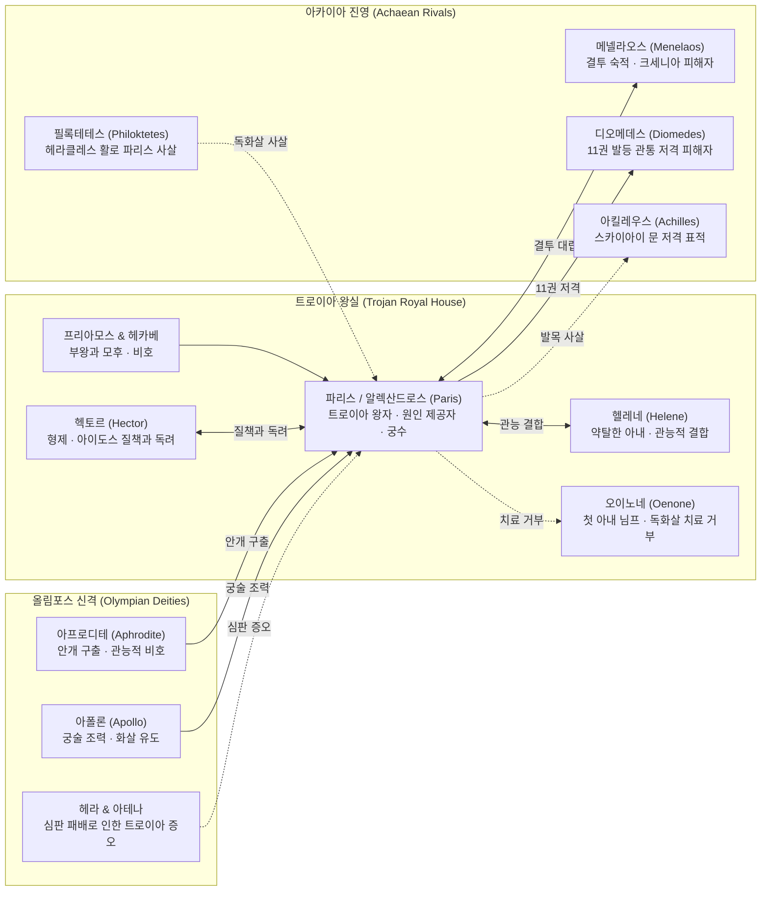

# 파리스 (Paris)

**[[greek-reading-guide|읽는 법]]**: 파리스 · **원어**: Πάρις · **학술 전사**: *Páris*

## 서사적 입구 (Narrative Entry)

호메로스의 『일리아스』에서 **파리스**(Paris)는 트로이아의 왕자이자 트로이아 전쟁 전체를 촉발한 서사의 근원적 원인 제공자이다. 그는 스파르타의 왕 [[entity-menelaos|메넬라오스]]의 궁전에 손님으로 머물며 환대를 받았으나, 신성한 손님-주인 규범인 [[concept-xenia|크세니아]]를 유린하고 왕비 [[entity-helene|헬레네]]와 재물을 약탈하여 트로이아로 달아났다. 이 행위는 아카이아 연합군의 원정을 초래했을 뿐만 아니라, [[entity-zeus|제우스]]([[entity-zeus-xenios|제우스 크세니오스]])의 우주적 정의를 발동시켜 트로이아 도성에 신벌([[concept-tisis|티시스]])의 파멸을 선고하는 종교신학적 계기가 되었다.

파리스는 영웅적 명예 체계([[concept-time|티메]])와 필멸자의 유한한 인간 조건 사이의 갈등을 체현하는 인물이다. 형인 [[entity-hector|헥토르]]가 트로이아 공동체와 가족을 수호하기 위해 전선에서 책무를 다하며 사회적 수치심([[concept-aidos|아이도스]])에 구속되는 반면, 파리스는 여신 [[entity-aphrodite|아프로디테]]가 부여한 육체미와 에로스의 향유에 침잠한다. 제3권에서 메넬라오스와의 일대일 결투 직전 대열 뒤로 물러서다 헥토르에게 질책을 받을 때, 파리스는 자신의 부끄러움을 인정하면서도 "황금의 아프로디테가 내린 빛나는 선물은 결코 버릴 수 없다"(_Il._ 3.64–66)라며 신적 결정론을 내세운다.

군사적으로 파리스는 근접 중장 백병전과 원거리 궁술 사이의 대조를 보인다. 정규 창검 결투에서는 메넬라오스에게 압도당하여 아프로디테의 구출을 받지만, 복합궁을 운용하는 저격수로서는 제11권에서 아카이아 진영의 맹장 [[entity-diomedes|디오메데스]]의 발등을 관통시키고, 명의 [[entity-machaon|마카온]]과 [[entity-eurypylos|에우리필로스]]를 부상시켜 전선에서 이탈시키는 치명적인 전술적 위력을 발휘한다. 호메로스는 파리스를 통해 귀족적 백병전 영웅주의와 실리적 궁술 사이의 긴장, 그리고 공적 폴리스의 책무와 사적 욕망의 충돌을 다각도로 조명한다.

## 1. 정의와 식별 (Definition & Identification)

- **핵심 정의**: 트로이아 국왕 [[entity-priam|프리아모스]]와 왕비 [[entity-hecabe|헤카베]]의 아들이자 헥토르의 동생. 스파르타의 헬레네를 유인·약탈하여 10년간의 트로이아 전쟁을 촉발한 장본인이자, 아프로디테의 비호를 받는 궁수 영웅.
- **분류 및 소속**: 인물(`entity_type: person`), 트로이아 왕실의 주요 왕자, 트로이아 방어군 지휘관. 신적 혈통을 지녔으나 영웅적 불멸성([[concept-kleos|클레오스]]) 대신 찰나적 관능 쾌락과 신적 은사에 의존하는 인물.
- **서사적 출현 범위**: 『일리아스』 제3권(메넬라오스와의 결투 및 구출), 제6권(침실에서의 무구 손질과 헥토르의 질책), 제7권(트로이아 민회에서의 평화안 거부), 제11권(디오메데스·마카온·에우리필로스 저격), 제13권(에우케노르 사살 및 헥토르와의 대화), 제24권(파리스의 심판 회고)에 걸쳐 주요 서사 국면마다 등장함. 『오뒷세이아』에서는 전쟁의 원인 제공자로서 회고됨(_Od._ 4.145, 11.438).

## 2. 명칭과 문헌학 (Philology, Epithets & Dialect)

### 2.1 희랍어 표기와 이중 명칭의 운율적 경제성

호메로스 서사시에서 파리스는 두 개의 고유 명칭, 곧 **알렉산드로스**(Ἀλέξανδρος, *Aléksandros*)와 **파리스**(Πάρις, *Páris*)를 병용한다. 이 두 명칭은 운율적 경제성(Metrical Economy)과 서사적 맥락에 따라 구별된다.

- **알렉산드로스** (Ἀλέξανδρος, *Aléksandros*):
  - **어원 분석**: 희랍어 동사 `ἀλέξω`(*aléksō*, "막아내다, 물리치다")와 명사 `ἀνήρ`(*anḗr*, 속격 *andrós*, "남성/사내")의 합성어로, 문자 그대로의 의미는 "**사내들을 막아내는 자**" 또는 "**사람들의 수호자** (Defender of Men)"이다. 이는 도성에 파멸을 불러오는 파리스의 서사적 행적과 극적인 반어를 이룬다.
  - **운율적 기능**: 단-장-장-장(˘ ¯ ¯ ¯)의 4음절 구조로, 3음보 후반 약박부터 5음보 전반 강박에 걸쳐 위치하며 행말 수식어 `θεοειδής`(¯ ˘ ˘ ¯ ¯)와 결합하여 3후반~6음보 행말 정형구(`Ἀλέξανδρος θεοειδής`, _Il._ 3.16 등)를 완성한다. 『일리아스』 전편에서 약 45회 등장하며, 공적인 전사로서의 행적을 서술할 때 주로 사용된다.
- **파리스** (Πάρις, *Páris*):
  - **어원 분석**: 비(非)그리스계 어원으로, 서부 아나톨리아 루비아어(Luwian) 인명 `*Pari-zitis`("탁월한 자")와의 연관성이 제기된다(Starke 1997).
  - **운율적 기능**: 단-단(˘ ˘) 또는 장-단(¯ ˘)의 2음절 구조로, 『일리아스』에서 단순형 4회(_Il._ 3.325, 3.438, 6.512, 24.249)와 복합 호격 `Δύσπαρι`(*Dúspari*, "재앙의 파리스") 2회(_Il._ 3.39, 13.769)를 합쳐 총 6회만 제한적으로 사용된다. 주로 사적인 관계나 헥토르의 도덕적 질책에서 출현한다.

### 2.2 고유 정형구와 호격 질책 (Epithets & Formulae)

| 희랍어 정형구 실제형 | 학술 전사 | 한국어 풀이 | 운율적 기능 및 문법 격 | 대표 출전 |
|:---|:---|:---|:---|:---|
| **Ἀλέξανδρος θεοειδής** | *Aléksandros theoeidḗs* | 신을 닮은 알렉산드로스 | 주격(단수), 3후반~6음보 행말 정형구. 외형적 아름다움과 왕실 혈통 | _Il._ 3.16, 3.27, 3.450 |
| **Δύσπαρι** | *Dúspari* | 재앙의 파리스 / 불길한 파리스 | 호격(단수). 헥토르의 도덕적 분노와 질책 (3.39행 5연속 닥틸 쾌속 운율 시작) | _Il._ 3.39, 13.769 |
| **εἶδος ἄριστε** | *eîdos áriste* | 겉모습만 가장 빼어난 자 | 대격+호격. 외모의 탁월함과 영웅적 내실의 결여 대조 | _Il._ 3.39, 13.769 |
| **γυναιμανές** | *gunaimanés* | 여인에 미친 자 | 호격(단수). 관능적 에로스에 종속된 성격 규정 | _Il._ 3.39, 13.769 |
| **ἠπεροπευτά** | *ēperopeutá* | 유혹자 / 사기꾼 | 호격(단수). 신의를 저버리고 남을 속이는 자 | _Il._ 3.39, 13.769 |
| **Ἑλένης πόσις ἠϋκόμοιο** | *Helénēs pósis ēükómoio* | 머리채 고운 헬레네의 남편 | 주격(단수), 4~6보격 행말. 파리스의 정체성을 규정하는 대표 수식어 | _Il._ 3.329, 7.355, 8.82, 11.369, 11.505, 13.766 |
| **τοξότα, λωβητήρ, κέρᾳ ἀγλαέ, παρθενοπῖπα** | *toksóta, lōbētḗr, kérāi aglaé, parthenopîpa* | 활 쏘는 자, 모욕자, 뿔활 뽐내는 자, 처녀 훔쳐보는 자 | 호격(단수) 4중 연쇄 힐난. 디오메데스가 파리스의 궁술과 외모를 멸시하며 쏟아붓는 질책 | _Il._ 11.385 |

### 2.3 3권의 무장 전환과 서사적 결손 모티프

제3권에서 파리스의 무구 전환은 문헌학적으로 중요한 의미를 지닌다.
1. **초기 복합 무장** (_Il._ 3.16–18): 파리스는 어깨에 표범 가죽(`παρδαλέη`, *pardaléē*)을 두르고, 굽은 활(`καμπύλα τόξα`, *kampúla tóksa*)과 칼, 두 자루의 청동 투창(`δοῦρε δύω`, *doûre dúō*)을 든 비정규 유격 전사의 모습으로 나선다.
2. **정규 결투 중무장** (_Il._ 3.330–338): 메넬라오스와의 공식 결투에 임하면서 중장보병 갑주를 착용하지만, 시인은 **자신의 흉갑이 없어 형제 뤼카온의 흉갑을 입었으며 그것이 몸에 들어맞았다**(원문 `ἥρμοσε`, 학술 전사 *hḗrmose*, _Il._ 3.333)라고 서술한다.

이 '빌려 입은 흉갑'은 파리스의 영웅적 불완전성을 드러내는 장치이며, 제16권에서 [[entity-patroklos|파트로클로스]]가 [[entity-achilles|아킬레우스]]의 갑옷을 빌려 입고 출전하여 전사하는 무구 차용(Armour-lending) 모티프의 선행 예표로 작동한다.

## 3. 호메로스 본문에서의 모습 (Homeric Attestation & Narrative Arc)

### 3.1 『일리아스』의 서사적 궤적

#### (1) 전선 도발과 결투 도주: 3권의 대치
3권 서두에서 파리스는 표범 가죽을 두르고 아카이아 진영에 결투를 신청하며 나선다(_Il._ 3.15–20). 그러나 메넬라오스가 전차에서 뛰어내려 다가오자 대열 뒤로 물러선다(_Il._ 3.21–37).

#### (2) 헥토르의 질책과 일대일 결투 수락
형 헥토르가 다가와 수치심을 쏟아붓자(_Il._ 3.38–57), 파리스는 "그대의 질책은 마땅하며 분수에 넘치지 않는다"(원문 `κατ᾽ αἶσαν`, 학술 전사 *kat᾽ aîsan*, _Il._ 3.59)라며 전쟁 종결을 위한 메넬라오스와의 일대일 결투를 제안한다(_Il._ 3.58–75). 결투에서 메넬라오스에게 제압당해 투구 턱끈에 목이 졸려 위기에 처한다(_Il._ 3.340–372).

#### (3) 아프로디테의 구출과 침실 귀환
아프로디테가 개입하여 소가죽 턱끈을 끊고 파리스를 안개로 감싸 트로이아 도성 안의 침실로 이동시킨다(_Il._ 3.373–382). 여신은 헬레네를 침실로 데려오고, 파리스는 전선 밖에서 헬레네와 머문다(_Il._ 3.383–448).

#### (4) 침실에서의 무구 손질과 민회의 평화안 거부
6권에서 전선의 위기를 수습하러 들어온 헥토르는 파리스가 침실에서 활과 방패를 닦고 있는 모습을 보고 질책한다(_Il._ 6.313–341). 파리스는 질책을 수용하고 출전을 준비한다(_Il._ 6.333, 6.512). 7권 트로이아 민회에서 원로 [[entity-antenor|안테노르]]가 헬레네와 재물의 반환을 건의하자, 파리스는 "단호히 거절하노라"(원문 `ἀπόφημι`, 학술 전사 *apóphēmi*, _Il._ 7.362)라며 헬레네 반환을 거부하고 보물 증액 배상만을 고집한다(_Il._ 7.345–364).

#### (5) 11권의 궁술 전과: 아카이아 수뇌부 타격
11권 전투에서 파리스는 다르다노스의 아들 일로스의 분묘 비석에 몸을 기댄 채(원문 `στήλη`, 학술 전사 *stḗlē*, _Il._ 11.371) 활을 쏘아 디오메데스의 오른쪽 발등을 관통시킨다(_Il._ 11.369–378). 디오메데스는 그를 "활 쏘는 자, 모욕자, 뿔활 뽐내는 자, 처녀 훔쳐보는 자"(원문 `τοξότα`, 학술 전사 *toksóta*, _Il._ 11.385)라 부르며 비난하지만 부상으로 퇴각한다(_Il._ 11.379–400). 이어 파리스는 의사 [[entity-machaon|마카온]]의 오른쪽 어깨를 맞히고(_Il._ 11.505–507), [[entity-eurypylos|에우리필로스]]의 넓적다리를 관통시켜(_Il._ 11.581–584) 아카이아 주요 장수들을 전선에서 이탈시킨다. 마카온의 부상은 아킬레우스가 파트로클로스를 전선으로 파견하는 계기가 된다.

#### (6) 13권 예언자의 아들 에우케노르 사살
13권에서 파리스는 코린토스의 예언자 폴뤼이도스의 아들 [[entity-euchenor|에우케노르]](Euchenor)를 턱과 귀 아래로 화살을 쏘아 사살한다(_Il._ 13.660–672). 이어 헥토르의 전선 지휘 질책에 차분히 응대하며 전투를 지속한다(_Il._ 13.765–788).

## 4. 관계와 소속 (Genealogy, Alliances & Networks)

### 4.1 3자 복합 관계망 다이어그램

### 4.2 주요 인물과의 관계 상세

| 관련 대상 | 인물/신격 관계 | 서사적 상호작용 및 갈등의 성격 | 관련 출전 |
|:---|:---|:---|:---|
| [[entity-hector\|헥토르]] | 형제이자 도덕적 대척점 | 파리스의 결투 회피와 나태에 대해 수치심([[concept-aidos\|아이도스]])을 질책하며 출전을 독려함. 파리스는 질책을 수용하면서도 에로스적 성향을 유지함 | _Il._ 3.38–75, 6.313–368, 13.765–788 |
| [[entity-helene\|헬레네]] | 약탈한 아내 | 헬레네는 파리스의 전사로서의 한계를 비판하면서도 아프로디테의 개입으로 결합을 지속함 | _Il._ 3.399–447, 6.342–358 |
| [[entity-menelaos\|메넬라오스]] | 숙적이자 피해 당사자 | 스파르타의 왕이자 헬레네의 본남편. 결투에서 파리스를 압도하며 제우스에게 배은망덕한 손님의 징벌을 탄원함 | _Il._ 3.15–382, 13.620–627 |
| [[entity-aphrodite\|아프로디테]] | 수호신 | 파리스에게 매혹을 부여하고 결투 중 목숨을 구출하는 후원자 | _Il._ 3.64–66, 3.373–447, 24.28–30 |
| [[entity-priam\|프리아모스]] | 부왕 | 파리스가 도성에 전쟁을 가져왔음에도 아들을 감싸며 신들의 뜻으로 돌림 | _Il._ 3.161–165 |
| [[entity-diomedes\|디오메데스]] | 아카이아 적장 | 11권에서 파리스의 화살에 발등을 관통당하여 부상으로 퇴각함 | _Il._ 11.369–400 |
| [[entity-apollo\|아폴론]] | 트로이아 수호신 | 트로이아 궁수들을 비호하며 후대 전승에서 파리스의 아킬레우스 저격을 유도함 | _Il._ 1.43–52, 22.359–360 |
| [[entity-philoktetes\|필록테테스]] | 아카이아 궁수 | 후대 전승에서 헤라클레스의 독화살로 파리스를 사살함 | 『소일리아스』, Soph. *Phil.* |
| [[entity-oenone\|오이노네]] | 이데산의 옛 아내 | 님프로서 파리스가 필록테테스의 독화살을 맞고 찾아와 치료를 간청했으나 거절함 | 『키프리아』, 『소일리아스』, Ov. *Her.* 5 |

## 5. 유형별 상세 (인물 전용 모듈)

### 5.1 무장 체계와 전술적 양면성
파리스는 **경무장 유격 궁수**와 **중장보병**의 무장을 오가는 복합적 인물이다. 표범 가죽 겉옷과 굽은 복합궁은 기동전과 원거리 기습에 특화되어 있으며, 11권 일로스 무덤 비석 은신처 저격에서 보듯 엄폐물을 활용한 장거리 공격에서 높은 실전 효율성을 거둔다. 반면 정규 백병전에서는 뤼카온의 흉갑을 빌려 입었음에도 메넬라오스에게 압도당하는 한계를 보인다.

### 5.2 주요 발언과 행위 동기
- **신의 선물에 대한 변호** (_Il._ 3.64–66): 헥토르의 질책에 대해 신들이 주는 영광스러운 선물은 인간이 자의로 얻거나 버릴 수 없다고 항변한다.
- **평화안 거부** (_Il._ 7.362–364): 트로이아 민회의 압박 속에서도 헬레네 반환만은 단호히 거부하며 사재 배상만 고집한다.

## 6. 역사적 맥락 (Historical Context & Social Institutions)

### 6.1 히타이트 제국 외교문서와 알락산두(Alaksandu) 조약
기원전 13세기 후기 청동기(LBA VIIa) 아나톨리아의 히타이트 제국 수도 하투샤(Boğazköy) 점토판 외교문서 **CTH 76**(KUB 21.1, 기원전 1280년경)은 무와탈리 2세와 **윌루사**(Wilusa, 호메로스의 *Wilios* / Ἴλιος)의 통치자 **알락산두**(Alaksandu) 사이에 체결된 조약이다.

- **인명의 역사적 대응**: '알락산두'는 그리스어 인명 '알렉산드로스(Alexandros)'의 히타이트-루비아어 음차이다. 조약 연대(BC 1280경)는 트로이아 VIh 말기에 해당하여 트로이아 VIIa 파괴 지층(BC 1190/1180경)보다 약 1세기 선행한다. 이는 해당 인명이 서부 아나톨리아 지배층 사이에서 실재하던 유구한 인명 전통에 뿌리를 두고 있음을 시사한다.
- **신격 증인 아팔리우나**: CTH 76 조약의 맹약 수호신 목록에 등장하는 `ᴰAppaliunaš`(아팔리우나)는 윌루사 도성의 수호신이자 아폴론의 아나톨리아적 기원을 보여주는 핵심 증거이다.

### 6.2 아르카익기 호플리테스 윤리와 궁술 폄하
『일리아스』에서 파리스의 궁술이 비판적으로 묘사되는 배경에는 기원전 8세기 그리스 본토에서 성립하던 중장보병(Hoplite) 밀집 방진 윤리가 투영되어 있다. 후기 청동기(LBA) 미케네 및 아나톨리아에서는 복합궁을 운용하는 전차 전사가 핵심 엘리트 군사력이었으나(선형 B 문자 *to-ko-so-wo-ko*), 기원전 8세기 아르카익 폴리스 전사 사회에서는 근접 백병전의 아레테([[concept-arete|Arete]])를 절대화하며 원거리 은폐 사격을 폄하하였다.

## 7. 고고학과 지리 (Archaeology, Topography & Material Culture)

### 7.1 트로이아 VIIa 지층의 화살촉과 복합궁
블레겐(Blegen) 및 코르프만(Korfmann) 발굴단에 의해 트로이아 VIh 및 VIIa 파괴 지층에서 청동제 및 골제 화살촉이 다량 출토되었다. 트로이아 요새는 성벽과 하부 도시 참호에서 방어 사격을 위해 궁수를 운용했음이 확인된다. 파리스가 사용한 굽은 활(`καμπύλα τόξα`)은 뿔, 힘줄, 목재를 결합한 아나톨리아식 복합궁으로, 미케네 장궁보다 사거리와 관통력이 우수했다.

### 7.2 루비아어(Luwian) 상형문자 인장과 이중문화성
1995년 트로이아 VIIb1 지층에서 호킨스(J. D. Hawkins)와 이스턴(D. F. Easton)에 의해 발굴된 양면 루비아 상형문자 청동 인장은 트로이아가 그리스 문화권과 아나톨리아 루비아 문화권의 접점에 있었음을 보여준다. 파리스(*Pari-zitis*, Starke 1997 재구성설)와 알렉산드로스(*Alaksandu*)라는 이중 명칭의 공존은 이러한 복합적 문화 지평을 반영한다.

## 8. 종교학·인류학적 해석 (Religion, Cult & Anthropology)

### 8.1 제우스 크세니오스와 신벌(Tisis)의 신학
- **우주론적 죄책** (Asebeia): 환대를 베푼 메넬라오스의 궁전에서 안주인과 보물을 약탈한 파리스의 행위는 제우스 크세니오스의 환대 질서에 대한 직접적 침해이다.
- **피할 수 없는 신벌** (Tisis): 메넬라오스는 결투에 임하며 배은행위를 징벌해 줄 것을 제우스에게 탄원한다(_Il._ 3.351–354). 트로이아의 파멸은 파리스의 크세니아 파괴뿐만 아니라, 제4권에서 판다로스 등 트로이아 진영이 신성한 휴전 맹약(Horkia)을 파기한 집단적 죄책(_Il._ 4.158–168)이 결합하여 신학적 필연성을 획득한다.

### 8.2 아프로디테 제의와 에로스의 신적 강제
파리스를 지배하는 아프로디테는 인간의 의지를 압도하는 신적 충동의 인격화이다. 3권에서 아프로디테가 헬레네를 강제로 침실로 보내는 장면(_Il._ 3.413–417)은 신적 에로스가 지닌 외재적 강제성을 보여준다.

## 9. 철학·윤리학적 해석 (Philosophical & Ethical Dimensions)

### 9.1 신적 은사론과 도덕적 책임
『일리아스』 3권 64–66행의 발언은 고대 그리스 도덕철학의 핵심 쟁점인 **이중 동기화**(Doppelmotivation)와 인간 행위 주체성의 문제를 드러낸다.
- **학설 지형도**: 아서 애드킨스([[adkins-1960-merit-and-responsibility|Adkins 1960]])는 호메로스 사회가 근대적 의무·책임 개념이 부재하여 파리스처럼 신들의 선물(*dō̂ra theō̂n*, `δῶρα θεῶν`)이라는 핑계를 대는 '도덕적 결손'을 보인다고 분석한 반면, 버나드 윌리엄스([[williams-1993-shame-and-necessity|Williams 1993]])는 영웅들이 신적 개입 속에서도 자신의 의도와 행위에 따른 책임을 온전히 인식하고 있음을 논증하였다.

### 9.2 수치심([[concept-aidos|아이도스]])의 지적 수용과 도덕심리학
파리스는 헥토르의 질책에 대해 "그대의 질책은 마땅하며 분수에 넘치지 않는다"(원문 `κατ᾽ αἶσαν`, 학술 전사 *kat᾽ aîsan*, _Il._ 3.59, 6.333)라며 노오스(Noos, 이성적 인식) 차원에서 수치심을 인정한다. 그러나 이를 영웅적 실천(Thumos)으로 전환하기보다 에로스적 안락으로 후퇴한다. 호메로스 세계관에서 이는 단순한 성격 결함이 아니라, 외재적 신적 힘(Divine Force)과 인간 성향이 교차하는 원초적 의지박약(Akrasia 선구 형태)의 긴장으로 서술된다.

### 9.3 공적 폴리스 윤리와 사적 오이코스의 긴장
제임스 레드필드([[redfield-1975-nature-and-culture|Redfield 1975]])의 분석틀을 적용할 때, 헥토르가 국가와 가족의 수호(공적 오이코스/성벽 Teichos)를 위해 사적 안락을 희생하는 반면, 파리스는 도성의 운명을 사적 에로스 충족(침실 Thalamos)의 담보로 삼는다. 파리스는 공동체적 책무와 개인적 욕망 사이의 분열을 드러내는 서사적 축이다.

## 10. 후대 전승과 수용 (Post-Homeric Tradition & Reception)

### 10.1 에픽 사이클의 전승
- 『**키프리아**』 (*Cypria*): 헤카베의 횃불 태몽, 이데산에 버려져 목동들에게 양육된 모티프, 펠레우스와 테티스의 결혼식 불화 사과, 세 여신 중 아프로디테를 선택한 '파리스의 심판' 설화를 정식화함.
- 『**아이티오피스**』 (*Aethiopis*): 헥토르의 임종 예언(_Il._ 22.359–360)대로 스카이아이 성문 앞에서 아폴론의 조력을 받은 파리스의 화살이 아킬레우스의 발목을 관통하여 사살함.
- 『**소일리아스**』 (*Little Iliad*): [[entity-philoktetes|필록테테스]]가 쏜 헤라클레스의 독화살에 맞아 치명상을 입고, 옛 아내 님프 [[entity-oenone|오이노네]](Oenone)에게 치료를 청했으나 거절당해 사망함.

### 10.2 아테네 비극과 로마 문학
- **에우리피데스의 비극**: 『트로이아 여인들』(914–1059행의 헬레네-헤카베 아곤)과 『알렉산드로스』에서 도성 멸망의 원인으로 다루어지며, 『헬레네』에서는 트로이아로 간 것이 구름으로 빚은 허상(Eidolon)이었다는 전승을 채택함.
- **오비디우스의** 『**헤로이데스**』 (*Heroides*): 제5서(오이노네의 비탄), 제16서(파리스의 구애), 제17서(헬레네의 응답)의 3각 서간체 구조를 통해 매혹적인 유혹자이자 배신자로 묘사됨.
- **베르길리우스의** 『**아이네이스**』 (*Aeneid*): 1권 26–28행에서 "파리스의 심판과 무시당한 용모의 치욕"(*iudicium Paridis spretaeque iniuria formae*)을 유노의 불멸의 원한과 트로이아 함락의 원인으로 회고함.

## 11. 학술 논쟁 (Scholarly Debates & Contradictions)

### 11.1 『일리아스』 24.25–30행의 '파리스의 심판' 진위 논쟁

> [!WARNING] 모순/이설 발견: 파리스의 심판 전승 층위 및 24권 25–30행 진위 논쟁
> 『일리아스』 24권 25–30행의 파리스의 심판 언급은 알렉산드리아 교정학자 아리스타르코스 이래 분석파 학자들에 의해 후대 삽입구로 비판받았으나, 통일파 학자들은 청중의 전통적 공유 지식을 활용한 유기적 결말 장치로 변호합니다.

- **분석파**(Analytic)의 입장 (Wilamowitz, Leaf):
  - 1~23권 전체에서 신들의 대립은 개별적 친소 관계에 기초하며, 24권 30행의 '파멸적 색욕'(원문 `μαχλοσύνη`, 학술 전사 *makhlosúnē*, _Il._ 24.30)은 호메로스 서사시 전체의 유일 어휘(Hapax)로서 이질적인 도덕적 비난 어조를 띰.
- **통일파**(Unitarian) 및 구비시학의 입장 (Reinhardt 1938, Janko 1992):
  - 호메로스는 심판 설화를 전제하고 있었으나 인간 영웅들의 행위에 집중하기 위해 배경으로 억제하다가, 24권 대단원에서 헤라와 아테나의 지속적인 트로이아 증오를 정당화하기 위해 환기한 것임.

## 12. 증거 매트릭스 (Evidence Matrix)

| 주장 및 테제 | 자료 유형 | 근거 및 출전 | 확실성 | 관련 위키 문서 |
|:---|:---|:---|:---|:---|
| 파리스의 이중 명칭 사용 빈도 (알렉산드로스 45회 vs 파리스 6회) | 호메로스 본문/언어학 | _Il._ 전편 통계 (단순형 4회: 3.325, 3.438, 6.512, 24.249; 호격 2회: 3.39, 13.769) | 원전 명시 | [[lee-junseok-2024-iliad-jeongam\|이준석 2024]] |
| 3권 뤼카온 흉갑 차용 무장 전환과 서사적 결손 | 호메로스 본문 | _Il._ 3.16–20, 3.330–338 (`ἥρμοσε`) | 원전 명시 | [[entity-patroklos\|파트로클로스]], [[entity-lykaon\|뤼카온]] |
| 메넬라오스와의 일대일 결투 패배 및 아프로디테의 구출 | 호메로스 본문 | _Il._ 3.340–382 | 원전 명시 | [[entity-menelaos\|메넬라오스]], [[entity-aphrodite\|아프로디테]] |
| 트로이아 민회에서의 헬레네 반환 거부 (`ἀντικρὺ δ᾽ ἀπόφημι`) | 호메로스 본문 | _Il._ 7.345–364 | 원전 명시 | [[entity-antenor\|안테노르]], [[lee-junseok-2024-iliad-jeongam\|이준석 2024]] |
| 11권 디오메데스 발등 관통 저격 및 전선 이탈 유발 | 호메로스 본문 | _Il._ 11.369–400 (`στήλῃ κεκλιμένος... Ἴλου`) | 원전 명시 | [[entity-diomedes\|디오메데스]] |
| 11권 명의 마카온 어깨 저격 부상 및 파트로클로스 출전 촉발 | 호메로스 본문 | _Il._ 11.505–520 | 원전 명시 | [[entity-machaon\|마카온]], [[entity-patroklos\|파트로클로스]] |
| 11권 에우리필로스 넓적다리 관통 저격 | 호메로스 본문 | _Il._ 11.581–584 | 원전 명시 | [[entity-eurypylos\|에우리필로스]] |
| 13권 예언자 폴뤼이도스의 아들 에우케노르 궁술 사살 | 호메로스 본문 | _Il._ 13.660–672 | 원전 명시 | [[entity-euchenor\|에우케노르]] |
| 제우스 크세니오스 환대 질서 유린의 종교신학적 죄책 | 호메로스 본문/연구 | _Il._ 3.351–354, 4.158–168, 13.620–627; [[scott-1982-philos-philotes-xenia\|Scott 1982]] | 원전 명시 | [[concept-xenia\|크세니아]], [[concept-dike\|디케]], [[concept-tisis\|티시스]] |
| 아프로디테 선물론(_Il._ 3.64–66)과 도덕심리학적 분열 | 호메로스 본문/철학 | _Il._ 3.59–66, 6.333; [[williams-1993-shame-and-necessity\|Williams 1993]] | 원전 명시 | [[concept-aidos\|아이도스]], [[concept-time\|티메]], [[concept-doppelmotivation\|이중 동기화]] |
| 히타이트-윌루사 알락산두 조약(CTH 76)과의 인명 대응 | 물질자료/비문 | 하투샤 쐐기문자 점토판 CTH 76 (KUB 21.1, BC 1280경) | 강한 학술 추론 | [[lee-junseok-2024-iliad-jeongam\|이준석 2024]] |
| 루비아어 계통 인명(*Pari-zitis*) 및 트로이아 VIIa 복합궁 유물 | 물질자료/언어학 | 트로이아 VIIb 루비아 인장, VIIa 화살촉 발굴; Starke(1997) | 강한 학술 추론 | [[lee-junseok-2024-iliad-jeongam\|이준석 2024]] |
| 24권 25–30행 '파리스의 심판' 구절의 통일파 vs 분석파 층위 논쟁 | 현대 학술 연구 | Reinhardt(1938), Janko(1992) | 논쟁적 | [[concept-epic-cycle\|에픽 사이클]] |
| 아킬레우스 발목 저격 사살 및 필록테테스 독화살 사망 | 후대 전승/수용 | 에픽 사이클 『아이티오피스』, 『소일리아스』, 비극 | 후대 수용 | [[entity-achilles\|아킬레우스]], [[entity-philoktetes\|필록테테스]] |
| 헤카베 횃불 태몽, 이데산 목동 양육 및 님프 오이노네 설화 | 후대 전승/수용 | 에픽 사이클 『키프리아』, 아폴로도로스, 오비디우스 | 후대 수용 | [[entity-hecabe\|헤카베]], [[entity-oenone\|오이노네]] |

## 관련 항목

- [[overview|서사시 개요]] — 호메로스 서사시 개요 및 대시보드
- [[wiki/index|위키 색인]] — 전체 문서 색인
- [[entity-framework|엔티티 프레임워크]] — 엔티티 지식베이스 스키마 및 가이드라인
- [[entity-hector|헥토르 (Hector)]] — 트로이아의 총사령관이자 파리스의 형제, 도덕적 대척점
- [[entity-helene|헬레네 (Helene)]] — 스파르타의 왕비이자 파리스가 약탈한 아내
- [[entity-menelaos|메넬라오스 (Menelaos)]] — 스파르타의 군주이자 파리스와 결투를 벌인 피해 당사자
- [[entity-priam|프리아모스 (Priam)]] — 트로이아의 국왕이자 파리스의 부왕
- [[entity-hecabe|헤카베 (Hecabe)]] — 트로이아의 왕비이자 파리스의 모후
- [[entity-aphrodite|아프로디테 (Aphrodite)]] — 파리스에게 매혹을 부여하고 결투에서 구출한 수호신
- [[entity-apollo|아폴론 (Apollo)]] — 트로이아의 궁수들을 비호하고 아킬레우스 사살을 조력한 신
- [[entity-achilles|아킬레우스 (Achilles)]] — 트로이아 전쟁 최고의 영웅이자 파리스의 화살에 쓰러진 적장
- [[entity-diomedes|디오메데스 (Diomedes)]] — 11권에서 파리스의 활에 발등을 꿰뚫린 아카이아의 맹장
- [[entity-patroklos|파트로클로스 (Patroklos)]] — 마카온의 부상으로 출전하게 되어 전사한 아킬레우스의 전우
- [[entity-philoktetes|필록테테스 (Philoktetes)]] — 헤라클레스의 활로 파리스를 사살한 아카이아의 궁수
- [[entity-oenone|오이노네 (Oenone)]] — 이데산의 님프이자 파리스의 첫 아내, 독화살 치료 거부
- [[concept-xenia|크세니아 (Xenia)]] — 파리스가 유린한 신성한 환대 규범
- [[concept-aidos|아이도스 (Aidos)]] — 헥토르가 환기하고 파리스가 지적으로 수용한 수치심
- [[concept-time|티메 (Time)]] — 전사 사회의 명예 체계와 파리스의 사적 에로스 간의 갈등
- [[concept-dike|디케 (Dike)]] — 제우스 크세니오스가 트로이아에 내린 우주적 정의와 신벌
- [[concept-tisis|티시스 (Tisis)]] — 크세니아 유린과 맹약 파기에 따르는 신성한 징벌
- [[concept-kleos|클레오스 (Kleos)]] — 필멸의 영웅이 추구하는 불멸의 명예
- [[concept-epic-cycle|에픽 사이클 (Epic Cycle)]] — 트로이아 전쟁의 전말을 다룬 서사시군
- [[word-hector|Hector (헥토르)]] — *hector* (위협하다/괴롭히다), *hectoring*
- [[analysis-homeric-ethics-literature-review|호메로스 윤리학 문헌 고찰]] — 전 세계 연구사 및 핵심 윤리 개념 종합 분석
- [[lee-junseok-2024-iliad-jeongam|이준석 (2024), 『일리아스 정암학당 역주』]] — 호메로스 원전의 정밀 역주 및 문맥 해제
- [[lee-junseok-2018-wrath-and-pity|이준석 (2018), 『호메로스의 일리아스 읽기: 분노와 연민』]] — 분노와 연민의 서사적 구조 분석
- [[williams-1993-shame-and-necessity|Bernard Williams (1993), *Shame and Necessity*]] — 호메로스 영웅들의 도덕적 행위 주체성과 수치심 구조 복원
- [[adkins-1960-merit-and-responsibility|Arthur W. H. Adkins (1960), *Merit and Responsibility*]] — 경쟁적 덕과 협동적 덕의 가치 체계 분석
- [[cairns-1993-aidos|Douglas L. Cairns (1993), *Aidos*]] — 고대 그리스 문헌에서의 수치심과 도덕 심리학 연구
- [[redfield-1975-nature-and-culture|James M. Redfield (1975), *Nature and Culture in the Iliad*]] — 영웅의 비극성과 사회 규범의 문명론적 긴장 분석
- [[scott-1980-aidos-and-nemesis|Marianne Scott (1980), *Aidos and Nemesis*]] — 호메로스 서사시의 수치심과 공적 의분 상호작용 분석
- [[scott-1982-philos-philotes-xenia|Marianne Scott (1982), *Philos, Philotes and Xenia*]] — 환대와 결속 규범의 사회인류학적 분석
- [[vernant-1989-belle-mort|Jean-Pierre Vernant (1989), *L'individu, la mort, l'amour*]] — 전사의 아름다운 죽음과 고대 그리스 신화인류학 분석
