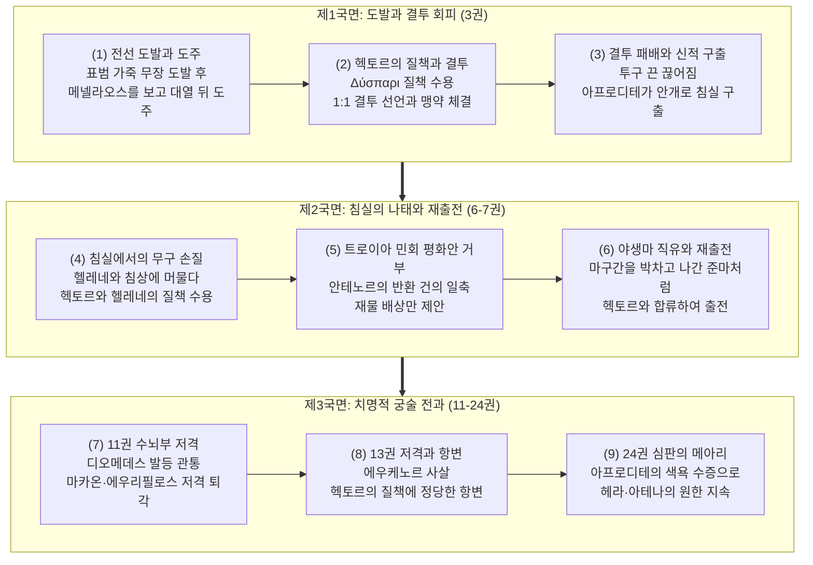
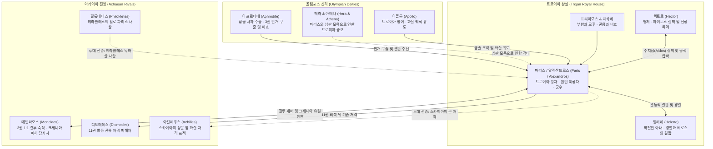

# 파리스 (Paris)

**[[greek-reading-guide|읽는 법]]**: 파리스 · **원어**: Πάρις · **학술 전사**: *Páris*

## 서사적 입구 (Narrative Entry)

호메로스의 『일리아스』에서 **파리스**(Paris)는 트로이아의 왕자이자 트로이아 전쟁 전체를 촉발한 서사의 근원적 원인 제공자이다. 그는 스파르타의 왕 [[entity-menelaos|메넬라오스]]의 궁전에 손님으로 머물며 극진한 환대를 받았으나, 신성한 손님-주인 규범인 [[concept-xenia|크세니아]]를 유린하고 왕비 [[entity-helene|헬레네]]와 막대한 보물을 약탈하여 트로이아로 달아났다. 이 범죄는 아카이아 연합군의 1천 척 원정 함대를 출항시켰을 뿐만 아니라, 최고신 제우스 크세니오스(Zeus Xenios)의 우주적 정의를 발동시켜 트로이아 도성 전체에 피할 수 없는 신벌(Tisis)의 파멸을 선고하는 종교신학적 도화선이 되었다.

그러나 파리스의 서사적 위상은 단순한 악역이나 파렴치한 유혹자에 머물지 않는다. 그는 호메로스 서사시가 탐구하는 영웅적 명예 체계([[concept-time|티메]])와 필멸자의 유한한 인간 조건(*condicio humana*) 사이의 가장 첨예한 균열을 체현하는 인물이다. 형인 [[entity-hector|헥토르]]가 트로이아 공동체와 가족을 지키기 위해 전장의 맨 앞줄에서 목숨을 바치며 집단적 수치심([[concept-aidos|아이도스]])에 결박되어 있는 반면, 파리스는 여신 [[entity-aphrodite|아프로디테]]가 내린 매혹적인 육체미와 관능적 에로스의 향유에 침잠한다. 제3권에서 메넬라오스와의 일대일 결투 직전 비겁하게 대열 뒤로 도주하다가 헥토르에게 통렬한 질책을 받을 때, 파리스는 자신의 수치를 온전히 인정하면서도 "황금의 아프로디테가 내린 빛나는 선물은 결코 버릴 수 없다"(_Il._ 3.64–66)라며 신적 결정론 뒤로 물러서는 도덕심리학적 분열을 드러낸다.

파리스의 군사적 면모 또한 극단적인 양면성을 지닌다. 그는 청동 투구와 창을 앞세운 정규 중장 백병전에서는 메넬라오스에게 압도당하여 목이 졸려 죽을 위기에서 아프로디테의 안개에 싸여 향기로운 침실로 구출되는 무력함을 보인다. 그러나 원거리 복합궁(Composite Bow)을 쥔 저격수로서의 그는 『일리아스』 제11권에서 아카이아 진영의 핵심 맹장인 [[entity-diomedes|디오메데스]]의 발등을 꿰뚫고, 명의 마카온의 어깨를 쏘아 부상을 입히며, 에우리필로스를 저격하여 전선을 일거에 붕괴 직전으로 몰아넣는 치명적인 전술적 위력을 발휘한다. 호메로스는 파리스를 통해 전통적인 귀족적 백병전 영웅주의와 실리적 살상력을 지닌 비정규 궁술 사이의 긴장, 그리고 공적 폴리스의 책무와 사적 에로스의 파괴적 충돌을 서사시 전편에 걸쳐 극적으로 각인한다.

## 1. 정의와 식별 (Definition & Identification)

- **핵심 정의**: 트로이아 국왕 [[entity-priam|프리아모스]]와 왕비 [[entity-hecabe|헤카베]]의 차남이자 헥토르의 동생. 스파르타의 헬레네를 유인·납치하여 10년간의 트로이아 전쟁을 촉발한 장본인이자, 아프로디테의 총애를 받는 뛰어난 미모의 궁수 영웅.
- **분류 및 소속**: 인물(`entity_type: person`), 트로이아 왕실의 서열 제2위 왕자, 트로이아 방어군 주요 지휘관. 신적 혈통을 이어받았으나 영웅적 불멸성([[concept-kleos|클레오스]]) 대신 찰나적 관능 쾌락과 신적 은사에 의존하는 인물.
- **서사적 출현 범위**: 『일리아스』 제3권(메넬라오스와의 결투 및 침실 구출), 제6권(침실에서의 무구 손질과 헥토르의 질책), 제7권(트로이아 민회에서의 평화안 거부), 제11권(디오메데스·마카온·에우리필로스 저격 대전과), 제13권(에우케노르 사살 및 헥토르와의 대화), 제24권(파리스의 심판 회상)에 걸쳐 핵심 서사 결절점마다 등장함. 『오뒷세이아』에서는 직접 출현하지 않으나 전쟁의 원인 제공자로서 회고됨(_Od._ 4.145, 11.438).

## 2. 명칭과 문헌학 (Philology, Epithets & Dialect)

### 2.1 희랍어 표기와 이중 명칭의 운율적 경제성

호메로스 서사시에서 파리스는 두 개의 고유 명칭, 곧 **알렉산드로스**(Ἀλέξανδρος, *Aléksandros*)와 **파리스**(Πάρις, *Páris*)를 병용한다. 이 두 명칭은 단순한 동의어가 아니라 서사시의 운율적 경제성(Metrical Economy)과 서사적 어조에 따라 엄격히 분립되어 사용된다.

- **알렉산드로스 (Ἀλέξανδρος, *Aléksandros*)**:
  - **어원 분석**: 희랍어 동사 `ἀλέξω`(*aléksō*, "막아내다, 방어하다, 물리치다")와 남성을 뜻하는 명사 `ἀνήρ`(*anḗr*, 속격 *andrós*)의 합성어로, 문자 그대로의 의미는 "**사내들을 막아내는 자**" 또는 "**사람들의 수호자** (Defender of Men)"이다. 이는 트로이아를 방어하기는커녕 도성에 파멸을 불러오는 파리스의 실제 서사적 행적과 극적인 반어(Irony)를 이룬다.
  - **운율적 기능**: 단-장-장-장(˘ ¯ ¯ ¯)의 4음절 구조를 지녀 육보격 운율의 휴지부(Caesura) 뒤나 행말 정형구 완성에 매우 유연하게 배치된다. 『일리아스』 전편에서 140회 이상 사용되며, 공적인 전사로서의 행적을 기술할 때 압도적으로 선호된다.
- **파리스 (Πάρις, *Páris*)**:
  - **어원 분석**: 비(非)그리스계 어원으로, 후기 청동기 서부 아나톨리아 루비아어(Luwian) 인명 `*Pari-zitis*`("탁월한 자, 앞선 사람")와 어원적으로 직결된다.
  - **운율적 기능**: 단-단(˘ ˘) 또는 장-단(¯ ˘)의 2음절 구조로, 서사시에서 약 45회 미만으로 제한적으로 사용된다. 주로 사적인 관계, 비난, 특히 헥토르가 형제로서 그를 질책할 때 복합어 `Δύσπαρις`(*Dúsparis*, "재앙의 파리스") 형태로 집중 출현한다.

### 2.2 고유 정형구와 호격 질책 (Epithets & Formulae)

호메로스 텍스트에서 파리스에게 부여된 정형구들은 그의 신적인 외모, 여성 편력, 도덕적 결함 및 원거리 궁수로서의 특성을 극명하게 대조한다.

| 희랍어 정형구 실제형 | 학술 전사 | 한국어 풀이 | 운율적 기능 및 문법 격 | 대표 출전 |
|:---|:---|:---|:---|:---|
| **Ἀλέξανδρος θεοειδής** | *Aléksandros theoeidḗs* | 신을 닮은 알렉산드로스 | 주격(단수), 5~6보격 행말 정형구. 외형적 아름다움과 왕실 혈통 | _Il._ 3.16, 3.27, 24.28 |
| **Δύσπαρις** | *Dúsparis* | 재앙의 파리스 / 불길한 파리스 | 호격/주격(단수). 헥토르의 도덕적 분노와 질책 | _Il._ 3.39, 13.769 |
| **εἶδος ἄριστε** | *eîdos áriste* | 겉모습만 가장 빼어난 자 | 대격+호격. 외모의 탁월함과 영웅적 내실의 결여를 대조 | _Il._ 3.39, 13.769 |
| **γυναιμανές** | *gunaimanés* | 여인에 미친 자 | 호격(단수). 관능적 에로스에 종속된 성격 규정 | _Il._ 3.39, 13.769 |
| **ἠπεροπευτά** | *ēperopeutá* | 유혹자 / 사기꾼 | 호격(단수). 신의를 저버리고 남을 속이는 자 | _Il._ 3.39, 13.769 |
| **Ἑλένης πόσις ἠϋκόμοιο** | *Helénēs pósis ēükómoio* | 머리채 고운 헬레네의 남편 | 주격/호격, 4~6보격 행말. 파리스의 정체성을 규정하는 대표 수식어 | _Il._ 3.329, 7.355, 13.766 |
| **τοξότα** | *toksóta* | 궁수 / 활 쏘는 자 | 호격(단수). 디오메데스가 그를 힐난할 때 쓰는 멸칭 | _Il._ 11.385 |

### 2.3 3권의 무장 전환과 서사적 결손 모티프

제3권에서 파리스가 출전할 때 보이는 무구의 전환은 문헌학적으로 매우 중요한 의미를 지닌다.
1. **초기 복합 무장** (_Il._ 3.16–18): 파리스는 어깨에 표범 가죽(`παρδαλέη`, *pardaléē*)을 두르고, 굽은 활(`καμπύλα τόξα`, *kampúla tóksa*)과 칼, 그리고 두 자루의 청동 투창(`δοῦρε δύω`, *doûre dúō*)을 든 비정규 유격 전사의 모습으로 등장한다.
2. **정규 결투 중무장** (_Il._ 3.330–338): 메넬라오스와의 공식 결투에 임하면서 정규 중장보병(호플리테스) 갑주를 착용하지만, 시인은 그가 **자신의 흉갑이 없어 형제 뤼카온의 흉갑을 빌려 몸에 맞추었다**(원문 `ἥρμοσε`, 학술 전사 *hḗrmose*, _Il._ 3.333)라고 명시한다.

이 '빌려 입은 흉갑'은 파리스가 온전한 정규 영웅의 자격을 갖추지 못했음을 드러내는 서사적 결손의 징표이며, 제16권에서 [[entity-patroklos|파트로클로스]]가 아킬레우스의 갑옷을 빌려 입고 출전하여 비극적 파멸을 맞는 서사시적 무구 차용(Armour-lending) 모티프의 중요한 선행 복선으로 기능한다.

## 3. 호메로스 본문에서의 모습 (Homeric Attestation & Narrative Arc)

### 3.1 『일리아스』의 서사적 궤적

#### (1) 전선 도발과 결투 도주: 3권의 희비극
3권 서두에서 파리스는 표범 가죽을 어깨에 두르고 아카이아 최강자들에게 결투를 신청하며 기세 좋게 나선다(_Il._ 3.15–20). 그러나 메넬라오스가 사자처럼 전차에서 뛰어내려 다가오는 것을 보자 사시나무 떨듯 겁에 질려 대열 뒤로 도망친다(_Il._ 3.21–37). 시인은 이를 풀숲에서 독사를 보고 기겁하여 물러서는 나그네에 비유한다.

#### (2) 헥토르의 질책과 일대일 결투 수락
형 헥토르가 다가와 "재앙의 파리스여, 차라리 태어나지 말거나 장가들기 전에 죽었어야 했다"라며 격렬한 수치심을 쏟아붓자(_Il._ 3.38–57), 파리스는 그 힐책이 온당하다고 인정하며 전쟁의 종결을 위한 메넬라오스와의 일대일 결투를 제안한다(_Il._ 3.58–75). 결투에서 메넬라오스의 창에 겉옷이 찢기고 칼이 투구에 맞아 부러진 후, 턱끈을 잡혀 질질 끌려가다 질식사할 위기에 처한다(_Il._ 3.340–372).

#### (3) 아프로디테의 구출과 침실의 에로스
그 순간 아프로디테가 개입하여 소가죽 턱끈을 끊어버리고 파리스를 짙은 안개로 감싸 트로이아 도성 안의 향기로운 침실로 데려간다(_Il._ 3.373–382). 여신은 노파로 변신하여 헬레네를 강제로 위협해 침실로 데려오고, 파리스는 전선에서 동포들이 피를 흘리는 동안 헬레네와 관능적 쾌락에 빠져든다(_Il._ 3.383–448).

#### (4) 침실에서의 무구 손질과 민회의 평화안 거부
6권에서 전선의 위기를 타개하기 위해 성내로 들어온 헥토르는 파리스가 침실에서 활과 방패를 닦고 있는 모습을 발견하고 다시 분노를 터뜨린다(_Il._ 6.313–341). 파리스는 자신의 나태를 인정하고 재출전을 준비한다. 7권 트로이아 민회에서 원로 안테노르가 전쟁을 끝내기 위해 헬레네와 재물을 돌려주자고 제안하자, 파리스는 "단호히 거절하노라"(원문 `ἀπόφημι`, 학술 전사 *apóphēmi*, _Il._ 7.362)라며 헬레네는 결코 내줄 수 없으나 스파르타에서 가져온 보물에 자신의 사재를 더해 배상하겠다고 고집한다(_Il._ 7.345–364).

#### (5) 11권의 궁술 대전과: 전선 붕괴의 주역
11권 대전투에서 파리스는 트로이아의 옛 왕 일로스의 무덤 비석 뒤에 숨어 활을 쏘아 아카이아 진영의 최고 맹장 디오메데스의 오른쪽 발등을 관통시켜 뼈와 땅을 함께 꿰뚫는다(_Il._ 11.369–378). 파리스가 숲에서 튀어나와 득의양양하게 웃자, 디오메데스는 그를 "여자 머리를 하고 활 뒤에 숨는 비겁자"라고 조롱하면서도 부상으로 인해 전선에서 퇴각한다(_Il._ 11.379–400). 이어 파리스는 의사 마카온의 오른쪽 어깨를 맞혀 쓰러뜨리고(_Il._ 11.505–507), 에우리필로스의 오른쪽 넓적다리를 관통시켜 퇴각시킴으로써(_Il._ 11.581–584) 아카이아군 수뇌부를 전멸 위기로 몰아넣는다. 마카온의 부상은 후방에 있던 아킬레우스의 주목을 끌어 파트로클로스를 전선으로 파견하게 만드는 결정적 서사적 도화선이 된다.

## 4. 관계와 소속 (Genealogy, Alliances & Networks)

### 4.1 3자 복합 관계망 다이어그램

### 4.2 주요 인물과의 관계 상세

| 관련 대상 | 인물/신격 관계 | 서사적 상호작용 및 갈등의 성격 | 관련 출전 |
|:---|:---|:---|:---|
| [[entity-hector\|헥토르]] | 형제이자 도덕적 대척점 | 파리스의 결투 도주와 나태를 볼 때마다 통렬한 수치심([[concept-aidos\|아이도스]])을 쏟아부으며 출전을 독려함. 파리스는 형의 힐책을 온전히 인정하면서도 에로스적 본성을 버리지 못함 | _Il._ 3.38–75, 6.313–368, 13.765–788 |
| [[entity-helene\|헬레네]] | 약탈한 아내이자 공범 | 헬레네는 파리스의 비겁함과 전사로서의 무능을 신랄하게 경멸하면서도, 아프로디테의 주술적 강제에 의해 그의 침상으로 이끌려 관능적 결합을 지속함 | _Il._ 3.399–447, 6.342–358 |
| [[entity-menelaos\|메넬라오스]] | 숙적이자 크세니아 피해자 | 스파르타 궁전의 주인이자 헬레네의 본남편. 파리스는 결투에서 그에게 목이 졸려 죽을 위기에 처하며, 메넬라오스는 제우스에게 배은망덕한 손님을 징벌해 줄 것을 탄원함 | _Il._ 3.15–382, 13.620–627 |
| [[entity-aphrodite\|아프로디테]] | 수호신이자 에로스의 강제자 | 파리스에게 최고의 미모와 관능적 매력을 부여하고 결투 중 목숨을 구출함. 파리스의 운명을 지배하는 절대적 후원자 | _Il._ 3.64–66, 3.373–447, 24.28–30 |
| [[entity-priam\|프리아모스]] | 부왕 | 파리스가 도성에 재앙을 불러왔음에도 불구하고 아들을 질책하기보다 신들의 뜻으로 돌리며 끝까지 감싸는 부성애를 보임 | _Il._ 3.161–165 |

## 5. 유형별 상세 (인물 전용 모듈)

### 5.1 무장 체계와 전술적 양면성
파리스는 호메로스 서사시에서 보기 드물게 **경무장 유격 궁수**와 **호플리테스 중장보병**의 무장을 오가는 복합적 전사이다.
- **무구의 이질성**: 표범 가죽 겉옷은 아나톨리아 오리엔트풍의 이국적 복식을 시사하며, 굽은 복합궁은 원거리 기습에 특화되어 있다.
- **백병전의 취약성과 궁술의 치명성**: 메넬라오스와의 정규 창검 결투에서는 압도적인 열세에 놓이지만, 엄폐물(일로스의 무덤 비석)을 활용한 장거리 궁술에서는 당대 최강의 전사들을 무력화하는 무서운 전술적 효과를 거둔다.

### 5.2 주요 연설과 내적 갈등
- **신의 선물에 대한 변호** (_Il._ 3.64–66): 헥토르의 질책에 맞서 "황금의 아프로디테의 사랑스러운 선물을 내게 비난하지 마시오. 신들의 영광스러운 선물은 신들이 직접 주는 것이니 결코 버릴 수 없으며, 인간이 제 뜻대로 얻을 수 있는 것도 아니오"라고 항변한다.
- **평화 제안에 대한 단호한 거부** (_Il._ 7.362–364): 트로이아 원로원과 민회의 압박 속에서도 헬레네만은 결코 양보할 수 없다는 완강한 개인주의적 욕망을 고수한다.

## 6. 역사적 맥락 (Historical Context & Social Institutions)

### 6.1 히타이트 제국 외교문서와 알락산두(Alaksandu) 조약
기원전 13세기 후기 청동기(LBA VIIa) 아나톨리아의 히타이트 제국 수도 하투샤(Boğazköy)에서 발굴된 쐐기문자 점토판 외교문서 **CTH 76**(기원전 1280년경)은 무와탈리 2세(Muwatalli II)와 서부 아나톨리아의 속국 **윌루사**(Wilusa, 호메로스의 *Wilios* / Ἴλιος)의 통치자 **알락산두**(Alaksandu) 사이에 체결된 조약이다.

- **인명의 역사적 대응**: '알락산두'는 고대 그리스어 인명 '알렉산드로스(Alexandros)'를 히타이트-루비아어로 음차한 형태이다. 이는 호메로스 서사시의 트로이아 왕자 알렉산드로스라는 명칭이 후대 시인의 허구적 창작이 아니라, 기원전 13세기 트로이아 지역의 지배층 사이에서 실제로 사용되던 역사적 인명 전통에 뿌리를 두고 있음을 실증한다.
- **신격 증인으로서의 아폴론**: CTH 76 조약의 수호신 목록에는 윌루사의 신격인 `Appaliuna`(아팔리우나)가 등장하며, 이는 트로이아와 파리스를 비호하는 호메로스의 신 [[entity-apollo|아폴론]]의 아나톨리아적 기원을 강력히 시사한다.

### 6.2 아르카익기 호플리테스 윤리와 궁술 폄하
『일리아스』에서 파리스의 궁술이 비겁하고 불명예스러운 것으로 묘사되는 현상은, 기원전 8세기 그리스 본토에서 성립하던 중장보병(Hoplite) 밀집 방진의 집단적 전사 윤리가 서사시에 투영된 결과이다. 근접 백병전에서 방패를 맞대고 싸우는 것을 최고의 용기([[concept-arete|아레테]])로 여긴 아르카익 초기 그리스인들은 원거리에서 몸을 숨긴 채 화살을 쏘는 궁수를 도덕적으로 열등한 존재로 규정하였다.

## 7. 고고학과 지리 (Archaeology, Topography & Material Culture)

### 7.1 트로이아 VIIa 지층의 화살촉 발굴과 복합궁
하인리히 슐리만과 만프레트 코르프만(Manfred Korfmann)의 히사를릭(Hisarlik) 발굴에 따르면, 트로이아 VIh 및 VIIa 파괴 지층에서 다량의 청동제 및 삼익형 골제 화살촉이 집중 출토되었다.
- **물질문화적 실재성**: 트로이아 요새는 성벽 상부와 하부 도시 참호(Ditch)에서 원거리 방어 사격을 위해 대규모 궁수 부대를 운용했음이 고고학적으로 입증된다.
- **아나톨리아 복합궁**: 파리스가 사용한 굽은 활(`καμπύλα τόξα`)은 동물의 뿔, 힘줄, 목재를 아교로 압착하여 제작한 아나톨리아식 복합궁으로, 미케네의 단순 장궁보다 사거리와 관통력이 월등히 뛰어났다. 이는 11권에서 디오메데스의 발뼈를 꿰뚫은 관통력의 물질적 배경이 된다.

### 7.2 루비아어(Luwian) 상형문자 인장과 이중문화성
1995년 트로이아 VIIb 지층에서 출토된 양면 루비아 상형문자 청동 인장(Bilingual Seal)은 트로이아가 그리스 문화권과 아나톨리아 루비아 문화권의 교차로에 위치했음을 입증한다. 파리스(*Pari-zitis*)와 알렉산드로스(*Alaksandu*)라는 이중 명칭의 공존은 트로이아 지배층의 다문화적·이중언어적 정체성을 물질문화적으로 뒷받침한다.

## 8. 종교학·인류학적 해석 (Religion, Cult & Anthropology)

### 8.1 제우스 크세니오스(Zeus Xenios)와 크세니아 유린의 신학
호메로스 종교관에서 손님-주인 간의 환대 규범인 크세니아는 인간 사회의 관습을 넘어 우주적 질서인 [[concept-dike|디케]](정의)를 유지하는 최고신 제우스의 신성한 법률이다.
- **우주론적 죄책 (Asebeia)**: 메넬라오스의 식탁에서 빵과 소금을 나누어 먹은 파리스가 안주인 헬레네와 보물을 약탈한 행위는 제우스 크세니오스에 대한 직접적인 모독이자 배은망덕(Acharistia)의 극치이다.
- **피할 수 없는 신벌 (Tisis)**: 메넬라오스는 결투에 임하며 "제우스 신이시여, 환대를 베푼 자에게 악행을 저지른 파리스를 징벌하시어, 훗날 태어날 인간들도 손님을 환대한 주인을 해치는 것을 두려워하게 하소서"(_Il._ 3.351–354)라고 기도한다. 트로이아의 멸망은 군사적 패배 이전에 크세니아 파괴에 따른 신학적 필연성으로 규정된다.

### 8.2 아프로디테 제의와 에로스의 폭력적 파의
파리스를 지배하는 아프로디테는 낭만적 사랑의 여신이 아니라, 인간의 이성과 의지를 송두리째 마비시키는 원초적이고 폭력적인 우주적 충동의 인격화이다. 3권 종반부에서 아프로디테가 헬레네에게 가하는 위협(_Il._ 3.413–417)은 신적 에로스가 지닌 공포와 강제성을 여실히 보여준다. 파리스는 이 신적 마력에 포섭되어 도덕적 자율성을 상실한 제의적 희생양이자 집행자로 기능한다.

## 9. 철학·윤리학적 해석 (Philosophical & Ethical Dimensions)

### 9.1 신적 은사론(Theology of Divine Gifts)과 도덕적 책임
『일리아스』 3권 64–66행의 파리스의 발언은 고대 그리스 도덕철학의 핵심 쟁점인 **이중 동기화**(Doppelmotivation)와 인간의 행위 주체성 문제를 정면으로 제기한다.
- **불가항력적 숙명론**: 파리스는 신이 내린 선물(미모와 매혹)은 인간이 선택하거나 거부할 수 없는 외재적 강제라고 변호한다.
- **철학적 기만과 회피**: 그러나 버나드 윌리엄스([[williams-1993-shame-and-necessity|Williams 1993]])와 아서 애드킨스([[adkins-1960-merit-and-responsibility|Adkins 1960]])가 지적하듯, 파리스의 논리는 신적 결정을 핑계로 자신의 탐욕과 무책임을 정당화하는 도덕적 자기기만이다.

### 9.2 수치심([[concept-aidos|아이도스]])의 지적 수용과 도덕적 마비
파리스는 헥토르의 질책을 들었을 때 "그대의 질책은 마땅하며 분수에 넘치지 않는다"(원문 `κατ᾽ αἶσαν`, 학술 전사 *kat᾽ aîsan*, _Il._ 6.333)라며 자신의 부끄러움을 지적으로 명확히 인정한다. 그러나 그는 아킬레우스나 헥토르처럼 그 수치심을 영웅적 행동으로 승화시키지 못하고, 곧바로 관능적 쾌락으로 도피한다. 이는 이성적 인식(Phren/Noos)이 정념적 충동(Eros/Ate)에 의해 압도당하는 호메로스적 인간관의 비극적 분열을 보여준다.

### 9.3 공적 폴리스 윤리와 사적 에로스의 갈등
제임스 레드필드([[redfield-1975-nature-and-culture|Redfield 1975]])의 분석에 따르면, 헥토르가 가족과 국가라는 '문화(Culture)'의 총체를 지키기 위해 사적 행복을 희생하는 반면, 파리스는 도성 전체의 생존을 자신의 사적 에로스 충족을 위한 담보로 전락시킨다. 파리스는 공동체적 가치와 개인의 쾌락주의가 양립할 수 없음을 드러내는 문명론적 경계 인물이다.

## 10. 후대 전승과 수용 (Post-Homeric Tradition & Reception)

호메로스 이후의 에픽 사이클([[concept-epic-cycle|Epic Cycle]]), 고전기 비극, 로마 문학은 호메로스가 생략하거나 축약한 파리스의 생애를 대대적으로 확장하고 재구성하였다.

### 10.1 에픽 사이클의 전승
- 『**키프리아**』 (*Cypria*): 헤카베가 불타는 횃불을 낳는 태몽을 꾼 후 갓 태어난 파리스를 이데산에 버렸으나 목동들에 의해 양육되었다는 '버려진 왕자' 모티프, 펠레우스와 테티스의 결혼식에서 일어난 '불화의 사과' 사건, 그리고 이데산에서 세 여신(헤라, 아테나, 아프로디테) 중 아프로디테를 선택한 '파리스의 심판' 전승을 정식화함.
- 『**아이티오피스**』 (*Aethiopis*): 트로이아의 스카이아이 성문 앞에서 아폴론 신의 유도를 받은 파리스의 화살이 아킬레우스의 발목을 관통하여 영웅을 사살하는 장면을 묘사함.
- 『**소일리아스**』 (*Little Iliad*): 아카이아 진영으로 복귀한 [[entity-philoktetes|필록테테스]]가 쏜 헤라클레스의 독화살에 맞아 치명상을 입음. 옛 아내였던 님프 오이노네(Oenone)를 찾아가 치료를 간청했으나 거절당하고 비참하게 사망함.

### 10.2 아테네 비극과 헬레니즘·로마 문학의 변용
- **에우리피데스의 비극**: 『트로이아 여인들』과 『알렉산드로스』에서 파리스는 트로이아 멸망의 저주받은 원흉으로 묘사되며, 『헬레네』에서는 파리스가 트로이아로 데려간 것이 진짜 헬레네가 아니라 구름으로 빚은 허상(Eidolon)이었다는 변형 전승을 수용함.
- **오비디우스의** 『**헤로이데스**』 (*Heroides*): 제16서(파리스가 헬레네에게)와 제17서(헬레네가 파리스에게)에서 세련되고 감미로운 언변을 구사하는 엘레지풍의 유혹자로 재해석됨.
- **베르길리우스의** 『**아이네이스**』 (*Aeneid*): 트로이아의 트라우마를 회고하며 파리스를 조국의 멸망을 불러온 치명적인 불씨로 규탄함.

## 11. 학술 논쟁 (Scholarly Debates & Contradictions)

### 11.1 『일리아스』 24.25–30행의 '파리스의 심판' 진위 논쟁

> [!WARNING] 모순/이설 발견: 파리스의 심판 전승 층위 및 24권 25–30행 진위 논쟁
> 『일리아스』 24권 25–30행의 파리스의 심판 언급은 고대 알렉산드리아의 문헌학자 아리스타르코스(Aristarchus) 이래 근대 분석파 학자들에 의해 키프리아의 영향을 받은 후대 삽입구(Interpolation)로 비판받았으나, 현대 통일파 학자들은 호메로스가 청중의 전통적 공유 지식을 바탕으로 헤라와 아테나의 집요한 트로이아 증오의 기원을 해명하기 위해 배치한 유기적 결말 장치로 변호합니다.

- **분석파(Analytic)의 입장** (Wilamowitz, Leaf):
  - 『일리아스』 1~23권 전체에서 신들의 편 가르기는 신화적 심판 때문이 아니라 영웅들의 개별적 제물 봉헌과 혈통적 친소 관계에 의해 설명된다.
  - 24권 30행에 등장하는 '파멸적 색욕'을 뜻하는 단어 `μάχλοσύνη`(*makhlosúnē*)는 호메로스 서사시 전체에서 오직 이 구절에만 나타나는 유일 어휘(Hapax Legomenon)이며, 매우 노골적이고 비호메로스적인 도덕적 비난 어조를 띤다.
- **통일파(Unitarian) 및 구비시학의 입장** (Reinhardt 1938, Janko 1992):
  - 호메로스는 '파리스의 심판' 설화를 이미 잘 알고 있었으나, 서사시의 비극적 긴장을 인간 영웅들의 행위와 분노에 집중시키기 위해 의도적으로 전면에 내세우지 않고 배경으로 억제하였다.
  - 서사시의 대단원인 24권에 이르러 프리아모스와 아킬레우스의 화해를 앞두고, 여전히 트로이아의 멸망을 갈망하는 헤라와 아테나의 비타협적 분노를 정당화하기 위해 심판 모티프를 간결하게 환기한 것이다.

## 12. 증거 매트릭스 (Evidence Matrix)

| 주장 및 테제 | 자료 유형 | 근거 및 출전 | 확실성 등급 | 관련 위키 문서 |
|:---|:---|:---|:---|:---|
| 파리스의 이중 명칭 사용 빈도 및 운율적 기능 차이 | 호메로스 본문/언어학 | _Il._ 전편 통계 (알렉산드로스 140회 vs 파리스 45회) | 원전 명시 | [[entity-paris\|파리스]] |
| 3권 뤼카온 흉갑 차용 무장 전환과 서사적 결손 | 호메로스 본문 | _Il._ 3.16–20, 3.330–338 (`ἥρμοσε δ᾽ αὐτῷ`) | 원전 명시 | [[entity-patroklos\|파트로클로스]] |
| 메넬라오스와의 일대일 결투 패배 및 아프로디테의 구출 | 호메로스 본문 | _Il._ 3.340–382 | 원전 명시 | [[entity-menelaos\|메넬라오스]], [[entity-aphrodite\|아프로디테]] |
| 트로이아 민회에서의 헬레네 반환 거부 및 재물 배상 고집 | 호메로스 본문 | _Il._ 7.345–364 (`ἄντικρυς δ᾽ ἀπόφημι`) | 원전 명시 | [[lee-junseok-2024-iliad-jeongam\|이준석 2024]] |
| 11권 디오메데스 발등 관통 저격 및 전선 이탈 유발 | 호메로스 본문 | _Il._ 11.369–400 | 원전 명시 | [[entity-diomedes\|디오메데스]] |
| 11권 명의 마카온 어깨 저격 부상 및 파트로클로스 출전 촉발 | 호메로스 본문 | _Il._ 11.505–520 | 원전 명시 | [[entity-patroklos\|파트로클로스]] |
| 11권 에우리필로스 넓적다리 관통 저격 | 호메로스 본문 | _Il._ 11.581–584 | 원전 명시 | [[lee-junseok-2024-iliad-jeongam\|이준석 2024]] |
| 13권 예언자 코이라노스의 아들 에우케노르 궁술 사살 | 호메로스 본문 | _Il._ 13.660–672 | 원전 명시 | [[entity-paris\|파리스]] |
| 제우스 크세니오스 환대 질서 유린의 종교신학적 죄책 | 호메로스 본문/연구 | _Il._ 3.351–354, 13.620–627; [[scott-1982-philos-philotes-xenia\|Scott 1982]] | 원전 명시 | [[concept-xenia\|크세니아]], [[concept-dike\|디케]] |
| 아프로디테 선물론(_Il._ 3.64–66)과 도덕심리학적 분열 | 호메로스 본문/철학 | _Il._ 3.59–66, 6.333; [[williams-1993-shame-and-necessity\|Williams 1993]] | 원전 명시 | [[concept-aidos\|아이도스]], [[concept-time\|티메]] |
| 히타이트-윌루사 알락산두 조약(CTH 76)과의 인명 대응 | 물질자료/비문 | 하투샤 쐐기문자 점토판 CTH 76 (BC 1280경) | 강한 학술 추론 | [[lee-junseok-2024-iliad-jeongam\|이준석 2024]] |
| 루비아어 계통 인명(*Pari-zitis*) 및 트로이아 VIIa 복합궁 유물 | 물질자료/언어학 | 트로이아 VIIb 루비아 인장, VIIa 화살촉 발굴 | 강한 학술 추론 | [[vernant-1989-belle-mort\|Vernant 1989]] |
| 24권 25–30행 '파리스의 심판' 구절의 통일파 vs 분석파 층위 논쟁 | 현대 학술 연구 | Reinhardt(1938), Janko(1992) | 논쟁적 | [[entity-paris\|파리스]] |
| 아킬레우스 발목 저격 사살 및 필록테테스 독화살 사망 | 후대 전승/수용 | 에픽 사이클 『아이티오피스』, 『소일리아스』, 비극 | 후대 수용 | [[entity-achilles\|아킬레우스]], [[entity-philoktetes\|필록테테스]] |
| 헤카베 횃불 태몽, 이데산 목동 양육 및 님프 오이노네 설화 | 후대 전승/수용 | 에픽 사이클 『키프리아』, 아폴로도로스, 오비디우스 | 후대 수용 | [[entity-paris\|파리스]] |

## 관련 항목

- **인물 및 신격**:
  - [[entity-hector|헥토르 (Hector)]] — 트로이아의 총사령관이자 파리스의 형제, 도덕적 대척점
  - [[entity-helene|헬레네 (Helene)]] — 스파르타의 왕비이자 파리스가 약탈한 아내
  - [[entity-menelaos|메넬라오스 (Menelaos)]] — 스파르타의 군주이자 파리스와 결투를 벌인 피해 당사자
  - [[entity-priam|프리아모스 (Priam)]] — 트로이아의 국왕이자 파리스의 부왕
  - [[entity-aphrodite|아프로디테 (Aphrodite)]] — 파리스에게 매혹을 부여하고 결투에서 구출한 수호신
  - [[entity-apollo|아폴론 (Apollo)]] — 트로이아의 궁수들을 비호하고 아킬레우스 사살을 조력한 신
  - [[entity-achilles|아킬레우스 (Achilles)]] — 트로이아 전쟁 최고의 영웅이자 파리스의 화살에 쓰러진 적장
  - [[entity-diomedes|디오메데스 (Diomedes)]] — 11권에서 파리스의 활에 발등을 꿰뚫린 아카이아의 맹장
  - [[entity-patroklos|파트로클로스 (Patroklos)]] — 마카온의 부상으로 출전하게 되어 전사한 아킬레우스의 전우
  - [[entity-philoktetes|필록테테스 (Philoktetes)]] — 헤라클레스의 활로 파리스를 사살한 아카이아의 궁수
- **핵심 개념 및 윤리**:
  - [[concept-xenia|크세니아 (Xenia)]] — 파리스가 유린한 신성한 환대 규범
  - [[concept-aidos|아이도스 (Aidos)]] — 헥토르가 환기하고 파리스가 지적으로 수용한 수치심
  - [[concept-time|티메 (Time)]] — 전사 사회의 명예 체계와 파리스의 사적 에로스 간의 갈등
  - [[concept-dike|디케 (Dike)]] — 제우스 크세니오스가 트로이아에 내린 우주적 정의와 신벌
  - [[concept-kleos|클레오스 (Kleos)]] — 필멸의 영웅이 추구하는 불멸의 명예
  - [[concept-epic-cycle|에픽 사이클 (Epic Cycle)]] — 트로이아 전쟁의 전말을 다룬 서사시군
- **관련 연구 문헌**:
  - [[lee-junseok-2024-iliad-jeongam|이준석 (2024), 『일리아스 정암학당 역주』]]
  - [[lee-junseok-2018-wrath-and-pity|이준석 (2018), 『호메로스의 일리아스 읽기: 분노와 연민』]]
  - [[williams-1993-shame-and-necessity|Bernard Williams (1993), *Shame and Necessity*]]
  - [[adkins-1960-merit-and-responsibility|Arthur W. H. Adkins (1960), *Merit and Responsibility*]]
  - [[cairns-1993-aidos|Douglas L. Cairns (1993), *Aidos: The Psychology and Ethics of Honour and Shame in Ancient Greek Literature*]]
  - [[redfield-1975-nature-and-culture|James M. Redfield (1975), *Nature and Culture in the Iliad: The Tragedy of Hector*]]
  - [[scott-1982-philos-philotes-xenia|Marianne Scott (1982), *Philos, Philotes and Xenia*]]
  - [[vernant-1989-belle-mort|Jean-Pierre Vernant (1989), *L'individu, la mort, l'amour: Soi-même et l'autre en Grèce ancienne*]]
