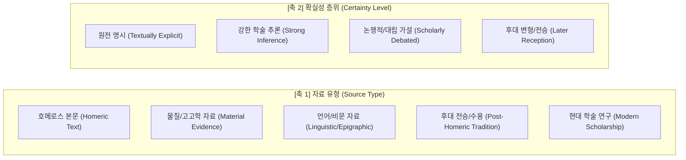

# 호메로스 위키 엔티티 프레임워크 지침 (Entity Framework Guide)

이 문서는 호메로스 위키(`wiki/entities/`)에 축적되는 모든 고유명 식별 대상(인물, 신적 존재, 장소, 집단, 사물, 생물/괴물)의 생성, 분류, 서술 구조, 학문적 렌즈 적용 및 증거 검증 체계를 규정하는 공식 메타 지침입니다.

---

## 1. 기본 원칙과 문서 경계

### 1.1 엔티티(Entity)의 정의
엔티티는 서사 세계 또는 역사적 지평에서 **고유하게 식별되는 구체적 대상**을 의미합니다.
- **포함 대상**:
  - **인물(Person)**: 아킬레우스, 헥토르, 오디세우스, 페넬로페, 아가멤논 등
  - **신적 존재(Deity)**: 제우스, 아테나, 포세이돈, 칼립소, 스카만드로스(신격) 등
  - **장소(Place)**: 트로이아(일리오스), 이타카, 올림포스산, 스파르타, 스카만드로스강(지형) 등
  - **집단 및 민족(Group/Polity)**: 아카이아인, 트로이아인, 미르미도네스인, 파이아케스인 등
  - **사물 및 유물(Object/Artifact)**: 아킬레우스의 방패, 아가멤논의 홀, 오디세우스의 활, 팔라디온 등
  - **생물 및 괴물(Creature/Monster)**: 퀴클롭스(폴뤼페모스), 스킬라, 카리브디스, 케이론 등
- **배제 대상**:
  - 추상적 윤리 규범 및 가치 체계는 `wiki/concepts/` (예: [[concept-aidos|Aidos]], [[concept-menis|Menis]], [[concept-nemesis|Nemesis]], [[concept-hikesia|Hikesia]])에 수록합니다.
  - 서사적 사건, 비교 비평, 학술 논쟁 총괄은 `wiki/analyses/` (예: [[homeric-ethics-literature-review]])에 수록합니다.

### 1.2 단일 지칭 대상 원칙 (Single Referent Principle)
동일한 이름이 지형과 신격을 동시에 가리키는 경우(예: 스카만드로스강 vs 하신 크산토스/스카만드로스), 개념적 혼선을 방지하기 위해 지칭 대상별로 독립 문서를 원칙으로 하거나 명확히 구획합니다.

### 1.3 "공통 코어 + 유형별 모듈 + 학문별 렌즈" 구조
모든 엔티티에 모든 학문 분과의 내용을 억지로 채워 넣지 않습니다.
- **공통 코어 (필수)**: 식별, 명칭, 원전 본문 행적, 관계망
- **유형별 모듈 (필수)**: 대상 유형(인물/신/장소 등)에 특화된 고유 서사 정보
- **학문별 렌즈 (조건부 활성화)**: 문헌학, 역사학, 고고학, 종교·인류학, 철학·윤리학 등 신뢰할 수 있는 학술적 근거가 존재하는 섹션만 밀도 높게 활성화

---

## 2. 프론트매터 표준 스키마

모든 엔티티 문서는 상단에 다음 YAML 프론트매터를 필수로 선언합니다:

```yaml
---
title: 표제어 (원어/희랍어 / 라틴문자)
aliases: [영어명, 희랍어명, 대안 표기, 주요 수식어/별칭]
tags: [type/entity, domain/iliad, domain/odyssey, status/active]
created: YYYY-MM-DD
updated: YYYY-MM-DD
sources: [관련_raw_문서_또는_연구문헌_목록]
status: active
entity_type: person | deity | place | group | object | creature
corpus: [iliad, odyssey]
---
```

---

## 3. 표준 13개 섹션 구조

```text
# 표제어

## 1. 정의와 식별 (Definition & Identification) [필수]
## 2. 명칭과 문헌학 (Philology, Epithets & Dialect) [필수]
## 3. 호메로스 본문에서의 모습 (Homeric Attestation & Narrative Arc) [필수]
## 4. 관계와 소속 (Genealogy, Alliances & Networks) [필수]
## 5. 유형별 상세 (Type-Specific Narrative Details) [필수]
## 6. 역사적 맥락 (Historical Context & Social Institutions) [선택]
## 7. 고고학과 지리 (Archaeology, Topography & Material Culture) [선택]
## 8. 종교학·인류학적 해석 (Religion, Cult & Anthropology) [선택]
## 9. 철학·윤리학적 해석 (Philosophical & Ethical Dimensions) [선택]
## 10. 후대 전승과 수용 (Post-Homeric Tradition & Reception) [선택]
## 11. 학술 논쟁 (Scholarly Debates & Contradictions) [근거 존재 시 필수]
## 12. 증거 매트릭스 (Evidence Matrix) [권장]
## 13. 관련 항목 (See Also) [필수]
```

---

## 4. 유형별 전용 모듈 가이드 (5섹션)

| 엔티티 유형 (`entity_type`) | 필수 수록 세부 항목 |
|:---|:---|
| **인물 (person)** | 영웅적 신분과 역할, 주요 연설(*parrhesia*) 및 결투, 내적 갈등, 죽음과 사후 운명 |
| **신적 존재 (deity)** | 권능 영역(*timai*), 신적 계보, 올림포스 위계, 인간 후원/징벌 방식, 변신과 현현(*epiphany*) |
| **장소 (place)** | 본문 지형 묘사, 항해/이동 경로, 정치적 소속 및 주민, 후보 유적 및 동일시 논쟁 |
| **집단 (group)** | 명칭 어원과 포괄 범위, 지휘관, 전함 수(목록시), 전투 편제, 집단 정체성 및 타자 표상 |
| **사물 (object)** | 재질과 제작자(신적/인간), 소유권 전승 이력, 교환/증여 맥락, 상징 및 서사적 행위성 |
| **생물/괴물 (creature)** | 외형적 형태, 서식 공간 및 경계적 특성, 조우 규칙, 상징적 의미와 신화적 병행 전승 |

---

## 5. 2축 증거 평가 체계 (Evidence Framework)

엔티티 문서 내 모든 학술적 진술은 **자료 유형(Source Type)**과 **확실성(Certainty Level)**의 두 축을 엄격히 구분하여 기술합니다.



### 5.1 증거 매트릭스 표 서식 (12섹션 표준)
```markdown
## 12. 증거 매트릭스

| 주장 및 테제 | 자료 유형 | 근거 및 출전 | 확실성 | 관련 위키 문서 |
|:---|:---|:---|:---|:---|
| 아킬레우스의 두 가지 운명 선택 | 호메로스 본문 | _Il._ 9.410–416 | 원전 명시 | [[lee-junseok-2018-wrath-and-pity|이준석 2018]] |
| 묘역 숭배(Hero Cult)의 형성기 | 물질자료/비문 | 흑해 레우케섬 발굴, BC 7세기 | 강한 학술 추론 | [[vernant-1989-belle-mort|Vernant 1989]] |
| 9권 사절단 거부의 윤리학적 성격 | 현대 학술 연구 | Adkins(1960) vs Williams(1993) | 논쟁적 | [[homeric-ethics-literature-review]] |
```

---

## 6. 핵심 안전장치 및 작성 수칙

1. **서사적 실재와 역사적 실재의 혼동 금지**:
   - 아킬레우스나 헥토르 같은 서사 인물을 실존 역사 인물로 단정하지 않습니다.
   - 고고학적 유물(예: 멧돼지 송곳니 투구, 미케네 전차 등)은 인물의 실존 증거가 아니라 서사시가 보존한 **물질문화적 지평**으로 서술합니다.
2. **원전 텍스트 우선주의 (Homeric Primacy)**:
   - 후대 전승(비극 작가, 아폴로도로스, 베르길리우스, 스타티우스 등)의 내용을 호메로스 원전과 뒤섞지 않고, 제10섹션(후대 전승과 수용)에서 명확히 분리합니다.
3. **철학적 개념 투사의 경계**:
   - 고대 인물이 현대 칸트주의나 공리주의를 사유한 것처럼 쓰지 않고, 서사시 본문 구절에서 표출되는 행위 주체성, 명예 체계, 도덕 심리학적 갈등으로 정밀하게 기술합니다.
4. **이모지(Emoji) 절대 금지**:
   - 제목, 본문, 섹션 헤딩, 표, 다이어그램, 콜아웃 등 전 문서에서 이모지를 일체 사용하지 않습니다.

---

## 7. 관련 항목

- [[_template]] — 엔티티 표준 마크다운 템플릿
- [[entity-achilles|achilles]] — 아킬레우스 표준 엔티티 문서 (기준 예시)
- [[overview]] — 호메로스 위키 메인 대시보드
- [[index]] — 전체 문서 카탈로그
- [[homeric-ethics-literature-review]] — 호메로스 윤리학 종합 분석
