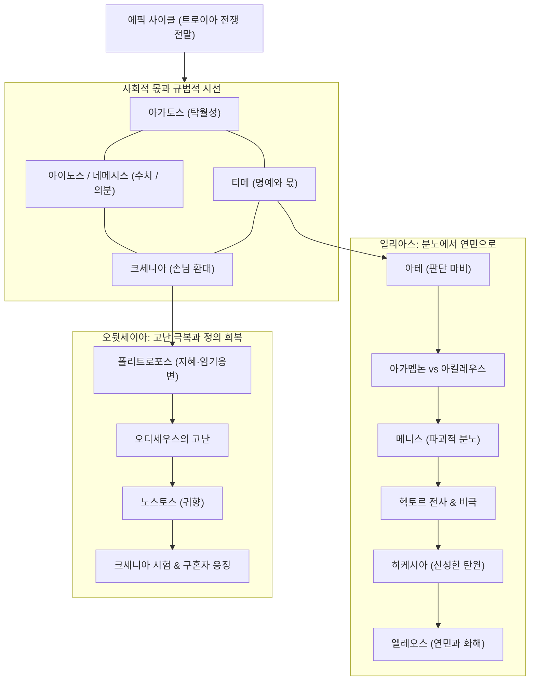

# 서사시 개요

호메로스(Homer, Ὅμηρος)의 두 서사시 *일리아스*와 *오뒷세이아*, 그리고 그 세계를 관통하는 영웅 윤리 체계와 서사적 궤적을 조망하는 대시보드입니다. 링크는 실제로 작성된 문서에만 연결되어 있습니다.

한국어명·관용 라틴명·그리스어·학술 전사의 역할 및 읽기 방식은 [[greek-reading-guide|그리스어 읽기 안내]]에서 설명합니다.

---

## 서사 및 윤리 지형도

호메로스 영웅 사회를 지탱하는 핵심 규범 체계와 *일리아스*, *오뒷세이아*의 서사적 동역학을 나타낸 구조도입니다.

### 지형도 구조와 작동 원리

- **상위 사회·우주적 규범 체계**:
  - 영웅적 탁월자([[concept-agathos|아가토스]])는 사회적 인정과 명예의 몫([[concept-time|티메]])을 추구합니다.
  - 이 인정 투쟁은 공동체의 수치심([[concept-aidos|아이도스]])과 공적 의분([[concept-nemesis|네메시스]])이라는 상호 감시망 속에서 통제되며, 낯선 이와의 관계는 신성한 환대([[concept-xenia|크세니아]]) 규범으로 규율됩니다.
- **일리아스의 서사 축 (분노와 연민의 궤적)**:
  - 신들이 내린 일시적 판단 마비([[concept-ate|아테]])로 [[entity-agamemnon|아가멤논]]이 [[entity-achilles|아킬레우스]]의 티메를 침해하면서 신적 분노([[concept-menis|메니스]])가 촉발됩니다.
  - 메니스는 파괴적 연쇄를 낳아 [[entity-hector|헥토르]]의 전사와 트로이아의 비극으로 이어지며, 24권에서 프리아모스의 신성한 탄원([[concept-hikesia|히케시아]])을 통해 비극적 연민([[concept-eleos|엘레오스]])과 장례 의례로 승화됩니다.
- **오뒷세이아의 서사 축 (지혜와 귀향·정의의 궤적)**:
  - 다재다능한 지혜와 적응력([[word-polytropos|폴리트로포스]])을 지닌 [[entity-odysseus|오디세우스]]가 10년간의 방랑 속에서 고난을 돌파하고 귀향을 완수합니다.
  - 이타카 궁정에서 손님 환대([[concept-xenia|크세니아]]) 규범을 파괴한 구혼자들을 심판하고 왕권과 가정을 회복합니다.
- **에픽 사이클의 배경**:
  - [[concept-epic-cycle|에픽 사이클]]은 [[entity-paris|파리스]]의 심판과 트로이아 함락을 포함하여 두 서사시를 감싸는 거대한 신화적 시공간을 제공합니다.

---

## 일리아스 (Iliad)

트로이아 전쟁 10년 차, 아킬레우스의 분노(Mênis, μῆνις)와 약 51일간의 비극적 사건.

- 중심 인물: [[entity-achilles|아킬레우스]], [[entity-agamemnon|아가멤논]], [[entity-hector|헥토르]], [[entity-paris|파리스]]. 전체 인물 현황은 [[wiki/index#인물|위키 색인]]에서 확인합니다.
- 서사를 관통하는 핵심 개념: [[concept-time|티메]], [[concept-ate|아테]], [[concept-menis|메니스]], [[concept-aidos|아이도스]], [[concept-nemesis|네메시스]], [[concept-hikesia|히케시아]], [[concept-eleos|엘레오스]]
- 관련 어원·수용사: [[word-achilles|Achilles]], [[word-hector|Hector]], [[word-ate|Ate]], [[word-eleos|Eleos]], [[word-time|Time]]

## 오뒷세이아 (Odyssey)

트로이아 함락 뒤 오디세우스의 귀향(Nostos, νόστος)과 이타카 궁정의 질서 회복.

- 중심 인물: [[entity-odysseus|오디세우스]]. 전체 인물 현황은 [[wiki/index#인물|위키 색인]]에서 확인합니다.
- 서사를 관통하는 핵심 개념: [[concept-xenia|크세니아]], [[concept-hikesia|히케시아]], [[concept-agathos|아가토스]], [[concept-aidos|아이도스]]
- 관련 어원·수용사: [[word-odyssey|Odyssey]], [[word-polytropos|Polytropos]], [[word-agathos|Agathos]]
- 추가 연구: [[analysis-polytropos|폴리트로포스 추가 연구]]

---

## 작성된 핵심 개념 (10종)

- [[concept-time|티메]] (τιμή) — 신적 배당과 인정 경제의 가치 체계
- [[concept-menis|메니스]] (μῆνις) — 우주적 질서를 흔드는 신적 분노
- [[concept-aidos|아이도스]] (αἰδώς) — 수치심, 경외, 자기억제
- [[concept-nemesis|네메시스]] (νέμεσις) — 몫과 질서를 수호하는 공적 의분
- [[concept-hikesia|히케시아]] (ἱκεσία) — 신체 접촉을 통한 신성한 탄원
- [[concept-xenia|크세니아]] (ξενία) — 손님 환대와 상호부조
- [[concept-eleos|엘레오스]] (ἔλεος) — 연민과 오익토스
- [[concept-agathos|아가토스]] (ἀγαθός) — 영웅적 탁월자와 결과주의적 성공
- [[concept-ate|아테]] (ἄτη) — 신들이 내린 일시적 판단 마비와 치명적 과오
- [[concept-epic-cycle|에픽 사이클]] (ἐπικὸς κύκλος) — 트로이아 전쟁 전말을 잇는 서사시 연작

---

## 이어서 읽기

- [[wiki/index|위키 색인]]
- [[words/index|어원 사전]]
- [[analysis-homeric-ethics-literature-review|호메로스 윤리학 문헌 고찰]]
- [[analysis-concept-source-matrix|개념과 문헌]]
- [[analysis-polytropos|폴리트로포스 추가 연구]]
- [[word-odyssey|Odyssey 어원·수용사]]
- [[word-polytropos|Polytropos 어원·수용사]]
- [[entity-odysseus|오디세우스]]
- [[entity-achilles|아킬레우스]]
- [[entity-agamemnon|아가멤논]]
- [[entity-hector|헥토르]]
- [[entity-paris|파리스]]

## 관련 항목

- [[wiki/index|위키 색인]]
- [[words/index|어원 사전]]
- [[analysis-homeric-ethics-literature-review|호메로스 윤리학 문헌 고찰]]
- [[analysis-concept-source-matrix|개념과 문헌]]
