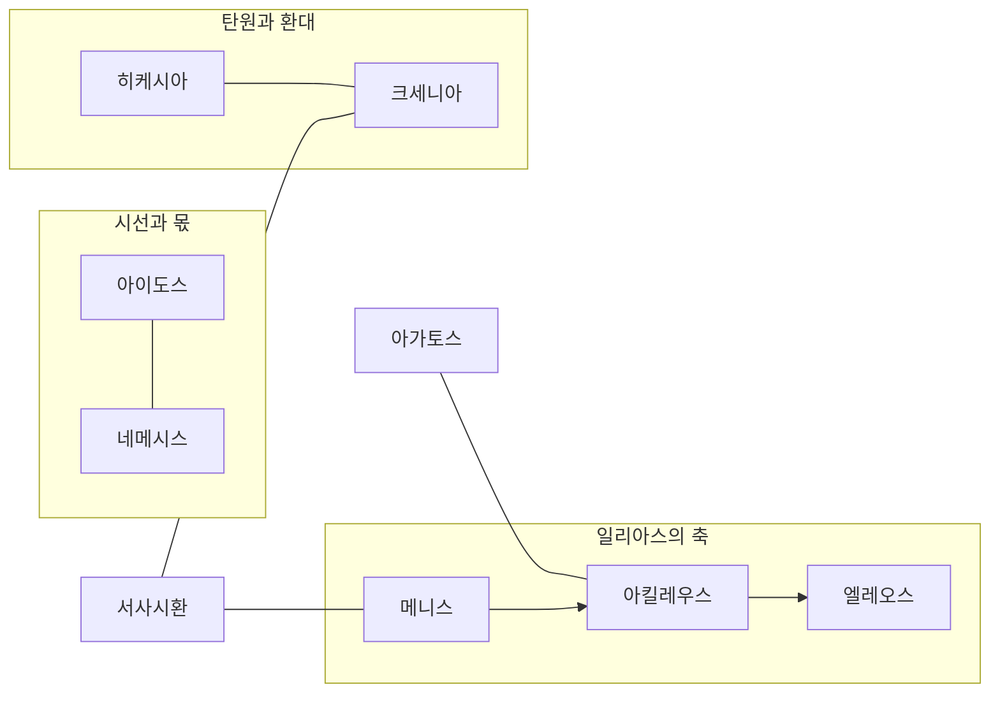

# 서사시 개요

호메로스(Homer, Ὅμηρος)의 두 서사시 *일리아스*와 *오뒷세이아*, 그리고 그 세계를 묶는 영웅 윤리 개념의 지도입니다. 링크는 작성된 문서에만 걸었습니다.

---

## 개념 성좌

작성된 개념 여덟과 [[entity-achilles|아킬레우스]]만 그립니다. 자리는 고정입니다. 점 그래프처럼 밀고 당기지 않습니다.

선의 종류:

- 상자 안 실선: 짝 개념. [[concept-aidos|아이도스]]와 [[concept-nemesis|네메시스]], [[concept-hikesia|히케시아]]와 [[concept-xenia|크세니아]].
- 화살: 서사의 이행. [[concept-menis|메니스]]가 아킬레우스를 밀고, 24권에서 [[concept-eleos|엘레오스]]로 꺾입니다. [[lee-junseok-2018-wrath-and-pity|이준석 2018]].
- [[concept-agathos|아가토스]]는 영웅적 탁월자의 자리로 아킬레우스에 붙습니다.
- [[concept-epic-cycle|서사시환]]은 테두리입니다. 일리아스 쪽은 메니스, 오뒷세이아 쪽은 크세니아로 잇습니다.
- 그림에 없는 겹침: 아이도스·히케시아·엘레오스는 24권 탄원에서 한 장면에 모입니다. 선이 그림을 가로지르지 않게 범례에만 적습니다.

아직 없는 표제어(아레테, 클레오스, 티메, 디케, 노스토스, 모이라 등)와 헥토르·오디세우스는 자리가 비어 있습니다. 문서가 생기면 이 그림에 올립니다.

---

## 일리아스 (Iliad)

트로이 전쟁 10년 차, 아킬레우스의 분노(Mênis, μῆνις)와 약 51일간의 사건.

- 중심 인물: 아킬레우스. 헥토르, 아가멤논, 오디세우스, 파트로클로스, 프리아모스는 아직 독립 항목이 없습니다.
- 서사를 밀어 가는 개념: 메니스, 히케시아, 엘레오스, 아이도스

## 오뒷세이아 (Odyssey)

트로이 함락 뒤 오디세우스의 귀향(Nostos, νόστος)과 이타카의 복수.

- 오디세우스, 페넬로페, 텔레마코스 항목은 아직 없습니다.
- 관련 개념: 크세니아, 히케시아, 아이도스

---

## 작성된 핵심 개념

- [[concept-menis|메니스]] (μῆνις) — 신적 분노
- [[concept-hikesia|히케시아]] (ἱκεσία) — 탄원
- [[concept-aidos|아이도스]] (αἰδώς) — 수치심과 경외
- [[concept-nemesis|네메시스]] (νέμεσις) — 공적 의분
- [[concept-eleos|엘레오스]] (ἔλεος) — 연민
- [[concept-agathos|아가토스]] (ἀγαθός) — 영웅적 탁월자
- [[concept-xenia|크세니아]] (ξενία) — 손님 환대
- [[concept-epic-cycle|서사시환]] (ἐπικὸς κύκλος) — 트로이 전쟁 연작

---

## 이어서 읽기

- [[wiki/index|위키 색인]]
- [[words/index|어원 사전]]
- [[analysis-homeric-ethics-literature-review|호메로스 윤리학 문헌 고찰]]
- [[analysis-concept-source-matrix|개념과 문헌]]

## 관련 항목

- [[wiki/index|위키 색인]]
- [[analysis-homeric-ethics-literature-review|호메로스 윤리학 문헌 고찰]]
- [[analysis-concept-source-matrix|개념과 문헌]]
